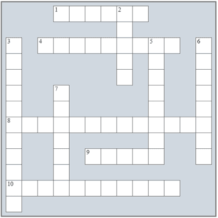

## 面向对象编程回顾

### 回顾填字游戏

1)解决以下填字游戏。

横向

1)一个类实例。

4)这允许你在不改变函数体的情况下改变函数的行为或扩展其功能。

8)创建新对象的过程。

9)一个对象的属性。

10)__init__()方法的名字。

向下

2)在构造函数外部声明的字段被称为 ______ 字段。

3)类 __________  允许你使用另一个类作为基类来编写类。

5)对象-___________ 编程是一种关注对象的编程风格。

6)在构造函数内部声明的字段被称为 ______ 字段。

7)对象执行的动作。

### 回答问题

回答以下问题。

1)什么是面向对象编程？

2)类的构造函数是什么？

3)Python 中的装饰器做什么？

4)在什么情况下你必须使用点符号来写字段名？

5)self 关键字是什么？

6)解释类字段和实例字段之间的区别。

7)为什么在面向对象编程（OOP）中不应该暴露字段？

8)获取器和设置器方法是什么？

9)Python 中的属性做什么？

10)“类继承”这个术语是什么意思？
