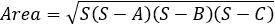
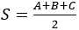

## 第四十章

更多关于文件的内容

### 40.1 文件的一般练习

#### 练习 40.1-1 计算 10 个数字的总和

假设有一个名为“f_data40.1-1.txt”的文件，其中包含 10 个三位整数（由单个空格字符分隔）。文件结构的示例如下。

131 500 122 152 127 191 111 290 156 161

编写一个 Python 程序，计算并显示它们的总和。

解答

有两种方法可以遍历此文件中的数字。

第一种方法

在这种方法中，一个名为 values 的字符串变量获取文件整行的内容。然后，在 for 循环中使用切片机制将内容分割成单独的三位数。然后使用 int()函数将这些数字转换为整数，以计算它们的总和。

 file_40.1-1a

PATH = "c:/temp/"

fin = open(PATH + "f_data40.1-1.txt")

values = fin.readline()

fin.close()

total = 0

for i in range(10):

total += int(values[i * 4 : i * 4 + 3])

print(total)

第二种方法

使用 for 循环读取和处理文件中的每个 10 个整数。在循环内部，fin.read(3)方法从文件中读取下一个 3 个字符。由于文件包含三位整数，这读取了一个整数。int()函数将读取的字符串转换为整数，然后将其添加到总和中。接下来，for 循环中的第二个语句读取并忽略分隔整数的空格字符。

 file_40.1-1b

PATH = "c:/temp/"

fin = open(PATH + "f_data40.1-1.txt")

total = 0

for i in range(10):

total += int(fin.read(3))   #读取 3 个字符

space = fin.read(1)  #读取并忽略空格字符

fin.close()

print(total)

#### 练习 40.1-2 计算未知数量数字的平均值

假设有一个名为“f_data40.1-2.txt”的文件，其中包含数字，每行一个，除了最后一行包含短语“文件结束”。文件结构的示例如下。

16

13.172

33.5

.

.

文件结束

编写一个 Python 程序，计算并显示它们的平均值。

解答

根据第 28.3 节中讨论的“终极”规则，while 循环应该如下，以一般形式给出。

sNumber = fin.readline()

while sNumber != "文件结束":

一个语句或语句块

sNumber = fin.readline()

最终程序如下。

 file_40.1-2

PATH = "c:/temp/"

fin = open(PATH + "f_data40.1-2.txt")

total = 0

count = 0

sNumber = fin.readline()

while sNumber != "文件结束":

total += float(sNumber)

count += 1

sNumber = fin.readline()

fin.close()

if count > 0:

print(total / count)

#### 练习 40.1-3 查找最小和最大值

假设有一个名为“f_data40.1-3.txt”的文件，其中包含数字，每行一个。文件结构的示例如下。

16

13.172

33.5

.

.

Write a Python program that finds the greatest and lowest values and stores them in a file named “output.txt” in the following form

33.5  13.172

Assume that there is at least one value in the file “f_data40.1-3.txt”.

Solution

The final program is as follows.

 file_40.1-3

PATH = "c:/temp/"

fin = open(PATH + "f_data40.1-3.txt")

#Read the first value

maximum = float(fin.readline())

minimum = maximum

#Read the rest of the values, line by line

for sNumber in fin:

number = float(sNumber)

if number > maximum:

> maximum = number

if number < minimum:

> minimum = number

fin.close()

#Write the greatest and lowest value in a file

fout = open(PATH + "output.txt", "w")

fout.write(str(maximum) + " " + str(minimum))

fout.close()

#### Exercise 40.1-4 Concatenating Files

Suppose there are two text files named “text1.txt” and “text2.txt”. Write a Python program that concatenates the contents of the two files and writes the concatenated text in a third file named “final.txt”, placing the contents of the file “text1.txt” before the contents of the file “text2.txt”.

Solution

This exercise can be solved using several approaches. Let's see two of them.

First approach

The program opens the file “text1.txt”, reads all of its contents, assigns them to the variable contents, and then closes the file. Next, it opens the file “text2.txt”, reads all of its contents, concatenates them with the previous ones (those in the variable contents), and closes the file. Finally, it opens the file “final.txt” and writes the concatenated contents in it, as shown in the program that follows.

 file_40.1-4a

PATH = "c:/temp/"

fin = open(PATH + "text1.txt")

contents = fin.read()

fin.close()

fin = open(PATH + "text2.txt")

contents += fin.read()  #Concatenation

fin.close()

fout = open(PATH + "final.txt", "w")

fout.write(contents)

fout.close()

Second approach

The program that follows opens all the three files at the beginning, writes the concatenated contents, and then closes them.

 file_40.1-4b

PATH = "c:/temp/"

fin1 = open(PATH + "text1.txt")

fin2 = open(PATH + "text2.txt")

fout = open(PATH + "final.txt", "w")

fout.write(fin1.read() + fin2.read())

fout.close()

fin2.close()

fin1.close()

The order in which you close the files doesn't need to correspond to the order in which you opened them. You can open, for example, the file “text2.txt” first, and close it last, or open it first and close it first.

#### Exercise 40.1-5 Searching in a File

In the United States, the Social Security Number (SSN) is a nine-digit identity number applied to all U.S. citizens in order to identify them for the purposes of Social Security. Suppose there is a file named “SSN.txt” that contains the SSNs (Social Security Numbers) of all citizens of the state of California, as well as their full name, one record on each line. An example of the structure of the file is shown here.

123456789 Aristides Bouras

123000000 Loukia Ainarozidou

121212121 John Papas Junior

.

.

编写一个 Python 程序，提示用户输入要搜索的 SSN 的前几位数字，然后在该文件中进行搜索并显示所有以这些数字开头的公民的姓名和姓氏。

解决方案

在这个特定的练习中，如果用户输入了完整的九位 SSN 进行搜索，并且找到了这个 SSN，程序必须显示相应公民的姓名和姓氏，并停止搜索。另一方面，如果用户输入少于九位数字进行搜索，程序必须搜索并显示所有以这些数字开头的公民的姓名和姓氏。这个练习的解决方案如下。

 file_40.1-5

PATH = "c:/temp/"

ssnToSearch = input("输入要搜索的 SSN：")

length = len(ssnToSearch)

fin = open(PATH + "SSN.txt")

found = False

for line in fin:

ssn = line[:9]

fullName = line[10:]

#如果找到了

if ssnToSearch == ssn[0:length]:

> print(fullName, end = "")  #变量 fullName 已经包含一个换行符
> 
> found = True
> 
> #如果要搜索的 SSN 包含 9 位数字并且找到了，退出循环
> 
> if length == 9:
> 
> > break

fin.close()

if not found:

print("未找到！")

#### 练习 40.1-6 使用子程序组合文件

做以下操作：

i)编写一个名为 readContent 的子程序，它接受一个文件的名称并返回其内容。

ii)编写一个名为 writeContent 的子程序，它接受一个文件的名称和一个字符串，并将该字符串写入文件。

iii)使用上述子程序，编写一个 Python 程序，提示用户输入两个文件的名称，然后将第一个文件的内容复制到第二个文件中。假设用户输入了有效的文件名。

解决方案

尽管这个特定的练习看起来相当简单，但有必要强调一些关于 readContent()函数的事情。检查下面的 readContent()函数，并尝试找出它包含的错误。这个错误是一个逻辑错误，而不是语法错误。这个函数在没有 Python 解释器抛出任何语法错误的情况下成功执行。然而，错误确实存在，并且很难发现！

def readContent(filename):

fin = open(filename)

return fin.read()

fin.close()

这里发生的情况是，当执行返回语句时，Python 会忽略函数中的其余语句，这意味着文件可能不会关闭。想象一下在程序中多次调用这个特定的函数。你最终会得到许多永远不会关闭的打开文件。

Python 的最新版本可能会在没有引用（fin）的情况下自动关闭文件，但留下文件打开并等待 Python 为您关闭它是一种不良做法。

一个好的做法是将返回语句放在函数的末尾，如下面的程序所示。

 file_40.1-6

def readContent(filename):

fin = open(filename)

contents = fin.read()

fin.close()

return contents

def writeContent(filename, contents):

fout = open(filename, "w")

fout.write(contents)

fout.close()

#主代码从这里开始

source = input("Enter source filename: ")

destination = input("Enter destination filename: ")

c = readContent(source)        #相当于：

writeContent(destination, c)    #writeContent(destination, readContent(source))

### 40.2 复习练习

完成以下练习。

1)假设有一个名为“f_data40.2-1.txt”的文件，其中包含 10 个两位整数（由单个空格字符分隔）。以下是该文件结构的示例。

13 55 12 61 12 19 80 91 15 16

编写一个 Python 程序，计算并显示大于 50 的平均值。

2)假设有一个名为“f_data40.2-2.txt”的文件，其中包含三位整数（由逗号字符分隔）。以下是该文件结构的示例。

130,501,322,415,527,191

编写一个 Python 程序，计算并显示那些在 300 到 500 之间的平均值。假设文件中至少有一个数字。

3)假设有一个名为“f_data40.2-3.txt”的文件，其中包含班级学生的成绩和全名（由逗号字符分隔），每行一个记录。以下是该文件结构的示例。

96,George Papas

100,Anna Maria Garcia

89,Peter Smith

.

.

编写一个 Python 程序，找到并显示班级中最好和最差学生的全名。假设文件中至少有一个记录，并且所有成绩都是不同的。

4)运输公司的 IT 管理员需要一个程序从名为“f_data40.2-4.txt”的文件中提取有关公司运输物品的有用信息。假设该文件包含每个物品的宽度、长度、高度和描述。物品的尺寸以英寸为单位，每个尺寸在文件中占用 4 个字符（整数部分 2 个字符，小数点 1 个字符，小数位 1 个字符）。以下是该文件结构的示例：

110.5 011.2 020.9 盒子编号 37（塑料瓶）

022.6 023.1 040.2 容器编号 23（6 个玻璃瓶）

009.5 156.6 020.0 包裹编号 12（易碎物品）

024.2 020.1 030.1 容器编号 29（玻璃瓶）

编写一个 Python 程序：

i)提示用户输入一个关键字以在物品描述中进行搜索。例如，如果用户输入单词“glass”，则程序必须显示以下消息

关键词'glass'找到！

容器编号 23（6 个玻璃瓶）- 尺寸：22.6 x 23.1 x 40.2

容器编号 29（玻璃瓶）- 尺寸：24.2 x 20.1 x 30.1

ii)找到并显示每个物品的体积（以立方英尺为单位）。消息必须格式化如下：

每个物品的体积：

盒子编号 37（塑料瓶）：体积 = 14.9686 立方英尺

容器编号 23（6 个玻璃瓶）：体积 = 12.1451 立方英尺

包裹编号 12（易碎物品）：体积 = 17.2187 立方英尺

容器编号 29（玻璃瓶）：体积 = 8.472940 立方英尺

iii)找到并显示所有项目的总体积（以立方英尺为单位）。

iv)找到并显示体积最大的盒子的描述。

请记住，一立方英尺等于 1728 立方英寸。

5)编写一个 Python 程序，提示用户输入两个文件的文件名。然后程序必须将两个文件的 内容连接起来，并将连接后的文本写入名为“final.txt”的第三个文件中，将第一个文件的内容放在第二个文件的内容之后。如果用户提供的文件名不包含“ .txt”扩展名，程序必须显示错误消息。

6)假设有一个名为“f_data40.2-6.txt”的文件，其中包含 15 个数字，每个数字占一行。编写一个 Python 程序，使用冒泡排序算法将这些数字按升序排序，并将排序后的值写入同一文件中，位于初始未排序值下方。

7)假设有一个名为“f_data40.2-7.txt”的文件，其中包含八个城市的名称以及它们在特定一天的最高温度。文件的结构示例如下。

纽约

82.3

华盛顿特区

84.3

.

.

因此，奇数行包含城市名称，偶数行包含每个城市的最高温度。编写一个 Python 程序，逐行读取文件，并将城市名称和温度分别存储在“cities”和“temperatures”列表中。假设文件中至少有一个城市名称及其对应温度。然后程序必须

i)计算并显示所有城市的平均气温。

ii)找到并显示最高温度以及所有具有该温度的城市名称。

8)有些单词如“革命性的”和“国际化”非常长，反复书写它们会相当累人。如果单词的长度超过 10 个字符，则认为该单词过长。在这种情况下，必须用特殊缩写替换该单词：你保留单词的首尾字母，并在它们之间插入字母的数量。例如，“革命性的”变为“r11y”，“国际化”变为“i18n”。

假设有一个名为“f_data40.2-8.txt”的文件，其中包含英文文本。执行以下操作：

i)编写一个名为“abbreviate”的子程序，它接受一个单词，如果它超过 10 个字符长，则返回其缩写；否则返回相同的单词。

ii)使用上述子程序，编写一个 Python 程序，从文件中读取文本，并显示所有长单词的缩写形式。

假设单词之间由单个空格字符分隔。

9)Pig Latin 是一种在讲英语的国家中常用的有趣的语言游戏。它涉及根据一组简单的规则改变单词的字母。以下是翻译单词到 Pig Latin 的规则：

►如果单词以元音开头，只需将“way”添加到单词的末尾。例如，“apple”变为“appleway”。

►如果单词以一个或多个辅音开头，将辅音（s）移动到单词的末尾并添加“ay”。例如，“banana”变为“ananabay”和“flower”变为“owerflay”。

假设有一个名为“f_data40.2-9.txt”的文件，其中包含英文文本。执行以下操作：

i)编写一个名为 pigLatinTranslator 的子程序，该程序接受一个英语单词并返回相应的 Pig Latin 翻译。

ii)使用上述子程序，编写一个 Python 程序，该程序从文件中读取文本，并将相应的 Pig Latin 翻译写入名为“pig_latin_translation.txt”的文件。

假设文本仅包含英文字母的小写字母，单词之间由单个空格字符分隔。

10)给定两个字符串，X = "ABCDEFGHIJKLMNOPQRSTUVWXYZ" 和 Y = "JKWCTAMEDXSLFBYUNG RZOIQVHP"，你可以加密任何消息。持有 Y 字符串的人可以通过将字符串 X 中的字母逐个映射到字符串 Y 来解密加密消息。更具体地说，字母“A”被加密为“J”，字母“B”为“K”，字母“C”为“W”，依此类推。根据这种加密方法，编写一个 Python 程序，提示用户输入一条消息，然后将加密消息写入名为“encrypted.txt”的文件。空格字符不得加密，应保持原样。

11)编写一个 Python 程序，该程序解密上一个练习（在文件“encrypted.txt”中）的消息，并将解密后的消息写入名为“decrypted.txt”的文件。

12)编写一个名为 copyFile 的子程序，该程序接受两个参数（源和目标），然后使用名称 destination 创建源文件的新副本。

13)假设有一个名为“f_data40.2-13.txt”的文件，其中包含三角形所有三边的长度（每行一个）。文件结构的示例如下。

16.0

20.6

22.7

执行以下操作

i)编写一个名为 Triangle 的类，包括

a)一个构造函数，从文件中读取三个边并将其分配给三个名为 _sideA、_sideB 和 _sideC 的私有字段。

b)编写一个名为 canBeTriangle 的方法，该方法检查并返回 True，当字段 _sideA、_sideB 和 _sideC 的值可以作为三角形的三边长度时。否则必须返回 False。

提示：在任何三角形中，每边的长度都小于其他两边长度的总和。

c)编写一个名为 displayLengths 的 void 方法，该方法显示三边的长度以及一个消息，指出这些长度是否可以是三角形的三边长度。

d)编写一个名为 displayArea 的 void 方法，如果长度可以是三角形的三边长度，则计算并显示三角形的面积。你可以使用近 2000 年来已知的赫伦公式！

.

其中 S 是半周长 

e)一个名为 displayPerimeter 的 void 方法，如果长度可以是三角形的三边长度，则计算并显示三角形的周长。

ii)使用上述类，编写一个 Python 程序，显示关于三角形的所有可用信息。
