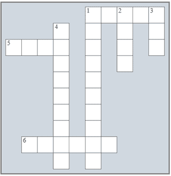

## 在“文件”部分复习

### 填字游戏复习

1)解决以下填字游戏。

横向

1) 完成从文件读取后，你总是需要 ______ 文件。

5) 这个指针与列表的索引非常相似。

6) 有两种类型的文件，文本文件和 ______ 文件。

纵向

1) 这就是文本文件包含的内容。

2) 这项操作必须在任何读取/写入操作之前执行。

3) 当你以追加模式打开文件时，文件指针位于文件的 ______ 处。

4) 文件存储在这种存储设备中。

### 复习问题

回答以下问题。

1)什么是文本文件？

2)文本文件有什么用途？

3)close()方法究竟做了什么？

4)read()方法和 readline()方法有什么区别？

5)你学过多少种遍历文件内容的方法？每种方法给出一个示例。
