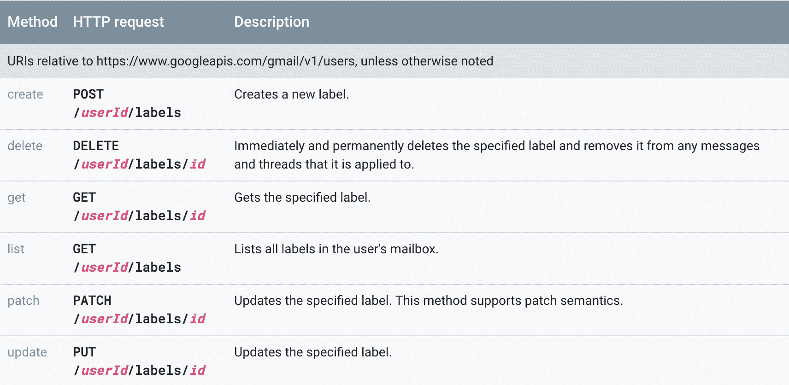
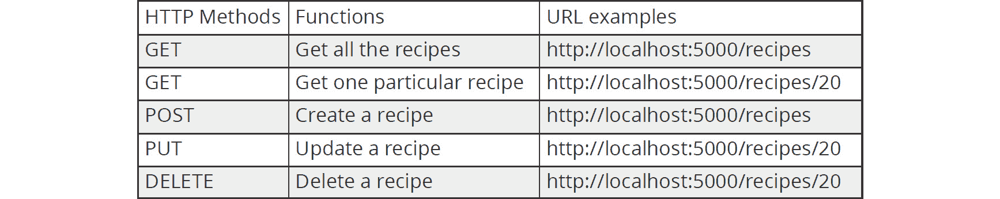
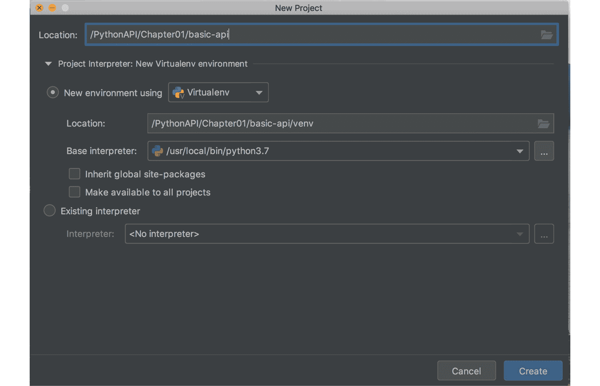
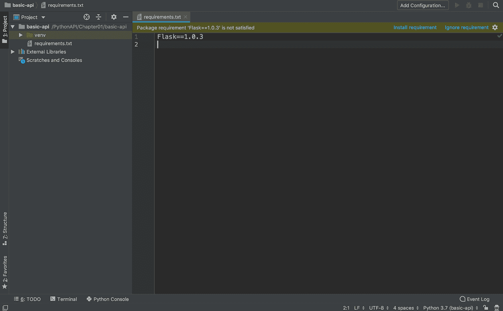
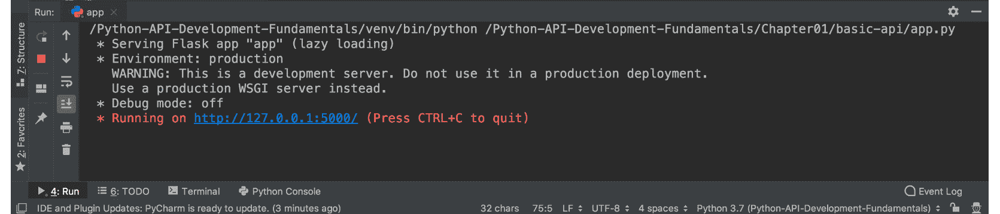
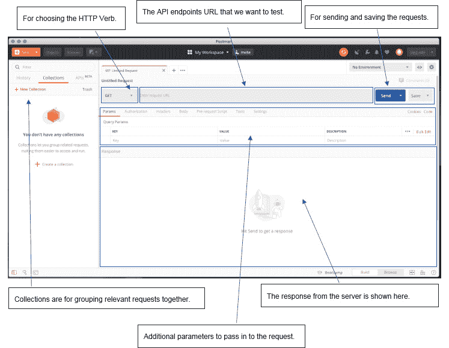
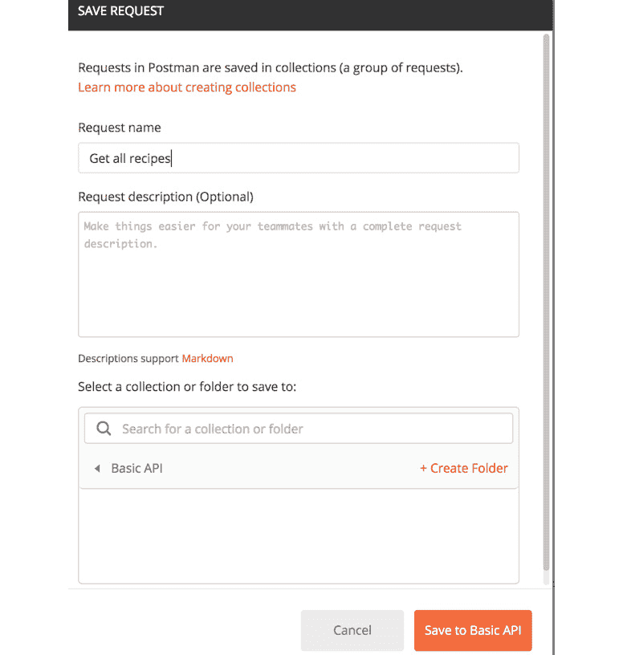
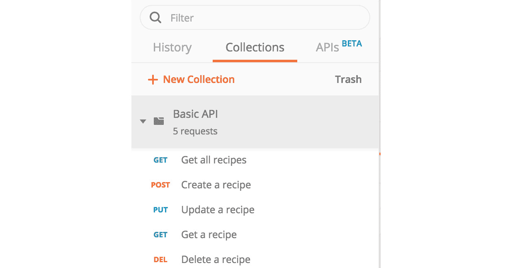

# 1. 您的第一步

## 学习目标

到本章结束时，您将能够：

+   复制 RESTful API 的概念

+   描述不同 HTTP 方法和状态的意义

+   在 PyCharm IDE 中获得实际操作经验

+   使用 Flask 构建 RESTful API 并执行 CRUD 操作

+   使用 JSON 消息与 API 进行通信

+   使用 Postman 和 httpie/curl 命令行工具测试 API 端点

本章介绍了 API，并解释了网络服务、API 和 REST 的概念。

## 简介

我们处于互联网时代，一个万物互联的世界。数据无缝地从一地流向另一地。我们只需在网站上点击几下，就能获取世界上所有的信息。以 Skyscanner 为例，我们只需输入旅行的日期和地点，它就能在瞬间找到最便宜的航班；背后提供这些数据的英雄就是 API。

在本章中，您将学习什么是网络服务、API 和 REST。我们将从教授 API 的基本概念开始。然后，我们将探讨不同网络服务（如 Google、Facebook 等）如何使用 REST API 的实际例子。

最后，我们将使用 Python 开发我们的第一个简单的 Python RESTful API。Python 是一种流行且功能强大的编程语言。除了在人工智能领域广泛使用外，它还在 Web 应用程序开发、大数据分析、网络爬虫和流程自动化等方面得到广泛应用。Python 在众多领域表现出色的原因是它拥有大量的框架。这些框架承担了所有繁重的工作，这使得开发者能够专注于实际的应用程序设计和开发。

在本章中，您将了解数据是如何在前端和后端之间编码和通信的。您将学习有关 JSON 格式、HTTP 协议、HTTP 状态码等的技术细节。所有开发工作都将使用 Postman 和 httpie/curl 进行验证和测试。我们将带您了解整个 Web 应用程序开发过程。您不仅将学习开发 RESTful API 的必要方面，还将学习思考过程、设计、开发、测试，甚至部署。这是一次学习完整软件开发生命周期的旅程。现在就让我们踏上这段激动人心的旅程吧！

## 理解 API

API 代表应用程序编程接口；它是网站（或移动应用程序）与后端逻辑通信的接口。简单来说，它就像一个信使，从用户那里接收请求并将其发送到后端系统。一旦后端系统响应，它将把响应传递给用户。这个比喻就像服务员，能够理解不同顾客的订单。然后，他们将在顾客和厨房里的厨师之间充当中间人。

如果你是一家餐厅的老板，在客户和厨房之间有服务员/女服务员在这里的好处是，客户将不会看到你的商业机密。他们不需要知道餐点是如何准备的。他们只需要通过服务员/女服务员下单，他们就会得到他们订购的餐点。在这种情况下，服务员就像 API 一样。以下图示有助于说明这个类比。


###### 图 1.1：服务员作为客户 API 的体现

类似地，在计算机科学中，拥有 API 的一个关键好处是封装。我们封装逻辑，这样外面的人就无法看到它。在这种安排下，拥有敏感信息的大公司愿意通过 API 向世界提供服务，自信他们的内部信息不会被泄露。以 Skyscanner 为例，该公司对使用 API 让客户预订航班感到满意，但与此同时，存储在他们内部数据库中的其他客户的个人信息不会泄露。

API 也是一个标准接口，可以与不同类型的终端进行通信，它们可以是移动应用程序或网站。只要前端向 API 发送相同的请求，它就会得到相同的结果。如果我们回到我们的比喻，服务员/女服务员将为所有类型的客户提供服务，无论他们的性别、年龄、语言等等。

现在，假设你是 Skyscanner 的一名软件工程师，负责开发 API。你的工作会是什么？让我告诉你。你的工作将是编写一个程序，可以从客户通过网站接收预订请求（日期和位置），然后在 Skyscanner 数据库中查找匹配的航班，并将航班详情返回给客户。在这本书的整个过程中，你将是我们的 API 工程实习生。我们将一步一步地引导你通过开发一个可以服务于你系统用户的 RESTful API 项目的流程。

## RESTful API

REST 代表表示状态传输。它最初在 2000 年 Roy Fielding 博士的论文（网络软件架构的设计和架构风格）中被定义。这篇论文被认为是网络领域的圣经。REST 不是一个标准或协议；它更像是一种软件架构风格。许多工程师遵循这种架构风格来构建他们的应用程序，例如 eBay、Facebook 和 Google Maps。这些网络应用程序每秒处理巨大的流量，所以你可以看到 REST 确实是一种可扩展的架构风格。当我们说 RESTful API 时，我们指的是符合 REST 约束/原则的 API。

### REST 约束/原则

对于 REST 架构风格，有五个重要的约束/原则：

+   客户端-服务器：客户端和服务器之间存在一个接口。客户端和服务器通过这个接口进行通信，彼此独立。只要接口保持不变，任何一方都可以被替换。请求总是来自客户端。

+   无状态：对于请求没有状态的概念。每个请求都被视为独立且完整的。它不依赖于前一个请求，也不依赖于会话来维持连接状态。

+   可缓存：为了提高性能，服务器或客户端上的事物可以缓存。

+   分层系统：系统中可以有多个层次，这里的目的是隐藏实际的逻辑/资源。这些层可以执行不同的功能，例如缓存和加密。

+   统一接口：接口保持不变。这有助于解耦客户端和服务器逻辑。

## HTTP 协议

为了更好地理解 REST 是什么，并确保我们正在实现 REST 风格，我们可以简单地谈谈 HTTP 协议。HTTP 是 REST 架构风格的实现。它代表超文本传输协议，是互联网上使用的标准协议。我们每天都在使用它来浏览不同的网站。这就是为什么我们访问的所有网站都以 http 开头。

在 HTTP 协议中，有不同的服务请求方法类型。每种服务请求方法都有其特定的定义。当前端界面通过 URL 与后端 API 交互时，它们需要同时定义此请求的 HTTP 方法。不同的 HTTP 方法就像不同的服务窗口。例如，读取和创建数据是完全不同的服务，因此应该由不同的服务窗口处理，即不同的 HTTP 方法。

+   `GET`: 用于读取数据

+   `POST`: 用于创建数据

+   `PUT`: 通过用新内容完全替换数据来更新数据

+   `PATCH`: 通过部分修改一些属性来更新数据

+   `DELETE`: 用于删除数据

简而言之，不同的 HTTP 方法就像 REST API 的动词。它们用于对同一组数据执行不同的操作。

## HTTP 方法和 CRUD

我们可以通过利用 HTTP 协议已经提供的内容轻松构建 RESTful API。让我们看看我们可以用来与服务器通信的 HTTP 方法。

在这本书中，我们将构建一个以 RESTful API 作为后端的食谱分享平台。这个平台将允许用户创建和分享他们自己的食谱。同时，用户还可以阅读其他用户分享的食谱。以这个食谱分享平台为例，为了实现这些功能，我们需要我们的 API 能够对食谱执行不同的操作。我们可以利用不同的 HTTP 方法。例如，我们可以使用`GET`方法请求`http://localhost:5000/recipes`以获取所有食谱。我们可以使用`POST`方法请求`http://localhost:5000/recipes`来创建一个新的食谱。我们还可以使用`DELETE`方法请求`http://localhost:5000/recipes/20`来删除 ID 为 20 的食谱。请参考以下表格以获取详细信息。

![图 1.2：HTTP 方法

![img/C15309_01_02.jpg]

###### 图 1.2：HTTP 方法

我们可以看到，让后端 API 为我们工作很简单。我们可以简单地使用 HTTP 协议来传达我们的请求。

实际上，使用这个食谱分享平台，你可以看到我们需要的绝大多数操作都将围绕创建（CREATE）、读取（READ）、更新（UPDATE）和删除（DELETE）展开。这在所有其他 Web 应用程序中也是普遍适用的。在开发者社区中，我们简称为 CRUD。简而言之，CRUD 模型了数据库记录管理的生活周期。

以这种方式构建我们的 Web 应用程序可以帮助我们轻松构建一个功能性的 Web 系统，因为这些操作与 HTTP 方法相关。使用这种架构构建我们的应用程序简单、强大且易于阅读。

如你所能想象，我们需要将信息发送到后端服务器。例如，你可能想在后端数据库中存储一个食谱。你通过 HTTP 以与后端预先约定的格式发送食谱。预先约定的格式可以理解为我们在之前的比喻中与服务员沟通时所使用的语言。在现实生活中，我们有不同的语言，如英语、德语、中文等。我们需要说对方能理解的语言。在 Web API 领域，有两种流行的标准，JSON 和 XML。我们将主要讨论 JSON，因为它更易于阅读且被广泛采用。

## JSON 格式

**JavaScript 对象表示法**（**JSON**）是一种能够表示复杂数据结构的简单纯文本格式。我们可以使用这种格式来表示字符串、数字、数组，甚至对象。一旦我们将信息“JSON 化”，我们就可以使用这种广泛采用的格式与 API 进行通信。

我们将向您展示 JSON 格式文件的样子。在以下示例中，您将看到我们正在用 JSON 格式表示两个食谱。JSON 文档是一个纯文本文档；这里没有加密。它如此易于阅读，以至于我相信您已经可以判断出来（无需进一步解释）这里有两个食谱，每个食谱都有一个 ID、名称和描述。

这里有一些关于 JSON 语法的注意事项：

+   数组被`[]`包围

+   对象可以用`{}`表示

+   名称/值总是成对存在，并由"`:`"分隔

+   字符串被""包围

以下是一个带有 JSON 语法的示例代码文件：

```py
{
  "recipes":[
    {
      "id":1,
      "name":"Egg Salad",
      "description":"Place an egg in a saucepan and..."
    },
    {
      "id":2,
      "name":"Tomato Pasta",
      "description":"Bring a large pot of lightly salted water to a boil..."
    }
  ]
}
```

## HTTP 状态码

HTTP 状态码是在 HTTP 协议中返回的代码。它通常对用户隐藏，所以你可能没有意识到它的存在。事实上，来自服务器的每个 HTTP 响应都包含一个状态码。在我们构建 RESTful API 时，我们需要遵守 HTTP 协议。状态码帮助前端客户端了解请求的状态，即成功或失败。例如，可能有一个关于在后端数据库中创建记录的客户端请求。在这种情况下，一旦数据库记录成功创建，服务器应返回 HTTP 状态码 201（已创建）。如果有错误（例如 JSON 文档中的语法错误），服务器应返回 HTTP 状态码 400（错误请求）。

### 常用 HTTP 状态码

让我们讨论一些常用的状态码。它们如下：

+   200 OK 表示请求已成功。请求可以是 GET、PUT 或 PATCH。

+   201 已创建表示 POST 请求已成功，并已创建记录。

+   204 无内容表示 DELETE 请求已成功。

+   400 错误请求表示客户端请求有误。例如，JSON 格式中有语法错误。

+   401 未授权表示客户端请求缺少认证信息。

+   403 禁止访问表示请求的资源被禁止访问。

+   404 未找到表示请求的资源不存在。

## 开放 API

开放 API 是一个对第三方开放的 API。市面上有很多这样的 API。公司渴望开放他们的 API 以扩大用户基础，同时保持他们的源代码为私有。这些 API 我们也可以访问。让我们看看一些来自 Facebook 的 API。

例如，我们可以使用 HTTP GET 方法访问`https://graph.facebook.com/{page_id}/feed`，这将给我们提供`ID = {page_id}`的 Facebook 页面的动态。我们可以通过使用`POST`方法向`https://graph.facebook.com/{page_id}/feed`发送 HTTP 请求，然后在`ID = {page_id}`的 Facebook 页面上创建一个帖子。

#### 注意

Facebook 粉丝页面 API 详情可在[`developers.facebook.com/docs/pages/publishing`](https://developers.facebook.com/docs/pages/publishing)找到。

现在，让我们看看另一个互联网巨头，谷歌。谷歌也提供了一些我们可以用来管理邮箱中电子邮件标签的 Gmail API。以下是 Gmail API 文档的截图：



###### 图 1.3：Gmail API 文档

#### 注意

Gmail 标签 API 可在[`developers.google.com/gmail/api/v1/reference/`](https://developers.google.com/gmail/api/v1/reference/)找到。

## Flask Web 框架

Flask 是一个我们可以用来轻松构建网络应用程序的网络框架。网络应用程序通常需要一些核心功能，例如与客户端请求交互、将 URL 路由到资源、渲染网页以及与后端数据库交互。像 Flask 这样的网络应用程序框架提供了必要的包、模块，它们负责繁重的工作。因此，作为开发者，我们只需要关注实际的应用逻辑。

当然，市场上还有其他可用的网络框架。Flask 的一个强大竞争对手是 Django。它也是一个 Python 网络框架。我们选择在本书中使用 Flask 的原因是因为 Flask 是简约的。它被视为一个仅提供开发者起步所需的绝对必要包的微网络框架。正因为如此，它易于学习，非常适合初学者。

之后，如果我们想构建更多的功能，有大量的 Flask 扩展可供选择。随着我们在本书中的学习深入，您将看到 Flask 的强大之处。

## 构建简单的菜谱管理应用程序

让我们做一些简单的练习来测试你的知识。我们将在这本书中构建一个菜谱分享平台，API 是我们向公众公开的接口。我们首先定义我们想要提供的函数和相应的 URL。这些是我们可能需要的最基本的功能：



###### 图 1.4：HTTP 方法与函数

一个典型的菜谱应该具有以下属性

+   `ID`：菜谱的唯一标识符

+   `名称`：菜谱的名称

+   `描述`：菜谱的描述

我们将构建一个 API，列出存储在我们系统中的所有菜谱。该 API 将设计为根据不同的 URL 返回不同的结果。例如，`http://localhost:5000/recipes` 将给我们系统中存储的所有菜谱，而 `http://localhost:5000/recipes/20` 将给我们 `ID = 20` 的菜谱。在成功检索菜谱后，我们还将看到 HTTP 状态设置为 200（OK）。这表明我们的请求已成功。

当我们创建一个新的菜谱时，我们使用 HTTP POST 方法，将所有必要的参数以 JSON 格式查询 `http://localhost:5000/recipes` 来描述我们的菜谱。JSON 格式简单来说就是键/值对。如果我们的请求成功，菜谱将在后端创建，并将返回 HTTP 状态 201（已创建）。与 HTTP 状态一起，它还将以 JSON 格式发送刚刚创建的菜谱。

当我们更新一个菜谱时，我们使用 HTTP PUT 方法，将更新菜谱的所有必要参数以 JSON 格式发送到 `http://localhost:5000/recipes/20`。如果我们的请求成功，菜谱将在后端更新，并将返回 HTTP 状态 200（OK）。与 HTTP 状态一起，它还将以 JSON 格式发送更新的菜谱。

当我们删除一个菜谱时，我们可以使用 HTTP Delete 方法将数据发送到 `http://localhost:5000/recipes/20`。这将删除 `ID = 20` 的菜谱。

现在您知道我们将要走向何方，让我们挽起袖子，大干一场吧！

### 虚拟环境

开发者始终建议在虚拟环境中开发他们的应用程序，而不是直接在本地环境中开发。

原因是虚拟环境是独立的应用程序开发环境。我们可以在本地机器上创建多个虚拟环境，这些虚拟环境可以有自己的 Python 版本、自己的包、自己的环境变量等等。尽管它们建立在同一台本地机器上，但这些虚拟环境之间不会相互干扰。

在接下来的练习中，我们将在 PyCharm IDE 中创建一个开发项目。我们将向您展示如何在 PyCharm 中为该项目设置虚拟环境。

### 练习 1：构建我们的第一个 Flask 应用程序

在这个练习中，我们将构建我们的第一个 Flask 应用程序。您将意识到构建应用程序是多么简单。PyCharm 是一个优秀的 **集成开发环境**（**IDE**），拥有友好的 GUI，这将使我们的开发过程更加容易。我们将学习应用程序开发的流程，包括创建应用程序项目和安装必要的 Python 包：

1.  使用 `basic-api` 在 PyCharm 中创建一个新项目。PyCharm 将自动帮助我们为这个新项目创建一个虚拟环境。

    ###### 图 1.5：创建新项目

    对于项目在自己的分配的独立虚拟环境中运行来说，这是一个好的做法，这样这些项目就可以在不同的包上运行，而不会相互影响。

1.  在我们的虚拟环境中安装必要的包。为此，我们可以在项目中创建一个名为 `requirements.txt` 的文件，并输入以下文本。我们想要安装 `Flask`（版本 `1.0.3`）和 `httpie`（版本 `1.0.2`）：

    ```py
    Flask==1.0.3
    httpie==1.0.2
    ```

    以下截图显示了在 `requirements.txt` 中安装 Flask 和 httpie：

    

    ###### 图 1.6：在 requirements.txt 中安装 Flask 和 httpie

    PyCharm 将会提示我们缺少的包，如图所示。点击 `app.py`。

    #### 注意

    要安装 Python 包，我们也可以在终端中运行 `pip install -r requirements.txt` 命令。它会产生相同的结果。

    我们正在安装的 Flask 包是一个网络微框架。它非常轻量级，只需几行代码就可以构建一个网络服务。

1.  让我们在 `app.py` 中输入以下代码，然后在左侧面板中右键点击 `app.py` 的文件名，选择 `app` 来执行我们第一个 Flask 网络服务：

    ```py
    from flask import Flask
    app = Flask(__name__)
    @app.route("/")
    def hello():
        return "Hello World!"
    if __name__ == "__main__":
        app.run()
    ```

    这段代码首先在 `app.py` 中导入 Flask 包，然后实例化一个 `Flask` 对象，最后将其分配给 `app` 变量。我们已创建主函数作为启动脚本的人口点。这随后启动了 Flask web 服务器。之后，我们定义了我们的第一个 API 函数 `hello`，它返回一个 "`Hello World`" 响应。使用 Flask 装饰器，我们可以将 GET 请求 URL 路由到这个函数。

1.  现在，打开浏览器并输入 `http://localhost:5000`，你会看到字符串 **Hello World**！没有特殊格式，只是纯文本。这意味着你的第一个 web 服务通过了测试，它工作！！图 1.7：浏览器以纯文本形式显示 Hello World

    ![图片

###### 图 1.7：浏览器以纯文本形式显示 Hello World

这是一个非常好的开始！尽管这个 web 服务仅仅返回纯文本字符串，但我们可以在此基础上构建很多东西。

我希望你能看到使用 Flask 构建一个 web 服务是多么简单；实际上，这只需要几行代码。实际上，还有更多的 Flask 扩展可以帮助我们构建复杂的函数。要有耐心，我们将在后续章节中讨论这一点。现在，让我们保持简单，首先熟悉一下 Flask。

对于生产级应用，数据通常存储在数据库中。我们还没有查看如何与数据库交互，所以现在我们将简单地存储在内存中。由于我们正在构建一个食谱分享平台，我们将在下一个练习中创建两个食谱，并将它们存储在内存中。

### 练习 2：使用 Flask 管理食谱

在这个练习中，我们将使用 Flask 来构建我们的食谱管理应用。我们将实现获取食谱、创建食谱和更新食谱的功能。无需多言，让我们开始吧：

#### 注意

对于完整的代码，请参阅 [`github.com/TrainingByPackt/Python-API-Development-Fundamentals/tree/master/Lesson01/Exercise02`](https://github.com/TrainingByPackt/Python-API-Development-Fundamentals/tree/master/Lesson01/Exercise02)。

1.  首先，清理 `app.py` 并从头开始，从前面的代码中导入我们需要的这个 web 服务包：

    ```py
    from flask import Flask, jsonify, request
    ```

    这里的 jsonify 包是用来将我们的 Python 对象（如列表）转换为 JSON 格式的。它还会将我们的 HTTP 响应的内容类型更改为 application/json。简单来说，它为我们处理了转换为 JSON 格式的繁重工作。

1.  然后我们导入 `HTTPStatus` 枚举，它包括不同的 HTTP 状态：

    ```py
    from http import HTTPStatus
    ```

    例如，我们将有 `HTTPStatus.CREATED (201)` 和 `HTTPStatus.NOT_FOUND (404)`。

1.  创建 `Flask` 类的实例

    ```py
    app = Flask(__name__)
    ```

1.  定义食谱列表。我们在列表中存储两个食谱。它们存储在内存中

    ```py
    recipes = [
        {
            'id': 1,
            'name': 'Egg Salad',
            'description': 'This is a lovely egg salad recipe.'
        },
        {
            'id': 2, 'name': 'Tomato Pasta',
            'description': 'This is a lovely tomato pasta recipe.'
        }
    ]
    ```

1.  使用路由装饰器告诉 Flask `/recipes` 路由将路由到 `get_recipes` 函数，并使用 `methods = ['GET']` 参数指定路由装饰器将只响应 GET 请求：

    ```py
    @app.route('/recipes', methods=['GET'])
    def get_recipes():
    ```

    #### 注意

    请注意，如果我们没有指定方法参数，默认情况下仍然只会响应 GET 请求。

1.  之后，使用 `jsonify` 函数将菜谱列表转换为 JSON 格式，并响应客户端：

    ```py
        return jsonify({'data': recipes})
    ```

1.  获取特定菜谱后，如果您只想检索一个特定的菜谱，请使用 `/recipes/<int:recipe_id>` 路由来触发 `get_recipe(recipe_id)` 函数。

    ```py
    @app.route('/recipes/<int:recipe_id>', methods=['GET'])
    ```

    `<int:recipe_id>` 语法表示路由中的值将被分配给整数变量 `id`，并可以在函数中使用。我们的 `get_recipe(recipe_id)` 函数将遍历整个 "`recipes`" 列表，找到具有我们正在寻找的 ID 的菜谱。如果该菜谱存在，则返回它。

1.  仔细查看我们的 `get_recipe` 函数。通过使用 `recipe = next((recipe for recipe in recipes if recipe['id'] == recipe_id), None)` 来获取循环中的下一个菜谱。在这里，`for recipe in recipes` 这行代码遍历了我们菜谱集合中的所有菜谱，并找出具有 `id = recipe_id` 的菜谱。一旦找到，我们就将其存储在迭代器中，并使用 `next` 函数检索它。如果没有找到具有该 ID 的菜谱，则返回 `None`：

    ```py
    def get_recipe(recipe_id):
        recipe = next((recipe for recipe in recipes if recipe['id'] == recipe_id), None)
        if recipe:
            return jsonify(recipe)
        return jsonify({'message': 'recipe not found'}), HTTPStatus.NOT_FOUND
    ```

1.  接下来，我们将处理 `create_recipe` 函数，该函数在内存中创建菜谱。使用 `/recipes` 路由到 `create_recipe` 函数，并使用 "`methods = [POST]`" 参数指定路由装饰器将只响应 POST 请求：

    ```py
    @app.route('/recipes', methods=['POST'])
    ```

1.  之后，使用 `request.get_json` 方法从客户端 POST 请求中获取名称和描述。这两个值以及我们生成的自增 ID 将存储在菜谱（字典对象）中，然后追加到我们的菜谱列表中。此时，菜谱已创建并存储：

    ```py
    def create_recipe():
        data = request.get_json()
        name = data.get('name')
        description = data.get('description')
        recipe = {
            'id': len(recipes) + 1,
            'name': name,
            'description': description
        }
        recipes.append(recipe)
    ```

1.  最后，以 JSON 格式返回刚刚创建的菜谱，并带有 **HTTP 201 (已创建)** 状态。以下代码突出了这一点：

    ```py
        return jsonify(recipe), HTTPStatus.CREATED 
    ```

1.  下一部分代码是关于更新菜谱的。同样，在这里使用相同的代码行，`recipe = next((recipe for recipe in recipes if recipe['id'] == recipe_id), None)` 来获取具有特定 ID 的菜谱：

    ```py
    @app.route('/recipes/<int:recipe_id>', methods=['PUT'])
    def update_recipe(recipe_id):
        recipe = next((recipe for recipe in recipes if recipe['id'] == recipe_id), None)
    ```

1.  下一行代码表示如果我们找不到菜谱，我们将以 JSON 格式返回 `recipe not found` 消息，并带有 `HTTP NOT_FOUND` 状态：

    ```py
        if not recipe:
            return jsonify({'message': 'recipe not found'}), HTTPStatus.NOT_FOUND
    ```

1.  如果我们找到了菜谱，那么执行 `recipe.update` 函数，并输入从客户端请求中获取的新名称和描述：

    ```py
        data = request.get_json()
        recipe.update(
            {
                'name': data.get('name'),
                'description': data.get('description')
            }
        )
    ```

1.  最后，我们使用 `jsonify` 函数将更新的菜谱转换为 JSON 格式，并与其一起返回，带有默认的 HTTP 状态 **200 (OK)**。以下代码突出了这一点：

    ```py
        return jsonify(recipe)
    ```

1.  我们程序中最后几行代码是用于启动 Flask 服务器：

    ```py
    if __name__ == '__main__':
        app.run()
    ```

1.  代码完成后，*右键单击* `app.py` 文件并点击**运行**以启动应用程序。Flask 服务器将启动，我们的应用程序准备进行测试。完整的代码如下所示：

    ```py
    from flask import Flask, jsonify, request
    from http import HTTPStatus
    app = Flask(__name__)
    recipes = [
        {
            'id': 1,
            'name': 'Egg Salad',
            'description': 'This is a lovely egg salad recipe.'
        },
        {
            'id': 2, 'name': 'Tomato Pasta',
            'description': 'This is a lovely tomato pasta recipe.'
        }
    ]
    @app.route('/recipes/', methods=['GET'])
    def get_recipes():
        return jsonify({'data': recipes})
    @app.route('/recipes/<int:recipe_id>', methods=['GET'])
    def get_recipe(recipe_id):
        recipe = next((recipe for recipe in recipes if recipe['id'] == recipe_id), None)
        if recipe:
            return jsonify(recipe)
        return jsonify({'message': 'recipe not found'}), HTTPStatus.NOT_FOUND
    @app.route('/recipes', methods=['POST'])
    def create_recipe():
        data = request.get_json()
        name = data.get('name')
        description = data.get('description')
        recipe = {
            'id': len(recipes) + 1,
            'name': name,
            'description': description
        }
        recipes.append(recipe)
        return jsonify(recipe), HTTPStatus.CREATED
    @app.route('/recipes/<int:recipe_id>', methods=['PUT'])
    def update_recipe(recipe_id):
        recipe = next((recipe for recipe in recipes if recipe['id'] == recipe_id), None)
        if not recipe:
            return jsonify({'message': 'recipe not found'}), HTTPStatus.NOT_FOUND 
        data = request.get_json()
        recipe.update(
            {
                'name': data.get('name'),
                'description': data.get('description')
            }
        )
        return jsonify(recipe)
    if __name__ == '__main__':
        app.run()
    ```

输出如下所示：



###### 图 1.8：最终的 Flask 服务器

在以下章节中，我们将向您展示如何使用 curl/httpie 或 Postman 测试您的网络服务。

## 使用 curl 或 httpie 测试所有端点

在本节中，我们将介绍如何使用命令提示符测试我们的食谱管理应用程序中的 API 服务端点。测试是应用程序开发中的一个非常重要的步骤。这是为了确保我们开发的功能按预期工作。我们可以使用 curl 或 httpie，具体取决于您的个人偏好。在随后的练习中，我们将向您展示这两个工具。

Curl（或 cURL）是一个可以使用 URL 传输数据的命令行工具。我们可以使用这个工具向我们的 API 端点发送请求并检查响应。如果您正在 macOS 上运行，您不需要安装 curl。它已预安装在系统中，您可以在终端中找到它。您也可以在 PyCharm 的终端中运行它。但是，如果您正在 Windows 上运行，您需要免费下载并安装它，请访问[`curl.haxx.se/download.html`](http://curl.haxx.se/download.html)。

Httpie（aych-tee-tee-pie）是另一个执行类似功能的命令行客户端。它旨在改善 CLI（命令行界面）与网络之间的通信。它非常用户友好。有关 httpie 的更多详细信息，请参阅[`httpie.org/`](https://httpie.org/)。

我们之前在`requirements.txt`中添加了`httpie==1.0.2`，所以 PyCharm 应该已经为我们安装了它。拥有 httpie 的主要好处是它将美观地格式化 JSON 文档，使其更易于阅读。并且请相信我，当我们继续验证来自服务器的 HTTP 响应时，这将为我们节省大量时间。

### 练习 3：使用 httpie 和 curl 测试我们的 API 端点

在这个练习中，我们将使用 httpie 和 curl 来测试我们的 API 端点。我们将测试从服务器获取所有菜谱的功能，以及创建/更新菜谱：

1.  我们首先将在 PyCharm 中打开终端。它位于应用程序的底部。它看起来如下所示：

    ###### 图 1.9：PyCharm 终端

1.  输入以下 httpie 命令以从我们的 API 端点获取菜谱，[`http://localhost:5000/recipes`](http://localhost:5000/recipes)；在这里我们将使用 HTTP GET 方法：

    ```py
    http GET localhost:5000/recipes
    ```

1.  如果您更喜欢使用 curl 的方式，请使用以下命令代替。请注意，这里我们有不同的参数：`-i`用于显示响应中的头部信息，`-X`用于指定 HTTP 方法。在这里我们将使用`GET`：

    ```py
    curl -i -X GET localhost:5000/recipes 
    ```

    #### 注意

    ```py
    HTTP/1.0 200 OK
    Content-Length: 175
    Content-Type: application/json
    Date: Mon, 15 Jul 2019 12:40:44 GMT
    Server: Werkzeug/0.15.4 Python/3.7.0
    {
        "data": [
            {
                "description": "This is a lovely egg salad recipe.",
                "id": 1,
                "name": "Egg Salad"
            },
            {
                "description": "This is a lovely tomato pasta recipe.",
                "id": 2,
                "name": "Tomato Pasta"
            }
        ]
    }
    ```

1.  然后，让我们创建一个食谱。这次，使用 HTTP `POST`方法，因为我们有大量信息无法编码在 URL 中。请查看以下 httpie 命令：

    ```py
    http POST localhost:5000/recipes name="Cheese Pizza" description="This is a lovely cheese pizza"
    ```

1.  然后下面是 curl 命令。这里的`-H`是用来指定请求中的头部的。输入`Content-Type: application/json`，因为我们将要发送新的食谱详情，格式为 JSON。这里的`-d`是用来指定 HTTP `POST`数据，即我们的新食谱：

    ```py
    curl -i -X POST localhost:5000/recipes -H "Content-Type: application/json" -d '{"name":"Cheese Pizza", "description":"This is a lovely cheese pizza"}'
    ```

1.  后端中的`@app.route('/recipes', methods=['POST'])`用于捕获这个客户端请求并调用`create_recipe`函数。它将从客户端请求中获取食谱详情并将其保存到应用程序内存中的列表中。一旦食谱成功存储在内存中，它将返回 HTTP 状态`201 CREATED`，并且新的食谱也将作为 HTTP 响应返回，以便我们进行验证：

    ```py
    HTTP/1.0 201 CREATED
    Content-Length: 77
    Content-Type: application/json
    Date: Mon, 15 Jul 2019 14:26:11 GMT
    Server: Werkzeug/0.15.4 Python/3.7.0
    {
        "description": "This is a lovely cheese pizza",
        "id": 3,
        "name": "Cheese Pizza"
    }
    ```

1.  现在，再次获取所有食谱以验证我们之前的食谱是否真的成功创建。我们现在期望在响应中接收到三个食谱：

    ```py
    http GET localhost:5000/recipes 
    curl -i -X GET localhost:5000/recipes 
    ```

1.  使用上述命令中的任何一个。它们做的是同一件事，即触发`get_recipes`函数，并获取当前存储在应用程序内存中的所有食谱的 JSON 格式。

    在以下响应中，我们可以看到 HTTP 头部表示 OK，并且 Content-Length 现在略长于我们之前的响应，即`252`字节。这是有道理的，因为我们期望在响应中看到另一个食谱。Content-Type 仍然是`application/json`，其中正文以 JSON 格式存储食谱。现在我们可以看到我们的新食谱，ID 为`3`：

    ```py
    HTTP/1.0 200 OK
    Content-Length: 252
    Content-Type: application/json
    Date: Tue, 16 Jul 2019 01:55:30 GMT
    Server: Werkzeug/0.15.4 Python/3.7.0
    {
        "data": [
            {
                "description": "This is a lovely egg salad recipe.",
                "id": 1,
                "name": "Egg Salad"
            },
            {
                "description": "This is a lovely tomato pasta recipe.",
                "id": 2,
                "name": "Tomato Pasta"
            },
            {
                "description": "This is a lovely cheese pizza",
                "id": 3,
                "name": "Cheese Pizza"
            }
        ]
    }
    ```

1.  太酷了！到目前为止，我们的状态相当不错。现在，通过尝试修改 ID 为 3 的食谱来测试我们的应用程序。使用 HTTP `PUT`方法，将修改后的食谱名称和描述发送到`localhost:5000/recipes/3`：

    ```py
    http PUT localhost:5000/recipes/3 name="Lovely Cheese Pizza" description="This is a lovely cheese pizza recipe."
    ```

    下面的 curl 命令。同样，`-H`是用来指定 HTTP 请求中的头部的，我们将它设置为`"Content-Type: application/json"`；`-d`是用来指定我们的数据应该以 JSON 格式：

    ```py
    curl -i -X PUT localhost:5000/recipes/3 -H "Content-Type: application/json" -d '{"name":"Lovely Cheese Pizza", "description":"This is a lovely cheese pizza recipe."}'
    ```

1.  如果一切正常，那么客户端请求将被`@app.route('/recipes/<int:recipe_id>', methods=['PUT'])`路由捕获。然后它将调用`update_recipe(recipe_id)`函数来查找传递的`recipe_id`对应的食谱，更新它，并返回。我们将收到更新后的食谱的 JSON 格式，以及 HTTP 状态`OK`（`200`）：

    ```py
    HTTP/1.0 200 OK
    Content-Length: 92
    Content-Type: application/json
    Date: Tue, 16 Jul 2019 02:04:57 GMT
    Server: Werkzeug/0.15.4 Python/3.7.0
    {
        "description": "This is a lovely cheese pizza recipe.",
        "id": 3,
        "name": "Lovely Cheese Pizza"
    }
    ```

1.  好的，到目前为止一切顺利。现在，继续看看我们是否可以获取特定的食谱。为此，向`localhost:5000/recipes/3`发送请求以获取 ID 为`3`的食谱，并确认我们之前的更新是否成功：

    ```py
    http GET localhost:5000/recipes/3
    ```

    我们也可以使用`curl`命令：

    ```py
    curl -i -X GET localhost:5000/recipes/3 
    ```

1.  应用程序将寻找具有`recipe_id`的食谱，并以 JSON 格式返回它，同时返回 HTTP 状态`200 OK`：

    ```py
    HTTP/1.0 200 OK
    Content-Length: 92
    Content-Type: application/json
    Date: Tue, 16 Jul 2019 06:10:49 GMT
    Server: Werkzeug/0.15.4 Python/3.7.0
    {
        "description": "This is a lovely cheese pizza recipe.",
        "id": 3,
        "name": "Lovely Cheese Pizza"
    }
    ```

1.  现在，如果我们尝试一个我们知道不存在的食谱 ID，应用程序会如何表现？使用以下 httpie 命令进行测试：

    ```py
    http GET localhost:5000/recipes/101
    ```

    或者，使用以下 `curl` 命令，它将执行与前面代码相同的功能：

    ```py
    curl -i -X GET localhost:5000/recipes/101 
    ```

1.  类似地，应用程序中的 `@app.route('/recipes/<int:recipe_id>', methods=['GET'])` 将捕获这个客户端请求并尝试查找 ID 为 101 的食谱。应用程序将以 JSON 格式返回 HTTP 状态 `message: "recipe not found"`：

    ```py
    HTTP/1.0 404 NOT FOUND
    Content-Length: 31
    Content-Type: application/json
    Date: Tue, 16 Jul 2019 06:15:31 GMT
    Server: Werkzeug/0.15.4 Python/3.7.0
    {
        "message": "recipe not found"
    }
    ```

如果您的应用程序通过了测试，恭喜您！这是一个相当稳固的实现。如果您想的话，可以选择自行进行更多测试。

## Postman

Postman 是一个方便的 API 测试工具。它有一个用户友好的图形用户界面，我们可以通过它发送 HTTP 请求。它允许我们使用不同的 HTTP 方法（即 GET、POST、PUT 和 DELETE）发送请求，并且我们可以检查来自服务器的响应。使用这个工具，我们可以通过发送客户端请求并检查 HTTP 响应来轻松测试我们的 API。我们还可以保存我们的测试用例并将它们分组到不同的集合中。

### Postman 图形用户界面

我们假设您已经按照前言中的步骤安装了 Postman。当您打开 Postman 时，您应该看到以下截图所示的屏幕。左侧是一个导航面板，用于您浏览历史或保存的请求。在 Postman 中，您的请求将被组织到集合中，就像文件系统中的文件夹一样。您可以将相关的保存请求放在同一个集合中。

顶部面板用于您编写请求。如您从命令行测试工具中学到的，我们可以有不同的 HTTP 动词（如 GET 和 PUT）。我们还需要输入 API 端点以发送请求。对于某些请求，您可能还需要传递额外的参数。所有这些都可以在 Postman 中完成。

底部面板显示了服务器响应：



###### 图 1.10：Postman 界面

### 发送 GET 请求

发送 GET 请求很简单；我们只需要填写目标 URL：

1.  在下拉列表中选择我们的 HTTP 方法为 **GET**。

1.  输入请求 URL（例如 `http://localhost:5000/API1`）。

1.  点击 **发送** 按钮。

### 发送 POST 请求

发送 POST 请求需要做更多的工作，因为通常我们会在请求中放入额外的数据。例如，如果您想向 API 端点发送一些 JSON 数据，可以执行以下操作：

1.  在下拉列表中选择我们的 HTTP 方法为 **POST**。

1.  输入请求 URL（例如 `http://localhost:5000/API2`）。

1.  选择 **正文** 选项卡。同时，选择“**raw**”单选按钮。

1.  从右侧下拉菜单中选择“**JSON (application/json)**”。将 JSON 数据放入正文内容区域：

    ```py
    {
         "key1": "value1",
         "key2": "value2"
    }
    ```

1.  点击 **发送** 按钮。

### 保存请求

非常常见，您可能希望保存请求以供以后使用。Postman 中的此保存功能在回归测试期间特别有用。要保存请求，您只需点击保存按钮，遵循屏幕上的说明，并将其保存到集合中。然后您将在左侧导航面板中看到您保存的请求。

#### 注意

在您能够保存请求之前，可能需要在 Postman 中创建一个账户。请按照屏幕上的说明操作。

如果您想了解更多关于 Postman 的信息，请点击 Postman 底部的“训练营”按钮。您将在屏幕上看到交互式教程，逐步向您展示如何使用 Postman。

### 活动 1：使用 Postman 向我们的 API 发送请求

现在我们已经学会了如何使用 Postman，我们将使用 Postman 而不是 curl/httpie 命令行测试工具来测试我们的应用程序。在这个活动中，我们将使用此工具来测试我们网络服务的 CRUD 功能：

1.  在 Postman 中创建一个请求并获取所有菜谱。

1.  使用 `POST` 请求创建菜谱。

1.  创建一个获取所有菜谱的请求。

1.  发送更新请求以修改我们刚刚创建的菜谱。

1.  发送请求以获取特定的菜谱。

1.  发送请求以搜索一个不存在的菜谱。

    #### 注意

    本活动的解决方案可以在第 286 页找到。

如果您的应用程序通过了测试，恭喜您！这是一个相当稳健的实现。

### 练习 4：使用 Postman 进行自动化测试

在这个练习中，我们想向您展示如何使用 Postman 作为一款强大的自动测试工具。自动测试工具允许我们反复向 API 发送请求，从而实现测试自动化。Postman 允许我们这样做。我们可以将历史请求保存到集合中，以便您下次可以重用相同的测试用例：

1.  将鼠标悬停在请求上；将出现**保存请求**按钮：

    ###### 图 1.11：保存请求

1.  点击“保存请求”按钮，您将看到一个对话框弹出，要求输入更多信息。将请求名称输入为**获取所有菜谱**，然后在底部点击**创建集合**。然后，将集合名称输入为**基本 API**并勾选以确认。点击**保存到基本 API**：

    ###### 图 1.12：输入保存请求的信息

1.  集合将随后创建。现在，将我们的请求保存到此集合以供将来使用。我们还可以点击**集合**选项卡来查看该集合中的所有请求：

###### 图 1.13：创建新集合

现在我们收集中有许多已保存的请求。下次，如果我们对我们的应用程序进行任何更改，我们可以重新运行这些测试以确保之前开发的 API 仍然运行良好。这在开发者社区中被称为回归测试。Postman 是我们执行此类测试的一个简单而强大的工具。

### 活动二：实现并测试 delete_recipe 函数

现在我们已经对如何实现 API 有了一个基本了解。我们已经编写了创建和更新食谱的函数。在本活动中，你将亲自实现 `delete_recipe` 函数。

你已经了解了命令行和 GUI 测试工具。在实现之后，你将使用这些工具测试应用程序。你需要做的是：

1.  在 `app.py` 中实现一个 `delete_recipe` 函数，可以删除特定的食谱。相应地创建 API 端点。

1.  启动应用程序，使其准备就绪以进行测试。

1.  使用 httpie 或 curl 删除 `ID = 1` 的食谱。

1.  使用 Postman 删除 `ID = 2` 的食谱。

    #### 注意

    本活动的解决方案可以在第 291 页找到。

## 摘要

在本章中，我们使用 Flask 构建了一个基本的 RESTful API。我们在我们的食谱上执行了 CRUD（创建、读取、更新、删除）操作，通过这个过程，你应该已经掌握了 API 的概念和基础。我们还讨论了相关概念，例如 HTTP 方法、HTTP 状态码、JSON 和路由。我们通过向您展示测试我们构建的 Web 服务不同方式（命令提示符、GUI）来结束本章。

在打下良好基础之后，在下一章中，我们将逐步开发我们的食谱分享平台。你将学习 RESTful API 开发的整个过程。只需继续跟随我们，最好的还在后面！
