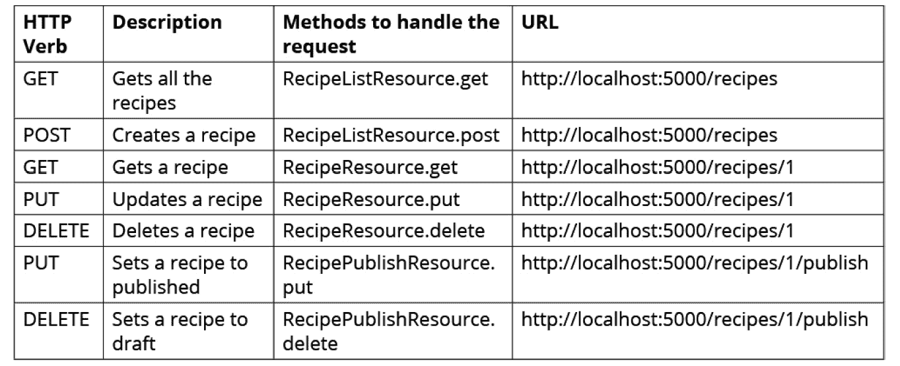
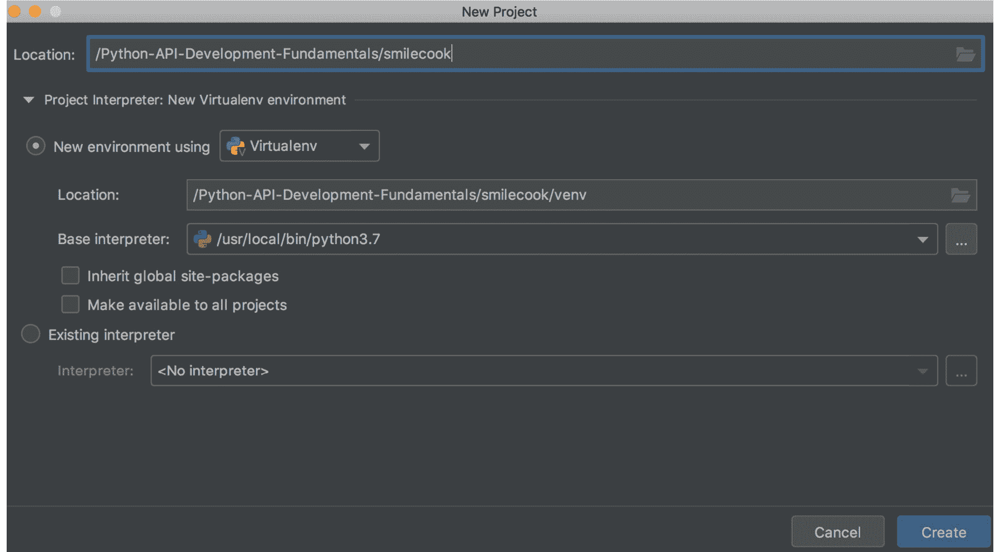
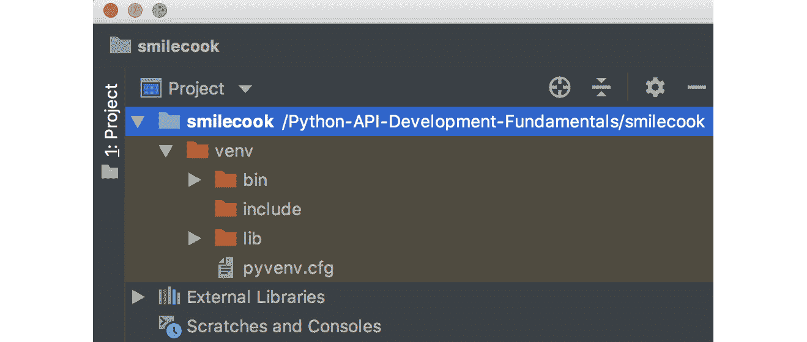
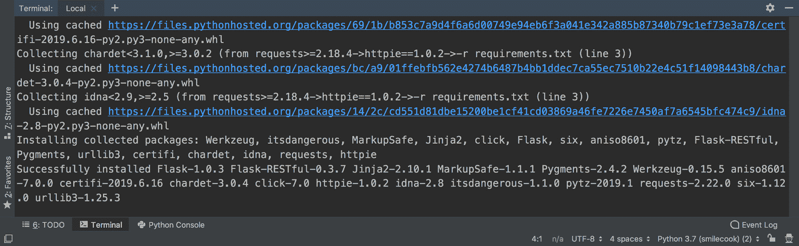
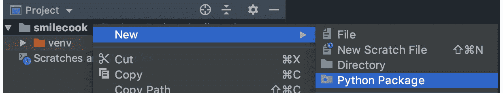
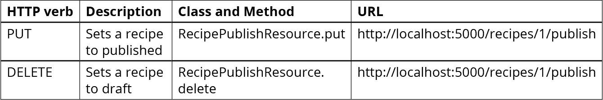
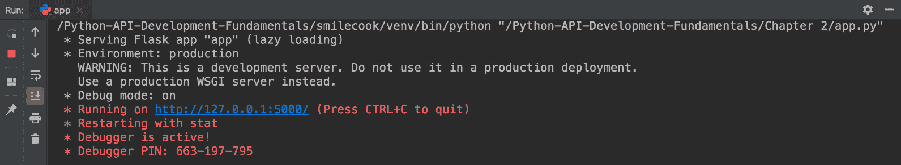

# 2. 开始构建我们的项目

## 学习目标

到本章结束时，你将能够：

+   使用 Flask-Restful 包高效构建 Restful API 服务

+   构建一个可扩展的 Flask 项目

+   使用模型执行 CRUD 操作

+   使用 curl、httpie 和 Postman 测试 RESTful API

在本章中，我们将开始着手构建食品菜谱分享平台，并学习如何创建 RESTful API 应用程序。

## 简介

现在我们已经介绍了 API 并了解了一些关于 HTTP 和 REST 的知识，我们将着手构建一个应用程序（名为 Smilecook 的菜谱分享应用程序）。在本章中，我们的目标是启动实际项目开发。这是一个用户可以创建账户并与其他用户分享他们自己的菜谱的菜谱分享平台。正如你所想象的那样，它将包含许多 API 端点，以便我们的用户可以管理他们的菜谱。我们将使用 Flask-RESTful 包来高效地开发我们的 RESTful API。

本章将讨论这些菜谱的**CRUD**（**创建、读取、更新、删除**）操作，以及如何设置菜谱的发布状态。

## 什么是 Flask-RESTful？

Flask-RESTful 是一个 Flask 扩展，它允许我们快速开发 RESTful API。与我们在上一章中讨论的内置包装器`@app.route('/')`相比，Flask-RESTful 允许我们以更好、更简单的方式维护和结构化 API 端点。

在本章中，我们将使用这个 Flask 扩展来开发我们的项目，这样你将看到我们如何构建我们的端点。

### 使用 Flask-RESTful 开发我们的菜谱分享平台，“Smilecook”

在这本书中，我们将开发一个名为**Smilecook**的菜谱分享平台。从本章开始，我们将开始向其中添加功能。我们相信这种方法将帮助你了解你需要的关键概念和技能，以便你可以开发这个应用程序并帮助它发挥其全部潜力，同时帮助你理解整个开发流程。

首先，我们将构建菜谱的基本 CRUD 功能。Flask-RESTful 包允许我们以更全面的方式组织我们的代码。我们将在资源中定义某些方法并将它们链接到端点。例如，GET 请求的流程将是请求被发送到端点（`http://localhost:5000/recipes`），然后由我们在资源中将要实现的`GET`方法处理。这将导致菜谱返回给我们。

除了基本的 CRUD 功能外，我们还将实现这些菜谱的发布和取消发布功能。这可以通过`PUT`和`DELETE`方法完成，这些方法可以在`RecipePublishResource`类中找到。我们将这两个方法链接到`http://localhost:5000/recipes/1/publish`端点（对于 ID 为 1 的菜谱）。关于我们端点设计的详细信息，请参考以下表格：



###### 图 2.1：我们端点设计的细节

## 虚拟环境

PyCharm 将帮助我们创建虚拟环境。我们希望在独立的虚拟环境中开发我们的项目，以便将其隔离。因此，我们将对我们将要使用的包的版本拥有绝对的控制权。

学习的最佳方式是通过实践。现在让我们动手试试吧！

### 练习 5：在 PyCharm 中创建开发项目

在你开始开发 Python 应用程序之前，你需要在 PyCharm 中创建一个开发项目。PyCharm 使用项目来管理事物。在这个练习中，你将学习如何在 PyCharm 中创建一个名为 Smilecook 的新开发项目。你还需要为这个项目安装必要的包。让我们开始吧：

1.  创建项目并命名为**smilecook**

    ###### 图 2.2：创建项目

1.  检查项目结构并确保已创建虚拟环境。一旦创建了模块，我们就能在左侧面板上看到项目的层次结构。我们可以看到项目文件夹下的**venv**文件夹，这是由 PyCharm 创建和激活的。现在，当我们在这个项目下编写代码时，它将在虚拟环境中运行！

    ###### 图 2.3：检查项目结构和确保已创建虚拟环境

1.  安装本章所需的包。为此，在我们的项目文件夹下创建一个名为`requirements.txt`的文件。输入以下代码以指定您想要安装的包：

    ```py
    Flask==1.0.3
    Flask-RESTful==0.3.7
    httpie==1.0.3
    ```

1.  使用`pip`命令安装这些包。之后，在`pip`命令中安装我们在`requirements.txt`文件中指定的包：

    ```py
    pip install -r requirements.txt
    ```

1.  你现在应该能在下面的屏幕截图中看到类似的内容。在这里，我们可以看到包正在虚拟环境中安装！

###### 图 2.4：在虚拟环境中安装包

恭喜！你已经为我们的 Smilecook 应用程序创建了一个 PyCharm 项目。这是你作为开发者踏上旅程的第一步！

## 创建菜谱模型

如你所想，一个菜谱可能有多个属性。为了保存这些属性的每一个细节，我们将使用类来模拟菜谱。这个菜谱类将具有几个基本属性。

下面是我们在菜谱类中将要定义的属性的简要描述：

+   `name`：菜谱的名称。

+   `description`：菜谱的描述。

+   `num_of_servings`：份量。

+   `cook_time`：所需的烹饪时间。这是一个以秒为单位的整数。

+   `directions`：步骤。

+   `is_publish`：菜谱的发布状态；默认为草稿。

在下一个练习中，我们将向您展示如何编码菜谱类，使其具有这些属性。

### 练习 6：创建菜谱模型

在这个练习中，我们将逐步编写食谱模型。`recipe` 类将包含我们之前讨论过的属性。本练习的代码文件可以在 `Lesson2/Exercise06/models/recipe.py` 中找到。

现在，让我们创建一个食谱类：

1.  在项目名称，即 Smilecook 上，*右键点击* 创建一个 `Python 包`。将其命名为 `models`：

    ###### 图 2.5：创建一个 Python 包并将其命名为 models

1.  然后，在 `models` 下创建一个名为 `recipe.py` 的文件，并输入以下代码：

    ```py
    recipe_list = []
    def get_last_id():
        if recipe_list:
            last_recipe = recipe_list[-1]
        else:
            return 1
        return last_recipe.id + 1
    ```

    让我们暂停一下，检查这里的代码。首先，我们定义 `recipe_list = []` 以便在应用程序内存中存储食谱。然后，我们定义 `get_last_id` 函数以获取我们最后一个食谱的 ID。稍后，当我们创建一个新的食谱时，我们将使用此方法来评估 `recipe_list` 中的最后一个 ID，以便我们可以为新的食谱生成一个新的 ID。

1.  使用以下代码定义食谱类。在 `recipe.py` 文件中，在 `get_last_id` 函数之后输入以下代码：

    ```py
    class Recipe:
        def __init__(self, name, description, num_of_servings, cook_time, directions):
            self.id = get_last_id()
            self.name = name
            self.description = description
            self.num_of_servings = num_of_servings
            self.cook_time = cook_time
            self.directions = directions
            self.is_publish = False
    ```

    `Recipe` 类有一个 `__init__` 构造方法，它将接受如 `name`、`description`、`num_of_servings`、`cook_time` 和 `directions` 等参数，并根据这些参数创建食谱对象。ID 是自增的，`is_publish` 默认设置为 `false`。这意味着默认情况下，食谱将被设置为草稿（未发布）。

1.  在相同的 `Recipe` 类中，定义一个 `data` 方法，用于将数据作为字典对象返回。你可能会记得，在 Python 中，缩进很重要。以下代码是缩进的，因为它位于 `Recipe` 类内部：

    ```py
        @property
        def data(self):
            return {
                'id': self.id,
                'name': self.name,
                'description': self.description,
                'num_of_servings': self.num_of_servings,
                'cook_time': self.cook_time,
                'directions': self.directions
            }
    ```

现在我们已经构建了食谱模型，我们将继续使用 Flask-RESTful 构建 API 端点。

### 资源路由

Flask-RESTful 的主要构建块是资源。资源建立在 Flask 的可插拔视图之上。资源路由的概念是我们希望将所有客户端请求围绕资源进行结构化。在我们的食谱分享平台上，我们将对 `RecipeResource` 下的食谱的 CRUD 操作进行分组。对于发布和取消发布操作，我们将它们分组在不同的 `RecipePublishResource` 下。这为其他开发者提供了一个清晰的架构。

我们可以实施这些资源的方式很简单：我们只需要从 `flask_restful.Resource` 类继承，并实现其中对应 HTTP 动词的方法。

在下一个练习中，我们将定义三个子类：一个用于食谱集合，一个用于单个食谱，一个用于发布食谱。

### 练习 7：为食谱模型定义 API 端点

要构建 API 端点，我们需要定义一个继承自 `flask_restful.Resource` 的类。然后，我们可以在类内部声明 get 和 post 方法。让我们开始吧：

1.  在项目下创建一个名为 `resources` 的文件夹，然后在 `resources` 文件夹下创建一个名为 `recipe.py` 的文件。

    #### 注意

    该代码文件可以在[`github.com/TrainingByPackt/Python-API-Development-Fundamentals/tree/master/Lesson02/Exercise07/resources`](https://github.com/TrainingByPackt/Python-API-Development-Fundamentals/tree/master/Lesson02/Exercise07/resources)中找到。

1.  使用以下代码导入必要的包、类和函数：

    ```py
    from flask import request
    from flask_restful import Resource
    from http import HTTPStatus
    from models.recipe import Recipe, recipe_list
    ```

1.  在前面的代码导入之后，创建`RecipeListResource`类。这个类有`GET`和`POST`方法，分别用于获取和创建食谱资源。我们首先完成`GET`方法：

    ```py
    class RecipeListResource(Resource):
        def get(self):
            data = []
            for recipe in recipe_list:
                if recipe.is_publish is True:
                    data.append(recipe.data)
            return {'data': data}, HTTPStatus.OK
    ```

    在这里，我们创建并实现了`RecipeListResource`类，它继承自`flask-restful.Resource`。我们实现的`get`方法用于获取所有公开的食谱。它是通过声明一个`data`列表，并在`recipe_list`中获取所有`is_publish`等于`true`的食谱来完成的。这些食谱被追加到我们的`data`列表中，并返回给用户。

1.  添加`post`方法。这是用来创建食谱的：

    ```py
        def post(self):
            data = request.get_json()
            recipe = Recipe(name=data['name'],
                            description=data['description'],
                            num_of_servings=data['num_of_servings'],
                            cook_time=data['cook_time'],
                            directions=data['directions'])
            recipe_list.append(recipe)
            return recipe.data, HTTPStatus.CREATED
    ```

在这个练习中，我们构建了两个方法来处理 GET 和 POST 客户端请求。以下表格总结了我们在本练习中构建的方法：


###### 图 2.6：在这个练习中我们使用的客户端请求方法

#### 注意

我们跳过了在将数据返回给客户端之前对对象进行序列化的步骤，因为 Flask-RESTful 已经在幕后为我们做了这件事。

我们在本练习中构建的`post`方法用于创建新的食谱。这是一个`POST`方法。它是通过使用`request.get_json`从请求中获取 JSON 数据，然后创建食谱对象并将其存储在`recipe_list`中来完成的。最后，它返回带有 HTTP 状态码**201 CREATED**的食谱记录。

### 练习 8：定义食谱资源

在这个练习中，我们将定义食谱资源。我们将使用两种方法：`get`方法，用于获取单个食谱；以及`put`方法，用于更新食谱。让我们开始吧：

1.  定义`RecipeResource`资源，并使用以下示例代码实现`get`方法：

    ```py
    class RecipeResource(Resource):
        def get(self, recipe_id):
            recipe = next((recipe for recipe in recipe_list if recipe.id == recipe_id and recipe.is_publish == True), None)
            if recipe is None:
                return {'message': 'recipe not found'}, HTTPStatus.NOT_FOUND
            return recipe.data, HTTPStatus.OK
    ```

    类似地，`RecipeResource`也继承自`flask-restful.Resource`。我们在这里实现的`get`方法是获取单个食谱。我们通过在`recipe_list`中搜索`recipe_id`来实现这一点。我们只会返回那些`is_publish = true`的食谱。如果没有找到这样的食谱，我们将返回消息**食谱未找到**。否则，我们将返回食谱，并附带 HTTP 状态**200 OK**。

1.  使用以下代码实现`put`方法：

    ```py
        def put(self, recipe_id):
            data = request.get_json()
            recipe = next((recipe for recipe in recipe_list if recipe.id == recipe_id), None)
            if recipe is None:
                return {'message': 'recipe not found'}, HTTPStatus.NOT_FOUND
            recipe.name = data['name']
            recipe.description = data['description']
            recipe.num_of_servings = data['num_of_servings']
            recipe.cook_time = data['cook_time']
            recipe.directions = data['directions']
            return recipe.data, HTTPStatus.OK
    ```

    我们在这里实现的第二个方法是`put`。它通过使用`request.get_json`从客户端请求中获取食谱详情，并更新食谱对象。如果一切顺利，它将返回 HTTP 状态码**200 OK**。

在这里，我们为食谱资源构建了两个方法。`GET` 和 `PUT` 方法用于处理相应的客户端请求。下表显示了在本练习中为 `RecipeResource` 类构建的方法：


###### 图 2.7：为 `RecipeResource` 类构建的函数

### 练习 9：发布和取消发布食谱

在前面的练习中，我们创建了食谱资源和它们相关的方法。现在，我们的 Smilecook 应用程序可以对食谱进行读写操作。然而，在本章的开头，我们提到食谱可以有两种状态（未发布和已发布）。这允许用户在将食谱发布到世界之前继续更新它们的未发布食谱。在本练习中，我们将定义发布和取消发布食谱的资源。让我们开始吧：

1.  定义 `RecipePublic` 资源并实现一个 `put` 方法，它将处理 HTTP PUT 请求：

    ```py
    class RecipePublishResource(Resource):
        def put(self, recipe_id):
            recipe = next((recipe for recipe in recipe_list if recipe.id == recipe_id), None)
            if recipe is None:
                return {'message': 'recipe not found'}, HTTPStatus.NOT_FOUND
            recipe.is_publish = True
            return {}, HTTPStatus.NO_CONTENT
    ```

    `RecipePublishResource` 继承自 `flask_restful.Resource`。`put` 方法将定位带有传入的 `recipe_id` 的食谱，并将 `is_publish` 状态更新为 true。然后，它将返回 `HTTPStatus.NO_CONTENT`，这表明食谱已成功发布。

1.  实现一个 `delete` 方法，它将处理 HTTP DELETE 请求：

    ```py
        def delete(self, recipe_id):
            recipe = next((recipe for recipe in recipe_list if recipe.id == recipe_id), None)
            if recipe is None:
                return {'message': 'recipe not found'}, HTTPStatus.NOT_FOUND
            recipe.is_publish = False
            return {}, HTTPStatus.NO_CONTENT
    ```

    `delete` 方法是 `put` 方法的相反。它不是将 `is_publish` 设置为 `true`，而是将其设置为 `false` 以取消发布食谱。

    你也可以看到我们以灵活的方式使用这些方法；`put` 方法不一定用于更新，`delete` 方法也不一定用于删除。

下表显示了在本练习中我们创建的所有函数。现在我们已经准备好了所有三个资源（`RecipeListResource`、`RecipeResource` 和 `RecipePublishResource`），我们将讨论端点配置：



###### 图 2.8：本练习中使用的函数

#### 注意

如果客户端请求使用在资源中没有相应处理方法的 HTTP 动词，Flask-RESTful 将返回 HTTP 状态码 **405 方法不允许**。

## 配置端点

现在我们已经定义了所有资源，我们将设置一些端点，以便用户可以向它们发送请求。这些端点可供用户访问，并连接到特定资源。我们将使用 API 对象上的 `add_resource` 方法来指定这些端点的 URL，并将客户端 HTTP 请求路由到我们的资源。

例如，`api.add_resource(RecipeListResource, '/recipes')` 语法用于将路由（相对 URL 路径）链接到 `RecipeListResource`，以便 HTTP 请求将指向此资源。根据 HTTP 动词（例如，`GET` 和 `POST`），请求将由资源中的相应方法相应处理。

### 练习 10：创建主应用程序文件

在这个练习中，我们将创建我们的 `app.py` 文件，这是我们主要的应用程序文件。我们将在那里设置 Flask 并初始化我们的 `flask_restful.API`。最后，我们将设置端点，以便用户可以向我们的后端服务发送请求。让我们开始吧：

1.  在项目文件夹下创建 `app.py` 文件。

1.  使用以下代码导入必要的类：

    ```py
    from flask import Flask
    from flask_restful import Api
    from resources.recipe import RecipeListResource, RecipeResource, RecipePublishResource
    ```

1.  使用我们的 Flask 应用设置 Flask 并初始化 `flask_restful.API`：

    ```py
    app = Flask(__name__)
    api = Api(app)
    ```

1.  通过传递 URL 来添加资源路由，以便它将路由到我们的资源。每个资源都将定义其自己的 HTTP 方法：

    ```py
    api.add_resource(RecipeListResource, '/recipes') 
    api.add_resource(RecipeResource, '/recipes/<int:recipe_id>')
    api.add_resource(RecipePublishResource, '/recipes/<int:recipe_id>/publish')
    if __name__ == '__main__':
        app.run(port=5000, debug=True)
    ```

    #### 注意

    在 `RecipeListResource` 中，我们定义了 `get` 和 `post` 方法。因此，当有 GET HTTP 请求到 "/recipes" URL 路由时，它将调用 `RecipeListResource` 下的 `get` 方法，并获取所有已发布的食谱。

    在前面的代码中，你会注意到我们使用了 `<int: recipe_id >`。它在代码中作为食谱 ID 的占位符。当向 `route "/recipes/2"` URL 发送 GET HTTP 请求时，这将调用 `RecipeResource` 下的 get 方法，带有参数，即 `recipe_id = 2`。

1.  保存 `app.py` 文件，然后右键单击它以运行应用程序。Flask 将在 localhost (`127.0.0.1`) 的端口 `5000` 上启动并运行：



###### 图 2.9：Flask 在 localhost 上启动并运行

恭喜！你已经完成了 API 端点。现在，让我们继续进行测试。你可以在 curl/httpie 或 Postman 中进行测试。

## 使用 curl 和 httpie 向 Flask API 发送 HTTP 请求

现在，我们将使用 `httpie` 和 `curl` 命令来测试我们的 API 端点。我们将测试从服务器获取所有食谱的函数以及创建/更新/删除、发布和取消发布的食谱。学习这个的最佳方式是通过动手练习。让我们开始吧！

### 练习 11：使用 curl 和 httpie 测试端点

在这个练习中，我们将使用 httpie 和 curl 命令向端点发送请求，以便我们可以创建我们的第一个食谱。我们希望你能够熟悉使用 httpie 和 curl 命令行测试工具。让我们开始吧：

1.  在 PyCharm 中打开终端并输入以下命令。你可以使用 httpie 或 curl 命令。以下是一个 httpie 命令（`= 是字符串，:= 是非字符串`）：

    ```py
    http POST localhost:5000/recipes name="Cheese Pizza" description="This is a lovely cheese pizza" num_of_servings:=2 cook_time:=30 directions="This is how you make it"
    ```

    以下是一个 curl 命令。`-H` 参数用于指定客户端请求中的头信息。在这里，我们将设置 `Content-Type: application/json` 作为头信息。`-d` 参数用于 HTTP POST 数据，即 JSON 格式的食谱：

    ```py
    curl -i -X POST localhost:5000/recipes -H "Content-Type: application/json" -d '{"name":"Cheese Pizza", "description":"This is a lovely cheese pizza", "num_of_servings":2, "cook_time":30, "directions":"This is how you make it" }'
    ```

1.  检查响应，你应该看到以下内容。仔细检查它，它应该与我们在 *步骤 1* 中请求的相同食谱：

    ```py
    HTTP/1.0 201 CREATED
    Content-Type: application/json
    Content-Length: 188
    Server: Werkzeug/0.16.0 Python/3.7.0
    Date: Sun, 03 Nov 2019 03:19:00 GMT
    {
        "id": 1,
        "name": "Cheese Pizza",
        "description": "This is a lovely cheese pizza",
        "num_of_servings": 2,
        "cook_time": 30,
        "directions": "This is how you make it"
    }
    ```

    #### 注意

    一旦使用 HTTP `POST` 方法将客户端请求发送到服务器，`RecipeResource` 中的 `post` 方法将捕获请求并将食谱保存到应用程序内存中。新的食谱将被追加到 `recipe_list` 中。一旦完成所有操作，它将返回 HTTP `201 CREATED` 状态码和以 JSON 格式的新创建的食谱。

我们已经在平台上成功创建了第一个食谱。这个食谱存储在服务器端，我们已经有获取它的 API。让我们继续创建第二个食谱并一次性检索所有食谱。

### 练习 12：测试自动递增的食谱 ID

现在我们已经在 Smilecook 应用程序中实现了自动递增的 ID，让我们看看它在实际中是如何工作的。在这个练习中，我们将使用 httpie 和 curl 命令创建第二个食谱。注意，第二个食谱的 ID 会自动递增。让我们开始吧：

1.  创建第二个食谱并注意 ID 会自动递增。使用 httpie 发送以下客户端请求：

    ```py
    http POST localhost:5000/recipes name="Tomato Pasta" description="This is a lovely tomato pasta recipe" num_of_servings:=3 cook_time:=20 directions="This is how you make it"
    ```

    或者，使用 curl 发送请求。同样，`-H` 参数用于指定客户端请求中的头部。这里我们将设置 `"Content-Type: application/json"` 作为头部。`-d` 参数用于 HTTP POST 数据，意味着食谱是以 JSON 格式：

    ```py
    curl -i -X POST localhost:5000/recipes -H "Content-Type: application/json" -d '{"name":"Tomato Pasta", "description":"This is a lovely tomato pasta recipe", "num_of_servings":3, "cook_time":20, "directions":"This is how you make it"}'
    ```

1.  你应该看到以下响应。仔细检查它，它应该与我们在 *步骤 1* 中请求的相同食谱：

    ```py
    HTTP/1.0 201 CREATED
    Content-Type: application/json
    Content-Length: 195
    Server: Werkzeug/0.16.0 Python/3.7.0
    Date: Sun, 03 Nov 2019 03:23:37 GMT

    {
        "id": 2,
        "name": "Tomato Pasta",
        "description": "This is a lovely tomato pasta recipe",
        "num_of_servings": 3,
        "cook_time": 20,
        "directions": "This is how you make it"
    }
    ```

    一旦使用 HTTP `POST` 方法将前面的客户端请求发送到服务器，`RecipeResource` 中的 `post` 方法将捕获请求并将食谱保存到应用程序内存中。新的食谱将被追加到 `recipe_list` 中。这次，ID 将自动分配为 2。

### 练习 13：获取所有食谱

在这个练习中，我们将使用 httpie 和 curl 命令检索我们创建的所有食谱。我们这样做是为了确保我们的食谱在后端服务器上。让我们开始吧：

1.  通过使用 httpie 发送以下客户端请求来检索所有食谱：

    ```py
    http GET localhost:5000/recipes
    ```

    或者，使用 curl 发送以下请求。`-i` 参数用于表示我们想要看到响应头部。`-X GET` 表示我们正在使用 HTTP `GET` 方法发送客户端请求：

    ```py
    curl -i -X GET localhost:5000/recipes 
    ```

1.  你应该看到以下响应。请仔细检查：

    ```py
    HTTP/1.0 200 OK
    Content-Length: 19
    Content-Type: application/json
    Date: Sun, 03 Nov 2019 03:24:53 GMT
    Server: Werkzeug/0.16.0 Python/3.7.0

    {
        "data": []
    }
    ```

    一旦使用 HTTP GET 方法将前面的客户端请求发送到服务器，`RecipeResource` 中的 `get` 方法将捕获请求并从应用程序内存中的 `recipe_list` 中检索所有已发布的食谱。

    #### 注意

    我们应该在 HTTP 响应中看到一个空列表，因为我们之前步骤中创建的所有食谱都是草稿形式（未发布）。

### 练习 14：测试食谱资源

我们已经测试了我们围绕食谱资源构建的端点。在这个练习中，我们将继续使用 httpie 和 curl 命令来测试食谱发布 API。我们可以通过向 API 端点发送请求来发布我们的食谱来测试它。让我们开始吧：

1.  修改 ID 为 1 的食谱的发布状态。我们可以使用 httpie 命令发送以下客户端请求：

    ```py
    http PUT localhost:5000/recipes/1/publish
    ```

    或者，我们可以使用以下 curl 命令：

    ```py
    curl -i -X PUT localhost:5000/recipes/1/publish 
    ```

    #### 注意

    一旦使用 HTTP PUT 方法将前面的客户端请求发送到服务器，`RecipePublishResource`中的`put`方法将接收到请求并将`recipe_id`设置为 1。应用程序将寻找 ID 为`1`的食谱并更新其发布状态为`True`。

1.  您应该看到以下响应。请仔细检查：

    ```py
    HTTP/1.0 204 NO CONTENT
    Content-Type: application/json
    Date: Sun, 03 Nov 2019 03:25:48 GMT
    Server: Werkzeug/0.16.0 Python/3.7.0
    ```

1.  现在，检索所有已发布的食谱并检查它们。然后，使用 httpie 发送以下客户端请求：

    ```py
    http GET localhost:5000/recipes
    ```

    或者，使用 curl 发送以下请求。`-i`参数表示我们想要看到响应头。`-X GET`表示我们正在使用 HTTP GET 方法发送客户端请求：

    ```py
    curl -i -X GET localhost:5000/recipes
    ```

1.  您应该看到以下响应。请仔细检查：

    ```py
    HTTP/1.0 200 OK
    Content-Type: application/json
    Content-Length: 276
    Server: Werkzeug/0.16.0 Python/3.7.0
    Date: Sun, 03 Nov 2019 03:26:43 GMT

    {
        "data": [
            {
                "id": 1,
                "name": "Cheese Pizza",
                "description": "This is a lovely cheese pizza",
                "num_of_servings": 2,
                "cook_time": 30,
                "directions": "This is how you make it"
            }
        ]
    }
    ```

    一旦使用 HTTP `GET`方法将前面的客户端请求发送到服务器，`RecipeResource`中的 get 方法将接收到请求并从应用程序内存中的`recipe_list`检索所有已发布的食谱。这次，因为 ID 为 1 的食谱已被设置为发布，所以我们应该在 HTTP 响应中看到它。

### 练习 15：负面测试

在上一个练习中，我们成功发布了我们的食谱。这是好事，因为它表明我们开发的 API 是有效的。但测试的全部目的是发现潜在的问题（如果有的话）。我们在这里可以执行所谓的负面测试。这是故意使用不想要的输入测试场景的过程。这个练习将测试一个没有在资源中定义相应方法的 HTTP 动词的请求。让我们开始吧：

1.  向服务器发送以下请求。这个 HTTP 方法尚未定义；让我们看看会发生什么：

    ```py
    http DELETE localhost:5000/recipes
    ```

    以下是一个 curl 命令，它执行相同的事情：

    ```py
    curl -i -X DELETE localhost:5000/recipes 
    ```

1.  您应该看到以下响应。请仔细检查：

    ```py
    HTTP/1.0 405 METHOD NOT ALLOWED
    Content-Type: application/json
    Content-Length: 70
    Allow: POST, GET, HEAD, OPTIONS
    Server: Werkzeug/0.16.0 Python/3.7.0
    Date: Sun, 03 Nov 2019 03:27:37 GMT

    {
        "message": "The method is not allowed for the requested URL."
    }
    ```

    我们应该看到一个带有`RecipeListResource` HTTP 状态的响应。

负面测试很重要。我们总是希望我们的测试更加完整，覆盖更多场景。

### 练习 16：修改食谱

在我们的 Smilecook 应用程序中，作者被允许更新他们的食谱。它就像一个博客平台，作者可以在发布后花时间完善他们的作品。由于我们已经构建了 API，我们希望使用 Postman 来测试它。让我们开始吧：

1.  使用 PUT 方法向`localhost:5000/recipes/1`发送请求，并附带新的食谱详情：

    ```py
    http PUT localhost:5000/recipes/1 name="Lovely Cheese Pizza" description="This is a lovely cheese pizza recipe" num_of_servings:=3 cook_time:=60 directions="This is how you make it"
    ```

    或者，使用 curl 发送以下请求。`-H` 参数用于指定客户端请求中的头信息。在这里，我们将设置头信息为 "`Content-Type: application/json`"。`-d` 参数用于 HTTP POST 数据，意味着菜谱将以 JSON 格式存在：

    ```py
    curl -i -X PUT localhost:5000/recipes/1 -H "Content-Type: application/json" -d '{"name":"Lovely Cheese Pizza", "description":"This is a lovely cheese pizza recipe", "num_of_servings":3, "cook_time":60, "directions":"This is how you make it"}'
    ```

1.  你应该会看到以下响应。请仔细检查：

    ```py
    HTTP/1.0 200 OK
    Content-Type: application/json
    Content-Length: 202
    Server: Werkzeug/0.16.0 Python/3.7.0
    Date: Sun, 03 Nov 2019 03:28:57 GMT

    {
        "id": 1,
        "name": "Lovely Cheese Pizza",
        "description": "This is a lovely cheese pizza recipe",
        "num_of_servings": 3,
        "cook_time": 60,
        "directions": "This is how you make it"
    }
    ```

    一旦使用 HTTP PUT 方法将前面的客户端请求发送到服务器，`RecipeResource` 中的 `put` 方法将捕获请求并将 `recipe_id` 赋值为 1。应用程序将寻找 `id = 1` 的菜谱并使用客户端请求中的详细信息更新其详情。前面的响应显示，ID 为 1 的菜谱已被修改。

我们刚刚测试了另一个重要功能。你做得很好。让我们继续前进！

### 练习 17：通过特定 ID 获取特定菜谱

到目前为止，我们已经测试了获取所有菜谱。但在现实生活中，用户可能只想获取他们想看的菜谱。他们可以通过使用菜谱 ID 来做到这一点。这个练习将向你展示如何获取具有特定 ID 的特定菜谱。让我们开始吧：

1.  使用 httpie 发送以下客户端请求：

    ```py
    http GET localhost:5000/recipes/1
    ```

    或者，使用以下 curl 命令，它做的是同样的事情：

    ```py
    curl -i -X GET localhost:5000/recipes/1
    You should see the following response. Please examine it carefully:
    HTTP/1.0 200 OK
    Content-Type: application/json
    Content-Length: 202
    Server: Werkzeug/0.16.0 Python/3.7.0
    Date: Sun, 03 Nov 2019 03:29:59 GMT

    {
        "id": 1,
        "name": "Lovely Cheese Pizza",
        "description": "This is a lovely cheese pizza recipe",
        "num_of_servings": 3,
        "cook_time": 60,
        "directions": "This is how you make it"
    }
    ```

    一旦使用 HTTP `GET` 方法将前面的客户端请求发送到服务器，`RecipeResource` 中的 get 方法将捕获请求并将 `recipe_id` 赋值为 1。它将从应用程序内存中的 `recipe_list` 获取所有已发布的菜谱，HTTP 状态为 HTTP `200`。

我们刚刚测试了我们的 Smilecook 应用程序，并确认它可以给我们返回我们想要的菜谱。

### 活动 3：使用 Postman 测试 API

在前面的练习中，我们添加了相当多的功能。现在，在我们继续开发其他功能之前，我们需要确保它们能正常工作。在这个活动中，我们不会使用 httpie/curl，而是将使用 Postman 来测试我们的 API。请按照以下高级步骤进行：

1.  使用 Postman 创建第一个菜谱。

1.  使用 Postman 创建第二个菜谱。

1.  使用 Postman 获取所有菜谱。

1.  使用 Postman 将菜谱设置为已发布。

1.  再次使用 Postman 获取所有菜谱。

1.  使用 Postman 修改菜谱。

1.  使用 Postman 获取特定菜谱。

    #### 注意

    本活动的解决方案可以在第 293 页找到。

### 活动 4：实现删除菜谱功能

在这个活动中，你将自己在 Smilecook 应用程序中实现删除菜谱功能。通过向 `RecipeResource` 添加删除功能，类似于我们在前面的练习中所做的。然后，我们将遵循标准的软件开发生命周期流程，使用 Postman 来测试我们的实现。按照以下步骤完成此活动：

1.  将删除功能添加到 `RecipeResource`。

1.  启动 Flask 服务器进行测试。

1.  使用 Postman 创建第一个菜谱。

1.  使用 Postman 删除菜谱。

    #### 注意

    该活动的解决方案可以在第 299 页找到。

## 摘要

在本章中，我们使用 Flask-RESTful 包构建了 RESTful API。通过这样做，您已经看到了执行此类任务是多么简单和容易。我们以结构化的方式构建项目，这使得我们能够在后续章节中轻松扩展项目。在本章中，我们创建了模型和资源文件夹；本书后面我们将开发更多模型和资源。到目前为止，我们的美食食谱分享平台 Smilecook 能够执行 CRUD 操作，以及设置食谱的发布状态。我们还测试了应用程序，以确保其正常运行。最后，您开始意识到 Postman 的强大功能，它极大地自动化了整个测试过程。在下一章中，我们将学习如何进行数据验证。
