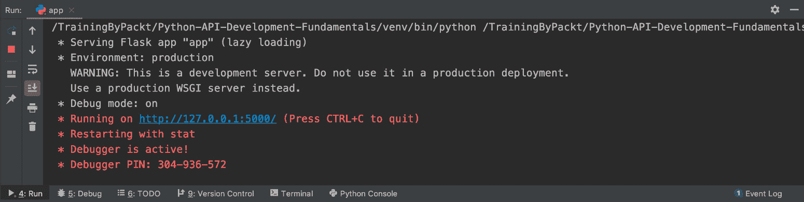

# 第四章：4. 使用 JWT 进行认证服务和安全

## 学习目标

到本章结束时，你将能够：

+   应用 JWT 知识

+   使用 Flask-JWT-Extended 创建访问令牌

+   开发会员登录系统

+   实现访问控制系统（认证和权限）

+   使用刷新令牌进行操作

+   使用黑名单限制访问

本章介绍了如何使用 JWT 开发用户登录/注销功能。

## 简介

在上一章中，我们完成了数据库的设置和配置，并使用 ORM 将数据库链接到代码中。然后我们在其基础上实现了用户注册 API。本章分为四个部分。第一部分是关于用户认证并允许他们登录到自己的私有个人资料页面。第二部分完成了食谱分享系统，允许用户发布或取消发布他们的食谱。第三部分展示了如何刷新安全令牌并实现注销功能。最后，我们将讨论如何使用`blacklist`函数强制用户注销。

用户认证在现代系统中非常重要，尤其是如果它们部署在互联网上。数千名用户访问同一个网站，使用相同的 Web 应用程序。如果没有用户认证和访问控制，所有内容都会共享。看看你的 Facebook/Instagram 账户——系统中也实现了用户认证和访问控制。只有你才能登录到你的账户并管理你的帖子和个人照片。对于我们的 Smilecook 应用程序，我们同样需要这样的功能。

我们将首先讨论 JWT。

## JWT

**JWT**用于用户认证，并在用户和服务器之间传递。该缩写的全称是**JSON Web Token**。它们的工作方式是编码用户身份并对其进行数字签名，使其成为一个不可伪造的令牌，用于识别用户，并且应用程序可以根据用户的身份控制对用户的访问。

JWT 是一个由头部、载荷和签名组成的字符串。这三部分由`.`分隔。以下是一个示例：

```py
eyJ0eXAiOiJKV1QiLCJhbGciOiJIUzI1NiJ9.eyJpYXQiOjE1NjQ5ODI5OTcs Im5iZiI6MTU2NDk4Mjk5NywianRpIjoiMGIzOTVlODQtNjFjMy00NjM3LTkwMzYtZjgyZDgy YTllNzc5IiwiZXhwIjoxNTY0OTgzODk3LCJpZGVudGl0eSI6MywiZnJlc2giOmZhbHNlLCJ 0eXBlIjoiYWNjZXNzIn0.t6F3cnAmbUXY_PwLnnBkKD3Z6aJNvIDQ6khMJWj9xZM
```

`"alg": "HS256"`的头部，表示加密算法，`"typ": "JWT"`。如果我们对头部字符串进行`base64`解码，可以清楚地看到这一点：

```py
>>> import base64
>>> header = 'eyJ0eXAiOiJKV1QiLCJhbGciOiJIUzI1NiJ9'
>>> base64.b64decode(header)
b'{"typ":"JWT","alg":"HS256"}'
```

解码`base64`内容并获取其中的信息。需要注意的是，这些信息未加密，因此不建议在此处存储信用卡详情或密码：

```py
>>> import base64
>>> payload = 'eyJpYXQiOjE1NjQ5ODI5OTcsIm5iZiI6MTU2NDk4Mjk5NywianRpI joiMGIzOTVlODQtNjFjMy00NjM3LTkwMzYtZjgyZDgyYTllNzc5IiwiZXhwIjoxNTY0 OTgzODk3LCJpZGVudGl0eSI6MywiZnJlc2giOmZhbHNlLCJ0eXBlIjoiYWNjZXNzIn0'
>>> base64.b64decode(payload + '==')
b'{"iat":1564982997,"nbf":1564982997,"jti":"0b395e84-61c3-4637-9036-f82d82a9e779","exp":1564983897,"identity":3,"fresh":false,"type":"access"}'
```

`HS256`算法。该算法使用只有应用程序服务器才知道的密钥加密编码的头部和载荷数据。尽管任何人都可以修改 JWT 内容，但这会导致不同的签名，从而保护数据完整性。

我们可以利用[`jwt.io/`](https://jwt.io/)提供的免费服务，更好地查看 JWT 令牌的结构和内容：


###### 图 4.1：JWT 网站

使用简单的结构`header.payload.secret`，我们有一个 JWT，它将在这个项目中用于用户认证。基于用户的身份，我们可以应用访问控制或其他类型的逻辑。

## Flask-JWT-Extended

Flask-JWT-Extended 是一个用户认证包，它提供了`create_access_token`函数来创建新的访问 JWT。它还提供了`jwt_required`装饰器来保护 API 端点（用于检查用户是否已登录）。此外，还提供了`get_jwt_identity()`函数来获取受保护端点中 JWT 的身份。这使得我们可以知道谁是认证用户。这是一个非常实用的用户认证包。

在我们深入到即将到来的练习之前，让我们首先讨论两个我们将要使用的重要关键配置。它们如下：

+   **SECRET_KEY**：这是加密消息和生成签名的密钥。我们建议您使用一个复杂的字符串。

+   `msg`，但我们在这里将其设置为`message`。

我们将在下一个练习中一起工作用户登录功能。您将了解用户登录的工作原理以及我们如何确定认证用户是谁。

#### 注意

关于 Flask-JWT-Extended 的更多信息，您可以参考此链接：[`flask-jwt-extended.readthedocs.io/en/latest/options.html`](https://flask-jwt-extended.readthedocs.io/en/latest/options.html)。

### 练习 24：实现用户登录功能

在这个练习中，我们将构建用户登录功能。我们将使用 Flask-JWT-Extended 包。通过这个练习，您将学习我们如何在 Flask 中生成 JWT。用户将在`http://localhost:5000/token`中输入他们的凭据，然后他们将获得一个令牌。他们可以使用该令牌来访问`http://localhost:5000/users/{username}`并检查系统中注册的个人资料。如果没有令牌，他们将只能看到自己的 ID 和用户名。这是我们 Smilecook 应用程序的访问控制功能：

1.  通过在`requirements.txt`文件中添加以下行来安装`Flask-JWT-Extended`包：

    ```py
    Flask-JWT-Extended==3.20.0
    ```

1.  运行以下命令以安装所有必要的包：

    ```py
    pip install -r requirements.txt
    ```

    您应该在屏幕上看到以下安装结果：

    ```py
    Installing collected packages: PyJWT, Flask-JWT-Extended
      Running setup.py install for Flask-JWT-Extended ... done
    Successfully installed Flask-JWT-Extended-3.20.0 PyJWT-1.7.1
    ```

1.  通过在`config.py`文件中的`Config`类中添加以下设置来配置`Flask-JWT-Extended`：

    ```py
    SECRET_KEY = 'super-secret-key'
    JWT_ERROR_MESSAGE_KEY = 'message'
    ```

1.  将以下代码放入`extension.py`：

    ```py
    from flask_jwt_extended import JWTManager
    jwt = JWTManager()
    ```

    在这里，我们试图创建一个`Flask-JWT-Extended`的实例。我们首先从`flask_jwt_extended`中导入`JWTManager`类，然后通过调用`JWTManager()`创建一个`Flask-JWT-Extended`实例，并将其分配给`jwt`变量。

1.  在`app.py`中输入以下代码：

    ```py
    from extensions import db, jwt
    def register_extensions(app):
        db.init_app(app)
        migrate = Migrate(app, db)
        jwt.init_app(app)
    ```

    我们首先从`extensions`中导入`jwt`，然后在`register_extensions(app)`中通过`jwt.init_app(app)`初始化`jwt`。

1.  现在，我们将创建登录资源。我们首先在 `resources` 文件夹中创建 `token.py` 文件，并输入以下代码。我们首先导入所有必要的模块、函数和类：

    ```py
    from http import HTTPStatus
    from flask import request
    from flask_restful import Resource
    from flask_jwt_extended import create_access_token
    from utils import check_password
    from models.user import User
    ```

1.  然后，定义一个名为 `TokenResource` 的类。这个类继承自 `flask_restful.Resource`：

    ```py
    class TokenResource(Resource):
    ```

1.  在类内部，我们创建了一个 `post` 方法。当用户登录时，此方法将被调用，并且它将从客户端 JSON 请求中获取 `email` 和 `password`。它将使用 `get_by_email` 方法来验证用户的凭据是否正确：

    ```py
        def post(self):
            json_data = request.get_json()
            email = json_data.get('email')
            password = json_data.get('password')
            user = User.get_by_email(email=email)
            if not user or not check_password(password, user.password):
                return {'message': 'email or password is incorrect'}, HTTPStatus.UNAUTHORIZED
            access_token = create_access_token(identity=user.id)
            return {'access_token': access_token}, HTTPStatus.OK
    ```

    如果它们无效，该方法将停止并返回 `email 或 password is incorrect`。否则，它将创建一个带有用户 ID 作为身份的访问令牌。

    #### 注意

    `check_password` 函数的工作方式是通过散列客户端传递的密码，并使用 `pbkdf2_sha256.verify(password, hashed)` 函数将散列值与数据库中存储的散列值进行比较。这里没有明文密码比较。

1.  然后，我们将创建一个新的资源，用于获取用户详细信息。如果用户未认证，他们只能看到他们的 ID 和用户名。否则，他们还将看到他们的个人电子邮件。我们可以在 `resources/user.py` 中添加以下代码：

    我们首先导入必要的模块、函数和类：

    ```py
    from flask_jwt_extended import jwt_optional, get_jwt_identity
    ```

1.  然后，我们定义一个继承自 `flask_restful.Resource` 的 `UserResource` 类：

    ```py
    class UserResource(Resource):
    ```

1.  在这个类中，我们定义了一个 `get` 方法，并用 `jwt_optional` 装饰器包装它。这意味着端点是无论令牌的处理过程如何都可以访问的：

    ```py
        @jwt_optional
        def get(self, username):
    ```

1.  然后，我们执行与上一步类似的常规操作，检查 `username` 是否可以在数据库中找到：

    ```py

            user = User.get_by_username(username=username)

            if user is None:
                return {'message': 'user not found'}, HTTPStatus.NOT_FOUND
    ```

1.  如果在数据库中找到，我们将进一步检查它是否与 JWT 中的用户 ID 身份匹配：

    ```py
            current_user = get_jwt_identity()
    ```

1.  根据上一步的结果，我们应用访问控制并输出不同的信息：

    ```py
            if current_user == user.id:
                data = {
                    'id': user.id,
                    'username': user.username,
                    'email': user.email,
                }
            else:
                data = {
                    'id': user.id,
                    'username': user.username,
                }
            return data, HTTPStatus.OK
    ```

1.  最后，我们将导入之前创建的资源，并将它们添加到 `app.py` 中的 `api`：

    ```py
    from resources.user import UserListResource, UserResource
    from resources.token import TokenResource
    def register_resources(app):
        api = Api(app)
      api.add_resource(UserListResource, '/users')
        api.add_resource(UserResource, '/users/<string:username>')
        api.add_resource(TokenResource, '/token')
    ```

1.  右键单击它以运行应用程序。**Flask** 将随后在本地主机（**127.0.0.1**）的 **5000** 端口启动并运行：

###### 图 4.2：运行应用程序以在本地主机上启动和运行 Flask

因此，我们已经完成了用户登录功能。这将使用户在登录后能够访问受控的 API。让我们在我们的下一个练习中测试它！

### 练习 25：测试用户登录功能

在这个练习中，我们将测试登录功能并验证存储在数据库中的用户信息。我们还将测试从 `http://localhost:5000/users/{username}` API 获取的用户信息在用户登录前后是否不同：

1.  首先要做的事情是创建一个用户。点击 **Collections** 选项卡，选择 **POST** **UserList**。

1.  选择 **Body** 选项卡，选择 **raw** 单选按钮，并从下拉列表中选择 **JSON (application/json)**。在 **Body** 字段中输入以下用户详情（JSON 格式）：

    ```py
    {
        "username": "james",
        "email": "james@gmail.com",
        "password": "WkQad19"
    }
    ```

1.  点击 `"id": 3` 这里表示该用户是成功注册的第三个用户。

1.  我们将尝试在不登录的情况下检查用户信息。让我们看看我们能得到什么信息。点击 `User`，并将其保存到 `User` 文件夹下。

1.  编辑请求，在 URL 字段中输入 `http://localhost:5000/users/james`。**保存**请求以便以后重用。

1.  点击 **Send** 获取用户详情。结果如下截图所示：![图 4.4：未登录时检查用户信息

    图片

    ###### 图 4.4：未登录时检查用户信息

    你将看到响应。HTTP 状态是 **200 OK**，表示请求已成功。我们可以在响应体中看到 ID 和用户名。然而，我们在这里看不到电子邮件地址，因为它属于私人信息，并且只有经过认证的用户才能看到。

1.  现在，通过 API 登录。点击 **Collections** 选项卡。创建一个名为 **Token** 的新文件夹，并在其中创建一个名为 **Token** 的新请求。

1.  编辑请求，将方法更改为 URL 字段中的 `http://localhost:5000/token`。

1.  点击 **Body** 选项卡，检查 **raw** 单选按钮，并在下拉菜单中选择 **JSON (application/json)**。在 **Body** 字段中输入以下 JSON 内容，然后点击 **Save**：

    ```py
    {
        "email": "james@gmail.com",
        "password": "WkQad19"
    }
    ```

1.  点击 **Send** 登录。结果如下截图所示：![图 4.5：创建令牌后检查用户信息

    图片

    ###### 图 4.5：创建令牌后检查用户信息

    你将看到响应。HTTP 状态码 **200** 表示登录成功。我们可以在响应体中看到访问令牌。我们将依靠这个令牌来显示用户已经登录。

1.  现在，在我们登录后再次检查用户信息。点击 **Collections** 选项卡，并选择 **GET User** 请求。

1.  在 **VALUE** 字段中选择 `Bearer {token}`，其中令牌是我们在第 10 步中获得的。

1.  点击 **Send** 获取用户详情。结果如下截图所示：![图 4.6：登录后检查用户信息

    图片

###### 图 4.6：登录后检查用户信息

你将看到响应，HTTP 状态码 **200** 表示请求成功。在响应体中，我们可以看到包括 **id**、**username** 和 **email** 在内的信息。

在这个练习中，我们可以看到访问控制是如何真正工作的。我们可以看到用户认证前后 HTTP 响应的差异。这对我们的 Smilecook 应用程序非常重要，因为我们想保护用户的隐私。有一些信息只有经过认证的用户才能看到。

### 练习 26：创建 me 端点

在这个练习中，我们将创建一个特殊的端点`/users/me`。这将允许我们通过`access_token`获取认证用户信息。我们首先在`user`模型下创建一个新的`resource`类。它将有一个`get`方法，最后我们将将其与新的 API 端点关联起来：

1.  在`models/user.py`中添加`get_by_id`方法。为了方便起见，我们将使用此方法通过 ID 获取用户对象：

    ```py
    @classmethod 
    def get_by_id(cls, id):         
            return cls.query.filter_by(id=id).first() 
    ```

1.  在`resources/user.py`中导入`jwt_required`并创建一个`MeResource`类：

    ```py
    from flask_jwt_extended import jwt_optional, get_jwt_identity, jwt_required
    class MeResource(Resource):
        @jwt_required
        def get(self):
            user = User.get_by_id(id=get_jwt_identity())
            data = {
                    'id': user.id,
                    'username': user.username,
                    'email': user.email,
            }
            return data, HTTPStatus.OK
    ```

    这里使用的`get`方法将通过 JWT 中的 ID 获取用户信息。

1.  在`app.py`中导入`MeResource`类。添加`/me`端点：

    ```py
    from resources.user import UserListResource, UserResource, MeResource
    api.add_resource(MeResource, '/me')
    ```

1.  右键单击以运行应用程序。**Flask**将在本地主机（**127.0.0.1**）的**5000**端口启动并运行：![图 4.7：运行应用程序以在本地主机上启动和运行 Flask

    ![图 4.7：运行应用程序以在本地主机上启动和运行 Flask

    ###### 图 4.7：运行应用程序以在本地主机上启动和运行 Flask

1.  在使用 users/me 端点登录后，再次检查用户信息。点击**收藏夹**选项卡，在**用户**文件夹中创建一个名为**Me**的新请求。

1.  在 URL 字段中输入`http://localhost:5000/me`。

1.  在**值**字段中选择`Bearer {token}`，其中 token 是我们之前练习中获得的。

1.  点击**发送**以获取用户详情。结果如下截图所示：![图 4.8：登录后检查用户信息

    ![图 4.7：运行应用程序以在本地主机上启动和运行 Flask

###### 图 4.8：登录后检查用户信息

这个新的 API 端点允许我们仅通过访问令牌获取认证用户信息。这意味着当用户处于认证状态时，我们可以获取他们的信息。现在我们已经基本了解了用户，让我们来处理食谱。

## 在食谱模型中设计方法

现在我们已经完成了用户注册和登录功能，我们将着手处理 Smilecook 应用程序的食谱管理功能。这需要在`Recipe`类中实现一些方法。在我们的设计中，我们将有以下五种方法：

+   `data`：这是用来以字典格式返回数据的。

+   `get_all_published`：此方法获取所有已发布的食谱。

+   `get_by_id`：此方法通过 ID 获取食谱。

+   `save`：此方法将数据持久化到数据库。

+   `delete`：此方法从数据库中删除数据。

这五种方法涵盖了几乎所有必要的食谱管理功能。在下一个练习中，我们将实现这些方法在我们的 Smilecook 应用程序中。

### 练习 27：实现受访问控制的食谱管理功能

本练习的目的是在我们的平台上实现不同的食谱管理功能，以便用户可以在我们的 Smilecook 应用程序中管理自己的食谱。我们还将修改`RecipeListResource`和`RecipeResource`以限制对某些方法的访问：

1.  在`models/recipe.py`中，向`Recipe`类添加`data`、`get_all_published`、`get_by_id`、`save`和`delete`方法：

    ```py
        def data(self):
            return {
                'id': self.id,
                'name': self.name,
                'description': self.description,
                'num_of_servings': self.num_of_servings,
                'cook_time': self.cook_time,
                'directions': self.directions,
                'user_id': self.user_id
            }
        @classmethod
        def get_all_published(cls):
            return cls.query.filter_by(is_publish=True).all()
        @classmethod
        def get_by_id(cls, recipe_id):
            return cls.query.filter_by(id=recipe_id).first()
        def save(self):
            db.session.add(self)
            db.session.commit()
        def delete(self):
            db.session.delete(self)
            db.session.commit()
    ```

1.  在`models/recipe.py`中删除以下代码：

    ```py
    recipe_list = []

    def get_last_id():
        if recipe_list:
            last_recipe = recipe_list[-1]
        else:
            return 1
        return last_recipe.id + 1
    ```

1.  在`resources/recipe.py`中导入`get_jwt_identity`、`jwt_required`和`jwt_optional`：

    ```py
    from flask_jwt_extended import get_jwt_identity, jwt_required, jwt_optional
    ```

1.  删除导入`recipe_list`

    ```py
    from models.recipe import Recipe
    ```

1.  我们将修改`RecipeListResource`类中的`get`方法。我们将通过触发`Recipe.get_all_published()`来获取所有已发布的食谱。然后，在`for`循环中，它遍历食谱列表，将每个食谱转换为字典对象，并返回字典列表：

    ```py
    class RecipeListResource(Resource):
        def get(self):
            recipes = Recipe.get_all_published()
            data = []
            for recipe in recipes:
                data.append(recipe.data())
             return {'data': data}, HTTPStatus.OK
    ```

1.  我们继续修改`RecipeListResource`类中的`post`方法。这里的`@jwt_required`装饰器表示该方法只能在用户登录后调用。在方法内部，它从客户端请求中获取所有食谱详情并将其保存到数据库中。最后，它将返回带有 HTTP 状态码**201 CREATED**的数据：

    ```py
        @jwt_required
        def post(self):
            json_data = request.get_json()
            current_user = get_jwt_identity()
            recipe = Recipe(name= json_data['name'],
                            description= json_data['description'],
                            num_of_servings= json_data['num_of_servings'],
                            cook_time= json_data['cook_time'],
                            directions= json_data['directions'],
                            user_id=current_user)
            recipe.save()
            return recipe.data(), HTTPStatus.CREATED
    ```

1.  我们将修改`RecipeResource`中的`get`方法以获取特定的食谱。`@jwt_optional`装饰器指定 JWT 是可选的。在方法内部，我们使用`Recipe.get_by_id(recipe_id=recipe_id)`来获取食谱。如果找不到特定食谱，我们将返回**404 NOT_FOUND**。如果找到了，然后更改食谱的所有者和状态。这里存在访问控制，所以它将根据情况返回**403 FORBIDDEN**或**200 OK**：

    ```py
    class RecipeResource(Resource):
        @jwt_optional
        def get(self, recipe_id):
            recipe = Recipe.get_by_id(recipe_id=recipe_id)
            if recipe is None:
                return {'message': 'Recipe not found'}, HTTPStatus.NOT_FOUND
            current_user = get_jwt_identity()
            if recipe.is_publish == False and recipe.user_id != current_user:
                return {'message': 'Access is not allowed'}, HTTPStatus.FORBIDDEN
            return recipe.data(), HTTPStatus.OK
    ```

1.  我们将修改`RecipeResource`中的`put`方法以获取特定的食谱。这个`put`方法用于更新食谱详情。它将首先检查食谱是否存在以及用户是否有更新权限。如果一切正常，它将继续更新食谱详情并将其保存到数据库中：

    ```py
        @jwt_required
        def put(self, recipe_id):
            json_data = request.get_json()
            recipe = Recipe.get_by_id(recipe_id=recipe_id)
            if recipe is None:
                return {'message': 'Recipe not found'}, HTTPStatus.NOT_FOUND
            current_user = get_jwt_identity()
            if current_user != recipe.user_id:
                return {'message': 'Access is not allowed'}, HTTPStatus.FORBIDDEN
            recipe.name = json_data['name']
            recipe.description = json_data['description']
            recipe.num_of_servings = json_data['num_of_servings']
            recipe.cook_time = json_data['cook_time']
            recipe.directions = json_data['directions']
            recipe.save()
            return recipe.data(), HTTPStatus.OK
    ```

1.  我们将修改`RecipeResource`中的`delete`方法以获取特定的食谱。这是用于删除食谱的。`@jwt_required`装饰器意味着 JWT 是必需的。当用户登录时，他们可以访问此路径并删除存在的指定食谱：

    ```py
        @jwt_required
        def delete(self, recipe_id):
            recipe = Recipe.get_by_id(recipe_id=recipe_id)
            if recipe is None:
                return {'message': 'Recipe not found'}, HTTPStatus.NOT_FOUND
            current_user = get_jwt_identity()
            if current_user != recipe.user_id:
                return {'message': 'Access is not allowed'}, HTTPStatus.FORBIDDEN
            recipe.delete()
            return {}, HTTPStatus.NO_CONTENT
    ```

因此，在这个练习中，我们已经实现了食谱管理功能并添加了对资源的访问控制。现在，只有授权用户才能管理他们的食谱。让我们在下一个练习中测试一下这是否真的如此。

### 练习 28：测试食谱管理功能

这个练习的目的是使用 Postman 测试所有食谱管理功能。我们在之前的练习中注册了一个账户并登录。我们将使用相同的认证用户来测试添加、更新和删除食谱：

1.  通过我们的 API 创建一个食谱。点击**Collections**标签，并选择我们之前创建的**POST RecipeList**请求。

1.  前往**VALUE**字段中的`Bearer {token}`，这里的 token 是我们之前练习中获得的 JWT token。结果如下所示：

    

    ###### 图 4.9：通过 API 创建食谱

1.  前往 **Body** 选项卡并输入以下菜谱详情：

    ```py
    {
        "name": "Cheese Pizza",
        "description": "This is a lovely cheese pizza",
        "num_of_servings": 2,
        "cook_time": 30,
        "directions": "This is how you make it"
    }
    ```

1.  点击 `user_id` 是 **3**，这是当前登录用户的用户 ID。

1.  在用户登录的状态下获取 `id = 3` 的菜谱。点击 **Collections** 选项卡并选择我们之前创建的 **GET** 菜谱请求。

1.  前往 **VALUE** 字段中的 `Bearer {token}`，其中令牌是我们之前练习中获得的 JWT 令牌。

1.  点击 **Send** 检查菜谱。结果如下截图所示：

    ###### 图 4.11：用户登录后的 ID 为 3 的菜谱

    你将看到响应。我们可以在正文中看到菜谱详情。那是因为用户已经经过身份验证。

1.  在用户未登录的状态下获取 `id = 3` 的菜谱。预期结果是我们将无法看到未发布的菜谱。点击 **Collections** 选项卡并选择我们之前创建的 **GET 菜谱** 请求。

1.  前往 **Headers** 选项卡并取消选中 **Authorization**，这意味着我们不会输入 JWT 令牌。点击 **Send** 检查菜谱。结果如下截图所示：

###### 图 4.12：用户未登录时的 ID 为 3 的菜谱

你将看到响应；HTTP 状态码是 **403 禁止**。这是因为菜谱尚未发布，我们在我们的 API 上实现了访问控制，以便只有经过身份验证的用户才能看到他们自己的草稿菜谱。因为我们还没有登录，所以我们看到消息 **不允许访问**。未发布的菜谱对公众不可用。

因此，我们已经测试了访问控制菜谱管理功能。我们可以看到这些功能如何在现实场景中使用。接下来，我们将讨论刷新令牌，这是为了保持用户登录状态。

## 刷新令牌

为了安全起见，我们通常为我们的令牌设置一个过期时间（`flask-jwt-extended` 默认为 15 分钟）。因为令牌会过期，我们需要一个函数来刷新它，而无需用户再次输入凭据。

Flask-JWT-Extended 提供了与刷新令牌相关的函数。刷新令牌是一个长期有效的令牌，可以用来生成新的访问令牌。请不要混淆刷新令牌和访问令牌。刷新令牌只能用来获取新的访问令牌；它不能用作访问令牌来访问受限制的端点。例如，具有 `jwt_required()` 或 `jwt_optional()` 装饰器的端点需要一个访问令牌。

下面是 Flask-JWT-Extended 中与刷新令牌相关的函数的简要说明：

+   `create_access_token`: 这个函数创建一个新的访问令牌。

+   `create_refresh_token`: 这个函数创建一个刷新令牌。

+   `jwt_refresh_token_required`: 这是一个指定需要刷新令牌的装饰器。

+   `get_jwt_identity`：此函数获取持有当前访问令牌的用户。

在下一个练习中，你将了解更多关于这些函数的信息。我们还将为我们的令牌添加一个`fresh`属性。当用户通过输入凭证获取令牌时，此`fresh`属性将仅设置为`True`。当用户仅刷新令牌时，他们将获得一个`fresh = false`的令牌。刷新令牌的原因是我们希望避免用户反复输入他们的凭证。然而，对于一些关键功能，例如更改密码，我们仍然需要他们拥有一个新鲜的令牌。

### 练习 29：添加刷新令牌功能

在这个练习中，我们将向我们的 Smilecook 应用程序添加刷新令牌功能，以便当用户的访问令牌过期时，他们可以使用刷新令牌获取新的访问令牌：

1.  在`resources/token.py`中，从`flask_jwt_extended`导入必要的函数：

    ```py
    from flask_jwt_extended import (
        create_access_token,
        create_refresh_token,
        jwt_refresh_token_required,
        get_jwt_identity
    )
    ```

1.  修改`TokenResource`下的`post`方法以生成用户的`token`和`refresh_token`：

    ```py
        def post(self):
            data = request.get_json()
            email = data.get('email')
            password = data.get('password')
            user = User.get_by_email(email=email)
            if not user or not check_password(password, user.password):
                return {'message': 'username or password is incorrect'}, HTTPStatus.UNAUTHORIZED
            access_token = create_access_token(identity=user.id, fresh=True)
            refresh_token = create_refresh_token(identity=user.id)
            return {'access_token': access_token, 'refresh_token': refresh_token}, HTTPStatus.OK
    ```

    我们将`fresh=True`参数传递给`create_access_token`函数。然后调用`create_refresh_token`函数生成刷新令牌。

1.  将`RefreshResource`类添加到`token.py`中。请添加以下代码：

    ```py
    class RefreshResource(Resource):
        @jwt_refresh_token_required
        def post(self):
            current_user = get_jwt_identity()
            access_token = create_access_token(identity=current_user, fresh=False)
            return {access_token: access_token}, HTTPStatus.OK
    ```

    `@jwt_refresh_token_required`装饰器指定此端点将需要刷新令牌。在此方法中，我们为用户生成一个`fresh=false`的令牌。

1.  最后，添加`RefreshResource`的路由：

    ```py
    from resources.token import TokenResource, RefreshResource
    def register_resources(app):
        api.add_resource(RefreshResource, '/refresh')
    ```

1.  保存`app.py`，然后右键单击它以运行应用程序。在端口`5000`上运行（`127.0.0.1`）：![图 4.13：运行应用程序以在本地主机上启动和运行 Flask]

    

###### 图 4.13：运行应用程序以在本地主机上启动和运行 Flask

恭喜！我们刚刚添加了刷新令牌功能。让我们继续进行测试部分。

### 练习 30：使用刷新令牌获取新的访问令牌

在这个练习中，我们将使用 Postman 登录用户账户并获取访问令牌和刷新令牌。稍后，我们将使用刷新令牌获取新的访问令牌。这是为了模拟现实生活中的场景，我们希望保持用户登录状态：

1.  我们将首先测试日志记录功能。点击**集合**标签页。选择我们之前创建的**POST Token**请求。

1.  选中**原始**单选按钮，并从下拉菜单中选择**JSON (application/json)**。

1.  在**正文**字段中添加以下 JSON 内容：

    ```py
    {
        "email": "james@gmail.com",
        "password": "WkQad19"
    }
    ```

1.  点击**发送**以登录账户。结果如下截图所示：![图 4.14：测试登录]

    

    ###### 图 4.14：测试登录

    我们可以看到 HTTP 状态码是**200 OK**，这意味着登录成功。我们还可以在正文看到访问令牌和刷新令牌。

1.  接下来，我们将使用刷新令牌获取`access`令牌。点击**集合**标签页。创建一个新的请求，命名为**刷新**，并将其保存在**令牌**文件夹中。

1.  选择这个新的请求，并在 **URL** 字段中选择 `http://localhost:5000/refresh`。

1.  在 **VALUE** 字段中的 `Bearer {token}` 处，其中令牌是我们第 4 步中获得的 **JWT**。

1.  点击 **发送** 以刷新令牌。结果如下截图所示：

###### 图 4.15：使用刷新令牌访问令牌

我们可以看到 HTTP 状态 **200 OK**，这意味着请求已成功。我们还可以在响应体中看到新的访问令牌。如果访问令牌将来过期，我们可以使用刷新令牌来获取新的访问令牌。

## 用户登出机制

Flask-JWT-Extended 包支持登出功能。其工作原理是在用户登出时将令牌放入黑名单。一个 `token_in_blacklist_loader` 来验证用户是否已登出：


###### 图 4.16：使用黑名单的用户登出机制

在下一个练习中，我们希望您尝试实现这个登出功能。这将测试您对登录和登出流程的理解。

### 练习 31：实现登出功能

在这个练习中，我们将实现登出功能。我们首先声明一个 `black_list` 来存储所有 **已登出** 的访问令牌。稍后，当用户想要访问受控的 API 端点时，我们将首先使用黑名单检查访问令牌是否仍然有效：

1.  导入 `get_raw_jwt`。在 `resources/token.py` 中，我们将从 `flask_jwt_extended` 导入 `jwt_required` 和 `get_raw_jwt`：

    ```py
    from flask_jwt_extended import (
        create_access_token,
        create_refresh_token,
        jwt_refresh_token_required,
        get_jwt_identity,
        jwt_required,
        get_raw_jwt
    )
    ```

1.  在 `resources/token.py` 中，将 `set()` 分配给 `black_list`：

    ```py
    black_list = set()
    ```

1.  创建 `RevokeResource` 类并定义 `post` 方法。我们将在这里应用 `@jwt_required` 装饰器以控制对端点的访问。在这个方法中，我们使用 `get_raw_jwt()['jti']` 获取令牌并将其放入黑名单：

    ```py
    class RevokeResource(Resource):
        @jwt_required
        def post(self):
            jti = get_raw_jwt()['jti']
            black_list.add(jti)
             return {'message': 'Successfully logged out'}, HTTPStatus.OK
    ```

1.  然后，在 `config.py` 中添加以下代码。正如你所见，我们正在启用黑名单功能，并告知应用程序检查 `access` 和 `refresh` 令牌：

    ```py
    class Config:
        JWT_BLACKLIST_ENABLED = True
        JWT_BLACKLIST_TOKEN_CHECKS = ['access', 'refresh']
    ```

1.  然后，在 `app.py` 中导入 `RevokeResource` 和 `black_list`：

    ```py
    from resources.token import TokenResource, RefreshResource, RevokeResource, black_list
    ```

1.  然后，在 `register_extensions(app)` 内部，我们将添加以下代码行。这是为了检查令牌是否在黑名单上：

    ```py
    def register_extensions(app):
        db.app = app
        db.init_app(app)
        migrate = Migrate(app, db)
        jwt.init_app(app)
        @jwt.token_in_blacklist_loader
        def check_if_token_in_blacklist(decrypted_token):
            jti = decrypted_token['jti']
            return jti in black_list
    ```

1.  最后，在 `register_resources` 中添加路由：

    ```py
    def register_resources(app):
        api.add_resource(TokenResource, '/token')
        api.add_resource(RefreshResource, '/refresh')
        api.add_resource(RevokeResource, '/revoke')
    ```

1.  保存 `app.py` 并右键单击它以运行应用程序。此时，**Flask** 将在本地主机（**127.0.0.1**）的端口 **5000** 上启动并运行：

###### 图 4.17：运行应用程序以启动 Flask

一旦服务器启动，这意味着我们已经准备好测试我们的刷新令牌 API。

### 练习 32：测试登出功能

在这个练习中，我们将测试我们在之前练习中刚刚实现的登出功能。一旦我们登出，我们将尝试访问受访问控制的端点，并确保我们不再有访问权限：

1.  我们将登出我们的应用程序。点击**收藏**标签页，创建一个新的请求，命名为**撤销**，并将其保存在**令牌**文件夹中。

1.  选择这个新请求，并在 URL 字段中选择`http://localhost:5000/revoke`。

1.  在**值**字段中的`Bearer {token}`处，其中令牌是我们之前练习中获得的 JWT。

1.  点击**发送**以登出。结果如下截图所示：

    ###### 图 4.18：从应用程序中登出

    你将看到响应，HTTP 状态**200 OK**，这意味着用户已成功登出。除此之外，我们还可以看到消息说用户已**成功登出**。

1.  再次登出并查看发生了什么。再次点击**发送**，然后你会看到以下响应：

###### 图 4.19：再次登出

我们可以看到 HTTP 状态**401 未授权**，这意味着用户没有访问此端点的权限，因为原始访问令牌已经被列入黑名单。在响应体中，我们可以看到消息**令牌已被撤销**，这意味着用户已成功登出。

### 活动 7：在发布/取消发布食谱功能上实现访问控制

在这个活动中，我们将对`publish`/`unpublish`食谱 API 端点实现访问控制，以便只有认证用户可以`publish`/`unpublish`自己的食谱。按照以下步骤完成活动：

1.  修改`RecipePublishResource`中的`put`方法以限制对认证用户的访问。

1.  修改`RecipePublishResource`中的`delete`方法。

1.  登录用户账户并获取访问令牌。

1.  在用户已登录的状态下发布`id = 3`的食谱。

1.  在用户已登录的状态下取消发布`id = 3`的食谱

    #### 注意

    本活动的解决方案可以在第 307 页找到。

如果你一切都做对了，恭喜你！这意味着你已经为发布和取消发布的食谱功能添加了访问控制。现在，食谱在 Smilecook 应用程序中受到保护。只有食谱的作者现在可以管理自己的食谱。

## 摘要

在本章中，我们学习了如何使用 Flask-JWT-Extended 进行访问控制。这是一个重要且基本的功能，几乎所有在线平台都将需要。在本章末尾，我们简要提到了维护令牌活跃性的话题。这是高级但实用的知识，你将在开发实际的 RESTful API 时使用。在下一章中，我们将开始讨论数据验证。
