# 5. 使用 marshmallow 进行对象序列化

## 学习目标

到本章结束时，你将能够：

+   为序列化/反序列化创建一个模式

+   验证客户端请求中的数据

+   在向客户端显示数据之前执行数据过滤

+   使用 HTTP PATCH 方法部分更新数据

本章涵盖了序列化和反序列化，以及使用 marshmallow 的数据过滤和验证。

## 简介

在信息爆炸的时代，数据的正确性至关重要。我们需要确保客户端传入的数据是我们期望的格式。例如，我们期望 `cooking time` 变量是一个整型数据，值为 30，但客户端可能会传入一个字符串数据类型，`value = "thirty minutes"`。它们意味着相同的事情，并且两者对人类来说都是可理解的，但系统无法解释它们。在本章中，我们将学习数据验证，确保系统只接受有效数据。marshmallow 包不仅帮助我们验证客户端的数据，还验证我们发送回的数据。这确保了双向数据完整性，将大大提高系统的质量。

在本章中，我们将关注做三件重要的事情：首先，我们将修改 `User` 类并添加 API 验证。这主要是为了展示 marshmallow 的基本功能。然后，我们将修改 `Recipe` 类，添加自定义认证方法，并优化代码。最后，将添加一个新功能，允许我们查询特定用户的全部食谱，并通过可见性参数过滤不同发布状态的食谱。考虑到这一点，让我们继续探讨第一个主题：**序列化**与**反序列化**。

## 序列化与反序列化

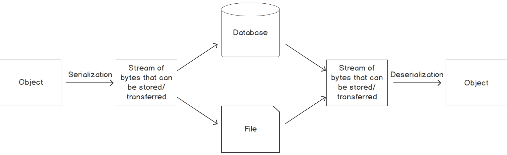

###### 图 5.1：序列化与反序列化

对象是存在于应用程序内存中的东西。我们可以在应用程序中调用其方法或访问其属性。然而，当我们想要传输或存储对象时，我们必须将其转换为可存储或可传输的格式，而这个格式将是一串字节。然后它可以存储在文本文件中，存储在数据库中，或通过互联网传输。将对象转换为字节流的过程称为序列化。这串字节流持久化对象的当前状态，以便稍后可以重新创建。从字节流中重新创建对象的过程称为反序列化。

序列化/反序列化是 RESTful API 开发的一个关键部分。在实际开发过程中，与业务逻辑相关的数据验证通常会包含在序列化和反序列化的实现过程中。

## marshmallow

**marshmallow** 本身是一个用于 Python 中序列化和反序列化的优秀包，同时也提供了验证功能。它允许开发者定义模式，这些模式可以用不同的方式（必需和验证）来表示字段，并在反序列化过程中自动执行验证。在本章中，我们将首先实现一个数据验证函数。我们将使用 marshmallow 包来实现它，以确保用户输入的信息是正确的。我们将通过各种练习和活动与您一起测试使用 Postman 之后的序列化和反序列化。

## 简单模式

我们将使用 marshmallow 的 `Schema` 类来指定我们想要序列化/反序列化的对象的字段。如果我们不知道对象的模式以及我们想要如何序列化字段，我们就无法执行序列化或反序列化。在下面的示例中，你可以看到一个简单的 `SimpleSchema` 类，它扩展了 `marshmallow.Schema`，并且那里定义了两个字段，`id` 和 `username`：

```py
from marshmallow import Schema, fields
class SimpleSchema(Schema):
    id = fields.Int() 
    username = fields.String()
```

字段的类型使用 `marshmallow` 字段定义。从前面的示例中，`id` 字段是一个 `username` 字段是一个 **字符串**。在 marshmallow 中有几种不同的数据类型，包括 **Str**、**Int**、**Bool**、**Float**、**DateTime**、**Email**、**Nested** 等。

在指定了模式之后，我们可以开始进行对象的序列化和反序列化。我们可以在我们的应用程序中序列化对象并在 HTTP 响应中返回它们。或者反过来，我们可以接收用户的请求并将它反序列化为一个对象，以便在应用程序中使用。

### 字段验证

我们也可以在序列化/反序列化过程中添加字段级验证。同样，这可以在模式定义中完成。例如，如果我们想指定一个字段为必需的，我们可以添加 `required=True` 参数。使用相同的 `SimpleSchema` 示例，我们可以指定 `username` 字段为必需的，如下所示：

```py
class SimpleSchema(Schema):
    id = fields.Int() 
    username = fields.String(required=True)
```

如果使用此 `SimpleSchema` 来反序列化用户的 JSON 请求，并且 `username` 字段没有填写，将会出现错误信息，“验证错误”，并且 HTTP 状态码将是**400 Bad Request**：

```py
{
    "message": "Validation errors",
    "errors": {
        "username": [
            "Missing data for the required field."
        ]
    }
}
```

现在我们将学习如何自定义反序列化方法。

### 自定义反序列化方法

我们还可以自定义我们想要反序列化的某些字段的格式。我们可以通过在 marshmallow 中使用 `Method` 字段来实现这一点。一个 `Method` 字段接收一个可选的 `deserialize` 参数，它定义了字段应该如何反序列化。

从下面的 `SimpleSchema` 示例中，我们可以定义一个自定义方法来反序列化 `password` 字段。我们只需要传递 `deserialize='load_password'` 参数。它将调用 `load_password` 方法来反序列化 `password` 字段：

```py
class SimpleSchema(Schema):
    id = fields.Int() 
    username = fields.String(required=True)
    password = fields.Method(required=True, deserialize='load_password')
    def load_password(self, value): 
        return hash_password(value)
```

在下一节中，我们将学习如何使用 `UserSchema` 设计。

## UserSchema 设计

现在我们已经学习了为什么需要使用 `Schema` 以及如何定义一个模式，我们将在我们的 `Smilecook` 应用程序中开始工作。在用户注册的情况下，我们期望用户在一个网页表单中填写他们的信息，然后将详细信息以 JSON 格式发送到服务器。我们的 `Smilecook` 应用程序然后将它反序列化为 `User` 对象，这样我们就可以在我们的应用程序中对其进行操作。

因此，我们需要定义一个 `UserSchema` 类来指定前端发送的 JSON 请求中期望的属性。我们需要以下字段：

+   `id`：使用 `fields.Int()` 来表示一个整数。此外，`dump_only=True` 表示这个属性仅适用于序列化，不适用于反序列化。这是因为 `id` 是自动生成的，不是由用户传入的。

+   `username`：使用 `fields.String()` 来表示一个字符串，并应用 `required=True` 来表示这个属性是必须的。当客户端发送没有用户名的 JSON 数据时，将出现验证错误。

+   `email`：使用 `fields.Email()` 来指示需要 `email` 格式，并应用 `required=True` 来表示这个属性是必须的。

+   `password:fields.Method()` 是一个 `Method` 字段。这里的 `Method` 字段接收一个可选的 `deserialize` 参数，它定义了字段应该如何进行反序列化。我们使用 `deserialize='load_password'` 来表示当使用 `load()` 反序列化时将调用 `load_password(self, value)` 方法。请注意，这个 `load_password(self, value)` 方法仅在 `load()` 反序列化期间被调用。

+   `created_at:fields.DateTime()` 表示时间格式，`dump_only=True` 表示这个属性将仅在序列化时可用。

+   `updated_at:fields.DateTime()` 表示时间格式，`dump_only=True` 表示这个属性将仅在序列化时可用。

在我们的下一个练习中，我们将在 `Smilecook` 项目中安装 marshmallow 包。然后，我们将定义 `UserSchema` 并将其用于 `UserListResource` 和 `UserResource`。

### 练习 33：使用 marshmallow 验证用户数据

首先，我们将使用 marshmallow 进行数据验证。我们将安装 `marshmallow` 包并构建 `UserSchema`，然后将其用于 `UserListResource` 以传输 `User` 对象：

1.  我们将首先安装 marshmallow 包。请在 `requirements.txt` 中输入以下内容：

    ```py
    marshmallow==2.19.5
    ```

1.  运行 `pip install` 命令：

    ```py
    pip install -r requirements.txt
    ```

    你应该看到以下结果：

    ```py
    Installing collected packages: marshmallow
    Successfully installed marshmallow-2.19.5
    ```

1.  在 `Smilecook` 项目下创建一个文件夹，命名为 `schemas`。我们将在这里存储所有的模式文件。

1.  在该目录下创建一个 `user.py` 文件，并输入以下代码。使用模式来定义我们期望客户端请求内容的基本结构。以下代码创建 `UserSchema` 以定义我们将接收到的客户端请求中的属性：

    ```py
    from marshmallow import Schema, fields
    from utils import hash_password
    class UserSchema(Schema):
        class Meta:
            ordered = True
        id = fields.Int(dump_only=True)
        username = fields.String(required=True)
        email = fields.Email(required=True)
        password = fields.Method(required=True, deserialize='load_password')
        created_at = fields.DateTime(dump_only=True)
        updated_at = fields.DateTime(dump_only=True)
        def load_password(self, value):
            return hash_password(value)
    ```

    在定义`UserSchema`之前，我们首先需要从 marshmallow 导入`Schema`和`fields`。所有自定义的 marshmallow 模式都必须继承`marshmallow.Schema`。然后，我们导入`hash_password`，并在`UserSchema`中定义四个属性：`id`、`username`、`email`和`password`。

1.  在`resources/user.py`中添加以下代码。我们将首先从上一步导入`UserSchema`类，并在本处实例化两个`UserSchema`对象。其中一个用于公共用途，我们可以看到电子邮件被排除在外：

    ```py
    from schemas.user import UserSchema
    user_schema = UserSchema()
    user_public_schema = UserSchema(exclude=('email', ))
    ```

    对于我们的`用户`资源，当认证用户访问其`users/<username>`端点时，他们可以获取`id`、`username`和`email`。但如果他们未认证或访问其他人的`/users/<username>`端点，则电子邮件地址将被隐藏。

1.  我们将修改`UserListResource`如下，以验证用户请求中的数据：

    ```py
    class UserListResource(Resource):
        def post(self):
            json_data = request.get_json()
            data, errors = user_schema.load(data=json_data)
            if errors:
                return {'message': 'Validation errors', 'errors': errors}, HTTPStatus.BAD_REQUEST
    ```

1.  在相同的`UserListResource.post`中，如果没有错误，我们将继续进行。它将检查`username`和`email`是否存在，如果一切正常，我们将使用`User(**data)`创建用户实例，`**data`将为`User`类提供关键字参数，然后我们使用`user.save()`将事物存储在数据库中：

    ```py
            if User.get_by_username(data.get('username')):
                return {'message': 'username already used'}, HTTPStatus.BAD_REQUEST
            if User.get_by_email(data.get('email')):
                return {'message': 'email already used'}, HTTPStatus.BAD_REQUEST
            user = User(**data)
            user.save()
    ```

1.  最后，在`UsersLitResource.post`中，我们也使用`user_schema.dump(user).data`来返回成功注册的用户数据。它将包含`id`、`username`、`created_at`、`updated_at`和`email`：

    ```py
            return user_schema.dump(user).data, HTTPStatus.CREATED
    ```

1.  接下来，我们将修改`UserResource`。在这里，我们将看到使用`user_schema`和`user_public_schema`进行电子邮件过滤和不进行过滤之间的区别：

    ```py
    class UserResource(Resource):
        @jwt_optional
        def get(self, username):
            user = User.get_by_username(username=username)
            if user is None:
                return {'message': 'user not found'}, HTTPStatus.NOT_FOUND
            current_user = get_jwt_identity()
            if current_user == user.id:
                data = user_schema.dump(user).data
            else:
                data = user_public_schema.dump(user).data
            return data, HTTPStatus.OK
    ```

    当用户向`/users/<username/>`发送请求时，我们将获取他们的用户名。如果找不到用户，我们将获取`user_schema.dump(user).data`，其中包含所有信息。否则，将使用`user_public_schema.dump(user).data`，它不包括电子邮件信息。最后，它将返回带有 HTTP 状态码**200 OK**的数据。

1.  接下来，我们将修改`MeResource`。它将使用`user_schema.dump(user).data`进行序列化，其中包含用户的所有信息：

    ```py
    class MeResource(Resource):
        @ jwt_required
        def get(self): 
             user = User.get_by_id(id=get_jwt_identity())
             return user_schema.dump(user).data, HTTPStatus.OK
    ```

1.  保存`app.py`，然后右键单击它以运行应用程序。然后 Flask 将在本地主机（`127.0.0.1`）的端口`5000`上启动并运行：![图 5.2：运行应用程序，然后在本地主机上运行 Flask]

    ![图片 C15309_05_02.jpg]

###### ![图 5.2：运行应用程序，然后在本地主机上运行 Flask]

因此，我们已经完成了将棉花糖添加到图片中的工作。从现在开始，当我们在前端和后端之间传输`User`对象时，它将首先进行序列化/反序列化。在这个过程中，我们可以利用 marshmallow 提供的数据验证函数来使我们的 API 端点更加安全。

### 练习 34：在认证前后测试用户端点

在之前的练习中，我们实现了不同的用户模式，一个用于私有查看，一个用于公共查看。在这个练习中，我们将测试它们是否按预期工作。我们将检查 HTTP 响应中的数据，并验证在认证前后我们是否得到不同的用户信息。我们希望从公共中隐藏用户的电子邮件地址，以保护用户隐私。

我们将使用 Postman 进行整个测试。让我们开始吧！

1.  在用户登录前检查 `user` 详情。我们不应该在结果中看到用户的电子邮件地址。点击 **集合** 选项卡。

1.  选择 **GET User** 请求。

1.  在 URL 字段中输入 `http://localhost:5000/users/james`。你可以将用户名 `James` 替换为任何合适的用户名。

1.  点击 `user` 详情。在响应体中，我们可以看到 James 的用户详情。我们可以看到 `username`、`created_at`、`updated_at` 和 `id`，但没有电子邮件地址。

1.  现在，让我们使用 Postman 登录。选择 **POST Token** 请求。点击 **发送** 进行登录。结果如下所示：

1.  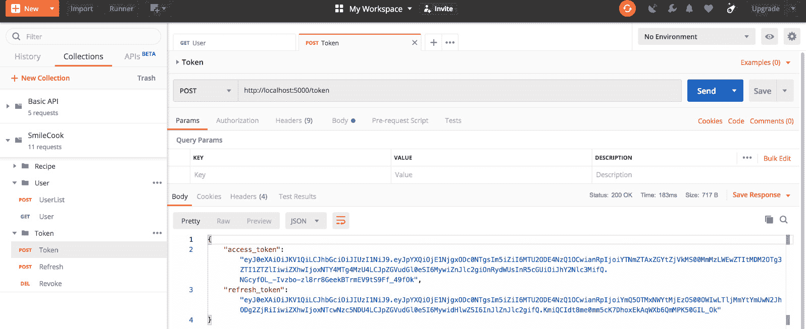

    ###### 图 5.4：登录并选择 POST Token 请求

    然后，你会看到访问令牌和刷新令牌的响应体。

1.  在用户登录后检查 `user` 详情。你应该在结果中看到用户的电子邮件地址。点击 **集合** 选项卡。选择 **GET User**。选择 **头部** 选项卡。

1.  在我们获得的 JWT 令牌的 `Bearer {token}` 中输入 `Authorization`。

1.  点击 **发送** 检查 James 的用户详情。结果如下所示：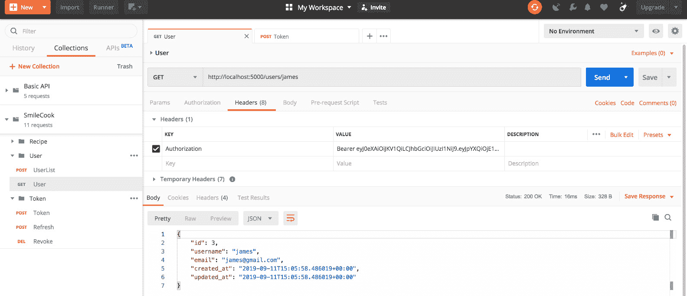

###### 图 5.5：用户登录后查看详情

然后，你会看到返回的响应。在响应体中，我们可以看到 James 的用户详情。我们可以看到他的所有信息，包括电子邮件地址。

因此，通过使用用户模式中的 `exclude` 参数，我们可以轻松地排除某些敏感字段在 HTTP 响应中显示。除了 `exclude` 参数之外，marshmallow 还有一个 `include` 参数，如果你感兴趣，可以自己进一步探索。

## RecipeSchema 设计

因此，我们已经对 `User` 对象进行了序列化和反序列化。现在我们将为 `Recipe` 对象设计模式。在 `Recipe` 更新的情况下，我们期望用户在一个网页表单中填写更新的食谱详情，然后将详情以 JSON 格式发送到服务器。我们的 `Smilecook` 应用程序然后将它反序列化为 `Recipe` 对象，我们可以在应用程序中对其进行操作。

`RecipeSchema` 应该继承 `marshmallow.Schema` 并包含以下属性：

+   `id`: 使用 `fields.Int()` 来表示一个整数，并应用 `dump_only=True` 来指定这个属性仅用于序列化。

+   `name`：使用 `fields.String()` 来表示一个字符串，并应用 `required=True` 来指示此属性是必需的。

+   `description`：使用 `fields.String()` 来表示一个字符串。

+   `num_of_servings`：使用 `fields.Int()` 来表示一个整数。

+   `cook_time`：使用 `fields.Int()` 来表示一个整数。

+   `directions`：使用 `fields.String()` 来表示一个字符串。

+   `is_publish`：使用 `fields.Boolean()` 来表示布尔值，并应用 `dump_only=True` 来指定此属性仅可用于序列化。

+   `author`：此属性用于显示菜谱的作者。

+   `created_at`：使用 `fields.DateTime` 来表示时间的格式，`dump_only=True` 表示此属性仅可用于序列化。

+   `updated_at`：使用 `fields.DateTime` 来表示时间的格式，`dump_only=True` 表示此属性仅可用于序列化。

### 练习 35：实现 RecipeSchema

现在我们已经构思了 `RecipeSchema` 的设计。在这个练习中，我们将通过实现 `RecipeSchema` 来学习更多关于 marshmallow 的知识。我们不仅可以验证 `fields` 的数据类型，还可以构建自己的验证函数。让我们开始吧：

1.  首先，我们导入 `schema`、`fields`、`post_dump`、`validate`、`validates` 和 `ValidationError`，并在 `schemas/recipe.py` 文件中输入以下代码来创建 `recipe schema`：

    ```py
    from marshmallow import Schema, fields, post_dump, validate, validates, ValidationError
    class RecipeSchema(Schema):
        class Meta:
            ordered = True
        id = fields.Integer(dump_only=True)
        name = fields.String(required=True, validate=[validate.Length(max=100)])
        description = fields.String(validate=[validate.Length(max=200)])
        directions = fields.String(validate=[validate.Length(max=1000)])
        is_publish = fields.Boolean(dump_only=True)
        created_at = fields.DateTime(dump_only=True)
        updated_at = fields.DateTime(dump_only=True)
    ```

    我们可以通过传递 `validate` 参数来对字段执行额外的验证。我们使用 `validate.Length(max=100)` 来限制此属性的最大长度为 `100`。当它超过 `100` 时，将触发验证错误。这可以防止用户传递过长的字符串，从而给我们的数据库带来负担。使用 marshmallow 的 `validation` 函数可以轻松防止这种情况。

1.  然后，我们在 `RecipeSchema` 中定义 `validate_num_of_servings(n)` 方法，这是一个自定义的验证函数。这将验证此属性的最小值为 `1`，且不能大于 `50`。如果其值不在此范围内，它将引发错误信息：

    ```py
    def validate_num_of_servings(n):
        if n < 1:
            raise ValidationError('Number of servings must be greater than 0.')
        if n > 50:
            raise ValidationError('Number of servings must not be greater than 50.')
    ```

1.  接下来，在 `RecipeSchema` 中添加 `num_of_servings` 属性。使用 `validate=validate_num_of_servings` 来链接到我们的自定义函数，该函数将验证此菜谱的份量数：

    ```py
    num_of_servings = fields.Integer(validate=validate_num_of_servings)
    ```

1.  我们还可以通过添加自定义验证方法来添加另一个方法。我们可以在 `RecipeSchema` 中添加 `cooktime` 属性：

    ```py
    cook_time = fields.Integer()
    ```

1.  然后，在 `RecipeSchema` 中，使用 `@validates('cook_time')` 装饰器来定义验证方法。当验证 `cook_time` 属性时，它将调用 `validate_cook_time` 方法来指定烹饪时间应在 1 分钟到 300 分钟之间：

    ```py
        @validates('cook_time')
        def validate_cook_time(self, value):
            if value < 1:
                raise ValidationError('Cook time must be greater than 0.')
            if value > 300:
                raise ValidationError('Cook time must not be greater than 300.')
    ```

1.  在 `schemas/recipe.py` 文件之上，导入 `UserSchema` 从 marshmallow，因为我们将在显示菜谱信息时一起显示作者信息：

    ```py
    from schemas.user import UserSchema
    ```

1.  然后，在`RecipeSchema`中定义属性`author`。我们使用`fields.Nested`将此属性链接到外部对象，在这种情况下是`UserSchema`：

    ```py
    author = fields.Nested(UserSchema, attribute='user', dump_only=True, only=['id', 'username'])
    ```

    为了避免任何混淆，此属性在 JSON 响应中命名为`author`，但原始属性名是`user`。此外，`dump_only=True`表示此属性仅可用于序列化。最后，添加`only=['id', 'username']`以指定我们只显示用户的 ID 和用户名。

1.  此外，我们添加了`@post_dump(pass_many=True)`装饰器，以便在配方序列化时进行进一步处理。代码如下：

    ```py
        @post_dump(pass_many=True)
        def wrap(self, data, many, **kwargs):
            if many:
                return {'data': data}
            return data
    ```

    在只返回一个配方的情况下，它将简单地以 JSON 字符串的形式返回。但是当我们返回多个配方时，我们将配方存储在列表中，并使用 JSON 中的`{'data': data}`格式返回它们。这种格式将对我们开发分页功能有益。

1.  `schemas/recipe.py`中的代码现在应该如下所示——请检查它：

    ```py
    from marshmallow import Schema, fields, post_dump, validate, validates, ValidationError
    from schemas.user import UserSchema
    def validate_num_of_servings(n):
        if n < 1:
            raise ValidationError('Number of servings must be greater than 0.')
        if n > 50:
            raise ValidationError('Number of servings must not be greater than 50.')
    class RecipeSchema(Schema):
        class Meta:
            ordered = True
        id = fields.Integer(dump_only=True)
        name = fields.String(required=True, validate=[validate.Length(max=100)])
        description = fields.String(validate=[validate.Length(max=200)])
        num_of_servings = fields.Integer(validate=validate_num_of_servings)
        cook_time = fields.Integer()
        directions = fields.String(validate=[validate.Length(max=1000)])
        is_publish = fields.Boolean(dump_only=True)
        author = fields.Nested(UserSchema, attribute='user', dump_only=True, only=['id', 'username'])
        created_at = fields.DateTime(dump_only=True)
        updated_at = fields.DateTime(dump_only=True)
        @post_dump(pass_many=True)
        def wrap(self, data, many, **kwargs):
            if many:
                return {'data': data}
            return data
        @validates('cook_time')
        def validate_cook_time(self, value):
            if value < 1:
                raise ValidationError('Cook time must be greater than 0.')
            if value > 300:
                raise ValidationError('Cook time must not be greater than 300.'
    ```

    一旦我们完成了配方模式，我们就可以开始在相关资源中使用它。

1.  然后，我们将修改`resources/recipe.py`如下所示：

    ```py
    from schemas.recipe import RecipeSchema
    recipe_schema = RecipeSchema()
    recipe_list_schema = RecipeSchema(many=True)
    ```

    我们首先从`schemas.recipe`导入`RecipeSchema`，然后定义`recipe_schema`变量和`recipe_list_schema`；它们用于存储单个和多个配方。

1.  修改`RecipeListResource`的`get`方法，使用`recipe_list_schema.dump(recipes).data`方法将所有已发布的配方返回给客户端：

    ```py
    class RecipeListResource(Resource):
        def get(self):
            recipes = Recipe.get_all_published()
            return recipe_list_schema.dump(recipes).data, HTTPStatus.OK
    ```

1.  修改`RecipeListResource`的`post`方法以使用配方模式：

    ```py
        @jwt_required
        def post(self):
            json_data = request.get_json()
            current_user = get_jwt_identity()
            data, errors = recipe_schema.load(data=json_data)
            if errors:
                return {'message': "Validation errors", 'errors': errors}, HTTPStatus.BAD_REQUEST
            recipe = Recipe(**data)
            recipe.user_id = current_user
            recipe.save()
            return recipe_schema.dump(recipe).data, HTTPStatus.CREATED
    ```

    接收到 JSON 数据后，通过`recipe_schema.load(data=json_data)`验证数据。如果有错误，将使用`Recipe(**data)`创建一个`recipe`对象，然后通过`recipe.user_id = current_user`将其指定为当前登录用户的 ID。然后，通过`recipe.save()`将配方保存到存储库，并最终使用`recipe_schema.dump(recipe).data`将 JSON 转换为客户端，并带有 HTTP 状态码**201 CREATED**消息。

1.  由于我们的数据渲染是通过棉花糖完成的，因此我们不需要在配方中使用`data`方法，所以我们可以从`model/recipe.py`中删除`data`方法。也就是说，从文件中删除以下代码：

    ```py
        def data(self):
            return {
                'id': self.id,
                'name': self.name,
                'description': self.description,
                'num_of_servings': self.num_of_servings,
                'cook_time': self.cook_time,
                'directions': self.directions,
                'user_id': self.user_id
            }
    ```

1.  现在我们已经完成了实现。右键单击它以运行应用程序。然后 Flask 将在本地主机（`127.0.0.1`）的端口`5000`上启动并运行：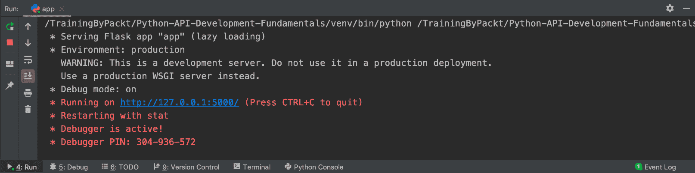

###### 图 5.6：运行应用程序，然后在本地主机上运行 Flask

因此，我们刚刚完成了`RecipeSchema`的工作，以及修改 API 端点以使用序列化/反序列化方法传输对象。在下一个练习中，我们将测试我们的实现是否有效。

### 练习 36：测试配方 API

为了测试对象的序列化/反序列化是否正常工作，我们还需要在 Postman 中再次进行测试。这个练习是为了测试使用 Postman 创建和获取所有食谱详情。

1.  首先，登录账户。我们之前的令牌只有效 15 分钟。如果它过期，我们需要通过`/token`再次登录或使用**Refresh**令牌重新获取令牌。点击**Collections**标签页。

1.  选择**POST Token**请求。

1.  点击**Send**进行登录。结果如下所示：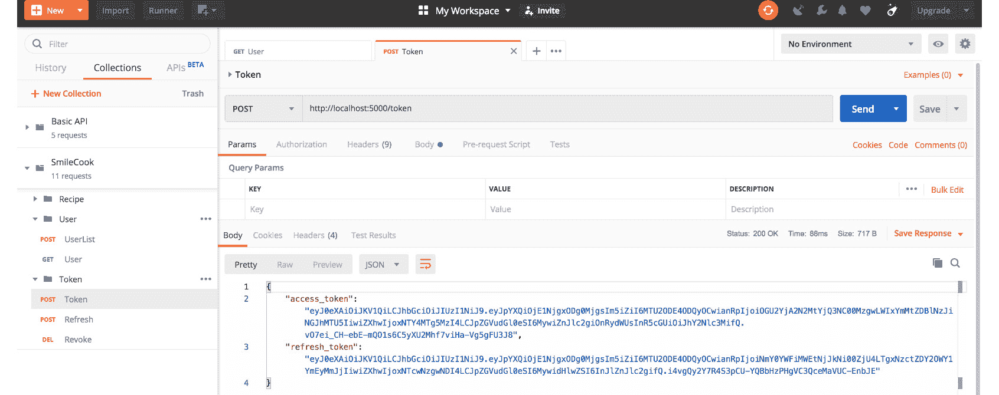

    ###### 图 5.7：登录账户并选择 POST Token 请求

    你将看到返回的响应，**HTTP 状态是 200 OK**，表示登录成功，我们将在响应体中看到访问令牌。这个访问令牌将在后续步骤中使用。

1.  接下来，我们将创建一个新的食谱。点击**Collections**标签页。选择**POST RecipeList**。

1.  在我们上一步获取的 JWT 令牌中的`Bearer {token}`中选择`Authorization`。

1.  选择**Body**标签页。按照以下内容填写食谱详情：

    ```py
    {
        "name": "Blueberry Smoothie",
        "description": "This is a lovely Blueberry Smoothie",
        "num_of_servings": 2,
        "cook_time": 10,
        "directions": "This is how you make it"
    }
    ```

1.  点击**Send**创建一个新的食谱。结果如下所示：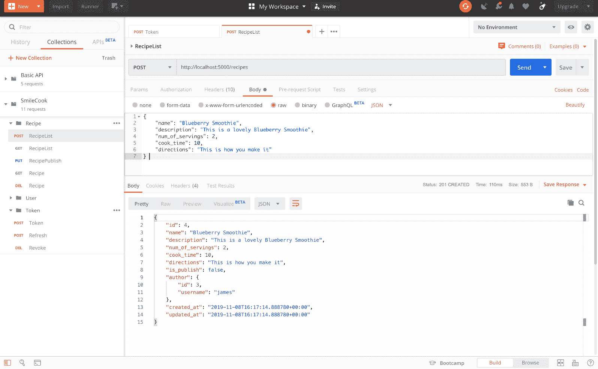

    ###### 图 5.8：创建一个新的食谱

    你将看到返回的响应，**HTTP 状态是 201 CREATED**，表示新食谱已成功创建。在响应体中，我们可以看到食谱详情。我们还可以看到以嵌套格式显示的作者详情。

1.  然后，我们将使用`id = 4`发布食谱。点击**Enter request URL**中的`http://localhost:5000/recipes/4/publish`。

1.  在`id = 4`的`Bearer {token}`中选择`Authorization`。结果如下所示：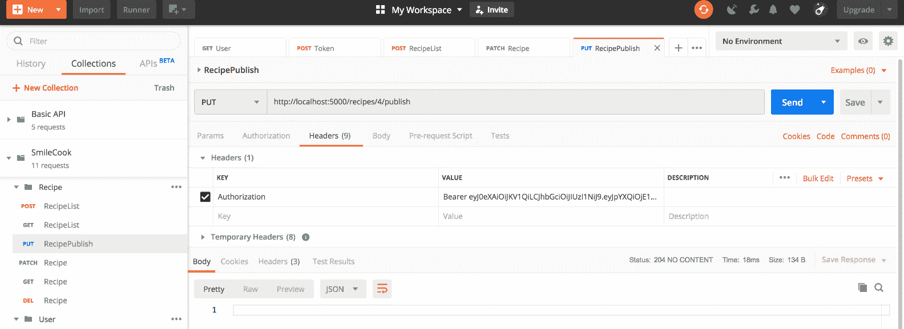

    ###### 图 5.9：发布 ID 为 4 的食谱

    你将看到返回的响应，HTTP 状态是**204 NO CONTENT**，表示已成功发布。你将在正文中看到没有内容。

1.  然后，我们将获取所有食谱。选择**GET RecipeList**请求。点击**Send**以获取所有食谱。结果如下所示：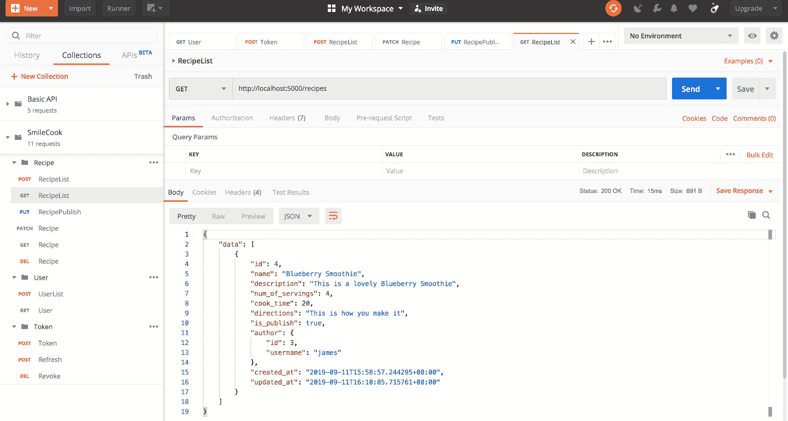

###### 图 5.10：通过选择 GET RecipeList 请求获取所有食谱

你将看到返回的响应，HTTP 状态是**200 OK**，表示我们已成功检索到所有食谱详情。在响应体中，我们可以看到一个数据列表，其中包含所有已发布的食谱。

因此，我们已经成功实现了对食谱相关 API 端点的序列化（创建食谱）和反序列化（检索食谱）的测试。我们在这一方面取得了良好的进展！

## PATCH 方法

我们一直在使用`PUT`HTTP 方法进行数据更新。然而，`PUT`方法的实际用法是`PUT /items/1`意味着替换`/items/1`中的所有内容。如果该项目已存在，它将被替换。否则，它将创建一个新的项目。`PUT`必须包含`items/1`的所有属性数据。

这似乎在所有情况下都不太有效。如果你只想更新`items/1`的其中一个属性，你需要重新传输`items/1`的所有属性到服务器，这非常低效。因此，有一个新的 HTTP 方法：`PATCH`方法被发明出来以进行部分更新。使用此方法，我们只需要将需要修改的属性传递到服务器。

### 练习 37：使用 PATCH 方法更新食谱

在这个练习中，我们将将食谱更新方法从`PUT`更改为`PATCH`。我们还将使用序列化/反序列化方法来传输食谱。最后，我们将在 Postman 中测试我们的更改，以确保一切按预期工作。这个练习的目的是在更新食谱数据时减少带宽和服务器处理资源：

1.  在`RecipeListResource`中创建`patch`方法。我们首先使用`request.get_json()`获取客户端发送的 JSON 食谱详细信息，然后使用`recipe_schema.load(data=json_data, partial=('name',))`来验证数据格式。我们使用`partial=('name',)`是因为原始名称是模式中的必填字段。当客户端只想更新单个属性时，使用`partial`允许我们指定`Name`属性是可选的，因此即使我们没有传递此属性也不会发生错误：

    ```py
       @jwt_required
        def patch(self, recipe_id):
            json_data = request.get_json()
            data, errors = recipe_schema.load(data=json_data, partial=('name',))
    ```

1.  然后，在同一个`patch`方法中，我们将检查是否有错误消息。如果有，它将返回**HTTP 状态码 400 错误请求**的错误消息。如果验证通过，然后检查用户是否有权更新此食谱。如果没有，将返回**HTTP 状态码禁止 403**：

    ```py
            if errors:
                return {'message': 'Validation errors', 'errors': errors}, HTTPStatus.BAD_REQUEST
            recipe = Recipe.get_by_id(recipe_id=recipe_id)
            if recipe is None:
                return {'message': 'Recipe not found'}, HTTPStatus.NOT_FOUND
            current_user = get_jwt_identity()
            if current_user != recipe.user_id:
                return {'message': 'Access is not allowed'}, HTTPStatus.FORBIDDEN
    ```

1.  我们继续在同一个`patch`方法上工作。`recipe.name = data.get('name') or recipe.name`意味着它将尝试获取数据的键值名称。如果此值存在，它将被使用。否则，`recipe.name`将保持不变。这基本上是我们如何进行更新的：

    ```py
            recipe.name = data.get('name') or recipe.name
            recipe.description = data.get('description') or recipe.description
            recipe.num_of_servings = data.get('num_of_servings') or recipe.num_of_servings
            recipe.cook_time = data.get('cook_time') or recipe.cook_time
            recipe.directions = data.get('directions') or recipe.directions
    ```

1.  在同一个`patch`方法中，我们使用`save`方法将所有内容保存到数据库，并以 JSON 格式返回食谱数据：

    ```py
            recipe.save()
            return recipe_schema.dump(recipe).data, HTTPStatus.OK
    ```

1.  现在我们已经有了新的`patch`方法。右键单击它以运行应用程序。Flask 将在本地主机（`127.0.0.1`）的端口`5000`上启动并运行：

    ###### 图 5.11：运行应用程序然后在本地主机上运行 Flask

    接下来，我们将使用`id = 4`更新食谱。我们只更新两个字段：`num_of_servings`和`cook_time`。

1.  点击**收藏夹**选项卡。选择**PUT Recipe**请求。将**HTTP**方法从**PUT**更改为**PATCH**。

1.  在我们之前练习中获得的 `JWT` 令牌中的 `Bearer {token}` 中选择 `Authorization`。

1.  选择 **Body** 选项卡。在 **Body** 字段中输入以下内容：

    ```py
    {
        "num_of_servings": 4,
        "cook_time": 20
    }
    ```

    点击 **发送** 更新食谱。结果如下截图所示：

    ![图 5.12：更新食谱]

    ![图片 C15309_05_12.jpg]

###### 图 5.12：更新食谱

您将看到返回的响应中 `num_of_servings` 和 `cook_time` 已更新。我们还可以看到 `updated_at` 时间戳也已自动更新。

### 搜索作者和未发布的食谱

在`Smilecook`平台上，将会有来自世界各地的许多不同的美食爱好者（在这里，我们称他们为作者）分享他们的食谱。在这些杰出的作者中，我们肯定会有一个喜欢的作者，并且我们肯定想学习他们所有的食谱。因此，我们增加了一个新的端点（或功能），即列出特定作者的食谱。这个端点不仅列出了某个美食家发布的所有食谱，还可以允许作者搜索他们所有已发布/未发布的食谱。

### 使用 `webargs` 包解析请求参数

请求参数，也称为查询字符串，是我们可以通过 URL 传递的参数。例如，在 URL `http://localhost/testing?abc=123` 中，`abc=123` 是请求参数。

`GET http://localhost:5000/user/{username}/recipes`，以获取特定作者的已发布食谱。对于这个端点，我们将传递可见性请求参数。`visibility` 请求参数可以具有 `public`、`private` 或 `all` 的值。默认值是 `public`。如果是 `private` 或 `all`，用户需要先进行认证。

如果您只想获取未发布的食谱，可以添加请求参数 `visibility=private`。因此，URL 将看起来像这样：`http://localhost:5000/user/{username}/recipes?visibility=private`。`webargs` 包提供了解析这个 `visibility=private` 参数的函数，然后我们的 `Smilecook` 应用程序将知道这个请求是要求获取食谱的私人信息。然后，我们的 `Smilecook` 应用程序将确定认证用户是否是作者。如果是，它将返回所有未发布的食谱。否则，用户没有权限查看未发布的食谱。

### 练习 38：在食谱上实现访问控制

在这个练习中，我们将实现食谱的访问控制。因此，只有认证用户才能看到他们所有的食谱，包括未发布的食谱。用户将通过使用 `request` 参数传递 `visibility` 模式。我们使用 `webargs` 解析可见模式，并相应地返回已发布、未发布或所有食谱：

1.  在 `models/recipe.py` 中的 `Recipe` 类中创建 `get_all_by_user` 方法：

    ```py
        @classmethod
        def get_all_by_user(cls, user_id, visibility='public'):
            if visibility == 'public':
                return cls.query.filter_by(user_id=user_id, is_publish=True).all()
            elif visibility == 'private':
                return cls.query.filter_by(user_id=user_id, is_publish=False).all()
            else:
                return cls.query.filter_by(user_id=user_id).all()
    ```

    此方法需要接收 `user_id` 和 `visibility`。如果 `visibility` 未定义，则默认为 `public`。如果 `visibility` 是 `public`，它将根据 `user_id` 和 `is_publish=True` 获取所有食谱。如果 `visibility` 是 `private`，它将搜索 `is_publish=False` 的食谱。如果 `visibility` 不是 `public` 或 `private`，它将获取此用户的全部食谱。

1.  我们将安装 `webargs` 包，这是一个用于解释和验证 HTTP 参数（例如，`visibility`）的包。请在 `requirements.txt` 中添加以下包：

    ```py
    webargs==5.4.0
    ```

1.  使用以下命令安装包：

    ```py
    pip install -r requirements.txt
    ```

    你应该看到以下类似的结果：

    ```py
    Installing collected packages: webargs
    Successfully installed webargs-5.4.0
    ```

1.  在 `resources/user.py` 中导入必要的模块、函数和类：

    ```py
    from flask import request
    from flask_restful import Resource
    from flask_jwt_extended import get_jwt_identity, jwt_required, jwt_optional
    from http import HTTPStatus
    from webargs import fields
    from webargs.flaskparser import use_kwargs
    from models.recipe import Recipe
    from models.user import User
    from schemas.recipe import RecipeSchema
    from schemas.user import UserSchema
    ```

    首先，导入 `webargs.fields` 和 `webargs.flaskparser.use_kwargs`，然后我们需要使用食谱数据，因此还需要导入食谱模型和模式。

1.  然后，我们将声明 `recipe_list_schema` 变量。使用 `RecipeSchema` 并带有 `many=True` 参数。这是为了表明我们将有多个食谱：

    ```py
    recipe_list_schema = RecipeSchema(many=True)
    ```

1.  然后，我们将创建 `UserRecipeListResource` 类。此资源主要用于获取特定用户的食谱。请参考以下代码：

    ```py
    class UserRecipeListResource(Resource):
        @jwt_optional
        @use_kwargs('visibility': fields.Str(missing='public')})
        def get(self, username, visibility):
    ```

    首先，定义 `@jwt_optional` 表示此端点可以在用户未登录的情况下访问。然后，使用 `@use_kwargs({'visibility': fields.Str(missing='public')})` 指定我们期望在这里接收 `visibility` 参数。如果参数不存在，默认将是 `public`。然后，`visibility` 参数将被传递到 `def get(self, username, visibility)`。

1.  我们将在 `UserRecipeListResource.get` 中实现访问控制。如果用户名（食谱的作者）是当前认证的用户，则他们可以查看所有食谱，包括私有的。否则，他们只能查看已发布的食谱：

    ```py
    def get(self, username, visibility):
            user = User.get_by_username(username=username)
            if user is None:
                return {'message': 'User not found'}, HTTPStatus.NOT_FOUND
            current_user = get_jwt_identity()
            if current_user == user.id and visibility in ['all', 'private']:
                pass
            else:
                visibility = 'public'
            recipes = Recipe.get_all_by_user(user_id=user.id, visibility=visibility)
            return recipe_list_schema.dump(recipes).data, HTTPStatus.OK
    ```

    然后通过 `User.get_by_username(username=username)` 获取用户。如果用户找不到，将返回 HTTP 状态码 `get_jwt_identity()` 并将其保存到 `current_user` 变量中。

    根据用户及其权限，我们将显示不同的食谱集合。在获取食谱后，使用 `recipe_list_schema.dump(recipes).data` 将食谱转换为 JSON 格式，并带有 HTTP 状态码 **200 OK** 返回给客户端。

1.  然后，在 `app.py` 中导入 `UserRecipeListResource`：

    ```py
    from resources.user import UserListResource, UserResource, MeResource, UserRecipeListResource
    ```

1.  最后，添加以下端点：

    ```py
    api.add_resource(UserListResource, '/users')
    api.add_resource(UserResource, '/users/<string:username>')
    api.add_resource(UserRecipeListResource, '/users/<string:username>/recipes')
    ```

1.  现在，我们已经完成了实现。右键单击它以运行应用程序。Flask 将在本地主机 (`127.0.0.1`) 的端口 `5000` 上启动并运行：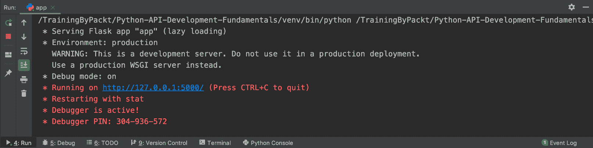

###### 图 5.13：在本地主机上运行 Flask

现在我们已经学习了如何使用 `webargs` 解析 `request` 参数，并将其应用于我们的 `Smilecook` 应用程序。接下来，像往常一样，我们想要测试并确保它正常工作。

### 练习 39：从特定作者检索食谱

这个练习是为了测试我们在上一个练习中实现的内容。我们将确保 API 能够解析用户传入的可见性模式，并相应地返回不同的食谱集合。我们将使用特定的用户（James）进行测试。我们将看到在认证前后，用户将能够看到不同的食谱集合：

1.  在用户登录之前，我们将获取特定用户的全部已发布食谱。首先，点击**收藏集**标签。

1.  在`UserRecipeList`下添加一个新的请求并保存。

1.  在**URL**字段中选择新创建的`http://localhost:5000/users/james/recipes`（如有必要，更改用户名）。

1.  点击**发送**以检查特定用户（此处为 James）下的所有已发布食谱。结果如下所示：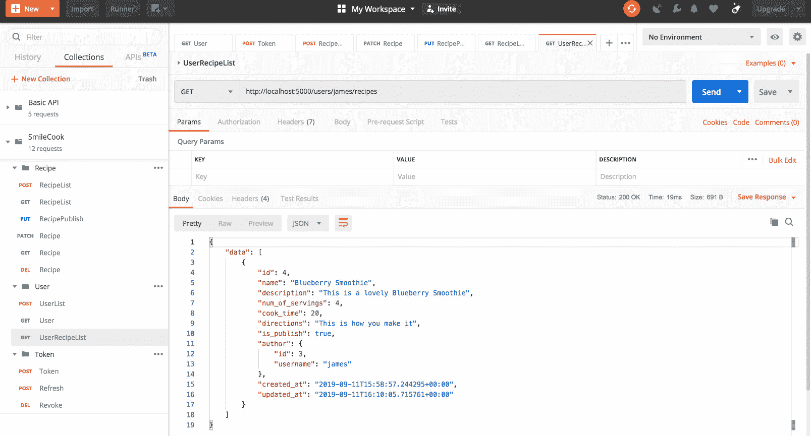

    ###### 图 5.14：在用户登录之前获取用户的全部已发布食谱

    然后，您将看到返回的响应。这里的 HTTP 状态码**200 OK**表示请求已成功，在正文中，我们可以看到这位作者下有一个已发布的食谱。

1.  与上一步类似，我们将查看在用户登录之前是否可以获取特定用户下的所有食谱——这不应该被允许。选择`可见性`。设置为`all`。点击**发送**以检查特定用户下的所有食谱。结果如下所示：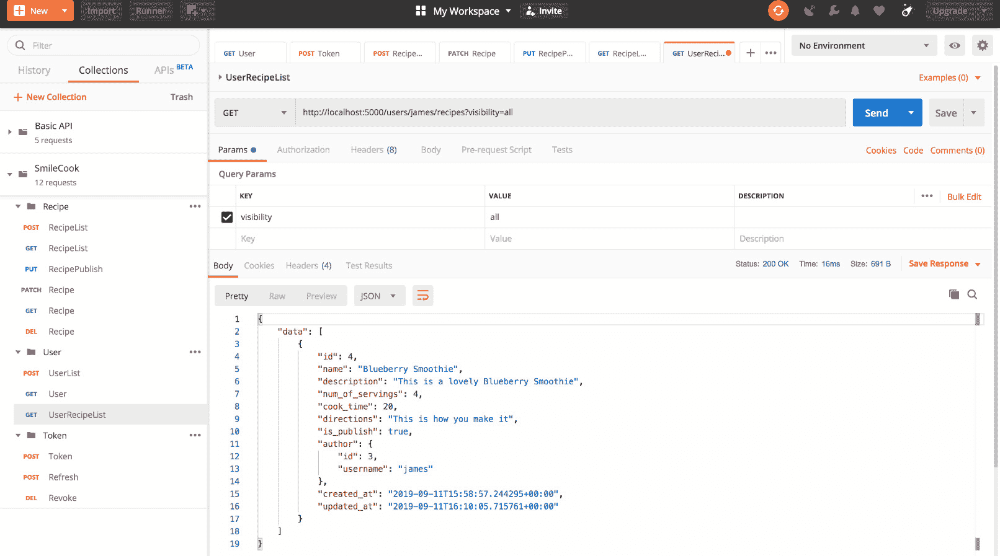

    ###### 图 5.15：检查特定用户下的所有食谱

    然后，您将看到返回的响应。这里的 HTTP 状态码**200 OK**表示请求已成功，在正文中再次显示，尽管我们请求所有食谱，但我们只能看到这位作者下有一个已发布的食谱，因为用户尚未登录。

1.  登录并点击**收藏集**标签。选择**POST** **Token**请求。点击**发送**以检查特定用户下的所有食谱。结果如下所示：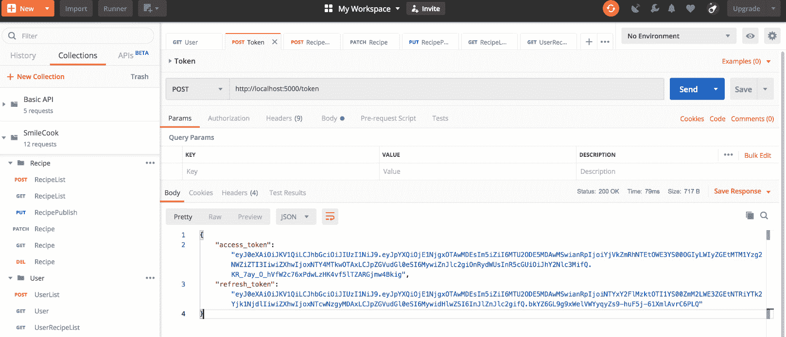

    ###### 图 5.16：选择 POST 令牌请求并发送请求

    然后，您将看到返回的响应。这里的**HTTP 状态码 200 OK**表示请求已成功，在正文中，我们可以获取到我们将用于下一步的访问令牌和刷新令牌。

1.  在**值**字段中选择`Bearer {token}`中的`Authorization`，其中令牌是我们上一步中获得的**JWT**令牌。点击**发送**进行查询。结果如下所示：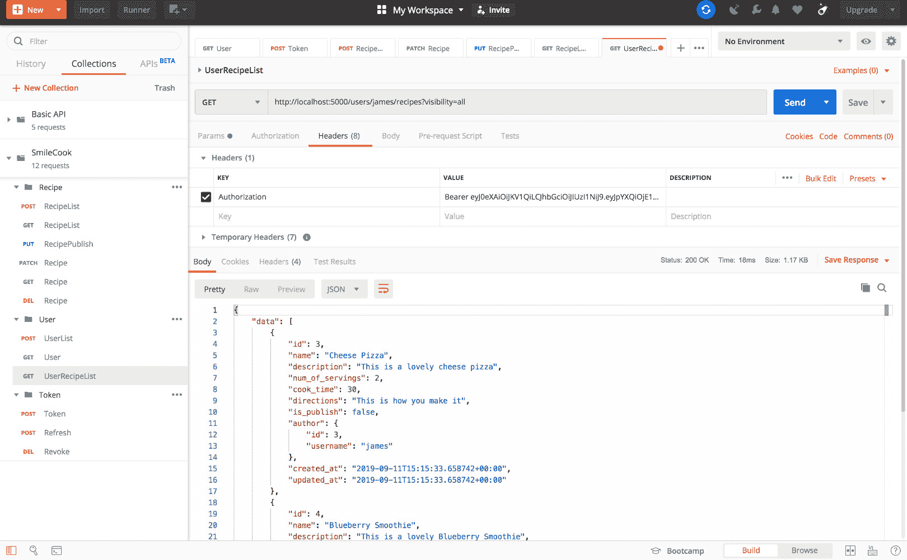

###### 图 5.17：使用 JWT 令牌并发送查询

您将看到返回的响应。这里的**HTTP 状态码 200 OK**表示请求已成功。在响应体中，我们可以获取此用户下的所有食谱，包括未发布的食谱。

这个测试练习总结了我们对`webargs`包的了解，以及测试了我们为查看食谱添加的新访问控制功能。

### 活动八：使用 Marshmallow 序列化食谱对象

在这个活动中，我们希望您专注于`RecipeResource.get`方法的序列化。我们之前在练习中已经对`User`和`RecipeList`进行了序列化。现在，轮到您处理这个最后的任务了。

目前，`RecipeResource.get`正在使用`recipe.data()`返回`recipe`对象。我们希望您用 Marshmallow 序列化`recipe`对象来替换它。`recipe`对象应转换为 JSON 格式并返回到前端客户端。为此，您需要修改`resources/recipe.py`中的`recipe_schema`。您还必须在最后使用 Postman 测试您的实现。

执行以下步骤：

1.  修改食谱模式，包括所有属性，除了`email`。

1.  将`RecipeResource`中的`get`方法修改为使用食谱模式将`recipe`对象序列化为 JSON 格式。

1.  运行应用程序，以便 Flask 在本地主机上启动和运行。

1.  通过 Postman 获取一个特定的已发布食谱来测试实现。

    #### 注意

    活动的解决方案可以在第 312 页找到。

在这个活动之后，您应该对如何使用模式来序列化对象有很好的理解。我们可以灵活地指定需要序列化的属性以及它们的序列化方式。与另一个对象链接的属性也可以进行序列化。正如您从这个活动中可以看到的，作者信息包含在这个食谱响应中。

## 摘要

在本章中，我们学到了很多。通过 Marshmallow 进行 API 数据验证非常重要。这个功能在生产环境中也应该不断更新，以确保我们接收到的信息是正确的。

在本章中，我们首先从注册成员的验证开始，然后讨论了基本验证方法，例如设置必填字段、执行数据类型验证等。除了数据验证之外，Marshmallow 还可以用于数据过滤。我们可以使用`exclude`参数来显示用户电子邮件字段。基于我们所学的内容，我们随后为我们的应用程序开发了定制的验证，例如验证食谱创建时间的长度。

在本章的最后，我们添加了获取我们最喜欢的作者所写所有食谱的功能。然后，我们通过`visibility`参数搜索不同的发布状态，并相应地应用访问控制。
