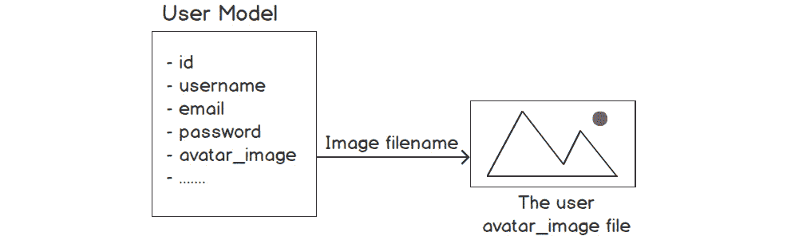
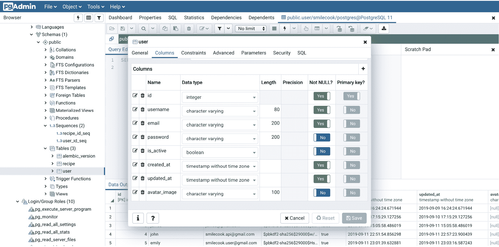
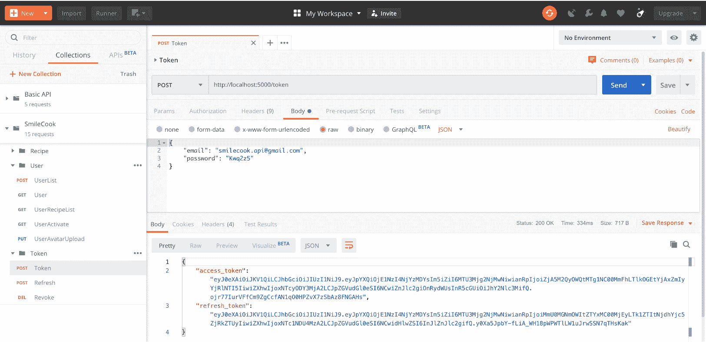
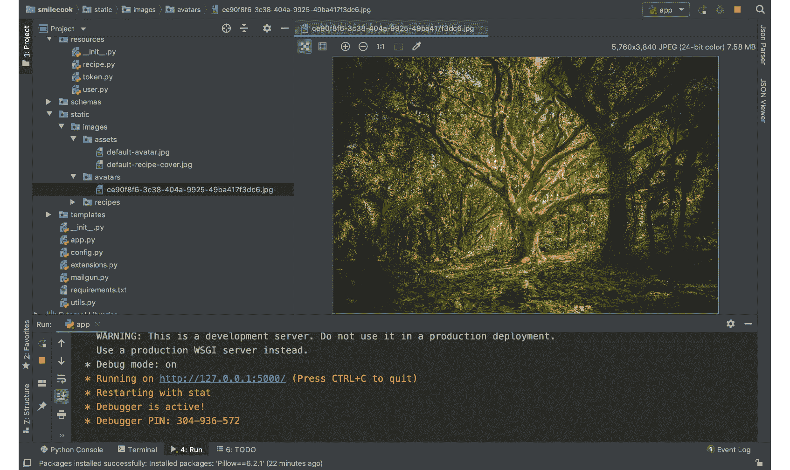
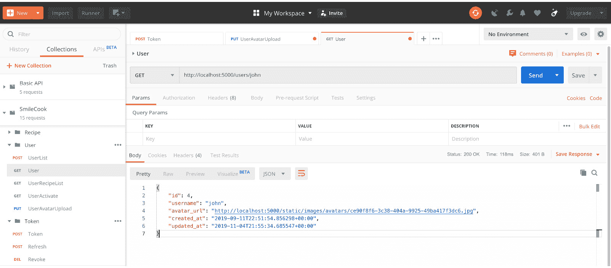

# 7. 处理图像

## 学习目标

到本章结束时，你将能够：

+   构建用户头像功能

+   使用 Flask-Uploads 开发图像上传 API

+   使用 API 调整图像大小

+   使用 Pillow 压缩图像以增强 API 性能

在本章中，我们将学习如何执行图像上传，以便我们能让用户在我们的 Smilecook 应用程序中发布个人资料图片和食谱封面图片。

## 简介

在上一章中，我们通过通过电子邮件激活用户账户来完成账户开通工作流程。在本章中，我们将开发一个功能，以便我们可以上传图片。这些图片是用户的个人资料图片和食谱封面图片。除了上传图像外，我们还将讨论图像压缩。Pillow 是一个图像处理包，我们将使用它将图像压缩到 90%。这可以在不牺牲图像质量的情况下大大提高我们 API 的性能。

从技术角度讲，在本章中，我们将介绍两个 Python 包，Flask-Uploads 和 Pillow。Flask-Uploads 允许我们快速开发图像上传功能。对于图像压缩，我们将使用 Pillow。它可以生成我们指定的格式的图像，并相应地进行压缩。

## 构建用户头像功能

在我们的 Smilecook 应用程序中，有列出用户信息的用户个人资料页面。虽然这已经足够有用，但如果我们可以允许用户将个人资料图片（头像）上传到他们的个人资料页面，那就更好了。这将使应用程序更具社交性。

为了存储用户头像，我们将在用户模型中创建一个新的属性（`avatar_image`）。我们不会直接在这个属性中存储图像。相反，我们将图像存储在服务器上，而新的属性将包含图像的文件名。稍后，当我们的 API 收到客户端请求请求图像时，我们将在这个属性中找到文件名，生成指向图像位置的 URL，并将其返回给前端客户端。然后前端客户端将根据图像 URL 从服务器获取它：  

![图 7.1：构建用户模型头像图]



###### 图 7.1：构建用户模型头像图

我们将创建一个新的端点，`http://localhost:5000/users/avatar`，它将接受`PUT`请求。我们之所以设计它来接受`PUT`请求，是因为每个用户应该只有一张头像图片。所以，每次有客户端请求时，它应该要么是第一次用新图像替换空图像，要么是替换旧图像为新的。这是一个替换操作。在这种情况下，我们应该使用 HTTP 动词，PUT。

现在，让我们在我们的模型中添加`avatar_image`属性。我们将不得不使用 Flask-Migrate 来更新底层的数据库表。

### 练习 45：向用户模型添加 avatar_image 属性

在这个练习中，我们将修改用户模型。首先，我们将在用户模型中创建一个额外的属性（`avatar_image`）。然后，我们将它在数据库模式中反映出来，并使用 Flask-Migrate Python 包在数据库表中创建相应的字段。最后，我们将使用 pgAdmin 确认更改是否成功。让我们开始吧：

1.  将 `avatar_image` 属性添加到用户模型。代码文件是 `models/user .py`：

    ```py
    avatar_image = db.Column(db.String(100), default=None)
    ```

    `avatar_image` 属性被设计用来存储上传图片的文件名。因此，它是一个长度为 `100` 的字符串。默认值为 `None`。

1.  运行以下命令以生成数据库迁移脚本：

    ```py
    flask db migrate
    ```

    你将看到检测到一个名为 `user.avatar_image` 的新列：

    ```py
    INFO  [alembic.runtime.migration] Context impl PostgresqlImpl.
    INFO  [alembic.runtime.migration] Will assume transactional DDL.
    INFO  [alembic.autogenerate.compare] Detected added column 'user.avatar_image'
      Generating /TrainingByPackt/Python-API-Development-Fundamentals/Lesson07/smilecook/migrations/versions/7aafe51af016_.py ... done
    ```

1.  检查 `/migrations/versions/7aafe51af016_.py` 中的内容，这是我们之前步骤中生成的数据库迁移脚本：

    ```py
    """empty message
    Revision ID: 7aafe51af016
    Revises: 983adee75c9a
    Create Date: 2019-09-18 20:54:51.823725
    """
    from alembic import op
    import sqlalchemy as sa
    # revision identifiers, used by Alembic.
    revision = '7aafe51af016'
    down_revision = '983adee75c9a'
    branch_labels = None
    depends_on = None
    def upgrade():
        # ### commands auto generated by Alembic - please adjust! ###
        op.add_column('user', sa.Column('avatar_image', sa.String(length=100), nullable=True))
        # ### end Alembic commands ###
    def downgrade():
        # ### commands auto generated by Alembic - please adjust! ###
        op.drop_column('user', 'avatar_image')
        # ### end Alembic commands ###
    ```

    从其内容中，我们可以看到脚本中生成了两个函数：`upgrade` 和 `downgrade`。`upgrade` 函数用于将新的 `avatar_image` 列添加到数据库表中，而 `downgrade` 函数用于移除 `avatar_image` 列，以便它可以恢复到原始状态。

1.  运行以下 `flask db upgrade` 命令以更新数据库模式：

    ```py
    flask db upgrade
    ```

    你将看到以下输出：

    ```py
    INFO  [alembic.runtime.migration] Context impl PostgresqlImpl.
    INFO  [alembic.runtime.migration] Will assume transactional DDL.
    INFO  [alembic.runtime.migration] Running upgrade 983adee75c9a -> 7aafe51af016, empty message
    ```

1.  在 pgAdmin 中检查 `schema change`。在 `user` 表上右键点击并选择 `属性`。将出现一个新窗口。然后，点击 `Columns` 选项卡以检查列：

###### 图 7.2：在 Columns 选项卡中检查所有列

在这里，我们可以看到新的 `avatar_image` 列被添加到 `user` 表中。现在，我们的 Smilecook 应用程序已准备好接收用户头像的图像路径。

## Flask-Uploads

我们将使用 Flask-Uploads 包来完成我们的图像上传功能。这是一个非常强大的包，为我们简化了大多数繁琐的编码工作。通过简单地调用包提供的几个方法，它允许我们高效灵活地开发文件上传功能。Flask-Uploads 可以直接处理各种常见的文件类型。我们需要定义的是分类上传文件类型的 Set，例如 `IMAGES`、`DOCUMENT`、`AUDIO` 等。然后，我们只需设置上传文件的目的地。

在我们实现它们之前，让我们看看 Flask-Uploads 中的几个基本概念和函数。

### 上传集

在我们上传任何文件之前，我们需要定义 `UploadSet`。上传集是一组单独的文件。以 `images` 为例；我们可以定义图像上传集如下，其中 `'images'` 是上传集的名称：

```py
image_set = UploadSet('images', IMAGES)
```

一旦你有了 `image_set`，你可以使用 `save` 方法来保存从传入的 HTTP 请求上传的图片，如下所示：

```py
    image_set.save(image, folder=folder, name=filename)
```

上传集的配置也需要存储在应用中。我们可以使用 Flask-Uploads 的 `configure_uploads` 函数来完成此操作：

```py
configure_uploads(app, image_set)
```

此外，您还可以使用 `patch_request_class` 来限制上传文件的最大上传大小。在下一个练习中，我们将一起工作，开发图像上传功能。图像用户将上传他们的头像图片。我们将定义目标为 `static/images/avatars`。

### 练习 46：实现用户头像上传功能

在这个练习中，我们将首先将 Flask-Uploads 包安装到我们的虚拟环境中。然后，我们将进行一些简单的配置，并开始开发图像上传功能。通过完成这个练习，我们将看到客户端返回的图像 URL。让我们开始吧：

1.  在 `requirements.txt` 中添加以下行：

    ```py
    Flask-Uploads==0.2.1
    ```

1.  在 PyCharm 控制台中运行以下命令来安装 Flask-Uploads 包：

    ```py
    pip install -r requirements.txt
    ```

    您将看到以下安装结果：

    ```py
    Installing collected packages: Flask-Uploads
    Running setup.py install for Flask-Uploads ... done
    Successfully installed Flask-Uploads-0.2.1
    ```

1.  将 `UploadSet` 和 `IMAGES` 导入到 `extensions.py` 中：

    ```py
    from flask_uploads import UploadSet, IMAGES
    ```

1.  在相同的 `extensions.py` 文件中，定义一个名为 `'images'` 的集合和一个名为 `IMAGES` 的扩展。这将涵盖常见的图像文件扩展名（`.jpg`、`.jpeg`、`.png` 等）：

    ```py
    image_set = UploadSet('images', IMAGES)
    ```

1.  在 `Config.py` 中设置图像目标：

    ```py
    UPLOADED_IMAGES_DEST = 'static/images'
    ```

    #### 注意

    `UPLOADED_IMAGES_DEST` 属性名称由上传集的名称决定。由于我们将上传集名称设置为 `'images'`，因此这里的属性名称必须是 `UPLOADED_IMAGES_DEST`。

1.  将 `configure_uploads`、`patch_request_class` 和 `image_set` 导入到 `app.py` 中：

    ```py
    from flask_uploads import configure_uploads, patch_request_class
    from extensions import db, jwt, image_set
    ```

1.  使用我们刚刚导入的 `configure_uploads` 函数，传入我们想要上传的 `image_set`：

    ```py
    configure_uploads(app, image_set)
    ```

1.  使用 `patch_request_class` 将允许上传的最大文件大小设置为 10 MB。这一步很重要，因为默认情况下，没有上传大小限制：

    ```py
    patch_request_class(app, 10 * 1024 * 1024)
    ```

1.  在 `schemas/user.py` 中导入 `url_for` 函数，并在 `UserSchema` 类下添加 `avatar_url` 属性和 `dump_avatar_url` 方法：

    ```py
    from flask import url_for
    class UserSchema(Schema):
        avatar_url = fields.Method(serialize='dump_avatar_url')
        def dump_avatar_url(self, user):
            if user.avatar_image:
                return url_for('static', filename='images/avatars/{}'.format(user.avatar_image), _external=True)
            else:
                return url_for('static', filename='images/assets/default-avatar.jpg', _external=True)
    ```

    使用 `url_for` 函数来帮助生成图像文件的 URL。使用 `dump_avatar_url` 方法来返回序列化后的用户头像的 URL。如果没有上传图像，我们将直接返回默认头像的 URL。

1.  在 `static/images` 下创建一个名为 `assets` 的文件夹，并将 `default-avatar.jpg` 图像放入其中。这张图像将成为我们的默认用户头像：

    ###### 图 7.3：添加图像后的文件夹结构

    #### 注意

    您可以在这里放置任何喜欢的图像。我们还在我们的示例代码文件夹中提供了一个默认头像图像。

1.  将 `uuid` 扩展和 `image_set` 导入到 `utils.py` 中。您将在下面看到这些模块/方法的使用：

    ```py
    import uuid
    from flask_uploads import extension
    from extensions import image_set
    ```

1.  将 `save_image` 函数添加到 `utils.py` 中：

    ```py
    def save_image(image, folder):
        filename = '{}.{}'.format(uuid.uuid4(), extension(image.filename))
        image_set.save(image, folder=folder, name=filename)
        return filename
    ```

    在 `save_image` 方法中，我们使用了 `uuid` 函数来生成上传图片的文件名。我们使用 Flask-Uploads 的扩展函数从上传的图片中获取文件扩展名。然后，我们使用 `image_set.save` 函数保存图片；保存目的地是 `static/images`。如果我们传递 `folder='avatar'` 作为参数，目的地将是 `static/images/avatar`。

1.  从 `utils` 中导入 `image_set` 和 `save_image` 函数到 `resources/user.py`：

    ```py
    from extensions import image_set
    from utils import generate_token, verify_token, save_image
    ```

1.  将 `user_avatar_schema` 添加到 `resources/user.py`。此模式只是为了显示 `avatar_url`：

    ```py
    user_avatar_schema = UserSchema(only=('avatar_url', ))
    ```

1.  在 `resources/user.py` 中创建 `UserAvatarUploadResource` 类，并在其中定义 `put` 方法：

    ```py
    class UserAvatarUploadResource(Resource):
        @jwt_required
        def put(self):
            file = request.files.get('avatar')
            if not file:
                return {'message': 'Not a valid image'}, HTTPStatus.BAD_REQUEST
            if not image_set.file_allowed(file, file.filename):
                return {'message': 'File type not allowed'}, HTTPStatus.BAD_REQUEST
            user = User.get_by_id(id=get_jwt_identity())
            if user.avatar_image:
                avatar_path = image_set.path(folder='avatars', filename=user.avatar_image)
                if os.path.exists(avatar_path):
                    os.remove(avatar_path)
    ```

    在 `put` 方法之前的 `@jwt_required` 装饰器意味着在触发此方法之前需要登录。在 `put` 方法中，我们从 `request.files` 获取头像图片文件。然后，我们验证了图片文件是否存在以及文件扩展名是否允许。如果一切正常，我们将获取用户对象并检查是否已存在头像。如果存在，我们将将其替换为上传的图片之前将其删除。

1.  然后，我们使用 `save_image` 来保存上传的图片。一旦图片保存，我们将获取图片的文件名并将其保存到 `user.avatar_image`。然后，我们使用 `user.save()` 将更新保存到数据库中：

    ```py
            filename = save_image(image=file, folder='avatars')
            user.avatar_image = filename
            user.save()
    ```

1.  使用 `user_avatar_schema.dump(user).data` 返回图片 URL 和 HTTP 状态码，**200 OK**：

    ```py
            return user_avatar_schema.dump(user).data, HTTPStatus.OK
    ```

1.  将 `UserAvatarUploadResource` 类导入到 `app.py`：

    ```py
    from resources.user import UserListResource, UserResource, MeResource, UserRecipeListResource, UserActivateResource, UserAvatarUploadResource
    ```

1.  将资源链接到路由，即在 `app.py` 中的 `/users/avatar`：

    ```py
    api.add_resource(UserAvatarUploadResource, '/users/avatar')
    ```

我们已经在 Smilecook 应用程序中成功创建了用户头像图片上传功能。现在，我们可以在用户个人资料页面上传图片。在下一个练习中，我们将使用 Postman 进行测试。

### 练习 47：使用 Postman 测试用户头像上传功能

在上一个练习中，我们完成了头像上传功能的开发。为了确保一切按预期工作，我们需要从客户端测试该功能。我们将使用 Postman 发送包含用户头像图片的客户端请求。让我们开始吧：

1.  首先，登录到一个用户账户。现在，点击 **收藏夹** 选项卡并选择 **POST Token** 请求。然后，点击 **发送** 按钮。结果可以在下面的屏幕截图中看到：

    ](img/C15309_07_04.jpg)

    ###### 图 7.4：发送 POST Token 请求

1.  接下来，我们将使用 `PUT` 方法上传头像。向以下 URL 发送 HTTP `PUT` 请求：`http://localhost:5000/users/avatar`。点击 `用户` 文件夹，然后创建一个新的请求。

1.  将 `UserAvatarUpload` 设置保存到 **用户** 文件夹中。

1.  选择 `PUT` 作为 HTTP 方法，并在请求 URL 中输入 `http://locaohost:5000/users/avatar`。

1.  现在，将 `Authorization` 中的 `Bearer {token}` 选择到 **值** 字段中，其中 token 是我们在上一步中获得的访问令牌。

1.  选择**主体**选项卡。然后，选择**表单数据**单选按钮，并将“头像”作为**键**。

1.  在**键**旁边的下拉菜单中选择**文件**，然后选择要上传的图像文件。

1.  现在，点击响应中的`avatar_url`，这意味着我们的图像上传请求已成功。

1.  点击`avatar_url`应该会带您到上传的图像。检查路径，`static/images/avatars`，在 PyCharm 中。您应该在那里看到上传的图像：

    ###### 图 7.6：检查上传的图像

1.  通过`username`获取用户请求。点击**集合**选项卡并选择**GET 用户**请求。

1.  在 URL 字段中输入`http://localhost:5000/users/john`。您可以将用户名，即**John**，替换为任何合适的用户名，然后点击**发送**按钮。结果可以在以下屏幕截图中看到：



###### 图 7.7：检查用户头像 URL

这里，我们可以看到用户中的新头像 URL 属性。

这个测试练习证明图像上传功能按预期工作。我们还可以通过在端点 URL 中放置用户名来查找用户。

#### 注意

您可以测试`头像图像上传`功能的两个方面。第一个是上传大于 10 MB 大小的图像。第二个是测试是否将默认头像图像（即`default-avatar.jpg`）用于没有上传头像的用户账户。

## 图像调整大小和压缩

图像的大小会影响网站的速度。想象一下看一个 10 MB 大小的图片。如果一页上有 10 张图片，这个网站的大小将是 100 MB，因此加载一个页面将花费很多时间。因此，减少图像大小并压缩它，使其大小约为 500 KB 是一个好的做法。

此外，我们还将图像转换为 JPEG 格式（它具有`.JPG`文件扩展名）。JPEG 是一种图像压缩技术，可以去除图像中不明显、不重要的细节，从而实现更小的文件大小。此外，对于网络使用，通常认为可以接受较低的图像质量。

在我们的 Smilecook 应用程序中，我们将把所有上传的图像转换为 JPG 格式并压缩它们。我们将通过 Pillow 包来完成这项工作。

#### 注意

JPEG 格式中不能有透明图像。如果我们保存一个去除背景的 JPEG 图像，背景将变成白色，而不是透明的。其他两种常用的图像格式，PNG 和 GIF。这两种图像格式将支持图像的透明度。

然而，在我们的 Smilecook 应用程序中，我们不会显示透明图像，因此使用 JPG 图像在这里就足够了。

## Pillow 简介

Pillow，之前被称为`Image`。我们可以使用`Image.open`从图像文件创建一个对象。然后，我们可以通过使用属性`size`来获取图像的像素尺寸。我们还可以通过使用属性`mode`来找出图像的颜色模式。

你应该会看到一些常见的颜色模式，包括`L`代表黑白，`RGB`代表红绿蓝，以及`CMYK`代表青色-品红色-黄色-黑色：

```py
>>>image = Image.open('default-avatar.jpg')
>>>image.size
(1600, 1066)
>>>image.mode
'RGB'
```

如果我们要将图片的颜色模式更改为 RGB，可以使用`convert`函数。我们通常更改颜色模式以确保图像的颜色准确性。RGB 是计算机显示器上最常用的颜色模式：

```py
>>>image = image.convert("RGB")
```

如果我们想要调整图像大小以使其具有更小的尺寸，我们应该使用`thumbnail`方法。此方法可以保持图像的宽高比，同时确保图像的每一边都小于我们定义的限制。

例如，结果图像的边长将小于`1600`像素，同时保持宽高比不变：

```py
>>>maxsize = (1600, 1600)
>>>image.thumbnail(maxsize)
```

当我们使用 Pillow 包保存更改时，我们可以传递一个`quality`参数。这样做是为了指定我们想要的 JPEG 压缩程度。质量值范围从 1 到 100，1 是最差的，95 是最佳的。我们应该避免使用高于 95 的值，因为这几乎意味着没有压缩。默认质量值是 75：

```py
>>>image.save('compressed_image.jpg', optimize=True, quality=85)
```

让我们完成一个练习来实现图像压缩。

### 练习 48：在我们的 Smilecook 应用程序中实现图像压缩

现在我们已经了解了理论和我们可以使用的工具来执行图像压缩，让我们将其应用到我们的 Smilecook 应用程序中。我们希望压缩用户的头像。我们将使用 Pillow 包来完成这项工作。让我们开始吧：

1.  将`Pillow`包添加到`requirements.txt`中：

    ```py
    Pillow==6.2.1
    ```

1.  通过运行`pip install`命令安装`Pillow`包，如下所示：

    ```py
    pip install -r requirements.txt
    ```

    运行前面的命令后，你应该看到以下安装结果：

    ```py
    Installing collected packages: Pillow
    Successfully installed Pillow-6.2.1
    ```

1.  将必要的包和模块导入到`utils.py`中：

    ```py
    import os
    from PIL import Image
    ```

1.  在`utils.py`中定义`compress_image`函数，该函数接受文件名和`folder`作为参数。

    首先，我们将使用`image_set.path(filename=filename, folder=folder)`来获取实际图像文件的路径。然后，通过使用`Image.open(file_path)`，我们将从图像文件创建`image`对象：

    ```py
    def compress_image(filename, folder):
        file_path = image_set.path(filename=filename, folder=folder)
        image = Image.open(file_path)
    ```

1.  将颜色模式更改为`RGB`，并调整大小以确保每一边都不超过`1600`像素：

    ```py
        if image.mode != "RGB":
            image = image.convert("RGB")
        if max(image.width, image.height) > 1600:
            maxsize = (1600, 1600)
            image.thumbnail(maxsize, Image.ANTIALIAS)
    ```

1.  为我们的压缩图像生成新的文件名和路径：

    ```py
        compressed_filename = '{}.jpg'.format(uuid.uuid4())
        compressed_file_path = image_set.path(filename=compressed_filename, folder=folder)
    ```

1.  使用`quality = 85`保存压缩后的图像：

    ```py
        image.save(compressed_file_path, optimize=True, quality=85)
    ```

1.  使用`os.stat(file_path)`来获取字节数。通过这样做，我们将在测试中有一个原始大小和压缩后的比较：

    ```py
        original_size = os.stat(file_path).st_size
      compressed_size = os.stat(compressed_file_path).st_size
        percentage = round((original_size - compressed_size) / original_size * 100)
        print("The file size is reduced by {}%, from {} to {}.".format(percentage, original_size, compressed_size))
    ```

    #### 注意

    `os.stat`方法是一个 Python 方法，它返回基本文件夹/文件信息（例如，所有者 ID，组所有者 ID 和文件大小）。

1.  删除原始图像，然后使用以下代码返回压缩后的图像文件名：

    ```py
        os.remove(file_path)
        return compressed_filename
    ```

1.  最后，在 `utils.py` 中的 `save_image` 函数中，在图像保存后立即调用 `compress_image` 函数：

    ```py
    def save_image(image, folder):
        filename = '{}.{}'.format(uuid.uuid4(), extension(image.filename))
        image_set.save(image, folder=folder, name=filename)
        filename = compress_image(filename=filename, folder=folder)
        return filename
    ```

在这里，我们已经创建了我们的 compress_image 函数。该函数只需要知道图像文件的位置，它就会为我们压缩图像。

在下一个练习中，我们将测试图像压缩功能。

### 练习 49：测试图像压缩功能

到目前为止，我们已经开发了一个可以压缩用户上传的头像的图像压缩功能。在这个练习中，我们将测试并查看图像压缩功能的表现。让我们开始吧：

1.  首先，我们将使用 `PUT` 方法上传头像。我们将发送一个 HTTP 请求到 `http://localhost:5000/users/avatar`。点击 **PUT UserAvatarUpload** 并选择 **Body** 选项卡。

1.  选择一个大的图片文件进行上传，然后点击 **Send** 按钮。结果可以在下面的屏幕截图中查看：![图 7.8：使用 PUT 方法上传头像

    ![图片 15309_07_08.jpg]

    ###### 图 7.8：使用 PUT 方法上传头像

1.  从 PyCharm 的应用程序日志中，我们可以看到上传的图像原始大小为 7.6 MB；压缩后减少到 618 KB：

![图 7.9：压缩后的图片大小

![图片 15309_07_09.jpg]

###### 图 7.9：压缩后的图片大小

通过这样做，我们可以看到我们之前实现的图像压缩功能是有效的。现在，图像大小已经显著减少。在下一个活动中，我们将实现食谱封面图像上传功能。

### 活动 11：实现食谱封面图像上传功能

到目前为止，我们已经学习了如何开发图像上传和压缩功能。在这个活动中，我们将为 Smilecook 应用程序开发食谱封面图像上传功能。我们希望通过提供封面图像来使我们的食谱更具吸引力。与用户头像类似，每个食谱只允许有一个封面图像。按照以下步骤完成此活动：

1.  在 `models/recipe.py` 中将 `cover_image` 属性添加到用户模型中。

1.  使用 `flask db migrate` 命令更新相应的 DB 架构。

1.  创建 `recipe_cover_schema` 以在 HTTP 响应中显示 `cover_url`。

1.  为食谱封面图像上传功能创建 `RecipeCoverUploadResource`。

    #### 注意

    此活动的解决方案可以在第 323 页找到。

### 活动 12：测试图像上传功能

在这个活动中，我们将测试食谱封面图像上传功能。首先，我们将创建一个新的食谱，上传一个食谱封面图像，并通过获取食谱来验证它是否已上传。按照以下步骤完成此活动：

1.  使用 Postman 登录到 Smilecook 用户账户。

1.  向我们的 API 发送客户端请求以创建一个食谱。

1.  上传食谱图像。

1.  在 PyCharm 中检查图像是否已压缩。

1.  检查上传的图像在 `static/images/recipes` 中。

1.  恢复食谱并确认 `cover_url` 属性已填充。

    #### 注意

    本活动的解决方案可在第 328 页找到。

## 摘要

在本章中，我们学习了如何使用 Flask-Uploads 上传用户头像和食谱封面图像。由于我们的最大上传图像大小为 10 MB，这使得用户可以上传大图像，从而降低网站的性能。为了解决这个性能问题，我们引入了图像缩放和压缩的概念。从这里，我们开始使用 Pillow 包开发该功能。

除了学习关于图像处理的新技术外，我们还回顾了之前章节中学到的内容，例如使用 Flask-Migrate 更新数据库模式，以及在反序列化过程中使用 marshmallow 的 schema 显示上传图像的 URL。

我们已经完成了 Smilecook 食谱分享平台的大部分关键功能。在下一章中，我们将开发食谱搜索和分页功能。
