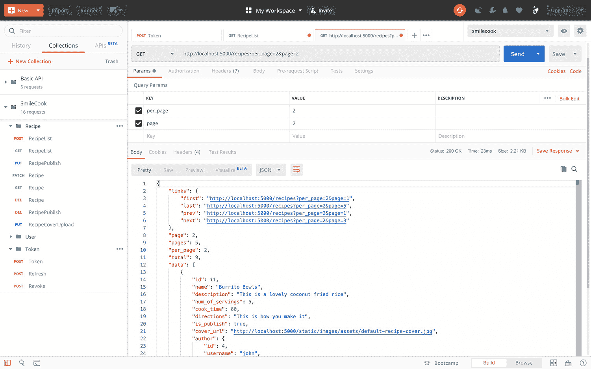
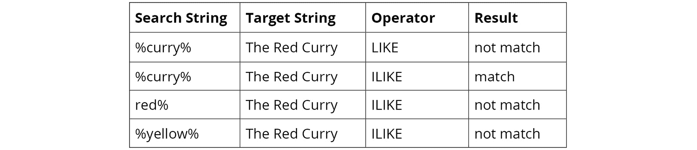
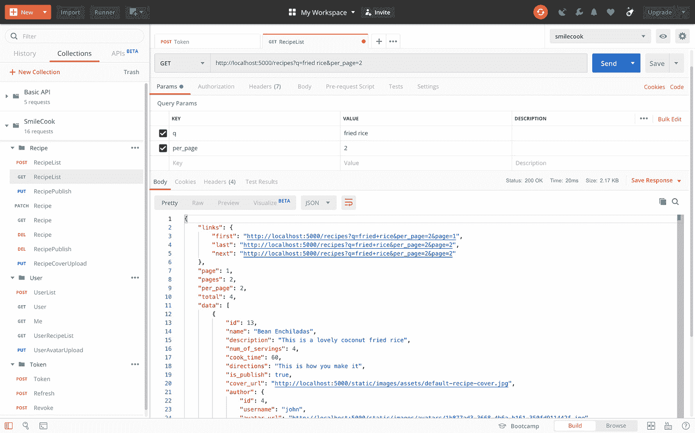
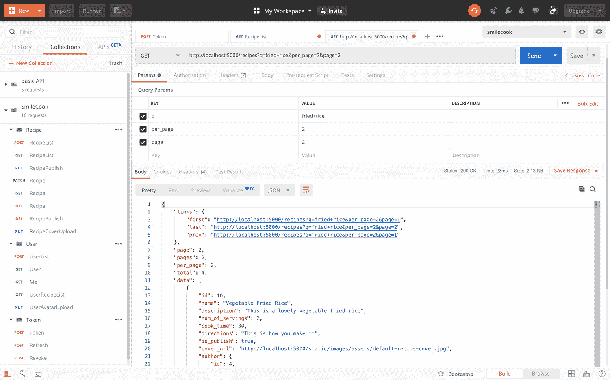
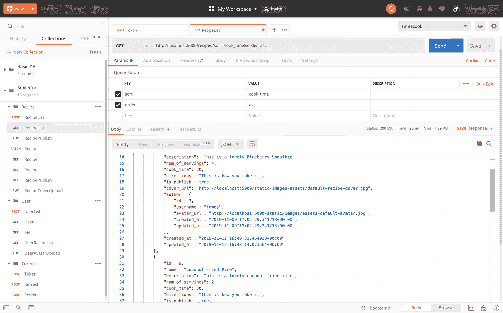
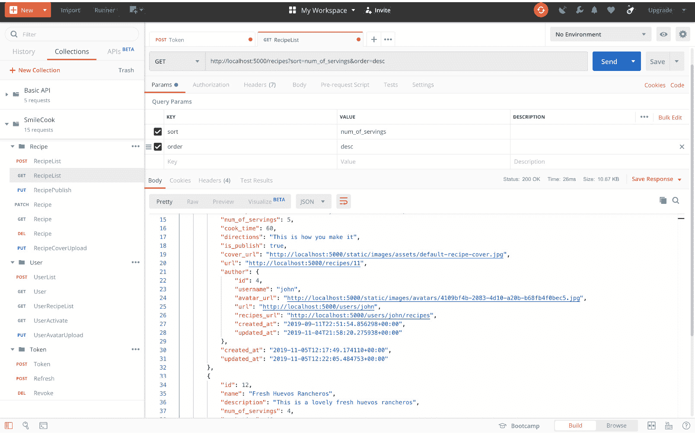

# 第八章：8. 分页、搜索和排序

## 学习目标

到本章结束时，你将能够：

+   使用 Flask-SQLAlchemy 实现分页功能

+   使用 marshmallow 序列化分页结果以供前端显示

+   使用搜索功能构建 API

+   以你自己的方式对返回的记录进行排序和排序

+   使用 Postman 测试所有这些功能

本章涵盖了分页以及如何更改食谱列表的顺序，以及如何为食谱和成分添加搜索功能。

## 简介

在上一章中，我们实现了`用户头像`和`食谱封面图像上传`功能。我们处理了图像压缩功能以提高图像加载速度的性能。一旦上传了图像，用户可以通过 API 检索图像的 URL。

在本章中，我们将处理分页食谱数据。我们将解释为什么我们需要执行分页。这是优化我们的 API 的重要步骤。我们还将讨论一些更重要的功能，包括搜索和排序，我相信你在其他在线应用中已经遇到过。

## 分页

在测试环境中，我们可能只有几个开发者将食谱放在 Smilecook 平台上。那里只有少数几个食谱，性能从未成为问题。然而，在生产环境中，即平台向公众开放后，可能会有成千上万的用户在平台上分享食谱。如果你考虑像 Facebook 这样的社交媒体平台，那么数量将更大。

因此，我们需要引入分页。分页意味着我们不是从数据库中查询所有记录的总体，我们只查询其中的一小部分。当用户想要查看更多内容时，他们总是可以转到下一页。例如，当你浏览购物网站时，通常你一次会查看一页的商品。每一页可能显示 40 个商品，你必须导航到后续页面来查看所有可用的商品。这就是分页的本质。

每页显示的记录数受页面大小的限制。这样，服务器加载时间和数据传输时间将大大节省，最重要的是，这将增强用户的导航体验。

这里好的一点是，我们正在使用 Web 框架来构建我们的 API。这类常见功能已经被考虑到了。我们只需要使用 Flask-SQLAlchemy 来帮助我们构建分页 API。

## 分页 API

分页 API 意味着当你查询 API 时，只会返回当前页面的数据记录。它还包括其他信息，例如记录总数、总页数、其他页面的链接等。以下是一个分页 API 的示例响应。它是一个序列化的分页对象，因此它是以 JSON 格式表示的：

```py
{
    "links": {
        "first": "http://localhost:5000/recipes?per_page=2&page=1",
        "last": "http://localhost:5000/recipes?per_page=2&page=5",
        "prev": "http://localhost:5000/recipes?per_page=2&page=1",
        "next": "http://localhost:5000/recipes?per_page=2&page=3"
    },
    "page": 2,
    "pages": 5,
    "per_page": 2,
    "total": 9,
    "data": [
        {
            "data": "data"
        },
        {
            "data": "data"
        }
    ]
}
```

在这里，你可以看到 HTTP 响应中的以下属性：

+   `first`: 首页的链接

+   `last`: 最后一页的链接

+   `prev`: 上一页的链接

+   `next`: 下一页的链接

+   `page`: 当前页

+   `pages`: 总页数

+   `per_page`: 每页的记录数

+   `total`: 总记录数

+   `data`: 此页上的实际数据记录

这些属性由 Flask-SQLAlchemy 中的分页对象自动生成。我们只需要使用 marshmallow 序列化分页对象，这样我们就可以以 JSON 格式将结果返回给前端客户端。

### 练习 50：在已发布菜谱检索函数中实现分页

既然我们已经讨论了分页的重要性，我们想在 Smilecook 平台上添加这个功能。我们将从这个练习开始着手。让我们开始吧：

1.  在 `schema` 文件夹中创建 `pagination.py` 并导入必要的模块和函数：

    ```py
    from flask import request
    from marshmallow import Schema, fields
    from urllib.parse import urlencode
    ```

1.  创建 `PaginationSchema` 类：

    ```py
    class PaginationSchema(Schema):
        class Meta:
            ordered = True
        links = fields.Method(serialize='get_pagination_links')
        page = fields.Integer(dump_only=True)
        pages = fields.Integer(dump_only=True)
        per_page = fields.Integer(dump_only=True)
        total = fields.Integer(dump_only=True)
    ```

    在这一步中，我们可以看到 `PaginationSchema` 继承自 `marshmallow.Schema`。`PaginationSchema` 用于序列化 Flask-SQLAlchemy 中的分页对象。`links` 属性是一个自定义字段，这意味着我们可以指定如何序列化它。`get_pagination_links` 函数将在 *步骤 4* 中创建。

    #### 注意

    我们已经在这里解释了其他属性。这些属性在 HTTP 响应中是必需的，因此我们需要将它们添加到模式中。

    最终 JSON 响应中可以有不同的键名。例如，如果我们想将 `total_count` 作为键名而不是 `total`，我们可以使用 `attribute` 参数，如下所示：`total_count = fields.Integer(dump_only=True, attribute='total')`。

1.  将以下 `get_url` 方法添加到 `PaginationSchema`：

    ```py
        @staticmethod
        def get_url(page):
            query_args = request.args.to_dict()
            query_args['page'] = page
            return '{}?{}'.format(request.base_url, urlencode(query_args))
    ```

    `PaginationSchema.get_url` 方法用于根据页码生成页面 URL。它接收页码参数并将其添加到 `request` 参数的字典中。最后，它对新的 URL 进行编码并返回，包括页码，作为参数。

    #### 注意

    例如，如果 `request.base_url` 是 `http://localhost:5000/recipes`，并且 `urlencode (query_args)` 给我们 `per_page=2&page=1`。格式化函数将它们拼接在一起并返回新的 URL，即 `http://localhost:5000/recipes?per_page=2&page=1`。

1.  将 `get_pagination_links` 方法添加到 `PaginationSchema`：

    ```py
        def get_pagination_links(self, paginated_objects):
            pagination_links = {
                'first': self.get_url(page=1),
                'last': self.get_url(page=paginated_objects.pages)
            }
            if paginated_objects.has_prev:
                pagination_links['prev'] = self.get_url(page=paginated_objects.prev_num)
            if paginated_objects.has_next:
                pagination_links['next'] = self.get_url(page=paginated_objects.next_num)
            return pagination_links
    ```

    `PaginationSchema.get_pagination_links` 方法用于生成指向不同页面的 URL 链接。它从 `paginated_objects` 获取页面信息，并依赖于我们在 *步骤 3* 中构建的 `get_url` 方法来生成链接。

1.  接下来，在 `schemas/recipe.py` 中导入 `PaginationSchema`：

    ```py
    from schemas.pagination import PaginationSchema
    ```

1.  删除 `schemas/recipe.py` 中的以下代码：

    ```py
        @post_dump(pass_many=True)
        def wrap(self, data, many, **kwargs):
            if many:
                return {'data': data}
            return data
    ```

    这部分代码已被删除，因为我们正在构建分页函数。我们不再需要用 `data` 键包装多个数据记录。

1.  定义 `RecipePaginationSchema`，它从 `schema/pagination.py` 中的 `PaginationSchema` 继承：

    ```py
    class RecipePaginationSchema(PaginationSchema):
        data = fields.Nested(RecipeSchema, attribute='items', many=True)
    ```

    如您所回忆的那样，最终 JSON 响应中的属性名在这里将是`data`，因为这是在`RecipePaginationSchema`中定义的。`attribute = 'items'`意味着它从`items`获取源数据到`pagination`对象的属性。

1.  现在，将`acs`和`desc`从`sqlalchemy`导入到`model/recipe.py`中，并修改`get_all_published`方法：

    ```py
    from sqlalchemy import asc, desc
        @classmethod
        def get_all_published(cls, page, per_page):
            return cls.query.filter_by(is_publish=True).order_by(desc(cls.created_at)).paginate(page=page, per_page=per_page)
    ```

    我们在这里构建的`get_all_published`方法用于利用 Flask-SQLAlchemy 的`paginate`方法。我们将过滤和排序记录，然后`paginate`方法接收`page`和`per_page`参数并生成一个分页对象。

1.  将`fields`、`use_kwargs`和`RecipePaginationSchema`导入到`resources/recipe.py`中：

    ```py
    from webargs import fields
    from webargs.flaskparser import use_kwargs
    from schemas.recipe import RecipeSchema, RecipePaginationSchema
    ```

1.  在`resources/recipe.py`中声明`recipe_pagination_schema`属性，以便序列化分页的菜谱：

    ```py
    recipe_pagination_schema = RecipePaginationSchema()
    ```

1.  修改`resources/recipe.py`中的`RecipeListResource.get`方法，以便返回分页的菜谱：

    ```py
    class RecipeListResource(Resource):
            @use_kwargs({'page': fields.Int(missing=1),
                               'per_page': fields.Int(missing=20)})
        def get(self, page, per_page):
            paginated_recipes = Recipe.get_all_published(page, per_page)
            return recipe_pagination_schema.dump(paginated_recipes).data, HTTPStatus.OK
    ```

    在这里，我们已将`@user_kwargs`装饰器添加到`RecipeListResource.get`方法中。`page`参数的默认值是 1，而`per_page`参数的默认值是 20。这意味着如果没有传入任何内容，我们将获取第一页，包含前 20 个菜谱记录。

然后，我们将这两个参数传递给`get_all_published`方法以获取分页对象。最后，分页的菜谱将被序列化并返回给前端客户端。

在这里，我们已经成功实现了分页功能并显示了结果。在下一个练习中，我们将测试分页功能。

### 练习 51：测试分页功能

在这个练习中，我们将测试我们刚刚构建的分页功能。我们将在我们的 Smilecook 应用程序中创建八个菜谱，并将它们全部发布。然后，我们将模拟一个用户场景，我们将逐页获取所有菜谱。让我们开始吧：

1.  点击**集合**标签。

1.  然后，选择**POST Token**请求并**发送**请求。这是为了登录用户账户。结果如下截图所示：![图 8.1：发送 POST Token 请求

    ![img/C15309_08_01.jpg]

    ###### 图 8.1：发送 POST Token 请求

1.  通过在 PyCham 控制台中运行以下`httpie`命令创建八个菜谱。将`{token}`占位符替换为我们第二步中获得的访问令牌：

    ```py
    http POST localhost:5000/recipes "Authorization: Bearer {token}" name="Vegetable Paella" description="This is a lovely vegetable paella" num_of_servings=5 cook_time=60 directions="This is how you make it"
    http POST localhost:5000/recipes "Authorization: Bearer {token}" name="Minestrone Soup" description="This is a lovely minestrone soup" num_of_servings=4 cook_time=60 directions="This is how you make it"
    http POST localhost:5000/recipes "Authorization: Bearer {token}" name="Thai Red Curry" description="This is a lovely thai red curry" 
    num_of_servings=4 cook_time=40 directions="This is how you make it"
    http POST localhost:5000/recipes "Authorization: Bearer {token}" name="Coconut Fried Rice" description="This is a lovely coconut fried rice" num_of_servings=2 cook_time=30 directions="This is how you make it"
    http POST localhost:5000/recipes "Authorization: Bearer {token}" name="Vegetable Fried Rice" description="This is a lovely vegetable fried rice" num_of_servings=2 cook_time=30 directions="This is how you make it"
    http POST localhost:5000/recipes "Authorization: Bearer {token}" name="Burrito Bowls" description="This is a lovely coconut fried rice" num_of_servings=5 cook_time=60 directions="This is how you make it"
    http POST localhost:5000/recipes "Authorization: Bearer {token}" name="Fresh Huevos Rancheros" description="This is a lovely fresh huevos rancheros" num_of_servings=4 cook_time=40 directions="This is how you make it"
    http POST localhost:5000/recipes "Authorization: Bearer {token}" name="Bean Enchiladas" description="This is a lovely coconut fried rice" num_of_servings=4 cook_time=60 directions="This is how you make it"
    ```

    #### 注意

    您也可以使用 Postman 逐个创建菜谱。我们在这里使用`httpie`命令是因为它更快。

1.  使用以下`httpie`命令发布所有八个菜谱。将`{token}`占位符替换为访问令牌。确保 URL 中的菜谱 ID 指的是我们在上一步中创建的菜谱：

    ```py
    http PUT localhost:5000/recipes/6/publish "Authorization: Bearer {token}"
    http PUT localhost:5000/recipes/7/publish "Authorization: Bearer {token}"
    http PUT localhost:5000/recipes/8/publish "Authorization: Bearer {token}"
    http PUT localhost:5000/recipes/9/publish "Authorization: Bearer {token}"
    http PUT localhost:5000/recipes/10/publish "Authorization: Bearer {token}"
    http PUT localhost:5000/recipes/11/publish "Authorization: Bearer {token}"
    http PUT localhost:5000/recipes/12/publish "Authorization: Bearer {token}"
    http PUT localhost:5000/recipes/13/publish "Authorization: Bearer {token}"
    ```

    现在，我们已经创建并发布了八个菜谱。接下来，我们将以每页两个菜谱的大小逐页获取菜谱。

1.  点击`per_page`，`2`)到`first`、`last`和`next`页面。我们在这里看不到`prev`，因为我们是在第一页。总共有五页，每页有两条记录。你还可以在 HTTP 响应中看到**排序**后的食谱详情。

1.  接下来，让我们测试食谱中的链接是否正常工作。我们只需点击`next` URL 链接，这将在 Postman 中打开一个新标签页，并填充请求 URL（`http://localhost:5000/recipes?per_page=2&page=2`）。然后，我们只需点击**发送**来发送请求。结果如下截图所示：

###### 图 8.3：测试食谱中的链接

在这里，我们可以看到有指向`first`、`last`、`next`和`prev`页面的链接。我们还可以看到我们目前在第 2 页。所有的食谱数据都在这里。

我们已经成功创建了分页函数。现在，我将把它交给你来测试。

分页的好处是你可以将成千上万的记录分页。数据是按页检索的，这将减少服务器的负载。但是，如果用户设置的页面大小为，比如说，100,000 呢？我们如何防止用户利用系统漏洞？我们可以做的是传递分页的`max_per_page`参数。这将限制用户可以设置的页面大小的最大值。如果用户设置的页面大小超过最大页面大小，则将使用最大页面大小。

### 活动十三：在用户特定食谱检索 API 上实现分页

在上一个练习中，我们实现了并测试了所有已发布食谱检索 API 的分页函数。在这个活动中，我们将处理用户特定食谱检索 API 的分页函数。相应的 API 可以在`UserRecipeListResource`中找到，它用于获取特定作者的食谱。按照以下步骤完成此活动：

1.  修改`model/recipe.py`中的`get_all_by_user`方法。

1.  将`RecipePaginationSchema`导入到`resources/user.py`中。

1.  在`resources/user.py`中声明`recipe_pagination_schema`属性。

1.  修改`resources/user.py`中的`UserRecipeListResource.get`方法。

1.  为`UserRecipeListResource.get`添加`@user_kwargs`装饰器。它包含一些参数，包括`page`、`per_page`和`visibility`。

    #### 注意

    本活动的解决方案可在第 332 页找到。

现在，你应该已经完成了用户食谱的分页函数。让我们遵循同样的程序，在下一个活动中测试这个函数。

### 活动十四：测试用户特定食谱检索 API 的分页

在这个活动中，我们将测试我们刚刚构建的用户食谱分页功能。我们在之前的练习中发布了八个食谱。我们将使用它们作为我们的测试对象。我们将创建一个 Postman 请求并测试我们是否可以逐页获取它们。按照以下步骤完成此活动：

1.  使用 Postman，按页获取上一练习中作者的所有食谱，每页两个。

1.  点击 `links` 中的下一个 URL 来查询下两条记录。

    #### 注意

    此活动的解决方案可以在第 334 页找到。

## 食谱搜索

在之前的练习中，我们实现了 `pagination` 函数，并看到了使用它的好处。这可以大大减少一次性返回给用户的所有食谱的数量。从用户的角度来看，他们可以浏览不同的页面来查找他们想要的食谱。

用户查找食谱的更好方式是通过搜索。搜索功能是互联网上的一个基本功能。看看搜索巨头 Google；他们的搜索引擎带来了巨大的收入。当然，我们不会在我们的 Smilecook 应用程序中实现像 Google 那样规模的东西。我们在这里将只进行简单的文本匹配搜索。

在下一个练习中，我们将在我们的 Smilecook 平台上实现搜索功能。我们将构建一个允许客户端提供 `q` 参数以通过名称或食谱描述搜索特定食谱的食谱搜索 API。这可以通过使用 `LIKE` 比较运算符来完成。`LIKE` 运算符通过将搜索字符串与目标字符串匹配来工作。我们可以在搜索字符串中使用 `%` 作为通配符。如果这里不是精确匹配，那么它更像是 `SIMILAR TO` 匹配。所以，`%Chicken%` 搜索字符串将与 `Hainanese Chicken Rice` 字符串匹配。

可能更好的比较运算符选择是 `ILIKE`。`LIKE` 是大小写敏感的，而 `ILIKE` 是大小写不敏感的。例如，我们无法使用 `LIKE` 运算符匹配 `Thai Red Curry` 与 `%curry%`。你可以看到这里的 `C` 是大写的。然而，如果我们使用 `ILIKE`，它将完美匹配。

查看以下表格，了解比较运算符是如何工作的：




###### 图 8.4：比较运算符

在我们的 Smilecook 平台上，我们不希望我们的搜索那么严格。搜索应该是大小写不敏感的。现在，让我们看看我们如何将这个功能添加到我们的 Smilecook 平台上。

### 练习 52：实现搜索功能

在了解了食谱搜索概念后，我们想在我们的 Smilecook 平台上实现这个功能。为此，我们将添加一个 `q` 参数，该参数将搜索字符串传递到 API 中。然后，我们将使用搜索字符串来查找我们需要的食谱。让我们开始吧：

1.  将 `or_` 从 `sqlalchemy` 导入到 `models/recipe.py`：

    ```py
    from sqlalchemy import asc, desc, or_
    ```

1.  修改 `models/recipe.py` 中的 `Recipe.get_all_published` 方法，使其获取所有满足搜索条件的已发布食谱：

    ```py
      @classmethod
        def get_all_published(cls, q, page, per_page):
            keyword = '%{keyword}%'.format(keyword=q)
            return cls.query.filter(or_(cls.name.ilike(keyword),
                    cls.description.ilike(keyword)),
                    cls.is_publish.is_(True)).\
                    order_by(desc(cls.created_at)).paginate(page=page, per_page=per_page)
    ```

    上述代码用于将搜索模式分配给变量 `keyword`。然后，它通过这个关键字搜索 `name` 和 `description` 字段。

1.  修改 `resources/recipe.py` 中的 `RecipeListResource`：

    ```py
    class RecipeListResource(Resource):
        @use_kwargs({'q': fields.Str(missing='),
                                       'page': fields.Int(missing=1),
                                       'per_page': fields.Int(missing=20)})
        def get(self, q, page, per_page):
            paginated_recipes = Recipe.get_all_published(q, page, per_page)
            return recipe_pagination_schema.dump(paginated_recipes).data, HTTPStatus.OK
    ```

    我们在 `user_kwargs` 装饰器和 `get` 函数中添加了 `q` 参数。这个 `q` 参数的默认值是一个空字符串。这个 `q` 参数也将传递给 `get_all_published` 函数。

现在我们已经完成了搜索功能。接下来，我们将测试这个功能。

### 练习 53：测试搜索功能

在这个练习中，我们将测试我们刚刚构建的搜索功能。我们将通过搜索包含 `fried rice` 字符串的食谱来测试。让我们开始吧：

1.  点击 `RecipeList` 请求并选择 **参数** 选项卡。

1.  插入第一个键值对 (`q`, `fried rice`)。

1.  插入第二个键值对 (`per_page`, `2`)。

1.  发送请求。结果如下截图所示：

    ###### 图 8.5：搜索包含“fried rice”字符串的食谱

    在这里，我们可以看到四个炒饭食谱记录，分为两页。

1.  接下来，测试食谱中的链接是否仍然正常工作。我们只需点击下一个 URL 链接，这将在 Postman 中打开一个新标签页，并填充请求 URL (`http://localhost:5000/recipes?q=fried+rice&per_page=2&page=2`)。然后，我们只需点击 **发送** 来发送请求。结果如下截图所示：

###### 图 8.6：测试食谱中的链接是否工作

从结果中，我们可以看到我们现在在第 `2` 页。食谱记录也按创建时间排序。最新的食谱位于顶部。

到目前为止，我们已经创建了分页和搜索功能。这是一个巨大的成就，但我们还没有完成。我们需要继续增强我们的 Smilecook 应用程序。无需多言，让我们继续前进。

## 排序和排序

排序是另一个重要的功能，有助于用户导航。再次强调，当我们构建任何应用程序时，我们需要考虑用户体验。我们的应用程序最终可能存储数百万个食谱，因此我们需要提供一个简单的方法，让我们的用户能够浏览食谱并找到他们想要的食谱。

之前，我们发送回的食谱默认按时间排序。让我们在我们的 Smilecook 应用程序中实现一些其他的排序标准。我们仍然可以保留默认的排序标准，如时间，但我们希望允许用户定义他们想要的搜索标准；例如，他们可以指定他们想要按烹饪时间排序的食谱。这是一个可能性，因为用户可能想要快速烹饪，这意味着他们只对烹饪时间短的食谱感兴趣。

对于我们的 Smilecook 应用程序，排序和排序可以通过添加 `sort` 和 `order` 参数来完成。我们可以将排序标准（例如，`created_at`、`cook_time` 或 `num_of_servings`）放入 `sort` 参数中，我们可以使用 `created_at` 作为默认值。`order` 参数用于指定是 `asc`（升序）还是 `desc`（降序）。我们可以将 `desc` 作为默认值。

在语法方面，如果我们想要我们的 SQLAlchemy 查询结果按升序排序，我们可以这样做：

```py
Import asc        

sort_logic_asc = asc(getattr(cls, sort))
cls.query.filter(cls.is_publish=True).order_by(sort_logic_asc)
```

如果我们想要按降序排序，我们只需使用 `desc`：

```py
Import desc        

sort_logic_desc = desc(getattr(cls, sort))
cls.query.filter(cls.is_publish=True).order_by(sort_logic_desc)
```

#### 注意

除了 `cls.is_published=True`，您还可以使用 SQLAlchemy 列操作符，即 `cls.is_published.is_(True)`。您将得到相同的结果。

在下一个练习中，我们将实现 Smilecook 平台的排序和排序功能。这将使我们的应用程序更加用户友好。

### 练习 54：实现排序和排序

在这个练习中，我们将实现 Smilecook 平台的排序和排序功能。我们将向获取所有已发布食谱的 API 中添加 `sort` 和 `order` 参数，以便用户可以对已发布的食谱进行排序和排序。让我们开始吧：

1.  在 `resources/recipe.py` 中，使用装饰器中的 `use_kwargs` `方法` 向 `RecipeListResource.get` 方法添加两个参数（`sort`、`order`）。分别为这两个参数设置默认值 `created_at` 和 `desc`：

    ```py
    @use_kwargs({'q': fields.Str(missing='),
                            'page': fields.Int(missing=1),
                            'per_page': fields.Int(missing=20),
                            'sort': fields.Str(missing='created_at'),
                            'order': fields.Str(missing='desc')})
    def get(self, q, page, per_page, sort, order):
    ```

1.  限制 `sort` 参数只接受 `created_at`、`cook_time` 和 `num_of_servings` 的值。如果传入其他值，则默认为 `created_at`：

    ```py
            if sort not in ['created_at', 'cook_time', 'num_of_servings']:
                sort = 'created_at'
    ```

1.  限制 `order` 参数只接受 `asc` 和 `desc` 的值。如果传入其他值，则默认为 `desc`：

    ```py
            if order not in ['asc', 'desc']:
                order = 'desc'
    ```

1.  将 `sort` 和 `order` 参数传递给 `get_all_published` 函数：

    ```py
            paginated_recipes = Recipe.get_all_published(q, page, per_page, sort, order)
    ```

1.  修改 `models/recipe.py` 中的 `get_all_published` 方法，使其如下所示。它接受两个额外的参数，即 `sort` 和 `order`，以定义逻辑：

    ```py
        @classmethod
        def get_all_published(cls, q, page, per_page, sort, order):
            keyword = '%{keyword}%'.format(keyword=q)
            if order == 'asc':
                sort_logic = asc(getattr(cls, sort))
            else:
                sort_logic = desc(getattr(cls, sort))
            return cls.query.filter(or_(cls.name.ilike(keyword),
                                        cls.description.ilike(keyword)),
                                    cls.is_publish.is_(True)).\
                order_by(sort_logic).paginate(page=page, per_page=per_page)
    ```

在这里，我们已经创建了排序和排序函数。代码没有做太多修改。接下来，我们将使用 Postman 测试我们的实现。

### 练习 55：测试排序和排序功能

在上一个练习中，我们创建了自定义排序函数。用户应该能够通过指定的列对 Smilecook 平台上的食谱记录进行排序，无论是升序还是降序。在这个练习中，我们将测试这是否真的可行。我们将传递`sort`和`order`参数到 Postman 并验证它们。让我们开始吧：

1.  我们将发送一个请求以获取所有食谱记录。然后，按`cook_time`升序排序数据。首先，点击`RecipeList`请求并选择**Params**标签页。

1.  插入第一个键值对（`sort`，`cook_time`）。

1.  插入第二个键值对（`order`，`desc`）。

1.  发送请求。结果如下截图所示：

    

    ###### 图 8.7：发送请求以获取所有食谱记录

    从前面的搜索结果中，我们可以看到食谱的`cook_time`是按升序排序的。第一个食谱的`cook_time`是 20 分钟，而第二个是 30 分钟。

1.  发送请求以获取所有食谱记录。然后，按`num_of_servings`降序排序数据。点击`RecipeList`并选择**Params**标签页。

1.  插入第一个键值对（`sort`，`num_of_servings`）。

1.  插入第二个键值对（`order`，`desc`）。

1.  发送请求。结果如下截图所示：

    

    ###### 图 8.8：按 num_of_servings 降序发送请求并排序数据

1.  从前面的搜索结果中，我们可以看到食谱的`num_of_servings`已经按降序排序。第一个食谱的`num_of_servings`是为五人准备的，而第二个是为四人准备的。

现在，你已经完成了本章所学所有功能的开发和测试。接下来，我们将完成一个活动，以确保你能够灵活地使用到目前为止所学的内容。

### 活动 15：搜索含有特定成分的食谱

在这个活动中，我们将使用特定的属性搜索食谱。我们将添加一个新的`ingredients`属性，然后传递参数以搜索食谱。按照以下步骤完成此活动：

1.  将成分属性添加到`Recipe`模型中。

1.  运行 Flask-Migrate 以更新数据库。

1.  将`ingredients`属性添加到`RecipeSchema`。

1.  修改`RecipeResource.patch`方法以支持`ingredients`属性更新。

1.  修改`Recipe.get_all_published`方法，以便可以通过成分进行搜索。

1.  创建两个带有`ingredients`属性的食谱并发布它们。

1.  使用`ingredients`属性搜索食谱。

    #### 注意

    这个活动的解决方案可以在第 336 页找到。

恭喜！你已经完成了这个活动。现在，请进行评估，以测试你对本章内容的理解。

## 摘要

在本章中，我们实现了许多出色的功能，使用户能够以简单高效的方式找到他们想要的食谱信息。我们实现的分页功能允许用户快速了解总共有多少食谱，并逐页浏览。它还节省了服务器的资源，因为它不需要一次性渲染成千上万的食谱。

搜索功能是另一个节省时间的特性。用户现在可以通过简单的搜索来查找他们想要的食谱。我们还在 Smilecook 应用程序中完成了排序和排序功能，这为用户提供了更好的浏览体验。

到目前为止，我们几乎创建了所有需要的用户功能。我们的 Smilecook 平台开发即将结束。在下一章中，我们将致力于内部系统优化，例如 HTTP 缓存和速率限制。
