# 9. 构建更多功能

## 学习目标

到本章结束时，你将能够：

+   使用缓存来提高 API 性能并高效获取最新信息

+   使用 Flask-Caching 包将缓存功能添加到 Smilecook 应用程序中

+   在 API 中实现速率限制功能

+   使用 IP 地址进行速率限制

在本章中，我们将介绍缓存以提高性能，并熟悉使用速率限制功能。

## 简介

在上一章中，我们向 Smilecook 应用程序添加了分页、搜索和排序功能，以便用户可以更容易地导航到他们的食谱。这也帮助减轻了服务器负担并提高了性能。我们已经解释了为什么在当今世界使我们的 API 快速响应很重要。

在本章中，我们将从另一个方面进一步改进我们的 API 性能。我们将添加`cache`功能，它将临时将数据保存到应用内存中。这将使我们能够节省每次查询数据库所需的时间。这可以大大提高 API 性能并减轻服务器负担。有一个 Flask 扩展包，Flask-Caching，可以帮助我们实现缓存功能。我们首先将讨论缓存背后的理论，然后通过实际练习，向您展示如何在我们的 Smilecook 应用程序中实现此功能。

除了缓存之外，我们还将实现一个速率限制功能。这将通过限制某些高使用量用户的访问来防止他们危害整个系统。确保我们 API 的公平使用对于保证服务质量至关重要。我们将使用 Flask 扩展包`Flask-Limiter`来实现这一点。

这两个缓存和速率限制功能在现实场景中非常常见且强大。让我们了解它们是如何工作的。

## 缓存

**缓存**意味着将数据存储在临时空间（缓存）中，以便在后续请求中更快地检索。这个临时空间可以是应用内存、服务器硬盘空间或其他。缓存的整体目的是通过避免再次查询数据的任何重过程来减轻工作负载。例如，在我们的 Smilecook 应用程序中，如果我们认为来自热门作者的食谱总是会由用户查询，我们可以缓存这些食谱。因此，下次用户请求这些食谱时，我们只需从缓存中发送这些食谱，而不是查询我们的数据库。你可以在任何地方看到缓存。现在几乎所有应用程序都实现了缓存。即使在我们的本地浏览器中，我们也会将网站结果保存在本地硬盘上，以便下次访问更快。

对于服务器级别的缓存，大多数情况下，缓存存储在与应用程序相同的 Web 服务器上。但从技术上讲，它也可以存储在另一个服务器上，例如**Redis**（**远程字典服务器**）或**Memcached**（高性能分布式缓存内存）。它们都是内存数据存储系统，允许键值存储以及存储数据。对于简单应用和易于实现，我们也可以使用单个全局字典作为缓存（简单缓存）。

### 缓存的优点

通过缓存，我们不仅可以减少需要传输的数据量，还可以提高整体性能。这是通过减少所需的带宽、减少服务器加载时间以及更多方式实现的。以我们的 Smilecook 应用为例：如果我们流量较低，缓存可能帮助不大，因为缓存将在下一次查询到来之前几乎到期。但想象一下，如果我们有高流量，比如说每分钟 10,000 个请求，都在请求菜谱。如果这些菜谱都缓存了，并且缓存尚未过期，我们就可以直接将缓存中的菜谱返回给客户端前端。在这种情况下，我们将节省 10,000 个数据库查询，这可能是一项重大的成本节约措施。

## Flask-Caching

`cache`作为一个包含键值对的字典对象。这里的键用于指定要缓存的资源，而值用于存储实际要缓存的数据。以检索所有菜谱的资源为例。流程包含以下阶段：

1.  请求获取`/recipes`资源。

1.  使用键来搜索现有的缓存（例如，Flask-Caching 将使用`request.path`和`hashed_args`作为键值，例如，`recipesbcd8b0c2eb1fce714eab6cef0d771acc`）。

1.  如果之前已经缓存了这些菜谱，则返回缓存的数据。

1.  如果这些菜谱不存在缓存，则遵循标准流程从数据库中获取菜谱。

1.  将结果（菜谱数据）保存到缓存中。

1.  返回菜谱数据。

通过以下图示可以更好地说明这个过程：

![图 9.1：Flask-Caching 流程图]

![img/C15309_09_01.jpg]

###### 图 9.1：Flask-Caching 流程图

通过遵循这个流程，您可以看到缓存的数据可以在我们查询数据库之前提供服务。

希望您对缓存背后的理论有了更好的理解。让我们卷起袖子，通过接下来的练习，将这个功能和我们的 Smilecook 应用结合起来。

### 练习 56：使用 Flask-Caching 实现缓存功能

在这个练习中，我们将安装 Flask-Caching 包。然后，我们将在`RecipeListResource`中实现`cache`函数。我们还将添加两个装饰器，`@app.before_request`和`@app.after_request`，以打印应用程序日志，便于测试：

1.  在`requirements.txt`中添加 Flask-Caching 包和版本：

    ```py
    Flask-Caching==1.7.2
    ```

1.  运行`pip`命令来安装包：

    ```py
    pip install -r requirements.txt
    ```

    一旦我们运行了 `install` 命令，我们应该看到以下结果：

    ```py
    Installing collected packages: Flask-Caching
    Successfully installed Flask-Caching-1.7.2
    ```

1.  在 `extensions.py` 中导入 `Cache` 并实例化它：

    ```py
    from flask_caching import Cache
    cache = Cache()
    ```

1.  在 `app.py` 中从 `extensions` 导入 `cache`：

    ```py
    from extensions import db, jwt, image_set, cache
    ```

1.  在 `app.py` 中，在 `register_extensions` 函数下添加 `cache.init_app(app)`。传递 `app` 对象以初始化缓存功能：

    ```py
    def register_extensions(app):
        db.app = app
        db.init_app(app)
        migrate = Migrate(app, db)
        jwt.init_app(app)
        configure_uploads(app, image_set)
        patch_request_class(app, 10 * 1024 * 1024)
        cache.init_app(app)
    ```

1.  在 `config.py` 中添加与缓存相关的配置：

    ```py
    CACHE_TYPE = 'simple' 
    CACHE_DEFAULT_TIMEOUT = 10 * 60
    ```

    默认的 `CACHE_TYPE` 是 `Null`，表示没有缓存。这里，我们将 `CACHE_TYPE` 设置为 `simple`，这意味着我们将使用 `SimpleCache` 策略。默认过期时间是 `10 * 60` 秒，即 10 分钟。

1.  在 `resources/recipe.py` 中从 `extensions` 导入 `cache`：

    ```py
    from extensions import image_set, cache
    ```

1.  在 `resources/recipe.py` 中，将 `cache` 装饰器放在 `RecipeListResource` 的 `get` 方法中：

    ```py
    class RecipeListResource(Resource):
        @use_kwargs({'q': fields.Str(missing=''),
                                    'page': fields.Int(missing=1),
                                    'per_page': fields.Int(missing=20),
                                    'sort': fields.Str(missing='created_at'),
                                    'order': fields.Str(missing='desc')})
        @cache.cached(timeout=60, query_string=True)
        def get(self, q, page, per_page, sort, order):
    ```

    我们在这里将缓存过期时间（`timeout`）设置为 `60` 秒。`query_string = True` 表示允许传递参数。

1.  为了测试，在 `RecipeListResource.get` 方法中打印一行 `Querying database`：

    ```py
        def get(self, q, page, per_page, sort, order):
            print('Querying database...')
    ```

1.  为了测试，在 `app.py` 的 `register_extensions(app)` 函数底部添加以下装饰器定义：

    ```py
    @app.before_request
        def before_request():
            print('\n==================== BEFORE REQUEST ====================\n')
            print(cache.cache._cache.keys())
            print('\n=======================================================\n')
        @app.after_request
        def after_request(response):
            print('\n==================== AFTER REQUEST ====================\n')
            print(cache.cache._cache.keys())
            print('\n=======================================================\n')
            return response
    ```

我们已经在 `RecipeListResource` 上完成了第一个缓存功能。这应该会减少从数据库获取食谱的频率。让我们在下一个练习中测试它以确保它正常工作。

### 练习 57：使用 Postman 测试缓存功能

在这个练习中，我们将使用 Postman 来测试缓存功能。并且我们将在 PyCharm 控制台中验证它是否正常工作：

1.  首先，获取所有食谱详情。点击 **GET** **RecipeList**。

1.  然后，发送请求。结果如下截图所示：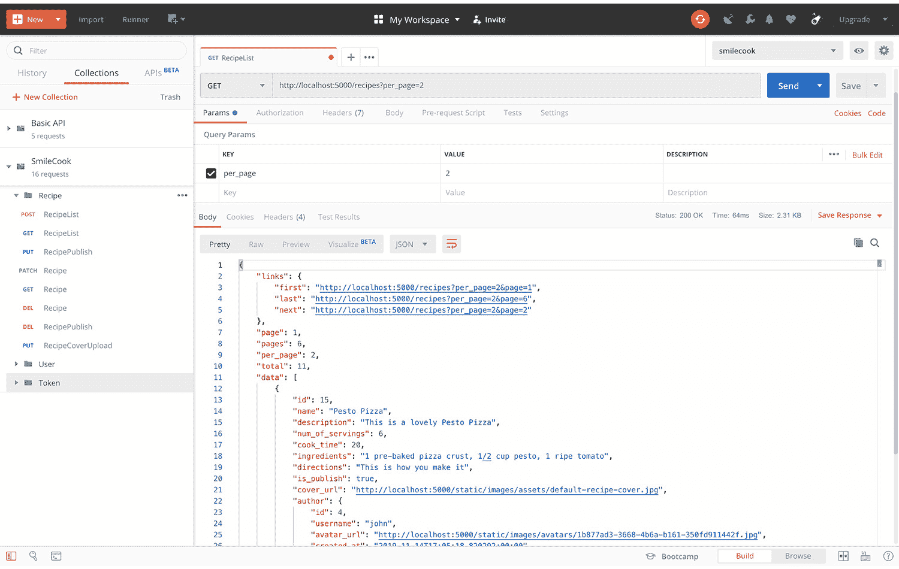

    ###### 图 9.2：获取所有食谱详情

1.  在 PyCharm 控制台中检查应用程序日志。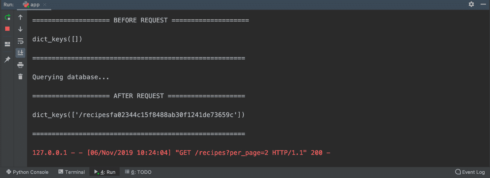

    ###### 图 9.3：检查应用程序日志

    在控制台中，我们可以看到在请求之前，缓存是空的。在数据库查询之后，数据被缓存并返回给前端客户端。

1.  再次获取所有食谱详情并检查 PyCharm 控制台中的结果：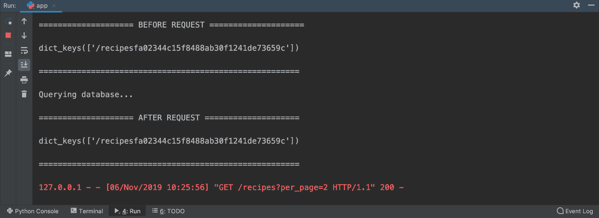

###### 图 9.4：再次获取所有食谱详情

因为这是我们第二次请求数据，所以我们从缓存中获取它，而不是从数据库中获取；之前的结果被缓存了。我们可以从 PyCharm 控制台中看到结果被缓存，并且没有对数据库的查询。

因此，我们在这里完成了缓存功能的实现和测试。由于我们这里只是缓存了一条记录，性能提升可能不明显。但想象一下，如果我们在一个短时间内收到了数千个同类的请求；这种缓存功能可以大大减少我们数据库的工作量。

#### 注意

如果我们想查看缓存中的数据，可以使用以下代码行：`print(cache.cache._cache.items())`，以检查存储在那里的键值。在那里我们可以看到缓存中的值是我们返回给客户端前端的 JSON 数据。

### 数据更新时清除缓存

当数据更新时，之前缓存的那些数据立即变得过时。例如，如果食谱的封面图片被更新，旧的封面图片将被移除。但在缓存中，仍然会有旧封面图片的 URL，这将不再有效。因此，我们需要一个机制来清除旧缓存，并将新封面图片的 URL 存储到我们的缓存中。

### 活动 16：更新食谱详情后获取缓存数据

当我们获取所有食谱详情时，它们将被存储在缓存中，可以直接用于下一个请求。在这个活动中，我们将检查在更新食谱数据后尝试获取食谱详情会发生什么：

1.  首先，获取所有食谱详情。

1.  更新其中一个食谱详情。

1.  再次获取所有食谱详情并检查食谱详情。

    #### 注意

    这个活动的解决方案可以在第 340 页找到。

在我们的下一个练习中，我们将找到所有涉及更新数据的资源。我们将在数据更新后添加一个清除缓存的步骤。

### 练习 58：实现缓存清除功能

在这个练习中，我们将尝试在更新食谱数据时清除缓存。这里涉及很多资源。我们将逐一解决它们：

1.  从 utils.py 中导入缓存：

    ```py
    from extensions import image_set, cache
    ```

1.  在 `utils.py` 下创建一个新的用于清除缓存的功能。该函数应使用特定的前缀清除缓存：

    ```py
    def clear_cache(key_prefix):
        keys = [key for key in cache.cache._cache.keys() if key.startswith(key_prefix)]
        cache.delete_many(*keys)
    ```

    在这里，代码是使用 `for` 循环遍历 `cache.cache._cache.keys()` 中的 `key`，以迭代缓存中的所有键。如果键以传入的前缀开头，它将被放置在 `keys` 列表中。然后，我们将使用 `cache.delete_many` 方法来清除缓存。前述代码中的单个星号 `*` 是用于将列表解包为位置参数。

1.  在 `resources/recipe.py` 中导入 `clear_cache` 函数：

    ```py
    from utils import clear_cache
    ```

1.  在更新食谱数据的资源中调用 `clear_cache('/recipes')`。在 `RecipeResource.patch`、`RecipeResource.delete`、`RecipePublishResource.put`、`RecipePublishResource.delete` 和 `RecipeCoverUploadResource.put` 方法中，在 `return` 之前添加 `clear_cache('/recipes')`：

    ```py
    clear_cache('/recipes')
    ```

    因此，在这里，如果操作得当，当数据更新时，旧缓存数据将被清除。下次当请求这些更新后的数据时，它将再次存储在缓存中。

1.  在 `resources/user.py` 中导入 `generate_token`、`verify_token`、`save_image`、`clear_cache` 函数：

    ```py
    from utils import generate_token, verify_token, save_image, clear_cache
    ```

1.  在 `UserAvatarUploadResource.put` 中调用 `clear_cache('/recipes')` 以在数据更新时清除缓存：

    ```py
    clear_cache('/recipes')
    ```

    当用户更新他们的头像图片时，这将改变 `avatar_url` 属性。因此，我们还需要在那里清除过时的缓存。

在这个练习之后，我相信您将对整个缓存流程有更深入的理解。我们在这里构建缓存功能是为了提高性能，但同时我们还想确保缓存被刷新以保证数据质量。

### 练习 59：验证缓存清除功能

在我们之前的练习中，我们将清除缓存的步骤添加到了涉及数据更新的资源中。在这个活动中，我们将验证我们实现的缓存清除功能。我们可以通过更新数据并查看 API 是否返回更新后的数据来测试它：

1.  获取所有食谱数据。点击**RecipeList**并发送请求。结果如下所示：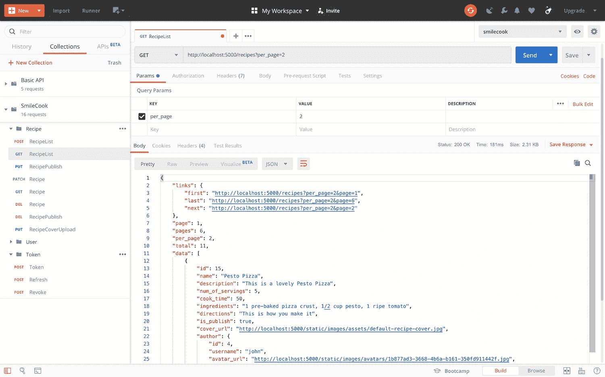

    ###### 图 9.5：获取所有食谱数据并发送请求

1.  在 PyCharm 控制台中检查应用程序日志：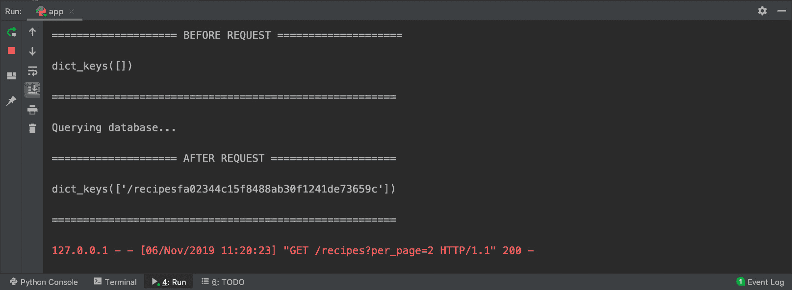

    ###### 图 9.6：检查 PyCharm 控制台中的应用程序日志

    我们可以看到在请求之前缓存是空的。然后，在查询数据库后，新的数据被缓存。

1.  登录您的账户。点击**Collections**标签并选择**POST Token**请求。

1.  发送请求。结果如下所示：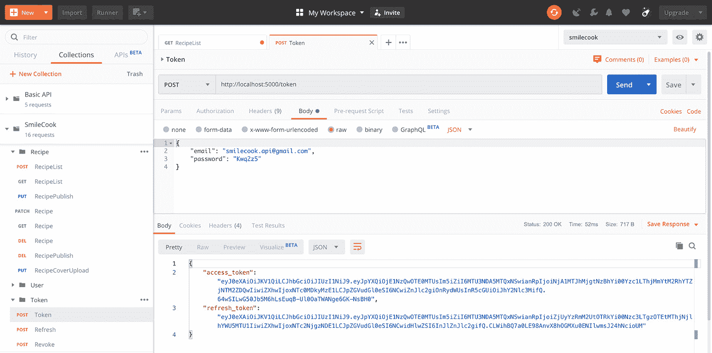

    ###### 图 9.7：选择 POST Token 请求并发送请求

1.  使用`PATCH`方法修改食谱记录。首先，选择`PATCH Recipe`请求。现在，选择`Bearer {token}`；令牌应该是访问令牌。

1.  选择`num_of_servings`为`10`和`cook_time`为`100`。请检查以下内容：

    ```py
    { 
        "num_of_servings": 10, 
        "cook_time": 100 
    } 
    ```

1.  发送请求。结果如下所示：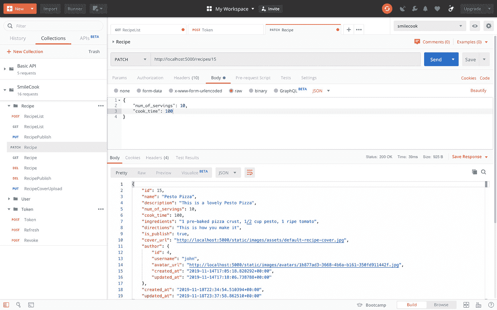

    ###### 图 9.8：使用 PATCH 方法修改食谱记录

1.  在 PyCharm 控制台中检查应用程序日志：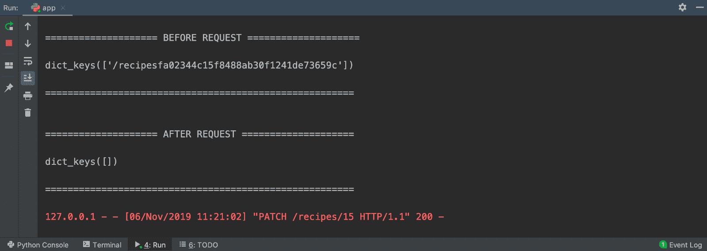

###### 图 9.9：检查应用程序日志

我们可以看到在请求之前缓存是存在的。但是，在食谱记录更新后，缓存变得过时并被移除。

因此，在这个练习中，我们已经完成了缓存清除功能的测试。这将确保我们获取到最新的数据。

#### 注意

应用程序日志的打印仅用于测试。在我们继续之前，我们需要对`before_request`和`after_request`中的`print`命令进行注释。我们可以在 Mac 上使用*command + /*，或在 Windows 机器上使用*Ctrl + /*。

## API 速率限制

当我们提供 API 服务时，我们需要确保每个用户都能公平使用，以便系统资源能够有效且公平地为所有用户服务。我们希望确保大多数用户都能获得良好的服务器性能；因此，我们需要施加限制。通过限制少数高流量用户，我们可以确保大多数用户都感到满意。

要这样做，我们需要为每个用户设置一个限制。例如，我们可以限制每个用户的请求次数不超过每秒`100`次。这个数字足以满足我们 API 的正常使用。如果用户在每秒发起`100`次以上的请求，超出的请求将不会被处理。这是为了为其他用户保留系统资源（如 CPU 处理和带宽资源）。

为了实现这一点，我们引入了速率限制的概念。通过限制每个用户的 API 服务“速率”，我们保证大多数用户能够享受到他们应得的服务性能。

### HTTP 头信息和响应代码

我们可以使用 HTTP 头信息来显示速率限制信息。以下 HTTP 头信息中的属性可以告诉我们允许的请求数量（速率）、剩余配额以及限制何时将重置：

+   **X-RateLimit-Limit**：显示此 API 端点的速率限制

+   **X-RateLimit-Remaining**：显示下一次重置前允许的剩余请求数量

+   **X-RateLimit-Reset**：速率限制将被重置的时间（UTC 纪元时间）

+   **Retry-After**：下一次重置前的秒数

当用户开始违反速率限制时，API 将返回 HTTP 状态码`Too Many Requests`，并在响应体中包含错误信息：

```py
{ 
    "errors": "Too Many Requests" 
}
```

要实现此速率限制功能，我们可以使用 Flask 扩展包 Flask-Limiter。Flask-Limiter 包可以帮助我们轻松地将速率限制功能添加到我们的 API 中。

## Flask-Limiter

`RATELIMIT_HEADERS_ENABLED`配置。因此，我们不需要自己编写 HTTP 头信息代码。除此之外，它还支持可配置的后端存储，当前实现包括 Redis、内存、Memcached 等。

我们甚至可以设置多个限制；我们只需要使用分隔符来界定它们。例如，我们可以同时设置每分钟`100`次请求和每小时`1000`次请求的限制。

使用以下语法为我们的 API 端点设置速率限制：

```py
[count] [per|/] [n (optional)] [second|minute|hour|day|month|year]
```

下面是一些示例：

```py
100 per minute
100/minute
100/minute;1000/hour;5000/day
```

现在我们已经了解了速率限制的工作原理。我们将一起进行一个实际练习，将这个有用的功能添加到我们的 Smilecook 应用程序中。

### 练习 60：实现 API 速率限制功能

在这个练习中，我们将使用`Flask-Limiter`实现 API 速率限制功能。我们将安装并设置`Flask-Limiter`，然后将其速率限制添加到`RecipeListResource`：

1.  将`Flask-Limiter`版本`1.0.1`添加到`requirements.txt`：

    ```py
    Flask-Limiter==1.0.1
    ```

1.  使用`pip install`命令安装包：

    ```py
    pip install -r requirements.txt
    ```

    你应该看到以下安装结果：

    ```py
    Installing collected packages: limits, Flask-Limiter
      Running setup.py install for limits ... done
      Running setup.py install for Flask-Limiter ... done
    Successfully installed Flask-Limiter-1.0.1 limits-1.3
    ```

1.  在 `extensions.py` 中导入 `Limiter` 和 `get_remote_address` 并实例化一个 `limiter` 对象：

    ```py
    from flask_limiter import Limiter
    from flask_limiter.util import get_remote_address
    limiter = Limiter(key_func=get_remote_address)
    ```

    `get_remote_address` 函数将返回当前请求的 IP 地址。如果找不到 IP 地址，它将返回 `127.0.0.1`，这意味着本地主机。在这里，我们的策略是按 IP 地址限制速率。

1.  在 `app.py` 中从 `extensions` 导入 `limiter`：

    ```py
    from extensions import db, jwt, image_set, cache, limiter
    ```

1.  在 `app.py` 中，在 `register_extensions` 下初始化 `limiter` 对象。将 `app` 对象传递给 `limiter.init_app` 方法：

    ```py
        limiter.init_app(app)
    ```

1.  在 `config.py` 中，将 `RATELIMIT_HEADERS_ENABLED` 设置为 `True`：

    ```py
    RATELIMIT_HEADERS_ENABLED = True
    ```

    这将允许 Flask-Limiter 在 HTTP 头中放入与速率限制相关的信息，包括 **X-RateLimit-Limit**、**X-RateLimit-Remaining**、**X-RateLimit-Reset** 和 **Retry-After**。

1.  在 `resources/recipe.py` 中从 `extensions` 导入 `limiter`：

    ```py
    from extensions import image_set, cache,  limiter
    ```

1.  在 `RecipeListResource` 中，将 `limiter.limit` 函数放入 `decorators` 属性：

    ```py
    class RecipeListResource(Resource):
        decorators = [limiter.limit('2 per minute', methods=['GET'], error_message='Too Many Requests')]
    ```

    我们将请求次数设置为每分钟仅两个。HTTP 方法是 `GET`，错误信息是 `Too Many Requests`。

1.  点击 **运行** 以启动 Flask 应用程序；然后，我们就可以测试它了：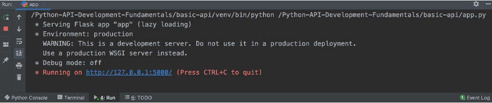

###### 图 9.10：启动 Flask 应用程序然后测试

现在这个练习已经完成，我们的 API 已经有了速率限制功能。在下一个练习中，我们必须测试我们的速率限制函数。

### 练习 61：验证速率限制功能

在上一个练习中，我们设置了获取所有食谱详情的 API，每分钟只能获取两次。所以，在这个练习中，我们将看到结果是否符合我们的预期：

1.  获取所有食谱数据。点击 GET `RecipeList` 并发送请求。

1.  选择 `60` 秒后。

1.  再次获取所有食谱数据并发送两次请求。

1.  在 HTTP 响应中选择 **Body**。结果如下截图所示：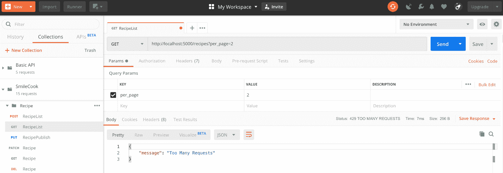

###### 图 9.12：再次获取所有食谱数据并发送两次请求

我们可以看到，在第三次请求时，我们将收到错误 HTTP 状态码 **429 太多请求**。这意味着速率限制正在起作用。

在这个练习中，我们已经完成了速率限制功能。通过限制少量滥用用户，我们确保大多数用户可以享受高性能的服务。

### 练习 62：添加白名单

我们希望减轻我们开发人员和 API 测试人员的速率限制，因为他们可能确实需要频繁地向 API 发送请求进行测试。在这种情况下我们应该怎么做？在这个练习中，我们将看到如何使用 Flask-Limiter 来满足这一要求。

我们希望设置一个 IP 白名单，允许某些 IP 地址使用 API 而不受任何速率限制：

1.  在 `app.py` 中导入 `request`：

    ```py
    from flask import Flask, request
    ```

1.  在`app.py`中，使用`@limiter.request_filter`装饰器并设置白名单函数。将`127.0.0.1`（本地主机）放入白名单中：

    ```py
        @limiter.request_filter
        def ip_whitelist():
            return request.remote_addr == '127.0.0.1'
    ```

1.  运行`app.py`：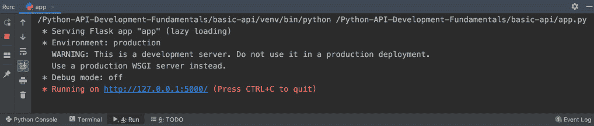

    ###### 图 9.13：运行 app.py 文件

1.  通过发送一个获取所有菜谱的`GET`请求来测试应用程序，并检查 HTTP 头部的速率限制。点击`GET RecipeList`并发送请求。在**响应**中选择**Header**选项卡。结果如下所示：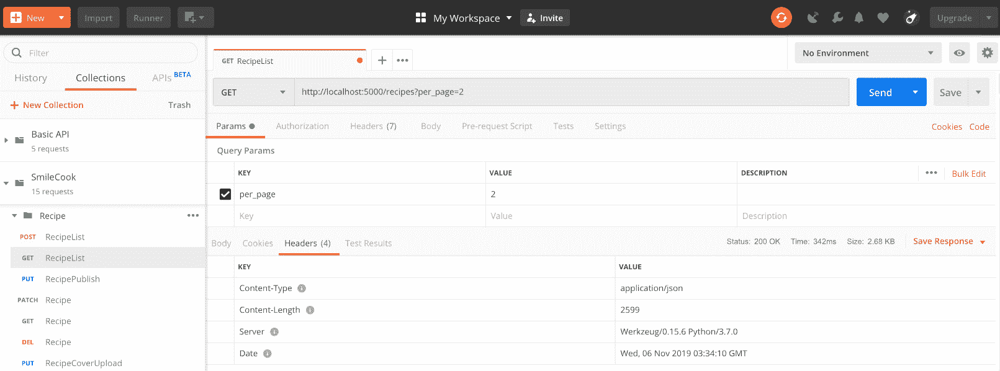

###### ![图 9.14：检查速率限制的 HTTP 头部

我们可以看到速率限制已经消失。在这个练习中，您已经看到速率限制功能可以灵活运用。它可以根据不同的情况实施或撤销。

### 活动十七：添加多个速率限制

在这个活动中，我们将向同一资源添加多个速率限制。但请记住，我们在之前的练习中添加了一个白名单。我们需要注释掉这段代码，以便我们可以进行测试：

1.  在`UserRecipeListResource`中添加速率限制。限制为每分钟`3`次，每小时`30`次，每天`300`次。

1.  注释掉白名单代码。

1.  使用 Postman 测试速率限制功能。

    #### 注意

    本活动的解决方案可以在第 343 页找到。

恭喜！现在您已经完成了这个活动，您知道如何灵活地使用速率限制功能。

## 摘要

在本章中，我们学习了并在 Smilecook API 中实现了缓存和速率限制功能。这些功能使我们的 API 更加高效。然而，我们的 Smilecook 应用程序将缓存保存在应用内存中，这意味着在服务器重启后缓存将消失。为了解决这个问题，我们可以在未来与 Redis 或 Memcached 一起工作，它们可以在服务器重启后持久化缓存。它们还支持多个服务器之间的缓存共享。这是我们鼓励您在本书之外探索的内容。目前最重要的事情是您要学习本书中涵盖的所有基本概念。因此，如果您以后想要扩展到更高级的实现，这对您来说应该不会太难。

在下一章和最后一章中，我们将为您构建 Smilecook 前端客户端，以便您与后端 API 协同工作。通过这个前端客户端，我们将更好地理解整体情况。您将看到前端和后端的交互方式。最后，我们将整个应用程序部署到 Heroku 云平台，这意味着我们的 Smilecook 应用程序将被每个人使用。
