# 附录

## 关于

本节包含帮助学生执行书中活动的说明。它包括学生为实现活动目标需要执行的详细步骤。

## 1: 第一步

### 活动 1：使用 Postman 向我们的 API 发送请求

**解决方案**

1.  首先，我们将获取所有食谱。在下拉列表中选择我们的`HTTP`方法为**GET**。

1.  输入请求 URL `http://localhost:5000/recipes`。

1.  点击**Send**按钮。结果可以在下述屏幕截图查看：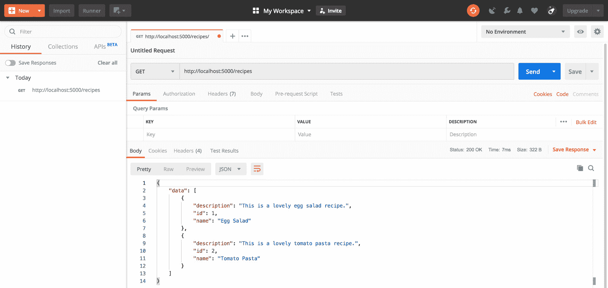

    ###### 图 1.14：获取所有食谱

    在 HTTP 响应中，你将在响应面板右上角看到 HTTP 状态**200 OK**。这意味着请求已成功。旁边的显示**7ms**，这是请求花费的时间。响应的大小，包括头和体，是**322**字节。食谱的详细信息以 JSON 格式显示在 Body 面板中。

1.  接下来，我们将使用 POST 方法创建一个食谱。我们将发送 HTTP `http://localhost:5000/recipes`。

1.  通过点击`http://localhost:5000/recipes`作为请求 URL，在 Get 请求标签旁边创建一个新标签页。

1.  选择**Body**标签页。同时，选择**raw**单选按钮。

1.  在右侧下拉菜单中选择**JSON (application/json)**。在**Body**内容区域以 JSON 格式输入以下数据。点击**Send**按钮：

    ```py
    {
         "name": "Cheese Pizza",
         "description": "This is a lovely cheese pizza"
    }
    ```

    结果显示在下述屏幕截图：

    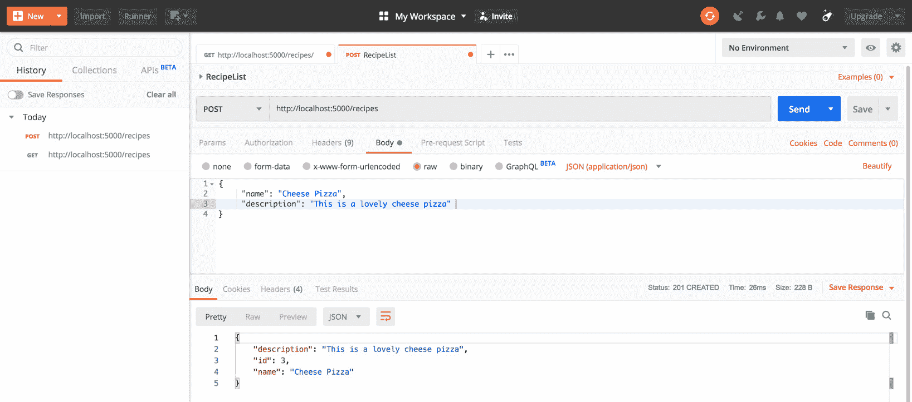

    ###### 图 1.15：创建食谱

    你应该在 Postman 界面中的 HTTP 响应中看到以下信息，状态**201** OK，表示创建成功，我们可以看到我们的新食谱以 JSON 格式显示。你还会注意到分配给食谱的 ID 是**3**。

1.  现在，再次从服务器应用程序获取所有食谱。我们想看看现在是否有三个食谱。在历史面板中，选择我们之前获取所有食谱的请求，点击它，并重新发送。

    响应中，我们可以看到有三个食谱。它们显示在下述屏幕截图：

    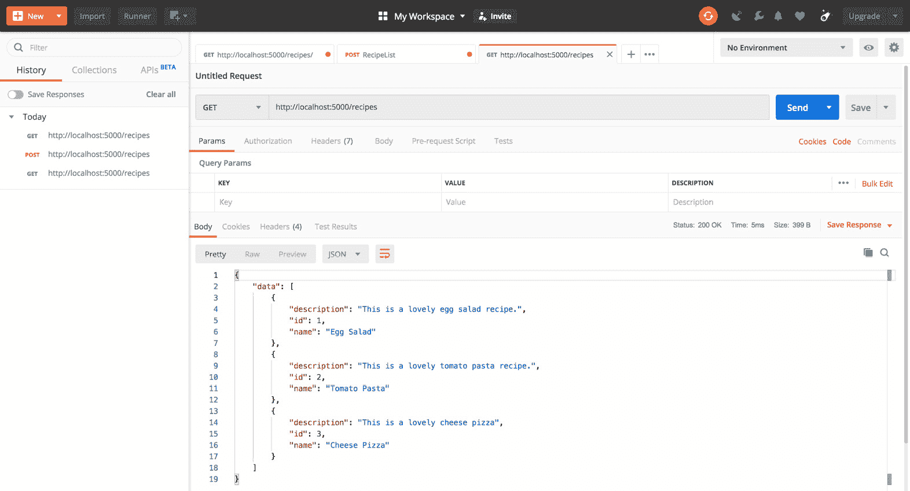

    ###### 图 1.16：从服务器应用程序获取所有食谱

1.  然后，修改我们刚刚创建的食谱。为此，通过点击**+**按钮在**Get**请求标签旁边创建一个新标签页。选择**PUT**作为 HTTP 方法。

1.  将`http://localhost:5000/recipes/3`作为请求 URL 输入。

1.  选择**Body**标签页，然后选择**raw**单选按钮。

1.  在右侧下拉菜单中选择`JSON (application/json)`。在**Body**内容区域以 JSON 格式输入以下数据。点击**Send**：

    ```py
    {
    "name": "Lovely Cheese Pizza",
    "description": "This is a lovely cheese pizza recipe."
    }
    ```

    结果显示在下述屏幕截图：

    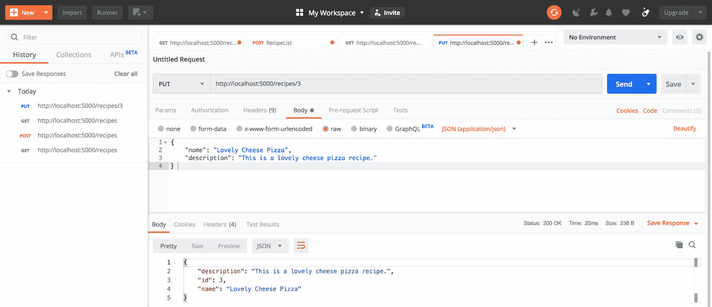

    ###### 图 1.17：修改食谱

    在 HTTP 响应中，您将看到**200 OK**的 HTTP 状态，表示更新已成功。您还可以看到请求花费的时间（以毫秒为单位）。您还应看到响应的大小（头和体）。响应内容以 JSON 格式。我们可以在 JSON 格式中看到我们的更新后的食谱。

1.  接下来，我们将看看是否可以使用其 ID 来查找食谱。我们只想在响应中看到 ID 为**3**的食谱。为此，通过点击**+**按钮在**获取请求**标签旁边创建一个新标签页。

1.  将请求 URL 选择为`http://localhost:5000/recipes/3`。

1.  点击**发送**。结果如下截图所示：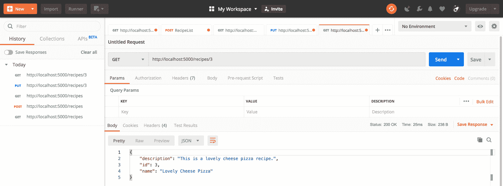

    ###### 图 1.18：查找具有 ID 的食谱

    我们可以在响应中看到只返回了 ID 为**3**的食谱。它包含了我们刚刚设置的修改后的详细信息。

1.  当我们搜索一个不存在的食谱时，我们将看到以下响应，其中包含消息`http://localhost:5000/recipes/101`端点。结果如下截图所示：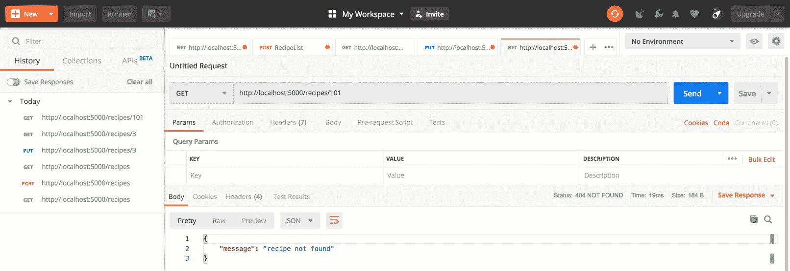

###### 图 1.19：显示“食谱未找到”的响应

### 活动二：实现和测试 delete_recipe 函数

**解决方案**

1.  `delete_recipe`函数从内存中删除食谱。使用`recipe = next((recipe for recipe in recipes if recipe['id'] == recipe_id), None)`获取具有特定 ID 的食谱：

    ```py
    @app.route('/recipes/<int:recipe_id>', methods=['DELETE'])
    def delete_recipe(recipe_id):
        recipe = next((recipe for recipe in recipes if recipe['id'] == recipe_id), None)
        if not recipe:
            return jsonify({'message': 'recipe not found'}), HTTPStatus.NOT_FOUND
        recipes.remove(recipe)
        return '', HTTPStatus.NO_CONTENT
    ```

1.  与之前显示的`update_recipe`函数类似，如果您找不到食谱，则返回与 HTTP 状态`NOT_FOUND`一起的"`recipe not found`"。否则，我们将继续从我们的食谱集合中删除具有给定 ID 的食谱，HTTP 状态为`204 No Content`

1.  代码完成后，在`app.py`文件上**右键单击**并点击**运行**以启动应用程序。Flask 服务器将启动，我们的应用程序准备进行测试。

1.  使用 httpie 或 curl 删除 ID 为`1`的食谱：

    ```py
    http DELETE localhost:5000/recipes/1
    ```

    以下是与之前相同的命令的`curl`版本。

    ```py
    curl -i -X DELETE localhost:5000/recipes/1
    ```

    `@app.route('/recipes/<int:recipe_id>', methods=['DELETE'])`路由将捕获客户端请求并调用`delete_recipe(recipe_id)`函数。该函数将查找具有`recipe_id` ID 的食谱，如果找到，则将其删除。响应中我们可以看到删除操作已成功。并且我们看到 HTTP 状态是`204 NO CONTENT`：

    ```py
    HTTP/1.0 204 NO CONTENT
    Content-Type: text/html; charset=utf-8
    Date: Fri, 06 Sep 2019 05:57:50 GMT
    Server: Werkzeug/0.15.6 Python/3.7.0
    ```

1.  最后，使用 Postman 删除 ID 为`2`的食谱。为此，通过点击**+**按钮在**获取请求**标签旁边创建一个新标签页。

1.  选择**HTTP**方法。输入`http://localhost:5000/recipes/2`作为请求 URL。

1.  点击**发送**。结果如下截图所示：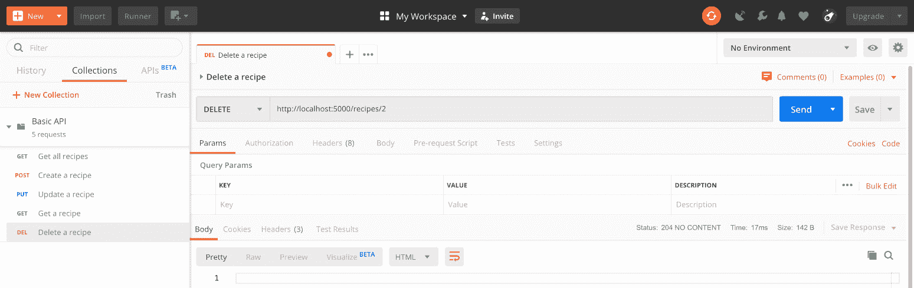

###### 图 1.20：删除食谱

然后，我们可以看到带有 HTTP 状态**204 NO CONTENT**的响应。这意味着食谱已被成功删除。

## 2：开始构建我们的项目

### 活动 3：使用 Postman 测试 API

**解决方案**

1.  首先，构建一个客户端请求，请求一个新的食谱。然后，利用 Postman 中的集合功能使测试更高效。

1.  点击**集合**标签页，然后通过点击**+**创建一个新的集合。

1.  输入**Smilecook**作为名称并点击**创建**。

1.  在**Smilecook**旁边的**...**上**右键单击**，在**Smilecook**下创建一个新的文件夹，并在名称字段中输入**Recipe**。

1.  在**食谱**上**右键单击**以创建一个新的请求。然后，将名称设置为**RecipeList**，并将其保存到**食谱**集合下。

1.  在请求 URL 字段中选择`http://localhost:5000/recipes`。

1.  现在，转到`body`字段：

    ```py
    {
        "name": "Cheese Pizza",
        "description": "This is a lovely cheese pizza",
        "num_of_servings": 2,
        "cook_time": 30,
        "directions": "This is how you make it" 
    }
    ```

1.  **保存**并发送食谱。结果如下截图所示：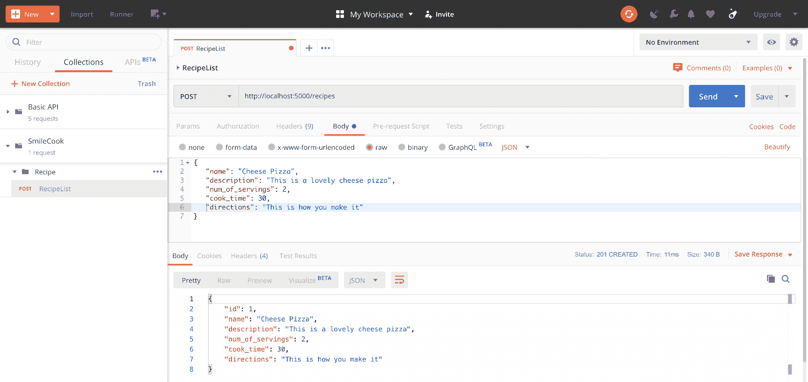

    ###### 图 2.10：通过发送 JSON 格式的详细信息创建我们的第一个食谱

    在 HTTP 响应中，您将看到 HTTP 状态**201 已创建**，表示请求成功，并且在正文中，您应该看到我们刚刚创建的相同食谱。食谱的 ID 应该是 1。

1.  通过发送客户端请求创建第二个食谱。接下来，我们将通过以下 JSON 格式的详细信息创建第二个食谱：

    ```py
    { 
        "name": "Tomato Pasta",
        "description": "This is a lovely tomato pasta recipe",
        "num_of_servings": 3,
        "cook_time": 20,
        "directions": "This is how you make it" 
    }
    ```

1.  点击**发送**。结果如下截图所示：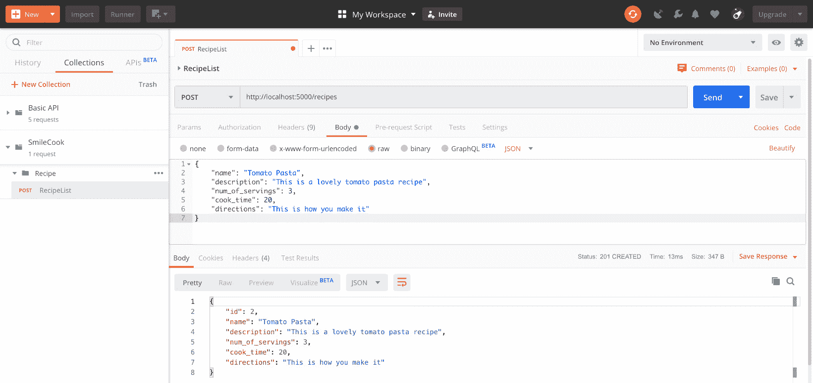

    ###### 图 2.11：通过发送 JSON 格式的详细信息创建我们的第二个食谱

    在 HTTP 响应中，您将看到 HTTP 状态**201 已创建**，表示请求成功，并且在正文中，您应该看到我们刚刚创建的相同食谱。食谱的 ID 应该是 2。

    到目前为止，我们已经创建了两个食谱。让我们使用 Postman 检索这些食谱，并确认这两个食谱是否在应用程序内存中。

1.  在**食谱**文件夹下创建一个新的请求，命名为**RecipeList**，然后保存。

1.  选择我们刚刚创建的**RecipeList**（HTTP 方法设置为 GET）。

1.  在请求 URL 中输入`http://localhost:5000/recipes`。然后，点击`ID = 1`以发布。

1.  在**食谱**文件夹下创建一个新的请求，命名为**RecipePublish**，然后保存。

1.  点击我们刚刚创建的**RecipePublish**请求（HTTP 方法设置为 GET）。

1.  在请求 URL 中选择`http://localhost:5000/recipes/1/publish`。然后，点击**保存**并发送请求。结果如下截图所示：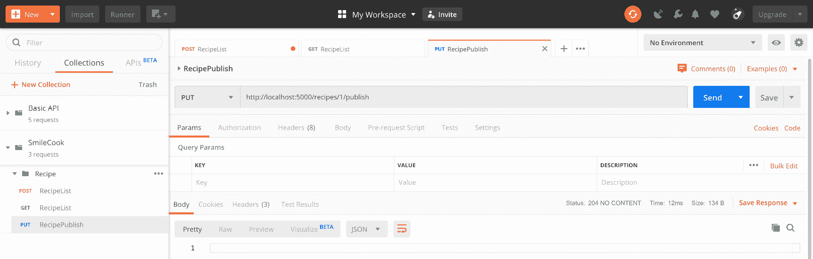

    ###### 图 2.13：检索已发布的食谱

    在 HTTP 响应中，您将看到 HTTP 状态**204 无内容**，表示请求已成功发布，并且响应正文中没有返回数据。

1.  再次使用 Postman 获取所有食谱。从左侧面板中选择 `RecipeList` (`GET`) 并发送请求。结果如下截图所示：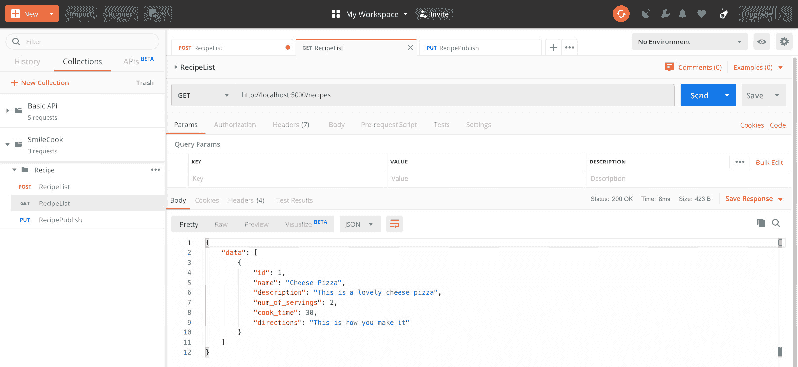

    ](img/C15309_02_14.jpg)

    ###### 图 2.14：使用 Postman 获取所有食谱

    在 HTTP 响应中，您将看到 `localhost:5000/recipes/1`。

1.  在请求 URL 下的 `http://localhost:5000/recipes/1` 下创建一个新的请求。

1.  现在，转到 **主体** 选项卡，选择原始，从下拉菜单中选择 **JSON (application/json)**，并将以下代码插入到主体字段中。这是修改后的食谱：

    ```py
    {
        "name": "Lovely Cheese Pizza",
        "description": "This is a lovely cheese pizza recipe",
        "num_of_servings": 3,
        "cook_time": 60,
        "directions": "This is how you make it"
    }
    ```

1.  **保存**并发送它。结果如下截图所示：

    ](img/C15309_02_15.jpg)

    ###### 图 2.15：修改 ID 为 1 的食谱

    在 HTTP 响应中，您将看到 HTTP 状态 **200 OK**，表示修改成功。正文应包含以 JSON 格式更新的食谱 1 的详细信息。我们将检索 ID 为 1 的食谱。

1.  在请求 URL 下的 `http://localhost:5000/recipes/1` 下创建一个新的请求。

1.  **保存**并发送它。结果如下截图所示：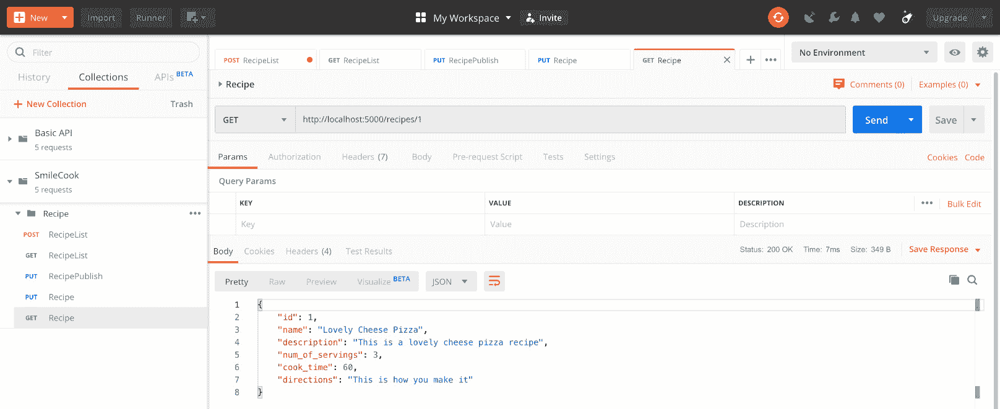

    ](img/C15309_02_16.jpg)

###### 图 2.16：检索 ID 为 1 的食谱

在 HTTP 响应中，您将看到以 JSON 格式的 `recipe 1`。

### 活动 4：实现删除食谱功能

**解决方案**

1.  将 `delete` 函数添加到 `RecipeResource`。通过以下示例代码实现 `delete` 方法：

    ```py
        def delete(self, recipe_id):
            recipe = next((recipe for recipe in recipe_list if recipe.id == recipe_id), None)
            if recipe is None:
                return {'message': 'recipe not found'}, HTTPStatus.NOT_FOUND
            recipe_list.remove(recipe)
            return {}, HTTPStatus.NO_CONTENT
    ```

    在这里我们构建的第三个方法已被删除。我们通过定位具有相应食谱 ID 的食谱并将其从食谱列表中删除来实现这一点。最后，我们返回 HTTP 状态 **204 无内容**。

1.  右键单击 `app.py` 文件并单击 **运行** 以启动应用程序。Flask 服务器将启动，我们的应用程序将准备好测试。现在，使用 Postman 创建第一个食谱。我们将构建一个客户端请求，请求一个新的食谱。

1.  首先，选择 **RecipeList POST** 请求。现在，通过单击以下截图所示的 **发送** 按钮发送请求：

    ](img/C15309_02_17.jpg)

    ###### 图 2.17：使用 Postman 创建第一个食谱

1.  现在，我们将使用 Postman 删除一个食谱。为此，删除 ID 为 1 的食谱。

1.  在 **Recipe** 文件夹下创建一个新的请求。然后，将 **请求名称** 设置为 **Recipe** 并 **保存**。

1.  将 `HTTP` 方法更改为 `DELETE` 并在请求 URL 中输入 `http://localhost:5000/recipes/1`。然后，保存并发送请求。结果如下截图所示：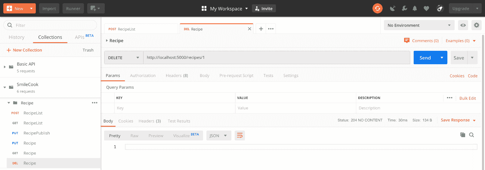

    ](img/C15309_02_18.jpg)

###### 图 2.18：使用 Postman 删除食谱

在 HTTP 响应中，您将看到 `RecipeResource` 类在此活动中的状态：


](img/C15309_02_19.jpg)

###### ![图 2.19：为 RecipeResource 类构建的方法

## 3：使用 SQLAlchemy 操作数据库

### 活动五：创建用户和菜谱

**解决方案**

1.  在 PyCharm 底部的 Python 控制台中输入以下代码以导入必要的模块和类：

    ```py
    from app import *
    from models.user import User
    from models.recipe import Recipe
    app = create_app()
    ```

1.  在 Python 控制台中输入以下代码创建一个 `user` 对象并将其保存到数据库中：

    ```py
    user = User(username='peter', email='peter@gmail.com', password='WkQa')
    db.session.add(user)
    db.session.commit()
    ```

1.  接下来，我们将使用以下代码创建两个菜谱。需要注意的是，菜谱的 `user_id` 属性被设置为 `user.id`。这是为了表明菜谱是由用户 `Peter` 创建的：

    ```py
    carbonara = Recipe(name='Carbonara', description='This is a lovely carbonara recipe', num_of_servings=4, cook_time=50, directions='This is how you make it', user_id=user.id)
    db.session.add(carbonara)
    db.session.commit()
    risotto = Recipe(name='Risotto', description='This is a lovely risotto recipe', num_of_servings=5, cook_time=40, directions='This is how you make it', user_id=user.id)
    db.session.add(risotto)
    db.session.commit()
    ```

1.  我们可以在 `user` 表中看到一条新记录：![图 3.18：用户表中的新记录

    ![图片 C15309_03_18.jpg]

    ###### ![图 3.18：用户表中的新记录

1.  我们将检查两个菜谱是否已在数据库中创建![图 3.19：检查两个菜谱是否已创建

    ![图片 C15309_03_19.jpg]

    :

###### ![图 3.19：检查两个菜谱是否已创建

### 活动六：升级和降级数据库

**解决方案**

1.  向 `user` 类添加一个新属性：

    ```py
    bio= db.Column(db.String())
    ```

1.  现在，运行 `flask db migrate` 命令来创建数据库和表：

    ```py
    flask db migrate
    ```

    Flask-Migrate 检测到新列并为此创建了脚本：

    ```py
    INFO  [alembic.runtime.migration] Context impl PostgresqlImpl.
    INFO  [alembic.runtime.migration] Will assume transactional DDL.
    INFO  [alembic.ddl.postgresql] Detected sequence named 'user_id_seq' as owned by integer column 'user(id)', assuming SERIAL and omitting
    INFO  [alembic.ddl.postgresql] Detected sequence named 'recipe_id_seq' as owned by integer column 'recipe(id)', assuming SERIAL and omitting
    INFO  [alembic.autogenerate.compare] Detected added column 'user.bio'
      Generating /Python-API-Development-Fundamentals/smilecook/migrations/versions/6971bd62ec60_.py ... done
    ```

1.  现在，检查 `versions` 文件夹下的 `/migrations/versions/6971bd62ec60_.py`。此文件由 Flask-Migrate 创建。请注意，您可能在这里获得不同的修订 ID。请在运行 `flask db upgrade` 命令之前检查该文件。这是因为有时它可能无法检测到您对模型所做的每个更改：

    ```py
    """empty message

    Revision ID: 6971bd62ec60
    Revises: 1b69a78087e5
    Create Date: 2019-10-08 12:11:47.370082

    """
    from alembic import op
    import sqlalchemy as sa

    # revision identifiers, used by Alembic.
    revision = '6971bd62ec60'
    down_revision = '1b69a78087e5'
    branch_labels = None
    depends_on = None

    def upgrade():
        # ### commands auto generated by Alembic - please adjust! ###
        op.add_column('user', sa.Column('bio', sa.String(), nullable=True))
        # ### end Alembic commands ###

    def downgrade():
        # ### commands auto generated by Alembic - please adjust! ###
        op.drop_column('user', 'bio')
        # ### end Alembic commands ###
    ```

    在这个自动生成的文件中有两个函数；一个用于升级，这是为了将新的菜谱和用户添加到表中，另一个用于降级，即回到之前的版本。

1.  然后，我们将执行 `flask db upgrade` 命令，这将使我们的数据库升级以符合模型中的最新规范：

    ```py
    flask db upgrade
    ```

    此命令将调用 `upgrade()` 来升级数据库：

    ```py
    INFO  [alembic.runtime.migration] Context impl PostgresqlImpl.
    INFO  [alembic.runtime.migration] Will assume transactional DDL.
    INFO  [alembic.runtime.migration] Running upgrade a6d248ab7b23 -> 6971bd62ec60, empty message
    ```

1.  检查新字段是否已在数据库中创建。转到 **smilecook** >> **Schemas** >> **Tables** >> **user** >> **Properties** 进行验证：![图 3.20：检查新字段是否已在数据库中创建

    ![图片 C15309_03_20.jpg]

###### ![图 3.20：检查新字段是否已在数据库中创建

运行 `downgrade` 命令删除新字段：

```py
flask db downgrade
```

此命令将调用 `downgrade()` 来降级数据库：

```py
INFO  [alembic.runtime.migration] Context impl PostgresqlImpl.
INFO  [alembic.runtime.migration] Will assume transactional DDL.
INFO  [alembic.runtime.migration] Running downgrade 6971bd62ec60 -> a6d248ab7b23, empty message
```

检查字段是否已被删除。转到 **smilecook** → **Schemas** → **Tables** → **user** → **Properties** 进行验证：

![图 3.21：检查字段是否已从数据库中删除

![图片 C15309_03_21.jpg]

###### ![图 3.21：检查字段是否已从数据库中删除## 4：使用 JWTs 进行认证服务和安全性### 活动七：在发布/取消发布菜谱功能上实现访问控制**解决方案**1.  修改`RecipePublishResource`中的`put`方法，以限制只有认证用户才能访问。在`resources/token.py`中，在`RecipePublishResource.put`方法上方添加`@jwt_required`装饰器。使用`get_jwt_identity()`函数来识别认证用户是否是食谱的所有者：    ```py        @jwt_required        def put(self, recipe_id):            recipe = Recipe.get_by_id(recipe_id=recipe_id)            if recipe is None:                return {'message': 'Recipe not found'}, HTTPStatus.NOT_FOUND            current_user = get_jwt_identity()            if current_user != recipe.user_id:                return {'message': 'Access is not allowed'}, HTTPStatus.FORBIDDEN            recipe.is_publish = True            recipe.save()            return {}, HTTPStatus.NO_CONTENT    ```    这是为了发布食谱。只有已登录的用户可以发布他们自己的食谱。该方法将执行各种检查以确保用户有发布权限。一旦食谱发布，它将返回**204 NO_CONTENT**。1.  修改`RecipePublishResource`中的`delete`方法。只有认证用户才能取消发布食谱：    ```py    @jwt_required        def delete(self, recipe_id):            recipe = Recipe.get_by_id(recipe_id=recipe_id)            if recipe is None:                return {'message': 'Recipe not found'}, HTTPStatus.NOT_FOUND            current_user = get_jwt_identity()            if current_user != recipe.user_id:                return {'message': 'Access is not allowed'}, HTTPStatus.FORBIDDEN            recipe.is_publish = False            recipe.save()            return {}, HTTPStatus.NO_CONTENT    ```    这将取消发布食谱。类似于之前的代码，只有已登录的用户可以取消发布他们自己的食谱。一旦食谱发布，它将返回**状态码** **204 NO_CONTENT**。1.  登录用户账户并获取访问令牌。选择我们之前创建的**POST**令牌请求。1.  选择**raw**单选按钮，并从下拉菜单中选择**JSON (application/json)**。在**Body**字段中输入以下 JSON 内容：    ```py    {        "email": "james@gmail.com",        "password": "WkQad19"    }    ```1.  点击**Send**以登录账户。结果如下所示：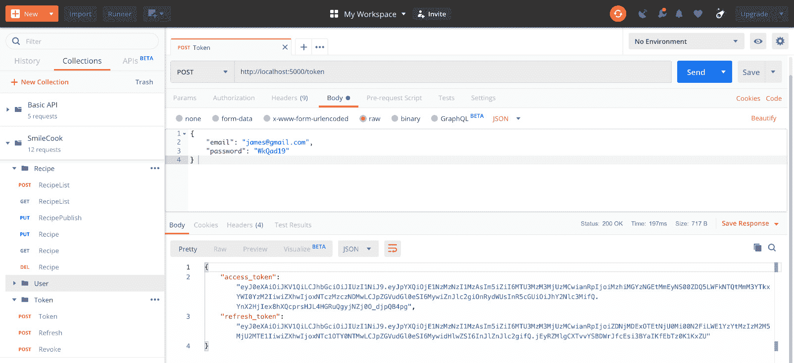

    ###### 图 4.20：登录用户账户

    您将看到 HTTP **状态码** **200 OK**，表示登录成功。我们可以在响应体中看到**访问令牌**和**刷新令牌**。

1.  在用户登录状态下发布`id = 3`的食谱。选择**PUT RecipePublish**。

1.  前往**VALUE**字段中的`Bearer {token}`，其中 token 是我们之前步骤中获得的 JWT 令牌。

1.  点击**Send**以发布食谱。结果如下所示：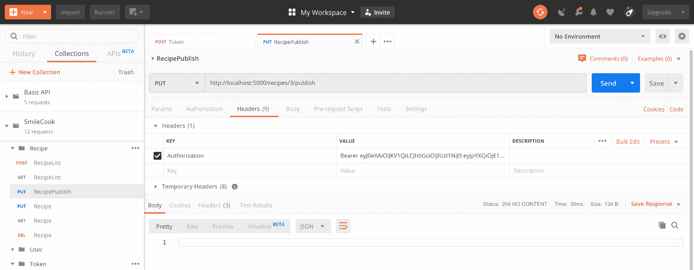

    ###### 图 4.21：发布食谱

    然后，您将看到响应，HTTP **状态码** **204**表示食谱已成功发布。

    最后，尝试获取所有已发布的食谱。选择**GET RecipeList**请求，然后点击**Send**以获取所有已发布食谱的详细信息。结果如下所示：

    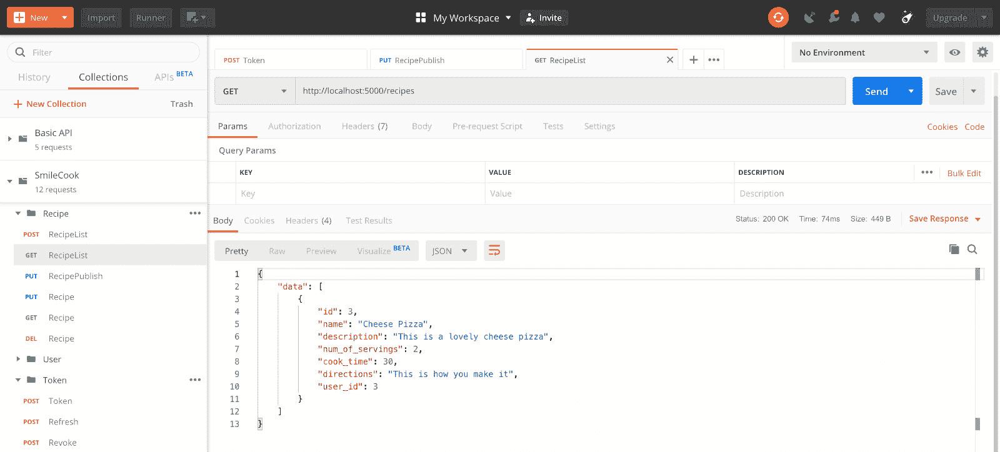

    ###### 图 4.22：检索所有已发布的食谱

    然后，您将看到响应，HTTP **状态码** **200**表示请求成功，您可以看到我们创建的一个已发布的食谱被返回。

1.  在用户登录状态下取消发布`id = 3`的食谱。在**Recipe**文件夹下创建一个新的请求，命名为**RecipePublish**，然后保存。

1.  点击我们刚刚创建的**RecipePublish**请求（HTTP 方法设置为**GET**）。

1.  在请求 URL 中选择`http://localhost:5000/recipes/3/publish`。

1.  前往**VALUE**字段中的`Bearer {token}`，其中 token 是我们第 5 步中获得的 JWT 令牌。

1.  **保存** 并 **发送** 取消发布的请求。结果如下所示：![图 4.23：取消发布菜谱

    ![图片 C15309_04_23.jpg]

###### 图 4.23：取消发布菜谱

## 5：使用 marshmallow 验证 API

### 活动八：使用 marshmallow 序列化菜谱对象

**解决方案**

1.  修改菜谱模式以包含除 `email` 之外的所有属性。在 `schemas/recipe.py` 中，将 `only=['id', 'username']` 修改为 `exclude=('email', )`。这样，我们将显示除用户的电子邮件地址之外的所有内容。此外，如果我们将来为 `recipe` 对象添加新的属性（例如，`user avatar` URL），我们就不需要再次修改模式，因为它将显示所有内容：

    ```py
         author = fields.Nested(UserSchema, attribute='user', dump_only=True, exclude=('email', ))
    ```

1.  修改 `RecipeResource` 中的 `get` 方法，使用菜谱模式将 `recipe` 对象序列化为 JSON 格式：

    ```py
            return recipe_schema.dump(recipe).data, HTTPStatus.OK
    ```

    这主要是为了修改代码以使用 `recipe_schema.dump(recipe).data` 通过菜谱模式返回菜谱详情。

1.  右键单击以运行应用程序。Flask 将启动并在本地主机（`127.0.0.1`）的端口 `5000` 上运行：![图 5.18：在本地主机上运行 Flask

    ![图片 C15309_05_18.jpg]

    ###### 图 5.18：在本地主机上运行 Flask

1.  通过 Postman 获取一个特定的已发布菜谱来测试实现。在 **输入请求 URL** 中选择 `http://localhost:5000/recipes/4`。点击 **发送** 以获取特定的菜谱详情。结果如下所示：![图 5.19：选择 GET 菜谱请求并发送请求

    ![图片 C15309_05_19.jpg]

###### 图 5.19：选择 GET 菜谱请求并发送请求

你将看到返回的响应。HTTP 状态码 `created_at`。

## 6：电子邮件确认

### 活动九：测试完整的用户注册和激活工作流程

**解决方案**

1.  我们将首先通过 Postman 注册一个新用户。点击 **集合** 选项卡并选择 **POST UserList** 请求。

1.  选择 **主体** 选项卡，然后选择 **原始** 单选按钮，并从下拉列表中选择 **JSON (application/json)**。

1.  在 **主体** 字段中输入以下用户详情（JSON 格式）。将用户名和密码更改为适当的值：

    ```py
    {
        "username": "john",
        "email": "smilecook.api@gmail.com",
        "password": "Kwq2z5"
    }
    ```

1.  发送请求。你应该看到以下输出：![图 6.10：通过 Postman 注册用户

    ![图片 C15309_06_10.jpg]

    ###### 图 6.10：通过 Postman 注册用户

    你应该在响应中看到新的用户详情（**ID = 4**），HTTP 状态为 **201 OK**。这意味着新用户在后台已成功创建。

1.  通过 API 登录并点击 **集合** 选项卡。然后，选择我们之前创建的 **POST Token** 请求。

1.  现在，点击 **主体** 选项卡。检查 **原始** 单选按钮，并从下拉菜单中选择 **JSON(application/json)**。

1.  在 **主体** 字段中输入以下 JSON 内容（电子邮件和密码）：

    ```py
    {
        "email": "smilecook.api@gmail.com",
        "password": "Kwq2z5"
    }
    ```

1.  发送请求。你应该看到以下输出：![图 6.11：使用 JSON 发送请求

    ![图片 C15309_06_11.jpg]

    ###### 图 6.11：使用 JSON 发送请求

    您应该收到一条消息，说明用户账户尚未激活，HTTP 状态为 **403 禁止**。这是预期行为，因为我们的应用程序会要求用户首先激活账户。

1.  请检查您的邮箱以获取激活邮件。那里应该有一个链接供您激活用户账户。点击该链接以激活账户。它应该看起来如下：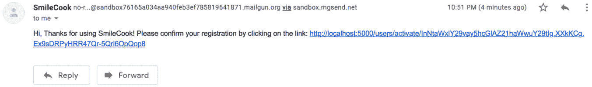

    ###### 图 6.12：激活邮件

1.  账户激活后，请重新登录。点击**收藏**标签页。

1.  选择我们之前创建的 **POST Token** 请求并发送请求。您将看到以下内容：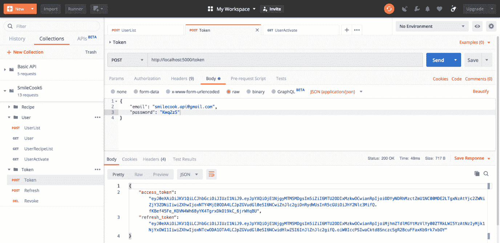

###### 图 6.13：激活账户后，选择 POST 令牌请求

您应该在响应中看到访问令牌和刷新令牌，HTTP 状态为 **200 OK**。这意味着登录成功。

### 活动 10：创建 HTML 格式用户账户激活邮件

**解决方案**

1.  点击 `Mailgun` 控制台，然后在右侧将我们新用户的电子邮件添加到授权收件人列表中。`Mailgun` 将然后向该电子邮件地址发送确认邮件：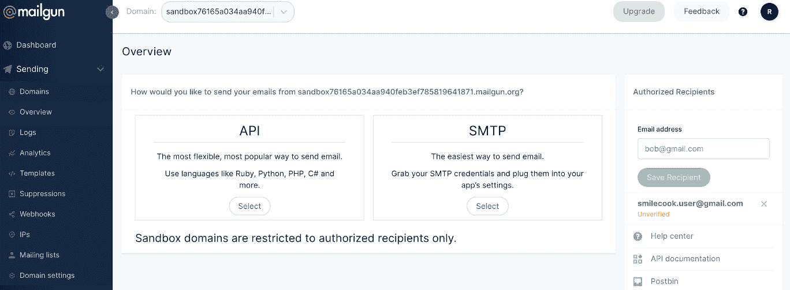

    ###### 图 6.14：向我们的新用户发送确认邮件

    #### **注意**

    由于我们使用的是 `Mailgun` 的沙盒版本，向外部电子邮件地址发送电子邮件有限制。这些电子邮件必须首先添加到授权收件人列表中。

1.  检查新用户的邮箱，并点击**我同意**。这将在以下屏幕截图中显示：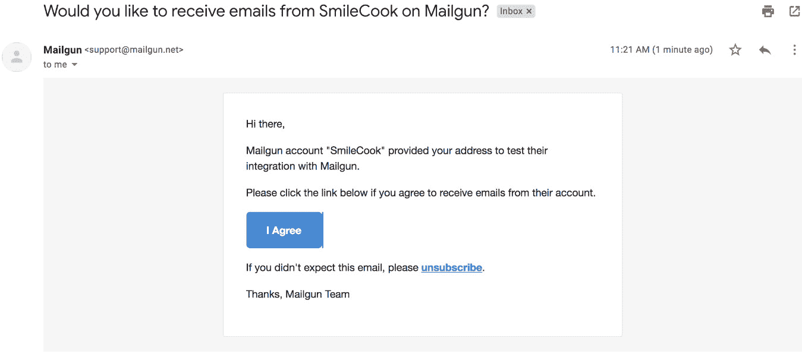

    ###### 图 6.15：新用户邮箱中的 Mailgun 邮件

1.  在确认页面上，点击**是**以激活账户。屏幕将显示如下：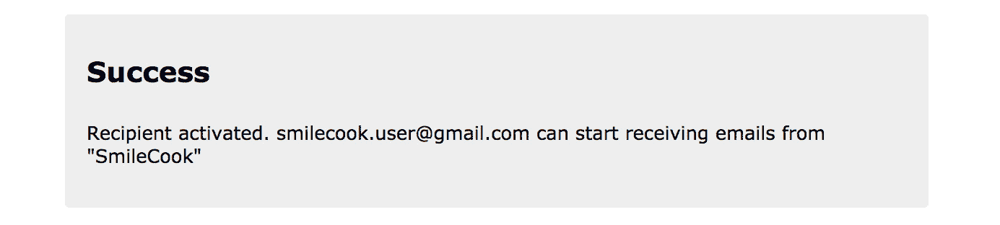

    ###### 图 6.16：激活完成消息

1.  `Mailgun` 默认提供 HTML 模板代码。我们可以在**发送 > 模板**下找到它。在那里，点击**创建消息模板**并选择**操作模板**。我们将找到一个确认邮件模板并预览它：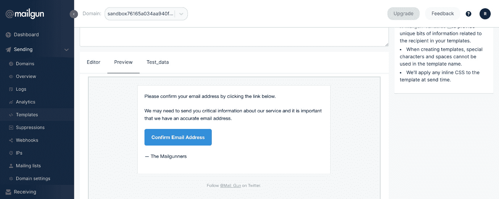

    ###### 图 6.17：预览确认邮件地址模板

1.  然后，在我们项目的**templates**文件夹下创建一个**templates**文件夹。从现在起，我们将把所有的 HTML 模板放在这个文件夹中。在**templates**文件夹内部，为与电子邮件相关的 HTML 模板创建一个子文件夹，**email**。

1.  现在，创建一个模板文件，`confirmation.html`，并将 `Mailgun` 在 *步骤 4* 中的示例 HTML 代码粘贴进去。看看以下 `Mailgun` 的示例 HTML 代码：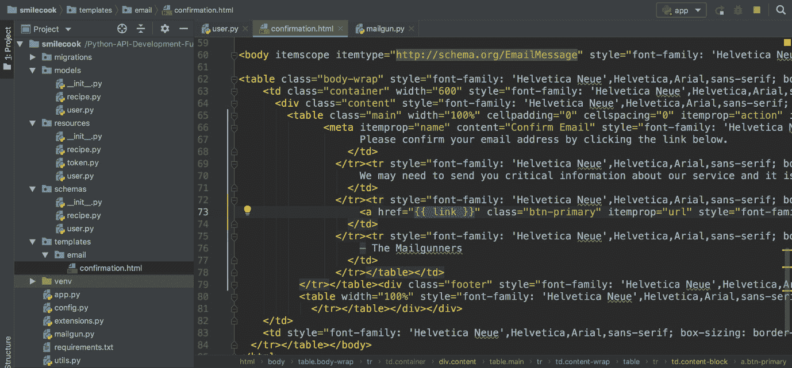

    ###### 图 6.18：来自 Mailgun 的示例 HTML 代码

    #### **注意**

    请注意，我们需要将[`www.mailgun.com`](http://www.mailgun.com)链接更改为`{{link}}`。此占位符将被程序性地替换为账户激活链接。

1.  在`resources/user.py`中通过输入以下代码行从 Flask 导入`render_template`函数：

    ```py
    from flask import request, url_for, render_template
    ```

1.  在`send_mail`方法中。可以使用`render_template`函数渲染 HTML 代码。你可以看到这里的`link = link`参数是为了将 HTML 模板中的`{{link}}`占位符替换为实际的账户验证链接：

    ```py
    mailgun.send_email(to=user.email,
                                     subject=subject,
                                     text=text,
                                     html=render_template('email/confirmation.html', link=link))
    ```

1.  使用 Postman 注册新账户：

    ```py
    {
        "username": "emily",
        "email": "smilecook.user@gmail.com",
        "password": "Wqb6g2"
    }
    ```

    #### 备注

    请注意，在`Mailgun`中事先验证了电子邮件地址。

    输出将如下所示：

    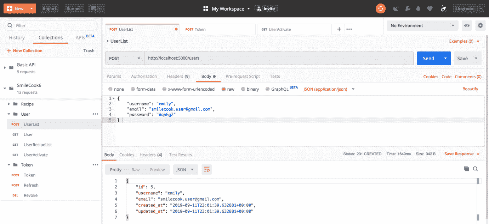

    ###### 图 6.19：使用 Postman 注册新账户

1.  账户激活邮件将以 HTML 格式接收。输出如下截图所示：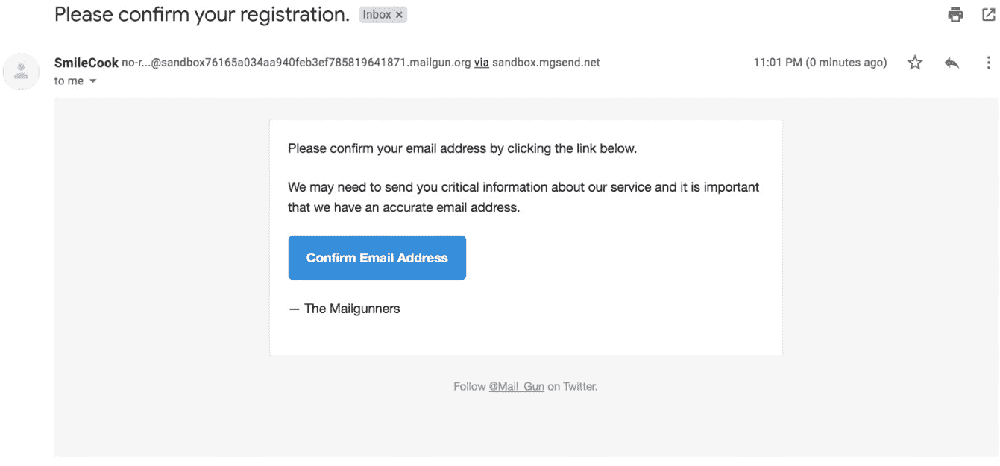

###### 图 6.20：账户确认邮件

## 7：处理图像

### 活动 11：实现食谱封面图像上传功能

**解决方案**

1.  在`models/recipe.py`模型中添加`cover_image`属性：

    ```py
    cover_image = db.Column(db.String(100), default=None)
    ```

    `cover_image`属性将包含图像文件名作为字符串，最大长度为 100 个字符。

1.  使用`flask db migrate`命令生成数据库表更新脚本：

    ```py
    flask db migrate
    ```

    你将看到检测到一个新列，`'recipe.cover_image'`：

    ```py
    INFO  [alembic.runtime.migration] Context impl PostgresqlImpl.
    INFO  [alembic.runtime.migration] Will assume transactional DDL.
    INFO  [alembic.autogenerate.compare] Detected added column 'recipe.cover_image'
      Generating /TrainingByPackt/Python-API-Development-Fundamentals/Lesson07/smilecook/migrations/versions/91c7dc71b826_.py ... done
    ```

1.  在`/migrations/versions/xxxxxxxxxx_.py`检查脚本：

    ```py
    """empty message
    Revision ID: 91c7dc71b826
    Revises: 7aafe51af016
    Create Date: 2019-09-22 12:06:36.061632
    """
    from alembic import op
    import sqlalchemy as sa
    # revision identifiers, used by Alembic.
    revision = '91c7dc71b826'
    down_revision = '7aafe51af016'
    branch_labels = None
    depends_on = None
    def upgrade():
        # ### commands auto generated by Alembic - please adjust! ###
        op.add_column('recipe', sa.Column('cover_image', sa.String(length=100), nullable=True))
        # ### end Alembic commands ###
    def downgrade():
        # ### commands auto generated by Alembic - please adjust! ###
        op.drop_column('recipe', 'cover_image')
        # ### end Alembic commands ###
    ```

    从其内容中，我们可以看到脚本中生成了两个函数。`upgrade`函数用于将新的`cover_image`列添加到数据库表中，而`downgrade`函数用于删除`cover_image`列，使其恢复到原始状态。

1.  运行`flask db upgrade`命令以更新数据库并反映**User**模型中的更改：

    ```py
    flask db upgrade
    ```

    运行上述命令后，我们应该看到以下输出：

    ```py
    INFO  [alembic.runtime.migration] Context impl PostgresqlImpl.
    INFO  [alembic.runtime.migration] Will assume transactional DDL.
    INFO  [alembic.runtime.migration] Running upgrade 7aafe51af016 -> 91c7dc71b826, empty message
    ```

1.  在 pgAdmin 中检查新的`cover_image`列：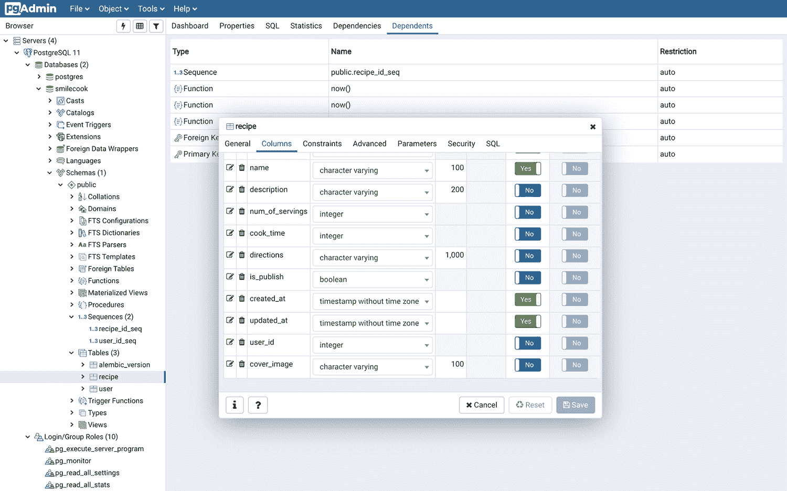

    ###### 图 7.10：pgAdmin 中的 cover_image 列

    这确认了新的`cover_image`列已添加到食谱表中。

1.  在`schemas/recipe.py`中，导入`url_for`包并添加`cover_url`属性和`dump_cover_url`方法：

    ```py
    from flask import url_for
        cover_url = fields.Method(serialize='dump_cover_url')
        def dump_cover_url(self, recipe):
            if recipe.cover_image:
                return url_for('static', filename='images/recipes/{}'.format(recipe.cover_image), _external=True)
            else:
                return url_for('static', filename='images/assets/default-recipe-cover.jpg', _external=True)
    ```

    将`default-recipe-cover.jpg`图像添加到`static/images`：

    

    ###### 图 7.11：添加`default-recipe-cover.jpg`后的文件夹结构

1.  在`resources/recipe.py`中，添加导入`os`、`image_set`和`save_image`函数：

    ```py
    import os
    from extensions import image_set
    from utils import save_image
    In resources/recipe.py, add recipe_cover_schema, which just shows the cover_url column:
    recipe_cover_schema = RecipeSchema(only=('cover_url', ))
    ```

1.  在`resources/recipe.py`中，添加`RecipeCoverUpload`资源以将食谱封面上传到食谱文件夹：

    ```py
        class RecipeCoverUploadResource(Resource):
            @jwt_required
            def put(self, recipe_id):
                file = request.files.get('cover')
                if not file:
                    return {'message': 'Not a valid image'}, HTTPStatus.BAD_REQUEST
                if not image_set.file_allowed(file, file.filename):
                    return {'message': 'File type not allowed'}, HTTPStatus.BAD_REQUEST
    ```

    `PUT`方法之前的`@jwt_required`装饰器表示该方法只能在用户登录后调用。在`PUT`方法中，我们试图在`request.files`中获取封面图片文件。然后，我们试图验证它是否存在以及文件扩展名是否允许。

1.  之后，我们使用`recipe_id`检索菜谱对象。首先，我们检查用户是否有修改菜谱的权限。如果有，我们将继续修改菜谱的封面图片：

    ```py
                recipe = Recipe.get_by_id(recipe_id=recipe_id)
                if recipe is None:
                    return {'message': 'Recipe not found'}, HTTPStatus.NOT_FOUND
                current_user = get_jwt_identity()
                if current_user != recipe.user_id:
                    return {'message': 'Access is not allowed'}, HTTPStatus.FORBIDDEN
                if recipe.cover_image:
                    cover_path = image_set.path(folder='recipes', filename=recipe.cover_image)
                    if os.path.exists(cover_path):
                        os.remove(cover_path)
    ```

1.  然后，我们使用`save_image`函数保存上传的图像并将`recipe.cover_image = filename`设置为菜谱的封面图像。最后，我们使用`recipe.save()`保存菜谱，并返回带有 HTTP 状态码**200**的图像 URL：

    ```py
                filename = save_image(image=file, folder='recipes')
                recipe.cover_image = filename
                recipe.save()
                return recipe_cover_schema.dump(recipe).data, HTTPStatus.OK
    ```

1.  在`app.py`中导入`RecipeCoverUploadResource`：

    ```py
    from resources.recipe import RecipeListResource, RecipeResource, RecipePublishResource, RecipeCoverUploadResource
    ```

1.  在`app.py`中，将`RecipeCoverUploadResource`链接到路由，即`/recipes/<int:recipe_id>/cover`：

    ```py
    api.add_resource(RecipeCoverUploadResource, '/recipes/<int:recipe_id>/cover')
    ```

现在，我们已经创建了上传菜谱封面图像的功能。让我们继续并测试它。

### 活动十二：测试图像上传功能

**解决方案**

1.  使用 Postman 登录用户账户。点击**集合**选项卡并选择**POST 令牌**请求。然后，点击**发送**按钮。结果可以在以下屏幕截图中查看：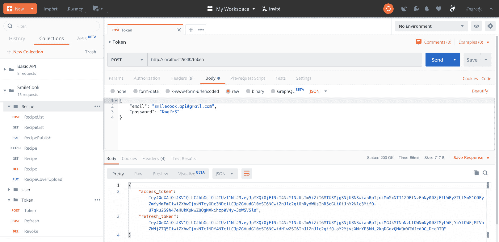

    ###### 图 7.12：发送 POST 令牌请求

1.  向我们的 API 发送创建菜谱的客户端请求并点击**集合**选项卡。

1.  在**值**字段中的`Bearer {token}`中选择`Authorization`，其中令牌是我们上一步中检索到的访问令牌。然后，点击**发送**按钮。结果可以在以下屏幕截图中查看：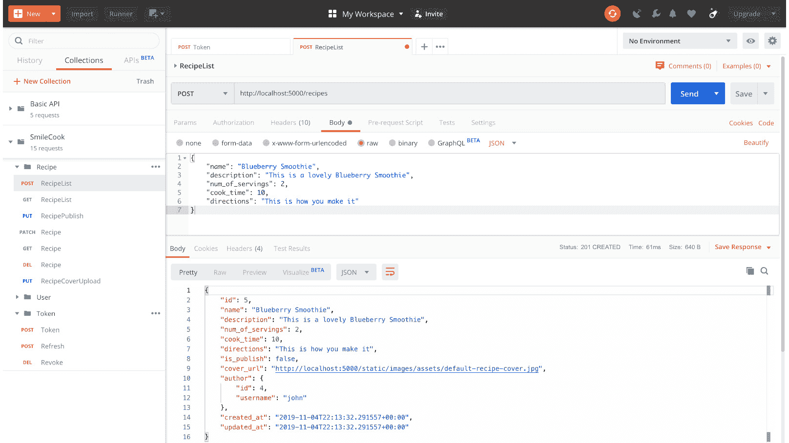

    ###### 图 7.13：向我们的 API 发送客户端请求以创建菜谱

1.  上传菜谱图片。点击`Recipe`文件夹以创建新的请求。

1.  设置`RecipeCoverUpload`并将其保存在`Recipe`文件夹中。

1.  将 HTTP 方法选择为`PUT`，并在请求 URL 中输入`http://localhost:5000/recipes/<recipe_id>/cover`（将`<recipe_id>`替换为我们上一步中获取的菜谱 ID）。

1.  在**值**字段中的`Bearer {token}`中选择`Authorization`，其中令牌是我们上一步中检索到的访问令牌。

1.  选择**主体**选项卡。然后，选择表单数据单选按钮，并在**键**中输入封面。

1.  在**键**旁边的下拉菜单中选择**文件**，并选择要上传的图片文件。

1.  点击**保存**按钮然后点击**发送**按钮。结果可以在以下屏幕截图中查看：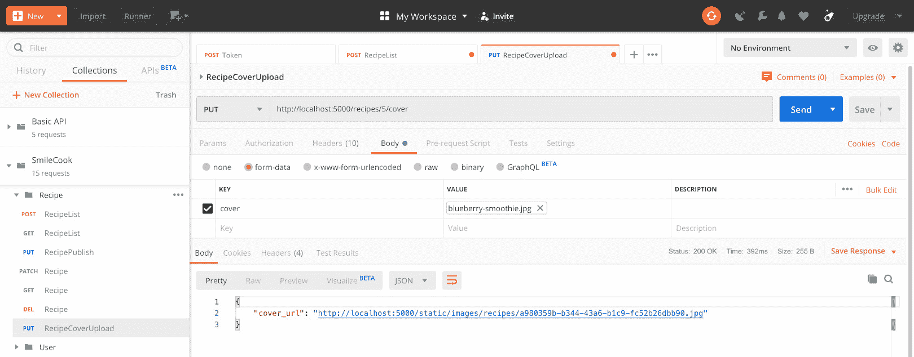

    ###### 图 7.14：上传菜谱图片

1.  在 PyCharm 中检查图像是否已压缩。我们可以从 PyCharm 中的应用日志中看到文件大小已减少`97%`：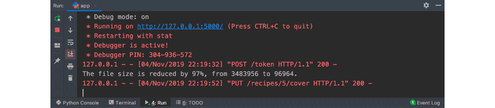

    ###### 图 7.15：在 PyCharm 中检查图片是否已压缩

1.  在`static/images/recipes`中检查上传的图片：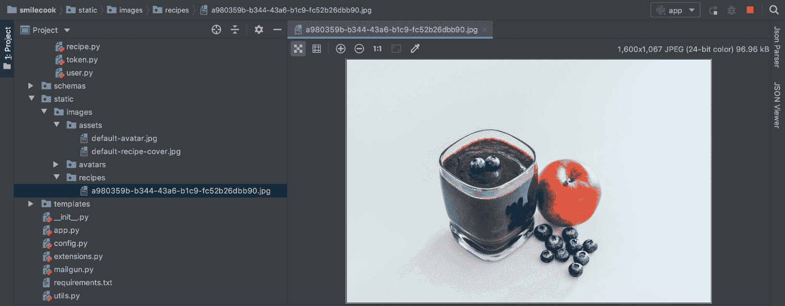

    ###### 图 7.16：检查上传的图片在路径中

1.  获取食谱并确认`cover_url`属性已填充。现在，将`http://localhost:5000/recipes/5`点击到**URL**字段中。你可以用任何合适的 ID 替换食谱 ID，即 5。然后，点击**发送**按钮。结果如下截图所示：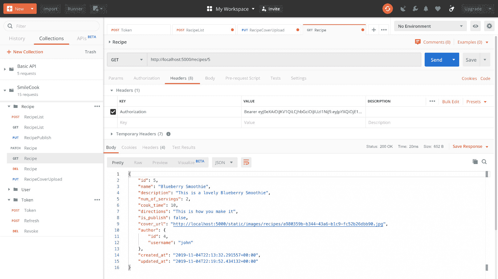

###### 图 7.17：获取食谱并确认 cover_url 属性已填充

恭喜！我们已经测试了食谱封面图片上传功能。它运行得很好！

## 8：分页、搜索和排序

### 活动 13：在用户特定食谱检索 API 上实现分页

**解决方案**

1.  修改`models/recipe.py`下的`get_all_by_user`方法中的代码，如下所示：

    ```py
        @classmethod
        def get_all_by_user(cls, user_id, page, per_page, visibility='public'):
            query = cls.query.filter_by(user_id=user_id)
            if visibility == 'public':
                query = cls.query.filter_by(user_id=user_id, is_publish=True)
            elif visibility == 'private':
                query = cls.query.filter_by(user_id=user_id, is_publish=False)
            return query.order_by(desc(cls.created_at)).paginate(page=page, per_page=per_page)
    ```

1.  将`RecipePaginationSchema`导入到`resources/user.py`中：

    ```py
    from schemas.recipe import RecipeSchema, RecipePaginationSchema
    ```

1.  在`resources/user.py`中声明`recipe_pagination_schema`属性：

    ```py
    recipe_pagination_schema = RecipePaginationSchema()
    ```

1.  在这里，我们向`UserRecipeListResource.get`方法添加了`@user_kwargs`装饰器。它包含一些参数，包括`page`、`per_page`和`visibility`：

    ```py
    class UserRecipeListResource(Resource):
        @jwt_optional
        @use_kwargs({'page': fields.Int(missing=1),
                     'per_page': fields.Int(missing=10),
                     'visibility': fields.Str(missing='public')})
    ```

1.  修改`resources/user.py`中的`UserRecipeListResource.get`方法：

    ```py
        def get(self, username, page, per_page, visibility):
            user = User.get_by_username(username=username)
            if user is None:
                return {'message': 'User not found'}, HTTPStatus.NOT_FOUND
            current_user = get_jwt_identity()
            if current_user == user.id and visibility in ['all', 'private']:
                pass
            else:
                visibility = 'public'
            paginated_recipes = Recipe.get_all_by_user(user_id=user.id, page=page, per_page=per_page, visibility=visibility)
            return recipe_pagination_schema.dump(paginated_recipes).data, HTTPStatus.OK
    ```

    `Recipe.get_all_by_user`方法通过特定作者获取分页食谱，然后让`recipe_pagination_schema`序列化分页对象并返回。

### 活动 14：测试用户特定食谱检索 API 上的分页

**解决方案**

1.  使用 Postman 分页，每页两个，逐页获取 John 的所有食谱。首先，点击`UserRecipeList`请求。

1.  在此处输入`http://localhost:5000/{username}/recipes`，这里的`{username}`应与我们在前面的练习中插入的相同。在我们的例子中，它将是`john`。

1.  选择`per_page`，即`2`）。

1.  发送请求。结果如下截图所示：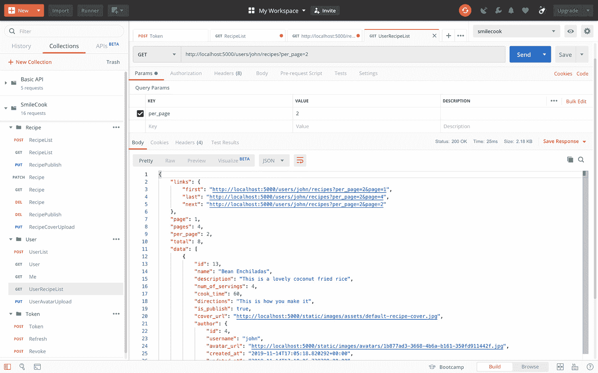

    ###### 图 8.9：使用 Postman 获取 John 的所有食谱

    在食谱的详细信息中，我们可以看到有带有`first`、`last`和`next`页面 URL 的链接。因为我们处于第一页，所以我们看不到**prev**页面。总共有四页，每页有两个记录。我们还可以在 HTTP 响应中看到排序后的食谱详情。

1.  点击链接中的下一个 URL，在 Postman 中查询下一个两个记录，请求 URL 已填写（`http://localhost:5000/users/john/recipes?per_page=2&page=2`）。然后，我们只需点击**发送**来发送请求。结果如下截图所示：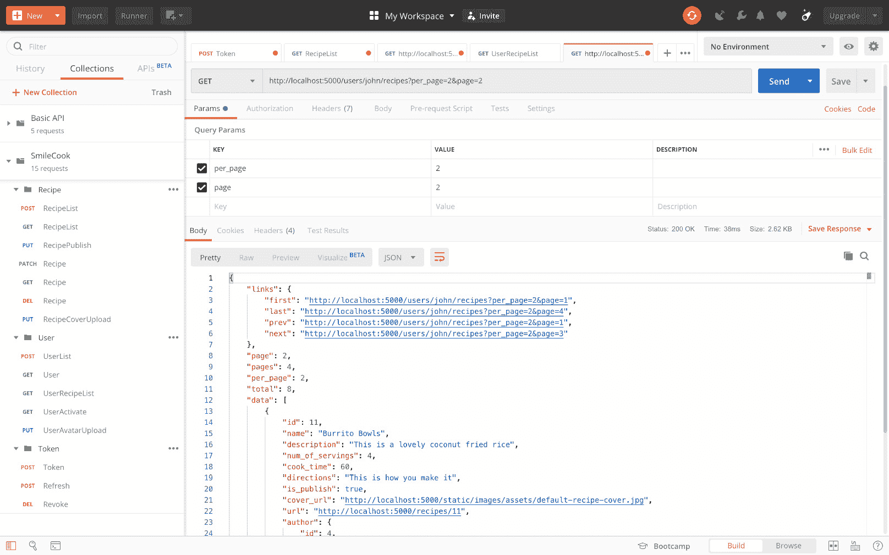

###### 图 8.10：在 Postman 中使用请求 URL 查询下两条记录

从结果中，我们可以看到有链接到`first`、`last`、`next`和`prev`页面。我们还可以看到我们目前在第 2 页。所有的配方数据都在那里。

### 活动 15：搜索含有特定配料的食谱

**解决方案**

1.  首先，在`models/recipe.py`中，将`ingredients`属性添加到`Recipe`模型中：

    ```py
        ingredients = db.Column(db.String(1000))
    ```

1.  运行以下命令以生成数据库迁移脚本：

    ```py
    flask db migrate
    ```

    你将看到检测到一个名为`recipe.ingredients`的新列：

    ```py
    INFO  [alembic.autogenerate.compare] Detected added column 'recipe.ingredients'
      Generating /TrainingByPackt/Python-API-Development-Fundamentals/smilecook/migrations/versions/0876058ed87e_.py ... done
    ```

1.  检查`/migrations/versions/0876058ed87e_.py`中的内容，这是上一步中生成的数据库迁移脚本：

    ```py
    """empty message

    Revision ID: 0876058ed87e
    Revises: 91c7dc71b826
    Create Date: 2019-10-24 15:05:10.936752

    """
    from alembic import op
    import sqlalchemy as sa

    # revision identifiers, used by Alembic.
    revision = '0876058ed87e'
    down_revision = '91c7dc71b826'
    branch_labels = None
    depends_on = None

    def upgrade():
        # ### commands auto generated by Alembic - please adjust! ###
        op.add_column('recipe', sa.Column('ingredients', sa.String(length=1000), nullable=True))
        # ### end Alembic commands ###

    def downgrade():
        # ### commands auto-generated by Alembic - please adjust! ###
        op.drop_column('recipe', 'ingredients')
        # ### end Alembic commands ###
    ```

    在这里，我们可以看到脚本中生成了两个函数。`upgrade`函数用于将新列`ingredients`添加到配方表中，而`downgrade`函数用于删除`ingredients`列，使其恢复到原始状态。

1.  运行以下`flask db upgrade`命令以更新数据库模式：

    ```py
    flask db upgrade
    ```

    你将看到以下输出：

    ```py
    INFO  [alembic.runtime.migration] Context impl PostgresqlImpl.
    INFO  [alembic.runtime.migration] Will assume transactional DDL.
    INFO  [alembic.runtime.migration] Running upgrade 91c7dc71b826 -> 0876058ed87e, empty message
    ```

1.  在`schemas/recipe.py`中，将`ingredients`属性添加到`RecipeSchema`：

    ```py
            ingredients = fields.String(validate=[validate.Length(max=1000)])
    ```

1.  修改`resources/recipe.py`中的`RecipeResource.patch`方法，以便能够更新`ingredients`：

    ```py
    recipe.ingredients = data.get('ingredients') or recipe.ingredients
    ```

1.  修改`models/recipe.py`中的`Recipe.get_all_published`方法，使其通过配料获取所有已发布的配方：

    ```py
    return cls.query.filter(or_(cls.name.ilike(keyword),
                       cls.description.ilike(keyword),
                       cls.ingredients.ilike(keyword)),
                     cls.is_publish.is_(True)).\
      order_by(sort_logic).paginate(page=page, per_page=per_page)
    ```

1.  `右键单击`它以运行应用程序。Flask 将启动并在`localhost`（`127.0.0.1`）的端口`5000`上运行：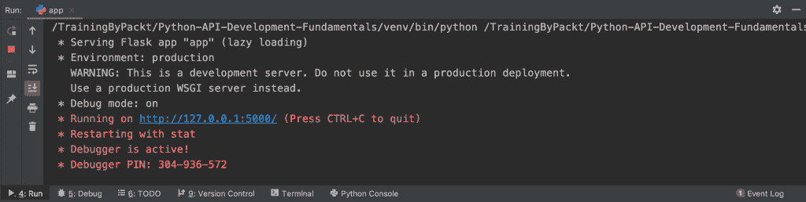

    ###### 图 8.11：在本地主机上运行 Flask

1.  登录用户账户，并在 PyCharm 控制台中运行以下`httpie`命令创建两个配方。应将`{token}`占位符替换为访问令牌：

    ```py
    http POST localhost:5000/recipes "Authorization: Bearer {token}" name="Sweet Potato Casserole" description="This is a lovely Sweet Potato Casserole" num_of_servings=12 cook_time=60 ingredients="4 cups sweet potato, 1/2 cup white sugar, 2 eggs, 1/2 cup milk" directions="This is how you make it"
    http POST localhost:5000/recipes "Authorization: Bearer {token}" name="Pesto Pizza" description="This is a lovely Pesto Pizza" num_of_servings=6 cook_time=20 ingredients="1 pre-baked pizza crust, 1/2 cup pesto, 1 ripe tomato" directions="This is how you make it"
    ```

1.  使用以下`httpie`命令发布这两个食谱：

    ```py
    http PUT localhost:5000/recipes/14/publish "Authorization: Bearer {token}"
    http PUT localhost:5000/recipes/15/publish "Authorization: Bearer {token}"
    ```

1.  搜索名称、描述或配料中包含`eggs`字符串的食谱。点击`RecipeList`请求并选择`q`、`eggs`)并发送请求。结果如下截图所示：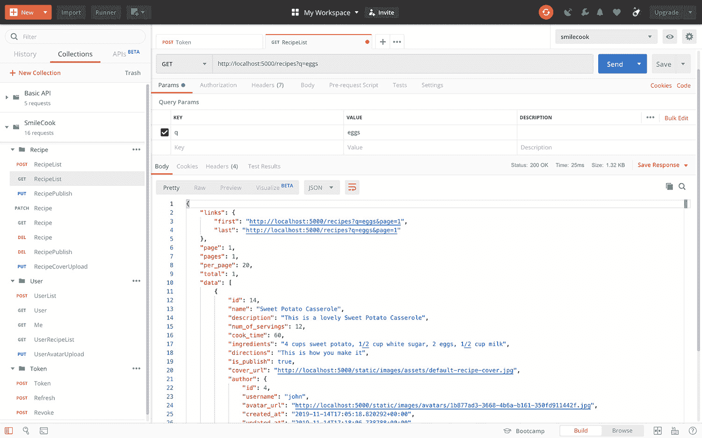

###### 图 8.12：通过发送请求搜索鸡蛋配料

从前面的搜索结果中，我们可以看到有一个配料中含有鸡蛋的配方。

## 9: 构建更多功能

### 活动 16：更新食谱详情后的缓存数据获取

**解决方案**

1.  获取所有配方数据，点击`RecipeList`并发送请求。结果如下截图所示：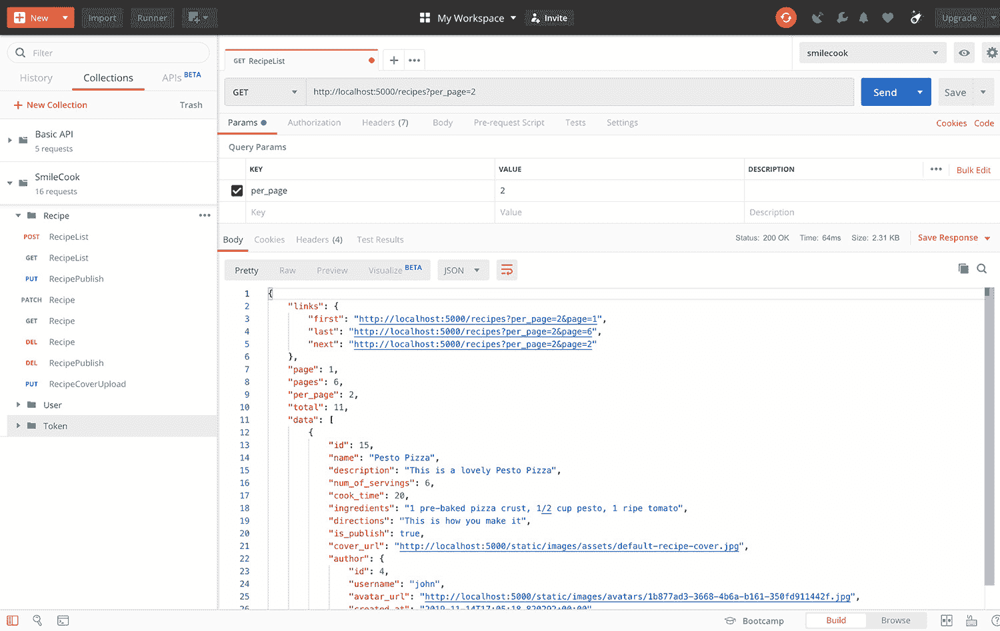

    ###### 图 9.15：获取配方数据并发送请求

1.  登录您的账户，点击**收藏集**标签并选择**POST** **令牌**请求。然后，发送请求。结果如下截图所示：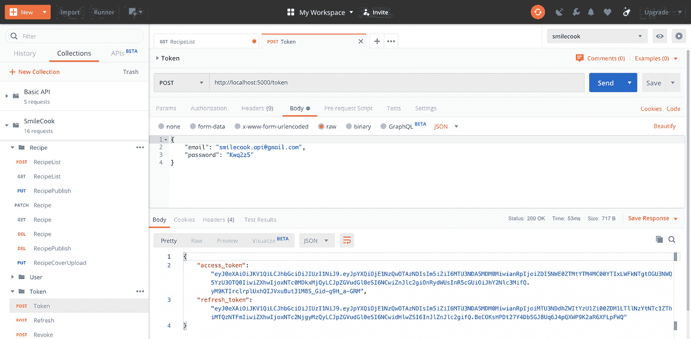

    ###### 图 9.16：选择 POST Token 请求并发送

1.  使用`PATCH`方法修改食谱记录。首先，选择`PATCH Recipe`请求。

1.  现在选择`Bearer {token}`；该令牌应该是访问令牌。

1.  选择`num_of_servings`为`5`，以及`cook_time`为`50`：

    ```py
    { 
        "num_of_servings": 5, 
        "cook_time": 50 
    } 
    ```

1.  发送请求。结果如下截图所示：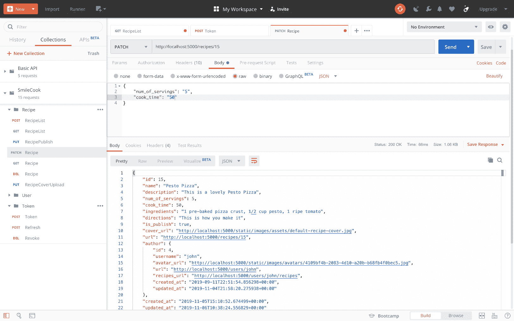

    ###### 图 9.17：使用 PATCH 方法修改食谱记录

1.  再次获取所有食谱数据，点击`RecipeList`。

1.  发送请求。结果如下截图所示：

###### 图 9.18：再次获取所有食谱数据

我们可以看到，当我们再次获取所有食谱详情时，详情没有更新，这将导致用户看到错误的信息。

### 活动 17：添加多个速率限制限制

**解决方案**

1.  在`resources/user.py`中，从`extensions`导入`limiter`：

    ```py
    from extensions import image_set, limiter
    ```

1.  在`UserRecipeListResource`中，将`limiter.limit`函数放入`decorators`属性：

    ```py
    class UserRecipeListResource (Resource):
        decorators = [limiter.limit('3/minute;30/hour;300/day', methods=['GET'], error_message='Too Many Requests')]
    ```

1.  在`app.py`中注释掉白名单：

    ```py
    #  @limiter.request_filter
    #   def ip_whitelist():
    #      return request.remote_addr == '127.0.0.1'
    ```

    在 PyCharm 中，如果您使用的是 Mac，可以使用*Command + /*来注释掉一行代码，如果您使用的是 Windows，可以使用*Ctrl + /*。

1.  当我们完成时，点击**运行**以启动 Flask 应用程序；然后，我们就可以开始测试它：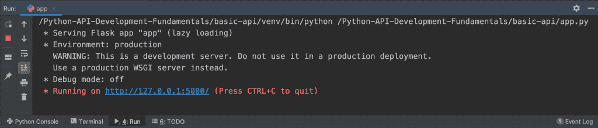

    ###### 图 9.19：启动 Flask 应用程序

1.  获取用户的全部食谱并检查响应头中的速率限制信息。首先，点击`UserRecipeList`并发送请求。

1.  然后，在**响应**的**头部**选项卡中选择**头部**。结果如下截图所示：

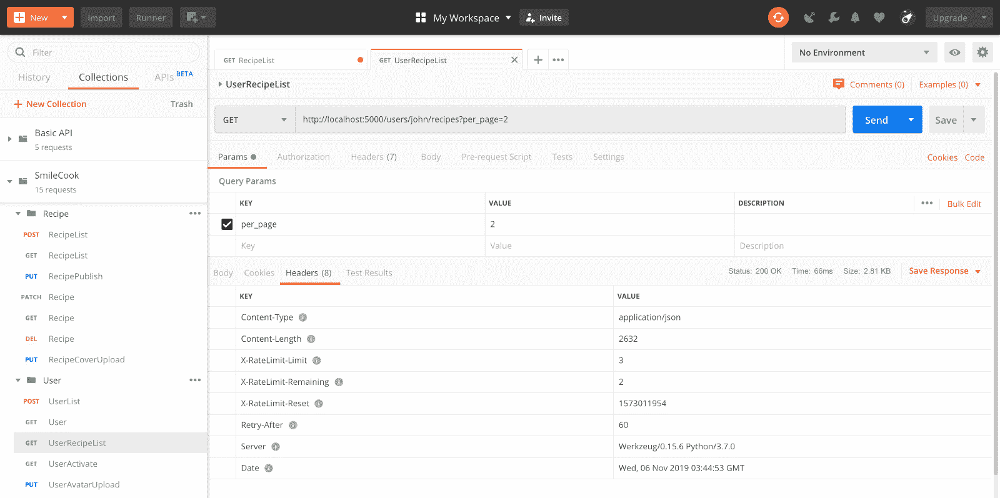

###### 图 9.20：检查响应头中的速率限制信息

在 HTTP 响应中，我们可以看到此端点的速率限制为三个，而我们只剩下两个剩余的请求数额。限制将在 60 秒后重置。

## 10：部署

### 活动 18：在 Postman 中将 access_token 更改为变量

**解决方案**

1.  执行用户登录并获取访问令牌。使用**POST Token**请求获取访问令牌。您应该看到以下输出：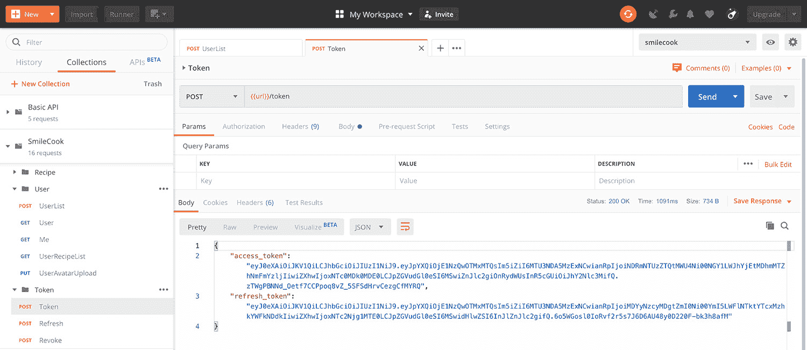

    ###### 图 10.29：执行用户登录以获取访问令牌

1.  点击`access_token`变量。其值是我们上一步获得的访问令牌。然后，点击**更新**：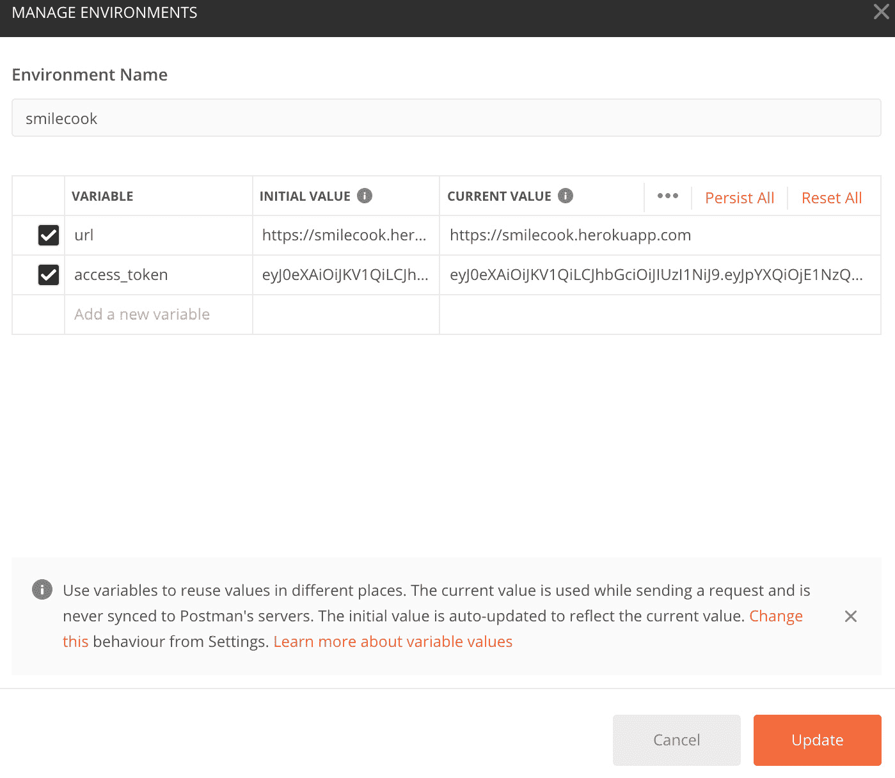

    ###### 图 10.30：在 Postman 中添加更多环境变量

1.  选择`Bearer {{access_token}}`，这是我们之前步骤中添加的环境变量，然后发送请求。您应该看到以下输出：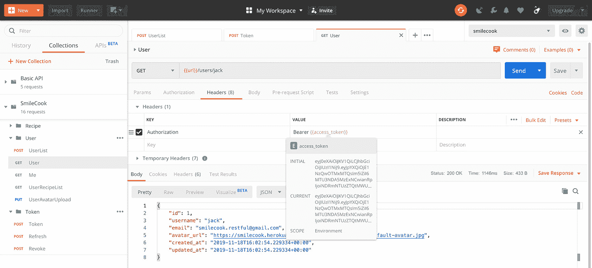

###### 图 10.31：在 Postman 中使用更多环境变量
