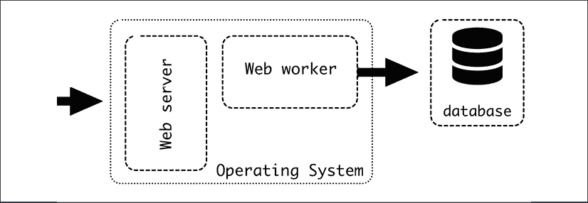

# 1

# 软件架构简介

本章的目标是介绍什么是软件架构以及它在哪些方面有用。我们将探讨在定义系统架构时使用的一些基本技术，以及网络服务架构的基线示例。

本章讨论了软件结构对团队结构和沟通的影响。由于任何非微小的软件的成功构建都严重依赖于一个或多个开发团队之间的成功沟通和协作，因此应考虑这一因素。此外，软件的结构可能对如何访问不同元素有深远的影响，因此软件的结构对安全性有影响。

此外，在本章中，我们将简要介绍我们将使用来展示本书其余部分不同模式和讨论的示例系统的架构。

在本章中，我们将涵盖以下主题：

+   定义系统的结构

+   将其划分为更小的单元

+   软件架构中的康威定律

+   示例的一般概述

+   软件架构的安全性方面

让我们深入探讨。

# 定义系统的结构

软件开发的本质是创建和管理复杂系统。

在计算机的早期，程序相对简单。最多，它们可能能够计算抛物线轨迹或分解数字。最早的计算机程序是由阿达·洛芙莱斯在 1843 年设计的，计算了伯努利数列。在那之后的一百年，在第二次世界大战期间，电子计算机被发明出来以破解加密代码。随着这一新发明可能性的探索，越来越多的复杂操作和系统被设计出来。编译器和高级语言等工具增加了可能性的数量，硬件的快速进步使得更多的操作得以执行。这迅速产生了管理不断增长的复杂性和将一致性的工程原则应用于软件创建的需求。

在计算机产业诞生 50 多年后，我们可用的软件工具种类繁多且功能强大。我们站在巨人的肩膀上构建自己的软件。我们可以以相对较小的努力快速添加许多功能，无论是利用高级语言和 API，还是使用现成的模块和包。随着这种巨大的力量而来的是管理由此产生的复杂性爆炸的巨大责任。

简而言之，软件架构定义了软件系统的结构。这种架构可以有机地发展，通常在项目的早期阶段，但在系统增长和几个变更请求之后，仔细思考架构的需求变得越来越重要。随着系统变得更大，结构变得更难以更改，这会影响未来的努力。遵循结构进行更改比违反结构进行更改更容易。

使某些更改变得困难并不一定是坏事。应该变得困难的更改可能涉及需要由不同团队监督的元素，或者可能影响外部客户的元素。虽然主要重点是创建一个未来易于且高效更改的系统，但一个明智的架构设计将根据需求在易用性和难度之间取得适当的平衡。在本章的后面部分，我们将研究安全作为一个明确的例子，说明何时保持某些操作难以实施。

因此，软件架构的核心是审视全局：关注系统未来将处于何种状态，能够将这种观点具体化，同时也帮助当前情况。在短期收益和长期运营之间的选择在开发中非常重要，其最常见的后果是技术债务的产生。软件架构主要处理长期影响。

软件架构的考虑因素可能相当多，需要在它们之间取得平衡。一些例子可能包括：

+   **业务愿景**，如果系统将要进行商业利用。这可能包括来自营销、销售或管理的利益相关者的需求。业务愿景通常由客户驱动。

+   **技术要求**，例如确保系统可扩展并能处理一定数量的用户，或者系统足够快以适应其用例。新闻网站需要与实时交易系统不同的更新时间。

+   **安全和可靠性问题**，其严重性取决于应用程序和数据存储的风险或关键程度。

+   **任务划分**，允许多个团队，可能在不同领域专业化，同时以灵活的方式在同一系统上工作。随着系统的发展，将它们划分为半自主的、更小的组件的需求变得更加迫切。小型项目可能通过“单一块”或单体方法存在得更久。

+   **使用特定技术**，例如，允许与其他系统集成或利用团队中现有的知识。

这些考虑将影响系统的结构和设计。在某种程度上，软件架构师负责实现应用程序的愿景，并将其与将开发它的特定技术和团队相匹配。这使得软件架构师成为业务团队和技术团队之间，以及不同技术团队之间的重要中间人。沟通是这个职位的一个关键方面。

为了实现成功的沟通，一个好的架构应该定义不同方面之间的边界，并分配明确的职责。除了定义清晰的边界之外，软件架构师还应促进系统组件之间的接口通道的创建，并跟进实施细节。

理想情况下，架构设计应该在系统设计之初进行，基于项目需求进行深思熟虑的设计。这是本书中的一般方法，因为这是解释不同选项和技术最佳的方式。但在现实生活中，这并不是最常见的用例。

软件架构师面临的主要挑战之一是处理需要适应的现有系统，朝着更好的系统逐步改进，同时不中断保持业务运行的正常日常运营。

# 将系统划分为更小的单元

软件架构的主要技术是将整个系统划分为更小的元素，并描述它们如何相互交互。每个较小的元素或单元应该有一个明确的职能和接口。

例如，一个典型系统的常见架构可能是一个由以下部分组成的网络服务架构：

+   一个存储所有数据的 MySQL 数据库

+   一个提供用 PHP 编写的动态 HTML 内容的网络工作者

+   一个 Apache 网络服务器处理所有网络请求，返回任何静态文件，如 CSS 和图像，并将动态请求转发给网络工作者

图 1.1：典型的网络架构

这种架构和技术堆栈自 2000 年代初以来一直非常流行，被称为 LAMP，这是一个由涉及的不同开源项目组成的缩写：(L)inux 作为操作系统，(A)pache，(M)ySQL，和(P)HP。如今，这些技术可以被替换为等效的技术，例如使用 PostgreSQL 代替 MySQL 或 Nginx 代替 Apache，但仍然使用 LAMP 这个名字。LAMP 架构可以被认为是使用 HTTP 设计基于网络的客户端/服务器系统的默认起点，为构建更复杂的系统提供了一个坚实和经过验证的基础。

如您所见，每个不同的元素在系统中都有独特的功能。它们以明确定义的方式相互交互。这被称为**单一职责原则**。当面对新功能时，大多数用例将明确属于系统的一个元素。任何样式更改将由 Web 服务器处理，动态更改由 Web 工作器处理。元素之间存在依赖关系，因为数据库中存储的数据可能需要更改以支持动态请求，但这些依赖关系可以在处理过程中早期检测到。

我们将在*第九章*中更详细地描述这种架构。

每个元素都有不同的需求和特性：

+   数据库需要可靠，因为它存储了所有数据。维护工作，如备份和恢复相关的工作，将非常重要。数据库不会频繁更新，因为数据库非常稳定。对表架构的更改将通过 Web 工作器中的重启进行。

+   Web 工作器需要可扩展且不存储任何状态。相反，所有数据都将从数据库发送和接收。这个元素将经常更新。可以在同一台机器或多台机器上运行多个副本，以实现水平扩展。

+   Web 服务器可能需要一些新的样式更改，但这不会经常发生。一旦配置设置正确，这个元素将保持相当稳定。每台机器只需要一个 Web 服务器，因为它能够平衡多个 Web 工作器的负载。

如我们所见，元素之间的工作平衡非常不同，因为 Web 工作器将是大多数新工作的焦点，而其他两个元素将更加稳定。数据库需要特定的工作以确保其处于良好状态，因为它可以说是三个元素中最关键的一个。其他两个元素在出现问题时可以快速恢复，但数据库中的任何损坏都会引发大量问题。

系统中最关键和最有价值的元素几乎总是存储的数据。

通信协议也是独特的。Web 工作器使用 SQL 语句与数据库进行通信。Web 服务器通过专用接口与 Web 工作器通信，通常是 FastCGI 或类似的协议。Web 服务器通过 HTTP 请求与外部客户端通信。Web 服务器和数据库之间不直接通信。

这三个协议是不同的。对于所有系统来说，情况不一定如此；不同的组件可以共享相同的协议。例如，可以有多个 RESTful 接口，这在微服务中很常见。

## 进程内通信

观察不同单元的典型方式是它们作为独立运行的不同进程，但这不是唯一的选择。同一个进程内的两个不同模块仍然可以遵循单一职责原则。

单一职责原则可以在不同的层面上应用，并用于定义功能或其他块之间的划分。因此，它可以在越来越小的范围内应用。这是“乌龟一直到底”！但是，从架构的角度来看，高级元素是最重要的，因为它是定义结构的高层。清楚地知道在细节上走多远显然很重要，但在采用架构方法时，最好是偏向“大局”而不是“过多细节”。

这的一个清晰的例子是一个独立维护的库，但也可能是代码库中的某些模块。例如，你可以创建一个模块来执行所有的外部 HTTP 调用，并处理保持连接、重试、错误处理等所有复杂性，或者你可以创建一个模块来根据某些参数生成多种格式的报告。

重要的特性是，为了创建一个独立的元素，API 需要被明确定义，责任也需要被明确界定。模块应该能够被提取到不同的仓库中，并作为第三方元素安装，这样才被认为是真正独立的。

仅创建具有内部划分的大组件是一种众所周知的模式，称为单体架构。上面描述的 LAMP 架构就是这样一个例子，因为大部分代码都是在 web worker 内部定义的。单体通常是项目的实际默认起点，因为通常在开始时没有大的计划，当代码库较小时，将事物严格划分为多个组件并没有很大的优势。随着代码库和系统的日益复杂，单体内部的元素划分开始变得有意义，后来可能开始有意义地将其拆分为几个组件。我们将在*第九章*，*微服务与单体*中进一步讨论单体。

在同一组件内部，通信通常是直接的，因为会使用内部 API。在绝大多数情况下，会使用相同的编程语言。

# 康威定律——对软件架构的影响

在处理架构设计时始终需要牢记的一个关键概念是康威定律。康威定律是一个广为人知的格言，它假设组织引入的系统反映了组织结构的通信模式([`www.thoughtworks.com/insights/articles/demystifying-conways-law`](https://www.thoughtworks.com/insights/articles/demystifying-conways-law))：

> 任何设计系统（广义上）的组织都会产生一个结构，其结构与组织的通信结构相匹配。
> 
> —— 梅尔文·E·康威

这意味着组织的员工结构，无论是明确还是隐含地，都会被复制，以形成组织创建的软件结构。在一个非常简单的例子中，一个有两个大型部门的公司——比如说采购和销售——可能会倾向于创建两个大型系统，一个专注于采购，另一个专注于销售，它们之间相互通信，而不是其他可能的架构，比如按产品划分的体系。

这可能感觉是自然的；毕竟，团队间的沟通比团队内的沟通更困难。团队间的沟通需要更加结构化，并需要更多的主动工作。单个团队内部的沟通会更加流畅，不那么僵化。这些元素对于良好软件架构的设计至关重要。

任何软件架构成功应用的主要因素是团队结构需要非常紧密地遵循设计的架构。试图偏离太多会导致困难，因为趋势将是根据群体划分来结构化一切。同样，改变系统的架构可能需要重组组织。这是一个困难和痛苦的过程，任何经历过公司重组的人都会证实这一点。

职责划分也是一个关键方面。单个软件元素应该有一个明确的负责人，而且这个负责人不应该分散到多个团队中。不同的团队有不同的目标和重点，这会复杂化长期愿景并产生紧张关系。

相反，一个团队负责多个元素也是可能的，但这也需要仔细考虑，以确保不会过度压垮团队。

如果工作单元分配到团队之间的不平衡很大（例如，一个团队的工作单元太多，而另一个团队的工作单元太少），那么很可能是系统的架构存在问题。

随着远程工作的日益普遍，团队越来越多地分布在世界的不同地区，沟通也受到了影响。这就是为什么建立不同的分支机构来处理系统的不同元素，并使用详细的 API 来克服地理距离的物理障碍变得非常普遍。沟通的改善也对协作能力产生了影响，使远程工作更加高效，并允许完全远程的团队能够紧密地共同工作在同一代码库上。

近期的 COVID-19 危机极大地增加了远程工作的趋势，尤其是在软件行业。这导致越来越多的人远程工作，并使用适应这种工作方式的更好工具。尽管时区差异仍然是沟通的一个大障碍，但越来越多的公司和团队正在学习以全远程模式有效地工作。记住，康威定律在很大程度上取决于组织的沟通依赖性，但沟通本身可以改变和改进。

康威定律不应被视为需要克服的障碍，而应视为组织结构对软件结构有影响的反映。软件架构与不同团队如何协调以及责任如何划分紧密相关。它包含一个重要的人际沟通成分。

考虑这一点将有助于您设计一个成功的软件架构，以便在任何时候沟通流程都是流畅的，并且您可以提前识别问题。当然，软件架构与人为因素紧密相关，因为架构最终将由工程师实施和维护。

# 应用程序示例 – 概述

在这本书中，我们将使用一个应用程序作为示例来展示所呈现的不同元素和模式。这个应用程序将简单，但为了演示目的，将分为不同的元素。示例的完整代码可在 GitHub 上找到，不同章节将展示其不同部分。示例是用 Python 编写的，使用了知名的框架和模块。

示例应用程序是一个微博客网络应用程序，非常类似于 Twitter。本质上，用户将撰写简短的文本消息，可供其他用户阅读。

该示例系统的架构在本图中描述：

自动生成的描述](img/B17580_01_02.png)

图 1.2：示例架构

它具有以下高级功能元素：

+   一个可访问的公共网站，使用 HTML 编写。这包括登录、登出、撰写新微帖子以及阅读其他用户的微帖子（阅读不需要登录）的功能。

+   一个公共 RESTful API，允许使用其他客户端（移动、JavaScript 等）而不是 HTML 网站。这将使用 OAuth 对用户进行身份验证并执行类似于网站的操作。

这两个元素虽然不同，但将被合并成一个单一的应用程序，如图所示。应用程序的前端部分将包括一个 Web 服务器，正如我们在 LAMP 架构描述中看到的，这里为了简单起见没有展示。

+   一个将执行事件驱动任务的任务管理器。我们将添加周期性任务，计算每日统计数据，并在用户被提及在微帖子中时向用户发送电子邮件通知。

+   一个数据库，存储所有信息。请注意，不同元素之间可以共享对它的访问。

+   在内部，有一个常见的包来确保所有服务正确访问数据库。这个包作为一个不同的元素工作。

# 软件架构的安全方面

在创建架构时需要考虑的一个重要元素是安全要求。并非每个应用程序都是相同的，因此有些可能在这一点上比其他更宽松。例如，银行应用程序需要比讨论猫的互联网论坛安全 100 倍。最常见的例子是密码的存储。对密码最天真方法是存储它们，以纯文本形式与用户名或电子邮件地址关联——比如在一个文件或数据库表中。当用户尝试登录时，我们接收输入的密码，将其与之前存储的密码进行比较，如果它们相同，我们允许用户登录。对吧？

嗯，这是一个非常糟糕的想法，因为它可能会产生严重的问题：

+   如果攻击者可以访问应用程序的存储，他们将能够读取所有用户的密码。用户倾向于重复使用密码（即使这是一个坏主意），因此，与他们的电子邮件配对，他们将在多个应用程序上暴露于攻击，而不仅仅是被破坏的那个。

这可能看起来不太可能，但请记住，存储的任何数据副本都容易受到攻击，包括备份。

+   另一个真实的问题是内部威胁，可能合法访问系统但出于恶意目的或错误地复制数据的员工。对于非常敏感的数据，这可能是一个非常重要的考虑因素。

+   例如，在状态日志中显示用户密码的错误。

为了确保安全，数据需要以尽可能保护的方式结构化，防止访问或甚至复制，同时不暴露用户的真实密码。通常的解决方案是采用以下架构：

1.  密码本身并不存储。相反，存储的是密码的加密哈希值。这将对密码应用一个数学函数并生成一个可复制的位序列，但反向操作在计算上非常困难。

1.  由于哈希值是基于输入的确定性，恶意行为者可以检测到重复的密码，因为它们的哈希值相同。为了避免这个问题，为每个账户添加一个随机字符序列，称为“盐”。这意味着具有相同密码但不同盐的两个用户将具有不同的哈希值。

1.  结果的哈希值和盐都会被存储。

1.  当用户尝试登录时，他们的输入密码会添加到盐中，然后将结果与存储的哈希值进行比较。如果正确，用户将被登录。

注意，在这个设计中，实际密码对系统来说是未知的。它不会被存储在任何地方，只是在临时接受并与预期的哈希值进行比较后进行处理。

这个例子是以简化的方式呈现的。有多种使用此模式的方法和比较哈希的不同方式。例如，`bcrypt`函数可以被多次应用，每次加密都会增加，这会增加生成有效哈希所需的时间，使其对暴力攻击更具抵抗力。

与直接存储密码的系统相比，这种系统更安全，因为操作系统的人不知道密码，也没有任何地方存储密码。

在状态日志中错误地显示用户密码的问题仍然可能发生！应该格外小心，以确保敏感信息没有被错误地记录。

在某些情况下，可以采取与密码相同的方法来加密其他存储数据，以便只有客户可以访问他们自己的数据。例如，可以为通信通道启用端到端加密。

安全性与系统的架构有着非常紧密的联系。正如我们之前所看到的，架构定义了哪些方面容易改变，哪些方面难以改变，并且可以使某些不安全的行为变得不可能，例如，像我们在上一个例子中所描述的那样，知道用户的密码。其他选项包括不存储用户数据以保持隐私或减少内部 API 中暴露的数据，例如。软件安全是一个非常困难的问题，通常是一把双刃剑，试图使系统更加安全可能会产生使操作变得冗长和不方便的副作用。

# 摘要

在本章中，我们探讨了软件架构是什么以及何时需要它，以及它对长期方法的关注，这是该学科的特点。我们了解到软件的底层结构很难改变，因此在设计和更改软件系统时应该考虑这一方面。

我们描述了如何将复杂系统分解成更小的部分，并为每个部分分配清晰的目标和目标，同时考虑到这些较小的部分可以使用多种编程语言并引用不同的范围。我们还描述了 LAMP 架构以及它如何是创建简单 Web 服务系统的广泛成功的起点。

我们讨论了康威定律如何影响系统的架构，因为底层团队结构对软件的实现和结构有直接影响。毕竟，软件是由人类操作和开发的，人类沟通需要被考虑到才能成功实施。

我们描述了本书中将使用的例子，以描述我们将要展示的不同元素和模式。最后，我们评论了软件架构的安全方面以及如何通过作为系统结构设计一部分的数据访问障碍来缓解安全问题。

在本书的下一节中，我们将讨论设计一个系统的不同方面。
