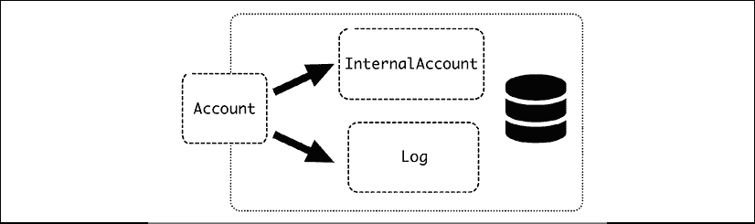
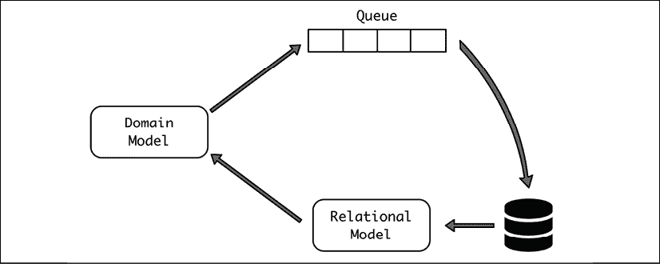
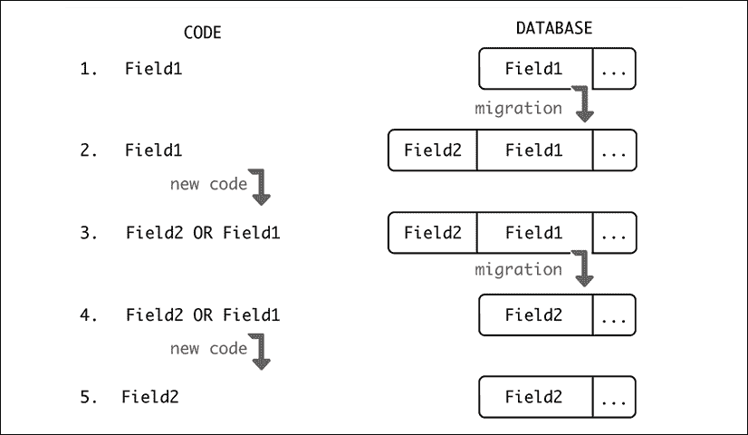
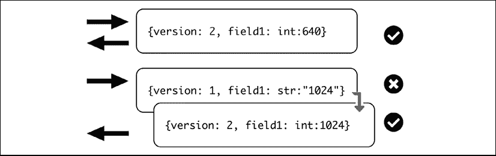

# 第四章：数据层

与应用程序代码交互时的数据建模与数据在存储中的存储方式一样重要。数据层是开发者将与之交互最多的层，因此创建一个良好的接口对于创建一个高效的环境至关重要。

在本章中，我们将描述如何创建一个与存储交互的软件数据层，以抽象存储数据的细节。我们将了解领域驱动设计是什么，如何使用对象关系映射（Object-Relational Mapping，ORM）框架，以及更高级的模式，如命令查询责任分离（Command Query Responsibility Segregation，CQRS）。

我们还将讨论如何随着应用程序的发展对数据库进行更改，最后，我们将介绍在结构在我们介入之前已经定义的情况下处理遗留数据库的技术。

在本章中，我们将探讨以下主题：

+   模型层

+   数据库迁移

+   处理遗留数据库

让我们从**模型-视图-控制器**（Model-View-Controller，MVC）模式中的模型部分的数据设计背景开始。

# 模型层

正如我们在*第二章*中介绍的模型-视图-控制器架构和*API 设计*时所见，模型层是与数据紧密相关，负责存储和检索数据的部分。

模型抽象了所有数据处理。这不仅包括数据库访问，还包括相关的业务逻辑。这创建了一个双层结构：

+   内部数据建模层，负责从数据库中存储和检索数据。这一层需要了解数据在数据库中的存储方式，并相应地处理它。

+   下一层创建业务逻辑，并使用内部数据建模层来支持它。这一层负责确保要存储的数据是一致的，并强制执行任何关系或约束。

将数据层视为数据库设计的纯粹扩展，移除业务层或将它作为代码存储在控制器部分是很常见的。虽然这样做是可行的，但最好考虑是否明确添加业务层，并确保实体模型与数据库模型之间有明确的分离，这符合良好的业务逻辑，并且数据库模型包含如何访问数据库的详细信息。

## 领域驱动设计

这种操作方式已成为领域驱动设计（Domain-Driven Design，DDD）的一部分。当 DDD 首次引入时，其主要目标是弥合特定应用与其实现技术之间的差距，试图使用适当的命名法并确保代码与用户将使用的实际操作保持同步。例如，银行软件将使用*存入*和*取出*资金的函数，而不是从账户中*增加*或*减少*。

DDD 不仅要求命名方法和属性与领域专业术语保持一致，还要求复制其用途和流程。

当与面向对象编程（**OOP**）结合时，DDD 技术将复制特定领域所需的概念为对象。在我们的上一个例子中，我们会有一个 `Account` 对象，它接受 `lodge()` 和 `withdraw()` 方法。这些方法可能接受一个 `Transfer` 对象，以保持资金的来源账户的正确余额。

这些天，DDD 被理解为在模型层创建面向业务接口的过程，这样我们就可以抽象出如何将其映射到数据库访问的内部细节，并呈现一个复制业务流程的一致接口。

DDD 需要深入了解特定领域，以创建一个有意义的接口并正确地模拟业务操作。它需要与业务专家进行密切的沟通和协作，以确保覆盖所有可能的差距。

对于许多不同的概念，模型纯粹是作为数据库模式的复制来工作的。这样，如果有表，它会被翻译成一个访问该表的模型，复制字段等。一个例子是将用户存储在具有用户名、全名、订阅和密码字段的表中。

但请记住，这并不是一个硬性要求。模型可以使用多个表或以更有业务意义的方式组合多个字段，甚至不暴露某些字段，因为它们应该保持内部。

我们将使用 SQL 作为我们的默认示例，因为我们默认使用的关系数据库是最常见的一种数据库。但我们讨论的一切都高度适用于其他类型的数据库，特别是文档型数据库。

例如，上述用户的示例在数据库中作为 SQL 表的列具有以下字段：

| 字段 | 类型 | 描述 |
| --- | --- | --- |
| `用户名` | `String` | 唯一用户名 |
| `密码` | `String` | 描述散列密码的字符串 |
| `全名` | `String` | 用户姓名 |
| `订阅结束` | `Datetime` | 订阅结束的时间 |
| `订阅类型` | `Enum (Normal`, `Premium`, `NotSubscribed`) | 订阅类型 |

但模型可能暴露以下内容：

| 属性/方法 | 类型 | 描述 |
| --- | --- | --- |
| `username` | 字符串属性 | 直接翻译用户名列 |
| `全名` | 字符串属性 | 直接翻译全名列 |
| `subscription` | 只读属性 | 返回订阅类型列。如果订阅已结束（如订阅结束列所示），则返回 `NotSubscribed` |
| `check_password(password)` | 方法 | 内部检查输入的 `password` 是否有效，通过与散列密码列进行比较，并返回是否正确 |

注意，这隐藏了密码本身，因为其内部细节对数据库外部不相关。它还隐藏了内部订阅字段，而是呈现一个执行所有相关检查的单个属性。

此模型将原始数据库访问的操作转换为完全定义的对象，该对象抽象了数据库的访问。将对象映射到表或集合的操作方式被称为**对象关系映射**（**ORM**）。

## 使用 ORM

如上所述，本质上，ORM 是在数据库中的集合或表之间执行映射，并在面向对象环境中生成对象。

虽然 ORM 本身指的是技术，但通常理解的是*作为一个工具*。有多种 ORM 工具可供选择，可以将 SQL 表转换为 Python 对象。这意味着，我们不会编写 SQL 语句，而是设置在类和对象中定义的属性，然后由 ORM 工具自动转换，并连接到数据库。

例如，对“pens”表中的查询的低级访问可能看起来像这样：

```py
>>> cur = con.cursor()

>>> cur.execute('''CREATE TABLE pens (id INTEGER PRIMARY KEY DESC, name, color)''')

<sqlite3.Cursor object at 0x10c484c70>

>>> con.commit()

>>> cur.execute('''INSERT INTO pens VALUES (1, 'Waldorf', 'blue')''')

<sqlite3.Cursor object at 0x10c484c70>

>>> con.commit()

>>> cur.execute('SELECT * FROM pens');

<sqlite3.Cursor object at 0x10c484c70>

>>> cur.fetchall()

[(1, 'Waldorf', 'blue')] 
```

注意，我们正在使用 DB-API 2.0 标准的 Python 接口，它抽象了不同数据库之间的差异，并允许我们使用标准的`fetchall()`方法检索信息。

要连接 Python 和 SQL 数据库，最常用的 ORM 是 Django 框架中包含的 ORM（[`www.djangoproject.com/`](https://www.djangoproject.com/)）和 SQLAlchemy（[`www.sqlalchemy.org/`](https://www.sqlalchemy.org/)）。还有其他较少使用的选项，如 Pony（[`ponyorm.org/`](https://ponyorm.org/)）或 Peewee（[`github.com/coleifer/peewee`](https://github.com/coleifer/peewee)），它们旨在采用更简单的方法。

使用 ORM，例如 Django 框架中可用的 ORM，而不是创建`CREATE TABLE`语句，我们在代码中将表描述为一个类：

```py
from django.db import models

class Pens(models.Model):

     name = models.CharField(max_length=140)

     color = models.CharField(max_length=30) 
```

此类允许我们使用类检索和添加元素。

```py
>>> new_pen = Pens(name='Waldorf', color='blue')

>>> new_pen.save()

>>> all_pens = Pens.objects.all()

>>> all_pens[0].name

'Waldorf' 
```

在原始 SQL 中是`INSERT`操作的操作是创建一个新的对象，然后使用`.save()`方法将数据持久化到数据库中。同样，而不是编写一个`SELECT`查询，可以调用搜索 API。例如，以下代码：

```py
>>> red_pens = Pens.objects.filter(color='red') 
```

等同于以下代码：

```py
SELECT * FROM Pens WHERE color = 'red; 
```

与直接编写 SQL 相比，使用 ORM 有一些优势：

+   使用 ORM 将数据库从代码中分离

+   它消除了使用 SQL（或学习它）的需要

+   它消除了编写 SQL 查询时的一些问题，如安全问题

让我们更详细地看看这些优势及其局限性。

### 独立于数据库

首先，使用 ORM 将数据库的使用与代码分离。这意味着可以更改特定的数据库，而代码保持不变。有时这可以在不同的环境中运行代码或快速切换到使用不同的数据库很有用。

这种非常常见的用例是在 SQLite 中运行测试，一旦代码在生产环境中部署，就使用 MySQL 或 PostgreSQL 等其他数据库。

这种方法并非没有问题，因为某些选项可能在一种数据库中可用，而在另一种数据库中不可用。这可能是一种适用于新项目的可行策略，但最好的方法是使用相同的技术进行测试和生产，以避免意外的兼容性问题。

### 独立于 SQL 和仓储模式

另一个优势是，你不需要学习 SQL（或数据库后端使用的任何语言）来处理数据。相反，ORM 使用自己的 API，这可能很直观，更接近面向对象。这可以降低使用代码的门槛，因为不熟悉 SQL 的开发者可以更快地理解 ORM 代码。

使用类来抽象对持久层的访问，从数据库使用中分离出来，称为 **仓储模式**。使用 ORM 将自动利用此模式，因为它将使用程序性操作，而不需要了解数据库的任何内部知识。

这个优势也有其对立面，即某些操作的转换可能会很笨拙，并生成效率非常低的 SQL 语句。这尤其适用于需要 `JOIN` 多个表的复杂查询。

这的典型例子是以下示例代码。`Books` 对象有一个指向其作者的不同表的引用，该引用存储为外键引用。

```py
for book in Books.objects.find(publisher='packt'):

    author = book.author

    do_something(author) 
```

这段代码被解释如下：

```py
Produce a query to retrieve all the books from publisher 'packt'

For each book, make a query to retrieve the author

Perform the action with the author 
```

当书籍数量很多时，所有这些额外的查询可能会非常昂贵。我们真正想要做的是

```py
Produce a query to retrieve all the books from publisher 'packt', joining with their authors

For each book, perform the action with the author 
```

这样，只生成一个查询，这比第一种情况要高效得多。

这个连接必须手动指示给 API，方式如下。

```py
for book in Books.objects.find(publisher='packt').select_related('author'):

    author = book.author

    do_something(author) 
```

需要添加额外信息的必要性实际上是抽象泄露的一个好例子，正如在 *第二章* 中讨论的那样。你仍然需要了解数据库的细节，才能编写高效的代码。

对于 ORM 框架来说，在易于使用和有时需要了解底层实现细节之间取得平衡，这是一个需要定义的平衡。框架本身将根据所使用的特定 SQL 语句如何通过方便的 API 抽象来采取或多或少灵活的方法。

### 与编写 SQL 相关的没有问题

即使开发者知道如何处理 SQL，但在使用它时仍然存在许多陷阱。一个相当重要的优势是使用 ORM 可以避免直接操作 SQL 语句时的一些问题。当直接编写 SQL 时，最终会变成纯字符串操作来生成所需的查询。这可能会产生很多问题。

最明显的是需要正确编写 SQL 语句，而不是生成语法上无效的 SQL 语句。例如，考虑以下代码：

```py
>>> color_list = ','.join(colors)

>>> query = 'SELECT * FROM Pens WHERE color IN (' + color_list + ')' 
```

这段代码适用于包含值的 `colors` 值，但如果 `colors` 为空则会出错。

更糟糕的是，如果查询是直接使用输入参数组成的，它可能会产生安全问题。有一种叫做**SQL 注入攻击**的攻击，正是针对这种行为。

例如，假设上述查询是在用户调用一个可以通过不同颜色进行筛选的搜索时产生的。用户直接被要求提供颜色。一个恶意用户可能会请求颜色 `'red'; DROP TABLE users;`。这将利用查询被作为纯字符串组成的事实，生成一个包含隐藏的、非预期的操作的恶意字符串。

为了避免这个问题，任何可能用作 SQL 查询（或任何其他语言）一部分的输入都需要被*清理*。这意味着删除或转义可能影响预期查询行为的字符。

转义字符意味着它们被正确编码，以便被理解为一个普通字符串，而不是语法的一部分。例如，在 Python 中，要将字符 `"` 转义以包含在字符串中而不是结束字符串定义，它需要前面有一个 `\` 字符。当然，如果需要在字符串中使用 `\` 字符，它也需要被转义，在这种情况下需要将其加倍，使用 `\\`。

例如：

"这个字符串包含双引号字符 \" 和反斜杠字符 \\。"

虽然有特定的技术可以手动编写 SQL 语句和清理输入，但任何 ORM 都会自动清理它们，从而大大降低 SQL 注入的风险。这在安全性方面是一个巨大的胜利，可能是 ORM 框架最大的优势。手动编写 SQL 语句通常被认为是一个坏主意，而是依赖于间接的方式，这样可以保证任何输入都是安全的。

相反，即使对 ORM API 有很好的理解，对于某些查询或结果，元素读取的方式也有其局限性，这可能会导致使用 ORM 框架的操作比创建定制的 SQL 查询要复杂得多或效率低下。

这种情况通常发生在创建复杂的连接时。从 ORM 生成的查询对于简单的查询来说很好，但当存在太多关系时，它可能会使查询过于复杂，从而难以创建查询。

ORM 框架也会在性能方面产生影响，因为它们需要时间来编写正确的 SQL 查询，编码和解码数据，以及进行其他检查。虽然对于大多数查询来说，这段时间可以忽略不计，但对于特定的查询，可能会大大增加检索数据所需的时间。不幸的是，有很大可能性，在某个时候，需要为某些操作创建特定的、定制的 SQL 查询。在处理 ORM 框架时，总是在便利性和能够为手头的任务创建正确的查询之间保持平衡。

ORM 框架的另一个限制是，SQL 访问可能允许 ORM 界面中不可能的操作。这可能是特定插件或特定于所使用数据库的独特功能的结果。

如果使用 SQL 是可行的方式，一个常见的方法是使用预处理语句，这些语句是不可变的查询，带有参数，因此它们是作为 DB API 执行的一部分被替换的。例如，以下代码将以类似`print`语句的方式工作。

```py
db.execute('SELECT * FROM Pens WHERE color={color}', color=color_input) 
```

此代码将安全地用正确的输入替换颜色，以安全的方式编码。如果有一个需要替换的元素列表，这可以在两个步骤中完成：首先，准备适当的模板，每个输入一个参数，然后进行替换。例如：

```py
# Input list

>>> color_list = ['red', 'green', 'blue']

# Create a dictionary with a unique name per parameter (color_X) and the value

>>> parameters = {f'color_{index}': value for index, value in enumerate(color_list)}

>>> parameters

{'color_0': 'red', 'color_1': 'green', 'color_2': 'blue'}

# Create a clausule with the name of the parameters to be replaced

# by string substitution

# Note that {{ will be replaced by a single {

>>> query_params = ','.join(f'{{{param}}}' for param in  parameters.keys())

>>> query_params

'{color_0},{color_1},{color_2}'

# Compose the full query, replacing the prepared string

>>> query = f'SELECT * FROM Pens WHERE color IN ({query_params})'

>>> query

'SELECT * FROM Pens WHERE color IN ({color_0},{color_1},{color_2})'

# To execute, using ** on front of a dictionary will put all its keys as 

# input parameters

>>> query.format(**parameters)

'SELECT * FROM Pens WHERE color IN (red,green,blue)'

# Execute the query in a similar way, it will handle all 

# required encoding and escaping from the string input

   >>> db.execute(query, **query_params) 
```

在我们的示例中，我们使用了一个`SELECT *`语句，为了简单起见，它将返回表中的所有列，但这不是正确处理它们的方式，应该避免使用。问题是返回所有列可能不稳定。

可以向表中添加新列，因此检索所有列可能会改变检索到的数据，增加产生格式错误的机会。例如：

```py
>>> cur.execute('SELECT * FROM pens');

<sqlite3.Cursor object at 0x10e640810>

# This returns a row

>>> cur.fetchone()

(1, 'Waldorf', 'blue')

>>> cur.execute('ALTER TABLE pens ADD brand')

<sqlite3.Cursor object at 0x10e640810>

>>> cur.execute('SELECT * FROM pens');

<sqlite3.Cursor object at 0x10e640810>

# This is the same row as above, but now it returns an extra element

>>> cur.fetchone()

(1, 'Waldorf', 'blue', None) 
```

ORM 会自动处理这种情况，但使用原始 SQL 需要你考虑到这种效果，并在更改模式时始终明确包含要检索的列，以避免问题。

```py
>>> cur.execute('SELECT name, color FROM pens');

<sqlite3.Cursor object at 0x10e640810>

>>> cur.fetchone()

('Waldorf', 'blue') 
```

处理存储数据时，向后兼容性至关重要。我们将在本章后面更多地讨论这一点。

通过组合生成的程序化查询被称为**动态查询**。虽然默认策略应该是避免使用它们，而偏好使用预处理语句，但在某些情况下，动态查询仍然非常有用。除非涉及动态查询，否则可能无法产生某种程度的定制。

动态查询的具体定义可能取决于环境。在某些情况下，任何不是存储查询（事先存储在数据库中并通过某些参数调用的查询）的查询都可能被认为是动态的。从我们的角度来看，我们将把需要字符串操作来生成查询的任何查询视为动态查询。

即使选择的数据库访问方式是原始 SQL 语句，创建一个处理所有访问特定细节的抽象层也是好的。这个层应该负责以适当格式在数据库中存储数据，而不涉及业务逻辑。

ORM 框架通常会对此有所抵触，因为它们能够处理大量的复杂性，并会邀请你为每个定义的对象添加业务逻辑。当业务概念与数据库表之间的转换是直接的时候，例如用户对象，这是可以的。但确实可以在存储和有意义的业务对象之间创建一个额外的中间层。

## 工作单元模式和数据封装

正如我们之前看到的，ORM 框架直接在数据库表和对象之间进行转换。这以数据库中存储的方式创建了对数据的表示。

在大多数情况下，数据库的设计将与我们在 DDD 哲学中引入的业务实体紧密相关。但这个设计可能需要额外的一步，因为某些实体可能与其在数据库内部的数据表示分离。

将表示独特实体的动作的方法创建称为 **工作单元模式（Unit of Work pattern）**。这意味着在这个高级动作中发生的所有事情都作为一个单一单元执行，即使内部实现可能涉及多个数据库操作。对于调用者来说，操作是原子性的。

如果数据库允许，一个工作单元中的所有操作都应该在一个事务中完成，以确保整个操作一次性完成。工作单元（Unit of Work）这个名称与事务和关系数据库紧密相关，通常不用于无法创建事务的数据库，尽管从概念上讲，这种模式仍然可以使用。

例如，我们之前看到了一个接受 `.lodge()` 和 `.withdraw()` 方法的 `Account` 类的例子。虽然我们可以直接实现一个包含表示资金的整数的 `Account` 表，但我们也可以自动创建一个双入账责任系统，该系统会跟踪系统中的任何变动。

`Account` 可以被称为 **领域模型（Domain Model）**，以表明它与数据库表示独立。

要做到这一点，每个 `Account` 应该有相应的 `debit` 和 `credit` 内部值。如果我们还在不同的表中添加一个额外的 `Log` 记录，以跟踪变动，它可能被实现为三个不同的类。`Account` 类将用于封装日志，而 `InternalAccount` 和 `Log` 将对应于数据库中的表。请注意，单个 `.lodge()` 或 `.withdraw()` 调用将生成对数据库的多次访问，正如我们稍后将会看到的。



图 4.1：`Account` 类的设计

代码可能如下所示：

```py
class InternalAccount(models.Model):

    ''' This is the model related to a DB table '''

    account_number = models.IntegerField(unique=True)

    initial_amount = models.IntegerField(default=0)

     amount = models.IntegerField(default=0)

class Log(models.Model):

    ''' This models stores the operations '''

    source = models.ForeignKey('InternalAccount', 

                               related_name='debit')

    destination = models.ForeignKey('InternalAccount',  

                                    related_name='credit')

    amount = models.IntegerField()

    timestamp = models.DateTimeField(auto_now=True)

    def commit():

        ''' this produces the operation '''

        with transaction.atomic():

            # Update the amounts

               self.source.amount -= self.amount

        self.destination.amount += self.amount

            # save everything

            self.source.save()

            self.destination.save()

            self.save()

class Account(object):

    ''' This is the exposed object that handled the operations '''

    def __init__(self, account_number, amount=0):

        # Retrieve or create the account

        self.internal, _ = InternalAccount.objects.get_or_create(

            account_number=account_number,

            initial_amount=amount,

            amount=amount)

       @property

       def amount(self):

           return self.internal.amount

    def lodge(source_account, amount):

        '''

        This operation adds funds from the source

        '''

        log = Log(source=source_account, destination=self,

                   amount=amount)

        log.commit()

    def withdraw(dest_account, amount):

        '''

        This operation transfer funds to the destination

        '''

        log = Log(source=self, destination=dest_account,

                   amount=amount)

        log.commit() 
```

`Account` 类是预期的接口。它不直接与数据库中的任何内容相关，但通过 `account_number` 的唯一引用与 `InternalAccount` 保持关系。

存储不同元素的逻辑在不同于 ORM 模型的不同类中呈现。这可以通过 ORM 模型类是 **仓库（Repositories）** 类，而 `Account` 模型是 **工作单元（Unit of Work）** 类来理解。

在某些手册中，他们使用工作单元类，但缺乏上下文，仅仅作为一个执行存储多个元素的容器。然而，给`Account`类赋予一个清晰的概念以提供上下文和意义更有用。并且可能存在几个适合业务实体的适当操作。

每当有操作时，都需要另一个账户，然后创建一个新的`Log`。`Log`引用了资金来源、目的地和金额，并在单个事务中执行操作。这是在`commit`方法中完成的。

```py
 def commit():

        ''' this produces the operation '''

        with transaction.atomic():

            # Update the amounts

               self.source.amount -= self.amount

               self.destination.amount += self.amount

            # save everything

            self.source.save()

            self.destination.save()

            self.save() 
```

在单个事务中，通过使用`with transaction.atomic()`上下文管理器，它从账户中增加和减少资金，然后保存三个相关行，即源账户、目标账户和日志本身。

Django ORM 要求你设置这个原子装饰器，但其他 ORM 可能工作方式不同。例如，SQLAlchemy 倾向于通过向队列中添加操作来工作，并要求你显式地在批量操作中应用所有这些操作。请检查你使用的特定软件的文档以了解每种情况。

由于简单性而遗漏的细节是验证是否有足够的资金执行操作。在资金不足的情况下，应产生一个异常来终止事务。

注意这种格式如何允许每个`InternalAccount`检索与交易相关的所有`Log`，包括借方和贷方。这意味着可以检查当前金额是否正确。此代码将根据日志计算账户中的金额，这可以用来检查金额是否正确。

```py
class InternalAccount(models.Model):

    ...

    def recalculate(self):

        '''

        Recalculate the amount, based on the logs

        '''

        total_credit = sum(log.amount for log in self.credit.all())

        total_debit = sum(log.amount for log in self.debit.all())

        return self.initial_amount + total_credit - total_debit 
```

需要初始金额。`debit`和`credit`字段是`Log`类的反向引用，正如在`Log`类中定义的那样。

从仅对操作`Account`对象感兴趣的用户的角度来看，所有这些细节都是无关紧要的。这一额外的层允许我们干净地抽象数据库实现，并将任何相关的业务逻辑存储在那里。这可以是公开的业务模型层（领域模型的一部分），它使用适当的逻辑和命名法处理相关的业务操作。

## CQRS，使用不同的模型进行读取和写入

有时，数据库的简单 CRUD 模型并不能描述系统中的数据流。在某些复杂设置中，可能需要使用不同的方式来读取数据，以及写入或与数据交互。

一种可能性是发送数据和读取数据发生在管道的不同端。例如，这在事件驱动系统中发生，其中数据记录在队列中，然后稍后处理。在大多数情况下，这些数据在不同的数据库中处理或汇总。

让我们看看一个更具体的例子。我们存储不同产品的销售额。这些销售额包含 SKU（销售产品的唯一标识符）和价格。但在销售时，我们不知道销售利润是多少，因为产品的购买取决于市场的波动。销售存储到队列中，以启动与支付价格进行对账的过程。最后，关系数据库存储最终的销售额条目，包括购买价格和利润。

信息流从领域模型到队列，然后通过某些外部过程到关系数据库，在那里它以 ORM 方式表示为关系模型，然后返回到领域模型。

这种结构被称为**命令查询责任分离**（**CQRS**），意味着命令（写操作）和查询（读操作）是分离的。这种模式并非仅限于事件驱动结构；它们通常出现在这些系统中，因为它们的本质是使输入数据与输出数据分离。

领域模型可能需要不同的方法来处理信息。输入和输出数据有不同的内部表示，有时可能更容易清楚地区分它们。无论如何，使用显式的领域模型层来对 CQRS 进行分组并将它作为一个整体处理都是一个好主意。在某些情况下，读和写模型和数据可能相当不同。例如，如果有一个生成聚合结果的步骤，那么它可能会在读取部分创建额外的数据，而这些数据永远不会被写入。

在我们的示例中，读取和写入部分连接的过程超出了范围。在我们的示例中，这个过程将是数据如何在数据库中存储，包括支付的金额。

以下图表描述了 CQRS 结构中的信息流：



图 4.2：CQRS 结构中的信息流

我们模型定义可能如下所示：

```py
Class SaleModel(models.Model):

    ''' This is the usual ORM model '''

    Sale_id = models.IntegerField(unique=True)

    sku = models.IntegerField()

    amount = models.IntegerField()

    price = models.IntegerField()

class Sale(object):

    ''' 

        This is the exposed Domain Model that handled the operations 

        In a domain meaningful way, without exposing internal info

    '''

    def __init__(self, sale_id, sku, amount):

        self.sale_id = sale_id

        self.sku = sku

        self.amount = amount

        # These elements are won't be filled when creating a new element

        self._price = None

        self._profit = None

    @property

    def price(self):

        if self._price is None:

            raise Exception('No price yet for this sale')

        return self._price

    @property

    def profit(self):

        if self._profit is None:

            raise Exception('No price yet for this sale')

        return self._profit

       def save(self):

            # This sends the sale to the queue

            event = {

                'sale_id': self.sale_id,

                'sku': self.sku,

                'amount': self.amount,

            }

            # This sends the event to the external queue

            Queue.send(event)

       @classmethod

       def get(cls, sale_id):

           # if the sale is still not available it will raise an

           # Exception

           sale = SaleModel.objects.get(sale_id=sale_id)

           full_sale = Sale(sale_id=sale_id, sku=sale.sku,

                            amount=sale.amount)

           # fill the private attributes

           full_sale._price = sale.price

           full_sale._profit = sale.amount - full_sale._price

           return full_sale 
```

注意保存和检索时的流程是不同的：

```py
 # Create a new sale

      sale = Sale(sale_id=sale_id, sku=sale.sku, amount=sale.amount)

      sale.save()

      # Wait some time until totally processed

      full_sale = Sale.get(sale_id=sale_id)

      # retrieve the profit

      full_sale.profit 
```

CQRS 系统是复杂的，因为输入数据和输出数据是不同的。它们通常在检索信息时会有一些延迟，这可能会不方便。

CQRS 系统中的另一个重要问题是不同部分需要保持同步。这包括读模型和写模型，以及管道中发生的任何转换。随着时间的推移，这会创建维护需求，尤其是在需要保持向后兼容性时。

所有这些问题都使得 CQRS 系统变得复杂。只有在绝对必要时才应谨慎使用。

# 数据库迁移

开发中不可避免的事实是软件系统总是在变化。虽然数据库变化的步伐通常不如其他领域快，但仍然有变化，并且需要谨慎处理。

数据更改大致分为两种不同类型：

+   **格式或模式更改**：需要添加或删除的新元素，如字段或表格；或者某些字段格式的更改。

+   **数据更改**：需要更改数据本身，而不修改格式。例如，将包括邮政编码的地址字段进行规范化，或将字符串字段转换为大写。

## 向后兼容性

与数据库更改相关的基本原则是向后兼容性。这意味着数据库中的任何单个更改都需要在没有代码更改的情况下工作**而不**需要任何更改。

这允许你在不中断服务的情况下进行更改。如果数据库中的更改需要更改代码来理解它，则必须中断服务。这是因为你不能同时应用这两个更改，如果有多个服务器正在执行代码，则不能同时应用。

当然，还有一个选项，即停止服务，执行所有更改，然后重新启动。虽然这不是最佳选择，但对于小型服务或如果可以接受计划内的停机时间，这可能是一个选择。

根据数据库的不同，数据更改有不同的方法。

对于关系型数据库，由于它们需要定义固定的结构，任何模式更改都需要作为一个单一操作应用到整个数据库。

对于不强制定义模式的数据库，有方法以更迭代的方式更新数据库。

让我们来看看不同的方法。

## 关系型模式更改

在关系型数据库中，每个单独的模式更改都作为一个操作类似事务的 SQL 语句来应用。模式更改，称为**迁移**，可以在某些数据转换（例如，将整数转换为字符串）发生的同时发生。

迁移是执行更改的原子性 SQL 命令。它们可以涉及更改数据库中表格式，也可以涉及更多操作，如更改数据或一次进行多个更改。这可以通过创建一个将所有这些更改组合在一起的单一事务来实现。大多数 ORM 框架都包括创建迁移和执行这些操作的原生支持。

例如，Django 将通过运行命令 `makemigrations` 自动创建迁移文件。这个命令需要手动运行，但它将检测模型中的任何更改并做出适当的更改。

例如，如果我们向之前引入的类中添加一个额外的值 `branch_id`

```py
class InternalAccount(models.Model):

    ''' This is the model related to a DB table '''

    account_number = models.IntegerField(unique=True)

    initial_amount = models.IntegerField(default=0)

    amount = models.IntegerField(default=0)

    branch_id = models.IntegerField() 
```

运行命令 `makemigrations` 将生成描述迁移的适当文件。

```py
$ python3 manage.py makemigrations

Migrations for 'example':

  example/migrations/0002_auto_20210501_1843.py

    - Add field branch_id to internalaccount 
```

注意，Django 会跟踪模型中的状态，并自动调整更改以创建适当的迁移文件。可以通过命令 `migrate` 自动应用挂起的迁移。

```py
$ python3 manage.py migrate

Operations to perform:

  Apply all migrations: admin, auth, contenttypes, example, sessions

Running migrations:

  Applying example.0002_auto_20210501_1843... OK 
```

Django 将存储已应用迁移的状态，以确保每个迁移都恰好应用一次。

请记住，为了通过 Django 正确使用迁移，不应在此方法之外进行任何更改，因为这可能会造成混淆并产生冲突。如果您需要应用无法通过模型更改自动复制的更改，如数据迁移，您可以创建一个空迁移，并用您的自定义 SQL 语句填充它。这可以创建复杂、定制的迁移，但它们将与自动创建的其余 Django 迁移一起应用并保持跟踪。模型也可以明确标记为 Django 不处理，以便手动管理。

有关 Django 迁移的更多详细信息，请查看[`docs.djangoproject.com/en/3.2/topics/migrations/`](https://docs.djangoproject.com/en/3.2/topics/migrations/)文档。

### 无中断更改数据库

迁移数据的流程需要按照以下顺序进行：

1.  旧代码和旧数据库架构已经就绪。这是起点。

1.  数据库应用了一个与旧代码向后兼容的迁移。由于数据库可以在运行时应用此更改，因此服务不会被中断。

1.  利用新架构的新代码已部署。这次部署不会需要任何特殊的停机时间，并且可以在不中断进程的情况下执行。

这个流程的关键步骤是第 2 步，以确保迁移与之前的代码向后兼容。

大多数常规更改相对简单，比如向表中添加一个新的表格或列，你不会遇到任何问题。旧代码不会使用该列或表格，这完全没问题。但其他迁移可能更复杂。

例如，让我们假设一个字段`Field1`之前一直是整数，现在需要将其转换为字符串。将存储数字，但也有一些数据库不支持的特殊值，如`NaN`或`Inf`。新代码将解码它们并正确处理。

但显然，如果旧代码没有考虑到这一点，将代码从整数迁移到字符串的更改将产生错误。

为了解决这个问题，需要将其视为一系列步骤：

1.  旧代码和旧数据库架构已经就绪。这是起点。

1.  数据库应用了一个添加新列`Field2`的迁移。在这个迁移中，`Field1`的值被转换为字符串并复制。

1.  部署了一个新版本的代码，中间代码。这个版本理解可能有一个（`Field2`）或两个列（`Field1`和`Field2`）。它使用`Field2`中的值，而不是`Field1`中的值，但如果进行写入，则应覆盖两者。

    为了避免在迁移应用和新代码之间可能出现的更新问题，代码需要检查列`Field1`是否存在，如果存在并且其值与`Field2`不同，则在执行任何操作之前更新后者。

1.  可以应用一个新的迁移来删除现在不再使用的`Field1`。

    在相同的迁移中，应应用上述相同的注意事项——如果`Field1`中的值与`Field2`中的值不同，则用`Field1`覆盖它。注意，这种情况可能发生的唯一情况是如果它已经被旧代码更新过。

1.  新的代码，仅对`Field2`有意识，现在可以安全部署。

根据是否`Field2`是一个可接受的名字，可能还需要部署进一步的迁移，将名字从`Field2`更改为`Field1`。在这种情况下，需要提前准备新代码以使用`Field2`，如果不存在，则使用`Field1`。

之后可以执行新的部署，再次仅使用`Field1`：



图 4.3：从 Field1 迁移到 Field2

如果这看起来像是一项大量工作，那么确实如此。所有这些步骤都是必需的，以确保平稳运行并实现零停机。另一种选择是停止旧代码，执行在`Field1`中格式更改的迁移，然后启动新代码。但这可能会引起几个问题。

最明显的是停机时间。虽然可以通过尝试设置适当的维护窗口来最小化影响，但大多数现代应用程序都期望 24x7 工作，任何停机都被视为问题。如果应用程序有全球受众，可能很难证明仅仅为了避免可避免的维护而停止是合理的。

停机时间也可能持续一段时间，这取决于迁移的一侧。一个常见的问题是，在比生产数据库小得多的数据库中测试迁移。这可能在生产中运行时产生意外问题，所需时间比预期的要长。根据数据的大小，复杂的迁移可能需要数小时才能完成。而且，由于它将作为事务的一部分运行，必须在继续之前完全完成，否则将回滚。

如果可能，尝试使用足够大的、具有代表性的测试数据库来测试系统的迁移。一些操作可能相当昂贵。可能有些迁移可能需要调整以加快运行速度，甚至可以分成更小的步骤，以便每个步骤都可以在自己的事务中运行，以在合理的时间内完成。在某些情况下，数据库可能需要更多的内存来允许在合理的时间内运行迁移。

但另一个问题是引入一个步骤的风险，这个步骤在新代码的开始处可能会出现问题，无论是与迁移相关还是无关。使用这个过程，在迁移应用后，就没有使用旧代码的可能性了。如果新代码中存在错误，需要修复并部署更新的版本。这可能会造成大麻烦。

虽然确实，由于迁移不可逆，应用迁移始终存在风险，但代码的稳定性有助于减轻问题。更改单个代码片段的风险低于更改两个而无法撤销任何一个的风险。

迁移可能是可逆的，因为可能存在执行反向操作的步骤。虽然这在理论上是正确的，但在实际操作中强制执行却极为困难。可能存在一种迁移，如删除列，实际上是不可逆的，因为数据会丢失。

因此，迁移需要非常小心地应用，并确保每一步都小而谨慎。

请记住，迁移如何与我们在分布式数据库相关技术中讨论的技术交互。例如，分片数据库需要独立地对每个分片应用每个迁移，这可能是一项耗时的操作。

### 数据迁移

数据迁移是数据库中的更改，不会改变格式，但会改变某些字段的值。

这些迁移通常是为了纠正数据中的某些错误，例如存储有编码错误的值的错误，或者将旧记录移动到更现代的格式。例如，如果地址中尚未包含，则包括邮政编码，或将测量的刻度从英寸更改为厘米。

在任何情况下，这些操作可能需要针对所有行或仅针对其中的一部分执行。如果可能的话，仅对相关子集应用这些操作可以大大加快处理速度，尤其是在处理大型数据库时。

在如上所述的刻度更改等情况下，可能需要更多步骤来确保代码可以处理两种刻度并区分它们。例如，通过一个额外字段来描述刻度。在这种情况下，过程将如下所示：

1.  创建一个迁移来为所有行设置一个新的列，`scale`，默认值为`英寸`。任何由旧代码引入的新行将自动使用默认值设置正确的值。

1.  部署一个新版本的代码，能够处理英寸和厘米，读取`scale`中的值。

1.  设置另一个迁移来更改测量值。每一行将相应地更改`scale`和`measurement`的值。将`scale`的默认值设置为`厘米`。

1.  现在数据库中的所有值都在厘米。

1.  可选地，通过部署一个不访问`scale`字段且只理解厘米的新版本代码来清理，因为这两个刻度都不使用。之后，还可以运行一个新的迁移来删除该列。

第 5 步是可选的，通常没有强烈的清理需求，因为这并不是严格必要的，而保留额外列的灵活性可能值得保留以供未来使用。

正如我们之前讨论的，关键要素是部署能够同时处理旧的和新的数据库值，并理解它们的代码。这允许在值之间实现平稳过渡。

## 不强制执行模式的变化

非关系型数据库的一个灵活方面是通常没有强制执行的架构。相反，存储的文档接受不同的格式。

这意味着，与关系型数据库的全有或全无更改不同，更连续的更改和处理多个格式更受欢迎。

不同于应用迁移的概念，这里并不适用，代码将不得不随着时间的推移进行更改。在这种情况下，步骤如下：

1.  旧代码和旧数据库架构已经就绪。这是起点。

1.  数据库中的每个文档都有一个`version`字段。

1.  新的代码包含一个模型层，其中包含从旧版本到新版本的迁移指令 - 在我们上面的例子中，将`Field1`从整数转换为字符串。

1.  每次访问特定文档时，都会检查`version`。如果不是最新的，`Field1`将转换为字符串，并更新版本。此操作在执行任何操作之前发生。更新后，正常执行操作。

    此操作与系统的正常操作并行运行。给定足够的时间，它将逐个文档地迁移整个数据库。

    `version`字段可能不是绝对必要的，因为`Field1`的类型可能很容易推断和更改。但它提供了使过程明确化的优势，并且可以在单个访问中连接，将旧文档从不同版本迁移。

    如果没有`version`字段，它可能被视为`version 0`，并迁移到`version 1`，现在包括该字段。



图 4.4：随时间的变化

这个过程非常干净，但有时即使数据未被访问，长时间保留旧格式可能也不可取。如果代码中仍然存在，它可能会导致代码从`version` 1 迁移到 2，从`version` 2 迁移到 3 等。在这种情况下，可能需要并行运行一个额外的过程，覆盖每个文档，更新并保存它，直到整个数据库迁移完成。

这个过程与描述的数据迁移类似，尽管强制执行模式的数据库需要执行迁移以更改格式。在无模式数据库中，格式可以在更改值的同时更改。

同样，纯数据更改，如之前看到的示例中更改比例的情况，可以在不需要迁移的情况下执行，缓慢地更改数据库，正如我们在这里所描述的。使用迁移确保更改更干净，并且可能允许同时更改格式。

还要注意，如果此功能封装在内部数据库访问层中，上面的逻辑可以使用较新的功能，而无需关心旧格式，因为它们将在运行时自动转换。

当数据库中仍有旧`版本`的数据时，代码需要能够解释它。这可能会导致一些旧技术的积累，因此也可以在后台迁移所有数据，因为它可以逐文档进行，通过旧版本进行过滤，同时一切都在运行。一旦完成后台迁移，代码就可以重构和清理，以删除对过时版本的处理。

# 处理遗留数据库

ORM 框架可以生成创建数据库模式的正确 SQL 命令。当从头开始设计和实现数据库时，这意味着我们可以在代码中创建 ORM 模型，ORM 框架将进行适当的调整。

这种在代码中描述模式的方式被称为**声明式**。

但有时，我们需要处理之前手动运行 SQL 命令创建的现有数据库。有两种可能的使用场景：

+   **模式将永远不受 ORM 框架的控制**。在这种情况下，我们需要一种方法来检测现有模式并使用它。

+   **我们希望从这种情况使用 ORM 框架来控制字段和任何新的更改**。在这种情况下，我们需要创建一个反映当前情况的模型，并从那里过渡到一个*声明式*的情况。

让我们看看如何处理这些情况。

## 从数据库检测模式

对于某些应用程序，如果数据库稳定或足够简单，可以直接使用，并尝试最小化处理它的代码。SQLAlchemy 允许您自动检测数据库的模式并与之工作。

SQLAlchemy 是一个非常强大的 ORM 功能库，可以说是执行复杂和定制访问关系型数据库的最佳解决方案。它允许对表之间如何相互关联进行复杂的定义，并允许您调整查询和创建精确的映射。与 Django ORM 等其他 ORM 框架相比，它可能更复杂，也更难以使用。

要自动检测数据库，可以自动检测表和列：

```py
>>> from sqlalchemy.ext.automap import automap_base

>>> from sqlalchemy.sql import select

>>> from sqlalchemy import create_engine

# Read the database and detect it

>>> engine = create_engine("sqlite:///database.db")

>>> Base = automap_base()

>>> Base.prepare(engine, reflect=True)

# The Pens class maps the table called "pens" in the DB

>>> Pens = Base.classes.pens

# Create a session to query 

>>> session = Session(engine)

# Create a select query

>>> query = select(Pens).where(Pens.color=='blue')

# Execute the query

>>> result = session.execute(query)

>>> for row, in result:

...     print(row.id, row.name, row.color)

...

1 Waldorf blue 
```

注意描述`pens`表和`id`、`name`、`color`列的名称是如何自动检测到的。查询的格式也非常类似于 SQL 构造。

SQLAlchemy 允许更复杂的用法和类的创建。更多信息，请参阅其文档：[`docs.sqlalchemy.org/`](https://docs.sqlalchemy.org/)。

Django ORM 也有一个命令，允许您使用`inspectdb`导出定义的表和关系的定义。

```py
$ python3 manage.py inspectdb > models.py 
```

这将创建一个`models.py`文件，该文件包含基于 Django 可以做的数据库解释。此文件可能需要调整。

这些操作方法对于简单情况工作得很好，其中最重要的部分是不必花费太多精力在代码中复制模式。在其他情况下，模式会发生变化，需要更好的代码处理和控制，这就需要不同的方法。

检查 Django 文档以获取更多信息：[`docs.djangoproject.com/en/3.2/howto/legacy-databases/`](https://docs.djangoproject.com/en/3.2/howto/legacy-databases/).

## 将现有模式同步到 ORM 定义

在其他情况下，有一个由无法复制的方法定义的遗留数据库。可能它是通过手动命令完成的。当前代码可能使用该数据库，但我们希望迁移代码，以便我们能够跟上它，这样我们一方面可以确切地了解不同的关系和格式，另一方面允许 ORM 以兼容的方式对模式进行控制性更改。我们将后者视为迁移。

在这种情况下，挑战在于在 ORM 框架中创建一系列与数据库定义保持一致的模型。这比说起来要难得多，有以下几个原因：

+   可能存在 ORM 无法精确翻译的数据库功能。例如，ORM 框架不原生处理存储过程。如果数据库有存储过程，它们需要作为软件操作的一部分被移除或复制。

    存储过程是数据库内部的代码函数，可以修改它。它们可以通过使用 SQL 查询手动调用，但通常它们是由某些操作触发的，如插入新行或更改列。存储过程现在并不常见，因为它们操作起来可能会令人困惑，而且大多数情况下，系统设计倾向于将数据库视为仅存储的设施，没有改变存储数据的容量。管理存储过程很复杂，因为它们可能难以调试，并且难以与外部代码保持同步。

    存储过程可以通过处理该复杂性的代码在单个工作单元操作中复制。这是目前最常见的方法。但是，当然，将现有的存储过程迁移到外部代码是一个可能不容易且需要谨慎规划和准备的过程。

+   ORM 框架在设置某些元素方面可能有它们的怪癖，这可能与现有的数据库不兼容。例如，某些元素的命名方式。Django ORM 不允许你为索引和约束设置自定义名称。一段时间内，约束可能只存在于数据库中，但在 ORM 中是“隐藏”的，但从长远来看可能会产生问题。这意味着在某个时候，需要在外部将索引名称更改为兼容的名称。

+   这里的另一个例子是 Django ORM 对复合主键的支持不足，这可能需要你创建一个新的数字列来创建一个代理键。

这些限制要求创建模型时必须谨慎，并且需要检查以确保它们与当前模式一起按预期工作。基于 ORM 框架中的代码模型创建的创建的方案可以生成并与实际方案进行比较，直到它们达到一致性或足够接近。

例如，对于 Django，可以使用以下一般步骤：

1.  创建数据库模式的备份。这将用作参考。

1.  创建适当的模型文件。起点可以是上面描述的 `inspectdb` 命令的输出。

    注意，`inspectdb` 创建的模型将它们的元数据设置为不跟踪数据库中的更改。这意味着 Django 将模型标记为不跟踪更改的迁移。一旦验证，这将需要更改。

1.  创建一个包含数据库所需所有更改的单个迁移。这个迁移是通过 `makemigrations` 正常创建的。

1.  使用命令 `sqlmigrate` 生成将要由迁移应用的所有 SQL 语句的 SQL 备份。这将生成一个可以与参考进行比较的数据库模式。

1.  调整差异并从步骤 2 开始重复。记住每次都要删除迁移文件，以便从头开始生成。

    一旦迁移调整到产生当前应用的确切结果，可以使用参数 `--fake` 或 `–fake-initial` 应用此迁移，这意味着它将被注册为已应用，但 SQL 不会运行。

这是一个非常简化的方法。如我们上面讨论的，有一些元素可能难以复制。为了解决不兼容性问题，可能需要对外部数据库进行更改。

另一方面，有时可以容忍一些不会造成任何问题的微小差异。例如，主键索引中的不同名称可能是可以接受的，稍后可以修复。通常，这类操作需要很长时间才能从复杂的模式中完全完成。相应地规划，并分小步骤进行。

之后，可以通过更改模型然后自动生成迁移来正常应用更改。

# 摘要

在本章中，我们描述了领域驱动设计的原则，以指导数据的存储抽象和使用遵循业务原则的丰富对象。我们还描述了 ORM 框架以及它们如何有助于消除与特定库的低级交互，以便与存储层工作。我们描述了代码与数据库交互的不同有用技术，如与事务概念相关的工作单元模式，以及针对读写操作针对不同后端的高级情况下的 CQRS。

我们还讨论了如何处理数据库变更，包括显式的迁移，这些迁移会改变数据库模式，以及更柔和的变更，这些变更在应用程序运行时迁移数据。

最后，我们描述了处理遗留数据库的不同方法，以及在没有控制当前数据模式的情况下如何创建模型以创建适当的软件抽象。
