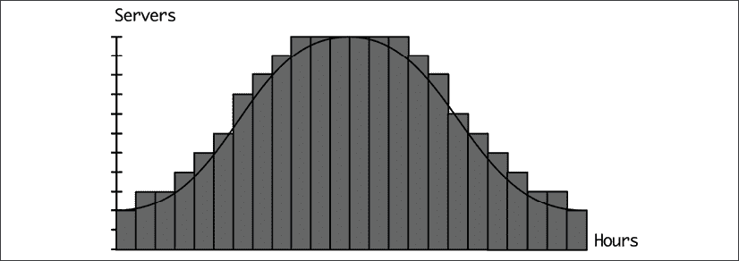
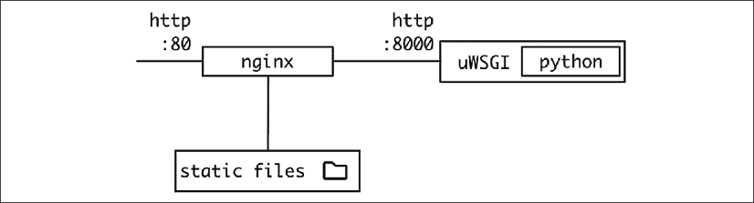

# 5

# 十二要素应用方法论

当设计一个软件系统时，每次为每个新项目重新发明轮子并不是一个好主意。软件的某些部分在大多数网络服务项目中是通用的。学习一些经过时间证明的成功实践，对于避免犯容易修复的错误非常重要。

在本章中，我们将重点关注十二要素应用的方法。这种方法是一系列经过时间证明的针对部署在 Web 上的网络服务的推荐。

十二要素应用起源于 Heroku，这是一家提供便捷部署访问的公司。其中一些因素比其他因素更通用，一切都应该被视为一般性建议，而不一定是强制性的。这种方法在 Web 云服务之外不太适用，但仍然是一个好主意，要审查它并尝试提取有用的信息。

我们将在本章中介绍这一方法的基本细节，并将花一些时间详细描述该方法涵盖的一些最重要的因素。

在本章中，我们将涵盖以下主题：

+   十二要素应用的简介

+   持续集成

+   可扩展性

+   配置

+   十二要素

+   容器化的十二要素应用

让我们从介绍十二要素应用的基本概念开始。

# 十二要素应用的简介

十二要素应用是一种方法论，包含 12 个不同的方面或因素，涵盖了在设计网络系统时应该遵循的良好实践。它们的目的是提供清晰度并简化一些可能性，详细说明已知的工作模式。

这些因素足够通用，不会在如何实现它们或强制使用特定工具方面具有指导性，同时给出明确的方向。十二要素应用方法论在某种程度上是有偏见的，因为它旨在以可扩展的方式涵盖云服务，并推广**持续集成**（**CI**）作为这些操作的关键方面。这也导致了本地、开发环境和生产环境之间的差异减少。

这两个方面，本地和生产的部署一致性，以及 CI，是相互作用的，因为它允许系统以一致的方式进行测试，无论是在开发环境中还是在 CI 系统中运行测试。

可扩展性是另一个关键要素。由于云服务需要处理可变的工作负载，我们需要允许我们的服务能够增长，并且能够处理系统进入的更多请求而不会出现任何问题。

我们将解决的第三个一般性问题，也是十二要素应用的核心，是配置的挑战。配置允许相同的代码在不同的环境中设置，同时也可以调整某些功能以适应特定情况。

# 持续集成

持续集成，或称 CI，是指在新代码提交到中央仓库时自动运行测试的实践。而最初在 1991 年提出时，它可以理解为运行一个“夜间构建”，因为运行测试需要花费时间且成本高昂，如今，它通常被理解为每次新代码提交时运行一系列测试。

目标是生成始终有效的代码。毕竟，如果代码无效，它会被失败的测试迅速检测到。这个快速的反馈循环有助于开发者提高速度，并创建一个安全网，使他们能够专注于他们正在实施的功能，并将整个测试流程的运行交给 CI 系统。自动运行测试并在每个测试上执行的纪律极大地有助于确保代码质量，因为任何错误都能迅速被发现。

这也取决于运行测试的质量，因此为了拥有一个良好的 CI 系统，了解良好测试的重要性并定期优化测试流程非常重要，既要确保它给我们提供足够的信心，也要确保它运行得足够快，以免引起问题。

足够快，当处理 CI 系统时可能会有所不同。记住，测试将在后台自动运行，无需开发者的参与，因此它们可能需要一段时间才能返回结果，与开发者调试问题时期望的快速反馈相比。作为一个非常一般的近似值，如果你的测试流程可以在 20 分钟或更短的时间内完成，那么就朝着这个目标努力。

CI 基于自动化任何用作代码中央仓库的系统的能力，因此一旦开发者有新的更改，测试就会立即启动。使用像 `git` 这样的源代码控制系统非常常见，并添加一个钩子来自动运行测试。

在更实际的方法中，`git` 通常在像 GitHub ([`github.com/`](https://github.com/)) 或 GitLab ([`about.gitlab.com/`](https://about.gitlab.com/)) 这样的云系统中使用。它们都提供与其他服务集成的其他服务，允许通过一些配置自动运行操作。例如，TravisCI ([`www.travis-ci.com/`](https://www.travis-ci.com/)) 和 CircleCI ([`circleci.com/`](https://circleci.com/))。在 GitHub 的情况下，它们有自己的原生系统，称为 GitHub Actions。所有这些都是基于添加一个特殊文件来配置服务的想法，从而简化了管道的设置和运行。

CI 管道是一系列按顺序运行的步骤。如果有错误，它将停止管道的执行并报告检测到的问题，从而允许早期检测和为开发者提供反馈。通常，我们将软件构建成可测试的状态，然后运行测试。如果有不同类型的测试，例如单元测试和集成测试，则运行它们，要么一个接一个，要么并行运行。

运行测试的典型管道可以执行以下操作：

1.  由于它从一个新的、空的环境中开始，因此安装所需的依赖工具以运行测试；例如，特定的 Python 版本和编译器，或者将在*步骤 3*中使用的静态分析工具。

1.  执行任何构建命令以准备代码，例如编译或打包化。

1.  运行静态分析工具，如`flake8`，以检测样式问题。如果结果显示有问题，请在此处停止并报告。

1.  运行单元测试。如果结果不正确，请在此处停止并显示错误。

1.  准备并运行其他测试，例如集成或系统测试。

在某些情况下，这些阶段可以并行运行。例如，*步骤 3*和*步骤 4*可以同时运行，因为它们之间没有依赖关系，而*步骤 2*需要在进入*步骤 3*之前完成。这些步骤可以在某些 CI 系统中描述，以允许更快地执行。

CI 管道中的关键字是**自动化**。为了允许管道执行，所有步骤都需要能够自动运行，无需任何人工干预。这要求任何依赖项也能够自动设置。例如，如果需要用于测试的数据库或其他依赖项，则需要分配。

一种常见的模式是 CI 工具分配一个虚拟机，允许数据库启动，以便在环境中可用，包括 MySQL、PostgreSQL 和 MongoDB 等常用数据库。请记住，数据库将启动为空，如果需要播种测试数据，则需要在设置环境期间完成。请查阅您特定工具的文档以获取更多详细信息。

一种可能性是使用 Docker 构建一个或多个容器，以标准化流程并在构建过程中明确所有依赖项。这正变得越来越常见。

我们将在*第八章*，*高级事件驱动结构*中更多地讨论 Docker。

十二因素应用的某些因素在 CI 管道的设置中发挥作用，因为它们旨在拥有易于构建的代码，以便部署用于测试或操作和配置。

# 可扩展性

预期云系统在高负载下表现正确，或者至少在不同负载之间进行调整。这要求软件是**可扩展的**。可扩展性是软件允许增长并接受更多请求的能力，通常是通过增加资源来实现。

有两种类型可扩展性：

+   垂直扩展性：向每个节点增加资源，使它们更强大。这相当于购买一台更强大的计算机；增加更多 RAM、更多硬盘空间、更快的 CPU...

+   水平扩展性：向系统中添加更多节点，而不一定需要它们更强大。例如，而不是有两个网络服务器，增加到五个。

通常，水平扩展性被认为更可取。在云系统中，添加和删除节点的容量可以自动化，允许部署根据系统流入的当前请求数量自动调整。与必须为系统最大负载时刻进行尺寸设计的传统操作方式相比，这可以大大降低成本，因为大多数时候，系统将处于未充分利用状态。

例如，让我们比较一下中午系统需要 11 个服务器的情况，此时大多数客户都已连接。午夜时分，系统处于最低利用率点，只需要 2 个服务器。

以下图表显示了当服务器数量根据负载增长时的典型情况：



自动生成的描述](img/B17580_05_01.png)

图 5.1：服务随时间进行扩展和缩减

传统情况将使用 264 个成本单位（11 个服务器 * 24 小时），而自动扩展大约使用 166 个成本单位，节省了大量资源。

更重要的是，传统系统需要额外的空间来允许可能发生的意外峰值。通常，系统将设置至少允许 30% 的额外负载，甚至可能更多。在这种情况下，成本将永久增加。

要使系统具有水平扩展性，它需要是无状态的。这意味着每个节点是无法区分的。每个请求将被分配到某个形式的旋转节点，以在整个节点之间分配负载。每个请求的所有状态都需要来自请求本身（输入参数）或来自外部存储源。从应用程序的角度来看，每个请求都进入一个空空间，并且在任何事件中都不能携带。这意味着在请求之间不在本地硬盘或本地内存中存储任何内容。

在请求内部存储信息，例如，从数据库中获取信息来组成文件并在请求中返回它是可以的，尽管如果可能的话，将其保存在内存中可能会比使用硬盘更快。

外部存储源通常是数据库，但使用更多面向存储文件或其他大型二进制数据块（例如，AWS S3）的存储服务也很常见。

AWS S3 是一种网络服务，允许通过 URL 存储和检索文件。它允许创建一个*桶*，其中将包含多个*键*或路径；例如，访问类似于`https://s3.amazonaws.com/mybucket/path/to/file`的 URL，以便上传和下载类似文件的对象。还有许多库可以帮助处理此服务，例如 Python 的`boto3`。

此服务非常适合以可扩展的方式处理文件，并允许以这种方式进行配置，使得读取访问可以公开进行，从而简化了通过系统存储数据并通过公共 URL 允许用户读取的模式。

更多信息请参考 AWS 文档：[`aws.amazon.com/s3/`](https://aws.amazon.com/s3/)

缓存也应该在每个单独的节点之外保持，使用如 Riak 或 memcached 等工具。使用本地内存的内部缓存存在一个问题，即它们可能不会被使用，因为下一个相关的请求可能由系统中的另一个节点提供服务。使用外部服务允许所有节点访问缓存，并提高系统的整体性能。

请记住，整个系统不能是无状态的。特别是存储元素，如数据库和缓存，需要不同的操作方式，因为它们是存储数据的地方。我们在*第三章*，*数据建模*中讨论了如何扩展存储系统。

# 配置

十二要素应用的基本思想之一是代码是唯一的，但可以通过配置进行调整。这使得相同的代码可以在不同的环境中使用和部署。

使用不同的环境允许设置测试环境，在那里可以运行测试而不会影响生产数据。它们是进行实验或尝试在沙盒中复制真实问题的更受控的地方。还有一个通常不被视为此类环境的环境，即本地开发环境，在那里开发者能够检查系统是否正常工作。

创建一个全面且易于使用的本地环境是提高开发者生产力的关键方面。当与单个服务或进程（如网页服务器）一起工作时，设置相对容易，因为大多数项目都允许以开发模式启动，但一旦有更多元素，设置就变得更加困难。

复杂设置已经相当普遍多年了。最近有一股趋势是使用从头开始设置的虚拟机，而最近则是容器化，以确保可以从已知点轻松启动。

配置系统比最初看起来要困难。总会有越来越多的参数需要处理。在复杂系统中，以某种方式对参数进行结构化很重要，以便将它们分成更易于管理的部分。

配置参数可以分为两大类：

+   **操作配置**：这些参数连接系统的不同部分或与监控相关；例如，数据库的地址和凭证、用于访问外部 API 的 URL，或设置日志级别为`INFO`。这些配置参数仅在集群发生变化时更改，但应用程序的外部行为不会改变；例如，仅记录`WARNING`日志或更高，或更换凭证以进行轮换。

+   这些参数受运维控制，通常在透明或维护期间更改。这些参数的配置错误通常是一个严重问题，因为它可能会影响系统的功能。

+   **功能配置**：这些参数改变外部行为，启用或禁用功能或更改软件的某些方面；例如，设置颜色和页眉图片的主题参数；或者启用高级功能以允许对高级访问收费，或者更新数学模型的参数，以改变内部轨道计算的方式。

    这些参数与软件的操作无关。这里的配置错误可能不会引起问题，因为它将继续正常运行。这里的更改更多地受开发者或甚至业务经理的控制，以在特定时间启用一个功能。

旨在激活或禁用完整功能的配置参数被称为*功能标志*。它们用于在特定时间生成一个“商业版本”，在功能内部开发的同时，将新代码部署到生产环境中而不包含该功能。

一旦功能准备就绪并经过彻底测试，代码可以在生产环境中提前部署，只需更改适当的配置参数即可激活完整功能。

这使我们能够以小步增加的方式继续工作，朝着一个大功能前进，例如用户界面的全面更新，同时频繁构建和发布小增量。一旦功能发布，代码可以重构以删除该参数。

这两个类别有不同的目标，通常由不同的人维护。虽然操作配置参数与单个环境紧密相关，需要适合该环境的参数，但功能配置通常在本地开发中进行测试，直到在生产环境中更改并具有相同的值。

传统上，配置参数存储在一个或多个文件中，通常按环境分组。这会创建一个名为`production.cnf`的文件和另一个名为`staging.cnf`的文件，它们附加到代码库中，根据环境的不同，使用其中一个。这带来了一定的问题：

+   进行配置更改实际上是一种代码更改。这限制了可以执行更改的速度，并可能导致范围问题。

+   当环境数量增加时，文件数量也会同时增加。这可能导致由于重复而产生的错误；例如，更改错误文件而没有撤销，并在意外部署后出现。旧文件也可能没有被删除。

+   在开发者之间集中控制。正如我们所见，一些参数不一定在开发者的控制之下，而是在运维团队的控制之下。将所有数据存储在代码库中使得创建工作之间的划分更加困难，需要两个团队访问相同的文件。虽然这对小型团队来说是可以的，但长期来看，尝试减少大群体人员访问同一文件而只关心其中一半的需求是有意义的。

+   将敏感参数（如密码）存储在文件中并在代码仓库中存储它们是一个明显的安全风险，因为任何有权访问仓库的人都可以使用这些凭据访问所有环境，包括生产环境。

这些问题使得直接将配置作为文件存储在代码库内部不可取。我们将在*配置*要素中具体了解十二要素应用如何处理它。

# 十二要素

十二要素应用的因素如下：

1.  **代码库**。将代码存储在单个仓库中，并通过配置进行区分。

1.  **依赖项**。明确且清晰地声明它们。

1.  **配置**。通过环境进行配置。

1.  **后端** **服务**。任何后端服务都应被视为附加资源。

1.  **构建、发布、运行**。区分构建状态和运行状态。

1.  **进程**。以无状态进程执行应用程序。

1.  **端口绑定**。通过端口公开服务。

1.  **并发性**。将服务设置为进程。

1.  **可丢弃性**。快速启动和优雅关闭。

1.  **开发/生产一致性**。所有环境应尽可能相似。

1.  **日志**。将日志发送到事件流。

1.  **管理进程**。独立运行一次性管理进程。

这些因素可以围绕不同的概念进行分组：

+   *代码库*、*构建、发布、运行*和*开发/生产一致性*围绕生成一个在不同环境中运行的单个应用程序的理念，仅通过配置进行区分

+   *配置*、*依赖项*、*端口绑定*和*后端服务*围绕不同服务的配置和连接性

+   *进程*、*可丢弃性*和*并发性*与可扩展性概念相关

+   *日志*和*管理进程*是与监控和一次性进程相关的实用理念

让我们来看看这四个组中的所有四个。

## 构建一次，运行多次

十二要素应用的一个关键概念是它易于构建和管理，但同时也是统一的系统。这意味着没有从一种版本到另一种版本的临时代码更改，只有可配置的选项。

*代码库*要素的目标是，一个应用程序的所有软件都存储在单个仓库中，具有单一状态，没有为每个客户设置的特殊分支，也没有仅在特定环境中可用的特殊功能。

非常特定的环境通常被称为*雪花环境*。任何处理过这些环境的人都知道维护它们是多么痛苦，这就是为什么十二要素应用的目标是消除它们，或者至少使它们仅基于配置进行更改。

这意味着部署的代码始终相同，只有配置发生变化。这允许轻松测试所有配置更改，并且不会引入盲点。

注意，一个系统可能包含多个项目，这些项目分布在多个仓库中，每个项目单独满足十二要素应用的要求，并且协同工作。其他因素讨论的是应用程序之间的互操作性。

通过协调的 API 保持多个应用程序协同工作始终是一个挑战，需要跨团队的良好协调。一些公司采用单仓库方法，即有一个包含所有公司项目且分布在多个子目录中的单一仓库，以确保对整个系统有一个完整的视图，并在整个组织内保持单一状态。

这也带来了一些挑战，需要跨团队进行更多协调，并且可能对大型仓库提出重大挑战。

单一代码库允许在*构建、发布、运行*要素中对阶段进行严格区分。该要素确保有三个不同的阶段：

+   构建阶段将代码仓库的内容转换为稍后运行的软件包或可执行文件。

+   发布阶段使用这个构建好的软件包，将其与所选环境的适当配置结合，并使其准备就绪以执行。

+   运行阶段最终在所选环境中执行打包的软件包。

如我们之前讨论的，配置存储在代码库的不同位置。这种分离是有意义的，并且也可以在源代码控制下进行。它可能以文件的形式存储，但可以通过环境进行访问分离，这在某些环境中是有意义的，例如生产环境，比其他环境更为关键。将配置作为代码库的一部分存储会使其难以进行这种分离。

请记住，可以合并多个文件，允许将参数分离为功能和操作配置。

由于阶段是严格分开的，代码部署后不可能更改配置或代码。这要求在任何情况下都进行新的发布。这使得发布非常明确，每个发布都应该独立执行。请注意，如果出现新的服务器或服务器崩溃，运行阶段可能需要再次执行，因此目标应该是尽可能简单地进行。正如我们所看到的，十二要素应用的一个共同主题是严格的分离，这样每个元素都容易识别和操作。我们将检查如何在其他因素中定义配置。

在构建阶段之后执行测试也确保了代码在测试和发布及操作之间没有变化。

由于这种严格的分离，特别是在构建阶段，很容易遵循*Dev/prod parity*。本质上，开发环境与生产环境相同，因为它们使用相同的构建阶段，但通过适当的配置来本地运行。这个因素也使得使用相同的（或尽可能接近的）后端服务，如数据库或队列，成为可能，以确保本地开发尽可能代表生产环境。Docker 这样的容器工具或 Chef 或 Puppet 这样的配置工具也可以帮助自动设置包含所有必需依赖项的环境。

获得快速且简单的开发、构建和部署过程对于加快周期和快速调整至关重要。

## 依赖项和配置

十二要素应用提倡明确定义依赖项和配置，同时在如何执行它们方面有明确的观点，并提供了经过验证的坚实标准。

正因如此，在*Config*因素中，它提到将系统的所有配置存储在**环境变量**中。环境变量独立于代码，这允许保留我们在*Build, release, run factor*中讨论的严格区分，并避免我们在之前描述的将它们存储在代码库内部文件中的问题。它们也是语言和操作系统无关的，并且易于使用。将环境变量注入到新的环境中也很简单。

这比其他替代方案更受欢迎，例如将描述环境如`staging`或`production`的不同文件放入代码库中，因为它们允许更精细的控制，并且因为这种处理方式最终会创建太多文件，并改变那些未受影响的环境的代码；例如，需要更新一个短暂存在的`demo`环境的代码库。

虽然十二要素应用鼓励以变量无关的方式处理配置，但工作的现实情况意味着存在有限数量的环境，并且它们的配置应该存储在某个地方。关键要素是将它们存储在代码库之外的不同位置，仅在 *发布* 阶段进行管理。这提供了足够的灵活性。

请记住，对于本地开发，这些环境变量可能需要独立更改以测试或调试不同的功能。

可以使用标准库直接从环境中的配置文件获取配置；例如，在 Python 中：

```py
import os

PARAMETER = os.environ['PATH'] 
```

此代码将在常量 `PARAMETER` 中存储 `PATH` 环境变量的值。请注意，如果没有 `PATH` 环境变量，将会生成一个 `KeyError`，因为它不会出现在 `environ` 字典中。

对于以下示例，请记住，定义的环境变量需要在你的环境中定义。这些定义不包括在内，以简化说明。你可以通过运行 `$ MYENVVAR=VALUE python3` 来运行 Python，添加一个本地环境。

为了允许可选的环境变量，并防止它们丢失，请使用 `.get` 方法来设置默认值：

```py
PARAMETER = os.environ.get('MYENVVAR', 'DEFAULT VALUE') 
```

作为一般建议，在配置变量缺失时抛出异常比继续使用默认参数更好。这样做可以使配置问题更容易被发现，因为它会在进程启动时停止，并大声报错。记住，遵循十二要素应用的理念，你希望明确地描述事物，并且任何问题都应该尽早失败，以便能够正确地修复它，而不是在未被发现的情况下传递。

注意，环境变量始终定义为文本。如果值需要不同的格式，则需要将其转换，例如：

```py
NUMBER_PARAMETER = int(os.environ['ENVINTEGERPARAMETER']) 
```

这在定义 `Boolean` 值时提出了一个常见问题。以下定义此转换代码的方式是不正确的：

```py
BOOL_PARAMETER = bool(os.environ['ENVBOOLPARAMETER']) 
```

如果 `ENVPARAMETER` 的值是 `"TRUE"`，则 `BOOL_PARAMETER` 的值是 `True`（布尔值）。但如果 `ENVPARAMETER` 的值是 `"FALSE"`，则 `BOOL_PARAMETER` 的值也是 `True`。这是因为字符串 `"FALSE"` 是一个非空字符串，被转换为 `True`。相反，可以使用标准库包 `distutils`：

```py
import os

from distutils.util import strtobool

BOOL_PARAMETER = strtobool(os.environ['ENVBOOLPARAMETER']) 
```

`strtobool` 返回的不是 `True` 或 `False` 作为 `Booleans`，而是 `0` 或 `1` 作为整数。这通常工作正常，但如果你需要严格的 `Boolean` 值，可以添加 `bool` 如此：`bool(strtobool(os.environ['ENVPARAMETER']))`

环境变量还允许注入敏感值，如机密信息，而无需在代码库中存储它们。请注意，机密信息将在执行环境中被检查到，但通常这是受保护的，因此只有授权团队成员可以通过 `ssh` 或类似方式在环境中访问它。

作为此配置的一部分，任何*后端服务*也应定义，以及环境变量。后端服务是应用程序通过网络使用的服务。它们可以是同一网络内的本地服务，也可以是外部服务，例如由外部公司处理或 AWS 服务。

从应用程序的角度来看，这种区分应该是无关紧要的。资源应通过 URI 和凭证访问，并且作为配置的一部分，可以根据环境进行更改。这使得资源松散耦合，意味着它们可以很容易地被替换。如果有迁移，并且数据库需要在两个网络之间移动，我们可以启动新的数据库，通过配置更改进行新的发布，应用程序将指向新的数据库。这可以不更改代码来完成。

为了允许多个应用程序的连接，*端口绑定*因子确保任何公开的服务都是一个端口，这可能会根据服务而有所不同。这使得将每个应用程序视为后端服务变得容易。最好以 HTTP 的形式公开，因为这使其连接非常标准化。

对于应用程序，如果可能，使用端口`80`上的 HTTP。这使得所有连接都很容易，例如使用`http://service-a.local/`这样的 URL。

一些应用程序需要几个协同工作的进程的组合。例如，对于 Python 应用程序的 Web 服务器，如 Django，通常使用应用程序服务器如 uWSGI 来运行它，然后使用 Web 服务器如 nginx 或 Apache 来提供服务和静态文件。



图 5.2：连接 Web 服务器和应用程序服务器

它们通过暴露已知的端口和协议相互连接，这使得设置变得简单。

在同一问题上，为了清晰起见，所有库的*依赖项*都应该明确设置，而不是依赖于现有操作系统中预安装的某些包。依赖项应通过依赖声明来描述，例如 Python 的`requisites.txt` pip 文件。

然后，依赖项应作为构建阶段的一部分进行安装，使用如`pip install -r requirements.txt`之类的命令。

请记住，特定的 Python 版本也是一个应该严格控制依赖项。其他必需的操作系统依赖项也是如此。理想情况下，应从头开始创建操作系统环境，并指定依赖项。

尤其重要的是，依赖项应该尽可能隔离，以确保没有不紧密控制的隐式依赖项。依赖项也应尽可能紧密地定义，以避免在发布新版本时安装不同版本的依赖项的问题。

例如，在一个 pip 文件中，依赖项可以用不同的方式描述：

```py
requests

requests>=v2.22.0

requests==v2.25.1 
```

第一种方式接受任何版本，所以通常使用最新版本。第二种描述了最小（和可选的最大）版本。第三种版本固定了特定版本。

这与操作系统中的其他包管理系统等效，例如 Ubuntu 中的 `apt`。您可以使用 `apt-get install dependency=version` 安装特定版本。

使用非常明确的依赖关系可以使构建可重复和确定性的。它确保在构建阶段没有未知的变化，因为已经发布了新版本。虽然大多数新包都将兼容，但它也可能 *有时* 引入影响系统行为的变化。更糟糕的是，这些变化可能是 **无意中** 引入的，导致严重问题。

## 可扩展性

我们在章节中较早地讨论了可扩展性的原因。十二要素应用也讨论了如何成功增长或缩减系统。

*进程* 因素讨论了确保运行阶段由启动一个或多个进程组成。这些进程应该是无状态的，不共享任何内容，这意味着所有数据都需要从外部备份服务（如数据库）检索。可以在同一请求内使用临时本地磁盘来存储临时数据，尽管其使用应保持在最低限度。

例如，文件上传可能使用本地硬盘存储临时副本，然后处理数据。数据处理完毕后，文件应从磁盘上删除。

如果可能，尽量使用内存进行这种临时存储，因为这会使这种区分更加严格。

进程需要满足的下一个属性是它们的 *可处置性*。进程需要能够快速启动和停止，并且可以在任何时间进行。

快速启动允许系统快速响应发布或重启。目标应该是让进程在几秒钟内启动并运行。快速周转也很重要，以便在需要为缩放目的添加更多进程时，系统能够快速增长。

相反，允许进程优雅地关闭。这在缩放情况下可能是必需的，以确保在此情况下任何请求都不会被中断。按照惯例，进程应通过发送 `SIGTERM` 信号来停止。

使用 Docker 容器自动通过发送 `SIGTERM` 信号到主进程来使用这种惯例，每当容器需要停止时。如果在宽限期后进程没有自行停止，它将被杀死。如果需要，宽限期可以配置。

确保容器的主体进程能够接收 `SIGTERM` 信号并妥善处理，以确保容器能够优雅地停止。

例如，对于 Web 请求，首先进行优雅的关闭将减少对新请求的接受，完成队列中的任何请求，最后关闭进程。Web 请求通常回答得很快，但对于其他进程，如长时间异步任务，如果需要完成当前任务，停止可能需要很长时间。

相反，长时间任务的工作者应该将作业返回到队列并取消执行。这样，任务将再次执行，为了确保不会重复操作，我们需要确保所有任务都可以通过等待其结束并保存其结果，然后将它们包装成事务或类似的方式来取消。

在某些情况下，可能有必要区分准备作业的大部分和保存结果的部分。我们可能希望等待，如果作业在关闭时保存结果，或者停止执行并将任务返回到队列。某些保存操作可能需要调用不接受事务的系统。关闭长时间运行进程的可接受时间可能比关闭 Web 服务器的时间更长。

进程还应能够抵御意外的中断。这些中断可能由错误、硬件错误或通常在软件中出现的意外惊喜引起。创建一个具有弹性的队列系统，以便在任务中断的情况下可以重试，将大大有助于这些情况。

因为系统是通过进程创建的，基于这一点，我们可以通过创建更多的进程来扩展。进程是独立的，可以在同一服务器或其他服务器上同时运行。这是*并发性*因素的基础。

请记住，同一个应用程序可以使用多个进程，这些进程之间协调以处理不同的任务，并且每个进程可能有不同数量的副本。在我们上面的前一个例子中，使用 nginx 服务器和 uWSGI，最佳数量可能是一个 nginx 进程，其数量是 uWSGI 工作者的多倍。

传统的部署过程是为节点设置一个物理服务器（或虚拟机）并安装一定数量的元素，这通常包括调整工作者的数量，直到找到最佳数量以充分利用硬件。

使用容器，这个过程在一定程度上是相反的。容器通常更轻量级，可以创建更多。虽然优化过程仍然是必需的，但使用容器时，更多的是创建一个单元，然后检查单个节点可以容纳多少个这样的单元，因为容器可以在节点之间更容易地移动，并且生成的应用程序通常更小。我们不是找出给定服务器的应用程序的正确大小，而是确定一个小应用程序在服务器中可以容纳多少副本，因为我们知道我们可以轻松地使用不同大小的服务器或添加更多服务器。

添加更多节点，由于它们是独立和无状态的，在十二要素应用中变得容易操作。这允许整个操作的大小根据系统的负载进行调整。这可以是一个手动操作，随着系统负载和请求的增加而缓慢添加新节点，或者它可以自动完成，正如我们在本章前面所描述的。

十二要素应用并不要求自动执行此扩展，但确实使其成为可能。自动化调整应谨慎处理，因为它需要仔细的系统负载指标。留出时间进行测试，以进行适当的调整。

十二要素应用的处理程序也应该由某种操作系统进程管理器运行，如`upstart`或`systemd`。这些系统确保进程持续运行，即使在崩溃的情况下也能处理优雅的手动重启，并优雅地管理输出流。我们将更多地讨论输出流作为日志的一部分。

当与容器一起工作时，这会有所变化，因为主要处理的是容器而不是进程。而不是操作系统进程管理器，工作由容器编排器执行，确保容器正常运行并捕获任何输出流。在容器内部，进程可以在没有管理器控制的情况下启动。如果进程停止，容器将停止。

自动重启进程，结合快速启动时间和在关闭情况下的弹性，使应用程序动态且能够自我修复，以防出现意外问题导致进程崩溃。它还允许在避免长时间运行进程和作为内存泄漏或其他长时间运行问题的应急计划的一部分使用受控关闭。

这相当于老式的技巧：先关闭再打开！如果操作非常快，可以节省很多情况！

## 监控和管理

一个全面的监控系统对于检测问题和分析系统的操作非常重要。虽然它不是唯一的监控工具，但日志是任何监控系统的关键部分。

日志是提供正在运行的应用程序行为可见性的文本字符串。它们应该始终包含生成时的时间戳。它们在代码执行时生成，提供关于不同动作发生时的信息。关于要记录的具体内容可能因应用程序而异，但通常框架会根据常见实践自动创建日志。

例如，任何与网络相关的软件都会记录接收到的请求，例如：

```py
[16/May/2021 13:32:16] "GET /path HTTP/1.1" 200 10697 
```

注意，它包括：

+   生成时的时间戳 `[16/May/2021 13:32:16]`

+   HTTP `GET` 方法和 `HTTP/1.1` 协议

+   访问路径 – `/path`

+   返回的状态码 – `200`

+   请求的大小 – `10697`

这种日志被称为访问日志，并且将以不同的格式生成。至少，它应该始终包括时间戳、HTTP 方法、路径和状态码，但它可以被配置为返回额外的信息，例如发起请求的客户端的 IP 地址，或者处理请求所需的时间。

访问日志是由包括 nginx 和 Apache 在内的 Web 服务器生成的。正确配置它们以调整产生的信息对于运营目的非常重要。

访问日志不是唯一有用的日志。应用程序日志也非常有用。应用程序日志是在代码内部生成的，可以用来传达重要的里程碑或错误。Web 框架准备日志，因此很容易生成新的日志。例如，在 Django 中，你可以这样创建日志：

```py
import logging

logger = logging.getLogger(__name__)

...

def view(request, arg):

    logger.info('Testing condition')

    if something_bad:

        logger.warning('Something bad happened') 
```

这将生成如下日志：

```py
2021-05-16 14:01:37,269 INFO Testing condition

2021-05-16 14:01:37,269 WARNING Something bad happened 
```

我们将在*第十一章*，*包管理*中详细介绍日志的更多细节。

*日志*因素表明日志不应该由进程本身管理。相反，日志应该直接打印到它们自己的标准输出，而不经过任何中间步骤。围绕进程的环境，如*并发*因素中描述的操作系统的进程管理器，应该负责接收日志、合并它们并将它们正确路由到长期归档和监控系统。请注意，这种配置完全超出应用程序的控制范围。

对于本地开发，仅通过终端显示日志可能就足够用于开发目的。

这与将日志作为硬盘上的日志文件存储形成对比。这有一个问题，即需要轮换日志并确保有足够的空间。这也要求不同的进程在日志轮换和存储方面协调一致。相反，标准输出可以合并并汇总成一个系统的整体图像，而不是单个进程。

日志也可以被导向外部日志索引系统，例如 ELK 堆栈（Elasticsearch、Kibana 和 Logstash：[`www.elastic.co/products/`](https://www.elastic.co/products/))，它将捕获日志并提供分析工具来搜索它们。外部工具也可用，包括 Loggly ([`www.loggly.com/`](https://www.loggly.com/)) 或 Splunk ([`www.splunk.com/`](https://www.splunk.com/)) 以避免维护。所有这些工具都允许捕获标准输出日志并将它们重定向到它们的解决方案。

在容器世界中，这个建议更有意义。Docker 编排工具可以轻松捕获容器中的标准输出，然后将它们重定向到其他地方。

这些其他工具可以提供诸如在特定时间窗口内搜索和查找特定事件、观察每小时请求数量的变化等趋势，甚至可以根据某些规则创建自动警报，例如在一段时间内超过某个值的`ERROR`日志数量的增加。

*管理进程*因素涵盖了有时需要运行以进行特定操作但不是应用程序正常操作一部分的一些进程。以下是一些例子：

+   数据库迁移

+   生产临时报告，例如生成针对特定销售的单一报告或检测受某个错误影响的记录数量

+   用于调试目的的运行控制台

在生产环境中，仅在没有其他替代方案时才应使用控制台执行命令，不应将其作为创建特定脚本的替代方式以进行重复操作。应采取极端谨慎。请记住，生产环境中的错误可能会造成严重问题。对待您的生产环境应持适当的尊重态度。

这些操作不是日常运营的一部分，但可能需要运行。界面明显不同。要执行它们，它们应在与常规进程相同的环境中运行，使用相同的代码库和配置。这些管理操作应作为代码库的一部分，以避免代码不匹配的问题。

在传统环境中，可能需要通过 `ssh` 登录到服务器以允许执行此过程。在容器环境中，可以启动一个完整的容器专门用于执行此过程。

在迁移的情况下，这是非常常见的。一个准备命令可能包括运行构建以执行迁移。

这应该在实际发布之前完成，以确保数据库已迁移。有关迁移的更多详细信息，请参阅*第四章*。

要在容器中运行这些管理命令，容器镜像应与运行应用程序的镜像相同，但使用不同的命令，这样代码和环境就与运行中的应用程序相同。

# 容器化的 Twelve-Factor Apps

尽管 Twelve-Factor App 方法比当前使用 Docker 和相关工具的容器化趋势更早，但它非常一致。这两个工具都面向云的可扩展服务，容器有助于创建与 Twelve-Factor 方法中描述的匹配的模式。

我们将在*第八章*，*高级事件驱动结构*中更多地讨论 Docker 容器。

最重要的，可以说是创建一个不变的容器镜像，然后运行它，与*Build, release, run*因素非常契合，并且对*Dependencies*非常明确，因为整个镜像将包括诸如要使用的特定操作系统和任何库等详细信息。将构建过程作为仓库的一部分也有助于实现*Code base*因素。

每个容器也作为一个*Process*工作，这允许通过创建相同容器的多个副本来实现扩展，使用*Concurrency*模型。

虽然容器在概念上通常被视为轻量级虚拟机，但最好将它们视为封装在其自身文件系统中的进程。这更接近它们的实际操作方式。

容器的概念使得它们易于启动和停止，利用*Disposability*因素，并通过如 Kubernetes 之类的编排工具连接彼此，这使得设置*Backing services*因素也变得容易，并且根据*Port binding*因素，在容器中特定端口之间共享服务也很简单。然而，在大多数情况下，它们将作为标准端口`80`上的 Web 界面进行共享。

在 Docker 和 Kubernetes 之类的编排工具中，通过注入环境变量设置不同的环境非常容易，从而满足*Configuration*因素。这种环境配置以及集群的描述可以存储在文件中，这使得可以轻松创建多个环境。它还包括处理机密信息的工具，以确保它们被正确加密，并且不会存储在配置文件中，以避免泄露机密信息。

容器另一个关键优势是集群可以轻松地在本地进行复制，因为运行在生产环境中的相同镜像也可以在本地环境中运行，只需对其配置进行少量更改。这极大地有助于确保不同环境能够根据*Dev/Prod parity*因素保持最新。

通常，容器方法旨在定义一个集群，并以一致的方式在不同服务和容器之间引发清晰的分离。这汇集了不同的环境，因为开发环境可以在小规模上复制生产设置。

根据*Logs*因素将信息发送到标准输出也是存储日志的绝佳方式，因为容器工具将接收和处理或重定向这些日志。

最后，可以通过使用不同的命令启动相同的容器镜像来处理*Admin processes*，该命令运行特定的管理命令。如果需要定期执行，例如在部署之前运行迁移，或者如果它是一个周期性任务，这可以由编排器处理。

如我们所见，与容器一起工作是遵循十二要素应用建议的绝佳方式，因为工具的方向是一致的。这并不意味着它们是免费的，但方法论与容器背后的理念之间存在显著的契合度。

这并不令人惊讶，因为两者都来自类似的背景，处理需要在云中运行的网络服务。

# 摘要

在本章中，我们看到了拥有稳固和可靠的模式来构建软件是很好的，这样我们就可以站在经过测试的决策的肩膀上，这些决策可以帮助我们塑造新的设计。对于生活在云中的网络服务，我们可以将十二要素应用方法论作为许多有用建议的指南。

我们讨论了十二要素应用如何与两个主要理念——持续集成（CI）和可扩展性——相一致。

持续集成（CI）是指在代码共享后自动运行测试以不断验证任何新代码的实践。这创建了一个安全网，使开发者能够快速行动，尽管这要求在开发新功能时正确添加自动化测试需要纪律。

我们还讨论了可扩展性的概念，即软件通过增加更多资源来允许更多负载的能力。我们讨论了为什么允许软件根据负载增长和减少很重要，甚至能够动态调整。我们还看到了使系统无状态是实现可扩展软件的关键。

我们看到了配置的挑战，这是十二要素应用也处理的问题，以及并非每个配置参数都是平等的。我们描述了如何将配置分为操作配置和功能配置，这有助于划分并给每个参数提供适当的上下文。

我们逐一分析了十二要素应用的各个因素，并将它们分为四个不同的组，将它们联系起来，并解释了不同的因素如何相互支持。我们将因素分为以下几组：

+   编译一次，运行多次，基于生成单个在不同环境中运行的包的想法

+   依赖和配置，关于应用程序的配置和软件及服务依赖

+   可扩展性，为了实现我们之前讨论过的可扩展性

+   监控和管理其他元素以处理软件在运行时的操作

最后，我们花了一些时间讨论十二要素应用理念与容器化所涉及的内容非常一致，以及不同的 Docker 功能和概念如何使我们能够轻松创建十二要素应用。
