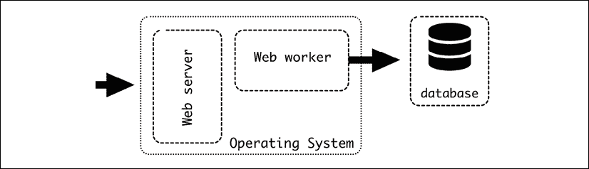
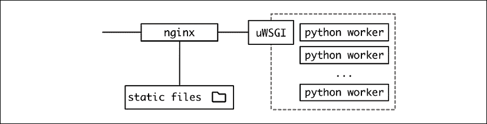
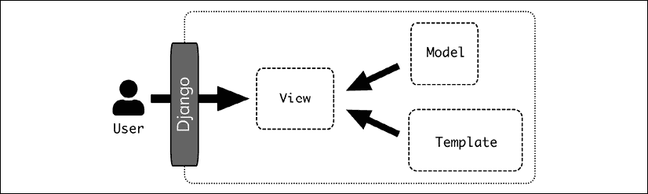
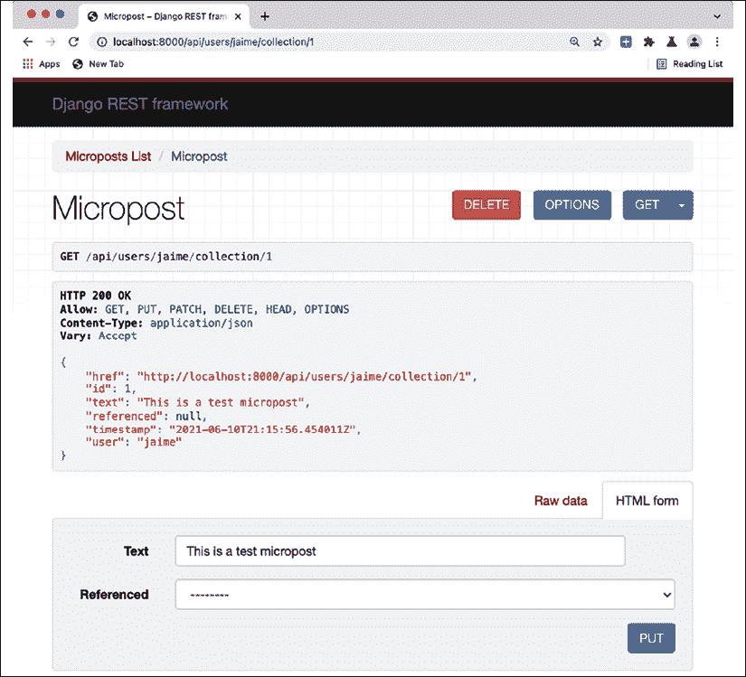
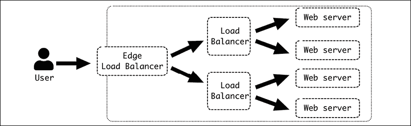

# 第六章：网络服务器结构

目前，网络服务器是远程访问中最常见的服务器。基于 HTTP 的 Web 服务灵活且强大。

在本章中，我们将了解网络服务器的结构，首先描述基本请求-响应架构是如何工作的，然后深入探讨三层 LAMP 风格的架构：服务器本身、执行代码的工作者以及控制这些工作者并向服务器提供标准化连接的中间层。

我们将详细描述每一层，展示特定的工具，例如用于网络服务器的 nginx，用于中间层的 uWSGI，以及用于工作者内部特定代码的 Python Django 框架。我们将详细描述每一个。

我们还将包括 Django REST 框架，因为它是一个构建在 Django 之上的工具，用于生成 RESTful API 接口。

最后，我们将描述如何添加额外的层以实现更大的灵活性、可扩展性和性能。

本章我们将涵盖以下主题：

+   请求-响应

+   网络架构

+   网络服务器

+   uWSGI

+   Python 工作者

+   外部层

让我们先描述请求-响应架构的基础。

# 请求-响应

经典的服务器架构在通信上严重依赖于请求-响应。客户端向远程服务器发送请求，服务器处理它并返回响应。

这种通信模式自主机时代以来一直很流行，它以类似的方式工作，即软件通过库与内部通信，但通过网络。软件调用一个库并从它那里接收响应。

一个重要元素是请求发送和响应接收之间的时间延迟。内部，调用通常不会超过几毫秒，但对于网络来说，它可能以百毫秒和秒来衡量，非常常见。

网络调用非常依赖于服务器所在的位置。在同一数据中心内的调用将会很快，可能不到 100 毫秒，而连接到外部 API 的调用可能接近一秒或更长。

时间也会有很大的变化，因为网络条件可能会极大地影响它们。这种时间差异使得正确处理它变得很重要。

在发出请求时，通常的策略是同步进行。这意味着代码会停止并等待直到响应准备好。这很方便，因为代码将会很简单，但这也低效，因为当服务器正在计算响应并通过网络传输时，计算机将不会做任何事情。

客户端可以被改进以同时执行多个请求。这可以在请求彼此独立时进行，允许它并行执行。实现这一点的简单方法是使用多线程系统来执行它们，这样它们可以加快处理过程。

通常，需要一个流程，其中一些请求可以并行执行，而其他请求则需要等待收到信息。例如，一个常见的请求是检索网页，它将发送一个请求来检索页面，稍后将以并行方式下载多个引用的文件（例如，头文件、图像）。

我们将在本章后面看到，如何设计这种效果来提高网页的响应性。

事实上，网络比本地调用更不可靠，需要更好的错误处理来理解这一事实。任何请求-响应系统都应该特别注意捕获不同的错误，并重试，因为网络问题通常是短暂的，如果在等待后重试，可以恢复。

正如我们在*第二章*，*API 设计*中看到的，HTTP 的多个状态码可以提供详细的信息。

请求-响应模式的另一个特点是服务器不能主动调用客户端，只能返回信息。这简化了通信，因为它不是完全的双向的。客户端需要发起请求，而服务器只需要监听新的请求。这也使得两个角色不对称，并要求客户端知道服务器的位置，通常是通过 DNS 地址和访问端口（默认情况下，HTTP 为 80 端口，HTTPS 为 443 端口）。

这种特性使得某些通信模式难以实现。例如，完全双向通信，其中两部分都希望发起消息的发送，在请求-响应中很难实现。

这种方法的粗略例子是仅通过请求-响应实现的邮件服务器。两个客户端需要使用一个中间服务器。

这种基本结构在允许用户之间进行某种直接消息传递的应用程序中很常见，如论坛或社交网络。

每个用户可以执行两个操作：

+   请求任何发送给他们的新消息

+   向另一个用户发送新消息

用户需要定期检查是否有新消息可用，这通过轮询来实现。这是低效的，因为对于任何新消息，都可能存在大量的检查返回“没有新消息可用”。更糟糕的是，如果检查不够频繁，可能会出现显著的延迟，才会注意到有新消息可用。

在实际应用中，通常通过向客户端发送通知来避免这种轮询。例如，移动操作系统有一个系统来传递通知，允许服务器通过操作系统提供的 API 发送通知，通知用户有新消息。一个较老的替代方案是发送一封电子邮件达到相同的目的。

当然，还有其他替代方案。有 P2P 替代方案，其中两个客户端可以相互连接，还有通过 websockets 与服务器建立连接，这些连接可以保持打开状态，允许服务器通知用户新的信息。它们都偏离了请求-响应架构。

即使有这些限制，请求-响应架构仍然是 Web 服务的基础，并且在几十年中被证明是非常可靠的。存在一个中央服务器来控制通信并可以被动地接受新请求的可能性，使得架构易于实现和快速演进，并简化了客户端的工作。集中的方面允许进行大量控制。

# 网络架构

在本章的引言中，我们介绍了 LAMP 架构，它是网络服务器架构的基础：



图 6.1：LAMP 架构

LAMP 架构更为通用，但我们将更详细地研究网络服务器和网络工作进程。我们将使用基于 Python 生态系统的特定工具，但我们将讨论可能的替代方案。



图 6.2：Python 环境中的更详细架构

从传入请求的角度来看，Web 请求访问不同的元素。

# 网络服务器

**网络服务器**公开 HTTP 端口，接受传入的连接，并将它们重定向到后端。一个常见的选项是 nginx ([`www.nginx.com/`](https://www.nginx.com/))。另一个常见的选项是 Apache ([`httpd.apache.org/`](https://httpd.apache.org/))。网络服务器可以直接服务请求，例如，通过直接返回静态文件、永久重定向或类似的简单请求。如果请求需要更多的计算，它将被重定向到后端，充当反向代理。

在所展示的架构中，网络服务器的主要目标是充当反向代理，接受 HTTP 请求，稳定数据输入，并排队处理传入的请求。

nginx 的基本配置可能看起来像这样。代码可在 GitHub 上找到：[`github.com/PacktPublishing/Python-Architecture-Patterns/blob/main/chapter_06_web_server/nginx_example.conf`](https://github.com/PacktPublishing/Python-Architecture-Patterns/blob/main/chapter_06_web_server/nginx_example.conf)。

```py
server {

    listen 80 default_server;

    listen [::]:80 default_server;

    error_log /dev/stdout;

    access_log /dev/stdout;

       root /opt/;

    location /static/ {

        autoindex on;

        try_files $uri $uri/ =404;

    }

    location / {

        proxy_set_header Host $host;

        proxy_set_header X-Real-IP $remote_addr;

         uwsgi_pass unix:///tmp/uwsgi.sock;

         include uwsgi_params;

    }

} 
```

指令`server`用于打开和关闭基本块，以定义如何服务数据。注意每行都以分号结尾。

在 nginx 术语中，每个服务器指令定义了一个虚拟服务器。通常只有一个，但也可以配置多个，例如，根据 DNS 地址定义不同的行为。

在内部，我们有一个基本配置，说明在哪个端口提供服务——在我们的例子中，端口 80 和 IPv4 和 IPv6 地址。`default_server`子句表示这是默认要使用的服务器：

```py
 listen 80 default_server;

    listen [::]:80 default_server; 
```

IPv4 是常见的四数字地址，如`127.0.0.1`。IPv6 更长，它被设计为 IPv4 的替代品。例如，一个 IPv6 地址可以表示为`2001:0db8:0000:0000:0000:ff00:0042:7879`。IPv4 地址已经耗尽，这意味着没有新的地址可用。从长远来看，IPv6 将提供足够的地址以避免这个问题，尽管 IPv4 仍然被广泛使用，并且可能还会继续使用很长时间。

接下来，我们定义静态文件的位置，包括外部 URL 以及与硬盘某个部分的映射。

注意静态位置需要在反向代理之前定义：

```py
 root /opt/;

    location /static/ {

        autoindex on;

        try_files $uri $uri/ =404;

    } 
```

`root`定义了起点，而`location`开始一个将 URL `/static/file1.txt`从硬盘上的`/opt/static/file1.txt`文件中提供的服务部分。

`try_files`将扫描 URI 中的文件，如果不存在则引发 404 错误。

`autoindex`自动生成索引页面以检查目录的内容。

这个选项通常在生产服务器上被禁用，但在测试模式下运行时检测静态文件问题非常有用。

在生产环境中，直接从 Web 服务器提供静态文件，而不是在 Python 工作流中进一步处理，这是很重要的。虽然这是可能的，并且在开发环境中是一个常见情况，但它非常低效。速度和内存使用将大大增加，而 Web 服务器已经优化了提供静态文件。请始终记住，在生产环境中通过 Web 服务器提供静态文件。

## 外部提供静态内容

另一个选择是使用外部服务来处理文件，例如 AWS S3，它允许你提供静态文件。文件将位于与服务的不同 URL 下，例如：

+   服务的 URL 是`https://example.com/index`

+   静态文件在`https://mybucket.external-service/static/`

因此，服务网页内的所有引用都应指向外部服务端点。

这种操作方式要求你将代码作为部署的一部分推送到外部服务。为了允许不间断的部署，请记住，静态内容需要在之前可用。另一个重要细节是使用不同的路径上传它们，以便部署之间的静态文件不会混淆。

使用不同的根路径来做这件事很容易。例如：

1.  服务的`v1`版本已部署。这是起点。静态内容从`https://mybucket.external-service/static/v1/`提供。

    对服务的调用，如`https://example.com/index`，返回所有指向版本`v1`的静态内容。

1.  一旦服务的`v2`版本准备就绪，首先要做的就是将其推送到外部服务，以便在`https://mybucket.external-service/static/v2/`中可用。注意，在这个时候，没有用户访问`/static/v2`；服务仍然返回`/static/v1`。

    部署新服务。一旦部署完成，用户在调用 `https://example.com/index` 时将开始访问 `/static/v2`。

正如我们在前面的章节中看到的，无缝部署的关键是分小步骤执行操作，并且每一步都必须执行可逆的操作，并准备好地形，以便没有某个必需的元素尚未准备好的时刻。

这种方法可以用于大型操作。在一个 JavaScript 为主的界面，如单页应用程序中，更改静态文件实际上可以视为一个新的部署。底层服务 API 可以保持不变，但更改所有 JavaScript 代码和其他静态内容的下载版本，这实际上将部署一个新版本。

我们在 *第二章* 中讨论了单页应用程序。

这种结构使得静态内容的两个版本可以同时可用。这也可以用来进行测试或发布测试版。由于服务返回是否使用版本 A 或 B，这可以动态设置。

例如，在任意调用中添加一个可选参数来覆盖返回的版本：

+   调用 `https://example.com/index` 返回默认版本，例如，`v2`。

+   调用 `https://example.com/index?overwrite_static=v3` 将返回指定的版本，例如 `v3`。

其他选项是为特定用户返回 `v3`，例如测试人员或内部员工。一旦 `v3` 被认为正确，可以通过对服务进行微小更改将其更改为新的默认版本。

这种方法可以极端到将任何单个提交推送到源控制到公共 S3 存储桶，然后在任何环境中进行测试，包括生产环境。这可以帮助生成一个非常快速的反馈循环，其中 QA 或产品所有者可以快速在自己的浏览器中看到更改，而无需进行任何部署或特殊环境。

不要将版本号限制为唯一的整数；它也可以与自动生成的随机 UUID 或内容的 SHA 一起工作。Web 存储相当便宜，所以只有当版本非常多且文件非常大时，才会真正开始担心成本。并且可以定期删除旧版本。

虽然这种方法可能非常激进，并不适用于所有应用程序，但对于需要在大型的 JavaScript 界面中进行许多更改或对外观和感觉进行重大更改的应用程序，它可以非常高效。

这种外部服务可以与 **CDN**（**内容分发网络**）支持的多区域代理结合使用。这将把文件分布到世界各地，为用户提供更接近的副本。

将 CDN 视为提供服务公司的内部缓存。例如，我们有一个服务，他们的服务器位于欧洲，但用户从日本访问它。这家公司在日本有服务器，存储了静态内容的副本。这意味着用户可以以比请求必须到达欧洲的服务器（超过 8000 公里）低得多的延迟访问文件。

使用 CDN 对于真正全球的受众来说非常强大。它们特别适用于需要全球低延迟的数据服务。例如，广播接近实时视频。

在线视频广播通常以持续几秒的小视频块形式传输。一个索引文件会记录最新生成的块是什么，这样客户端就可以保持最新状态。这是**HTTP 实时流**（**HLS**）格式的基础，这种格式非常常见，因为数据传输是通过 HTTP 直接进行的。

由于它们之间将使用专用网络而不是外部网络，因此 CDN 服务提供商的不同服务器之间可以非常快速地内部分发数据。

在任何情况下，使用外部服务来存储静态文件将显然消除为它们配置 Web 服务器的需要。

## 反向代理

让我们继续描述 Web 服务器配置。在描述静态文件之后，我们需要定义一个连接到后端，充当反向代理的连接。

反向代理是一种代理服务器，可以将接收到的请求重定向到一个或多个定义的后端。在我们的例子中，后端是 uWSGI 进程。

反向代理的工作方式与负载均衡器类似，尽管负载均衡器可以与更多协议一起工作，而反向代理只能处理 Web 请求。除了在不同服务器之间分配请求之外，它还可以添加一些功能，如缓存、安全性、SSL 终止（接收 HTTPS 请求并使用 HTTP 连接到其他服务器），或者在这种情况下，接收 Web 请求并通过 WSGI 连接将其传输。

Web 服务器将以多种方式与后端进行通信，从而提供灵活性。这可以使用不同的协议，如 FastCGI、SCGI、直接 HTTP 进行纯代理，或者在我们的情况下，直接连接到 uWSGI 协议。我们需要定义它，以便通过 TCP 套接字或 UNIX 套接字连接。我们将使用 UNIX 套接字。

TCP 套接字旨在允许不同服务器之间的通信，而 UNIX 套接字旨在本地通信进程。UNIX 套接字在相同主机内部通信时稍微轻量一些，并且它们的工作方式类似于文件，允许你分配权限以控制哪些进程可以访问哪些套接字。

套接字需要与 uWSGI 的配置方式相协调。正如我们稍后将会看到的，uWSGI 进程将创建它：

```py
 location / {

       proxy_set_header Host $host;

       proxy_set_header X-Real-IP $remote_addr;

       include uwsgi_params;

        uwsgi_pass unix:///tmp/uwsgi.sock;

    } 
```

首先，服务器的根目录位于 `/` URL。在反向代理之前制作静态内容非常重要，因为检查的顺序是按照位置进行的。所以任何对 `/static` 的请求都会在检查 `/` 之前被检测到，并且会得到适当的处理。

反向代理配置的核心是 `uwsgi_pass` 子句。它指定了请求重定向的位置。`include uwgi_params` 将添加一些标准配置传递到下一阶段。

`uwsgi_params` 实际上是一个在 nginx 配置中默认包含的已定义文件，它添加了许多带有 `SERVER_NAME`、`REMOTE_ADDRESS` 等元素的 `uwsgi_param` 语句。

如果需要，可以添加更多的 `uwsgi_param`，方法与头部类似。

可以添加额外的元素作为 HTTP 头部。它们将被添加到请求中，因此它们在请求的后续部分是可用的。

```py
 proxy_set_header Host $host;

       proxy_set_header X-Real-IP $remote_addr; 
```

在这种情况下，我们添加了 `Host` 头部，其中包含有关请求的主机信息。请注意，`$host` 是 nginx 填充请求所指向的主机值的指示。同样，添加了 `X-Real-IP` 头部，其中包含远程地址的 IP 地址。

正确设置头部信息以传递是一个不受重视的工作，但这对正确监控问题至关重要。设置头部可能需要在不同的阶段进行。正如我们稍后将要讨论的，单个请求可以穿过多个代理，并且每个代理都需要充分转发头部信息。

在我们的配置中，我们只使用单个后端，因为 uWSGI 会在不同的工作者之间进行平衡。但是，如果需要，可以定义多个后端，甚至可以混合 UNIX 和 TCP 套接字，定义一个集群。

```py
upstream uwsgibackends {

  server unix:///tmp/uwsgi.sock;

  server 192.168.1.117:8080;

  server 10.0.0.6:8000;

} 
```

然后，定义 `uwsgi_pass` 以使用集群。请求将在不同的后端之间均匀分配。

```py
uwsgi_pass uwsgibackends; 
```

## 日志记录

我们还需要跟踪任何可能的错误或访问。`nginx`（以及其他网络服务器）产生两个不同的日志：

+   **错误日志**：错误日志跟踪来自网络服务器本身的可能问题，如无法启动、配置问题等。

+   **访问日志**：访问日志报告任何访问系统的请求。这是系统流动的基本信息。它可以用来查找特定问题，如后端无法连接时的 502 错误，或者，当作为聚合处理时，可以检测到异常数量的错误状态代码（`4xx` 或 `5xx`）。

我们将在第十一章中更详细地讨论日志。

这两个日志都是需要充分检测的关键信息。遵循十二要素应用原则，我们应该将它们视为数据流。最简单的方法是将它们都重定向到标准输出。

```py
 access_log /dev/stdout;

    error_log /dev/stdout; 
```

这要求 nginx 不要以守护进程的方式启动，或者如果它是以守护进程方式启动的，则正确捕获标准输出。

另一个选项是将日志重定向到集中日志设施，使用适当的协议。这将所有日志重定向到集中服务器，以捕获信息。在这个例子中，我们将其发送到 `syslog_host` 上的 syslog 主机。

```py
 error_log syslog:server=syslog_host:514;

    access_log syslog:server=syslog_host:514,tag=nginx; 
```

此协议允许您包含标签和额外信息，这些信息可以帮助在以后区分每个日志的来源。

能够区分每个日志的来源至关重要，并且始终需要一些调整。请确保花些时间使日志易于搜索。当生产中出现错误需要收集信息时，这将极大地简化工作。

## 高级用法

Web 服务器非常强大，不应被低估。除了纯粹作为代理外，还有很多其他功能可以启用，如返回自定义重定向、在维护窗口期间用静态页面覆盖代理、重写 URL 以调整更改、提供 SSL 终止（解密接收到的 HTTPS 请求，以便通过常规 HTTP 传递解密后的请求，并将结果加密回），缓存请求、根据百分比分割请求进行 A/B 测试、根据请求者的地理位置选择后端服务器等。

请务必阅读 `nginx` 的文档，地址为 [`nginx.org/en/docs/`](http://nginx.org/en/docs/)，以了解所有可能性。

# uWSGI

链接的下一个元素是 uWSGI 应用程序。该应用程序接收来自 `nginx` 的请求并将它们重定向到独立的 Python 工作进程，以 WSGI 格式。

**Web 服务器网关接口**（**WSGI**）是处理 Web 请求的 Python 标准。它非常流行，并且得到了许多软件的支持，包括发送端（如 `nginx`，以及其他 Web 服务器，如 Apache 和 GUnicorn）和接收端（几乎每个 Python Web 框架，如 Django、Flask 或 Pyramid）。

uWSGI 还将启动和协调不同的进程，处理每个进程的生命周期。应用程序作为一个中介，启动一组接收请求的工作进程。

uWSGI 通过 `uwsgi.ini` 文件进行配置。让我们看看一个例子，可在 GitHub 上找到，地址为 [`github.com/PacktPublishing/Python-Architecture-Patterns/blob/main/chapter_06_web_server/uwsgi_example.uni`](https://github.com/PacktPublishing/Python-Architecture-Patterns/blob/main/chapter_06_web_server/uwsgi_example.uni)。

```py
[uwsgi]

chdir=/root/directory

wsgi-file = webapplication/wsgi.py

master=True

socket=/tmp/uwsgi.sock

vacuum=True

processes=1

max-requests=5000

# Used to send commands to uWSGI

master-fifo=/tmp/uwsgi-fifo 
```

第一个元素定义了工作目录是什么。应用程序将在这里启动，其他文件引用也将从这里开始：

```py
chdir=/root/directory 
```

然后，我们描述 `wsgi.py` 文件的位置，该文件描述了我们的应用程序。

## WSGI 应用程序

在此文件中是 `application` 函数的定义，uWSGI 可以以受控的方式使用它来访问内部 Python 代码。

例如：

```py
def application(environ, start_response):

    start_response('200 OK', [('Content-Type', 'text/plain')])

    return [b'Body of the response\n'] 
```

第一个参数是一个包含预定义变量的字典，这些变量详细说明了请求（如 `METHOD`、`PATH_INFO`、`CONTENT_TYPE` 等）以及与协议或环境相关的参数（例如，`wsgi.version`）。

第二个参数 `start_response` 是一个可调用对象，允许您设置返回状态和任何头信息。

函数应该返回体。注意它是以字节流格式返回的。

文本流（或字符串）与字节流之间的区别是 Python 3 引入的很大区别之一。为了总结，字节流是原始的二进制数据，而文本流通过特定的编码解释这些数据来包含意义。

这两种之间的区别有时可能有些令人困惑，尤其是在 Python 3 使这种区别变得明确的情况下，这与其他一些先前宽松的做法相冲突，尤其是在处理可以用相同方式表示的 ASCII 内容时。

请记住，文本流需要被编码才能转换为字节流，字节流需要被解码为文本流。编码是将文本的抽象表示转换为精确的二进制表示。

例如，西班牙语单词 "cañón" 包含两个在 ASCII 中不存在的字符，`ñ` 和 `ó`。您可以看到通过 UTF8 编码它们是如何被替换为 UTF8 中描述的特定二进制元素的：

```py
>>> 'cañón'.encode('utf-8')

b'ca\xc3\xb1\xc3\xb3n' 

>>> b'ca\xc3\xb1\xc3\xb3n'.decode('utf-8')

'cañón' 
```

该函数还可以作为生成器工作，并在返回体需要流式传输时使用关键字 `yield` 而不是 `return`。

任何使用 `yield` 的函数在 Python 中都是生成器。这意味着当被调用时，它返回一个迭代器对象，逐个返回元素，通常用于循环中。

这对于每种循环元素需要一些时间来处理但可以返回而不必计算每个单独的项目的情况非常有用，从而减少延迟和内存使用，因为不需要在内存中维护所有元素。

```py
>>> def mygenerator():

...   yield 1

...   yield 2

...   yield 3

>>> for i in mygenerator():

...   print(i)

...

1

2

3 
```

在任何情况下，WSGI 文件通常由使用的框架默认创建。例如，Django 创建的 `wsgi.py` 文件看起来像这样。

```py
import os

from django.core.wsgi import get_wsgi_application

os.environ.setdefault("DJANGO_SETTINGS_MODULE", "webapplication.settings")

application = get_wsgi_application() 
```

注意函数 `get_wsgi_application` 将如何自动设置正确的应用程序函数，并将其与定义的其余代码连接起来——这是使用现有框架的一个巨大优势！

## 与网络服务器交互

让我们继续使用 `uwsgi.ini` 配置文件中的套接字配置：

```py
socket=/tmp/uwsgi.sock

vacuum=True 
```

`socket` 参数为网络服务器创建用于连接的 UNIX 套接字。这在本章之前讨论网络服务器时已经讨论过。这需要在双方进行协调，以确保它们能够正确连接。

uWSGI 还允许您使用本机 HTTP 套接字，使用选项 `http-socket`。例如，`http-socket = 0.0.0.0:8000` 用于在端口 8000 上服务所有地址。如果您使用的网络服务器不在同一服务器上并且需要通过网络进行通信，则可以使用此选项。

当可能时，避免直接将 uWSGI 公开暴露在互联网上。使用一个网络服务器会更安全、更高效。它还能更高效地服务静态内容。如果你确实必须跳过网络服务器，请使用选项 `http` 而不是 `http-socket`，后者包含一定程度的保护。

`vacuum` 选项在服务器关闭时清理套接字。

## 进程

下一个参数控制进程的数量以及如何控制它们：

```py
master=True

processes=1 
```

`master` 参数创建一个主进程，确保工作进程的数量正确，如果不正确则重启，并处理进程生命周期等任务。在生产环境中，为了平稳运行，应始终启用此参数。

`processes` 参数非常直接，描述了应该启动多少个 Python 工作进程。接收到的请求将在它们之间进行负载均衡。

uWSGI 生成新进程的方式是通过预分叉。这意味着启动一个进程，在应用程序加载（可能需要一段时间）之后，通过分叉进程进行克隆。这合理地加快了新进程的启动时间，但同时也意味着应用程序的设置可以被复制。

这种假设在罕见情况下可能会导致某些库出现问题，例如，在初始化期间打开文件描述符，而这些文件描述符无法安全共享。如果是这种情况，参数 `lazy-apps` 将使每个工作进程从头开始独立启动。这会慢一些，但会创建更一致的结果。

选择正确的进程数量高度依赖于应用程序本身及其支持的硬件。硬件很重要，因为具有多个核心的 CPU 将能够更高效地运行更多进程。应用程序中的 IO 与 CPU 使用量将决定 CPU 核心可以运行多少个进程。

理论上，不使用 IO 且纯粹进行数值计算的进程将使用整个核心而无需等待时间，不允许核心在此期间切换到另一个进程。具有高 IO 的进程，在等待数据库和外部服务的结果时核心空闲，将通过执行更多上下文切换来提高其效率。这个数字应该经过测试以确保最佳结果。一个常见的起点是核心数的两倍，但请记住监控系统以调整它并获得最佳结果。

关于创建的进程的一个重要细节是，它们默认禁用新线程的创建。这是一个优化选择。在大多数网络应用程序中，不需要在每个工作进程内部创建独立的线程，这允许你禁用 Python GIL，从而加快代码执行。

**全局解释器锁**（Global Interpreter Lock）或**GIL**是一种互斥锁，它只允许单个线程控制 Python 进程。这意味着在单个进程中，不会有两个线程同时运行，这是多核 CPU 架构使得成为可能的事情。请注意，当另一个线程运行时，多个线程可能正在等待 IO 结果，这在实际应用中是一种常见情况。GIL 通常会被频繁地获取和释放，因为每个操作首先获取 GIL，然后在结束时释放它。

GIL 通常被指责是 Python 效率低下的原因，尽管这种影响只有在原生 Python 中的高 CPU 多线程操作（与使用优化库如 NumPy 相比）中才会感觉到，而这些操作并不常见，而且它们本身就启动缓慢。

与 GIL 的这些交互只有在没有线程将运行的情况下才是浪费的，这就是为什么 uWSGI 默认禁用它的原因。

如果需要使用线程，`enable-threads`选项将启用它们。

## 进程生命周期

在操作期间，进程不会保持静态。任何正在运行的网络应用都需要定期重新加载以应用新的代码更改。接下来的参数与进程的创建和销毁有关。

```py
max-requests=5000

# Used to send commands to uWSGI

master-fifo=/tmp/uwsgi-fifo 
```

`max-requests`指定了单个工作进程在重启之前需要处理的请求数量。一旦工作进程达到这个数量，uWSGI 将销毁它，并从头开始创建另一个工作进程，遵循常规流程（默认为 fork，或者如果配置了`lazy-apps`，则使用`lazy-apps`）。

这对于避免内存泄漏或其他类型的陈旧问题很有用，这些问题会导致工作进程的性能随时间下降。回收工作进程是一种可以预先采取的保护措施，因此即使存在问题，它也会在造成任何问题之前得到纠正。

记住，根据十二要素应用，网络工作进程需要能够在任何时候停止和启动，因此这种回收是无痛的。

当工作进程空闲时，uWSGI 也会回收工作进程，在服务了 5,000 次请求之后，这将是一个受控的操作。

请记住，这种回收可能会干扰其他操作。根据启动时间，启动工作进程可能需要几秒钟，或者更糟（特别是如果使用了`lazy-apps`），这可能会创建请求数据的积压。uWSGI 将排队等待的请求数据。在我们的示例配置中，`processes`中只定义了一个工作进程。如果有多个工作进程，这可以通过其他工作进程处理额外的负载来减轻。

当涉及多个工作者时，如果他们中的每一个在完成 5,000 次请求后都会重启，可能会产生一种群羊效应，其中所有工作者一个接一个地被回收。请记住，负载在工作者之间是平均分配的，因此这个计数将在多个工作者之间同步。虽然预期例如在 16 个工作者的系统中，至少有 15 个是可用的，但在实践中我们可能会发现所有工作者同时被回收。

为了避免这个问题，使用`max-requests-delta`参数。此参数为每个工作者添加一个可变数字。它将乘以工作者 ID 的 Delta（每个工作者从 1 开始的唯一连续数字）。因此，配置 Delta 为 200，每个工作者将具有以下配置：

| 工作者 | 基础最大请求 | Delta | 总回收请求 |
| --- | --- | --- | --- |
| 工作者 1 | 5,000 | 1 * 200 | 5,200 |
| 工作者 2 | 5,000 | 2 * 200 | 5,400 |
| 工作者 3 | 5,000 | 3 * 200 | 5,600 |
| … |  |  |  |
| 工作者 16 | 5,000 | 16 * 200 | 8,200 |

这使得回收在不同的时间发生，增加了同时可用的工人数量，因为它们不会同时重启。

这个问题与所谓的缓存群羊效应是同一类型的。这是在多个缓存值同时失效时产生的，同时产生值的再生。因为系统期望在某种缓存加速下运行，突然需要重新创建缓存的重要部分可能会产生严重的性能问题，甚至可能导致系统完全崩溃。

为了避免这种情况，避免为缓存设置固定的过期时间，例如时钟的某个小时。例如，如果后端在午夜更新了当天的新闻，这可能会诱使你在此时过期缓存。相反，添加一个元素使不同的键在略微不同的时间过期以避免这个问题。这可以通过为每个键添加一小段时间的随机量来实现，这样它们就可以在不同的时间可靠地刷新。

`master-fifo`参数创建了一种与 uWSGI 通信并发送命令的方式：

```py
# Used to send commands to uWSGI

master-fifo=/tmp/uwsgi-fifo 
```

这在`/tmp/uwsgi-fifo`中创建了一个 UNIX 套接字，可以接收以字符形式重定向到它的命令。例如：

```py
# Generate a graceful reload

echo r >> /tmp/uwsgi-fifo

# Graceful stop of the server

echo q >> /tmp/uwsgi-fifo 
```

与发送信号相比，这种方法可以更好地处理情况，因为提供了更多的命令，并且允许对进程和整个 uWSGI 进行相当细粒度的控制。

例如，发送`Q`将直接关闭 uWSGI，而`q`将产生一个优雅的关闭。优雅的关闭将首先停止 uWSGI 接受新的请求，然后等待直到内部 uWSGI 队列中的任何请求正在处理，当一个工作者完成其请求后，有序地停止它。最后，当所有工作者都完成后，停止 uWSGI 主进程。

使用 `r` 键优雅地重新加载与保持请求在内部队列中并等待工作者完成以停止和重新启动它们的方法类似。它还会加载与 uWSGI 本身相关的任何新配置。请注意，在操作期间，内部 uWSGI 监听队列可能会填满，导致问题。

监听队列的大小可以通过 `listen` 参数进行调整，但请记住，Linux 设置了一个限制，您可能需要更改它。默认值为监听 100，Linux 配置为 128。

在更改这些值之前进行测试，因为处理大量任务队列有其自身的问题。

如果进程的加载是通过 fork 进程完成的，则在启动第一个进程后，其余的将是副本，因此它们将很快被加载。相比之下，使用 `lazy-apps` 可能会延迟达到满负荷，因为每个单独的工作者都需要从头开始单独启动。这可能会根据工作者的数量和启动程序产生额外的服务器负载。

对于 `lazy-apps` 的一个可能替代方案是使用 `c` 选项，通过链式重新加载来重新加载工作者。这将独立地重新加载每个工作者，等待单个工作者完全重新加载后再进行下一个。此过程不会重新加载 uWSGI 配置，但会处理工作者中的代码更改。这将花费更长的时间，但将以控制器速度工作。

在负载下重新加载单个服务器可能很复杂。使用多个 uWSGI 服务器可以简化这个过程。在这种情况下，重新加载应在不同的时间进行，以便您可以分配负载。

可以采用集群式方法使用多个服务器来执行此操作，在多个服务器中创建 uWSGI 配置的副本，然后逐个回收它们。当其中一个正在重新加载时，其他服务器将能够处理额外的负载。在极端情况下，可以使用额外的服务器在重新加载期间产生额外的容量。

这在云环境中很常见，其中可以使用额外的服务器，然后将其销毁。在 Docker 情况下，可以添加新的容器以提供额外的容量。

有关 `master-fifo` 和接受命令的更多信息，包括如何暂停和恢复实例，以及其他异构操作，请参阅 uWSGI 文档[`uwsgi-docs.readthedocs.io/en/latest/MasterFIFO.html`](https://uwsgi-docs.readthedocs.io/en/latest/MasterFIFO.html)。

uWSGI 是一个非常强大的应用程序，具有几乎无限多的配置可能性。其文档包含大量细节，令人印象深刻，但内容全面且富有洞察力。你可以学到很多，不仅关于 uWSGI，还关于整个 Web 栈是如何工作的。我强烈建议您慢慢地、坚定地学习，以获得很多知识。您可以在[`uwsgi-docs.readthedocs.io/`](https://uwsgi-docs.readthedocs.io/)访问文档。

# Python 工作进程

系统的核心是 Python WSGI 工作进程。该工作进程在经过外部 Web 服务器等路由后，从 uWSGI 接收 HTTP 请求。

这就是魔法发生的地方，并且它对应用程序来说是特定的。这是将比链中的其他链接更快迭代元素。

每个框架与请求的交互方式略有不同，但总体上，它们将遵循类似的模式。我们将以 Django 为例。

我们不会讨论 Django 的所有方面，也不会深入探讨其功能，但会选取一些对其他框架有用的课程。

Django 项目有非常好的文档。说真的，自从项目开始以来，它一直以其世界级的文档而闻名。您可以在这里阅读：[`www.djangoproject.com`](http://www.djangoproject.com)。

## Django MVT 架构

Django 大量借鉴了 MVC 结构，但稍作调整，形成了所谓的**MVT**（模型-视图-模板）：

+   模型保持不变，数据的表示和与存储的交互。

+   视图接收 HTTP 请求并处理它，与可能需要的不同模型进行交互。

+   模板是一个生成 HTML 文件的系统，从传递的值中生成。

虽然这稍微改变了模型-视图-控制器，但结果相似。



图 6.3：模型-视图-控制器

在两个系统中，模型的工作方式相同。Django 视图充当视图和控制器组合的角色，模板是 Django 视图视图组件的辅助系统。

模板系统并非必须使用，因为并非每个 Django 接口都需要作为结果的 HTML 页面。

虽然 Django 被设计用来创建 HTML 界面，但有一些方法可以创建其他类型的界面。特别是，对于 RESTful 界面，Django REST 框架([`www.django-rest-framework.org`](https://www.django-rest-framework.org))允许您轻松扩展功能并生成自文档化的 RESTful 界面。

我们将在本章后面讨论 Django REST 框架。

Django 是一个强大且全面的框架，并对事物应该如何运行有一些假设，例如使用 Django ORM 或使用其模板系统。虽然这样做是“顺流而行”，但肯定可以采取其他方法并定制系统的任何部分。这可能包括不使用模板、使用不同的模板系统、使用不同的 ORM 库如 SQLAlchemy，以及添加额外的库以连接到不同的数据库，包括 Django 本身不支持的原生数据库（如 NoSQL 数据库）。不要让系统的限制限制您实现目标。

Django 在展示元素的方式上持有一定的观点，这些元素以一定的假设协同工作。它们彼此紧密相关。如果这成为障碍，例如，因为您需要使用完全不同的工具，一个好的替代方案可以是 Pyramid ([`trypyramid.com`](https://trypyramid.com))，这是一个旨在构建您自己的工具组合的 Python 网络框架，以确保灵活性。

## 将请求路由到视图

Django 提供了从特定 URL 到特定视图的正确路由的工具。

这是在 `urls.py` 文件中完成的。让我们看看一个例子。

```py
from django.urls import path

from views import first_view, second_view

urlpatterns = [

    path('example/', first_view)

    path('example/<int:parameter>/<slug:other_parameter>', second_view)

] 
```

所需的视图（通常声明为函数）从它们当前所在的模块导入到文件中。

`urlpatterns` 列表定义了一个按顺序排列的 URL 模式列表，这些模式将针对输入 URL 进行测试。

第一个 `path` 定义非常直接。如果 URL 是 `example/`，它将调用视图 `first_view`。

第二个 `path` 定义包含捕获参数的定义。它将正确转换定义的参数并将它们传递给视图。例如，URL `example/15/example-slug` 将创建以下参数：

+   `parameter=int(15)`

+   `other_parameter=str("example-slug")`

可以配置不同类型的参数。`int` 是不言自明的，但 `slug` 是一个有限的字符串，它将只包含字母数字、`_`（下划线）和 `–`（破折号）符号，不包括像 `.` 或其他符号的字符。

还有更多类型可用。还有一个 `str` 类型可能过于宽泛。字符 `/` 在 URL 中被视为特殊字符，并且始终被排除。这允许轻松分离参数。`slug` 类型应该覆盖 URL 内参数的更多典型用例。

另一个选项是直接作为正则表达式生成路径。如果您熟悉正则表达式格式，这将非常强大，并允许有大量的控制。同时，正则表达式可能会变得非常复杂，难以阅读和使用。

```py
from django.urls import re_path

urlpatterns = [

    re_path('example/(?P<parameter>\d+)/', view)

] 
```

这是在之前的 Django 中可用的唯一选项。正如您在示例中看到的，新的路径定义的 URL 模式更容易阅读和处理，相当于 `example/<int:parameter>/`。

一个中间方案是定义类型以确保它们匹配特定的值，例如，创建一个只匹配像`Apr`或`Jun`这样的月份的类型。如果以这种方式定义类型，像`Jen`这样的错误模式将自动返回 404。内部来说，这仍然需要编写一个正则表达式来匹配正确的字符串，但之后它可以转换值。例如，将月份`Jun`转换为数字 1，将其规范化为`JUNE`，或任何其他后续有意义的值。正则表达式的复杂性将由类型抽象化。

请记住，模式是按顺序检查的。这意味着，如果一个模式可能满足两个路径，它将选择第一个。当先前的路径“隐藏”下一个路径时，这可能会产生意想不到的影响，因此最不限制的模式应该放在后面。

例如：

```py
from django.urls import path

urlpatterns = [

    path('example/<str:parameter>/', first_view)

    path('example/<int:parameter>/', second_view)

] 
```

没有任何 URL 会被传递到`second_view`，因为任何整数参数都会首先被捕获。

这种错误通常在大多数 Web 框架的 URL 路由器中是可能的，因为它们大多数都是基于模式的。请注意，它是否会影响你的代码。

有趣的事情发生在视图内部。

## 视图

视图是 Django 的核心元素。它接收请求信息，以及来自 URL 的任何参数，并对其进行处理。视图通常将使用不同的模型来组合信息，并最终返回一个响应。

视图负责根据请求决定是否有任何行为上的变化。请注意，路由到视图的路径仅区分不同的路径，但其他区分，如 HTTP 方法或参数，需要在这里进行区分。

这使得区分对同一 URL 的 POST 和 GET 请求成为一种非常常见的模式。在网页中的一种常见用法是创建一个表单页面来显示空表单，然后对同一 URL 进行 POST。例如，在一个只有一个参数的表单中，结构将类似于以下示例：

这是为了不使伪代码变得复杂。

```py
def example_view(request):

    # create an empty form

    form_content = Form()

    if request.method == 'POST':

        # Obtain the value

           value = request.POST['my-value']

           if validate(value):

               # Perform actions based on the value

            do_stuff()

            content = 'Thanks for your answer'

        else:

            content = 'Sorry, this is incorrect' + form_content

    elif request.method == 'GET':

        content = form_content

    return render(content) 
```

虽然 Django 确实包含一个简化表单验证和报告的表单系统，但这种结构可能会变得复杂且令人疲惫。特别是，多个嵌套的`if`块让人困惑。

我们不会深入探讨 Django 中的表单系统。它相当完整，允许你渲染丰富的 HTML 表单，这些表单将验证并显示可能的错误给用户。阅读 Django 文档以了解更多信息。

相反，通过两个不同的子函数来划分视图可能更清晰。

```py
def display_form(form_content, message=''):

    content = message + form_content

    return content

def process_data(parameters, form_content):

    # Obtain the value

       if validate(parameters):

           # Perform actions based on the value

        do_stuff()

        content = 'Thanks for your answer'

    else:

        message = 'Sorry, this is incorrect'

        content = display_form(form_content , message)

    return content

def example_view(request):

    # create an empty form

    form_content = Form()

    if request.method == 'POST':

        content = process_data(request.POST, form_content)

    elif request.method == 'GET':

        content = display_form(form_content)

    return render(content) 
```

这里的挑战是保留这样一个事实，即当参数不正确时，表单需要重新渲染。根据**DRY**（**不要重复自己**）的原则，我们应该尝试将这段代码定位在单一位置。在这里，在`display_form`函数中。我们允许对消息进行一些定制，以添加一些额外内容，以防数据不正确。

在一个更完整的示例中，表单将被调整以显示特定的错误。Django 表单能够自动完成这项工作。这个过程是创建一个带有请求参数的表单，验证它，并打印它。它将自动生成适当的错误消息，基于每个字段的类型，包括自定义类型。再次，请参阅 Django 的文档以获取更多信息。

注意，`display_form` 函数既从 `example_view` 调用，也来自 `process_data` 内部。

### HttpRequest

传递信息的关键元素是 `request` 参数。此对象类型为 `HttpRequest`，包含用户在请求中发送的所有信息。

它最重要的属性包括：

+   `method`，它包含使用的 HTTP 方法。

+   如果方法是 `GET`，它将包含一个 `GET` 属性，其中包含请求中所有查询参数的 `QueryDict`（字典子类）。例如，一个请求如下：

    ```py
    /example?param1=1&param2=text&param1=2 
    ```

    将生成一个类似 `request.GET` 的值：

    ```py
    <QueryDict: {'param1': ['1', '2'], 'param2': ['text']}> 
    ```

    注意，参数在内部作为值的列表存储，因为查询参数接受具有相同键的多个参数，尽管通常不是这种情况。查询时它们仍将返回一个唯一值：

    ```py
    >>> request.GET['param1']

    2

    >>> request.GET['param2']

    text 
    ```

它们将按顺序报告，返回最新的值。如果您需要访问所有值，请使用 `getlist` 方法：

```py
>>> request.GET.getlist('param1')

['1', '2'] 
```

所有参数都定义为字符串，如果需要，需要转换为其他类型。

+   如果方法是 `POST`，将创建一个类似的 `POST` 属性。在这种情况下，它将首先由请求体填充，以便允许编码表单提交。如果请求体为空，它将使用查询参数填充值，就像 `GET` 的情况一样。

在多选表单中，通常会用 `POST` 多个值。

+   `content_type`，包含请求的 MIME 类型。

+   `FILES`，包括请求中任何上传文件的请求，对于某些 `POST` 请求。

+   `headers`，一个包含请求和头信息的字典。另一个字典 `META` 包含可能引入的额外信息，这些信息不一定是基于 HTTP 的，如 `SERVER_NAME`。通常，从 `headers` 属性获取信息更好。

此外，还有一些有用的方法可以检索请求中的信息，例如：

+   使用 `.get_host()` 获取主机名。它将解释不同的头信息以确定正确的宿主，因此比直接读取 `HTTP_HOST` 头更可靠。

+   使用 `.build_absolute_uri(location)` 生成完整的 URI，包括主机、端口等。此方法对于创建完整的引用以返回它们非常有用。

这些属性和方法，结合请求中描述的参数，允许您检索处理请求和调用所需模型的所有相关信息。

### HttpResponse

`HttpResponse`类处理视图返回给 Web 服务器的信息。视图函数的返回值需要是一个`HttpResponse`对象。

```py
from django.http import HttpResponse

def my_view(request):

    return HttpResponse(content="example text", status_code=200) 
```

如果未指定，响应的默认`status_code`为 200。

如果响应需要分几个步骤写入，可以通过`.write()`方法添加。

```py
response = HttpResponse()

response.write('First part of the body')

response.write('Second part of the body') 
```

主体也可以由可迭代对象组成。

```py
body= ['Multiple ', 'data ', 'that ', 'will ', 'be ', 'composed']

response = HttpResponse(content=body) 
```

所有来自`HttpResponse`的响应在返回之前都将完全组合。可以以流式方式返回响应，这意味着首先返回状态码，然后随着时间的推移发送主体块。为此，还有一个名为`StreamingHttpResponse`的类，它将以这种方式工作，并且对于在一段时间内发送大响应可能很有用。

使用整数定义状态码不如使用 Python 中定义的常量好，例如：

```py
from django.http import HttpResponse

from http import HTTPStatus

def my_view(request):

    return HttpResponse(content="example text", status_code=HTTPStatus.OK) 
```

这样可以使每个状态码的使用更加明确，并有助于提高代码的可读性，使它们明确地成为`HTTPStatus`对象。

你可以在 Python 中看到所有定义的状态码：[`docs.python.org/3/library/http.html`](https://docs.python.org/3/library/http.html)。注意名称是它们的标准 HTTP 状态码名称，如定义在多个 RFC 文档中，例如，`201 CREATED`，`404 NOT FOUND`，`502 BAD GATEWAY`等。

`content`参数定义了请求的主体。它可以描述为一个 Python 字符串，但如果响应不是纯文本，它也接受二进制数据。如果是这种情况，应该添加一个`content_type`参数，以便适当地用正确的 MIME 类型标记数据。

```py
HttpResponse(content=img_data, content_type="image/png") 
```

返回的`Content-Type`与主体的格式相匹配非常重要。这将使任何其他工具，如浏览器，正确地适当地解释内容。

可以使用`headers`参数向响应添加头。

```py
headers = {

    'Content-Type': 'application/pdf',

    'Content-Disposition': 'attachment; filename="report.pdf"',

}

response = HttpResponse(content=img_data, headers=header) 
```

可以使用`Content-Disposition`将响应标记为附件，以便下载到硬盘。

此外，我们还可以通过`headers`参数或直接通过`content_type`参数手动设置`Content-Type`头。

当响应作为字典访问时，头也会存储在响应中。

```py
response['Content-Disposition'] = 'attachment; filename="myreport.pdf"'

del response['Content-Disposition'] 
```

对于常见情况，有专门的子类。对于 JSON 编码的请求，与其使用通用的`HttpResponse`，不如使用`JsonResponse`，这将正确填充`Content-Type`并对其进行编码：

```py
from django.http import JsonResponse

response = JsonResponse({'example': 1, 'key': 'body'}) 
```

以同样的方式，`FileResponse`允许你直接下载文件，提供一个类似文件的对象，并直接填充头和内容类型，包括如果它需要作为附件。

```py
from django.http import FileResponse

file_object = open('report.pdf', 'rb')

response = FileResponse(file_object, is_attachment=True) 
```

响应也可以通过渲染模板来创建。这是 HTML 界面的常用方法，这正是 Django 最初被设计的目的。`render`函数将自动返回一个`HttpResponse`对象。

```py
from django.shortcuts import render

def my_view(request):

    ...

    return render(request, 'mytemplate.html') 
```

## 中间件

WSGI 请求中的一个关键概念是它们可以被链式处理。这意味着请求可以经过不同的阶段，在每个阶段围绕原始请求包装一个新的请求，这允许你添加功能。

这导致了中间件的概念。中间件通过简化请求的多个方面、添加功能或简化其使用来改进系统之间的处理。

中间件这个词可以根据其使用的上下文指代不同的概念。在 HTTP 服务器环境中使用时，通常指的是增强或简化请求处理的插件。

中间件的典型例子是以标准方式记录每个接收到的请求。中间件将接收请求，生成日志，并将请求交给下一级。

另一个例子是管理用户是否已登录。有一个标准的 Django 中间件可以检测存储在 cookie 中的任何会话，并在数据库中搜索关联的用户。然后，它将填充`request.user`对象以包含正确的用户。

另一个例子是 Django 默认启用的，它检查`POST`请求上的 CSRF 令牌。如果 CSRF 令牌不存在或是不正确的，请求将被立即拦截，并返回`403 FORBIDDEN`，在访问视图代码之前。

我们在*第二章*中介绍了 CSRF 和令牌的概念。

中间件可以在请求接收时以及响应准备时访问请求，因此它们可以在协调中在任一侧或两侧工作：

+   生成包含接收到的请求路径和方法的日志的日志中间件可以在请求发送到视图之前生成。

+   同时记录状态码的日志中间件需要具有状态码的信息，因此它需要在视图完成并且响应准备就绪后执行。

+   记录生成请求所需时间的日志中间件需要首先注册请求接收的时间以及响应准备的时间，以便记录差异。这需要在视图前后编写代码。

中间件是这样定义的：

```py
def example_middleware(get_response):

    # The example_middleware wraps the actual middleware

    def middleware(request):

        # Any code to be executed before the view

        # should be located here

        response = get_response(request)

        # Code to be executed after the view

        # should be located here

        return response

    return middleware 
```

返回函数的结构允许初始化链式元素。输入`get_reponse`可以是另一个中间件函数，或者可以是最终的视图。这允许这种结构：

```py
chain = middleware_one(middleware_two(my_view))

final_response = chain(request) 
```

中间件的顺序也很重要。例如，日志应该在任何可能停止请求的中间件之前发生，如果顺序相反，任何被拒绝的请求（例如，没有添加适当的 CSRF）将不会被记录。

通常，中间件函数有一些关于它们应该位于何处的地方建议。有些比其他更敏感于它们的位置。请检查每个的文档。

中间件可以轻松添加，无论是自定义的还是使用第三方选项。有许多包为 Django 创建了具有有用功能的自定义中间件函数。在考虑添加新功能时，花点时间搜索看看是否已有现成的功能。

## Django REST 框架

虽然 Django 最初是为了支持 HTML 界面而设计的，但其功能已经得到了扩展，包括 Django 项目本身的新功能，以及其他增强 Django 的外部项目。

其中一个特别有趣的是 Django REST 框架。我们将用它作为可用可能性的示例。

Django REST 框架不仅是一个流行且强大的模块。它还使用了许多在多种编程语言的 REST 框架中常见的约定。

在我们的示例中，我们将实现我们在*第二章*中定义的一些端点。我们将使用以下端点，以跟踪微帖的整个生命周期。

| 端点 | 方法 | 操作 |
| --- | --- | --- |
| `/api/users/<username>/collection` | `GET` | 从用户检索所有微帖 |
| `/api/users/<username>/collection` | `POST` | 为用户创建一个新的微帖 |
| `/api/users/<username>/collection/<micropost_id>` | `GET` | 检索单个微帖 |
| `/api/users/<username>/collection/<micropost_id>` | `PUT, PATCH` | 更新一个微帖 |
| `/api/users/<username>/collection/<micropost_id>` | `DELETE` | 删除一个微帖 |

Django REST 框架背后的基本原理是创建不同的类，这些类封装了作为 URL 公开的资源。

另一个概念是，对象将通过序列化器从内部模型转换为外部 JSON 对象，反之亦然。序列化器将处理创建并验证外部数据是否正确。

序列化器不仅可以转换模型对象，还可以转换任何内部 Python 类。你可以使用它们创建“虚拟对象”，这些对象可以从多个模型中提取信息。

Django REST 框架的一个特点是序列化器对于输入和输出是相同的。在其他框架中，有不同的模块用于输入和输出方式。

### 模型

我们首先需要介绍用于存储信息的模型。我们将使用`Usr`模型来存储用户，以及`Micropost`模型。

```py
from django.db import models

class Usr(models.Model):

    username = models.CharField(max_length=50)

class Micropost(models.Model):

    user = models.ForeignKey(Usr, on_delete=models.CASCADE,

                             related_name='owner')

    text = models.CharField(max_length=300)

    referenced = models.ForeignKey(Usr, null=True,

                                   on_delete=models.CASCADE,

                                   related_name='reference')

    timestamp = models.DateTimeField(auto_now=True 
```

`Usr`模型非常简单，只存储用户名。`Micropost`模型存储一段文本和创建该微帖的用户。可选地，它可以存储一个引用用户。

注意，关系有自己的命名反向引用，`reference`和`owner`。这些默认由 Django 创建，因此你可以搜索`Usr`被引用的地方，例如。

还要注意，`text`允许 300 个字符，而不是我们之前在 API 中说的 255 个字符。这是为了在数据库中留出更多空间。我们稍后会保护更多字符。

### URL 路由

基于这些信息，我们创建了两个不同的视图，一个对应于我们需要创建的每个 URL。它们将被命名为 `MicropostsListView` 和 `MicropostView`。让我们首先看看 `urls.py` 文件中如何定义这些 URL：

```py
from django.urls import path

from . import views

urlpatterns = [

    path('users/<username>/collection', views.MicropostsListView.as_view(),

         name='user-collection'),

    path('users/<username>/collection/<pk>', views.MicropostView.as_view(),

         name='micropost-detail'),

] 
```

注意，有两个 URL，对应于这个定义：

```py
/api/users/<username>/collection

/api/users/<username>/collection/<micropost_id> 
```

每个都映射到相应的视图。

### 视图

每个视图都继承自适当的 API 端点，集合视图从 `ListCreateAPIView` 继承，它定义了 `LIST`（`GET`）和 `CREATE`（`POST`）的操作：

```py
from rest_framework.generics import ListCreateAPIView

from .models import Micropost, Usr

from .serializers import MicropostSerializer

class MicropostsListView(ListCreateAPIView):

    serializer_class = MicropostSerializer

    def get_queryset(self):

        result = Micropost.objects.filter(

             user__username=self.kwargs['username']

        )

        return result

    def perform_create(self, serializer):

        user = Usr.objects.get(username=self.kwargs['username'])

        serializer.save(user=user) 
```

我们稍后会检查序列化器。该类需要定义当类中的 `LIST` 部分被调用时它将使用的查询集。由于我们的 URL 包含用户名，我们需要识别它：

```py
 def get_queryset(self):

        result = Micropost.objects.filter(

             user__username=self.kwargs['username']

        )

        return result 
```

`self.kwargs['username']` 将检索在 URL 中定义的用户名。

对于 `CREATE` 部分，我们需要重写 `perform_create` 方法。该方法接收一个序列化器参数，该参数已经包含验证过的参数。

我们需要从相同的 `self.kwargs` 中获取用户名和用户，以确保将其添加到 `Micropost` 对象的创建中。

```py
 def perform_create(self, serializer):

        user = Usr.objects.get(username=self.kwargs['username'])

        serializer.save(user=user) 
```

新的对象是通过结合用户和其他数据创建的，这些数据作为序列化器的 `save` 方法的一部分添加。

单个视图遵循类似的模式，但不需要重写创建：

```py
from rest_framework.generics import ListCreateAPIView

from .models import Micropost, Usr

from .serializers import MicropostSerializer

class MicropostView(RetrieveUpdateDestroyAPIView):

    serializer_class = MicropostSerializer

    def get_queryset(self):

        result = Micropost.objects.filter(

            user__username=self.kwargs['username']

        )

        return result 
```

在这种情况下，我们允许更多的操作：`RETRIEVE`（`GET`）、`UPDATE`（`PUT` 和 `PATCH`）以及 `DESTROY`（`DELETE`）。

### 序列化器

序列化器将模型对象的 Python 对象转换为 JSON 结果，反之亦然。序列化器定义如下：

```py
from .models import Micropost, Usr

from rest_framework import serializers

class MicropostSerializer(serializers.ModelSerializer):

    href = MicropostHyperlink(source='*', read_only=True)

    text = serializers.CharField(max_length=255)

    referenced = serializers.SlugRelatedField(queryset=Usr.objects.all(),

                                             slug_field='username',

                                             allow_null=True)

    user = serializers.CharField(source='user.username', read_only=True)

    class Meta:

        model = Micropost

        fields = ['href', 'id', 'text', 'referenced', 'timestamp', 'user'] 
```

`ModelSerializer` 将自动检测在 `Meta` 子类中定义的模型中的字段。我们在 `fields` 部分指定了要包含的字段。注意，除了直接翻译的字段 `id` 和 `timestamp` 之外，我们还包含了其他会变化的字段（`user`、`text`、`referenced`）以及一个额外的字段（`href`）。直接翻译的字段很简单；我们那里不需要做任何事情。

`text` 字段再次被描述为 `CharField`，但这次我们限制了字符的最大数量。

`user` 字段也被重新描述为 `CharField`，但使用源参数我们将其定义为引用用户的用户名。该字段被定义为 `read_only`。

`referenced` 与之类似，但我们需要将其定义为 `SlugRelatedField`，以便它理解这是一个引用。一个 slug 是一个引用值的字符串。我们定义 `slug_field` 是引用的用户名，并添加查询集以允许搜索它。

`href` 字段需要一个额外定义的类来创建正确的 URL 引用。让我们详细看看：

```py
from .models import Micropost, Usr

from rest_framework import serializers

from rest_framework.reverse import reverse

class MicropostHyperlink(serializers.HyperlinkedRelatedField):

    view_name = 'micropost-detail'

    def get_url(self, obj, view_name, request, format):

        url_kwargs = {

            'pk': obj.pk,

            'username': obj.user.username,

        }

        result = reverse(view_name, kwargs=url_kwargs, request=request,

                         format=format)

        return result

class MicropostSerializer(serializers.ModelSerializer):

    href = MicropostHyperlink(source='*', read_only=True)

    ... 
```

`view_name`描述了将要使用的 URL。`reverse`调用将参数转换成正确的完整 URL。这被封装在`get_url`方法中。此方法主要接收带有完整对象的`obj`参数。这个完整对象是在序列化器中对`MicropostHyperlink`类进行`source='*'`调用时定义的。

所有这些因素的组合使得界面能够正确工作。Django REST 框架也可以创建一个界面来帮助你可视化整个界面并使用它。

例如，列表将看起来像这样：


图 6.4：微帖子列表

微帖子页面将看起来像这样，它允许你测试不同的操作，如`PUT`、`PATCH`、`DELETE`和`GET`。



图 6.5：微帖子页面

Django REST 框架非常强大，可以以不同的方式使用，以确保它表现得完全符合你的预期。它有自己的特性，并且它对参数的敏感性直到一切配置正确才会减弱。同时，它允许你在每个方面自定义界面。务必仔细阅读文档。

你可以在这里找到完整的文档：[`www.django-rest-framework.org/`](https://www.django-rest-framework.org/)。

# 外部层级

在网络服务器之上，可以通过添加额外的层级来继续链接，这些层级在 HTTP 层上工作。这允许你在多个服务器之间进行负载均衡，并增加系统的总吞吐量。如果需要，这些层级可以链式连接成多层。



图 6.6：链式负载均衡器

用户到我们系统边缘的路径由互联网处理，但一旦到达边缘负载均衡器，它就会将请求内部化。边缘负载均衡器作为外部网络和我们的网络受控环境之间的网关工作。

边缘负载均衡器通常是唯一处理 HTTPS 连接的，允许系统其余部分仅使用 HTTP。这很方便，因为 HTTP 请求更容易缓存和处理。HTTPS 请求是端到端编码的，不能被正确缓存或分析。内部流量受到外部访问的保护，应该有强大的策略来确保只有批准的工程师能够访问它，并且应该有访问日志来审计访问。但与此同时，它也易于调试，任何流量问题都可以更容易地解决。

网络配置可能有很大的不同，在许多情况下不需要多个负载均衡器，边缘负载均衡器可以直接处理多个 Web 服务器。在这种情况下，容量是关键，因为负载均衡器对它能够处理的请求数量有限制。

一些关键的负载均衡器可以设置为专用硬件，以确保它们有处理所需请求数量的能力。

这种多层结构允许你在系统的任何位置引入缓存。这可以提高系统的性能，尽管需要小心处理以确保其足够。毕竟，软件开发中最困难的问题之一就是正确处理缓存及其失效。

# 摘要

在本章中，我们详细介绍了 Web 服务器的工作原理以及涉及的各个层。

我们首先描述了请求-响应和 Web 服务器架构的基本细节。然后，我们继续描述了一个具有三层结构的系统，使用 nginx 作为前端 Web 服务器，并使用 uWSGI 来处理运行 Django 代码的多个 Python 工作进程。

我们从 Web 服务器本身开始，它允许你直接服务 HTTP，直接返回存储在文件中的静态内容，并将其路由到下一层。我们分析了不同的配置元素，包括启用头部转发和日志记录。

我们继续描述了 uWSGI 的工作原理以及它如何能够创建和设置不同的进程，这些进程通过 Python 中的 WSGI 协议进行交互。我们描述了如何设置与上一级（nginx Web 服务器）和下一级（Python 代码）的交互，还描述了如何有序地重启工作进程，以及如何定期自动回收它们以减轻某些类型的问题。

我们描述了 Django 如何定义 Web 应用程序，以及请求和响应如何通过代码流动，包括如何使用中间件在流程中串联元素。我们还介绍了 Django REST 框架作为创建 RESTful API 的方法，并展示了如何在*第二章*中引入的示例通过 Django REST 框架提供的视图和序列化器来实现。

最后，我们描述了如何通过在顶部添加层来扩展结构，以确保将负载分布到多个服务器并扩展系统。

接下来，我们将描述事件驱动系统。
