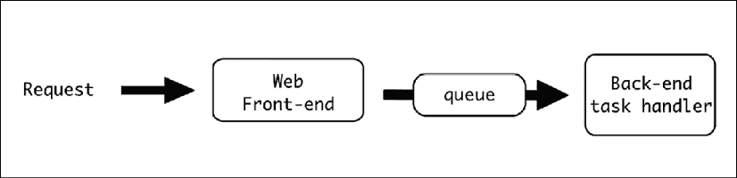
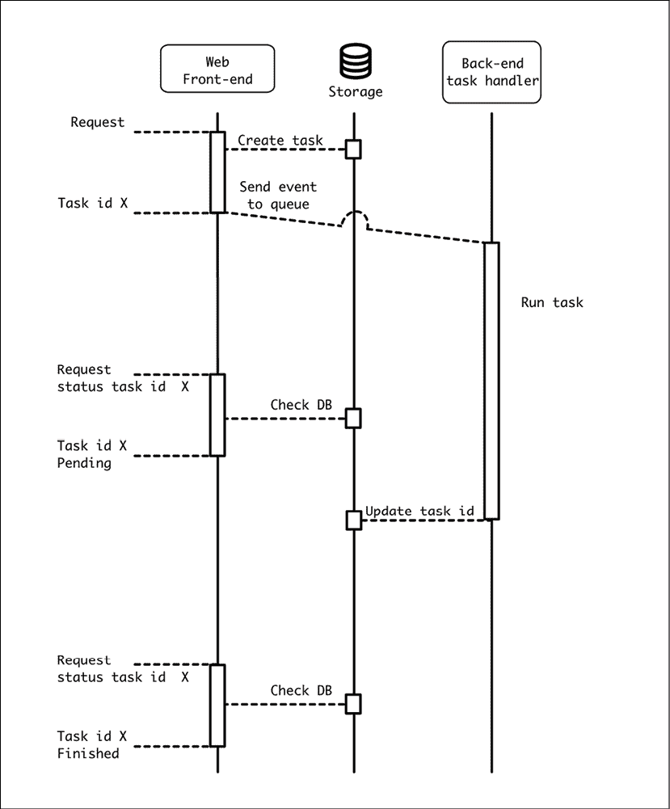
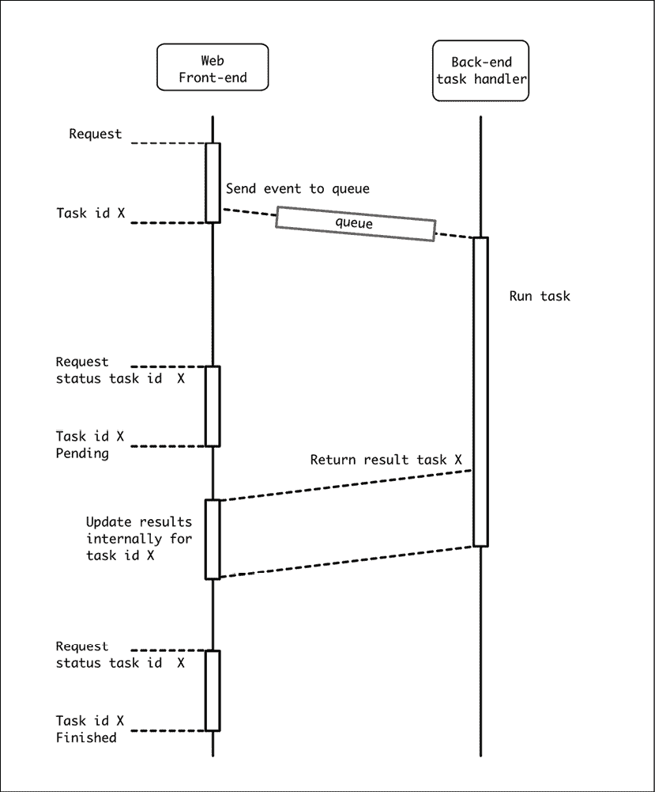
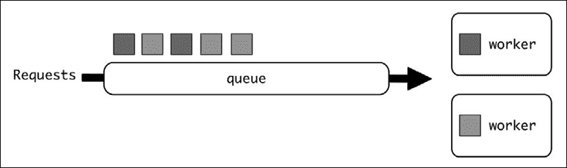
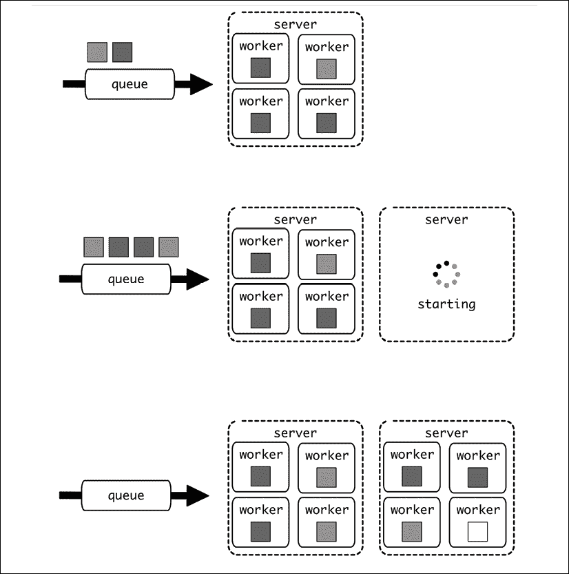
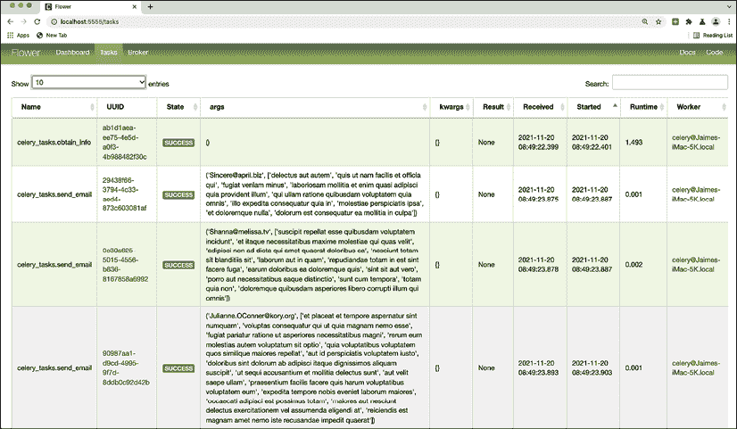
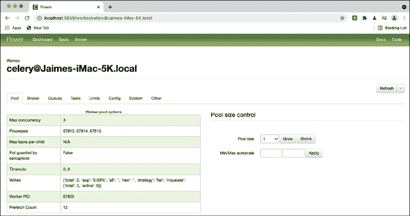

# 第七章：事件驱动结构

请求-响应不是在系统中可以使用的唯一软件架构。也可以有不需要立即响应的请求。也许没有兴趣在响应，因为任务可以在调用者不需要等待的情况下完成，或者可能需要很长时间，而调用者不想等待。无论如何，从调用者的角度来看，有选择只是发送消息并继续进行。

这条消息被称为*事件*，这类系统有多种用途。在本章中，我们将介绍这一概念，并详细描述其中最流行的用途之一：创建在任务调用者不间断的情况下在后台执行的后台异步任务。

在本章中，我们将描述异步任务的基础，包括排队系统的细节以及如何生成自动计划的任务。

我们将以 Celery 为例，它是 Python 中一个具有多种功能的流行任务管理器。我们将展示如何执行常见任务的特定示例。我们还将探索 Celery Flower，这是一个创建 Web 界面的工具，用于监控和控制 Celery，并具有 HTTP API，允许您控制该界面，包括发送新任务以执行。

在本章中，我们将涵盖以下主题：

+   发送事件

+   异步任务

+   任务细分

+   计划任务

+   队列效应

+   Celery

让我们先描述事件驱动系统的基础。

# 发送事件

事件驱动结构基于“发射后不管”的原则。不是发送数据并等待另一部分返回响应，而是发送数据并继续执行。

这使得它与我们在上一章中看到的请求-响应架构有所不同。请求-响应过程将等待直到生成适当的响应。同时，更多代码的执行将停止，因为需要外部系统产生的新数据来继续。

在事件驱动系统中，没有响应数据，至少不是在相同的意义上。相反，将发送包含请求的事件，任务将继续进行。可以返回一些最小信息以确保事件可以被跟踪。

事件驱动系统可以使用请求-响应服务器实现。这并不意味着它们是纯请求-响应系统。例如，一个创建事件并返回事件 ID 的 RESTful API。任何工作尚未完成，唯一返回的细节是一个标识符，以便能够检查任何后续任务的状态。

这不是唯一的选择，因为这个事件 ID 可能是本地生成的，甚至可能根本不生成。

差别在于任务本身不会在同一时刻完成，因此从生成事件返回将非常快。一旦生成，事件将前往不同的系统，该系统将把它传输到目的地。

这个系统被称为*总线*，其工作原理是使消息在系统中流动。一个架构可以使用一个充当发送消息到系统中央位置的单个总线，或者可以使用多个总线。

通常，建议使用单个总线来通信所有系统。有多种工具允许我们实现多个逻辑分区，因此消息被路由到和从正确的目的地。

每个事件都将被插入到一个*队列*中。队列是一个逻辑 FIFO 系统，它将从入口点传输事件到定义的下一阶段。在那个点上，另一个模块将接收事件并处理它。

这个新系统正在监听队列，并提取所有接收到的事件以进行处理。这个工作员不能通过相同的通道直接与事件发送者通信，但它可以与其他元素交互，如共享数据库或公开的端点，甚至可以向队列发送更多事件以进一步处理结果。

队列两端的系统被称为*发布者*和*订阅者*。

多个订阅者可以管理同一个队列，并且他们会并行提取事件。多个发布者也可以将事件发布到同一个队列。队列的容量将由可以处理的事件数量来描述，并且应该提供足够的订阅者，以便队列能够快速处理。

可以作为总线的典型工具有 RabbitMQ、Redis 和 Apache Kafka。虽然可以使用工具“原样”使用，但有多种库可以帮助你使用这些工具以创建自己的处理发送消息的方式。

# 异步任务

一个简单的基于事件的系统允许你执行异步任务。

由基于事件的系统产生的事件描述了要执行的特殊任务。通常，每个任务都需要一些时间来执行，这使得它作为发布者代码流的一部分直接执行变得不切实际。

典型的例子是一个需要合理时间内响应用户的 Web 服务器。如果 HTTP 请求耗时过长，一些 HTTP 超时可能会产生错误，通常在超过一秒或两秒后响应并不是一个好的体验。

这些耗时操作可能包括将视频编码为不同的分辨率、使用复杂算法分析图像、向客户发送 1,000 封电子邮件、批量删除一百万个注册信息、将数据从外部数据库复制到本地数据库、生成报告或从多个来源提取数据。

解决方案是发送一个事件来处理这个任务，生成一个任务 ID，并立即返回任务 ID。事件将被发送到消息队列，然后将其传递到后端系统。后端系统将执行任务，该任务可能需要执行很长时间。

同时，可以使用任务 ID 来监控执行进度。后端任务将在共享存储中，如数据库中，更新执行状态，因此当它完成时，Web 前端可以通知用户。这个共享存储还可以存储任何可能有趣的结果。



图 7.1：事件流程

因为任务状态存储在一个前端 Web 服务器可以访问的数据库中，用户可以通过任务 ID 在任何时候请求任务的状态。



图 7.2：使用共享存储检查异步任务的进度

后端系统如果需要，可以产生中间更新，显示任务完成 25%或 50%的时间。这将需要存储在相同的共享存储中。

虽然这个过程是一种简化，但队列通常能够返回任务是否已完成。只有在任务需要返回一些数据时，才需要共享存储/数据库。对于小结果，数据库运行良好，但如果任务生成了像文档这样的大元素，这可能不是一个有效的选项，可能需要不同类型的存储。

例如，如果任务是要生成一个报告，后端会将其存储在文档存储中，如 AWS S3，以便用户稍后可以下载。

共享数据库不是确保 Web 服务器前端能够接收信息的唯一方式。Web 服务器可以公开一个内部 API，允许后端发送回信息。这在所有效果上等同于将数据发送到不同的外部服务。后端需要访问 API，配置它，并可能需要进行认证。API 可以专门为后端创建，也可以是一个通用 API，它也接受后端系统将产生的特定数据。

在两个不同的系统之间共享数据库的访问可能很困难，因为数据库需要同步才能满足两个系统。我们需要将系统分离，以便它们可以独立部署，而不会破坏向后兼容性。任何对模式的更改都需要额外的注意，以确保系统在任何时候都能正常运行，不会中断。公开一个 API 并保持数据库完全受前端服务的控制是一个好方法，但请注意，来自后端的请求将与外部请求竞争，因此我们需要足够的容量来满足两者。

在这种情况下，所有信息、任务 ID、状态和结果都可以保留在 Web 服务器内部存储中。

记住，队列可能会存储任务 ID 和任务状态。为了方便，这些信息可能在内部存储中进行了复制。



图 7.3：将信息发送回源服务

记住，这个 API 不必指向同一个前端。它也可以调用任何其他服务，无论是内部还是外部，从而在元素之间生成复杂的流程。它甚至创建自己的事件，这些事件将被重新引入队列以产生其他任务。

# 任务细分

从初始任务生成更多任务是完全可能的。这是通过在任务内部创建正确的事件并将其发送到正确的队列来完成的。

这允许单个任务分配其负载并并行化其操作。例如，如果一个任务生成报告并通过电子邮件发送给一组收件人，该任务可以先生成报告，然后通过创建仅专注于创建电子邮件和附加报告的新任务来并行发送电子邮件。

这将负载分散到多个工作者上，加快了处理速度。另一个优点是，单个任务将更短，这使得它们更容易控制、监控和操作。

一些任务管理器可能允许创建工作流，其中任务被分配，并且它们的结果被返回和合并。在某些情况下可以使用此功能，但在实践中，它不如最初看起来那么有用，因为它引入了额外的等待时间，我们最终可能会发现任务花费了更长的时间。

但容易获得的成功是批量任务，在多个元素上执行类似操作，而不需要合并结果，这在实践中相当常见。

然而，请注意，这将使初始任务快速完成，使得初始任务的 ID 状态检查整个操作是否完成不是一个好方法。如果需要监控，初始任务可能会返回新任务的 ID。

如果需要，可以重复此过程，子任务创建自己的子任务。某些任务可能需要在后台创建大量信息，因此细分它们可能是有意义的，但这也将增加跟踪代码流程的复杂性，因此请谨慎使用此技术，并且仅在它创造明显优势时使用。

# 计划任务

异步任务不需要由前端直接生成，也不需要用户的直接操作，但也可以设置为在特定时间运行，通过一个计划。

一些计划任务的例子包括在夜间生成每日报告、每小时通过外部 API 更新信息、预先缓存值以便稍后快速可用、在周初生成下周的日程表，以及每小时发送提醒电子邮件。

大多数任务队列都允许生成计划任务，并在其定义中明确指出，因此它们将自动触发。

我们将在本章后面看到如何为 Celery 生成计划任务。

一些计划任务可能相当大，例如每晚向数千个收件人发送电子邮件。将计划任务分解是非常有用的，这样就可以触发一个小型的计划任务，仅用于将所有单个任务添加到稍后处理的队列中。这分散了负载，并允许任务更早完成，充分利用系统。

在发送电子邮件的例子中，每晚都会触发一个单独的任务，读取配置并为每个找到的电子邮件创建一个新任务。然后，新任务将接收电子邮件，通过从外部信息中提取来编写正文，并发送它。

# 队列效应

异步任务的一个重要元素是引入队列可能产生的影响。正如我们所见，后台任务运行缓慢，这意味着运行它们的任何工人都会忙一段时间。

同时，可以引入更多任务，这可能导致队列开始积累。



图 7.4：单个队列

一方面，这可能是一个容量问题。如果工人的数量不足以处理队列中引入的平均任务数，队列将积累到其极限，新的任务将被拒绝。

但通常，负载不会像恒定的任务流入那样工作。相反，有时没有任务要执行，而其他时候，任务的数量会突然增加，填满队列。此外，还需要计算正确的工人数量，以确保在所有工人忙碌时任务延迟的等待期不会造成问题。

计算正确的工人数量可能很困难，但通过一些尝试和错误，可以得到一个“足够好”的数量。有一个数学工具可以处理它，即排队论，它基于几个参数进行计算。

在任何情况下，如今每个工人的资源都很便宜，不需要精确生成工人的数量，只要足够接近，以便任何可能的峰值都能在合理的时间内处理。

你可以在[`people.brunel.ac.uk/~mastjjb/jeb/or/queue.html`](http://people.brunel.ac.uk/~mastjjb/jeb/or/queue.html)了解更多关于排队论的信息。

另一个额外的困难，正如我们通过计划任务所看到的，是在特定时间，可能同时触发大量任务。这可能在特定时间饱和队列，可能需要一个小时来处理所有任务，例如，创建每日报告，每 4 小时在外部 API 中摄取新更新，或汇总一周的数据。

这意味着，例如，如果添加了 100 个创建背景报告的任务，它们将阻塞一个由用户发送的报告生成任务，这将产生不良体验。如果用户在预定任务启动后几分钟内请求报告，他们不得不等待很长时间。

一种可能的解决方案是使用多个队列，不同的工人从它们中提取任务。


自动生成的描述](img/B17580_07_05.png)

图 7.5：优先级和背景队列

这使得不同的任务被分配到不同的工人，使得为某些任务预留容量以不间断运行成为可能。在我们的例子中，背景报告可以分配到它们自己的专用工人，用户报告也有自己的工人。然而，这会浪费容量。如果背景报告每天只运行一次，一旦 100 个任务被处理，工人将在剩余的时间里空闲，即使用户报告服务的工人队列很长。

而是采用混合方法。


自动生成的描述](img/B17580_07_06.png)

图 7.6：普通工人从多个队列中提取任务

在这种情况下，用户报告的工人将继续使用相同的方法，但背景报告的工人将同时从两个队列中提取任务。在这种情况下，我们限制背景报告的容量，但同时，当有可用容量时，我们增加用户报告任务的容量。

我们为用户报告任务预留容量，这些任务是优先的，并让其他工人从所有可用的任务中提取，包括优先和非优先任务。

为了能够将这些任务分配到这两个队列，需要对任务进行仔细划分：

+   *优先任务*。代表用户启动。它们对时间敏感。执行速度快，因此延迟很重要。

+   *后台任务*。通常由自动化系统和计划任务启动。它们对时间不太敏感。可以长时间运行，因此更高的延迟更容易接受。

两者之间的平衡应该保持。如果太多任务被标记为优先级，队列将很快被填满，变得毫无意义。

总是会有创建多个队列以设置不同优先级并为每个队列预留容量的诱惑。这通常不是一个好主意，因为它们会浪费容量。最有效率的系统是单队列系统，因为所有容量都将始终被使用。然而，也存在优先级问题，因为它使得某些任务耗时过长。超过两个队列会过于复杂，并可能导致许多工人大部分时间空闲，而其他队列却满载。两个队列的简单性有助于培养在两种选项之间做出决定的纪律，并使人们容易理解为什么我们想要多个队列。

根据峰值数量和频率以及预期的周转时间，可以调整优先级工人的数量。只要这些峰值是可预测的，就只需要足够的优先级工人来覆盖在后台任务大峰值期间的正常流量。

良好的指标对于监控和理解队列的行为至关重要。我们将在*第十三章*，*指标*中更多地讨论指标。

另一种方法是基于特定的优先级（如数字）生成优先级系统。这样，优先级为 3 的任务将在优先级为 2 的任务之前执行，然后是优先级为 1 的任务，依此类推。拥有优先级的巨大优势是工人可以一直工作，而不会浪费任何容量。

但这种方法也有一些问题：

+   许多队列后端不支持其高效执行。为了按优先级对队列进行排序，所需的成本远高于仅将任务分配到普通队列。在实践中，可能不会产生你预期的那么好的结果，可能需要许多调整和修改。

+   这意味着你需要处理优先级膨胀。随着时间的推移，团队开始增加任务的优先级很容易，尤其是如果涉及多个团队。关于哪个任务应该首先返回的决定可能会变得复杂，随着时间的推移，压力可能会使优先级数字增加。

虽然看起来排序队列是理想的，但两个级别（优先级和背景）的简单性使得理解系统非常容易，并在开发和创建新任务时产生简单的期望。它更容易调整和理解，并且可以以更少的努力产生更好的结果。

## 所有工人的单一代码

当有不同工人从不同的队列中提取时，工人可能有不同的代码库，一个处理优先级任务，另一个处理背景任务。

注意，为了使这可行，需要严格分离任务。关于这一点，我们稍后会详细讨论。

这通常是不建议的，因为它将区分代码库，并需要并行维护两个代码库，存在一些问题：

+   一些任务或任务部分可能是优先级或背景，这取决于触发它们的系统或用户。例如，报告可以是即时为用户生成，也可以作为批量处理的一部分每天生成，最终通过邮件发送。报告生成应保持通用，以便任何更改都应用于两者。

+   处理两个代码库而不是一个会更不方便。大部分通用代码是共享的，因此更新需要独立运行。

+   一个独特的代码库可以处理所有类型的任务。这使得有可能有一个工人可以处理优先级和背景任务。两个代码库将需要严格的任务分离，不使用背景工人中可用的额外容量来帮助处理优先级任务。

在构建时使用单个工人数更好，并通过配置决定从单个队列或两个队列接收消息。这简化了本地开发和测试的架构。

当任务性质可能产生冲突时，这可能是不够的。例如，如果一些任务需要大依赖项或专用硬件（例如某些与人工智能相关的任务），这可能需要特定任务在专用工人数上运行，使得它们共享相同的代码库变得不切实际。这些情况很少见，除非遇到，否则最好尝试合并并使用相同的工人数处理所有任务。

## 云队列和工人数

云计算的主要特点是服务可以动态启动和停止，使我们能够仅使用特定时刻所需的资源。这使得系统可以快速增加和减少容量。

在云环境中，可能需要修改从队列中提取事件的工人数。这缓解了我们上面讨论的资源问题。我们是否有满队列？按需增加工人数！理想情况下，我们甚至可以为每个触发任务的每个事件生成一个单独的工人数，从而使系统无限可扩展。

显然，说起来容易做起来难，因为尝试动态创建现场工人数有一些问题：

+   启动时间可能会给任务的执行增加显著的时间，甚至可能比任务的执行时间还要长。根据创建工人数的重量，启动它可能需要相当长的时间。

    在传统的云设置中，启动新的虚拟服务器所需的最小粒度相对较重，至少需要几分钟。使用较新的工具，如容器，这可以合理地加快速度，但基本原理将保持不变，因为最终某个时间点将需要生成新的虚拟服务器。

+   单个新的虚拟工人数可能对单个工人数来说太大，为每个任务生成一个可能效率低下。再次强调，容器化解决方案可以通过简化创建新容器和需要启动云服务中的新虚拟服务器之间的区别来帮助解决这个问题。

+   任何云服务都应该有限制。每个新创建的工人数都会产生费用，如果没有控制地扩展，云服务可能会变得非常昂贵。如果没有对成本方面的某些控制，这可能会因为高昂且意外的费用而成为一个问题。通常这种情况可能是意外发生的，由于系统中的某些问题导致工人数激增，但还有一种名为“现金溢出”的安全攻击，旨在使服务尽可能昂贵地运行，迫使服务所有者停止服务甚至破产。

由于这些问题，通常解决方案需要以批量方式工作，以便有额外的空间增长，并且仅在需要减少队列时才生成额外的虚拟服务器。同样，当不再需要额外容量时，它将被移除。

在停止之前，应特别注意确保位于同一虚拟服务器中的所有工作者都是空闲的。这是通过优雅地停止服务器来完成的，这样它们就会完成任何剩余的任务，不会启动新的任务，并在一切完成后结束。

该过程应类似于以下内容：



图 7.7：启动新服务器

确切知道何时应该启动新服务器很大程度上取决于对延迟、流量和新服务器创建速度（如果服务器启动快速，可能可以减少扩展的积极性）的要求。

一个好的起点是在队列中有与单个服务器中工作者数量相等或更多的任务时创建一个新服务器。这将触发一个新服务器，它将能够处理这些任务。如果触发创建的任务少于这个数量，它将创建一个不太满的服务器。如果启动时间非常长，可以将这个数量减少，以确保在新服务器启动之前不会形成显著的队列。但这将需要针对特定系统进行实验和测试。

# Celery

Celery 是在 Python 中创建的最受欢迎的任务队列。它允许我们轻松创建新任务，并可以处理触发新任务的事件的创建。

Celery 需要设置一个*代理*，它将被用作队列来处理消息。

在 Celery 术语中，代理是消息队列，而*后端*则用于与存储系统交互以返回信息。

创建消息的代码将把它添加到代理，代理会将它传递给连接的工人之一。当所有事情都通过 Python 代码发生，并且可以安装`celery`包时，操作很简单。我们将在稍后看到如何在其他情况下操作它。

Celery 可以使用多个系统作为代理。最流行的是 Redis 和 RabbitMQ。

在我们的示例中，我们将使用 Redis，因为它可以用作代理和后端，并且在云系统中广泛可用。它也非常可扩展，并且容易处理大量负载。

使用后端是可选的，因为任务不需要定义返回值，并且异步任务通常不会直接返回响应数据，除了任务的状态。这里的关键词是“直接”；有时，一个任务将生成一个外部结果，可以访问，但不是通过 Celery 系统。

这些值的示例包括可以存储在其他存储设施中的报告、在任务处理过程中发送的电子邮件以及预缓存值，其中没有直接的结果，但生成了新的数据并存储在其他地方。

返回值也需要足够小，以便可以存储在作为后端工作的系统中。此外，如果使用强持久性，建议使用数据库作为后端。

我们将使用 GitHub 上的示例：[`github.com/PacktPublishing/Python-Architecture-Patterns/tree/main/chapter_07_event_driven/celery_example`](https://github.com/PacktPublishing/Python-Architecture-Patterns/tree/main/chapter_07_event_driven/celery_example)。我们将使用这个示例创建一个任务，从外部 API 检索某些用户的待办`TO DO`操作，并生成一封提醒邮件。

记得通过运行`pip install -r requirements.txt`来安装所需的依赖项。

让我们看看代码。

## 配置 Celery

代码分为两个文件：`celery_tasks.py`，它描述了任务，以及`start_task.py`，它连接到队列并将任务入队。

在每个开始之前，我们需要配置要使用的代理。在这种情况下，我们将使用运行在`localhost`上的 Redis 服务器：

```py
from celery import Celery

app = Celery('tasks', broker='redis://localhost') 
```

作为先决条件，我们需要设置一个运行在我们预期的`localhost`地址上的 Redis 服务器。如果你已经安装了 Docker，这样做的一个简单方法就是启动一个容器：

```py
$ docker run -d -p 6379:6379 redis 
```

这将启动一个标准的 Redis 容器，该容器将在标准端口 6379 上公开服务。这将自动与之前的代理 URL `redis://localhost`连接。

这就是所需的全部配置，它将允许双方，即发布者和订阅者，连接到队列。

## Celery 工作进程

我们将使用[`jsonplaceholder.typicode.com/`](https://jsonplaceholder.typicode.com/)来模拟调用外部 API。这个测试网站提供了一个可访问的 REST 端点来检索一些模拟信息。你可以看到它们的定义，但基本上，我们将访问`/todos`和`/users`端点。`/todos`端点暴露了用户存储的操作，因此我们将查询它们以检索待办事项，并将其与`/users`端点中的信息结合起来。

`celery_tasks.py`工作进程定义了一个主要任务`obtain_info`和一个次要任务`send_email`。第一个从 API 中提取信息并决定需要发送哪些电子邮件。第二个然后发送电子邮件。

发送电子邮件只是模拟，以避免使系统复杂化并需要处理模拟电子邮件地址。它留作读者的练习。

文件从队列配置和导入开始：

```py
from celery import Celery

import requests

from collections import defaultdict

app = Celery('tasks', broker='redis://localhost')

logger = app.log.get_default_logger()

BASE_URL = 'https://jsonplaceholder.typicode.com' 
```

`logger`定义允许使用原生 Celery 日志，这些日志将被流式传输到 Celery 配置中用于日志。默认情况下，这是标准输出。

让我们看看`obtain_info`任务。注意定义函数为 Celery 任务的`@app.task`：

```py
@app.task

def obtain_info():

    logger.info('Stating task')

    users = {}

    task_reminders = defaultdict(list)

    # Call the /todos endpoint to retrieve all the tasks

    response = requests.get(f'{BASE_URL}/todos')

    for task in response.json():

        # Skip completed tasks

        if task['completed'] is True:

            continue

        # Retrieve user info. The info is cached to only ask

        # once per user

        user_id = task['userId']

        if user_id not in users:

            users[user_id] = obtain_user_info(user_id)

        info = users[user_id]

        # Append the task information to task_reminders, that

        # aggregates them per user

        task_data = (info, task)

        task_reminders[user_id].append(task_data)

    # The data is ready to process, create an email per

    # each user

    for user_id, reminders in task_reminders.items():

        compose_email(reminders)

    logger.info('End task') 
```

我们用`INFO`日志包装函数，为任务执行提供上下文。首先，它在这一行调用`/todos`端点，然后独立地遍历每个任务，跳过任何已完成的任务。

```py
 response = requests.get(f'{BASE_URL}/todos')

    for task in response.json():

        if task['completed'] is True:

            continue 
```

然后，它检查用户的信息并将其放入`info`变量中。因为这项信息可以在同一个循环中多次使用，所以它被缓存在`users`字典中。一旦信息被缓存，就不再需要再次请求：

```py
 user_id = task['userId']

        if user_id not in users:

            users[user_id] = obtain_user_info(user_id)

        info = users[user_id] 
```

将单个任务数据添加到创建以存储用户所有任务的列表中。`task_reminders`字典被创建为一个`defaultdict(list)`，这意味着当首次访问特定的`user_id`时，如果它不存在，它将被初始化为一个空列表，允许新元素被附加。

```py
 task_data = (info, task)

        task_reminders[user_id].append(task_data) 
```

最后，`task_reminders`中存储的元素被迭代以组成最终的电子邮件：

```py
 for user_id, reminders in task_reminders.items():

        compose_email(reminders) 
```

调用了两个后续函数：`obtain_user_info`和`compose_email`。

`obtain_user_info`直接从`/users/{user_id}`端点检索信息并返回它：

```py
def obtain_user_info(user_id):

    logger.info(f'Retrieving info for user {user_id}')

    response = requests.get(f'{BASE_URL}/users/{user_id}')

    data = response.json()

    logger.info(f'Info for user {user_id} retrieved')

    return data 
```

`compose_email`从任务列表中获取信息，包括一组`user_info, task_info`，提取每个`task_info`的标题信息，然后是匹配的`user_info`中的电子邮件，然后调用`send_email`任务：

```py
def compose_email(remainders):

    # remainders is a list of (user_info, task_info)

    # Retrieve all the titles from each task_info

    titles = [task['title'] for _, task in remainders]

    # Obtain the user_info from the first element

    # The user_info is repeated and the same on each element

    user_info, _ = remainders[0]

    email = user_info['email']

    # Start the task send_email with the proper info

    send_email.delay(email, titles) 
```

如您所见，`send_email`任务包括一个`.delay`调用，它将此任务与适当的参数入队。`send_email`是另一个 Celery 任务。它非常简单，因为我们只是在模拟电子邮件投递。它只是记录其参数：

```py
@app.task

def send_email(email, remainders):

    logger.info(f'Send an email to {email}')

    logger.info(f'Reminders {remainders}') 
```

## 触发任务

`start_task.py`脚本包含触发任务的全部代码。这是一个简单的脚本，它从另一个文件导入任务。

```py
from celery_tasks import obtain_info

obtain_info.delay() 
```

注意，它在导入时继承了`celery_tasks.py`的所有配置。

重要的是，它通过`.delay()`调用任务。这会将任务发送到队列，以便 worker 可以将其拉出并执行。

注意，如果您直接使用`obtain_info()`调用任务，您将直接执行代码，而不是将任务提交到队列。

现在我们来看看这两个文件是如何交互的。

## 连接点

为了能够设置这两部分，即发布者和消费者，首先以调用方式启动 worker：

```py
$ celery -A celery_tasks worker --loglevel=INFO -c 3 
```

**注意**：一些使用的模块，例如 Celery，可能不与 Windows 系统兼容。更多信息可以在[`docs.celeryproject.org/en/stable/faq.html#does-celery-support-windows`](https://docs.celeryproject.org/en/stable/faq.html#does-celery-support-windows)找到。

这通过`-A`参数启动了`celery_tasks`模块（`celery_tasks.py`文件）。它将日志级别设置为`INFO`，并使用`-c 3`参数启动三个 worker。它将显示一个类似于这样的启动日志：

```py
$ celery -A celery_tasks worker --loglevel=INFO -c 3

   v5.1.1 (sun-harmonics)

macOS-10.15.7-x86_64-i386-64bit 2021-06-22 20:14:09

[config]

.> app:         tasks:0x110b45760

.> transport:   redis://localhost:6379//

.> results:     disabled://

.> concurrency: 3 (prefork)

.> task events: OFF (enable -E to monitor tasks in this worker)

[queues]

.> celery           exchange=celery(direct) key=celery

[tasks]

  . celery_tasks.obtain_info

  . celery_tasks.send_email

[2021-06-22 20:14:09,613: INFO/MainProcess] Connected to redis://localhost:6379//

[2021-06-22 20:14:09,628: INFO/MainProcess] mingle: searching for neighbors

[2021-06-22 20:14:10,666: INFO/MainProcess] mingle: all alone 
```

注意，它显示了两个可用的任务，`obtain_info`和`send_email`。在另一个窗口中，我们可以通过调用`start_task.py`脚本来发送任务：

```py
$ python3 start_task.py 
```

这将在 Celery 工作者中触发任务，生成日志（为了清晰和简洁进行了编辑）。我们将在下一段落中解释日志。

```py
[2021-06-22 20:30:52,627: INFO/MainProcess] Task celery_tasks.obtain_info[5f6c9441-9dda-40df-b456-91100a92d42c] received

[2021-06-22 20:30:52,632: INFO/ForkPoolWorker-2] Stating task

[2021-06-22 20:30:52,899: INFO/ForkPoolWorker-2] Retrieving info for user 1

...

[2021-06-22 20:30:54,128: INFO/MainProcess] Task celery_tasks.send_email[08b9ed75-0f33-48f8-8b55-1f917cfdeae8] received

[2021-06-22 20:30:54,133: INFO/MainProcess] Task celery_tasks.send_email[d1f6c6a0-a416-4565-b085-6b0a180cad37] received

[2021-06-22 20:30:54,132: INFO/ForkPoolWorker-1] Send an email to Sincere@april.biz

[2021-06-22 20:30:54,134: INFO/ForkPoolWorker-1] Reminders ['delectus aut autem', 'quis ut nam facilis et officia qui', 'fugiat veniam minus', 'laboriosam mollitia et enim quasi adipisci quia provident illum', 'qui ullam ratione quibusdam voluptatem quia omnis', 'illo expedita consequatur quia in', 'molestiae perspiciatis ipsa', 'et doloremque nulla', 'dolorum est consequatur ea mollitia in culpa']

[2021-06-22 20:30:54,135: INFO/ForkPoolWorker-1] Task celery_tasks.send_email[08b9ed75-0f33-48f8-8b55-1f917cfdeae8] succeeded in 0.004046451000021989s: None

[2021-06-22 20:30:54,137: INFO/ForkPoolWorker-3] Send an email to Shanna@melissa.tv

[2021-06-22 20:30:54,181: INFO/ForkPoolWorker-2] Task celery_tasks.obtain_info[5f6c9441-9dda-40df-b456-91100a92d42c] succeeded in 1.5507660419999638s: None

...

[2021-06-22 20:30:54,141: INFO/ForkPoolWorker-3] Task celery_tasks.send_email[d1f6c6a0-a416-4565-b085-6b0a180cad37] succeeded in 0.004405897999959052s: None

[2021-06-22 20:30:54,192: INFO/ForkPoolWorker-2] Task celery_tasks.send_email[aff6dfc9-3e9d-4c2d-9aa0-9f91f2b35f87] succeeded in 0.0012900159999844618s: None 
```

因为我们启动了三个不同的工作者，日志是交织在一起的。请注意第一个任务，它对应于`obtain_info`。这个任务在我们的执行中是在工作者`ForkPoolWorker-2`中执行的。

```py
[2021-06-22 20:30:52,627: INFO/MainProcess] Task celery_tasks.obtain_info[5f6c9441-9dda-40df-b456-91100a92d42c] received

[2021-06-22 20:30:52,632: INFO/ForkPoolWorker-2] Stating task

[2021-06-22 20:30:52,899: INFO/ForkPoolWorker-2] Retrieving info for user 1

...

[2021-06-22 20:30:54,181: INFO/ForkPoolWorker-2] Task celery_tasks.obtain_info[5f6c9441-9dda-40df-b456-91100a92d42c] succeeded in 1.5507660419999638s: None 
```

当这个任务正在执行时，其他工作者也在将`send_email`任务入队并执行。

例如：

```py
[2021-06-22 20:30:54,133: INFO/MainProcess] Task celery_tasks.send_email[d1f6c6a0-a416-4565-b085-6b0a180cad37] received

[2021-06-22 20:30:54,132: INFO/ForkPoolWorker-1] Send an email to Sincere@april.biz

[2021-06-22 20:30:54,134: INFO/ForkPoolWorker-1] Reminders ['delectus aut autem', 'quis ut nam facilis et officia qui', 'fugiat veniam minus', 'laboriosam mollitia et enim quasi adipisci quia provident illum', 'qui ullam ratione quibusdam voluptatem quia omnis', 'illo expedita consequatur quia in', 'molestiae perspiciatis ipsa', 'et doloremque nulla', 'dolorum est consequatur ea mollitia in culpa']

[2021-06-22 20:30:54,135: INFO/ForkPoolWorker-1] Task celery_tasks.send_email[08b9ed75-0f33-48f8-8b55-1f917cfdeae8] succeeded in 0.004046451000021989s: None 
```

执行结束时，有一个日志显示了所花费的时间，以秒为单位。

如果只有一个工作者参与，任务将依次运行，这使得区分任务变得更容易。

我们可以看到`send_email`任务在`obtain_info`任务结束之前就开始了，并且在`obtain_info`任务结束后仍然有`send_email`任务在运行，这显示了任务是如何独立运行的。

## 计划任务

在 Celery 内部，我们也可以生成具有特定计划的任务，这样它们可以在适当的时间自动触发。

要这样做，我们需要定义一个任务和一个计划。我们在`celery_scheduled_tasks.py`文件中定义了它们。让我们看看：

```py
from celery import Celery

from celery.schedules import crontab

app = Celery('tasks', broker='redis://localhost')

logger = app.log.get_default_logger()

@app.task

def scheduled_task(timing):

    logger.info(f'Scheduled task executed {timing}')

app.conf.beat_schedule = {

    # Executes every 15 seconds

    'every-15-seconds': {

        'task': 'celery_scheduled_tasks.scheduled_task',

        'schedule': 15,

        'args': ('every 15 seconds',),

    },

    # Executes following crontab

    'every-2-minutes': {

        'task': 'celery_scheduled_tasks.scheduled_task',

        'schedule': crontab(minute='*/2'),

        'args': ('crontab every 2 minutes',),

    },

} 
```

此文件以与上一个示例相同的配置开始，我们定义了一个小型、简单的任务，它只显示执行时的情况。

```py
@app.task

def scheduled_task(timing):

    logger.info(f'Scheduled task executed {timing}') 
```

有趣的部分在后面，因为计划是在`app.conf.beat_schedule`参数中配置的。我们创建了两个条目。

```py
app.conf.beat_schedule = {

    # Executes every 15 seconds

    'every-15-seconds': {

        'task': 'celery_scheduled_tasks.scheduled_task',

        'schedule': 15,

        'args': ('every 15 seconds',),

    }, 
```

第一个定义了每 15 秒执行一次正确任务的执行。任务需要包含模块名（`celery_scheduled_tasks`）。`schedule`参数以秒为单位定义。`args`参数包含传递给执行的任何参数。请注意，它被定义为参数的列表。在这种情况下，我们创建了一个只有一个条目的元组，因为只有一个参数。

第二个条目将计划定义为 Crontab 条目。

```py
 # Executes following crontab

    'every-2-minutes': {

        'task': 'celery_scheduled_tasks.scheduled_task',

        'schedule': crontab(minute='*/2'),

        'args': ('crontab every 2 minutes',),

    }, 
```

这个`crontab`对象，作为`schedule`参数传递，每两分钟执行一次任务。Crontab 条目非常灵活，允许执行广泛的可能操作。

以下是一些示例：

| Crontab entry | 描述 |
| --- | --- |
| `crontab()` | 每分钟执行，最低的分辨率 |
| `crontab(minute=0)` | 每小时在 0 分钟执行 |
| `crontab(minute=15)` | 每小时在 15 分钟执行 |
| `crontab(hour=0, minute=0)` | 每天在午夜执行（在你的时区） |
| `crontab(hour=6, minute=30, day_of_week='monday')` | 每周一在 6:30 执行 |
| `crontab(hour='*/8', minute=0)` | 每小时执行，且小时数是 8 的倍数（0, 8, 16）。每天三次，每次在 0 分钟 |
| `crontab(day_of_month=1, hour=0, minute=0)` | 在每月的第一天午夜执行 |
| `crontab(minute='*/2')` | 每分钟执行，且分钟数是 2 的倍数。每两分钟执行一次 |

有更多选项，包括将时间与太阳时间相关联，如黎明和黄昏，或自定义调度器，但大多数用例将每 X 秒执行一次或使用 crontab 定义将完全适用。

您可以在此处查看完整文档：[`docs.celeryproject.org/en/stable/userguide/periodic-tasks.html#starting-the-scheduler`](https://docs.celeryproject.org/en/stable/userguide/periodic-tasks.html#starting-the-scheduler).

要启动调度器，我们需要启动一个特定的工人，即 `beat` 工人：

```py
$ celery -A celery_scheduled_tasks beat

celery beat v4.4.7 (cliffs) is starting.

__    -    ... __   -        _

LocalTime -> 2021-06-28 13:53:23

Configuration ->

    . broker -> redis://localhost:6379//

    . loader -> celery.loaders.app.AppLoader

    . scheduler -> celery.beat.PersistentScheduler

    . db -> celerybeat-schedule

    . logfile -> [stderr]@%WARNING

    . maxinterval -> 5.00 minutes (300s) 
```

我们以通常的方式启动 `celery_scheduled_tasks` 工人。

```py
$ celery -A celery_scheduled_tasks worker --loglevel=INFO -c 3 
```

但您可以看到仍然没有传入的任务。我们需要启动 `celery beat`，这是一个特定的工人，它将任务插入队列：

```py
$ celery -A celery_scheduled_tasks beat

celery beat v4.4.7 (cliffs) is starting.

__    -    ... __   -        _

LocalTime -> 2021-06-28 15:13:06

Configuration ->

    . broker -> redis://localhost:6379//

    . loader -> celery.loaders.app.AppLoader

    . scheduler -> celery.beat.PersistentScheduler

    . db -> celerybeat-schedule

    . logfile -> [stderr]@%WARNING

    . maxinterval -> 5.00 minutes (300s) 
```

一旦 `celery beat` 启动，您将开始看到任务按预期进行调度和执行：

```py
[2021-06-28 15:13:06,504: INFO/MainProcess] Received task: celery_scheduled_tasks.scheduled_task[42ed6155-4978-4c39-b307-852561fdafa8]

[2021-06-28 15:13:06,509: INFO/MainProcess] Received task: celery_scheduled_tasks.scheduled_task[517d38b0-f276-4c42-9738-80ca844b8e77]

[2021-06-28 15:13:06,510: INFO/ForkPoolWorker-2] Scheduled task executed every 15 seconds

[2021-06-28 15:13:06,510: INFO/ForkPoolWorker-1] Scheduled task executed crontab every 2 minutes

[2021-06-28 15:13:06,511: INFO/ForkPoolWorker-2] Task celery_scheduled_tasks.scheduled_task[42ed6155-4978-4c39-b307-852561fdafa8] succeeded in 0.0016690909999965697s: None

[2021-06-28 15:13:06,512: INFO/ForkPoolWorker-1] Task celery_scheduled_tasks.scheduled_task[517d38b0-f276-4c42-9738-80ca844b8e77] succeeded in 0.0014504210000154671s: None

[2021-06-28 15:13:21,486: INFO/MainProcess] Received task: celery_scheduled_tasks.scheduled_task[4d77b138-283c-44c8-a8ce-9183cf0480a7]

[2021-06-28 15:13:21,488: INFO/ForkPoolWorker-2] Scheduled task executed every 15 seconds

[2021-06-28 15:13:21,489: INFO/ForkPoolWorker-2] Task celery_scheduled_tasks.scheduled_task[4d77b138-283c-44c8-a8ce-9183cf0480a7] succeeded in 0.0005252540000242334s: None

[2021-06-28 15:13:36,486: INFO/MainProcess] Received task: celery_scheduled_tasks.scheduled_task[2eb2ee30-2bcd-45af-8ee2-437868be22e4]

[2021-06-28 15:13:36,489: INFO/ForkPoolWorker-2] Scheduled task executed every 15 seconds

[2021-06-28 15:13:36,489: INFO/ForkPoolWorker-2] Task celery_scheduled_tasks.scheduled_task[2eb2ee30-2bcd-45af-8ee2-437868be22e4] succeeded in 0.000493534999975509s: None

[2021-06-28 15:13:51,486: INFO/MainProcess] Received task: celery_scheduled_tasks.scheduled_task[c7c0616c-857a-4f7b-ae7a-dd967f9498fb]

[2021-06-28 15:13:51,488: INFO/ForkPoolWorker-2] Scheduled task executed every 15 seconds

[2021-06-28 15:13:51,489: INFO/ForkPoolWorker-2] Task celery_scheduled_tasks.scheduled_task[c7c0616c-857a-4f7b-ae7a-dd967f9498fb] succeeded in 0.0004461000000333115s: None

[2021-06-28 15:14:00,004: INFO/MainProcess] Received task: celery_scheduled_tasks.scheduled_task[59f6a323-4d9f-4ac4-b831-39ca6b342296]

[2021-06-28 15:14:00,006: INFO/ForkPoolWorker-2] Scheduled task executed crontab every 2 minutes

[2021-06-28 15:14:00,006: INFO/ForkPoolWorker-2] Task celery_scheduled_tasks.scheduled_task[59f6a323-4d9f-4ac4-b831-39ca6b342296] succeeded in 0.0004902660000425385s: None 
```

您可以看到这两种类型的任务都按相应的方式进行了调度。在此日志中检查时间，您会发现它们相隔 15 秒：

```py
[2021-06-28 15:13:06,510: INFO/ForkPoolWorker-2] Scheduled task executed every 15 seconds

[2021-06-28 15:13:21,488: INFO/ForkPoolWorker-2] Scheduled task executed every 15 seconds

[2021-06-28 15:13:36,489: INFO/ForkPoolWorker-2] Scheduled task executed every 15 seconds

[2021-06-28 15:13:51,488: INFO/ForkPoolWorker-2] Scheduled task executed every 15 seconds 
```

另一个任务每 2 分钟正好执行一次。请注意，第一次执行可能并不完全精确。在这种情况下，调度是在 15:12 的稍后秒数触发的，并且仍然在之后执行。无论如何，它将位于 crontab 的 1 分钟分辨率窗口内。

```py
[2021-06-28 15:13:06,510: INFO/ForkPoolWorker-1] Scheduled task executed crontab every 2 minutes

[2021-06-28 15:14:00,006: INFO/ForkPoolWorker-2] Scheduled task executed crontab every 2 minutes 
```

在创建周期性任务时，请记住不同的优先级，正如我们在本章之前所描述的。

将周期性任务用作“心跳”以检查系统是否正常工作是一种良好的做法。此任务可以用来监控系统中的任务是否按预期流动，没有大的延迟或问题。

这导致了一种监控不同任务执行情况的方法，比仅仅检查日志要好得多。

## Celery Flower

如果您想了解已执行的任务并找到并修复问题，Celery 中的良好监控非常重要。为此，一个好的工具是 Flower，它通过添加一个实时监控网页来增强 Celery，允许您通过网页和 HTTP API 控制 Celery。

您可以在此处查看整个文档：[`flower.readthedocs.io/en/latest/`](https://flower.readthedocs.io/en/latest/).

它也非常容易设置并与 Celery 集成。首先，我们需要确保 `flower` 包已安装。在之前的步骤之后，该包包含在 `requirements.txt` 中，但如果它没有，您可以使用 `pip3` 独立安装它。

```py
$ pip3 install flower 
```

一旦安装，您可以使用以下命令启动 `flower`：

```py
$ celery --broker=redis://localhost flower -A celery_tasks  --port=5555

[I 210624 19:23:01 command:135] Visit me at http://localhost:5555

[I 210624 19:23:01 command:142] Broker: redis://localhost:6379//

[I 210624 19:23:01 command:143] Registered tasks:

    ['celery.accumulate',

     'celery.backend_cleanup',

     'celery.chain',

     'celery.chord',

     'celery.chord_unlock',

     'celery.chunks',

     'celery.group',

     'celery.map',

     'celery.starmap',

     'celery_tasks.obtain_info',

     'celery_tasks.send_email']

[I 210624 19:23:01 mixins:229] Connected to redis://localhost:6379// 
```

命令与启动 Celery 工人非常相似，但包括使用 Redis 定义的代理，正如我们之前所看到的，使用 `--broker=redis://localhost`，并指定要暴露的端口 `--port=5555`。

接口暴露在 `http://localhost:5555`。

![图形用户界面，应用程序]

自动生成的描述](img/B17580_07_08.png)

图 7.8：Celery Flower 界面

首页显示了系统中的不同工作者。请注意，它显示了活跃任务的数量以及已处理任务的数量。在这种情况下，我们有 11 个任务对应于`start_task.py`的一次完整运行。你可以转到**任务**标签页来查看每个执行任务的详细信息，如下所示：



图 7.9：任务页面

你可以看到有关输入参数、任务状态、任务名称以及运行了多长时间的信息。

每个 Celery 进程将独立显示，即使它能够运行多个工作者。你可以在**工作者**页面上检查其参数。查看**最大并发数**参数。



图 7.10：工作者页面

从这里，你还可以审查和更改每个 Celery 进程的工作者数量配置，设置速率限制等。

## Flower HTTP API

Flower 的一个很好的补充是 HTTP API，它允许我们通过 HTTP 调用来控制 Flower。这使系统能够自动控制，并允许我们通过 HTTP 请求直接触发任务。这可以用于用任何编程语言调用任务，大大增加了 Celery 的灵活性。

调用异步任务的 URL 如下：

```py
POST /api/task/async-apply/{task} 
```

它需要一个 POST 请求，并且调用参数应该包含在主体中。例如，使用`curl`进行调用：

```py
$ curl -X POST -d '{"args":["example@email.com",["msg1", "msg2"]]}' http://localhost:5555/api/task/async-apply/celery_tasks.send_email

{"task-id": "79258153-0bdf-4d67-882c-30405d9a36f0"} 
```

任务在工作者中执行：

```py
[2021-06-24 22:35:33,052: INFO/MainProcess] Received task: celery_tasks.send_email[79258153-0bdf-4d67-882c-30405d9a36f0]

[2021-06-24 22:35:33,054: INFO/ForkPoolWorker-2] Send an email to example@email.com

[2021-06-24 22:35:33,055: INFO/ForkPoolWorker-2] Reminders ['msg1', 'msg2']

[2021-06-24 22:35:33,056: INFO/ForkPoolWorker-2] Task celery_tasks.send_email[79258153-0bdf-4d67-882c-30405d9a36f0] succeeded in 0.0021811629999999305s: None 
```

使用相同的 API，可以通过 GET 请求检索任务的状态：

```py
GET /api/task/info/{task_id} 
```

例如：

```py
$ curl  http://localhost:5555/api/task/info/79258153-0bdf-4d67-882c-30405d9a36f0

{"uuid": "79258153-0bdf-4d67-882c-30405d9a36f0", "name": "celery_tasks.send_email", "state": "SUCCESS", "received": 1624571191.674537, "sent": null, "started": 1624571191.676534, "rejected": null, "succeeded": 1624571191.679662, "failed": null, "retried": null, "revoked": null, "args": "['example@email.com', ['msg1', 'msg2']]", "kwargs": "{}", "eta": null, "expires": null, "retries": 0, "worker": "celery@Jaimes-iMac-5K.local", "result": "None", "exception": null, "timestamp": 1624571191.679662, "runtime": 0.0007789200000161145, "traceback": null, "exchange": null, "routing_key": null, "clock": 807, "client": null, "root": "79258153-0bdf-4d67-882c-30405d9a36f0", "root_id": "79258153-0bdf-4d67-882c-30405d9a36f0", "parent": null, "parent_id": null, "children": []} 
```

注意`state`参数，在这里它显示任务已成功完成，但如果尚未完成，它将返回`PENDING`。

这可以用来轮询任务的完成状态，直到它完成或显示错误，正如我们在本章前面所描述的。

# 摘要

在本章中，我们看到了事件驱动结构是什么。我们从关于如何使用事件来创建不同于传统请求-响应结构的不同流程的一般讨论开始。我们讨论了事件如何被引入队列以传输到其他系统。我们引入了发布者和订阅者的概念，以从该队列中引入或提取事件。

我们描述了如何使用这种结构来处理异步任务：在后台运行并允许界面的其他元素快速响应的任务。我们描述了如何通过利用多个可以执行这些较小任务的订阅者来增加吞吐量，将异步任务划分为更小的任务。我们还描述了如何在特定时间自动添加任务，以允许定期执行预定的任务。

由于任务的引入可能会有很大的变化，我们讨论了一些关于队列如何工作的重要细节，我们可能遇到的不同问题以及处理它们的策略。我们讨论了在大多数情况下，一个简单的背景队列和优先队列的策略是如何工作的，并警告不要过度复杂化。我们还解释了，在同样的精神下，最好在所有工作者之间保持代码同步，即使在队列可能不同的情况下。我们还简要提到了云计算在异步工作者中的应用能力。

我们解释了如何使用流行的任务管理器 Celery 来创建异步任务。我们涵盖了设置不同元素的过程，包括后端代理、如何定义合适的工作者以及如何从不同的服务生成任务。我们还包含了一个关于如何在 Celery 中创建计划任务的章节。

我们介绍了 Celery Flower，它是 Celery 的一个补充，包括一个网页界面，通过它可以监控和控制 Celery。它还包含一个 HTTP API，允许我们通过发送 HTTP 请求来创建任务，使得任何编程语言都可以与我们的 Celery 系统交互。
