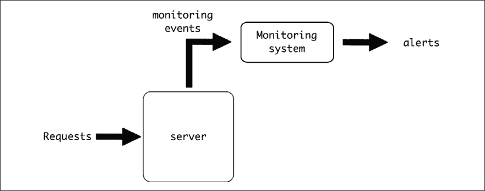
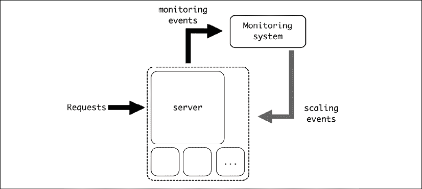
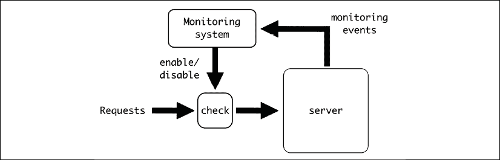
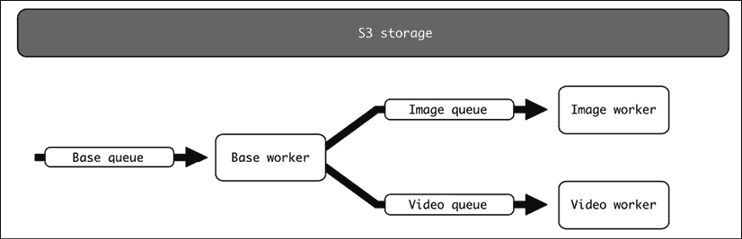
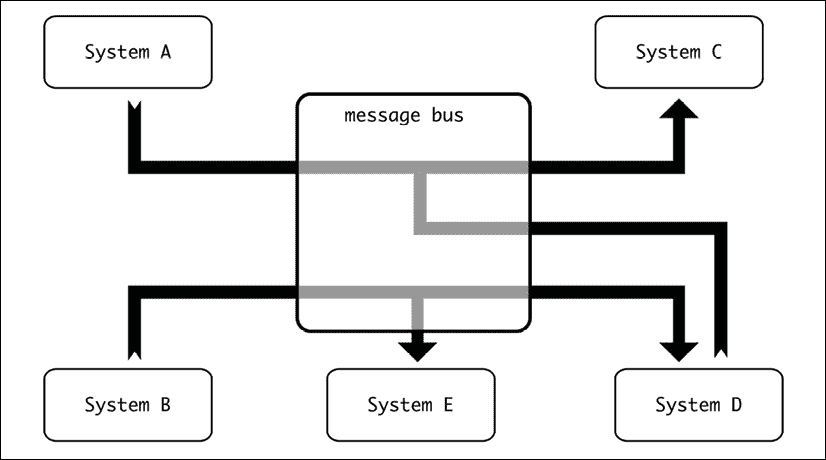
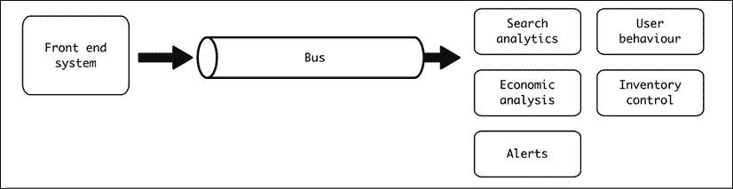
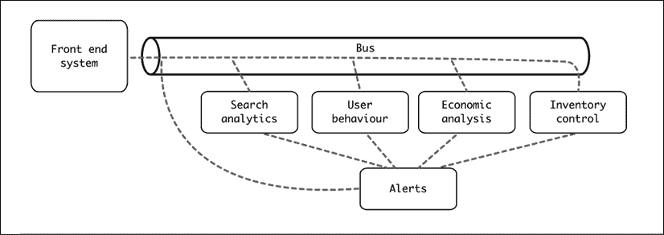

# 8

# 高级事件驱动结构

正如我们在上一章中看到的，事件驱动架构非常灵活，能够创建复杂的场景。在本章中，我们将探讨可能的、覆盖更高级用例的事件驱动结构，以及如何处理它们的复杂性。

我们将看到一些常见应用，如日志和指标，如何被视为事件驱动系统，并使用它们生成将反馈到产生事件的系统的控制系统。

我们还将通过示例讨论如何创建复杂的管道，其中产生不同的事件，系统进行协调。我们还将转向更一般的概述，引入总线作为连接所有事件驱动组件的概念。

我们将介绍一些关于更复杂系统的一般想法，以描述这类大型事件驱动系统可能产生的挑战，例如需要使用 CQRS 技术检索跨越多个模块的信息。最后，我们将给出一些关于如何测试系统的注意事项，注意测试的不同级别。

在本章中，我们将涵盖以下主题：

+   流式事件

+   管道

+   定义总线

+   更复杂的系统

+   测试事件驱动系统

我们将首先描述事件流。

# 流式事件

在某些情况下，仅产生捕获信息并存储以供以后访问的事件可能是有益的。这种结构对于监控来说很典型，例如，每次发生错误时我们都会创建一个事件。这个事件将包含有关错误生成位置、调试细节以便理解等信息。然后事件被发送，应用程序继续从错误中恢复。

这也可以应用于代码的特定部分。例如，为了捕获对数据库的访问时间，可以捕获计时和相关数据（如特定查询）并作为事件发送。

所有这些事件都应该被编译到一个位置，以便可以查询和聚合。

虽然通常不将其视为事件驱动过程，但日志和指标的工作方式基本上就是这样。在日志的情况下，事件通常是文本字符串，每当代码决定创建它们时就会触发。日志被转发到允许我们稍后搜索的目的地。

日志可以存储在不同的格式中。也常见的是以 JSON 格式创建它们，以便更好地搜索。

这类事件简单但非常强大，因为它允许我们发现程序在实时系统中的执行情况。

这种监控可能也被用来在满足某些条件时启用控制或警报。一个典型的例子是，如果日志捕获的错误数量超过某个阈值，就会向我们发出警报。



图 8.1：监控事件流程

这也可以用来产生反馈系统，其中监控系统中的仪表可以用来确定是否需要在系统本身中更改某些内容。例如，捕获指标以确定系统是否需要扩展或缩减规模，并根据请求数量或其他参数更改可用的服务器数量。



图 8.2：扩展事件的反馈

虽然这不是监控系统唯一的方法，但这种操作方法也可以用作检测配额的方式，例如，如果某个配额已超过，则短路处理传入的请求。



图 8.3：监控以检测配额并停止额外请求

这种结构与预先设置一个控制系统的模块的方法不同，而是依赖于仅在阈值被突破时采取行动，在后台进行计算。这可以减少预先需要的处理量。

例如，对于一个每分钟最大请求数量的配额，过程可能如下伪代码所示：

```py
def process_request(request):

    # Search for the owner of the request

    owner = request.owner

    info = retrieve_owner_info_from_db(owner)

    if check_quota_info(info):

        return process_request(request)

    else:

        return 'Quota exceeded' 
```

`check_quota_info`在这两种情况下将有所不同。预先的方法需要维护和存储有关先前请求的信息：

```py
def check_quota_info(info):

    current_minute = get_current_minute()

 if current_minute != info.minute:

     # New minute, start the quota

     info.requests = 0

     info.minute = current_minute

 else:

     info.requests += 1

 # Update the information

 info.save()

 if info.requests > info.quota:

     # Quota exceeded

     return False

 # Quota still valid

 return False 
```

如果验证是在一个外部系统中完成的，基于生成的事件，`check_quota_info`不需要存储信息，而是只需检查配额是否已超过：

```py
def check_quota_info(info): 

    # Generate the proper event for a new event

    generate_event('request', info.owner)

 if info.quota_exceeded:

     return False

 # Quota still valid

 return False 
```

整个检查都是在后端监控系统完成的，基于生成的事件，然后存储在信息中。这将从检查本身中分离出是否应用配额的逻辑，从而降低延迟。但另一方面，配额超过的检测可能会延迟，允许某些请求即使根据配额不应该被处理也能被处理。

理想情况下，生成的事件应该已经用于监控接收到的请求。这个操作非常有用，因为它重用了为其他用途生成的事件，减少了收集额外数据的需求。

同时，检查可以更复杂，并且不需要在每次收到新请求时都进行。例如，对于每小时配额，如果每秒收到多个请求，可能每分钟检查一次就足够确保遵守配额。与每次收到请求时检查条件相比，这可以节省大量的处理能力。

当然，这高度依赖于不同系统中涉及的具体规模、特性和请求。对于某些系统，预先的方法可能更好，因为它更容易实现，且不需要监控系统。在实施之前，始终要验证选项是否适合您的系统。

我们将在第十二章“日志”和第十三章“指标”中更详细地讨论日志和指标。

# 管道

事件流不必局限于单个系统。系统的接收端可以产生自己的事件，指向其他系统。事件将级联到多个系统，生成一个过程。

这与之前提出的情况类似，但在这个情况下，它是一个更有目的性的过程，旨在创建特定的数据管道，其中系统之间的流动被触发和处理。

这的一个可能例子是一个将视频缩放到不同大小和格式的系统。当视频被上传到系统中时，它需要转换成多个版本以用于不同的情况。还应创建一个缩略图来显示视频播放前的第一帧。

我们将分三步进行。首先，一个队列将接收事件以开始处理。这将触发两个不同队列中的两个事件，分别独立处理缩放和缩略图生成。这将形成我们的管道。

由于输入和输出数据是视频和图像，我们需要外部存储来存储它们。我们将使用 AWS S3，或者更确切地说，是 S3 的模拟。

AWS S3 是亚马逊在云中提供的一种对象存储服务，因其易于使用和非常稳定而非常受欢迎。我们将使用 S3 的模拟，这将允许我们启动一个类似 S3 的本地服务，这将简化我们的示例。

这是系统的概要图：



图 8.4：视频和图像队列

要开始，我们需要将源视频上传到模拟 S3 并启动任务。我们还需要一种方式来检查结果。为此，将提供两个脚本。

代码可在 GitHub 上找到：[`github.com/PacktPublishing/Python-Architecture-Patterns/tree/main/chapter_08_advanced_event_driven`](https://github.com/PacktPublishing/Python-Architecture-Patterns/tree/main/chapter_08_advanced_event_driven)。

让我们从设置配置开始。

## 准备

如上所述，我们有两个关键前提条件：一个队列后端和模拟的 S3 存储。

对于队列后端，我们再次使用 Redis。Redis 很容易配置多个队列，我们稍后会看到。为了启动 Redis 队列，我们再次使用 Docker 来下载和运行官方镜像：

```py
$ docker run -d -p 6379:6379 redis 
```

这启动了一个在标准端口`6379`上暴露的 Redis 容器。注意，`-d`选项将使容器在后台运行。

对于模拟 S3 服务，我们将采用相同的方法，启动一个容器来启动 S3 Mock，这是一个复制 S3 API 的系统，但文件是本地存储的。这让我们避免了设置真实的 S3 实例，这涉及到获取 AWS 账户，支付我们的使用费用等等。

S3 Mock 是一个在无需使用真实 S3 连接的情况下进行 S3 存储开发测试的绝佳选项。我们将在后面看到如何使用标准模块连接到模拟。完整文档可以在 [`github.com/adobe/S3Mock`](https://github.com/adobe/S3Mock) 找到。

要启动 S3 Mock，我们还将使用 Docker：

```py
$ docker run -d -p 9090:9090 -t adobe/s3mock 
```

容器在端口 `9090` 上公开端点。我们将把 S3 请求指向这个本地端口。我们将使用 `videos` 存储桶来存储所有数据。

我们将定义三个不同的 Celery 工作者，它们将执行三个不同的任务：基本任务、图像任务和视频任务。每个任务都将从不同的队列中拉取事件。

这种为不同工作者指定特定任务的做法是故意为之，用于解释目的。在这个例子中，可能没有很好的理由来区分这一点，因为所有任务都可以在同一个工作者中运行，并且新事件可以重新引入到同一个队列中，正如我们在上一章中看到的，这是推荐的。然而，有时可能会有其他条件需要改变方法。

例如，一些任务可能需要特定的硬件进行 AI 处理，使用更多的 RAM 或 CPU 功率，这使得所有工作者都相等变得不切实际，或者有其他需要分离工作者的原因。不过，确保有充分的理由进行分割。这将使系统的操作和性能复杂化。

我们还将使用一些第三方库。这包括我们在上一章中看到的 Celery，还包括其他库，如 `boto3`、`click` 和 `MoviePy`。所有必需的库都在 `requirements.txt` 文件中，可以使用以下命令安装：

```py
$ pip3 install -r requirements.txt 
```

让我们从过程的第一个阶段开始，这是将重定向到其他两个阶段的基本任务。

## 基本任务

主要任务将接收包含图像的路径。然后，它将为视频尺寸调整和缩略图提取创建两个任务。

这是 `base_tasks.py` 的代码：

```py
from celery import Celery

app = Celery(broker='redis://localhost/0')

images_app = Celery(broker='redis://localhost/1')

videos_app = Celery(broker='redis://localhost/2')

logger = app.log.get_default_logger()

@app.task

def process_file(path):

    logger.info('Stating task')

    logger.info('The file is a video, needs to extract thumbnail and '

                'create resized version')

    videos_app.send_task('video_tasks.process_video', [path])

    images_app.send_task('image_tasks.process_video', [path])

    logger.info('End task') 
```

注意，我们在这里创建了三个不同的队列：

```py
app = Celery(broker='redis://localhost/0')

images_app = Celery(broker='redis://localhost/1')

videos_app = Celery(broker='redis://localhost/2') 
```

Redis 允许我们通过整数引用轻松创建不同的数据库。因此，我们为基本队列创建数据库 `0`，为图像队列创建数据库 `1`，为视频队列创建数据库 `2`。

我们使用 `.send_task` 函数在这些队列中生成事件。请注意，在每一个队列中我们发送适当的任务。我们将路径作为参数包含在内。

注意，所有任务的参数都定义在 `.send_task` 的第二个参数中。这要求参数是一个参数列表。在这种情况下，我们只有一个需要描述为 `[path]` 列表的单一参数。

当任务被触发时，它将排队下一个任务。让我们看看图像任务。

## 图像任务

为了生成视频的缩略图，我们需要两个第三方模块的帮助：

+   *boto3*。这个常用的库帮助我们连接到 AWS 服务。特别是，我们将使用它来下载和上传到我们自己的模拟 S3 服务。

你可以在[`boto3.amazonaws.com/v1/documentation/api/latest/index.html`](https://boto3.amazonaws.com/v1/documentation/api/latest/index.html)查看整个`boto3`文档。它可以用来控制所有 AWS API。

+   *MoviePy*。这是一个用于处理视频的库。我们将使用这个库将第一帧提取为独立的文件。

完整的`MoviePy`文档可在[`zulko.github.io/moviepy/`](https://zulko.github.io/moviepy/)找到。

之前章节中描述的`requirements.txt`文件和 GitHub 仓库中都包含了这两个库。让我们看看`image_tasks.py`：

```py
from celery import Celery

import boto3

import moviepy.editor as mp

import tempfile

MOCK_S3 = 'http://localhost:9090/'

BUCKET = 'videos'

videos_app = Celery(broker='redis://localhost/1')

logger = videos_app.log.get_default_logger()

@videos_app.task

def process_video(path):

    logger.info(f'Stating process video {path} for image thumbnail')

    client = boto3.client('s3', endpoint_url=MOCK_S3)

    # Download the file to a temp file

    with tempfile.NamedTemporaryFile(suffix='.mp4') as tmp_file:

        client.download_fileobj(BUCKET, path, tmp_file)

        # Extract first frame with moviepy

        video = mp.VideoFileClip(tmp_file.name)

        with tempfile.NamedTemporaryFile(suffix='.png') as output_file:

            video.save_frame(output_file.name)

            client.upload_fileobj(output_file, BUCKET, path + '.png')

    logger.info('Finish image thumbnails') 
```

注意，我们使用正确的数据库定义了 Celery 应用程序。然后我们描述任务。让我们将其分为不同的步骤。我们首先将`path`中定义的源文件下载到临时文件中：

```py
client = boto3.client('s3', endpoint_url=MOCK_S3)

# Download the file to a temp file

with tempfile.NamedTemporaryFile(suffix='.mp4') as tmp_file:

    client.download_fileobj(BUCKET, path, tmp_file) 
```

注意，我们定义了连接到`MOCK_S3`的端点，这是我们的 S3 模拟容器，如我们之前所述，暴露在`http://localhost:9090/`。

紧接着，我们生成一个临时文件来存储下载的视频。我们定义临时文件的后缀为`.mp4`，这样稍后`VideoPy`可以正确地检测到临时文件是一个视频。

注意，接下来的步骤都在定义临时文件的`with`块内部。如果它在这个块外部定义，文件就会被关闭并且不可用。

下一步是将文件加载到`MoviePy`中，然后提取第一帧到另一个临时文件中。这个第二个临时文件的后缀为`.png`，以标识它是一个图像：

```py
video = mp.VideoFileClip(tmp_file.name)

with tempfile.NamedTemporaryFile(suffix='.png') as output_file:

    video.save_frame(output_file.name) 
```

最后，文件被上传到 S3 模拟，在原始名称的末尾添加`.png`：

```py
client.upload_fileobj(output_file, BUCKET, path + '.png') 
```

再次注意缩进，以确保在各个阶段临时文件都是可用的。

调整视频大小的任务遵循类似的模式。让我们看看。

## 视频任务

视频 Celery 工作进程从视频队列中提取并执行与图像任务类似的步骤：

```py
from celery import Celery

import boto3

import moviepy.editor as mp

import tempfile

MOCK_S3 = 'http://localhost:9090/'

BUCKET = 'videos'

SIZE = 720

videos_app = Celery(broker='redis://localhost/2')

logger = videos_app.log.get_default_logger()

@videos_app.task

def process_video(path):

    logger.info(f'Starting process video {path} for image resize')

    client = boto3.client('s3', endpoint_url=MOCK_S3)

    # Download the file to a temp file

    with tempfile.NamedTemporaryFile(suffix='.mp4') as tmp_file:

        client.download_fileobj(BUCKET, path, tmp_file)

        # Resize with moviepy

        video = mp.VideoFileClip(tmp_file.name)

        video_resized = video.resize(height=SIZE)

        with tempfile.NamedTemporaryFile(suffix='.mp4') as output_file:

            video_resized.write_videofile(output_file.name)

            client.upload_fileobj(output_file, BUCKET, path + f'x{SIZE}.mp4')

    logger.info('Finish video resize') 
```

与图像任务唯一的区别是将视频调整到 720 像素的高度并上传结果：

```py
# Resize with moviepy

video = mp.VideoFileClip(tmp_file.name)

video_resized = video.resize(height=SIZE)

with tempfile.NamedTemporaryFile(suffix='.mp4') as output_file:

     video_resized.write_videofile(output_file.name) 
```

但总体流程非常相似。注意它从不同的 Redis 数据库中提取，对应于视频队列。

## 连接任务

为了测试系统，我们需要启动所有不同的元素。每个元素都在不同的终端中启动，这样我们可以看到它们的不同的日志：

```py
 $ celery -A base_tasks worker --loglevel=INFO

    $ celery -A video_tasks worker --loglevel=INFO

    $ celery -A image_tasks worker --loglevel=INFO 
```

要开始这个过程，我们需要一个要处理的视频在系统中。

找到好的免费视频的一个可能性是使用[`www.pexels.com/`](https://www.pexels.com/)，它有免费的股票内容。在我们的示例运行中，我们将下载 URL 为[`www.pexels.com/video/waves-rushing-and-splashing-to-the-shore-1409899/`](https://www.pexels.com/video/waves-rushing-and-splashing-to-the-shore-1409899/)的 4K 视频。

我们将使用以下脚本将视频上传到 S3 Mock 存储并启动任务：

```py
import click

import boto3

from celery import Celery

celery_app = Celery(broker='redis://localhost/0')

   MOCK_S3 = 'http://localhost:9090/'

BUCKET = 'videos'

SOURCE_VIDEO_PATH = '/source_video.mp4'

@click.command()

@click.argument('video_to_upload')

def main(video_to_upload):

# Note the credentials are required by boto3, but we are using

# a mock S3 that doesn't require them, so they can be fake

    client = boto3.client('s3', endpoint_url=MOCK_S3,

                          aws_access_key_id='FAKE_ACCESS_ID',

                          aws_secret_access_key='FAKE_ACCESS_KEY')

    # Create bucket if not set

    client.create_bucket(Bucket=BUCKET)

    # Upload the file

    client.upload_file(video_to_upload, BUCKET, SOURCE_VIDEO_PATH)

    # Trigger the

    celery_app.send_task('base_tasks.process_file', [SOURCE_VIDEO_PATH])

if __name__ == '__main__':

    main() 
```

脚本的开始部分描述了 Celery 队列，即基础队列，它将是管道的起点。我们定义了与配置相关的几个值，正如我们在前面的任务中所看到的。唯一的增加是 `SOURCE_VIDEO_PATH`，它将在 S3 Mock 中托管视频。

在此脚本中，我们使用相同的名称上传所有文件，如果脚本再次运行，则会覆盖它。如果您觉得这样做更有意义，请随意更改。

我们使用 `click` 库生成一个简单的 **命令行界面**（**CLI**）。以下行生成一个简单的界面，要求输入要上传的视频名称作为函数的参数。

```py
@click.command()

@click.argument('video_to_upload')

def main(video_to_upload):

           …. 
```

`click` 是一个快速生成 CLIs 的绝佳选项。您可以在其文档中了解更多信息：[`click.palletsprojects.com/`](https://click.palletsprojects.com/)。

主函数的内容只是连接到我们的 S3 Mock，如果尚未设置，则创建存储桶，将文件上传到 `SOURCE_VIDEO_PATH`，然后将任务发送到队列以启动进程：

```py
 client = boto3.client('s3', endpoint_url=MOCK_S3)

    # Create bucket if not set

    client.create_bucket(Bucket=BUCKET)

    # Upload the file

    client.upload_file(video_to_upload, BUCKET, SOURCE_VIDEO_PATH)

    # Trigger the

    celery_app.send_task('base_tasks.process_file', [SOURCE_VIDEO_PATH]) 
```

让我们运行它并查看结果。

## 运行任务

在添加视频名称后，您可以运行此脚本。请记住，`requirements.txt` 中的所有库都需要安装：

```py
$ python3 upload_video_and_start.py source_video.mp4 
```

将文件上传到 S3 Mock 需要一些时间。一旦调用，首先响应的是基础工作者。这个工作者将创建两个新的任务：

```py
[2021-07-08 20:37:57,219: INFO/MainProcess] Received task: base_tasks.process_file[8410980a-d443-4408-8f17-48e89f935325]

[2021-07-08 20:37:57,309: INFO/ForkPoolWorker-2] Stating task

[2021-07-08 20:37:57,660: INFO/ForkPoolWorker-2] The file is a video, needs to extract thumbnail and create resized version

[2021-07-08 20:37:58,163: INFO/ForkPoolWorker-2] End task

[2021-07-08 20:37:58,163: INFO/ForkPoolWorker-2] Task base_tasks.process_file[8410980a-d443-4408-8f17-48e89f935325] succeeded in 0.8547832089971052s: None 
```

另外两个将在不久后开始。图像工作者将显示新的日志，开始创建图像缩略图：

```py
[2021-07-08 20:37:58,251: INFO/MainProcess] Received task: image_tasks.process_video[5960846f-f385-45ba-9f78-c8c5b6c37987]

[2021-07-08 20:37:58,532: INFO/ForkPoolWorker-2] Stating process video /source_video.mp4 for image thumbnail

[2021-07-08 20:38:41,055: INFO/ForkPoolWorker-2] Finish image thumbnails

[2021-07-08 20:38:41,182: INFO/ForkPoolWorker-2] Task image_tasks.process_video[5960846f-f385-45ba-9f78-c8c5b6c37987] succeeded in 42.650344008012326s: None 
```

视频工作者需要更长的时间，因为它需要调整视频大小：

```py
[2021-07-08 20:37:57,813: INFO/MainProcess] Received task: video_tasks.process_video[34085562-08d6-4b50-ac2c-73e991dbb58a]

[2021-07-08 20:37:57,982: INFO/ForkPoolWorker-2] Starting process video /source_video.mp4 for image resize

[2021-07-08 20:38:15,384: WARNING/ForkPoolWorker-2] Moviepy - Building video /var/folders/yx/k970yrd11hb4lmrq4rg5brq80000gn/T/tmp0deg6k8e.mp4.

[2021-07-08 20:38:15,385: WARNING/ForkPoolWorker-2] Moviepy - Writing video /var/folders/yx/k970yrd11hb4lmrq4rg5brq80000gn/T/tmp0deg6k8e.mp4

[2021-07-08 20:38:15,429: WARNING/ForkPoolWorker-2] t:   0%|          | 0/528 [00:00<?, ?it/s, now=None]

[2021-07-08 20:38:16,816: WARNING/ForkPoolWorker-2] t:   0%|          | 2/528 [00:01<06:04,  1.44it/s, now=None]

[2021-07-08 20:38:17,021: WARNING/ForkPoolWorker-2] t:   1%|          | 3/528 [00:01<04:17,  2.04it/s, now=None]

...

[2021-07-08 20:39:49,400: WARNING/ForkPoolWorker-2] t:  99%|#########9| 524/528 [01:33<00:00,  6.29it/s, now=None]

[2021-07-08 20:39:49,570: WARNING/ForkPoolWorker-2] t:  99%|#########9| 525/528 [01:34<00:00,  6.16it/s, now=None]

[2021-07-08 20:39:49,874: WARNING/ForkPoolWorker-2] t: 100%|#########9| 527/528 [01:34<00:00,  6.36it/s, now=None]

[2021-07-08 20:39:50,027: WARNING/ForkPoolWorker-2] t: 100%|##########| 528/528 [01:34<00:00,  6.42it/s, now=None]

[2021-07-08 20:39:50,723: WARNING/ForkPoolWorker-2] Moviepy - Done !

[2021-07-08 20:39:50,723: WARNING/ForkPoolWorker-2] Moviepy - video ready /var/folders/yx/k970yrd11hb4lmrq4rg5brq80000gn/T/tmp0deg6k8e.mp4

[2021-07-08 20:39:51,170: INFO/ForkPoolWorker-2] Finish video resize

[2021-07-08 20:39:51,171: INFO/ForkPoolWorker-2] Task video_tasks.process_video[34085562-08d6-4b50-ac2c-73e991dbb58a] succeeded in 113.18933968200872s: None 
```

要检索结果，我们将使用 `check_results.py` 脚本，该脚本下载 S3 Mock 存储的内容：

```py
import boto3

MOCK_S3 = 'http://localhost:9090/'

BUCKET = 'videos'

client = boto3.client('s3', endpoint_url=MOCK_S3)

for path in client.list_objects(Bucket=BUCKET)['Contents']:

    print(f'file {path["Key"]:25} size {path["Size"]}')

    filename = path['Key'][1:]

    client.download_file(BUCKET, path['Key'], filename) 
```

通过运行它，我们将文件下载到本地目录：

```py
$ python3 check_results.py

file /source_video.mp4         size 56807332

file /source_video.mp4.png     size 6939007

file /source_video.mp4x720.mp4 size 8525077 
```

您可以检查生成的文件并确认它们已正确生成。请注意，`source_video.mp4` 将与您的输入视频相同。

此示例演示了如何设置一个相对复杂的管道，其中不同的队列和工作者在协调一致的方式下触发。请注意，虽然我们直接使用 Celery 将任务发送到队列，但我们也可以使用 Celery Flower 和 HTTP 请求来完成此操作。

# 定义总线

当我们讨论队列后端系统时，这还没有真正扩展到总线的概念。术语 *总线* 来自于在硬件系统不同组件之间传输数据的硬件总线。这使得它们成为系统的一个中心、多源和多目的地的部分。

软件总线是对这个概念的推广，它允许我们互联多个逻辑组件。

从本质上讲，总线是一种专门用于数据传输的组件。与直接通过网络连接到服务而无需任何中间组件的常规替代方案相比，这是一种有序的通信。

由于总线负责数据传输，这意味着发送者除了要知道要传输的消息和发送到的队列之外，不需要了解太多。总线本身将传输到目的地或目的地。

总线的概念与消息代理的概念密切相关。然而，消息代理通常具有比纯总线更多的能力，例如在途中转换消息和使用多个协议。消息代理可以非常复杂，允许大量定制和服务解耦。一般来说，大多数支持使用总线的工具都会被标记为消息代理，尽管有些比其他更强大。

虽然我们将使用“总线”这个术语，但其中一些能力将更紧密地与诸如路由消息等功能相关联，这些功能可能需要被视为消息代理的工具。分析您特定用例的要求，并使用能够满足这些要求的工具。

然后，总线将被定义为所有与事件相关的通信都将指向的中心点。这简化了配置，因为事件可以路由到正确的目的地，而无需不同的端点。



图 8.5：消息总线

然而，在内部，总线将包含不同的逻辑分区，允许正确路由消息。这些就是队列。

如果总线允许，路由可能会变得复杂，这里就是这种情况。

在我们之前的例子中，我们使用了 Redis 作为总线。尽管连接 URL 略有不同，但它可以被重构以使其更清晰：

```py
# Remember that database 0 is the base queue

BASE_BROKER = 'redis://localhost/0'

Base_app = Celery(broker=BROKER)

# Refactor for base

BROKER_ROOT = 'redis://localhost'

BROKER_BASE_QUEUE = 0

base_app = Celery(broker=f'{BASE_BROKER}/{BROKER_BASE_QUEUE}') 

# To address the image queue

BROKER_ROOT = 'redis://localhost'

BROKER_IMAGE_QUEUE = 1

image_app = Celery(broker=f'{BASE_BROKER}/{BROKER_IMAGE_QUEUE}') 
```

这个中心位置使得配置所有不同的服务变得容易，无论是将事件推送到队列还是从队列中拉取。

# 更复杂的系统

可以创建更复杂的系统，其中事件通过多个阶段，甚至设计为易于插件系统的同一队列。

这可以创建复杂的设置，其中数据通过复杂的管道流动，并由独立的模块处理。这类场景通常出现在旨在分析和处理大量数据以尝试检测模式和行为的仪器中。

想象一下，例如，一个为旅行社预订的系统。系统中发生了大量的搜索和预订请求，以及相关的购买，如租车、行李箱、食物等。每个动作都会产生一个常规响应（搜索、预订、购买等），但描述该动作的事件将被引入队列以在后台处理。不同的模块将根据不同的目标分析用户行为。

例如，以下模块可以添加到这个系统中：

+   按时间汇总经济结果，以获得服务随时间运行的全局视图。这可能包括每天的销售、收入、利润等细节。

+   分析普通用户的行为。跟踪用户以发现他们的模式。他们在预订前搜索什么？他们是否使用优惠？他们多久预订一次航班？他们的平均旅行时间有多长？是否有异常情况？

+   确保库存充足以供购买。根据系统中购买的物品，备货任何所需的元素。这还包括根据预先购买的食品安排足够的航班。

+   根据搜索收集关于首选目的地的信息。

+   对于可能导致安排更多飞机的满座航班等情况，触发警报。

这些模块基本上是关于不同的事情，并从不同的角度看待系统。有些更倾向于用户行为和营销，而有些则更与物流相关。根据系统的大小，可能需要确定模块需要不同的、专门的团队来独立处理每个模块。



图 8.6：前端系统到不同模块的总线

注意，每个系统可能都有自己的存储来允许它存储信息。这也可能导致创建自己的 API 来访问这些信息。

要查询信息，系统需要查询存储数据的模块的数据库。这可能是一个独立的服务，但很可能是同一系统的前端，因为它通常包含所有外部接口和权限处理。

这使得前端系统访问存储的信息成为必要，无论是直接访问数据库还是通过使用某些 API 来访问。前端系统应该模拟数据访问，正如我们在*第三章*，*数据建模*中看到的，并且很可能需要一个抽象复杂数据访问的模型定义。

相同的事件将被发送到总线上，然后不同的服务将接收它。为了能够这样做，你需要一个接受来自多个系统的订阅并给所有订阅系统传递相同消息的总线。

这种模式被称为*发布/订阅*或*pub/sub*。事件的消费者需要订阅*主题*，在 pub/sub 术语中，这相当于一个队列。大多数总线都接受这个系统，尽管可能需要一些工作来配置。

例如，有一个库允许 Celery 在这个系统下工作，可以在[`github.com/Mulugruntz/celery-pubsub`](https://github.com/Mulugruntz/celery-pubsub)找到。

注意，在这种情况下，工作者可以创建更多的事件来引入。例如，任何模块都将能够创建一个警报，警报系统将会被通知。例如，如果库存太低，它可能需要在同时下订单时发出快速警报，以确保快速采取行动。



图 8.7：注意模块和警报之间的通信也是通过总线进行的

复杂的事件驱动系统可以帮助您在不同组件之间分配工作。在这个例子中，您可以看到即时响应（预订航班）与后台的进一步详细分析（可用于长期规划）是完全独立的。如果所有组件都在请求服务时添加，可能会影响性能。后端组件可以在前端系统不受影响的情况下进行交换和升级。

要正确实现这类系统，事件需要使用一种易于适应和扩展的标准格式，以确保任何接收它的模块都能快速扫描并通过它，如果它不是必需的。

一个好主意是使用以下简单的 JSON 结构：

```py
{

  "type": string defining the event type,

  "data": subevent content

} 
```

例如，当产生搜索时，将创建如下事件：

```py
{

  "type": "SEARCH",

  "data": {

    "from": "Dublin",

    "to": "New York",

    "depart_date": 2021-12-31,

    "return_date": null,

    "user": null

  }

} 
```

`type`字段使得如果事件对任何模块没有兴趣，可以很容易地丢弃它。例如，`经济分析`模块将丢弃任何`SEARCH`事件。其他模块可能需要进一步处理。例如，`用户行为`模块将分析`SEARCH`事件，其中`data`中的`user`字段被设置。

请记住，对于事件驱动系统来说，一个重要元素是存储可能不是通用的。也许每个独立的模块都有自己的数据库。您需要使用我们在*第三章*，*数据建模*中讨论的 CQRS 技术来在这些模块中建模数据。本质上，您需要以不同的方式读取和保存新数据，因为写入新数据需要生成事件；并且您需要将它们建模为业务单元。更重要的是，模型在某些情况下可能需要合并来自多个模块的信息。例如，如果系统中有一个需要获取用户某些经济信息的查询，它需要查询`用户行为`模块和`经济分析`模块，同时将信息呈现为`EconomicInfoUser`的唯一模型。

当信息频繁访问时，在多个地方重复它可能是有意义的。这违反了单一责任原则（即每个功能应该是单个模块的唯一责任），但另一种选择是创建复杂的方法来获取常用信息。在设计系统时，要小心划分，以避免这些问题。

灵活的数据结构将允许生成新的事件，添加更多信息，并通过强制变化的向后兼容性，允许模块之间进行受控的更改。然后不同的团队可以并行工作，改进系统而不会过多地相互干扰。

但确保它们的行为正确可能很复杂，因为存在多个相互作用的部件。

# 测试事件驱动系统

事件驱动系统非常灵活，在特定情况下，在分离不同元素方面可以非常有用。但这种灵活性和分离性可能会使它们难以测试以确保一切按预期工作。

通常，单元测试是生成最快的测试，但事件驱动系统的独立性质使得它们在正确测试事件接收方面不太有用。当然，事件可以被模拟，接收事件的总体行为可以被测试。但问题是：我们如何确保事件已经被正确生成？并且是在正确的时间？

唯一的选择是使用集成测试来检查系统的行为。但这些测试的设计和运行成本更高。

总是会有关于命名测试的无限争论，比如单元测试与集成测试、系统测试、验收测试等究竟是什么。为了避免在这里陷入过于深入的讨论，因为这并不是本书的目标，我们将使用“单元测试”一词来描述只能在单个模块中运行的测试，而“集成测试”则指那些需要两个或更多模块相互交互才能成功的测试。单元测试将模拟任何依赖，但集成测试将实际调用依赖以确保模块之间的连接正确无误。

这两个级别在测试的每个测试的成本方面有显著差异。在相同的时间内可以编写和运行比集成测试多得多的单元测试。

例如，在我们的上一个例子中，为了测试购买食品是否正确触发警报，我们需要：

1.  生成一个购买食品项目的调用。

1.  产生适当的事件。

1.  在库存控制中处理事件。当前的库存应配置为低，这将产生一个警报事件。

1.  正确处理警报事件。

所有这些步骤都需要在三个不同的系统中进行配置（前端系统、库存控制模块和警报模块），以及设置总线以连接它们。理想情况下，这个测试将需要系统能够启动自动化系统来自动化测试。这要求每个涉及的模块都应该是可自动化的。

如我们所见，这在进行测试设置和运行方面是一个很高的标准，尽管它仍然值得去做。为了在集成测试和单元测试之间达到合理的平衡，我们应该增长它们并应用一些策略以确保我们对两者都有合理的覆盖率。

单元测试成本低廉，因此每个案例都应该通过单元测试进行健康覆盖，其中外部模块被模拟。这包括不同输入格式、不同配置、所有流程、错误等情况。好的单元测试应该从隔离的角度覆盖大多数可能性，模拟数据的输入和任何发送的事件。

例如，继续库存控制示例，许多单元测试可以通过更改输入请求来控制以下需求：

+   购买库存量高的元素。

+   购买库存量低的元素。这应该产生一个警报事件。

+   购买一个不存在的元素。这应该生成一个错误。

+   格式无效的事件。这应该生成一个错误。

+   购买库存量为零的元素。这应该生成一个警报事件。

+   更多案例，例如不同类型的购买、格式等。

相反，集成测试应该只有少数几个测试，主要覆盖“愉快路径”。*愉快路径*意味着正在发送并处理一个常规的代表性事件，但不会产生预期的错误。集成测试的目标是确认所有部分都连接并按预期工作。鉴于集成测试的运行和操作成本更高，应仅实现最重要的测试，并密切关注任何不值得维护且可以修剪的测试。

在上述关于集成测试的讨论中，我们描述了一个愉快的路径场景。事件触发库存中的处理程序并生成一个同样被处理的警报。对于集成测试来说，这比不生成警报更有利，因为它更能考验系统。

虽然这取决于系统，但单元测试与集成测试的比例应该严重偏向单元测试，有时高达 20 倍以上（意味着 1 个集成测试对应 20 个单元测试）。

# 摘要

在本章中，我们看到了更多的事件驱动系统，它们具有各种高级和复杂的架构，可以设计。我们展示了事件驱动设计可以给设计带来的灵活性和强大功能，但也提到了事件驱动设计所面临的挑战。

我们首先将日志和度量等常见系统作为事件驱动系统进行介绍，因为它们本身就是这样的，并考虑了以这种方式观察它们如何使我们能够创建用于控制事件来源的警报和反馈系统。

我们还提供了一个使用 Celery 的更复杂管道的例子，包括使用多个队列和共享存储来生成多个协调任务，例如调整视频大小和提取缩略图。

我们提出了总线（bus）的概念，即系统中所有事件的共享访问点，并探讨了如何生成更复杂的系统，在这些系统中事件被发送到多个系统，并级联成复杂的行为。我们还讨论了解决这些复杂交互的挑战，包括在事件生成后需要使用 CQRS 技术来建模可读信息，以及在单元和集成测试不同级别上的需求。

在下一章中，我们将看到复杂系统的两种主要架构：单体架构和微服务架构。
