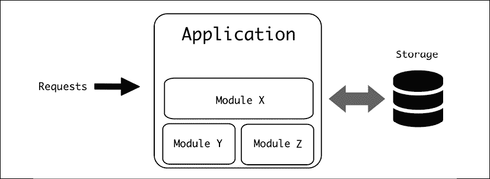
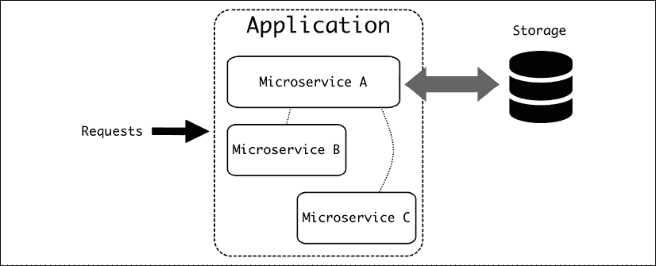
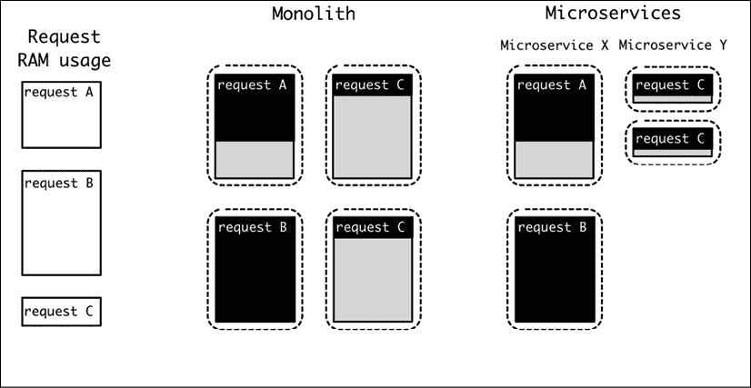
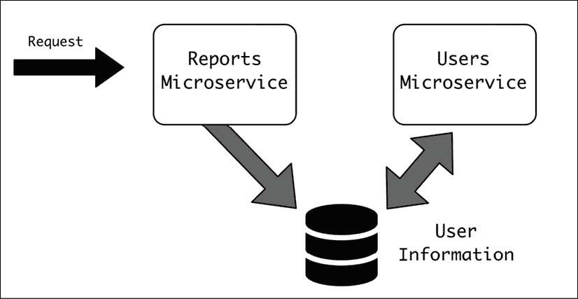
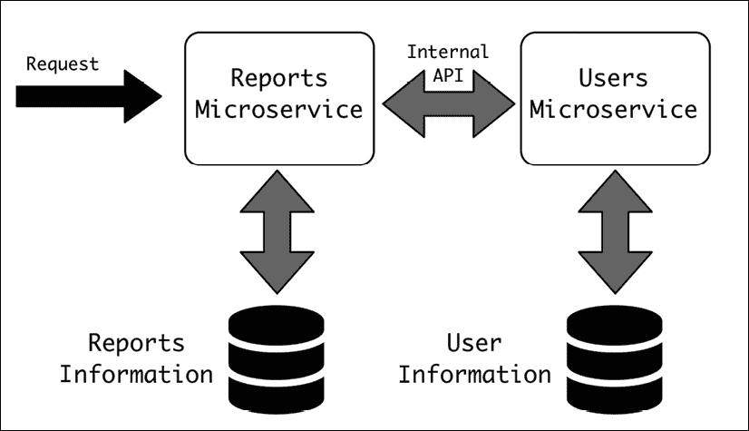
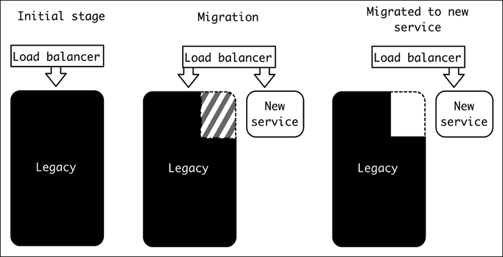
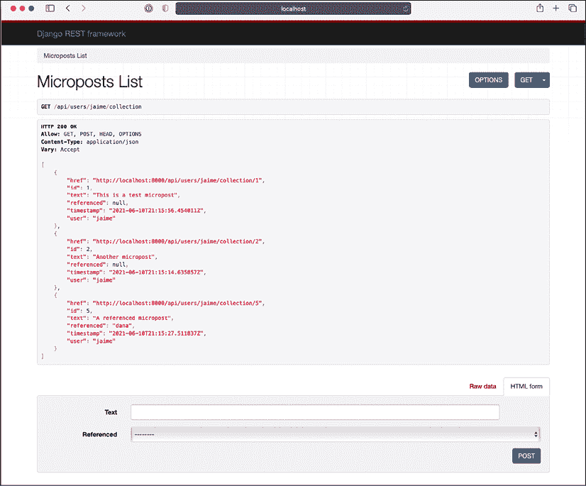

# 9

# 微服务与单体

在本章中，我们将介绍并讨论复杂系统中最常见的两种架构。单体架构创建了一个单一块，其中包含整个系统，并且操作简单。另一方面，微服务架构将系统划分为相互通信的较小微服务，旨在让不同的团队能够拥有不同的元素，并帮助大型团队能够并行工作。

我们将讨论何时选择每一种架构，基于它们不同的特性。我们还将讨论它们的团队合作方面，因为它们在如何结构化工作方面有不同的要求。

记住，架构不仅与技术相关，而且在很大程度上与沟通的结构有关！请参阅*第一章*，*软件架构简介*，以进一步讨论康威定律。

一种常见的模式是从旧的单体架构迁移到微服务架构。我们将讨论这种变化所涉及的阶段。

我们还将介绍 Docker 作为服务容器化的方式，这在创建微服务时非常有用，但也可以应用于单体。我们将对*第五章*，*十二要素应用方法*中展示的 Web 应用进行容器化。

最后，我们将简要描述如何使用编排工具部署和操作多个容器，并介绍目前最流行的一个——Kubernetes。

在本章中，我们将涵盖以下主题：

+   单体架构

+   微服务架构

+   选择哪种架构

+   从单体架构迁移到微服务

+   服务容器化

+   编排和 Kubernetes

让我们先深入谈谈单体架构。

# 单体架构

当一个系统自然设计时，倾向于生成一个包含整个系统功能的单一单元软件块。

这是一个逻辑上的发展过程。当设计一个软件系统时，它通常从简单开始，通常具有简单的功能。但是，随着软件的使用，它在使用方面开始增长，并开始收到对新功能的需求，以补充现有功能。除非有足够的资源和规划来结构化增长，否则最简单的路径就是将所有内容都添加到相同的代码结构中，几乎没有模块化。



描述自动生成，置信度低](img/B17580_09_01.png)

图 9.1：单体应用

这个过程确保所有代码和功能都绑定在一个单一块中，因此得名*单体架构*。

并且，通过扩展，遵循这种模式的软件被称为单体。

虽然这种结构相当常见，但一般来说，单体结构具有更好的模块化和内部结构。即使软件由单个块组成，也可以逻辑上将其划分为不同的部分，将不同的责任分配给不同的模块。

例如，在之前的章节中，我们讨论了 MVC 架构。这是一个单体架构。模型、视图和控制器都在同一个进程中，但有一个明确的结构来区分责任和功能。

单体架构不等于缺乏结构。

单体的定义特征是模块之间的所有调用都是通过*内部*API 进行的，在同一个进程中。这提供了非常灵活的优势。部署单体新版本的策略也很简单。重启进程将确保完全部署。

请记住，一个单体应用可以运行多个副本。例如，一个单体 Web 应用可以在并行运行多个相同的软件副本，负载均衡器将请求发送给所有这些副本。在这种情况下，重启将分为多个阶段。

单体的版本容易识别，因为所有代码都是同一结构的一部分。如果代码在源代码控制下，所有代码都将位于同一仓库中。

# 微服务架构

微服务架构是作为拥有包含所有代码的单个块的替代方案而开发的。

采用微服务架构的系统是*一组松散耦合的专业服务，它们协同工作以提供全面的服务*。让我们将定义分解以使其更清晰：

1.  **一组专业服务**，意味着存在不同且定义明确的模块

1.  **松散耦合**，因此每个微服务都可以独立部署和开发

1.  **协同工作**。每个微服务都需要与其他服务进行通信

1.  **提供全面服务**，意味着整个系统创建了一个具有明确动机和功能的全系统

与单体相比，它不是将整个软件放在同一个进程中，而是使用多个独立的、功能性的部分（每个微服务），这些部分通过定义良好的 API 进行通信。这些元素可以位于不同的进程中，通常被移动到不同的服务器上，以允许系统的适当扩展。



图 9.2：请注意，并非所有微服务都将连接到存储。每个微服务可能都有自己的独立存储

定义特征是不同服务之间的调用都是通过*外部*API 进行的。这些 API 充当功能之间的清晰、定义明确的障碍。正因为如此，微服务架构需要高级规划，并需要明确定义组件之间的差异。

尤其是微服务架构需要良好的前期设计，以确保不同的元素能够正确连接，因为任何跨服务的都会在处理上非常昂贵。

遵循微服务架构的系统不是自然形成的，而是事先制定并精心执行的计划的结果。这种架构通常不是从零开始构建系统，而是从先前存在的、成功的单体架构迁移而来。

# 选择哪种架构

有一种趋势认为，更先进的架构，如微服务架构，更好，但这是一种过度简化。每个架构都有自己的优点和缺点。

首先，几乎每个小型应用程序都会从一个单体应用程序开始。这是因为这是启动系统的最自然方式。所有东西都在手边，模块数量减少，并且是一个容易的起点。

另一方面，微服务架构需要制定一个计划，将功能仔细地划分为不同的模块。这项任务可能很复杂，因为某些设计可能在以后可能证明是不充分的。

请记住，没有任何设计可以完全适应未来。任何完美的架构决策可能在一年或两年后，当系统变化需要调整时，可能证明是错误的。虽然考虑未来是一个好问题，但试图涵盖每一个可能性是徒劳的。在为当前功能设计和为系统的未来愿景设计之间找到适当的平衡，是软件架构中一个持续的挑战。

这需要事先做大量的工作，这需要对微服务架构进行投资。

话虽如此，随着单体应用程序的增长，它们可能会仅仅因为代码的规模而开始出现问题。单体架构的主要特征是所有代码都集中在一起，它可能会开始展示出许多可能导致开发者困惑的连接。通过良好的实践和持续的警惕来确保良好的内部结构可以减少复杂性，但这需要现有开发者投入大量工作来执行。当处理一个大而复杂的系统时，通过将不同的区域划分为不同的进程，可能更容易呈现清晰和严格的边界。

模块也可能需要不同的特定知识，这使得将不同的团队成员分配到不同的领域变得自然。为了在模块中建立适当的所有权感，它们可以在代码标准、适合工作的适当编程语言、执行任务的方式等方面有不同的观点；例如，一个具有上传照片界面的光合作用系统和用于分类的 AI 系统。虽然第一个模块将作为一个网络服务运行，但训练和处理用于分类数据的 AI 模型所需的能力将非常不同，这使得模块分离既自然又高效。如果它们在同一个代码库中同时工作，可能会产生问题。

单体应用的另一个问题是资源利用效率低下，因为单体应用的每次部署都会携带每个模块的每个副本。例如，所需的 RAM 将根据多个模块的最坏情况场景来确定。当存在多个单体副本时，这将浪费大量 RAM 来准备可能很少发生的最坏情况。另一个例子是，如果任何模块需要与数据库建立连接，无论是否使用，都会创建一个新的连接。

相比之下，使用微服务可以根据每个服务的最坏情况使用情况进行调整，并独立控制每个服务的副本数量。从整体来看，这在大规模部署中可能导致巨大的资源节省。



图 9.3：请注意，使用不同的微服务可以将请求分割到不同的微服务中，从而减少 RAM 的使用，而在单体应用中，最坏情况场景驱动了 RAM 的利用率

单体和微服务的部署方式也非常不同。由于单体应用需要一次性部署，因此每次部署实际上都是整个团队的任务。如果团队规模较小，创建新的部署并确保新功能在模块之间得到适当协调且不会产生错误，并不复杂。然而，随着团队规模的扩大，如果代码没有严格的结构，这可能会带来严重的挑战。特别是，系统小部分的一个错误可能会完全使整个系统崩溃，因为单体中的任何关键错误都会影响整个代码。

单体应用的部署需要在模块之间进行协调，这意味着它们需要相互协作，这通常导致团队在功能准备发布之前紧密合作，并在部署准备就绪之前需要某种形式的监督。当几个团队在同一个代码库上工作，有竞争目标时，这会模糊部署的所有权和责任。

相比之下，不同的微服务是独立部署的。API 应该是稳定的，并且与旧版本向后兼容，这是需要强制执行的一个强烈要求。然而，边界非常清晰，在发生关键错误的情况下，最坏的情况是特定的微服务会崩溃，而其他无关的微服务则继续不受影响。

这使得系统工作在“降级状态”，与单体的“全有或全无”方法相比。它限制了灾难性故障的范围。

当然，某些微服务可能比其他微服务更为关键，因此它们值得额外的关注和照顾以确保其稳定性。但是，在这种情况下，它们可以预先定义为关键，并实施更严格的稳定性规则。

当然，在这两种情况下，都可以使用坚实的测试技术来提高发布软件的质量。

与单体相比，微服务可以独立部署，无需与其他服务紧密协调。这为从事这些工作的团队带来了独立性，并允许进行更快、更连续的部署，需要较少的中心协调。

这里的关键词是*减少*协调。协调仍然是必要的，但微服务架构的目标必然是每个微服务可以独立部署并由一个团队拥有，因此大多数变更可以完全由所有者决定，而不需要通知其他团队的过程。

单体应用，因为它们通过内部操作与其他模块通信，通常可以比通过外部 API 更快地执行这些操作。这允许模块之间有非常高的交互水平，而不需要付出显著的性能代价。

使用外部 API 和通过网络进行通信会产生一些开销，这可能导致明显的延迟，尤其是在向不同的微服务发出过多内部请求时。需要仔细考虑以尝试避免重复外部调用并限制在单个任务中可以联系的服务数量。

在某些情况下，使用工具来抽象与其他微服务的接触可能会产生额外的调用，这些调用将是绝对必要的。例如，处理文档的任务需要获取一些用户信息，这需要调用不同的微服务。文档的开始需要名字，而结束需要电子邮件。一个简单的实现可能会产生两个请求来获取信息，而不是一次性请求所有信息。

微服务的另一个有趣的优势是技术要求的独立性。在单体应用程序中，由于需要不同模块的不同版本库，可能会出现问题。例如，更新 Python 版本需要整个代码库都为此做好准备。这些库更新可能很复杂，因为不同的模块可能有不同的要求，一个模块可以通过要求升级两个模块都使用的某个库的版本，实际上与另一个模块混合。

另一方面，微服务有其自身的技术要求，因此不存在这种限制。由于使用了外部 API，不同的微服务甚至可以用不同的编程语言编写。这允许为不同的微服务使用专门的工具，针对每个目的进行定制，从而避免冲突。

虽然不同的微服务可以用不同的语言编程，但这并不意味着它们应该这样做。避免在微服务架构中使用过多的编程语言，因为这会使维护复杂化，并使得不同团队的一员难以提供帮助，从而形成更多孤立的团队。

提供一到两种默认的语言和框架，然后允许特殊合理的案例是一个合理的做法。

正如我们所见，微服务的大多数特性使其更适合大型操作，当开发者的数量足够高，以至于需要分成不同的团队，并且需要更明确的协调时。大型应用程序的高变化速度也要求有更好的部署和工作独立性的方法，通常来说。

一个小团队能够很好地自我协调，并且能够在单体中快速高效地工作。

这并不是说单体可以非常大。有些确实很大。但在一般意义上，只有当有足够的开发者，使得不同的团队在同一个系统中工作，并且需要在他们之间达到良好的独立性时，微服务架构才有意义。

## 关于类似设计的旁白

虽然单体与微服务的决策通常是在讨论网络服务时提出的，但这并不是一个新想法，也不是唯一存在类似想法和结构的环境。

操作系统的内核也可以是单体的。在这种情况下，如果一个内核结构在其所有操作都在内核空间内进行，那么它被称为单体结构。在计算机中运行的程序如果在内核空间运行，可以直接访问整个内存和硬件，这对于操作系统的使用至关重要，同时这也非常危险，因为它具有很大的安全和安全影响。由于内核空间中的代码与硬件紧密工作，任何故障都可能导致系统完全崩溃（内核恐慌）。另一种选择是在用户空间运行，这是程序只能访问其自己的数据，并且必须明确与操作系统交互以检索信息的区域。

例如，一个想要从文件中读取的用户空间程序需要调用操作系统，操作系统在内核空间中会访问文件，检索信息，并将其返回给请求的程序，将其复制到程序可以访问的内存部分。

单体内核的想法是它可以最小化不同内核元素（如库或硬件驱动程序）之间的移动和上下文切换。

单体内核的替代品被称为微内核。在微内核结构中，内核部分大大减少，文件系统、硬件驱动程序和网络堆栈等元素在用户空间而不是内核空间中执行。这要求这些元素通过通过微内核传递消息来进行通信，这效率较低。

同时，它还可以提高元素的模块化和安全性，因为任何用户空间中的崩溃都可以轻松重启。

安德鲁·S·坦能鲍姆和林纳斯·托瓦兹之间就 Linux 被创建为单体内核时哪种架构更好进行了著名的争论。从长远来看，内核已经演变为混合模型，其中它们结合了两个元素的特点，将微内核思想融入现有的单体内核中以提高灵活性。

发现和分析相关的架构思想可以帮助提高优秀架构师可用的工具，并提高对架构的理解和知识。

# 关键因素——团队沟通

微服务和单体架构之间的一个关键区别是它们支持的通信结构的不同。

如果单体应用是从一个小型项目有机地成长起来的，这通常会发生，其内部结构可能会变得混乱，需要具有系统经验的开发者来对其进行更改和适应以应对任何变化。在糟糕的情况下，代码可能会变得非常混乱，并且越来越难以工作。

随着开发团队规模的增加变得复杂，因为每个工程师都需要大量的上下文信息，学习如何导航代码是困难的。那些经验丰富的老队员可以帮助培训新队员，但他们将成为瓶颈，而指导是一个缓慢的过程，有其局限性。每个新队员都需要大量的培训时间，直到他们能够有效地修复错误和添加新功能。

团队也有一个最大自然规模限制。管理一个成员过多的团队，而不将其划分为更小的组，是困难的。

团队的理想规模取决于许多不同的因素，但通常认为 5 到 9 人是在有效工作时的理想规模。

大于这个规模的团队往往会自发组织成自己的小团队，作为一个整体失去焦点，并形成小的信息孤岛，其中团队的一部分人并不知道正在发生什么。

成员较少的团队在管理和与其他团队沟通方面会产生过多的开销。它们在稍微大一点规模的情况下将能够更快地工作。

如果代码的增长规模需要，这就是应用我们在本书中描述的所有技术来生成更多结构、构建系统架构的时候。这将涉及定义具有明确责任和边界的模块。这种划分允许团队划分为小组，并允许他们为每个团队创建所有权和明确的目标。

这使得团队可以在没有太多干扰的情况下并行工作，因此额外的成员可以增加在功能方面的吞吐量。正如我们之前所评论的，清晰的边界有助于为每个团队定义工作内容。

然而，在单体架构中，这些限制是“软”的，因为整个系统都是可访问的。当然，在专注于某些领域方面有一定的纪律性，趋势是某个团队将能够访问一切，并调整和弯曲内部 API。

这种特性并不一定是坏事，尤其是在较小规模的情况下。这种与小型、专注的团队一起工作的方式可以产生惊人的结果，因为它们将能够快速调整所有相关的软件部分。缺点是团队成员需要经验丰富，并且熟悉软件，这通常随着时间的推移变得越来越困难。

当迁移到微服务架构时，工作的划分变得更加明确。团队之间的 API 成为硬性限制，并且需要更多前期工作来在团队之间进行沟通。权衡的是，团队将更加独立，因为它们可以：

+   完全拥有微服务，而其他团队不在同一代码库中编码

+   独立于其他团队进行部署

由于代码库将更小，新加入团队的成员将能够快速学习并尽早变得高效。由于与其他微服务交互的外部 API 将明确定义，将应用更高层次的抽象，这使得交互更容易。

注意这也意味着，当至少对它有表面了解时，不同团队对其他微服务的内部了解将比单体应用少。这可能在人员从一个团队调动到另一个团队时产生一些摩擦。

正如我们在第一章中看到的，康威定律是在做出影响组织内部沟通的架构决策时需要牢记的东西。让我们记住，这条软件定律指出，软件的结构将复制组织的沟通结构。

康威定律的一个好例子是 DevOps 实践的产生。过去的工作划分方式是拥有不同的团队，一个与开发新功能相关，另一个负责部署和运营软件。毕竟，每个任务都需要不同的能力。

这种结构的风险在于“我不知道它是啥/我不知道它在哪运行”的划分，这可能导致负责开发新功能的团队对软件操作相关的错误和问题一无所知，而运维团队在反应时间很短的情况下发现变化，并识别出软件内部的错误，却未能理解软件的内部运作。

这种划分在许多组织中仍然存在，但 DevOps 背后的理念是，负责开发软件的同一团队也负责部署它，从而创建一个良性的反馈循环，其中开发者了解部署的复杂性，可以在生产中反应并修复错误，并改进软件的运行。

注意这通常涉及创建一个多功能团队，其中既有理解运维也有理解开发的人，尽管他们不一定需要是同一人。有时，一个外部团队负责为其他团队创建一套通用的工具，用于他们的运维。

这是一个巨大的变化，从旧结构转变为 DevOps 结构涉及以可能对企业文化造成极大破坏的方式混合团队。正如我们在这里试图强调的，这涉及到人员变化，这些变化缓慢，并伴随着大量的痛苦。例如，可能有一个很好的运维文化，他们分享知识并一起享受乐趣，但现在他们需要解散这些团队并与新人整合。

这种过程很困难，应该仔细规划，理解其人类和社会规模。

同一团队内部的沟通与不同团队之间的沟通不同。与其他团队沟通总是更困难且成本更高。这可能很容易说，但其对团队合作的含义很大。以下是一些例子：

+   由于要从团队外部使用的 API 将由其他工程师使用，而这些工程师对内部知识的掌握程度不同，因此使它们通用且易于使用，以及创建适当的文档是有意义的。

+   如果新的设计遵循现有团队的架构，那么实施起来会比反过来更容易。存在于团队之间的架构变化需要组织上的变化。改变组织的结构是一个漫长而痛苦的过程。任何参与过公司重组的人都可以证明这一点。这些组织变化会在软件中自然反映出来，因此理想情况下，将生成一个计划以允许这种变化。

+   在同一服务中工作的两个团队将产生问题，因为每个团队都会试图将其拉向自己的目标。这种情况可能发生在一些常见的库或被多个团队使用的“核心”微服务中。尝试为它们设定清晰的负责人，以确保只有一个团队负责任何变更。

    明确的负责人可以明确谁负责变更和新功能。即使某些东西是由其他人实施的，负责人也应负责批准它并提供方向和反馈。他们还应准备好有一个长期愿景并处理任何技术债务。

+   由于不同的地理位置和时区自然地设置了各自的沟通障碍，他们通常会被用来建立不同的团队，描述他们自己跨时区的结构化沟通，例如 API 定义。

    由于 COVID-19 危机，远程工作显著增加。这也产生了与同一房间内一起工作的团队不同的不同沟通结构的需求。这已经发展和提高了沟通技巧，这可能导致更好的工作组织方式。无论如何，团队划分不仅仅是物理上位于同一地点，而是创造团队工作的纽带和结构。

开发中的沟通方面是工作的重要部分，不应被低估。记住，对这些方面的改变是“人员变化”，这比技术变化更难实施。

# 从单体架构迁移到微服务架构

一个常见的案例是需要从现有的单体架构迁移到新的微服务架构。

想要实施这一变化的主要原因是系统的规模。正如我们之前讨论的，微服务系统的主要优势是创建多个独立的部分，这些部分可以并行开发，通过允许更多工程师同时工作，使开发可扩展并加快速度。

如果单体已经增长到超出可管理的大小，并且存在足够的问题，如发布问题、功能冲突和相互干扰，这是一个有意义的举措。但与此同时，这也是一个非常巨大且痛苦的过渡。

## 迁移的挑战

尽管最终结果可能比显示其年龄的单一架构应用要好得多，但迁移到新架构是一项重大任务。现在我们将探讨在迁移过程中我们可以预期的某些挑战和问题：

+   迁移到微服务将需要大量的努力，积极改变组织的运营方式，并且直到开始产生回报之前，需要大量的前期投资。过渡时间将会痛苦，需要在迁移速度和服务的常规运营之间做出妥协，因为完全停止运营不是一种选择。这需要大量的会议和文档来规划和传达迁移给每个人。它需要在管理层有积极的支持，以确保对完成任务的充分承诺，并清楚地了解为什么要这样做。

+   这还要求进行深刻的文化变革。正如我们上面所看到的，微服务的关键要素是团队之间的互动，与单一架构的运营方式相比，这将发生显著变化。这可能会涉及改变团队和改变工具。团队在对外部 API 的使用和文档方面将更加严格。

    他们需要在与其他团队的互动中更加正式，并且可能需要承担之前没有的职责。一般来说，人们不喜欢改变，这可能会以某些团队成员的抵抗形式出现。确保这些因素被考虑在内。

+   另一个挑战是培训方面。新工具肯定会得到应用（我们将在本章后面介绍 Docker 和 Kubernetes），因此一些团队可能需要适应使用它们。管理服务集群可能很复杂，难以理解，并且可能涉及与之前使用的不同工具。例如，本地开发者可能会有很大不同。如果选择走这条路，学习如何操作和使用容器将需要一些时间。这需要规划和支持团队成员，直到他们对新系统感到舒适。

    这种复杂性的一个非常清晰的例子是调试进入系统的请求时增加的复杂性，因为请求可能会在不同的微服务之间跳跃。以前，这个请求在单体架构中可能更容易追踪。理解请求的移动和寻找由此产生的细微错误可能很困难。为了确保修复这个问题，他们可能需要在本地开发中复制并修复，正如我们所看到的，这将涉及使用不同的工具和系统。

+   将现有的单体架构划分为不同的服务需要周密的规划。服务之间的不良划分可能会使两个服务紧密耦合，从而不允许独立部署。这可能导致一种情况，即实际上对任何一个服务的任何更改都可能导致另一个服务的更改，即使理论上可以独立完成。这会导致工作重复，因为通常需要更改和部署多个微服务才能完成单个功能的开发。微服务可以在以后进行变异和边界重新定义，但这会带来很高的成本。在添加新服务时，也应采取同样的谨慎态度。

+   创建微服务会有一些开销，因为每个服务都需要重复一些工作。这种开销通过允许独立和并行开发来补偿。但是，为了充分利用这一点，你需要有足够的人数。一个由多达 10 人组成的小型开发团队能够非常高效地协调和处理单体架构。只有当团队规模扩大并形成独立团队时，迁移到微服务才开始有意义。公司规模越大，这样做就越有意义。

+   在允许每个团队做出自己的决定和标准化一些共同元素和决策之间取得平衡是必要的。如果团队的方向过于模糊，他们就会不断地重复造轮子。他们还可能最终形成知识孤岛，其中公司的某个部分的知识完全无法转移到另一个团队，这使得集体学习变得困难。团队之间需要良好的沟通，以便达成共识和重用共同解决方案。允许进行受控的实验，将其标记为实验，并将所学到的经验传达给所有团队，以便其他团队也能从中受益。共享和可重用想法与独立、多实现想法之间将存在紧张关系。

    在服务之间引入共享代码时要小心。如果代码增长，它将使服务相互依赖。这可能会降低微服务的独立性。

+   遵循敏捷原则，我们知道，工作软件比广泛的文档更重要。然而，在微服务中，最大化每个单独微服务的可用性以减少团队之间的支持量是很重要的。这涉及到一定程度的文档。最佳的方法是创建自文档化的服务。

+   正如我们之前讨论的，对每个不同微服务的调用都可能增加响应延迟，因为需要涉及多个层次。这可能导致延迟问题，外部响应时间更长。它们还会受到连接微服务的内部网络性能和容量的影响。

在采取微服务迁移时应该谨慎行事，并仔细分析其利弊。在成熟系统中完成迁移可能需要数年时间。但对于大型系统，结果系统将更加敏捷，易于更改，使您能够有效地解决技术债务，并赋予开发者完全的拥有权和创新能力，构建沟通并交付高质量、可靠的服务。

## 这是一个分为四个部分的动作。

从一个架构迁移到另一个架构应考虑分为四个步骤：

1.  **分析**现有的系统。

1.  **设计**以确定期望的目标是什么。

1.  **计划**。创建一个路线图，逐步从当前系统移动到第一阶段设计的愿景。

1.  **执行**计划。这一阶段需要缓慢而谨慎地进行，并且每一步都需要重新评估设计和计划。

让我们更详细地看看每个步骤。

### 1. 分析

第一步是充分理解我们现有的单体架构的起点。这看起来可能微不足道，但事实是，可能没有特定的人对系统的所有细节有很好的理解。可能需要收集信息、汇编和深入挖掘以理解系统的复杂性。

现有的代码可以描述为*遗留代码*。虽然目前正在进行关于哪些代码可以归类为遗留代码的辩论，但其主要特性是已经存在的代码，它不遵循新代码的最佳和最新实践。

换句话说，遗留代码是来自很久以前的旧代码，很可能不符合当前的最佳实践。然而，遗留代码是至关重要的，因为它正在使用中，并且可能是组织日常运营的关键。

本阶段的主要目标应该是确定变更是否真正有益，并对迁移后可能产生的微服务有一个初步的了解。执行这次迁移是一项重大承诺，始终检查是否会带来实际效益是一个好主意。即使在这个阶段，可能无法估计所需的工作量，但它将开始塑造任务的规模。

这种分析将极大地受益于良好的指标和实际数据，这些数据显示了系统中实际产生的请求数量和交互。这可以通过良好的监控，以及向系统添加指标和日志来实现，以便测量当前行为。这可以揭示哪些部分被常用，甚至更好的是，几乎从未使用且可能被弃用和删除的部分。监控可以继续使用以确保过程按计划进行。

我们将在第十一章“包管理”和第十二章“日志”中更详细地讨论监控。

如果系统已经很好地架构并得到妥善维护，这种分析几乎可以立即完成，但如果单体是混乱代码的集合，可能需要数月的会议和代码挖掘。然而，这一阶段将使我们能够在了解当前系统的基础上建立坚实的基础。

### 2. 设计

下一个阶段是生成一个愿景，即系统在将单体拆分为多个微服务后的样子。

每个微服务都需要单独考虑，并作为整体的一部分。从分离什么有意义的角度思考。以下是一些可能有助于您构建设计的疑问：

+   应该创建哪些微服务？能否用清晰的目标和控制区域描述每个微服务？

+   是否有任何关键或核心微服务需要更多关注或特殊要求？例如，更高的安全或性能要求。

+   团队将如何构建以覆盖微服务？团队是否支持过多？如果是这样，是否可以将多个请求或区域作为同一微服务的一部分？

+   每个微服务的先决条件是什么？

+   将引入哪些新技术？是否需要培训？

+   微服务是否独立？微服务之间的依赖关系是什么？是否有任何微服务被访问的频率高于其他微服务？

+   微服务能否相互独立部署？如果引入了需要更改依赖项的新变更，过程是怎样的？

+   将要对外暴露哪些微服务？哪些微服务仅内部暴露？

+   在 API 限制方面是否有任何先决条件？例如，是否有任何服务需要特定的 API，如 SOAP 连接？

其他有助于告知设计的事情可以是绘制需要与多个微服务交互的预期流程图，以便分析服务之间的预期移动。

应对每个微服务选择的存储方式应特别小心。一般来说，一个微服务的存储不应与其他微服务共享，以隔离数据。

这有一个非常具体的应用，即不要让两个或更多微服务直接访问数据库或其他类型的原始存储。相反，一个微服务应该控制格式并公开数据，并通过可访问的 API 允许对数据进行更改。

例如，让我们想象有两个微服务，一个控制报告，另一个控制用户。对于某些报告，我们可能需要访问用户信息，例如获取生成报告的用户的姓名和电子邮件。我们可以通过允许报告服务直接访问包含用户信息的数据库来分解微服务的职责。



图 9.4：不正确使用示例，直接从存储中访问信息

相反，报告服务需要通过 API 访问用户微服务并拉取数据。这样，每个微服务都负责其自己的存储和格式。



图 9.5：这是正确的结构。每个微服务都保持其独立的存储。这样，任何信息都只通过定义良好的 API 进行共享

正如我们之前所评论的，创建一些请求的流程图将有助于加强这种分离并找到可能的改进点；例如，返回在处理过程中稍后不需要的数据。

虽然一个先决条件是不混合存储，并保持分离，但你可以使用相同的后端服务为不同的微服务提供支持。同一个数据库服务器可以处理两个或更多逻辑数据库，可以存储不同的信息。

然而，一般来说，大多数微服务不需要存储自己的数据，并且可以以完全无状态的方式工作，而是依赖其他微服务来存储数据。

在这个阶段，没有必要在微服务之间设计详细的 API，但了解哪些服务处理哪些数据以及微服务之间所需的数据流的一般想法将是有益的。

### 3. 计划

一旦明确了大致区域，就到了更详细地规划如何从起点到终点改变系统的时候了。

这里的挑战是在系统始终保持功能的同时，迭代地迁移到新系统。新功能可能正在被引入，但让我们暂时放下这一点，只谈论迁移本身。

要能够做到这一点，我们需要使用所谓的**断头蛇模式**。这种模式旨在逐步用新部分替换系统的旧部分，直到整个旧系统被“勒死”并可以安全地移除。这种模式是迭代地、缓慢地、以小步骤将功能从旧系统迁移到新系统。



图 9.6：断头蛇模式

要创建新的微服务，有三种可能的方法：

+   用新的代码替换功能，以替代旧代码，功能上产生相同的结果。从外部来看，代码对外部请求的反应完全相同，但内部实现是新的。这种策略允许你从头开始，修复一些旧代码的奇怪之处。甚至可以在新的工具中进行，如框架或编程语言。

    同时，这种方法可能非常耗时。如果遗留系统没有文档记录和/或未经测试，可能很难保证相同的功能。此外，如果此微服务覆盖的功能变化很快，它可能会进入新旧系统之间的追赶游戏，没有时间复制任何新的功能。

    这种方法在需要复制的旧部分很小且过时的情况下最有意义，例如使用被认为已过时的技术栈。

+   将功能分割，将单体中存在的代码复制粘贴到新的微服务结构中。如果现有代码状况良好且结构良好，这种方法相对较快，只需将一些内部调用替换为外部 API 调用即可。

可能需要在单体中包含新的访问点，以确保新的微服务可以回调以获取一些信息。

也可能需要重构单体，以明确元素并将它们划分为与新技术更一致的结构。

此过程也可以通过首先将单个功能迁移到新的微服务中，然后逐个移动代码，直到功能完全迁移来进行迭代。到那时，可以安全地从旧系统中删除代码。

+   这是分割和替换的**组合**。同一功能的某些部分可能可以直接复制，但对于其他部分，则更倾向于采用新的方法。

这将为每个微服务计划提供信息，尽管我们需要创建一个全局视图来确定按什么顺序创建哪些微服务。

这里有一些有用的观点需要考虑，以确定最佳的行动方案：

+   需要首先提供哪些微服务，考虑到将产生的依赖关系。

+   了解最大的痛点是什么，以及是否优先处理它们。痛点是经常更改的代码或其他元素，在单体架构中处理它们的方式使得它们变得困难。迁移后可以产生巨大的好处。

+   有哪些难点和潜在问题？很可能会有些。承认它们的存在并尽量减少它们对其他服务的影响。请注意，它们可能与痛点相同，也可能不同。例如，非常稳定的旧系统是难点，但根据我们的定义，它们并不痛苦，因为它们没有变化。

+   现在让我们来谈谈几个快速胜利，这将保持项目的势头。快速向你的团队和利益相关者展示优势！这也会让每个人理解你想要迁移到的新操作模式，并开始这样工作。

+   需要考虑团队所需的培训以及你想要引入的新元素。还要考虑团队中是否缺少某些技能——你可能正在计划招聘。

+   任何团队变化和新服务的所有权。考虑团队的反馈很重要，这样他们就可以表达在制定计划过程中对任何疏忽的担忧。让团队参与并重视他们的反馈。

一旦我们有了如何进行的计划，就是时候付诸实施了。

### 4. 执行

最后，我们需要采取行动，开始从过时的单体架构迁移到新的美好微服务领域！

这实际上将是四个阶段中最长的，可以说是最困难的。正如我们之前所说，目标是让服务在整个过程中保持运行。

成功过渡的关键要素是保持**向后兼容性**。这意味着从外部角度来看，系统保持像单体系统一样的行为。这样，我们可以在不影响客户的情况下，改变系统的内部工作方式。

理想情况下，新的架构将使我们变得更快，这意味着唯一能感知到的变化就是系统更加响应迅速！

这显然是说得容易做起来难。在生产环境中进行软件开发被比作驾驶福特 T 型车开始汽车比赛，然后在法拉利上冲过终点线，同时不断更换每一个部件而不停车。幸运的是，软件的灵活性如此之高，以至于我们甚至可以讨论这一点。

要能够实现这种变化，从单体架构到新的微服务或处理相同功能的微服务，关键工具是在请求入口处使用负载均衡器。如果新的微服务直接替换请求，这尤其有用。负载均衡器可以接管请求的输入并将它们以受控的方式重定向到适当的服务。

我们将假设所有传入的请求都是 HTTP 请求。负载均衡器可以处理其他类型的请求，但 HTTP 无疑是最常见的。

这可以用来将单体架构的请求缓慢迁移到应该接收此请求的新微服务。记住，负载均衡器可以通过不同的 URL 配置来将请求定向到不同的服务，因此它可以利用这种小的粒度来在不同服务之间正确分配负载。

这个过程看起来可能像这样。首先，负载均衡器将所有请求都导向遗留单体。一旦新微服务部署，请求可以通过引入新微服务进行负载均衡。最初，平衡应该只将少量请求转发到新系统，以确保行为相同。

慢慢地，随着时间的推移，它可以增长，直到所有请求都迁移。例如，第一周只能移动 10%的请求，第二周 30%，第三周 50%，然后在接下来的那一周移动所有请求的 100%。

迁移周期为 4 周。在这段时间内，不应引入任何新功能或更改，因为接口需要在遗留单体和新微服务之间保持稳定。确保所有相关人员都知道计划以及每个步骤。

到那时，在遗留单体中处理请求的操作将不再使用，如果这样做有意义，可以将其移除以进行清理。

这个过程与我们之前讨论的“杀手模式”类似，但在这个情况下是应用于单个请求。负载均衡器将是实施完整模式的宝贵盟友，以更大的规模扩展这个程序，因为我们正在添加更多功能，并缓慢地将它们迁移，以确保任何问题都能及早发现，并且不会影响大量请求。

#### 执行阶段

整个执行计划应包括三个阶段：

1.  **试点阶段**。任何计划都需要经过仔细的测试。试点阶段将是检查计划的可行性以及测试工具的时候。应该由一个团队来领导这项工作，以确保他们专注于它，并且可以快速学习和分享。尽量从几个小型服务和低垂的果实开始，这样团队就能明显看到改进。合适的候选是非关键服务，如果出现问题，不会造成重大影响。这个阶段将使你为迁移做准备，并从不可避免的错误中调整和吸取教训。

1.  **整合阶段**。在这个阶段，迁移的基本原理已经理解，但仍有许多代码需要迁移。此时，试点团队可以开始培训其他团队并传播知识，这样每个人都能理解应该如何进行。到那时，基本基础设施将到位，希望最明显的问题已经得到纠正，或者至少对如何处理它们有良好的理解。

    为了帮助知识的传播，制定文档标准将帮助团队进行协调，并减少反复询问相同问题的情况。为新微服务部署和在生产中运行制定一系列先决条件将阐明所需内容。还务必保持反馈渠道，以便新团队可以分享他们的发现并改进流程。

    这个阶段可能会看到一些计划的变化，因为现实将克服之前制定的任何计划。确保在解决问题的过程中适应变化，并密切关注目标。

    在这个阶段，速度将会加快，因为随着越来越多的代码迁移，不确定性正在减少。在某个时候，为团队创建和迁移新的微服务将变得司空见惯。

1.  **最终阶段**。在这个阶段，单体架构已经被拆分，所有新的开发都是在微服务中进行的。可能仍然有一些被视为不重要或低优先级的单体残留。如果是这样，边界应该清晰，以包含旧的方式做事。

    现在，团队可以完全掌控他们的微服务，并开始承担更宏伟的任务，例如通过在另一种编程语言中创建一个等效的微服务来完全替换一个微服务，或者通过合并或拆分微服务来改变架构。这是最终阶段，从现在开始，你将生活在微服务架构中。务必与团队一起庆祝这一时刻。

这大致就是过程。当然，这可能是一个漫长而艰巨的过程，可能需要数月甚至数年。确保保持可持续的步伐，并从长远的角度看待目标，以便能够继续直到达到目标。

# 容器化服务

传统的服务操作方式是使用一个运行完整操作系统的服务器，例如 Linux，然后在上面安装所有必需的包（例如 Python 或 PHP）和服务（例如 nginx，uWSGI）。服务器作为单元，因此每个物理机器都需要独立维护和管理。从硬件利用率的观点来看，这也许并不最优。

通过用虚拟机替换物理服务器，可以提高这一点，这样单个物理服务器就可以处理多个虚拟机。这有助于提高硬件利用率和灵活性，但仍然需要将每个服务器作为独立的物理机器进行管理。

多种工具有助于这项管理，例如配置管理工具，如 Chef 或 Puppet。它们可以管理多个服务器，并确保它们安装了正确的版本，并运行了正确的服务。

容器为这个领域带来了不同的方法。不是使用一个完整的计算机（服务器），安装一个操作系统，包和依赖项，然后在上面安装你的软件，这比底层系统变化更频繁，而是创建一个包含所有内容的包（容器镜像）。

容器拥有自己的文件系统，包括操作系统、依赖项、软件包和代码，并且作为一个整体部署。容器不是在稳定的平台上运行服务，而是作为一个整体运行，包含所需的所有内容。平台（主机机器）是一个薄层，只需要能够运行容器。容器与主机共享相同的内核，这使得它们在运行效率上非常高效，与可能需要模拟整个服务器的虚拟机相比。

这允许，例如，在相同的物理机器上运行不同的容器，并且每个容器运行不同的操作系统、不同的软件包和不同的代码版本。

有时，人们将容器视为“轻量级虚拟机”。这并不正确。相反，将它们视为*被其自身文件系统包裹的进程*。这个进程是容器的主要进程，当它完成时，容器停止运行。

构建和运行容器的最流行工具是 Docker ([`www.docker.com/`](https://www.docker.com/))。我们现在将检查如何操作它。

要安装 Docker，您可以访问[`docs.docker.com/get-docker/`](https://docs.docker.com/get-docker/)上的文档并遵循说明。使用 20.10.7 或更高版本。

安装完成后，您应该能够检查正在运行的版本，并获得以下类似的内容：

```py
$ docker version

Client:

 Cloud integration: 1.0.17

 Version:           20.10.7

 API version:       1.41

 Go version:        go1.16.4

 Git commit:        f0df350

 Built:             Wed Jun  2 11:56:22 2021

 OS/Arch:           darwin/amd64

 Context:           desktop-linux

 Experimental:      true

Server: Docker Engine - Community

 Engine:

  Version:          20.10.7

  API version:      1.41 (minimum version 1.12)

  Go version:       go1.13.15

  Git commit:       b0f5bc3

  Built:            Wed Jun  2 11:54:58 2021

  OS/Arch:          linux/amd64

  Experimental:     false

 containerd:

  Version:          1.4.6

  GitCommit:        d71fcd7d8303cbf684402823e425e9dd2e99285d

 runc:

  Version:          1.0.0-rc95

  GitCommit:        b9ee9c6314599f1b4a7f497e1f1f856fe433d3b7

 docker-init:

  Version:          0.19.0

  GitCommit:        de40ad0 
```

现在我们需要构建一个可以运行的容器镜像。

## 构建和运行镜像

容器镜像包括整个文件系统和启动时的指令。为了开始使用容器，我们需要构建构成系统基础的适当镜像。

记住之前提供的描述，即容器是一个被其自身文件系统包围的进程。构建镜像创建了该文件系统。

通过应用 `Dockerfile`，一个创建镜像的配方，通过逐层执行不同的层来创建镜像。

让我们看看一个非常简单的 `Dockerfile`。创建一个名为 `sometext.txt` 的文件，包含一些小的示例文本，另一个名为 `Dockerfile.simple` 的文件，包含以下文本：

```py
FROM ubuntu 

RUN mkdir -p /opt/

COPY sometext.txt /opt/sometext.txt

CMD cat /opt/sometext.txt 
```

第一行，`FROM`，将通过使用 Ubuntu 镜像来启动镜像。

有许多可以作为起点使用的镜像。您有所有常见的 Linux 发行版，如 Ubuntu、Debian 和 Fedora，还有用于完整系统的镜像，如存储系统（MySQL、PostgreSQL 和 Redis）或用于特定工具的镜像，如 Python、Node.js 或 Ruby。查看 Docker Hub ([`hub.docker.com`](https://hub.docker.com)) 以获取所有可用的镜像。

一个有趣的起点是使用 Alpine Linux 发行版，它被设计成小巧且专注于安全。更多信息请查看[`www.alpinelinux.org`](https://www.alpinelinux.org)。

容器的主要优势之一是能够使用和共享已经创建的容器，无论是直接使用还是作为增强它们的起点。如今，创建并推送到 Docker Hub 以允许他人直接使用它是非常常见的。这就是容器的一大优点！它们非常容易分享和使用。

第二行在容器内运行一个命令。在这种情况下，它会在`/opt`中创建一个新的子目录：

```py
RUN mkdir -p /opt/ 
```

接下来，我们将当前`sometext.txt`文件复制到容器内部的新子目录中：

```py
COPY sometext.txt /opt/sometext.txt 
```

最后，我们定义当镜像运行时要执行的命令：

```py
CMD cat /opt/sometext.txt 
```

要构建镜像，我们运行以下命令：

```py
docker build -f <Dockerfile> --tag <tag name> <context> 
```

在我们的案例中，我们使用定义好的 Dockerfile 和`example`作为标签。上下文是`.`（当前目录），它定义了所有`COPY`命令的根点：

```py
$ docker build -f Dockerfile.sample -–tag example .

[+] Building 1.9s (8/8) FINISHED

 => [internal] load build definition from Dockerfile.sample                                              

 => => transferring dockerfile: 92B                                                                                   

 => [internal] load .dockerignore                                                                                     

 => => transferring context: 2B                                                                                       

 => [internal] load metadata for docker.io/library/ubuntu:latest                                                      

 => [1/3] FROM docker.io/library/ubuntu@sha256:82becede498899ec668628e7cb0ad87b6e1c371cb8a1e597d83a47fac21d6af3       

 => [internal] load build context                                                                                     

 => => transferring context: 82B                                                                                      

 => CACHED [2/3] RUN mkdir -p /opt/                                                                                   

 => CACHED [3/3] COPY sometext.txt /opt/sometext.txt                                                                  

 => exporting to image                                                                                                

 => => exporting layers                                                                                               

 => => writing image sha256:e4a5342b531e68dfdb4d640f57165b704b1132cd18b5e2ba1220e2d800d066cb 
```

如果我们列出可用的镜像，你将能够看到`example`这个镜像：

```py
$ docker images

REPOSITORY      TAG          IMAGE ID       CREATED         SIZE

example         latest       e4a5342b531e   2 hours ago     72.8MB

ubuntu          latest       1318b700e415   47 hours ago    72.8MB 
```

我们现在可以运行容器，它将在容器内执行`cat`命令：

```py
$ docker run example

Some example text 
```

容器将在命令完成后停止执行。你可以使用`docker ps -a`命令查看已停止的容器，但通常停止的容器并不很有趣。

一个常见的例外是，生成的文件系统被存储到磁盘上，因此停止的容器可能产生了作为命令一部分的有趣文件。

虽然这种方式在某些时候运行容器可能很有用，比如编译二进制文件或其他类似操作，但通常情况下，更常见的是创建始终运行的`RUN`命令。在这种情况下，它将一直运行，直到外部停止，因为命令将永远运行。

## 构建和运行一个网络服务

网络服务容器是我们已经看到的最常见的微服务类型。为了能够构建和运行一个，我们需要以下部分：

+   正确的基础设施将网络服务运行到容器中的端口

+   将运行的我们的代码

按照前几章中介绍的常规架构，我们将使用以下技术栈：

+   我们的代码将使用 Python 编写，并使用 Django 作为网络框架

+   Python 代码将通过 uWSGI 执行

+   该服务将通过 nginx 网络服务器在端口 8000 上公开

让我们看看不同的元素。

代码可在[`github.com/PacktPublishing/Python-Architecture-Patterns/tree/main/chapter_09_monolith_microservices/web_service`](https://github.com/PacktPublishing/Python-Architecture-Patterns/tree/main/chapter_09_monolith_microservices/web_service)找到。

代码结构在两个主要目录和一个文件中：

+   `docker`：此子目录包含与 Docker 和其他基础设施操作相关的文件。

+   `src`：网络服务的源代码本身。源代码与我们在*第五章*，“十二要素应用方法论”中看到的是相同的。

+   `requirements.txt`：包含运行源代码所需的 Python 依赖的文件。

Dockerfile 镜像位于`./docker`子目录中。我们将按照它来解释不同部分是如何连接的：

```py
FROM ubuntu AS runtime-image

# Install Python, uwsgi and nginx

RUN apt-get update && apt-get install -y python3 nginx uwsgi uwsgi-plugin-python3

RUN apt-get install -y python3-pip

# Add starting script and config

RUN mkdir -p /opt/server

ADD ./docker/uwsgi.ini /opt/server

ADD ./docker/nginx.conf /etc/nginx/conf.d/default.conf

ADD ./docker/start_server.sh /opt/server

# Add and install requirements

ADD requirements.txt /opt/server

RUN pip3 install -r /opt/server/requirements.txt

# Add the source code

RUN mkdir -p /opt/code

ADD ./src/ /opt/code

WORKDIR /opt/code

# compile the static files

RUN python3 manage.py collectstatic --noinput

EXPOSE 8000

CMD ["/bin/sh", "/opt/server/start_server.sh"] 
```

文件的第一部分从标准的 Ubuntu Docker 镜像启动容器，并安装基本需求：Python 解释器、nginx、uWSGI 以及一些补充包——运行`python3`代码的 uWSGI 插件和能够安装 Python 包的`pip`：

```py
FROM ubuntu AS runtime-image

# Install Python, uwsgi and nginx

RUN apt-get update && apt-get install -y python3 nginx uwsgi uwsgi-plugin-python3

RUN apt-get install -y python3-pip 
```

下一个阶段是将所有必需的脚本和配置文件添加到启动服务器并配置 uWSGI 和 nginx。所有这些文件都在`./docker`子目录中，并存储在容器中的`/opt/server`目录内（除了 nginx 配置，它存储在默认的`/etc/nginx`子目录中）。

我们确保启动脚本可执行：

```py
# Add starting script and config

RUN mkdir -p /opt/server

ADD ./docker/uwsgi.ini /opt/server

ADD ./docker/nginx.conf /etc/nginx/conf.d/default.conf

ADD ./docker/start_server.sh /opt/server

RUN chmod +x /opt/server/start_server.sh 
```

接下来安装 Python 需求。添加`requirements.txt`文件，然后通过`pip3`命令安装：

```py
# Add and install requirements

ADD requirements.txt /opt/server

RUN pip3 install -r /opt/server/requirements.txt 
```

一些 Python 包可能需要在容器第一阶段安装某些包以确保某些工具可用；例如，安装某些数据库连接模块将需要安装适当的客户端库。

接下来，我们将源代码添加到`/opt/code`。使用`WORKDIR`命令，在该子目录中执行任何`RUN`命令，然后使用 Django 的`manage.py`命令运行`collectstatic`以在正确的子目录中生成静态文件：

```py
# Add the source code

RUN mkdir -p /opt/code

ADD ./src/ /opt/code

WORKDIR /opt/code

# compile the static files

RUN python3 manage.py collectstatic --noinput 
```

最后，我们描述暴露的端口（8000）和要运行的`CMD`以启动容器，即之前复制的`start_server.sh`脚本：

```py
EXPOSE 8000

CMD ["/bin/bash", "/opt/server/start_server.sh"] 
```

### uWSGI 配置

uWSGI 配置与*第五章*中介绍的配置非常相似，*十二要素应用方法*：

```py
[uwsgi]

plugins=python3

chdir=/opt/code

wsgi-file = microposts/wsgi.py

master=True

socket=/tmp/uwsgi.sock

vacuum=True

processes=1

max-requests=5000

uid=www-data

# Used to send commands to uWSGI

master-fifo=/tmp/uwsgi-fifo 
```

唯一的区别是需要包含`plugins`参数来指示它运行`python3`插件（这是因为 Ubuntu 安装的`uwsgi`包默认没有激活它）。此外，我们将使用与 nginx 相同的用户运行进程，以便它们可以通过`/tmp/uwsgi.sock`套接字进行通信。这是通过`uid=www-data`添加的，其中`www-data`是默认的 nginx 用户。

### nginx 配置

nginx 配置也与*第五章*中介绍的配置非常相似，*十二要素应用方法*：

```py
server {

    listen 8000 default_server;

    listen [::]:8000 default_server;

    root /opt/code/;

    location /static/ {

        autoindex on;

        try_files $uri $uri/ =404;

    }

    location / {

        proxy_set_header Host $host;

        proxy_set_header X-Real-IP $remote_addr;

        uwsgi_pass unix:///tmp/uwsgi.sock;

        include uwsgi_params;

    }

} 
```

唯一的区别是暴露的端口，它是`8000`。请注意，根目录是`/opt/code`，这使得静态文件目录是`/opt/code/static`。这需要与 Django 的配置保持同步。

### 启动脚本

让我们看看启动服务的脚本，`start_script.sh`：

```py
#!/bin/bash

_term() {

  # See details in the uwsgi.ini file and

  # in http://uwsgi-docs.readthedocs.io/en/latest/MasterFIFO.html

  # q means "graceful stop"

  echo q > /tmp/uwsgi-fifo

}

trap _term TERM

nginx

uwsgi --ini /opt/server/uwsgi.ini &

# We need to wait to properly catch the signal, that's why uWSGI is started

# in the background. $! is the PID of uWSGI

wait $!

# The container exits with code 143, which means "exited because SIGTERM"

# 128 + 15 (SIGTERM)

# http://www.tldp.org/LDP/abs/html/exitcodes.html

# http://tldp.org/LDP/Bash-Beginners-Guide/html/sect_12_02.html

echo "Exiting, bye!" 
```

启动脚本的核心位于中心，在这些 nginx 行中：

```py
uwsgi --ini /opt/server/uwsgi.ini &

wait $! 
```

这将启动`nginx`和`uwsgi`，并等待`uwsgi`进程停止。在 Bash 中，`$!`是最后一个进程（`uwsgi`进程）的 PID。

当 Docker 尝试停止容器时，它将首先向容器发送 `SIGTERM` 信号。这就是为什么我们创建了一个 `trap` 命令来捕获这个信号并执行 `_term()` 函数。这个函数会发送一个优雅的停止命令到 `uwsgi` 队列，正如我们在 *第五章*，*十二要素应用方法* 中所描述的，以优雅的方式结束进程：

```py
_term() {

  echo q > /tmp/uwsgi-fifo

}

trap _term TERM 
```

如果初始的 `SIGTERM` 信号不成功，Docker 将在一段宽限期后停止容器并杀死它，但这可能会使进程的结束变得不优雅。

### 构建 和 运行

现在我们可以构建镜像并运行它。要构建镜像，我们执行与之前类似的命令：

```py
$ docker build -f docker/Dockerfile --tag example .

[+] Building 0.2s (19/19) FINISHED

 => [internal] load build definition from Dockerfile

 => => transferring dockerfile: 85B

 => [internal] load .dockerignore 

 => => transferring context: 2B

 => [internal] load metadata for docker.io/library/ubuntu:latest

 => [ 1/14] FROM docker.io/library/ubuntu

 => [internal] load build context

 => => transferring context: 4.02kB

 => CACHED [ 2/14] RUN apt-get update && apt-get install -y python3 nginx uwsgi uwsgi-plugin-pytho  

 => CACHED [ 3/14] RUN apt-get install -y python3-pip

 => CACHED [ 4/14] RUN mkdir -p /opt/server 

 => CACHED [ 5/14] ADD ./docker/uwsgi.ini /opt/server

 => CACHED [ 6/14] ADD ./docker/nginx.conf /etc/nginx/conf.d/default.conf

 => CACHED [ 7/14] ADD ./docker/start_server.sh /opt/server

 => CACHED [ 8/14] RUN chmod +x /opt/server/start_server.sh

 => CACHED [ 9/14] ADD requirements.txt /opt/server

 => CACHED [10/14] RUN pip3 install -r /opt/server/requirements.txt

 => CACHED [11/14] RUN mkdir -p /opt/code 

 => CACHED [12/14] ADD ./src/ /opt/code

 => CACHED [13/14] WORKDIR /opt/code

 => CACHED [14/14] RUN python3 manage.py collectstatic --noinput

 => exporting to image

 => => exporting layers

 => => writing image sha256:7be9ae2ab0e16547480aef6d32a11c2ccaa3da4aa5efbfddedb888681b8e10fa

 => => naming to docker.io/library/example 
```

要运行服务，启动容器，将其端口 `8000` 映射到本地端口，例如，`local 8000`：

```py
$ docker run -p 8000:8000 example

[uWSGI] getting INI configuration from /opt/server/uwsgi.ini

*** Starting uWSGI 2.0.18-debian (64bit) on [Sat Jul 31 20:07:20 2021] ***

compiled with version: 10.0.1 20200405 (experimental) [master revision 0be9efad938:fcb98e4978a:705510a708d3642c9c962beb663c476167e4e8a4] on 11 April 2020 11:15:55

os: Linux-5.10.25-linuxkit #1 SMP Tue Mar 23 09:27:39 UTC 2021

nodename: b01ce0d2a335

machine: x86_64

clock source: unix

pcre jit disabled

detected number of CPU cores: 2

current working directory: /opt/code

detected binary path: /usr/bin/uwsgi-core

setuid() to 33

chdir() to /opt/code

your memory page size is 4096 bytes

detected max file descriptor number: 1048576

lock engine: pthread robust mutexes

thunder lock: disabled (you can enable it with --thunder-lock)

uwsgi socket 0 bound to UNIX address /tmp/uwsgi.sock fd 3

Python version: 3.8.10 (default, Jun  2 2021, 10:49:15)  [GCC 9.4.0]

*** Python threads support is disabled. You can enable it with --enable-threads ***

Python main interpreter initialized at 0x55a60f8c2a40

your server socket listen backlog is limited to 100 connections

your mercy for graceful operations on workers is 60 seconds

mapped 145840 bytes (142 KB) for 1 cores

*** Operational MODE: single process ***

WSGI app 0 (mountpoint='') ready in 1 seconds on interpreter 0x55a60f8c2a40 pid: 11 (default app)

*** uWSGI is running in multiple interpreter mode ***

spawned uWSGI master process (pid: 11)

spawned uWSGI worker 1 (pid: 13, cores: 1) 
```

完成此操作后，您可以通过本地地址 `http://localhost:8000` 访问服务；例如，访问 URL `http://localhost:8000/api/users/jaime/collection`：



图 9.7：微帖子列表

您将在启动容器的屏幕上看到访问日志：

```py
[pid: 13|app: 0|req: 2/2] 172.17.0.1 () {42 vars in 769 bytes} [Sat Jul 31 20:28:56 2021] GET /api/users/jaime/collection => generated 10375 bytes in 173 msecs (HTTP/1.1 200) 8 headers in 391 bytes (1 switches on core 0) 
```

可以使用 `docker stop` 命令优雅地停止容器。为此，您需要首先使用 `docker ps` 命令发现容器 ID：

```py
$ docker ps

CONTAINER ID   IMAGE     COMMAND                  CREATED          STATUS          PORTS                                       NAMES

b01ce0d2a335   example   "/bin/bash /opt/serv…"   23 minutes ago   Up 23 minutes   0.0.0.0:8000->8000/tcp, :::8000->8000/tcp   hardcore_chaum

$ docker stop b01ce0d2a335

b01ce0d2a335 
```

容器日志将在捕获 Docker 发送的 `SIGTERM` 信号时显示详细信息，然后退出：

```py
Caught SIGTERM signal! Sending graceful stop to uWSGI through the master-fifo

Exiting, bye! 
```

为了能够设置此示例，我们做出了一些有意识的决策，简化了与典型服务相比的操作。

### 注意事项

请记住查看 *第五章*，*十二要素应用方法*，以了解定义的 API 并更好地理解它。

Django `settings.py` 文件中的 `DEBUG` 模式设置为 `True`，这使得在触发例如 404 或 500 错误时，我们可以看到更多信息。在生产环境中，应禁用此参数，因为它可能会泄露关键信息。

`STATIC_ROOT` 和 `STATIC_URL` 参数需要在 Django 和 nginx 之间协调，以便指向同一位置。这样，`collectstatic` 命令将数据存储在 nginx 将从中获取数据的地方。

最重要的细节是使用 SQLite 数据库而不是内部数据库。此数据库存储在容器的文件系统中的 `src/db.sqlite3` 文件中。这意味着如果容器停止并重新启动，任何更改都将被销毁。

GitHub 仓库中的 `db.sqlite3` 文件包含一些为了方便存储的信息，两个用户 `jaime` 和 `dana`，每人都有几条微帖子。API 目前还没有定义创建新用户的方式，因此需要通过 Django 工具或直接操作 SQL 来创建它们。这些用户是为了演示目的添加的。

作为练习，创建一个脚本，在构建过程中将信息作为种子添加到数据库中。

通常，这种数据库使用不适合生产使用，需要连接到容器外部的数据库。这显然需要一个可用的外部数据库，这会复杂化设置。

现在我们已经知道了如何使用容器，我们或许可以启动另一个带有数据库的 Docker 容器，例如 MySQL，以获得更好的配置。

容器化数据库对于生产来说不是一个好主意。一般来说，容器非常适合经常变化的无状态服务，因为它们可以轻松启动和停止。数据库通常非常稳定，有很多服务为托管数据库做出安排。容器带来的优势对于典型的数据库来说并不相关。

这并不意味着它没有在生产环境中的用途。例如，它是一个很好的本地开发选项，因为它允许轻松创建可复制的本地环境。

如果我们想要创建多个容器并将它们连接起来，比如一个作为数据存储后端的 Web 服务器和数据库，而不是单独启动所有容器，我们可以使用编排工具。

# 或许是编排和 Kubernetes

管理多个容器并将它们连接起来被称为编排它们。部署在容器中的微服务必须进行编排，以确保多个微服务能够相互连接。

这个概念包括诸如发现其他容器所在位置、服务之间的依赖关系以及生成相同容器的多个副本等细节。

编排工具非常强大，但也非常复杂，需要你熟悉许多术语。要完全解释它们超出了本书的范围，但我们将指出一些并给出简要介绍。请参阅下文中的链接文档以获取更多信息。

有几种工具可以执行编排，其中最常见的是 `docker-compose` 和 Kubernetes。

`docker-compose` 是 Docker 通用服务的一部分。它在小型部署或本地开发中工作得非常好。它定义了一个包含不同服务定义及其可用名称的单个 YAML 文件。它可以用来替代许多 `docker build` 和 `docker run` 命令，因为它可以在 YAML 文件中定义所有参数。

您可以在此处查看 Docker Compose 的文档：[`docs.docker.com/compose/`](https://docs.docker.com/compose/)。

Kubernetes 针对更大规模的部署和集群，允许生成一个完整的逻辑结构来定义容器如何相互连接，从而允许对底层基础设施进行抽象。

在 Kubernetes 中配置的任何物理（或虚拟）服务器都称为 **节点**。所有节点定义了集群。每个节点都由 Kubernetes 处理，Kubernetes 将在节点之间创建网络，并将不同的容器分配给每个节点，同时考虑到它们上的可用空间。这意味着节点的数量、位置或类型不需要由服务来处理。

相反，集群中的应用程序在逻辑层中分布。可以定义几个元素：

+   **Pod**。Pod 是 Kubernetes 中定义的最小单元，它被定义为作为一个单元运行的容器组。通常，Pod 将仅包含一个容器，但在某些情况下，它们可能包含多个。Kubernetes 中的所有内容都在 Pod 中运行。

+   **部署**。Pod 的集合。部署将定义所需的副本数量，并创建适当数量的 Pod。同一部署的每个 Pod 可以位于不同的节点上，但这由 Kubernetes 控制。

    由于部署控制 Pod 的数量，如果一个 Pod 崩溃，部署将重新启动它。此外，可以通过创建自动扩展器等来操纵部署以更改数量。如果要在 Pod 中部署的镜像更改，部署将创建具有正确镜像的新 Pod，并相应地根据滚动更新或其他策略删除旧 Pod。

+   **服务**。一个可以用来将请求路由到特定 Pod 的标签，充当 DNS 名称。通常，这将指向为部署创建的 Pod。这允许系统中的其他 Pod 向已知位置发送请求。请求将在不同的 Pod 之间进行负载均衡。

+   **入口**。对服务的外部访问。这将映射一个传入的 DNS 到一个服务。入口允许应用程序对外暴露。外部请求将通过通过入口进入、被引导到服务、然后由特定的 Pod 处理的过程。

一些组件可以在 Kubernetes 集群中描述，例如 `ConfigMaps`，定义可用于配置目的的键值对；`Volumes` 用于在 Pod 之间共享存储；以及 `Secrets` 用于定义可以注入到 Pod 中的秘密值。

Kubernetes 是一个出色的工具，可以处理相当大的集群，拥有数百个节点和数千个 Pod。它也是一个复杂的工具，需要你学习如何使用它，并且有一个显著的学习曲线。它现在非常受欢迎，关于它的文档也很多。官方文档可以在以下位置找到：[`kubernetes.io/docs/home/`](https://kubernetes.io/docs/home/)。

# 摘要

在本章中，我们描述了单体和微服务架构。我们首先介绍了单体架构以及它通常是如何成为一个“默认架构”的，作为一个应用程序被设计时自然产生的。单体被创建为包含单个块内所有代码的单元块。

与此相比，微服务架构将整个应用程序的功能划分为更小的部分，以便它们可以并行工作。为了使这种策略有效，它需要定义清晰的边界并记录如何连接不同的服务。与单体架构相比，微服务旨在生成更结构化的代码，并通过将它们划分为更小、更易于管理的系统来控制大型代码库。

我们讨论了最佳架构是什么，以及如何选择是否将系统设计为单体或微服务。每种方法都有其优缺点，但一般来说，系统最初是单体的，当代码库和开发人员数量达到一定规模后，才会将代码库划分为更小的微服务。

两种架构之间的区别不仅仅是技术上的。它主要涉及在系统上工作的开发者需要如何沟通和划分团队。我们讨论了需要考虑的不同方面，包括团队的结构和规模。

由于从旧的单体架构迁移到新的微服务架构是一个非常常见的案例，我们讨论了如何着手这项工作，分析它，并执行它，使用一个四阶段路线图：分析、设计、计划和执行。

我们讨论了如何将服务容器化（特别是微服务）可能带来的帮助。我们探讨了如何使用 Docker 作为工具来容器化服务，以及它的多种优点和用途。我们还提供了一个将示例 Web 服务容器化的例子，如第五章中所述的*十二要素应用方法*。

最后，我们简要描述了使用编排工具来协调和多个容器之间相互通信的用法，以及最受欢迎的 Kubernetes。然后我们简要介绍了 Kubernetes。

你可以在本书作者所著的《Hands-On Docker for Microservices with Python》一书中了解更多关于微服务以及如何从单体架构迁移到微服务架构的信息，该书对这些概念进行了扩展，并深入探讨了这些内容。
