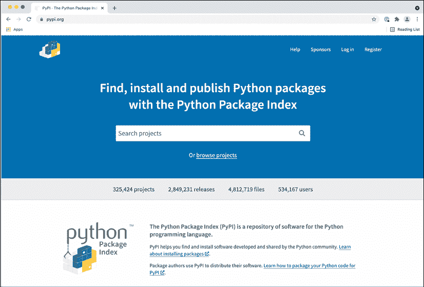
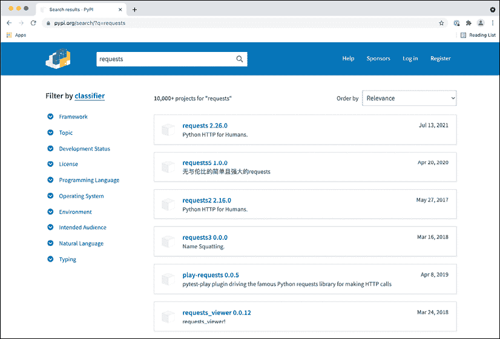
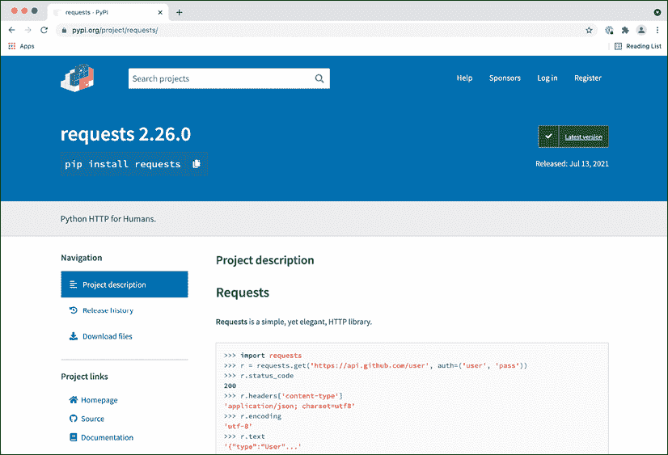
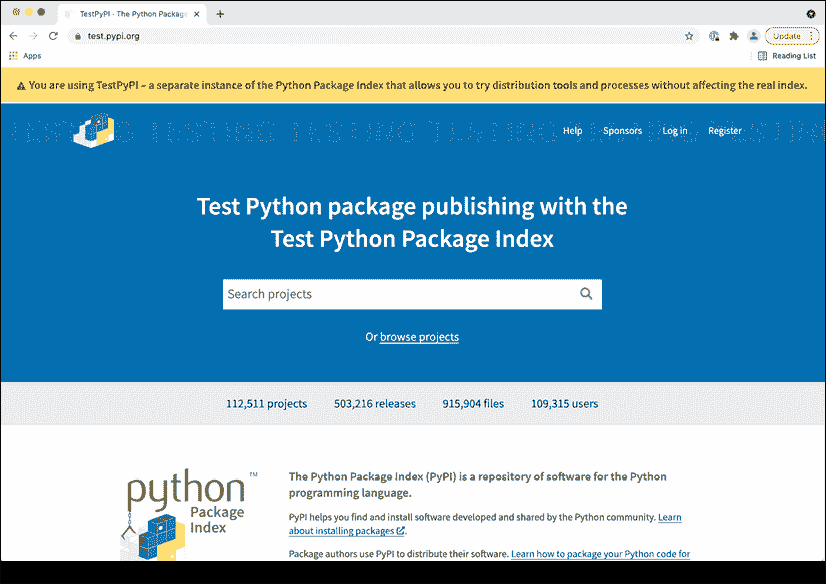
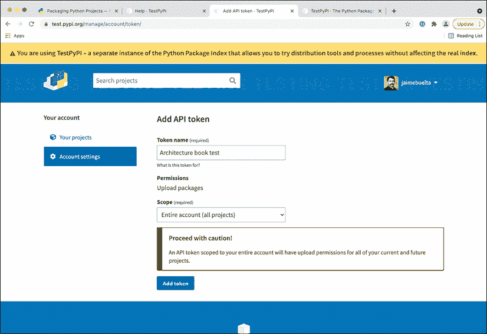
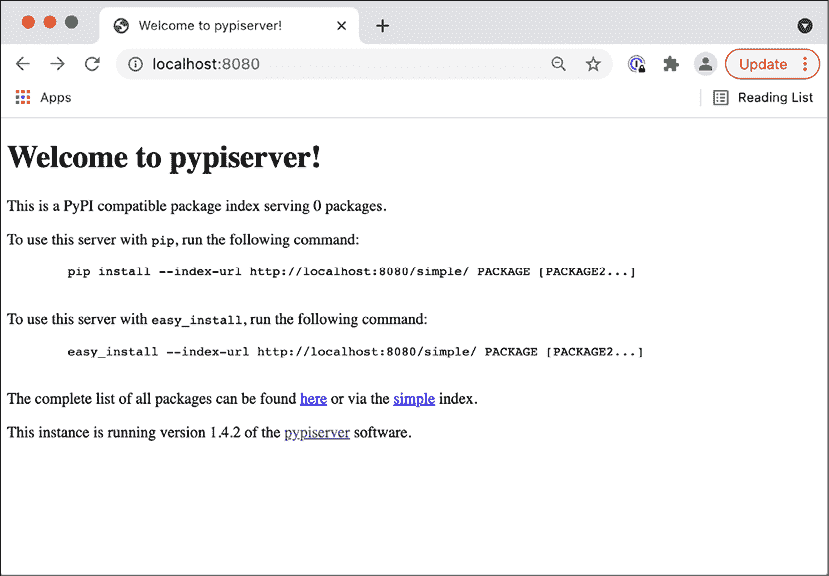
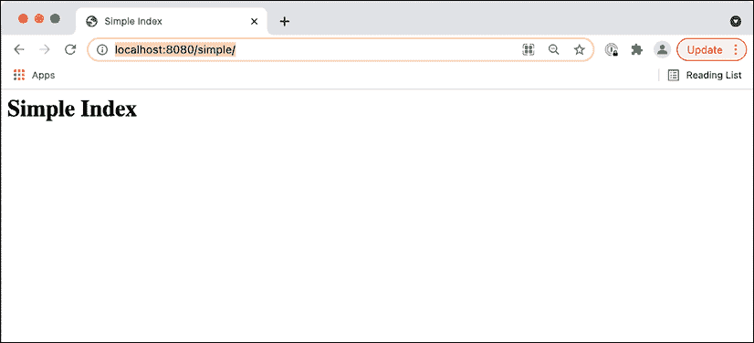
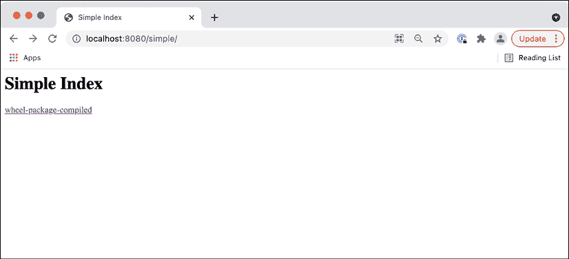
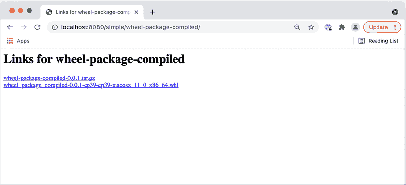

# 11

# 包管理

当在复杂系统中工作时，尤其是在微服务或类似架构中，有时需要共享代码，以便它在系统的不同、不相连的部分中可用。这通常是帮助抽象一些可能差异很大的函数的代码，从安全目的（例如，以其他系统将需要验证的方式计算签名），到连接到数据库或外部 API，甚至帮助一致地监控系统。

我们不必每次都重新发明轮子，我们可以多次重用相同的代码，以确保它经过适当的测试和验证，并在整个系统中保持一致性。一些模块可能不仅可以在组织内部共享，甚至可以在组织外部共享，创建其他人可以利用的标准模块。

之前有人这样做过，许多常见的用例，如连接到现有的数据库、使用网络资源、访问操作系统功能、理解各种格式的文件、计算常见的算法和公式、在各个领域，创建和操作 AI 模型，以及其他许多案例，都是可用的。

为了增强所有这些能力的共享和利用，现代编程语言都有它们自己的创建和共享包的方式，因此语言的有用性大大增加。

在本章中，我们将讨论包的使用，主要从 Python 的角度出发，涵盖何时以及如何决定创建一个包。我们将探讨不同的选项，从简单的结构到包含编译代码的包，以便它可以针对特定任务进行优化。

在本章中，我们将涵盖以下主题：

+   创建一个新的包

+   Python 中的简单打包

+   Python 打包生态系统

+   创建一个包

+   Cython

+   带有二进制代码的 Python 包

+   将你的包上传到 PyPI

+   创建你自己的私有索引

让我们先定义一下哪些代码可能成为创建包的候选者。

# 创建一个新的包

在任何软件中，都可能会有一些代码片段可以在代码的不同部分之间共享。当处理小型、单体应用程序时，这可以通过创建一些内部模块或函数来实现，通过直接调用它们来共享功能。

随着时间的推移，这个或这些常用函数可能会被分组到一个模块中，以明确它们将在整个应用程序中使用。

避免使用 `utils` 这样的名字来命名一个预期在不同位置使用的代码模块。虽然这很常见，但它也不是很具有描述性，有点懒惰。别人怎么知道一个函数是否在 `utils` 模块中？相反，尝试使用一个描述性的名字。

如果不可能，将其划分为子模块，这样你可以创建类似 `utils.communication` 或 `utils.math` 的东西，以避免这种影响。

在一定规模内，这将会运行得很好。随着代码的增长和复杂度的增加，可能会出现以下一些问题：

+   创建一个更通用的 API 来与模块交互，旨在提高模块利用的灵活性。这可能包括创建一种更防御性的编程风格，以确保模块按预期使用并返回适当的错误。

+   需要为模块提供具体的文档，以便不熟悉模块的开发者能够使用它。

+   可能需要明确模块的所有权并指定其维护者。这可以采取在更改代码前进行更严格的代码审查的形式，指定一些开发者或开发者为模块的联系人。

+   最关键的是，模块的功能需要在两个或更多独立的服务或代码库中存在。如果发生这种情况，而不是仅仅在不同代码库之间复制/粘贴代码，创建一个独立的模块以便导入是有意义的。这可能是一个事先的明确选择，以标准化某些操作（例如，在多个服务中产生和验证签名消息）或可能是在一个代码库中成功实现功能后的一种后续想法，这种功能在其他服务中可能很有用。例如，对通信消息进行监控会生成日志。这个日志在其他服务中可能很有用，因此，从原始服务中，它会被迁移到其他服务。

通常，模块开始获得自己的实体，而不仅仅是一个共享位置来集成将要共享的代码。那时，将其视为一个独立的库而不是特定代码库的模块更有意义。

一旦决定将某些代码作为一个独立的包来创建，应考虑以下几个方面：

+   如我们之前所见，最重要的是新包的所有权。包存在于不同团队和群体之间的边界上，因为它们被不同的人使用。务必提供关于任何包的明确所有权，以确保负责该包的团队可接触，无论是为了任何可能的询问还是为了设置其自身的维护。

+   任何新的包都需要时间来开发新功能和调整，尤其是在包被使用时，可能因为被多个服务和多种方式使用而拉伸其极限。务必考虑到这一点，并相应地调整负责团队的工作量。这将非常依赖于包的成熟度和所需的新功能数量。

+   同样，务必预留时间来维护包。即使没有新功能，也会发现错误，以及其他一般性维护，如由于安全修复或与新操作系统版本的兼容性而更新依赖项，这些都需要继续进行。

所有这些元素都应该被考虑进去。一般来说，建议创建某种路线图，以便负责的团队可以定义目标及其实现的时间框架。

重要的是，一个新的包是一个新的项目。你需要像对待项目一样对待它。

我们将专注于在 Python 中创建一个新的包，但创建其他语言中的其他包时，基本原理是相似的。

# Python 中的简单打包

在 Python 中，创建一个可以被导入的包非常简单，只需将子目录添加到代码中即可。虽然这很简单，但最初可能足够用，因为子目录可以被复制。例如，代码可以直接添加到源代码控制系统中，或者甚至可以通过压缩代码并在原地解压缩来安装。

这不是一个长期解决方案，因为它不会处理多个版本、依赖关系等问题，但在某些情况下可以作为第一步。至少最初，所有需要打包的代码都需要存储在同一个子目录中。

Python 中模块的代码结构可以作为一个具有单个入口点的子目录来处理。例如，当创建一个名为`naive_package`的模块，其结构如下：

```py
└── naive_package

    ├── __init__.py

    ├── module.py

    └── submodule

        ├── __init__.py

        └── submodule.py 
```

我们可以看到该模块包含一个子模块，所以让我们从这里开始。子模块目录包含两个文件，包含代码的`submodule.py`文件和一个空的`__init__.py`文件，以便其他文件可以被导入，正如我们稍后将会看到的。

`__init__.py`是一个特殊的 Python 文件，它表示目录包含 Python 代码并且可以被外部导入。它象征着目录本身，正如我们稍后将会看到的。

`submodule.py`的内容是这个示例函数：

```py
def subfunction():

    return 'calling subfunction' 
```

最高级别是模块本身。我们有一个`module.py`文件，它定义了调用子模块的`some_function`函数：

```py
from .submodule.submodule import subfunction

def some_function():

    result = subfunction()

    return f'some function {result}' 
```

`import`行有一个细节，即位于同一目录中的子模块的点形式。这是 Python 3 中导入时更精确的特定语法。如果没有点，它将尝试从库中导入。

你可以在 PEP-328 中了解更多关于相对导入的信息，它在这里进行了描述：[`www.python.org/dev/peps/pep-0328/`](https://www.python.org/dev/peps/pep-0328/)。**PEPs**（**Python Enhancement Proposals**）是描述与 Python 语言相关的新特性或与社区相关的信息的文档。它是提出更改和推进语言的官方渠道。

函数的其余部分调用`subfunction`并将结果组合成一个文本字符串返回。

在这种情况下，`__init__.py`文件不是空的，而是导入`some_function`函数：

```py
from .module import some_function 
```

再次注意前面的点所指示的相对`import`。这允许`some_function`函数作为`naive_package`模块最高级别的一部分可用。

我们现在可以创建一个文件来调用模块。我们将编写`call_naive_package.py`文件，该文件需要与`native_package`目录处于同一级别：

```py
from naive_package import some_function

print(some_function()) 
```

此文件仅调用模块定义的函数并打印结果：

```py
$ python3 call_naive_package.py

some function calling subfunction 
```

这种处理要共享的模块的方法不建议使用，但这个小模块可以帮助我们了解如何创建包以及模块的结构。将模块分离并创建独立包的第一步是创建一个具有清晰 API 的单个子目录，包括使用它的清晰入口点。

但为了得到更好的解决方案，我们需要能够从那里创建一个完整的 Python 包。让我们看看这究竟意味着什么。

# Python 打包生态系统

Python 拥有一个非常活跃的第三方开源包生态系统，涵盖了广泛的主题，并增强了任何 Python 程序的功能。您可以通过使用`pip`来利用安装它们，`pip`在安装任何新的 Python 时都会自动安装。

例如，要安装名为`requests`的包，这是一个允许编译更简单、更强大的 HTTP 请求的包，命令如下：

```py
$ pip3 install requests 
```

`pip`会自动在 Python 包索引中搜索，以查看包是否可用。如果可用，它将下载并安装它。

注意，`pip`命令可能是`pip3`的形式。这取决于您系统中 Python 的安装。我们将不加区分地使用它们。

我们将在本章后面更详细地介绍`pip`的使用，但首先，我们需要讨论包下载的主要来源。

## PyPI

Python 包索引（PyPI，通常发音为*Pie-P-I*，而不是*Pie-Pie*）是 Python 中包的官方来源，可以在[`pypi.org`](https://pypi.org)上检查：



图 11.1：pypi.org 主页

在 PyPI 网页上，搜索可以找到特定的包以及有用的信息，包括具有部分匹配的可用包。它们也可以被过滤。



图 11.2：搜索包

一旦指定了单个包，就可以找到有关简要文档、项目源和主页的链接以及其他类似类型的许可证或维护者的更多信息。

对于大型包，主页和文档页非常重要，因为它们将包含有关如何使用包的更多信息。较小的包通常只会包含此页面的文档，但检查它们的页面以查看源总是值得的，因为它可能链接到一个 GitHub 页面，其中包含有关错误和提交补丁或报告的可能性。

在撰写本书时，`requests`页面的样子如下：



图 11.3：关于模块的详细信息

直接在 PyPI 中搜索可以帮助定位一些有趣的模块，在某些情况下，将会非常直接，例如查找连接到数据库的模块（例如，通过数据库的名称进行搜索）。然而，这通常涉及大量的试错，因为名称可能不会表明模块对您的用例有多好。

在互联网上花些时间搜索最适合特定用例的最佳模块是一个好主意，这将提高找到适合您用例的正确包的机会。

在这种情况下，StackOverflow ([`stackoverflow.com/`](https://stackoverflow.com/)) 是一个很好的知识来源，它包含大量的问题和答案，可用于确定有趣的模块。一般的谷歌搜索也会有所帮助。

在任何情况下，鉴于 Python 有大量不同质量和成熟度的可用包，花些时间研究替代方案总是值得的。

`pypi.org` 并没有以任何方式对包进行精选，因为它是公开的，任何人都可以提交他们的包，尽管恶意包将被消除。一个包有多流行将需要更多间接的方法，例如搜索下载次数或通过在线搜索器查看是否有其他项目在使用它。最终，将需要执行一些概念验证程序来分析候选包是否涵盖了所有必需的功能。

## 虚拟环境

打包链中的下一个元素是创建虚拟环境以隔离模块的安装。

在处理安装包时，使用系统中的默认环境会导致包安装在那里。这意味着 Python 解释器的常规安装将受到影响。

这可能会导致问题，因为您可能安装了在使用 Python 解释器进行其他目的时会产生副作用的其他包，因为包中的依赖项可能会相互干扰。

例如，如果同一台机器上有一个需要 `package1` 包的 Python 程序，另一个需要 `package2` 的 Python 程序，并且它们都不兼容，这将产生冲突。安装 `package1` 和 `package2` 都是不可能的。

注意，这也可能通过版本不兼容发生，尤其是在包的依赖项或依赖项的依赖项中。例如，`package1` 需要安装依赖项版本 5，而 `package2` 需要版本 6 或更高。它们将无法同时运行。

解决这个问题的方法是创建两个不同的环境，这样每个包及其依赖项都会独立存储——不仅彼此独立，而且与系统 Python 解释器也独立，因此不会影响依赖于系统 Python 解释器的任何可能的活动。

要创建一个新的虚拟环境，可以使用 Python 3.3 之后所有安装中包含的标准模块 `venv`：

```py
$ python3 -m venv venv 
```

这将创建 `venv` 子目录，其中包含虚拟环境。可以使用以下 `source` 命令来激活环境：

请注意，我们为创建的虚拟环境使用了名称 `venv`，这与模块的名称相同。这不是必要的。虚拟环境可以用任何名称创建。确保使用一个在您的用例中具有描述性的名称。

```py
$ source ./venv/bin/activate

(venv) $ which python

./venv/bin/python

(venv) $ which pip

./venv/bin/python 
```

你可以看到执行的是虚拟环境中的 `python` 解释器和 `pip`，而不是系统版本，并且在提示符中也有指示，说明虚拟环境 `venv` 已激活。

虚拟环境也有自己的库，因此任何安装的包都会存储在这里，而不是在系统环境中。

可以通过调用 `deactivate` 命令来停用虚拟环境。你可以看到 `(venv)` 标识消失了。

一旦进入虚拟环境，任何对 `pip` 的调用都会在虚拟环境中安装包，因此它们与其他环境独立。然后每个程序都可以在其自己的虚拟环境中执行。

在无法直接通过命令行激活虚拟环境，需要直接执行命令的情况下，例如 cronjob 情况，可以直接通过虚拟环境的完整路径调用 `python` 解释器，例如 `/path/to/venv/python/your_script.py`。

在合适的环境中，我们可以使用 `pip` 安装不同的依赖项。

## 准备环境

创建虚拟环境是第一步，但我们需要安装软件的所有依赖项。

为了在所有情况下都能复制环境，最好的做法是创建一个定义了所有应安装依赖项的 requirements 文件。`pip` 允许通过一个文件（通常称为 `requirements.txt`）来安装依赖项。

这是一种创建可复制环境的极好方法，当需要时可以从头开始。

例如，让我们看一下下面的 `requirements.txt` 文件：

```py
requests==2.26.0

pint==0.17 
```

您可以从 GitHub 下载该文件：[`github.com/PacktPublishing/Python-Architecture-Patterns/blob/main/chapter_11_package_management/requirements.txt`](https://github.com/PacktPublishing/Python-Architecture-Patterns/blob/main/chapter_11_package_management/requirements.txt)。

注意格式为`package==version`。这指定了用于该包的确切版本，这是安装依赖项的推荐方式。这样可以避免仅使用`package`，这会导致安装最新版本，可能会引起未计划的升级，这可能导致兼容性问题。

其他选项，如`package>=version`，可以指定最小版本。

可以使用以下命令在虚拟环境中安装该文件（请记住激活它）：

```py
(venv) $ pip install -r requirements.txt 
```

之后，所有指定的需求都将安装到环境中。

注意，你指定的依赖项的依赖项可能并没有完全固定到特定版本。这是因为依赖项有自己的定义，当交付新包时，它可能会在二级依赖项上产生未知的升级。

为了避免出现这个问题，你可以创建一个包含一级依赖的初始安装，然后使用`pip freeze`命令获取所有已安装的依赖项：

```py
(venv) $ pip freeze

certifi==2021.5.30

chardet==3.0.4

charset-normalizer==2.0.4

idna==2.10

packaging==21.0

Pint==0.17

pyparsing==2.4.7

requests==2.26.0

urllib3==1.26.6 
```

你可以直接使用输出更新`requirements.txt`，这样下一次安装将具有所有二级依赖项也固定下来。

注意，添加新需求将需要生成相同的过程，首先安装，然后运行`freeze`，然后使用输出更新`requirements.txt`文件。

### 关于容器的一些注意事项

在容器化工作方式中，系统解释器和程序解释器之间的区别更加模糊，因为容器包含了自己的操作系统封装，从而强制执行了强分离。

在传统的服务部署方式中，它们在同一服务器上安装和运行，由于我们之前讨论的限制，这需要保持解释器之间的分离。

通过使用容器，我们已经在每个服务周围创建了一个封装到它们自己的操作系统文件系统，这意味着我们可以跳过虚拟环境的创建。在这种情况下，容器充当虚拟环境，强制不同容器之间的分离。

正如我们在第八章*高级事件驱动结构*中讨论的那样，当谈论容器时，每个容器应仅服务于单个服务，协调不同容器以生成不同的服务器。这样，它消除了需要共享相同解释器的情况。

这意味着我们可以放宽在传统环境中通常施加的一些限制，只需关注一个环境，能够更少地担心污染系统环境。只有一个环境，所以我们可以更自由地玩耍。如果我们需要更多服务或环境，我们总是可以创建更多容器。

## Python 包

一个准备就绪的 Python 模块本质上是一个包含某些 Python 代码的子目录。这个子目录被安装到适当的库子目录中，解释器会在这个子目录中搜索。这个目录被称为`site-packages`。

如果你正在使用虚拟环境，这个子目录在虚拟环境中是可用的。你可以检查以下子目录：`venv/lib/python3.9/site-packages/`。

为了分发，这个子目录被打包成两个不同的文件，即`Egg`文件或`Wheel`文件。重要的是，`pip`只能安装`Wheel`文件。

可以创建源代码包。在这种情况下，文件是一个包含所有代码的 tar 文件。

`Egg`文件被认为是过时的，因为它们的格式较旧，基本上是一个包含一些元数据的压缩文件。`Wheel`文件有几个优点：

+   它们定义得更好，允许更多的使用场景。有一个特定的 PEP，PEP-427 ([`www.python.org/dev/peps/pep-0427/`](https://www.python.org/dev/peps/pep-0427/))，它定义了格式。`Egg`文件从未被正式定义。

+   它们可以被定义为具有更好的兼容性，允许创建在不同版本的 Python 之间兼容的`Wheel`文件，包括 Python 2 和 Python 3。

+   `Wheel`文件可以包含已经编译的二进制代码。Python 允许包含用 C 语言编写的库，但这些库需要针对正确的硬件架构。在`Egg`文件中，源文件在安装时被包含并编译，但这需要在安装机器上提供适当的编译工具和环境，这很容易导致编译问题。

+   相反，`Wheel`文件可以预先编译二进制文件。`Wheel`文件基于硬件架构和操作系统有更好的定义的兼容性，因此如果可用，将下载并安装正确的`Wheel`文件。这使得安装更快，因为不需要在安装时进行编译，并且消除了在目标机器上需要编译工具的需求。也可以创建包含源文件的`Wheel`文件，以便在未预先编译的机器上安装，尽管在这种情况下，它将需要一个编译器。

+   `Wheel`文件可以进行加密签名，而`Eggs`不支持此选项。这为避免受损和修改的包添加了一个额外的安全层。

目前，Python 的打包标准是`Wheel`文件，并且应该作为一般规则优先选择。`Egg`文件应限制在尚未升级到新格式的旧包中。

可以使用较旧的`easy_install`脚本来安装 Egg 文件，尽管这个脚本已经不再包含在 Python 的最新版本中。有关如何使用`easy_install`的设置工具文档，请参阅：[`setuptools.readthedocs.io/en/latest/deprecated/easy_install.html`](https://setuptools.readthedocs.io/en/latest/deprecated/easy_install.html)。

我们现在将看到如何创建自己的软件包。

# 创建软件包

即使在大多数情况下，我们将使用第三方软件包，但在某些时候，你可能需要创建自己的软件包。

要做到这一点，你需要创建一个`setup.py`文件，这是软件包的基础，描述了其中包含的内容。基本软件包代码看起来像这样：

```py
package

├── LICENSE

├── README

├── setup.py

└── src

    └─── <source code> 
```

`LICENSE`和`README`文件不是必需的，但包含有关软件包的信息是很好的。`LICENSE`文件将自动包含在软件包中。

选择自己的开源许可可能很困难。你可以使用网站([`choosealicense.com/`](https://choosealicense.com/))，它展示了不同的选项并解释了它们。我们将以 MIT 许可为例。

`README`文件不包括在内，但我们将将其内容包含在软件包的完整描述中，作为构建过程的一部分，就像我们稍后将要看到的那样。

该过程的代码是`setup.py`文件。让我们看看一个例子：

```py
import setuptools

with open('README') as readme:

    description = readme.read()

setuptools.setup(

    name='wheel-package',

    version='0.0.1',

    author='you',

    author_email='me@you.com',

    description='an example of a package',

    url='http://site.com',

    long_description=description,

    classifiers=[

        'Programming Language :: Python :: 3',

        'Operating System :: OS Independent',

        'License :: OSI Approved :: MIT License',

    ],

    package_dir={'': 'src'},

    install_requires=[

        'requests',

    ],

    packages=setuptools.find_packages(where='src'),

    python_requires='>=3.9',

) 
```

`setup.py`文件本质上包含`setuptools.setup`函数，它定义了软件包。它定义了以下内容：

+   `name`: 软件包的名称。

+   `version`: 软件包的版本。它将在安装特定版本或确定最新版本时使用。

+   `author`和`author_email`: 包括这些以接收任何可能的错误报告或请求。

+   `description`: 一个简短的描述。

+   `url`: 项目的 URL。

+   `long_description`: 一个更长的描述。在这里，我们正在读取`README`文件，将内容存储在`description`变量中：

    ```py
    with open('README') as readme:

        description = readme.read() 
    ```

    `setup.py`的一个重要细节是它是动态的，因此我们可以使用代码来确定任何参数的值。

+   `classifier`: 允许软件包在不同领域进行分类的类别，例如许可证类型和语言，或者软件包是否应该与 Django 等框架一起工作。你可以在以下链接中查看完整的分类器列表：[`pypi.org/classifiers/`](https://pypi.org/classifiers/)。

+   `package_dir`: 包代码所在的子目录。在这里，我们指定`src`。默认情况下，它将使用与`setup.py`相同的目录，但最好是进行划分，以保持代码整洁。

+   `install_requires`: 需要与您的软件包一起安装的任何依赖项。在这里，我们以`requests`为例。请注意，任何二阶依赖项（`requests`的依赖项）也将被安装。

+   `packages`: 使用`setuptools.find_packages`函数，包括`src`目录中的所有内容。

+   `python_requires`: 定义与该软件包兼容的 Python 解释器。在这种情况下，我们将其定义为 Python 3.9 或更高版本。

文件准备好后，你可以直接运行`setup.py`脚本，例如，以检查数据是否正确：

```py
$ python setup.py check

running check 
```

此命令将验证`setup.py`的定义是否正确，以及是否有任何必需元素缺失。

## 开发模式

`setup.py`文件可用于在`develop`模式下安装包。这意味着以链接方式将包安装到当前环境中。这意味着任何对代码的更改将在解释器重新启动后直接应用于包，这使得更改和与测试一起工作变得容易。请记住，在虚拟环境中运行它：

```py
(venv) $ python setup.py develop

running develop

running egg_info

writing src/wheel_package.egg-info/PKG-INFO

writing dependency_links to src/wheel_package.egg-info/dependency_links.txt

writing requirements to src/wheel_package.egg-info/requires.txt

writing top-level names to src/wheel_package.egg-info/top_level.txt

reading manifest file 'src/wheel_package.egg-info/SOURCES.txt'

adding license file 'LICENSE'

...

Using venv/lib/python3.9/site-packages

Finished processing dependencies for wheel-package==0.0.1 
```

开发版本可以轻松卸载以清理环境：

```py
(venv) $ python setup.py develop --uninstall

running develop

Removing  /venv/lib/python3.9/site-packages/wheel-package.egg-link (link to src)

Removing wheel-package 0.0.1 from easy-install.pth file 
```

您可以在此处阅读有关开发模式的官方文档：[`setuptools.readthedocs.io/en/latest/userguide/development_mode.html`](https://setuptools.readthedocs.io/en/latest/userguide/development_mode.html)。

此步骤将包直接安装到当前环境中，并可用于运行测试并验证包安装后是否按预期工作。一旦完成，我们就可以准备包本身。

## 纯 Python 包

要创建一个包，我们首先需要定义我们想要创建哪种类型的包。正如我们之前所描述的，我们有三种选择：源分发、`Egg`或`Wheel`。每个都由`setup.py`中的不同命令定义。

要创建源分发，我们将使用`sdist`（源分发）：

```py
$ python setup.py sdist

running sdist

running egg_info

writing src/wheel_package.egg-info/PKG-INFO

writing dependency_links to src/wheel_package.egg-info/dependency_links.txt

writing requirements to src/wheel_package.egg-info/requires.txt

writing top-level names to src/wheel_package.egg-info/top_level.txt

reading manifest file 'src/wheel_package.egg-info/SOURCES.txt'

adding license file 'LICENSE'

writing manifest file 'src/wheel_package.egg-info/SOURCES.txt'

running check

creating wheel-package-0.0.1

creating wheel-package-0.0.1/src

creating wheel-package-0.0.1/src/submodule

creating wheel-package-0.0.1/src/wheel_package.egg-info

copying files to wheel-package-0.0.1...

copying LICENSE -> wheel-package-0.0.1

copying README.md -> wheel-package-0.0.1

copying setup.py -> wheel-package-0.0.1

copying src/submodule/__init__.py -> wheel-package-0.0.1/src/submodule

copying src/submodule/submodule.py -> wheel-package-0.0.1/src/submodule

copying src/wheel_package.egg-info/PKG-INFO -> wheel-package-0.0.1/src/wheel_package.egg-info

copying src/wheel_package.egg-info/SOURCES.txt -> wheel-package-0.0.1/src/wheel_package.egg-info

copying src/wheel_package.egg-info/dependency_links.txt -> wheel-package-0.0.1/src/wheel_package.egg-info

copying src/wheel_package.egg-info/requires.txt -> wheel-package-0.0.1/src/wheel_package.egg-info

copying src/wheel_package.egg-info/top_level.txt -> wheel-package-0.0.1/src/wheel_package.egg-info

Writing wheel-package-0.0.1/setup.cfg

creating dist

Creating tar archive

removing 'wheel-package-0.0.1' (and everything under it) 
```

`dist`包可在新创建的`dist`子目录中找到：

```py
$ ls dist

wheel-package-0.0.1.tar.gz 
```

要生成合适的`Wheel`包，我们首先需要安装`wheel`模块：

```py
$ pip install wheel

Collecting wheel

  Using cached wheel-0.37.0-py2.py3-none-any.whl (35 kB)

Installing collected packages: wheel

Successfully installed wheel-0.37.0 
```

这将在`setup.py`中添加`bdist_wheel`命令到可用的命令中，该命令生成一个`wheel`：

```py
$ python setup.py bdist_wheel

running bdist_wheel

running build

running build_py

installing to build/bdist.macosx-11-x86_64/wheel

...

adding 'wheel_package-0.0.1.dist-info/LICENSE'

adding 'wheel_package-0.0.1.dist-info/METADATA'

adding 'wheel_package-0.0.1.dist-info/WHEEL'

adding 'wheel_package-0.0.1.dist-info/top_level.txt'

adding 'wheel_package-0.0.1.dist-info/RECORD'

removing build/bdist.macosx-11-x86_64/wheel 
```

并且`wheel`文件再次在`dist`子目录中可用：

```py
$ ls dist

wheel_package-0.0.1-py3-none-any.whl 
```

注意，它还包括 Python 3 版本。

与 Python 2 和 Python 3 都兼容的 Wheel 包可以用于。这些 wheel 被称为*通用*。在两个版本之间进行过渡时这很有用。希望到现在为止，Python 中的大多数新代码都在使用版本 3，我们不必担心这一点。

所有这些创建的包都可以直接使用 pip 安装：

```py
$ pip install dist/wheel-package-0.0.1.tar.gz

Processing ./dist/wheel-package-0.0.1.tar.gz

... 

Successfully built wheel-package

Installing collected packages: wheel-package

Successfully installed wheel-package-0.0.

$ pip uninstall wheel-package

Found existing installation: wheel-package 0.0.1

Uninstalling wheel-package-0.0.1:

  Would remove:

    venv/lib/python3.9/site-packages/submodule/*

    venv/lib/python3.9/site-packages/wheel_package-0.0.1.dist-info/*

Proceed (Y/n)? y

  Successfully uninstalled wheel-package-0.0.1

$ pip install dist/wheel_package-0.0.1-py3-none-any.whl

Processing ./dist/wheel_package-0.0.1-py3-none-any.whl

Collecting requests

  Using cached requests-2.26.0-py2.py3-none-any.whl (62 kB)

...

Collecting urllib3<1.27,>=1.21.1

  Using cached urllib3-1.26.6-py2.py3-none-any.whl (138 kB)

...

Installing collected packages: wheel-package

Successfully installed wheel-package-0.0. 
```

注意，在这种情况下，依赖项`requests`以及任何二级依赖项，例如`urllib3`，都将自动安装。

打包的力量不仅适用于仅包含 Python 代码的包。`wheels`最有趣的功能之一是能够生成预编译的包，这包括针对目标系统的编译代码。

要展示这一点，我们需要生成一些包含将被编译的代码的 Python 模块。为此，我们需要稍微绕一下。

# Cython

Python 能够创建 C 和 C++语言扩展，这些扩展被编译并与 Python 代码交互。Python 本身是用 C 编写的，因此这是一个自然的扩展。

虽然 Python 有很多优秀的特点，但在执行某些操作（如数值操作）时，纯速度并不是其强项。这就是 C 扩展大显身手的地方，因为它们允许访问底层代码，这些代码可以被优化并比 Python 运行得更快。不要低估创建一个小型、局部化的 C 扩展来加速代码关键部分的可能性。

然而，创建一个 C 扩展可能很困难。Python 和 C 之间的接口并不直接，而且 C 中所需的内存管理可能令人望而却步，除非您有丰富的 C 语言工作经验。

如果您想深入研究这个主题并创建自己的 C/C++ 扩展，可以从阅读官方文档开始：[`docs.python.org/3/extending/index.html`](https://docs.python.org/3/extending/index.html)。

其他选项还包括在 Rust 中创建扩展。您可以在以下文章中查看如何操作：[`developers.redhat.com/blog/2017/11/16/speed-python-using-rust`](https://developers.redhat.com/blog/2017/11/16/speed-python-using-rust)。

幸运的是，有一些替代方案可以使任务变得更容易。其中一个非常好的选择是 Cython。

Cython 是一种工具，它使用 C 的一些扩展来编译 Python 代码，因此编写 C 扩展就像编写 Python 代码一样简单。代码有注释来描述变量的 C 类型，但除此之外，它看起来非常相似。

Cython 及其所有可能性的完整描述超出了本书的范围。我们仅提供简要介绍。请查阅完整文档以获取更多信息：[`cython.org/`](https://cython.org/)。

Cython 文件存储为 `.pyx` 文件。让我们看一个例子，它将使用 `wheel_package_compiled.pyx` 文件来确定一个数字是否为素数：

```py
def check_if_prime(unsigned int number):

    cdef int counter = 2

    if number == 0:

        return False

    while counter < number:

        if number % counter ==  0:

            return False

        counter += 1

    return True 
```

代码正在检查一个正数是否为素数：

+   如果输入为零，则返回 `False`。

+   它尝试将数字除以从 2 到该数字的每个数字。如果任何除法是精确的，它返回 `False`，因为该数字不是素数。

+   如果没有精确的除法，或者数字小于 2，它返回 `True`。

代码并不完全符合 Python 风格，因为它将被翻译成 C。避免使用 `range` 或类似的 Python 调用会更有效率。不要害怕测试不同的方法，看看哪种执行速度更快。

代码并不特别出色；它通常尝试过多的除法。它只是为了展示可能被编译且不太复杂的示例代码。

一旦 `pyx` 文件准备就绪，就可以使用 Cython 编译并导入到 Python 中。首先，我们需要安装 Cython：

```py
$ pip install cython

Collecting cython

  Using cached Cython-0.29.24-cp39-cp39-macosx_10_9_x86_64.whl (1.9 MB)

Installing collected packages: cython

Successfully installed cython-0.29.24 
```

现在，使用 `pyximport`，我们可以像导入 `py` 文件一样直接导入模块。如果需要，Cython 会自动编译它：

```py
>>> import pyximport

>>> pyximport.install()

(None, <pyximport.pyximport.PyxImporter object at 0x10684a190>)

>>> import wheel_package_compiled

venv/lib/python3.9/site-packages/Cython/Compiler/Main.py:369: FutureWarning: Cython directive 'language_level' not set, using 2 for now (Py2). This will change in a later release! File: wheel_package_compiled.pyx

  tree = Parsing.p_module(s, pxd, full_module_name)

.pyxbld/temp.macosx-11-x86_64-3.9/pyrex/wheel_package_compiled.c:1149:35: warning: comparison of integers of different signs: 'int' and 'unsigned int' [-Wsign-compare]

    __pyx_t_1 = ((__pyx_v_counter < __pyx_v_number) != 0);

                  ~~~~~~~~~~~~~~~ ^ ~~~~~~~~~~~~~~

1 warning generated.

>>> wheel_package_compiled.check_if_prime(5)

   True 
```

你可以看到编译器产生了一个错误，因为存在`unsigned int`和`int`（`counter`和`number`之间）的比较。

这是有意为之，以便清楚地显示编译发生的时间和任何编译反馈，如警告或错误，将会显示。

一旦代码编译完成，Cython 将创建一个位于目录本地的`wheel_package_compiled.c`文件和一个编译后的`.so`文件，默认情况下存储在`$HOME/ .pyxbld`：

注意，这将是特定于你的系统的。在这里，我们展示了一个为 macOS 编译的模块。

```py
$ ls ~/.pyxbld/lib.macosx-11-x86_64-3.9/

wheel_package_compiled.cpython-39-darwin.so 
```

使用`pyximport`对本地开发很有用，但我们可以创建一个包，在构建过程中编译并打包它。

# 带有二进制代码的 Python 包

我们将使用使用 Cython 创建的代码来展示如何构建一个结合 Python 代码和预编译代码的包。我们将生成一个`Wheel`文件。

我们创建了一个名为`wheel_package_compiled`的包，它扩展了之前的示例包`wheel_package`，并包含了要使用 Cython 编译的代码。

代码可在 GitHub 上找到：[`github.com/PacktPublishing/Python-Architecture-Patterns/tree/main/chapter_11_package_management/wheel_package_compiled`](https://github.com/PacktPublishing/Python-Architecture-Patterns/tree/main/chapter_11_package_management/wheel_package_compiled)。

包的结构将如下所示：

```py
wheel_package_compiled

    ├── LICENSE

    ├── README

    ├── src

    │   ├── __init__.py

    │   ├── submodule

    │   │   ├── __init__.py

    │   │   └── submodule.py

    │   ├── wheel_package.py

    │   └── wheel_package_compiled.pyx

    └── setup.py 
```

这与之前介绍的包相同，但增加了`.pyx`文件。`setup.py`文件需要添加一些更改：

```py
import setuptools

from Cython.Build import cythonize

from distutils.extension import Exteldnsion

extensions = [

    Extension("wheel_package_compiled", ["src/wheel_package_compiled.pyx"]),

]

with open('README') as readme:

    description = readme.read()

setuptools.setup(

    name='wheel-package-compiled',

    version='0.0.1',

    author='you',

    author_email='me@you.com',

    description='an example of a package',

    url='http://site.com',

    long_description=description,

    classifiers=[

        'Programming Language :: Python :: 3',

        'Operating System :: OS Independent',

        'License :: OSI Approved :: MIT License',

    ],

    package_dir={'': 'src'},

    install_requires=[

        'requests',

    ],

    ext_modules=cythonize(extensions),

    packages=setuptools.find_packages(where='src'),

    python_requires='>=3.9',

) 
```

除了包的`name`更改之外，引入的所有更改都与新的扩展有关：

```py
from Cython.Build import cythonize

from distutils.extension import Extension

extensions = [

    Extension("wheel_package_compiled", ["src/wheel_package_compiled.pyx"]),

]

...

ext_modules=cythonize(extensions), 
```

扩展定义针对要添加的模块名称和源位置。使用`cythonize`函数，我们表示希望使用 Cython 来编译它。

扩展模块是使用 C/C++编译的模块。在这种情况下，Cython 将运行中间步骤以确保正在编译的是正确的`.c`文件。

一旦配置完成，我们可以运行代码生成`Wheel`，调用`setup.py`：

```py
$ python setup.py bdist_wheel

Compiling src/wheel_package_compiled.pyx because it changed.

[1/1] Cythonizing src/wheel_package_compiled.pyx

...

running bdist_wheel

running build

running build_py

...

creating 'dist/wheel_package_compiled-0.0.1-cp39-cp39-macosx_11_0_x86_64.whl' and adding 'build/bdist.macosx-11-x86_64/wheel' to it

adding 'wheel_package_compiled.cpython-39-darwin.so'

adding 'submodule/__init__.py'

adding 'submodule/submodule.py'

adding 'wheel_package_compiled-0.0.1.dist-info/LICENSE'

adding 'wheel_package_compiled-0.0.1.dist-info/METADATA'

adding 'wheel_package_compiled-0.0.1.dist-info/WHEEL'

adding 'wheel_package_compiled-0.0.1.dist-info/top_level.txt'

adding 'wheel_package_compiled-0.0.1.dist-info/RECORD'

removing build/bdist.macosx-11-x86_64/wheel 
```

编译后的`Wheel`包，与之前一样，位于`dist`子目录中。

```py
$ ls dist

wheel_package_compiled-0.0.1-cp39-cp39-macosx_11_0_x86_64.whl 
```

与之前创建的`Wheel`相比，我们可以看到它增加了平台和硬件架构（macOS 11 和 x86 64 位，这是编写本书时用于编译的计算机）。`cp39`部分表明它使用了 Python 3.9 ABI（应用程序二进制接口）。

创建的`Wheel`包适用于相同的架构和系统。`Wheel`包直接包含所有编译后的代码，因此安装速度快，只需复制文件即可。此外，无需安装编译工具和依赖项。

当与需要在多个架构或系统上安装的包一起工作时，你需要为每种情况创建一个单独的`Wheel`，并将源分发文件添加进去，以便其他系统可以与之协同工作。

但是，除非您正在创建一个要提交给 PyPI 的通用包，否则该包将用于自用，并且通常您只需要为您的特定用例创建一个`Wheel`文件。

这将导致相同的步骤。如果您想与整个 Python 社区分享您的模块怎么办？

# 将您的包上传到 PyPI

PyPI 对所有开发者开放，接受包。我们可以创建一个新账户并将我们的包上传到官方 Python 仓库，以便任何项目都可以使用它。

开源项目，如 Python 及其生态系统，的一个伟大特征是能够使用其他开发者优雅共享的代码。虽然不是强制性的，但总是好的，要回馈并分享可能对其他开发者感兴趣的代码，以增加 Python 库的有用性。

成为 Python 生态系统的良好参与者，并分享可能对他人有用的代码。

为了帮助测试并确保我们可以验证这个过程，有一个名为**TestPyPI**的测试网站[`test.pypi.org/`](https://test.pypi.org/)，可以用来执行测试并首先上传您的包。



图 11.4：TestPyPI 主页

网站与生产环境相同，但通过横幅标明它是测试网站。

您可以在[`test.pypi.org/account/register/`](https://test.pypi.org/account/register/)注册新用户。之后，您需要创建一个新的 API 令牌，以便允许上传包。

记得验证您的电子邮件。如果没有验证的电子邮件，您将无法创建 API 令牌。

如果 API 令牌有问题或丢失，您总是可以删除它并重新开始。



图 11.5：您需要授予完整权限才能上传新包

创建一个新的令牌并将其复制到安全的地方。出于安全原因，令牌（以`pypi-`开头）只会显示一次，所以请小心处理。

令牌在上传包时替换了登录名和密码。我们稍后会看到如何使用它。

下一步是安装`twine`包，它简化了上传过程。请确保在我们的虚拟环境中安装它：

```py
(venv) $ pip install twine

Collecting twine

  Downloading twine-3.4.2-py3-none-any.whl (34 kB)

...

Installing collected packages: zipp, webencodings, six, Pygments, importlib-metadata, docutils, bleach, tqdm, rfc3986, requests-toolbelt, readme-renderer, pkginfo, keyring, colorama, twine

Successfully installed Pygments-2.10.0 bleach-4.1.0 colorama-0.4.4 docutils-0.17.1 importlib-metadata-4.8.1 keyring-23.2.0 pkginfo-1.7.1 readme-renderer-29.0 requests-toolbelt-0.9.1 rfc3986-1.5.0 six-1.16.0 tqdm-4.62.2 twine-3.4.2 webencodings-0.5.1 zipp-3.5.0 
```

现在我们可以上传在`dist`子目录中创建的包。

对于我们的示例，我们将使用之前创建的相同包，但请注意，尝试重新上传可能不起作用，因为在 TestPyPI 中可能已经有一个同名包。TestPyPI 不是永久的，并且定期删除包，但作为本书写作过程的一部分上传的示例可能仍然存在。为了进行测试，创建一个具有唯一名称的自己的包。

我们现在已经构建了编译的`Wheel`和源分发：

```py
(venv) $ ls dist

wheel-package-compiled-0.0.1.tar.gz

wheel_package_compiled-0.0.1-cp39-cp39-macosx_11_0_x86_64.whl 
```

让我们上传软件包。我们需要指定我们想要上传到`testpy`仓库。我们将使用`__token__`作为用户名，以及完整的令牌（包括`pypi-`前缀）作为密码：

```py
(venv) $ python -m twine upload --repository testpypi dist/*

Uploading distributions to https://test.pypi.org/legacy/

Enter your username: __token__

Enter your password:

Uploading wheel_package_compiled-0.0.1-cp39-cp39-macosx_11_0_x86_64.whl

100%|███████████████████████████████████████████████████████████████████████| 12.6k/12.6k [00:01<00:00, 7.41kB/s]

Uploading wheel-package-compiled-0.0.1.tar.gz

100%|███████████████████████████████████████████████████████████████████████| 24.0k/24.0k [00:00<00:00, 24.6kB/s]

View at:

https://test.pypi.org/project/wheel-package-compiled/0.0.1/ 
```

软件包现在已上传！我们可以在 TestPyPI 网站上查看该页面。

![图形用户界面，网站]

自动生成的描述](img/B17580_11_06.png)

图 11.6：软件包的主页

你可以通过点击**下载文件**来验证上传的文件：

![图形用户界面，应用程序，网站]

自动生成的描述](img/B17580_11_07.png)

图 11.7：验证上传的文件

你也可以通过搜索功能访问文件：

![图形用户界面，网站]

自动生成的描述](img/B17580_11_08.png)

图 11.8：搜索中可用的软件包

你现在可以直接通过`pip`下载软件包，但你需要指定要使用的索引是 TestPyPI。为了确保干净安装，请按照以下步骤创建一个新的虚拟环境：

```py
$ python3 -m venv venv2

$ source ./venv2/bin/activate

(venv2) $ pip install --index-url https://test.pypi.org/simple/ wheel-package-compiled

Looking in indexes: https://test.pypi.org/simple/

Collecting wheel-package-compiled

  Downloading https://test-files.pythonhosted.org/packages/87/c3/881298cdc8eb6ad23456784c80d585b5872581d6ceda6da3dfe3bdcaa7ed/wheel_package_compiled-0.0.1-cp39-cp39-macosx_11_0_x86_64.whl (9.6 kB)

Collecting requests

  Downloading https://test-files.pythonhosted.org/packages/6d/00/8ed1b6ea43b10bfe28d08e6af29fd6aa5d8dab5e45ead9394a6268a2d2ec/requests-2.5.4.1-py2.py3-none-any.whl (468 kB)

     |████████████████████████████████| 468 kB 634 kB/s

Installing collected packages: requests, wheel-package-compiled

Successfully installed requests-2.5.4.1 wheel-package-compiled-0.0.1 
```

注意，下载的版本是`Wheel`版本，因为它是编译版本的合适目标。它还正确地下载了指定的`requests`依赖项。

你现在可以通过 Python 解释器测试该软件包：

```py
(venv2) $ python

Python 3.9.6 (default, Jun 29 2021, 05:25:02)

[Clang 12.0.5 (clang-1205.0.22.9)] on darwin

Type "help", "copyright", "credits" or "license" for more information.

>>> import wheel_package_compiled

>>> wheel_package_compiled.check_if_prime(5)

True 
```

软件包现在已安装并准备好使用。下一步是将此软件包上传到生产 PyPI 而不是 TestPyPI。这与我们在这里看到的流程完全类似，即在 PyPI 中创建账户并从这里开始。

但是，如果软件包的目标不是创建一个公开可用的软件包呢？可能我们需要使用我们的软件包创建自己的索引。

# 创建自己的私有索引

有时，你可能需要拥有自己的私有索引，这样你就可以在不向整个互联网开放的情况下，为内部需要跨公司使用的包提供服务，但又不适合将它们上传到公共 PyPI。

你可以创建自己的私有索引，用于共享这些软件包并通过调用该索引来安装它们。

要提供软件包服务，我们需要在本地运行一个 PyPI 服务器。在可用的服务器方面有几个选项，但一个简单的方法是使用`pypiserver`（[`github.com/pypiserver/pypiserver`](https://github.com/pypiserver/pypiserver)）。

`pypiserver`可以通过几种方式安装；我们将看到如何在本地运行它，但要正确提供服务，你需要以在网络中可用的方式安装它。查看文档以查看几个选项，但一个好的选择是使用官方的 Docker 镜像。

要运行`pypiserver`，首先，使用`pip`安装该软件包并创建一个用于存储软件包的目录：

```py
$ pip install pypiserver

Collecting pypiserver

  Downloading pypiserver-1.4.2-py2.py3-none-any.whl (77 kB)

     |████████████████████████████████| 77 kB 905 kB/s

Installing collected packages: pypiserver

Successfully installed pypiserver-1.4.2

$ mkdir ./package-library 
```

启动服务器。我们使用参数`-p 8080`在该端口提供服务，存储软件包的目录，以及`-P . -a .`以简化无需身份验证的软件包上传：

```py
$ pypi-server -P . -a . -p 8080 ./package-library 
```

打开浏览器并检查`http://localhost:8080`。



图 11.9：本地 pypi 服务器

您可以通过访问`http://localhost:8080/simple/`来检查此索引中可用的包。



图 11.10：到目前为止的空索引

我们现在需要再次使用`twine`上传包，但指向我们的私有 URL。由于我们能够无认证上传，我们可以输入空的用户名和密码：

```py
$ python -m twine upload --repository-url http://localhost:8080 dist/*

Uploading distributions to http://localhost:8080

Enter your username:

Enter your password:

Uploading wheel_package_compiled-0.0.1-cp39-cp39-macosx_11_0_x86_64.whl

100%|████████████████████████████████| 12.6k/12.6k [00:00<00:00, 843kB/s]

Uploading wheel-package-compiled-0.0.1.tar.gz

100%|████████████████████████████████| 24.0k/24.0k [00:00<00:00, 2.18MB/s] 
```

索引现在显示可用的包。



图 11.11：显示上传的包



图 11.12：包的所有上传文件

文件也上传到了`package-library`目录：

```py
$ ls package-library

wheel-package-compiled-0.0.1.tar.gz

wheel_package_compiled-0.0.1-cp39-cp39-macosx_11_0_x86_64.whl 
```

任何添加到`package-library`的文件也将被提供，允许通过将它们移动到目录中来添加包，尽管一旦服务器正确部署到网络上的包，这可能变得复杂。

现在可以通过使用`–index-url`参数指向您的私有索引来下载和安装此包：

```py
$ pip install --index-url http://localhost:8080 wheel-package-compiled

Looking in indexes: http://localhost:8080

Collecting wheel-package-compiled

  Downloading http://localhost:8080/packages/wheel_package_compiled-0.0.1-cp39-cp39-macosx_11_0_x86_64.whl (9.6 kB)

…

Successfully installed certifi-2021.5.30 charset-normalizer-2.0.4 idna-3.2 requests-2.26.0 urllib3-1.26.6 wheel-package-compiled-0.0.1

$ python

Python 3.9.6 (default, Jun 29 2021, 05:25:02)

[Clang 12.0.5 (clang-1205.0.22.9)] on darwin

Type "help", "copyright", "credits" or "license" for more information.

>>> import wheel_package_compiled

>>> wheel_package_compiled.check_if_prime(5)

True 
```

这测试了模块在安装后可以被导入和执行。

# 摘要

在本章中，我们描述了何时创建标准包是一个好主意，以及我们应该添加的注意事项和要求，以确保我们做出了正确的决定。本质上，创建一个新的包就是创建一个新的项目，我们应该像对组织中的其他项目一样，给予适当的所有权、文档等。

我们仅通过结构化代码就描述了 Python 中最简单的包，但没有创建一个合适的包。这作为了后续代码结构的一个基准。

我们继续描述了当前的打包环境是什么，以及它是如何包含不同元素的，比如 PyPI，它是公开可用包的官方来源，以及如何创建虚拟环境以避免在需要不同依赖项时不同环境之间的交叉污染。我们还描述了`Wheel`包，这是我们稍后将要创建的包类型。

接下来，我们描述了如何创建这样的包，创建一个`setup.py`文件。我们描述了如何在开发模式下安装它以便进行测试，以及如何构建并准备好包。

创建包而不是使用标准的`setup.py`文件有一些替代方案。您可以查看`Poetry`包（[https://python-poetry.org/](https://python-poetry.org/））以了解如何以更集成的方式管理包，特别是如果包有多个依赖项的话。

我们稍作绕道解释了如何生成用 Cython 编译的代码，这是一种通过在 Python 代码中添加一些扩展来创建 Python 扩展的简单方法，可以自动生成 C 代码。

我们使用 Cython 代码展示了如何生成编译后的 `Wheel`，允许分发已经预先编译的代码，无需在安装时进行编译。

我们展示了如何将软件包上传到 PyPI 以公开分发（展示了如何上传到 TestPyPI，允许测试软件包的上传）并描述了如何创建你自己的个人索引，以便你可以私下分发你自己的软件包。
