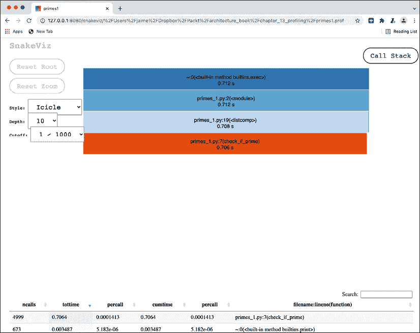
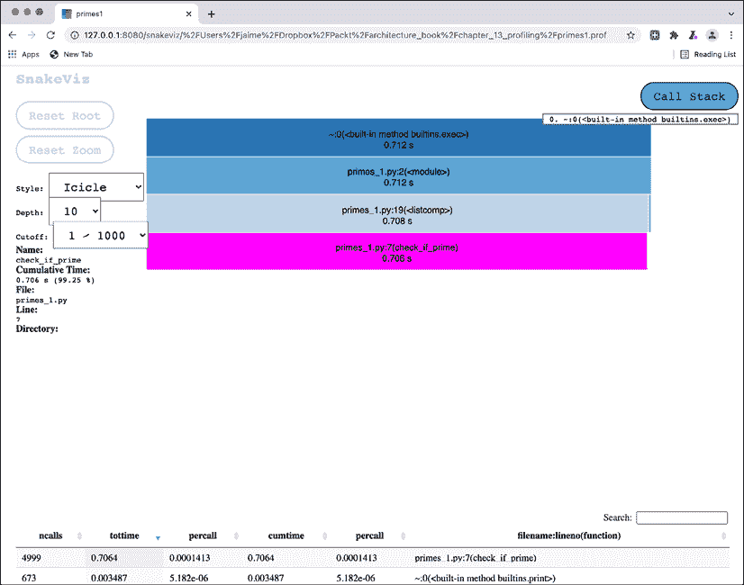
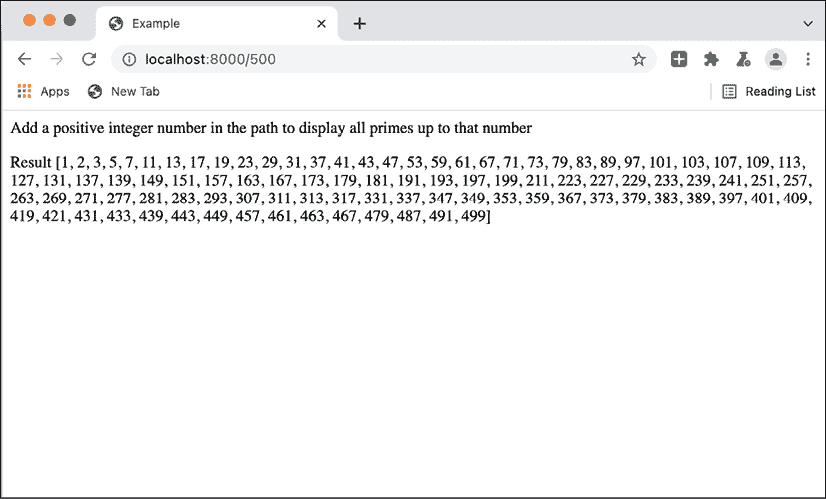
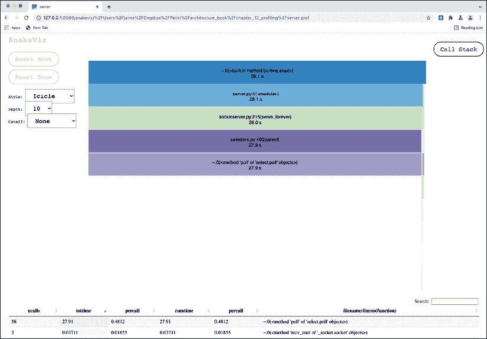
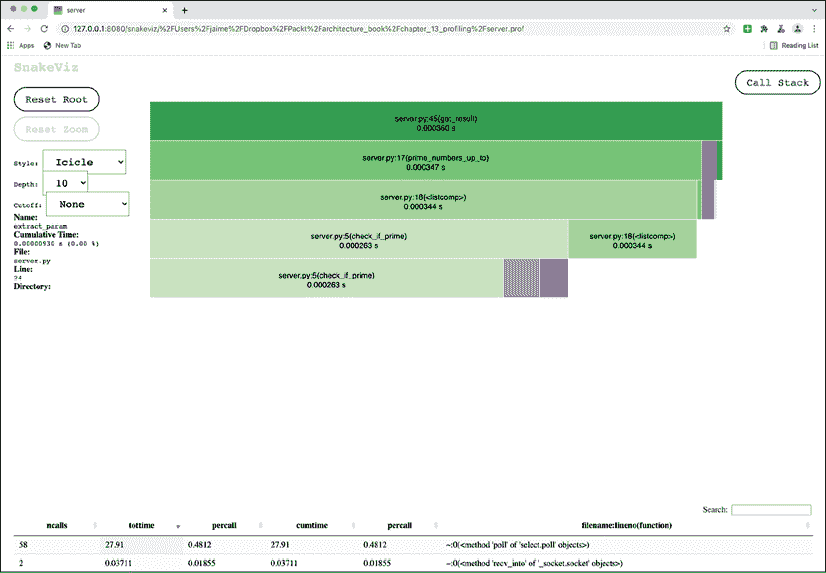
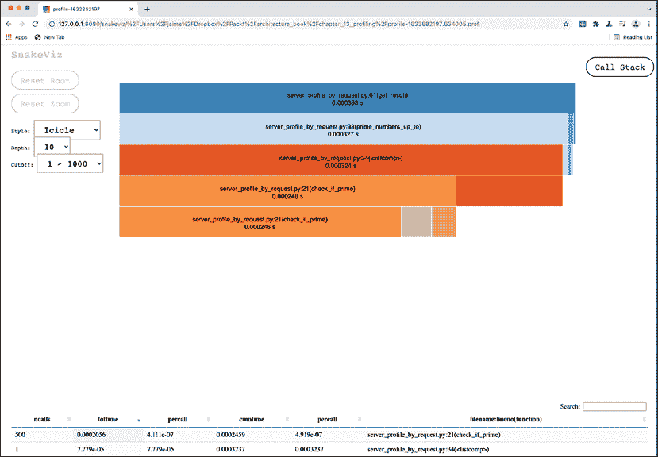

# 第十四章：分析

在使用真实数据测试后，编写的代码可能并不完美。除了错误之外，我们还可以发现代码的性能不足的问题。可能某些请求花费了太多时间，或者可能是内存使用过高。

在那些情况下，很难确切知道哪些关键元素花费了最多时间或内存。虽然尝试跟踪逻辑是可能的，但通常一旦代码发布，瓶颈将出现在几乎无法事先知晓的点。

为了了解确切发生的情况并跟踪代码流，我们可以使用分析器来动态分析代码，更好地理解代码的执行情况，特别是大多数时间花在了哪里。这可能导致对代码最关键部分的调整和改进，这些改进是由数据驱动的，而不是模糊的推测。

在本章中，我们将涵盖以下主题：

+   分析基础

+   分析器的类型

+   对代码进行时间分析

+   部分分析

+   内存分析

首先，我们将探讨分析的基本原则。

# 分析基础

分析是一种动态分析，它通过向代码添加工具来理解其运行情况。这些信息被提取并编译成可以用于基于实际案例更好地了解特定行为的方式，因为代码是正常运行的。这些信息可以用来改进代码。

与动态分析相比，某些静态分析工具可以提供对代码某些方面的洞察。例如，它们可以用来检测某些代码是否是死代码，这意味着它在整个代码中没有被调用过。或者，它们可以检测一些错误，比如使用未定义的变量，比如在打字错误时。但它们不适用于实际运行的代码的特定细节。分析将基于被仪器化的用例提供具体数据，并将返回关于代码流的更多信息。

常规的代码分析应用是为了提升被分析代码的性能。通过理解其在实际中的执行情况，可以揭示代码模块和可能引起问题的部分的动态。然后，可以在这些特定区域采取行动。

性能可以从两个方面来理解：要么是*时间性能*（代码执行所需的时间）要么是*内存性能*（代码执行所需的内存）。两者都可能成为瓶颈。某些代码可能执行时间过长或使用大量内存，这可能会限制其运行的硬件。

在本章中，我们将更关注时间性能，因为它通常是一个更大的问题，但我们也会解释如何使用内存分析器。

在软件开发中，一个常见的案例是，直到代码执行之前，你并不真正知道你的代码将要做什么。覆盖那些出现频率较低的边缘情况的条款可能会执行比预期更多的操作，而且当存在大数组时，软件的工作方式也会不同，因为某些算法可能不够充分。

问题在于在系统运行之前进行这种分析非常困难，而且在大多数时候，是徒劳的，因为问题代码很可能完全出乎意料。

> 程序员会浪费大量的时间思考或担心他们程序中非关键部分的运行速度，而这些试图提高效率的努力在考虑调试和维护时实际上会产生强烈的负面影响。我们应该忘记小的效率，比如说 97%的时间：**过早优化是万恶之源**。然而，我们不应该错过那关键的 3%的机会。
> 
> 邓肯·克努特 – 使用 GOTO 语句进行结构化编程 - 1974 年。

分析提供了我们理想的工具来*不*过早优化，而是根据真实、具体的数据进行优化。其理念是你不能优化你不能衡量的东西。分析器测量，以便可以采取行动。

上面的著名引言有时被简化为“过早优化是万恶之源”，这有点过于简化，没有体现出细微差别。有时，精心设计元素很重要，并且可以提前规划。尽管分析（或其他技术）可能很好，但它们只能走这么远。但重要的是要理解，在大多数情况下，采取简单的方法更好，因为性能已经足够好，而且可以在少数情况下进行改进。

分析可以通过不同的方式实现，每种方式都有其优缺点。

# 分析器的类型

主要有两种时间分析器：

+   **确定性分析器**，通过跟踪过程。确定性分析器对代码进行仪器化并记录每个单独的命令。这使得确定性分析器非常详细，因为它们可以跟踪每一步的代码，但与此同时，代码的执行速度比没有仪器化时要慢。

+   确定性分析器不适合持续执行。相反，它们可以在特定情况下被激活，比如在运行特定的离线测试时，以找出问题。

+   **统计配置文件**，通过采样。这种类型的分析器，而不是通过代码的仪器化和检测每个操作，而是在特定间隔内唤醒并获取当前代码执行堆栈的样本。如果这个过程持续足够长的时间，它将捕获程序的总体执行情况。

对堆栈进行采样类似于拍照。想象一下火车站或地铁站，人们正在穿越以从一个站台到另一个站台。采样类似于每隔一定时间拍照，例如每 5 分钟一次。当然，不可能精确地知道谁从哪个站台来，到哪个站台去，但经过一整天，它将提供足够的信息，了解有多少人经过以及哪些站台最受欢迎。

虽然它们提供的信息不如确定性分析器详细，但统计分析器更加轻量级，并且不消耗许多资源。它们可以启用以持续监控实时系统，而不会干扰其性能。

统计分析器仅在相对负载的系统上才有意义，因为在系统未受压力的情况下，它们会显示大部分时间都在等待。

如果采样是在解释器上直接进行的，统计分析器可以是内部的；如果是一个不同的程序在采样，它甚至可以是外部的。外部分析器的优势在于，即使采样过程中有任何问题，也不会干扰被采样的程序。

这两种分析器可以看作是互补的。统计分析器是理解代码中最常访问部分以及系统总体上花费时间的好工具。它们存在于实时系统中，其中实际的案例使用决定了系统的行为。

确定性分析器是分析开发者笔记本电脑中 Petri Dish 中特定用例的工具，其中某个有问题的特定任务可以被仔细分解和分析，以进行改进。

在某些方面，统计分析器类似于指标，而确定性分析器类似于日志。一个显示聚合元素，另一个显示特定元素。与日志不同，确定性分析器并不是在实时系统中使用时的理想工具，尽管如此。

通常，代码会呈现*热点*，即经常执行的慢速部分。找到需要关注的特定部分并对其采取行动是提高整体速度的好方法。

这些热点可以通过分析来揭示，无论是通过使用统计分析器检查*全局*热点，还是使用确定性分析器针对特定任务检查*特定*热点。前者将显示代码中最常使用的特定部分，这使我们能够了解哪些部分被频繁调用并且总体上花费了最多的时间。确定性分析器可以显示对于特定任务，每一行代码需要多长时间，并确定哪些是慢速元素。

我们不会查看统计分析器，因为它们需要负载下的系统，并且很难在适合本书范围的测试中创建。您可以检查`py-spy`([`pypi.org/project/py-spy/`](https://pypi.org/project/py-spy/))或`pyinstrument`([`pypi.org/project/pyinstrument/`](https://pypi.org/project/pyinstrument/))。

另一种分析器是内存分析器。内存分析器记录内存增加和减少的时间，跟踪内存的使用情况。通常使用内存分析来找出内存泄漏，尽管在 Python 程序中这种情况很少见，但它们确实可能发生。

Python 有一个垃圾收集器，当对象不再被引用时，它会自动释放内存。这不需要采取任何行动，因此与像 C/C++这样的手动内存分配程序相比，内存管理更容易处理。Python 使用的垃圾收集机制称为*引用计数*，一旦内存对象不再被任何人使用，它就会立即释放内存，与其他类型的垃圾收集器相比，后者会等待。

在 Python 的情况下，内存泄漏可以通过以下三种主要使用场景来创建，从更可能到最少：

+   一些对象即使不再使用，仍然被引用。这通常发生在存在长期存在的对象，它们将小元素保存在大元素中时，例如，当列表或字典被添加而不是删除时。

+   内部 C 扩展没有正确管理内存。这可能需要使用特定的 C 分析工具进行进一步调查，但这本书的范围不包括这一点。

+   复杂的引用循环。引用循环是一组相互引用的对象，例如，对象 A 引用 B，对象 B 引用 A。虽然 Python 有算法可以检测它们并释放内存，但垃圾收集器被禁用或存在其他错误的可能性很小。您可以在 Python 垃圾收集器这里了解更多信息：[`docs.python.org/3/library/gc.html`](https://docs.python.org/3/library/gc.html)。

最可能额外使用内存的情况是使用大量内存的算法，而检测内存分配的时间可以通过内存分析器来实现。

内存分析通常比时间分析更复杂，需要更多的努力。

让我们引入一些代码并对其进行分析。

# 分析代码以计时

我们将首先创建一个简短的程序，该程序将计算并显示所有小于特定数字的素数。素数是只能被自己和 1 整除的数。

我们首先尝试一种简单的方法：

```py
def check_if_prime(number):

    result = True

    for i in range(2, number):

        if number % i == 0:

            result = False

    return result 
```

此代码将取从 2 到待测试数字（不包括它本身）的每个数字，并检查该数字是否可被整除。如果在任何点上它可被整除，则该数字不是素数。

为了从 1 到 5,000 进行计算，以验证我们没有犯任何错误，我们将包括小于 100 的第一个素数，并进行比较。这是在 GitHub 上，作为 `primes_1.py` 可用，[`github.com/PacktPublishing/Python-Architecture-Patterns/blob/main/chapter_14_profiling/primes_1.py`](https://github.com/PacktPublishing/Python-Architecture-Patterns/blob/main/chapter_14_profiling/primes_1.py)。

```py
PRIMES = [1, 2, 3, 5, 7, 11, 13, 17, 19, 23, 29, 31, 37, 41, 43, 47, 53,

          59, 61, 67, 71, 73, 79, 83, 89, 97]

NUM_PRIMES_UP_TO = 5000

def check_if_prime(number):

    result = True

    for i in range(2, number):

        if number % i == 0:

            result = False

    return result

if __name__ == '__main__':

    # Calculate primes from 1 to NUM_PRIMES_UP_TO

    primes = [number for number in range(1, NUM_PRIMES_UP_TO)

              if check_if_prime(number)]

    # Compare the first primers to verify the process is correct

    assert primes[:len(PRIMES)] == PRIMES

    print('Primes')

    print('------')

    for prime in primes:

        print(prime)

    print('------') 
```

素数的计算是通过创建一个包含所有数字（从 1 到 `NUM_PRIMES_UP_TO`）的列表，并验证每个数字来完成的。只有返回 `True` 的值才会被保留：

```py
 # Calculate primes from 1 to NUM_PRIMES_UP_TO

    primes = [number for number in range(1, NUM_PRIMES_UP_TO)

              if check_if_prime(number)] 
```

下一个 `assert` 行断言第一个素数与在 `PRIMES` 列表中定义的相同，这是一个硬编码的包含小于 100 的第一个素数的列表。

```py
assert primes[:len(PRIMES)] == PRIMES 
```

最后打印出素数。让我们执行程序，计时其执行时间：

```py
$ time python3 primes_1.py

Primes

------

1

2

3

5

7

11

13

17

19

… 

4969

4973

4987

4993

4999

------

Real      0m0.875s

User      0m0.751s

sys 0m0.035s 
```

从这里，我们将开始分析代码，看看内部发生了什么，并看看我们是否可以改进它。

## 使用内置的 cProfile 模块

分析模块最简单、最快的方法是直接使用 Python 中包含的 `cProfile` 模块。此模块是标准库的一部分，可以作为外部调用的一部分进行调用，如下所示：

```py
$ time python3 -m cProfile primes_1.py

Primes

------

1

2

3

5

...

4993

4999

------

         5677 function calls in 0.760 seconds

   Ordered by: standard name

   ncalls  tottime  percall  cumtime  percall filename:lineno(function)

        1    0.002    0.002    0.757    0.757 primes_1.py:19(<listcomp>)

        1    0.000    0.000    0.760    0.760 primes_1.py:2(<module>)

     4999    0.754    0.000    0.754    0.000 primes_1.py:7(check_if_prime)

        1    0.000    0.000    0.760    0.760 {built-in method builtins.exec}

        1    0.000    0.000    0.000    0.000 {built-in method builtins.len}

      673    0.004    0.000    0.004    0.000 {built-in method builtins.print}

        1    0.000    0.000    0.000    0.000 {method 'disable' of '_lsprof.Profiler' objects}

Real      0m0.895s

User      0m0.764s

sys 0m0.032s 
```

注意，这里正常调用脚本，但也展示了分析结果。表格显示：

+   `ncalls`：每个元素被调用的次数

+   `tottime`：每个元素上花费的总时间，不包括子调用

+   `percall`：每个元素上的调用时间（不包括子调用）

+   `cumtime`：累计时间 – 每个元素上花费的总时间，包括子调用

+   `percall`：元素上的调用时间，包括子调用

+   `filename:lineno`：分析下的每个元素

在这种情况下，时间明显花在了 `check_if_prime` 函数上，该函数被调用了 4,999 次，占用了几乎全部的时间（744 毫秒，与总共 762 毫秒相比）。

由于这是一个小脚本，这里不容易看到，但 `cProfile` 会增加代码的执行时间。有一个名为 `profile` 的等效模块，它是直接替换的，但用纯 Python 实现，而不是 C 扩展。请一般使用 `cProfile`，因为它更快，但 `profile` 在某些时刻可能很有用，比如尝试扩展功能时。

虽然这个文本表格对于像这样的简单脚本已经足够，但输出可以作为一个文件呈现，然后使用其他工具显示：

```py
$ time python3 -m cProfile -o primes1.prof  primes_1.py

$ ls primes1.prof

primes1.prof 
```

现在我们需要安装可视化工具 SnakeViz，通过 `pip` 安装：

```py
$ pip3 install snakeviz 
```

最后，使用 `snakeviz` 打开文件，它将打开一个浏览器并显示信息：

```py
$ snakeviz primes1.prof

snakeviz web server started on 127.0.0.1:8080; enter Ctrl-C to exit

http://127.0.0.1:8080/snakeviz/%2FUsers%2Fjaime%2FDropbox%2FPackt%2Farchitecture_book%2Fchapter_13_profiling%2Fprimes1.prof 
```



图 14.1：分析信息的图形表示。整个页面太大，无法全部显示，因此有意裁剪以展示部分信息。

此图是交互式的，我们可以点击并悬停在不同的元素上以获取更多信息：



图 14.2：检查`check_if_prime`的信息。整页内容太大，无法在这里显示，因此有意裁剪以显示一些信息。

我们可以确认大部分时间都花在了`check_if_prime`上，但我们没有得到关于其内部的信息。

这是因为`cProfile`只有函数粒度。你会看到每个函数调用花费了多长时间，但没有更低的分辨率。对于这个特别简单的函数，这可能不够。

不要低估这个工具。提供的代码示例故意很简单，以避免花费太多时间解释其使用方法。大多数情况下，定位占用最多时间的函数就足够了，以便进行视觉检查并发现哪些操作耗时过长。请记住，在大多数实际情况下，耗时将花在外部调用上，如数据库访问、远程请求等。

我们将看到如何使用具有更高分辨率的分析器，分析每一行代码。

## 行分析器

要分析`check_if_prime`函数，我们首先需要安装模块`line_profiler`。

```py
$ pip3 install line_profiler 
```

安装完成后，我们将在代码中进行一些小的更改，并将其保存为`primes_2.py`。我们将为`check_if_prime`函数添加装饰器`@profile`，以指示行分析器查看它。

请记住，您应该只分析您想了解更多信息的代码部分。如果所有代码都以这种方式进行分析，分析将花费很多时间。

代码将如下所示（其余部分不受影响）。您可以在 GitHub 上查看整个文件[`github.com/PacktPublishing/Python-Architecture-Patterns/blob/main/chapter_14_profiling/primes_2.py`](https://github.com/PacktPublishing/Python-Architecture-Patterns/blob/main/chapter_14_profiling/primes_2.py)。

```py
@profile

def check_if_prime(number):

    result = True

    for i in range(2, number):

        if number % i == 0:

            result = False

    return result 
```

现在使用`kernprof`执行代码，该工具将在安装`line_profiler`后安装。

```py
$ time kernprof -l primes_2.py

Primes

------

1

2

3

5

…

4987

4993

4999

------

Wrote profile results to primes_2.py.lprof

Real      0m12.139s

User      0m11.999s

sys 0m0.098s 
```

注意到执行时间明显更长——启用分析器后为 12 秒，而没有启用分析器时为亚秒级执行。现在我们可以使用以下命令查看结果：

```py
$ python3 -m line_profiler primes_2.py.lprof

Timer unit: 1e-06 s

Total time: 6.91213 s

File: primes_2.py

Function: check_if_prime at line 7

Line #      Hits         Time  Per Hit   % Time  Line Contents

==============================================================

     7                                           @profile

     8                                           def check_if_prime(number):

     9      4999       1504.0      0.3      0.0      result = True

    10

    11  12492502    3151770.0      0.3     45.6      for i in range(2, number):

    12  12487503    3749127.0      0.3     54.2          if number % i == 0:

    13     33359       8302.0      0.2      0.1              result = False

    14

    15      4999       1428.0      0.3      0.0      return result 
```

在这里，我们可以开始分析所使用的算法的具体细节。主要问题似乎是我们做了很多比较。第 11 行和第 12 行都被调用得太多次，尽管每次调用的时间很短。我们需要找到一种方法来减少它们被调用的次数。

第一个很简单。一旦找到`False`结果，我们就不需要再等待了；我们可以直接返回，而不是继续循环。代码将如下所示（存储在`primes_3.py`中，可在[`github.com/PacktPublishing/Python-Architecture-Patterns/blob/main/chapter_14_profiling/primes_3.py`](https://github.com/PacktPublishing/Python-Architecture-Patterns/blob/main/chapter_14_profiling/primes_3.py)找到）：

```py
@profile

def check_if_prime(number):

    for i in range(2, number):

        if number % i == 0:

            return False

    return True

Let's take a look at the profiler result.

$ time kernprof -l primes_3.py

... 

Real      0m2.117s

User      0m1.713s

sys       0m0.116s

$ python3 -m line_profiler primes_3.py.lprof

Timer unit: 1e-06 s

Total time: 0.863039 s

File: primes_3.py

Function: check_if_prime at line 7

Line #      Hits         Time  Per Hit   % Time  Line Contents

==============================================================

     7                                           @profile

     8                                           def check_if_prime(number):

     9

    10   1564538     388011.0      0.2     45.0      for i in range(2, number):

    11   1563868     473788.0      0.3     54.9          if number % i == 0:

    12      4329       1078.0      0.2      0.1              return False

    13

    14       670        162.0      0.2      0.0      return True 
```

我们看到时间已经大幅减少（与之前用`time`测量的 12 秒相比，减少了 2 秒），我们看到比较所花费的时间大幅减少（之前是 3,749,127 微秒，然后是 473,788 微秒），这主要是因为比较次数减少了 10 倍，从 1,563,868 次减少到 12,487,503 次。

我们还可以通过限制循环的大小来进一步减少比较次数。

目前，循环将尝试将源数字除以所有小于或等于自身的数字。例如，对于 19，我们尝试这些数字（因为 19 是一个质数，它只能被自身整除）。

```py
Divide 19 between

[2, 3, 4, 5, 6, 7, 8, 9, 10, 11, 12, 13, 14, 15, 16, 17, 18, 19] 
```

尝试所有这些数字并不是必要的。至少，我们可以跳过其中的一半，因为没有任何数字能被大于它一半的数字整除。例如，19 除以 10 或更高的数字小于 2。

```py
Divide 19 between

[2, 3, 4, 5, 6, 7, 8, 9, 10] 
```

此外，一个数字的任何因子都将小于它的平方根。这可以这样解释：如果一个数字是两个或更多数字的因子，它们可能的最大值是整个数字的平方根。所以我们只检查到平方根（向下取整）的数字：

```py
Divide 19 between

[2, 3, 4] 
```

但我们可以进一步减少它。我们只需要检查 2 之后的奇数，因为任何偶数都能被 2 整除。所以，在这种情况下，我们甚至进一步减少了它。

```py
Divide 19 between

[2, 3] 
```

为了应用所有这些，我们需要再次调整代码，并将其存储在`primes_4.py`中，可在 GitHub 上找到：[`github.com/PacktPublishing/Python-Architecture-Patterns/blob/main/chapter_14_profiling/primes_4.py`](https://github.com/PacktPublishing/Python-Architecture-Patterns/blob/main/chapter_14_profiling/primes_4.py)：

```py
def check_if_prime(number):

    if number % 2 == 0 and number != 2:

        return False

    for i in range(3, math.floor(math.sqrt(number)) + 1, 2):

        if number % i == 0:

            return False

    return True 
```

代码总是检查除以 2 的余数，除非数字是 2。这是为了正确地返回 2 作为质数。

然后，我们创建一个从 3 开始的数字范围（因为我们已经测试了 2），直到该数字的平方根。我们使用`math`模块来执行操作并将数字向下取整到最接近的整数。`range`函数需要这个数字的`+1`，因为它不包括定义的数字。最后，范围步长为 2 个整数，这样所有的数字都是奇数，因为我们从 3 开始。

例如，为了测试像 1,000 这样的数字，这是等效的代码。

```py
>>> import math

>>> math.sqrt(1000)

31.622776601683793

>>> math.floor(math.sqrt(1000))

31

>>> list(range(3, 31 + 1, 2))

[3, 5, 7, 9, 11, 13, 15, 17, 19, 21, 23, 25, 27, 29, 31] 
```

注意，由于我们添加了`+1`，31 被返回。

让我们再次分析代码。

```py
$ time kernprof -l primes_4.py

Primes

------

1

2

3

5

…

4973

4987

4993

4999

------

Wrote profile results to primes_4.py.lprof

Real      0m0.477s

User      0m0.353s

sys       0m0.094s 
```

我们看到性能有了显著提升。让我们看看线形图。

```py
$ python3 -m line_profiler primes_4.py.lprof

Timer unit: 1e-06 s

Total time: 0.018276 s

File: primes_4.py

Function: check_if_prime at line 8

Line #      Hits         Time  Per Hit   % Time  Line Contents

==============================================================

     8                                           @profile

     9                                           def check_if_prime(number):

    10

    11      4999       1924.0      0.4     10.5      if number % 2 == 0 and number != 2:

    12      2498        654.0      0.3      3.6          return False

    13

    14     22228       7558.0      0.3     41.4      for i in range(3, math.floor(math.sqrt(number)) + 1, 2):

    15     21558       7476.0      0.3     40.9          if number % i == 0:

    16      1831        506.0      0.3      2.8              return False

    17

    18       670        158.0      0.2      0.9      return True 
```

我们将循环迭代次数大幅减少到 22,228 次，从`primes_3.py`中的 150 万次和`primes_2.py`中的超过 1200 万次，当我们开始线形分析时。这是一项重大的改进！

你可以尝试在`primes_2.py`和`primes_4.py`中增加`NUM_PRIMES_UP_TO`的值，并比较它们。变化将非常明显。

线形方法应该只用于小部分。一般来说，我们已经看到`cProfile`可以更有用，因为它更容易运行，并且提供信息。

前面的章节假设我们能够运行整个脚本并接收结果，但这可能并不正确。让我们看看如何在程序的各个部分进行分析，例如，当接收到请求时。

# 部分分析

在许多场景中，分析器在系统运行的环境中非常有用，我们不能等待整个过程完成后再获取分析信息。典型的场景是网络请求。

如果我们想要分析特定的网络请求，我们可能需要启动一个网络服务器，生成一个单独的请求，然后停止过程以获取结果。由于我们将看到的一些问题，这并不像您想象的那么有效。

但首先，让我们编写一些代码来解释这种情况。

## 示例网络服务器返回质数

我们将使用函数 `check_if_prime` 的最终版本，并创建一个返回请求路径中指定数字的所有质数的网络服务。代码如下，并且可以在 GitHub 上的 `server.py` 文件中完全找到，网址为 [`github.com/PacktPublishing/Python-Architecture-Patterns/blob/main/chapter_14_profiling/server.py`](https://github.com/PacktPublishing/Python-Architecture-Patterns/blob/main/chapter_14_profiling/server.py)。

```py
from http.server import BaseHTTPRequestHandler, HTTPServer

import math

def check_if_prime(number):

    if number % 2 == 0 and number != 2:

        return False

    for i in range(3, math.floor(math.sqrt(number)) + 1, 2):

        if number % i == 0:

            return False

    return True

def prime_numbers_up_to(up_to):

    primes = [number for number in range(1, up_to + 1)

              if check_if_prime(number)]

    return primes

def extract_param(path):

    '''

    Extract the parameter and transform into

    a positive integer. If the parameter is

    not valid, return None

    '''

    raw_param = path.replace('/', '')

    # Try to convert in number

    try:

        param = int(raw_param)

    except ValueError:

        return None

    # Check that it's positive

    if param < 0:

        return None

    return param

def get_result(path):

    param = extract_param(path)

    if param is None:

        return 'Invalid parameter, please add an integer'

    return prime_numbers_up_to(param)

class MyServer(BaseHTTPRequestHandler):

    def do_GET(self):

        result = get_result(self.path)

        self.send_response(200)

        self.send_header("Content-type", "text/html")

        self.end_headers()

        return_template = '''

            <html>

                <head><title>Example</title></head>

                <body>

                    <p>Add a positive integer number in the path to display

                    all primes up to that number</p>

                    <p>Result {result}</p>

                </body>

            </html>

        '''

        body = bytes(return_template.format(result=result), 'utf-8')

        self.wfile.write(body)

if __name__ == '__main__':

    HOST = 'localhost'

    PORT = 8000

    web_server = HTTPServer((HOST, PORT), MyServer)

    print(f'Server available at http://{HOST}:{PORT}')

    print('Use CTR+C to stop it')

    # Capture gracefully the end of the server by KeyboardInterrupt

    try:

        web_server.serve_forever()

    except KeyboardInterrupt:

        pass

    web_server.server_close()

    print("Server stopped.") 
```

如果从结尾开始，代码更容易理解。最后的代码块使用 Python 模块 `http.server` 中的基本 `HTTPServer` 定义创建了一个网络服务器。之前，我们创建了 `MyServer` 类，该类在 `do_GET` 方法中定义了如果发生 `GET` 请求应该做什么。

`do_GET` 方法返回一个包含由 `get_result` 计算的结果的 HTML 响应。它添加所有必要的头信息，并以 HTML 格式格式化正文。

过程中有趣的部分发生在接下来的函数中。

`get_result` 是根函数。它首先调用 `extract_param` 来获取一个数字，这是我们用来计算质数的阈值。如果正确，则将其传递给 `prime_numbers_up_to`。

```py
def get_result(path):

    param = extract_param(path)

    if param is None:

        return 'Invalid parameter, please add an integer'

    return prime_numbers_up_to(param) 
```

函数 `extract_params` 会从 URL 路径中提取一个数字。它首先移除任何 `/` 字符，然后尝试将其转换为整数并检查该整数是否为正。对于任何错误，它返回 `None`。

```py
def extract_param(path):

    '''

    Extract the parameter and transform into

    a positive integer. If the parameter is

    not valid, return None

    '''

    raw_param = path.replace('/', '')

    # Try to convert in number

    try:

        param = int(raw_param)

    except ValueError:

        return None

    # Check that it's positive

    if param < 0:

        return None

    return param 
```

函数 `prime_numbers_up_to` 最终计算的是传入数字的所有质数。这与我们在本章前面看到的代码类似。

```py
def prime_numbers_up_to(up_to):

    primes = [number for number in range(1, up_to + 1)

              if check_if_prime(number)]

    return primes 
```

最后，我们在本章前面广泛讨论的 `check_if_prime` 函数与 `primes_4.py` 中的相同。

可以通过以下方式启动此过程：

```py
$ python3 server.py

Server available at http://localhost:8000

Use CTR+C to stop it 
```

然后通过访问 `http://localhost:8000/500` 来测试，尝试获取 500 以内的所有质数。



图 14.3：显示所有 500 以内质数的界面

如您所见，我们得到了一个可理解的输出。让我们继续分析我们用来获取它的过程。

## 分析整个过程

我们可以通过在`cProfile`下启动整个过程来分析整个流程，然后捕获其输出。我们这样启动，向`http://localhost:8000/500`发送单个请求，并检查结果。

```py
$ python3 -m cProfile -o server.prof server.py

Server available at http://localhost:8000

Use CTR+C to stop it

127.0.0.1 - - [10/Oct/2021 14:05:34] "GET /500 HTTP/1.1" 200 -

127.0.0.1 - - [10/Oct/2021 14:05:34] "GET /favicon.ico HTTP/1.1" 200 -

^CServer stopped. 
```

我们已经将结果存储在文件`server.prof`中。然后可以使用`snakeviz`像以前一样分析此文件。

```py
$ snakeviz server.prof

snakeviz web server started on 127.0.0.1:8080; enter Ctrl-C to exit 
```

这显示了以下图示：



图 14.4：完整配置文件的图示。整个页面太大，无法在这里显示，因此有意裁剪以显示一些信息。

如您所见，该图显示在测试的大部分时间内，代码正在等待新的请求，并在内部执行轮询操作。这是服务器代码，而不是我们的代码。

要找到我们关心的代码，我们可以在下面的长列表中手动搜索`get_result`，这是我们代码中有趣部分的根源。务必选择`Cutoff: None`以显示所有函数。

选择后，图示将从那里开始显示。务必向上滚动以查看新的图示。



图 14.5：从`get_result`开始的图示。整个页面太大，无法在这里显示，因此有意裁剪以显示一些信息。

在这里，您可以看到代码执行的更多一般结构。您可以看到，大部分时间都花在了多次`check_if_prime`调用上，这些调用构成了`prime_numbers_up_to`的大部分，以及其中包含的列表推导，而花在`extract_params`上的时间非常少。

但这种方法存在一些问题：

+   首先，我们需要在启动和停止进程之间完成一个完整的周期。对于请求来说，这样做很麻烦。

+   周期中发生的所有事情都被包括在内。这给分析增加了噪音。幸运的是，我们知道有趣的部分在`get_result`中，但这可能并不明显。此案例也使用了一个最小结构，但在像 Django 这样的复杂框架中添加它可能会导致很多问题。

+   如果我们处理两个不同的请求，它们将被添加到同一个文件中，再次混合结果。

这些问题可以通过仅对感兴趣的部分应用分析器并为每个请求生成新文件来解决。

## 每个请求生成一个配置文件

为了能够为每个单独的请求生成包含信息的不同文件，我们需要创建一个易于访问的装饰器。这将进行性能分析和生成独立的文件。

在文件`server_profile_by_request.py`中，我们得到与`server.py`中相同的代码，但添加了以下装饰器。

```py
from functools import wraps

import cProfile

from time import time

def profile_this(func):

    @wraps(func)

    def wrapper(*args, **kwargs):

        prof = cProfile.Profile()

        retval = prof.runcall(func, *args, **kwargs)

        filename = f'profile-{time()}.prof'

        prof.dump_stats(filename)

        return retval

    return wrapper 
```

装饰器定义了一个`wrapper`函数，它替换了原始函数。我们使用`wraps`装饰器来保留原始名称和文档字符串。

这只是一个标准的装饰器过程。Python 中的装饰器函数是返回一个函数，然后替换原始函数。如您所见，原始函数`func`仍然在替换它的包装器内部被调用，但它增加了额外的功能。

在内部，我们启动一个性能分析器，并使用`runcall`函数在其下运行函数。这一行是核心——使用生成的性能分析器，我们运行原始函数`func`及其参数，并存储其返回值。

```py
retval = prof.runcall(func, *args, **kwargs) 
```

之后，我们生成一个包含当前时间的新文件，并通过`.dump_stats`调用将统计信息存入其中。

我们还装饰了`get_result`函数，因此我们的性能分析从这里开始。

```py
@profile_this

def get_result(path):

    param = extract_param(path)

    if param is None:

        return 'Invalid parameter, please add an integer'

    return prime_numbers_up_to(param) 
```

完整代码位于文件`server_profile_by_request.py`中，可在 GitHub 上找到：[`github.com/PacktPublishing/Python-Architecture-Patterns/blob/main/chapter_14_profiling/server_profile_by_request.py`](https://github.com/PacktPublishing/Python-Architecture-Patterns/blob/main/chapter_14_profiling/server_profile_by_request.py)。

现在让我们启动服务器并通过浏览器进行一些调用，一个调用到`http://localhost:8000/500`，另一个调用到`http://localhost:8000/800`。

```py
$ python3 server_profile_by_request.py

Server available at http://localhost:8000

Use CTR+C to stop it

127.0.0.1 - - [10/Oct/2021 17:09:57] "GET /500 HTTP/1.1" 200 -

127.0.0.1 - - [10/Oct/2021 17:10:00] "GET /800 HTTP/1.1" 200 - 
```

我们可以看到新文件的创建过程：

```py
$ ls profile-*

profile-1633882197.634005.prof 

profile-1633882200.226291.prof 
```

这些文件可以使用`snakeviz`显示：

```py
$ snakeviz profile-1633882197.634005.prof

snakeviz web server started on 127.0.0.1:8080; enter Ctrl-C to exit 
```



图 14.6：单个请求的性能信息。整个页面太大，无法全部显示，因此有意裁剪以展示部分信息。

每个文件只包含从`get_result`开始的信息，该信息只获取到某个点。更重要的是，每个文件只显示特定请求的信息，因此可以单独进行性能分析，具有很高的详细程度。

代码可以调整以更具体地包含诸如调用参数之类的详细信息，这可能很有用。另一个有趣的可能的调整是创建一个随机样本，这样只有 X 次调用中的 1 次会产生性能分析代码。这有助于减少性能分析的开销，并允许您完全分析一些请求。

这与统计性能分析器不同，因为它仍然会完全分析一些请求，而不是检测特定时间发生的事情。这有助于跟踪特定请求的流程。

接下来，我们将看到如何进行内存分析。

# 内存分析

有时，应用程序会使用过多的内存。最坏的情况是，随着时间的推移，它们会使用越来越多的内存，通常是由于所谓的内存泄漏，由于编码中的某些错误，保持不再使用的内存。其他问题也可能包括内存使用可能得到改进的事实，因为它是有限的资源。

为了分析内存使用情况以及确定占用内存的对象，我们首先需要创建一些示例代码。我们将生成足够的莱昂纳多数。

伦纳德数是遵循以下定义的序列的数：

+   第一个伦纳德数是 1

+   第二个伦纳德数也是 1

+   任何其他的伦纳德数都是前两个伦纳德数加 1

伦纳德数与斐波那契数相似。实际上，它们是相关的。我们用它们代替斐波那契数来展示更多的多样性。数字很有趣！

我们通过创建一个递归函数并存储在`leonardo_1.py`文件中，来展示前 35 个伦纳德数，该文件可在 GitHub 上找到，链接为[`github.com/PacktPublishing/Python-Architecture-Patterns/blob/main/chapter_14_profiling/leonardo_1.py`](https://github.com/PacktPublishing/Python-Architecture-Patterns/blob/main/chapter_14_profiling/leonardo_1.py)。

```py
def leonardo(number):

    if number in (0, 1):

        return 1

    return leonardo(number - 1) + leonardo(number - 2) + 1

NUMBER = 35

for i in range(NUMBER + 1):

    print('leonardo[{}] = {}'.format(i, leonardo(i))) 
```

你可以运行代码，并看到它逐渐变慢。

```py
$ time python3 leonardo_1.py

leonardo[0] = 1

leonardo[1] = 1

leonardo[2] = 3

leonardo[3] = 5

leonardo[4] = 9

leonardo[5] = 15

...

leonardo[30] = 2692537

leonardo[31] = 4356617

leonardo[32] = 7049155

leonardo[33] = 11405773

leonardo[34] = 18454929

leonardo[35] = 29860703

real      0m9.454s

user      0m8.844s

sys 0m0.183s 
```

为了加快过程，我们发现可以使用记忆化技术，这意味着存储结果并使用它们而不是每次都进行计算。

我们像这样更改代码，创建`leonardo_2.py`文件（可在 GitHub 上找到，链接为[`github.com/PacktPublishing/Python-Architecture-Patterns/blob/main/chapter_14_profiling/leonardo_2.py`](https://github.com/PacktPublishing/Python-Architecture-Patterns/blob/main/chapter_14_profiling/leonardo_2.py)）。

```py
CACHE = {}

def leonardo(number):

    if number in (0, 1):

        return 1

    if number not in CACHE:

        result = leonardo(number - 1) + leonardo(number - 2) + 1

        CACHE[number] = result

    return CACHE[number]

NUMBER = 35000

for i in range(NUMBER + 1):

    print(f'leonardo[{i}] = {leonardo(i)}') 
```

这使用了一个全局字典`CACHE`来存储所有的伦纳德数，从而加快了过程。注意，我们将要计算的数字数量从`35`增加到`35000`，增加了千倍。这个过程运行得相当快。

```py
$ time python3 leonardo_2.py

leonardo[0] = 1

leonardo[1] = 1

leonardo[2] = 3

leonardo[3] = 5

leonardo[4] = 9

leonardo[5] = 15

...

leonardo[35000] = ...

real      0m15.973s

user      0m8.309s

sys       0m1.064s 
```

现在我们来看看内存使用情况。

## 使用内存分析器

既然我们的应用程序开始存储信息了，让我们使用一个分析器来显示内存存储的位置。

我们需要安装`memory_profiler`这个包。这个包与`line_profiler`类似。

```py
$ pip install memory_profiler 
```

我们现在可以在`leonardo`函数中添加一个`@profile`装饰器（该函数存储在`leonardo_2p.py`文件中，可在 GitHub 上找到，链接为[`github.com/PacktPublishing/Python-Architecture-Patterns/blob/main/chapter_14_profiling/leonardo_2p.py`](https://github.com/PacktPublishing/Python-Architecture-Patterns/blob/main/chapter_14_profiling/leonardo_2p.py)），并使用`memory_profiler`模块运行它。你会注意到这次运行速度变慢了，但在常规结果之后，它会显示一个表格。

```py
$ time python3 -m memory_profiler leonardo_2p.py

...

Filename: leonardo_2p.py

Line #    Mem usage    Increment  Occurences   Line Contents

============================================================

     5  104.277 MiB   97.082 MiB      104999   @profile

     6                                         def leonardo(number):

     7

     8  104.277 MiB    0.000 MiB      104999       if number in (0, 1):

     9   38.332 MiB    0.000 MiB           5           return 1

    10

    11  104.277 MiB    0.000 MiB      104994       if number not in CACHE:

    12  104.277 MiB    5.281 MiB       34999           result = leonardo(number - 1) + leonardo(number - 2) + 1

    13  104.277 MiB    1.914 MiB       34999           CACHE[number] = result

    14

    15  104.277 MiB    0.000 MiB      104994       return CACHE[number]

Real      0m47.725s

User      0m25.188s

sys 0m10.372s 
```

这个表格首先显示了内存使用情况，以及增加或减少的量，以及每一行出现的次数。

你可以看到以下内容：

+   第 9 行只执行几次。当它执行时，内存量大约为`38 MiB`，这将是最小内存使用量。

+   总共使用的内存接近`105 MiB`。

+   整个内存增加都集中在第 12 行和第 13 行，当我们创建一个新的伦纳德数并将其存储在`CACHE`字典中时。注意我们在这里从未释放内存。

我们并不真的需要在任何时候都保留所有之前的伦纳德数在内存中，我们可以尝试一种不同的方法来只保留少数几个。

## 内存优化

我们创建了一个名为 `leonardo_3.py` 的文件，其中包含以下代码，可在 GitHub 上找到：[`github.com/PacktPublishing/Python-Architecture-Patterns/blob/main/chapter_14_profiling/leonardo_3.py`](https://github.com/PacktPublishing/Python-Architecture-Patterns/blob/main/chapter_14_profiling/leonardo_3.py)：

```py
CACHE = {}

@profile

def leonardo(number):

    if number in (0, 1):

        return 1

    if number not in CACHE:

        result = leonardo(number - 1) + leonardo(number - 2) + 1

        CACHE[number] = result

    ret_value = CACHE[number]

    MAX_SIZE = 5

    while len(CACHE) > MAX_SIZE:

        # Maximum size allowed,

        # delete the first value, which will be the oldest

        key = list(CACHE.keys())[0]

        del CACHE[key]

    return ret_value

NUMBER = 35000

for i in range(NUMBER + 1):

    print(f'leonardo[{i}] = {leonardo(i)}') 
```

注意我们保留了 `@profile` 装饰器以再次运行内存分析器。大部分代码都是相同的，但我们添加了以下额外的代码块：

```py
 MAX_SIZE = 5

    while len(CACHE) > MAX_SIZE:

        # Maximum size allowed,

        # delete the first value, which will be the oldest

        key = list(CACHE.keys())[0]

        del CACHE[key] 
```

此代码将 `CACHE` 字典中的元素数量保持在一定范围内。当达到限制时，它将删除 `CACHE.keys()` 返回的第一个元素，这将是最旧的元素。

自从 Python 3.6 版本以来，所有的 Python 字典都是有序的，因此它们会按照之前输入的顺序返回它们的键。我们正是利用这一点。注意，我们需要将 `CACHE.keys()`（一个 `dict_keys` 对象）的结果转换为列表，以便获取第一个元素。

字典无法增长。现在让我们尝试运行它，看看分析的结果。

```py
$ time python3 -m memory_profiler leonardo_3.py

...

Filename: leonardo_3.py

Line #    Mem usage    Increment  Occurences   Line Contents

============================================================

     5   38.441 MiB   38.434 MiB      104999   @profile

     6                                         def leonardo(number):

     7

     8   38.441 MiB    0.000 MiB      104999       if number in (0, 1):

     9   38.367 MiB    0.000 MiB           5           return 1

    10

    11   38.441 MiB    0.000 MiB      104994       if number not in CACHE:

    12   38.441 MiB    0.008 MiB       34999           result = leonardo(number - 1) + leonardo(number - 2) + 1

    13   38.441 MiB    0.000 MiB       34999           CACHE[number] = result

    14

    15   38.441 MiB    0.000 MiB      104994       ret_value = CACHE[number]

    16

    17   38.441 MiB    0.000 MiB      104994       MAX_SIZE = 5

    18   38.441 MiB    0.000 MiB      139988       while len(CACHE) > MAX_SIZE:

    19                                                 # Maximum size allowed,

    20                                                 # delete the first value, which will be the oldest

    21   38.441 MiB    0.000 MiB       34994           key = list(CACHE.keys())[0]

    22   38.441 MiB    0.000 MiB       34994           del CACHE[key]

    23

    24   38.441 MiB    0.000 MiB      104994       return ret_value 
```

在这种情况下，我们看到内存稳定在约 `38 MiB` 左右，这是我们看到的最低值。在这种情况下，请注意没有增加或减少。实际上，这里发生的是增加和减少的幅度太小，以至于无法察觉。因为它们相互抵消，所以报告接近零。

`memory-profiler` 模块还能够执行更多操作，包括根据时间显示内存使用情况并绘制图表，因此您可以查看内存随时间增加或减少。请查看其完整文档：[`pypi.org/project/memory-profiler/`](https://pypi.org/project/memory-profiler/)。

# 摘要

在本章中，我们描述了什么是分析以及何时应用它是有用的。我们描述了分析是一个动态工具，它允许您了解代码是如何运行的。这些信息在理解实际情境中的流程以及能够利用这些信息优化代码时非常有用。代码通常可以通过优化来执行得更快，但还有其他替代方案，例如使用更少的资源（通常是内存）、减少外部访问等。

我们描述了主要的分析器类型：确定性分析器、统计性分析器和内存分析器。前两者主要面向提高代码性能，而内存分析器则分析代码在执行过程中使用的内存。确定性分析器通过在代码执行时详细记录代码的流程来对代码进行测量。统计性分析器在固定时间间隔对代码进行采样，以提供代码中执行频率较高的部分的总体视图。

我们展示了如何使用确定性分析器来分析代码，并给出了一个示例。我们首先使用内置模块`cProfile`进行分析，它提供了函数解析。我们看到了如何使用图形工具来展示结果。为了更深入地分析，我们使用了第三方模块`line-profiler`，它会遍历每一行代码。一旦理解了代码的流程，就可以对其进行优化，以大大减少其执行时间。

下一步是了解如何分析一个打算持续运行的过程，比如一个网络服务器。我们展示了在这种情况下尝试分析整个应用程序的问题，并描述了如何为了清晰起见，对每个单独的请求进行分析。

这些技术也适用于其他情况，如条件分析、仅在特定情况下分析，例如在特定时间或每 100 个请求中的一个。

最后，我们还提供了一个示例来分析内存，并使用`memory-profiler`模块查看其使用情况。

在下一章中，我们将学习更多关于如何通过调试技术找到和修复代码中的问题的细节，包括在复杂情况下的处理。
