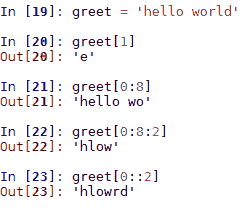

# 第一章：Python 对象、类型和表达式

Python 是许多高级数据任务的优选语言，这有一个非常好的原因。Python 是最容易学习的高级编程语言之一。直观的结构和语义意味着对于不是计算机科学家的人来说，比如生物学家、统计学家或初创公司的负责人，Python 是执行各种数据任务的直接途径。它不仅仅是一种脚本语言，而是一种功能齐全的面向对象编程语言。

在 Python 中，有许多有用的数据结构和算法内置在语言中。此外，由于 Python 是一种基于对象的编程语言，因此相对容易创建自定义数据对象。在本书中，我们将检查 Python 的内部库，一些外部库，以及如何从第一原理构建自己的数据对象。

本书假设您已经了解 Python。然而，如果您对 Python 有点生疏，来自其他语言，或者根本不知道 Python，请不要担心，第一章应该能迅速让您跟上进度。如果不行，请访问 [`docs.python.org/3/tutorial/index.html`](https://docs.python.org/3/tutorial/index.html)，您也可以在 [`www.python.org/doc/`](https://www.python.org/doc/) 找到文档。这些都是学习这种编程语言的极好资源。

在本章中，我们将探讨以下主题：

+   获得数据结构和算法的一般工作知识

+   理解核心数据类型及其功能

+   探索 Python 编程语言的面向对象特性

# 理解数据结构和算法

算法和数据结构是计算中最基本的概念。它们是构建复杂软件的基石。对这些基础概念的理解在软件设计中至关重要，这涉及到以下三个特征：

+   算法如何操作数据结构中包含的信息

+   数据在内存中的排列方式

+   特定数据结构的性能特征是什么

在本书中，我们将从多个角度探讨这个主题。首先，我们将从数据结构和算法的角度来看 Python 编程语言的基础。其次，拥有正确的数学工具非常重要。我们需要理解一些计算机科学的基本概念，而这需要数学知识。通过采用启发式方法，制定一些指导原则意味着，通常情况下，我们不需要超过高中数学水平就能理解这些关键思想的原则。

另一个重要方面是评估。衡量算法性能涉及理解数据大小每增加一次如何影响该数据上的操作。当我们处理大型数据集或实时应用时，我们的算法和结构尽可能高效是至关重要的。

最后，我们需要一个合理的实验设计策略。能够将现实世界问题概念性地转化为编程语言的算法和数据结构，涉及到理解问题的关键要素以及将这些要素映射到编程结构的方法。

为了让我们对算法思维有所了解，让我们考虑一个现实世界的例子。想象我们在一个不熟悉的市场，并被分配购买一系列项目的任务。我们假设市场布局是随机的，每个供应商销售的项目子集是随机的，其中一些可能在我们列表上。我们的目标是尽量减少每个项目的价格以及尽量减少在市场花费的时间。一种方法是编写如下算法：

对每个供应商重复：

1.  供应商是否有我列表上的项目，并且成本是否低于该项目的预测成本？

1.  如果是，购买并从列表中删除；如果不是，转到下一个供应商。

1.  如果没有更多的供应商，结束。

这是一个简单的迭代器，包含决策和动作。如果我们实现这个功能，我们需要数据结构来定义我们想要购买的项目列表以及每个供应商的项目列表。我们需要确定匹配每个列表中项目的最佳方式，并且需要某种逻辑来决定是否购买。

关于这个算法，我们可以做出几个观察。首先，由于成本计算基于预测，我们不知道实际的平均成本是多少；如果我们低估了某个项目的成本，我们会在市场结束时发现列表上还有剩余的项目。因此，我们需要一种有效的方法来回溯到成本最低的供应商。

此外，我们需要了解当我们的购物列表上的项目数量或每个供应商销售的项目数量增加时，比较购物列表上的项目与每个供应商销售的项目所需的时间会发生什么变化。我们搜索项目的顺序和数据结构的形式可以大大影响搜索所需的时间。显然，我们希望以这种方式安排我们的列表，以及我们访问每个供应商的顺序，以最小化搜索时间。

此外，考虑当我们改变购买条件为以*最低*价格购买，而不仅仅是低于平均价格时会发生什么。这完全改变了问题。我们不再按顺序从一个供应商走到下一个供应商，我们需要遍历市场一次，并利用这些知识，我们可以根据我们想要访问的供应商来排序我们的购物列表。

显然，将现实世界问题转化为编程语言等抽象结构涉及许多细微之处。例如，随着我们在市场的进展，我们对产品成本的了解不断改进，因此我们的预测平均价格变量变得更加准确，直到最后摊位，我们对市场的了解变得完美。假设任何类型的回溯算法都会产生成本，我们可以看到有必要审查我们的整个策略。诸如高价格变异性、我们的数据结构的大小和形状以及回溯的成本等因素都决定了最合适的解决方案。

# Python 用于数据

Python 具有几个内置的数据结构，包括列表、字典和集合，我们使用它们来构建自定义对象。此外，还有一些内部库，如 collections 和`math`对象，允许我们创建更高级的结构以及在这些结构上执行计算。最后，还有外部库，如`SciPy`包中找到的库。这些库允许我们执行一系列高级数据任务，如逻辑回归和线性回归、可视化以及矩阵和向量的数学计算等。外部库对于“即用型”解决方案非常有用。然而，我们也必须意识到，与从头开始构建自定义对象相比，通常会有性能上的损失。通过学习如何自己编写这些对象，我们可以针对特定任务进行优化，使它们更高效。这并不是要排除外部库的作用，我们将在第十二章*设计技术和策略**中探讨这一点*。

首先，我们将概述一些关键语言特性，这些特性使 Python 成为数据编程的绝佳选择。

# Python 环境

Python 环境的特性之一是其交互式控制台，它允许你既可以将 Python 用作桌面可编程计算器，也可以用作编写和测试代码片段的环境。控制台的**读取-评估-打印**循环是一种与大型代码库交互的非常方便的方式，例如运行函数和方法或创建类的实例。这是 Python 相对于 C/C++或 Java 等编译语言的主要优势之一，在 Python 的读取-评估-打印循环中，**编写-编译-测试-重新编译**的周期可以显著增加开发时间。能够输入表达式并获得即时响应可以大大加快数据科学任务的速度。

除了官方的 CPython 版本之外，还有一些优秀的 Python 发行版。其中最受欢迎的两个是 Anaconda ([`www.continuum.io/downloads`](https://www.continuum.io/downloads)) 和 Canopy ([`www.enthought.com/products/canopy/`](https://www.enthought.com/products/canopy/))。大多数发行版都附带自己的开发环境。Canopy 和 Anaconda 都包括用于科学、机器学习和其他数据应用的库。大多数发行版都附带一个编辑器。

除了 CPython 版本之外，还有许多 Python 控制台的实现。其中最值得注意的是 Ipython/Jupyter 平台，它包括一个基于网络的计算环境。

# 变量和表达式

将现实世界的问题转化为算法可以解决的问题，有两个相互关联的任务。首先，选择变量，其次，找到与这些变量相关的表达式。变量是附加到对象上的标签；它们不是对象本身。它们也不是对象的容器。变量不包含对象，而是作为对象指针或引用。例如，考虑以下代码：


在这里，我们创建了一个变量 `a`，它指向一个列表对象。我们创建了另一个变量 `b`，它指向这个相同的列表对象。当我们向这个列表对象添加一个元素时，这个变化会在 `a` 和 `b` 中都反映出来。

Python 是一种动态类型语言。在程序执行期间，变量名可以绑定到不同的值和类型。每个值都有其类型，例如字符串或整数；然而，指向这个值的名称并没有特定的类型。这与许多语言（如 C 和 Java）不同，在这些语言中，名称代表固定的大小、类型和内存中的位置。这意味着当我们初始化 Python 中的变量时，我们不需要声明类型。此外，变量，或者更具体地说，它们指向的对象，可以根据分配给它们的值改变类型，例如：


# 变量作用域

理解函数内部变量的作用域规则非常重要。每次函数执行时，都会创建一个新的局部命名空间。这代表了一个包含函数分配的参数和变量名称的局部环境。当函数被调用时，Python 解释器首先搜索局部命名空间（即函数本身），如果找不到匹配项，它将搜索全局命名空间。这个全局命名空间是定义函数的模块。如果名称仍然没有找到，它将搜索内置命名空间。最后，如果这还失败，解释器将引发一个 `NameError` 异常。考虑以下代码：

```py
    a=10; b=20 
    def my_function(): 
        global a 
        a=11; b=21 
    my_function() 
    print(a) #prints 11 
    print(b) #prints 20

```

这是前面代码的输出：


在前面的代码中，我们定义了两个全局变量。我们需要使用关键字`global`告诉解释器，在函数内部，我们正在引用一个全局变量。当我们将其更改为`11`时，这些更改将在全局范围内反映出来。然而，我们设置为`21`的变量`b`是局部于函数的，并且在该函数内部对其所做的任何更改都不会反映在全局范围内。当我们运行该函数并打印`b`时，我们看到它保留了其全局值。

# 流程控制和迭代

Python 程序由一系列语句组成。解释器按顺序执行每个语句，直到没有更多语句为止。这适用于既作为主程序运行，也通过`import`加载的文件。所有语句，包括变量赋值、函数定义、类定义和模块导入，都具有相同的状态。没有比其他语句具有更高优先级的特殊语句，每个语句都可以放置在程序中的任何位置。有两种主要方式来控制程序执行的流程，即条件语句和循环。

`if`、`else`和`elif`语句控制语句的条件执行。一般格式是一系列`if`和`elif`语句，后跟一个最终的`else`语句：

```py
    x='one' 
    if x==0:  
        print('False') 
    elif x==1: 
        print('True') 
    else: print('Something else') 
    #prints 'Something else' 

```

注意使用`==`运算符来测试相同的值。如果值相等，则返回`true`；否则返回`false`。还要注意，将`x`设置为字符串将返回*其他内容*，而不是像在非动态类型语言中可能发生的那样生成类型错误。动态类型语言，如 Python，允许灵活地为不同类型的对象分配。

控制程序流程的另一种方式是使用循环。它们是通过`while`或`for`语句创建的，例如：


# 数据类型和对象概述

Python 包含 12 种内置数据类型。这些包括四种数值类型（`int`、`float`、`complex`、`bool`）、四种序列类型（`str`、`list`、`tuple`、`range`）、一种映射类型（`dict`）和两种集合类型。还可以创建用户定义的对象，如函数或类。我们将在本章中查看`string`和`list`数据类型，并在下一章中查看剩余的内置类型。

Python 中的所有数据类型都是 **对象**。实际上，在 Python 中几乎一切都是对象，包括模块、类和函数，以及字符串和整数等字面量。Python 中的每个对象都有一个 **类型**、一个 **值** 和一个 **身份**。当我们编写 `greet = "hello world"` 时，我们正在创建一个具有值 `"hello world"` 和身份 `greet` 的字符串对象。对象的身份充当指向对象在内存中位置的指针。对象类型，也称为对象的类，描述了对象的内部表示以及它支持的方法和操作。一旦创建了对象的一个实例，其身份和类型就不能更改。

我们可以使用内置函数 `id()` 来获取对象的身份。这个函数返回一个标识整数，在大多数系统中这指的是它的内存位置，尽管你不应该在代码中依赖这一点。

此外，还有许多比较对象的方法，例如：

```py
    if a== b: #a and b have the same value 

    if a is b: # if a and b are the same object 
    if type(a) is type(b): # a and b are the same type 

```

需要在 **可变** 和 **不可变** 对象之间做出重要区分。可变对象，如列表，可以更改其值。它们有 `insert()` 或 `append()` 等方法可以更改对象的值。不可变对象，如字符串，不能更改其值，因此当我们运行它们的方法时，它们只是返回一个值，而不是更改底层对象的值。当然，我们可以通过将其赋值给变量或用作函数参数来使用这个值。

# 字符串

字符串是不可变序列对象，每个字符代表序列中的一个元素。与所有对象一样，我们使用方法来执行操作。字符串是不可变的，不会改变实例；每个方法只是返回一个值。这个值可以存储为另一个变量，或者作为函数或方法的参数。

以下表格列出了一些最常用的字符串方法和它们的描述：

| **方法** | **描述** |
| --- | --- |
| `s.count(substring, [start,end])` | 计算具有可选起始和结束参数的子串出现的次数。 |
| `s.expandtabs([tabsize])` | 将制表符替换为空格。 |
| `s.find(substring, [start, end])` | 返回子串首次出现的索引，如果未找到子串，则返回 `-1`。 |
| `s.isalnum()` | 如果所有字符都是字母数字，则返回 `True`，否则返回 `False`。 |
| `s.isalpha()` | 如果所有字符都是字母，则返回 `True`，否则返回 `False`。 |
| `s.isdigit()` | 如果所有字符都是数字，则返回 `True`，否则返回 `False`。 |
| `s.join(t)` | 将序列 `t` 中的字符串连接起来。 |
| `s.lower()` | 将字符串转换为全小写。 |
| `s.replace(old, new [maxreplace])` | 将旧子串替换为新子串。 |
| `s.strip([characters])` | 移除空白字符或可选字符。 |
| `s.split([separator], [maxsplit])` | 按空白字符或可选分隔符拆分字符串。返回列表。 |

字符串，像所有序列类型一样，支持索引和切片。我们可以通过使用其索引`s[i]`来检索字符串中的任何字符。我们可以通过使用`s[i:j]`来检索字符串的切片，其中`i`和`j`是切片的起始和结束点。我们可以通过使用步长来返回扩展切片，如下所示：`s[i:j:stride]`。以下代码应该会使这一点变得清晰：



前两个例子相当直接，分别返回字符串中索引为`1`的字符和字符串的前七个字符。请注意，索引从`0`开始。在第三个例子中，我们使用了步长`2`。这导致返回每个第二个字符。在最后一个例子中，我们省略了结束索引，切片返回整个字符串中的每个第二个字符。

您可以使用任何表达式、变量或运算符作为索引，只要值是整数即可，例如：


另一个常见的操作是使用循环遍历字符串，例如：


由于字符串是不可变的，一个常见的问题是我们在插入值时如何操作。我们不是改变字符串，而是需要考虑构建新的字符串对象以获得所需的结果。例如，如果我们想在问候语中插入一个单词，我们可以将变量分配给以下内容：


如此代码所示，我们使用切片运算符在索引位置`5`处拆分字符串，并使用`+`进行连接。Python 永远不会将字符串的内容解释为数字。如果我们需要对字符串进行数学运算，我们需要首先将它们转换为数值类型，例如：


# 列表

列表可能是 Python 中最常用的内置数据结构，因为它们可以由任意数量的其他数据类型组成。它们是任意对象的简单表示。像字符串一样，它们从零开始的整数进行索引。以下表格包含最常用的列表方法和它们的描述：

| **方法** | **描述** |
| --- | --- |
| `list(s)` | 返回序列`s`的列表。 |
| `s.append(x)` | 将元素`x`追加到`s`的末尾。 |
| `s.extend(x)` | 将列表`x`追加到`s`。 |
| `s.count(x)` | 统计`s`中`x`出现的次数。 |
| `s.index(x, [start], [stop])` | 返回最小的索引`i`，其中`s[i] == x`。搜索可以包括可选的起始和停止索引。 |
| `s.insert(i,e)` | 在索引`i`处插入`x`。 |
| `s.pop(i)` | 返回元素`i`并从列表中删除它。 |
| `s.remove(x)` | 从`s`中删除`x`。 |
| `s.reverse()` | 反转`s`的顺序。 |
| `s.sort(key ,[reverse])` | 使用可选的键和逆序对`s`进行排序。 |

当我们处理列表和其他*容器*对象时，了解 Python 用于复制它们的内部机制非常重要。Python 仅在必要时才创建真正的副本。当我们把一个变量的值赋给另一个变量时，这两个变量都指向相同的内存位置。只有当其中一个变量发生变化时，才会分配新的内存槽位。这对于列表等可变复合对象有重要的影响。考虑以下代码：


在这里，`list1`和`list2`变量都指向内存中的同一个槽位。当我们把`y`变量改为`4`时，我们是在改变`list1`指向的同一个`y`变量。

列表的一个重要特性是它们可以包含嵌套结构，即其他列表，例如：


我们可以使用方括号运算符来访问列表的值，由于列表是可变的，它们是在原地复制的。以下示例演示了我们可以如何使用这种方法来更新元素；例如，在这里我们提高了面粉的价格 20%：


创建列表的一种常见且直观的方法是使用**列表推导**。这允许我们通过直接将表达式写入列表来创建列表，例如：


列表推导非常灵活；例如，考虑以下代码。它本质上展示了两种不同的函数组合方式，其中我们将一个函数（`x * 4`）应用到另一个函数（`x * 2`）上。以下代码打印出两个列表，分别表示使用`for`循环和列表推导计算出的`f1`和`f2`的函数组合：

```py
    def f1(x): return x*2 
    def f2(x): return x*4 

    lst = [] 
    for i in range(16): 
        lst.append(f1(f2(i))) 

    print(lst) 

    print([f1(x)  for x in range(64) if x in [f2(j) for j in range(16)]]) 

```

输出的第一行来自`for`循环结构。第二行来自列表推导表达式：


列表推导也可以用来以更紧凑的形式复制嵌套循环的动作。例如，我们将`list1`中包含的每个元素相互相乘：


我们还可以使用列表推导与其他对象（如字符串）一起使用，以构建更复杂的数据结构。例如，以下代码创建了一个包含单词及其字母计数的列表：


正如我们将看到的，列表是我们将要查看的许多数据结构的基础。它们的灵活性、创建和使用简便性使它们能够构建更专业和复杂的数据结构。

# 函数作为一等对象

在 Python 中，不仅数据类型被视为对象。函数和类都是一等对象，允许它们以与内置数据类型相同的方式进行操作。根据定义，一等对象是：

+   在运行时创建

+   作为变量或数据结构中的赋值

+   作为函数的参数传递

+   作为函数的结果返回

在 Python 中，术语**一等对象**有点误导，因为它暗示了一种某种层次结构，而所有 Python 对象本质上都是一等对象。

要了解这是如何工作的，让我们定义一个简单的函数：

```py
    def greeting(language): 
    if language== 'eng': 
             return 'hello world' 
       if language  == 'fr' 
             return 'Bonjour le monde' 
       else: return 'language not supported' 

```

由于用户定义的函数是对象，我们可以做诸如将它们包含在其他对象中（如列表）之类的事情：


函数也可以用作其他函数的参数。例如，我们可以定义以下函数：


在这里，`callf()`接受一个函数作为参数，设置一个语言变量为`'eng'`，然后使用语言变量作为参数调用该函数。例如，如果我们想创建一个返回多种语言的特定句子的程序，这可能用于某种自然语言应用，我们可以看到这将是有用的。在这里，我们有一个设置语言的中心位置。除了我们的`greeting`函数外，我们还可以创建返回不同句子的类似函数。通过在设置语言的一个点上，程序的其他逻辑就不必担心这一点。如果我们想更改语言，我们只需更改语言变量，就可以保持其他一切不变。

# 高阶函数

将其他函数作为参数或返回函数的函数称为**高阶函数**。Python 3 包含两个内置的高阶函数，`filter()`和`map()`。请注意，在 Python 的早期版本中，这些函数返回列表；在 Python 3 中，它们返回一个迭代器，这使得它们更加高效。`map()`函数提供了一个简单的方法将每个项转换为一个可迭代的对象。例如，这是一个高效、紧凑地对序列执行操作的方法。注意使用`lambda`匿名函数：


类似地，我们可以使用内置的`filter`函数来过滤列表中的项：


注意，`map`和`filter`在实现上与列表推导式所能达到的功能相同。除了使用内置函数`map`和`filter`而不使用`lambda`运算符时，性能略有优势之外，似乎在性能特征上没有很大的差异。尽管如此，大多数风格指南推荐使用列表推导式而不是内置函数，这可能是由于它们通常更容易阅读。

创建我们自己的高阶函数是函数式编程风格的一个显著特点。以下是如何使用高阶函数的一个实际示例。在这里，我们将`len`函数作为键传递给`sort`函数。这样，我们可以根据长度对单词列表进行排序：


这里是另一个不区分大小写的排序示例：


注意`list.sort()`方法和内置的`sorted`函数之间的区别。`list.sort()`是`list`对象的一个方法，它对列表的现有实例进行排序而不进行复制。此方法改变目标对象并返回`None`。在 Python 中，这是一个重要的约定，即改变对象的函数或方法返回`None`，以清楚地表明没有创建新对象，而是改变了对象本身。

另一方面，内置的`sorted`函数返回一个新的列表。它实际上接受任何可迭代对象作为参数，但它总是返回一个列表。`list sort`和`sorted`都接受两个可选的关键字参数作为键。

使用`lambda`运算符通过元素的索引对更复杂的数据结构进行排序是一种简单的方法，例如：


在这里，我们根据价格对项目进行了排序。

# 递归函数

递归是计算机科学中最基本的概念之一。在 Python 中，我们可以通过在其自身函数体内调用它来实现递归函数。为了防止递归函数变成无限循环，我们需要至少一个测试终止情况的参数来结束递归。这有时被称为基本情况。应该指出的是，递归与迭代不同。尽管两者都涉及重复，迭代通过一系列操作进行循环，而递归则反复调用函数。两者都需要选择语句来结束。技术上，递归是迭代的一个特殊案例，称为尾递归，并且通常总是可以将迭代函数转换为递归函数，反之亦然。关于递归函数有趣的是，它们能够在有限语句中描述无限对象。

以下代码应该演示递归和迭代的区别。这两个函数简单地打印出`low`和`high`之间的数字，第一个使用迭代，第二个使用递归：


注意，在迭代示例`iterTest`中，我们使用`while`语句测试条件，然后调用`print`方法，最后增加`low`值。递归示例测试条件，打印，然后调用自身，在其参数中增加`low`变量。一般来说，迭代更有效；然而，递归函数通常更容易理解和编写。递归函数也适用于操作递归数据结构，如链表和树，正如我们将看到的。

# 生成器和协程

我们可以通过使用`yield`语句来创建不仅返回一个结果，而是返回整个结果序列的函数。这些函数被称为**生成器**。Python 包含生成器函数，这是一种创建迭代器的简单方法，并且它们特别适用于替代无法工作的长列表。生成器产生项目而不是构建列表。例如，以下代码展示了为什么我们可能选择使用生成器而不是创建列表：

```py
    # compares the running time of a list compared to a generator 
    import time 
    #generator function creates an iterator of odd numbers between n and m 
    def oddGen(n, m):         
        while n < m: 
            yield n 
            n += 2 
    #builds a list of odd numbers between n and m 
    def oddLst(n,m): 
        lst=[] 
        while n<m: 
            lst.append(n) 
            n +=2 
        return lst 
    #the time it takes to perform sum on an iterator    
    t1=time.time() 
    sum(oddGen(1,1000000)) 
    print("Time to sum an iterator: %f" % (time.time() - t1)) 

    #the time it takes to build and sum a list 
    t1=time.time() 
    sum(oddLst(1,1000000)) 
    print("Time to build and sum a list: %f" % (time.time() - t1))      

```

这将打印出以下内容：


如我们所见，构建一个列表来完成这个计算需要更长的时间。使用生成器带来的性能提升是因为值是在需要时生成的，而不是作为列表保存在内存中。计算可以在所有元素生成之前开始，并且只有在需要时才会生成元素。

在前面的例子中，`sum`方法在需要用于计算时将每个数字加载到内存中。这是通过生成器对象反复调用`__next__()`特殊方法来实现的。生成器永远不会返回除`None`之外的其他值。

通常，生成器对象用于`for`循环中。例如，我们可以利用前面代码中创建的`oddcount`生成器函数来打印出`1`到`10`之间的奇数：

```py
    for i in oddcount(1,10):print(i) 

```

我们还可以创建一个**生成器表达式**，它除了将方括号替换为圆括号外，使用相同的语法并执行与列表推导式相同的操作。然而，生成器表达式并不创建列表，而是创建一个**生成器对象**。这个对象并不创建数据，而是在需要时创建数据。这意味着生成器对象不支持如`append()`和`insert()`之类的序列方法。但是，你可以使用`list()`函数将生成器转换为列表：


# 类和面向对象编程

类是创建新类型对象的一种方式，它们是面向对象编程的核心。类定义了一组属性，这些属性在类的各个实例之间共享。通常，类是一组函数、变量和属性的集合。

面向对象范式非常有吸引力，因为它为我们提供了一个具体的方式来思考和表示程序的核心功能。通过围绕对象和数据而不是动作和逻辑来组织我们的程序，我们有一个强大且灵活的方式来构建复杂的应用程序。当然，动作和逻辑仍然存在，但通过将它们体现在对象中，我们有了封装功能的方法，允许对象以非常具体的方式改变。这使得我们的代码更不容易出错，更容易扩展和维护，并且能够模拟现实世界的对象。

在 Python 中，使用 `class` 语句创建类。这定义了一组与类实例集合相关的共享属性。一个类通常包含多个方法、类变量和计算属性。重要的是要理解，定义一个类本身并不会创建该类的任何实例。要创建一个实例，必须将一个变量分配给一个类。类体由一系列在类定义期间执行的语句组成。在类内部定义的函数称为**实例方法**。它们通过传递该类的实例作为第一个参数来对类实例执行一些操作。这个参数传统上被称为 `self`，但它可以是任何合法的标识符。以下是一个简单的例子：

```py
    class Employee(object): 
        numEmployee = 0 
        def __init__(self, name, rate): 
            self.owed = 0         
            self.name = name 
            self.rate=rate 
            Employee.numEmployee += 1 

        def __del__(self): 
            Employee.numEmployee -= 1 

        def hours(self, numHours): 
            self.owed += numHours * self.rate 
            return("%.2f hours worked" % numHours) 

        def pay(self):                 
            self.owed = 0 
            return("payed %s " % self.name) 

```

类变量，如 `numEmployee`，在类的所有实例之间共享值。在这个例子中，`numEmployee` 用于计算员工实例的数量。请注意，`Employee` 类实现了 `__init__` 和 `__del__` 特殊方法，我们将在下一节讨论。

我们可以通过以下方式创建 `Employee` 对象的实例，运行方法，并返回类和实例变量：


# 特殊方法

我们可以使用 `dir(object)` 函数获取特定对象的属性列表。以两个下划线开头和结尾的方法称为**特殊方法**。除了以下例外**，特殊方法通常由 Python 解释器而不是程序员调用；例如，当我们使用 `+` 运算符时，我们实际上是在调用 `__add__()`。例如，我们不必使用 `my_object.__len__()`，而是可以使用 `len(my_object)`。在字符串对象上使用 `len()` 实际上要快得多，因为它返回表示对象在内存中大小的值，而不是调用对象的 `__len__` 方法。我们实际上在程序中调用的唯一特殊方法是 `__init__` 方法，用于在类定义中调用超类初始化器。强烈建议不要在自己的对象中使用双下划线语法，因为可能会与 Python 的特殊方法产生当前或未来的冲突。

然而，我们可能想在自定义对象中实现特殊方法，以赋予它们一些内置类型的某些行为。在下面的代码中，我们创建了一个实现了 `__repr__` 方法的类。该方法创建了一个字符串表示，这对于检查目的很有用：

```py
    class my_class(): 
        def __init__(self, greet): 
            self.greet = greet 
        def __repr__(self): 
            return 'a custom object (%r)' % (self.greet) 

```

当我们创建这个对象的实例并检查它时，我们可以看到我们得到了定制的字符串表示。注意使用了 `%r` 格式占位符来返回对象的规范表示。这很有用，是最佳实践，因为在这种情况下，它显示 `greet` 对象是一个由引号指示的字符串：


# 继承

通过继承，可以创建一个新的类来修改现有类的行为。这是通过在类定义中将继承的类作为参数来实现的。这通常用于修改现有方法的行为，例如：

```py
    class specialEmployee(Employee): 
        def hours(self, numHours): 
            self.owed += numHours * self.rate * 2 
            return("%.2f hours worked" % numHours)    

```

`specialEmployee` 类的实例与 `Employee` 实例相同，除了更改了 `hours()` 方法。

为了使子类定义新的类变量，它需要定义一个 `__init__()` 方法，如下所示：

```py
    class specialEmployee(Employee): 
        def __init__(self,name,rate, bonus): 
            Employee.__init__(self, name, rate) #calls the base classes 
            self.bonus = bonus 

        def hours(self, numHours): 
            self.owed += numHours * self.rate + self.bonus  
            return("%.2f hours worked" % numHours)      

```

注意，基类的方 法不是自动调用的，并且派生类需要调用它们。我们可以使用内置函数 `isinstance(obj1, obj2)` 来测试类成员资格。如果 `obj1` 属于 `obj2` 的类或从 `obj2` 派生的任何类，则返回 true。

在类定义中，假设所有方法都操作实例，但这不是必需的。然而，还有其他类型的方 法：**静态方法**和**类方法**。静态方法只是一个恰好定义在类中的普通函数。它不对实例执行任何操作，并且使用 `@staticmethod` 类装饰器定义。静态方法不能访问实例的属性，因此它们最常用的用途是将实用函数分组在一起。

类方法操作的是类本身，而不是实例，就像类变量与类相关而不是与该类的实例相关一样。它们使用 `@classmethod` 装饰器定义，并且与实例方法区分开来，因为类作为第一个参数传递。按照惯例，这个参数命名为 `cls`。

```py
    class Aexp(object): 
        base=2 
        @classmethod 
        def exp(cls,x): 
            return(cls.base**x) 

    class Bexp(Aexp): 
            base=3 

```

类 `Bexp` 从 `Aexp` 类继承，并将基类变量更改为 `3`。我们可以如下运行父类的 `exp()` 方法：


虽然这个例子有点牵强，但有几个原因说明类方法可能很有用。例如，因为子类继承了其父类的所有相同功能，所以它有可能破坏继承的方法。使用类方法是一种定义确切运行哪些方法的方式。

# 数据封装和属性

除非另有说明，否则所有属性和方法都可以无限制地访问。这也意味着在基类中定义的任何内容都可以从派生类中访问。这可能导致我们在构建面向对象的应用程序时遇到问题，我们可能希望隐藏对象的内部实现。这可能导致派生类中定义的对象与基类定义的方法之间出现命名空间冲突。为了防止这种情况，我们定义私有属性的方法具有双下划线，例如`__privateMethod()`。这些方法名会自动更改为`_Classname__privateMethod()`，以防止与基类中定义的方法发生名称冲突。请注意，这并不严格地隐藏私有属性，而只是提供了一种防止名称冲突的机制。

建议在使用类**属性**定义可变属性时使用私有属性。属性是一种属性，它不是返回存储的值，而是在调用时计算其值。例如，我们可以用以下方式重新定义`exp()`属性：

```py
    class Bexp(Aexp): 
        __base=3 
        def __exp(self): 
            return(x**cls.base)     

```

在本章中，我们探讨了 Python 编程语言的一些基础知识，从基本操作到 Python 中的函数、类和对象。在下一章中，我们将详细探讨 Python 的内置数据结构。

# 摘要

本章为我们提供了 Python 编程的良好基础和入门。我们涵盖了变量的使用、列表、几个控制结构，并学习了如何使用条件语句。讨论了各种类型的对象，以及 Python 语言面向对象方面的相关材料。我们创建了自定义对象并从它们继承。

Python 还有更多功能。随着我们准备检查关于算法实现的一些后续章节，下一章将专注于数字、序列、映射和集合。这些也是 Python 中的数据类型，在组织数据以进行一系列操作时非常有用。
