# Python 数据类型和结构

在本章中，我们将详细检查 Python 数据类型。我们已经介绍了两种数据类型，即字符串 `str()` 和 `list()`。我们通常希望有更专业的对象来表示我们的数据。除了内置类型之外，还有一些内部模块允许我们在处理数据结构时解决常见问题。首先，我们将回顾一些对所有数据类型都通用的运算和表达式。

# 运算和表达式

有许多运算对所有数据类型都是通用的。例如，所有数据类型，以及通常所有对象，都可以以某种方式测试其真值。以下是在 Python 中被认为是 `False` 的值：

+   `None` 类型

+   `False`

+   整数、浮点数或复数零

+   空序列或映射

+   用户定义的类的实例，该类定义了一个返回零或 `False` 的 `__len__()` 或 `__bool__()` 方法

所有其他值都被认为是 `True`。

# 布尔运算

布尔运算返回 `True` 或 `False` 的值。布尔运算按优先级排序，因此如果表达式中有多个布尔运算，则优先级最高的运算将首先发生。以下表格按优先级降序概述了三个布尔运算符：

| **运算符** | **示例** |
| --- | --- |
| 非 `x` | 如果 `x` 是 `False`，则返回 `True`；否则返回 `False`。 |
| `x` 和 `y` | 如果 `x` 和 `y` 都为 `True`，则返回 `True`；否则返回 `False`。 |
| `x` 或 `y` | 如果 `x` 或 `y` 中的任何一个为 `True`，则返回 `True`；否则返回 `False`。 |

`and` 运算符和 `or` 运算符在评估表达式时使用“短路”。这意味着 Python 只会在需要时评估运算符。例如，如果 `x` 是 `True`，则在表达式 `x or y` 中，由于表达式显然是 `True`，所以不会评估 `y`。以类似的方式，在表达式 `x and y` 中，如果 `x` 是 `False`，则解释器将简单地评估 `x` 并返回 `False`，而不会评估 `y`。

# 比较和算术运算符

标准算术运算符（`+`、`-`、`*`、`/`）与所有 Python 数值类型一起工作。`//` 运算符给出一个整数商（例如，`3 // 2` 返回 `1`），指数运算符是 `x ** y`，而模运算符，由 `a % b` 给出，返回除法 `a/b` 的余数。比较运算符（`<`、`<=`、`>`、`>=`、`==` 和 `!=`）与数字、字符串、列表和其他集合对象一起工作，如果条件成立，则返回 `True`。对于集合对象，这些运算符比较元素的数量，并且等价运算符 `== b` 如果每个集合对象在结构上是等效的，并且每个元素的值都相同，则返回 `True`。

# 成员关系、身份和逻辑运算

成员运算符（`in`，`not in`）用于测试序列中的变量，例如列表或字符串，如你所期望的，`x in y` 如果变量 `x` 在 `y` 中找到，则返回 `True`。`is` 运算符比较对象身份。例如，以下代码片段显示了对象身份的对比等价性：

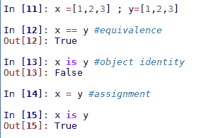

# 内置数据类型

Python 数据类型可以分为三类：数值型、序列型和映射型。还有一个表示空值或值不存在的 `None` 对象，也不应忘记，其他对象如类、文件和异常也可以被认为是 *类型*；然而，这里将不会考虑它们。

Python 中的每个值都有一个数据类型。与许多编程语言不同，在 Python 中，你不需要显式声明变量的类型。Python 在内部跟踪对象类型。

Python 内置数据类型如下表所示：

| **类别** | **名称** | **描述** |
| --- | --- | --- |
| 空值 | `None` | 空对象。 |
| 数值 | `int` | 整数。 |
|  | `float` | 浮点数。 |
|  | `complex` | 复数。 |
|  | `bool` | 布尔值（True，False）。 |
| 序列 | `str` | 字符串。 |
|  | `list` | 随意对象的列表。 |
|  | `Tuple` | 随意项的组。 |
|  | `range` | 创建一个整数范围。 |
| 映射 | `dict` | 键值对字典。 |
|  | `set` | 可变、无序且元素唯一的集合。 |
|  | `frozenset` | 不可变集合。 |

# 空值类型

`None` 类型是不可变的，只有一个值，即 `None`。它用于表示值不存在。它由未显式返回值的对象返回，在布尔表达式中求值为 `False`。它通常用作可选参数的默认值，以便函数检测调用者是否传递了值。

# 数值类型

除了 `bool` 之外的所有数值类型都是有符号的，并且都是不可变的。布尔值有两个可能的值，`True` 和 `False`。这些值分别映射到 1 和 0。整数类型 `int` 表示无限制范围的整数。浮点数由机器的本地双精度浮点表示表示。复数由两个浮点数表示。它们使用 `j` 运算符分配，以表示复数的虚部，例如：

```py
a = 2+3j

```

我们可以使用 `a.real` 和 `a.imag` 分别访问实部和虚部。

# 表示错误

应注意，浮点数的本地双精度表示可能导致一些意外的结果。例如，考虑以下情况：

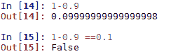

这是因为大多数十进制分数不能精确地表示为二进制分数，而大多数底层硬件都是用二进制分数表示浮点数的。对于可能存在问题的算法或应用程序，Python 提供了一个`decimal`模块。此模块允许精确表示十进制数，并便于控制诸如舍入行为、有效数字数量和精度等属性。它定义了两个对象，一个`Decimal`类型，表示十进制数，一个`Context`类型，表示各种计算参数，如精度、舍入和错误处理。其用法示例如下：

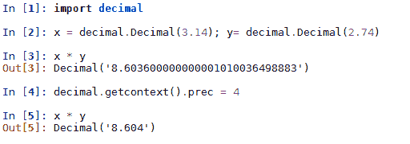

在这里，我们创建了一个全局上下文并设置了精度为`4`。`Decimal`对象可以像处理`int`或`float`一样处理。它们受到所有相同的数学运算的影响，可以用作字典键，放入集合中等。此外，`Decimal`对象还具有几个数学运算的方法，例如自然指数`x.exp()`、自然对数`x.ln()`和以 10 为底的对数`x.log10()`。

Python 还有一个`fractions`模块，它实现了有理数类型。以下示例展示了创建分数的几种方法：

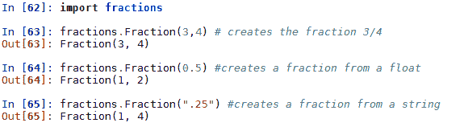

还值得一提的是`NumPy`扩展。它有数学对象（如数组、向量和矩阵）的类型，以及线性代数、傅里叶变换计算、特征向量、逻辑运算等功能。

# 序列

序列是有序的对象集合，通过非负整数索引。列表和元组是任意对象的序列，字符串是字符的序列。字符串、元组和范围对象是不可变的。所有序列类型都有一些共同的运算。对于所有序列，索引和切片操作符的用法如前一章所述。请注意，对于不可变类型，任何操作都只会返回一个值，而不会实际更改值。

所有序列都有以下方法：

| **方法** | **描述** |
| --- | --- |
| `len(s)` | `s`中的元素数量 |
| `min(s, [,default=obj, key=func])` | `s`中的最小值（对于字符串按字母顺序） |
| `max(s, [,default=obj, key=func])` | `s`中的最大值（对于字符串按字母顺序） |
| `sum(s,[,start=0])` | 元素的总和（如果`s`不是数值，则返回`TypeError`） |
| `all(s)` | 如果`s`中的所有元素都是 True（即不是`0`、`False`或`Null`），则返回`True` |
| `any(s)` | 检查`s`中的任何项是否为`True` |

此外，所有序列还支持以下操作：

| **操作** | **描述** |
| --- | --- |
| `s + r` | 连接两个相同类型的序列 |
| `s * n` | 创建`s`的`n`个副本，其中`n`是一个整数 |
| `v1, v2 ..., vn = s` | 从`s`中解包 n 个变量到`v1`、`v2`等 |
| `s[i]` | 索引返回 `s` 的元素 `i` |
| `s[i:j:stride]` | 切片返回 `i` 和 `j` 之间的元素，可选步长 |
| `x in s` | 如果元素 `x` 在 `s` 中，则返回 `True` |
| `x not in s` | 如果元素 `x` 不在 `s` 中，则返回 true |

# 元组

元组是由任意对象组成的不可变序列。它们可以通过大于零的整数进行索引。元组是**可哈希的**，这意味着我们可以对它们的列表进行排序，并且可以用作字典的键。在语法上，元组只是由逗号分隔的值序列；然而，通常的做法是将它们括在括号中：

```py
tpl= ('a', 'b', 'c') 

```

在创建只有一个元素的元组时，记得使用尾随逗号，例如：

```py
t = ('a',) 

```

如果没有尾随逗号，这将被视为一个字符串。

我们还可以使用内置函数 `tuple()` 创建元组。如果没有参数，这将创建一个空元组。如果 `tuple()` 的参数是一个序列，则这将创建一个包含该序列元素的元组，例如：

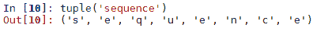

大多数运算符，如切片和索引，与列表上的操作方式相同。但是，由于元组是不可变的，尝试修改元组的元素将导致 `TypeError`。我们可以使用 `==`、`>` 和 `<` 运算符以与其他序列相同的方式比较元组。

元组的一个重要用途是允许我们通过在赋值语句的左侧放置一个元组来同时分配多个变量，例如：

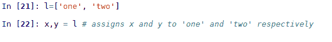

实际上，我们可以使用这种多重赋值在元组中交换值，例如：

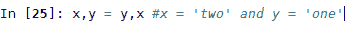

如果赋值语句两边的值数量不相同，将会抛出 `ValueError`。

# 字典

字典是由数字、字符串或其他不可变对象索引的对象的任意集合。字典本身是可变的；然而，它们的索引键必须是不可变的。以下表格包含所有字典方法和它们的描述：

| **方法** | **描述** |
| --- | --- |
| `len(d)` | `d` 中的项数。 |
| `d.clear()` | 从 `d` 中移除所有项。 |
| `d.copy()` | 创建 `d` 的浅拷贝。 |
| `d.fromkeys(s [,value])` | 返回一个新的字典，其键来自序列 `s`，值设置为 `value`。 |
| `d.get(k [,v])` | 如果找到，则返回 `d[k]`，否则返回 `v`，如果没有给出 `v`，则返回 None。 |
| `d.items()` | 返回 `d` 中的 `key:value` 对序列。 |
| `d.keys()` | 返回 `d` 中的键序列。 |
| `d.pop(k [,default])` | 返回 `d[k]` 并将其从 `d` 中移除。如果 `d[k]` 未找到，则返回默认值或引发 `KeyError`。 |
| `d.popitem()` | 从 `d` 中随机移除一个 `key:value` 对并将其作为元组返回。 |
| `d.setdefault(k [,v])` | 返回 `d[k]`。如果 `d[k]` 未找到，则返回 `v` 并将 `d[k]` 设置为 `v`。 |
| `d.update(b)` | 将 `b` 中的所有对象添加到 `d` 中。 |
| `d.values()` | 返回 `d` 中的值序列。 |

Python 字典是唯一的内置映射类型，它们类似于其他语言中找到的哈希表或关联数组。它们可以被视为从一组键到一组值的映射。它们使用语法`{key:value}`创建。例如，以下创建了一个将单词映射到数字的字典：

```py
d ={'one': 1 , 'two': 2, 'three': 3 } # creates a dictionary 

```

我们可以如下添加键和值：

```py
d['four']=4 #add an item 

```

或者使用以下方式更新多个值：

```py
d.update({'five': 5, 'six': 6}) #add multiple items 

```

当我们检查`d`时，我们得到以下结果：

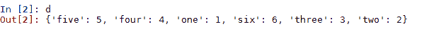

我们可以使用`in`运算符来测试一个值的出现，例如：

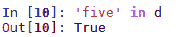

应该注意的是，当`in`运算符应用于字典时，其工作方式与应用于列表时略有不同。当我们使用`in`运算符在列表上时，找到元素所需的时间与列表大小之间的关系被认为是线性的。也就是说，随着列表大小的增加，找到元素所需的时间最多以线性方式增长。算法运行时间与其输入大小之间的关系通常被称为其时间复杂度。我们将在下一章（以及随后的章节）中更多地讨论这个重要的话题。

与`list`对象相比，当`in`运算符应用于字典时，它使用哈希算法，并且这种算法的效果是几乎独立于字典大小的查找时间增加。这使得字典作为处理大量索引数据的方式变得极其有用。我们将在第四章，*列表和指针结构*，以及第十三章，*实现、应用和工具*中更多地讨论这个重要的话题——哈希增长速率。

注意当我们打印出字典的`key:value`对时，它并不按特定顺序打印。这并不是一个问题，因为我们使用指定的键来查找每个字典值，而不是像字符串和列表那样使用有序的整数序列。

# 字典排序

如果我们想要对字典的键或值进行简单的排序，我们可以这样做：

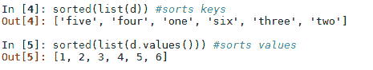

注意到上述代码中的第一行按字母顺序对键进行排序，而第二行按整数值对值进行排序。

`sorted()`方法有两个可选参数值得关注：`key`和`reverse`。`key`参数与字典键无关，而是将函数传递给排序算法以确定排序顺序的一种方式。例如，在以下代码中，我们使用`__getitem__`特殊方法根据字典值对字典键进行排序：

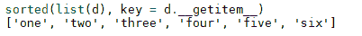

前面的代码实际上是在对`d`中的每个`key`使用相应的值进行排序。我们也可以根据词典键的排序顺序对值进行排序。然而，由于词典没有通过值返回`key`的方法，类似于列表的`list.index`方法，使用可选的`key`参数来做这一点有点棘手。一个替代方法是使用列表推导，以下示例演示了这一点：

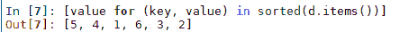

`sorted()`方法还有一个可选的`reverse`参数，不出所料，它确实做了它所说的，反转排序列表的顺序，例如：

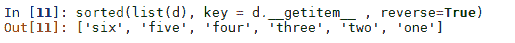

现在，假设我们得到了以下词典，以英语单词为键，法语单词为值。我们的任务是将这些字符串值放置在正确的数值顺序中：

```py
d2 ={'one':'uno' , 'two':'deux', 'three':'trois', 'four': 'quatre', 'five': 'cinq', 'six':'six'}

```

当然，当我们打印这个词典时，它不太可能按正确的顺序打印。因为所有键和值都是字符串，我们没有数值排序的上下文。为了将这些项放置在正确的顺序中，我们需要使用我们最初创建的词典，将单词映射到数字，作为我们英语到法语词典排序的方式：

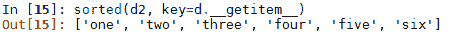

注意我们正在使用第一个词典`d`的值来对第二个词典`d2`的键进行排序。由于我们两个词典中的键是相同的，我们可以使用列表推导来对法语到英语词典的值进行排序：

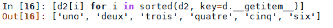

当然，我们可以定义自己的自定义方法，并将其用作`sorted`方法的`key`参数。例如，这里我们定义了一个函数，它简单地返回一个字符串的最后一个字母：

```py
def corder(string): 

   return(string[len(string)-1]) 

```

然后，我们可以将这个值作为`sorted`函数的`key`参数来按每个元素的最后一个字母进行排序：

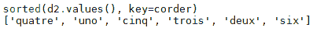

# 文本分析词典

词典的常见用途是计算序列中类似项的出现的次数；一个典型的例子是计算文本中单词的出现次数。以下代码创建了一个词典，其中文本中的每个单词用作键，出现次数作为其值。这使用了一个非常常见的嵌套循环的习语。在这里，我们使用它在外层循环中遍历文件的行，在内层循环中遍历词典的键：

```py
def wordcount(fname): 
    try: 
        fhand=open(fname) 
    except: 
        print('File cannot be opened') 
        exit() 

    count= dict() 
    for line in fhand: 
        words = line.split() 
        for word in words: 
            if word not in count: 
                count[word] = 1 
            else: 
                count[word] += 1 
    return(count) 

```

这将返回一个包含文本文件中每个唯一单词的元素的词典。一个常见的任务是过滤这些项到我们感兴趣的子集中。你需要一个与运行代码相同的目录中的文本文件。在这里，我们使用了`alice.txt`，这是《爱丽丝梦游仙境》的一个简短摘录。要获得相同的结果，你可以从[davejulian.net/bo5630](http://davejulian.net/bo5630)下载`alice.txt`，或者使用你自己的文本文件。在以下代码中，我们创建另一个包含`count`中子集的词典`filtered`：

```py
count=wordcount('alice.txt') 
filtered = { key:value for key, value in count.items() if value  < 20 and value > 15 } 

```

当我们打印过滤后的词典时，我们得到以下内容：

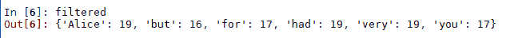

注意使用**字典推导**来构建过滤字典。字典推导与我们在第一章，“Python 对象、类型和表达式”中看到的列表推导以相同的方式工作。

# 集合

集合是无序的唯一项目集合。集合本身是可变的，我们可以从中添加和删除项目；然而，项目本身必须是不可变的。与集合的一个重要区别是它们不能包含重复的项目。集合通常用于执行诸如交集、并集、差集和补集之类的数学运算。

与序列类型不同，集合类型不提供任何索引或切片操作。与字典的情况一样，也没有与值关联的键。Python 中有两种集合对象，可变集合`set`对象和不可变`frozenset`对象。集合是通过在大括号内使用逗号分隔的值来创建的。顺便说一下，我们不能使用`a={}`创建一个空集合，因为这将会创建一个字典。要创建一个空集合，我们可以写`a=set()`或`a=frozenset()`。

集合的方法和操作如下表所述：

| **方法** | **运算符** | **描述** |
| --- | --- | --- |
| `len(s)` |  | 返回`s`中元素的数量 |
| `s.copy()` |  | 返回`s`的浅拷贝 |
| `s.difference(t)` | `s - t- t2 - ...` | 返回`s`中但不在`t`中的所有项目的集合 |
| `s.intersection(t)` |  | 返回`t`和`s`中所有项目的集合 |
| `s.isdisjoint(t)` |  | 如果`s`和`t`没有共同的项目，则返回 True |
| `s.issubset(t)` | `s <= t``s < t (s != t)` | 如果`s`中的所有项目也在`t`中，则返回 True |
| `s.issuperset(t)` | `s >= t``s > t (s != t)` | 如果`t`中的所有项目也在`s`中，则返回 True |
| `s.symmetric_difference(t)` | `s ^ t` | 返回一个集合，包含`s`或`t`中的所有项目，但不是两者都有的项目 |
| `s.union(t)` | `s &#124; t1 &#124; t2 &#124;...` | 返回`s`或`t`中所有项目的集合 |

在前面的表中，参数`t`可以是任何支持迭代的 Python 对象，并且所有方法都对`set`和`frozenset`对象可用。重要的是要注意，这些方法的操作符版本要求它们的参数是集合，而方法本身可以接受任何可迭代类型。例如，对于任何集合`s`，`s - [1,2,3]`将生成一个不支持的运算符类型。使用等效的`s.difference([1,2,3])`将返回一个结果。

可变集合对象有额外的方法，如下表所述：

| **方法** | **描述** |
| --- | --- |
| `s.add(item)` | 添加`item`到`s`。如果`item`已经存在，则没有效果。 |
| `s.clear()` | 从`s`中移除所有项目。 |
| `s.difference_update(t)` | 从`s`中移除在`t`中的所有项目。 |
| `s.discard(item)` | 从`s`中移除`item`。 |
| `s.intersection_update(t)` | 从`s`中移除不在`s`和`t`的交集中的所有项目。 |
| `s.pop()` | 返回并从`s`中移除一个任意项目。 |
| `s.remove(item)` | 从`s`中移除项目。 |
| `s.symmetric_difference_update(t)` | 从`s`中移除不在`s`和`t`的对称差集中的所有项目。 |
| `s.update(t)` | 将可迭代对象`t`中的所有项目添加到`s`中。 |

以下示例演示了一些简单的集合操作及其结果：

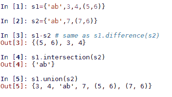

注意，集合对象并不关心其成员是否都是同一类型，只要它们都是不可变的。如果你尝试在集合中使用可变对象，如列表或字典，你会收到一个不可哈希的类型错误。所有可哈希类型都具有在整个实例生命周期中不变的哈希值。所有内置不可变类型都是可哈希的。所有内置可变类型都不是可哈希的，因此不能用作集合的元素或字典的键。

注意，在前面的代码中，当我们打印出`s1`和`s2`的并集时，只有一个值为`'ab'`的元素。这是集合的自然属性，即它们不包含重复项。

除了这些内置方法之外，我们还可以在集合上执行许多其他操作。例如，要测试集合的成员资格，可以使用以下方法：

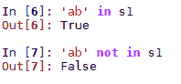

我们可以使用以下方式遍历集合中的元素：

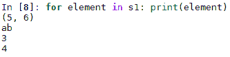

# 不可变集合

Python 有一个不可变的集合类型，称为`frozenset`。它几乎与`set`完全相同，除了不允许更改值的方法或操作，如`add()`或`clear()`方法。这种不可变性有几种有用的方式。例如，由于正常集合是可变的，因此不可哈希，它们不能用作其他集合的成员。另一方面，`frozenset`是不可变的，因此可以用作集合的成员：

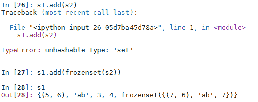

不可变属性意味着我们可以将`frozenset`用作字典的`key`，例如：

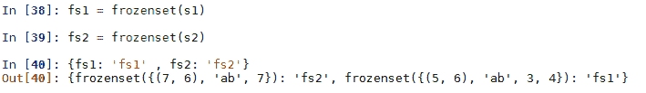

# 数据结构和算法模块

除了内置类型外，还有几个 Python 模块可以用来扩展这些内置类型和函数。在许多情况下，这些 Python 模块可能提供效率和编程优势，使我们能够简化代码。

到目前为止，我们已经探讨了字符串、列表、集合和字典的内置数据类型以及`decimal`和`fractions`模块。它们通常被称为**抽象数据类型**（**ADTs**）。ADTs 可以被视为对可以执行在数据上的操作集的数学规范。它们是由其行为而不是其实施来定义的。除了我们探讨的 ADTs 之外，还有几个 Python 库提供了对内置数据类型的扩展。这些将在下一节中讨论。

# 集合

`collections` 模块提供了对内置数据类型的更多专业化和高性能替代方案，以及一个创建命名元组的实用函数。以下表格列出了 `collections` 模块的数据类型和操作及其描述：

| **数据类型或操作** | **描述** |
| --- | --- |
| `namedtuple()` | 创建具有命名字段的元组子类。 |
| `deque` | 具有快速追加和弹出两端列表的功能。 |
| `ChainMap` | 创建多个映射的单个视图的字典类。 |
| `Counter` | 用于计数可哈希对象的字典子类。 |
| `OrderedDict` | 记录条目顺序的字典子类。 |
| `defaultdict` | 调用一个函数来提供缺失值的字典子类。 |
| `UserDict` `UserList` `UserString` | 这三个数据类型只是它们底层基类的包装器。它们的使用在很大程度上已被直接子类化各自基类的功能所取代。可以用来将底层对象作为属性访问。 |

# 双端队列

双端队列，或称为双端队列（通常发音为 *decks*），是类似列表的对象，支持线程安全的、内存高效的追加操作。双端队列是可变的，并支持列表的一些操作，如索引。可以通过索引赋值，例如，`dq[1] = z`；然而，我们无法直接对双端队列进行切片。例如，`dq[1:2]` 会导致一个 `TypeError`（我们将在稍后查看如何从 `deque` 返回一个列表作为示例）。

与列表相比，双端队列的主要优势是在双端队列的开始处插入项目比在列表的开始处插入项目要快得多，尽管在 `deque` 的末尾插入项目比在列表上执行等效操作要稍微慢一些。双端队列是线程安全的，可以使用 `pickle` 模块进行序列化。

关于双端队列的一个有用思考方式是关于填充和消耗项目。双端队列中的项目通常从两端按顺序填充和消耗：

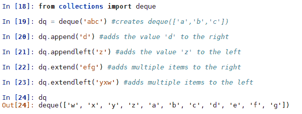

我们可以使用 `pop()` 和 `popleft()` 方法在 `deque` 中消耗项目，例如：

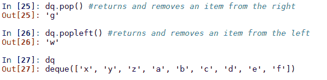

我们还可以使用 `rotate(n)` 方法将所有项目向右移动并旋转 *n* 步，对于正整数的 *n*，或者对于负整数的 *n* 向左移动，使用正整数作为参数，例如：

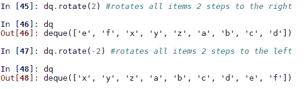

注意，我们可以使用 `rotate` 和 `pop` 方法来删除选定的元素。还值得知道的一个简单方法是将双端队列的切片作为列表返回，可以按照以下方式完成：

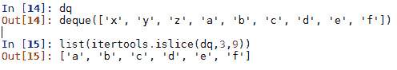

`itertools.islice` 方法的工作方式与列表上的切片操作相同，不同之处在于它接受一个可迭代对象作为参数，而不是列表，并通过起始和结束索引返回选定的值，作为一个列表。

双端队列（deque）的一个有用特性是它支持一个可选的 `maxlen` 参数，该参数限制了 `deque` 的大小。这使得它非常适合称为**循环缓冲区**的数据结构。这是一个固定大小的结构，它实际上是通过端到端连接的，并且通常用于缓冲数据流。以下是一个基本示例：

```py
dq2=deque([],maxlen=3) 
for i in range(6): 
    dq2.append(i) 
    print(dq2) 

```

这将打印出以下内容：

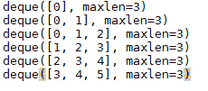

在这个例子中，我们从右侧填充，从左侧消费。请注意，一旦缓冲区满了，最旧的数据首先被消费，然后从右侧替换数据。我们将在 第四章，*列表和指针结构*中再次讨论循环缓冲区，通过实现循环列表来做到这一点。

# ChainMaps

Python 3.2 中添加了 `collections.chainmap` 类，它提供了一种将多个字典或其他映射链接起来的方法，这样它们就可以被当作一个对象来处理。此外，还有一个 `maps` 属性，一个 `new_child()` 方法，以及一个 `parents` 属性。`ChainMap` 对象的底层映射存储在一个列表中，可以通过 `maps[*i*]` 属性来访问以检索第 `i` 个字典。请注意，尽管字典本身是无序的，但 ChainMaps 是字典的有序列表。`ChainMap` 在我们使用包含相关数据的多个字典的应用程序中非常有用。消费应用程序期望以优先级的方式提供数据，其中两个字典中相同的键如果在底层列表的开头出现，则具有优先级。`ChainMap` 通常用于模拟嵌套上下文，例如当我们有多个覆盖配置设置时。以下是一个 `ChainMap` 的可能用例示例：

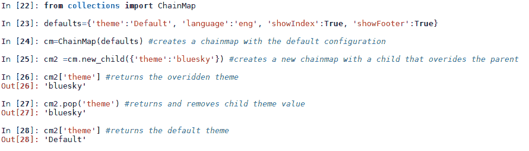

使用 ChainMaps 而不是仅仅使用字典的优势在于，我们保留了之前设置的值。添加子上下文会覆盖相同键的值，但不会从数据结构中删除它。这在我们可能需要记录更改以便我们可以轻松回滚到之前的设置时非常有用。

我们可以通过向 `map()` 方法提供一个适当的索引来检索和更改任何字典中的任何值。这个索引代表 ChainMap 中的一个字典。此外，我们可以通过使用 `parents()` 方法来检索父设置，即默认设置：

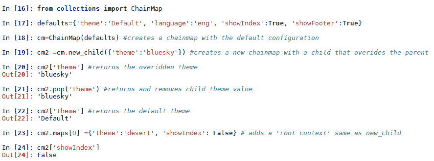

# 计数器对象

计数器是字典的一个子类，其中每个字典 `key` 是一个可哈希的对象，与之关联的值是该对象的整数计数。初始化计数器有三种方式。我们可以传递任何序列对象，一个 `key:value` 对的字典，或者一个格式为 `(object = value, ...)` 的元组，例如：

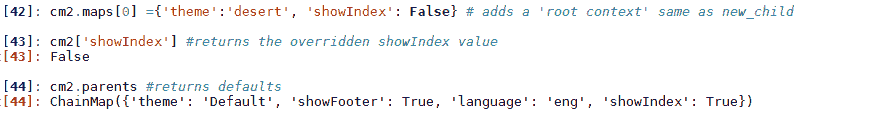

我们还可以创建一个空的计数器对象，并通过传递其 `update` 方法的可迭代对象或字典来填充它，例如：

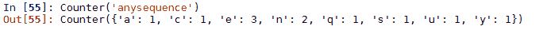

注意`update`方法是如何添加计数而不是用新值替换它们的。一旦 Counter 被填充，我们可以像访问字典中的值一样访问存储的值，例如：

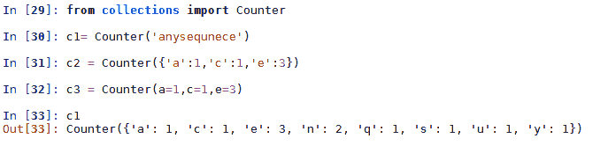

Counter 对象与字典之间最显著的区别是，Counter 对象对于缺失的项返回零计数，而不是抛出`key`错误，例如：

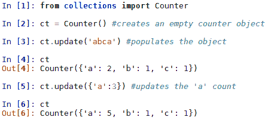

我们可以通过使用`Counter`对象的`elements()`方法来从`Counter`对象创建一个迭代器。这个迭代器不包括计数小于一的元素，并且顺序没有保证。在下面的代码中，我们执行了一些更新，从`Counter`元素创建了一个迭代器，并使用`sorted()`对键进行字母排序：

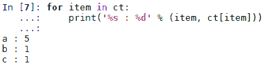

值得一提的另外两种 Counter 方法有`most_common()`和`subtract()`。`most_common()`方法接受一个正整数参数，用于确定返回最常见元素的数量。元素以`(key, value)`元组的列表形式返回。`subtract`方法的工作方式与`update`方法类似，但不同的是它不是添加值，而是减去值，例如：

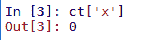

# 有序字典

有序字典的重要之处在于它们会记住插入顺序，因此当我们迭代它们时，它们会按插入顺序返回值。这与正常字典不同，正常字典的顺序是任意的。当我们测试两个字典是否相等时，这种相等性仅基于它们的键和值；然而，对于`OrderedDict`，插入顺序也会被考虑。具有相同键和值但不同插入顺序的两个`OrderedDict`之间的相等性测试将返回`False`：

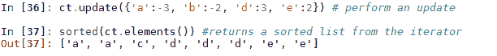

同样，当我们使用`update`从列表中添加值时，`OrderedDict`将保留与列表相同的顺序。这是我们在迭代值时返回的顺序，例如：

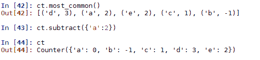

`OrderedDict`通常与`sorted`方法一起使用来创建排序字典。例如，在下面的示例中，我们使用`lambda`函数按值排序，这里我们使用数值表达式来排序整数值：

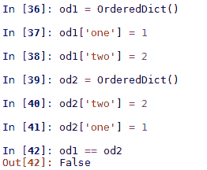

# defaultdict

`defaultdict`对象是`dict`的子类，因此它们共享方法和操作。它是一种方便初始化字典的方式。使用`dict`时，Python 会在尝试访问不在字典中的键时抛出`KeyError`。`defaultdict`覆盖了一个方法`__missing__(key)`，并创建了一个新的实例变量`default_factory`。使用`defaultdict`时，而不是抛出错误，它将运行作为`default_factory`参数提供的函数，该函数将生成一个值。`defaultdict`的一个简单用法是将`default_factory`设置为`int`，并快速统计字典中项的计数，例如：

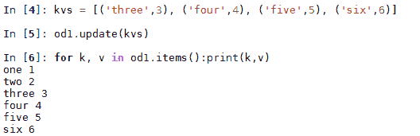

你会注意到，如果我们尝试用普通的字典来做这件事，当我们尝试添加第一个键时，我们会得到一个键错误。我们提供给默认 `dict` 的 `int` 参数实际上是返回零的函数 `int()`。我们当然可以创建一个函数来确定字典的值。例如，以下函数如果提供的参数是主色（即红色、绿色或蓝色），则返回 `True`，否则返回 `False`：

```py
def isprimary(c):  
    if (c == 'red') or (c == 'blue') or (c == 'green'):  
        return True  
    else: 
        return False 

```

我们现在可以创建一个新的 `defaultdict` 对象，并使用 `isprimary` 函数来填充它：

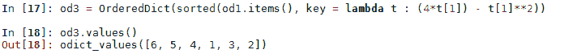

# 命名元组

`namedtuple` 方法返回一个类似元组的对象，它具有字段，可以通过命名索引以及正常元组的整数索引访问。这允许代码在一定程度上自我文档化，并且更易于阅读。在存在大量元组且需要轻松跟踪每个元组代表的内容的应用程序中，这特别有用。`namedtuple` 继承了 `tuple` 的方法，并且与 `tuple` 兼容。

字段名称作为逗号和/或空格分隔的值传递给 `namedtuple` 方法。它们也可以作为字符串序列传递。字段名称是单个字符串，并且可以是任何合法的 Python 标识符，但不能以数字或下划线开头。这里有一个典型的示例：

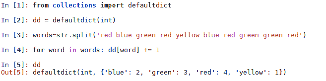

`namedtuple` 方法接受两个可选的布尔参数，`verbose` 和 `rename`。当 `verbose` 设置为 `True` 时，在构建类定义时将打印出类定义。此参数已被 `__source` 属性所取代。当 `rename` 参数设置为 `True` 时，任何无效的字段名称将被自动替换为位置参数。例如，我们尝试使用 `def` 作为字段名称。这通常会产生错误，但由于我们将 `rename` 设置为 `True`，Python 解释器允许这样做。然而，当我们尝试查找 `def` 值时，由于 `def` 是一个保留关键字，我们会得到一个语法错误。非法字段名称已被添加下划线的位置值创建的字段名称所替换：

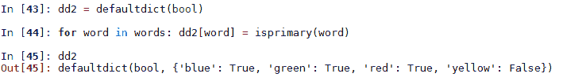

除了继承的元组方法外，命名元组还定义了它自己的三个方法，`_make()`、`asdict()` 和 `_replace`。这些方法以前缀下划线开头，以防止与字段名称发生潜在冲突。`_make()` 方法接受一个可迭代对象作为参数，并将其转换为命名元组对象，例如：

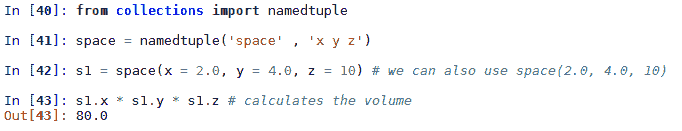

`_asdict` 方法返回一个 `OrderedDict`，字段名称映射到索引键，值映射到字典值，例如：

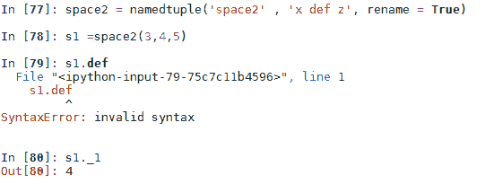

`_replace` 方法返回一个新的元组实例，替换指定的值，例如：

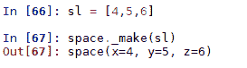

# 数组

数组模块定义了一个类似于 `list` 数据类型的 `array` 数据类型，除了它们的约束是它们的必须包含底层表示的单一种类的数据，这由机器架构或底层 C 实现确定。

数组的类型在创建时确定，并由以下类型代码之一指示：

| 代码类型 | C 类型 | Python 类型 | 最小字节数 |
| --- | --- | --- | --- |
| `'b'` | `signed char` | `int` | 1 |
| `'B'` | `unsigned char` | `int` | 1 |
| `'u'` | `Py_UNICODE` | `Unicode 字符` | 2 |
| `'h'` | `signed short` | `int` | 2 |
| `'H'` | `unsigned short` | `int` | 2 |
| `'i'` | `signed int` | `int` | 2 |
| `'I'` | `unsigned int` | `int` | 2 |
| `'l'` | `signed long` | `int` | 4 |
| `'L'` | `unsigned long` | `int` | 8 |
| `'q'` | `signed long long` | `int` | 8 |
| `'Q'` | `unsigned long long` | `int` | 8 |
| `'f'` | `float` | `float` | 4 |
| `'d'` | `double` | `float` | 8 |

数组对象支持以下属性和方法：

| 属性或方法 | 描述 |
| --- | --- |
| `a.typecode` | 创建数组时使用的类型代码字符。 |
| `a.itemsize` | 存储在数组中的项的大小，以字节为单位。 |
| `a.append(x)` | 将项 `x` 追加到数组的末尾。 |
| `a.buffer_info()` | 返回用于存储数组的内存位置和长度。 |
| `a.byteswap()` | 交换每个项的字节顺序。用于写入具有不同字节顺序的机器或文件。 |
| `a.count(x)` | 返回 `a` 中 `x` 的出现次数。 |
| `a.extend(b)` | 将任何可迭代对象 `b` 追加到数组 `a` 的末尾。 |
| `a.frombytes(s)` | 从字符串 `s` 中追加项作为机器值数组。 |
| `a.fromfile(f, n)` | 从文件对象 `f` 中读取 `n` 项，作为机器值，并将它们追加到 `a` 中。如果 `n` 中的项少于 `n`，则引发 `EOFError`。 |
| `a.fromlist(l)` | 从列表 `l` 中追加项。 |
| `a.fromunicode(s)` | 使用 Unicode 字符串 `s` 扩展 `a`。如果数组 `a` 的类型不是 `u`，则引发 `ValueError`。 |
| `index(x)` | 返回项 `x` 的第一个（最小的）索引。 |
| `a.insert(i, x)` | 在索引 `i` 之前插入项 `x`。 |
| `a.pop([i])` | 移除并返回索引为 `i` 的项。如果未指定，则默认为最后一个项 `(i = -1)`。 |
| `a.remove(x)` | 移除项 `x` 的第一个出现。 |
| `a.reverse()` | 反转项的顺序。 |
| `a.tobytes()` | 将数组转换为机器值并返回字节表示。 |
| `a.tofile(f)` | 将所有项，作为机器值，写入文件对象 `f`。 |
| `a.tolist()` | 将数组转换为列表。 |
| `a.tounicode()` | 将数组转换为 `unicode` 字符串。数组类型必须是 `'u'`，否则引发 `ValueError`。 |

数组对象支持所有正常的序列操作，如索引、切片、连接和乘法。

与列表相比，使用数组存储所有相同类型的数据是一种更有效的方式。在下面的例子中，我们创建了一个包含从 0 到 100 万减 1 的数字的整数数组和一个相同的列表。在整数数组中存储 100 万个整数大约需要相当于列表的 45%的内存：

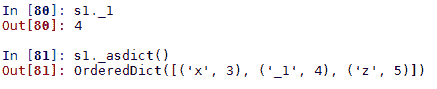

由于我们关注节省空间，也就是说，我们在处理大量数据集和有限的内存大小，我们通常在数组上执行原地操作，并且只有在需要时才创建副本。通常，枚举用于对每个元素执行操作。在下面的代码片段中，我们执行了将数组中每个元素加一的简单操作：

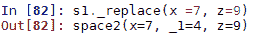

应该注意的是，当对创建列表的数组执行操作时，例如列表推导式，使用数组带来的内存效率提升将会被抵消。当我们需要创建一个新的数据对象时，一个解决方案是使用生成器表达式来执行操作，例如：

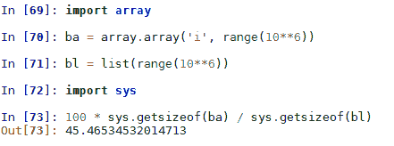

使用此模块创建的数组不适合需要矩阵或向量操作的工作。在下一章中，我们将构建自己的抽象数据类型来处理这些操作。对于数值工作也很重要的是`NumPy`扩展，可在[www.numpy.org](http://www.numpy.org)找到。

# 摘要

在最后两章中，我们已经探讨了 Python 的语言特性和数据类型。我们查看了一些内置数据类型和一些内部 Python 模块，最值得注意的是 collections 模块。还有其他几个与本书主题相关的 Python 模块，但与其单独检查它们，不如在我们开始使用它们时，它们的使用和功能应该变得显而易见。还有一些外部库，如 SciPy 堆栈，同样，我将在我们开始应用它们时尝试解释它们的基本功能。

在下一章中，我们将介绍算法设计的基本理论和技巧。
