# 算法设计原理

我们为什么要学习算法设计？当然有很多原因，我们学习某件事的动机很大程度上取决于我们自己的情况。毫无疑问，对算法设计感兴趣有重要的专业原因。算法是所有计算的基础。我们认为计算机是一块硬件，包括硬盘、内存芯片、处理器等。然而，本质的组成部分，如果缺失，就会使现代技术变得不可能，那就是算法。

算法的理论基础，以图灵机的形式，在数字逻辑电路能够实际实现这种机器的几十年前就已经确立。图灵机本质上是一个数学模型，它使用一组预定义的规则，将一组输入转换成一组输出。图灵机的最初实现是机械的，下一代可能会看到数字逻辑电路被量子电路或类似的东西所取代。无论平台如何，算法都发挥着中心主导的作用。

另一方面，算法在技术创新中的作用也不容忽视。一个明显的例子是页面排名搜索算法，谷歌搜索引擎就是基于这种算法的变体。使用这种以及类似的算法，研究人员、科学家、技术人员和其他人可以非常快速地搜索大量信息。这对新研究开展的速度、新发现以及新创新技术的发展产生了巨大影响。

算法的研究也很重要，因为它训练我们非常具体地思考某些问题。它可以通过帮助我们隔离问题的组成部分并定义这些组成部分之间的关系，来提高我们的心理和问题解决能力。总的来说，学习算法有四个主要原因：

1.  它们对于计算机科学和*智能*系统至关重要。

1.  它们在许多其他领域（计算生物学、经济学、生态学、通信、物理学等）也非常重要。

1.  他们在技术创新中扮演着重要角色。

1.  它们提高了问题解决和分析思维能力。

算法在其最简单形式中，只是一系列动作，一个指令列表。它可能只是形式为执行 *x*，然后执行 *y*，然后执行 *z*，然后结束的线性结构。然而，为了使事情更有用，我们添加了诸如“*x* 然后执行 *y*”之类的条款，在 Python 中是 `if-else` 语句。在这里，未来行动的路径取决于某些条件；比如说数据结构的状态。对此，我们还添加了操作，迭代，while 和 for 语句。进一步扩展我们的算法素养，我们添加了递归。递归通常可以达到与迭代相同的结果，然而，它们在本质上不同。递归函数调用自身，将相同的函数应用于越来越小的输入。任何递归步骤的输入是前一个递归步骤的输出。

实质上，我们可以这样说，算法由以下四个要素组成：

+   顺序操作

+   基于数据结构状态的行动

+   迭代，重复执行一个动作多次

+   递归，在输入子集上调用自身

# 算法设计范式

通常，我们可以区分三种广泛的问题解决方法。它们是：

+   分而治之

+   贪心算法

+   动态规划

正如其名所示，分而治之范式涉及将问题分解成更小的子问题，然后以某种方式组合结果以获得全局解决方案。这是一种非常常见且自然的问题解决技术，并且可以说是最常用的算法设计方法。

贪心算法通常涉及优化和组合问题；经典的例子是将它应用于旅行推销员问题，其中贪心方法总是首先选择最近的目的地。这种最短路径策略涉及寻找局部问题的最佳解决方案，希望这能导致全局解决方案。

当我们的子问题重叠时，动态规划方法是有用的。这与分而治之不同。而不是将我们的问题分解成独立的子问题，在动态规划中，中间结果被缓存并可用于后续操作。像分而治之一样，它使用递归；然而，动态规划允许我们在不同阶段比较结果。对于某些问题，这可以比分而治之有性能优势，因为从内存中检索先前计算的结果通常比重新计算它要快。

# 递归和回溯

递归对于分而治之的问题特别有用；然而，由于每个递归调用本身又会产生其他递归调用，因此理解到底发生了什么可能很困难。递归函数的核心包含两种类型的情形：基础情形，它告诉递归何时终止，以及递归情形，它调用它们所在的函数。一个自然适合递归解决方案的简单问题就是计算阶乘。递归阶乘算法定义了两种情形：当 *n* 为零时的基础情形，以及当 *n* 大于零时的递归情形。一个典型的实现如下：

```py
    def factorial(n):
        #test for a base case
        if n==0:
            return 1
            # make a calculation and a recursive call
            f= n*factorial(n-1)
        print(f)
        return(f)
        factorial(4)

```

此代码打印出数字 1, 2, 4, 24。要计算 4 需要四个递归调用加上初始父调用。在每次递归中，方法变量的副本被存储在内存中。一旦方法返回，它就会被从内存中移除。以下是我们可视化的这种过程的方法：

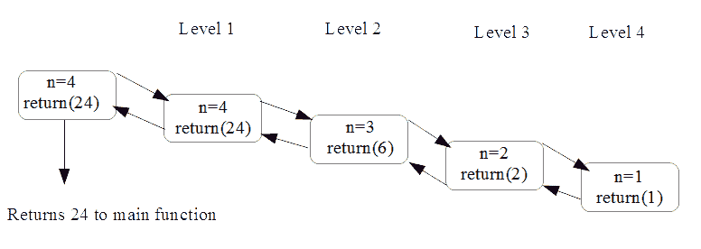

并不一定总是清楚递归或迭代是解决特定问题的更好方案；毕竟，它们都重复一系列操作，并且都非常适合算法设计中分而治之的方法。迭代会一直进行，直到问题解决。递归将问题分解成越来越小的部分，然后合并结果。对于程序员来说，迭代通常更容易，因为控制始终位于循环内部，而递归可以更紧密地表示数学概念，如阶乘。递归调用被存储在内存中，而迭代则不是。这就在处理器周期和内存使用之间产生了一个权衡，因此选择使用哪一个可能取决于任务是处理器密集型还是内存密集型。以下表格概述了递归和迭代之间的关键区别：

| **递归** | **迭代** |
| --- | --- |
| 当达到基础情形时终止 | 当满足定义的条件时终止 |
| 每个递归调用都需要内存空间 | 每次迭代不会被存储在内存中 |
| 无限递归会导致栈溢出错误 | 无限迭代会在硬件供电时运行 |
| 一些问题自然更适合递归解决方案 | 迭代解决方案可能并不总是明显 |

# 回溯

回溯是一种特别适用于如遍历树结构等问题的递归形式，在每个节点我们都会面临多个选项，必须从中选择一个。随后，我们会面临另一组不同的选项，并且根据所做出的选择系列，要么达到目标状态，要么遇到死胡同。如果是后者，我们必须回溯到前一个节点并遍历不同的分支。回溯是穷举搜索的分而治之方法。重要的是，回溯**剪枝**了无法产生结果的分支。

以下示例给出了回溯的一个例子。在这里，我们使用递归方法生成给定字符串`s`的所有可能的排列，该字符串的长度为`n`：

```py
    def bitStr(n, s):            

         if n == 1: return s 
         return [ digit + bits for digit in bitStr(1,s)for bits in bitStr(n - 1,s)] 

    print (bitStr(3,'abc'))     

```

这会产生以下输出：

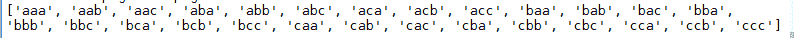

注意到在这个理解中的双重列表压缩和两次递归调用。在这种意义上，它是*回溯*以揭示先前生成的组合。返回的最终字符串是初始字符串的所有`n`个字母组合。

# 分而治之 - 长乘法

要使递归不仅仅是一个巧妙的技巧，我们需要了解如何将其与其他方法，如迭代，进行比较，并了解何时使用递归将导致更快的算法。我们所有人都熟悉的迭代算法是在小学数学课上学习的过程，用于乘以两个大数。也就是说，长乘法。如果你还记得，长乘法涉及迭代乘法和进位操作，随后是移位和加法操作。

我们在这里的目标是检查衡量此过程效率的方法，并尝试回答问题；这是否是我们用于乘以两个大数的最有效过程？

在以下图中，我们可以看到将两个四位数相乘需要 16 次乘法操作，我们可以推广说，一个`n`位数大约需要`n²`次乘法操作：

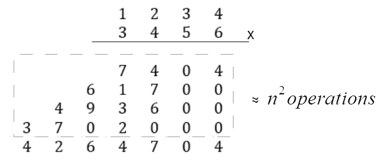

这种分析算法的方法，从乘法和加法等计算原语的数量来看，很重要，因为它为我们提供了一种理解完成特定计算所需时间与该计算输入大小之间关系的方式。特别是，我们想知道当输入，即数字的位数，`n`非常大时会发生什么。这个称为渐近分析或时间复杂性的主题对于我们的算法研究至关重要，我们将在本章和本书的其余部分经常回顾它。

# 我们能做得更好吗？递归方法

结果表明，在长乘法的情况下，答案是肯定的，实际上确实存在几种用于乘以大数的算法，这些算法需要的操作更少。最著名的长乘法替代方案之一是**Karatsuba 算法**，该算法首次发表于 1962 年。它采用了一种根本不同的方法：它不是迭代地乘以单个数字，而是递归地对越来越小的输入执行乘法操作。递归程序在输入的较小子集上调用自己。构建递归算法的第一步是将大数分解为几个较小的数。最自然的方法是将数字简单地分成两半，即最高有效位的前半部分和最低有效位的后半部分。例如，我们的四位数，2345，变成了两个两位数，23 和 45。我们可以使用以下方式更普遍地分解任何 2 *n*位数字的*x*和*y*，其中*m*是小于*n*的任何正整数：

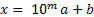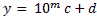

因此，现在我们可以将我们的乘法问题 *x*，*y* 重新写为如下形式：

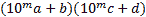

当我们展开并合并同类项时，我们得到以下结果：

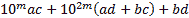

更方便的是，我们可以这样写：

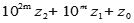

其中：

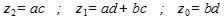

应该指出的是，这表明了一种递归方法来乘以两个数，因为此过程本身涉及乘法。具体来说，乘积 *ac*，*ad*，*bc* 和 *bd* 都涉及比输入数小的数字，因此我们可以设想我们可以将相同的操作作为整体问题的部分解决方案来应用。到目前为止，该算法由四个递归乘法步骤组成，而且并不立即清楚它是否比经典的长乘法方法更快。

我们到目前为止所讨论的关于乘法的递归方法，自 19 世纪末以来就已经为数学家所熟知。Karatsuba 算法通过以下观察进行了改进。我们实际上只需要知道三个数量：*z[2]*= *ac*；*z[1]*= *ad* + *bc*；*z[0]*= *bd*，以解决方程 3.1。我们只需要知道*a*，*b*，*c*，*d*的值，只要它们对计算数量*z[2]*，*z[1]*和*z[0]*所涉及的总体和乘积有贡献。这表明，我们可能可以减少递归步骤的数量。结果证明，这确实是情况。

由于乘积 *ac* 和 *bd* 已经是最简形式，因此我们似乎不太可能消除这些计算。然而，我们可以做出以下观察：

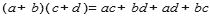

当我们从之前递归步骤中计算出的数量 *ac* 和 *bd* 中减去时，我们得到所需的数量，即 (*ad* + *bc*)：

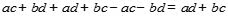

这表明我们确实可以计算 *ad + bc* 的和，而无需单独计算每个单独的量。总之，我们可以通过将四个递归步骤减少到三个来改进方程 3.1。这三个步骤如下：

1.  递归计算 *ac*。

1.  递归计算 *bd*。

1.  递归计算 (*a* +*b*)(*c* + *d*) 并减去 *ac* 和 *bd*。

以下示例展示了 Karatsuba 算法的 Python 实现：

```py
    from math import log10  
    def karatsuba(x,y): 

        # The base case for recursion 
        if x < 10 or y < 10: 
            return x*y     

        #sets n, the number of digits in the highest input number 
        n = max(int(log10(x)+1), int(log10(y)+1)) 

        # rounds up n/2     
        n_2 = int(math.ceil(n / 2.0)) 
        #adds 1 if n is uneven 
        n = n if n % 2 == 0 else n + 1 

        #splits the input numbers      
        a, b = divmod(x, 10**n_2) 
        c, d = divmod(y, 10**n_2) 

        #applies the three recursive steps 
        ac = karatsuba(a,c) 
        bd = karatsuba(b,d) 
        ad_bc = karatsuba((a+b),(c+d)) - ac - bd 

        #performs the multiplication     
        return (((10**n)*ac) + bd + ((10**n_2)*(ad_bc))) 

```

为了确保这个方法确实有效，我们可以运行以下测试函数：

```py
    import random 
    def test(): 
            for i in range(1000): 
                x = random.randint(1,10**5) 
                y = random.randint(1,10**5) 
                expected = x * y 
                result = karatsuba(x, y) 
                if result != expected: 
                    return("failed")                 
            return('ok')   

```

# 运行时分析

应该越来越清楚，算法设计的一个重要方面是衡量其在空间（内存）和时间（操作数数量）方面的效率。这个第二度量，称为运行时性能，是本节的主题。应该提到的是，一个相同的度量用于衡量算法的内存性能。我们可以以多种方式测量运行时间，可能最明显的方法就是简单地测量算法完成所需的时间。这种方法的主要问题是算法运行所需的时间在很大程度上取决于其运行的硬件。衡量算法运行时间的平台无关方法是计算涉及的操作数数量。然而，这也存在问题，因为没有明确的方法来量化一个操作。这取决于编程语言、编码风格以及我们决定如何计数操作。尽管如此，如果我们结合这个计数操作的想法，并预期随着输入大小的增加，运行时间将以特定方式增加，那么我们可以使用这个想法。也就是说，输入大小 *n* 和算法运行所需时间之间存在数学关系。

以下讨论的大部分内容将由以下三个指导原则来框架。随着我们继续前进，这些原则的理性和重要性将变得更加清晰。这些原则如下：

+   最坏情况分析。不对输入数据做任何假设。

+   忽略或抑制常数因子和低阶项。在大输入情况下，高阶项占主导地位。

+   关注大输入规模的问题。

最坏情况分析是有用的，因为它给我们一个紧的上界，保证我们的算法不会超过这个上界。忽略小的常数因子和低阶项实际上就是忽略那些在输入大小很大的情况下，对总体运行时间贡献不大的因素。这不仅使我们的工作在数学上更容易，还允许我们关注对性能影响最大的因素。

我们通过 Karatsuba 算法看到，乘法操作的次数增加到输入大小，*n*，的平方。如果我们有一个四位数，乘法操作的次数是 16；一个八位数需要 64 次操作。然而，通常我们并不真正对算法在小的*n*值时的行为感兴趣，所以我们通常忽略增长速度较慢的因素，比如与*n*线性增长。这是因为当*n*值较高时，随着*n*的增加而增长最快的操作将占主导地位。

我们将通过一个例子详细解释这一点，即归并排序算法。排序是第十章“排序”的主题，然而，作为先导和了解运行时性能的有用方式，我们在这里介绍归并排序。

归并排序算法是一种 60 多年前开发的经典算法。它仍然被广泛应用于许多最受欢迎的排序库中。它相对简单且高效。它是一种使用分治法的递归算法。这涉及到将问题分解成更小的子问题，递归地解决它们，然后以某种方式合并结果。归并排序是分治范式最明显的演示之一。

归并排序算法由三个简单的步骤组成：

1.  递归地对输入数组的左半部分进行排序。

1.  递归地对输入数组的右半部分进行排序。

1.  将两个已排序的子数组合并成一个。

一个典型的问题是将数字列表按数值顺序排序。归并排序通过将输入分成两半并并行处理每个半部分来工作。我们可以用以下示意图来示意这个过程：

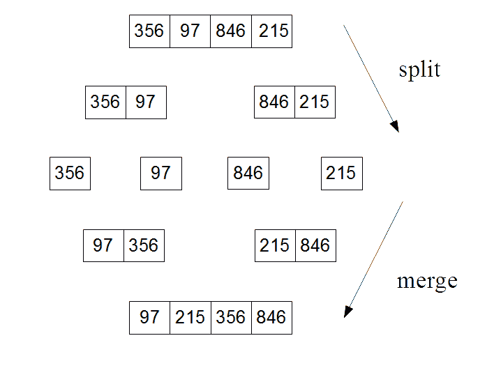

下面是归并排序算法的 Python 代码：

```py
    def mergeSort(A): 
        #base case if the input array is one or zero just return. 
        if len(A) > 1: 
            # splitting input array 
            print('splitting ', A ) 
            mid = len(A)//2 
            left = A[:mid] 
            right = A[mid:] 
            #recursive calls to mergeSort for left and right sub arrays                 
            mergeSort(left) 
            mergeSort(right) 
            #initalizes pointers for left (i) right (j) and output array (k)  
    # 3 initalization operations 
            i = j = k = 0         
            #Traverse and merges the sorted arrays 
            while i <len(left) and j<len(right): 
    # if left < right comparison operation  
                if left[i] < right[j]: 
    # if left < right Assignment operation 
                    A[k]=left[i] 
                    i=i+1 
                else: 
    #if right <= left assignment 
                    A[k]= right[j] 
                    j=j+1 
                k=k+1 

            while i<len(left): 
    #Assignment operation 
                A[k]=left[i] 
                i=i+1 
                k=k+1 

            while j<len(right): 
    #Assignment operation 
                A[k]=right[j] 
                j=j+1 
                k=k+1 
        print('merging ', A) 
        return(A)   

```

我们运行这个程序得到以下结果：

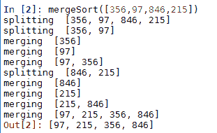

我们感兴趣的问题是确定运行时间性能，即算法完成所需时间相对于*n*大小的增长速率。为了更好地理解这一点，我们可以将每个递归调用映射到一个树结构上。树中的每个节点都是一个递归调用，它正在处理越来越小的子问题：

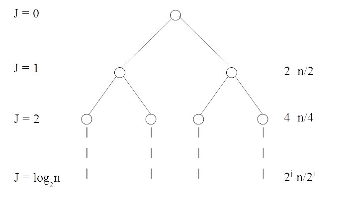

每次调用 merge-sort 都会随后创建两个递归调用，因此我们可以用二叉树来表示这一点。每个子节点都接收输入的一个子集。最终我们想知道算法相对于*n*大小完成所需的总时间。首先，我们可以计算树中每一层的作业量和操作数。

专注于运行时分析，在级别 1 时，问题被分割成两个 *n*/2 子问题，在级别 2 时有四个 *n*/4 子问题，以此类推。问题是递归何时触底，即何时达到其基本案例。这简单地说就是当数组是零或一时。

递归级别的数量正好是你需要将 *n* 除以 2 直到得到一个最多为 1 的数的次数。这正是 log2 的定义。由于我们将初始递归调用视为级别 0，所以总级别数是 log[2]*n* + 1。

让我们先暂停一下，来细化我们的定义。到目前为止，我们一直用字母 *n* 来描述输入元素的数量。这指的是递归第一级中的元素数量，即初始输入的长度。我们需要区分后续递归级别中输入的大小。为此，我们将使用字母 *m* 或更具体地，使用 *m[j]* 来表示递归级别 *j* 的输入长度。

此外，还有一些细节我们忽略了，我确信你已经开始对此感到好奇。例如，当 *m*/2 不是一个整数时，或者当我们的输入数组中有重复项时会发生什么。实际上，这对我们的分析没有重要影响；我们将在第十二章“设计技术和策略”中重新审视合并排序算法的一些更细致的细节。

使用递归树分析算法的优势在于我们可以计算递归每一级的完成工作。如何定义这项工作简单地说就是操作的总数，这当然与输入的大小有关。以平台无关的方式衡量和比较算法的性能是很重要的。当然，实际的运行时间将取决于运行它的硬件。计算操作数很重要，因为它给我们一个与算法性能直接相关的度量，与平台无关。

通常，由于每次合并排序调用都会进行两次递归调用，所以调用次数在每一级都是翻倍的。同时，这些调用正在处理的是其父项一半大小的输入。我们可以形式化地说：

对于级别 j，其中 *j* 是整数 0, 1, 2 ... log[2]*n*，有两个 ^j 子问题，每个子问题的规模是 *n*/2^j。

要计算操作的总数，我们需要知道单个合并两个子数组所包含的操作数。让我们来计算之前 Python 代码中的操作数。我们感兴趣的是在两次递归调用之后的所有代码。首先，我们有三个赋值操作。接着是三个 while 循环。在第一个循环中，我们有一个 if else 语句，并且每个 if else 语句中包含两个操作，一个比较操作后跟一个赋值操作。由于这些操作集在 if else 语句中只有一个，我们可以将这段代码视为执行*m*次的两条操作。接着是两个包含赋值操作的 while 循环。这使得每次归并排序的递归调用总共需要 4*m* + 3 次操作。

由于*m*至少为 1，操作数的上限是 7*m*。必须说的是，这并不是一个精确的数字。我们当然可以决定以不同的方式计算操作数。我们没有计算增量操作或任何维护操作；然而，这并不那么重要，因为我们更关心在*n*的高值下运行时间的增长率。

这可能看起来有点令人畏惧，因为每次递归调用本身会产生更多的递归调用，看起来呈指数级增长。使这变得可管理的关键事实是，随着递归调用数量的加倍，每个子问题的规模减半。这两股相反的力量很好地相互抵消，我们可以证明这一点。

要计算递归树每层的最大操作数，我们只需将子问题的数量乘以每个子问题的操作数，如下所示：

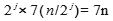

重要的是，这表明，因为 2^j 抵消了每层的操作数，所以它与层无关。这给我们每个层上操作数的上限，在这个例子中是 7*n*。应该指出的是，这包括在该层上每个递归调用所执行的操作数，而不是在后续层上所做的递归调用。这表明，随着递归调用数量的加倍，所做的工作与每个子问题的输入大小减半的事实正好相抵消。

要找到完整的归并排序操作的总数，我们只需将每层的操作数乘以层的数量。这给我们以下结果：

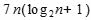

当我们展开这个公式时，我们得到以下结果：

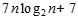

从这个例子中可以得出的关键点是，输入大小与总运行时间之间的关系有一个对数成分。如果您还记得学校数学，对数函数的显著特征是它迅速变得平坦。作为一个输入变量*x*增加大小，输出变量*y*增加的量会越来越小。例如，将对数函数与线性函数进行比较：

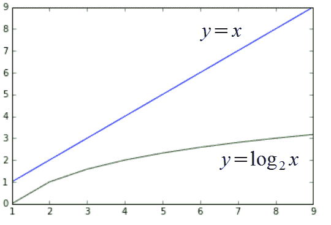

在前面的例子中，将*n*log[2]*n*组件相乘，并将其与*n*²进行比较。


注意，对于非常低的*n*值，完成时间*t*实际上对于运行在 n²时间内的算法来说更低。然而，对于大约 40 以上的值，对数函数开始主导，使输出变得平坦，直到在相对适中的大小*n* = 100 时，性能是运行在*n*²时间内的算法的两倍以上。注意，在*n*的高值中，常数因子+ 7 的消失是无关紧要的。

生成这些图表所使用的代码如下：

```py
    import matplotlib.pyplot as plt 
    import math 
    x=list(range(1,100)) 
    l =[]; l2=[]; a = 1 
    plt.plot(x , [y * y for y in x] ) 
    plt.plot(x, [(7 *y )* math.log(y, 2) for y in x]) 
    plt.show() 

```

如果 matplotlib 库尚未安装，您需要安装它才能使以下功能正常工作。详细信息可以在以下地址找到；我鼓励您尝试使用此列表推导表达式生成图表。例如，添加以下绘图语句：

```py
    plt.plot(x, [(6 *y )* math.log(y, 2) for y in x]) 

```

输出如下：

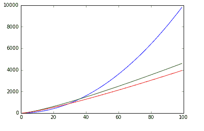

上述图表显示了计数六个操作或七个操作之间的差异。我们可以看到这两种情况是如何分叉的，当我们讨论应用的特定细节时，这一点很重要。然而，我们更感兴趣的是一种表征增长速率的方法。我们不太关心绝对值，而是关注随着*n*的增加这些值是如何变化的。这样我们就可以看到，与顶部的(*x*²)曲线相比，两个较低的曲线具有相似的增长速率。我们说这两个较低的曲线具有相同的**复杂度类**。这是一种理解和描述不同运行行为的方式。我们将在下一节中正式化这个性能指标。

# 渐近分析

算法的运行性能本质上由三个要素来表征。它们是：

+   最坏情况 - 使用一个导致性能最慢的输入

+   最佳情况 - 使用一个能给出最佳结果的输入

+   平均情况 - 假设输入是随机的

为了计算这些，我们需要知道上下限。我们已经看到了使用数学表达式表示算法运行时间的方法，本质上是通过加法和乘法操作。要使用渐近分析，我们只需创建两个表达式，一个用于最佳情况，一个用于最坏情况。

# 大 O 符号

大 *O* 表示法中的字母 "O" 代表阶，以表明增长率被定义为函数的阶。我们说一个函数 *T*(*n*) 是另一个函数 *F*(*n*) 的大 O，我们将其定义为以下内容：

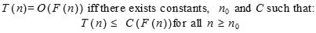

输入大小 *n* 的函数 *g*(*n*) 基于以下观察：对于所有足够大的 *n* 值，*g*(*n*) 被一个常数乘以 *f*(*n*) 限制在上界。目标是找到小于或等于 *f*(*n*) 的最小增长率。我们只关心 *n* 较大时的行为。变量 *n[0]* 代表增长率不重要的阈值，函数 T(n) 代表 **紧上界** F(n)。在下面的图中，我们看到 *T*(*n*) = *n²* + 500 = *O*(*n²*)，其中 *C* = 2，而 *n[0]* 大约是 23：

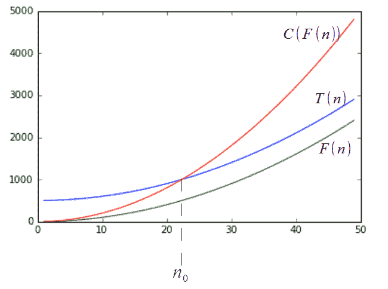

你也会看到表示法 *f*(*n*) = *O*(*g*(*n*))。这描述了 *O*(*g*(*n*)) 实际上是一组函数，包括所有与 *f*(n) 具有相同或更小增长率的函数。例如，*O*(*n²*) 也包括函数 *O*(*n*)、*O*(*n*log*n*) 等等。

在以下表中，我们按从低到高的顺序列出最常见的增长率。我们有时将这些增长率称为函数的 **时间复杂度** 或函数的复杂度类：

| **复杂度类** | **名称** | **示例操作** |
| --- | --- | --- |
| O(1) | 常数 | 追加、获取项、设置项。 |
| O(log*n*) | 对数 | 在排序数组中查找元素。 |
| O(n) | 线性 | 复制、插入、删除、迭代。 |
| *n*Log*n* | 线性对数 | 排序列表，归并排序。 |
| *n²* | 平方 | 在图中两个节点之间找到最短路径。嵌套循环。 |
| *n³* | 立方 | 矩阵乘法。 |
| 2*^n* | 指数 | 汉诺塔问题、回溯。 |

# 组成复杂度类

通常，我们需要找到多个基本操作的总运行时间。结果是我们可以将简单操作的复杂度类组合起来，以找到更复杂、组合操作的复杂度类。目标是分析函数或方法中的组合语句，以了解执行多个操作的总时间复杂度。将两个复杂度类组合的最简单方法是相加。这发生在我们有两个顺序操作时。例如，考虑将元素插入列表并排序该列表的两个操作。我们可以看到插入项的时间复杂度是 O(*n*)，而排序的时间复杂度是 O(*n*log*n*)。我们可以将总时间复杂度写成 O(*n* + *n*log*n*)，即，我们将两个函数放入 O(...)。我们只对最高阶项感兴趣，所以这仅留下 O(*n*log*n*)。

如果我们重复一个操作，例如在 while 循环中，那么我们将复杂度类乘以操作执行的次数。如果一个具有时间复杂度 O(*f*(*n*))的操作重复 O(*n*)次，那么我们将两个复杂度相乘：

O(*f*(*n*) * O(*n*)) = O(*nf*(*n*)).

例如，假设函数 f(...)的时间复杂度为 O(*n*²)，并且它在以下 while 循环中执行*n*次：

```py
    for i n range(n): 
        f(...) 

```

这个循环的时间复杂度因此变为 O(*n*²) * O(*n*) = O(*n * n²*) = O(*n³*)。这里我们只是将操作的复杂度与执行此操作的次数相乘。循环的运行时间最多是循环内语句的运行时间乘以迭代次数。一个嵌套的单层循环，即一个循环嵌套在另一个循环中，如果两个循环都运行*n*次，则将在*n*²时间内运行。例如：

```py
    for i in range(0,n):  
        for j in range(0,n) 
            #statements 

```

每个语句都是一个常数，c，执行*n**n*次，因此我们可以将运行时间表示为； *c**n* *n* = *cn*² = O(*n*2)。

对于嵌套循环中的连续语句，我们添加每个语句的复杂度，并乘以语句执行的次数。例如：

```py
    n = 500    #c0   
    #executes n times 
    for i in range(0,n): 
        print(i)    #c1 
    #executes n times 
    for i in range(0,n): 
        #executes n times 
        for j in range(0,n): 
        print(j)   #c2 

```

这可以写成 *c*[0] +*c*[1]*n* + *cn*² = O(*n*²)。

我们可以定义（以 2 为底）对数复杂度，在常数时间内减少问题的大小。例如，考虑以下代码片段：

```py
    i = 1 
    while i <= n: 
        i=i * 2 
        print(i) 

```

注意到`i`在每次迭代中都翻倍，如果我们用*n* = 10 运行它，我们会看到它打印出四个数字；2，4，8，和 16。如果我们加倍*n*，我们会看到它打印出五个数字。随着 n 的后续加倍，迭代次数仅增加 1。如果我们假设*k*次迭代，我们可以将其写成以下形式：

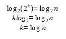

从这里我们可以得出结论，总时间 = **O**(*log(n)*)。

虽然大 O 符号是参与渐近分析中最常用的符号，但还有两个其他相关的符号应该简要提及。它们是Ω符号和Θ符号。

# Ω符号（Ω）

以类似的方式，大 O 符号描述了上界，Ω符号描述了一个**紧下界**。定义如下：

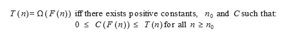

目标是给出与给定算法 T(*n*)增长率相等或更小的最大增长率。

# Θ符号（ϴ）

经常会出现给定函数的上界和下界相同的情况，Θ符号的目的是确定这种情况是否成立。定义如下：

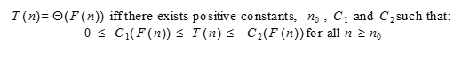

虽然Ω和Θ符号需要完全描述增长率，但最实用的还是大 O 符号，这也是你最常见的符号。

# 平均分析

通常我们并不那么关心单个操作的时空复杂度，而是关心一系列操作的平均运行时间。这被称为换算分析。它与我们将很快讨论的平均情况分析不同，因为它对输入值的分布没有做出任何假设。然而，它确实考虑了数据结构的状态变化。例如，如果一个列表已排序，它应该使任何后续的查找操作更快。换算分析可以考虑到数据结构的状态变化，因为它分析的是操作序列，而不是简单地汇总单个操作。

换算分析通过在一系列操作中对每个操作施加一个人为的成本，然后结合这些成本来找到一个运行时间的上界。一个序列的人为成本考虑到初始的昂贵操作可以使后续操作更便宜。

当我们有一些昂贵的操作，如排序，以及大量的便宜操作，如查找时，标准的最坏情况分析可能会导致过于悲观的结论，因为它假设每个查找都必须比较列表中的每个元素，直到找到匹配项。我们应该考虑到一旦我们排序列表，我们就可以使后续的查找操作更便宜。

到目前为止，在我们的运行时间分析中，我们假设输入数据是完全随机的，并且只看了输入大小对运行时间的影响。算法分析有两种其他常见的方法；它们是：

+   平均情况分析

+   基准测试

平均情况分析基于对各种输入值相对频率的一些假设来找到平均运行时间。使用现实世界的数据，或者复制现实世界数据分布的数据，在特定数据分布上多次进行，并计算平均运行时间。

基准测试只是有一个达成一致的典型输入集，用于衡量性能。基准测试和平均时间分析都依赖于某些领域知识。我们需要知道典型或预期的数据集是什么。最终，我们将尝试通过针对非常具体的应用设置进行微调来找到提高性能的方法。

让我们看看评估算法运行性能的一种简单方法。这可以通过简单地测量算法完成给定各种输入大小所需的时间来完成。正如我们之前提到的，这种测量运行性能的方法取决于其运行的硬件。显然，更快的处理器会给出更好的结果，然而，随着输入大小的增加，相对增长率将保留算法本身的特征，而不是其运行的硬件。绝对时间值将在不同的硬件（和软件）平台上有所不同；然而，它们的相对增长率仍然受算法时间复杂度的限制。

让我们以一个嵌套循环的简单例子为例。应该很明显，这个算法的时间复杂度是 O(n²)，因为对于外循环中的每个 n 次迭代，内循环中也有 n 次迭代。例如，我们的简单嵌套 for 循环由内循环中执行的一个简单语句组成：

```py
    def nest(n): 
        for i in range(n): 
            for j in range(n): 
                i+j 

```

以下是一个简单的测试函数，它使用递增的`n`值运行`nest`函数。在每次迭代中，我们使用`timeit.timeit`函数计算此函数完成所需的时间。在这个例子中，`timeit`函数接受三个参数，一个表示要计时的函数的字符串表示，一个导入`nest`函数的设置函数，以及一个表示执行主语句次数的`int`参数。由于我们感兴趣的是`nest`函数相对于输入大小`n`完成所需的时间，因此，在我们的目的上，每次迭代只需调用一次`nest`函数。以下函数返回每个`n`值的计算运行时间列表：

```py
    import timeit  
    def test2(n): 
        ls=[] 
        for n in range(n): 
            t=timeit.timeit("nest(" + str(n) +")", setup="from __main__ import nest", number = 1) 
            ls.append(t) 
        return ls    

```

在以下代码中，我们运行了`test2`函数，并绘制了结果图，包括用于比较的适当缩放的 n²函数，用虚线表示：

```py
    import matplotlib.pyplot as plt 
    n=1000 
    plt.plot(test2(n)) 
    plt.plot([x*x/10000000 for x in range(n)]) 

```

这给出了以下结果：

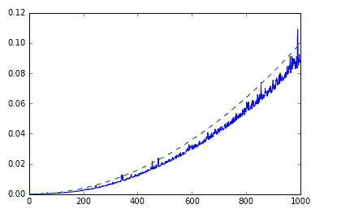

如我们所见，这几乎是我们预期的结果。应该记住，这既代表了算法本身的性能，也代表了底层软件和硬件平台的行为，正如测量运行时间的可变性和运行时间的相对大小所表明的。显然，更快的处理器将导致更快的运行时间，而且性能还会受到其他运行进程、内存限制、时钟速度等因素的影响。

# 概述

在本章中，我们对算法设计进行了概述。重要的是，我们看到了一种平台无关的方式来衡量算法的性能。我们探讨了算法问题的不同方法。我们研究了递归乘大数和归并排序的递归方法。我们看到了如何使用回溯进行穷举搜索和生成字符串。我们还介绍了基准测试和一种简单的平台相关的方式来衡量运行时间。在接下来的章节中，我们将参考具体的数据结构重新审视许多这些想法。在下一章中，我们将讨论链表和其他指针结构。
