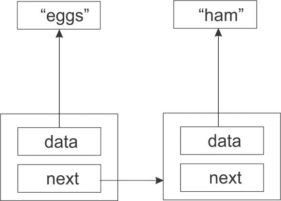
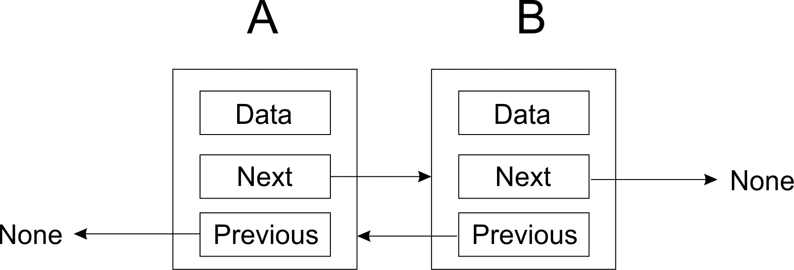
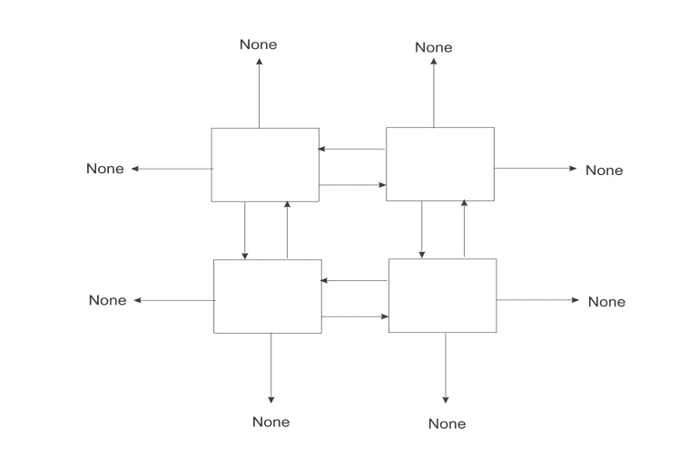
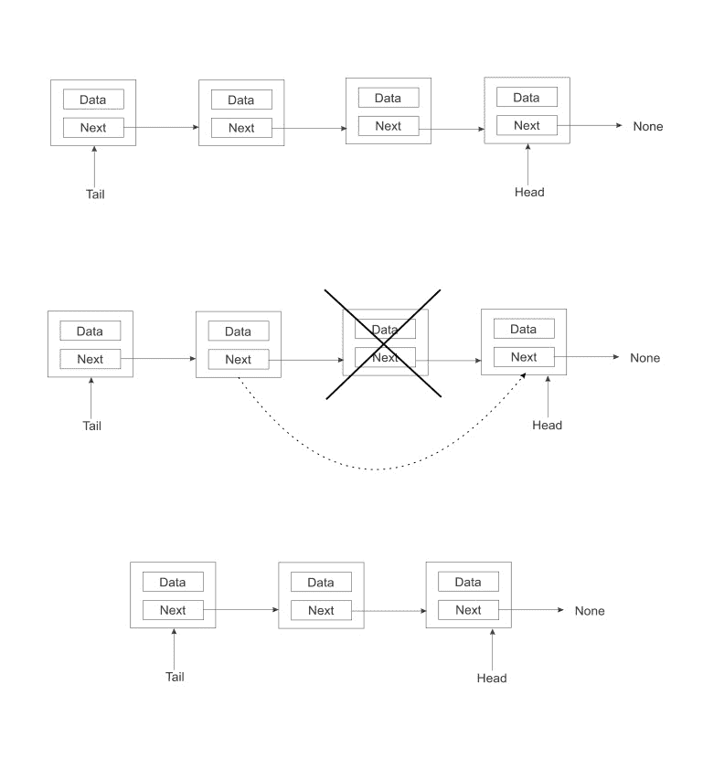
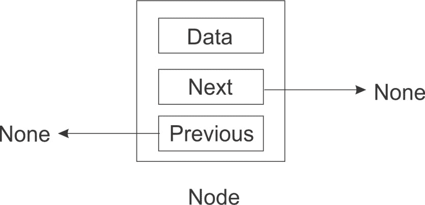
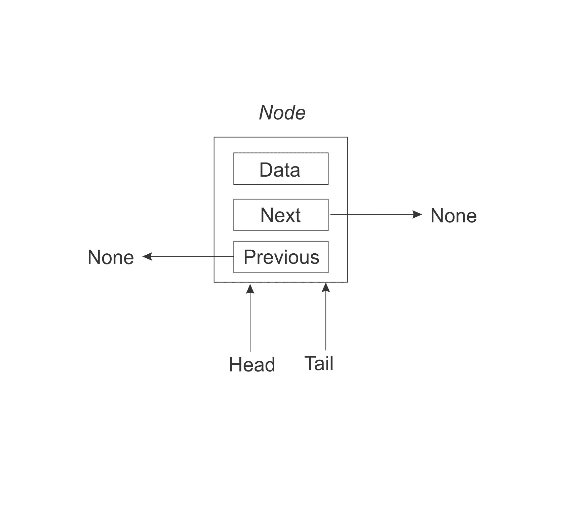
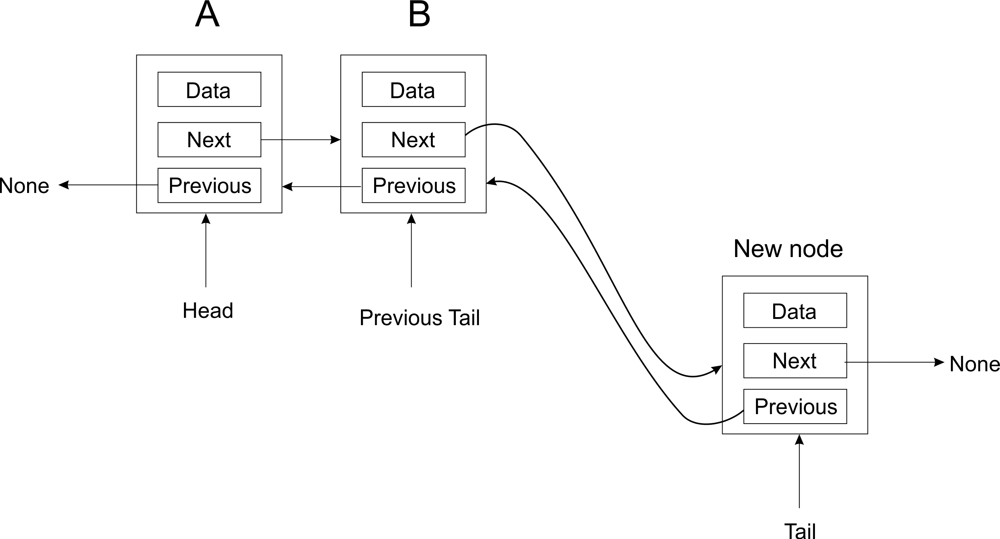
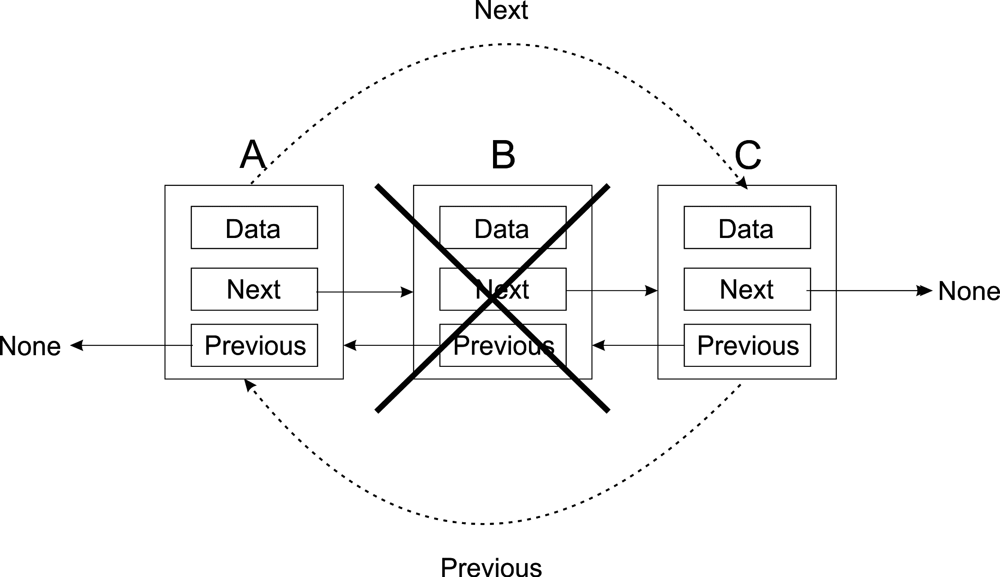
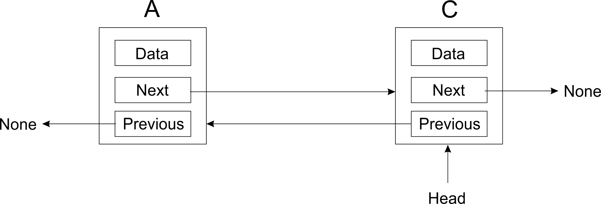

# 列表和指针结构

你已经在 Python 中见过列表了。它们既方便又强大。通常，每次你需要将某物存储在列表中时，你都会使用 Python 的内置列表实现。然而，在本章中，我们更感兴趣的是了解列表是如何工作的。因此，我们将研究列表的内部机制。正如你所注意到的，存在不同类型的列表。

Python 的列表实现旨在强大且涵盖多个不同的用例。我们将对我们的列表定义更加严格。

节点的概念对列表非常重要。我们将在本章中讨论它们，但这个概念将以不同的形式贯穿整本书。

本章的重点将是以下内容：

+   理解 Python 中的指针

+   处理节点概念

+   实现单链表、双链表和循环链表

在本章中，我们将大量处理指针。因此，提醒自己这些是什么可能是有用的。首先，想象一下你有一所房子想要出售。由于缺乏时间，你联系了一个经纪人来寻找感兴趣的买家。所以你拿起你的房子，带到经纪人那里，经纪人会把它带给任何可能想买的人。你可能会说这是荒谬的？现在想象一下你有几个处理图像的 Python 函数。所以你将在你的函数之间传递高分辨率的图像数据。

当然，你不会把你的房子随身携带。你会做的是在一张废纸上写下房子的地址，然后把它交给经纪人。房子仍然在那里，但包含去房子方向的纸条被传递开来。你甚至可能把它写在几页纸上。每一页都足够小，可以放进你的钱包里，但它们都指向同一所房子。

实际上，在 Python 的世界里，事情并没有太大的不同。那些大图像文件在内存中仍然只有一个地方。你所做的是创建变量来保存这些图像在内存中的位置。这些变量很小，可以很容易地在不同的函数之间传递。

这就是指针的大好处：它们允许你用一个简单的内存地址指向一个可能很大的内存段。

指针的支持存在于你的计算机硬件中，这被称为间接寻址。

在 Python 中，你不会像在 C 或 Pascal 等一些其他语言中那样直接操作指针。这导致一些人认为 Python 中没有使用指针。这完全不是事实。考虑在 Python 交互式 shell 中的这个赋值操作：

```py
    >>> s = set()

```

我们通常会说`s`是一个集合类型的变量。也就是说，`s`是一个集合。然而，这并不完全正确。变量`s`实际上是一个指向集合的引用（一个“安全的”指针）。集合构造函数在内存中创建一个集合，并返回该集合开始的内存位置。这就是存储在`s`中的内容。

Python 隐藏了这种复杂性。我们可以安全地假设`s`是一个集合，并且一切正常。

# 数组

数组是一系列数据的顺序列表。顺序意味着每个元素都存储在内存中紧随前一个元素之后。如果你的数组真的很大，而你内存又不足，可能无法找到足够大的存储空间来容纳整个数组。这将导致问题。

当然，硬币的另一面是数组非常快。由于每个元素在内存中紧随前一个元素，因此不需要在不同的内存位置之间跳跃。这在选择列表和数组时是一个非常重要的考虑点，尤其是在你自己的实际应用中。

在第二章的后面部分，*Python 数据类型和结构*中，我们研究了数组数据类型，并发现了可以对其执行的各种操作。

# 指针结构

与数组相反，指针结构是内存中可以分散的项的列表。这是因为每个项包含一个或多个指向结构中其他项的链接。这些链接的类型取决于我们拥有的结构类型。如果我们处理的是链表，那么我们将有指向结构中下一个（以及可能的前一个）项的链接。在树的情况下，我们有父子链接以及兄弟链接。在一个基于瓦片的游戏中，游戏地图由六边形组成，每个节点将链接到最多六个相邻的地图单元格。

指针结构有几个优点。首先，它们不需要顺序存储空间。其次，它们可以从小开始，随着你向结构中添加更多节点而任意增长。

正如第二章中提到的，*Python 数据类型和结构*，然而，这是有代价的。如果你有一个整数列表，每个节点将占用一个整数的空间，以及一个额外的整数来存储指向下一个节点的指针。

# 节点

列表（以及几种其他数据结构）的核心是节点这个概念。在我们继续前进之前，让我们考虑一下这个想法。

首先，我们将创建一些字符串：

```py
>>> a = "eggs"
>>> b = "ham"
>>> c = "spam"

```

现在你有三个变量，每个变量都有一个独特的名称、类型和值。我们还没有一种方式来说明变量之间是如何相互关联的。节点允许我们做到这一点。节点是数据的容器，同时包含一个或多个指向其他节点的链接。链接是一个指针。

简单类型的节点是只包含指向下一个节点的链接的节点。

当然，了解我们关于指针的知识，我们意识到这并不完全正确。字符串并不是真正存储在节点中，而是一个指向实际字符串的指针：



因此，这个简单节点的存储需求是两个内存地址。节点的数据属性是指向字符串`eggs`和`ham`的指针。

# 寻找端点

我们创建了三个节点：一个包含**鸡蛋**，一个**火腿**，另一个**垃圾邮件**。**鸡蛋**节点指向**火腿**节点，而**火腿**节点又指向**垃圾邮件**节点。但**垃圾邮件**节点指向什么呢？由于这是列表中的最后一个元素，我们需要确保其下一个成员具有一个值，使其清晰明了。

如果我们将最后一个元素指向空，那么我们就清楚地表明了这一点。在 Python 中，我们将使用特殊值`None`来表示空：



最后一个节点的下一个指针指向`None`。因此，它是节点链中的最后一个节点。

# 节点

这里是我们之前讨论的简单节点实现的示例：

```py
    class Node: 
        def __init__(self, data=None): 
            self.data = data 
            self.next = None 

```

不要将节点的概念与 Node.js 混淆，Node.js 是一种用 JavaScript 实现的客户端技术。

`next`指针被初始化为`None`，这意味着除非你更改`next`的值，否则节点将是一个终点。这是一个好主意，这样我们就不会忘记正确地终止列表。

你可以根据需要向`node`类添加其他内容。只需确保你记住节点和数据之间的区别。如果你的节点将包含客户数据，那么创建一个`Customer`类并将所有数据放在那里。

你可能想实现`__str__`方法，以便在节点对象传递给打印时调用包含对象的`__str__`方法：

```py
    def __str__(self): 
        return str(data) 

```

# 其他节点类型

我们假设节点具有指向下一个节点的指针。这可能是最简单的节点类型。然而，根据我们的需求，我们可以创建许多其他类型的节点。

有时候我们希望从 A 到 B，同时从 B 到 A。在这种情况下，我们除了下一个指针外，还添加一个前一个指针：


如上图所示，我们让最后一个和第一个节点都指向`None`，以表示我们已经到达了列表的边界，即列表的终点。第一个节点的前一个指针指向`None`，因为它没有前驱，就像最后一个项目的下一个指针指向`None`，因为它没有后续节点。

你可能还在为基于瓦片的游戏创建瓦片。在这种情况下，你可能会使用北、南、东和西，而不是上一个和下一个。还有更多类型的指针，但原则是相同的。地图末尾的瓦片将指向`None`：



你可以根据需要做得更远。如果你需要能够向北西、东北、东南和西南移动，你只需要将这些指针添加到你的`node`类中。

# 单链表

单链表是只有两个连续节点之间有一个指针的列表。它只能单向遍历，也就是说，你可以从列表的第一个节点到最后的节点，但不能从最后一个节点移动到第一个节点。

我们实际上可以使用我们之前创建的`node`类来实现一个非常简单的单链表：

```py
    >>> n1 = Node('eggs')
    >>> n2 = Node('ham')
    >>> n3 = Node('spam')

```

接下来，我们将节点链接在一起，形成一个*链*：

```py
    >>> n1.next = n2
    >>> n2.next = n3

```

要遍历列表，您可以做一些类似以下的事情。我们首先将变量`current`设置为列表中的第一个项目：

```py
    current = n1
    while current:
        print(current.data)
        current = current.next 

```

在循环中，我们在打印当前元素后，将`current`设置为列表中的下一个元素。我们一直这样做，直到我们到达列表的末尾。

然而，这种简单列表实现有几个问题：

+   它需要程序员进行太多的手动工作

+   这太容易出错（这是第一个问题的后果）

+   列表的内部工作太多地暴露给了程序员

我们将在以下几节中解决所有这些问题。

# 单链表类

列表显然是一个与节点不同的概念。因此，我们首先创建一个非常简单的类来保存我们的列表。我们将从一个构造函数开始，该构造函数保留对列表中第一个节点的引用。由于这个列表最初是空的，我们将首先将这个引用设置为`None`：

```py
    class SinglyLinkedList:
         def __init__(self):
             self.tail = None 

```

# 追加操作

我们需要执行的第一项操作是将项目添加到列表中。这个操作有时被称为插入操作。在这里，我们有机会将`Node`类隐藏起来。我们的`list`类的用户实际上永远不需要与 Node 对象交互。这些都是纯粹的内部使用。

`append()`方法的第一次尝试可能看起来像这样：

```py
    class SinglyLinkedList:
         # ...

         def append(self, data):
             # Encapsulate the data in a Node
             node = Node(data)

             if self.tail == None:
                 self.tail = node
             else:
                 current = self.tail
                 while current.next:
                     current = current.next
                 current.next = node 

```

我们在节点中封装数据，因此它现在具有下一个指针属性。从这里我们检查列表中是否存在任何现有节点（即`self.tail`是否指向一个 Node）。如果没有，我们将新节点作为列表的第一个节点；否则，通过遍历列表到最后一个节点，更新最后一个节点的下一个指针到新节点。

我们可以追加一些项目：

```py
>>> words = SinglyLinkedList()
 >>> words.append('egg')
 >>> words.append('ham')
 >>> words.append('spam')

```

列表遍历将大致与之前相同。您将从列表本身获取列表的第一个元素：

```py
>>> current = words.tail
>>> while current:
        print(current.data) 
        current = current.next

```

# 更快的追加操作

上一节中`append`方法有一个大问题：它必须遍历整个列表来找到插入点。当列表中只有几个项目时，这可能不是问题，但等到您需要添加数千个项目时。每次追加都会比上一次稍微慢一些。**O**(n)证明了我们的`append`方法当前实现实际上有多慢。

为了解决这个问题，我们将存储，不仅是对列表中第一个节点的引用，还有对最后一个节点的引用。这样，我们就可以快速将新节点追加到列表的末尾。追加操作的运行时间最坏情况现在从**O**(n)减少到**O**(1)。我们只需要确保上一个最后一个节点指向即将追加到列表中的新节点。以下是我们的更新代码：

```py
    class SinglyLinkedList:
         def __init__(self): 
             # ...
             self.tail = None

         def append(self, data):
            node = Node(data)
            if self.head:
                self.head.next = node
                self.head = node
            else:
                self.tail = node
                self.head = node 

```

注意正在使用的约定。我们通过`self.head`追加新节点。`self.tail`变量指向列表中的第一个节点。

# 获取列表的大小

我们希望能够通过计数节点的数量来获取列表的大小。我们可以这样做的一种方法是在遍历整个列表的同时增加一个计数器：

```py
    def size(self):
         count = 0
         current = self.tail
         while current:
             count += 1
             current = current.next
         return count 

```

这有效，但列表遍历可能是一个昂贵的操作，我们应该在可能的情况下避免它。因此，我们将选择对方法进行另一种重写。我们在`SinglyLinkedList`类中添加一个`size`成员，在构造函数中将它初始化为 0。然后在`append`方法中增加`size`的值：

```py
class SinglyLinkedList:
     def __init__(self):
         # ...
         self.size = 0

     def append(self, data):
         # ...
         self.size += 1 

```

由于我们现在只读取节点对象的`size`属性，而不是使用循环来计算列表中节点的数量，我们将运行时间从**O**(n)降低到**O**(1)。

# 改进列表遍历

如果你注意到我们如何遍历我们的列表。那个我们仍然暴露在`node`类的地方。我们需要使用`node.data`来获取节点的内容，以及`node.next`来获取下一个节点。但之前我们提到过，客户端代码不应该需要与 Node 对象交互。我们可以通过创建一个返回生成器的方法来实现这一点。它看起来如下所示：

```py
    def iter(self):
        current = self.tail
        while current:
            val = current.data
            current = current.next
            yield val  

```

现在列表遍历要简单得多，看起来也好多了。我们可以完全忽略列表外有任何名为 Node 的东西：

```py
    for word in words.iter():
        print(word) 

```

注意，由于`iter()`方法产生节点的数据成员，我们的客户端代码根本不需要担心这一点。

# 删除节点

你还需要能够在列表上执行的一个常见操作是删除节点。这看起来可能很简单，但我们必须首先决定如何选择要删除的节点。是按索引号还是按节点包含的数据来删除？在这里，我们将选择按节点包含的数据来删除节点。

以下是在从列表中删除节点时考虑的特殊情况的图示：



当我们想要删除位于两个其他节点之间的节点时，我们只需要让前一个节点直接指向其下一个节点的后继节点。也就是说，我们只是简单地将要删除的节点从链中切出来，就像前面的图像中那样。

`delete()`方法的实现可能看起来如下所示：

```py
    def delete(self, data):
        current = self.tail
        prev = self.tail
        while current:
            if current.data == data:
                if current == self.tail:
                    self.tail = current.next
                else:
                    prev.next = current.next
                self.size -= 1
                return
            prev = current
            current = current.next 

```

它应该以**O**(n)的时间复杂度来删除一个节点。

# 列表搜索

我们可能还需要一种方法来检查列表是否包含一个项目。由于我们之前已经编写了`iter()`方法，这个方法实现起来相当简单。循环的每次迭代都会将当前数据与要搜索的数据进行比较。如果找到匹配项，则返回`True`，否则返回`False`：

```py
def search(self, data):
     for node in self.iter():
         if data == node:
             return True
     return False  

```

# 清除列表

我们可能希望有一种快速清除列表的方法。幸运的是，这对我们来说非常简单。我们只需将指针`head`和`tail`清空，将它们设置为`None`：

```py
def clear(self): 
       """ Clear the entire list. """ 
       self.tail = None 
       self.head = None 

```

一举一动，我们将列表尾部的`tail`和头部的`head`指针上的所有节点都变成了孤儿。这会对中间的所有节点产生连锁反应，使它们也成为孤儿。

# 双向链表

现在我们已经对单链表及其上可以执行的操作有了坚实的理解，我们现在将注意力提升一个层次，转向双链表的话题。

双链表在某种程度上与单链表相似，因为我们使用了将节点串联在一起的基本思想。在单链表中，每个连续节点之间存在一个链接。双链表中的节点有两个指针：一个指向下一个节点，一个指向前一个节点：



单链表中的节点只能确定与其关联的下一个节点。但被引用的节点或下一个节点没有方法知道是谁在进行引用。方向的流动是**单向的**。

在双链表中，我们给每个节点添加了不仅能够引用下一个节点，还能引用前一个节点的功能。

让我们检查两个连续节点之间存在的链接的性质，以便更好地理解：


由于存在指向下一个和前一个节点的两个指针，双链表具备了某些功能。

双链表可以双向遍历。根据操作的类型，双链表中的节点可以很容易地引用其前一个节点，而无需指定一个变量来跟踪该节点。因为单链表只能单向遍历，有时可能意味着移动到列表的开始或开头，以便对列表中埋藏的某些更改产生影响。

由于可以立即访问前一个和后一个节点，删除操作将更容易执行，正如你将在本章后面看到的那样。

# 双链表节点

Python 代码创建一个类来捕捉双链表节点是什么，包括其初始化方法中的`prev`、`next`和`data`实例变量。当一个节点被新创建时，所有这些变量默认为`None`：

```py
    class Node(object): 
        def __init__(self, data=None, next=None, prev=None): 
           self.data = data 
           self.next = next 
           self.prev = prev 

```

`prev`变量持有对前一个节点的引用，而`next`变量继续持有对下一个节点的引用。

# 双链表

仍然重要的是创建一个类来捕捉我们的函数将要操作的数据：

```py
    class DoublyLinkedList(object):
       def __init__(self):
           self.head = None
           self.tail = None
           self.count = 0

```

为了增强`size`方法，我们还设置了`count`实例变量为 0。当我们开始向列表中插入节点时，`head`和`tail`将指向列表的头和尾。

我们采用一个新的约定，其中`self.head`指向列表的起始节点，`self.tail`指向最新添加到列表中的节点。这与我们在单链表中使用的约定相反。关于头和尾节点指针的命名没有固定的规则。

双链表还需要提供返回列表大小、插入列表以及从列表中删除节点的函数。我们将检查执行这些操作的代码。让我们从`append`操作开始。 

# 添加操作

在`append`操作期间，检查`head`是否为`None`非常重要。如果是`None`，则意味着列表为空，应该将`head`设置为指向刚刚创建的节点。列表的`tail`也通过头部指向新节点。通过这些步骤的结束，`head`和`tail`现在将指向相同的节点：

```py
    def append(self, data): 
        """ Append an item to the list. """ 

           new_node = Node(data, None, None) 
           if self.head is None: 
               self.head = new_node 
               self.tail = self.head 
           else: 
               new_node.prev = self.tail 
               self.tail.next = new_node 
               self.tail = new_node 

               self.count += 1 

```

以下图表说明了在空列表中添加新节点时双链表的头部和尾部指针：



算法的`else`部分仅在列表不为空时执行。新节点的上一个变量被设置为列表的尾部：

```py
    new_node.prev = self.tail 

```

尾部的下一个指针（或变量）被设置为新节点：

```py
    self.tail.next = new_node 

```

最后，我们将尾指针更新为新节点：

```py
    self.tail = new_node 

```

由于`append`操作会使节点数量增加一个，因此我们将计数器增加一个：

```py
    self.count += 1 

```

添加操作的视觉表示如下：



# 删除操作

与单链表不同，在遍历整个列表长度时，我们需要跟踪遇到的先前节点，双链表通过使用前向指针避免了这一步骤。

从双链表中删除节点之前，算法基本上处理四种场景。这些是：

+   当搜索项根本找不到时

+   当搜索项在列表的非常开始处找到时

+   当搜索项在列表的尾部找到时

+   当搜索项在列表的中间位置找到时

当要删除的节点的`data`实例变量与传递给方法以用于搜索节点数据的数据匹配时，就识别出要删除的节点。如果找到匹配的节点并将其删除，则将变量`node_deleted`设置为`True`。任何其他结果都会导致`node_deleted`被设置为`False`：

```py
    def delete(self, data): 
        current = self.head 
        node_deleted = False 
        ...    

```

在`delete`方法中，`current`变量被设置为列表的头部（即，它指向列表的`self.head`）。然后使用一系列的`if...else`语句来搜索列表的各个部分以找到具有指定数据的节点。

首先搜索`head`节点。由于`current`指向`head`，如果`current`是 None，则假定列表没有节点，以至于无法开始搜索要删除的节点：

```py
    if current is None: 
        node_deleted = False     

```

然而，如果`current`（现在指向头部）包含正在搜索的数据，则`self.head`被设置为指向`current`的下一个节点。由于现在头部后面没有节点，`self.head.prev`被设置为`None`：

```py
    elif current.data == data: 
        self.head = current.next 
        self.head.prev = None 
        node_deleted = True 

```

如果要删除的节点位于链表的尾部，则采用类似的策略。这是第三个寻找要删除的节点可能位于链表末尾的可能性：

```py
    elif self.tail.data == data: 
        self.tail = self.tail.prev 
        self.tail.next = None 
        node_deleted = True 

```

最后，查找和删除节点的算法遍历节点列表。如果找到一个匹配的节点，`current`的前一个节点连接到`current`的下一个节点。在此步骤之后，`current`的下一个节点连接到`current`的前一个节点：

```py
else
    while current: 
        if current.data == data: 
            current.prev.next = current.next 
            current.next.prev = current.prev 
            node_deleted = True 
        current = current.next 

```

在评估完所有`if-else`语句后，然后检查`node_delete`变量。如果任何`if-else`语句改变了这个变量，那么这意味着链表中的一个节点已被删除。因此，计数变量减 1：

```py
    if node_deleted: 
        self.count -= 1 

```

例如，假设存在三个节点 A、B 和 C。要删除列表中间的节点 B，我们实际上将使 A 指向 C 作为其下一个节点，同时使 C 指向 A 作为其前一个节点：



在这样的操作之后，我们得到以下列表：



# 列表搜索

搜索算法与单链表中的`search`方法类似。我们调用内部方法`iter()`来返回所有节点的数据。当我们遍历数据时，每个数据都与传递到`contain`方法中的数据进行匹配。如果找到匹配项，我们返回`True`，否则返回`False`以表示未找到匹配项：

```py
    def contain(self, data): 
        for node_data in self.iter(): 
            if data == node_data: 
                return True 
            return False 

```

我们的双链表对于`append`操作的时间复杂度是**O**(1)，对于`delete`操作的时间复杂度是**O**(n)。

# 循环链表

循环链表是链表的一种特殊情况。它是一个端点相连的列表。也就是说，列表中的最后一个节点指向第一个节点。循环链表可以基于单链表和双链表。在双链表循环链表的情况下，第一个节点也需要指向最后一个节点。

在这里，我们将查看单链表循环链表的实现。一旦掌握了基本概念，实现双链表循环链表应该很简单。

我们可以重用我们在单链表部分创建的`node`类。实际上，我们还可以重用`SinglyLinkedList`类的大部分内容。因此，我们将重点关注与正常单链表实现不同的循环链表方法。

# 添加元素

当我们将一个元素添加到循环链表时，我们需要确保新节点指向尾部节点。以下代码展示了这一点。与单链表实现相比，这里多了一行：

```py
     def append(self, data): 
           node = Node(data) 
           if self.head: 
               self.head.next = node 
               self.head = node 
           else: 
               self.head = node 
               self.tail = node 
           self.head.next = self.tail 
           self.size += 1 

```

# 删除一个元素

我们可能会认为我们可以遵循与 append 相同的原理，只需确保头指针指向尾部。这将给出以下实现：

```py
   def delete(self, data): 
       current = self.tail 
       prev = self.tail 
       while current: 
           if current.data == data: 
               if current == self.tail: 
                   self.tail = current.next 
                   self.head.next = self.tail 
               else: 
                   prev.next = current.next 
               self.size -= 1 
               return 
           prev = current 
           current = current.next 

```

如前所述，只需要更改一行。只有当我们移除尾节点时，我们才需要确保头节点更新为指向新的尾节点。

然而，这段代码存在一个严重的问题。在循环列表的情况下，我们不能通过直到`current`变为`None`来循环，因为这种情况永远不会发生。如果你删除一个现有的节点，你不会看到这个问题，但尝试删除一个不存在的节点，你将陷入一个不确定的循环中。

因此，我们需要找到一种不同的方式来控制`while`循环。我们不能检查`current`是否到达了`head`，因为那样它将永远不会检查最后一个节点。但我们可以使用`prev`，因为它落后于`current`一个节点。然而，有一个特殊情况。在第一次循环迭代中，`current`和`prev`将指向同一个节点，即尾节点。我们想确保循环在这里确实运行，因为我们需要考虑只有一个节点的列表。更新后的`delete`方法现在如下所示：

```py
def delete(self, data): 
        current = self.tail 
        prev = self.tail 
        while prev == current or prev != self.head: 
            if current.data == data: 
                if current == self.tail: 
                    self.tail = current.next 
                    self.head.next = self.tail 
                else: 
                    prev.next = current.next 
                self.size -= 1 
                return 
            prev = current 
            current = current.next 

```

# 遍历循环列表

你不需要修改`iter()`方法。它将完美适用于我们的循环列表。但当你遍历循环列表时，你确实需要设置一个退出条件，否则你的程序将陷入循环。这里有一种你可以这样做的方法，通过使用一个计数器变量：

```py
    words = CircularList() 
    words.append('eggs') 
    words.append('ham') 
    words.append('spam') 

    counter = 0 
    for word in words.iter(): 
       print(word) 
       counter += 1 
       if counter > 1000: 
           break 

```

一旦我们打印出 1,000 个元素，我们就跳出循环。

# 摘要

在本章中，我们研究了链表。我们研究了列表背后的概念，例如节点和其他节点的指针。我们实现了这些类型列表上发生的主要操作，并看到了它们的运行时间最坏情况是如何比较的。

在下一章，我们将探讨两种通常使用列表实现的其他数据结构：栈和队列。
