# 栈和队列

在本章中，我们将基于上一章学到的技能来创建特殊的列表实现。我们仍然坚持线性结构。我们将在接下来的章节中学习更复杂的数据结构。

在本章中，我们将研究以下内容：

+   实现栈和队列

+   栈和队列的一些应用

# 栈

栈是一种常被比作盘子堆的数据结构。如果你刚刚洗完一个盘子，你就把它放在栈顶。当你需要盘子时，你就从栈顶取下来。所以最后被添加到栈中的盘子将是第一个被取出的。因此，栈是一种**后进先出**（**LIFO**）的结构：

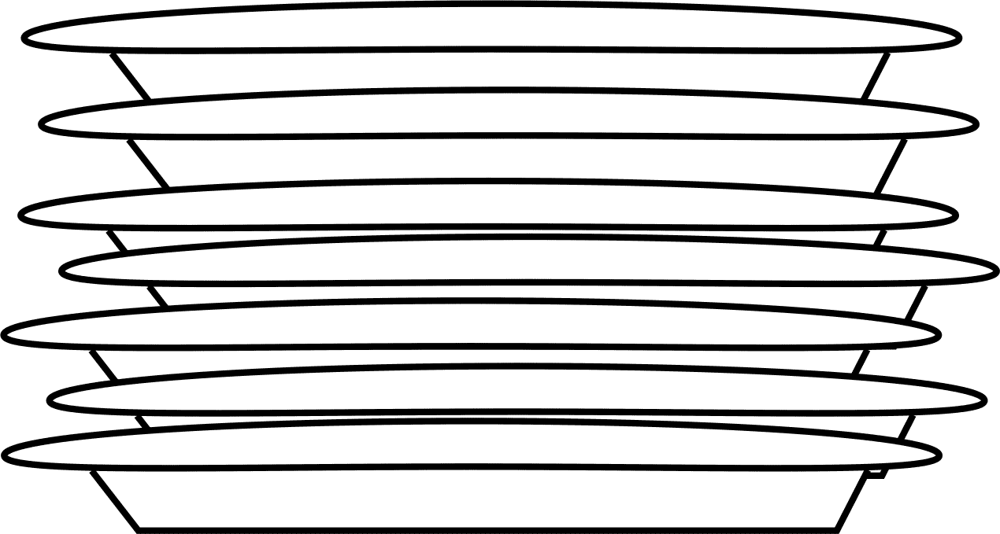

之前的图展示了盘子堆。向盘子堆中添加盘子只能通过将盘子留在堆顶来实现。从盘子堆中移除盘子意味着移除堆顶的盘子。

栈上执行的两个主要操作是`push`和`pop`。当一个元素被添加到栈顶时，它被推入栈中。当一个元素从栈顶取出时，它被从栈中弹出。有时还会使用另一个操作`peek`，这使得可以在不弹出元素的情况下查看栈上的元素。

栈被用于许多事情。栈的一个非常常见的用途是在函数调用期间跟踪返回地址。让我们想象一下，我们有一个以下的小程序：

```py
def b(): 
    print('b') 

def a(): 
    b() 

a() 
print("done") 

```

当程序执行到达对`a()`的调用时，它首先将后续指令的地址推入栈中，然后跳转到`a`。在`a`内部调用`b()`之前，返回地址被推入栈中。一旦进入`b()`并且函数执行完毕，返回地址从栈中弹出，这使我们回到`a()`。当`a`完成时，返回地址从栈中弹出，这使我们回到`print`语句。

栈实际上也被用来在函数之间传递数据。比如说，你的代码中某处有一个以下函数调用：

```py
   somefunc(14, 'eggs', 'ham', 'spam') 

```

将要发生的事情是`14, 'eggs', 'ham'`和`'spam'`将逐个推入栈中：

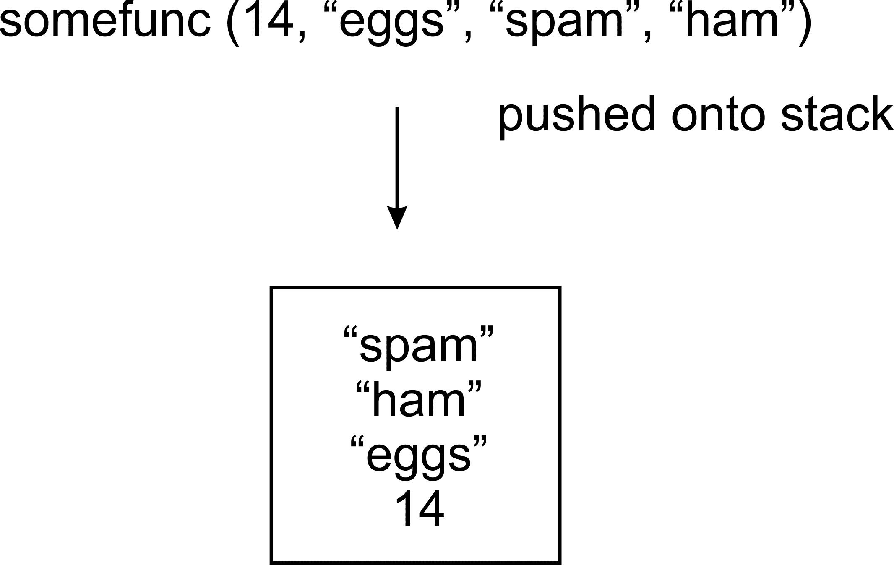

当代码跳入函数时，`a, b, c, d`的值将从栈中弹出。`spam`元素将首先弹出并赋值给`d`，然后`"ham"`将赋值给`c`，依此类推：

```py
    def somefunc(a, b, c, d): 
        print("function executed")

```

# 栈实现

现在我们来研究一下 Python 中栈的实现。我们首先创建一个`node`类，就像我们在上一章中使用列表时做的那样：

```py
class Node: 
    def __init__(self, data=None): 
        self.data = data 
        self.next = None 

```

到现在为止，这应该对你来说很熟悉了：一个节点持有数据并指向列表中的下一个项目。我们将实现一个栈而不是列表，但节点链接在一起的原则仍然适用。

现在让我们看看 `stack` 类。它开始时类似于一个单链表。我们需要知道栈顶的节点。我们还想跟踪栈中的节点数量。因此，我们将把这些字段添加到我们的类中：

```py
class Stack: 
    def __init__(self): 
        self.top = None 
        self.size = 0 

```

# 推送操作

`push` 操作用于将元素添加到栈顶。以下是一个实现示例：

```py
   def push(self, data): 
       node = Node(data) 
       if self.top: 
           node.next = self.top 
           self.top = node                 
       else: 
           self.top = node 
       self.size += 1 

```

在以下图中，创建我们的新节点后没有现有的节点。因此 `self.top` 将指向这个新节点。`if` 语句的 else 部分保证了这一点：

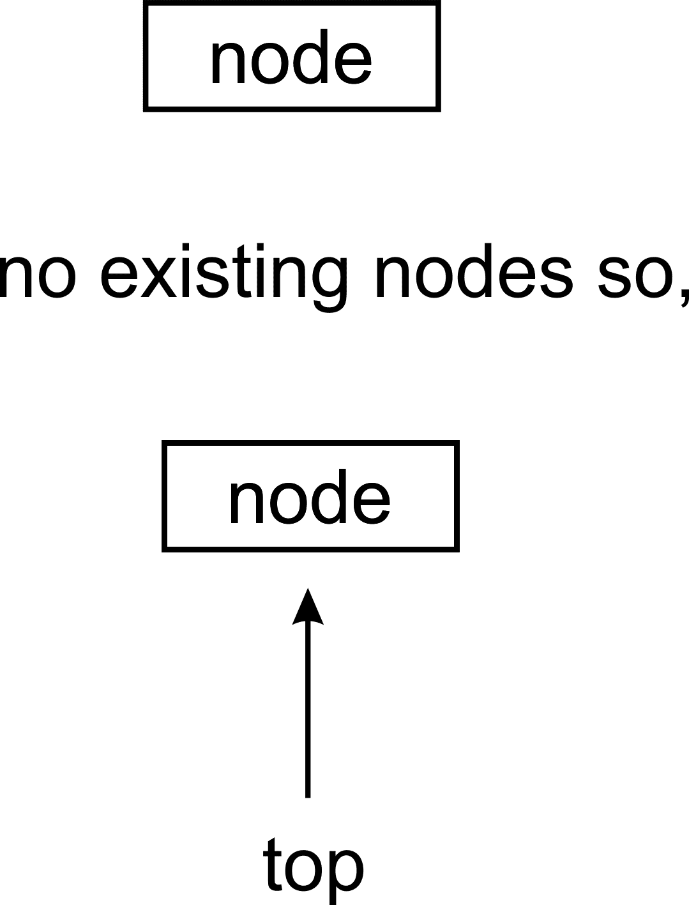

在我们有一个现有的栈的场景中，我们将 `self.top` 移动，使其指向新创建的节点。新创建的节点必须有其 **next** 指针，指向原来栈顶的节点：

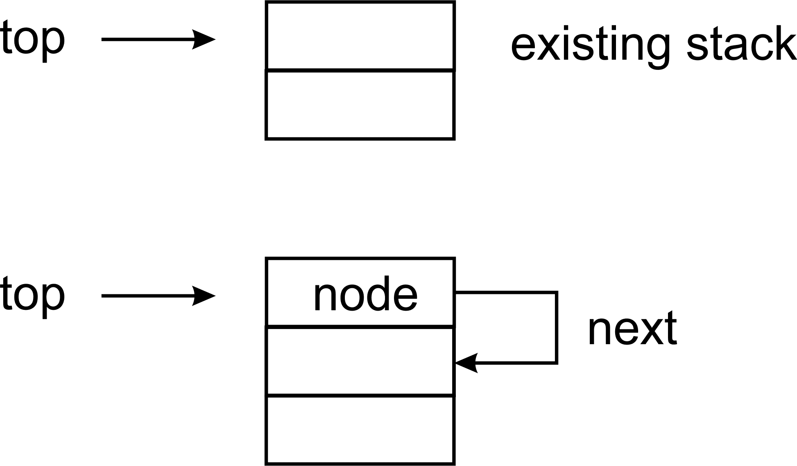

# 弹出操作

现在我们需要一个 `pop` 方法来从栈中移除顶部元素。当我们这样做时，我们需要返回顶部元素。如果没有更多元素，我们将使栈返回 `None`：

```py
    def pop(self): 
        if self.top: 
            data = self.top.data 
            self.size -= 1  
            if self.top.next: 
                self.top = self.top.next 
            else: 
                self.top = None 
            return data 
        else: 
            return None 

```

这里需要注意的地方是内部的 `if` 语句。如果顶部节点有它的 **next** 属性指向另一个节点，那么我们必须将栈顶设置为现在指向那个节点：

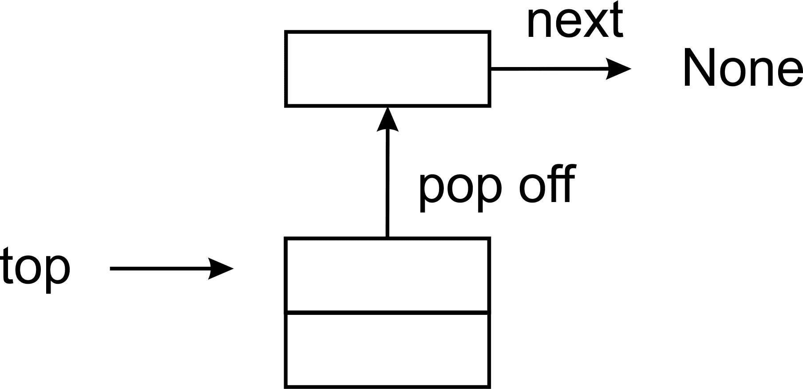

当栈中只有一个节点时，`pop` 操作将按以下方式进行：


移除这样的节点会导致 `self.top` 指向 `None`：

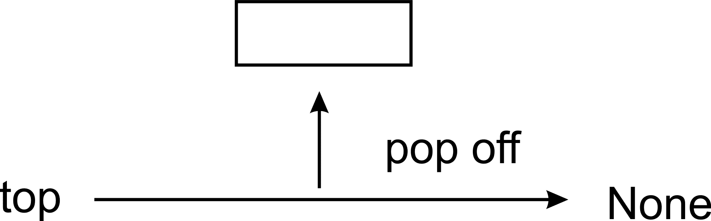

# 查看操作

如我们之前所说，我们也可以添加一个 `peek` 方法。这个方法将只返回栈顶元素而不从栈中移除它，允许我们查看顶部元素而不改变栈本身。这个操作非常直接。如果有顶部元素，返回其数据，否则返回 `None`（这样 `peek` 的行为就与 `pop` 相匹配）：

```py
    def peek(self): 
        if self.top 
            return self.top.data 
        else: 
            return None 

```

# 括号匹配应用

现在让我们看看我们如何使用我们的栈实现。我们将编写一个小的函数来验证包含括号（`-`，`[` 或 `{`）的语句是否平衡，即闭括号的数量是否与开括号的数量匹配。它还将确保一对括号确实包含在另一个括号中：

```py
    def check_brackets(statement): 
        stack = Stack() 
        for ch in statement: 
            if ch in ('{', '[', '('): 
                stack.push(ch) 
            if ch in ('}', ']', ')'): 
                last = stack.pop() 
            if last is '{' and ch is '}': 
                continue 
            elif last is '[' and ch is ']': 
                continue 
            elif last is '(' and ch is ')': 
                continue 
            else: 
                return False 
    if stack.size > 0: 
        return False 
    else: 
        return True 

```

我们的功能解析传递给它的语句中的每个字符。如果它得到一个开括号，它将其推入栈中。如果它得到一个闭括号，它将栈顶元素弹出并与两个括号进行比较，以确保它们的类型匹配：`(` 应该匹配 `)`，`[` 应该匹配 `]`，`{` 应该匹配 `}`。如果不匹配，我们返回 `False`，否则我们继续解析。

一旦我们到达语句的末尾，我们需要进行最后的检查。如果栈为空，那么我们就好了，我们可以返回 `True`。但如果栈不为空，那么我们有一些没有匹配闭括号的开括号，我们应该返回 `False`。

我们可以用以下简短的代码测试括号匹配器：

```py
sl = ( 
   "{(foo)(bar)}hellois)a)test", 
   "{(foo)(bar)}hellois)atest", 
   "{(foo)(bar)}hellois)a)test))" 
) 

for s in sl: 
   m = check_brackets(s) 
   print("{}: {}".format(s, m)) 

```

只有三个语句中的第一个应该匹配。当我们运行代码时，我们得到以下输出：

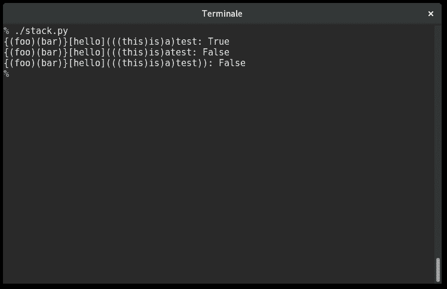

`True`，`False`，`False`。代码是有效的。总之，栈数据结构的`push`和`pop`操作吸引了一个**O**(*1*)。栈数据结构足够简单，但在现实世界中用于实现一系列功能。浏览器的后退和前进按钮就是通过栈实现的。为了在文字处理器中实现撤销和重做功能，栈也被使用。

# 队列

另一种特殊的列表类型是队列数据结构。这种数据结构与你在现实生活中习惯的普通队列没有区别。如果你曾在机场排队或在你家附近的商店排队等待点你最喜欢的汉堡，那么你应该知道队列是如何工作的。

队列也是一个非常基础且重要的概念，需要掌握，因为许多其他数据结构都是基于它构建的。

队列的工作方式是，通常第一个加入队列的人会先被服务，在所有条件相同的情况下。缩写 FIFO 最能解释这一点。**FIFO**代表**先进先出**。当人们排队等待轮到他们被服务时，服务只在前端进行。人们退出队列的唯一时间是当他们被服务，这只会发生在队列的最前端。根据严格的定义，人们加入正在被服务的前端队列是非法的：

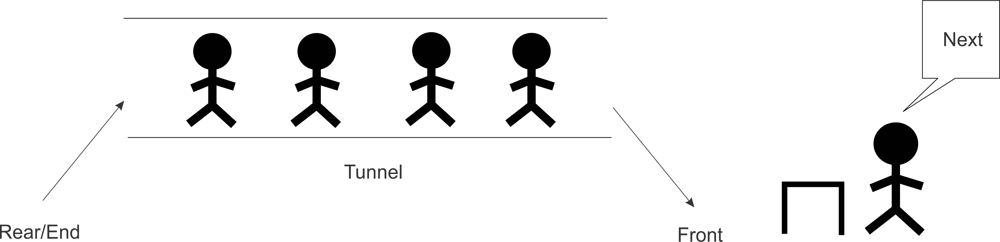

要加入队列，参与者必须首先移动到队列中最后一个人的后面。队列的长度无关紧要。这是队列接受新成员的唯一合法或允许的方式。

尽管我们人类如此，我们形成的队列并不遵循严格的规则。可能会有已经在队列中的人决定退出，甚至有其他人代替他们。我们并不打算模拟现实中队列发生的所有动态。抽象队列是什么以及它是如何工作的，使我们能够解决许多挑战，尤其是在计算领域。

我们将提供队列的各种实现，但所有实现都将围绕 FIFO（先进先出）这一相同理念。我们将把向队列中添加元素的运算称为入队。要从队列中移除元素，我们将创建一个`出队`操作。每次元素入队时，队列的长度或大小增加一。相反，出队项目将队列中的元素数量减少一。

为了演示两种操作，以下表格显示了向队列中添加和移除元素的效果：

| **队列操作** | **大小** | **内容** | **操作结果** |
| --- | --- | --- | --- |
| `Queue()` | 0 | `[]` | 创建队列对象 |
| `入队` "Mark" | 1 | `['mark']` | 将 Mark 添加到队列中 |
| `入队` "John" | 2 | `['mark','john']` | 将 John 添加到队列中 |
| `Size()` | 2 | `['mark','john']` | 返回队列中的项目数量 |
| `Dequeue()` | 1 | `['mark']` | John 被出队并返回 |
| `Dequeue()` | 0 | `[]` | Mark 被出队并返回 |

# 基于列表的队列

为了将关于队列的所有讨论转化为代码，让我们继续使用 Python 的 `list` 类来实现一个非常简单的队列。这是为了帮助我们快速开发并了解队列。必须在队列上执行的操作封装在 `ListQueue` 类中：

```py
class ListQueue: 
    def __init__(self): 
        self.items = [] 
        self.size = 0 

```

在初始化方法 `__init__` 中，`items` 实例变量被设置为 `[]`，这意味着队列在创建时是空的。队列的大小也被设置为 `zero`。更有趣的方法是 `enqueue` 和 `dequeue` 方法。

# Enqueue 操作

`enqueue` 操作或方法使用 `list` 类的 `insert` 方法在列表的前端插入项目（或数据）：

```py
    def enqueue(self, data): 
        self.items.insert(0, data) 
        self.size += 1 

```

请注意我们是如何实现向队列末尾插入元素的。索引 0 是任何列表或数组中的第一个位置。然而，在我们的使用 Python 列表实现的队列中，数组索引 0 是唯一可以插入新数据元素到队列中的地方。`insert` 操作会将列表中的现有数据元素向上移动一个位置，然后在索引 0 处创建的空间中插入新数据。以下图示展示了这一过程：

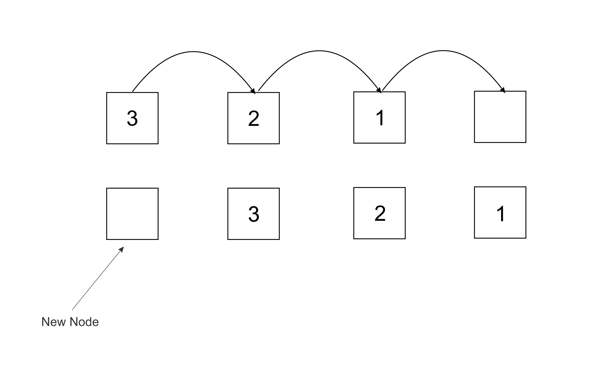

为了使我们的队列反映新元素的添加，大小增加了一个：

```py
self.size += 1 

```

我们本可以使用 Python 列表的 `shift` 方法作为实现“在 0 处插入”的另一种方式。最终，实现是这项练习的整体目标。

# Dequeue 操作

`dequeue` 操作用于从队列中移除项目。参考队列主题的介绍，这个操作捕捉了我们服务第一个加入队列并等待时间最长的客户这一点：

```py
    def dequeue(self):
        data = self.items.pop()
        self.size -= 1
        return data

```

Python 的 `list` 类有一个名为 `pop()` 的方法。`pop` 方法执行以下操作：

1.  从列表中移除最后一个项目。

1.  将从列表中移除的项目返回给调用它的用户或代码。

列表中的最后一个项目被弹出并保存在 `data` 变量中。在方法的最后一行，数据被返回。

考虑以下图中的隧道作为我们的队列。为了执行 `dequeue` 操作，数据为 `1` 的节点从队列的前端被移除：

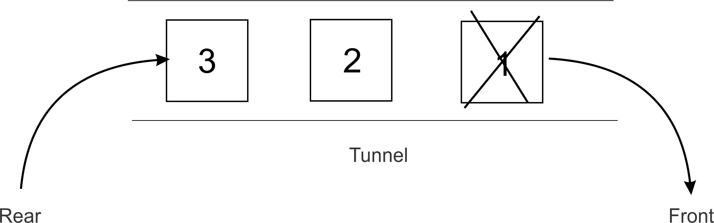

队列中的结果元素如下所示：

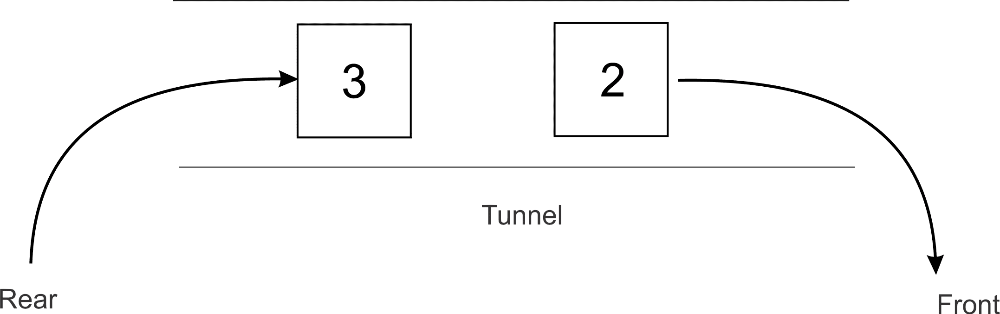

我们对 `enqueue` 操作有什么可以说的？它在多个方面都效率低下。该方法必须首先将所有元素移动一个空间。想象一下，当列表中有 100 万个元素需要移动时，每次向队列中添加新元素时都需要进行移动。这通常会使大型列表的入队过程变得非常缓慢。

# 基于栈的队列

队列的另一种实现是使用两个栈。再次使用 Python 的 `list` 类来模拟栈：

```py
class Queue: 
    def __init__(self): 
        self.inbound_stack = [] 
        self.outbound_stack = [] 

```

上述`queue`类在初始化时将两个实例变量设置为空列表。这些是帮助我们实现队列的栈。在这种情况下，栈只是允许我们调用`push`和`pop`方法的 Python 列表。

`inbound_stack`仅用于存储添加到队列的元素。对此栈不能执行其他操作。

# 入队操作

`enqueue`方法是将元素添加到队列的方法：

```py
def enqueue(self, data): 
    self.inbound_stack.append(data) 

```

该方法是简单的，它只接收客户端想要添加到队列中的`data`。然后，这些数据被传递到`queue`类中`inbound_stack`的`append`方法。此外，`append`方法用于模拟`push`操作，该操作将元素推送到栈顶。

要将数据`enqueue`到`inbound_stack`，以下代码是合适的：

```py
queue = Queue() 
queue.enqueue(5) 
queue.enqueue(6) 
queue.enqueue(7) 
print(queue.inbound_stack) 

```

队列内部`inbound_stack`的命令行输出如下：

```py
    [5, 6, 7]

```

# 出队操作

`dequeue`操作比其`enqueue`对应操作更复杂。添加到我们队列的新元素最终会进入`inbound_stack`。我们不是从`inbound_stack`中删除元素，而是将注意力转向`outbound_stack`。正如我们所说，只能通过`outbound_stack`来删除队列中的元素：

```py
    if not self.outbound_stack: 
        while self.inbound_stack: 
            self.outbound_stack.append(self.inbound_stack.pop()) 
    return self.outbound_stack.pop() 

```

`if`语句首先检查`outbound_stack`是否为空。如果不为空，我们继续执行以下操作来移除队列前端的元素：

```py
return self.outbound_stack.pop() 

```

如果`outbound_stack`为空，则在从队列前端弹出元素之前，将`inbound_stack`中的所有元素移动到`outbound_stack`：

```py
while self.inbound_stack: 
    self.outbound_stack.append(self.inbound_stack.pop()) 

```

只要`inbound_stack`中有元素，`while`循环就会继续执行。

语句`self.inbound_stack.pop()`将移除最近添加到`inbound_stack`的最新元素，并将其立即传递给`self.outbound_stack.append()`方法调用。

初始时，我们的`inbound_stack`被填充了元素**5**、**6**和**7**：

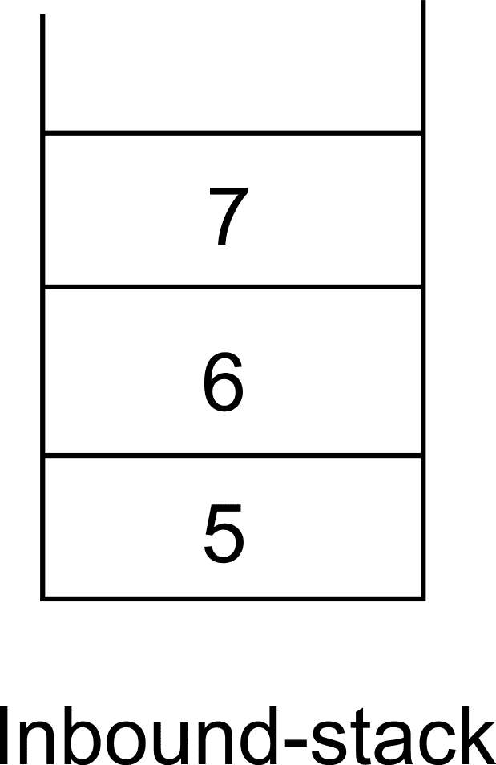

执行`while`循环体之后，`outbound_stack`看起来如下：

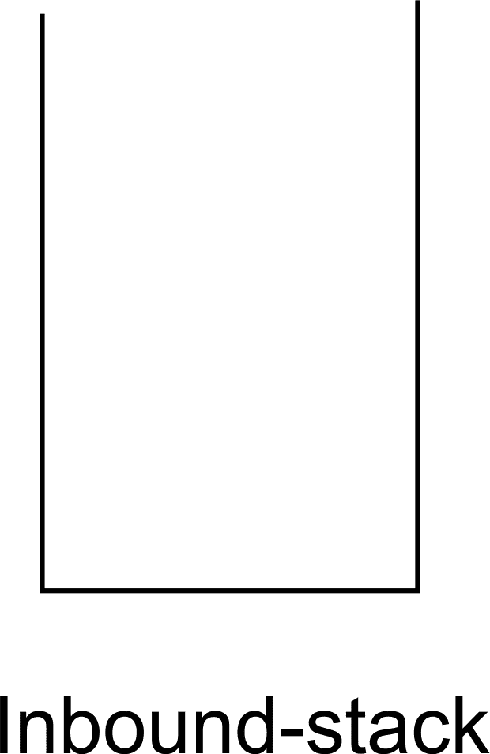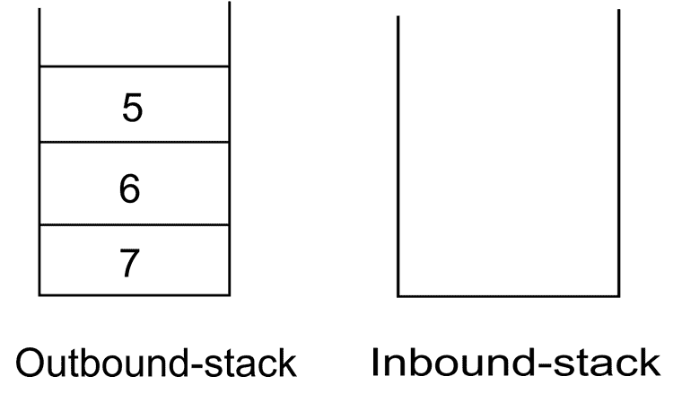

`dequeue`方法中的最后一行将返回`5`作为对`outbound_stack`执行`pop`操作的结果：

```py
return self.outbound_stack.pop() 

```

这使得`outbound_stack`只剩下两个元素：

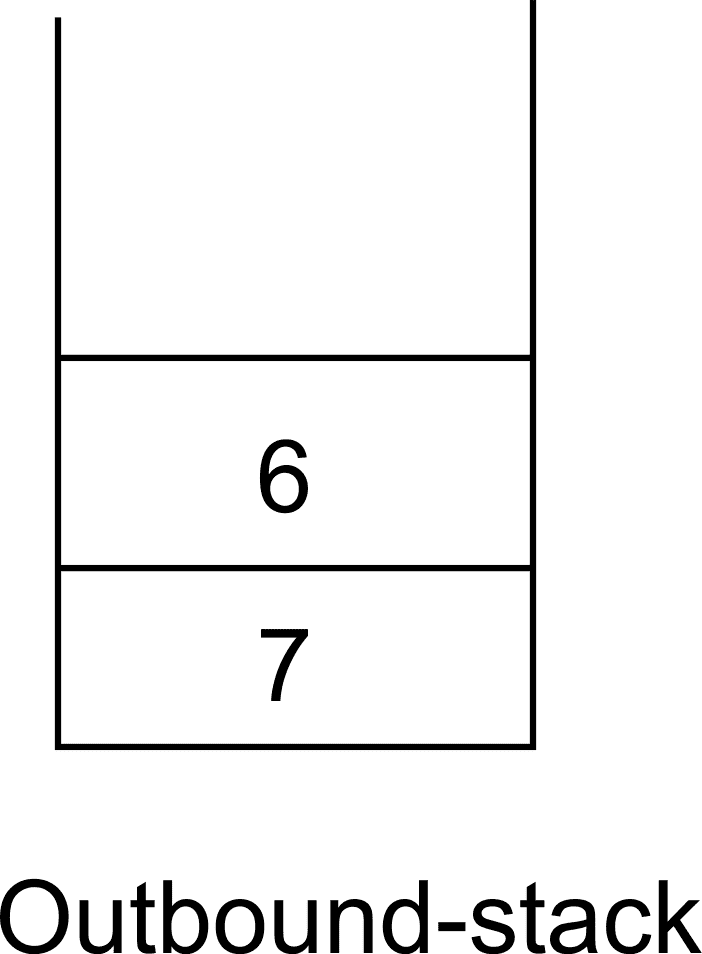

下一次调用`dequeue`操作时，`while`循环将不会执行，因为`outbound_stack`中没有元素，这使得外部的`if`语句失败。

在这种情况下，立即调用`pop`操作，以便只返回等待时间最长的队列中的元素。

使用此队列实现的典型代码运行如下：

```py
queue = Queue() 
queue.enqueue(5) 
queue.enqueue(6) 
queue.enqueue(7) 
print(queue.inbound_stack) 
queue.dequeue() 
print(queue.inbound_stack) 
print(queue.outbound_stack) 
queue.dequeue() 
print(queue.outbound_stack) 

```

上述代码的输出如下：

```py
 [5, 6, 7] 
 [] 
 [7, 6] 
 [7] 

```

代码示例向队列中添加元素并打印队列中的元素。调用 `dequeue` 方法后，再次打印队列时观察到元素数量的变化。

在面试中，使用两个栈实现队列是一个常见的问题。

# 基于节点的队列

使用 Python 列表实现队列是一个很好的入门方式，以了解队列的工作原理。我们完全可以通过利用我们对指针结构的了解来实现自己的队列数据结构。

可以使用双向链表实现队列，并且在此数据结构上的 `插入` 和 `删除` 操作的时间复杂度为 **O**(*1*)。

`node` 类的定义与我们在讨论双向链表时定义的 `Node` 相同。如果双向链表允许进行 FIFO 类型的数据访问，即首先添加到列表的元素是第一个被移除的，则可以将双向链表视为队列。

# 队列类

`queue` 类与双向链表的 `list` 类非常相似：

```py
class Queue: 
def __init__(self): 
        self.head = None 
        self.tail = None 
        self.count = 0 

```

在创建 `queue` 类的实例时，将 `self.head` 和 `self.tail` 指针设置为 `None`。为了保持 `Queue` 中节点数量的计数，这里也维护了一个 `count` 实例变量，并将其设置为 `0`。

# 入队操作

通过 `enqueue` 方法将元素添加到 `Queue` 对象中。在这种情况下，元素是节点：

```py
    def enqueue(self, data): 
        new_node = Node(data, None, None) 
        if self.head is None: 
            self.head = new_node 
            self.tail = self.head 
        else: 
            new_node.prev = self.tail 
            self.tail.next = new_node 
            self.tail = new_node 

        self.count += 1 

```

`enqueue` 方法的代码与我们在双向链表的 `append` 操作中解释的代码相同。它从传递给它的数据创建一个节点并将其追加到队列的尾部，或者如果队列是空的，则将 `self.head` 和 `self.tail` 都指向新创建的节点。通过 `self.count += 1` 这一行，队列中的元素总数增加。

# 出队操作

使我们的双向链表表现得像队列的另一个操作是 `dequeue` 方法。此方法就是移除队列前端的节点。

要移除由 `self.head` 指向的第一个元素，使用一个 `if` 语句：

```py
def dequeue(self): 
current = self.head 
        if self.count == 1: 
            self.count -= 1 
            self.head = None 
            self.tail = None 
        elif self.count > 1: 
            self.head = self.head.next 
            self.head.prev = None 
            self.count -= 1 

```

`current` 通过将其指向 `self.head` 来初始化。如果 `self.count` 是 1，那么这意味着列表和队列中只有一个节点。因此，为了移除相关的节点（由 `self.head` 指向），将 `self.head` 和 `self.tail` 变量设置为 `None`。

另一方面，如果队列中有许多节点，则头指针会移动以指向 `self.head` 的下一个节点。

在执行 `if` 语句后，方法返回由 `head` 指向的节点。无论 `if` 语句执行路径如何，`self.count` 都会递减一个。

配备了这些方法，我们已经成功地实现了一个队列，大量借鉴了双向链表的想法。

记住，将我们的双向链表转变为队列的只有两个方法，即 `enqueue` 和 `dequeue`。

# 队列的应用

在计算机领域，队列被用来实现各种功能。例如，而不是为网络上的每一台计算机提供其自己的打印机，可以通过排队每台打印机想要打印的内容，让一组计算机共享一台打印机。当打印机准备好打印时，它会从队列中选择一个项目（通常称为作业）进行打印。

操作系统也会将进程排队以供 CPU 执行。让我们创建一个利用队列创建基本媒体播放器的应用程序。

# 媒体播放器队列

大多数音乐播放器软件都允许用户有机会将歌曲添加到播放列表中。当按下播放按钮时，主播放列表中的所有歌曲会依次播放。由于首先被排队的歌曲是第一个被播放的歌曲，因此可以使用队列来实现歌曲的顺序播放，这与 FIFO 的缩写相符合。我们将实现我们自己的播放列表队列，以 FIFO 的方式播放歌曲。

基本上，我们的媒体播放器队列只允许添加轨道以及播放队列中所有轨道的方式。在一个完整的音乐播放器中，会使用线程来改善队列的交互方式，同时音乐播放器继续被用来选择下一首将要播放、暂停或甚至停止的歌曲。

`track` 类将模拟一个音乐轨道：

```py
from random import randint 
class Track: 

    def __init__(self, title=None): 
        self.title = title 
        self.length = randint(5, 10) 

```

每个轨道都保存了歌曲标题的引用以及歌曲的长度。长度是介于 5 到 10 之间的随机数。随机模块提供了 `randint` 方法，使我们能够生成随机数。这个类代表任何包含音乐的 MP3 轨道或文件。轨道的随机长度被用来模拟播放一首歌曲或轨道所需的时间。

要创建几个轨道并打印出它们的长度，我们执行以下操作：

```py
track1 = Track("white whistle") 
track2 = Track("butter butter") 
print(track1.length) 
print(track2.length) 

```

上述代码的输出如下：

```py
    6
 7

```

您的输出可能因两个轨道生成的随机长度不同而不同。

现在，让我们创建我们的队列。使用继承，我们简单地从 `queue` 类继承：

```py
import time 
class MediaPlayerQueue(Queue): 

    def __init__(self): 
        super(MediaPlayerQueue, self).__init__() 

```

通过调用 `super` 来正确初始化队列，进行调用以创建队列。这个类本质上是一个队列，它在一个队列中持有多个轨道对象。为了向队列中添加轨道，创建了一个 `add_track` 方法：

```py
    def add_track(self, track): 
        self.enqueue(track) 

```

该方法将一个 `track` 对象传递给队列的 `super` 类的 `enqueue` 方法。这将实际上使用 `track` 对象（作为节点数据）创建一个 `Node`，并将队列的尾指针（如果队列不为空）或头尾指针（如果队列为空）指向这个新节点。

假设队列中的轨道是按照从第一个添加的轨道到最后的顺序播放（FIFO），那么 `play` 函数必须遍历队列中的元素：

```py
def play(self): 
        while self.count > 0: 
            current_track_node = self.dequeue() 
            print("Now playing {}".format(current_track_node.data.title)) 
            time.sleep(current_track_node.data.length) 

```

`self.count`记录了曲目被添加到我们的队列中和曲目被出队的时间。如果队列不为空，调用`dequeue`方法将返回队列前端的节点（其中包含`track`对象）。然后`print`语句通过节点的`data`属性访问曲目的标题。为了进一步模拟曲目的播放，`time.sleep()`方法使程序执行暂停，直到曲目的秒数已过：

```py
time.sleep(current_track_node.data.length) 

```

媒体播放器队列由节点组成。当一首曲目被添加到队列中时，该曲目会隐藏在一个新创建的节点中，并与节点的数据属性相关联。这就解释了为什么我们通过调用`dequeue`返回的节点（其中包含`track`对象）的数据属性来访问节点的`track`对象：

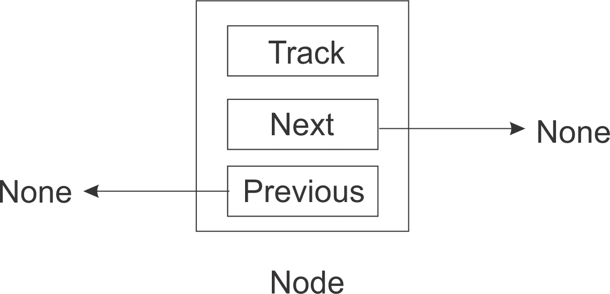

你可以看到，我们的`node`对象不仅仅存储任何数据，在这种情况下，它存储的是曲目。

让我们来试一下我们的音乐播放器：

```py
track1 = Track("white whistle") 
track2 = Track("butter butter") 
track3 = Track("Oh black star") 
track4 = Track("Watch that chicken") 
track5 = Track("Don't go") 

```

我们创建了五个曲目对象，标题为随机单词：

```py
print(track1.length) 
print(track2.length) 
>> 8 >> 9

```

由于随机长度，输出应该与你在机器上得到的不同。

接下来，创建了一个`MediaPlayerQueue`类的实例：

```py
media_player = MediaPlayerQueue() 

```

曲目将被添加，`play`函数的输出应该以我们排队相同的顺序打印出正在播放的曲目：

```py
media_player.add_track(track1) 
media_player.add_track(track2) 
media_player.add_track(track3) 
media_player.add_track(track4) 
media_player.add_track(track5) 
media_player.play() 

```

上述代码的输出如下：

```py
    >>Now playing white whistle
 >>Now playing butter butter
 >>Now playing Oh black star
 >>Now playing Watch that chicken
 >>Now playing Don't go

```

程序执行后，可以看到曲目是按照它们被加入队列的顺序播放的。在播放曲目时，系统也会暂停与曲目长度相等的秒数。

# 概述

在本章中，我们利用将节点链接在一起的知识来创建其他数据结构，即栈和队列。我们看到了这些数据结构如何紧密地模仿现实世界中的栈和队列。展示了具体实现及其不同类型。我们后来将栈和队列的概念应用于编写现实生活中的程序。

在下一章中，我们将考虑树。将讨论树上的主要操作，同样也会讨论应用这种数据结构的不同领域。
