# 树

树是一种层次化的数据结构。当我们处理列表、队列和栈时，项目是依次跟随的。但在树中，项目之间存在 *父子* 关系。

要可视化树的外观，想象一棵从地面生长起来的树。现在从你的脑海中移除那个图像。树通常向下绘制，所以你最好想象树的根结构向下生长。

每棵树的顶部都有所谓的 *根节点*。这是树中所有其他节点的祖先。

树被用于许多事情，例如解析表达式和搜索。某些文档类型，如 XML 和 HTML，也可以以树的形式表示。在本章中，我们将探讨树的一些用途。

在本章中，我们将涵盖以下内容：

+   树的术语和定义

+   二叉树和二叉搜索树

+   树遍历

# 术语

让我们考虑一些与树相关的术语。

要理解树，我们首先需要理解它们所基于的基本概念。以下图包含一个典型的树，由字母节点 **A** 到 **M** 组成。

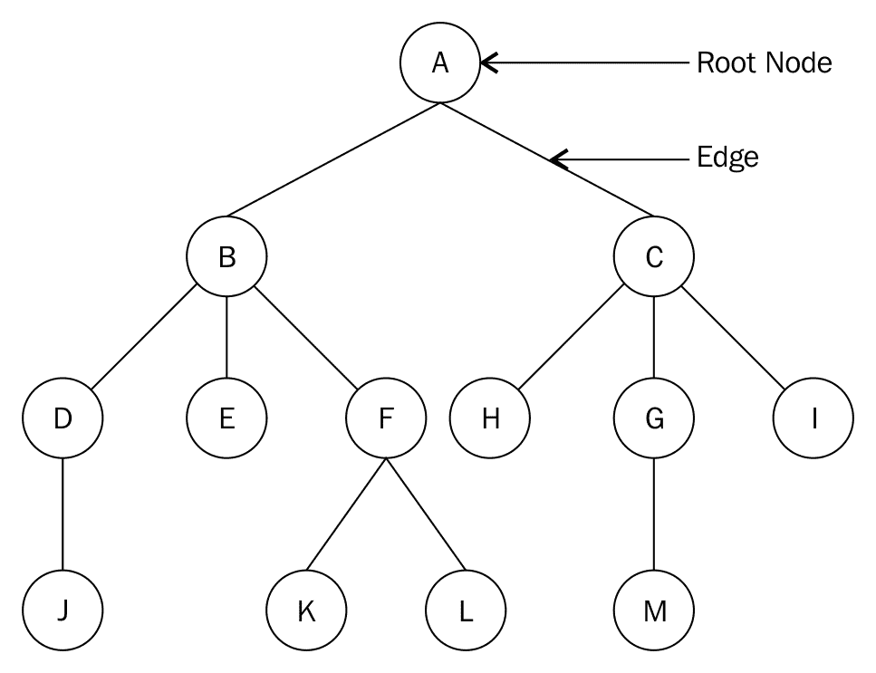

这里是一个与树相关的术语列表：

+   **节点**：每个圆圈中的字母代表一个节点。节点是任何包含数据的结构。

+   **根节点**：根节点是从中产生所有其他节点的唯一节点。如果一个树没有可区分的根节点，则不能将其视为树。我们树中的根节点是节点 A。

+   **子树**：树的子树是具有其节点为其他树的后代的一些树的树。节点 F、K 和 L 形成了原始树（包含所有节点）的子树。

+   **度**：给定节点的子树数量。仅由一个节点组成的树具有度为 0。这个单一树节点在所有标准下也被认为是树。节点 A 的度数为 2。

+   **叶节点**：这是一个度为 0 的节点。节点 J、E、K、L、H、M 和 I 都是叶节点。

+   **边**：两个节点之间的连接。有时边可以连接一个节点到自身，使边看起来像是一个环。

+   **父节点**：树中带有其他连接节点的节点是这些节点的父节点。节点 B 是节点 D、E 和 F 的父节点。

+   **子节点**：这是连接到其父节点的节点。节点 B 和 C 是节点 A（父节点和根节点）的子节点。

+   **兄弟节点**：所有具有相同父节点的节点都是兄弟节点。这使得节点 B 和 C 成为兄弟节点。

+   **级别**：节点的级别是从根节点到该节点的连接数量。根节点位于级别 0。节点 B 和 C 位于级别 1。

+   **树的高度**：这是树中的层数。我们的树的高度为 4。

+   **深度**：节点的深度是从树的根到该节点的边的数量。节点 H 的深度为 2。

我们将通过对树中的节点进行考虑并抽象出一个类来开始我们对树的讨论。

# 树节点

正如我们之前遇到的其他数据结构一样，例如列表和栈，树是由节点组成的。但构成树的节点需要包含我们之前提到的父子关系的数据。

让我们现在看看如何在 Python 中构建一个二叉树 `node` 类：

```py
    class Node: 
        def __init__(self, data): 
            self.data = data 
            self.right_child = None 
            self.left_child = None 

```

就像我们之前的实现一样，节点是数据的容器，并持有对其他节点的引用。作为一个二叉树节点，这些引用是对左子节点和右子节点的引用。

为了测试这个类，我们首先创建几个节点：

```py
    n1 = Node("root node")  
    n2 = Node("left child node") 
    n3 = Node("right child node") 
    n4 = Node("left grandchild node") 

```

接下来，我们将节点连接起来。我们让 `n1` 作为根节点，`n2` 和 `n3` 作为其子节点。最后，我们将 `n4` 作为 `n2` 的左子节点连接起来，这样当我们遍历左子树时就会得到几个迭代：

```py
    n1.left_child = n2 
    n1.right_child = n3 
    n2.left_child = n4 

```

一旦我们设置了树结构，我们就可以遍历它了。如前所述，我们将遍历左子树。我们打印出节点，并沿着树向下移动到下一个左节点。我们一直这样做，直到我们到达左子树的末尾：

```py
    current = n1 
    while current: 
        print(current.data) 
        current = current.left_child 

```

你可能已经注意到，这需要在客户端代码中做相当多的工作，因为你必须手动构建树结构。

# 二叉树

二叉树是一种每个节点最多有两个子节点的树。二叉树非常常见，我们将使用它们来构建 BST 的实现。

Python.

以下是一个以 5 为根节点的二叉树的示例：

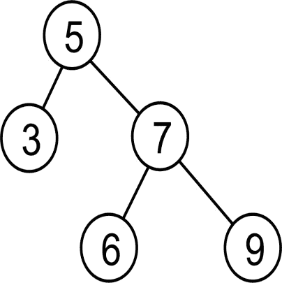

每个子节点都被标识为其父节点的右子节点或左子节点。由于父节点本身也是一个节点，每个节点都将持有对右节点和左节点的引用，即使这些节点不存在。

一个常规的二叉树没有关于元素如何排列在树中的规则。它只满足每个节点最多有两个子节点的条件。

# 二叉搜索树

**二叉搜索树**（**BST**）是一种特殊的二叉树。也就是说，它是一个结构上是二叉树的树。功能上，它是一个以能够高效搜索树的方式存储其节点。

BST 有一种结构。对于给定值的节点，左子树中的所有节点都小于或等于该节点的值。同样，该节点的右子树中的所有节点都大于其父节点的值。作为一个例子，考虑以下树：

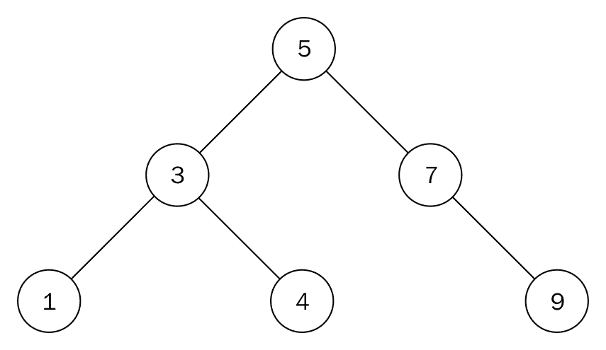

这是一个 BST 的例子。测试我们的树以检查 BST 的属性，你会发现根节点的左子树中的所有节点值都小于 5。同样，右子树中的所有节点值都大于 5。这个属性适用于 BST 中的所有节点，没有例外：

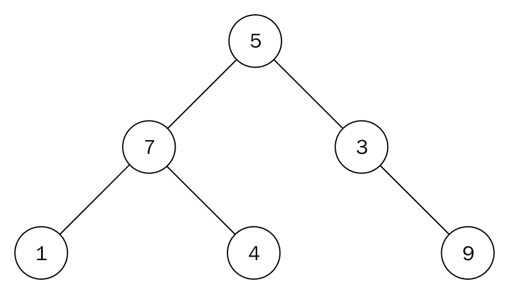

尽管前面的图看起来与前面的图相似，但它并不符合二叉搜索树（BST）的定义。节点 7 大于根节点 5；然而，它位于根节点的左侧。节点 4 是其父节点 7 的右子树，这是不正确的。

# 二叉搜索树实现

让我们开始实现 BST。我们希望树能持有其自己的根节点的引用：

```py
    class Tree: 
        def __init__(self): 
            self.root_node = None 

```

这就是维护树状态所需的所有内容。让我们在下一节中检查树上的主要操作。

# 二叉搜索树操作

实际上需要两种操作来拥有一个可用的 BST。这些是`insert`和`remove`操作。这些操作必须遵循一个规则，即它们必须维护 BST 结构的原理。

在我们处理节点的插入和删除之前，让我们讨论一些同样重要的操作，这些操作将帮助我们更好地理解`insert`和`remove`操作。

# 寻找最小和最大节点

BST 的结构使得寻找最大和最小值节点非常容易。

要找到具有最小值的节点，我们从树的根节点开始遍历，每次到达子树时都访问左节点。为了在树中找到具有最大值的节点，我们做相反的操作：

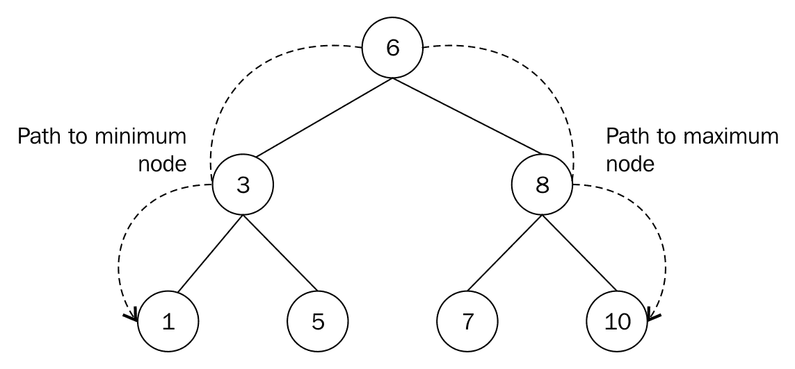

我们从节点 6 移动到 3，再到 1，以到达具有最小值的节点。同样，我们向下移动 6，8 到节点 10，这是具有最大值的节点。

这种寻找最小和最大节点的方法同样适用于子树。具有根节点 8 的子树中的最小节点是 7。该子树中具有最大值的节点是 10。

返回最小节点的方如下：

```py
    def find_min(self): 
        current = self.root_node 
        while current.left_child: 
            current = current.left_child 

        return current 

```

`while`循环继续获取左节点并访问它，直到最后一个左节点指向`None`。这是一个非常简单的方法。返回最大节点的方法相反，其中`current.left_child`现在变为`current.right_child`。

在 BST 中找到最小或最大值需要**O**(*h*)时间，其中*h*是树的高度。

# 插入节点

BST 上的一个操作是需要将数据作为节点插入。在我们的第一次实现中，我们必须自己插入节点，而在这里我们将让树负责存储其数据。

为了使搜索成为可能，节点必须以特定的方式存储。对于每个给定的节点，其左子节点将持有小于其自身值的数据，如前所述。该节点的右子节点将持有大于其父节点值的数据。

我们将通过从数据 5 开始来创建一个新的整数 BST。为此，我们将创建一个节点，其数据属性设置为 5。

现在，为了添加第二个具有值 3 的节点，3 与根节点 5 进行比较：

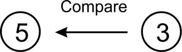

由于 5 大于 3，它将被放入节点 5 的左子树中。我们的 BST 将如下所示：

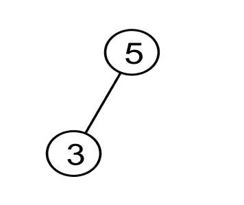

树满足 BST 规则，其中所有左子树中的节点都小于其父节点。

要将另一个值为 7 的节点添加到树中，我们从值为 5 的根节点开始并进行比较：


由于 7 大于 5，值为 7 的节点位于这个根的右侧。

当我们想要添加一个等于现有节点的节点时会发生什么？我们将简单地将其作为左节点添加，并在整个结构中保持此规则。

如果一个节点已经在新节点要插入的位置有一个子节点，那么我们必须向下移动树并附加它。

让我们添加另一个值为 1 的节点。从树的根开始，我们在 1 和 5 之间进行比较：

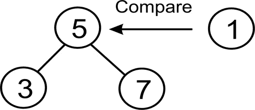

比较显示 1 小于 5，因此我们将注意力转移到 5 的左节点，即值为 3 的节点：

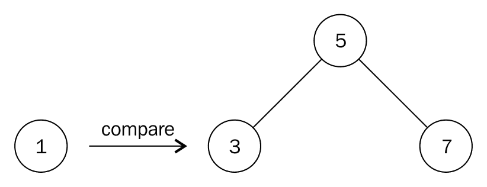

我们将 1 与 3 进行比较，由于 1 小于 3，我们向下移动到节点 3 的下一级并移动到其左侧。但那里没有节点。因此，我们创建一个值为 1 的节点并将其与节点 3 的左指针关联，以获得以下结构：

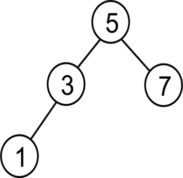

到目前为止，我们只处理包含整数或数字的节点。对于数字，大于和小于的概念是明确定义的。字符串将按字母顺序比较，所以那里也没有大问题。但如果你想在 BST 中存储自己的自定义数据类型，你必须确保你的类支持排序。

现在让我们创建一个函数，使我们能够将数据作为节点添加到 BST 中。我们从函数声明开始：

```py
    def insert(self, data): 

```

到现在为止，你将习惯于将数据封装在节点中。这样，我们就隐藏了`node`类，客户端代码只需要处理树：

```py
        node = Node(data) 

```

首先检查我们将有一个根节点。如果没有，新节点将成为根节点（没有根节点的树是不可能的）：

```py
        if self.root_node is None: 
            self.root_node = node 
        else: 

```

在我们向下移动树的过程中，我们需要跟踪我们正在处理的当前节点以及其父节点。变量`current`始终用于此目的：

```py
        current = self.root_node 
        parent = None 
        while True: 
            parent = current 

```

在这里我们必须进行一次比较。如果新节点中持有的数据小于当前节点中持有的数据，那么我们检查当前节点是否有左子节点。如果没有，这就是我们插入新节点的位置。否则，我们继续遍历：

```py
        if node.data < current.data: 
            current = current.left_child 
            if current is None: 
                parent.left_child = node 
                return 

```

现在我们来处理大于或等于的情况。如果当前节点没有右子节点，那么新节点将被插入为右子节点。否则，我们向下移动并继续寻找插入点：

```py
        else: 
            current = current.right_child 
            if current is None: 
                parent.right_child = node 
                return 

```

在 BST 中插入节点的时间复杂度为**O**(*h*)，其中 h 是树的高度。

# 删除节点

BST 上的另一个重要操作是节点的`删除`或`移除`。在这个过程中，我们需要处理三种情况。我们想要删除的节点可能有以下几种情况：

+   没有子节点

+   一个子节点

+   两个子节点

第一种情况是最容易处理的。如果即将被删除的节点没有子节点，我们只需将其从其父节点中分离出来：

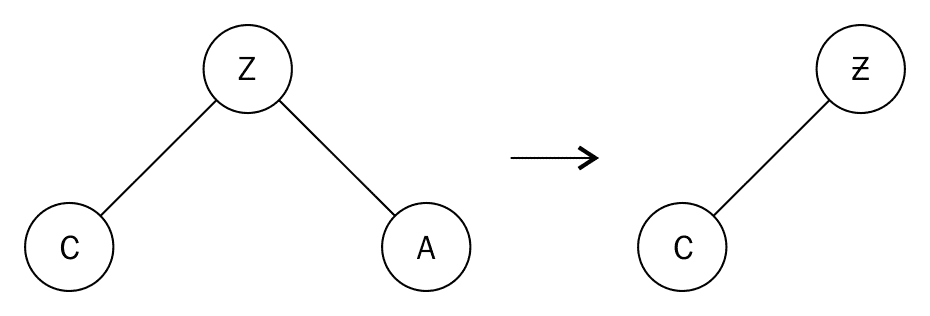

因为节点 A 没有子节点，我们将简单地将其与其父节点 Z 断开联系。

另一方面，当我们要删除的节点有一个子节点时，该节点的父节点被设置为指向该特定节点的子节点：

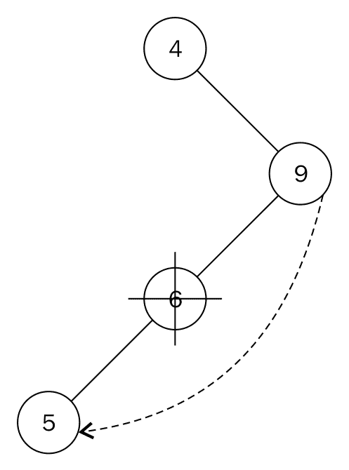

为了删除只有一个子节点 5 的节点 6，我们将节点 9 的左指针指向节点 5。父节点和子节点之间的关系必须被保留。这就是为什么我们需要注意子节点是如何连接到其父节点（即即将被删除的节点）的。被删除节点的子节点被存储起来。然后我们将被删除节点的父节点连接到那个子节点。

当我们想要删除的节点有两个子节点时，会出现一个更复杂的情况：

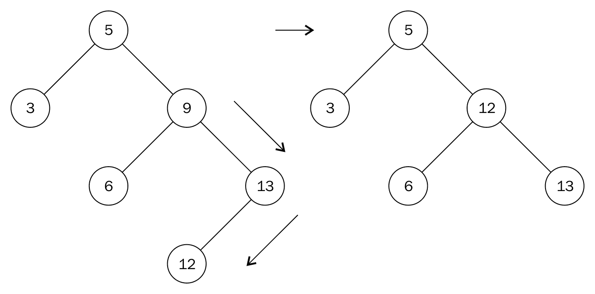

我们不能简单地将节点 9 替换为节点 6 或 13。我们需要做的是找到节点 9 的下一个最大的后裔。这是节点 12。要到达节点 12，我们移动到节点 9 的右节点。然后向左移动以找到最左边的节点。节点 12 被称为节点 9 的中序后继。第二步类似于寻找子树中的最大节点。

我们将节点 9 的值替换为 12，并删除节点 12。在删除节点 12 时，我们最终得到一个更简单的节点删除形式，这之前已经讨论过。节点 12 没有子节点，因此我们相应地应用删除无子节点节点的规则。

我们的`node`类没有父节点的引用。因此，我们需要使用一个辅助方法来搜索并返回带有父节点的节点。这种方法与`search`方法类似：

```py
    def get_node_with_parent(self, data): 
        parent = None 
        current = self.root_node 
        if current is None: 
            return (parent, None) 
        while True: 
            if current.data == data: 
                return (parent, current) 
            elif current.data > data: 
                parent = current 
                current = current.left_child 
            else: 
                parent = current 
                current = current.right_child 

        return (parent, current) 

```

唯一的区别是在我们更新循环中的当前变量之前，我们使用`parent = current`存储其父节点。实际删除节点的操作方法从以下搜索开始：

```py
    def remove(self, data): 
        parent, node = self.get_node_with_parent(data) 

        if parent is None and node is None: 
            return False 

        # Get children count 
        children_count = 0 

        if node.left_child and node.right_child: 
            children_count = 2 
        elif (node.left_child is None) and (node.right_child is None): 
            children_count = 0 
        else: 
            children_count = 1 

```

我们通过`parent, node = self.get_node_with_parent(data)`这一行将父节点和找到的节点分别传递给`parent`和`node`。了解我们想要删除的节点有多少个子节点是有帮助的。这就是`if`语句的目的。

在此之后，我们需要开始处理节点可以删除的各种条件。`if`语句的第一部分处理节点没有子节点的情况：

```py
        if children_count == 0: 
            if parent: 
                if parent.right_child is node: 
                    parent.right_child = None 
                else: 
                    parent.left_child = None 
            else: 
                self.root_node = None 

```

`if parent:`用于处理整个三个节点中只有一个节点的 BST 的情况。

在即将被删除的节点只有一个子节点的情况下，`elif`部分的`if`语句执行以下操作：

```py
        elif children_count == 1: 
            next_node = None 
            if node.left_child: 
                next_node = node.left_child 
            else: 
                next_node = node.right_child 

            if parent: 
                if parent.left_child is node: 
                    parent.left_child = next_node 
                else: 
                    parent.right_child = next_node 
            else: 
                self.root_node = next_node 

```

`next_node`用于跟踪我们想要删除的节点所指向的单个节点所在的位置。然后我们将`parent.left_child`或`parent.right_child`连接到`next_node`。

最后，我们处理要删除的节点有两个子节点的情况：

```py
        ... 
        else: 
            parent_of_leftmost_node = node 
            leftmost_node = node.right_child 
            while leftmost_node.left_child: 
                parent_of_leftmost_node = leftmost_node 
                leftmost_node = leftmost_node.left_child 

            node.data = leftmost_node.data 

```

在寻找中序后继时，我们移动到右节点，其中`leftmost_node = node.right_child`。只要存在左节点，`leftmost_node.left_child`将评估为`True`，`while`循环将运行。当我们到达最左边的节点时，它将要么是一个叶子节点（意味着它将没有子节点）或者有一个右子节点。

我们使用`node.data = leftmost_node.data`将即将被删除的节点更新为中序后继的值：

```py
    if parent_of_leftmost_node.left_child == leftmost_node: 
       parent_of_leftmost_node.left_child = leftmost_node.right_child 
    else: 
       parent_of_leftmost_node.right_child = leftmost_node.right_child 

```

前面的语句允许我们正确地将最左节点的父节点与任何子节点关联。观察等号右侧保持不变。这是因为中序后继只能有一个右子节点作为其唯一的子节点。

`remove`操作的时间复杂度为**O**(*h*)，其中 h 是树的高度。

# 树搜索

由于`insert`方法以特定的方式组织数据，我们将遵循相同的程序来查找数据。在这个实现中，如果找到了数据，我们将简单地返回数据；如果没有找到，则返回`None`：

```py
    def search(self, data): 

```

我们需要从最顶层开始搜索，即根节点：

```py
        current = self.root_node 
        while True: 

```

我们可能已经通过了一个叶子节点，在这种情况下，数据在树中不存在，我们将返回`None`给客户端代码：

```py
            if current is None: 
                return None 

```

我们可能也找到了数据，在这种情况下，我们将返回它：

```py
            elif current.data is data: 
                return data 

```

根据 BST 中数据存储的规则，如果我们正在搜索的数据小于当前节点的数据，我们需要沿着树向左下：

```py
            elif current.data > data: 
                current = current.left_child 

```

现在我们只剩下一个选择：我们要找的数据大于当前节点中的数据，这意味着我们沿着树向右下：

```py
            else: 
                current = current.right_child 

```

最后，我们可以编写一些客户端代码来测试 BST 的工作方式。我们创建一个树，并在 1 到 10 之间插入几个数字。然后我们搜索该范围内的所有数字。存在于树中的数字将被打印出来：

```py
    tree = Tree() 
    tree.insert(5) 
    tree.insert(2) 
    tree.insert(7) 
    tree.insert(9) 
    tree.insert(1) 

    for i in range(1, 10): 
        found = tree.search(i) 
        print("{}: {}".format(i, found)) 

```

# 树遍历

在树中访问所有节点可以是深度优先或广度优先。这些遍历模式不仅限于二叉搜索树，也适用于一般树。

# 深度优先遍历

在这种遍历模式中，我们在回溯之前会沿着一个分支（或边）走到尽头，然后向上继续遍历。我们将使用递归方法进行遍历。深度优先遍历有三种形式，即`中序`、`先序`和`后序`。

# 按序遍历和中缀表示法

我们大多数人可能习惯于这种表示算术表达式的方式，因为这是我们通常在学校里被教授的方式。运算符被插入（中缀）在操作数之间，如`3 + 4`。必要时，可以使用括号来构建更复杂的表达式：（4 + 5）*（5 - 3）。

在这种遍历模式中，你会访问左子树，父节点，最后是右子树。

返回树中节点中序列表的递归函数如下：

```py
    def inorder(self, root_node): 
        current = root_node 
        if current is None: 
            return 
        self.inorder(current.left_child) 
        print(current.data) 
        self.inorder(current.right_child) 

```

我们通过打印节点并使用`current.left_child`和`current.right_child`进行两次递归调用来访问节点。

# 先序遍历和前缀表示法

前缀表示法通常被称为波兰表示法。在这里，操作符在其操作数之前，例如`+ 3 4`。由于没有优先级的不确定性，不需要括号：`* + 4 5 - 5 3`。

要以先序模式遍历树，你会按照顺序访问节点、左子树和右子树节点。

前缀表示法对 LISP 程序员来说很熟悉。

这种遍历的递归函数如下：

```py
    def preorder(self, root_node): 
        current = root_node 
        if current is None: 
            return 
        print(current.data) 
        self.preorder(current.left_child) 
        self.preorder(current.right_child) 

```

注意递归调用的顺序。

# 后序遍历和后缀表示法。

后缀或**逆波兰表示法**（**RPN**）将操作符放在其操作数之后，例如`3 4 +`。与波兰表示法一样，操作符的优先级永远不会产生混淆，因此不需要括号：`4 5 + 5 3 - *`。

在这种遍历模式中，你会先访问左子树，然后是右子树，最后是根节点。

后序遍历的方法如下：

```py
    def postorder(self, root_node): 
        current = root_node 
        if current is None: 
            return 
        self.postorder(current.left_child) 
        self.postorder(current.right_child) 

        print(current.data) 

```

# 广度优先遍历

这种遍历从树的根节点开始，从树的某一层访问节点到另一层：

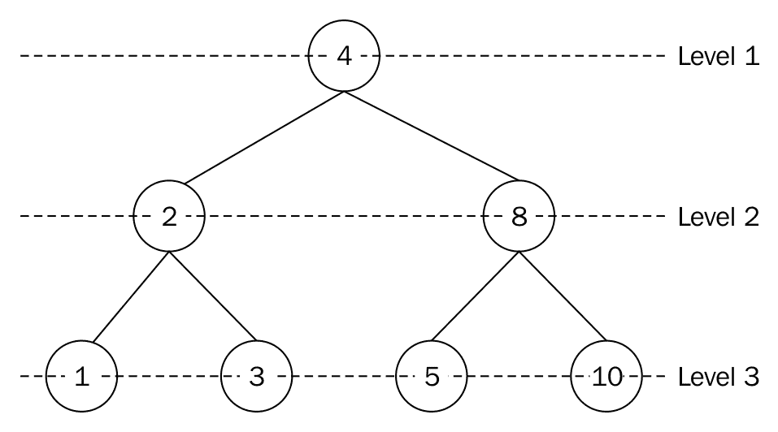

第 1 层的节点是节点 4。我们通过打印其值来访问这个节点。接下来，我们移动到第 2 层并访问该层的节点，即节点 2 和 8。在最后一层，第 3 层，我们访问节点 1, 3, 5 和 10。

这种遍历的完整输出是 4, 2, 8, 1, 3, 5 和 10。

这种遍历模式是通过使用队列数据结构实现的。从根节点开始，我们将其推入队列。队列前面的节点被访问（出队）并打印出来以供以后使用。左节点被添加到队列中，然后是右节点。由于队列不为空，我们重复这个过程。

算法的预演将把根节点 4 入队，然后出队并访问或访问该节点。节点 2 和 8 作为左节点和右节点分别入队。为了访问，节点 2 被出队。它的左节点和右节点，1 和 3，被入队。此时，队列前面的节点是 8。我们出队并访问节点 8，之后将其左节点和右节点入队。因此，这个过程一直持续到队列为空。

算法如下：

```py
    from collections import deque 
    class Tree: 
        def breadth_first_traversal(self): 
            list_of_nodes = [] 
            traversal_queue = deque([self.root_node]) 

```

我们将根节点入队，并在`list_of_nodes`列表中保持已访问节点的列表。使用`dequeue`类来维护队列：

```py
        while len(traversal_queue) > 0: 
            node = traversal_queue.popleft() 
            list_of_nodes.append(node.data) 

            if node.left_child: 
                traversal_queue.append(node.left_child) 

            if node.right_child: 
                traversal_queue.append(node.right_child) 
        return list_of_nodes 

```

如果`traversal_queue`中的元素数量大于零，则执行循环体。队列前面的节点被弹出并附加到`list_of_nodes`列表中。第一个`if`语句将在存在左节点的情况下将`node`的左子节点入队。第二个`if`语句对右子节点做同样的操作。

在最后一条语句中返回`list_of_nodes`。

# 二叉搜索树的好处

我们现在简要地看看是什么使得二叉搜索树（BST）在需要搜索的数据方面比使用列表更好。让我们假设我们有以下数据集：5, 3, 7, 1, 4, 6, 和 9。使用列表，最坏的情况需要你搜索整个包含七个元素的列表才能找到搜索项：

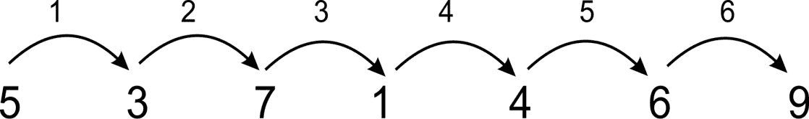

搜索 9 需要六次跳跃。

使用树，最坏的情况是三次比较：

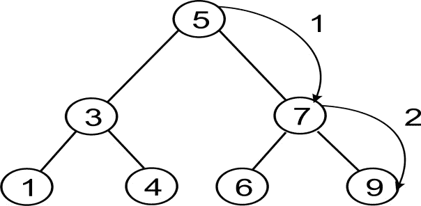

搜索 9 需要两步。

注意，然而，如果你按顺序 1, 2, 3, 5, 6, 7, 9 将元素插入到树中，那么树可能不会比列表更有效率。我们首先需要平衡树：

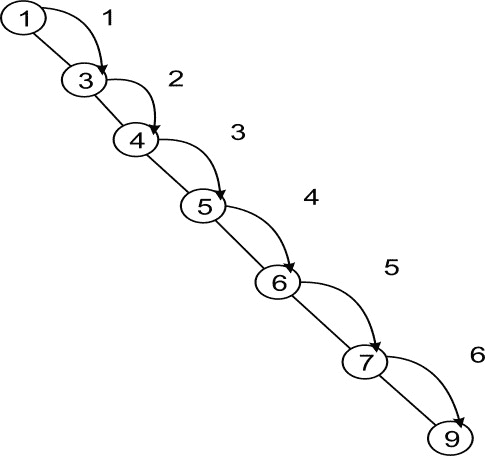

因此，不仅使用 BST 很重要，选择一个自平衡树也有助于提高`搜索`操作。

# 表达式树

树结构也用于解析算术和布尔表达式。例如，`3 + 4`的表达式树如下所示：

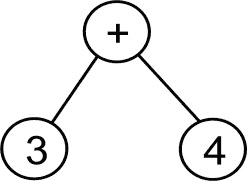

对于一个稍微复杂一些的表达式，`(4 + 5) * (5-3)`，我们会得到以下结果：

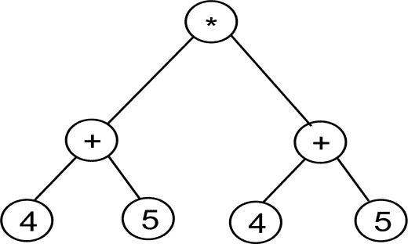

# 解析逆波兰表达式

现在我们将构建一个后缀表示法写成的表达式的树。然后我们将计算结果。我们将使用一个简单的树实现。为了使其尽可能简单，因为我们将通过合并较小的树来增长树，我们只需要一个树节点实现：

```py
    class TreeNode: 
        def __init__(self, data=None): 
            self.data = data 
            self.right = None 
            self.left = None 

```

为了构建树，我们将求助于栈。你很快就会看到原因。但在此期间，让我们先创建一个算术表达式并设置我们的栈：

```py
        expr = "4 5 + 5 3 - *".split() 
        stack = Stack() 

```

由于 Python 是一种努力拥有合理默认值的语言，其`split()`方法默认按空白字符分割。（如果你想想，这也可能是你期望的。）结果是 expr 将是一个包含值 4, 5, +, 5, 3, - 和 * 的列表。

expr 列表中的每个元素都将是一个运算符或操作数。如果我们得到一个操作数，那么我们将其嵌入到一个树节点中并将其推入栈中。另一方面，如果我们得到一个运算符，那么我们将运算符嵌入到一个树节点中，并将其两个操作数弹出并放入节点的左右子节点中。在这里，我们必须注意确保第一次弹出的元素进入右子节点，否则我们将在减法和除法中遇到问题。

这是构建树的代码：

```py
    for term in expr: 
        if term in "+-*/": 
            node = TreeNode(term) 
            node.right = stack.pop() 
            node.left = stack.pop() 
        else: 
            node = TreeNode(int(term)) 
        stack.push(node) 

```

注意，在操作数的情况下，我们执行从字符串到整数的转换。如果你想支持浮点操作数，可以使用`float()`。

在这个操作结束时，我们应该在栈中有一个单独的元素，它包含了完整的树。

我们现在可能想要能够评估表达式。我们构建以下小函数来帮助我们：

```py
    def calc(node): 
        if node.data is "+": 
            return calc(node.left) + calc(node.right) 
        elif node.data is "-": 
            return calc(node.left) - calc(node.right) 
        elif node.data is "*": 
            return calc(node.left) * calc(node.right) 
        elif node.data is "/": 
            return calc(node.left) / calc(node.right) 
        else: 
            return node.data 

```

这个函数非常简单。我们传入一个节点。如果节点包含一个操作数，那么我们只需返回该值。然而，如果我们得到一个运算符，那么我们就执行该运算符所表示的操作，在节点的两个子节点上。然而，由于一个或多个子节点也可能包含运算符或操作数，我们在两个子节点上递归调用 `calc()` 函数（记住，每个节点的所有子节点也都是节点）。

现在我们只需要从栈中弹出根节点，并将其传递到 `calc()` 函数中，我们应该得到计算结果：

```py
    root = stack.pop() 
    result = calc(root) 
    print(result) 

```

运行此程序应该得到结果 18，这是 `(4 + 5) * (5 - 3)` 的结果。

# 平衡树

之前我们提到，如果节点按照顺序插入到树中，那么树的行为或多或少就像一个列表，也就是说，每个节点恰好有一个子节点。我们通常希望尽可能降低树的高度，通过填充树的每一行来实现。这个过程被称为平衡树。

有许多种自平衡树，如红黑树、AA 树和替罪羊树。这些树在每次修改树的操作（如插入或删除）期间都会平衡树。

也有外部算法可以平衡树。这些算法的好处是，你不需要在每次操作时都平衡树，而可以留到你需要的时候再进行平衡。

# 堆

在这一点上，我们将简要介绍堆数据结构。堆是树的一种特殊化，其中节点以特定的方式排序。堆分为最大堆和最小堆。在最大堆中，每个父节点必须始终大于或等于其子节点。因此，根节点必须是树中的最大值。最小堆则相反。每个父节点必须小于或等于其两个子节点。因此，根节点持有最小值。

堆被用于许多不同的事情。一方面，它们用于实现优先队列。还有一个非常高效的排序算法，称为堆排序，它使用堆。我们将在后续章节中深入研究这些内容。

# 概述

在本章中，我们探讨了树结构及其一些示例用法。我们特别研究了二叉树，它是树的一个子类型，其中每个节点最多有两个子节点。

我们探讨了如何将二叉树用作带有 BST 的可搜索数据结构。我们看到，在大多数情况下，在 BST 中查找数据比在链表中更快，尽管如果数据是顺序插入的，情况并非如此，除非当然树是平衡的。

宽度和深度优先搜索遍历模式也使用队列递归实现。

我们还探讨了如何使用二叉树来表示算术或布尔表达式。我们构建了一个表达式树来表示算术表达式。我们展示了如何使用栈来解析逆波兰表示法（RPN）书写的表达式，构建表达式树，并最终遍历它以获取算术表达式的结果。

最后，我们提到了堆，这是树结构的一种特殊化。我们试图至少在本章中为堆奠定理论基础，以便我们可以在接下来的章节中为不同的目的实现堆。
