# 图与其他算法

在本章中，我们将讨论图。这是一个来自数学分支图论的概念。

图被用来解决许多计算问题。它们比我们之前看到的其他数据结构结构简单得多，并且像遍历这样的操作可能更加不寻常，正如我们将看到的。

到本章结束时，你应该能够做到以下几件事情：

+   理解图是什么

+   了解图的类型及其组成部分

+   了解如何表示图并遍历它

+   获得对优先队列的基本理解

+   能够实现优先队列

+   能够确定列表中的第 i 个最小元素

# 图

图是一组顶点和边，它们在顶点之间形成连接。在更正式的方法中，图 G 是一个顶点集合 V 和边集合 E 的有序对，用形式数学符号表示为`G = (V, E)`。

这里给出一个图的例子：

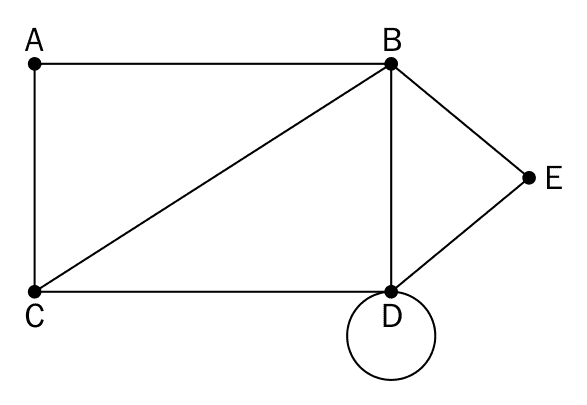

让我们现在来了解一下图的定义：

+   **节点或顶点**：一个点，通常在图中用点表示。顶点或节点是 A、B、C、D 和 E。

+   **边**：这是两个顶点之间的连接。连接 A 和 B 的线条是一个边的例子。

+   **环**：当一个节点的边指向自身时，该边形成一个环。

+   **顶点的度**：这是与给定顶点相关的顶点的数量。顶点 B 的度是`4`。

+   **邻接**：这指的是节点与其邻居之间的连接。节点 C 与节点 A 相邻，因为它们之间有一条边。

+   **路径**：一个顶点的序列，其中每个相邻对都通过一条边连接。

# 有向和无向图

根据它们是无向的还是有向的，可以将图进行分类。无向图只是将边表示为节点之间的线条。除了节点之间有连接这一事实之外，没有关于节点之间关系的其他信息：

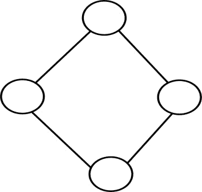

在有向图中，边除了连接节点外，还提供了方向。也就是说，作为线条带有箭头的边将指向边连接的两个节点的方向：

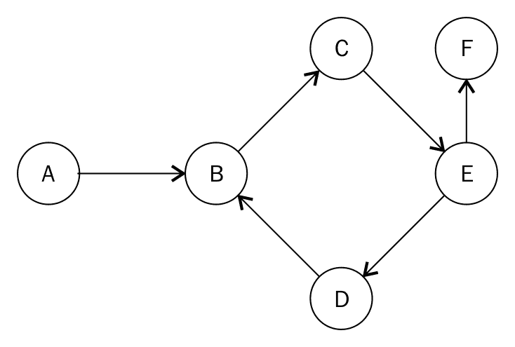

边的箭头决定了方向的流动。在前面的图中，只能从**A**移动到**B**，不能从**B**移动到**A**。

# 加权图

加权图在边中添加了一些额外的信息。这可以是一个表示某物的数值。比如说，以下图表示从点**A**到点**D**的不同方式。你可以直接从**A**到**D**，或者选择经过**B**和**C**。每个边都与到达下一个节点所需的时间（分钟）相关联：

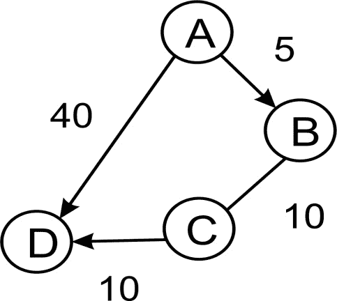

也许 **AD** 的旅程需要你骑自行车（或步行）。**B** 和 **C** 可能代表公交车站。在 **B**，你可能需要换乘不同的公交车。最后，**CD** 可能是一段短途步行即可到达 **D**。

在这个例子中，**AD** 和 **ABCD** 代表两条不同的路径。**路径**简单地说是一系列边，你在两个节点之间通过这些边。沿着这些路径，你会发现 **AD** 的总旅程需要 **40** 分钟，而 **ABCD** 的旅程需要 **25** 分钟。如果你的唯一关注点是时间，你最好沿着 **ABCD** 行驶，即使有换乘公交车的额外不便。

边可以是定向的，并且可能包含其他信息，如花费的时间或路径上移动关联的任何其他值，这表明了一些有趣的事情。在我们之前使用过的数据结构中，我们画在节点之间的“线”仅仅是连接器。即使它们有从节点指向另一个节点的箭头，这也很容易在节点类中使用 `next` 或 `previous`、`parent` 或 `child` 来表示。

在图中，将边视为对象与将节点视为对象一样有意义。就像节点一样，边可以包含必要的信息，以便遵循特定的路径。

# 图的表示

图可以以两种主要形式表示。一种方式是使用邻接矩阵，另一种方式是使用邻接表。

我们将使用以下图形来开发图的两种表示类型：

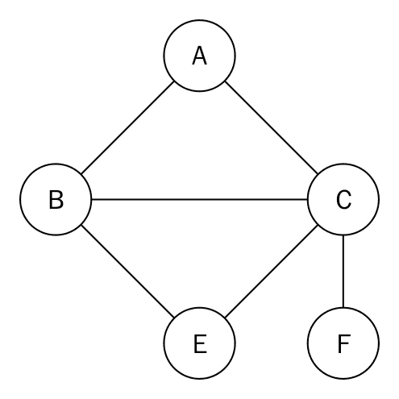

# 邻接表

可以使用一个简单的列表来表示图。列表的索引将代表图中的节点或顶点。在每个索引处，可以存储该顶点的相邻节点：

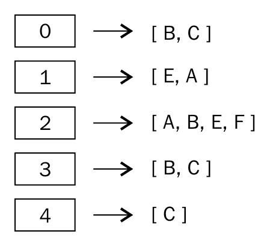

方框中的数字代表顶点。索引 **0** 代表顶点 **A**，其相邻节点为 **B** 和 **C**。

使用列表进行表示非常受限，因为我们缺乏直接使用顶点标签的能力。因此，字典更适合。为了在图中表示图，我们可以使用以下语句：

```py
    graph = dict() 
    graph['A'] = ['B', 'C'] 
    graph['B'] = ['E','A'] 
    graph['C'] = ['A', 'B', 'E','F'] 
    graph['E'] = ['B', 'C'] 
    graph['F'] = ['C'] 

```

现在，我们可以轻松地确定顶点 **A** 的相邻顶点是 **B** 和 **C**。顶点 **F** 的唯一邻接顶点是 **C**。

# 邻接矩阵

另一种表示图的方法是使用邻接矩阵。矩阵是一个二维数组。这里的想法是根据两个顶点是否通过边连接，用 1 或 0 来表示单元格。

给定一个邻接表，应该可以创建一个邻接矩阵。需要一个排序后的图键列表：

```py
    matrix_elements = sorted(graph.keys()) 
    cols = rows = len(matrix_elements) 

```

键的长度用于提供矩阵的维度，这些维度存储在 `cols` 和 `rows` 中。`cols` 和 `rows` 中的这些值是相等的：

```py
    adjacency_matrix = [[0 for x in range(rows)] for y in range(cols)] 
    edges_list = [] 

```

然后我们设置一个`cols`乘以`rows`的数组，用零填充它。`edges_list`变量将存储构成图中边的元组。例如，节点 A 和 B 之间的边将被存储为(A, B)。

使用嵌套`for`循环填充多维数组：

```py
    for key in matrix_elements: 
        for neighbor in graph[key]: 
            edges_list.append((key,neighbor)) 

```

通过`graph[key]`获取顶点的邻居。然后，使用`neighbor`与键结合来创建存储在`edges_list`中的元组。

迭代输出如下：

```py
>>> [('A', 'B'), ('A', 'C'), ('B', 'E'), ('B', 'A'), ('C', 'A'), 
     ('C', 'B'), ('C', 'E'), ('C', 'F'), ('E', 'B'), ('E', 'C'), 
     ('F', 'C')]

```

现在需要做的是通过使用 1 标记边的存在来填充我们的多维数组，使用以下行`adjacency_matrix[index_of_first_vertex][index_of_second_vertex] = 1`：

```py
    for edge in edges_list: 
        index_of_first_vertex = matrix_elements.index(edge[0]) 
        index_of_second_vertex = matrix_elements.index(edge[1]) 
        adjacecy_matrix[index_of_first_vertex][index_of_second_vertex] = 1 

```

`matrix_elements`数组从 A 到 E 的行和列开始，索引从 0 到 5。`for`循环遍历我们的元组列表，并使用`index`方法获取要存储边的相应索引。

生成的邻接矩阵如下所示：

```py
>>>
[0, 1, 1, 0, 0]
[1, 0, 0, 1, 0]
[1, 1, 0, 1, 1]
[0, 1, 1, 0, 0]
[0, 0, 1, 0, 0]

```

在第 1 列和第 1 行，那里的 0 表示 A 和 A 之间没有边。在第 2 列和第 3 行，C 和 B 之间存在边。

# 图遍历

由于图不一定有有序结构，遍历图可能更复杂。遍历通常涉及跟踪哪些节点或顶点已经被访问，哪些还没有。一种常见策略是沿着路径走，直到达到死胡同，然后返回直到有替代路径的点。我们也可以迭代地从节点移动到另一个节点，以遍历整个图或其部分。在下一节中，我们将讨论图遍历的广度和深度优先搜索算法。

# 广度优先搜索

广度优先搜索算法从一个节点开始，选择该节点或顶点作为其根节点，然后访问相邻的节点，之后它探索图的下一级的邻居节点。

考虑以下图作为示例：

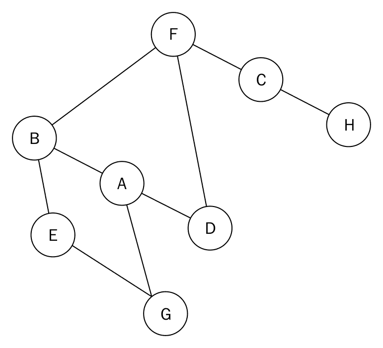

该图是一个无向图的示例。我们继续使用这种类型的图来帮助解释，而不太冗长。

该图的邻接表如下所示：

```py
    graph = dict() 
    graph['A'] = ['B', 'G', 'D'] 
    graph['B'] = ['A', 'F', 'E'] 
    graph['C'] = ['F', 'H'] 
    graph['D'] = ['F', 'A'] 
    graph['E'] = ['B', 'G'] 
    graph['F'] = ['B', 'D', 'C'] 
    graph['G'] = ['A', 'E'] 
    graph['H'] = ['C'] 

```

在尝试广度优先遍历此图时，我们将使用队列。算法创建一个列表来存储在遍历过程中已访问的节点。我们将从节点 A 开始我们的遍历。

节点 A 被排队并添加到已访问节点的列表中。之后，我们使用`while`循环来实现图的遍历。在`while`循环中，节点 A 被出队。它的未访问相邻节点 B、G 和 D 按字母顺序排序并排队。现在队列将包含节点 B、D 和 G。这些节点也被添加到已访问节点的列表中。此时，我们开始`while`循环的另一个迭代，因为队列不为空，这也意味着我们实际上还没有完成遍历。

节点 B 被出队。在其相邻节点 A、F 和 E 中，节点 A 已经被访问。因此，我们只按字母顺序入队节点 E 和 F。节点 E 和 F 然后添加到已访问节点列表中。

在这一点上，我们的队列包含以下节点：D、G、E 和 F。已访问节点列表包含 A、B、D、G、E、F。

节点 D 被出队，但所有相邻节点都已访问，所以我们只需将其出队。队列前面的下一个节点是 G。我们出队节点 G，但我们还发现所有相邻节点都已访问，因为它们在已访问节点列表中。节点 G 也被出队。我们也出队节点 E，因为所有节点都已访问。现在队列中只剩节点 F。

节点 F 被出队，我们意识到在其相邻节点 B、D 和 C 中，只有节点 C 尚未访问。然后我们将节点 C 入队并添加到已访问节点列表中。节点 C 被出队。节点 C 有相邻节点 F 和 H，但 F 已经被访问，留下节点 H。节点 H 被入队并添加到已访问节点列表中。

最后，`while` 循环的最后一次迭代将导致节点 H 被出队。它的唯一相邻节点 C 已经被访问。一旦队列完全为空，循环就会中断。

图中遍历的输出为 A、B、D、G、E、F、C、H。

广度优先搜索的代码如下：

```py
    from collections import deque 

    def breadth_first_search(graph, root): 
        visited_vertices = list() 
        graph_queue = deque([root]) 
        visited_vertices.append(root) 
        node = root 

        while len(graph_queue) > 0: 
            node = graph_queue.popleft() 
            adj_nodes = graph[node] 

            remaining_elements = 
                set(adj_nodes).difference(set(visited_vertices)) 
            if len(remaining_elements) > 0: 
                for elem in sorted(remaining_elements): 
                    visited_vertices.append(elem) 
                    graph_queue.append(elem) 

        return visited_vertices 

```

当我们想要找出是否有一组节点在已访问节点列表中时，我们使用语句 `remaining_elements = set(adj_nodes).difference(set(visited_vertices))`。这使用集合对象的差集方法来找出在 `adj_nodes` 中但不在 `visited_vertices` 中的节点。

在最坏的情况下，每个顶点或节点和边都将被遍历，因此算法的时间复杂度为 `O(|V| + |E|)`，其中 `|V|` 是顶点或节点的数量，而 `|E|` 是图中边的数量。

# 深度优先搜索

如其名所示，此算法在遍历图的宽度之前先遍历任何特定路径的深度。因此，先访问子节点，然后访问兄弟节点。它适用于有限图，并需要使用栈来维护算法的状态：

```py
    def depth_first_search(graph, root): 
        visited_vertices = list() 
        graph_stack = list() 

        graph_stack.append(root) 
        node = root 

```

算法首先创建一个列表来存储已访问的节点。`graph_stack` 栈变量用于辅助遍历过程。为了连续性，我们使用常规 Python 列表作为栈。

起始节点，称为 `root`，与图的邻接矩阵 `graph` 一起传递。`root` 被压入栈中。`node = root` 保存栈中的第一个节点：

```py
        while len(graph_stack) > 0: 

            if node not in visited_vertices: 
                visited_vertices.append(node) 

            adj_nodes = graph[node] 

            if set(adj_nodes).issubset(set(visited_vertices)): 
                graph_stack.pop() 
            if len(graph_stack) > 0: 
                node = graph_stack[-1] 
                continue 
            else: 
                remaining_elements = 
                set(adj_nodes).difference(set(visited_vertices)) 

            first_adj_node = sorted(remaining_elements)[0] 
            graph_stack.append(first_adj_node) 
            node = first_adj_node 
                return visited_vertices 

```

当栈不为空时，将执行`while`循环的主体。如果`node`不在已访问节点的列表中，我们将它添加进去。通过`adj_nodes = graph[node]`收集`node`的所有相邻节点。如果所有相邻节点都已访问，我们就从栈中弹出该节点，并将`node`设置为`graph_stack[-1]`。`graph_stack[-1]`是栈顶的节点。`continue`语句将跳回到`while`循环测试条件的开始。

如果不是所有相邻节点都已访问，则通过使用语句`remaining_elements = set(adj_nodes).difference(set(visited_vertices))`找到`adj_nodes`和`visited_vertices`之间的差异，以获取尚未访问的节点。

将`sorted(remaining_elements)`中的第一个项目分配给`first_adj_node`，并将其推入栈中。然后我们将栈顶指向该节点。

当`while`循环退出时，我们将返回`visited_vertices`。

实际运行算法将非常有用。考虑以下图：

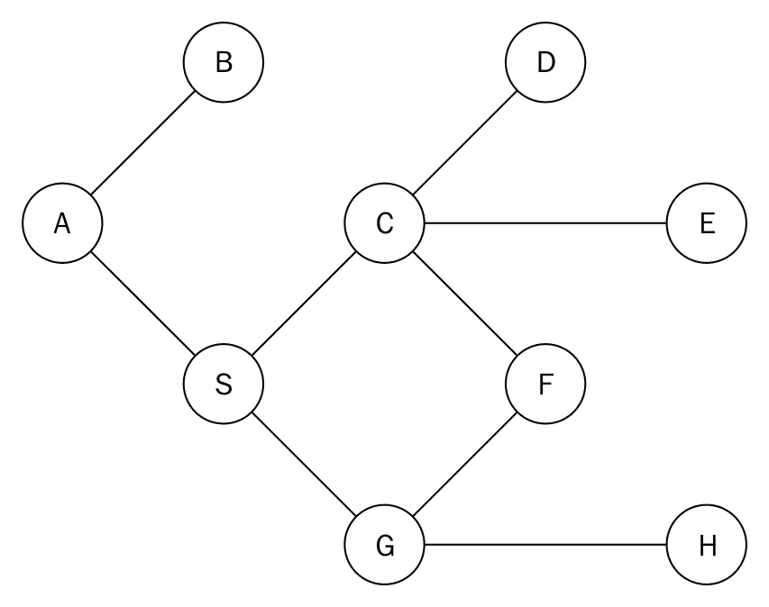

这样图的邻接表如下所示：

```py
    graph = dict() 
    graph['A'] = ['B', 'S'] 
    graph['B'] = ['A'] 
    graph['S'] = ['A','G','C'] 
    graph['D'] = ['C'] 
    graph['G'] = ['S','F','H'] 
    graph['H'] = ['G','E'] 
    graph['E'] = ['C','H'] 
    graph['F'] = ['C','G'] 
    graph['C'] = ['D','S','E','F'] 

```

节点 A 被选为起始节点。节点 A 被推入栈中，并添加到`visisted_vertices`列表中。这样做时，我们将其标记为已访问。`graph_stack`栈使用简单的 Python 列表实现。我们的栈现在只有一个元素 A。我们检查节点 A 的相邻节点 B 和 S。为了测试 A 的所有相邻节点是否都已访问，我们使用 if 语句：

```py
    if set(adj_nodes).issubset(set(visited_vertices)): 
        graph_stack.pop() 
        if len(graph_stack) > 0: 
            node = graph_stack[-1] 
        continue 

```

如果所有节点都已访问，我们就弹出栈顶。如果栈`graph_stack`不为空，我们将栈顶的节点赋值给`node`，并开始`while`循环主体的另一个执行。如果`set(adj_nodes).issubset(set(visited_vertices))`语句评估为`True`，则表示`adj_nodes`中的所有节点都是`visited_vertices`的子集。如果 if 语句失败，则意味着还有一些节点尚未访问。我们通过`remaining_elements = set(adj_nodes).difference(set(visited_vertices))`获取那些节点的列表。

从图中可以看出，节点**B**和**S**将被存储在`remaining_elements`中。我们将按字母顺序访问该列表：

```py
    first_adj_node = sorted(remaining_elements)[0] 
    graph_stack.append(first_adj_node) 
    node = first_adj_node 

```

我们对`remaining_elements`进行排序，并将第一个节点返回给`first_adj_node`。这将返回 B。我们将节点 B 推入栈中，通过将其附加到`graph_stack`。我们通过将其赋值给`node`来准备节点 B 的访问。

在`while`循环的下一个迭代中，我们将节点 B 添加到`visited nodes`列表中。我们发现 B 的唯一相邻节点 A 已经被访问。因为 B 的所有相邻节点都已访问，所以我们将其从栈中弹出，留下 A 作为栈上的唯一元素。我们回到节点 A，检查其所有相邻节点是否都已访问。现在节点 A 的唯一未访问节点是 S。我们将 S 推入栈中，并再次开始整个过程。

遍历的输出为 A-B-S-C-D-E-H-G-F。

深度优先搜索在解决迷宫问题、寻找连通分量和寻找图的桥等问题中都有应用。

# 其他有用的图方法

非常常见的是，你关心的是在两个节点之间找到路径。你也可能想找到节点之间的所有路径。另一种有用的方法是在节点之间找到最短路径。在无权图中，这将是它们之间边数最少的路径。在加权图中，正如你所看到的，这可能涉及到通过一系列边计算总权重。

当然，在另一种情况下，你可能想找到最长或最短路径。

# 优先队列和堆

优先队列基本上是一种队列，它将始终按优先级顺序返回项目。这种优先级可能是，例如，最低的项目总是首先弹出。尽管它被称为队列，但优先队列通常使用堆来实现，因为这对于此目的非常高效。

考虑到，在一家商店里，顾客排队等待服务，服务只在前面的队列中进行。每位顾客在等待服务的过程中都会花费一些时间。如果队列中顾客的等待时间分别是 4、30、2 和 1，那么平均等待时间变为`(4 + 34 + 36 + 37)/4`，即`27.75`。然而，如果我们改变服务的顺序，让等待时间最短的顾客先被服务，那么我们会得到不同的平均等待时间。这样做，我们通过`(1 + 3 + 7 + 37)/4`来计算新的平均等待时间，现在等于`12`，这是一个更好的平均等待时间。显然，从最短等待时间开始服务顾客是有益的。通过优先级或其他标准选择下一个项目的方法是创建优先队列的基础。

堆是一种满足堆属性的数据结构。堆属性表明，父节点和子节点之间必须存在某种关系。这个属性必须在整个堆中适用。

在最小堆中，父节点和子节点之间的关系是父节点必须始终小于或等于其子节点。因此，堆中的最小元素必须是根节点。

相反，在最大堆中，父节点大于或等于其子节点或其子节点。由此可知，最大值构成了根节点。

如你所见，堆是树，更具体地说，是二叉树。

虽然我们打算使用二叉树，但实际上我们会使用列表来表示它。这是因为堆将存储一个完整的二叉树。一个完整的二叉树是指每一行在开始填充下一行之前必须完全填满：

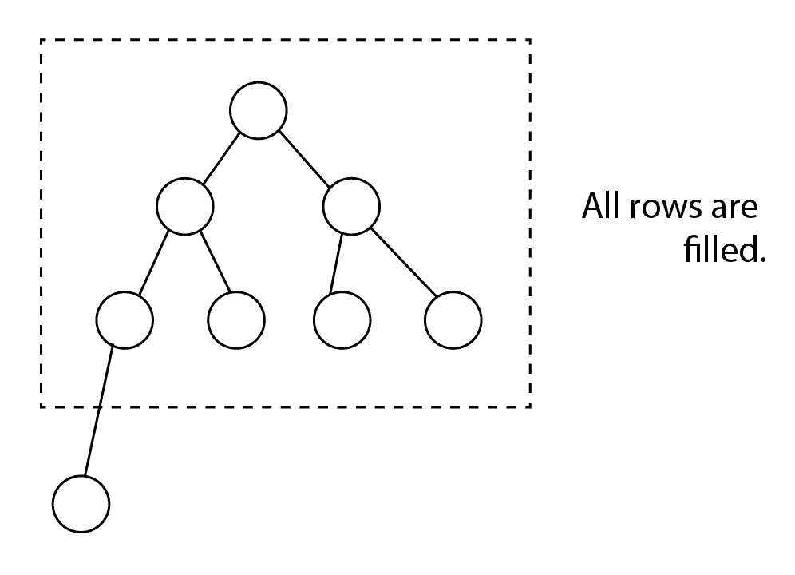

为了使使用索引的数学计算更简单，我们将保留列表中的第一个项目（索引 0）为空。之后，我们将树节点从上到下、从左到右放入列表中：

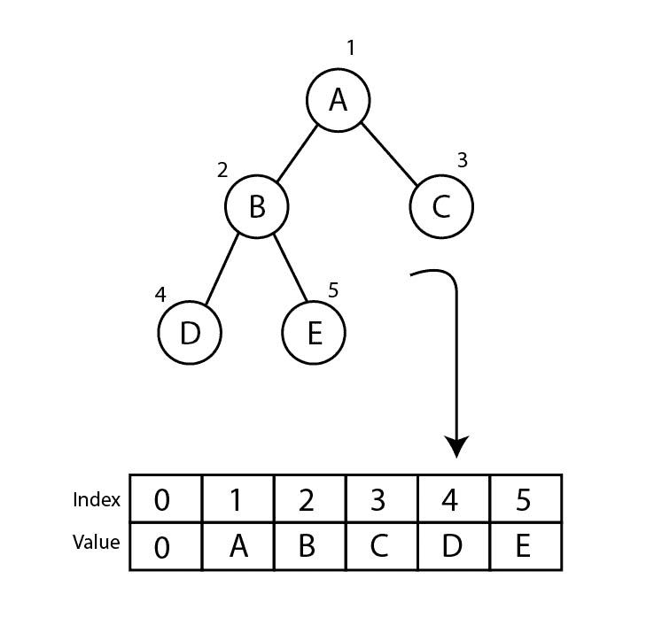

如果你仔细观察，你会注意到你可以非常容易地检索任何节点 n 的子节点。左子节点位于 `2n`，右子节点位于 `2n + 1`。这始终是正确的。

我们将探讨最小堆的实现。为了得到最大堆，反转逻辑并不困难：

```py
     class Heap: 
        def __init__(self): 
            self.heap = [0] 
            self.size = 0 

```

我们用零初始化我们的堆列表来表示虚拟的第一个元素（记住我们这样做是为了使数学计算更简单）。我们还创建了一个变量来保存堆的大小。这样做并非必需，因为我们本可以检查列表的大小，但我们总是需要记住减去一。因此，我们选择保留一个单独的变量。

# 插入

插入一个项目本身非常简单。我们将新元素添加到列表的末尾（我们理解为树的底部）。然后我们增加堆的大小。

但在每次插入后，如果需要，我们需要将新元素向上浮动。请注意，最小堆中的最低元素需要是根元素。我们首先创建一个名为 `float` 的辅助方法来处理这个问题。让我们看看它应该如何表现。想象一下，我们有一个以下堆，并想要插入值 `2`：

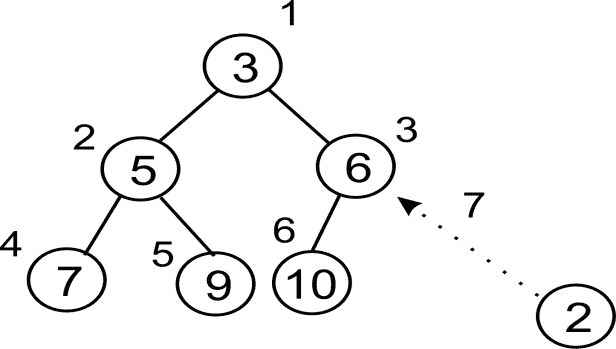

新元素已经占据了第三行或级别的最后一个槽位。它的索引值是**7**。现在我们将该值与其父元素进行比较。父元素位于索引 `7/2 = 3`（整数除法）。该元素持有**6**，因此我们交换**2**：

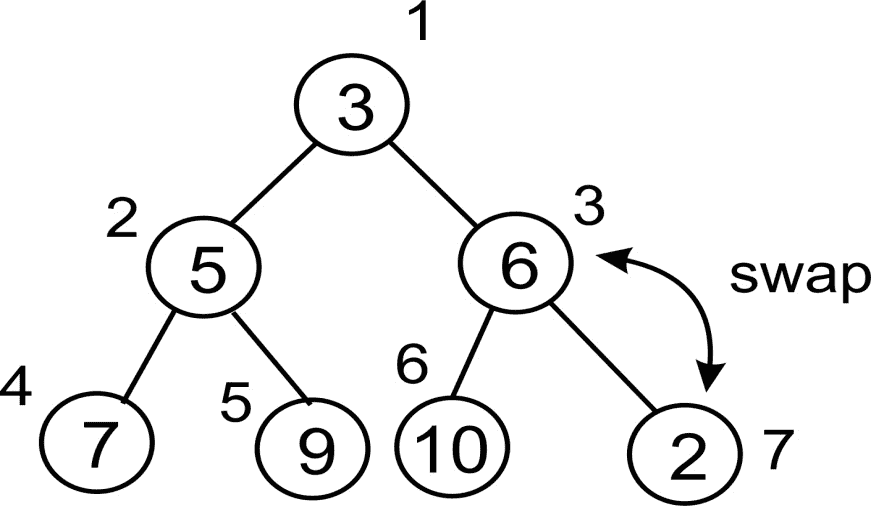

我们的新元素已经交换并移动到了索引 **3**。我们还没有到达堆的顶部（`3 / 2 > 0`），所以我们继续。我们元素的新的父元素位于索引 `3/2 = 1`。因此我们比较，并在必要时再次交换：

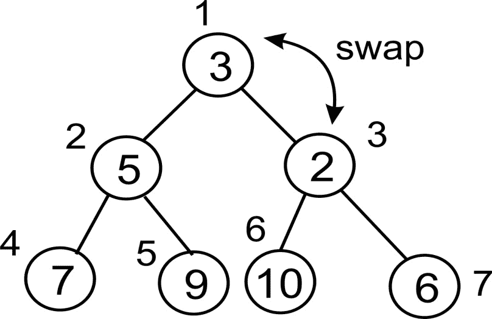

在最后的交换之后，我们留下的堆看起来如下。注意它如何遵循堆的定义：

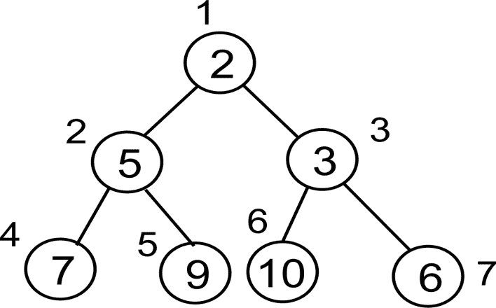

下面是实现我们刚刚描述的内容：

```py
    def float(self, k): 

```

我们将循环，直到我们达到根节点，这样我们就可以将元素向上浮动到它需要到达的高度。由于我们使用整数除法，一旦我们低于 2，循环就会退出：

```py
        while k // 2 > 0: 

```

比较父元素和子元素。如果父元素大于子元素，则交换这两个值：

```py
        if self.heap[k] < self.heap[k//2]: 
            self.heap[k], self.heap[k//2] = self.heap[k//2], 
            self.heap[k] 

```

最后，别忘了将树向上移动：

```py
        k //= 2 

```

此方法确保元素按正确顺序排列。现在我们只需要从我们的 `insert` 方法中调用此方法：

```py
    def insert(self, item): 
        self.heap.append(item) 
        self.size += 1 
        self.float(self.size) 

```

注意到在插入中调用了 `float()` 方法来根据需要重新组织堆。

# 弹出

就像插入一样，`pop()` 本身是一个简单的操作。我们移除根节点并将堆的大小减一。然而，一旦根被弹出，我们需要一个新的根节点。

为了尽可能简单，我们只需取列表中的最后一个元素，将其作为新的根。也就是说，我们将其移动到列表的开头。但现在我们可能没有最低的元素在堆的顶部，所以我们需要执行与 float 操作相反的操作：我们让新的根节点按照需要下沉。

正如我们在插入时做的那样，让我们看看整个操作是如何在一个现有的堆上工作的。想象以下堆。我们弹出`root`元素，使堆暂时没有根：

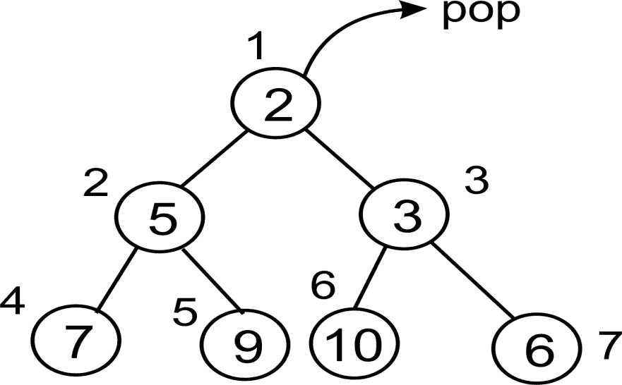

由于我们不能有一个没有根的堆，我们需要用某样东西来填充这个位置。如果我们选择移动其中一个子节点，我们就必须想出如何重新平衡整个树结构。所以，我们做了一些非常有趣的事情。我们将列表中的最后一个元素向上移动以填充`root`元素的位置：

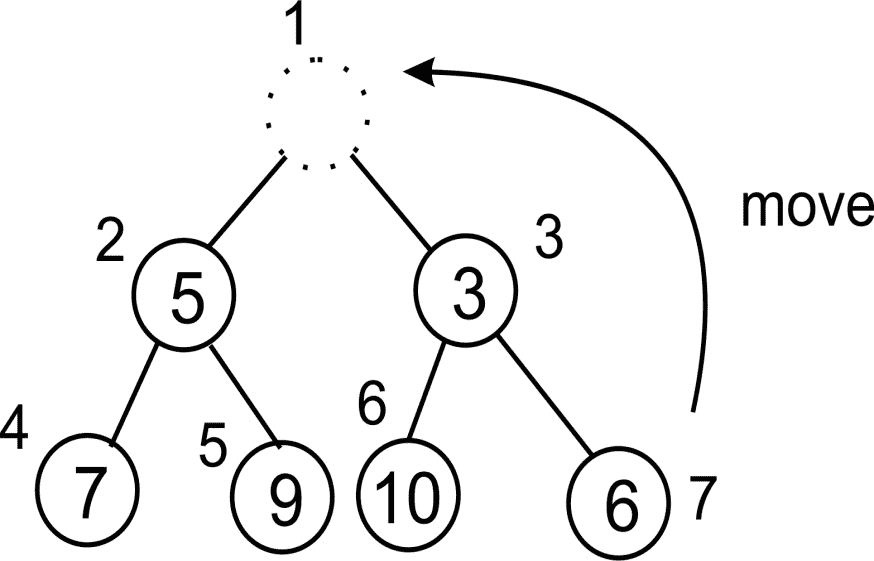

现在这个元素显然不是堆中的最低元素。这就是我们开始将其下沉的地方。首先我们需要确定将其下沉的位置。我们比较两个子树，这样最低的元素就会在根节点下沉时浮上来：

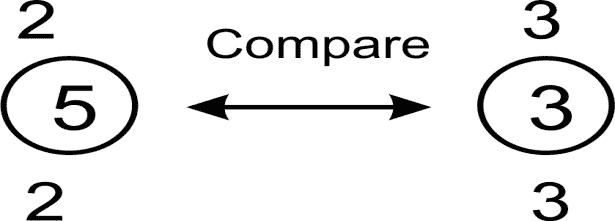

右子树显然更小。它的索引是**3**，这代表了根索引`* 2 + 1`。我们继续比较我们的新根节点和这个索引处的值：

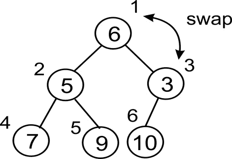

现在我们的节点已经跳到了索引**3**。我们需要将其与它的较小子节点进行比较。然而，现在我们只有一个子节点，所以我们不需要担心比较哪个子节点（对于最小堆来说，总是较小的子节点）：

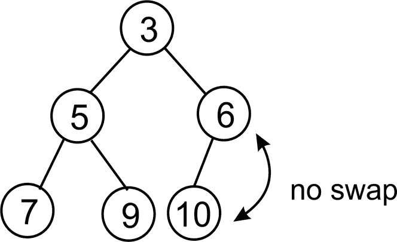

这里没有必要交换。由于没有更多的行，我们完成了。再次注意，在`sink()`操作完成后，我们的堆符合堆的定义。

现在我们可以开始实现了。在我们做`sink()`方法本身之前，注意我们需要确定比较父节点的子树是哪一个。好吧，让我们把这个选择放在它自己的小方法中，这样代码看起来会简单一些：

```py
    def minindex(self, k): 

```

我们可能会超出列表的末尾，在这种情况下，我们返回左子树的索引：

```py
        if k * 2 + 1 > self.size: 
            return k * 2 

```

否则，我们只需简单地返回两个子树中较小的一个的索引：

```py
        elif self.heap[k*2] < self.heap[k*2+1]: 
            return k * 2 
        else: 
            return k * 2 + 1 

```

现在我们可以创建`sink`函数：

```py
    def sink(self, k): 

```

和以前一样，我们将循环，这样我们就可以将元素下沉到所需的程度：

```py
        while k * 2 <= self.size: 

```

接下来我们需要知道是和左子树还是右子树进行比较。这就是我们使用`minindex()`函数的地方：

```py
            mi = self.minindex(k) 

```

正如我们在`float()`方法中所做的那样，我们比较父节点和子节点，以确定是否需要交换：

```py
            if self.heap[k] > self.heap[mi]: 
                self.heap[k], self.heap[mi] = self.heap[mi], 
                self.heap[k] 

```

我们还需要确保我们沿着树向下移动，这样我们才不会陷入循环：

```py
            k = mi 

```

现在唯一剩下的事情就是实现`pop()`本身。这非常直接，因为脏活是由`sink()`方法来干的：

```py
    def pop(self): 
        item = self.heap[1] 
        self.heap[1] = self.heap[self.size] 
        self.size -= 1 
        self.heap.pop() 
        self.sink(1) 
        return item 

```

# 测试堆

现在我们只需要一些代码来测试堆。我们首先创建我们的堆并插入一些数据：

```py
    h = Heap() 
    for i in (4, 8, 7, 2, 9, 10, 5, 1, 3, 6): 
        h.insert(i) 

```

我们可以打印堆列表，只是为了检查元素是如何排序的。如果你将其重新绘制为树结构，你应该注意到它符合堆所需的所有属性：

```py
    print(h.heap) 

```

现在，我们将逐个弹出项目。注意项目是如何以排序顺序（从低到高）弹出的。同时注意堆列表在每次弹出后的变化。拿出笔和纸，在每次弹出后重新绘制这个列表作为树，以完全理解`sink()`方法是如何工作的：

```py
    for i in range(10): 
        n = h.pop() 
        print(n) 
        print(h.heap) 

```

在排序算法章节中，我们将重新组织堆排序算法的代码。

一旦你正确实现了最小堆并理解了它是如何工作的，实现最大堆应该是一个简单的任务。你所要做的就是反转逻辑。

# 选择算法

选择算法属于一类算法，旨在解决在列表中找到第 i 个最小元素的问题。当列表按升序排序时，列表中的第一个元素将是列表中最小的项。列表中的第二个元素将是列表中的第二个最小元素。列表中的最后一个元素将是列表中的最后一个最小元素，但这也将符合列表中的最大元素。

在创建堆数据结构时，我们达到了这样的理解：对`pop`方法的调用将返回堆中的最小元素。从最小堆中弹出的第一个元素是列表中的第一个最小元素。同样，从最小堆中弹出的第七个元素将是列表中的第七个最小元素。因此，要找到列表中的第 i 个最小元素，我们需要弹出堆*i*次。这是一个非常简单且高效的方法来找到列表中的第 i 个最小元素。

但在第十一章，“选择算法”中，我们将研究另一种方法，通过这种方法我们可以找到列表中的第 i 个最小元素。

选择算法在过滤噪声数据、找到列表中的中位数、最小和最大元素以及甚至可以应用于计算机棋类程序中都有应用。

# 摘要

本章讨论了图和堆。我们探讨了使用列表和字典在 Python 中表示图的方法。为了遍历图，我们研究了广度优先搜索和深度优先搜索。

我们随后将注意力转向堆和优先队列，以理解它们的实现。本章以使用堆的概念在列表中找到第 i 个最小元素结束。

图论非常复杂，仅一章内容无法公正地对待它。以节点为旅程的旅程将在这个章节结束。下一章将引领我们进入搜索领域，以及我们如何在列表中高效搜索项目的各种方法。
