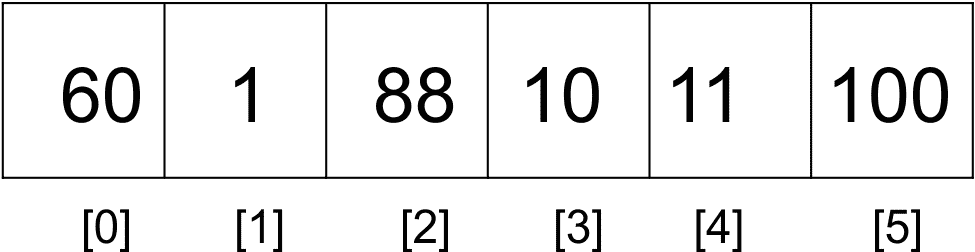
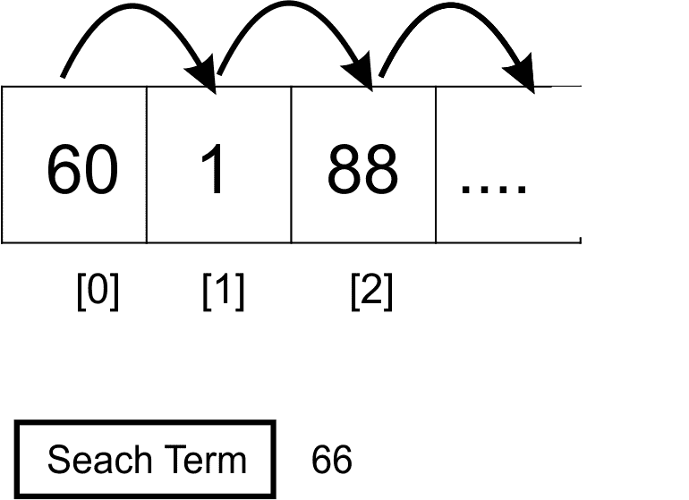
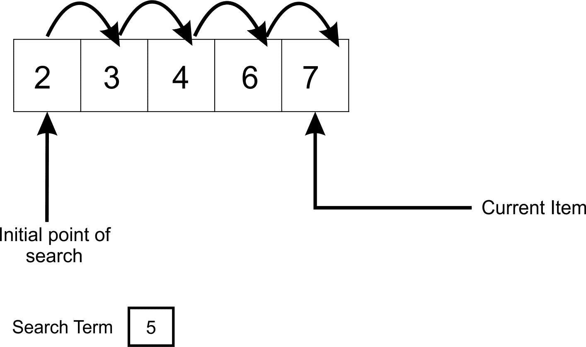
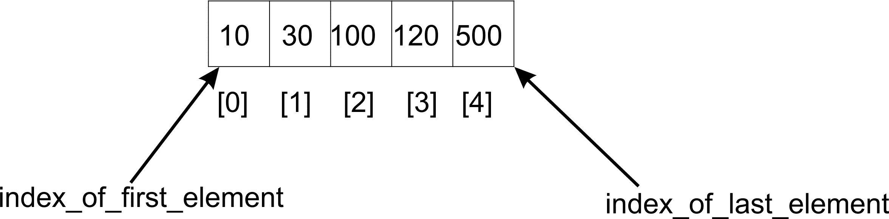
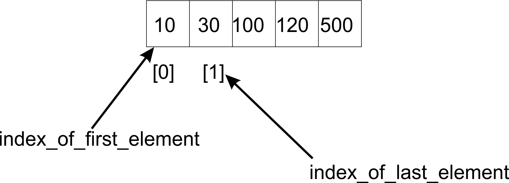
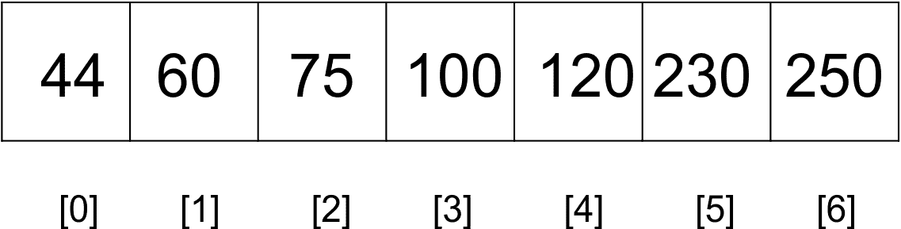
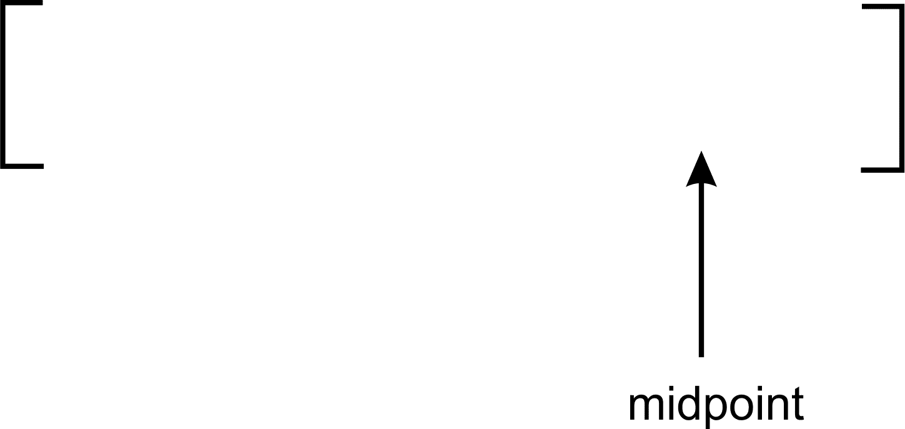
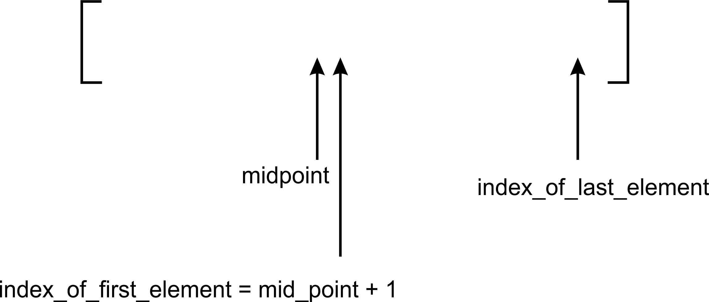
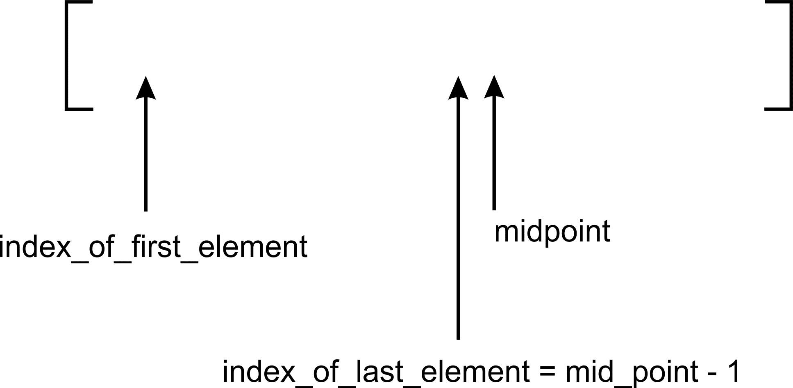
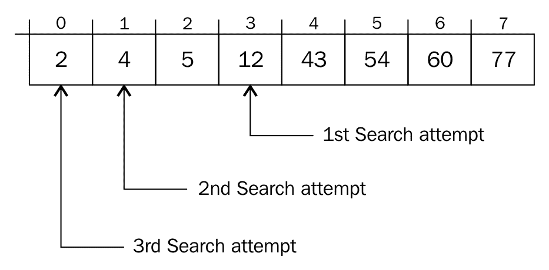

# 第九章：搜索

在前几章中已经开发出的数据结构中，对它们进行的一个关键操作是搜索。在本章中，我们将探讨可以用来在项目集合中查找元素的不同策略。

另一个重要的操作是排序，它利用了搜索。没有搜索操作的某种变体，几乎不可能进行排序。"如何搜索"也很重要，因为它影响着排序算法最终执行的速度。

搜索算法分为两大类。一类假设要应用搜索操作的项列表已经排序，而另一类则没有。

搜索操作的性能受到即将搜索的项是否已经排序的严重影响，正如我们将在后续主题中看到的。

# 线性搜索

让我们集中讨论线性搜索，这是在典型的 Python 列表上执行的。



前面的列表中的元素可以通过列表索引访问。要找到列表中的元素，我们采用线性搜索技术。这种技术通过使用索引从列表的开始移动到结束来遍历元素列表。每个元素都会被检查，如果不匹配搜索项，则检查下一个项。通过从一个项跳到其下一个项，列表被顺序遍历。

在处理本章和其他章节的内容时，我们使用整数列表来增强我们的理解，因为整数易于比较。

# 无序线性搜索

包含元素**60**、**1**、**88**、**10**和**100**的列表是一个无序列表的例子。列表中的项没有按大小排序。要对这样的列表执行搜索操作，需要从第一个项开始，将其与搜索项进行比较。如果没有匹配，则检查列表中的下一个元素。这个过程一直持续到我们到达列表的最后一个元素或直到找到匹配项。

```py
    def search(unordered_list, term): 
       unordered_list_size = len(unordered_list) 
        for i in range(unordered_list_size): 
            if term == unordered_list[i]: 
                return i 

        return None 

```

`search`函数接受两个参数，一个是存放我们数据列表，另一个是我们正在寻找的项，称为**搜索项**。

获取数组的大小并确定`for`循环执行的次数。

```py
        if term == unordered_list[i]: 
            ... 

```

在每次`for`循环的迭代中，我们测试搜索项是否等于索引指向的项。如果是真的，则不需要继续搜索。我们返回匹配发生的位置。

如果循环运行到列表的末尾而没有找到匹配项，则返回`None`以表示列表中没有这样的项。

在无序列表中，没有关于如何插入元素的指导规则。因此，这影响了搜索的方式。缺乏顺序意味着我们无法依赖任何规则来进行搜索。因此，我们必须逐个访问列表中的项目。如图所示，搜索术语**66**的搜索从第一个元素开始，然后移动到列表中的下一个元素。因此，**60**与**66**进行比较，如果不相等，则将**66**与**1**、**88**等比较，直到在列表中找到搜索词。



无序线性搜索的最坏情况运行时间为`O(n)`。在找到搜索词之前可能需要访问所有元素。如果搜索词位于列表的最后一个位置，就会发生这种情况。

# 有序线性搜索

在列表元素已经排序的情况下，我们的搜索算法可以改进。假设元素已经按升序排序，搜索操作可以利用列表的有序性来提高搜索效率。

算法简化为以下步骤：

1.  顺序遍历列表。

1.  如果搜索项大于循环中当前检查的对象或项，则退出并返回`None`。

在遍历列表的过程中，如果搜索词大于当前项，则无需继续搜索。



当搜索操作开始时，将第一个元素与(**5**)进行比较，没有匹配。但由于列表中还有更多元素，搜索操作继续进行，以检查下一个元素。继续前进的更有说服力的原因是，我们知道搜索项可能与大于**2**的任何元素匹配。

经过第 4 次比较后，我们得出结论，搜索词无法在任何位置找到，这些位置都在**6**所在位置之上。换句话说，如果当前项大于搜索词，那么这意味着没有必要进一步搜索列表。

```py
    def search(ordered_list, term): 
        ordered_list_size = len(ordered_list) 
        for i in range(ordered_list_size): 
            if term == ordered_list[i]: 
                return i 
            elif ordered_list[i] > term: 
                return None 

        return None 

```

现在的`if`语句处理了这个检查。`elif`部分测试`ordered_list[i] > term`的条件。如果比较结果为`True`，则方法返回`None`。

方法中的最后一行返回`None`，因为循环可能遍历列表，但仍找不到任何与搜索词匹配的元素。

有序线性搜索的最坏情况时间复杂度为`O(n)`。一般来说，这种搜索被认为效率低下，尤其是在处理大数据集时。

# 二分搜索

二分搜索是一种搜索策略，用于通过持续减少要搜索的数据量来找到列表中的元素，从而提高找到搜索词的速率。

要使用二分搜索算法，要操作列表必须已经排序。

“二分”这个词有几个含义，帮助我们正确理解算法。

在列表中寻找一个项目时，每次尝试都需要做出一个二进制决策。一个关键的决策是猜测列表的哪一部分可能包含我们正在寻找的项目。搜索词会在列表的前半部分还是后半部分，也就是说，如果我们总是把列表看作由两部分组成的话？

与其从一个列表的单元格移动到另一个单元格，如果我们采用一种有根据的猜测策略，我们很可能会更快地到达找到项目所在的位置。

例如，假设我们想要找到一本 1000 页书的中间页。我们已经知道每本书的页码都是按顺序从 1 往上编号的。所以可以推断出第 500 页应该正好在书的中间，而不是从第 1 页、第 2 页翻到第 500 页。假设我们现在要找第 250 页。我们仍然可以使用我们的策略轻松地找到页面。我们猜测第 500 页将书分成两半。第 250 页将位于书的左侧。无需担心是否能在第 500 页和第 1000 页之间找到第 250 页，因为那里永远找不到。所以以第 500 页为参考，我们可以打开到大约位于第 1 页和第 500 页之间的半数页面。这使我们更接近找到第 250 页。

以下是对有序项目列表进行二分搜索的算法：

```py
def binary_search(ordered_list, term): 

    size_of_list = len(ordered_list) - 1 

    index_of_first_element = 0 
    index_of_last_element = size_of_list 

    while index_of_first_element <= index_of_last_element: 
        mid_point = (index_of_first_element + index_of_last_element)/2 

        if ordered_list[mid_point] == term: 
            return mid_point 

        if term > ordered_list[mid_point]: 
            index_of_first_element = mid_point + 1 
        else: 
            index_of_last_element = mid_point - 1 

    if index_of_first_element > index_of_last_element: 
        return None 

```

假设我们必须找到列表中项目**10**的位置如下：



算法使用`while`循环来迭代调整列表中的限制，以在其中找到搜索词。只要起始索引`index_of_first_element`和`index_of_last_element`索引之间的差值为正，`while`循环就会运行。

算法首先通过将第一个元素的索引（**0**）与最后一个元素的索引（**4**）相加，然后除以**2**来找到中间索引`mid_point`。

```py
mid_point = (index_of_first_element + index_of_last_element)/2 

```

在这种情况下，**10**没有在列表的中间位置或索引处找到。如果我们正在寻找**120**，我们就必须将`index_of_first_element`调整为`mid_point +1`。但由于**10**位于列表的另一侧，我们将`index_of_last_element`调整为`mid_point-1`：



现在我们新的索引`index_of_first_element`和`index_of_last_element`分别是**0**和**1**，我们计算中点`(0 + 1)/2`，等于**0**。新的中点是**0**，我们找到中间的项目并与搜索项`ordered_list[0]`进行比较，其值为**10**。哇！我们的搜索词找到了。

通过重新调整 `index_of_first_element` 和 `index_of_last_element` 的索引，我们的列表大小减半，只要 `index_of_first_element` 小于 `index_of_last_element`，这个过程就会继续。当这种情况不再成立时，最可能的情况是我们的搜索词不在列表中。

这里的实现是迭代的。我们也可以通过应用相同的原理，即移动标记搜索列表开始和结束的指针，来开发算法的递归变体。

```py
def binary_search(ordered_list, first_element_index, last_element_index, term): 

    if (last_element_index < first_element_index): 
        return None 
    else: 
        mid_point = first_element_index + ((last_element_index - first_element_index) / 2) 

        if ordered_list[mid_point] > term: 
            return binary_search(ordered_list, first_element_index, mid_point-1,term) 
        elif ordered_list[mid_point] < term: 
            return binary_search(ordered_list, mid_point+1, last_element_index, term) 
        else: 
            return mid_point 

```

对这个二分查找算法递归实现的调用及其输出如下：

```py
    store = [2, 4, 5, 12, 43, 54, 60, 77]
    print(binary_search(store, 0, 7, 2))   

Output:
>> 0

```

递归二分查找和迭代二分查找之间唯一的区别是函数定义以及 `mid_point` 的计算方式。在 `((last_element_index - first_element_index) / 2)` 操作之后的 `mid_point` 计算必须将结果加到 `first_element_index` 上。这样我们就定义了尝试搜索的列表部分。

二分查找算法的最坏时间复杂度为 `O(log n)`。每次迭代中对列表的减半遵循元素数量的 log n 进程。

不言而喻，`log x` 是指以 2 为底的对数。

# 插值搜索

二分查找算法还有一种变体，可以更接近地说是模仿人类在任意项目列表上执行搜索的方式。它仍然基于尝试对排序列表中搜索项可能被找到的位置进行良好猜测。

例如，检查以下项目列表：



要找到 **120**，我们知道要查看列表的右侧部分。我们最初的二分查找处理通常会首先检查中间元素，以确定它是否与搜索词匹配。

更符合人类做法的是，选择一个中间元素，不仅要将数组分成两半，还要尽可能接近搜索词。中间位置的计算遵循以下规则：

```py
mid_point = (index_of_first_element + index_of_last_element)/2 

```

我们将用更好的公式替换这个公式，使其接近搜索词。`mid_point` 将接收 `nearest_mid` 函数的返回值。

```py
def nearest_mid(input_list, lower_bound_index, upper_bound_index, search_value): 
    return lower_bound_index + (( upper_bound_index -lower_bound_index)/ (input_list[upper_bound_index] -input_list[lower_bound_index])) * (search_value -input_list[lower_bound_index]) 

```

`nearest_mid` 函数接受要执行搜索的列表作为参数。`lower_bound_index` 和 `upper_bound_index` 参数表示列表中我们希望找到搜索词的界限。`search_value` 表示要搜索的值。

这些用于以下公式：

```py
lower_bound_index + (( upper_bound_index - lower_bound_index)/ (input_list[upper_bound_index] - input_list[lower_bound_index])) * (search_value - input_list[lower_bound_index]) 

```

给定我们的搜索列表 **44**、**60**、**75**、**100**、**120**、**230** 和 **250**，`nearest_mid` 将使用以下值进行计算：

```py
lower_bound_index = 0
upper_bound_index = 6
input_list[upper_bound_index] = 250
input_list[lower_bound_index] = 44
search_value = 230

```

现在可以看出，`mid_point` 将接收值为 **5**，这是我们的搜索词位置的索引。二分查找会选择 **100** 作为中间值，这将需要算法的另一次运行。

下面给出了一个更直观的说明，说明了典型的二分搜索与插值之间的区别。对于典型的二分搜索，找到中点的方式如下：


可以看到，中点实际上位于前一个列表的中间位置。这是由于除以列表 2 的结果。

另一方面，插值搜索将移动如下：



在插值搜索中，我们的中点更偏向左边或右边。这是由于在除以获取中点时使用的乘数效应造成的。从前面的图像中，我们可以看到中点已经偏向右边。

插值算法的其余部分与二分搜索相同，只是计算中点位置的方式不同。

```py
def interpolation_search(ordered_list, term): 

    size_of_list = len(ordered_list) - 1 

    index_of_first_element = 0 
    index_of_last_element = size_of_list 

    while index_of_first_element <= index_of_last_element: 
        mid_point = nearest_mid(ordered_list, index_of_first_element, index_of_last_element, term) 

        if mid_point > index_of_last_element or mid_point < index_of_first_element: 
            return None 

        if ordered_list[mid_point] == term: 
            return mid_point 

        if term > ordered_list[mid_point]: 
            index_of_first_element = mid_point + 1 
        else: 
            index_of_last_element = mid_point - 1 

    if index_of_first_element > index_of_last_element: 
        return None 

```

`nearest_mid`函数使用乘法运算。这可能会产生大于`upper_bound_index`或小于`lower_bound_index`的值。当这种情况发生时，这意味着搜索项`term`不在列表中。因此返回`None`来表示这一点。

那么，当`ordered_list[mid_point]`不等于搜索项时会发生什么？嗯，我们现在必须重新调整`index_of_first_element`和`index_of_last_element`，以便算法将关注可能包含搜索项的数组部分。这就像我们在二分搜索中所做的那样。

```py
if term > ordered_list[mid_point]: 
index_of_first_element = mid_point + 1 

```

如果搜索项大于`ordered_list[mid_point]`存储的值，那么我们只调整`index_of_first_element`变量，使其指向`mid_point + 1`的索引。

下面的图像显示了调整发生的方式。`index_of_first_element`被调整并指向`mid_point+1`的索引。



图像仅说明了中点的调整。在插值中，中点很少将列表分成两个相等的部分。

另一方面，如果搜索项小于`ordered_list[mid_point]`存储的值，那么我们只调整`index_of_last_element`变量，使其指向`mid_point - 1`的索引。这个逻辑被 if 语句的 else 部分所捕获`index_of_last_element = mid_point - 1`。



图像显示了重新计算`index_of_last_element`对中点位置的影响。

让我们用一个更实际的例子来理解二分搜索和插值算法的内部工作原理。

考虑具有以下元素的列表：

```py
[ 2, 4, 5, 12, 43, 54, 60, 77] 

```

在索引 0 处存储了 2，在索引 7 处找到了值 77。现在，假设我们想要在列表中找到元素 2。两种不同的算法将如何进行？

如果我们将此列表传递给插值`search`函数，`nearest_mid`函数将返回一个等于`0`的值。仅通过一次比较，我们就能找到搜索项。

另一方面，二分搜索算法需要三次比较才能到达搜索项，如下面的图像所示：



计算的第一个`mid_point`是`3`。第二个`mid_point`是`1`，最后一个找到搜索项的`mid_point`是`0`。

# 选择搜索算法

二分查找和插值搜索操作在性能上优于有序和无序线性搜索函数。由于在列表中按顺序探测元素以找到搜索项，有序和无序线性搜索的时间复杂度为`O(n)`。当列表很大时，这会导致非常差的表现。

另一方面，二分查找操作在每次搜索尝试时将列表分成两半。在每次迭代中，我们比线性策略更快地接近搜索项。时间复杂度为`O(log n)`。尽管使用二分查找可以获得速度提升，但它不能用于未排序的项目列表，也不建议用于小尺寸的列表。

能够到达包含搜索项的列表部分在很大程度上决定了搜索算法的性能。在插值搜索算法中，计算中间值，这提高了获得搜索项的概率。插值搜索的时间复杂度为`O(log(log n))`。这使得搜索速度比其变体二分搜索更快。

# 摘要

在本章中，我们考察了两种搜索算法。讨论了线性搜索和二分搜索算法的实现，并进行了比较。本节还介绍了二分搜索的变体，插值搜索。了解使用哪种搜索操作将在后续章节中变得相关。

在下一章中，我们将使用我们所获得的知识来使我们能够在项目列表上执行排序操作。
