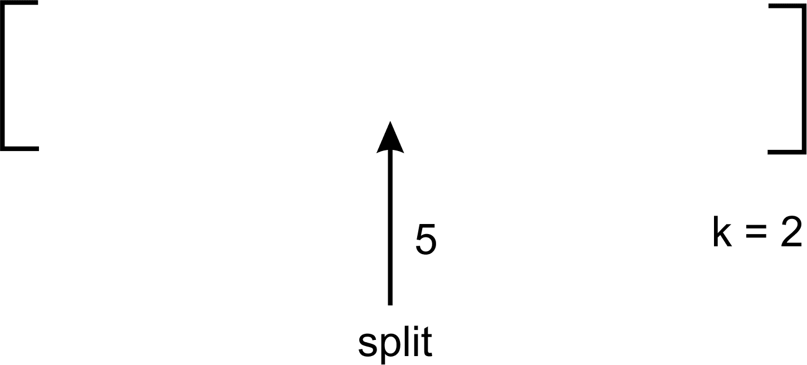
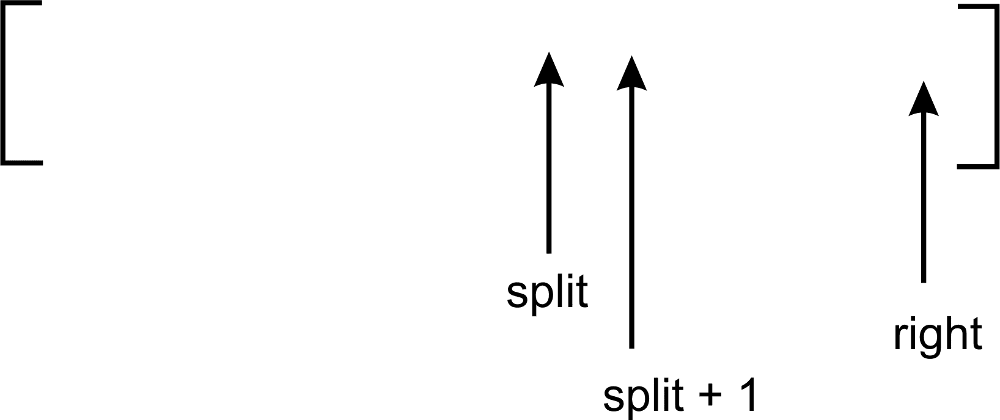
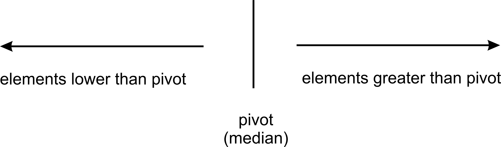

# 选择算法

与在无序列表中查找元素相关的一组有趣的算法是选择算法。在这样做的时候，我们将回答有关选择一组数字的中位数以及选择列表中的第 i 个最小或最大元素等问题。

在本章中，我们将涵盖以下主题：

+   排序选择

+   随机选择

+   确定性选择

# 排序选择

列表中的项目可能需要进行统计调查，例如找到平均值、中位数和众数。找到平均值和众数不需要对列表进行排序。然而，要找到数字列表中的中位数，必须首先对列表进行排序。找到中位数需要找到有序列表中间位置的元素。但如果我们想找到列表中的最后一个最小项或第一个最小项呢？

要在无序列表中找到第 i 个最小的数字，该元素出现的位置索引是重要的。但由于元素尚未排序，很难知道列表中索引为 0 的元素是否真的是第一个最小的数字。

当处理无序列表时，一个实用且明显的事情是首先对列表进行排序。一旦列表排序，就可以确保列表中的零元素将包含列表中的第一个最小元素。同样，列表中的最后一个元素将包含列表中的最后一个最小元素。

假设在进行搜索之前排序的奢侈可能负担不起。是否可以在不首先对列表进行排序的情况下找到第 i 个最小的元素？

# 随机选择

在上一章中，我们研究了快速排序算法。快速排序算法允许我们对无序列表中的项目进行排序，但有一个方法可以在排序算法运行时保留元素的索引。一般来说，快速排序算法执行以下操作：

1.  选择一个枢轴。

1.  在枢轴周围划分未排序的列表。

1.  递归地对划分后的列表的两半使用*步骤 1*和*步骤 2*进行排序。

一个有趣且重要的事实是，在每次划分步骤之后，枢轴的索引即使在列表排序后也不会改变。正是这个特性使我们能够处理一个不是完全排序的列表来获取第 i 个最小的数字。因为随机选择基于快速排序算法，所以通常被称为快速选择。

# 快速选择

快速选择算法用于在无序列表的项目中获取第 i 个最小的元素，在这种情况下，是数字。我们声明算法的主要方法如下：

```py
    def quick_select(array_list, left, right, k): 

        split = partition(array_list, left, right) 

        if split == k: 
            return array_list[split] 
        elif split < k: 
            return quick_select(array_list, split + 1, right, k) 
        else: 
            return quick_select(array_list, left, split-1, k) 

```

`quick_select`函数接受列表中第一个元素的索引以及最后一个元素的索引作为参数。第 i 个元素由第三个参数`k`指定。允许值大于或等于零（0），这样当`k`为 0 时，我们知道要搜索列表中的第一个最小元素。其他人喜欢将`k`参数直接映射到用户正在搜索的索引，这样第一个最小数字就映射到排序列表的 0 索引。这完全取决于个人喜好。

对分区函数的调用`split = partition(array_list, left, right)`返回`split`索引。这个`split`数组的索引是在未排序列表中，所有元素在`right`到`split-1`之间都小于`split`数组中包含的元素，而所有元素在`split+1`到`left`之间都大于。

当`partition`函数返回`split`值时，我们将其与`k`进行比较，以确定`split`是否对应于第 k 个元素。

如果`split`小于`k`，那么这意味着第 k 个最小元素应该存在于`split+1`和`right`之间：



在前面的例子中，在一个假想的未排序列表中的分割发生在索引 5 处，而我们正在寻找第二个最小的数字。由于 5<2 的结果是`false`，因此会进行递归调用`quick_select(array_list, left, split-1, k)`，以便搜索列表的另一部分：

如果`split`索引小于`k`，那么我们将调用`quick_select`如下：



# 分区步骤

分区步骤与我们在快速排序算法中看到的是一样的。有几个值得注意的点：

```py
    def partition(unsorted_array, first_index, last_index): 
        if first_index == last_index: 
            return first_index 

        pivot = unsorted_array[first_index] 
        pivot_index = first_index 
        index_of_last_element = last_index 

        less_than_pivot_index = index_of_last_element 
        greater_than_pivot_index = first_index + 1 

        while True: 

            while unsorted_array[greater_than_pivot_index] < pivot and  
                  greater_than_pivot_index < last_index: 
                  greater_than_pivot_index += 1 
            while unsorted_array[less_than_pivot_index] > pivot and 
                  less_than_pivot_index >= first_index: 
                  less_than_pivot_index -= 1 

            if greater_than_pivot_index < less_than_pivot_index: 
                temp = unsorted_array[greater_than_pivot_index] 
                unsorted_array[greater_than_pivot_index] = 
                    unsorted_array[less_than_pivot_index] 
                unsorted_array[less_than_pivot_index] = temp 
            else: 
                break 

        unsorted_array[pivot_index] =  
            unsorted_array[less_than_pivot_index] 
        unsorted_array[less_than_pivot_index] = pivot 

        return less_than_pivot_index 

```

在函数定义的开始处插入了一个 if 语句，以处理`first_index`等于`last_index`的情况。在这种情况下，这意味着我们的子列表中只有一个元素。因此，我们只需返回任何函数参数即可，在这种情况下，是`first_index`。

第一个元素总是被选作枢轴。将第一个元素作为枢轴的选择是一个随机决策。这通常不会产生好的分割，从而也不会产生好的分区。然而，即使枢轴是随机选择的，最终也会找到第 i 个元素。

`partition`函数返回由`less_than_pivot_index`指向的枢轴索引，正如我们在前一章中看到的。

从这一点开始，你需要用铅笔和纸跟随程序执行，以更好地了解如何使用分割变量来确定搜索第 i 个最小元素的列表部分。

# 确定性选择

随机选择算法的最坏情况性能是**O**(*n²*)。有可能改进随机选择算法的一部分，以获得最坏情况性能为**O**(*n*)。这种算法被称为**确定性选择**。

确定性算法的一般方法如下所示：

1.  选择一个枢轴：

    1.  将无序项目列表分成每组五个元素。

    1.  对所有组进行排序并找到中位数。

    1.  递归重复*步骤 1*和*步骤 2*以获得列表的真实中位数。

1.  使用真实中位数对无序项目列表进行分区。

1.  递归到可能包含第 i 个最小元素的分区列表部分。

# 枢轴选择

在随机选择算法中，我们之前选择第一个元素作为枢轴。我们将用一系列步骤来替换这一步，使我们能够获得真实或近似的中位数。这将改善列表关于枢轴的分区：

```py
    def partition(unsorted_array, first_index, last_index): 

        if first_index == last_index: 
            return first_index 
        else: 
            nearest_median =     
            median_of_medians(unsorted_array[first_index:last_index]) 

        index_of_nearest_median = 
            get_index_of_nearest_median(unsorted_array, first_index, 
                                        last_index, nearest_median) 

        swap(unsorted_array, first_index, index_of_nearest_median) 

        pivot = unsorted_array[first_index] 
        pivot_index = first_index 
        index_of_last_element = last_index 

        less_than_pivot_index = index_of_last_element 
        greater_than_pivot_index = first_index + 1 

```

现在我们来研究分区函数的代码。`nearest_median`变量存储给定列表的真实或近似中位数：

```py
    def partition(unsorted_array, first_index, last_index): 

        if first_index == last_index: 
            return first_index 
        else: 
            nearest_median =   
            median_of_medians(unsorted_array[first_index:last_index]) 
        .... 

```

如果`unsorted_array`参数只有一个元素，`first_index`和`last_index`将相等。因此，无论如何都会返回`first_index`。

然而，如果列表大小大于一个，我们将使用由`first_index`和`last_index`定义的数组部分调用`median_of_medians`函数。返回值再次存储在`nearest_median`中。

# 中位数的中位数

`median_of_medians`函数负责找到任何给定项目列表的近似中位数。该函数使用递归来返回真实中位数：

```py
def median_of_medians(elems): 

    sublists = [elems[j:j+5] for j in range(0, len(elems), 5)] 

    medians = [] 
    for sublist in sublists: 
        medians.append(sorted(sublist)[len(sublist)/2]) 

    if len(medians) <= 5: 
        return sorted(medians)[len(medians)/2] 
    else: 
        return median_of_medians(medians) 

```

函数首先将列表`elems`分成每组五个元素的组。这意味着如果`elems`包含 100 个元素，那么通过语句`sublists = [elems[j:j+5] for j in range(0, len(elems), 5)]`将创建 20 个组，每个组包含恰好五个元素或更少：

```py
    medians = [] 
        for sublist in sublists: 
            medians.append(sorted(sublist)[len(sublist)/2]) 

```

创建一个空数组并将其分配给`medians`，它存储分配给`sublists`的每个五个元素数组中的中位数。

for 循环遍历`sublists`内部的列表列表。每个子列表被排序，找到中位数并存储在`medians`列表中。

`medians.append(sorted(sublist)[len(sublist)/2])`语句将排序列表并获取存储在其中间索引的元素。这成为五个元素列表的中位数。由于列表的大小很小，使用现有的排序函数不会影响算法的性能。

我们从一开始就明白，我们不会对列表进行排序以找到第 i 个最小元素，那么为什么还要使用 Python 的排序方法呢？嗯，由于我们正在对非常小的列表（五个元素或更少）进行排序，该操作对算法整体性能的影响被认为是微不足道的。

此后，如果列表现在包含五个或更少的元素，我们将对`medians`列表进行排序，并返回位于其中间索引的元素：

```py
    if len(medians) <= 5: 
            return sorted(medians)[len(medians)/2] 

```

如果列表的大小大于五个，我们将再次递归调用`median_of_medians`函数，并给它提供存储在`medians`中的中位数列表。

以以下数字列表为例：

*[2, 3, 5, 4, 1, 12, 11, 13, 16, 7, 8, 6, 10, 9, 17, 15, 19, 20, 18, 23, 21, 22, 25, 24, 14]*

我们可以使用代码语句`sublists = [elems[j:j+5] for j in range(0, len(elems), 5)]`将这个列表分成每组五个元素的组，以获得以下列表：

*[[2, 3, 5, 4, 1], [12, 11, 13, 16, 7], [8, 6, 10, 9, 17], [15, 19, 20, 18, 23], [21, 22, 25, 24, 14]]*

对五个元素的列表进行排序并获取它们的中位数，得到以下列表：

*[3, 12, 9, 19, 22]*

由于列表大小为五个元素，我们只返回排序列表的中位数，否则我们将对`median_of_median`函数进行另一次调用。

# 分区步骤

现在我们已经得到了近似中位数，`get_index_of_nearest_median`函数根据`first`和`last`参数指定的列表范围取值：

```py
    def get_index_of_nearest_median(array_list, first, second, median): 
        if first == second: 
            return first 
        else: 
            return first + array_list[first:second].index(median) 

```

再次强调，如果列表中只有一个元素，我们只返回第一个索引。`arraylist[first:second]`返回一个从索引 0 到`list -1`大小的数组。当我们找到中位数的索引时，由于新的范围索引，我们失去了列表中该元素所在的区域，因为`[first:second]`代码返回的范围。因此，我们必须将`arraylist[first:second]`返回的任何索引加到`first`上，以获得中位数实际找到的索引：

```py
    swap(unsorted_array, first_index, index_of_nearest_median) 

```

然后我们使用交换函数将`unsorted_array`中的第一个元素与`index_of_nearest_median`交换。

交换两个数组元素的实用函数如下所示：

```py
def swap(array_list, first, second): 
    temp = array_list[first] 
    array_list[first] = array_list[second] 
    array_list[second] = temp 

```

我们现在将近似中位数存储在未排序列表的`first_index`位置。

分区函数继续按照快速选择算法的代码进行。在分区步骤之后，数组看起来是这样的：



```py

 def deterministic_select(array_list, left, right, k): 

        split = partition(array_list, left, right) 

        if split == k: 
            return array_list[split] 
        elif split < k : 
            return deterministic_select(array_list, split + 1, right, k) 
        else: 
            return deterministic_select(array_list, left, split-1, k) 

```

正如您已经观察到的，确定性选择算法的主要功能与随机选择对应算法完全相同。在`array_list`关于近似中位数分区后，与第 k 个元素进行比较。

如果`split`小于`k`，则调用`deterministic_select(array_list, split + 1, right, k)`进行递归调用。这将寻找数组那一半的第 k 个元素。否则，调用`deterministic_select(array_list, left, split-1, k)`。

# 概述

本章探讨了如何回答如何在列表中找到第 i 个最小元素的问题。已经探讨了简单地排序列表以执行查找第 i 个最小元素操作的平凡解决方案。

在确定第 i 个最小元素之前，我们不一定需要对列表进行排序。随机选择算法允许我们修改快速排序算法以确定第 i 个最小元素。

为了进一步提高随机选择算法，以便我们可以获得**O**(*n*)的时间复杂度，我们着手寻找中位数的中位数，以便我们在分区期间找到一个好的分割点。

在下一章中，我们将探索字符串的世界。我们将学习如何高效地存储和操作大量文本。同时，我们还将涵盖数据结构和常见的字符串操作。
