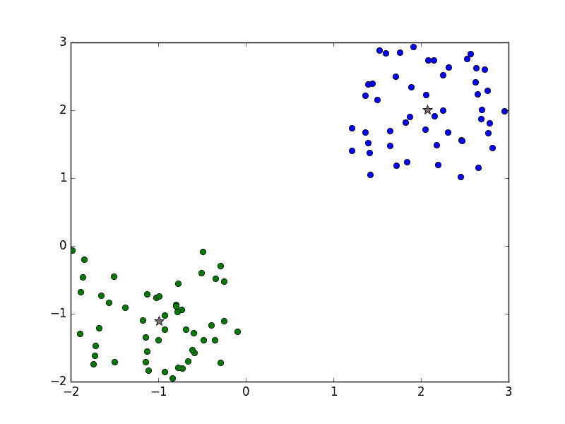
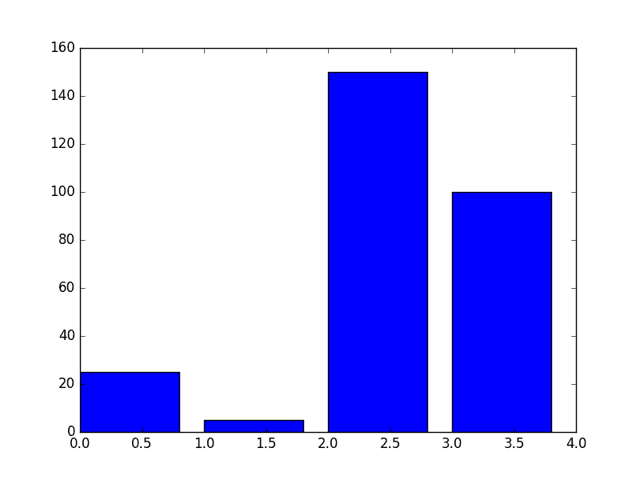
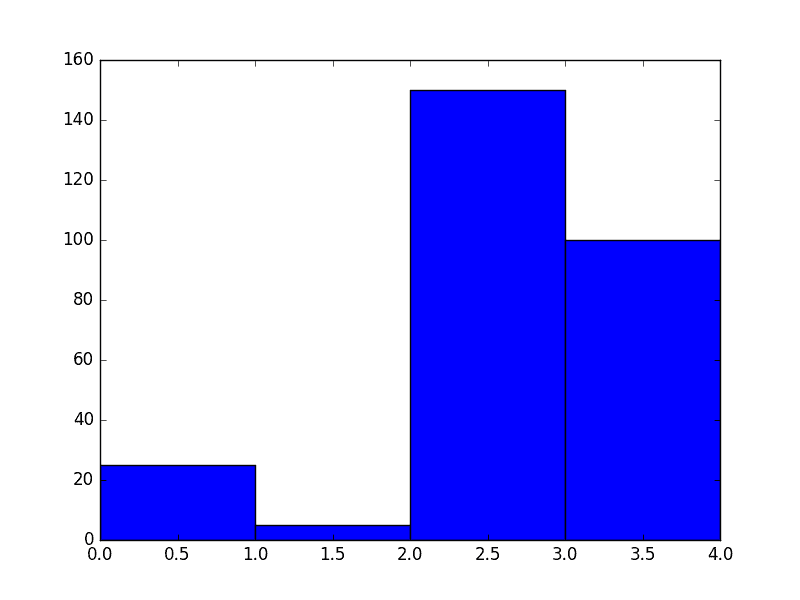
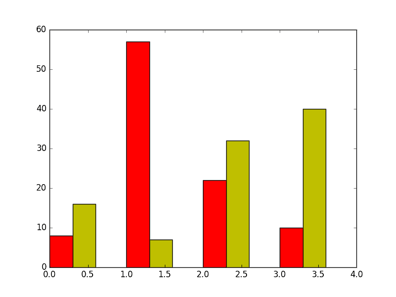
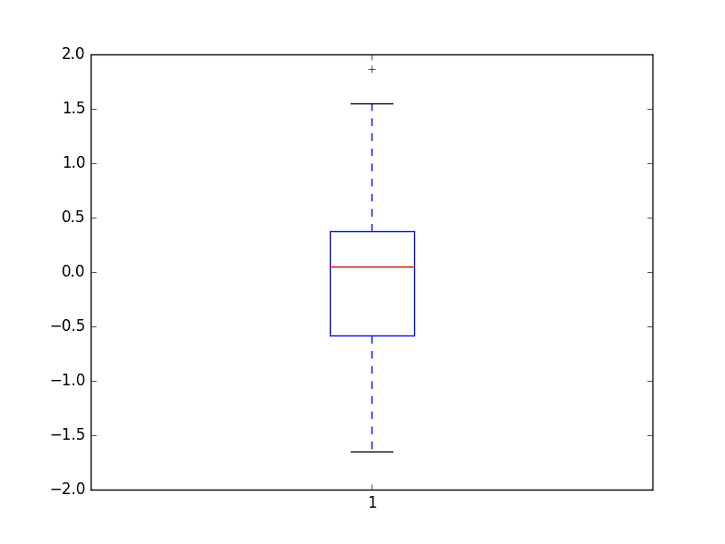
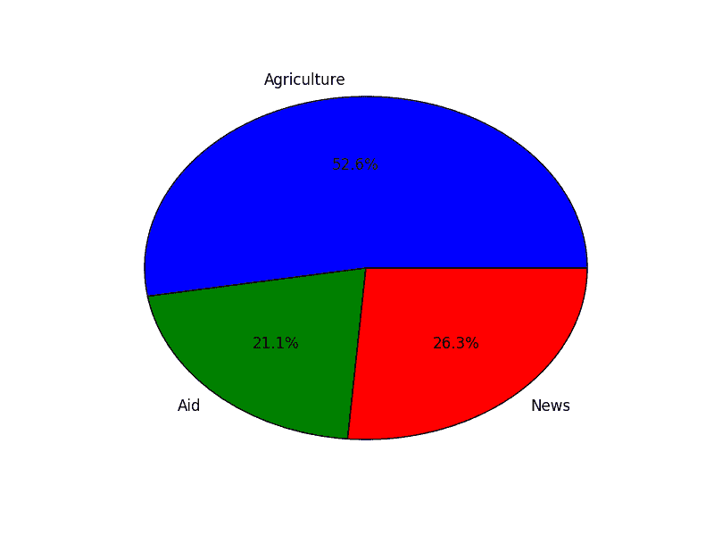
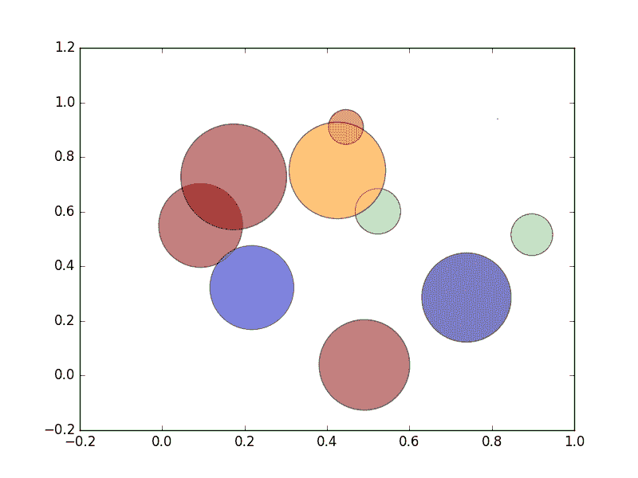

# 实施方案、应用和工具

在没有实际应用的情况下学习算法仍然是一种纯粹学术的追求。在本章中，我们将探讨塑造我们世界的各种数据结构和算法。

这个时代的黄金法则之一是数据的丰富性。电子邮件、电话号码、文本和图像文档包含大量数据。在这些数据中找到了有价值的信息，使得数据变得更加重要。但要从原始数据中提取这些信息，我们必须使用专门为此任务设计的数据结构、过程和算法。

机器学习使用大量算法来分析和预测某些变量的发生。仅基于数值分析数据仍然会留下大量潜在信息隐藏在原始数据中。因此，以视觉方式呈现数据使人们能够理解和获得有价值的洞察。

到本章结束时，你应该能够做到以下几件事情：

+   准确修剪和呈现数据

+   使用监督学习和无监督学习算法进行预测

+   以视觉方式呈现数据以获得更多洞察

# 行业工具

为了继续本章，你需要安装以下包。这些包将用于预处理和视觉呈现正在处理的数据。其中一些包还包含编写良好且经过优化的算法，将在我们的数据上运行。

最好在这些模块中安装虚拟环境，例如`pip`：

```py
% pip install numpy
% pip install scikit-learn
% pip install matplotlib
% pip install pandas
% pip install textblob  

```

这些包可能需要首先安装其他平台特定的模块。请注意并安装所有依赖项：

+   **Numpy**：一个具有操作 n 维数组和矩阵的函数库。

+   **Scikit-learn**：一个高度先进的机器学习模块。它包含大量用于分类、回归和聚类等算法。

+   **Matplotlib**：这是一个利用 NumPy 绘制各种图表的绘图库，包括线图、直方图、散点图，甚至 3D 图表。

+   **Pandas**：这个库处理数据操作和分析。

# 数据预处理

从现实世界收集数据充满了巨大的挑战。收集到的原始数据存在许多问题，以至于我们需要采用方法来净化数据，使其适合进一步研究使用。

# 为什么处理原始数据？

从现场收集的原始数据充满了人为错误。数据录入是收集数据时的主要错误来源。即使是收集数据的技术方法也难以幸免。设备读取不准确、设备故障和环境因素的变化在收集数据时可以引入显著的误差范围。

收集的数据也可能与其他随时间收集的记录不一致。存在重复条目和不完整记录的存在要求我们以这种方式处理数据，以便挖掘隐藏和埋藏的宝藏。原始数据也可能被无关的数据所掩盖。

为了清理数据，我们可以完全丢弃无关的数据，这通常被称为噪声。具有缺失部分或属性的数据可以用合理的估计值替换。此外，如果原始数据存在不一致性，检测和纠正它们变得必要。

让我们探索如何使用 NumPy 和 pandas 进行数据预处理技术。

# 缺失数据

数据收集是繁琐的，因此一旦收集了数据，就不应该轻易丢弃。仅仅因为数据集有缺失字段或属性，并不意味着它没有用。可以使用几种方法来填补缺失的部分。这些方法之一是使用全局常数、使用数据集的平均值，或者手动提供数据。选择取决于数据的上下文和使用敏感性。

以以下数据为例：

```py
    import numpy as np 
    data = pandas.DataFrame([ 
        [4., 45., 984.], 
        [np.NAN, np.NAN, 5.], 
        [94., 23., 55.], 
    ]) 

```

如我们所见，数据元素`data[1][0]`和`data[1][1]`的值为`np.NAN`，表示它们没有值。如果给定数据集中的`np.NAN`值是不希望的，可以将它们设置为某个常数数字。

让我们将值为`np.NAN`的数据元素设置为 0.1：

```py
    print(data.fillna(0.1)) 

```

数据的新状态变为以下：

```py
0     1      2
0   4.0  45.0  984.0
1   0.1   0.1    5.0
2  94.0  23.0   55.0

```

要应用平均值，我们执行以下操作：

```py
    print(data.fillna(data.mean())) 

```

计算每列的平均值，并将其插入具有`np.NAN`值的数据区域：

```py
0     1      2
0   4.0  45.0  984.0
1  49.0  34.0    5.0
2  94.0  23.0   55.0

```

对于第一列，列`0`，平均值通过`(4 + 94)/2`获得。得到的`49.0`随后存储在`data[1][0]`中。对于列`1`和`2`，执行类似的操作。

# 特征缩放

数据框中的列被称为其特征。行被称为记录或观察。现在检查以下数据矩阵。这些数据将在子节中引用，请务必注意：

```py
[[  58\.    1\.   43.]
 [  10\.  200\.   65.]
 [  20\.   75\.    7.]]

```

特征 1，其数据为`58`、`10`、`20`，其值位于`10`和`58`之间。对于特征 2，数据位于`1`和`200`之间。如果我们向任何机器学习算法提供这些数据，将会产生不一致的结果。理想情况下，我们需要将数据缩放到一定的范围内，以获得一致的结果。

再次仔细检查，可以发现每个特征（或列）都围绕不同的平均值。因此，我们想要做的是将特征调整到相似的均值附近。

特征缩放的一个好处是它能提升机器学习的学习部分。

`scikit`模块有相当多的缩放算法，我们将将其应用于我们的数据。

# 最小-最大标度

归一化的最小-最大标量形式使用均值和标准差将所有数据框定在某个最小值和最大值之间。在大多数情况下，范围被设置为 0 到 1 之间。在其他时候，可能会应用其他范围，但 0 到 1 的范围仍然是默认值：

```py
    scaled_values = preprocessing.MinMaxScaler(feature_range=(0,1)) 
    results = scaled_values.fit(data).transform(data) 
    print(results) 

```

使用范围`(0,1)`创建`MinMaxScaler`类的实例，并将其传递给变量`scaled_values`。调用`fit`函数进行必要的计算，这些计算将用于内部更改数据集。`transform`函数对数据集进行实际操作，并将值返回到`results`：

```py
[[ 1\.          0\.          0.62068966]
 [ 0\.          1\.          1\.        ]
 [ 0.20833333  0.3718593   0\.        ]]

```

从前面的输出中我们可以看到，所有数据都进行了归一化，并且位于 0 和 1 之间。这种输出现在可以被提供给机器学习算法。

# 标准标量

我们初始数据集或表中相应特征的均值分别是 29.3、92 和 38。为了使所有数据具有相似的均值，即数据的均值为零且方差为 1，我们将应用标准标量算法：

```py
    stand_scalar =  preprocessing.StandardScaler().fit(data) 
    results = stand_scalar.transform(data) 
    print(results)

```

将`data`传递给从实例化`StandardScaler`类返回的对象的`fit`方法。`transform`方法作用于数据中的数据元素，并将输出返回到结果：

```py
[[ 1.38637564 -1.10805456  0.19519899]
 [-0.93499753  1.31505377  1.11542277]
 [-0.45137812 -0.2069992  -1.31062176]]

```

检查结果，我们发现所有特征现在分布得都很均匀。

# 数据二值化

为了对给定的特征集进行二值化，我们使用一个阈值。如果给定数据集中的任何值大于阈值，则该值将被替换为 1。如果值小于阈值 1，我们将将其替换：

```py
    results = preprocessing.Binarizer(50.0).fit(data).transform(data) 
    print(results) 

```

使用参数 50.0 创建`Binarizer`实例。50.0 是二值化算法中将使用的阈值：

```py
[[ 1\.  0\.  0.]
 [ 0\.  1\.  1.]
 [ 0\.  1\.  0.]] 

```

数据中所有小于 50 的值将用 0 代替。相反的情况也成立。

# 机器学习

机器学习是人工智能的一个子领域。我们知道我们永远无法真正创造出能够“思考”的机器，但我们可以通过提供足够的数据和模型来让机器做出合理的判断。机器学习专注于创建自主系统，这些系统能够继续决策过程，几乎不需要或不需要人为干预。

为了教会机器，我们需要从现实世界中抽取数据。例如，为了区分哪些电子邮件是垃圾邮件，哪些不是，我们需要向机器提供每种类型的样本。在获得这些数据后，我们必须将这些数据通过使用概率和统计来挖掘数据中的模式和结构的模型（算法）。如果这样做得当，算法本身将能够分析电子邮件并将它们正确分类。对电子邮件进行分类只是机器“训练”后可以做到的一件事的例子。

# 机器学习的类型

机器学习大致可以分为三个主要类别，如下所示：

+   **监督学习**：在这里，算法被喂入一组输入及其相应的输出。然后，算法必须确定对未知输入的输出将会是什么。此类算法的例子包括朴素贝叶斯、线性回归和决策树算法。

+   **无监督学习**：不使用一组输入和输出变量之间存在的关联，无监督学习算法仅使用输入来挖掘数据中的组、模式和聚类。此类算法的例子包括层次聚类和 k-means 聚类。

+   **强化学习**：在这种学习中，计算机与环境动态交互，以改善其性能。

# Hello 分类器

为了在理解机器学习的道路上祈求编程神灵的祝福，我们从一个文本分类器的 hello world 示例开始。这旨在对机器学习进行温和的介绍。

此示例将预测给定文本是否带有负面或正面含义。在这样做之前，我们需要用一些数据来训练我们的算法（模型）。

朴素贝叶斯模型适用于文本分类目的。基于朴素贝叶斯模型的算法通常运行速度快，结果准确。整个模型基于这样一个假设：特征之间相互独立。为了准确预测降雨的发生，需要考虑三个条件。这些条件是风速、温度和空气中的湿度量。在现实中，这些因素确实相互影响，以判断降雨的可能性。但朴素贝叶斯中的抽象假设是这些特征在某种程度上是无关的，因此独立地贡献于降雨的可能性。朴素贝叶斯在预测未知数据集的类别方面很有用，我们很快就会看到。

现在回到我们的 hello 分类器。在我们训练了我们的模型之后，其预测结果将落入正类或负类：

```py
    from textblob.classifiers import NaiveBayesClassifier 
    train = [ 
        ('I love this sandwich.', 'pos'), 
        ('This is an amazing shop!', 'pos'), 
        ('We feel very good about these beers.', 'pos'), 
        ('That is my best sword.', 'pos'), 
        ('This is an awesome post', 'pos'), 
        ('I do not like this cafe', 'neg'), 
        ('I am tired of this bed.', 'neg'), 
        ("I can't deal with this", 'neg'), 
        ('She is my sworn enemy!', 'neg'), 
        ('I never had a caring mom.', 'neg') 
    ] 

```

首先，我们将从`textblob`包中导入`NaiveBayesClassifier`类。这个分类器非常易于使用，并且基于贝叶斯定理。

`train`变量由元组组成，每个元组都包含实际的训练数据。每个元组包含一个句子和与之相关的组。

现在，为了训练我们的模型，我们将通过传递 train 给它来实例化一个`NaiveBayesClassifier`对象：

```py
    cl = NaiveBayesClassifier(train) 

```

更新的朴素贝叶斯模型`cl`将预测未知句子所属的类别。到目前为止，我们的模型只知道短语可以属于两个类别，`neg`和`pos`。

以下代码使用我们的模型运行以下测试：

```py
    print(cl.classify("I just love breakfast")) 
    print(cl.classify("Yesterday was Sunday")) 
    print(cl.classify("Why can't he pay my bills")) 
    print(cl.classify("They want to kill the president of Bantu")) 

```

我们的测试输出如下：

```py
pos 
pos 
neg 
neg 

```

我们可以看到，该算法在将输入短语分类到其类别方面已经取得了一定的成功。

这个人为的例子过于简单，但它确实显示出，如果提供正确数量的数据和合适的算法或模型，机器可以在没有任何人类帮助的情况下执行任务。

专门的类`NaiveBayesClassifier`也在后台为我们做了很多工作，所以我们无法欣赏算法到达各种预测的内部机制。我们的下一个示例将使用`scikit`模块来预测一个短语可能属于的类别。

# 一个监督学习示例

假设我们有一组要分类的帖子。与监督学习一样，我们需要首先训练模型，以便它能够准确预测未知帖子的类别。

# 收集数据

`scikit`模块附带了一些样本数据，我们将使用这些数据来训练我们的模型。在这种情况下，我们将使用新闻组帖子。为了加载帖子，我们将使用以下代码行：

```py
    from sklearn.datasets import fetch_20newsgroups 
    training_data = fetch_20newsgroups(subset='train',     
        categories=categories, shuffle=True, random_state=42) 

```

在我们训练好模型后，预测结果必须属于以下类别之一：

```py
    categories = ['alt.atheism', 
                  'soc.religion.christian','comp.graphics', 'sci.med'] 

```

我们将要使用的训练数据记录数如下：

```py
    print(len(training_data)) 

```

机器学习算法与文本属性混合得不好，因此每个帖子所属的类别以数字形式呈现：

```py
    print(set(training_data.target)) 

```

类别具有整数值，我们可以使用`print(training_data.target_names[0])`将其映射回类别本身。

这里，0 是从`set(training_data.target)`中随机选择的数值索引。

现在训练数据已经获得，我们必须将数据输入到机器学习算法中。词袋模型将分解训练数据，以便为学习算法或模型做好准备。

# 词袋

词袋是一个模型，用于以这种方式表示文本数据，它不考虑单词的顺序，而是使用单词计数将单词分割成区域。

考虑以下句子：

```py
    sentence_1 = "As fit as a fiddle"
    sentence_2 = "As you like it"

```

词袋模型使我们能够将文本分解成由矩阵表示的数值特征向量。

为了将我们的两个句子简化为词袋模型，我们需要获得所有单词的唯一列表：

```py
    set((sentence_1 + sentence_2).split(" ")) 

```

这个集合将成为矩阵的列。矩阵的行将代表用于训练的文档。行和列的交集将存储单词在文档中出现的次数。以我们的两个句子为例，我们得到以下矩阵：

|  | **As** | **Fit** | **A** | **Fiddle** | **You** | **Like** | **it** |
| --- | --- | --- | --- | --- | --- | --- | --- |
| **句子 1** | 2 | 1 | 1 | 1 | 0 | 0 | 0 |
| **句子 2** | 1 | 0 | 0 | 0 | 1 | 1 | 1 |

仅凭前面的数据，我们无法准确预测新文档或文章将属于哪个类别。表格本身存在一些固有的缺陷。可能存在这样的情况，较长的文档或出现在许多帖子中的单词会降低算法的精确度。可以通过移除停用词来确保只分析相关数据。停用词包括 is、are、was 等。由于词袋模型在分析中不考虑语法，因此可以安全地删除停用词。还可能需要将一些认为应该从最终分析中豁免的词添加到停用词列表中。

为了生成进入矩阵列的值，我们必须对训练数据进行分词：

```py
    from sklearn.feature_extraction.text import CountVectorizer 
    from sklearn.feature_extraction.text import TfidfTransformer 
    from sklearn.naive_bayes import MultinomialNB 
    count_vect = CountVectorizer() 
    training_matrix = count_vect.fit_transform(training_data.data) 

```

`training_matrix`的维度为（2257，35788）。这意味着 2257 对应于数据集，而 35788 对应于构成所有帖子中唯一单词集合的列数。

我们实例化了`CountVectorizer`类，并将`training_data.data`传递给`count_vect`对象的`fit_transform`方法。结果存储在`training_matrix`中。`training_matrix`包含所有唯一的单词及其相应的频率。

为了减轻仅基于频率计数进行预测的问题，我们将导入`TfidfTransformer`，它有助于平滑我们数据中的不准确度：

```py
    matrix_transformer = TfidfTransformer() 
    tfidf_data = matrix_transformer.fit_transform(training_matrix) 

    print(tfidf_data[1:4].todense()) 

```

`tfidf_data[1:4].todense()`仅显示一个 3 行 35,788 列矩阵的截断列表。所看到的值是词频-逆文档频率，它减少了使用频率计数带来的不准确度：

```py
    model = MultinomialNB().fit(tfidf_data, training_data.target) 

```

`MultinomialNB`是朴素贝叶斯模型的一个变体。我们将合理化的数据矩阵`tfidf_data`和类别`training_data.target`传递给其`fit`方法。

# 预测

为了测试我们的模型是否已经学习到足够多的知识来预测一个未知帖子可能属于的类别，我们有以下样本数据：

```py
    test_data = ["My God is good", "Arm chip set will rival intel"] 
    test_counts = count_vect.transform(test_data) 
    new_tfidf = matrix_transformer.transform(test_counts) 

```

将`test_data`列表传递给`count_vect.transform`函数以获得测试数据的向量形式。为了获得测试数据集的词频-逆文档频率表示，我们调用`matrix_transformer`对象的`transform`方法。

为了预测文档可能属于哪个类别，我们执行以下操作：

```py
    prediction = model.predict(new_tfidf)  

```

循环用于遍历预测，显示它们预测属于的类别：

```py
    for doc, category in zip(test_data, prediction): 
        print('%r => %s' % (doc, training_data.target_names[category])) 

```

当循环运行完成后，将显示短语及其可能属于的类别。一个示例输出如下：

```py
'My God is good' => soc.religion.christian
'Arm chip set will rival intel' => comp.graphics

```

到目前为止我们所看到的一切都是监督学习的典范。我们首先加载了已知类别的帖子。然后，根据朴素贝叶斯定理，将这些帖子输入到最适合文本处理的机器学习算法中。向模型提供了一组测试帖子片段，并预测了类别。

为了探索无监督学习算法的例子，我们将研究 k-means 算法对某些数据进行聚类。

# 一个无监督学习示例

一种学习算法类别能够发现数据集中可能存在的固有分组。这些算法的例子是 k-means 算法。

# K-means 算法

k-means 算法使用给定数据集中的均值点来聚类并发现数据集中的分组。K 是我们想要并希望发现的簇的数量。在 k-means 算法生成分组后，我们可以传递额外的未知数据给它，以预测它将属于哪个组。

注意，在这种算法中，只有未经分类的原始数据被输入到算法中。算法需要自行判断数据中是否存在固有的分组。

为了理解这个算法是如何工作的，我们将检查由 x 和 y 值组成的 100 个数据点。我们将将这些值输入到学习算法中，并期望算法将数据聚类成两组。我们将对这两组进行着色，以便簇是可见的。

让我们创建一个包含 100 个*x*和*y*对的样本数据：

```py
    import numpy as np 
    import matplotlib.pyplot as plt 
    original_set = -2 * np.random.rand(100, 2) 
    second_set = 1 + 2 * np.random.rand(50, 2) 
    original_set[50: 100, :] = second_set 

```

首先，我们创建 100 条记录，使用`-2 * np.random.rand(100, 2)`。在每条记录中，我们将使用其中的数据来表示最终将被绘制的 x 和 y 值。

`original_set`中的最后 50 个数字将被替换为`1 + 2 * np.random.rand(50, 2)`。实际上，我们所做的是创建了两个数据子集，其中一个子集包含负数，而另一个子集包含正数。现在，算法有责任适当地发现这些段。

我们实例化了`KMeans`算法类，并传递了`n_clusters=2`。这使得算法将所有数据仅聚类到两个组中。这个数字`2`是通过一系列的试错得到的。但在学术目的上，我们已知这个数字。当处理来自现实世界的不熟悉数据集时，这一点并不明显：

```py
    from sklearn.cluster import KMeans 
    kmean = KMeans(n_clusters=2) 

    kmean.fit(original_set) 

    print(kmean.cluster_centers_) 

    print(kmean.labels_) 

```

数据集被传递到`kmean`的`fit`函数中，即`kmean.fit(original_set)`。算法生成的簇将围绕某个均值点旋转。定义这两个均值点的点是`kmean.cluster_centers_`。

打印出的均值点如下所示：

```py
[[ 2.03838197  2.06567568]
 [-0.89358725 -0.84121101]]

```

在我们的 k-means 算法完成训练后，`original_set`中的每个数据点都将属于一个簇。k-means 算法将其发现的两个簇表示为 1 和 0。如果我们要求算法将数据聚类成四个簇，这些簇的内部表示将是 0、1、2 和 3。为了打印出每个数据集所属的各种簇，我们执行以下操作：

```py
    print(kmean.labels_) 

```

这给出了以下输出：

```py
[1 1 1 1 1 1 1 1 1 1 1 1 1 1 1 1 1 1 1 1 1 1 1 1 1 1 1 1 1 1 1 1 1 1 1  
 1 1 1 1 1 1 1 1 1 1 1 1 1 1 1 0 0 0 0 0 0 0 0 0 0 0 0 0 0 0 0 0 0 0 0 
 0 0 0 0 0 0 0 0 0 0 0 0 0 0 0 0 0 0 0 0 0 0 0 0 0 0 0 0 0 0]

```

有 100 个 1 和 0。每个数字表示每个数据点所属的簇。通过使用`matplotlib.pyplot`，我们可以绘制每个组的点并适当地着色以显示簇：

```py
    import matplotlib.pyplot as plt 
    for i in set(kmean.labels_): 
        index = kmean.labels_ == i 
        plt.plot(original_set[index,0], original_set[index,1], 'o') 

```

`index = kmean.labels_ == i` 是一种巧妙的方法，通过它我们可以选择所有对应于群体`i`的点。当`i=0`时，所有属于群体 0 的点都会返回到索引中。对于`index =1, 2` ... 等等，情况相同。

`plt.plot(original_set[index,0], original_set[index,1], 'o')` 然后使用“o”字符绘制这些数据点。

接下来，我们将绘制形成簇的质心或均值：

```py
    plt.plot(kmean.cluster_centers_[0][0],kmean.cluster_centers_[0][1], 
             '*', c='r', ms=10) 
    plt.plot(kmean.cluster_centers_[1][0],kmean.cluster_centers_[1][1], 
             '*', c='r', ms=10) 

```

最后，我们用星号标示两个均值，展示整个图表：

```py
    plt.show()

```



算法在我们的样本数据中发现了两个不同的簇。两个簇的均值用红色星号符号表示。

# 预测

对于我们获得的两个簇，我们可以预测一组新数据可能属于哪个群体。

让我们预测点`[[-1.4, -1.4]]`和`[[2.5, 2.5]]`将属于哪个群体：

```py
    sample = np.array([[-1.4, -1.4]]) 
    print(kmean.predict(sample)) 

    another_sample = np.array([[2.5, 2.5]]) 
    print(kmean.predict(another_sample)) 

```

输出如下所示：

```py
[1]
[0] 

```

至少，我们可以期待两个测试数据集属于不同的簇。当`print`语句打印出 1 和 0 时，我们的预期得到了证实，从而确认我们的测试数据确实属于两个不同的簇。

# 数据可视化

数值分析并不总是容易理解。确实，一张图片胜过千言万语，在本节中，一张只包含数字的表格可能就相当于一千张表格。图片提供了一种快速分析数据的方法。大小和长度的差异是图像中的快速标记，可以根据这些标记得出结论。在本节中，我们将游览不同的数据表示方法。除了这里列出的图表之外，在数据交流中还可以实现更多。

# 条形图

要将值 25、5、150 和 100 绘制成条形图，我们将值存储在数组中，并将其传递给`bar`函数。图中的条形代表*y*轴上的幅度：

```py
    import matplotlib.pyplot as plt 

    data = [25., 5., 150., 100.] 
    x_values = range(len(data)) 
    plt.bar(x_values, data) 

    plt.show() 

```

`x_values`存储由`range(len(data))`生成的值数组。`x_values`还将确定条形将在*x*轴上的哪些点绘制。第一个条形将在*x*为 0 的*x*轴上绘制。数据为 5 的第二个条形将在*x*为 1 的*x*轴上绘制：



每个条形的宽度可以通过修改以下行来改变：

```py
    plt.bar(x_values, data, width=1.)  

```

这应该产生以下图表：



然而，这看起来并不美观，因为条形之间没有空间了，这使得它看起来很笨拙。每个条形现在占据了*x*轴上的一个单位。

# 多条形图

在尝试可视化数据时，堆叠多个条形可以让人进一步理解一个数据点或变量如何与另一个变量变化：

```py
    data = [ 
            [8., 57., 22., 10.], 
            [16., 7., 32., 40.],
           ] 

    import numpy as np 
    x_values = np.arange(4) 
    plt.bar(x_values + 0.00, data[0], color='r', width=0.30) 
    plt.bar(x_values + 0.30, data[1], color='y', width=0.30) 

    plt.show() 

```

第一批数据的 y 值为`[8., 57., 22., 10.]`。第二批是`[16., 7., 32., 40.]`。当条形绘制时，8 和 16 将占据相同的 x 位置，并排在一起。

`x_values = np.arange(4)` 生成包含值 `[0, 1, 2, 3]` 的数组。第一组条形首先在位置 `x_values + 0.30` 绘制。因此，第一个 x 值将在 `0.00, 1.00, 2.00 和 3.00` 处绘制。

第二批 `x_values` 将在 `0.30, 1.30, 2.30 和 3.30` 处绘制：



# 箱线图

箱线图用于可视化分布的中位数值以及低和高范围。它也被称为箱线和触须图。

让我们绘制一个简单的箱线图。

我们首先从正态分布中生成 50 个数字。然后，将这些数字传递给 `plt.boxplot(data)` 以进行图表绘制：

```py
    import numpy as np 
    import matplotlib.pyplot as plt 

    data = np.random.randn(50) 

    plt.boxplot(data) 
    plt.show() 

```

下图是生成的结果：



对前面的图进行一些评论：箱线图的特征包括一个跨越四分位距的箱体，它衡量分散程度；数据的外围边缘由连接到中央箱体的触须表示；红色线代表中位数。

箱线图有助于轻松识别数据集中的异常值以及确定数据集可能偏斜的方向。

# 饼图

饼图将数据解释并视觉上呈现为似乎适合圆圈。各个数据点表示为圆的扇区，总和为 360 度。此图表适用于显示分类数据和摘要：

```py
    import matplotlib.pyplot as plt 
    data = [500, 200, 250] 

    labels = ["Agriculture", "Aide", "News"] 

    plt.pie(data, labels=labels,autopct='%1.1f%%') 
    plt.show() 

```

图表中的各个部分用标签数组中的字符串标记：



# 气泡图

散点图的另一种变体是气泡图。在散点图中，我们只绘制数据的 x，y 点。气泡图通过说明点的尺寸增加了另一个维度。这个第三维度可能代表市场的大小甚至利润：

```py
    import numpy as np 
    import matplotlib.pyplot as plt 

    n = 10 
    x = np.random.rand(n) 
    y = np.random.rand(n) 
    colors = np.random.rand(n) 
    area = np.pi * (60 * np.random.rand(n))**2 

    plt.scatter(x, y, s=area, c=colors, alpha=0.5) 
    plt.show() 

```

使用变量 `n`，我们指定随机生成的 x 和 y 值的数量。这个相同的数字用于确定 x 和 y 坐标的随机颜色。随机气泡大小由 `area = np.pi * (60 * np.random.rand(n))**2` 确定。

下图显示了此气泡图：



# 摘要

在本章中，我们探讨了数据和算法如何结合以帮助机器学习。通过首先通过归一化过程修剪我们的数据，我们才能理解大量数据。将此数据输入专门的算法，我们能够预测数据将落入的类别和集合。

最后，绘制和图表化浓缩数据有助于更好地理解和做出有洞察力的发现。
