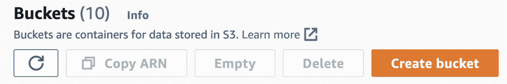

# 3

# 使用 Lambda 的云计算

在本章中，我们将学习 Lambda 的基础知识，并实现一个将在 AWS Lambda 中运行的 Python 应用程序。为此，我们将使用我们的 AWS 账户。

本章涵盖了以下主题：

+   云计算

+   什么是 Lambda？

+   使用 Lambda 的示例应用

+   Lambda 中的重要配置

+   Lambda 框架

+   Lambda 返回值

+   Lambda 中的日志记录

+   使用 Lambda 和 S3 提交元数据解析应用

# 云计算

云计算允许你使用计算机资源，如磁盘和内存，而无需管理基础设施。云的概念对于让你专注于应用程序非常重要。当你使用自己的基础设施时，你需要购买或租用一台计算机，安装所有必要的软件，连接电缆，并确保计算机免受物理和软件攻击。很明显，这需要大量的时间；因此，你的重点将是减少应用程序的配置时间。使用云计算，你不会有这种头痛。云服务提供商承担了大部分责任，并为你设置和维护数据中心。你需要做的是进行一些配置并将你的应用程序部署到数据中心。这使得你的生活更轻松；云服务提供商专注于基础设施，而你专注于应用程序。这是云计算的最大优势。

# 什么是 Lambda？

Lambda 是一种计算服务，允许你运行 Python、Java、Node.js、Ruby、.NET 和 Go 代码，而无需配置和管理任何服务器。在 AWS 中，它是 AWS 堆栈中最常用的服务之一。你需要做的只是开发和运行你的代码。Lambda 在成本方面也有一些优势。

Lambda 是 AWS 创建的容器，用于执行你的应用程序。当你创建一个 Lambda 函数时，AWS 会为你创建这个容器。因此，你不需要配置实例并在容器中安装编译器。唯一的责任是在选择 Lambda 时运行你的代码。

## Lambda 的优势

Lambda 的优势如下：

+   没有必要配置服务器

+   它是一种按使用付费的模式

+   它支持不同的运行时，如 Python、Java 和 C#

+   由于它已经准备好开发，因此无需安装软件开发工具包

+   它具有可扩展性功能——如果你的流程需要更多资源，Lambda 会自动扩展它

+   它为你的运营管理节省了大量时间

+   它能够持续监控你的 Lambda 函数

## Lambda 的限制

Lambda 的限制如下：

+   **超时限制**：如果你有长时间运行的功能，Lambda 不是最佳选择。目前，Lambda 的超时限制为 15 分钟。如果持续时间超过 15 分钟，你将收到超时错误。

+   **内存限制**：当你运行函数时，进程需要根据流程分配内存。如果你的进程需要大量的内存，你会收到一个错误。除此之外，Lambda 的成本与执行时间和使用的内存量相关。

你可以在 AWS Lambda 配额页面查看最新的限制：[`docs.aws.amazon.com/lambda/latest/dg/gettingstarted-limits.xhtml`](https://docs.aws.amazon.com/lambda/latest/dg/gettingstarted-limits.xhtml)。

在本节中，我们探讨了 Lambda 的一些优缺点。当你需要快速运行任何类型的应用程序，而不需要服务器或详细的安装时，它非常有用。现在，我们将实现一个简单的应用程序来学习 Lambda，并利用这些优势为我们带来好处。

# 一个使用 Lambda 的示例应用程序

我们将分步骤在 Lambda 中执行一个示例应用程序。要在 Lambda 上运行 Python 应用程序，请按照以下步骤操作：

1.  前往 AWS 管理控制台。

1.  在搜索框中输入`lambda`并点击 Lambda 服务：


图 3.1 – AWS 管理控制台

1.  点击**创建函数**。

1.  在**创建函数**页面，选择**使用蓝图**，在蓝图内选择**hello-world-python**应用程序：


图 3.2 – 创建函数

1.  在下一屏幕上，输入 Lambda 函数的名称并选择安全设置：


图 3.3 – 命名函数

当你运行一个 Lambda 函数时，你需要定义 Lambda 可以使用的角色，以便能够执行一些操作，这可以在**执行角色**下完成。该角色定义了你在 AWS 中的权限以及如何访问其他 AWS 服务。例如，如果 Lambda 需要访问数据库，那么它应该有数据库访问安全角色。在这种情况下，Lambda 将拥有运行示例 Python 函数的基本权限。

一旦你创建了 Lambda 函数，你将拥有要测试的基本 Python 代码：


图 3.4 – 一个 Lambda 函数示例

1.  点击**测试**按钮。当你点击它时，你也可以设置参数：


图 3.5 – 运行 Lambda 函数

在运行测试后，Lambda 将运行，你将能够看到结果：


图 3.6 – Lambda 函数的输出

我们已经创建了一个 Lambda 函数示例。一旦你实现了应用程序，正如你所看到的，运行应用程序非常简单。

# Lambda 中的重要配置

当你创建一个 Lambda 函数时，需要完成不同的配置才能高效地运行它：


图 3.7 – Lambda 配置

我们将使用这些配置来演示下一个例子。在开始示例之前，让我们先看看这些配置的定义：

+   **内存**：此配置用于定义应用程序的内存限制。你需要找到这个值的可行量。如果你定义了一个很大的量而实际上并未使用，这会影响成本。另一方面，如果你定义的内存量小于实际使用量，你的应用程序会抛出内存不足异常。

+   **超时**：我们提到 Lambda 函数在超时方面有限制。你可以在 Lambda 函数应该工作的持续时间限制下提供。

+   `/tmp`文件夹用于临时存储，Lambda 处理完成后需要删除。

+   **触发器**：触发器允许你选择一个运行 Lambda 函数的 AWS 源。例如，S3，AWS 中的对象存储机制，可以是 Lambda 函数的触发器。我们可以在 Lambda 中添加 S3 配置，这样当对象/文件上传到 S3 时，就会触发 Lambda。

+   执行角色中的`PUT`权限。

+   **目标**：当 Lambda 完成处理时，它可以向其他服务发送信息，例如队列。

+   **环境变量**：这允许你在 Lambda 应用程序中添加一个环境变量。例如，你可以将数据库 URL 添加到这个配置中。如果数据库 URL 发生变化，你不需要更改代码。

+   `CRM`和`订单管理`，这允许你分类你的函数并便于搜索。这也用于成本管理。

+   **虚拟私有云（VPC）**：VPC 允许你在你定义的虚拟网络环境中创建 AWS 服务。你可以将 AWS 服务分离到不同的网络设置中。正如你在以下图中看到的，可以在不同的环境中创建两个实例：


图 3.8 – 一个 VPC

+   **监控和操作工具**：Lambda 默认收集应用程序日志，并且可以通过 CloudWatch 进行监控，这有助于你监控应用程序。此工具默认启用，但你也可以禁用它。

Lambda 的配置在创建新函数时非常重要。了解不同配置用于何种原因是有益的，这样你可以正确地使用 Lambda。

# Lambda 骨架

当你通过 Python 实现 Lambda 函数时，你需要遵循一些规则以便执行应用程序。当 Lambda 函数运行时，它会调用`handler`方法，如下所示：

```py
def lambda_handler(event, context):
    ...
    return some_value
```

如你所见，第一个参数是`event`对象。一个`event`对象由 JSON 组成，以便将数据作为参数处理。你可以在以下示例中看到参数：

```py
{
  "Temperature": 10,
  "Wind": -5
}
```

第二个参数显示了 Lambda 运行时的信息。你可以在以下位置看到一些运行时字段：

+   `function_name`（函数名称）

+   `function_version`（函数版本）

+   `memory_limit_in_mb`（Lambda 函数内存限制）

我们已经了解了 Python Lambda 函数的主要结构。在下一节中，我们将看到如何从 Lambda 返回一个值。

# Lambda 返回值

在 Lambda 中，您可以返回一个简单的消息或一个复杂的 JSON 事件。在以下示例中，您可以看到 Lambda 的一个示例返回消息：

```py
def handler_name(event, context):
    message = 'Weather details. Temperature: {} and Wind: {}!'.format(event['Temperature'], event['Wind'])
    return message
```

在这个例子中，Lambda 以 `Temperature` 和 `Wind` 作为输入，并将这些参数作为消息返回。在以下示例中，您可以看到更复杂的返回值：

```py
def handler_name(event, context):
    return {
     "statusCode": 200,
     "Temperature": 10,
     "Wind": -5
    }
```

如此例所示，返回值由一个简单对象组成，该对象将被调用者解析。例如，如果 Lambda 被某个 Python 应用程序调用，则在 Lambda 完成处理后，此对象将被返回。通常，此参数允许您以不同的行为运行 Python 应用程序。在下一节中，我们将了解如何在 Lambda 中记录信息。

# Lambda 中的日志记录

使用日志功能来跟踪应用程序非常重要。在某些情况下，您可能需要获取有关应用程序的信息；或者，您可能通过 Lambda 处理数据，并可能得到一个异常结果。因此，日志有助于检查信息，以了解应用程序中的真正问题。

您可以在 Lambda 中使用多个日志库，包括这个：[`docs.python.org/3/library/logging.xhtml`](https://docs.python.org/3/library/logging.xhtml)

在以下示例中，只需添加一个日志并返回一个值：

```py
import logging
logger = logging.getLogger()
logger.setLevel(logging.INFO)
def handler_name(event, context):
    logger.info('Process has finished and result will be returned')
    return {
     "statusCode": 200,
     "Temperature": 10,
     "Wind": -5
    }
```

我总是推荐在应用程序中添加一些日志；这是成为一名优秀开发者的最佳实践之一。除此之外，我们还将更深入地了解 CloudWatch，这是 AWS 中的日志和监控服务。

# 使用 Lambda 和 S3 提交元数据解析应用程序

我们将在 Lambda 中执行另一个应用程序。在这种情况下，Lambda 将由 S3 触发。S3 是一个对象存储服务，您可以上传不同类型的文件，如图像、CSV 和文本文件。在这个例子中，当您将文件上传到 S3 时，该服务将触发 Lambda 函数，该函数反过来将提供有关文件元数据的信息。让我们一步一步实现应用程序：

1.  登录 AWS 管理控制台。

1.  在搜索框中输入 `lambda` 并转到 Lambda 服务。

1.  点击 **创建函数**。

1.  在 **创建函数** 页面上，选择 **从头开始创建**，然后在 **运行时** 字段中选择 **Python 3.9**：


图 3.9 – 创建函数

1.  在 `S3TriggerLambdaReadRole` 中。该角色需要从 S3 服务中读取文件：


图 3.10 – 权限

1.  点击页面底部的 **创建函数** 按钮：


图 3.11 – 创建函数

1.  为了读取对象元数据，将以下代码片段粘贴到 Lambda 函数中，然后点击 **部署** 按钮：

    ```py
    import json
    import urllib.parse
    import boto3
    print('Loading function')
    s3 = boto3.client('s3')
    def lambda_handler(event, context):
        #print("Received event: " + json.dumps(event, indent=2))
        # Get the object from the event and show its content type
        bucket = event['Records'][0]['s3']['bucket']['name']
        key = urllib.parse.unquote_plus(event['Records'][0]['s3']['object']['key'], encoding='utf-8')
        try:
            response = s3.get_object(Bucket=bucket, Key=key)
            print("CONTENT TYPE: " + response['ContentType'])
            return response['ContentType']
        except Exception as e:
            print(e)
            print('Error getting object {} from bucket {}. Make sure they exist and your zbucket is in the same region as this function.'.format(key, bucket))
            raise e
    ```

您也可以从 AWS 找到原始代码块：[`docs.aws.amazon.com/lambda/latest/dg/with-s3-example.xhtml`](https://docs.aws.amazon.com/lambda/latest/dg/with-s3-example.xhtml)。

**Boto3**用于管理 Python 的 AWS 服务。我们创建了一个 S3 客户端来访问和管理 S3 服务。

当你将文件放入 S3 时，应用程序会被触发。在代码片段中，代码从`bucket`变量中获取存储桶信息。`urllib`库允许你解析 S3 密钥，以便通过`get_object`方法检索 S3 对象。然后，我们打印内容类型。

你也可以在 Lambda 中看到最新的代码片段：


图 3.12 – 带有代码的 Lambda 函数

1.  是时候创建一个 S3 对象了。在 AWS 服务搜索框中输入`s3`：


图 3.13 – 搜索 S3

1.  前往**S3**服务。

1.  在**S3**服务中，点击**创建****存储桶**按钮：



图 3.14 – 创建 S3 存储桶

1.  给 S3 存储桶起一个独特的名字。存储桶就像一个文件夹，你可以授权它上传文件，例如图片和 CSV 文件。请注意，存储桶名称应该是唯一的：


图 3.15 – 输入存储桶名称

现在，你应该能看到一个存储桶列表以及你创建的存储桶：


图 3.16 – 存储桶列表

我们已经创建了一个 S3 存储桶。现在，我们需要进行一些小配置，以便在文件上传到 S3 时触发 Lambda 函数：

1.  点击存储桶链接。对于这个示例，我们需要点击**inputforlambda123**。它根据用户在最初输入的创建名称而变化：


图 3.17 – 存储桶列表

1.  点击**属性**选项卡：


图 3.18 – 存储桶的功能

1.  在**属性**页面的底部，找到**事件****通知**选项卡。

1.  点击**创建事件****通知**按钮：


图 3.19 – 事件通知选项卡

1.  在表单中，填写事件名称并在**事件类型**部分选择事件类型。对于这个示例，我们将选择**所有对象创建事件**选项。因此，当创建对象时，Lambda 函数将被触发：


图 3.20 – 事件配置

1.  在页面底部，在**目标**部分下选择将被触发的 Lambda 函数，然后点击**保存****更改**按钮：


图 3.21 – 事件目标

你应该在 AWS 控制台中看到成功消息：


图 3.22 – 事件目标

你还可以通过 Lambda 双重检查事件是否已成功创建。当你点击相应的 Lambda 函数时，它会显示事件源：


图 3.23 – 带有触发器的 Lambda

目前，你可以在左侧看到作为触发器的 Lambda 函数。是时候测试我们的 Lambda 触发器了：

1.  打开你创建的 S3 存储桶并导航到它。之后，点击**上传**按钮：


图 3.24 – S3 存储桶

1.  点击**添加文件**按钮，允许您从您的计算机添加任何类型的文件。在这个例子中，我们上传了一个 RTF 文件。您也可以上传图片、PDF 或您想要的任何文件：


图 3.25 – S3 上传页面

以下截图显示您已成功将`testTriggr.rtf`文件上传到 S3。S3 还提供了有关文件的一些详细信息，例如类型、最新修改时间以及大小。如果您有更多文件，您可以在**对象**面板下看到文件列表：


图 3.26 – S3 文件列表

由于我们已经将文件上传到 S3，Lambda 函数应该可以工作。现在是时候检查它是否如此了。导航到 Lambda 函数：


图 3.27 – Lambda 函数

1.  点击**监控**选项卡，您应该能够看到 Lambda 已被调用：


图 3.28 – Lambda 中的监控

我们也可以通过 CloudWatch 检查详细的日志。正如我们之前提到的，CloudWatch 可以帮助您检查 AWS 服务的日志。

1.  在同一页面上，点击**在 CloudWatch 中查看日志**。您将被重定向到 CloudWatch 服务：


图 3.29 – CloudWatch 服务

1.  当您点击**日志流**下的链接时，您将能够看到在 Lambda 函数中实现的日志：


图 3.30 – CloudWatch 日志

您还可以上传不同类型的文件以测试 Lambda 函数以及 CloudWatch 日志。

我们实现了一个简单的与 S3 集成的 Python 应用程序。当您将文件添加到存储机制中时，它会触发 Lambda 函数以处理该文件。正如您在这个示例中所看到的，您可以在不配置服务器和安装 Python 库的情况下测试您的 Python 代码。Lambda 自带日志记录、监控和对象存储功能。

# 摘要

在本章中，我们深入探讨了 Lambda，它是 AWS 中最重要的服务之一。Lambda 可以帮助您在不配置服务器的情况下部署和运行应用程序，从而简化部署时间。我们还提到了 S3 服务，它用于对象存储，并且与 Lambda 有良好的集成。在下一章中，我们将探讨如何在 AWS 服务器上配置服务器并运行 Python 应用程序。
