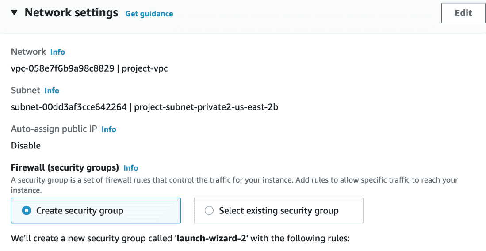

# 4

# 在 EC2 服务器上运行 Python 应用程序

在本章中，我们将学习如何在**弹性计算云（EC2）**服务中运行 Python 应用程序。EC2 是一种 AWS 服务，允许你在云中配置服务器。你可以找到不同类型的服务器选项。你需要进行一些配置并在云中运行服务器。当你有 Lambda 时，你可能想知道为什么还需要 EC2。Lambda 非常有效，但有一个持续时间限制。如果你运行函数超过 15 分钟，它将给出超时。如果你的应用程序因为一个巨大的过程需要运行几个小时会发生什么？Lambda 不起作用，你需要自己的服务器。使用 EC2 的另一个原因可能是，如果你需要非常特殊配置或安装，需要在特定服务器上完成；你也需要服务器。基于这类需求，你需要在云中拥有自己的服务器。我们将在 EC2 中配置服务器并运行 Python 应用程序。

本章涵盖了以下主题：

+   什么是 EC2？

+   EC2 购买选项

+   EC2 实例类型

+   配置 EC2 服务器

+   连接到 EC2 服务器

+   在 EC2 服务器上运行简单的 Python 应用程序

+   在 EC2 服务器上使用 Python 应用程序处理 CSV 文件

+   AWS CLI

# 什么是 EC2？

AWS EC2 是一种提供安全且可扩展的云服务器机的服务。EC2 的主要优势是，从 AWS 管理控制台管理服务器非常容易。当你配置本地服务器时，配置安全策略、磁盘管理、备份管理等并不容易。AWS 加速了所有这些。当你配置 EC2 时，AWS 提供不同的合同供你选择，所有这些类型都会影响成本。

为了选择正确的服务，你需要了解你将要使用哪些服务，你需要多少资源，以及你真正需要哪种类型的存储。这些事情将帮助你降低成本并有效地使用 EC2。

# EC2 购买选项

我们现在将探讨 EC2 合同的类型。

## 按需

在这个方案中，你不需要为特定的时间段签订合同。AWS 根据你使用服务器的时间来收费。你可以随时配置服务器、关闭它并释放服务器。这是一个按使用付费的模式。

## 保留

你需要与 AWS 签订 1-3 年的合同。需要注意的是，AWS 为保留承诺提供折扣。

## Spot

让我们想象一下，你有一个具有灵活开始和结束时间的应用程序。你可以为服务器支付任何你愿意支付的价格。让我们想象一下，你有一个运行五小时的数据处理应用程序，运行时间并不重要。你可以在月初或月末运行；这不是问题。你可以配置一个 Spot 实例，这可以显著降低你的成本。

## 专用

这在您的组织拥有软件许可证并迁移到 AWS 时很有用。这些服务器仅用于您的组织。因此，您可以保留分配给公司的许可证。

# EC2 实例类型

AWS 根据您的技术需求提供不同类型的服务器。服务器类型选择是管理您的预算并有效地使用 EC2 服务器最重要的因素之一。如果您需要使用内存处理应用程序，如 **Spark**，则最好配置一个内存优化服务器。另一方面，如果您需要一个需要更多存储的服务器，您可以使用存储优化服务器。

以下截图显示您可以在 AWS 中选择超过数百种服务器类型：


图 4.1 – EC2 实例类型 [来源 – [`aws.amazon.com/`](https://aws.amazon.com/)]

## 自动扩展

如果您需要一个集群环境，最好定义一个自动扩展策略来有效地管理资源。

让我们考虑一个每天运行一次以处理大量数据的批量处理作业。您配置了多台机器。但是当系统空闲时，您将不必要地被收费。然而，如果您定义了自动扩展策略，系统将在空闲时关闭。这种配置将降低您的成本。以下图显示了启动实例的最小大小和期望容量的最大大小：


图 4.2 – 自动扩展

自动扩展是 EC2 的最重要的功能之一。您需要考虑 EC2 的使用并配置自动扩展功能。

在本节中，我们了解了 EC2 的最重要的功能。在下一节中，我们将配置 EC2 服务器。

# 在 AWS 上配置 EC2 服务器

我们将逐步配置 EC2 服务器。有不同类型的 EC2 机器；我们将配置一个免费服务器。我建议您完成工作后终止服务器，因为我们只是将 EC2 用于学习目的。

要在 AWS 上配置 EC2 服务器，请执行以下步骤：

1.  前往 AWS 管理控制台。

1.  搜索 **EC2** 并访问标题为 **EC2** 的链接：


图 4.3 – AWS 管理控制台

1.  为了启动一个实例，点击左侧的 **实例**，然后点击 **启动实例**：


图 4.4 – 创建实例

1.  在新面板中，您可以给 EC2 实例命名。您可以看到我们将其命名为 **Test_Python**。在此启动页面上，AWS 推荐使用 Linux 机器，它位于免费层。免费层意味着您不需要向 AWS 支付费用。我们将继续使用该选项：


图 4.5 – 实例功能

1.  您现在可以看到**密钥对（登录）**面板。密钥对用于通过 SSH 密钥以安全的方式连接到服务器。为了创建一个新的 SSH 密钥，请点击**创建新** **密钥对**：


图 4.6 – 创建新的密钥对

1.  我们需要给密钥对起一个名字。除此之外，您可以将密钥对类型和私钥文件格式保留为默认设置。点击**创建** **密钥对**：


图 4.7 – 命名密钥对

一旦您点击**创建密钥对**，它将下载文件。请保留此文件；它将用于连接到机器。**密钥对名称**下拉菜单也将与您的创建一起选择。当您在上部区域创建新的密钥对时，新的密钥对名称将可见，您可以在下面的屏幕截图中看到。对于本例，我们的密钥对是**key_for_test_python**：


图 4.8 – 密钥对已就绪

在下一步中，我们将创建并分配一个**虚拟专用云（VPC）**和子网：


图 4.9 – VPC 和子网

VPC 允许 AWS 服务在逻辑隔离的网络中运行。它是保持服务安全的关键服务之一。您可以通过 VPC 配置轻松隔离服务器。以下图示说明了 VPC 和 EC2 的设置：


图 4.10 – VPC [来源 – https://aws.amazon.com/]

如您所见，一旦您将服务器之一添加到 AZ 2 的 VPC 子网中，这意味着 EC2 实例在逻辑上与其他实例隔离。因此，您可以添加访问控制以保持服务器安全。

子网也是 VPC 的一个重要组成部分。每个 VPC 都包含一个子网，它定义了 VPC 的 IP 范围。在以下图中，您可以看到每个子网的 IP 范围：


图 4.11 – 子网 [来源 – https://aws.amazon.com/]

我们已经了解了 VPC 和子网。现在，我们需要为 EC2 实例定义一个 VPC：

1.  在**AWS** **管理控制台**的搜索框中输入`VPC`：


图 4.12 – AWS 管理控制台中的 VPC

1.  点击**创建 VPC**：


图 4.13 – 创建 VPC

1.  一旦您点击按钮，在 VPC 设置下，默认选择**VPC 和更多**。此选项允许您创建带有子网的 VPC，您可以在以下屏幕截图的右侧看到。使用此选项，您可以一起创建 VPC 和子网：


图 4.14 – 添加 VPC 详细信息

1.  在此页面的底部，点击**创建** **VPC**按钮：


图 4.15 – 创建 VPC

当您点击**创建 VPC**时，VPC 开始创建，您可以看到进度状态：


图 4.16 – VPC 创建过程

创建完成后，您可以在 VPC 控制台中看到 VPC 和子网：


图 4.17 – VPC 和子网

到目前为止，我们已经创建了一个 VPC 和一个子网。我们可以继续创建 EC2：

1.  再次打开 **EC2** 启动页面。在这种情况下，VPC 和子网是默认选择的。点击 **编辑**：



图 4.18 – 网络设置

1.  为了连接到该机器，我们需要选择一个公共子网并启用 **自动分配公共 IP**。您可以在 **子网** 下拉菜单中看到公共子网选项。通常，不建议将生产应用程序放在公共子网中。由于我们正在实施测试项目，我们可以继续这样做：


图 4.19 – 启用公共 IP

1.  在页面底部，点击 **启动实例**：


图 4.20 – 启动实例

当我们点击左侧的 **实例** 链接时，我们能够看到我们创建的实例列表。恭喜，您已经创建了您的第一个服务器！


图 4.21 – 运行实例

您已成功以高效的方式创建了一个服务器。在接下来的部分，我们将连接到该服务器。

# 连接到 EC2 服务器

在这个阶段，我们将通过 SSH 连接到 EC2 服务器：

1.  在实例列表中，有一个 **连接** 按钮。点击它：


图 4.22 – 连接实例

1.  在 **SSH 客户端** 选项卡下，您可以看到连接到 EC2 机器的步骤：


图 4.23 – 连接步骤

1.  在这个例子中，我将使用 Mac 终端来通过 SSH 连接到该机器。我在示例中复制了命令并将其粘贴到终端中。您也可以使用不同的 SSH 应用程序，如 PuTTY 和 WinSCP。请确保 PEM 密钥文件位于您执行命令的同一位置，或者您已设置正确的 PEM 密钥文件路径：


图 4.24 – 通过终端连接

1.  输入 `yes` 以确认与该机器的连接：


图 4.25 – 机器确认

恭喜！您已连接到该机器。


图 4.26 – 连接到机器

您已成功连接到服务器。在下一节中，我们将安装 Python。

# 在 EC2 服务器上运行简单的 Python 应用程序

我们将在 EC2 上运行一个简单的 Python 应用程序。首先，检查 Python 版本：

1.  从命令行执行 `python --version`：


图 4.27 – 检查 Python 版本

1.  在命令行上运行 `python` 命令：


图 4.28 – 连接到 Python 编译器

1.  运行一个简单的代码片段，例如 `print 'Hello EC2'`，您将看到编译器执行该命令并打印它：


图 4.29 – 运行简单代码

我们已经执行了一个简单的 Python 应用程序。在下一节中，我们将在 EC2 上运行一个简单的项目。

# 在 EC2 服务器上使用 Python 应用程序处理 CSV 文件

在上一章中，我们在 Lambda 中处理了 CSV 文件。在本节中，我们将在 EC2 中运行相同的应用程序，但会有一些不同：

1.  登录到 EC2 机器。

1.  创建一个文件夹以保存要处理的`csv`文件。

1.  运行`mkdir csv`命令以在 Ubuntu 上创建一个`csv`文件夹：


图 4.30 – 创建文件夹

在运行`mkdir`命令后，您可以使用`ls`命令来列出您的目录。如您所见，`csv`文件夹已创建。

1.  通过执行`cd csv`来定位`csv`文件夹：


图 4.31 – 定位 csv 文件夹

1.  在 EC2 机器上创建一个示例`CSV`文件。

我已经在以下 URL 中为您上传了一个示例 CSV 文件。运行以下代码以下载示例 CSV。`wget`命令允许您从特定链接下载文件：

```py
wget https://raw.githubusercontent.com/PacktPublishing/Python-Essentials-for-AWS-Cloud-Developers/main/sample.csv
```


图 4.32 – 下载示例 CSV 文件

现在您已经下载了文件，您就可以创建 Python 代码来处理 CSV 文件。

1.  运行以下代码以下载 Python 代码：

    ```py
    wget https://raw.githubusercontent.com/PacktPublishing/Python-Essentials-for-AWS-Cloud-Developers/main/fileprocessor.py
    ```


图 4.33 – 下载 Python 代码

以下代码非常简单；代码导入`csv`库并打印 CSV 中的前五行：


图 4.34 – Python 代码

1.  下一步是运行 Python 代码以查看结果。执行`python fileprocessor.py`以运行应用程序。运行应用程序后，您将看到结果：


图 4.35 – 运行 Python 代码

在本节中，我们看到了如何在 AWS EC2 服务器中运行一个简单的 Python 应用程序。现在，我们将涉及到 Python 的 AWS SDK。

# AWS CLI

使用`awscli`访问 AWS 服务。在本节中，我们将安装`awscli`，然后配置 EC2 机器以从 EC2 上传文件：

1.  为了从`awscli`访问 S3，我们需要创建一个 IAM 角色并将其附加到 EC2。连接到 AWS 管理控制台，输入`IAM`，然后点击**IAM**：


图 4.36 – 控制台中的 IAM

1.  在左侧面板上点击**角色**，然后点击**创建角色**：


图 4.37 – 创建角色

1.  选择**EC2**作为通用用例，然后点击**下一步**：


图 4.38 – 选择服务

1.  现在，我们需要给予所需的权限。由于我们将访问 S3，请勾选**AmazonS3FullAccess**复选框。此策略将允许用户上传和读取 S3 下的对象。选择策略后，您可以点击**下一步**按钮：


图 4.39 – 选择策略

1.  给角色命名并点击**创建角色**按钮以创建角色：


(a)


(b)

图 4.40 – 命名角色

1.  在附加角色的最后一步，点击 **操作** 下拉按钮，转到 **安全**，并选择 **修改** **IAM 角色**：


图 4.41 – 添加角色

1.  在下一屏幕上，选择 **EC2ROLE**，以便附加到 EC2，然后点击 **更新** **IAM 角色**：


我们已创建并附加了所需的角色以登录到 EC2 机器：


现在，我们将文件上传到 S3。

在 EC2 机器下创建一个文件。`touch` 命令可以帮助您创建一个空文件。可选地，您也可以使用其他应用程序创建文件：


图 4.44 – 创建文件

我们可以通过 AWS CLI 将此文件上传到 S3。在上一章中，我们创建了一个 S3 桶。您可以使用此桶或创建一个新的桶来测试 AWS CLI S3 命令。让我们将文件上传到 S3 桶。上传文件的格式如下：

```py
Format : aws s3 cp from to
aws s3 cp file.txt s3://inputforlambda123
```


图 4.45 – 上传文件

我们成功上传了文件。我们能够通过控制台检查 S3 桶是否已上传。从 S3 控制台打开桶并检查：


正如您所看到的，文件已上传到 S3 桶中。

当您想通过命令访问 AWS 服务并执行一些任务时，AWS 客户端非常有用。在本节中，我们学习了如何通过命令行将文件复制到 S3 桶中，这可以节省大量时间。

# 摘要

在本章中，我们学习了 AWS EC2 服务，该服务用于在云上创建服务器。您可以以高效的方式创建服务器，并用于不同的目的，例如应用程序服务器、Web 服务器或数据库服务器。我们还创建了一个 EC2 服务器作为示例，并在 EC2 上运行了我们的 Python 应用程序。在下一章中，我们将探讨如何通过 PyCharm 调试我们的 Python 应用程序。
