# 第五章：使用 PyCharm 运行 Python 应用程序

在本章中，我们将使用 PyCharm 运行 Lambda 应用程序。在开发过程中，通过 PyCharm 运行 Lambda 应用程序既有用又实用，因为它包含代码编辑器、调试器和具有开发者友好的图形用户界面的常用开发工具。PyCharm 的这些功能帮助我们轻松地找到代码中的错误。

本章涵盖了以下主题：

+   安装 AWS Toolkit

+   配置 AWS Toolkit

+   在 AWS 中创建一个示例 Lambda 函数

+   使用 AWS Toolkit 运行 AWS Lambda 函数

# 安装 AWS Toolkit

在本节中，我们将安装 PyCharm 的 AWS Toolkit。AWS Toolkit 是 PyCharm 的一个扩展，用于开发、调试和部署您针对 AWS 的应用程序。让我们开始吧：

1.  在您的计算机上打开 PyCharm。

1.  从**PyCharm**下拉菜单中打开**首选项**并选择**插件**：

图 5.1 – 首选项

1.  在搜索区域输入 `AWS Toolkit` 并点击**安装**：

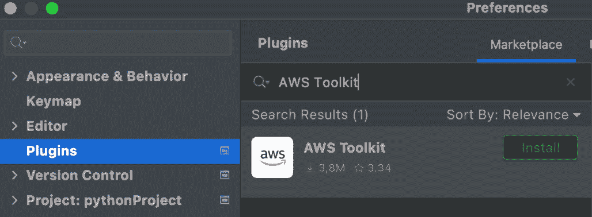

图 5.2 — 安装 AWS Toolkit

1.  安装完成后，IDE 将要求您重新启动它。点击**重新启动****IDE**按钮：

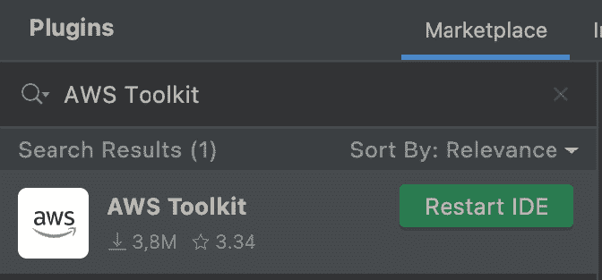

图 5.3 – 重新启动 IDE

我们已在 PyCharm 中安装了 AWS Toolkit。作为下一步，我们将配置我们 AWS 账户的凭证。

# 配置 AWS Toolkit

我们将配置 AWS Toolkit 以将其连接到我们的 AWS 账户。我们将首先设置我们 AWS 账户的凭证：

1.  重新启动 IDE 后，您将在页面右下角看到文本**AWS：未选择凭证**。点击此文本：

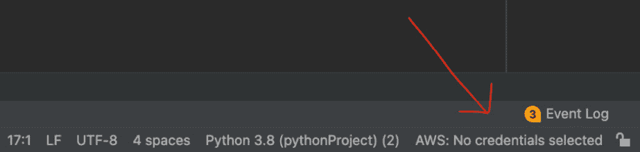

图 5.4 – AWS：未选择凭证

1.  点击后，您将看到**AWS 连接设置**菜单出现。我们现在将配置凭证。为了让 IDE 连接到 AWS，我们需要提供 AWS 访问密钥和秘密密钥：

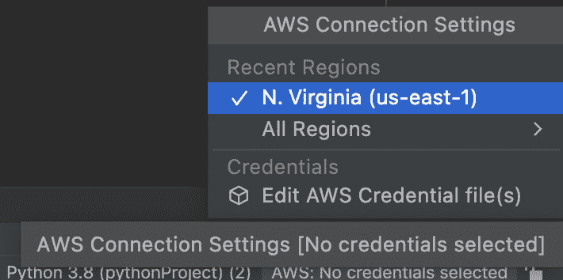

图 5.5 – 点击区域

在上一章*第四章*，*在 EC2 上运行 Python 应用程序*中，我们通过 IAM 服务创建了一个 S3User。对于我们的当前用例，我们将遵循相同的步骤来创建一个具有 Lambda 访问权限的用户：

1.  在 IAM 控制台中，添加一个名为 `ProgrammaticUser` 的用户并点击**下一步：权限**：

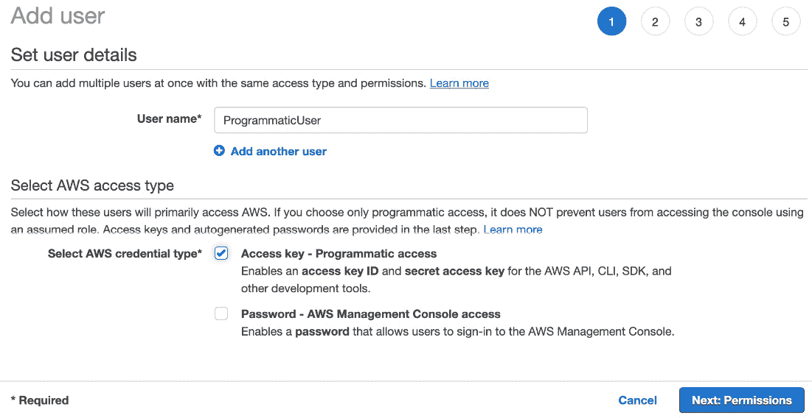

图 5.6 – 添加用户

1.  在下一个面板中，选择**AWSLambda_FullAccess**并继续创建新用户。步骤与我们在上一章中创建用户时使用的步骤相同。点击**下一步：标签**并继续：

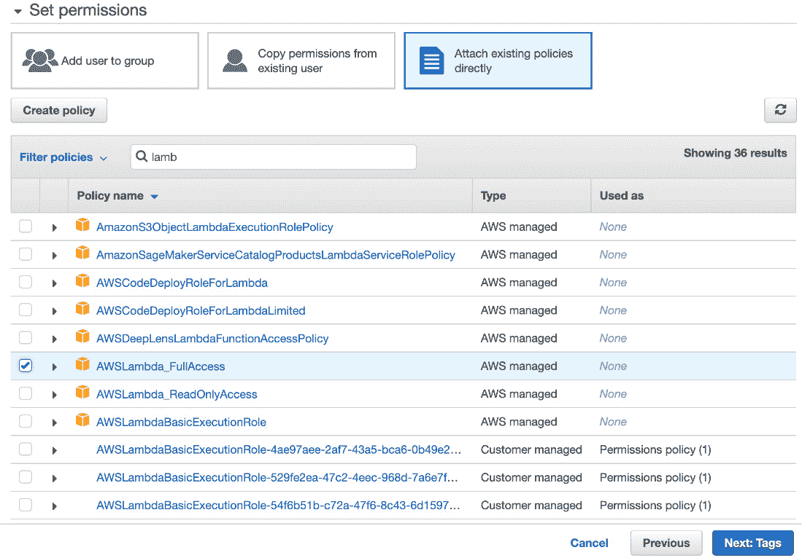

图 5.7 – 添加权限

1.  我们现在将提供 AWS 连接设置的访问密钥 ID 和秘密访问密钥。再次打开 PyCharm 并点击**编辑 AWS****凭证文件**：

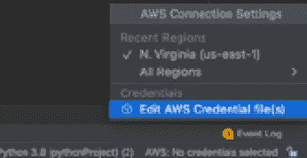

图 5.8 – 编辑凭证

1.  在随后出现的对话框中点击**创建**按钮：

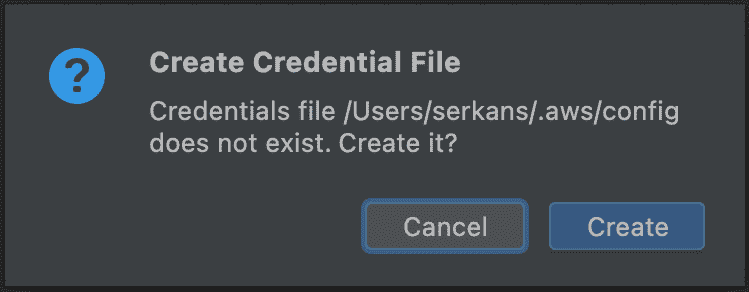

图 5.9 – 创建凭证文件

1.  一旦您点击 **创建**，您将看到一个文件，您可以在其中输入凭证。将访问密钥 ID 和秘密访问密钥放入文件并保存：

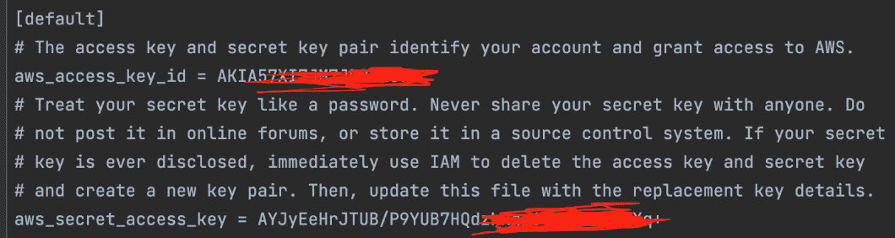

图 5.10 – 编辑凭证文件

我们已经创建了 AWS 凭证并在 PyCharm 中进行了调整。作为下一步，我们准备创建 Lambda 函数。

# 在 AWS 中创建一个示例 Lambda 函数

在这一步，我们将创建一个 Lambda 函数，用于从 S3 读取并打印文件。在上一章中，我们学习了如何创建 S3 存储桶和 Lambda 函数。因此，在这里我们简要说明：

1.  我们将把一个示例文件复制到 S3 存储桶：

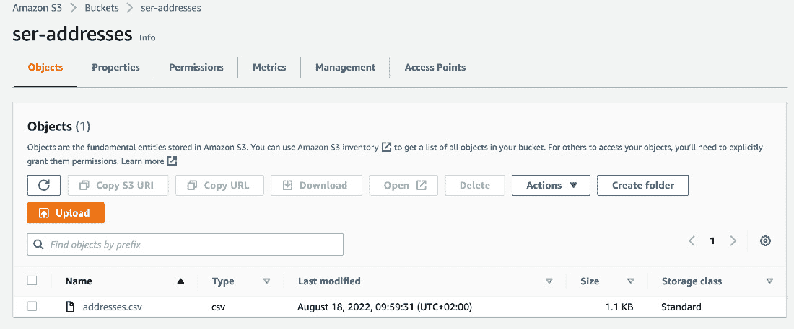

图 5.11 – S3 中的文件

1.  创建一个从 S3 读取文件的 Lambda 函数。我已经将其命名为 `FileProcessing`；然而，您可以根据自己的喜好给它起任何名字：

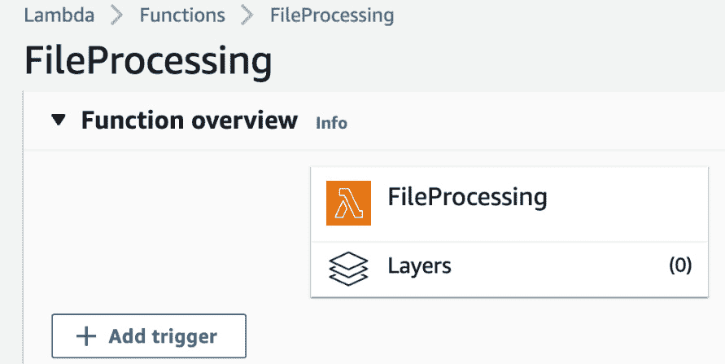

图 5.12 – Lambda 函数

1.  Lambda 函数创建完成后，我们将从图片下方的 GitHub 链接粘贴代码到 Lambda 中。在代码块中，我们将实现一个简单的函数来读取 S3 存储桶的内容并打印出来。您可以从我分享的 *Figure 5**.13* 后的 GitHub 页面获取代码块。总的来说，`s3.get_object` 方法使用 `bucket` 和 `key` 的给定参数读取文件。一旦您在 S3 中存储了文件，内容就在 `Body` JSON 文件中，最后一步是打印内容：

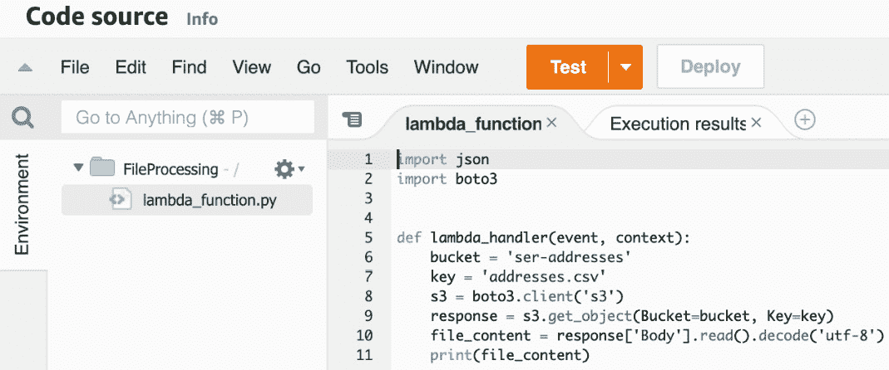

图 5.13 – Lambda 中的代码

以下 GitHub 链接包含 S3 读取应用程序的代码块：[`github.com/PacktPublishing/Python-Essentials-for-AWS-Cloud-Developers/blob/main/S3Reader.py`](https://github.com/PacktPublishing/Python-Essentials-for-AWS-Cloud-Developers/blob/main/S3Reader.py)。

1.  点击 **测试** 按钮以检查 Lambda 函数是否正在运行。当您第一次点击 **测试** 按钮时，需要配置示例事件：

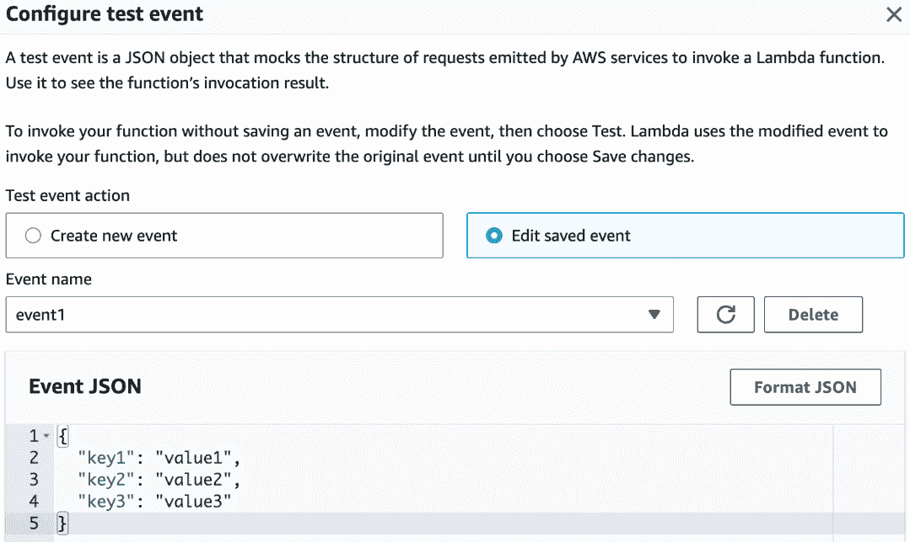

(a)

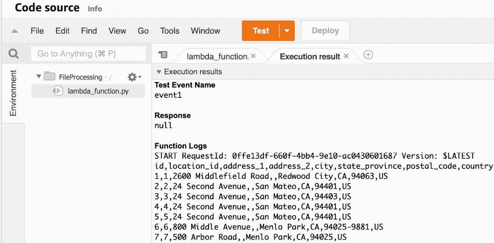

(b)

图 5.14 – 配置和测试 Lambda 函数

我们已经创建了 Lambda 函数。在下一节中，我们将通过 AWS Toolkit 在 PyCharm 中运行此函数。

# 使用 AWS Toolkit 运行 AWS Lambda 函数

在本节中，我们将通过 PyCharm 运行我们的 Lambda 函数。让我们按照以下步骤进行：

1.  在 PyCharm 的左侧打开 **AWS Toolkit**，您将能够看到 AWS Lambda 服务中定义的 Lambda 函数。看到这一点意味着我们配置的连接是有效的：

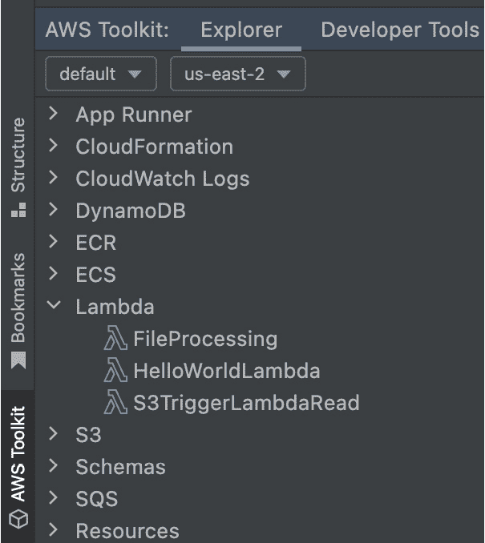

图 5.15 – 打开 AWS Toolkit 菜单

在列表中，我们可以看到我们在 **us-east-2** 区域创建的函数。我们现在准备运行上一节中创建的 Lambda 函数。

1.  右键点击**FileProcessing**，然后在出现的菜单中点击**运行‘[远程]** **FileProcess...’**按钮：

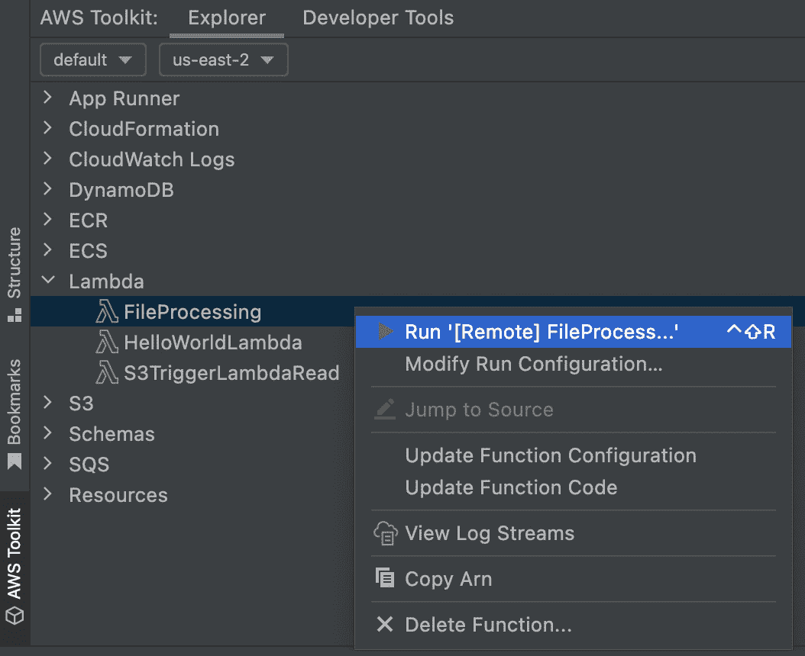

图 5.16 – 运行函数

当您点击链接时，AWS Toolkit 将通过 PyCharm 运行 Lambda 函数：

图 5.17 – 函数日志

函数运行后，PyCharm 中会出现一些 Lambda 日志。如您所见，这使得开发 AWS 的 Python 应用程序变得更加容易。您可以从本地机器测试此功能，而无需登录 AWS 管理控制台。

# 摘要

在本章中，我们学习了如何在 PyCharm 中安装和使用 AWS Toolkit。当你在 PyCharm 中以实际的方式实现和部署 AWS 服务时，这总是很有帮助。AWS Toolkit 具有 AWS 服务集成功能；因此，您无需使用 AWS 管理控制台，可以直接在本地机器上使用 PyCharm。在下一章中，我们将探讨如何将 Python 应用程序部署到 Elastic Beanstalk。
