# 6

# 在 Elastic Beanstalk 上部署 Python 应用程序

在本章中，我们将学习如何在 Elastic Beanstalk 上部署 Python 应用程序。Elastic Beanstalk 是 AWS 服务，允许您在云中部署网络应用程序。基本上，您不需要配置服务器；Elastic Beanstalk 在后台配置基础设施并部署您的网络应用程序。Elastic Beanstalk 的另一个优点是在用户请求量大时能够扩展您的网络应用程序。

本章涵盖了以下主题：

+   什么是 Elastic Beanstalk？

+   创建一个 Python 网络应用程序

+   在 Elastic Beanstalk 上部署简单的 Python 网络应用程序

# 什么是 Elastic Beanstalk？

Elastic Beanstalk 是 AWS 服务，用于在云中部署网络应用程序。它支持多种网络应用程序框架，如 Python、Java、.NET、PHP、Node.js、Ruby 和 Go。一旦部署了您的应用程序，Elastic Beanstalk 就会管理基础设施以部署、运行、扩展和监控应用程序。

## Elastic Beanstalk 的功能

让我们来看看 Elastic Beanstalk 的高级功能：

+   它支持监控和日志记录；因此，您可以轻松跟踪应用程序的行为。例如，如果应用程序崩溃，您可以通过 Elastic Beanstalk 进行检查。

+   它管理基础设施的更新。在某些情况下，您的应用程序应该使用 Python 或其他库的最新改进进行更新，而 Elastic Beanstalk 与您一起管理更新。

+   它管理向上和向下扩展的功能；因此，如果您的应用程序有太多的请求，它会添加更多资源，您的应用程序可以满足这些请求。另一方面，如果需求较少，它会减少资源，有助于降低成本。

+   它支持一些财务数据或受保护的健康信息标准；因此，您可以使用 Elastic Beanstalk 用于财务应用程序以及健康信息应用程序。

我们已经了解了 Elastic Beanstalk 的基本功能，现在我们将开始使用 Python 实现一个示例网络应用程序，并通过 Elastic Beanstalk 进行部署。

# 创建一个 Python 网络应用程序

我们将使用 Python 创建一个示例网络应用程序。为此，**Flask**将作为 Python 的网络应用程序框架。

Flask 是一个用 Python 编写的网络应用程序框架。它具有作为初学者开始实现网络应用程序所需的库。在下面的代码块中，您可以看到一个使用 Flask 的示例“**Hello, World!**”网络应用程序：

```py
from flask import Flask
app = Flask(__name__)
@app.route('/')
def hello_world():
    return 'Hello, World!'
```

代码导入 Flask 库，并在本地主机端口`5000`上运行应用程序。当您运行它时，您将在浏览器中看到“**Hello World!**”。

您还可以在以下网站上查看 Flask 框架：[`flask.palletsprojects.com/en/2.2.x/`](https://flask.palletsprojects.com/en/2.2.x/)。

作为下一步，我们将部署一个 Python 网络应用程序到 Elastic Beanstalk。

# 在 Elastic Beanstalk 上部署 Python 网络应用程序

在本节中，我们将部署一个示例 Python 网络应用程序到 Elastic Beanstalk：

1.  在 AWS 管理控制台搜索框中输入`Elastic Beanstalk`并点击**Elastic Beanstalk**：

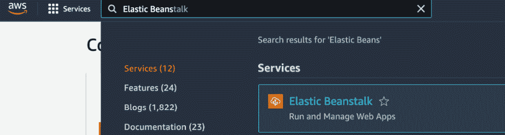

图 6.1 – AWS 控制台

你将看到 Elastic Beanstalk 的主页：

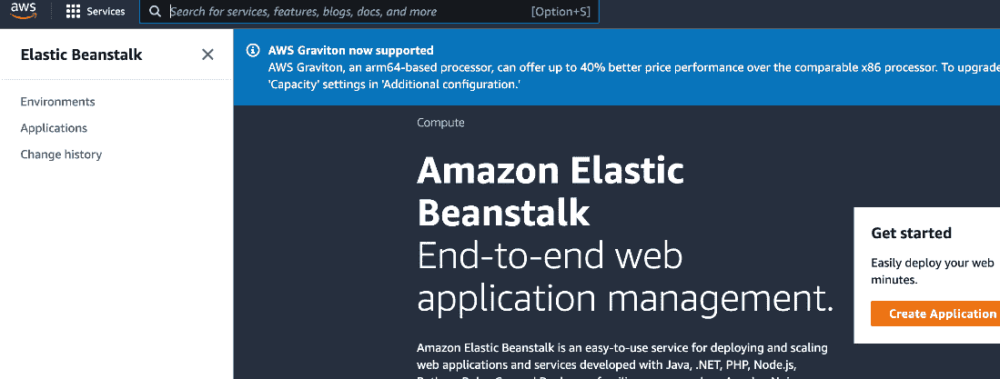

图 6.2 – Elastic Beanstalk

1.  在左侧点击**环境**以创建一个新的 Python 网络应用程序，然后点击**创建新** **环境**按钮：

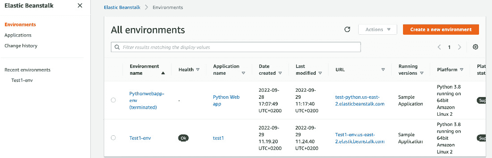

图 6.3 – 环境列表

1.  在下一个面板中，我们将选择我们想要的环境类型。由于我们想要部署网络应用程序，请选择**Web** **服务器环境**：

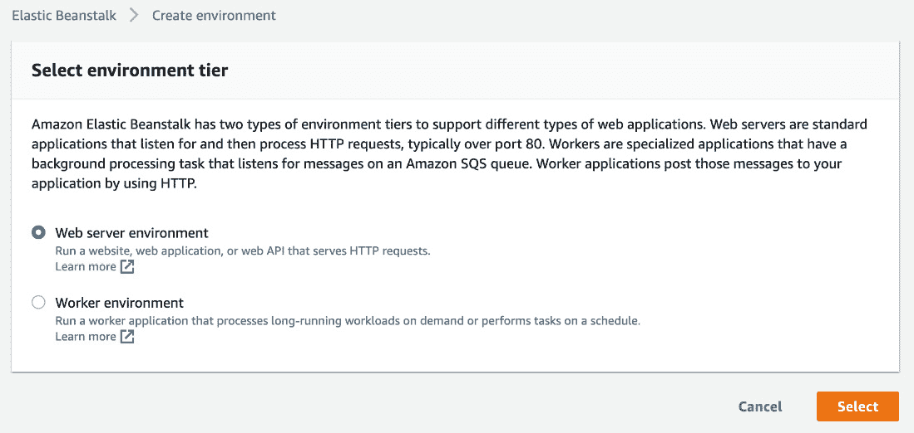

图 6.4 – 选择环境

1.  我将文件命名为`Python Web app`。你可以将其命名为任何你想要的名称：

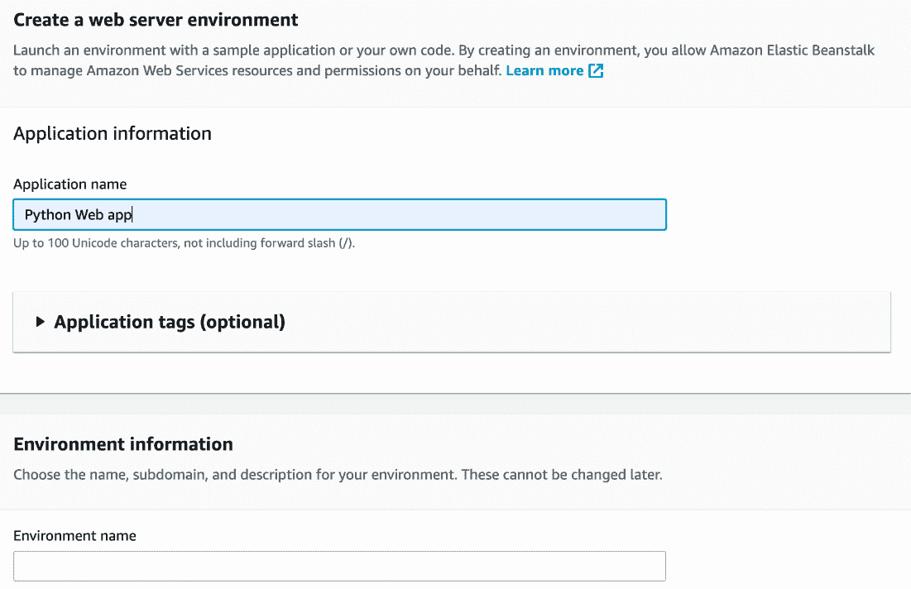

图 6.5 – 命名应用程序

1.  在命名应用程序后，向下滚动并填写**环境名称**输入字段。请注意，这也可以由 AWS 控制台默认命名。你有权更改它。

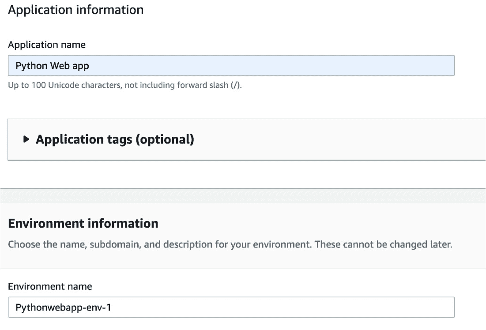

图 6.6 – 环境名称字段

1.  当你继续向下滚动时，还有一个输入字段需要填写 – `test-training`，并通过点击**检查** **可用性**按钮来检查其可用性：

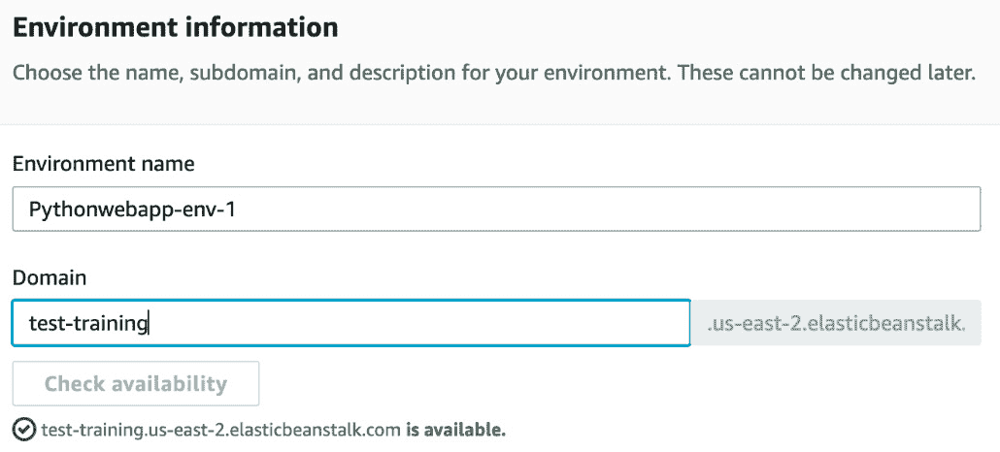

图 6.7 – 命名域名

1.  一旦找到可用的域名，向下滚动，找到**平台**面板。在这个面板中，我们需要选择网络应用程序框架。Elastic Beanstalk 支持不同的网络环境，如 Java、PHP、Node.js、Python 等。我们将选择 Python 平台来部署 Python 网络应用程序。根据你正在使用的 Python 平台，你可以从**平台分支**字段中选择它。在这个例子中，我选择了**在 64 位 Amazon Linux 2 上运行的 Python 3.8**版本。**平台版本**包含根据平台的一些更新和补丁。你可以使用最新版本；例如，如果 AWS 发现安全补丁，它将创建一个新版本：

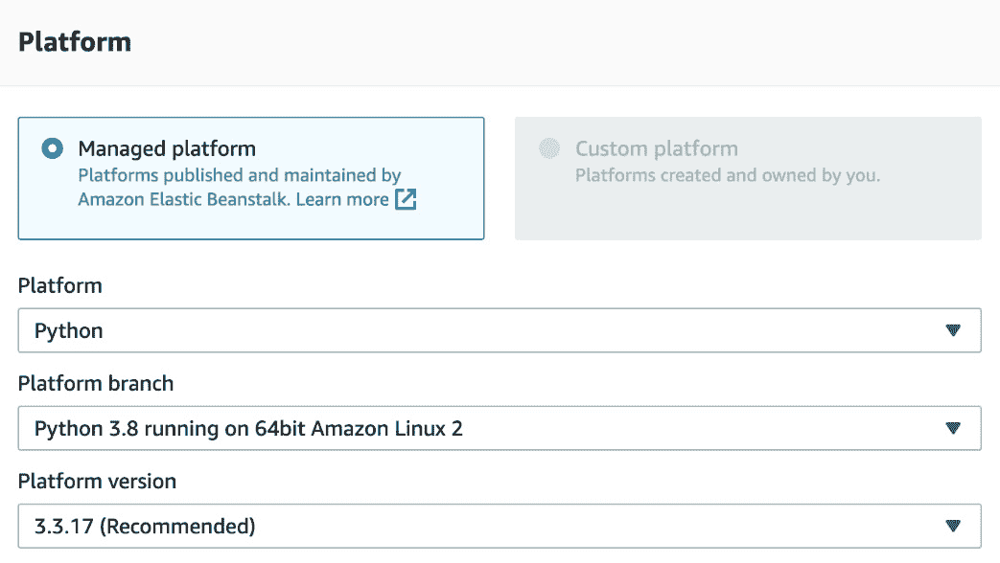

图 6.8 – 选择平台

1.  向下滚动，你将看到页面上的最新面板。在这个例子中，我们将进行**示例应用程序**并点击**创建环境**：

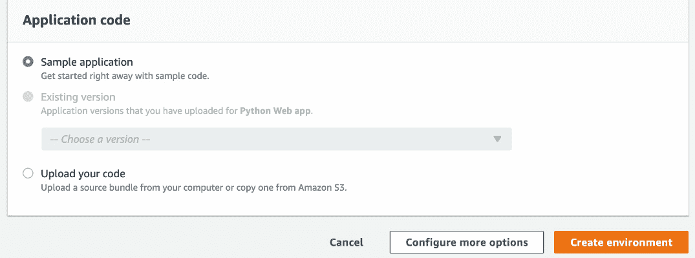

图 6.9 – 完成平台

1.  一旦点击**创建环境**，你将看到日志。Elastic Beanstalk 创建平台并部署示例应用程序：

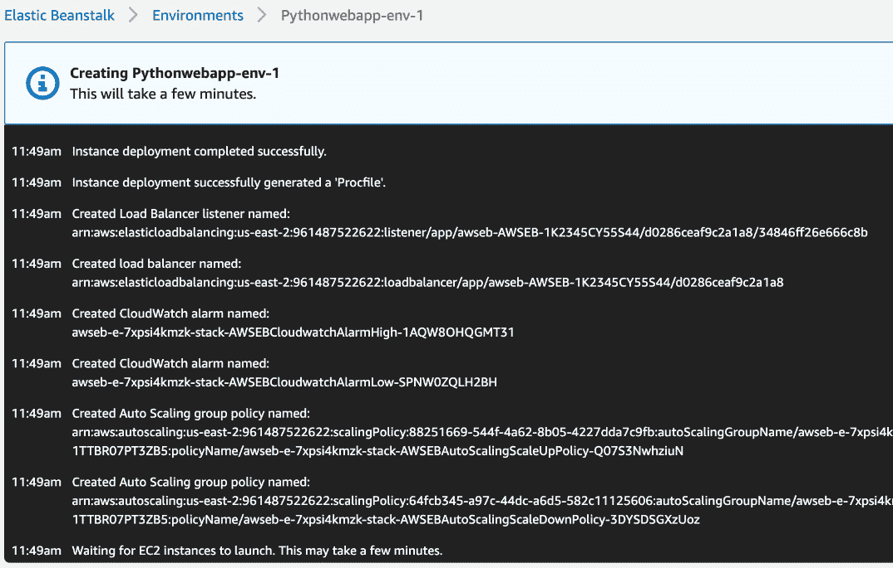

图 6.10 – 平台日志

等待几分钟，以便应用程序部署完成。一旦部署完成，你将看到以下屏幕：

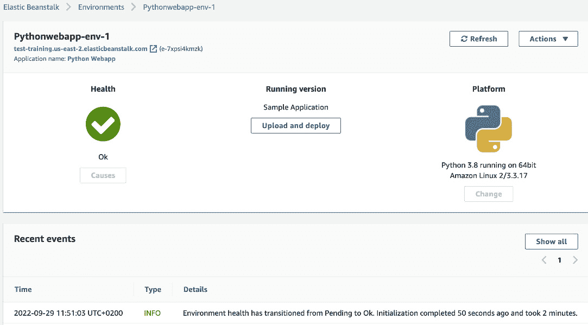

图 6.11 – 应用程序部署

样例应用似乎已成功部署并正常运行。点击域名链接查看运行中的应用。在前面的屏幕截图中，域名链接是[test-training.us-east-2.elasticbeanstalk.com](http://test-training.us-east-2.elasticbeanstalk.com)：

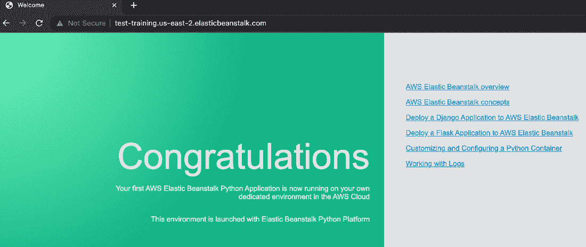

图 6.12 – 应用

恭喜！您已将示例网络应用部署到云端。

在本例中，我们将示例应用部署到了 Elastic Beanstalk。该示例网络应用由 AWS 实现。作为下一步，我们将实现一个简单的 Python 网络应用，并通过 Elastic Beanstalk 进行部署：

1.  在 AWS 中打开 Elastic Beanstalk 服务。

1.  点击左侧的**环境**，查看环境列表。在上一节中，我们创建了一个环境并部署了示例应用。在本例中，我们将使用相同的 Python 网络环境：


图 6.13 – 环境

1.  在列表中点击**Pythonwebapp-env-1**，因为它支持 Python 网络应用。根据命名约定，您的环境可能不同：

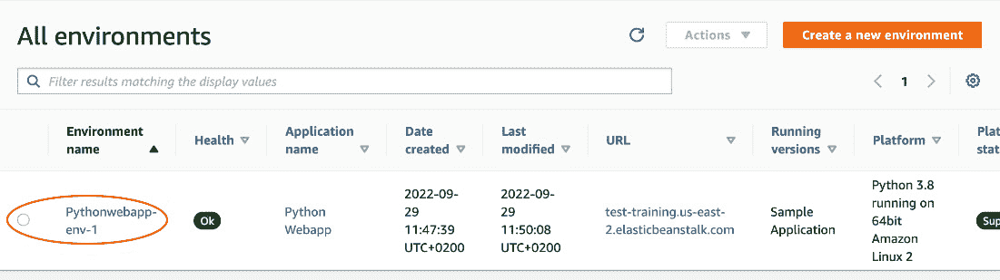

图 6.14 – Python 所有环境

1.  点击**上传和部署**按钮以遵循部署过程：

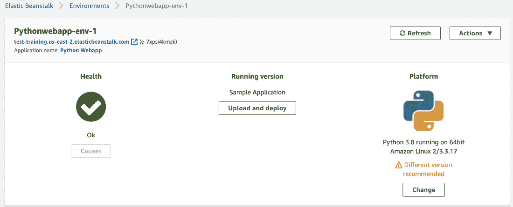

图 6.15 – Python 网络环境

1.  在**上传和部署**窗口中，点击**选择** **文件**按钮：

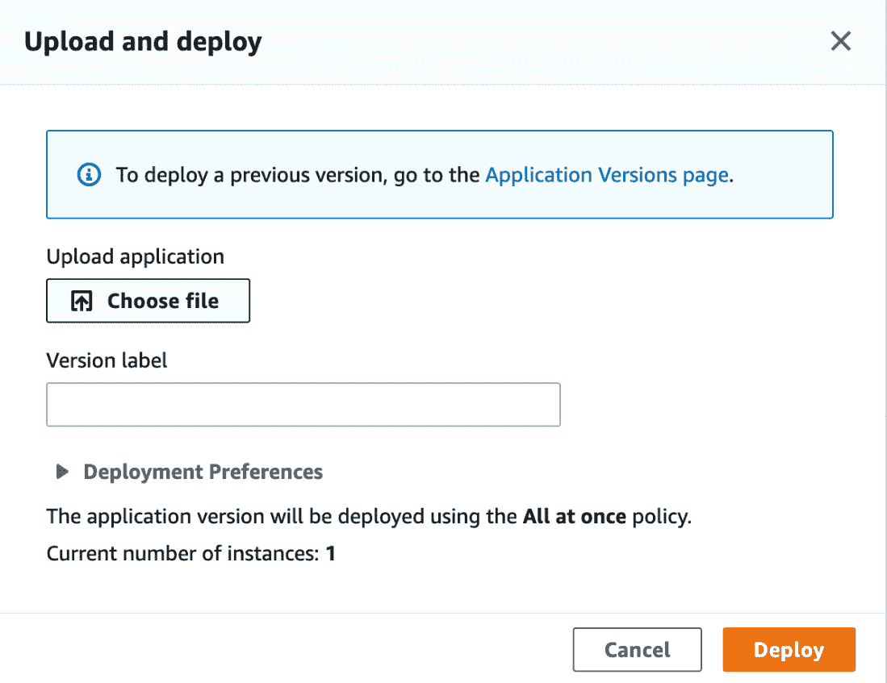

图 6.16 – 部署环境

一旦点击**选择文件**按钮，你的 Python 网络应用将被部署到 Elastic Beanstalk。

如您在以下屏幕截图中所见，您将选择本地文件夹：


图 6.17 – 本地文件夹

您可以部署您喜欢的任何 Python 网络框架，例如 Flask、Django 等。

在本节中，我们学习了如何将自定义 Python 网络应用部署到 Elastic Beanstalk。

# 摘要

在本章中，我们了解了 AWS Elastic Beanstalk 服务以及如何在云中创建 Python 网络环境。当您在云中部署网络应用时，Elastic Beanstalk 非常有用。它具有可扩展性、日志记录和监控优势。在下一章中，我们将探讨如何通过 CloudWatch 监控我们的应用。

# 第三部分：实现 Python 的有用 AWS 服务

在本部分，您将深入了解其他 AWS 服务，用于 Python 编程，例如监控、创建 API、数据库操作和与 DynamoDB 的 NoSQL。

这部分包含以下章节：

+   *第七章*，*通过 CloudWatch 监控应用*

+   *第八章*，*使用 RDS 进行数据库操作*

+   *第九章*，*在 AWS 中创建 API*

+   *第十章*，*使用 Python 与 NoSQL (DynamoDB)*

+   *第十一章*，*使用 Python 与 Glue*

+   *第十二章*, *AWS 参考项目*
