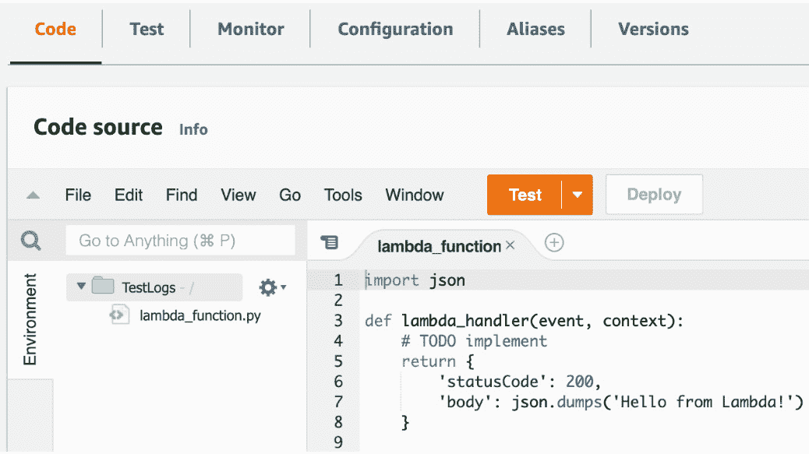

# 7

# 通过 CloudWatch 监控应用程序

在本章中，我们将学习 AWS 的一个重要服务之一，CloudWatch。CloudWatch 是一个无服务器服务，允许你在 AWS 内部收集和监控应用程序日志。它与大多数 AWS 服务有广泛的集成。当你开始使用任何 AWS 服务时，它有助于通过 CloudWatch 工具观察应用程序。

在本章中，我们将涵盖以下主题：

+   什么是 CloudWatch？

+   通过 CloudWatch 收集 Lambda 日志

+   CloudWatch 日志洞察

+   CloudWatch 警报

# 什么是 CloudWatch？

当你部署任何应用程序时，跟踪它是否满足关于可用性、性能和稳定性的预期是很重要的。可能应用程序中发生了问题。重要的是要注意，一些 AWS 服务可能处于关闭状态或运行不正确。从客户的角度来看，这是一个非常糟糕的体验，最好在客户发现这些问题之前观察这些问题。如果你通过 AWS 服务维护应用程序，你需要使用 CloudWatch 来监控你的应用程序以观察它们的行为。

CloudWatch 是 AWS 的一个监控服务；它提供了不同的功能来观察应用程序。CloudWatch 的功能如下：

+   从 Lambda 和 EC2 等 AWS 服务收集和存储日志。

+   提供一个仪表板来监控指标和日志。

+   创建警报的能力。例如，如果一个应用程序在服务器上消耗了大量的内存，你可以创建一个警报以便被通知。

+   关联不同指标的能力。例如，你可以聚合 EC2 内存日志和 CPU 日志，以获得更好的整体情况视图。

+   利用基于机器学习的 CloudWatch 异常检测功能检测异常行为。

# 通过 CloudWatch 收集 Lambda 日志

在这个主题中，我们将部署一个简单的 Python 函数，以便通过 CloudWatch 服务调查日志。让我们一步一步来做：

1.  在 AWS 中创建一个 Lambda 函数。在*第三章*，我们介绍了 Lambda，Lambda 部署的基本步骤被解释了。因此，在这里，我们将提供 Lambda 步骤的摘要。Lambda 函数的名称是`TestLogs`：


图 7.1 – 创建 Lambda 函数

1.  Lambda 函数创建了一个基本模板，如下所示：



图 7.2 – Lambda 模板

1.  将以下代码块复制到处理器：

    ```py
    import json
    import os
    def lambda_handler(event, context):
        print('ENVIRONMENT VARIABLES')
        print(os.environ)
        return {
            'statusCode': 200,
            'body': json.dumps('Hello from Lambda!')
        }
    ```

`os`将导入操作系统模块；因此，你可以通过日志打印(`os.environ`)变量查看环境变量。一旦我们添加了代码块，Lambda 代码应该如下所示：


图 7.3 – 带日志的 Lambda

1.  接下来，点击**部署**按钮将最新的更改部署到 Lambda，并点击**测试**按钮。在测试 Lambda 函数后，你能够看到执行结果：


图 7.4 – 执行结果

让我们使用 CloudWatch 服务来调查日志：

1.  从 AWS 管理控制台打开 CloudWatch 服务：


图 7.5 – CloudWatch 服务

1.  在左侧面板的 **日志** 下拉菜单中点击 **日志组**：


图 7.6 – CloudWatch 日志组

1.  一旦点击 **日志组**，你将看到一个列表。这个列表代表了创建日志的运行中的 AWS 服务。在这个列表中，找到你运行的 Lambda 函数：


图 7.7 – 日志列表

1.  点击 **/aws/lambda/TestLogs**。新页面包含 Lambda 创建的日志。你可以看到一个日志流。当 Lambda 函数运行时，日志将创建在这个列表中。列表的顶部，你可以看到最新的日志：


图 7.8 – Lambda 的日志页面

让我们点击 **日志流** 下的最新链接：


图 7.9 – 日志流

点击链接后，你可以看到 Lambda 创建的详细日志：


图 7.10 – Lambda 日志

这个列表显示了日志的概览。当你点击左侧的向下箭头时，面板将展开，你可以调查详细的日志。在 Lambda 中，我们已经记录了 Lambda 的操作系统变量。因此，你会看到一些详细信息，例如区域、内存大小和语言：


图 7.11 – 日志详情

恭喜！你现在可以通过 CloudWatch 服务调查 Lambda 日志了。使用 CloudWatch 调查任何 AWS 服务的日志都非常简单。在下一个主题中，我们将学习一些关于过滤日志的小技巧。

# CloudWatch 日志洞察

在这个主题中，我们将查看 **日志洞察**。如果你有大量的日志行，搜索和找到你正在寻找的相应日志并不容易。对于这个用例，日志洞察就派上用场了。CloudWatch 日志洞察允许你使用过滤功能搜索日志。让我们看看日志洞察如何帮助我们搜索日志：

1.  在左侧面板的 **日志** 下拉菜单中点击 **日志洞察**：


图 7.12 – 日志洞察

1.  选择你想要调查的日志。在上一个示例中，我们运行了 TestLogs Lambda 函数，我这里也选择了那个：


图 7.13 – 日志洞察窗口

1.  一旦选择，你就可以看到默认的查询：


图 7.14 – 日志洞察过滤器

1.  点击 `fields` 表示将要列出的列，而 `sort` 关键字表示排序方法，你可以使用 `limit` 关键字只查看 20 条记录：


图 7.15 – 日志

让我们在消息中添加一个额外的过滤器来搜索关键词。你可以使用以下查询格式：

```py
fields @timestamp, @message
| filter @message like /AWS_DEFAULT_REGION/
| sort @timestamp desc
| limit 20
```

使用此查询，我们搜索包含 `AWS_DEFAULT_REGION` 的日志。粘贴并再次点击 **运行查询**。查询运行后，您将看到消息行减少：


图 7.16 – 过滤后的日志

当您展开消息时，您将找到您要查找的内容——在本例中是 `AWS_DEFAULT_REGION`：


图 7.17 – 详细日志

如您所见，日志洞察功能在搜索和过滤大量日志块中的日志方面非常有帮助。在下一个主题中，我们将探讨如何创建一个警报。

# CloudWatch 警报

AWS 拥有超过 100 个服务，控制所有服务的行为了解起来并不容易。如果您的一些 AWS 服务达到特定的指标，您需要得到通知。在*第四章*中，我们介绍了如何使用 EC2 服务创建服务器。例如，您为 EC2 服务定义了一个服务器，有时其 CPU 使用率会超过 90%，导致一些性能问题。另一个例子是，如果您在 AWS 中超过特定成本，可以添加通知。对于这类场景，您可以定义一个指标，如果达到该指标，您将通过电子邮件收到通知。

在这个主题中，我们将创建一个警报，以在一个月内 AWS 成本超过 10 美元时通知我们。让我们实现这个应用程序：

1.  在 **CloudWatch** 窗格下的 **警报** 下拉菜单中点击 **在警报中**：


图 7.18 – 在警报中

1.  点击 **创建警报**。您可以选择右侧或底部的按钮：


图 7.19 – 创建警报

1.  点击 **选择指标** 按钮：


图 7.20 – 选择指标

1.  一旦您点击 **选择指标** 按钮，您将能够看到一系列用于缩小指标范围的类别：


图 7.21 – 指标类型

在此列表中，您可以查看不同类型的指标。**计费**允许您定义与成本相关的指标，而**Lambda**允许您定义与 Lambda 相关的指标。在这个例子中，我们将为我们的 AWS 账户定义一个月度预算。目标是如果我们的月度成本超过特定阈值，则接收警报：

1.  从类别中选择 **计费**：


图 7.22 – 计费类别

1.  点击 **总估计费用**。目的是如果您的总月度 AWS 成本超过目标预算，则定义一个指标：


图 7.23 – 总估计变化

1.  从列表中选择 **USD** 并点击 **选择指标**。货币类型可能因您的 AWS 账户而异：


图 7.24 – 货币类型

在下一屏幕上，转到**定义阈值值**字段。对于此示例，我添加了**10**，这意味着如果一个月的总成本超过 10 美元，则会激活警报。在此面板中，您还可以更改货币类型、计算类型等。在这种情况下，最重要的值是定义目标预算以接收警报。完成此操作后，点击**下一步**按钮：


图 7.25 – 阈值值

1.  在下一面板中，我们将定义警报端点。在这种情况下，我们选择了**创建新主题**单选按钮。**简单通知服务**（**SNS**）用于在服务和最终用户之间进行通信。这是在**发送通知到以下 SNS**下的一个选择。一旦我们选择**创建新主题**，我们就可以在**以下电子邮件端点将接收通知…**部分定义一个电子邮件地址。SNS 是一个访问点，用于过滤消息以便将它们发送到不同的订阅者，如 Lambda 或电子邮件。您可以保留主题名称不变；它与 SNS 主题名称相同。完成操作后，点击**创建主题**：


图 7.26 – 接收器

1.  点击**创建主题**后，AWS 将创建一个端点以发送电子邮件：


图 7.27 – 创建端点

现在，您有一个端点，可以通过点击**下一步**按钮继续操作。

1.  下一步是定义警报名称。在这种情况下，我将其命名为`BillingAlarmGreaterThan10`，因为如果计费成本超过 10 美元，则会发送警报：


图 7.28 – 命名警报

1.  下一步是检查输入并点击**创建警报**：


图 7.29 – 创建警报

1.  如果您成功创建了警报，您将被重定向到**警报**列表以查看您创建的警报。我们可以如下查看警报：


图 7.30 – 计费警报类型

在本主题中，我们创建了一个警报。如果需要为 AWS 服务行为创建通知，警报非常有用。此示例将在达到定义的成本限制时发送通知。

# 摘要

在本章中，我们学习了 AWS CloudWatch 服务以及如何在 AWS 中调查服务日志。CloudWatch 对于日志记录非常有用；它还允许您定义一些指标和警报以监控服务。在下一章中，我们将查看 AWS 中的数据库操作。
