# 第八章：使用 RDS 进行数据库操作

在本章中，我们将学习**Amazon 关系数据库服务**（**Amazon RDS**）的基础知识，并创建一个 RDS 实例以进行数据库操作。您可以使用 RDS 在 AWS 中创建最流行的数据库。您可以在云上创建具有可伸缩能力的 Oracle、MySQL 或 MS SQL 数据库。通常，当您需要创建数据库时，您必须使用本地系统管理基础设施。管理硬件和基础设施、安装数据库以及监控可能需要大量努力来设置。AWS 允许您选择您想要的数据库类型，然后通过简单的点击按钮创建它——这就是全部：

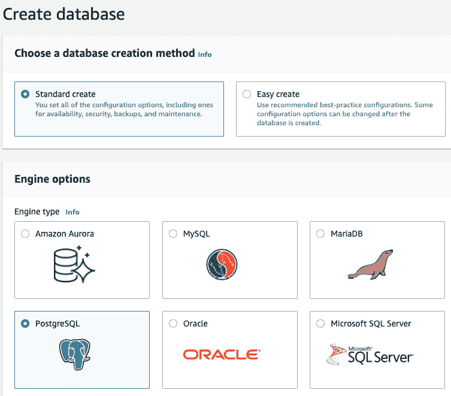

图 8.1 – 点击创建

在本章中，我们将使用 Python 创建数据库并执行一些操作。本章涵盖了以下主题：

+   RDS 的功能

+   配置 RDS

+   连接到 RDS

+   在数据库中创建表

+   使用 Python 进行数据库操作

+   密钥管理器

# RDS 的功能

RDS 具有不同的功能，便于数据库的创建和维护。让我们看看最重要的功能：

+   **易于使用**：您可以通过 AWS 控制台轻松创建和维护 RDS。它还允许我们使用一些 API 功能进行一些程序化操作。例如，您可以创建和扩展数据库，并监控其使用情况。

+   **可伸缩性**：RDS 支持可伸缩性；如果需要支持更多容量，您可以轻松扩展数据库。然而，如果容量低于您的估计，您可以通过*缩容请求*来减少容量以降低成本。另一个选项是 Amazon Aurora，它允许云用户实现更高性能密集型应用，这些应用支持**关系数据库管理系统**（**RDBMS**）。

+   **备份**：在基础设施出现任何问题时，数据库备份非常重要。在某些情况下，备份用于创建新的数据库。RDS 支持手动和自动备份。您可以在任何时候创建快照，或者 RDS 可以定期进行快照。通常，快照存储在 AWS S3 桶中。

+   **多可用区部署**：RDS 可以在不同的位置提供可用性，以提高可用性。如果某个位置的基础设施出现故障，RDS 可以在另一个位置提供服务以提高可用性。这种方法适用于使用云数据库的关键应用。

+   **监控**：对于关键应用，监控非常重要。您可以跟踪数据库的行为，并查看是否存在任何问题。RDS 有一个支持监控的功能。例如，您可以跟踪数据库中何时发生 I/O 问题，并采取适当的行动。

+   **成本选项**：AWS 为使用数据库提供了不同的定价选项。其中一种流行的选项是*按量付费*选项。在此选项中，你不需要承诺任何长期合同。你只需为特定时期内使用的资源付费。因此，你可以按月支付账单。在其他选项中，你与 AWS 签订了一段时间的合同；然而，在这种情况下，即使你不使用数据库，你也必须为合同付费。

# 配置 RDS

在本节中，我们将创建一个云上的示例关系型数据库。为了在 AWS 上配置 RDS，执行以下步骤：

1.  打开 AWS 控制台，在搜索框中输入`rds`：

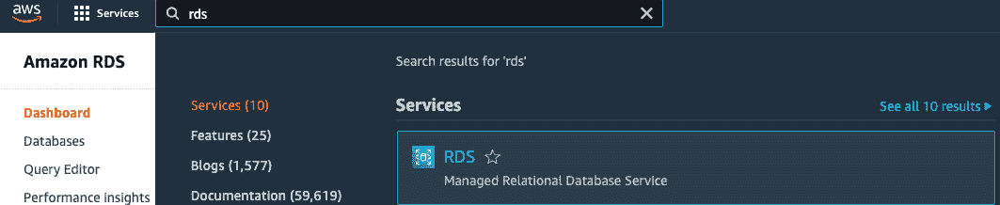

图 8.2 – 控制台上的 RDS

1.  在左侧面板中点击**数据库**以查看数据库列表。要创建新数据库，点击**创建数据库**：

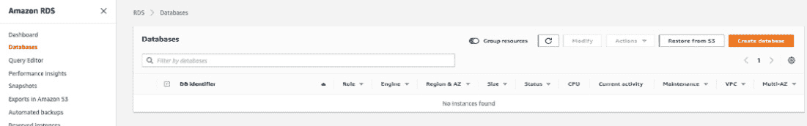

图 8.3 – 数据库列表

1.  在新面板上，点击**创建数据库**，并填写新数据库所需的信息。RDS 支持多种数据库类型，如 Amazon Aurora、MySQL、MariaDB、PostgreSQL、Oracle 和 Microsoft SQL Server。在本例中，我们将使用**MySQL**：

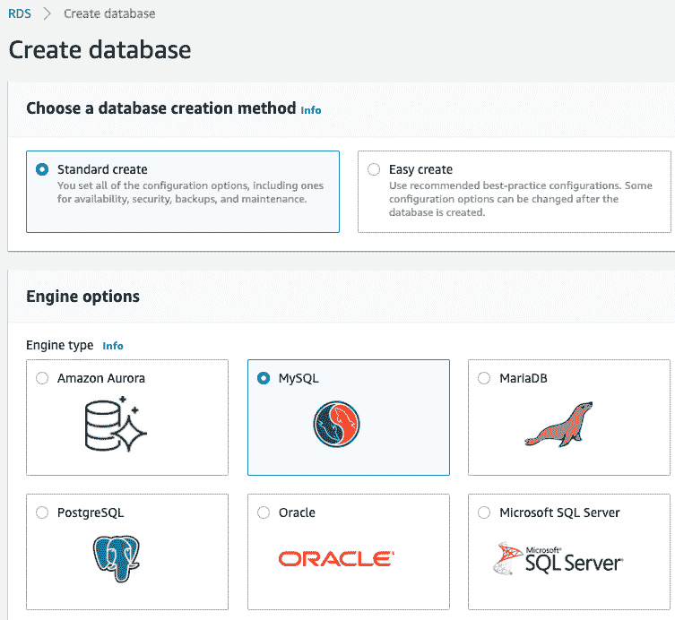

图 8.4 – MySQL 选择

1.  选择**MySQL**后，向下滚动并选择正确的 MySQL 版本。在本例中，我们将使用最新版本之一，**MySQL 8.0.28**：

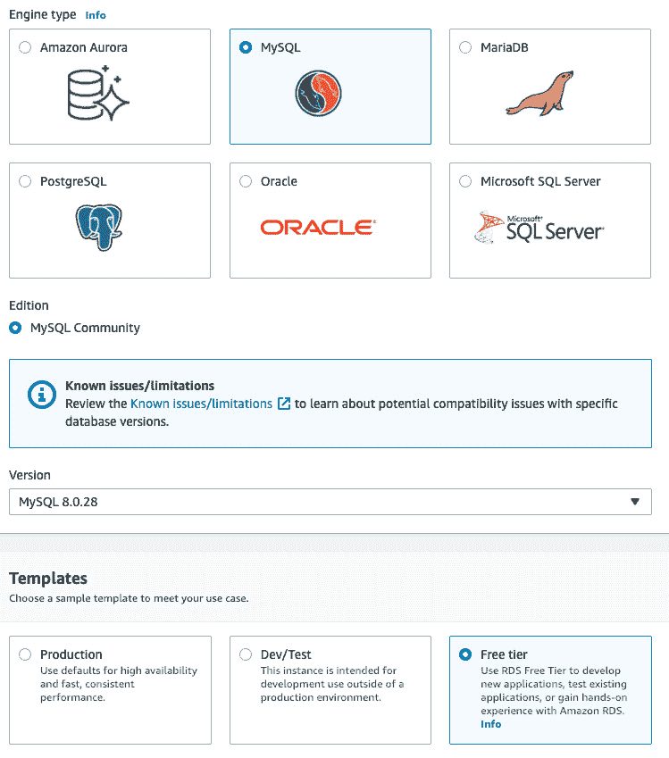

图 8.5 – 模板选择

1.  模板对于在不同的环境中工作很有用。当你选择**生产**模板时，它为你提供高可用性。在本例中，我们将选择**免费层**模板以避免任何费用。

1.  向下滚动并填写**设置**详细信息。在**设置**面板中，你需要填写数据库标识符、用户名和密码：

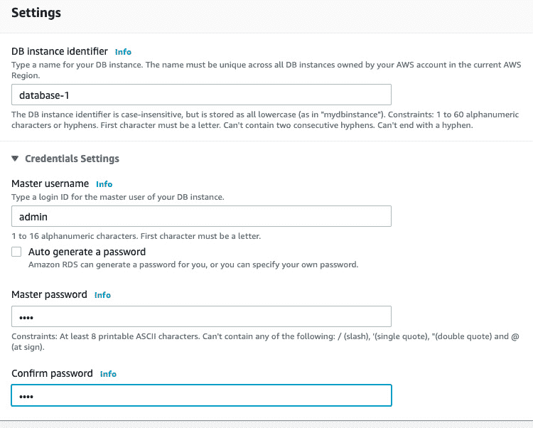

图 8.6 – 设置

**DB 实例标识符**用于在云中表示数据库名称。你还可以输入**主用户名**和**主密码**详细信息。这些凭证对于安全性很重要。

向下滚动并填写有关存储和实例配置的详细信息。

1.  在**实例配置**中，在**DB 实例类别**中，你可以选择处理器和内存类型。由于我们是为教育目的创建它，你可以选择具有基本硬件特征的简单实例类型。对于**存储**，你也可以保留 AWS 推荐的内容或使用最小值。

在**存储类型**中，你可以选择磁盘类型。在**分配存储**中，你必须指定磁盘的限制。对于本例，我们选择了**200** GiB。如果需要扩展磁盘，你可以勾选**启用存储自动扩展**复选框。

当磁盘扩展时，你在`1000`中输入的值：

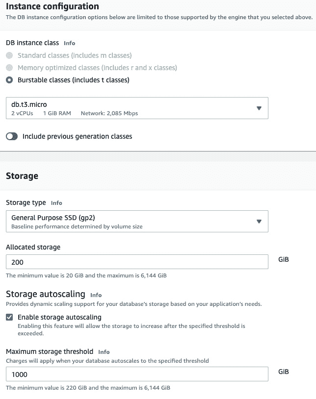

图 8.7 – 实例配置（第一部分）

向下滚动并填写有关**连接性**的详细信息。

1.  在第一个选项中，AWS 询问你是否想连接到 EC2。对于此示例，我们不需要连接到 EC2，所以我们选择**不连接到 EC2 计算资源**。（在设置数据库后，我们将使用 Lambda 进行数据库操作。）RDS 需要在 VPC 中创建，所以在**虚拟私有云（VPC）**中，我们选择**创建新的 VPC**，它将自动创建一个 VPC。

另一个选项是选择**DB 子网组**。这允许你定义哪个 IP 组将要连接到数据库。在安全方面也很重要。你可以使用此选项限制 IP 范围。

**公共访问**允许你通过互联网启用访问。对于此应用程序，我们将使用公共访问。然而，当你设置生产数据库为公共时，你需要小心。

**连接性**的最后一个选项是选择**VPC 安全组（防火墙）**中的组。在这种情况下，你可以定义与 RDS 连接的相同安全组：

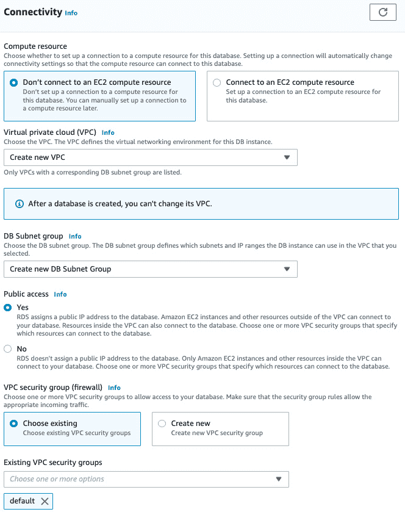

图 8.8 – 实例配置（第二部分）

滚动并填写数据库端口信息。

1.  MySQL 的`3306`，但你也可以更改它：

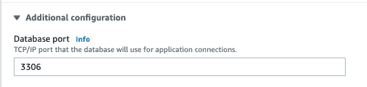

图 8.9 – 数据库端口

滚动并填写认证详细信息。

1.  **数据库认证**用于定义密码管理的方法。你可以仅使用密码，密码与 IAM 认证的组合，或密码与 Kerberos 认证的组合进行连接。让我们保持简单，只使用**密码认证**：

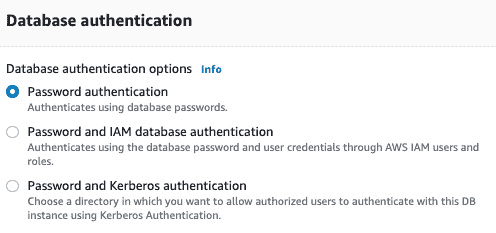

图 8.10 – 数据库认证

滚动并填写有关数据库创建的详细信息。

1.  作为最后一步，你可以保持其他值不变。点击**创建数据库**并继续创建数据库：

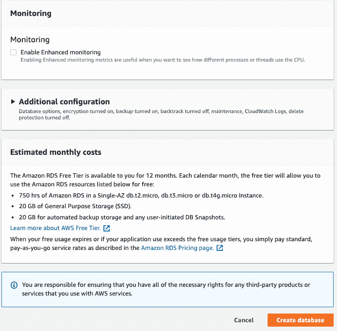

图 8.11 – 数据库创建

这将带你去**数据库**列表，在那里你可以看到数据库正在创建中：

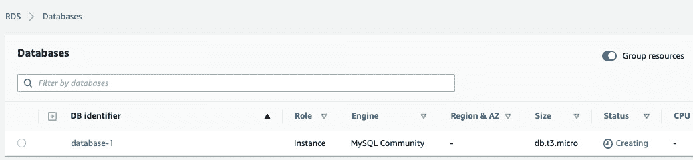

图 8.12 – 正在创建状态的数据库列表

经过一段时间，你可以看到数据库已准备好使用：

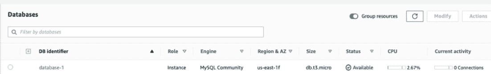

图 8.13 – 可用状态的数据库列表

我们将从我们的电脑连接。为了连接到数据库，我们需要启用 AWS 外部的连接。

1.  点击**连接性与安全**选项卡。你会看到**VPC 安全组**；点击链接：

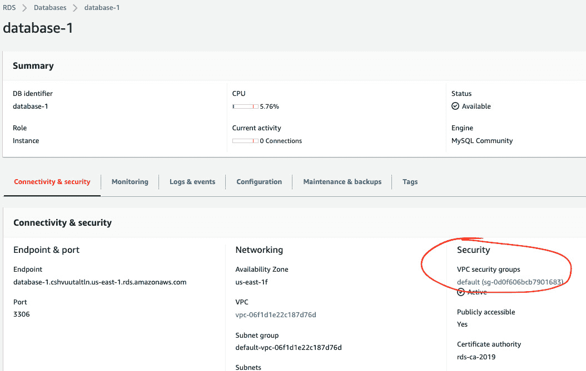

图 8.14 – 安全组

1.  在新面板中，点击**编辑入站规则**。这将允许我们定义入站连接：

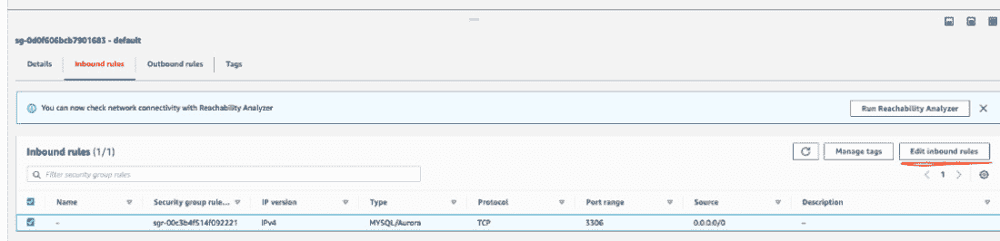

图 8.15 – 入站规则

1.  为 MySQL/Aurora 类型添加规则并点击**保存**，这在下面的图中没有显示，但位于页面底部：


图 8.16 – 添加规则

这些步骤允许我们接受 AWS 外部的连接。因此，我们将通过本地电脑连接到 AWS。

恭喜！您已在云上创建了数据库。正如您在步骤中所看到的，在云上创建数据库既简单又高效。让我们在下一个主题中连接到数据库。

# 连接到 RDS

在本节中，我们将从数据库查看器之一连接到 RDS。为此，您可以安装一个免费的数据查看器；我将使用 MySQL 查看器。要安装 MySQL 查看器，请执行以下步骤：

1.  打开以下链接：[`www.mysql.com/products/Workbench/`](https://www.mysql.com/products/workbench/)。

1.  在主页面上点击**立即下载**：

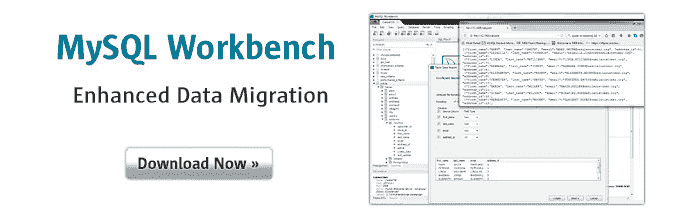

图 8.17 – MySQL Workbench

1.  在下一页上点击**下载**：


图 8.18 – MySQL Workbench 下载

1.  双击并安装下载的包，安装将完成。

1.  安装完成后，点击**+**符号以连接到新数据库：

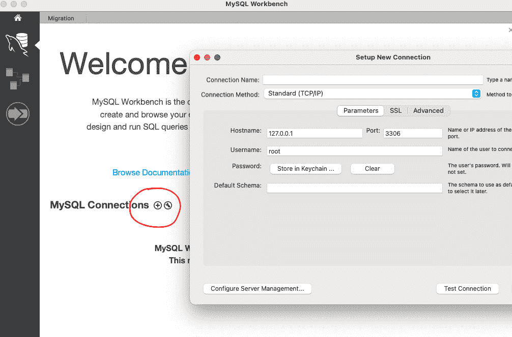

图 8.19 – 新连接

1.  打开 AWS 并复制连接详细信息：

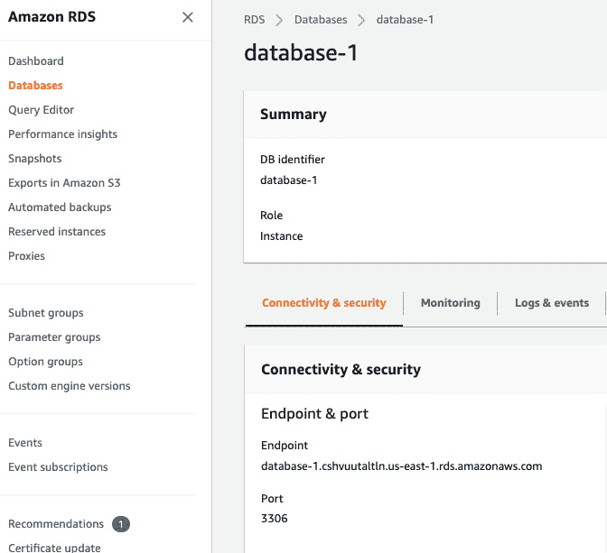

图 8.20 – 端点名称

1.  在 MySQL Workbench 中填写端点和密码详细信息，然后点击**测试连接**：

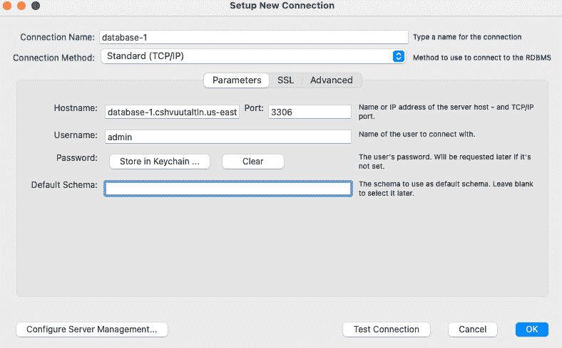

图 8.21 – 测试连接

点击**测试连接**后，您将能够看到连接：

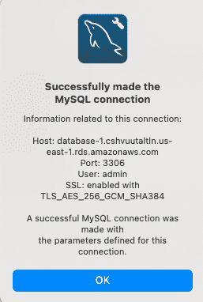

图 8.22 – 连接成功

干得好！我们已经成功从 MySQL Workbench 连接到了 RDS 数据库。让我们在下一个主题中创建一个表并插入一些记录。

# 在数据库中创建表

我们已在云上创建了一个数据库，并通过 MySQL Workbench 进行了连接。作为下一步，我们将通过 MySQL Workbench 创建一个表：

1.  通过 MySQL Workbench 连接到数据库。

1.  使用以下命令创建一个数据库，并点击如图所示的*闪电*符号：

```py
CREATE DATABASE address;
```

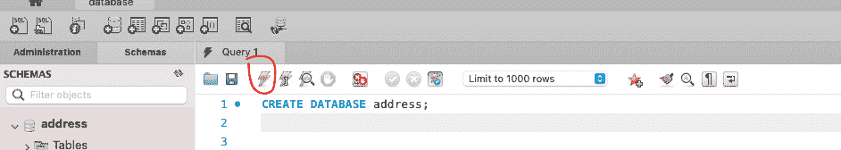

图 8.23 – 创建数据库

1.  执行`USE address`命令以切换数据库：

```py
USE address;
```

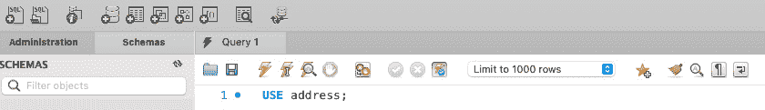

图 8.24 – USE address

1.  创建一个地址表：

```py
CREATE TABLE address (id INT, address VARCHAR(20));
```


图 8.25 – 创建表

我们已创建了一个地址表，接下来我们将向表中插入数据。

1.  执行以下脚本以向表中插入数据：

```py
INSERT INTO address (id,address) VALUES(1,"Germany");
INSERT INTO address (id,address) VALUES(2,"USA");
```


图 8.26 – 插入脚本

该表有两行，我们将从 Lambda 函数中读取这些值：

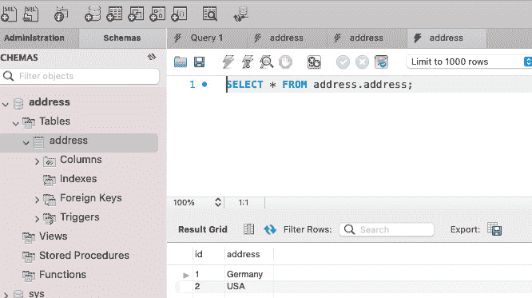

图 8.27 – 选择脚本

在本主题中，我们创建了一个简单的表并插入了记录。插入是通过 MySQL Workbench 完成的，但您也可以使用其他数据库工具。作为下一步，我们将使用 Python 读取记录。

# 使用 Python 进行数据库操作

在本节中，我们将使用 Python 读取一个表。为了执行 Python 函数，我们将在本地计算机上使用 PyCharm。执行以下步骤：

1.  打开 PyCharm 或你喜欢的 IDE。

1.  我们将安装 MySQL Connector 到 PyCharm。MySQL Connector 将用于从 Python 进行数据库操作。在 PyCharm 中，选择**文件** | **新建项目设置** | **新项目…**的**首选项**：

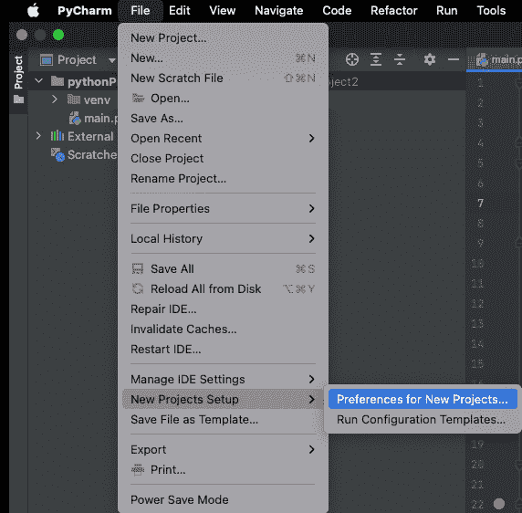

图 8.28 – 首选项

1.  在面板中，选择**Python 解释器**：

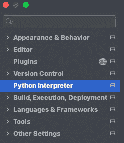

图 8.29 – Python 解释器

1.  要添加一个新包，点击**+**符号：

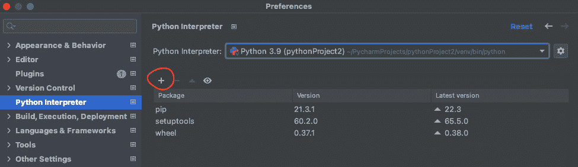

图 8.30 – 添加包

1.  在即将出现的面板中，输入`mysql-conn`来安装**mysql-connector**。你将能够看到**mysql-connector**。点击**安装包**来安装它：

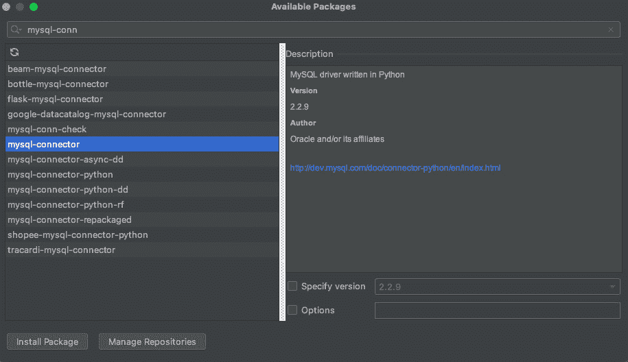

图 8.31 – 安装 mysql-connector

1.  一旦安装，你将能够在已安装的包中看到**mysql-connector**：

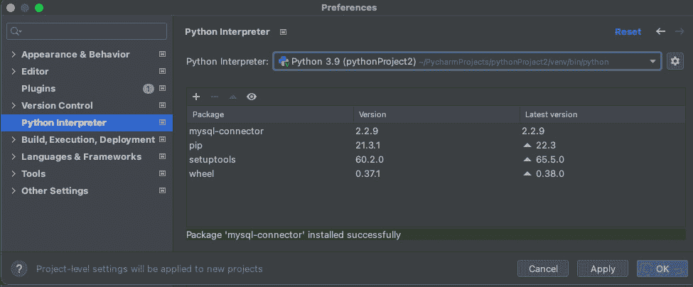

图 8.32 – 包列表

1.  复制并粘贴以下代码以从数据库读取数据：

    ```py
    import mysql.connector
    #rds settings
    rds_host = "database-1.********.us-east-1.rds.amazonaws.com"
    name = "**min"
    password = "*****234"
    db_name = "address"
    if __name__ == '__main__':
        conn = mysql.connector.connect(host=rds_host, user=name, passwd=password, database=db_name, port=3306)
        cursor = conn.cursor()
        cursor.execute("select * from address")
        data = cursor.fetchall()
        print(data)
    ```

上述代码块通过执行`select * from address`查询连接到 RDS 数据库并从地址表读取。对于`rds_host`、`name`和`password`，请填写您的数据库主机和凭证：

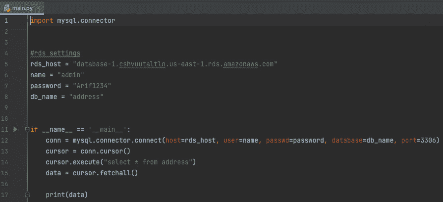

图 8.33 – 数据库查询

1.  当你点击**运行**时，你可以看到数据库的结果：

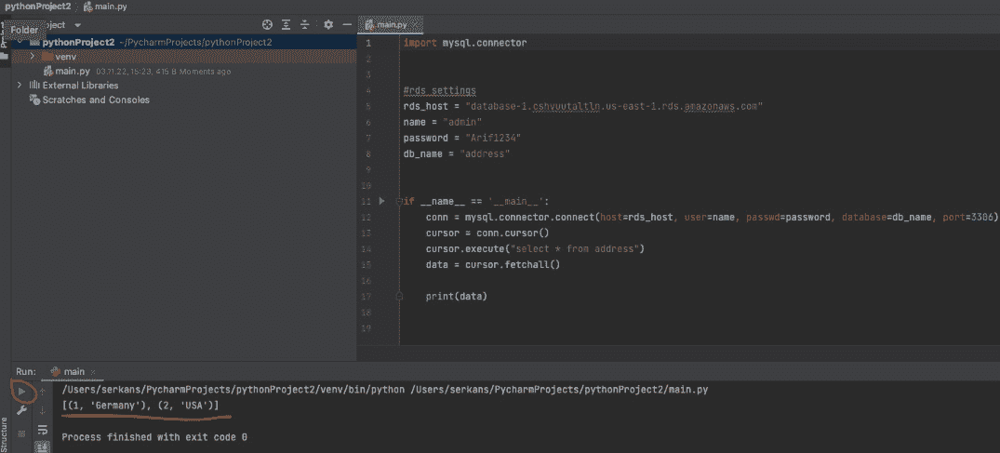

图 8.34 – 数据库结果

恭喜！你现在能够通过 Python 读取 AWS 数据库中的数据。你还可以通过实现`insert`和`update`查询来扩展你的查询。在本主题中，我们学习了如何通过 Python 进行数据库操作。

# 秘密管理器

**秘密管理器**是 AWS 的一项服务，允许你管理和检索数据库凭证，这在使用数据库时可能很有帮助。让我们学习如何使用秘密管理器：

1.  通过控制台打开**秘密管理器**：

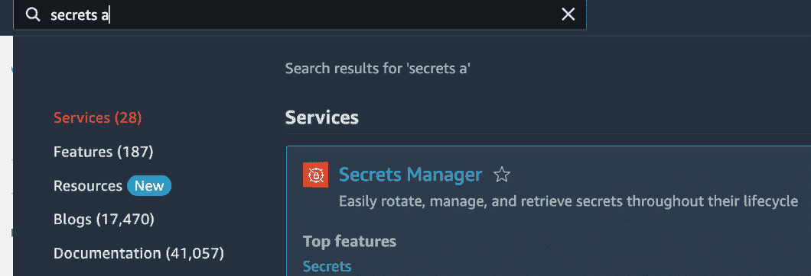

图 8.35 – 打开秘密管理器

1.  点击**存储新** **秘密**按钮：

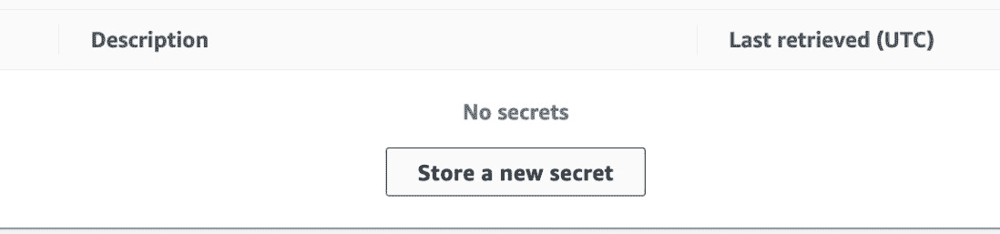

图 8.36 – 存储新秘密

1.  选择你想要存储秘密的秘密类型，并填写用户名和密码。在这种情况下，我们将选择**database-1**实例。填写详细信息后，点击**下一步**：

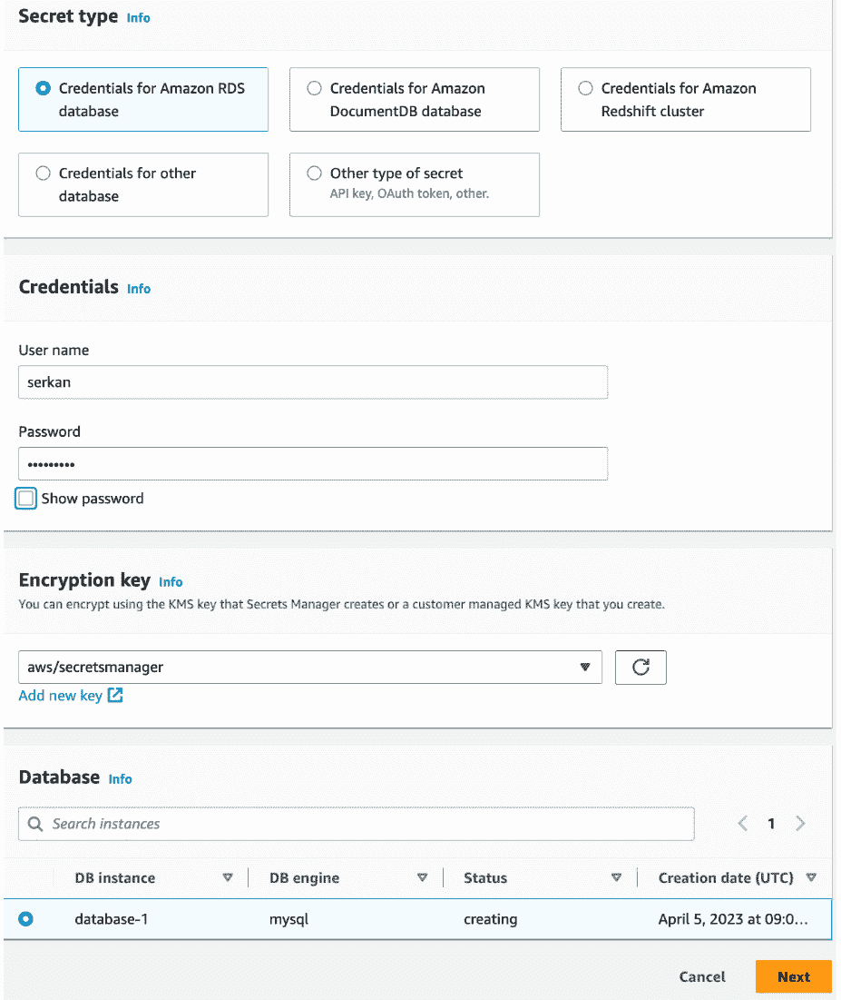

图 8.37 – 填写详细信息

1.  你需要在**秘密** **名称**文本框中为即将出现的路径命名：

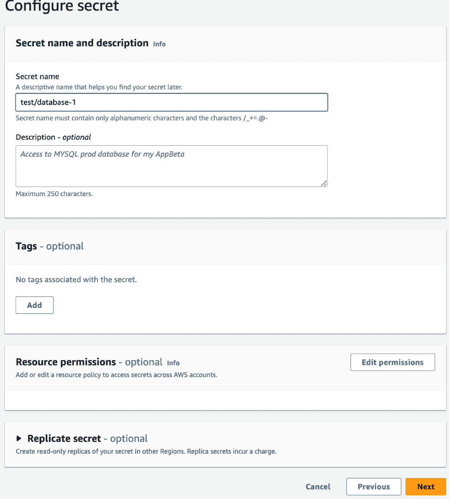

图 8.38 – 命名秘密

1.  在下一屏，你将看到使用此秘密与不同编程语言一起使用的选项。点击**存储**以完成：

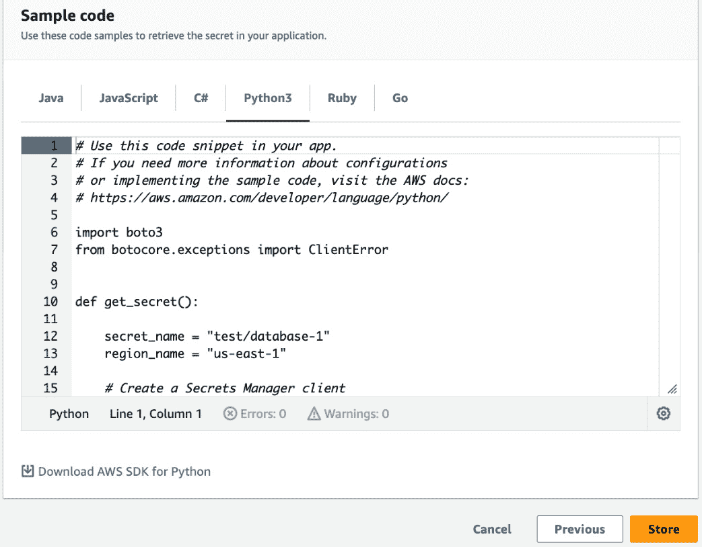

图 8.39 – 存储秘密

1.  作为最后一步，你将在列表中看到秘密：

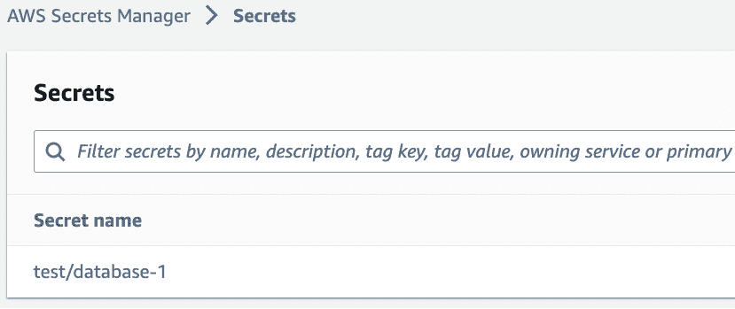

图 8.40 – 秘密列表

恭喜！你已经学会了如何在云中安全地创建和存储秘密。

# 摘要

在本章中，我们学习了 AWS RDS，这是一种用于在云上创建关系型数据库的工具。你可以以高效的方式创建你的数据库。需要注意的是，你有创建不同数据库的可能性，包括 MySQL、Microsoft SQL 和 PostgreSQL。在本章中，我们在云上创建了一个 RDS 实例，并运行了一个 Python 应用程序来进行读取操作。在下一章中，我们将探讨如何在 AWS 中创建 API。
