# 9

# 在 AWS 中创建 API

在本章中，我们将学习如何通过 API 网关创建**应用程序编程接口**（**API**）。API 网关是一个 AWS 服务，允许你创建和维护 API。使用 API 网关服务，你不需要配置服务器；AWS 在后台管理它。此外，API 网关帮助你监控传入和传出的请求。API 网关的另一个优点是在用户请求量巨大时扩展你的 API 服务。

本章涵盖了以下主题：

+   什么是 API 网关？

+   使用 API 网关创建 API

# 什么是 API 网关？

**API 网关**是一个 AWS 服务，用于创建、维护和发布 API。API 网关支持多种 API 协议，如**RESTful**（也称为 REST API）和**WebSocket**。

API 网关是后端服务的单一入口点。正如你在以下架构中可以看到的，API 网关从客户端接收请求，并将传入的请求与微服务、数据库、AWS Lambda 或其他 AWS 服务集成：

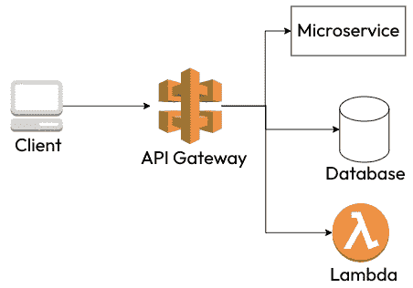

图 9.1 – API 网关架构

现在我们对 API 网关有了很好的了解，让我们来看看它的功能。

API 网关的功能

API 网关的功能如下：

+   它支持不同的协议，例如 RESTful 和 WebSocket。

+   你可以监控传入和传出的 API 请求，这增强了服务的可见性。

+   你可以轻松创建和维护 API。它可以在 AWS 管理控制台或 AWS CLI 中创建。

+   对于云服务以及 API 来说，安全性都很重要。你可以创建一个密钥来启用对 API 的安全访问。此外，你可以添加 SSL 证书来验证请求。

+   它与 AWS 服务内置集成。当你实现一个 API 时，你可以轻松地将其与 AWS 服务集成。

+   它是一个可扩展的服务，当你有更多请求时，它会添加更多资源。例如，在黑色星期五，电子商务网站上有更多的负载。在这些情况下，API 网关会自动扩展你的 API 请求。在这种情况下，你还可以定义一个**跨源资源共享**（**CORS**）策略作为安全功能，该策略控制 HTTP 请求。

在本节中，我们探讨了 API 网关的基本功能，现在我们将开始实现示例 API 应用程序。

# 使用 API 网关创建 API

我们将创建一个简单的 API，该 API 接受来自客户端的请求。API 接受两个数字，在 Lambda 函数中将两个数字相加，并返回计算值。AWS Lambda 将通过 Python 实现。你可以在以下架构中看到高级流程：


图 9.2 – 数据流

我们将从创建 Lambda 函数开始。在创建 Lambda 函数之后，API 网关将与 Lambda 集成进行设置。

让我们一步一步地创建 Lambda 函数：

1.  打开控制台并导航到 **AWS Lambda** 页面：

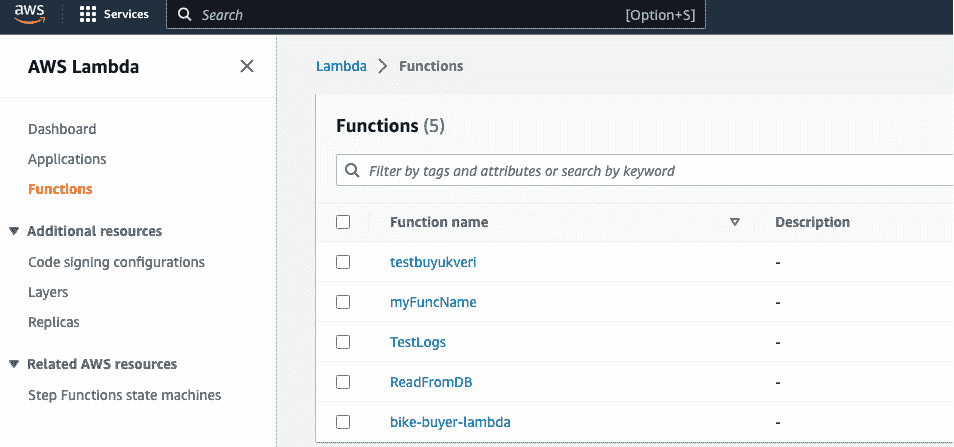

图 9.3 – Lambda 函数

1.  创建一个新的 Lambda 函数。让我们称它为 `SumUpLambda`：

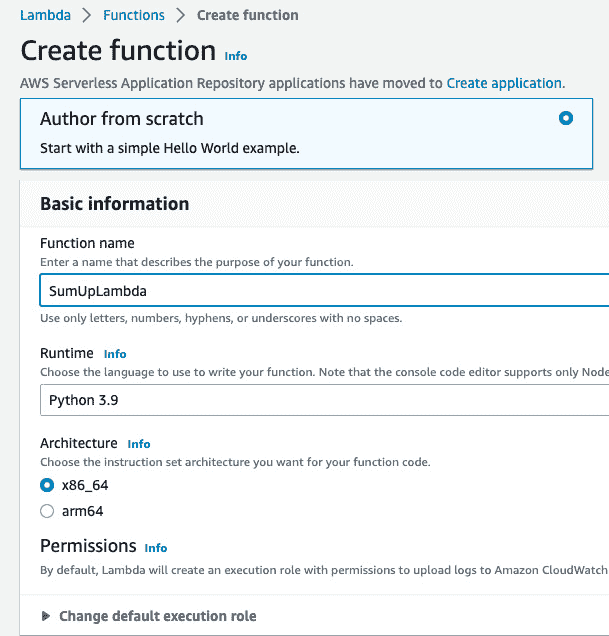

图 9.4 – 创建新的 Lambda 函数

1.  点击 **创建函数** 并等待几秒钟，直到函数创建完成：

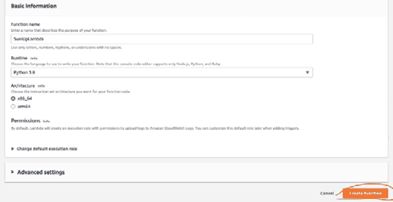

图 9.5 – 点击创建函数

几秒钟后，你会看到已经使用模板代码创建了 Lambda 函数：

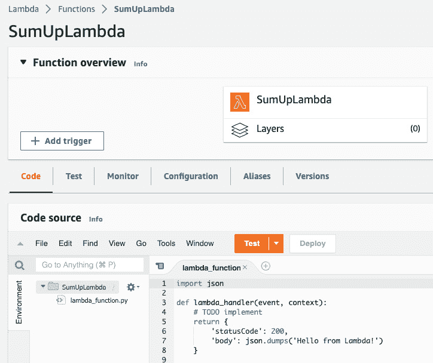

图 9.6 – Lambda 模板

让我们创建一个求和两个值的 Lambda 函数：

```py
import json
def lambda_handler(event, context):
    number1 = event['Number1']
    number2 = event['Number2']
    sum = number1 + number2
    return {
        'statusCode': 200,
        'Sum': sum
    }
```

此代码片段接受两个参数，例如 `Number1` 和 `Number2`。Lambda 函数计算两个值的和，并返回状态码和求和的值。当我们从 API 调用此函数时，它返回求和值以及 `statusCode`。

将此代码块粘贴到 Lambda 函数中：

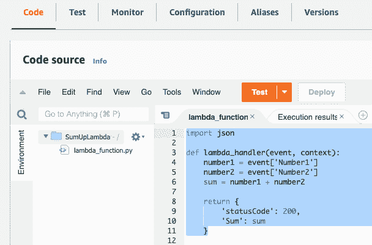

图 9.7 – 实际 Lambda 代码

现在，让我们按照以下步骤进行：

1.  点击 **测试**。一个新的面板打开，其中 Lambda 请求一个测试参数：

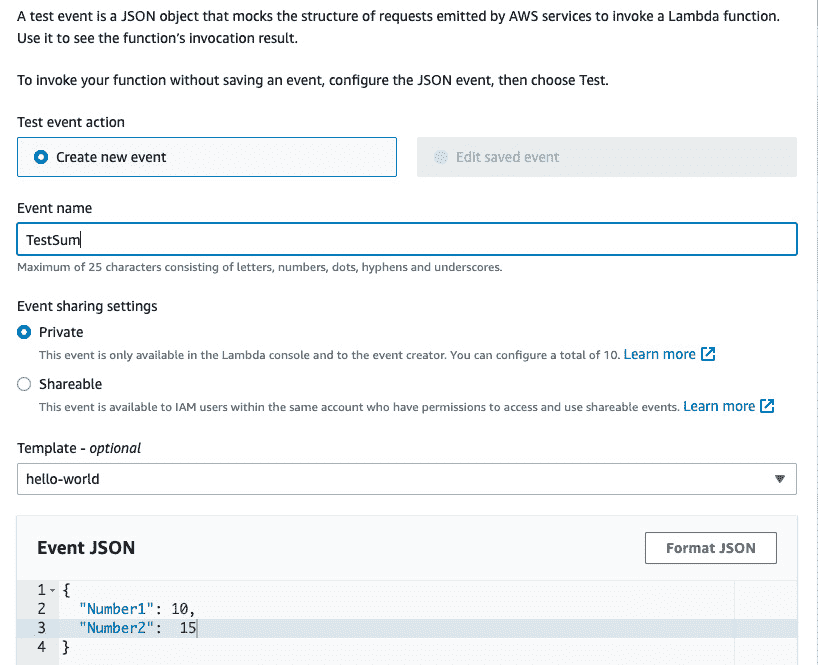

图 9.8 – 测试事件

1.  如前图所示，你可以粘贴以下 JSON 来查看在集成 API 之前 Lambda 函数是否运行正常：

    ```py
    {
      "Number1": 10,
      "Number2": 15
    }
    ```

1.  点击 **保存**，位于 **事件 JSON** 面板下：


图 9.9 – 点击保存按钮

1.  通过点击 **部署** 来部署更改：

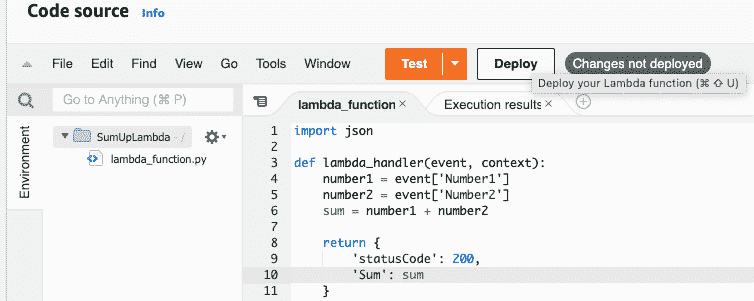

图 9.10 – 部署 Lambda

Lambda 部署后，我们将集成 API Gateway 与 AWS Lambda。Lambda 将作为 API Gateway 的后端。

让我们一步一步地创建一个 API：

1.  打开控制台并搜索 `api gateway`：


图 9.11 – 控制台

1.  在主屏幕上，选择 **REST API**，然后点击 **构建**：


图 9.12 – REST API

1.  你现在将看到一个需要填写的新屏幕。在 **创建新 API** 部分中，我们将选择 **新 API**。本节中的其他选项允许你创建示例 API 或导入预定义的 API。在 **设置** 部分中，我们将添加 **API 名称** 和 **描述** 详细信息。在 **端点类型** 下拉列表中，我们将选择 **区域**，用于创建在同一区域可访问的 API：

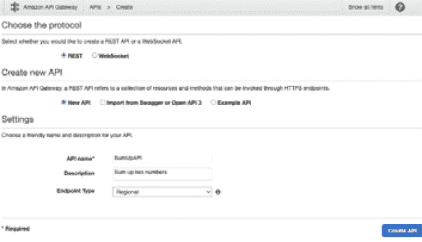

图 9.13 – API 创建表单

1.  一旦你点击 **创建 API**（如前图所示），你将被带到一个新的页面，允许你定义自定义 SumUp API 的详细信息：

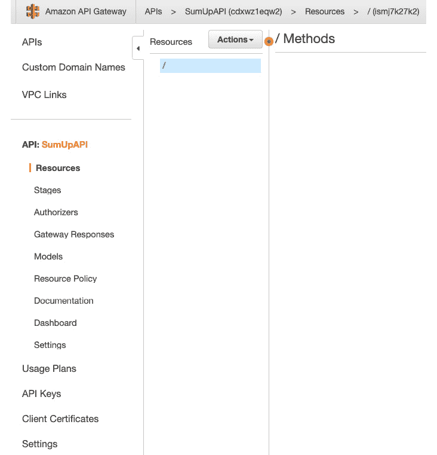

图 9.14 – API 表单

1.  现在，我们将定义 API 的详细信息。点击 **操作** 下拉菜单并选择 **创建方法**：


图 9.15 – 创建方法

1.  当我们创建一个方法时，我们选择 API 类型为 **POST**：


图 9.16 – 选择 POST

在实现 API 时，你可以选择 API 类型。以下是最常用的 API 类型：

+   **GET**用于从源检索数据。

+   来自 Lambda 的`SumUp`。

+   **PUT**用于更新源中的数据。

+   **DELETE**用于删除源中的数据。

1.  当你选择**POST**时，你需要选择集成类型。在这个例子中，我们将选择**Lambda 函数**集成类型：

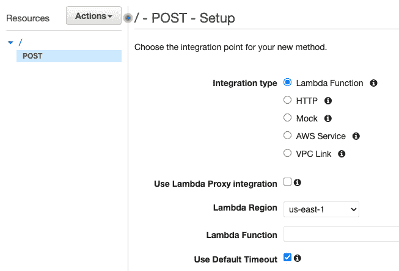

图 9.17 – 设置集成类型

1.  选择已实现的**SumUpLambda**函数，并点击**保存**，这在以下图中没有显示，但位于页面底部：

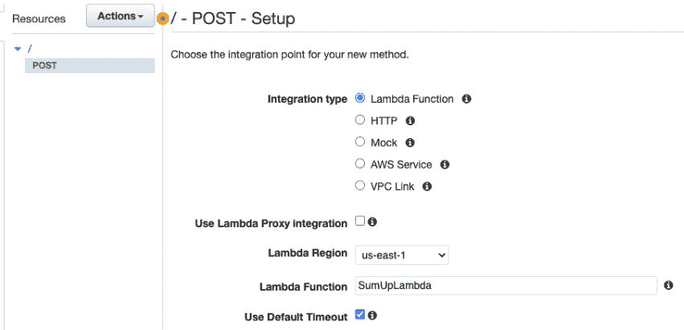

图 9.18 – 选择 Lambda

1.  当你点击**保存**时，它会要求确认以允许所需的权限。点击**确定**，它将创建权限：

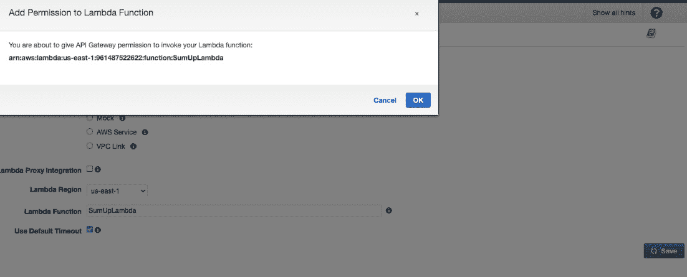

图 9.19 – 权限

设置权限后，你可以看到 API 的数据流：

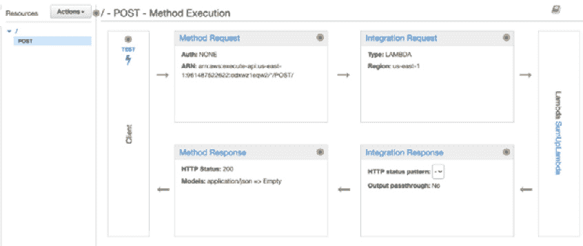

图 9.20 – API 流程

现在，我们需要添加一个 CORS 策略。CORS 是一种安全策略，允许特定的源（域名或端口）浏览你的资源。让我们启用一个 CORS 策略：

1.  点击**操作**下拉按钮以列出可用的操作，然后点击**启用 CORS**：

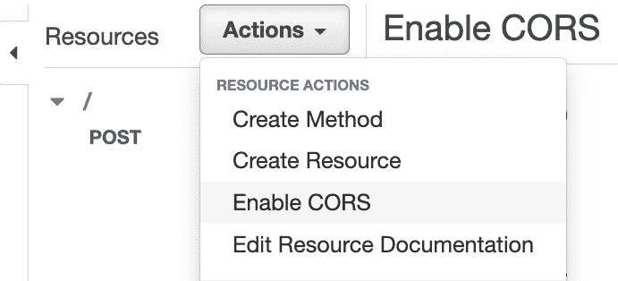

图 9.21 – 操作列表

1.  填写表格并点击**启用 CORS 并替换现有的 CORS 头**。你可以保留表单详情不变。该表单定义了以下内容：

    1.  通过选择**方法**允许哪些方法访问 API

    1.  通过**Access-Control-Allow-Headers**需要哪些请求头

    1.  哪些源能够通过**Access-Control-Allow-Origin**调用 API

    1.  通过选择**默认 4XX**或**默认 5XX**端口来选择网关响应类型。你可以在这里看到列表：[`docs.aws.amazon.com/apigateway/latest/developerguide/supported-gateway-response-types.xhtml`](https://docs.aws.amazon.com/apigateway/latest/developerguide/supported-gateway-response-types.xhtml)。

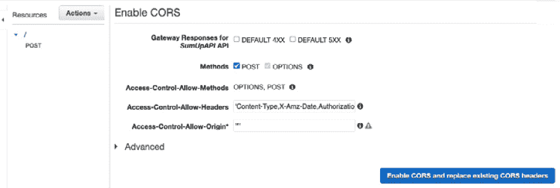

图 9.22 – 启用 CORS

恭喜！你已经成功创建了 Lambda 函数和 API 网关。下一步是测试 API。

让我们测试 SumUp API：

1.  点击流程中的**测试**按钮：

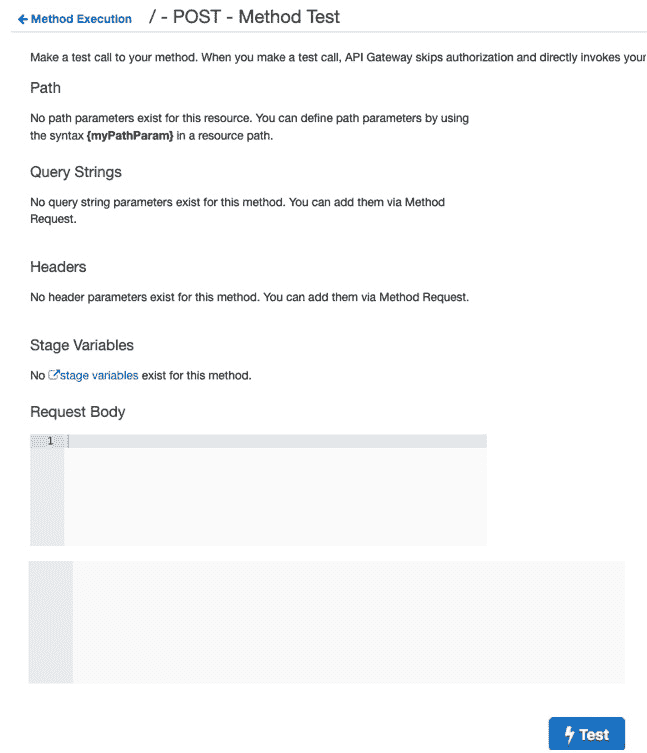

图 9.23 – 测试 API

1.  在**请求体**字段中输入以下代码以添加 Lambda 的参数：

    ```py
    {
      "Number1": 10,
      "Number2": 15
    }
    ```

1.  点击**测试**并查看结果：


图 9.24 – 添加参数

这里是结果：

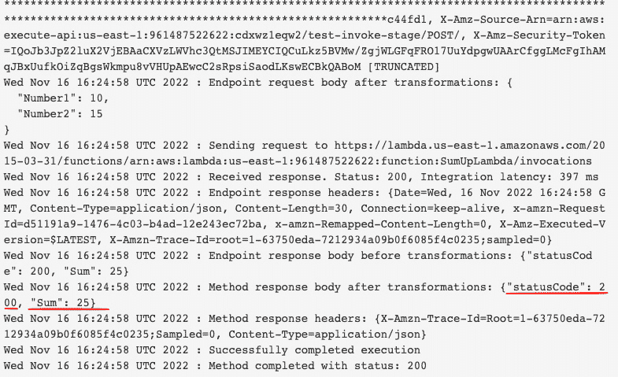

图 9.25 – API 响应的结果

当你检查日志时，你可以看到 API 响应的结果。正如你所看到的，值的总和是`25`。

在这个主题中，我们实现了一个使用 Python 在 Lambda 代码中使用的 API。正如你所看到的，在 AWS 中创建 API 是一个简单的解决方案。这样，你可以专注于后端实现，而不是关注基础设施。

# 摘要

在本章中，我们学习了如何使用 AWS API Gateway 服务以及如何创建一个后端服务为 Python Lambda 的 API 网关。当您需要通过 Python 实现带有后端支持的 API 服务时，API Gateway 非常有用。它具有可扩展性、日志记录和监控优势。在下一章中，我们将探讨 DynamoDB 和 NoSQL 的基础知识。
