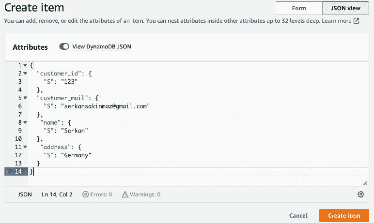
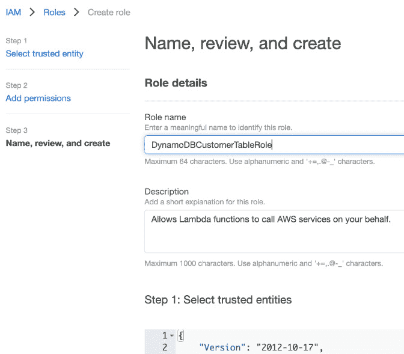

# 10

# 使用 Python 与 NoSQL（DynamoDB）

在本章中，我们将学习如何使用 DynamoDB 创建 NoSQL 数据库。在创建数据库后，我们将使用 Python 在 DynamoDB 中执行数据库操作。**NoSQL**是一种数据库类型，它比关系型数据库更灵活地管理数据。在关系型数据库中，有表和预定义的数据类型，可用于数据库操作。在 NoSQL 中，你可以根据 NoSQL 数据库存储 JSON、原始数据或键值数据。让我们深入了解 NoSQL 数据库。

本章涵盖了以下主题：

+   什么是 NoSQL 数据库？

+   什么是 DynamoDB 数据库？

+   使用 Python 进行 DynamoDB 操作

# 什么是 NoSQL 数据库？

NoSQL 数据库用于存储非结构化数据。这个想法来源于大数据；大多数应用程序和设备都会创建数据，如果你在之后存储和处理这些数据，那么这些数据就很有价值。数据的量每天都在增加，我们需要存储这些数据。想想新汽车；它们有不同设备来存储数据。我们可以将这个例子扩展到家电、社交媒体等等。一般来说，关系型数据库适用于结构化数据以及达到数百万级别的记录级别。因此，当涉及到处理数百万条记录以及非结构化数据时，NoSQL 数据库很有用。

下图显示了如何生成不同的数据源以存储在 NoSQL 数据库中。我们有社交媒体资源和汽车和飞机中的机器，它们生成不同的数据格式：


图 10.1 – NoSQL

有不同类型的 NoSQL 数据库。

## 键值数据库

在这种 NoSQL 数据库类型中，你可以根据键访问数据。例如，你有一个客户 ID 作为键，地址、年龄和家庭信息作为值。当你需要访问值时，只需提供键作为查询参数：


图 10.2 – 键值数据库

键值数据库很有用，甚至可以处理数十亿条记录。我们将在下一节中研究 DynamoDB，它是一种键值数据库。

## 文档数据库

文档数据库是另一种可以存储非结构化数据（如 JSON）的 NoSQL 数据库。如果你需要存储非结构化的大数据并使用不同的参数检索数据，它很有用：


图 10.3 – 文档数据库

你可以如下看到示例 JSON：

```py
{
    "employee": {
        "name":"Jack",
        "age":25
    }
}
```

还有其他类型的 NoSQL 数据库，例如图数据库和列数据库，但在这本书中我们不会重点介绍它们。我建议在这里阅读更多内容：[`en.wikipedia.org/wiki/NoSQL`](https://en.wikipedia.org/wiki/NoSQL)。

我们已经学习了 NoSQL 数据库的定义，并查看了一些 NoSQL 数据库的类型。接下来，我们将专注于 DynamoDB，它是一种键值数据库。

# 什么是 DynamoDB 数据库？

**DynamoDB 数据库**是一个由 AWS 管理的键值 NoSQL 数据库。当您使用 DynamoDB 时，您不需要创建新的数据库。您也不需要配置服务器；它由 AWS 完全管理。这是最受欢迎的基于云的 NoSQL 数据库之一，如果您使用基于键的访问，性能非常好。主要优势是您可以以毫秒级的延迟访问数十亿条记录。

这些是 DynamoDB 的功能：

+   由 AWS 完全管理

+   无配置的自动扩展

+   与其他 AWS 服务内置集成

+   支持监控和日志记录

+   支持数据库备份和恢复

+   按使用付费模式 – 您为使用此服务所支付的金额付费

## 创建 DynamoDB 数据库

在本子主题中，我们将创建一个 DynamoDB 数据库。让我们一步一步地遵循说明：

1.  在搜索框中输入`DynamoDB`，然后点击**服务**部分下出现的**DynamoDB**选项：


图 10.4 – 控制台搜索

1.  在左侧点击**表**，然后点击**创建** **表**按钮：


图 10.5 – 创建表

1.  填写**表名**、**分区键**和**排序键**详细信息以创建表：


图 10.6 – 表详情 – 第一部分

**表名**代表表的名称。我们将创建一个示例客户表。

**分区键**将被用作主键。DynamoDB 是一个键值数据库；因此，您可以根据键轻松搜索数据。在这种情况下，我们将使用**customer_id**作为主键。

DynamoDB 允许您使用分区键以外的排序键进行搜索。我们将在**排序键**字段中使用**customer_mail**。

1.  向下滚动并填写**容量模式**、**读取容量**、**写入容量**、**自动扩展**、**本地二级索引**和**全局二级索引**。对于输入，保持以下默认值不变：


图 10.7 – 表详情 – 第二部分

**容量模式**定义了表的预留容量。如果您选择预配模式，AWS 会为查询预留您预定义的容量。另一个选项是定义按需以进行未计划的容量预留。

**读取容量**和**写入容量**定义了此表支持的读取和写入请求数量。

关于**自动扩展**，AWS 管理扩展功能。

**本地二级索引**和**全局二级索引**在您需要比主键和排序键更多的索引值时使用。本地二级索引允许您创建一个具有与基础表相同的分区 ID 但具有不同排序键的附加索引。您需要在创建表时定义此索引。另一方面，全局二级索引允许您创建一个可以具有与基础主键不同的分区 ID 和排序键的索引。

1.  点击 **创建表格**，如您在上一张截图中所见，您将在列表中看到创建的表格：


图 10.8 – 表格列表

1.  让我们通过 AWS 管理控制台插入一个条目。在 **表格** 列表下选择 **customer**：


图 10.9 – 客户表

您将看到表格的详细信息：


图 10.10 – 表格详情

1.  点击 **操作** 下拉按钮并选择 **创建条目**：


图 10.11 – 创建条目

1.  点击此按钮后，您将看到一个标题为 **创建条目** 的条目创建页面。您可以通过填写表单或直接插入 JSON 来操作。在这个例子中，我们将通过 **JSON 视图** 插入代码。DynamoDB 为您创建了一个模板：


图 10.12 – JSON 视图

将以下 JSON 作为示例粘贴：

```py
{
  "customer_id": {
    "S": "123"
  },
  "customer_mail": {
    "S": "serkansakinmaz@gmail.com"
  },
   "name": {
    "S": "Serkan"
  },
   "address": {
    "S": "Germany"
  }
}
```

JSON 文件很简单，包含 `customer_id`、`customer_mail`、`name` 和 `address` 信息。

1.  点击 **创建条目**：



图 10.13 – 创建条目

创建后，您将被重定向到 **表格** 页面：


图 10.14 – 条目列表

由于您使用的是 NoSQL，您也可以插入 JSON，这与我们之前插入的 JSON 格式不同。以下 JSON 也适用于客户表：

```py
{
  "customer_id": {
    "S": "1234"
  },
  "customer_mail": {
    "S": "jane@gmail.com"
  },
   "name": {
    "S": "Jane"
  },
   "profession": {
    "S": "Data Engineer"
  }
}
```

如您所见，我们已经删除了 `address` 字段并添加了 `profession` 作为新字段，没有任何问题。

在本节中，我们已经通过控制台创建了一个 DynamoDB 表并插入了数据。如您所见，DynamoDB 是一个键值数据库，您可以插入不同的 JSON 格式，这提供了灵活性。

# 使用 Python 进行 DynamoDB 操作

在本节中，我们将通过 Python 读取 DynamoDB 表。为了执行 Python 函数，我们将实现一个 Lambda 函数来从 DynamoDB 读取数据。执行以下步骤：

1.  我们将创建所需的权限以允许 Lambda 从 DynamoDB 读取。打开 IAM 并在左侧点击 **策略**：


图 10.15 – IAM 策略

1.  点击 **创建策略**：


图 10.16 – 创建策略

1.  粘贴以下策略：

    ```py
    {
        "Version": "2012-10-17",
        "Statement": [
            {
                "Effect": "Allow",
                "Action": [
                    "dynamodb:BatchGetItem",
                    "dynamodb:GetItem",
                    "dynamodb:Query",
                    "dynamodb:Scan",
                    "dynamodb:BatchWriteItem",
                    "dynamodb:PutItem",
                    "dynamodb:UpdateItem"
                ],
                "Resource": "arn:aws:dynamodb:us-east-1:961487522622:table/customer"
            }
        ]
    }
    ```

该策略允许您从 DynamoDB 表中读取。一般来说，以下访问策略也适用于您；然而，您需要更改您拥有的账户 ID，因为每个 AWS 账户都有一个不同的账户 ID：


图 10.17 – DynamoDB 策略

1.  您可以添加策略名称并完成策略的创建。在这个例子中，我使用 **DynamoDBCustomerTableOperations** 作为策略名称：


图 10.18 – 策略创建

1.  现在我们需要创建一个角色。这个角色将被附加到 Lambda 以访问 DynamoDB。在 IAM 服务中点击 **创建角色**：


图 10.19 – IAM 角色

1.  由于我们需要 Lambda 的策略，所以在**用途**部分选择**Lambda**：


图 10.20 – Lambda 的 IAM 角色

1.  如以下截图所示，添加我们创建的用于访问 Lambda 的策略：


图 10.21 – 选择策略

1.  填写**角色名称**并创建角色。如您所见，我们给 Lambda 函数取的名字是**DynamoDBCustomerTableRole**。向下滚动并点击**创建****角色**按钮：



图 10.22 – 创建角色

1.  将 `readFromDynamoDB` 到**函数名称**和**Python 3.9**到**运行时**：


图 10.23 – 创建函数

1.  在上一页的底部，有一个用于定义执行策略的面板。在**执行角色**部分下选择**使用现有角色**，并选择我们创建的角色：


图 10.24 – 选择角色

1.  Lambda 准备填写代码块：


图 10.25 – Lambda 函数

将以下代码粘贴到 Lambda 函数中：

```py
import json
import boto3
def lambda_handler(event, context):
    dynamodb = boto3.resource('dynamodb', region_name="us-east-1")
    table = dynamodb.Table('customer')
    response = table.get_item(Key={'customer_id': "123", 'customer_mail': "serkansakinmaz@gmail.com"})
    item = response['Item']
    print(item)
    return {
        'statusCode': 200,
        'body': json.dumps('Hello from Lambda!')
    }
```

代码导入 `boto3` 库，该库为 DynamoDB 操作提供了有用的函数。`boto3` 是一个库，它包含 AWS 服务特定的功能，以便在 AWS 上使用 Python 实现云应用程序。您可以从以下链接获取更多详细信息：[`boto3.amazonaws.com/v1/documentation/api/latest/index.xhtml`](https://boto3.amazonaws.com/v1/documentation/api/latest/index.xhtml)。

作为第一步，我们通过调用 `boto3.resource` 函数定义 `dynamodb` 资源。调用之后，我们定义了我们读取的表；它是 `dynamodb.Table` 表。一旦定义了表，`table.get_item` 函数将主键和排序键作为参数，并返回查询结果。

一旦运行 Lambda 函数，您就能看到结果：


图 10.26 – 执行结果

恭喜！您能够定义角色并从 Lambda 中检索项目。如您所见，AWS 需要一些配置才能访问 DynamoDB 中的数据。

# 摘要

在本章中，我们学习了 AWS DynamoDB 服务以及如何在 AWS 中创建 DynamoDB 数据库。创建数据库后，我们实现了一个 Lambda Python 代码片段，用于从 DynamoDB 中读取项目。您现在也知道如何扩展 Lambda 代码以将数据插入到 DynamoDB 表中。当您需要实现一个由 AWS 管理的键值数据库时，DynamoDB 非常有用。它具有可扩展性、日志记录和监控优势。在下一章中，我们将探讨 Glue 服务。
