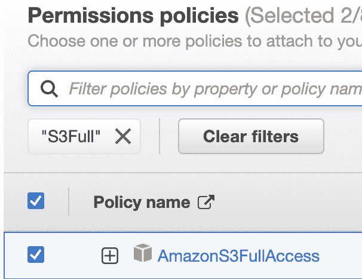

# 第十一章：使用 Python 与 Glue 结合

在本章中，我们将学习如何使用 AWS Glue 创建数据集成管道。**AWS Glue**是一种用于**提取、转换和加载**（**ETL**）过程的数据集成服务。Glue 是一种无服务器数据集成服务；因此，您不需要创建和管理服务器，因为基础设施由 AWS 管理。使用 Glue，您可以从不同的数据源收集数据，例如 S3、数据库或文件系统，以处理和转换数据。结果存储在 S3 或数据库中，或者您可以调用 API。

本章涵盖了以下主题：

+   AWS Glue 服务是什么？

+   AWS Glue 服务创建

+   使用 AWS Glue 创建简单的 Python 应用程序

# AWS Glue 服务是什么？

AWS 拥有超过 100 个服务。当您在 AWS 和其他源之间集成数据时，您可能需要从源加载数据，使用一些转换对其进行操作，并将其存储在服务中。AWS Glue 满足这些要求，并提供了一个允许准备数据的服务。在以下图中，您可以看到 Glue 的非常高级的概述。如您所见，Glue 从不同的源提取数据，执行一些转换，并将数据加载到另一个源：


图 11.1 – AWS Glue

例如，假设您有在 S3 中通过批量加载的数据。为了使其可搜索，您需要将其存储在 DynamoDB 中。在这些过程之间，有一个要求是使用一些转换过滤、清理和操作数据。对于这个要求，AWS Glue 是数据集成和某些数据操作的好选择。

## AWS Glue 功能

AWS Glue 具有以下功能：

+   它根据转换工作负载自动扩展。

+   它与其他服务有更广泛的集成，例如 S3、RDS 和 DynamoDB，因此您可以使用这些服务轻松地读取数据。

+   您可以安排管道；因此，ETL 过程可以根据预定时间定期执行。

+   它具有数据目录功能，允许您存储数据结构元数据信息。

+   它能够为 ETL 管道生成代码。例如，您需要从 S3 读取 CSV 数据以加载另一个 S3 位置的 JSON 格式。Glue 自动生成代码。

+   有 Git 集成，因此您可以轻松地从 Git 拉取代码以运行 ETL 管道。

+   它提供了一个具有拖放代码实现功能的可视化界面。

在本节中，我们探讨了 AWS Glue 的功能。为了更好地理解它们，我们将使用 AWS Glue 服务将 CSV 文件转换为 JSON。

# 创建 S3 示例文件

在本节中，我们将创建一个简单的 S3 存储桶，用于存储 CSV 文件。让我们一步一步地按照说明进行：

1.  打开 AWS S3 服务。

1.  点击**创建** **存储桶**按钮：


图 11.2 – 创建存储桶

1.  在面板底部给出一个唯一的**桶名称**，然后点击**创建桶**：


图 11.3 – 输入桶

桶已创建：


图 11.4 – 桶列表

1.  在您的计算机上创建一个包含以下内容的 `addresses.csv` 文件，并将其上传到 S3 桶。请以 `UTF-8` 格式保存文件；否则，在某些 Glue 版本中可能会出现问题：

    ```py
    id,location_id,address_1,city,state_province
    1,1,2600 Middlefield Road,Redwood City,CA
    2,2,24 Second Avenue,San Mateo,CA
    3,3,24 Second Avenue,San Mateo,CA
    4,4,24 Second Avenue,San Mateo,CA
    5,5,24 Second Avenue,San Mateo,CA
    6,6,800 Middle Avenue,Menlo Park,CA
    7,7,500 Arbor Road,Menlo Park,CA
    8,8,800 Middle Avenue,Menlo Park,CA
    9,9,2510 Middlefield Road,Redwood City,CA
    10,10,1044 Middlefield Road,Redwood City,CA
    ```

1.  在桶内点击**上传**按钮以上传内容：


图 11.5 – 上传 CSV

上传后，桶将包含 CSV 文件：


图 11.6 – S3 内容

我们已成功上传文件。在下一步中，我们将创建创建 Glue 作业所需的权限。

# 定义 Glue 作业的权限

在本节中，我们将定义 Glue 作业所需的权限：

1.  打开 AWS IAM 服务。

1.  在左侧点击**角色**：


图 11.7 – IAM 服务列表

1.  点击**创建角色**：


图 11.8 – 创建角色

1.  在**用例**下选择**Glue**：


图 11.9 – 选择 Glue

1.  在下一页，选择**策略名称**下的**AmazonS3FullAccess**和**CloudWatchFullAccess**：



(a)


(b)

图 11.10 – S3 和 CloudWatch 访问

1.  为我们创建的角色命名，然后您可以点击**创建角色**以完成角色创建：


(a)


(b)

图 11.11 – 角色名称和创建

我们已为 AWS Glue 作业创建了所需的角色。在下一步中，我们将使用角色和 S3 桶创建一个简单的 AWS Glue 作业。

# 创建 AWS Glue 服务

在本节中，我们将创建一个 AWS Glue 服务。让我们一步一步地按照说明进行：

1.  在 AWS 管理控制台搜索栏中输入 `AWS Glue` 并点击出现的**AWS Glue**结果：


图 11.12 – 控制台搜索

1.  在左侧点击**作业**：


图 11.13 – Glue 作业

1.  在**创建作业**部分，选择**带有源和目标的可视化**。这将创建一个可视化界面和预定义的脚本，以便将 CSV 转换为 JSON 文件：


图 11.14 – 创建作业

1.  在面板右侧点击**创建**后，您将看到可视化编辑器：


图 11.15 – 可视化编辑器

1.  在**数据源 - S3 桶**下点击**S3 桶**，您将在右侧看到数据源详细信息。它包含有关如何解析源数据的详细信息。如图所示，我们将**S3 位置**设置为数据路径，**数据格式**为**CSV**，**分隔符**为逗号分隔：


图 11.16 – 数据源

1.  从面板中选择**转换**选项卡，你将看到以下数据映射。此映射由 Glue 生成：


图 11.17 – 映射

1.  从面板中选择**数据目标属性 - S3**选项卡，并填写面板中的目标详细信息。由于我们将转换为 JSON，格式将是**JSON**。目标位置也可以是另一个 S3 存储桶；在这个例子中，我将为输入和输出提供相同的 S3 位置：


图 11.18 – 数据目标

1.  选择**作业详情**选项卡以填写其他信息，如作业名称和脚本。你可以在*步骤 9*和*步骤 10*中看到这些详细信息：


图 11.19 – 作业详情

1.  填写作业的**名称**和**IAM 角色**字段以运行 Glue 作业：


图 11.20 – 名称和角色

1.  还有一个配置需要完成。向下滚动并填写 Glue 将创建的**脚本文件名**和**脚本路径**详细信息：


图 11.21 – 脚本文件名和路径

1.  点击**保存**。正如你所见，Glue 创建了一个 Python Spark 脚本，该脚本将把 CSV 转换为 JSON。**PySpark**是一个数据处理库，也可以在 AWS Glue 作业中使用：


图 11.22 – 代码生成

1.  在面板右侧点击**运行**：


图 11.23 – 运行按钮面板

经过一段时间后，你可以从**运行**选项卡中检查作业状态：


图 11.24 – 运行选项卡

当你检查 S3 文件夹时，文件会被转换为 JSON。以下是一些示例输出：

```py
{"id":"1","location_id":"1","address_1":"2600 Middlefield Road","city":"Redwood City","state_province":"CA"}
{"id":"2","location_id":"2","address_1":"24 Second Avenue","city":"San Mateo","state_province":"CA"}
{"id":"3","location_id":"3","address_1":"24 Second Avenue","city":"San Mateo","state_province":"CA"}
```

恭喜！你现在能够将 CSV 文件转换为 JSON 文件。正如你所见，AWS Glue 创建了一个预定义的脚本以执行一些 ETL 作业。

# 摘要

在本章中，我们学习了 AWS Glue 服务以及如何使用 AWS Glue 创建 ETL 管道。当你需要创建数据管道时，Glue 非常高效。Glue 的一个酷特性是可视化流程生成器，它允许你通过拖放来创建流程。这使得创建和生成流程变得容易，从而节省了大量时间。此外，对于那些代码经验不多的人来说，Glue 的可视化流程简化了他们的任务。因此，如果你处理数据，Glue 是 AWS 中最好的服务之一。在下一章中，我们将使用 Python 编程语言在 AWS 中创建一个示例项目。
