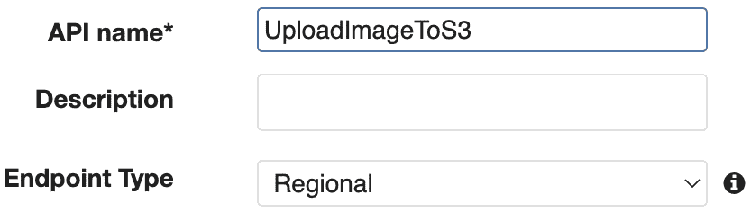

# 12

# AWS 上的参考项目

在本章中，我们将使用 Python 在 AWS 上创建一个示例应用程序。这是本书的最后一章。我们已经了解了不同的 AWS 服务，并使用这些服务实现了示例 Python 应用程序。在本章中，我们将使用多个服务创建一个端到端的 Python 应用程序。

本章涵盖了以下主题：

+   我们学到了什么？

+   介绍端到端的 Python 应用程序

+   Python 应用程序的编码

# 我们学到了什么？

AWS 拥有超过一百项服务，我们已经了解了重要的 Python 相关服务。让我们浏览这些服务：

+   **Lambda**：Lambda 是一种云计算服务，允许您运行 Python 应用程序。您不需要配置任何服务器；Lambda 管理基础设施。

+   **EC2**：EC2 在云中提供服务器机器。您可以创建服务器并安装所需的应用程序，或您想要的任何东西。

+   **Elastic Beanstalk**：Elastic Beanstalk 用于部署基于 Python 的 Web 应用程序。

+   **CloudWatch**：CloudWatch 是 AWS 上的日志和监控服务。您可以轻松跟踪您的服务。

+   **RDS**：RDS 是 AWS 上的关系数据库服务。如果您需要数据库，您可以轻松创建它而无需管理服务器。

+   **API Gateway**：API Gateway 用于创建、维护和发布应用程序编程接口。

+   **DynamoDB**：DynamoDB 是一种用于在 AWS 上查询和存储数十亿记录的键值数据库。它也是一个**NoSQL 数据库**。

+   **AWS Glue**：AWS Glue 是一种用于 ETL 的数据集成服务。

# 介绍 Python 应用程序

让我们了解 Python 应用程序的高级架构：


图 12.1 – 项目架构

应用程序收集要存储在 S3 存储桶中的图像。API 网关用于客户端和 Lambda 服务之间的集成。Lambda 检索信息并将数据放入 S3。

# Python 应用程序的编码

让我们一步一步实现应用程序。

## 创建用于存储图像的 S3 存储桶

在本小节中，我们将创建一个 S3 存储桶来存储通过 API Gateway 上传的图像。S3 将存储图像并在请求时提供：

1.  创建存储桶并点击页面底部的**创建存储桶**按钮：


图 12.2 – S3 存储桶

1.  我们填写了`python-book-image`；您可以使用任何您想要的。在添加**存储桶名称**后，点击**创建存储桶**以创建一个新的存储桶：


图 12.3 – 存储桶配置

我们已创建了一个 S3 存储桶。

## 创建 Lambda 代码

在本小节中，我们将实现一个 Lambda 代码，该代码接受来自 API Gateway 的图像上传请求并将图像存储在 S3 存储桶中：

1.  通过 AWS 管理控制台创建 Lambda 函数。您可以在以下截图中的 Lambda 创建步骤中看到 Lambda 函数的**函数名称**字段和**运行时**：


图 12.4 – Lambda 函数

1.  将以下代码粘贴到 Lambda 代码源中：

    ```py
    import boto3
    import base64
    import json
    def lambda_handler(event, context):
        try:
            s3 = boto3.resource('s3')
            s1 = json.dumps(event)
            data = json.loads(s1)
            image = data['image_base64']
            file_content = base64.b64decode(image)
            bucket = data['bucket']
            s3_file_name = data['s3_file_name']
            obj = s3.Object(bucket,s3_file_name)
            obj.put(Body=file_content)
            return 'Image is uploaded to ' + bucket
        except BaseException as exc:
            return exc
    ```

1.  粘贴完成后，通过点击**部署**按钮部署 Lambda 函数：


图 12.5 – Lambda 部署

让我们看看代码的细节。首先，我们导入`json`、`base64`和`boto3`库。`json`库用于解析 JSON 格式的数据，`boto3`用于将文件上传到 S3 以及生成用于检索文件的 URL。此外，`base64`用于解码和编码图像。

以下代码行正在解析参数并将图像内容解码以存储到 S3。因此，我们可以使用存储桶名称和 S3 文件名。代码中存储桶名称表示为`bucket`，S3 文件名表示为`s3_file_name`：

```py
        s1 = json.dumps(event)
        data = json.loads(s1)
        image = data['image_base64']
        file_content = base64.b64decode(image)
        bucket = data['bucket']
        s3_file_name = data['s3_file_name']
```

一旦我们有参数，我们可以使用`boto3`库将文件从本地上传到 S3：

```py
        obj = s3.Object(bucket,s3_file_name)
        obj.put(Body=file_content)
```

我们已经实现了应用程序的代码。为了运行此代码，我们必须创建权限，其步骤将在下一小节中解释。

## 创建服务权限

我们现在将创建权限以将文件上传到 S3 并从 API Gateway 调用 Lambda 函数：

1.  打开 IAM 角色并创建一个新的角色用于**Lambda**：


图 12.6 – 创建角色

1.  从列表中选择**AmazonS3FullAccess**和**CloudWatchFullAccess**：


图 12.7 – 添加策略

1.  点击**下一步**按钮：


图 12.8 – 添加策略

1.  添加角色名称：


图 12.9 – 命名角色

1.  通过点击**创建角色**按钮完成创建角色：


图 12.10 – 创建角色

1.  创建角色后，您将在列表中看到该角色：


图 12.11 – 列表中的角色

在本小节中，我们创建了一个用于 Lambda 函数执行代码的角色。现在让我们将此角色附加到 Lambda 函数。

## 将角色附加到 Lambda 函数

我们现在将向 Lambda 函数添加权限：

1.  打开 Lambda 函数并点击**配置**选项卡下的**权限**：


图 12.12 – Lambda 权限

1.  编辑权限并从现有角色中选择**LambdaPolicy**。此角色在上一小节中已创建：


图 12.13 – 添加权限

使用此配置，Lambda 能够执行代码。现在是时候开始实现 API Gateway 了，它将使用 Lambda 函数作为后端函数。

## 创建用于上传图像的 API 网关

在这个步骤中，我们将创建一个 API 网关来上传图像：

1.  打开 API Gateway 服务并创建一个 REST API：


图 12.14 – 创建 REST API

1.  为 REST API 提供一个名称。在这个小节中，我们将使用名称 `UploadImageToS3`：



图 12.15 – 命名 REST API

1.  在 **操作** 下拉列表中，点击 **创建方法**：


图 12.16 – 创建方法

1.  从可用选项中选择 **POST**：


图 12.17 – POST 方法

1.  我们将使用 **Lambda 函数** 作为集成类型，并向下滚动点击 **保存**：


图 12.18 – Lambda 集成

1.  API 已经准备好使用。启用 CORS 策略，正如我们在 *第九章* 中解释的那样，然后在 **操作** 下拉列表中点击 **部署 API**：


图 12.19 – 部署 API

1.  我们已经准备好部署 API。添加一个阶段名称并点击 **部署**：


图 12.20 – 命名阶段

1.  在 **导出** 选项卡中，有多种调用 API 的选择。我们将使用 Postman 来调用 API。**Postman** 是一个允许你构建和测试 API 的平台。对于这个应用程序，你也可以测试另一个平台，例如 **Swagger**。Postman 是使用和测试 API 的简单方法。在接下来的小节中，我们将解释如何下载和使用它。由于它在安装和使用方面更简单，我将使用 Postman。

选择 **导出为 Swagger + Postman 扩展** 图标；你可以导出并下载 JSON 或 YAML 格式：


图 12.21 – 导出 API

此文件将用于 Postman 测试 API。

## 使用 Postman 测试 API

我们已经完成了实现。在这个步骤中，我们将通过 Postman 测试 API：

1.  从以下网站下载并安装 Postman：[`www.postman.com/`](https://www.postman.com/)。

1.  在 Postman 应用程序中，点击 **导入** 按钮：


图 12.22 – 导入 API

1.  选择我们在 API Gateway 中下载的 JSON 文件并点击 **打开**：


图 12.23 – 导入 JSON

1.  你将看到 API 的确认。作为最终步骤，点击 **导入**：


图 12.24 – 导入 JSON

1.  一旦你导入了 API，你就可以调用 API。在 **POST** 部分，选择 **raw** 请求类型，并使用以下 JSON：


图 12.25 – 原始参数

1.  将以下 JSON 粘贴以调用 API：

    ```py
    {
         "image_base64":"iVBORw0KGgoAAAANSUhEUgAAAAEAAAABCAQAAAC1H      AwCAAAAC0lEQVR42mNk+A8AAQUBAScY42YAAAAASUVORK5CYII=",
         "bucket":"python-book-image",
         "s3_file_name":"image.jpeg"
    }
    ```

让我们分解 JSON 文件：

+   `image_base64` 代表将要保存到 S3 桶的样本图像的 `base64` 代码。你也可以使用库和在线转换器将样本图像转换为 `base64` 代码。

+   `bucket` 参数表示 S3 存储桶的位置。

+   `s3_file_name` 表示内容的名称和扩展名。

这可以在以下屏幕截图中看到：


图 12.26 – 请求 JSON

1.  点击 **发送** 按钮以调用 API。一旦点击，您就可以看到 API 的响应：


图 12.27 – JSON 响应

我们已成功调用 API。现在让我们检查 S3 存储桶，看看图片是否已上传。

1.  打开 `python-book-image` S3 存储桶，查看上传的 `jpeg` 文件：


图 12.28 – S3 内容

1.  下载文件并检查示例图片。当您下载时，您会看到一个非常小的点。您可以通过在图片查看器上点击 **+** 放大镜图标来将其放大，以便清楚地看到：


图 12.29 – 图片

恭喜！您已成功使用 API Gateway、Lambda 和 S3 服务上传了图片。

# 摘要

在本章中，我们创建了一个应用程序，使用 API Gateway、Lambda 和 S3 上传图片。图片被转换为 `base64` 格式以存储在 S3 中。使用 Lambda、S3 和 API Gateway 的一个最佳方面是我们没有配置任何服务器。Lambda、S3 和 API Gateway 是无服务器的，我们不需要管理基础设施。AWS 会为您管理和处理这些。

我们已经完成了所有章节，并学习了如何使用 Python 操作最常用的 AWS 服务。我希望所有章节都能为您提供关于 AWS 的良好知识。在此基础上，您还可以使用这些服务以及 AWS 内部的更多服务来实现更复杂的 Python 项目。
