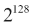
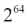

# 第三章。表达式和输出

表达式是 Python 编程的核心。正如第一章，*入门*中所述，Python 拥有丰富的运算符和内置函数集合。在本章中，我们将总结数据类型及其支持的运算符之间的关系。

可能最基础的程序就是执行计算并显示输出的程序。为了演示这一点，我们将在本章中探讨`print()`函数。我们将通过探讨多种生成格式化文本输出的方式来扩展基础知识。

我们需要详细研究 Python 的语法规则。这对于编写包含更复杂语句序列的脚本至关重要。这将为在第五章，*逻辑、比较和条件*中探讨复合语句奠定基础。

本章还将演示一些额外的字符串处理技术。我们将总结一些专注于字符串处理的标准库模块。我们将仔细研究`re`模块；我们使用这个模块来构建正则表达式，帮助解析字符串输入。在`str`类的内置方法和`re`模块之间，我们可以处理各种文本输入转换。

# 表达式、运算符和数据类型

Python 表达式由运算符和操作数构成。在第二章，*简单数据类型*中，我们介绍了数值和字符串操作数的一些基础知识，并探讨了各种运算符。我们在这里总结这些细节，以便我们可以讨论一些额外的运算符特性。

我们的数值操作数构成一个“塔”，包括以下类型：

| 类型 | 卡氏数 | 运算符数量 |
| --- | --- | --- |
| `complex` | 理想情况下，由一对无理数构成的最独特值，∞×∞。实际上（`float` × `float`）或大约的值。 | 最少的运算符；只有算术运算、一些内置函数和`cmath`模块。 |
| `float` | 理想情况下这是有理数与无理数的并集（∞+∞）。实际上更接近不同的值。 | 算术运算符、比较。许多额外的`math`模块和内置函数。 |
| `fractions.Fraction` | 理想情况下，这些是有理数（∞×∞）。实际上仅受可用内存限制，以表示两个整数。 | 算术运算符、比较、内置函数。 |
| `decimal.Decimal` | 理想情况下，有理数。实际上仅受内存限制。 | 算术运算符、比较、内置函数。 |
| `int` | 理想情况下，自然数，∞。实际上仅受内存限制。 | 算术运算符、比较、位操作运算符、库和内置函数。 |

必须导入`Fraction`和`Decimal`类的定义，其他三个类是内置的。我们通常使用如下语句：`from fractions import Fraction`。

塔背后的想法是许多算术运算符会将操作数从整数强制转换为浮点数，再到复数。大多数时候，这符合我们隐含的数学期望。如果我们不得不编写显式转换来计算`2.333*3`，我们会感到不高兴。Python 的算术规则确保我们会得到预期的浮点数结果。

`Decimal`类与隐式转换规则不太匹配：在尝试在`float`和`Decimal`之间进行算术运算的罕见情况下，不清楚如何进行。尝试从一个`float`值创建一个`Decimal`值会暴露出微小的错误，因为`float`值是近似值。尝试从一个`Decimal`值创建一个`float`值会违背`Decimal`的目标，即产生精确结果。面对这种歧义，将引发异常。这意味着我们需要编写显式转换。

字符串对象不会隐式地转换为数值。我们必须显式地将字符串转换为数字。`int()`、`float()`、`complex()`、`Fraction()`和`Decimal()`函数将字符串转换为适当类的数字对象。

我们可以将运算符分组到几个类别中。

+   **算术**：`+`、`-`、`*`、`**`、`/`、`//`、`%`

+   **位运算**：`<<`、`>>`、`&`、`|`、`^`、`~`

+   **比较**：`<`、`>`、`<=`、`>=`、`==`、`!=`

位运算符由`int`类的操作数支持。其他数字类没有这些运算符的有用实现。位运算符也定义在集合上，我们将在第六章中探讨，*更复杂的数据类型*。

## 在非数值数据上使用运算符

我们可以将一些算术运算符应用于字符串、字节和元组。结果主要集中在从较小的部分创建更大的字符串或更大的元组。以下是一些示例：

```py
>>> "Hello " + "world"
'Hello world'
>>> "<+>"*4
'<+><+><+><+>'
>>> "<+>"*-2
''
```

在第一个例子中，我们将`+`应用于两个字符串。在第二个例子中，我们在`str`和`int`之间应用了`*`。有趣的是，Python 通过连接几个副本的原始字符串对象来产生一个字符串结果。乘以任何负数会创建一个零长度的字符串。

# `print()`函数

当使用 Python 的交互式解释器（REPL）时，我们可以输入一个表达式，Python 会打印出结果。在其他上下文中，我们必须使用`print()`函数来查看结果。`print()`函数隐式地写入`sys.stdout`，因此结果将出现在我们运行 Python 脚本的控制台上。

我们可以向`print()`函数提供任意数量的表达式。每个值都会使用`repr()`函数转换为字符串。这些字符串会使用默认的分隔符`' '`组合，并以默认的行结束符`'\n'`打印。我们可以更改分隔符和行结束字符。以下是一些示例：

```py
>>> print("value", 355/113)
value 3.1415929203539825
>>> print("value", 355/113, sep='=')
value=3.1415929203539825
>>> print("value", 355/113, sep='=', end='!\n')
value=3.1415929203539825!
```

我们打印了一个字符串和一个表达式的浮点结果。在第二个示例中，我们将分隔符字符串从空格更改为`'='`。在第三个示例中，我们将分隔符字符串更改为`'='`，并将行结束字符串更改为`'!\n'`。

注意，必须按名称提供`sep`和`end`参数；这些被称为**关键字参数**。Python 语法规则要求关键字参数值在所有位置参数之后提供。我们将在第七章中详细检查这些规则，*基本函数定义*。

我们可以使用`,`作为分隔符来创建简单的**逗号分隔值**（CSV）文件。我们也可以使用`\t`来创建一种以制表符作为列分隔符的 CSV 文件。`csv`库模块在 CSV 格式化方面做得更加完善，特别是对于包含分隔符字符的数据项，它提供了适当的转义或引号。

要写入标准错误文件，我们需要导入`sys`模块，其中定义了该对象。例如：

```py
import sys
print("Error Message", file=sys.stderr)
```

我们已经导入了`sys`模块。这个模块包含了`sys.stderr`和`sys.stdout`的定义，用于标准输出文件。通过使用`file=`关键字参数，我们可以将特定的输出行定向到`stderr`文件，而不是默认的`stdout`。

这在脚本文件中可以很好地工作。在 REPL 提示符中使用标准错误文件看起来并不有趣，因为默认情况下，标准输出和标准错误都输出到控制台。一些 IDE 会为标准错误输出着色。我们将在第十章中查看许多打开和写入其他文件的方法，*文件、数据库、网络和上下文*。

# 检查语法规则

在*Python 语言参考*的 2.1 节中有九条基本的语法规则。我们在这里总结这些规则：

1.  有两种语句类型：简单和复合。简单语句必须在单个逻辑行中完整。复合语句以单个逻辑行开始，必须包含缩进的语句。复合语句的初始子句以冒号`:`字符结束。通过使用规则 5 和 6，可以将多个物理行合并为一个逻辑行。

    +   这里是一个典型的简单语句，完整地位于一个逻辑行中：

        ```py
        from decimal import Decimal
        ```

    +   这里是一个典型的复合语句，包含嵌套的简单语句，跨越两个逻辑行：

        ```py
        if a > b:
            print(a, "is larger")
        ```

1.  **物理行**以`\n`结尾。在 Windows 中，`\r\n`也被接受。

1.  **注释**以`#`开头，并持续到物理行的末尾。它将结束逻辑行。

    +   这里是一个注释的示例：

        ```py
        from fractions import Fraction # We'll use this to improve accuracy
        ```

1.  可以使用特殊的注释来注释文件编码。这通常不是必需的，因为大多数 IDE 和文本编辑器都会礼貌地处理文件编码。我们应该通常以 UTF-8 编码保存 Python 文件。较旧的文件可能保存为 ASCII。

1.  物理行可以通过在物理行结束字符前的`\`作为转义字符显式地合并为一个逻辑行。这很少使用，并且通常不推荐使用。

1.  物理行可以使用`()`、`[]`或`{}`隐式地合并为一个逻辑行；这些必须正确配对，逻辑行才能完整。以`(`开头的表达式可以跨越多个物理行，直到出现匹配的`)`。这被频繁使用，并且被强烈推荐。

    +   这里是一个依赖于`()`将四行物理行合并为一条逻辑行的语句示例：

        ```py
        print (
            "big number",
            2 ** 2048
        )
        ```

1.  空行只包含空格、制表符和换行符。交互式 REPL 使用空行来结束复合语句；REPL 是唯一有意义的空白行上下文。

1.  在复合语句的子句内部正确地分组语句需要**前置空白**。可以使用空格或制表符进行缩进。一致性是必要的。四个空格的缩进被广泛使用，并且强烈推荐。

1.  除了行首——它决定了复合语句的嵌套——可以在标记之间自由使用空白。注意，关于在语句中精确使用空格有一些偏好；**Python 增强提案**（**PEP**）编号 8 提供了一些建议。参见[`www.python.org/dev/peps/pep-0008/`](https://www.python.org/dev/peps/pep-0008/)以获取无休止争论的素材。

可能最重要的两条规则是规则 6 和规则 8。规则 6 意味着非常常见地使用`()`、`[]`和`{}`来强制将多个物理行合并为一条逻辑行。

规则 8 要求我们的缩进保持一致：缩进和缩出必须匹配。虽然可以使用制表符、空格以及任何一致但随意的制表符和空格的混合，但四个空格被高度推荐。制表符不被推荐，因为它们难以与空格区分。大多数编辑器都可以设置为将制表符键替换为四个空格。一个好的文本编辑器可以识别 Python 语法的基础知识，并且可以优雅地处理缩进和缩出。

### 小贴士

使用`()`允许一个语句跨越多个物理行；避免在行尾使用`\`。

使用四个空格的缩进。

还要注意，Python 在解析源代码时会合并相邻的字符串。我们可以有如下代码：

```py
>>> message = ("Hello"
... "world")
>>> message
'Helloworld'
```

这个赋值语句使用了一个不必要的`()`对，允许逻辑行跨越多个物理行。表达式仅仅是两个相邻的字符串，`"Hello"`和`"world"`。当 Python 解析源文本时，这两个相邻的字符串会被合并；在评估语句时只使用一个字符串。

此外，请注意，REPL 提示符已从 `>>>` 更改为 …，因为 REPL 识别第一行物理文本为部分语句。这是一个方便的提醒，说明我们的语句尚未完整。当解析到最后一个 `)` 时，语句才算完整，提示符才切换回 `>>>`。

# 分割、分区和连接字符串

在 第二章 中，我们探讨了字符串对象的不同的处理方法。我们可以将字符串转换成新的字符串，从非字符串数据创建字符串，访问字符串以确定字符串中的属性或位置，以及解析字符串以分解它。

在许多情况下，我们需要提取字符串的元素。`split()` 方法用于在字符串中定位重复的类似列表的结构。`partition()` 方法用于分离字符串的头和尾。

例如，给定一个形式为 `"numerator=355,denominator=115"` 的字符串，我们可以使用这两种方法来定位各种名称和值。以下是我们将这个复杂字符串分解成片段的方法：

```py
>>> text="numerator=355,denominator=115"
>>> text.split(",")
['numerator=355', 'denominator=115']
>>> items= _
>>> items[0].partition("=")
('numerator', '=', '355')
>>> items[1].partition("=")
('denominator', '=', '115')
```

我们使用了 `split(",")` 方法在每个 `,` 字符处将较长的字符串分割，创建了一个包含两个子字符串的列表对象。REPL 自动将所有表达式结果分配给一个名为 `_` 的变量。我们将对象分配给 `items` 变量，因为 `_` 的值会被每个表达式语句覆盖。

我们在 `items` 变量的每个项目上使用了 `partition("=")` 方法，将赋值分解为名称、`=` 和值。更复杂的应用可能需要对名称和值进行更复杂的处理。

`join()` 方法是 `split()` 方法的逆操作。它使用字符串对象的序列来创建一个由许多较小的字符串组成的单个长字符串。以下是一个使用字符串元组创建长字符串的示例：

```py
>>> options = ("x", "y", "z")
>>> "|".join(options)
'x|y|z'
```

我们创建了一个包含三个字符串的序列，并将其分配给一个名为 `options` 的变量。然后我们使用字符串 `"|"` 将 `options` 序列中的项目连接起来。结果是包含项目并通过给定字符串分隔的更长的字符串。

`split()` 和 `join()` 方法与单例很好地配合工作。如果我们尝试分割一个没有标点的单例项，我们会得到一个只有一个元素的序列。如果我们连接一个单例项，分隔符将不会被使用。

Python 的字符串方法为我们提供了处理各种字符串解析和分解的工具。对于更通用的解决方案，我们可能需要求助于更强大的工具。我们将在稍后查看正则表达式模块 `re`。

如果我们想要创建复杂的字符串，我们使用 `format()` 方法。我们将在下一节查看这个方法。

## 使用 format() 方法生成更易读的输出

可以使用 `format()` 方法进行复杂的字符串创建。我们创建一个模板字符串和可以插入模板的值。以下是如何工作的示例：

```py
>>> c=42
>>> "{0:d}°C is {1:.1f}°F".format(c, 32+9*c/5)
'42°C is 107.6°F'
```

我们创建了一个变量`c`，其值为 42。我们使用模板`"{0:d}°C is {1:.1f}°F"`来格式化两个值。索引为 0 的参数值是`c`，索引为 1 的参数值是表达式`32+9*c/5`的值。

模板字符串包括字面字符，以及替换字段。每个替换字段由`{}`包围。替换字段有两个组成部分，其语法为`{index:specification}`。*索引*部分标识从`format()`方法的参数中取出的哪个项目。*指定*部分显示如何格式化选定的对象。

示例给出了两个规范。一个是字符`d`，它是十进制整数转换。另一个是稍微复杂一些的`.1f`，它是一个小数点右侧有一位数字的浮点转换。

格式规范中有相当多的复杂性。格式规范有八个字段。语法概述如下：

```py
[[fill]align][sign][#][0][width][,][.precision][type]
```

我们用`[]`将每个字段围起来，以便在视觉上分组名称。请注意，所有字段实际上都是可选的，并且有默认值。

我们将按从右到左的顺序，按照重要性的顺序总结字段。

+   **类型**：这指定了转换的整体类型。根据 Python 对象的类型，有多个类型代码可用：

    +   对于字符串值，使用类型代码`s`。

    +   对于整数值，可以使用`d`、`n`、`b`、`o`、`x`或`X`类型代码。这些提供十进制、区域感知的数字、二进制、八进制或十六进制输出。

    +   对于浮点值，类型代码可以是`e`、`E`、`f`、`F`、`g`、`G`、`n`或`%`。`e`格式提供显式的指数。`f`代码显示没有指数的`float`值。`g`值被称为**通用**，根据数字的大小选择`e`或`f`。`n`代码是区域感知的，使用区域设置进行浮点表示。`%`乘以 100 并包含`%`符号。

+   **精度**：`.precision`值仅用于浮点格式。它是小数点右侧的位置数。

+   **逗号分隔符**：如果使用逗号字符，则包括美式逗号作为 1,000 的分隔符。这不是区域感知的，因此不能由操作系统和 Python 区域模块覆盖。

+   **宽度**：如果省略，数字将按必要宽度格式化。如果提供，数字将填充到这个宽度。默认情况下，填充使用前导空格，但可以通过提供`fill`和`align`字段的值来更改。

+   **0**：这强制用前导零填充到所需的宽度。这与填充和定位`0=`相同。

+   **#**：与`b`、`o`和`x`格式化一起使用，在数字前面包含前缀`0b`、`0o`或`0x`。

+   **符号**：默认情况下，正数没有符号，负数有前导 `-`。提供 `+` 的 *符号* 字段表示所有符号都明确显示。提供 `-` 的 *符号* 字段表示为正数包含额外空格，确保正负数在打印时使用固定宽度字体时在列中对齐。

+   **填充和对齐**：这会将空间填充到 *宽度* 字段的值。如果我们提供 *对齐* 而没有特定的 *填充* 字符，则默认字符是空格。我们虽然不能单独提供 *填充* 字符，但我们可以使用以下四种代码：

    +   `<` 或 *fill*`<` 将数据推向左边，填充将在右边。

    +   `>` 或 *fill*`>` 将数据推向右边，填充字符将用于左边。

    +   `^` 或 *fill*`^` 将数据居中，填充左右两边。

    +   `=` 或 *fill*`=` 将符号放在前面，填充字符将跟在符号后面。这将使符号在数字列中更加突出。

这里有一个使用相当复杂的格式规范的例子：

```py
>>> amount=Decimal("234.56")
>>> "Pay: ${0:*>10n} dollars".format(amount)
'Pay: $****234.56 dollars'
```

我们创建了一个具有 `Decimal` 值的对象 `amount`。然后我们在这个数字上使用了格式规范 `*>10n`。这使用了前导 `*` 字符来填充数字至 10 个字符。

# 标准字符串库总结

Python 的标准库提供了一些具有额外字符串处理功能的模块。

+   `string`：`string` 模块包含将 ASCII 字符分解为字母、数字、空白等常量。它包含了 `str.format()` 方法使用的格式化器的完整定义。我们将在下一节中探讨这一点。它还包含 `Template` 类，该类定义了一个字符串模板，可以将值插入其中。

+   `re`：正则表达式库允许我们定义一个模式，该模式可以用于解析输入字符串。我们将在下一节中探讨这一点。

+   `difflib`：`difflib` 模块用于比较字符串序列，通常来自文本文件。此模块中提供了多种比较算法。

+   `textwrap`：我们可以使用 `textwrap` 模块来格式化大块文本。

+   `unicodedata`：`unicodedata` 模块提供了确定 Unicode 字符类型的函数。Unicode 标准附件 44 定义了一组适用于 Unicode 字符的属性。一个常用的函数是字符的一般类别；这包括简单的拉丁规则，如 "Lu" 表示大写字母或 "Nd" 表示十进制数字。一般类别代码还包括 "Sk"，用于非字母符号，如修饰符号。

+   `stringprep`：这是 RFC 3454 的实现，它准备 Unicode 文本字符串以支持合理的字符串比较。

## 使用 re 模块解析字符串

正则表达式给我们提供了一个简单的方法，通过描述它们共有的模式来指定一组相关的字符串。正则表达式是集合论的一个元素，理论上可以定义所有可能的相关的字符串集合。理论上的匹配过程将是一个快速检查，以查看这个所有可能的字符串集合中的给定字符串是否是由该表达式生成的。由于从模式生成的所有可能的字符串集合可能是无限的，所以在实践中并不是这样工作的。

当我们使用 `re` 模块时，我们通常做三件事。首先，我们指定模式字符串。其次，我们将模式编译成一个对象，该对象可以有效地确定给定的字符串是否以及在哪里与模式匹配。最后，我们反复使用 `pattern` 对象来有效地匹配、搜索或解析给定的输入字符串。

作为具体的一个例子，我们需要处理包含如下行的输入：`Birth Date: 3/8/1987` 或 `Birth Date: 1/18/59`。注意，每个日期中的数字数量以及允许的空格量可能会有所不同。

我们可以执行以下三种常见的处理方式中的任何一种：

+   一个**匹配**正则表达式可能是 `Birth Date:\s+\d+/\d+/\d+`。`\s+` 子表达式意味着一个或多个空格。这个 `\d+` 子表达式的意思是一个或多个数字。匹配模式通常被设计为匹配整个字符串。

+   一个**搜索**正则表达式可能是 `\d+/\d+/\d+`。这个搜索模式包括一个或多个数字，`\d+`，以及字面符号，`/`。这个表达式描述了一个可以在给定字符串中找到的子串。

+   一个**解析**模式将各个数字组与周围上下文分开。这是对前面示例的一个轻微修改，包括 `()`，指定要捕获的内容。我们可能使用 `(\d+)/(\d+)/(\d+)` 来表示数字组应该被提取以进行进一步处理。

我们可以使用 Python 中的 `re` 模块来完成这些匹配、搜索和解析操作。

### 使用正则表达式

在 Python 程序中使用正则表达式的一般步骤有三个基本步骤。当然，我们必须使用 `import re` 来包含所需的模块。这三个步骤是：

1.  定义模式字符串。这几乎总是原始字符串，以 `r"` 开头，因为正则表达式字符串将充满我们不想被 Python 作为转义字符处理的 `\` 字符。因为 `\` 是 Python 语言转义符的开始，如果我们想在非原始字符串中写一个独立的 `\` 字符，我们必须将它们加倍。使用原始字符串来编写 `r"\d+/\d+/\d+"` 比使用 `\\d+/\\d+/\\d+` 更好。

1.  评估 `re.compile()` 函数以创建一个 `pattern` 对象。这个生成的对象将执行匹配给定目标字符串与正则表达式 `pattern` 对象的实际工作。

    我们可以将模式和编译合并到一个语句中，如下所示：

    ```py
    >>> date_pattern = re.compile(r"Birth Date:\s+(.*)")
    ```

1.  使用编译后的`pattern`对象来匹配或搜索候选字符串。成功匹配或搜索的结果将是一个`Match`对象。然后我们可以使用这个匹配对象，在需要的时候提取字段。例如：

    ```py
    >>> match = date_pattern.match("Should Not Match")
    >>> match
    >>> match = date_pattern.match("Birth Date: 3/8/87")
    >>> match
    <_sre.SRE_Match object at 0X82e60>
    ```

    在第一个示例中，`date_pattern.match()`表达式返回`None`，因为给定的字符串没有匹配正则表达式。在第二个示例中，给定的字符串与正则表达式模式匹配，并创建了一个`Match`对象。如果我们使用正则表达式进行解析，我们将查询`Match`对象以获取各种子字符串。

当我们有一个`Match`对象时，它可能包含匹配整体模式一部分的捕获子字符串。我们通常会使用各种`group()`方法来获取子字符串。以下是一些示例：

```py
>>> match.group()
'Birth Date: 3/8/87'
>>> match.group(1)
'3/8/87'
>>> match.groups()
('3/8/87',)
```

在第一个示例中，我们看到了所有匹配的内容。在第二个示例中，我们看到了组号一的价值，即正则表达式中的第一个部分，用`()`括起来。在最后的示例中，我们看到了正则表达式中的所有`()`括起来的组。由于只有一个这样的组，`groups()`的值是一个包含匹配文本的单项元组。

### 创建正则表达式字符串

创建正则表达式模式有许多规则，我们在这里将探讨其中的一些。完整的列表可以在`re`模块的*Python 标准库*文档的 6.2.1 节中找到。有关此主题的更多信息，请参阅 Packt Books 的*精通 Python 正则表达式*。请参阅[`www.packtpub.com/application-development/mastering-python-regular-expressions`](https://www.packtpub.com/application-development/mastering-python-regular-expressions)。

我们首先将查看“原子”正则表达式。然后我们将查看将正则表达式组合成更大正则表达式的规则。以下是一些简单的、原子的正则表达式：

+   任何单个字符。除了一些例外，这意味着几乎任何可打印字符。这些例外是正则表达式语言中有特殊意义的字符，包括`.`, `*`, `?`, `(`, `)`, `[`, `]`, `|`等。

+   `.`匹配任何字符。为了匹配点，使用转义字符`\`：`\.`匹配一个点。

+   一些转义序列匹配整个字符类。

    +   `\d`匹配任何数字。`\D`匹配任何非数字字符。

    +   `\s`匹配任何空白字符。`\S`匹配任何非空白字符。

    +   `\w`匹配任何单词字符。`\W`匹配任何非单词字符。默认情况下，这些遵循 Unicode 规则。我们可以覆盖它以遵循一个相当简单的仅 ASCII 规则集。

我们可以在正则表达式后面添加一些后缀。

+   `*`后缀表示前面的表达式可以匹配零次或多次。这相当于使前面的正则表达式模式既可选又可重复。

+   `+` 后缀表示前面的表达式可以匹配一次或多次。这意味着前面的模式是必需的，也可以重复。

+   `?` 后缀表示前面的表达式是可选的；它可以匹配零次或一次。

+   要实际匹配后缀字符，请使用 `\` 转义。例如，`\*` 匹配一个星号。

我们可以将单个表达式组合成更大的模式。以下是一些常见的组合技术：

+   正则表达式的序列是一个正则表达式。我们只需将表达式一个接一个地放在模式字符串中。当我们编写 `Birth` 这样的表达式时，它是一个由五个原子表达式组成的序列，每个表达式匹配单个字符。

+   `[]` 中的字符序列匹配给定的任意一个字符。这通常用于单字符表达式；我们经常看到像 `[a-zA-Z0-9_]` 这样的结构来匹配任何字母、数字或 `_`。为了匹配多字符字符串，我们在 `[]` 后使用后缀。我们可以使用 `r"[0-9a-fA-F]+"` 来匹配一个或多个十六进制数字。为了使 `-` 成为可选字符之一，它必须是列表中字符的第一个或最后一个。

+   由 `|` 分隔的两个正则表达式是一个正则表达式。任一都可以匹配。我们可能正在查看 `true|false` 这样的模式。我们必须匹配这两个正则表达式中的一个：`true` 或 `false`。为了匹配管道字符 `|`，它必须像这样转义 `\|`。

+   括号 `()` 包围的正则表达式是一个正则表达式。它也被保留为一个组，这样我们可以在解析时使用匹配的字符。为了匹配括号，它们必须被转义，`\(` 匹配一个 `(`。通过 `()` 捕获的子串可以通过匹配对象的 `group()` 方法访问。

这些规则帮助我们检查特定模式的细节。以下是我们可能用于解析一些输入的模式：

```py
r"(\w+)\s*[=:]\s*(.*)"
```

这是一个由 5 个正则表达式组成的正则表达式序列。

+   字符 `(\w+)` 创建了一个带有 `+` 后缀的括号内的正则表达式 `\w`。这匹配任何由一个或多个单词字符组成的序列。

+   `\s*` 是一个正则表达式。它是一个简单的表达式 `\s`，带有 `*` 后缀。它匹配零个或多个空白字符。这意味着在初始单词之后的空间是可选的。如果存在空格，可以使用任意数量的空格。

+   `[=:]` 是由两个单字符表达式 `=` 和 `:` 构成的正则表达式。它匹配这两个字符中的任意一个。

+   `\s*` 用于第二次出现，允许在 `=` 或 `:` 和值之间有任意数量的空白字符。

+   最终的正则表达式是 `(.*)`，它匹配任何字符序列。

当我们使用这个正则表达式时，如果创建了一个 `Match` 对象，它将有两个组。然后我们可以提取由这个正则表达式中的模式匹配的名称和值。

### 处理 Unicode、ASCII 和字节

`re`模块可以与字节以及 Unicode 字符串一起工作。我们必须根据我们正在处理的字符串类型提供适当的模式字面量。对于 Unicode，我们使用带有`r`前缀的模式字面量：`r"\w+"`。对于字节，我们使用`rb`前缀，`rb"\w+"`；这里的`rb`表示原始字节而不是原始 Unicode 字符。

字符类别的规则当然不同。匹配`"\w+"`模式的 Unicode 字符串可以包含任何广泛的 Unicode“单词”字符。使用`"\w+"`模式的字节对象将匹配来自集合`a-z`、`A-Z`、`0-9`和`_`的 ASCII 字符。

### 小贴士

在解析、搜索或与字节匹配时，我们必须明确使用字节为模式字面量。

我们可以在`re.compile()`中使用一个选项来强制 Unicode 模式遵循简化的 ASCII 规则。如果我们写`re.compile(r"\w+", re.ASCII)`，我们就用 ASCII 规则替换了`\w`的默认 Unicode 假设，即使我们正在进行 Unicode 字符串匹配。

## 使用区域模块进行个性化

当查看`str.format()`方法时，我们看到`n`格式类型根据用户的区域设置产生了一个格式化的数字。这意味着格式根据操作系统区域设置而变化。不同国家的用户将看到他们的个人区域设置被正确使用。

下面是一个使用`locale`模块获取特定区域设置格式化的示例：

```py
>>> import locale
>>> locale.setlocale(locale.LC_ALL,'')
'en_US.UTF-8'
>>> "{0:n}".format(23.456)
'23.456'
>>> locale.setlocale(locale.LC_ALL,'sv_SE')
'sv_SE'
>>> "{0:n}".format(23.456)
'23,456'
```

此脚本使用了`locale`模块来设置 Python 区域设置以匹配当前的操作系统区域设置。区域设置报告为美国使用的英语（`en_US`），首选的 Unicode 编码显示为 UTF-8。

`23.456`的格式化值显示为美国英语的小数点。这符合美国用户的预期。

然后，我们将区域设置切换到瑞典。语言报告为`sv_SE`，这意味着在瑞典使用的瑞典语。格式化的值切换到`23,456`，使用小数逗号，这对于瑞典用户来说是合适的。

让我们继续这个例子，并使用`locale.currency()`格式化函数：

```py
>>> locale.currency(23.54)
'23,54 kr'
```

金额使用`,`作为小数分隔符，以`kr`作为瑞典的本地货币。区域模块包括货币名称。

注意，我们提供了数值`23.54`，使用 Python 语法，这不会因区域设置而变化。Python 浮点字面量始终使用小数点。只有`currency()`函数的输出字符串使用`,`字符作为小数点分隔符。

# 摘要

在本章中，我们回顾了 Python 的基本数字类型和可用的运算符。我们查看了一些涉及字符串和数字数据混合的表达式。

为了查看我们脚本的输出，我们查看`print()`函数。这被广泛用于产生输出。`print()`函数是调试特别复杂函数或类的一个非常方便的工具。

此外，我们探讨了如何使用`str.format()`方法来生成格式化的数据。这为我们提供了将 Python 对象转换为可显示字符串的广泛技术。我们还探讨了使用诸如`split()`和`partition()`之类的字符串方法函数来解析字符串的一些方法。

在字符串处理的基本知识之外，我们探讨了如何使用`re`模块来匹配、搜索和解析字符串。这个模块功能强大，具有大量从输入字符串中提取有用信息的特性。

在第四章*变量、赋值和作用域规则*中，我们将通过使用变量来存储中间结果来扩展我们的脚本编写。我们还将探讨如何创建和删除对象。这些规则将有助于理解在复杂程序的不同部分中哪些变量是可见的。
