# 第六章。更复杂的数据类型

我们将探讨许多内置和标准库集合类型。这些集合提供了比简单元组集合更多的功能。我们将探讨`for`和`while`语句，这些语句允许我们处理集合的各个项。

我们将探讨一些我们可以用来处理数据集合的函数；这些包括`map()`、`filter()`和`functools.reduce()`函数。通过使用这些函数，我们不需要编写显式的`for`语句来处理集合。我们还将探讨更具体的归约类型，如`max()`、`min()`、`len()`和`sum()`。

我们还将探讨`break`和`continue`语句；这些语句修改`for`或`while`循环，允许跳过项或在循环处理所有项之前退出。这是集合处理语句语义的一个基本变化。

可变性和不可变性是理解对象行为的一部分。本章中的内置类型都是可变的。这与不可变对象（如字符串和元组）的行为方式大不相同。

# 可变性和不可变性之间的区别

在第二章中，我们探讨了不可变性问题。这是 Python 对象的一个重要特性。我们需要在第七章中探讨更多关于可变性的方面，*基本函数定义*。我们将在第十一章中探讨如何创建我们自己的可变类，*类定义*。

我们已经看到，Python 的各种类包括创建可变对象和不可变对象的类。不可变类包括所有的数字类、字符串、字节和元组。`tuple (247, 83, 148)`对象不能被更改：我们无法将新值赋给索引为 1 的项。

`tuple`对象具有`Sequence`的结构：我们可以根据它们的位位置提取项。然而，我们无法改变`tuple`对象的内部状态。

`list`也是`Sequence`类的子类。然而，我们可以改变`list`对象的状态，而无需创建新的`list`实例。

`Sequence`和`MutableSequence`的抽象基类定义在`collections.abc`模块中。该模块的文档显示了各种复杂类型之间的关系。

虽然`list`和`tuple`的一些功能相似，但它们针对不同的使用场景。不可变性的好处是简单性、减少存储需求以及某些类型处理的高性能。可变性的好处是单个对象可以经历内部状态的变化。

# 使用列表集合

Python 的`list`集合是其内置的可变序列。我们可以通过使用简单的显示来轻松创建列表对象，该显示仅提供用`[]`括起来的表达式。它看起来是这样的：

```py
fib_list = [1, 1, 3, 5, 8]
```

与元组一样，项目通过它们在`list`集合中的位置来识别。位置从左开始编号，从零开始。位置也可以用负数从右编号。列表中的最后一个值在位置-1，倒数第二个值在位置-2。

### 小贴士

索引值从零开始。索引位置 0 是第一个项目。索引值可以用负数反向进行。列表中的最后一个值在位置-1，倒数第二个值在位置-2。

我们也可以使用`list()`函数来创建列表。这将把许多种类的集合转换为`list`对象。不带参数使用`list()`会创建一个空的`list`，就像`[]`一样。由于`list()`函数在将集合转换为`list`对象方面非常灵活，我们将在后面的章节中更多地使用它。

我们可以使用`append()`等方法更新`list`集合：

```py
fib_list.append(fib_list[-2] + fib_list[-1])
```

在这个例子中，`fib_list[-1]`的值是列表中的最后一个元素，而`fib_list[-2]`是倒数第二个值。这个表达式创建了一个新数字，可以追加到`fib_list`对象中。

我们可以使用索引来操作列表中的单个元素，例如前一个示例中所示。`[]`中的值必须是一个整数，用于标识列表中的项。它看起来是这样的：

```py
>>> fib_list[2]
3
```

位置二的项（列表中的第三项）的值为 3。

我们可以使用切片符号提取子列表。切片使用`[]`中的多部分值。切片的结果始终是从原始列表对象构建的列表。有几种指定切片的方法，我们将展示一些示例：

```py
>>> fib_list[2:5]
[3, 5, 8]
>>> fib_list[2:]
[3, 5, 8, 13]
>>> fib_list[:-1]
[1, 1, 3, 5, 8]
```

第一个切片`[2:5]`从索引 2 开始，并在索引 5 之前停止。这意味着 2、3 和 4 的索引值被从原始列表中切片出来。由于列表从零开始索引，索引 2 是列表中的第三个位置。将切片视为“半开”区间是至关重要的。

### 小贴士

大多数 Python 使用“半开”区间。

当我们编写切片表达式`[a:b]`时，位置*a*是包含的，而位置*b*是不包含的。这个切片指定了所有满足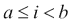的索引值*i*。切片中有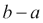个值。

第二个切片`[2:]`省略了结束位置，这意味着它从索引 2 开始，并包括列表末尾的所有项目。

第三个切片`[:-1]`省略了起始位置，这意味着它从索引 0 开始。结束位置给出为-1，即列表中的最后一个项目。由于切片在给定的最终位置之前停止，这个切片将省略列表中的最后一个项目。

我们可以使用`[:]`作为一个退化情况，其中起始和结束都被省略。这在制作整个`list`对象的浅拷贝时非常有效。

切片可以扩展到包括第三个参数。这允许我们指定一个*起始*、*停止*和一个*步长*值。我们可以这样做：

```py
>>> fib_list[::2]
[1, 3, 8]
>>> fib_list[1::2]
[1, 5, 13]
```

在第一个例子中，省略了起始和停止，所以我们将使用整个列表。步长值是 2，所以我们将使用偶数索引提取一个新的列表：0、2、4、……等等。

在第二个例子中，我们提供了一个起始和步长值。这将从索引 1 开始，每次增加 2。它将提取由奇数索引组成的列表：1、3、5、……等等。

我们可以使用负步长值以相反的顺序遍历列表。这可能会令人困惑，但它工作得非常好。

列表对象有几个运算符，包括`+`和`*`。我们还将查看我们可以使用的各种列表赋值语句，这些语句涉及赋值语句左侧的切片表达式。这些可以通过改变一些值来改变列表。

## 使用列表运算符

我们可以使用`+`运算符连接两个列表对象，例如`[1, 1] + [2, 3, 5]`。如果我们想扩展列表，我们可以使用这个扩展赋值语句：

```py
>>> fib_list += [ fib_list[-2] + fib_list[-1] ]
```

注意，我们不得不创建一个单例`list`集合，这样`+`运算符才能将新的`list`连接到现有的`list`上。

由于`list`对象是可变的，这个`+=`赋值将更新`list`对象；它通过添加新的`list`集合来扩展。这与`tuple`形成对比，在`tuple`中必须从两个原始`tuple`创建一个新的`tuple`，并将其赋给变量。

在第五章中，我们注意到像`list`和`tuple`这样的序列是逐项比较的。这意味着`[1, 1, 2] < [1, 2]`将会是`True`。

列表和其他序列也支持`in`运算符。我们可以询问特定值是否在`list`集合中。我们还可以确认给定值是否不在`list`集合中。这些是简单的布尔表达式，看起来像这样：

```py
>>> 13 in fib_list
True
>>> 12 not in fib_list
True
```

我们使用了`in`运算符来确认值 13 在`fib_list`变量中，而值 12 不在那个`list`对象中。

## 使用下标修改列表

我们可以使用赋值语句左侧的订阅或切片来更改`list`集合中的项目。订阅使用`[]`和单个整数值来标识列表中的项目。我们可以这样替换一个项目：

```py
fib_list[0]= 1
```

我们将用值 1 替换索引 0（第一个项目）。如果我们提到一个不在列表中的索引值，将会引发`IndexError`。

我们可以用不同的列表替换列表的任何简单切片。替换列表不必与原列表大小相同。实际上，它可以是空列表，这将有效地从列表中删除项目。以下是一个通过提供较短的替换来修改长切片的例子：

```py
fib_list[2:5]= [3]
```

我们指定了一个包含三个项目——索引值 2、3 和 4——的切片，并用只有一个项目的列表替换了这些项目。结果列表将看起来像这样：

```py
[1, 1, 3, 13]
```

位置 0 和 1 保持不变。同样，位置从 5 到原始列表的末尾也保持不变。

我们可以替换一个扩展切片——包括一个步长值——但替换的大小必须相同。如果我们没有提供正确的替换值数量，我们将得到一个`ValueError`异常。

## 使用方法函数修改列表

我们可以使用大量方法函数中的任何一个来修改`list`对象。列表的修改方法几乎总是返回`None`值。除了`pop()`方法外，修改方法不返回有意义的值。

还有提供有关列表信息的方法函数；这些函数必须返回一个值。我们将查看只读方法函数。

列表的修改方法包括`append()`、`clear()`、`extend()`、`insert()`、`pop()`、`remove()`、`reverse()`和`sort()`。以下是一些示例：

```py
>>> fib_list
[1, 1, 3, 5, 8, 13]
>>> fib_list.extend( [21, 34] )
>>> fib_list
[1, 1, 3, 5, 8, 13, 21, 34]
>>> fib_list.insert(0, 0)
>>> fib_list
[0, 1, 1, 3, 5, 8, 13, 21, 34]
>>> fib_list.remove(34)
>>> fib_list
[0, 1, 1, 3, 5, 8, 13, 21]
>>> fib_list.pop()
21
>>> fib_list.pop(0)
0
```

我们展示了包含六个项的初始列表。我们使用一个包含两个额外项的第二个列表扩展了列表，即`[21, 34]`。结果是两个原始列表组成的单个列表。

`insert()`方法有一个值和一个位置。在这个例子中，两者都是零。当我们使用`help(list.insert)`时，我们看到索引位置是第一个参数值。要插入该位置之前的位置的值作为第二个参数值提供。

当我们从列表中移除一个项时，我们提供要移除的项值。对于非常大的列表，这可能涉及大量的时间来搜索所需的项。

`pop()`方法做两件事。它通过位置移除一个项，并将该项作为结果值返回。默认位置是最后一个项，-1。我们也可以使用索引位置 0 从列表的开始移除项。

我们也可以使用`del`语句从列表中移除项。语句`del fib_list[0]`将从列表中移除第一个项。

我们还没有展示`reverse()`和`sort()`方法，这些方法会改变列表中项的顺序。`sort()`方法可能比这些方法更复杂。我们将在第八章*更高级的功能*中探讨排序。

我们没有给出`clear()`方法的示例。这个方法会从列表中移除所有项。

注意，除了`pop()`之外，我们必须明确请求显示`fib_list`对象，才能看到 Python 的 REPL 的任何输出。这些修改方法只返回`None`值。看到`a = a.append(x)`是一个常见的错误；这个语句总是将变量`a`设置为`None`。

## 访问列表

如前所述，我们可以使用索引或切片来访问列表。索引给我们一个单独的项。另一方面，切片会创建原始列表中项的浅拷贝。

访问列表的方法函数包括`count()`、`index()`和`copy()`。以下是一些示例，以展示这些函数的工作方式：

```py
>>> fib_list.count(1)
2
>>> fib_list.index(5)
3
```

`count()`方法计算所有与给定值相等的项的数量。在这种情况下，列表中有两个值等于 1。如果给定值在列表中找不到，计数将为零。

`index()`方法定位给定的项值，并返回该值在列表中的索引位置。如果该值不存在，将引发`ValueError`异常。

列表对象的`copy()`方法与空切片做同样的事情。表达式`fib_list[:]`和`fib_list.copy()`都是原始列表的副本。

# 使用集合函数

Python 提供了一系列与任何类型的集合一起工作的函数。这些包括`sorted()`、`max()`、`min()`和`sum()`。我们还有一些高阶函数，如`map()`、`filter()`以及整个`itertools`模块。我们将在第八章中讨论更多的高阶函数，*更高级的函数*。

`sorted()`函数从集合中返回一个排序后的列表。在排序过程中，它将给定的集合转换为`list`集合。如果集合没有定义适当的迭代方法，则无法使用此函数轻松排序。

`max()`和`min()`函数将集合简化为单个值：集合中的最大值或最小值。这种简化假设项目可以有意义地比较。考虑一个包含混合值的`tuple`：

```py
((255, 73, 108), 'Radical Red')
```

我们无法有意义地评估这种混合值集合的`max()`或`min()`。函数将被迫比较一个数字元组与一个字符串。这将引发`TypeError`异常。

`sum()`函数将数字集合简化为单个值。它可以用于几乎任何实现了`+`操作符的对象；我们可以合并一个列表的列表来创建一个非常长的列表。以下是一个使用这些集合函数与简单的`set`对象一起使用的示例：

```py
>>> some_set = {7, 2, 3, 5}
>>> sorted(some_set)
[2, 3, 5, 7]
>>> max(some_set)
7
>>> min(some_set)
2
>>> sum(some_set)
17
```

我们创建了一个包含四个整数的集合。当我们评估`sorted()`函数时，我们得到一个包含按升序排序的项的`list`对象。当我们评估`max()`或`min()`函数时，我们得到集合中的最大值或最小值。`sum()`函数将集合中的值相加。

# 使用集合

我们之前查看的所有集合都已经是序列：`str`、`bytes`、`tuple`和`list`都有可以通过其在集合中的位置访问的项。`set`集合是一个无序集合，其中项是存在或不存在。

`set`集合中的元素必须是不可变的；它们必须提供适当的哈希值以及等价性测试。这意味着我们可以创建包含数字、字符串和元组的集合。我们无法轻松地创建包含列表或集合的集合。

`set`显示的语法是一系列用`{}`括起来的表达式。

这里是一个使用数字构建的示例`set`：

```py
>>> fib_set = {1, 1, 3, 5, 8}
>>> fib_set
{8, 1, 3, 5}
```

我们通过将值包围在 `{}` 中创建了一个 `set` 对象。这种语法与创建 `list` 或 `tuple` 的语法非常相似。请注意，`set` 集合中的元素显示的顺序不同。顺序没有保证；不同的实现可能显示不同的顺序。

重要的是要注意，我们试图在 `set` 集合中包含两个整数 1 的实例。由于一个项目要么存在于 `set` 集合中，要么不存在，因此项目不能被包含第二次。重复的项目会被静默忽略。

我们也可以通过将 `set()` 函数应用于值集合来创建一个 `set` 集合。我们可以从一个 `list` 或 `tuple` 集合中创建一个 `set` 集合。我们还可以从一个简单的字符串中创建一个 `set` 集合：每个单独的字符将成为结果集合中的一个项目。我们可以使用 `set([1, 1, 3, 5, 8])` 来将 `set()` 函数应用于一个字面列表对象。

有趣的是，语法 `{}` 并不创建一个空的 `set`。这实际上创建了一个空的 `dict` 类。要创建一个空的 `set`，我们必须使用 `set()` 函数。

我们为集合对象提供了相当多的运算符。除了运算符之外，我们还有大量的方法函数。这些可以按以下方式分类：

+   **修改器**：这些修改 `set` 对象

+   **访问器**：这些访问列表并返回关于该 `set` 对象的事实。

`set` 集合的修改方法几乎总是返回 `None` 的值。除了 `pop()` 方法外，修改方法不返回值。提供列表信息的访问器必须返回一个值。我们首先看看运算符。

## 使用集合运算符

集合有许多运算符，这些运算符与数学运算符非常相似。映射利用了位运算符；它将它们解释为集合成员资格而不是整数值中的位。

我们有以下运算符：`|`、`&`、`-` 和 `^`，分别代表并集 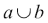、交集 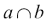、差集 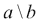 和对称差集 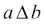。

这两个集合的例子如下：

```py
>>> words = set("How I wish".split())
{'How', 'I', 'wish'}
>>> more = set("I could recollect pi".split())
{'recollect', 'pi', 'I', 'could'}
```

每个集合都是通过将字符串分割成单独的空格分隔的单词来构建的。结果包含正确的元素；然而，顺序可能会变化。以下是每个运算符的示例：

```py
>>> words | more
{'wish', 'could', 'pi', 'I', 'How', 'recollect'}
>>> words & more
{'I'}
>>> words - more
{'How', 'wish'}
>>> words ^ more
{'recollect', 'wish', 'pi', 'How', 'could'}
```

并集运算符创建了一个新的集合，其中的元素来自两个集合。我们可以说 `a | b` 的并集创建了一个包含元素的集合，{*x*}，其中每个元素要么是 *a* 的元素 **或者** 是 *b* 的元素。布尔 **或** 运算符的概念与集合并集之间有一个整洁的平行关系。

交集运算符 `a & b` 找到既是 *a* 的元素又是 *b* 的元素。再次强调，布尔 **与** 运算符与集合交集之间有一个紧密的平行关系。

集合差集运算符将从左侧集合中移除右侧集合中的项目。我们可以这样说，结果元素是*a*的元素而不是*b*的元素。没有常用的布尔运算符与集合差集的定义相对应。

对称差集运算符是两个集合中独有的项目；公共的项目已被移除。这对应于**异或**布尔运算。我们可以这样说，结果是属于*a*或属于*b*但不属于两个集合中的成员。

## 使用方法函数突变集合

集合有一些突变函数与`list`集合的突变函数平行。这些方法包括`add()`、`remove()`、`discard()`和`clear()`。由于这些方法是突变函数，它们不会返回有用的值。`add()`方法与`list.append()`平行：它向集合中添加一个单独的项目。

`remove()`和`discard()`方法将从集合中移除一个项目；如果项目不在集合中，`remove()`方法将引发异常，而`discard()`方法总是成功，即使项目不在集合中。`clear()`方法将丢弃集合中的所有项目。

例如，我们可以这样更新我们的`fib_set`变量：

```py
f_n = max(fib_set)
f_n1 = max(fib_set-{f_n})
fib_set.add(f_n+f_n1)
```

我们已经找到了集合中的最大值，并将其分配给`f_n`变量。我们使用了集合差集运算符来创建一个不包含最大值的新的集合。当我们对这个新集合使用`max()`函数时，我们会得到次大的值。最后，我们使用`add()`方法突变集合以向集合中插入一个值。

集合差集运算符`-`不会改变集合：像所有算术运算符一样，它从操作数创建一个新的对象。然而，`add()`方法会改变给定的集合。

注意，斐波那契数并不是`set`集合的最佳用途。前两个斐波那契数都是 1。

`pop()`方法独特；它是一个既会突变又会返回值的突变函数。从集合中弹出的值将被任意选择。没有简单的方法可以预测哪个项目将被移除并返回。

每个运算符都有一个与运算符匹配的方法函数。以下运算符：`|`、`&`、`-`和`^`对应于`update()`、`intersection()`、`difference()`和`symmetric_difference()`方法。我们可以写`a | b`，或者我们可以写`a.update(b)`。两者都有相同的结果。

## 使用扩展赋值与集合

扩展赋值语句也与集合很好地工作。我们可以使用`|=`, `&=`, `-=`, 和 `^=`来根据另一个集合中的元素更新一个集合。例如，考虑这个语句：

```py
words |= more
```

`words`集合将被突变以包含`more`集合中的所有项目。

每个扩展赋值语句都有一个相应的更新方法。这些突变函数的方法名是`update()`、`intersection_update()`、`difference_update()`和`symmetric_difference_update()`。这些方法是突变函数，与扩展赋值语句相匹配。

## 使用运算符和方法函数访问集合

有几个算子可以算作集合访问器。也许访问集合最基本的方法是`in`运算符；这将检查特定元素是否存在于集合中。

```py
>>> 'I' in words
True
```

集合的比较运算符实现了基本的集合理论操作。当我们使用`<`、`<=`、`>`或`>=`在两个集合之间时，我们正在进行子集和超集比较。例如：

```py
>>> {'I'} < words
True
>>> {'How', 'I', 'wish'} <= words
True
```

在第一种情况下，集合`{'I'}`是`words`变量中集合的一个真子集。在第二种情况下，不正确的子集比较是`True`，因为这两个集合实际上是相等的。

我们还有与各种比较运算符匹配的方法函数。我们可以使用`isdisjoint()`、`issubset()`和`issuperset()`，以及`!=`、`<`和`>`运算符。

在`item in set`和`{item} <= set`之间几乎没有实际区别。当给定的`item`在`set`中时，`set–{item} != set`也会成立。这些数学等价性很有趣，但通常涉及额外的计算。

# 映射

Python 有几个映射集合。映射是键和值之间的关联。内置的映射集合是`dict`类。其他映射在`collections`库中定义，并且必须导入。

映射中的键必须是不可变的；它们必须提供适当的哈希值以及匹配的相等性测试。映射中的值没有限制；它们可以是可变的或不可变的。键的顺序由`dict`类不维护。

我们可以使用`{}`创建一个简单的`dict`显示；每个键和值都由冒号`:`字符分隔。

这里是一个简单映射的例子：

```py
sieve = {2: True, 3: True, 4: False, 5: True, 6: None, 7: None}
```

我们创建了一个简单的映射，其键都是整数，值是布尔值和`None`值的混合。

我们还可以使用`dict()`函数创建字典。这个函数可以从各种来源构建字典。我们可以提供一个现有的字典作为参数；`dict()`函数将制作该源字典的浅拷贝。我们可以提供一个`(key, value)`二元组的序列。它看起来像这样：

```py
>>> sieve = dict(
... [(2, True), (3, True), (4, False), (5, True), (6, None), (7, None)]
... )
```

这个例子从一个`(key, value)`二元组列表中创建了一个字典。创建的字典对象将与前面示例中显示的文本显示相匹配。

我们还可以使用`dict()`函数创建具有字符串键的字典。当我们提供关键字参数时，它们成为键。

```py
>>> cadaeic= dict( poe=3, e=1, near=4, a=1, raven=5, midnights= 9 )
>>> cadaeic
{'raven': 5, 'e': 1, 'near': 4, 'midnights': 9, 'poe': 3, 'a': 1}
```

重要的是要重复指出，内置`dict`对象中键的顺序是没有定义的。

我们也可以从一个键集合中构建一个字典，提供一个默认值。我们可以这样做：

```py
>>> sieve = dict.fromkeys( range(2,10) )
>>> sieve
{2: None, 3: None, 4: None, 5: None, 6: None, 7: None, 8: None, 9: None}
```

我们已经使用了`range()`函数来遍历一系列从 2 开始，到 10 之前结束的数字。这些数字随后被用来为字典创建键。与每个键关联的值是`None`的默认值。

## 使用字典运算符

所有 Python 映射，包括内置的`dict`，都使用[]中的键来获取、设置和删除项。语法看起来像这样：

```py
>>> cadaeic['poe']
3
>>> cadaeic['so']= 2
>>> del cadaeic['so']
```

我们提供了字面字符串来展示如何获取一个项，设置一个项，以及使用`del`语句删除一个项。

注意，在一般意义上定义字典比较是困难的。不清楚顺序比较应该只比较键，只比较值，还是键和值的组合。因此，只有定义了字典之间的`==`和`!=`比较。

## 使用字典修改器

我们可以在赋值语句的左侧使用`dict[key]`来修改字典。如果键不存在，这将插入给定的键和值；如果键已经存在，它将更改与该键关联的值。

我们还有许多可以用来修改字典对象的方法。这些方法包括`clear()`、`pop()`、`popitem()`、`setdefault()`和`update()`来修改字典对象。

`clear()`和`update()`方法不返回有用的值。`clear()`方法将清空字典。`update()`方法将额外数据折叠到现有字典中。此方法可以接受与创建字典的`dict()`函数相同的各种参数。第一个位置参数可以是字典对象或`(key, value)`二元组的序列。此外，我们可以提供任意数量的关键字参数；关键字将成为更新字典中的键。

这里有两个示例，展示了`update()`方法可以使用的不同方式：

```py
>>> cadaeic.update( {'so':2, 'dreary':6} )
>>> cadaeic.update( [('tired',5), ('and',3)], weary=5 )
>>> cadaeic
{'a': 1, 'weary': 5, 'near': 4, 'dreary': 6, 'e': 1,
'raven': 5, 'midnights': 9, 'and': 3, 'so': 2, 'poe': 3,
'tired': 5}
```

我们使用另一个包含两个条目的字典更新了`cadaeic`字典对象。然后我们使用一系列`(key, value)`二元组来应用进一步的更新。第二个示例还包括了一个额外的关键字参数，它将键`'weary'`插入到字典中。

`setdefault()`方法函数是一个有趣的特殊情况。这是`get()`访问器的变体。`get()`方法（以及`pop()`方法）有一个默认值的条款。`setdefault()`方法不仅仅在键缺失时返回默认值——类似于`get()`的行为。`setdefault()`方法更新字典以确保默认值现在在字典中。所有随后的`setdefault()`或`get()`方法都将找到字典中的键。

操作序列可能看起来像这样：

```py
>>> counter = {}
>>> counter.setdefault('a',0)
0
>>> counter['a'] += 1
>>> counter
{'a': 1}
```

我们创建了一个空字典并将其分配给`counter`变量。当我们使用`counter.setdefault('a',0)`时，我们将得到与键`'a'`关联的值，或者我们将得到默认值零。除了返回之外，默认值还将用于更新字典，确保给定的键有一个关联的值。

我们可以执行一个简单、易于理解的`counter['a'] += 1`操作，知道键`'a'`在字典中有一个值。要么键已经存在，`setdefault()`函数没有做任何事情，要么键不存在，`setdefault()`函数提供了那个默认值。

由于`setdefault()`返回一个值，我们可以将其优化为类似以下内容：

```py
>>> counter['b'] = counter.setdefault('b',0) + 1
```

这个`setdefault()`过程非常常见，因此在`collections`中有两个密切相关类。`defaultdict`类简单地将所有`get()`操作视为`setdefault()`。`Counter`类将隐式地对任何可迭代对象执行`count[key]+=1`过程，基于`defaultdict`类。

`pop()`方法有两种变体。典型的`pop()`实现将删除指定的键并返回与该键关联的值。除此之外，`popitem()`方法将从一个字典中删除并返回一个`(key, value)`对。这对将被任意选择。在这两种情况下，字典都会更新以删除值。

## 使用访问映射中项的方法

我们有几种方法可以访问映射中的项。首先，我们有一个`dict[key]`构造，它定位与给定键关联的值。如果键不存在，将引发`KeyError`异常。

`get()`方法也会返回字典中与键关联的值。`get()`方法还可以提供一个默认值。我们可以使用`cadaeic.get("word",4)`来定位键（在这个例子中是`"word"`）。如果找不到键，则返回默认值`4`。

`copy()`方法返回字典的浅拷贝。我们可以通过`a=dict(d)`或`a= d.copy()`来创建一个新的字典，它是原始字典的副本。两者是等效的。

有三种方法可以公开映射的重要功能：

+   `keys()`是从映射中获取的键序列。默认情况下，在将映射转换为另一个集合时使用。如果我们使用`set(cadaeic)`或`list(cadaeic)`，我们将看到集合或列表对象中仅有的键值。`sorted(cadaeic)`的值与`sorted(cadaeic.keys())`相同。

+   `values()`是从映射中获取的值序列。

+   `items()`是从映射中获取的`(key, value)`对序列。这个由两个元组组成的列表可以用来重建字典。如果我们使用`tuple(cadaeic.items())`，我们就创建了一个两个元组的元组。这个元组是不可变的，可以用作另一个映射的键或集合中的项。这是一种“冻结”字典以创建不可变副本的方法。

## 使用`collections`模块的扩展

*Python 标准库*包括`collections`模块。此模块为我们提供了对内置集合的多种替代方案。此模块具有以下附加集合：

+   我们可以导入`namedtuple`函数并使用它来创建基于基本`tuple`的变体，该变体包括除了通过位置索引识别的属性之外还有命名属性。

+   `deque`类定义了一个双端队列，类似于可以快速在两端执行`append()`和`pop()`函数的`list`集合。这个类的一些功能可以创建单端栈（后进先出，LIFO）或队列（先进先出，FIFO）结构。

+   在某些情况下，我们可以使用`ChainMap`而不是通过`update()`合并映射。结果是多个映射的视图，而不是单个更新后的映射。这可以非常快速地构建；搜索比单个映射要长。

+   `OrderedDict`映射是一个维护键创建顺序的映射。

+   `defaultdict`类是内置`dict`的子类，它使用工厂函数为缺失的键提供值。

+   `Counter`类是一个`dict`子类，用于计数对象以创建频率表。它也被用作更复杂的数据结构，称为多重集或包。

我们可以使用`Counter`类非常简单地创建字母频率。`Counter`会计算序列中项的出现次数。给定一个字符串，它是一个字符的可迭代序列，创建一个`Counter`可以直接得到一个频率表。以下是一个示例：

```py
>>> from collections import Counter
>>> text = """Poe, E.
... Near a Raven
...
... Midnights so dreary, tired and weary,
... Silently pondering volumes extolling all by-now obsolete lore.
... During my rather long nap - the weirdest tap!
... An ominous vibrating sound disturbing my chamber's antedoor.
... "This", I whispered quietly, "I ignore"."""
>>> freq= Counter(text)
>>> freq.most_common(5)
[(' ', 35), ('e', 23), ('n', 18), ('r', 17), ('i', 17)]
```

我们已从`collections`模块中导入了`Counter`类。我们还设置了一个变量`text`，它包含迈克·基思的一首诗的一部分。要了解更多关于这首诗的信息，请参阅[`www.cadaeic.net/naraven.htm`](http://www.cadaeic.net/naraven.htm)。

我们使用字符串作为来源创建了一个`Counter`对象。`Counter`对象将遍历序列中的每个项，计算该项的出现次数。当我们使用`most_common()`方法时，我们将看到集合中最常见的五个项。如果我们简单地打印`freq`变量的值，我们将看到所有字符的频率。

这些集合中的每一个都提供了独特的功能。如果内置的`dict`、`list`或`tuple`不能满足我们的需求，这些额外的集合中可能有一个更适合我们试图解决的问题。

# 使用`for`语句处理集合

`for`语句是一种非常灵活的方式来处理集合中的每个项。我们通过定义一个目标变量、项的来源和一系列语句来实现这一点。`for`语句将遍历项的来源，将每个项分配给目标变量，并执行一系列语句。Python 中的所有集合都提供了必要的方法，这意味着我们可以将*任何东西*用作`for`语句中项的来源。

这里有一些我们将要处理的示例数据。这是迈克·基思的诗《近乌鸦》的一部分。我们将移除标点符号，以便更容易处理文本：

```py
>>> text = '''Poe, E.
...      Near a Raven
...
... Midnights so dreary, tired and weary.'''
>>> text = text.replace(",","").replace(".","").lower()
```

这将把原始文本（包括大写、小写和标点符号）放入 `text` 变量中。我们使用了 第二章 中的一些方法函数，*简单数据类型*，来删除常见的标点符号，并返回一个完全由小写字母组成的整个字符串版本。

当我们使用 `text.split()` 时，我们得到一系列单独的单词。`for` 循环可以遍历这个单词序列，以便我们可以逐个处理。语法看起来像这样：

```py
>>> cadaeic= {}
>>> for word in text.split():
...     cadaeic[word]= len(word)
```

我们创建了一个空字典，并将其分配给 `cadaeic` 变量。`for` 循环中的表达式 `text.split()` 将创建一个子字符串序列。这些子字符串中的每一个都将分配给 `word` 变量。`for` 循环体——一个单独的赋值语句——将为分配给 `word` 的每个值执行一次。

结果字典可能看起来像这样（不考虑顺序）：

```py
{'raven': 5, 'midnights': 9, 'dreary': 6, 'e': 1,
'weary': 5, 'near': 4, 'a': 1, 'poe': 3, 'and': 3,
'so': 2, 'tired': 5}
```

映射或集合没有保证的顺序。你的结果可能会有所不同。

除了遍历序列之外，我们还可以遍历字典中的键。

```py
>>> for word in sorted(cadaeic):
...    print(word,  cadaeic[word])
```

当我们在 `tuple` 或 `list` 上使用 `sorted()` 时，会创建一个包含排序项的临时列表。当我们对映射应用 `sorted()` 时，排序应用于映射的键，创建一个排序键的序列。这个循环将按字母顺序打印出这首诗中使用的各种 *pilish* 单词的列表。

### 注意

Pilish 是英语的一个子集，其中单词长度很重要：它们被用作记忆辅助工具。

`for` 语句对应于“对所有”逻辑量词，。在一个简单的 `for` 循环结束时，我们可以断言源集合中的所有项目都已处理。为了构建“存在”量词，，我们可以使用 `while` 语句，或者在 `for` 语句体中使用 `break` 语句。

## 在 for 语句中使用字面值列表

我们可以将 `for` 语句应用于字面值序列。表示字面值最常见的方式之一是作为 `tuple`。它可能看起来像这样：

```py
for scheme in 'http', 'https', 'ftp':
    do_something(scheme)
```

这将为 `scheme` 变量分配三个不同的值。对于这些值中的每一个，它都会评估 `do_something()` 函数。

从这个例子中，我们可以看出，严格来说，括号 `()` 不是必需的，不能限定 `tuple` 对象。然而，如果值的序列增长，并且我们需要跨越多个物理行，我们就会想要 `add ()`，使 `tuple` 字面量更加明确。

## 使用 range() 和 enumerate() 函数

`range()`对象将提供一个数字序列，通常用于`for`循环中。`range()`对象是可迭代的，它本身不是一个序列对象。它是一个生成器，当需要时会产生项。如果我们不在`for`语句中使用`range()`，我们需要使用像`list(range(x))`或`tuple(range(a,b))`这样的函数来消耗所有生成的值并创建一个新的序列对象。

`range()`对象有三种常用的形式：

+   `range(n)`生成包括 0 但不包括`n`本身的递增数字。这是一个半开区间。我们可以说`range(n)`生成数字，*x*，如下所示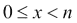。表达式`list(range(5))`返回`[0, 1, 2, 3, 4]`。这产生*n*个值，包括 0 和*n* - 1。

+   `range(a,b)`生成从`a`开始的递增数字，但不包括`b`。表达式`tuple(range(-1,3))`将返回`(-1, 0, 1, 2)`。这会产生*b* - *a*个值，包括*a*和*b* - 1。

+   `range(x,y,z)`生成如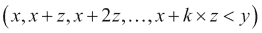所示的递增数字序列。这产生(*y*-*x*)/*z*个值。

我们可以这样使用`range()`对象：

```py
for n in range(1, 21):
    status= str(n)
    if n % 5 == 0: status += " fizz"
    if n % 7 == 0: status += " buzz"
    print(status)
```

在这个例子中，我们使用`range()`对象来生成值，*n*，如下所示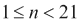。

我们使用`range()`对象来生成列表中所有项的索引值：

```py
for n in range(len(some_list)):
    print(n, some_list[n])
```

我们已经使用`range()`函数来生成名为`some_list`的序列对象之间的值，从 0 开始到其长度。

`for`语句允许多个目标变量。多个目标变量的规则与多个变量赋值语句相同：一个序列对象将被分解，并将项分配给每个变量。正因为如此，我们可以利用`enumerate()`函数遍历一个序列，并同时分配索引值。它看起来像这样：

```py
for n, v in enumerate(some_list):
     print(n, v)
```

`enumerate()`函数是一个生成器函数，它遍历源序列中的项，并产生一个包含索引和项的两个元组对的序列。由于我们提供了两个变量，两个元组被分解并分配给每个变量。

这个多赋值`for`循环有无数的使用场景。我们经常有列表-元组数据结构，可以用这个多赋值特性非常整洁地处理。在第八章中，我们将探讨这些设计模式中的许多。

# 使用 while 语句进行迭代

`while`语句比`for`语句更通用。我们将在两种情况下使用`while`循环。在没有有限集合来对循环迭代施加上限的情况下，我们将使用它；我们可以在`while`子句本身中建议上限。我们还将使用它来编写“搜索”或“存在”类型的循环；我们不是在处理集合中的所有项目。

例如，一个接受用户输入的桌面应用程序通常会使用`while`循环。应用程序会一直运行，直到用户决定退出；用户交互的数量没有上限。为此，我们通常使用`while True:`循环。建议使用无限迭代。

如果我们想编写一个字符模式用户界面，我们可以这样做：

```py
quit_received= False
while not quit_received:
    command= input("prompt> ")
    quit_received= process(command)
```

这将一直迭代，直到`quit_received`变量被设置为`True`。这将无限期地处理；迭代次数没有上限。

这个`process()`函数可能使用某种命令处理。这应该包括如下语句：

```py
if command.lower().startswith("quit"): return True
```

当用户输入`"quit"`时，`process()`函数将返回`True`。这将分配给`quit_received`变量。`while`表达式`not quit_received`将变为`False`，循环结束。

“存在”循环将遍历一个集合，在遇到满足某些标准的第一个项目时停止。这看起来可能很复杂，因为我们被迫明确地处理循环处理的两个细节。

这里有一个搜索第一个满足条件的值的例子。此示例假设我们有一个函数`condition()`，该函数最终会对某些数字为`True`。以下是我们可以如何使用`while`语句定位此函数为`True`的最小值：

```py
>>> n = 1
>>> while n != 101 and not condition(n):
...     n += 1
>>> assert n == 101 or condition(n)
```

当`n == 101`或`condition(n)`为`True`时，`while`语句将终止。如果此表达式为`False`，我们可以将`n`变量推进到值序列中的下一个值。由于我们按顺序从最小到最大迭代值，我们知道`n`将是`condition()`函数为真的最小值。

在`while`语句的末尾，我们包含了一个正式的断言，即`n`是 101 或对于给定的`n`值，`condition()`函数为`True`。编写这样的断言可以帮助设计以及调试，因为它通常会总结循环不变条件。

我们还可以使用`for`循环中的`break`语句编写这种类型的循环，我们将在下一节中探讨。

# `continue`和`break`语句

`continue`语句对于跳过项目而不编写深层嵌套的`if`语句非常有用。执行`continue`语句的效果是跳过循环体中的其余部分。在`for`循环中，这意味着下一个项目将从源可迭代对象中取出。在`while`循环中，必须小心使用，以避免无限迭代。

我们可能会看到类似这样的文件处理：

```py
for line in some_file:
    clean = line.strip()
    if len(clean) == 0:
        continue
    data, _, _ = clean.partition("#")
    data = data.rstrip()
    if len(data) == 0:
        continue
    process(data)
```

在这个循环中，我们依赖于文件表现得像一系列单独的行的方式。对于文件中的每一行，我们都从输入行中删除了空格，并将结果字符串分配给 `clean` 变量。如果这个字符串的长度为零，则该行完全由空格组成，我们将继续循环到下一行。`continue` 语句跳过了循环体内的剩余语句。

我们将行分成三部分：任何 `"#"` 前的部分，`"#"`（如果存在），以及任何 `"#"` 后的部分。我们将 `"#"` 字符和任何 `"#"` 后面的文本分配给同一个容易忽略的变量 `_`，因为我们不需要这两个 `partition()` 方法的输出结果。然后我们可以从分配给 `data` 变量的字符串中删除任何尾随空格。如果结果字符串的长度为零，则该行完全由 `"#"` 和任何尾随注释文本组成。由于没有有用的数据，我们可以继续循环，忽略这一行输入。

如果该行通过了两个 `if` 条件，我们可以处理结果数据。通过使用 `continue` 语句，我们避免了看起来复杂、深度嵌套的 `if` 语句。我们将在 第十章 *文件、数据库、网络和上下文* 中详细检查文件。

需要注意的是，`continue` 语句必须始终是 `if` 语句内部、`for` 或 `while` 循环内部的代码块的一部分。那个 `if` 语句的条件成为一个过滤条件，应用于正在处理的数据集合。`continue` 总是应用于最内层的循环。

## 提前退出循环

`break` 语句是循环语义的一个重大变化。一个普通的 `for` 语句可以总结为“对所有”。我们可以舒适地说，“对于集合中的所有项目，都处理了语句块。”

当我们使用 `break` 语句时，循环不再总结为“对所有”。我们需要改变我们的视角到“存在”。`break` 语句断言集合中至少有一个项目与导致执行 `break` 语句的条件匹配。

这里是一个 `break` 语句的简单示例：

```py
for n in range(1, 100):
    factors = []
    for x in range(1,n):
        if n % x == 0: factors.append(x)
    if sum(factors) == n:
        break
```

我们编写了一个受 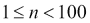 限制的循环。这个循环包含一个 `break` 语句，因此它不会处理 `n` 的所有值。相反，它会确定 `n` 的最小值，对于这个值，`n` 等于其因子的和。由于循环没有检查所有值，这表明在给定范围内至少存在这样一个数。

我们使用嵌套循环来确定数字 `n` 的因子。这个嵌套循环为范围 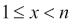 内的所有 `x` 值创建了一个序列 `factors`，使得 `x` 是数字 `n` 的一个因子。这个内部循环没有 `break` 语句，所以我们确信它会检查给定范围内的所有值。

这个条件成立的最小值是数字六。

重要的是要注意，`break` 语句必须始终是 `for` 或 `while` 循环内部 `if` 语句集中的部分。如果 `break` 不在 `if` 语句集中，循环将在处理第一个项目时始终终止。该 `if` 语句的条件成为总结整个循环的“存在条件”。

# 在循环中使用 `else` 子句

Python 的 `else` 子句也可以用在 `for` 或 `while` 语句以及 `if` 语句上。如果循环体中没有执行 `break` 语句，则 `else` 子句将执行。为了说明这一点，这里有一个人为的例子：

```py
>>> for item in 1,2,3:
...     print(item)
...     if item == 2:
...         print("Found",item)
...         break
... else:
...     print("Found Nothing")
```

这里的 `for` 语句将遍历一个短列表的文本值。当找到特定的目标值时，会打印一条消息。然后，`break` 语句将结束循环，避免执行 `else` 子句。

当我们运行这段代码时，我们会看到三行输出，如下所示：

```py
1
2
Found 2
```

三的值没有显示，也没有在 `else` 子句中显示的“未找到任何内容”消息。

如果我们将 `if` 语句中的目标值从二更改为不会出现的值（例如，零或四），那么输出将改变。如果 `break` 语句没有执行，那么 `else` 子句将被执行。

这里的想法是允许我们编写包含 `break` 和非 `break` 语句的对比语句集。包含 `break` 语句的 `if` 语句集可以在 `break` 语句结束循环之前在语句集中进行一些处理。`else` 子句允许在循环结束时进行一些处理，当没有执行任何与 `break` 相关的语句集时。

# 概述

我们已经探讨了三种可变集合：列表、集合和字典。Python 中内置的字典类只是众多映射中的一种，其他映射定义在标准库的 collections 模块中。列表允许我们收集通过列表中位置标识的项。集合允许我们收集一组唯一的项，其中每个项仅通过自身来标识。映射允许我们通过键来标识项。

对于集合，每个项必须是不可变的。对于映射，用作键的对象必须是不可变的。这意味着数字、字符串和元组通常用作映射键。

我们已经了解了`for`语句，这是我们处理集合中各个项目的主要方式。一个简单的`for`语句确保我们的处理已经针对集合中的所有项目完成。我们还探讨了通用的`while`循环。

在第七章，*基本函数定义*中，我们将探讨如何定义我们自己的函数。我们还将了解在 Python 中评估函数的多种方法。
