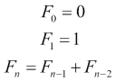

# 第十一章。类定义

Python 对象是类的实例。**类**通过方法函数定义了对象的行为。在本章中，我们将查看创建我们自己的类和对象。我们将从查看创建类和对象的基本知识开始。一旦我们看到了基本工具，我们就可以总结一些我们可以使用类定义来创建对象的方法，以及对象应该如何交互以实现我们期望的行为。

我们将查看更复杂类定义的一些元素。高级主题将包括类方法和静态方法的概念。关于 Python 的高级面向对象编程可以写成一整本书，所以我们将采取广泛但浅显的方法来查看类定义。

我们还将查看内置的抽象基类。我们可以使用这些基类来简化我们自己的类定义。在许多情况下，我们有类似于容器的类，可以利用基类，这样我们可以节省一些编程工作，并确保与其他 Python 特性的无缝配合。

# 创建一个类

面向对象程序的核心是类定义。`class`语句创建了一个对象，用于创建类的实例。当我们创建一个新的类`SomeClass`时，我们可以使用那个`SomeClass()`函数来创建具有类共同定义的对象。这是内置类的工作方式；例如，`int()`函数创建了一个`int`类的实例。

在 Python 中，`class`语句包括描述每个实例行为的函数方法。除了普通方法外，还有一些与 Python 操作紧密相关的“特殊”方法。

我们没有义务以任何正式的方式为类提供特定的属性（也称为实例变量）。对象的实例变量是灵活的，并且不是预先定义的。

`class`语句的初始子句提供了类名。它还可以命名任何超类，从这些超类继承特性。类主体的主要内容包含方法定义，这些定义是通过缩进的`def`语句创建的。

在某些情况下，我们不需要提供语句块。我们经常创建像这样的定制异常类

```py
class MyAppError(Exception):
    pass
```

在这个例子中，我们提供了一个新的类名`MyAppError`，并指定它继承自`Exception`类的特性。我们不需要对该基定义进行任何修改；由于我们必须提供一个缩进的语句块，我们使用`pass`语句来完成`class`语句的语法。

由于这个类的工作方式与任何其他异常类似，我们可以使用类似`raise MyAppError("Some Message")`的语句来引发这个新异常类的一个实例。

# 在类中编写语句块

`class` 语句内部的语句集通常是一系列方法定义。每个方法都是一个绑定到类的函数。语句集还可以包括赋值语句；这些将创建作为整个类定义一部分的变量。

这是一个简单的用于 (*x*, *y*) 坐标对的类：

```py
class Point:
    """
    Point on a plane.
    """
    def __init__(self, x, y):
        self.x= x
        self.y= y
    def __repr__(self):
        return "{cls}({x:.0f}, {y:.0f})".format(
            cls=self.__class__.__name__, x=self.x, y=self.y)
```

我们提供了一个类名 `Point`。我们没有明确提供超类；默认情况下，我们的新类将是 `object` 的子类。按照惯例，大多数内置类的名称，如 `object`，以小写字母开头。我们将定义的所有其他类的名称都应该以大写字母开头；因此，我们的名称为 `Point`。我们还为这个类提供了一个简短的文档字符串。在 第十四章，*完善 - 单元测试、打包和文档* 中，我们将探讨扩展这个文档字符串。

我们在类中定义了两种方法。第一种方法有一个特殊的名称 `__init__()`。在类中定义的任何方法的第一参数都必须包括实例变量。这个变量，通常称为 `self`，将是相关对象的引用。当我们给变量 `self.x` 赋值时，这将设置 `Point` 类特定实例的 `x` 属性。当方法被调用时，实例变量会隐式提供。

Python 不会对允许的实例变量进行任何正式的定义，而是依赖于 `__init__()` 特殊方法来初始化适当的实例变量。默认情况下，一个对象可以在任何时候添加额外的属性。

第二种方法有一个特殊的名称 `__repr__()`。为了成为一个正确的方法，第一个参数必须是实例变量 `self`。此方法必须返回一个表示我们的坐标对的字符串。如果我们不重写这个特殊方法，我们将得到一个默认的字符串表示，看起来像这样：`<__main__.Point object at 0x100623e10>`。我们的实现使用 `self.__class__.__name__` 来利用对象的类，以便任何子类都将正确的类名插入到输出结果中。

特殊方法名在 Python 中无处不在。使用它们允许我们的类与内置的 Python 功能无缝集成。有大量的特殊方法名——太多以至于无法在本书中全部审查。所有这些名称都以 `__`（两个下划线）开始和结束。避免与这种命名约定冲突很容易。没有好的理由在我们的应用程序编程中使用 `__` 命名，我们选择的任何这种形式的名称都可能成为 Python 的隐藏特性。

注意，我们没有在两个方法函数中包含占位符文档字符串。我们省略了它们以使示例简短，并专注于类定义。一般来说，类的每个方法都将有一个文档字符串，以提供对该方法的简洁、有用的总结。

在第四章中，我们介绍了命名空间的概念，它是一个用于存储变量的容器。`self`变量是对象，它是一个我们可以插入属性变量的命名空间。

我们可以像这样创建类的实例：

```py
>>> p_1 = Point(22, 7)
>>> p_1.x
22
>>> p_1.y
7
```

我们像函数一样使用了类名`Point`。首先创建了一个空对象。然后，将参数值提供给`__init__()`特殊方法以初始化该空对象。请注意，我们没有显式地为实例变量`self`提供值。

要执行`__repr__()`特殊方法，我们可以这样做：

```py
>>> p_1
Point(22, 7)
```

当打印对象时，将应用内置的`repr()`函数以获取对象的字符串表示。此内置函数依赖于对象的`__repr__()`特殊方法来为对象提供字符串表示。在评估`__repr__()`方法时，对象`p_1`被隐式地分配给实例变量`self`。

我们实现的`__repr__()`特殊方法产生了一个包含*x*和*y*坐标值的字符串。我们使用了`.0f`作为格式说明符，为`self`实例变量的`x`和`y`属性提供了小数点右边的零位。

# 使用实例变量和方法

上一节中的`Point`类定义只包含两个特殊方法。我们现在将添加第三个非特殊方法。这是该类的第三个方法：

```py
    def dist(self, point):
        return math.hypot(self.x-point.x, self.y-point.y)
```

此方法函数接受一个名为`point`的单个参数。此方法函数的主体使用`math.hypot()`计算同一平面上的两点之间的直接距离。

这是我们如何使用此函数的方法：

```py
>>> p_1 = Point(22, 7)
>>> p_2 = Point(20, 5)
>>> round(p_1.dist(p_2),4)
2.8284
```

我们创建了两个`Point`对象。当评估`p_1.dist(p_2)`表达式时，分配给`p_1`变量的对象将被分配给`self`变量。这是执行相关处理的`Point`实例。分配给`dist()`方法的参数，分配给`p_2`变量，将被分配给`point`参数变量。

### 小贴士

当我们评估`obj.method()`时，`obj`对象将是`self`实例变量。

默认情况下，我们创建的对象是可变的。这是`Point`对象的另一个方法——这会改变内部状态：

```py
    def offset(self, d_x, d_y):
        self.x += d_x
        self.y += d_y
```

此方法需要两个值，这些值用于偏移`Point`对象的坐标。该方法将新值分配给对象的`x`和`y`属性。

当我们使用此方法时，会发生以下情况：

```py
>>> p_1.offset(-3, 3)
>>> p_1.x
19
>>> p_1.y
10
```

我们已经评估了与对象`p_1`关联的偏移方法。如前所述，`self`实例变量将与`p_1`引用的相同对象。当我们为`self.x`赋值时，这将改变`p_1`引用的对象，设置`p_1.x`。

# Pythonic 面向对象编程

我们已经看到了 Python 面向对象方法的一些重要特性。也许最重要的是，Python 缺乏变量名和类型之间的静态绑定；任何类型的对象都可以赋给任何变量。名称不是由编译器静态解析的。Python 的动态名称解析意味着我们可以将我们的程序视为在类方面完全通用的。

当我们评估`obj.attribute`或`obj.method()`时，有两个步骤。首先，必须解析名称`attribute`或`method`。其次，评估引用的属性或方法。

对于名称解析步骤，有几个命名空间被搜索以确定名称的含义。

+   搜索`obj`实例的局部命名空间以解析名称。对象的命名空间作为`obj.__dict__`可用。属性名称（和值）通常在对象的自身命名空间中找到。另一方面，方法通常不是对象实例的一部分。

+   如果名称不是对象的局部名称，则搜索对象类的局部命名空间。类的命名空间作为`obj.__class__.__dict__`可用。方法名称通常在类的命名空间中找到。类的属性也可能在这里找到。

+   如果名称不在类中，将搜索超类以找到名称。整个超类格状结构被组装到`obj.__class__.__mro__`值中。这定义了**方法解析顺序**（**MRO**）；此序列中的每个类都会搜索该名称。

一旦找到名称，Python 必须确定其值。对于不指向可调用方法的名称，即属性，所引用的对象是该属性的值。指向可调用方法的名称将绑定参数值，并将其作为函数评估。该函数的结果是值。

之前描述的“搜索”依赖于内置的`dict`类。这使用散列来快速确定名称的存在或不存在。从 Python 中可用的复杂和灵活的类行为中几乎没有性能成本。

如果在运行时提供了一个不适当的类型对象，那么在对象中找不到方法名或属性名，将引发`AttributeError`异常。在我们之前的例子中，我们可以尝试评估`p_1.copy()`。`copy`这个名字既没有定义在我们的类中，也没有定义在任何超类中，所以会引发`AttributeError`异常。

## 尝试进行类型转换

虽然 Python 变量仅仅是附加到对象上的名称，但底层对象具有非常严格的类型。无法为新值分配`__class__`名称，该名称定义了对象的类。

**类型转换**在一些静态编译的语言中是必需的，以便能够创建泛型数据结构。在这些语言中，我们可以将一个类型的引用转换为另一个类型的引用。由于方法解析的动态性，Python 中不需要这种类型的转换。

所有 Python 集合都可以包含混合类型的对象。我们可以轻松地评估这一点：

```py
>>> map(lambda x:x+1, [1, 2.3, (4+5j)])
```

lambda 表达式 `x+1` 可以应用于 `int`、`float` 或 `complex` 类型，而无需进行任何类型的类型转换操作。这是因为每个类都提供了适当的特殊方法函数来实现整数的加法。

## 设计封装和隐私

关于 Python 类定义的一个常见问题是，如果所有属性和成员名称都是公开的，我们如何实现**封装**。一些程序员对此表示担忧：

```py
>>> p_2 = Point(20, 5)
>>> p_2.y = 6
>>> p_2
(20, 6)
```

我们创建了一个对象 `p_2`。然后我们修改了该对象的一个属性值，而没有使用该对象的方法函数。这并不是没有使用封装设计原则的失败：该类有一个适当的封装设计。该类没有可以被编译器静态检查的实现。

Python 原则可以用以下观察结果来概括：

> *我们都是成年人。*

没有充分的理由去创建私有、公开和受保护的方法和属性这种复杂性，因为 Python 代码以源代码的形式分发，任何人都可以检查源代码，以了解弯曲或破坏封装可能带来的后果。首选的方法是为类和方法编写清晰的文档字符串，并提供单元测试来证明属性和方法被正确使用。

我们可以使用单个下划线 `_` 作为前缀来表示方法或属性不是类公共接口的一部分。Python 文档工具会礼貌地忽略这些名称，以便可以自由地更改这些实现细节。以下划线开头的名称被认为是可能会在没有通知的情况下更改的；依赖于这些名称可能会导致程序以意想不到的方式崩溃。

在某些语言中，需要“获取器和设置器”方法来公开类的属性。在 Python 中，我们可以直接使用对象的 `__dict__`，简化了内省。我们还可以使用内置函数 `getattr()`、`setattr()` 和 `delattr()` 来以字符串的形式处理属性名称。例如：

```py
>>> p_2.__dict__.keys()
dict_keys(['y', 'x'])
>>> getattr(p_2, "x")
20
```

这显示了我们可以如何动态地获取属性的名字和值。在第一个例子中，我们查看对象的内部命名空间 `__dict__` 来获取属性。在第二个例子中，我们使用了内置的 `getattr()` 函数来获取属性的值。

# 使用属性

Python 允许我们创建方法，它们可以用作属性。这为我们提供了从对象获取派生值时非常愉悦的语法。看起来像属性的方法定义为**属性**。我们将使用两个额外的方法定义我们的 `Point` 类：

```py
    @property
    def r(self):
        return math.sqrt(self.x**2 + self.y**2)
    @property
    def θ(self):
        return math.atan2(self.y, self.x)
```

我们使用 `@property` 装饰器定义了两个函数。这个装饰器可以与只有一个参数 `self` 的实例变量的函数一起使用。

下面是如何使用这些属性的例子：

```py
>>> p = Point(12, 5)
>>> round(p.r, 1)
13.0
>>> round(math.degrees(p.θ), 1)
22.6
```

我们像访问对象的简单属性一样访问了这些方法，使用 `p.r` 和 `p.θ` 比在复杂公式中写 `p.r()` 和 `p.θ()` 更愉快。前面的属性是显式**只读**的。如果我们尝试给 `p.r` 或 `p.θ` 赋值，我们会得到一个异常。

我们将在第十三章《元编程和装饰器》中回到 `@property` 装饰器的话题。

# 使用继承来简化类定义

我们可以使用**继承**——在子类中重用超类的代码，这可以简化子类的定义。在先前的例子中，我们创建了一个 `MyAppError` 类作为 `Exception` 的子类。这意味着 `Exception` 的所有特性都将可用给 `MyAppError`。这是因为名称搜索的三个步骤：如果方法名在对象类中找不到，那么会搜索所有超类以查找该名称。

这里是一个子类的例子，它只覆盖了父类的一个方法：

```py
class Manhattan_Point(Point):
    def dist(self, point):
        return abs(self.x-point.x)+abs(self.y-point.y)
```

我们定义了一个名为 `Manhattan_Point` 的 `Point` 子类。这个类具有 `Point` 的所有特性。它对父类进行了一个单一的改变。它为 `dist()` 方法提供了一个定义，该定义将覆盖 `Point` 超类中的定义。

下面是一个示例，展示了方法解析的工作原理：

```py
>>> p_1 = Point(22, 7)
>>> p_2 = Manhattan_Point(20, 5)
>>> round(p_1.dist(p_2),4)
2.8284
>>> round(p_2.dist(p_1),4)
4
```

我们创建了两个对象：`p_1` 是 `Point` 的一个实例，而 `p_2` 是 `Manhattan_Point` 的一个实例。我们没有编写 `Manhattan_Point` 的 `__init__()` 方法；它是从 `Point` 继承的。当我们评估 `p_1.dist()` 时，我们使用的是 `p_1` 的类 `Point` 中的 `dist()` 方法。另一方面，当我们评估 `p_2.dist()` 时，我们使用的是 `p_2` 的方法，即 `Manhattan_Point` 的方法。

通过继承重用是一种保证几个类具有相同行为的方法。这是一个重要的面向对象设计原则，有时被称为**Liskov 替换原则**（**LSP**）。`Manhattan_Point` 的一个实例可以在任何需要 `Point` 的实例的地方使用。

## 使用多重继承和混入设计模式

继承有时被可视化为一个简单的相关类层次结构。如果每个子类最多只有一个父类，那么任何给定的子类与 `object` 超类之间将存在一条关系链。这种单继承模型并不总是合适的。在某些情况下，一个类将包含一些不适合线性血统观念的不同特性。

`collections` 抽象基类模块，`collections.abc`，包含了许多多重继承的例子。这里的设计模式是有一个中心类层次结构，它定义了 `List`、`Set` 或 `Mapping` 集合的基本特性。其他特性通过可重用的 **混合** 类包含在内。

例如，`Set` 类是 `Container` 的子类。在这个定义中混合了 `Sized` 和 `Iterable` 类定义的特性。`Sized` 混合类包含了 `__len__()` 特殊方法。`Iterable` 混合类包含了 `__iter__()` 特殊方法。

这导致最终类成为可重用超类的组装。我们可以利用这一点来创建包含不同特性混合的自己的类。

Python 通过依赖于 `class` 语句中类命名的顺序来管理多重继承。这构建了用于在继承图中搜索名称的 `__mro__` 值。以下是一个例子：

```py
>>> from collections.abc import Mapping
>>> Mapping.__mro__
(<class 'collections.abc.Mapping'>, <class 'collections.abc.Sized'>,
<class 'collections.abc.Iterable'>, <class 'collections.abc.Container'>,
<class 'object'>)
```

我们导入了一个抽象基类。当我们查看 MRO 时，我们看到 Python 将按顺序在 `Mapping`、`Sized`、`Iterable`、`Container` 和 `object` 中搜索名称。

当使用此类混合类进行设计时，我们通常在各个类之间分配责任，以避免在用于组装最终类定义的各种超类之间发生名称冲突。

# 使用类方法和属性

通常，我们期望对象是有状态的，而类是无状态的。虽然典型，但无状态类不是必需的。我们可以创建具有属性和方法类对象的类。在罕见的情况下，类也可以有可变属性。

类变量的一种用途是创建适用于类所有实例的参数。当一个名称没有被对象实例解析时，接下来将搜索类。以下是一个依赖于类级属性的类的小层次结构：

```py
class Units(float):
    units= None
    def __repr__(self):
        text = super().__repr__()
        return "{0} {1}".format(text, self.units)

class Height(Units):
    units= "inches"
```

`Units` 类定义扩展了 `float` 类。它引入了一个名为 `units` 的类级属性。它覆盖了 `float` 的 `__repr__()` 特殊方法。此方法使用超类的 `__repr__()` 方法来获取值的本质文本表示。然后包括 `units` 属性的值。

当我们评估 `self.units` 时，将进行对名称的三步搜索。`Height` 的实例不会提供 `units` 属性。然而，`Height` 类将提供 `units` 属性；其值将是 `inches`。

当我们创建一个 `Height` 对象的实例时，我们将看到单位：

```py
>>> Height(61.5)
61.5 inches
```

当我们打印 `Height` 的实例时，`print()` 函数将使用内置的 `repr()` 函数来获取字符串表示。`repr()` 函数使用对象的 `__repr__()` 特殊方法。我们已经重写了 `__repr__()` 特殊方法，以包含 `units` 属性中的文本。

由于所有属性都是公开可用的，我们可以编写类似 `Height.units= "furlongs"` 这样的代码，这将导致所有后续使用 `Height` 类对象的操作都会显示不同的单位。更改类级别的属性通常不是一个好主意，但并没有任何正式的禁止方式。

回想一下政策：*我们都是成年人。*

## 使用可变类变量

一些应用程序可能需要一个作为整体类一部分的适当可变变量。在寻找名称的三个步骤中，会找到一个类级别的属性名称：首先查找对象，然后是类，最后是超类。这意味着即使名称不在对象实例中，而是在类或父超类中定义，我们也可以成功评估 `self.class_level_name`。

然而，如果我们尝试使用类似 `self.class_level_name` 的名称来分配类级别的变量，我们将在实例中创建一个新的属性。由于实例名称现在会被首先找到，类级别的名称将不再可见。

如果我们想要更新一个类级别的变量，我们必须显式地使用类名，避免使用 `self` 实例变量。以下是一个为每个创建的实例分配序列号的类：

```py
class Sample:
    counter= 0
    def __init__(self, measure):
        Sample.counter += 1
        self.sequence = Sample.counter
        self.measure = measure
```

我们创建了一个类级别的变量 `counter`，当类被创建时初始化为零。`__init__()` 方法将增加类级别的 `counter` 属性。为了避免在实例中创建变量，我们使用类名 `Sample` 而不是 `self`。除了更新 `Sample.counter`，此方法还设置实例的两个属性：将 `Sample.counter` 的当前值分配给序列属性，并将给定的测量值也保存起来。

重要的是要注意，在方法函数内部，我们可以使用 `self.counter` 和 `Sample.counter` 来访问同一个对象。当没有名为 `counter` 的实例变量时，这将是正确的。然而，为了在类中分配变量，我们只能使用 `Sample.counter`。

## 编写静态方法

在某些情况下，我们会在类中包含一个实际上不依赖于任何实例变量的方法。在许多语言中，这种方法被称为 **静态**。使用 *静态* 一词来指代类级别的特性来自 C++ 和 Java；它也被用于 Python。

对于类级别的属性，我们没有任何语法上的复杂性。正如我们在之前的例子中所看到的，任何不属于实例的属性都会在类中搜索；实例变量和类变量之间的区别不需要任何额外的语法。

然而，类级别的方无法将实例变量作为第一个定义的参数。这是一个重要的语法变化。我们使用`@staticmethod`装饰器来注释没有实例变量的方法。

我们将扩展前面展示的`Sample`类，以包括一个有效性检查。检查有效性不是一个合适的实例方法：我们不应该使用无效值创建一个实例。我们将把这个方法添加到类中：

```py
    @staticmethod
    def validate(measure):
        m= float(measure)
        if 0 <= m < 12:
            pass
        else:
            raise ValueError("Out of range")
```

我们已经用`@staticmethod`装饰器标记了这个方法。这个方法没有`self`变量，因为它不适用于类的实例。这个方法只能通过`Sample.validate(some_value)`来调用。这个方法将确认`measure`参数的值是否有效，或者它会引发一个异常，详细说明为什么该值无效。

我们可能使用这个方法来创建和使用`Sample`对象的实例：

```py
try:
    Sample.validate(some_data)
    s= Sample(some_data)
    *… etc. …*
except Exception as ex:
    print(ex)
```

我们将简单地评估`Sample.validate()`方法来开始`try`语句。如果这个方法没有引发异常，给定的值是有效的。如果这个方法引发了异常，我们将写入一个错误消息并继续处理。通常，我们会在文件输入循环中有这种处理：我们会处理好的数据，并将关于坏数据的消息写入日志。

Python 还提供了一个`@classmethod`装饰器。这是一个更专业的工具。它将类作为参数而不是实例提供。它允许我们编写可以与各种类一起工作的方法。这可能在元类中使用。

我们将在第十三章*元编程和装饰器*中回到装饰器的话题。

# 使用`__slots__`来节省存储

`object`超类的默认行为是为对象的属性创建一个`dict`。这提供了快速的名称解析。这意味着对象可以非常自由地添加和更改属性。由于使用哈希来通过名称定位属性，内部的`dict`对象可能会消耗相当多的内存。

我们可以通过在创建类时提供一个特定的属性名称列表来修改`object`超类的行为。当我们将这些名称分配给特别命名的`__slots__`变量时，这些将成为唯一可用的属性。不会创建`dict`，从而大大减少了内存使用。

如果我们正在处理非常大的数据集，我们可能需要使用一个类似这样的类：

```py
class SmallSample:
    counter= 0
    __slots__ = ["sequence", "measure"]
    def __init__(self, measure):
        SmallSample.counter += 1
        self.sequence = SmallSample.counter
        self.measure = measure
```

这个类使用`__slots__`属性来定义实例可以使用的唯一两个属性。这避免了使用`dict`来表示这个类的实例属性。

# 抽象基类的 ABC（ABC 代表 Abstract Base Classes）

在 第六章 中，我们探讨了 `collections` 模块，该模块在映射主题上提供了一些变体。这些不同类型的集合建立在 `collections.abc` 模块中定义的抽象基类的基础上。查看这个模块可以揭示集合的共同特征以及它们之间的差异。

我们可以看到 `Sequence` 是内置元组 `class` 的基础，而 `MutableSequence` 是内置 `list` 的基础。`Set` 抽象基类是内置 `frozenset` 类的基础，而 `MutableSet` 是内置 `set` 类的基础。`Mapping` 类没有具体的实现，但 `dict` 类是 `MutableMapping` 类的内置实现。

如果我们需要实现一种独特的集合类型，这种类型不是由 `collection` 模块提供的，我们鼓励使用 `collections.abc` 模块作为起点。如果我们利用这些常见的基类，我们可以确保我们的新集合能够与其他 Python 特性无缝结合。

## 编写可调用类

抽象基类 `Callable` 定义在 `collections.abc` 模块中。这个类似乎与集合没有太多关系。尽管如此，它是一个有用的抽象。

从 `Callable` 派生的类必须定义 `__call__()` 特殊方法。从这个类创建的对象是可调用的，可以用作函数。这允许我们基于类定义创建相当复杂的函数。

这是一个计算第 *n* 个斐波那契数的函数。计算这个值有三个相关的规则：



前两个斐波那契数定义为零和一。其他斐波那契数是前两个数的和。如果我们使用一个简单的算法，计算一个大的斐波那契数是非常昂贵的。然而，我们可以定义一个使用内部缓存的 `Callable`，以将工作量降低到可管理的水平。这种技术称为 **记忆化**。

`Callable` 类的定义如下：

```py
from collections.abc import Callable
class Fibonacci(Callable):
    def __init__(self):
        self.cache= {0: 0, 1: 1}
    def __call__(self, n):
        if n not in self.cache:
            self.cache[n]= self.__call__(n-1) + self.__call__(n-2)
        return self.cache[n]
```

我们定义了一个类，`Fibonacci`，它扩展了 `Callable` 抽象基类。`__init__()` 方法初始化一个缓存，其中包含斐波那契数的两个定义值。`__call__()` 方法仅在数字不在缓存中时计算斐波那契数 `n`。它是通过递归调用来计算斐波那契数 `n-1` 和 `n-2` 的。一旦结果在缓存中，就可以返回。

当我们创建这个类的实例时，我们已经创建了一个可调用的函数。给定这个函数，我们可以计算斐波那契数。以下是一个示例：

```py
>>> fib= Fibonacci()
>>> fib(7)
13
```

我们创建了一个 `Fibonacci` 类的实例，并将其分配给变量 `fib`。`fib` 对象是可调用的；当我们用六作为参数值评估它时，我们得到第七个斐波那契数。

# 概述

在本章中，我们看到了定义类和使用该类对象的基本方法。我们探讨了如何创建定义类行为的函数。类的内部状态是各种方法的结果：在 Python 中，我们并不正式声明实例变量。我们通常依赖于 `__init__()` 方法来提供对象的初始或默认值。

我们探讨了 Python 通过搜索对象、类以及超类来解决属性和方法名称的方式。方法解析顺序基于类在初始 `class` 语句中呈现的顺序。

`@properties` 装饰器可以用来创建与属性具有相同语法的函数。这有助于阐明其他情况下可能复杂的算法。我们还探讨了 `@staticmethod` 装饰器，它用于创建属于整个类的方法，且与类的任何特定实例无关。

为了节省一些内存，我们可以使用 `__slots__` 变量。这将构建一个不基于 `dict` 存储属性的对象。这个对象要小得多，但也有一些限制。

我们还探讨了如何创建一个可调用的对象。这是一个可以像函数一样使用的对象，但具有对象的所有强大功能。

在第十二章 *脚本、模块、包、库和应用* 中，我们将探讨如何将我们的函数和类打包成模块。我们将了解模块是如何分组成包的。*Python 标准库* 是我们使用 Python 安装的一系列包。我们将探讨模块和脚本文件之间的微小区别，以及我们如何创建更完整的 Python 应用程序。
