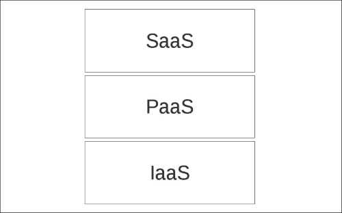
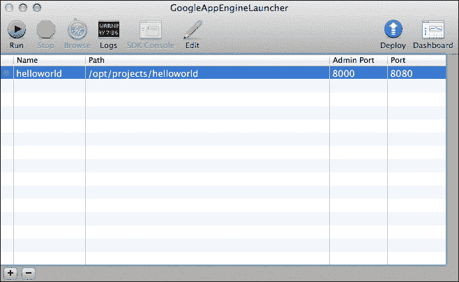
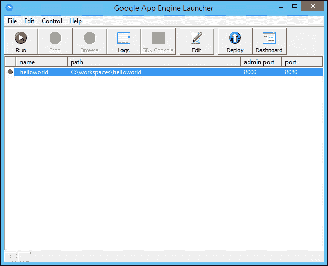
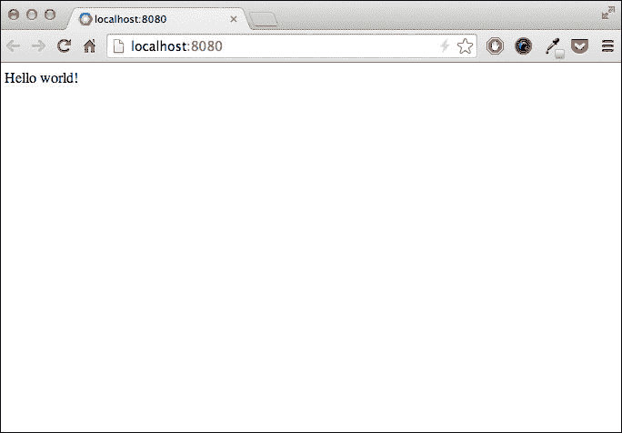
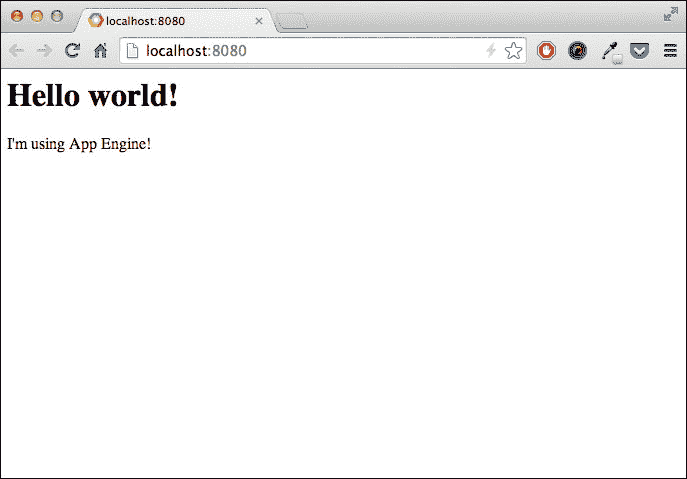

# 第一章. 入门

任何可通过互联网访问的软件，通常通过网页浏览器访问，都可以被视为网络应用程序。社交网络、电子商务网站、电子邮件客户端、在线游戏只是被称为 Web 2.0 的趋势的几个例子，这一趋势始于 1990 年代末，并在过去几年中兴起。今天，如果我们想为多个客户和多个用户提供服务，我们很可能会编写一个网络应用程序。

从开发者的角度来看，网络应用程序带来了无数的好处，但每次我们想要让我们的软件对其他用户可用时，都会面临一个主要缺点：我们需要一个连接到互联网的远程服务器来托管应用程序。这个服务器必须始终可用，并在合理的时间内响应用户，无论用户数量多少，否则应用程序将无法使用。

解决托管问题的值得注意的解决方案是云计算，这是一个相当通用的术语，通常指的是以合理的成本、简单快捷的方式在他人基础设施上运行应用程序和服务的机遇，并且能够快速配置和释放所需资源。

在本章中，我们将详细定义云计算这一术语，然后介绍谷歌提供的模型，重点关注对我们这些开发者来说重要的元素，并使用它们在谷歌云平台和谷歌 App Engine 上运行我们的第一个应用程序。

本章我们将涵盖以下主题：

+   对谷歌云平台和谷歌 App Engine 的详细介绍

+   设置 App Engine 代码环境

+   编写一个简单的应用程序

+   在远程服务器上加载和运行应用程序

+   使用管理控制台

# 云计算堆栈 – SaaS、PaaS 和 IaaS

我们可以选择外包我们的应用程序及其运行的硬件，同时仍然负责整个软件栈，包括操作系统；或者，我们可以简单地使用来自其他供应商的现有应用程序。

我们可以将云计算表示为三个不同类别的堆栈：**软件即服务**（**SaaS**）、**平台即服务**（**PaaS**）和**基础设施即服务**（**IaaS**）如下：



在第一种情况下，云计算模型被定义为 IaaS，我们基本上外包了硬件以及所有固有的服务，如电源供应、冷却、网络和存储系统。我们决定如何分配资源，需要多少网络应用程序或数据库服务器，是否需要使用负载均衡器，如何管理备份等等；安装、监控和维护是我们的责任。IaaS 服务的显著例子包括亚马逊的 EC2 和 Rackspace 云托管。

在第二种情况下，云计算模型被定义为 SaaS，与 IaaS 相反，因为我们只是使用第三方供应商提供的现成软件，该供应商对其运行的基础设施没有技术知识；供应商负责产品的可靠性和安全性。SaaS 的显著例子包括谷歌的 Gmail 和 Salesforce。

在 IaaS 和 SaaS 之间，我们发现 PaaS 模型，这似乎是从开发者角度来看最有趣的解决方案。PaaS 系统提供了一个平台，我们可以用它来构建和运行我们的应用程序，而无需担心底层，无论是硬件还是软件。

# Google Cloud Platform

Google Cloud Platform 旨在为开发者提供构建和运行基于谷歌可靠且高度可扩展基础设施的 Web 应用程序所需的工具和服务。该平台由几个云计算产品组成，可以根据我们的需求进行组合和使用，因此了解这些构建块能为开发者做什么以及它们是如何做到这一点的是非常重要的。

如我们从[`cloud.google.com`](https://cloud.google.com)的主文档页面了解到的，谷歌将 Google Cloud Platform 的组件分为四组：托管 + 计算、存储、大数据和各项服务。

## 托管 + 计算

如果我们想在 Google Cloud Platform 上托管一个应用程序，有两种选择：

+   **Google App Engine**：这是谷歌的 PaaS 平台，将在本章后面详细介绍。

+   **Google Compute Engine**：这是谷歌的 IaaS，允许用户在谷歌的基础设施上运行具有各种硬件和软件配置的虚拟机。

## 存储

Google Cloud Platform 提供了几种存储和访问用户数据的选择：

**Google Cloud Storage**：这是一个高度可用和可扩展的文件存储服务，具有版本控制和缓存功能。我们将在第三章，*存储和处理用户数据*中学习如何使用 Cloud Storage。

**Google Cloud SQL**：这是一个完全托管的 MySQL 关系型数据库；复制、安全和可用性是谷歌的责任。第五章，*在 Google Cloud SQL 中存储数据*完全致力于这项服务。

**Google Cloud Datastore**：这是一个托管的无模式数据库，存储称为实体的非关系型数据对象；它自动扩展，支持事务，并可以使用类似 SQL 的语法进行查询。我们将在第二章，*一个更复杂的应用*中开始使用它，并在第四章，*提高应用性能*中学习如何充分利用它。

## BigQuery

**BigQuery** 是由 Google Cloud Platform 提供的工具，允许使用类似 SQL 的语法在几秒钟内对大量数据进行查询。在进行分析之前，数据必须通过其 API 流入 BigQuery 或上传到 Google Cloud Storage。

## 服务

我们不必从头编写代码，而可以通过 Google 的一些服务轻松地向我们的应用程序添加功能，这些服务通过 Google Cloud Platform 内部高度集成的 API 实现：

+   **翻译 API**：这个 API 可以在程序中实现将文本翻译成多种语言，从我们的应用程序内部进行。

+   **预测 API**：这个 API 使用 Google 的机器学习算法预测未来趋势，可以从我们的应用程序内部或通过 **表示状态转换**（REST）API 使用。REST 是一种无状态架构风格，描述了一个系统如何通过网络与另一个系统通信；我们将在第八章 使用 Google Cloud Endpoints 暴露 REST API 中深入了解 REST。

+   **Google Cloud Endpoints**：使用这个工具，可以轻松创建暴露 REST 服务的应用程序，同时提供 **拒绝服务**（DoS）保护和 **OAuth2** 认证。我们将在第八章 暴露 REST API 的 Google Cloud Endpoints 中学习如何使用它们。

+   **Google Cloud DNS**：这是一个全球性的域名系统（DNS）服务，运行在 Google 的基础设施上，并从我们的应用程序内部提供可编程的高容量服务。

+   **Google Cloud Pub/Sub**：这是一个中间件，提供在运行在 Google Cloud Platform 或外部服务之间进行多对多、异步消息传递。

Google Cloud Platform 提供的所有工具和服务都采用按使用付费的模式，这样应用程序可以根据需要扩展或缩减，我们只为实际使用的资源付费。提供了一个方便的计算器，以便我们能够精确地了解根据我们认为将需要的服务和资源而产生的成本。Google Cloud Platform 提供了一定数量的资源，我们可以免费使用；通常，这些免费配额非常适合免费托管流量较低的 Web 应用程序。

# Google App Engine 的作用

如前所述，App Engine 是一个平台即服务（PaaS），这意味着我们享有 SaaS 产品的优势，同时由于我们对代码拥有完全控制权，因此具有增强的灵活性。我们还有 IaaS 解决方案的优势，但无需烦恼维护和配置在原始硬件系统上运行应用程序所需的软件环境。

开发人员是 PaaS 产品（如 App Engine）的首选用户，因为该平台以两种方式帮助他们：它提供了一种简单的方法来部署、扩展、调整和监控 Web 应用程序，而无需系统管理员，并且它提供了一套工具和服务，可以加快软件开发过程。让我们详细探讨这两个方面。

## 运行时环境

App Engine 运行在完全管理的计算单元上，称为实例。我们可以（并且应该）忽略实例上运行的操作系统，因为我们只与运行时环境交互，该环境是操作系统的抽象，提供资源分配、计算管理、请求处理、扩展和负载均衡。

### 注意

开发人员可以在 App Engine 上使用四种不同的编程语言编写应用程序：Python、Java、超文本预处理程序（PHP）和 Go，但我们将重点关注 Python 环境。

每当客户端联系运行在 App Engine 上的应用程序时，运行时环境中的一个组件，称为调度器，会选择一个能够提供快速响应的实例，如果需要，则用应用程序数据初始化它，并在一个安全、沙箱化的环境中使用 Python 解释器执行应用程序。应用程序接收 HTTP 请求，执行其工作，并将 HTTP 响应发送回环境。运行时环境与应用程序之间的通信使用**Web Server Gateway Interface**（**WSGI**）协议进行；这意味着开发人员可以在其应用程序中使用任何 WSGI 兼容的 Web 框架。

### 提示

WSGI 是一个描述 Web 服务器如何与用 Python 编写的 Web 应用程序通信的规范。它最初在 PEP-0333 中描述，后来在 PEP-3333 中更新，主要是为了在 Python 3.0 发布下提高可用性。

运行时环境被沙箱化以提高安全性并提供在同一实例上运行的应用程序之间的隔离。解释器可以执行任何 Python 代码，导入其他模块，并访问标准库，前提是它不违反沙箱限制。特别是，每当解释器尝试写入文件系统、执行网络连接或导入用 C 语言编写的扩展模块时，它都会引发异常。我们还必须注意的另一种隔离机制是由沙箱提供的，它通过在请求/响应周期整个持续超过 60 秒时引发异常，防止应用程序过度使用实例。

多亏了沙箱化，运行时可以在任何给定时间决定是否在一个实例或多个实例上运行应用程序，请求根据流量分布到所有这些实例上。这种能力，加上负载均衡和调度器设置，使得 App Engine 真正具有可扩展性。

用户可以通过简单的交互式管理控制台，通过提高应用的响应性或优化成本来轻松调整应用程序的性能。我们可以指定实例性能，以内存和 CPU 限制、始终准备满足请求的空闲实例数量以及流量增加时动态启动的实例数量来衡量。我们还可以指定我们容忍的挂起请求的最大时间（以毫秒为单位），并让 App Engine 自动调整设置。

## 服务

初看之下，运行时环境施加的限制可能显得过于严格。最终，开发者如果不能在磁盘上写入数据、接收传入的网络连接、从外部 Web 应用程序获取资源或启动缓存等实用服务，他们如何能够创建有用的东西呢？这就是为什么 App Engine 提供了一组高级 API/服务，开发者可以使用这些 API/服务来存储和缓存数据或通过互联网进行通信。

其中一些服务由 Google Cloud Platform 作为独立产品提供，并且可以无缝集成到 App Engine 中，而另一些服务则仅可在运行时环境中使用。

可用服务的列表经常变化，因为 Google 发布了新的 API 和工具；以下是我们将在本书后面部分使用的一些工具的子集，除了我们之前介绍的数据存储、Google Cloud Endpoints、Google Cloud SQL 和 Google Cloud Storage 服务外：

+   **通道**：此 API 允许应用程序与客户端建立持久连接，并通过这些连接实时推送数据，而不是使用轮询策略。客户端必须使用一些 JavaScript 代码与服务器交互。我们将在第六章 使用通道实现实时应用 中学习如何使用通道。

+   **数据存储备份/还原**：在任何给定时间，都可以对 Datastore 中的实体执行备份或从以前的备份中还原它们；管理操作非常简单，因为它们可以从管理控制台交互式执行。我们将在第四章 提高应用性能 中详细了解备份和还原程序。

+   **图像**：此 API 允许开发者访问和操作由应用程序提供或从 Google Cloud Storage 加载的图像数据。我们可以获取有关格式、大小和颜色的信息，并执行诸如调整大小、旋转和裁剪等操作，我们还可以在 API 提供的不同格式之间转换图像并应用一些基本过滤器。我们将在第三章 存储和处理用户数据 中使用 Images API 提供的一些功能。

+   **邮件**: 此服务允许应用程序代表管理员或使用 Google 账户登录的用户发送电子邮件，并接收发送到某些地址并路由到应用程序的电子邮件消息。我们将在第三章*存储和处理用户数据*中使用服务提供的这两个功能。

+   **Memcache**: 这是一个通用、分布式内存缓存系统，可用于显著提高应用程序性能，以比访问数据库或 API 更快的方式提供频繁访问的数据。我们将在第四章*提高应用程序性能*中看到如何使用 Memcache。

+   **模块**: 这些用于将应用程序拆分为可以相互通信并共享其状态的逻辑组件。它们非常有用，因为每个模块都可以有不同的版本和性能以及扩展设置，这为开发者在调整应用程序时提供了极大的灵活性。我们将在第四章*提高应用程序性能*中看到如何使用模块。

+   **计划任务**: 这就是 App Engine 实现 cron 作业的方式。开发者可以安排一个作业在指定的日期或定期执行。计划以类似英语的格式定义：例如，`每周五 20:00`是一个有效的计划，我们可以用它向用户发送周报。我们将在第三章*存储和处理用户数据*中看到如何使用计划任务。

+   **任务队列**: 如前所述，运行在 App Engine 上的应用程序的整个请求/响应周期最长为 60 秒，这使得执行长时间操作成为不可能。这就是为什么存在 Task Queue API 的原因——它可以在用户请求之外执行工作，这样长时间的操作就可以在后台稍后执行，并在 10 分钟内完成。我们将在第三章*存储和处理用户数据*中看到如何使用任务队列。

+   **URL Fetch**: 正如我们所知，运行时环境阻止我们的应用程序执行任何类型的网络连接，但通过 HTTP 请求访问外部资源是 Web 应用程序的一个常见需求。这种限制可以通过使用 URL Fetch API 来发出 HTTP 或 HTTPS 请求，并以可扩展和高效的方式检索响应来克服。

+   **用户**：我们可以在应用程序中使用 Google 帐户、Google Apps 域中的帐户或通过 OpenID 标识来验证用户。使用 Users API，我们的应用程序可以确定用户是否已登录，并将他们重定向到登录页面或访问他们的电子邮件。使用此 API，开发者可以将创建帐户和验证用户数据的责任委托给 Google 或 OpenID 提供商。

有关我们可以在 App Engine 环境中使用并由 Google 提供的工具和服务的更多信息，请参阅 [`developers.google.com/appengine/features/`](https://developers.google.com/appengine/features/)。

# 制作我们的第一个 Python 应用程序

我们现在已经了解了 Google Cloud Platform 可以为我们提供哪些功能，并且我们准备将 App Engine 付诸实践，但在我们开始编写代码之前，我们需要设置我们的工作站。

## 下载和安装

要开始，我们需要为我们的选择平台安装 Google App Engine SDK for Python。SDK 包含开发应用程序所需的所有库，以及一套在本地环境中运行和测试应用程序以及将其部署到生产服务器的工具。在某些平台上，可以通过图形用户界面（Google App Engine Launcher）执行管理任务，在其他平台上，我们可以使用一套全面的命令行工具。我们将在本章后面详细讨论 Google App Engine Launcher。

在安装 SDK 之前，我们必须检查我们的系统上是否有可用的 Python 2.7（在撰写本书时，2.7.8 是最新版本）的安装；我们需要这个特定的 Python 版本，因为 2.5 已经弃用，它是 App Engine 平台唯一支持的版本。如果我们使用 Linux 或 Mac OS X，我们可以从发出命令的终端中检查 Python 版本（注意大写字母 `V`）：

```py
python -V

```

输出结果应如下所示：

```py
Python 2.7.8

```

如果我们在 Windows 上，我们只需确保在 **控制面板** 的 **程序** 部分列出了正确的 Python 版本即可。

官方的 App Engine 下载页面包含所有可用 SDK 的链接。以下链接直接指向 Python 版本：[`developers.google.com/appengine/downloads#Google_App_Engine_SDK_for_Python`](https://developers.google.com/appengine/downloads#Google_App_Engine_SDK_for_Python)。

我们必须为我们的平台选择正确的软件包，下载安装程序，然后继续安装。

### 在 Windows 上安装

要在 Windows 上安装 SDK，我们必须从 App Engine 下载页面下载 `.msi` 文件，双击它以启动安装向导，并遵循屏幕上的说明。安装完成后，Google App Engine 启动器的快捷方式将被放置在桌面上，以及 **开始** 菜单中的一个项目。SDK 的 Windows 版本不提供任何命令行工具，因此我们将始终使用启动器来管理我们的应用程序。

### 在 Mac OS X 上安装

要在 Mac OS X 上安装 SDK，我们必须从 App Engine 下载页面下载 `.dmg` 文件，双击它以打开磁盘映像，然后将 App Engine 图标拖到 `Applications` 文件夹中。在 Dock 中保留启动器的快捷方式很方便；为此，我们只需再次将 App Engine 图标从 `Applications` 文件夹拖到 Dock 中。命令行工具也将被安装，并在启动器首次执行时，会弹出一个对话框询问我们是否想要创建必要的符号链接，以便使工具在系统范围内可用，这样就可以在任何终端窗口中执行，而无需进一步配置。

### 在 Linux 上安装

要在 Linux 和更广泛的 POSIX 兼容系统上安装 SDK，我们必须从 App Engine 下载页面下载 `.zip` 文件，并将其内容提取到我们选择的目录中。该存档包含一个名为 `google_appengine` 的文件夹，其中包含运行时和命令行工具，我们必须将其添加到我们的 shell 的 `PATH` 环境变量中，以便在任何终端中都可以使用这些工具。SDK 的 Linux 版本不包括启动器。

## App Engine 启动器

SDK 的 Windows 和 OS X 版本附带了一个名为启动器的图形用户界面工具，我们可以使用它来执行创建和管理多个应用程序等管理任务。

### 注意

启动器是一个非常方便的工具，但请记住，虽然我们可以通过启动器完成的每个任务都可以通过命令行工具执行，但反之则不然。有些任务只能通过使用适当的工具从命令行执行，正如我们将在本书后面看到的那样。

以下截图显示了 OS X 中的启动器窗口：



在以下截图中，我们可以看到 Windows 中的启动器：



在开始使用启动器之前，检查它是否使用正确的 Python 版本非常重要。如果我们系统中安装了多个 Python，这一点尤为重要。要检查启动器使用的 Python 版本并更改它，我们可以根据我们的平台点击相应的菜单打开 **首选项...** 对话框，并设置 Python 路径值。在同一个对话框中，我们可以指定当需要编辑应用程序文件时，启动器将默认打开哪个文本编辑器。

要创建一个新应用程序，我们可以在**文件**菜单中点击**新建应用程序**或点击启动器窗口左下角的带有加号图标按钮。启动器将提示输入应用程序名称和包含所有项目文件的文件夹路径；一旦创建，应用程序将列在启动器的主窗口中。

我们可以通过在启动器工具栏上点击**运行**按钮或在**控制**菜单中点击**运行**来启动本地开发服务器。一旦服务器启动，我们可以通过点击**停止**按钮或在**控制**菜单中的**停止**选项来停止它。点击**浏览**按钮或在**控制**菜单中的**浏览**选项将在默认浏览器中打开所选应用程序的主页。要浏览开发服务器生成的日志，我们可以通过点击工具栏上的**日志**按钮或在**控制**菜单中的**日志**选项来打开**日志控制台**窗口。工具栏上的**SDK 控制台**按钮和**控制**菜单中的**SDK 控制台**操作将在默认浏览器中打开服务于开发者控制台的 URL，这是一个与本地开发服务器交互的内置应用程序，我们将在本章后面详细探讨。

**编辑**按钮将在外部文本编辑器中打开所选应用程序的配置文件，可能是我们在**首选项...**对话框中指定的那个；当我们点击**编辑**菜单中的**在外部编辑器中打开**操作时，也会发生同样的事情。

要部署和上传所选应用程序到 App Engine，我们可以在工具栏上点击**部署**按钮或在**控制**菜单中点击**部署**操作。工具栏上的**仪表板**按钮和**控制**菜单中的**仪表板**操作将在默认浏览器中打开 App Engine 管理控制台的 URL。

使用启动器，我们可以为本地开发服务器设置额外的标志并自定义一些参数，例如监听的 TCP 端口号。为此，我们必须点击**编辑**菜单中的**应用程序设置...**选项并在设置对话框中进行所需的调整。

启动器还可以处理从头开始通过命令行创建或从外部仓库签出的现有应用程序。要将现有应用程序添加到启动器，我们可以在**文件**菜单中点击**添加现有应用程序...**选项并指定应用程序路径。

## 创建应用程序

创建应用程序的第一步是为它选择一个名称。根据传统，我们将编写一个打印**"Hello, World!"**的应用程序，因此我们可以选择`helloword`作为应用程序名称。我们已经知道如何从启动器创建应用程序，另一种选择是手动从命令行进行操作。

在最简单的情况下，一个工作的 Python 应用程序由一个名为应用程序根的文件夹组成，该文件夹包含一个 `app.yaml` 配置文件和一个包含处理 HTTP 请求所需代码的 Python 模块。当我们通过 Launcher 创建应用程序时，它会为我们生成这些文件和 `root` 文件夹，但让我们看看我们如何可以从命令行完成相同的结果。

### app.yaml 配置文件

当我们开始创建 `root` 文件夹时，我们如何命名并不重要，但为了与 Launcher 保持一致，我们可以使用应用程序的名称：

```py
mkdir helloworld && cd helloworld

```

然后，我们创建一个 `app.yaml` 文件，其中包含以下 `YAML` 代码：

```py
application: helloworld
version: 1
runtime: python27
api_version: 1
threadsafe: yes

handlers:
- url: .*
  script: main.app

libraries:
- name: webapp2
  version: "2.5.2"
```

### 注意

**YAML**（YAML Ain't Markup Language 的递归缩写）是一种适合于既需要用户访问又需要程序访问和操作配置文件的易于阅读的序列化格式。

上一段代码的第一个部分定义了一些应用程序的设置参数：

+   **应用程序参数**：这是应用程序名称；在本书的后续部分，我们将看到它有多么重要。

+   **版本参数**：这是一个指定应用程序版本的字符串。App Engine 保留每个部署版本的副本，并且我们可以选择性地运行它们，这是一个在公开之前测试应用程序的非常有用的功能。

+   **运行时参数**：在撰写本书时，Python 2.7 是为新创建的应用程序提供的唯一运行时，因为 Python 2.5 已被弃用。

+   **API 版本参数**：这是当前运行时环境的 API 版本。在撰写本书时，1 是 Python 2.7 运行时唯一可用的 API 版本。

+   **线程安全参数**：这指定了我们的应用程序是否可以处理并发请求的单独线程。

`app.yaml` 文件的下一部分列出了我们想要匹配的 URL，形式为正则表达式；`script` 属性指定了每个 URL 的处理器。处理器是 App Engine 调用以在应用程序收到请求时提供响应的程序。有两种类型的处理器：

+   **脚本处理器**：这些处理器运行应用程序提供的 Python 代码

+   **静态文件处理器**：这些处理器返回静态资源的内容，例如图像或包含 JavaScript 代码的文件

在这种情况下，我们使用了一个 `script` 处理器，一个使用点符号导入的 Python 可调用对象 `string`：App Engine 将匹配任何 URL 并调用 `main` 模块中包含的 `app` 对象。

最后一个部分列出了我们想要从 App Engine 应用程序中使用的第三方模块的名称和版本，在这种情况下，我们只需要 webapp2 网络框架的最新版本。我们可能会想知道为什么我们需要像网络框架这样复杂的东西来简单地打印一个**"Hello, World!"**消息，但正如我们已经知道的，我们的处理程序必须实现一个符合 WSGI 接口，这正是 webapp2 提供的一个功能。我们将在下一节中看到如何使用它。

### `main.py`应用程序脚本

现在应用程序已经配置好了，我们需要提供逻辑，因此我们在应用程序根目录中创建一个名为`main.py`的文件，该文件将包含以下内容：

```py
import webapp2

class MainHandler(webapp2.RequestHandler):
    def get(self):
        self.response.write('Hello world!')

app = webapp2.WSGIApplication([
    ('/', MainHandler)
], debug=True)
```

在上一段代码的第一行中，我们将`webapp2`包导入到我们的代码中，然后继续定义一个名为`MainHandler`的类，该类是从框架提供的`RequestHandler`类派生出来的。基类实现了一种行为，使得实现 HTTP 请求的处理程序变得非常容易；我们只需要定义一个以我们想要处理的 HTTP 操作命名的函数。在这种情况下，我们实现了`get()`方法，该方法将在应用程序接收到类型为`GET`的请求时自动调用。`RequestHandler`类还提供了一个`self.response`属性，我们可以使用它来访问将返回给应用程序服务器的响应对象。这个属性是一个类似文件的对象，它支持一个`write()`方法，我们可以使用它向 HTTP 响应体中添加内容；在这种情况下，我们在响应体中写入一个字符串，使用默认的内容类型`text/html`，以便在浏览器中显示。

在`MainHandler`类定义之后，我们创建了`app`对象，这是一个由 webapp2 提供的`WSGIApplication`类的实例，该类实现了我们在`app.yaml`中指定的符合 WSGI 的调用入口。我们向类构造函数传递两个参数，一个是 URL 模式列表，另一个是一个布尔标志，表示应用程序是否应该以调试模式运行。URL 模式是包含两个元素的元组：一个匹配请求 URL 的正则表达式和一个从`webapp2.RequestHandler`类派生出来的类对象，该对象将被实例化以处理请求。URL 模式按列表中的顺序逐个处理，直到匹配并调用相应的处理程序。

如我们所注意到的，URL 映射发生了两次——首先是在`app.yaml`文件中，将一个 URL 路由到我们代码中的符合 WSGI 的应用程序，然后在`WSGIApplication`类实例中，将一个 URL 路由到请求处理程序对象。我们可以自由选择如何使用这些映射，即要么将`app.yaml`文件中的所有 URL 路由到单个 webapp2 应用程序，在那里它们被分发到处理程序，要么将不同的 URL 路由到不同的、更小的 webapp2 应用程序。

## 运行开发服务器

App Engine SDK 提供了一个极其有用的工具，称为**开发服务器**，它在我们本地系统上运行，模拟我们在生产环境中找到的运行环境。这样，我们可以在编写应用程序的同时在本地测试它们。我们已经知道如何从启动器启动开发服务器。要从命令行启动它，我们运行`dev_appserver.py`命令工具，并将我们想要执行的应用程序根目录作为参数传递。例如，如果我们已经位于`helloworld`应用程序的根目录中，要启动服务器，我们可以运行以下命令：

```py
dev_appserver.py .

```

开发服务器将在 shell 上打印一些状态信息，然后开始在本地的默认 TCP 端口 8000 和 8080 上监听，分别服务于管理控制台和应用程序。

当服务器正在运行时，我们可以打开浏览器，将其指向`http://localhost:8080`，并看到我们的第一个 Web 应用程序正在提供内容。

以下截图显示了输出：



如果我们使用启动器，我们可以简单地按下**浏览**按钮，浏览器会自动在正确的 URL 打开。

开发服务器会在检测到应用程序根目录中的某些内容发生变化时自动重启应用程序实例。例如，当服务器正在运行时，我们可以尝试更改 Python 代码，该代码会改变我们写入响应体的字符串：

```py
import webapp2

class MainHandler(webapp2.RequestHandler):
    def get(self):
        self.response.write('<H1>Hello world!</H1>')
        self.response.write("<p>I'm using App Engine!</p>")

app = webapp2.WSGIApplication([
    ('/', MainHandler)
], debug=True)
```

保存文件后，我们可以刷新浏览器，立即看到更改，而无需重新加载服务器，如下面的截图所示：



我们现在可以将应用程序移动到 App Engine 的生产服务器上，并通过互联网使其可用。

## 上传应用程序到 App Engine

在 App Engine 上运行的应用程序通过其在 Google Cloud Platform 中的名称唯一标识。这就是为什么有时我们在文档和工具中看到部分内容将其称为应用程序 ID。当在本地系统上工作时，我们可以安全地为应用程序选择任何我们想要的名称，因为本地服务器不对应用程序 ID 施加任何控制；但是，如果我们想在生产中部署应用程序，应用程序 ID 必须通过 App Engine 管理控制台进行验证和注册。

管理控制台可以通过 [`appengine.google.com/`](https://appengine.google.com/) 访问，并使用有效的 Google 用户账户或 Google apps 账户（用于自定义域名）登录。如果我们使用应用程序启动器，点击**仪表板**按钮将为我们打开正确的浏览器地址。一旦登录，我们可以点击**创建应用程序**按钮以访问应用程序创建页面。我们必须提供一个应用程序 ID（控制台将告诉我们它是否有效且可用），以及应用程序的标题，然后我们就完成了。目前，我们可以接受剩余选项的默认值；再次点击**创建应用程序**按钮将最终为我们注册应用程序的 ID。

现在，我们必须将为我们应用程序提供的虚拟应用程序 ID 更改为在 App Engine 上注册的 ID。打开 `app.yaml` 配置文件并相应地更改 `application` 属性：

```py
application: the_registered_application_ID
version: 1
runtime: python27
api_version: 1
threadsafe: yes

handlers:
- url: .*
  script: main.app

libraries:
- name: webapp2
  version: "2.5.2"
```

我们现在已准备好在 App Engine 上部署应用程序。如果我们使用应用程序启动器，我们只需在工具栏中点击**部署**按钮。启动器将要求我们提供 Google 凭据，然后日志窗口将打开，显示部署状态。如果一切顺利，最后显示的行应该是这样的：

```py
*** appcfg.py has finished with exit code 0 ***

```

从命令行部署同样简单；从应用程序根目录，我们发出以下命令：

```py
appcfg.py update .

```

我们将被提示输入我们的 Google 账户凭据，然后部署将自动进行。

每个在生产中运行的 App Engine 应用程序都可以通过 `http://the_registered_application_ID.appspot.com/` 访问，因此我们可以通过从浏览器访问此 URL 并检查输出是否与本地开发服务器产生的输出相同来判断应用程序是否实际工作。

Google App Engine 允许我们在 **HTTPS**（**HTTP Secure**）协议之上通过 **Secure Sockets Layer**（**SSL**）协议提供内容服务，这意味着从服务器传输到服务器和从服务器传输到服务器的数据是加密的。当使用 `appspot.com` 域名时，此选项免费。为了在客户端和 App Engine 服务器之间启用安全连接，我们只需将 `secure` 选项添加到 `app.yaml` 文件中列出的 URL：

```py
handlers:
- url: .*
  script: main.app
  secure: always
```

在本地开发服务器上，我们仍然会使用常规的 HTTP 连接，但在生产环境中，我们将通过 HTTPS 连接以安全的方式访问 `https://the_registered_application_ID.appspot.com/`。

如果我们想通过自定义域名（如 `example.com`）而不是 HTTPS 访问应用程序，我们必须按照 [`cloud.google.com/appengine/docs/ssl`](https://cloud.google.com/appengine/docs/ssl) 中的说明配置 App Engine，以便平台可以使用我们的证书。此服务需要付费，并且我们将按月收费。

# Google 开发者控制台

在 Google Cloud Platform 发布之前，管理员控制台是开发者可用的唯一工具，用于在 App Engine 应用程序上执行管理和监控任务。管理员控制台提供了许多功能，并且仍然足够强大，可以管理任何规模的 App Engine 应用程序。然而，如果我们广泛使用 Google Cloud Platform 提供的新服务系列，特别是如果我们存储数据在 Google Cloud Storage 或我们的数据库服务器是 Google Cloud SQL 的情况下，它就不是合适的工具；在这种情况下，为了收集诸如账单数据和使用历史等信息，我们必须与其他工具交互。

最近，Google 发布了**开发者控制台**，这是一个综合性的工具，用于管理和监控 Google Cloud Platform 的服务、资源、身份验证和账单信息，包括 App Engine 应用程序。我们可以在[`console.developers.google.com/`](https://console.developers.google.com/)访问开发者控制台，并使用有效的 Google 用户账户或自定义域的 Google apps 账户登录。

为了强调开发者可以将来自 Google 云基础设施的各个部分组合起来构建复杂应用程序的概念，开发者控制台引入了云项目的概念。项目是一组功能分组云产品，它们共享相同的团队和账单信息。项目的核心总是一个 App Engine 应用程序：每次我们创建一个项目时，一个 App Engine 应用程序就会在管理员控制台中弹出。同时，当我们向管理员控制台注册应用程序时，一个相应的项目就会被创建并在开发者控制台中列出。每个项目都有一个描述性的名称，这是一个唯一的标识符，称为项目 ID，它也是相关 App Engine 应用程序的 ID，以及另一个自动生成的唯一标识符，称为项目编号。

除了创建和删除项目之外，开发者控制台还允许我们执行以下操作：

+   **管理项目成员**：当我们创建一个项目时，我们成为该项目的所有者。作为所有者，我们可以添加或删除成员并设置他们的权限。

+   **管理 API**：我们可以添加或删除由 Google Cloud Platform 提供的 API 服务，设置账单，并监控数据。

+   **管理应用程序身份**：我们可以将请求与特定项目关联起来，这样我们就可以监控特定的流量和账单，并在需要时实施配额。

+   **管理应用程序安全**：我们可以为我们的应用程序设置 OAuth2 或提供 API 密钥以授权请求。

+   **过滤和限制服务**：我们可以允许只有来自授权主机或 IP 地址的请求，并限制每个用户每秒或每天允许的请求数量。

对于 Google Cloud Platform 的每一项服务，开发者控制台都为我们提供了通过网页界面执行维护操作的便捷工具。例如，我们可以添加或删除 Google Cloud SQL 实例，对 Google Cloud Datastore 进行查询，浏览和操作 Google Cloud Storage 的内容，以及管理在 Google Compute Engine 上运行的虚拟机。本书后面我们将使用开发者控制台的一些部分。

## 开发者控制台

当我们在本地开发服务器上时，我们仍然可以访问一个工具来浏览和管理 Datastore、任务队列、cron 作业以及本地运行的 App Engine 模拟组件。这个工具被称为**开发者控制台**，当本地服务器处于活动状态时，可以通过`http://localhost:8000`访问。

# 概述

在本章中，我们学习了 Google Cloud Platform 是什么，它提供哪些工具和服务，以及我们如何使用它们来开发和运行用 Python 编写的快速和可扩展的 Web 应用程序。

我们探讨了开始使用 Python 为 App Engine 平台开发所需的工具，如何使用开发服务器本地运行应用程序，以及将其上传到生产服务器是多么快速和简单，使其准备好通过互联网提供服务。

本章中我们使用的简单示例，虽然是一个功能齐全的 App Engine 应用程序，但相当简单，除了运行环境之外，没有利用平台提供的任何其他功能。在下一章中，我们将从头开始，使用一个新的、更有用的应用程序，探索 webapp2 框架，并利用 Cloud Datastore。
