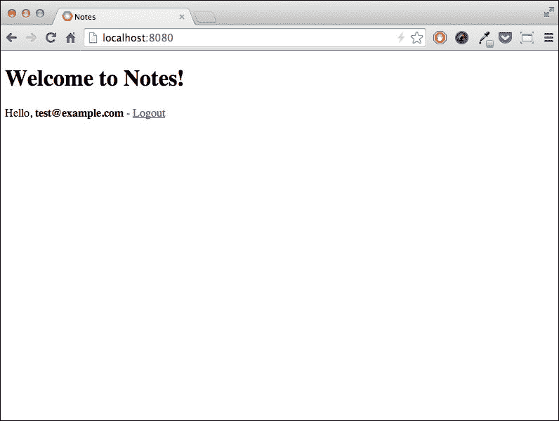
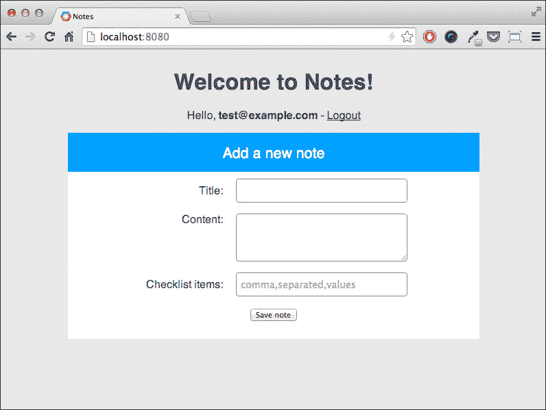

# 第二章.一个更复杂的应用程序

网络应用通常提供一系列功能，如用户身份验证和数据存储。正如我们从上一章所知，App Engine 提供了实现这些功能所需的服务和工具，而学习如何使用它们的最佳方式是通过编写一个网络应用并看到平台在实际中的应用。

在本章中，我们将涵盖以下主题：

+   webapp2 框架的更多细节

+   如何验证用户身份

+   在 Google Cloud Datastore 上存储数据

+   使用模板构建 HTML 页面

+   提供静态文件

# 在笔记应用上进行实验

为了更好地探索 App Engine 和云平台的功能，我们需要一个真实世界的应用来进行实验；一个不是那么容易编写，但有一份合理的需求列表，以便它能够适应这本书的内容。一个好的候选者是笔记应用；我们将称之为 Notes。

Notes 允许用户添加、删除和修改笔记列表；一个笔记有一个标题和正文文本。用户只能看到他们个人的笔记，因此在使用应用程序之前必须进行身份验证。

应用程序的主页将显示登录用户的笔记列表以及添加新笔记的表单。

上一章中`helloworld`示例中的代码是一个好的起点。我们可以简单地更改根文件夹的名称和`app.yaml`文件中的`application`字段，以匹配我们为应用选择的新名称，或者我们可以从头开始一个新的项目，命名为`notes`。

# 验证用户身份

我们 Notes 应用的第一个需求是只向已登录用户显示主页，并将其他人重定向到登录表单；App Engine 提供的**用户**服务正是我们所需要的，将其添加到我们的`MainHandler`类中相当简单：

```py
import webapp2

from google.appengine.api import users

class MainHandler(webapp2.RequestHandler):
    def get(self):
        user = users.get_current_user()
        if user is not None:
            self.response.write('Hello Notes!')
        else:
        login_url = users.create_login_url(self.request.uri)
        self.redirect(login_url)
app = webapp2.WSGIApplication([
    ('/', MainHandler)
], debug=True)
```

在上一段代码的第二行中我们导入的`user`包提供了访问用户服务功能的方法。在`MainHandler`类的`get()`方法内部，我们首先检查访问页面的用户是否已登录。如果他们已登录，`get_current_user()`方法将返回一个由 App Engine 提供的`user`类的实例，代表一个已验证的用户；否则，它返回`None`作为输出。如果用户有效，我们提供与之前相同的响应；否则，我们将他们重定向到 Google 登录表单。登录表单的 URL 是通过`create_login_url()`方法返回的，我们调用它，将作为参数传递的 URL 作为成功身份验证后要重定向用户的 URL。在这种情况下，我们希望将用户重定向到他们正在访问的相同 URL，由 webapp2 的`self.request.uri`属性提供。webapp2 框架还提供了带有`redirect()`方法的处理器，我们可以使用它方便地设置响应对象的正确状态和位置属性，以便客户端浏览器将被重定向到登录页面。

# 使用 Jinja2 的 HTML 模板

Web 应用程序提供了丰富和复杂的 HTML 用户界面，Notes 也不例外，但到目前为止，我们应用程序中的响应对象只包含少量文本。我们可以在 Python 模块中将 HTML 标签作为字符串包含在内，并在响应体中写入它们，但我们可以想象这会变得多么混乱，难以维护代码。我们需要完全将 Python 代码与 HTML 页面分开，这正是模板引擎所做的。模板是一段存在于其自身文件中的 HTML 代码，可能包含额外的特殊标签；借助模板引擎，我们可以从 Python 脚本中加载此文件，正确解析特殊标签（如果有的话），并在响应体中返回有效的 HTML 代码。App Engine 在 Python 运行时包含了一个知名的模板引擎：Jinja2 库。

要使 Jinja2 库对我们的应用程序可用，我们需要在 `app.yaml` 文件中的 `libraries` 部分添加此代码：

```py
libraries:
- name: webapp2
  version: "2.5.2"
- name: jinja2
  version: latest
```

我们可以将主页的 HTML 代码放在名为 `main.html` 的文件中，该文件位于应用程序根目录内。我们从一个非常简单的页面开始：

```py
<!DOCTYPE html>
<html>
<head lang="en">
  <meta charset="UTF-8">
  <title>Notes</title>
</head>
<body>
  <div class="container">

    <h1>Welcome to Notes!</h1>

    <p>
      Hello, <b>{{user}}</b> - <a href="{{logout_url}}">Logout</a>
    </p>

  </div>
</body>
</html>
```

大部分内容是静态的，这意味着它将以我们看到的标准 HTML 格式渲染，但有一部分是动态的，其内容取决于在运行时传递给渲染过程的哪些数据。这些数据通常被称为**模板上下文**。

需要动态的是当前用户的用户名和用于从应用程序注销的链接。HTML 代码包含两个使用 Jinja2 模板语法编写的特殊元素，`{{user}}` 和 `{{logout_url}}`，它们将在最终输出之前被替换。

回到 Python 脚本；我们需要在 `MainHandler` 类定义之前添加初始化模板引擎的代码：

```py
import os
import jinja2

jinja_env = jinja2.Environment(
    loader=jinja2.FileSystemLoader(os.path.dirname(__file__)))
```

环境实例存储引擎配置和全局对象，并用于加载模板实例；在我们的例子中，实例是从与 Python 脚本相同的目录中的 HTML 文件加载的。

要加载和渲染我们的模板，我们需要将以下代码添加到 `MainHandler.get()` 方法中：

```py
class MainHandler(webapp2.RequestHandler):
    def get(self):
        user = users.get_current_user()
        if user is not None:
            logout_url = users.create_logout_url(self.request.uri)
            template_context = {
                'user': user.nickname(),
                'logout_url': logout_url,
            }
            template = jinja_env.get_template('main.html')
               self.response.out.write(
                template.render(template_context))
        else:
            login_url = users.create_login_url(self.request.uri)
            self.redirect(login_url)
```

与我们获取登录 URL 的方式类似，用户服务提供的 `create_logout_url()` 方法返回指向注销程序的绝对 URI，我们将它分配给 `logout_url` 变量。

然后，我们创建 `template_context` 字典，该字典包含我们想要传递给模板引擎进行渲染过程的环境值。我们将当前用户的昵称分配给字典中的 `user` 键，并将注销 URL 字符串分配给 `logout_url` 键。

`jinja_env`实例的`get_template()`方法接受包含 HTML 代码的文件名，并返回一个 Jinja2 模板对象。为了获得最终输出，我们在`template`对象上调用`render()`方法，传入包含将被访问的值的`template_context`字典，并在 HTML 文件中使用模板语法元素`{{user}}`和`{{logout_url}}`指定它们各自的键。

这是模板渲染的结果：



# 处理表单

应用程序的主页应该列出属于当前用户的所有笔记，但目前还没有创建此类笔记的方法。我们需要在主页上显示一个网页表单，以便用户可以提交详细信息并创建笔记。

要显示一个用于收集数据和创建笔记的表单，我们在`main.html`模板文件中用户名和注销链接下方放置以下 HTML 代码：

```py

<p>Title: {{note_title}}</p>
<p>Content: {{note_content}}</p>


<h4>Add a new note</h4>
<form action="" method="post">
  <div class="form-group">
    <label for="title">Title:</label>
    <input type="text" id="title" name="title" />
  </div>
  <div class="form-group">
      <label for="content">Content:</label>
      <textarea id="content" name="content"></textarea>
  </div>
  <div class="form-group">
      <button type="submit">Save note</button>
  </div>
</form>
```

在显示表单之前，只有当模板上下文中包含名为`note_title`的变量时，才会显示一条消息。为此，我们使用一个`if`语句，在``和``分隔符之间执行；类似的分隔符用于在模板内部执行`for`循环或分配值。

`form`标签的`action`属性为空；这意味着在表单提交时，浏览器将向相同的 URL 执行一个`POST`请求，在这个例子中是主页 URL。由于我们的 WSGI 应用程序将主页映射到`MainHandler`类，我们需要向这个类添加一个方法，以便它可以处理`POST`请求：

```py
class MainHandler(webapp2.RequestHandler):
    def get(self):
        user = users.get_current_user()
        if user is not None:
            logout_url = users.create_logout_url(self.request.uri)
            template_context = {
                'user': user.nickname(),
                'logout_url': logout_url,
            }
            template = jinja_env.get_template('main.html')
            self.response.out.write(
                template.render(template_context))
        else:
            login_url = users.create_login_url(self.request.uri)
            self.redirect(login_url)

    def post(self):
        user = users.get_current_user()
        if user is None:
            self.error(401)

        logout_url = users.create_logout_url(self.request.uri)
        template_context = {
            'user': user.nickname(),
            'logout_url': logout_url,
            'note_title': self.request.get('title'),
            'note_content': self.request.get('content'),
        }
        template = jinja_env.get_template('main.html')
        self.response.out.write(
            template.render(template_context))
```

当表单提交时，处理程序被调用，并调用`post()`方法。我们首先检查是否有有效的用户登录；如果没有，我们不在响应体中提供任何内容，直接抛出**HTTP 401: 未授权**错误。由于 HTML 模板与`get()`方法提供的相同，我们仍然需要将注销 URL 和用户名添加到上下文中。在这种情况下，我们还将从 HTML 表单中存储的数据添加到上下文中。要访问表单数据，我们调用`self.request`对象的`get()`方法。最后三行是加载和渲染主页模板的样板代码。我们可以将此代码移动到单独的方法中，以避免重复：

```py
def _render_template(self, template_name, context=None):
    if context is None:
        context = {}
    template = jinja_env.get_template(template_name)
    return template.render(context)
```

在处理类中，我们将使用类似以下内容来输出模板渲染结果：

```py
self.response.out.write(
    self._render_template('main.html', template_context))
```

我们可以尝试提交表单，并检查笔记标题和内容是否实际上显示在表单上方。

# 在 Datastore 中持久化数据

即使用户可以登录并提交笔记，但如果没有将笔记存储在某个地方，我们的应用程序也不会很有用。Google Cloud Datastore 是存储我们笔记的完美场所。作为 App Engine 基础设施的一部分，它负责数据分布和复制，所以我们只需要定义存储和检索我们的实体，使用 Python **NDB** (**Next DB**) **Datastore API**。

### 笔记

目前在 Python 运行时有两个 API 可用于与 Datastore 交互：**DB Datastore API**，也称为 `ext.db`，以及 NDB Datastore API。即使这两个 API 在 Datastore 中存储的数据完全相同，在这本书中，我们只会使用 NDB；它更新，提供更多功能，并且其 API 稍微更健壮。

一个实体有一个或多个属性，这些属性依次具有名称和类型；每个实体都有一个唯一键来标识它，并且与关系数据库不同，Datastore 中的每个实体都按类型分类。在 Python 世界中，类型由其模型类确定，我们需要在我们的应用程序中定义它。

## 定义模型

要表示一种类型，Datastore 模型必须从 NDB API 提供的 `ndb.Model` 类派生。我们在名为 `models.py` 的 Python 模块中定义我们的模型，该模块包含以下代码：

```py
from google.appengine.ext import ndb

class Note(ndb.Model):
    title = ndb.StringProperty()
    content = ndb.TextProperty(required=True)
    date_created = ndb.DateTimeProperty(auto_now_add=True)
```

`Note` 类有一个名为 `title` 的属性，其中包含少量文本（最多 500 个字符），另一个名为 `content` 的属性，其中包含无限长度的文本，还有一个名为 `date_created` 的属性，其中包含日期和时间。此类实体必须至少包含 `user` 和 `content` 属性的值，如果没有提供，则 `date_created` 属性的值将存储实体创建时的日期和时间。现在，当用户在笔记应用的首页提交表单时，我们可以向 Datastore 添加新的 `Note` 类实体。在 `main.py` 模块中，我们首先需要从 `models` 模块导入 `Note` 类：

```py
from models import Note
```

然后，我们按如下方式修改 `post()` 方法：

```py
def post(self):
    user = users.get_current_user()
    if user is None:
        self.error(401)

    note = Note(title=self.request.get('title'),
                content=self.request.get('content'))
    note.put()

    logout_url = users.create_logout_url(self.request.uri)
    template_context = {
        'user': user.nickname(),
        'logout_url': logout_url,
    }
    self.response.out.write(
        self._render_template('main.html', template_context))
```

从现在起，每次用户在首页提交表单时，都会创建一个 `Note` 类的实例，并在调用 `put()` 方法后立即将实体持久化到 Datastore 中。由于我们没有修改 `template_context` 字典，存储过程看起来不会做任何事情。为了验证数据实际上已存储，我们可以使用本地开发控制台，通过在浏览器中打开 `http://localhost:8000` 并检查 Datastore 观察器来验证。

## 基本查询

一个实体可以可选地指定另一个实体作为其 **父实体**，没有父实体的实体是 **根实体**；Datastore 中的实体形成一个类似于文件系统目录结构的分层结构空间。一个实体及其所有后代形成一个 **实体组**，共同祖先的键被定义为 **父键**。

由于 Datastore 的内在分布式特性，理解实体之间的关系非常重要。不深入细节，我们需要知道的是，跨多个实体组的查询不能保证一致的结果，并且此类查询的结果有时可能无法反映数据最近的变化。

我们有一个替代方案；为了获得强一致性结果，我们可以执行所谓的**祖先查询**，这是一种将结果限制在特定实体组的查询。要在我们的代码中使用祖先查询，首先的事情是在创建模型实例时为我们的笔记实体添加一个父实体：

```py
note = Note(parent=ndb.Key("User", user.nickname()),
            title=self.request.get('title'),
            content=self.request.get('content'))
note.put()
```

由于每个笔记都属于创建它的用户，我们可以使用相同的逻辑来结构我们的数据；我们使用当前登录的用户作为包含该用户所有笔记的实体组的父键。这就是为什么我们在上一段代码中调用`Note`构造函数时指定了`parent`关键字。为了获取当前登录用户的键，我们使用`ndb.Key`类构造函数，传入类型和对应实体的标识符。

现在我们需要从 Datastore 检索我们的笔记并向用户展示它们。由于我们将使用祖先查询，在继续之前，我们在`Note`模型类中添加一个实用方法：

```py
class Note(ndb.Model):
    title = ndb.StringProperty()
    content = ndb.TextProperty(required=True)
    date_created = ndb.DateTimeProperty(auto_now_add=True)

    @classmethod
    def owner_query(cls, parent_key):
        return cls.query(ancestor=parent_key).order(
            -cls.date_created)
```

`owner_query()`方法返回一个已经过滤并包含由`parent_key`函数参数指定的父键的组实体的查询对象。

要加载属于当前用户的全部笔记，我们接下来编写以下代码：

```py
user = users.get_current_user()
ancestor_key = ndb.Key("User", user.nickname())
qry = Note.owner_query(ancestor_key)
notes = qry.fetch()
```

由于我们希望在`GET`和`POST`请求的情况下在主页上显示笔记，我们可以在`_render_template()`方法中加载实体，该方法在两种情况下都由处理程序调用：

```py
def _render_template(self, template_name, context=None):
    if context is None:
        context = {}

    user = users.get_current_user()
    ancestor_key = ndb.Key("User", user.nickname())
    qry = Note.owner_query(ancestor_key)
    context['notes'] = qry.fetch()

    template = jinja_env.get_template(template_name)
    return template.render(context)
```

我们将笔记列表作为`context`字典中`notes`键的值添加，这样我们就可以通过在表单下方编写以下内容在 HTML 模板中使用它们：

```py

<div class="note">
  <h4>{{ note.title }}</h4>
  <p class="note-content">{{ note.content }}</p>
</div>

```

对于查询结果中的每个笔记，将打印出一个`div`元素，如果查询返回了一个空列表，则不会打印任何内容。即使对于笔记类型的实体，`title`属性是可选的，我们也可以安全地访问它。如果它不存在，将返回一个空字符串。

## 事务

对于 Web 应用程序来说，定义并使用相互依赖的 Datastore 模型是很常见的，这样当我们更新一个实体时，我们很可能还需要更新依赖的实体。然而，如果在一系列 Datastore 操作过程中，其中一些操作失败了怎么办？在这种情况下，我们可以将这些操作封装在一个事务中，这样要么所有操作都成功，要么所有操作都失败。

为了展示事务的使用案例，我们在`Note`模型中添加了一个小功能：清单。清单是一系列项目，它们具有一个布尔属性，用于确定其选中状态。我们首先需要定义一个用于单个清单项目的 Datastore 模型：

```py
class CheckListItem(ndb.Model):
    title = ndb.StringProperty()
    checked = ndb.BooleanProperty(default=False)
```

实体有两个属性，`title`属性用于显示的字符串，以及`checked`属性用于存储项目是否被选中。

然后我们在`Node`模型类中添加一个属性，以引用项目实体：

```py
class Note(ndb.Model):
    title = ndb.StringProperty()
    content = ndb.TextProperty(required=True)
    date_created = ndb.DateTimeProperty(auto_now_add=True)
    checklist_items = ndb.KeyProperty("CheckListItem",
                                      repeated=True)

    @classmethod
    def owner_query(cls, parent_key):
        return cls.query(ancestor=parent_key).order(
            -cls.date_created)
```

`checklist_items`属性存储`CheckListItem`类型的键值；需要`repeated=True`参数来定义该属性可以存储多个值。

用户可以通过在创建表单中填写逗号分隔的值列表来为笔记创建清单项目，因此我们在 HTML 模板中添加以下内容：

```py
  <form action="" method="post">
    <div class="form-group">
      <label for="title">Title:</label>
      <input type="text" id="title" name="title"/>
    </div>
    <div class="form-group">
        <label for="content">Content:</label>
        <textarea id="content" name="content"></textarea>
    </div>
    <div class="form-group">
        <label for="checklist_items">Checklist items:</label>
        <input type="text" id="checklist_items" name="checklist_items" placeholder="comma,separated,values"/>
    </div>
    <div class="form-group">
        <button type="submit">Save note</button>
    </div>
  </form>
```

现在，我们必须处理`MainHandler`类中的逗号分隔列表：

```py
note = Note(parent=ndb.Key("User", user.nickname()),
            title=self.request.get('title'),
            content=self.request.get('content'))
note.put()

item_titles = self.request.get('checklist_items').split(',')
for item_title in item_titles:
    item = CheckListItem(parent=note.key, title=item_title)
    item.put()
    note.checklist_items.append(item.key)

note.put()
```

我们首先从请求中检索表示清单项目的逗号分隔值。然后，对于每一个值，我们创建一个`CheckListItem`实例。直到模型实例被持久化，Datastore 不会为其分配任何键。因此，在访问`key`属性和检索该实体的`Key`实例之前，我们需要首先通过调用`put()`方法存储每个项目。一旦我们有一个有效的键，我们就将其追加到`Note`实例的项目列表中。我们将笔记的键作为项目的父级，这样所有这些实体都将成为同一实体组的一部分。最后一步是调用`put()`方法并更新节点实体以及存储`checklist_items`属性的新数据。

现在如果`note.put()`方法失败会发生什么？我们将有一系列未与任何笔记关联的`CheckListItem`类型的实体，这是一个一致性问题的例子。事务可以帮助我们重构笔记的创建，使其要么成功，要么失败，而不会留下任何悬空数据。我们在处理类中封装了笔记对象的创建，创建了一个单独的`_create_node()`方法：

```py
@ndb.transactional
def _create_note(self, user):
    note = Note(parent=ndb.Key("User", user.nickname()),
                title=self.request.get('title'),
                content=self.request.get('content'))
    note.put()

    item_titles = self.request.get('checklist_items').split(',')
    for item_title in item_titles:
        item = CheckListItem(parent=note.key, title=item_title)
        item.put()
        note.checklist_items.append(item.key)

    note.put()
```

`@ndb.transactional`装饰器是我们需要的所有 Python 代码。然后 Datastore 将确保装饰的方法中的任何操作都在事务中发生。这样，要么我们创建一个笔记实体以及所有清单项目实体，要么在没有接触底层数据的情况下得到一个错误。为了完成代码，我们必须在`post()`方法中调用`_create_node()`方法：

```py
def post(self):
    user = users.get_current_user()
    if user is None:
        self.error(401)

    self._create_note(user)

    logout_url = users.create_logout_url(self.request.uri)
    template_context = {
        'user': user.nickname(),
        'logout_url': logout_url,
    }
    self.response.out.write(
        self._render_template('main.html', template_context))
```

为了显示笔记清单中的项目列表，我们必须在 HTML 模板中添加所需的代码：

```py

<div class="note">
  <h4>{{ note.title }}</h4>
  <p class="note-content">{{ note.content }}</p>
  
  <ul>
    
    <li class="checked">{{item.get().title}}</li>
    
  </ul>
  
</div>

```

如果`checklist_items`属性不为空，我们添加一个无序列表。然后我们遍历项目列表，当项目的`checked`属性设置为`true`值时，添加一个包含`checked`参数的`class`属性：在本章的后面，我们将学习如何添加一个**CSS（层叠样式表）**规则，以便当这个类存在时，项目将以水平线穿过其中心显示。

# 使用静态文件

通常，Web 应用程序会使用 CSS 和 JavaScript 资源来提供更好的用户体验。出于效率的考虑，这种内容不是由 WSGI 应用程序动态提供，而是由 App Engine 作为静态文件提供。

从前一章我们知道 App Engine 提供了两种类型的处理程序，脚本处理程序和静态文件处理程序。我们像这样在我们的`app.yaml`配置文件中添加一个静态文件处理程序：

```py
handlers:
- url: /static
  static_dir: static

- url: .*
  script: main.app
```

语法几乎与脚本处理器相同。我们指定一个作为正则表达式的 URL 来映射，但不是提供 Python 脚本来处理请求，而是指定一个相对于应用根目录的文件系统路径，其中包含需要作为静态资源提供的服务文件和目录。

### 注意

现在我们将通过手动编写一些 CSS 规则来为我们的 HTML 页面提供一个最小样式。虽然对于本书的范围来说，学习如何从头开始构建自定义设计是可接受的，但在现实世界中，我们可能更愿意使用如 Bootstrap ([`getbootstrap.com/`](http://getbootstrap.com/)) 或 Foundation ([`foundation.zurb.com/`](http://foundation.zurb.com/)) 这样的前端框架，以轻松提供最先进的美学、跨浏览器功能和针对移动设备的响应式布局。

要为我们应用提供 CSS，我们然后在应用根目录中创建 `static/css` 文件夹：

```py
mkdir -p static/css

```

此文件夹应包含一个名为 `notes.css` 的文件，该文件将包含我们应用的样式表：

```py
body {
    font-family: "helvetica", sans-serif;
    background: #e8e8e8;
    color: rgba(39,65,90,.9);
    text-align: center;
}

div.container {
    width: 600px;
    display: inline-block;
}
```

第一部分是用于全局布局元素；我们将把表单和笔记放在一个居中的容器中，一个在另一个下方。然后我们样式化表单：

```py
form {
    background: white;
    padding-bottom: 0.5em;
    margin-bottom: 30px;
}
h4,legend {
    margin-bottom: 10px;
    font-size: 21px;
    font-weight: 400;
}
```

表单将被包含在一个白色框中，图例将看起来像笔记标题。表单元素将被如下样式化：

```py
   div.form-group {
    margin-bottom: 1em;
}

label {
    display: inline-block;
    width: 120px;
    text-align: right;
    padding-right: 15px;
}

input, textarea {
    width: 250px;
    height: 35px;
    -moz-box-sizing: border-box;
    box-sizing: border-box;
    border: 1px solid #999;
    font-size: 14px;
    border-radius: 4px;
    padding: 6px;
}

textarea {
    vertical-align: top;
    height: 5em;
    resize: vertical;
}
```

然后我们继续样式化包含笔记数据的白色框：

```py
div.note {
    background: white;
    vertical-align: baseline;
    display: block;
    margin: 0 auto 30px auto;
}

legend, div.note > h4 {
    padding: 18px 0 15px;
    margin: 0 0 10px;
    background: #00a1ff;
    color: white;
}
```

样式表的最后一部分是专门用于笔记清单的。我们为包含在具有 `note` 类的 `div` 元素中的无序列表提供了一种样式，并为处于选中状态的列表项提供了一种样式：

```py
div.note > ul {
    margin: 0;
    padding: 0;
    list-style: none;
    border-top: 2px solid #e7f2f0;
}

div.note > ul > li {
    font-size: 21px;
    padding: 18px 0 18px 18px;
    border-bottom: 2px solid #e7f2f0;
    text-align: left;
}
div.note-content {
    text-align: left;
    padding: 0.5em;
}

.checked {
    text-decoration: line-through;
}
```

要使用样式表，我们在 HTML 模板中添加以下内容，在 `<meta>` 标签内：

```py
<link rel="stylesheet" type="text/css" href="static/css/notes.css">
```

这就是应用应用样式表后的外观：



# 摘要

多亏了 App Engine，我们到目前为止已经以相对较小的努力实现了一套丰富的功能。

在本章中，我们发现了关于 webapp2 框架及其功能的一些更多细节，实现了一个非平凡的请求处理器。我们学习了如何使用 App Engine 用户服务来提供用户认证。我们深入了解了 Datastore 的一些基本细节，现在我们知道如何以分组实体结构化数据，以及如何通过祖先查询有效地检索数据。此外，我们还借助 Jinja2 模板库创建了一个 HTML 用户界面，学习了如何提供静态内容，如 CSS 文件。

在下一章中，我们将继续为笔记应用添加更多功能，学习如何将上传的文件存储在 Google Cloud Storage 上，处理图像，以及处理长时间操作和计划任务。我们还将使应用能够发送和接收电子邮件。
