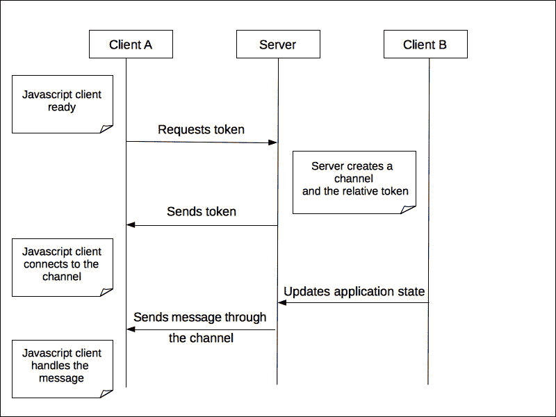
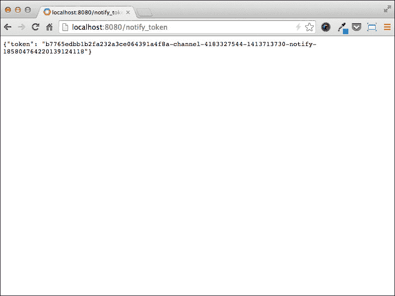
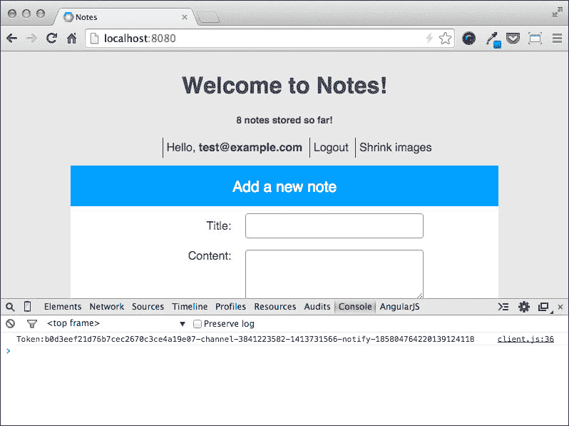
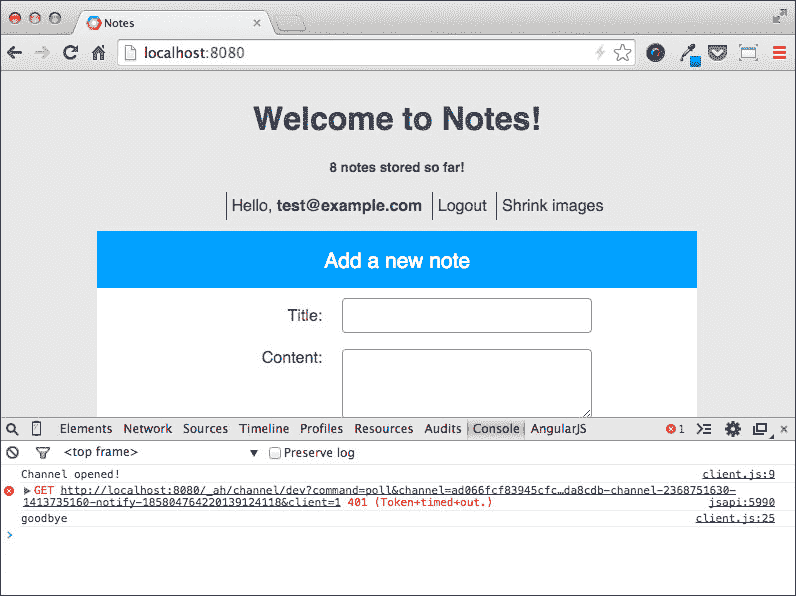
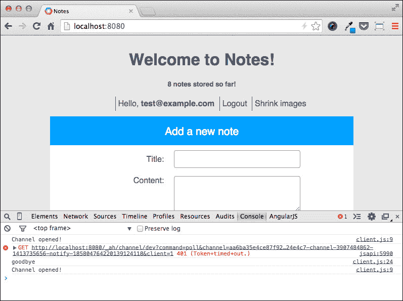
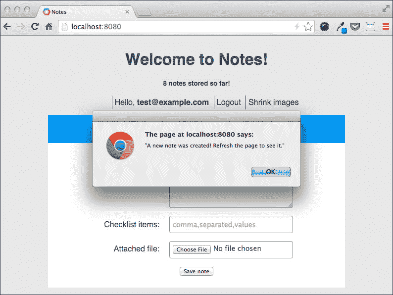

# 第六章。使用频道实现实时应用程序

网络应用程序使用请求/响应消息交换模式与服务器通信。通信流程始终从客户端（通常是网页浏览器）开始，发起请求，服务器提供响应并在之后立即关闭连接。这意味着如果我们需要从服务器获取信息，而这些信息一旦可用，我们的客户端就必须主动且反复地使用轮询策略请求它们，这虽然是一个简单但通常效果不佳的解决方案。实际上，如果轮询间隔短，我们需要执行大量的请求，这会消耗时间和带宽，并使服务器过载；另一方面，如果轮询间隔长，我们不能再将信息的传递视为实时了。

客户端和服务器之间的实时交互是许多网络应用程序（如协作编辑器、在线多人游戏或即时通讯软件）的要求。一般来说，每当客户端需要获取非系统化或不可预测的信息时，类似于与人类用户交互时的情况，我们最好采用实时方式。

如果我们的应用程序运行在 App Engine 上，我们可以使用**Channel** API 在访问应用程序的浏览器和 Google 服务器之间创建一个看似持久的连接；这个连接可以在任何时间用来向连接的客户端发送几乎实时的消息，而无需关心底层的通信机制。

在本章中，我们将涵盖以下主题：

+   Channel API 背后的技术

+   如何实现实时应用程序的服务器部分

+   如何使用 JavaScript 实现实时应用程序的客户端部分

+   如何处理客户端的断开连接

# 理解 Channel API 的工作原理

Channel API 基本上由以下元素组成：

+   **频道**：这是服务器和 JavaScript 客户端之间的一条单向通信路径。每个客户端恰好有一个频道，服务器使用它来派发消息。

+   **客户端 ID**：这是一个字符串，用于在服务器上标识单个 JavaScript 客户端。我们可以指定任何字符串作为客户端 ID，例如，当前用户的标识符。

+   **JavaScript 客户端**：客户端负责连接到特定的频道，监听频道本身的更新，并通过 HTTP 请求向服务器发送消息。

+   **服务器**：服务器负责为每个连接的 JavaScript 客户端创建频道，提供访问令牌以验证连接，通过 HTTP 请求接收来自客户端的消息，并通过频道发送更新。

使用 Channel API 的第一步是将 JavaScript 客户端交付给我们的用户，并将代码集成到应用程序提供的网页中。在浏览器接收并执行客户端代码后，以下情况会发生：

1.  JavaScript 客户端通过 HTTP 请求向服务器请求一个 token 来打开一个提供其自己的 Client ID 的通道。

1.  服务器创建一个通道并为其分配一个 token；token 被发送回客户端。

1.  JavaScript 客户端使用 token 连接到通道。

一旦客户端连接到通道，服务器就可以通过通道推送消息，JavaScript 客户端可以实时处理这些消息，如下面的截图所示：



在设计一个利用 Channel API 的应用程序时，我们必须记住两个重要的限制：

+   同时只能有一个客户端使用给定的 Client ID 连接到一个通道；我们不能在多个客户端之间共享同一个通道。

+   JavaScript 客户端每个页面只能连接到一个通道；如果我们想从服务器发送和接收多种类型的数据（例如，关于页面不同部分的数据），我们需要将它们多路复用，以便所有信息都能通过同一个通道流动。

# 使我们的应用程序实时化

为了展示如何使用 Channel API，我们将在我们的笔记应用程序中添加一个小的功能。如果我们在一个浏览器中打开主页面，除非我们刷新页面，否则我们无法意识到已经创建了一个新的笔记。由于笔记可以通过入站电子邮件服务创建，所以立即在我们的浏览器中看到变化会很好。

我们将使用 Channel API 实现这个功能：当我们访问主页面时，我们的应用程序将打开一个通道，该通道将等待创建新的笔记。为了本书的范围，以及避免编写过多的 JavaScript 代码，我们不会修改页面的**文档对象模型**（**DOM**）；我们只会显示一个对话框，建议在添加新笔记后立即刷新页面以查看新内容。

# 实现服务器

我们将首先添加在服务器端处理通道所需的 Python 代码。我们预计 JavaScript 客户端将发出 HTTP `GET`请求来请求一个通道，因此我们添加了一个请求处理器，该处理器将创建一个通道并返回一个 JSON 格式的 token 以访问它。我们首先在`main.py`模块的顶部导入所需的模块：

```py
from google.appengine.api import channel
from utils import get_notification_client_id
import json
```

然后，我们添加请求处理器的代码：

```py
class GetTokenHandler(webapp2.RequestHandler):
    def get(self):
        user = users.get_current_user()
        if user is None:
            self.abort(401)

        client_id = get_notification_client_id(user)
        token = channel.create_channel(client_id, 60)

        self.response.headers['Content-Type'] = 'application/json'
        self.response.write(json.dumps({'token': token}))
```

我们首先检查用户是否已登录，如果没有，则返回一个**HTTP 401：未经授权错误**页面。然后，我们使用`get_notification_client_id()`方法为当前的 JavaScript 客户端创建一个 Client ID，该方法生成一个字符串，该字符串由我们传递给它的`user`实例的标识符和任意前缀组成：

```py
def get_notification_client_id(user):
    return 'notify-' + user.user_id()
```

我们可以将前面的代码添加到`utils.py`模块中以便于使用。

回到`GetTokenHandler`代码；在为客户获取到 Client ID 之后，我们可以通过调用`create_channel()`方法并传递标识符作为第一个参数来创建通道。我们传递给函数的第二个参数是通道的超时时间，以分钟为单位；当通道过期时，会向 JavaScript 客户端抛出错误，并关闭通道。如果我们没有指定该参数，默认值为 2 小时，之后客户端可以请求新的通道。然后我们设置响应的`Content-Type`头为`application/json`参数，并在响应体中写入令牌。

最后，我们在`main.py`模块中将`GetTokenHandler`处理器映射到`/notify_token` URL。

```py
app = webapp2.WSGIApplication([
    (r'/', MainHandler),
    (r'/media/(?P<file_name>[\w.]{0,256})', MediaHandler),
    (r'/shrink', ShrinkHandler),
    (r'/shrink_all', ShrinkCronJob),
    (r'/toggle/(?P<note_key>[\w\-]+)/(?P<item_index>\d+)', ToggleHandler),
    (r'/_ah/mail/create@book-123456\.appspotmail\.com', CreateNoteHandler),
    (r'/notify_token', GetTokenHandler),
], debug=True)
```

我们可以通过访问运行中的本地开发服务器上的`http://localhost:8080/notify_token` URL 来检查端点是否正常工作。在浏览器窗口中，我们应该看到如下内容：



我们在服务器端需要做的最后一部分工作实际上是使用我们创建的通道向我们的用户发送消息。特别是，我们希望在创建新的笔记时立即通过入站电子邮件服务通知用户。因此，我们将在`CreateNoteHandler`处理器中添加一些代码，修改`receive()`方法的代码如下：

```py
def receive(self, mail_message):
    email_pattern = re.compile(r'([\w\-\.]+@(\w[\w\-]+\.)+[\w\-]+)')
    match = email_pattern.findall(mail_message.sender)
    email_addr = match[0][0] if match else ''

    try:
        user = users.User(email_addr)
        user = self._reload_user(user)
    except users.UserNotFoundError:
        return self.error(403)

    title = mail_message.subject
    content = ''
    for content_t, body in mail_message.bodies('text/plain'):
        content += body.decode()

    attachments = getattr(mail_message, 'attachments', None)

    self._create_note(user, title, content, attachments)
    channel.send_message(get_notification_client_id(user),
                        json.dumps("A new note was created! "
                                   "Refresh the page to see it."))
```

实际创建笔记后，我们使用通道模块中的`send_message()`方法向特定客户端发送消息。为了获取接收者的 Client ID，我们使用与创建通道时相同的`get_notification_client_id()`方法。传递给`send_message()`方法的第二个参数是代表我们想要发送给客户端的消息的字符串；在这种情况下，一旦消息送达，我们将在浏览器对话框上显示一些简单的文本。在实际场景中，我们会使用比纯字符串更复杂的消息，添加更多数据以让 JavaScript 客户端识别消息的类型和目的地；如果我们需要为不同的消费者传输不同的信息，这非常有用。

现在我们已经完成了服务器端的所有必要工作，因此我们可以转向客户端，并编写我们需要与 Channel API 交互的 JavaScript 代码。

## 客户端的 JavaScript 代码

App Engine 提供了一个小的 JavaScript 库，它简化了管理通道的套接字连接所需的某些操作，因此在我们继续之前，我们需要在 HTML 页面中包含此代码。JavaScript 代码必须包含在`<body></body>`标签内，我们将将其放在关闭标签之前，以避免其执行减慢页面渲染过程。

在我们的`main.html`模板文件中，我们添加以下内容：

```py
  <!-- Javascript here -->
  <script type="text/javascript" src="img/jsapi"></script>
</body>
</html>
```

JavaScript 代码将由 App Engine 在本地开发环境和生产环境中，在`/_ah/channel/jsapi` URL 上提供。

为 JavaScript 客户端提供逻辑所需的代码将被添加到一个名为`client.js`的文件中，我们将将其存储在相对于应用程序根文件夹的`static/js/`路径中。这样，在部署过程中，该文件将与其他静态资源一起上传到 App Engine 服务器。

### 注意

我们将在一种称为**立即执行函数表达式**（**IIFE**）的闭包中编写我们的 JavaScript 代码，这实际上是一个在`window`参数的上下文中自我调用的匿名函数，如下所示：

```py
(function(window){
 "use strict"; 

 var a = 'foo';

 function private(){
 // do something
 } 

})(this);

```

这是一个在尝试保留全局命名空间时非常有用的常见 JavaScript 表达式；实际上，在函数体内部声明的任何变量都将属于闭包，但仍然会在整个运行时中存在。

一旦我们创建了`client.js`文件，我们需要将其包含在我们的笔记应用程序提供的 HTML 页面中。在`main.html`文件中，我们添加以下内容：

```py
 <!-- Javascript here -->
 <script type="text/javascript" src="img/jsapi"></script>
 <script type="text/javascript" src="img/client.js"></script>
</body>
</html>
```

`<script>`标签的顺序很重要，因为 JavaScript 客户端必须在执行我们的代码之前可用。

多亏了 JavaScript 客户端库提供的功能，我们不需要编写很多代码。首先，我们需要从我们的后端获取频道令牌，因此我们在`client.js`文件中添加以下内容：

```py
(function (window) {
  "use strict";

  // get channel token from the backend and connect
  var init = function() {
    var tokenReq = new XMLHttpRequest();
    tokenReq.onload = function () {

      var token = JSON.parse(this.responseText).token;
      console.log(token);

    };
    tokenReq.open("get", "/notify_token", true);
    tokenReq.send();
  };

  init();

}(this));
```

在这里，我们声明了一个名为`init`的函数，该函数将执行一个**XMLHttpRequest**（**XHR**）请求到我们的后端以获取令牌，然后将在 JavaScript 控制台上打印其值。

### 注意

在 JavaScript 控制台上的日志信息是非标准的，并且不会对每个用户都有效；这很大程度上取决于所使用的浏览器。例如，为了在 Google Chrome 上启用 JavaScript 控制台，我们需要执行以下步骤：

1.  前往**视图**菜单。

1.  选择**开发者**。

1.  点击**JavaScript 控制台**。

函数体中的第一条指令创建了一个`XMLHttpRequest`对象，我们将使用它来对我们的后端执行 HTTP `GET`请求。在发送请求之前，我们将`onload`回调设置为匿名函数，该函数将在从服务器正确检索响应且没有错误时执行。回调函数将响应体中的文本解析为`json`对象，并在 JavaScript 控制台上立即记录。在定义回调后，我们初始化请求，该请求在`XMLHttpRequest`对象上调用`open()`方法，并指定我们想要使用的 HTTP 方法、我们想要到达的 URL 以及一个表示我们是否想要异步执行请求的布尔标志。稍后，我们实际上执行了调用`send()`方法的请求。然后我们调用`init()`函数本身，以确保它在第一次访问页面和脚本加载时执行。

为了检查一切是否正常工作，我们可以在浏览器中启用 JavaScript 控制台后，启动本地开发服务器并将浏览器指向主页面。如果请求成功完成，我们应该在控制台中看到包含令牌的日志消息，如下面的截图所示：



我们现在可以使用从后端检索到的令牌打开一个通道。在`client.js`文件中，我们修改代码如下：

```py
(function (window) {
  "use strict";

  // create a channel and connect the socket
  var setupChannel = function(token) {
    var channel = new goog.appengine.Channel(token);
    var socket = channel.open();

    socket.onopen = function() {
      console.log('Channel opened!');
    };

    socket.onclose = function() {
      console.log('goodbye');
    };
  };

  // get channel token from the backend and connect
  var init = function() {
    var tokenReq = new XMLHttpRequest();
    tokenReq.onload = function () {

      var token = JSON.parse(this.responseText).token;
      setupChannel(token);

    };
    tokenReq.open("get", "/notify_token", true);
    tokenReq.send();
  };

  init();

}(this));
```

我们首先添加一个名为`setupChannel()`的函数，它只接受一个有效的令牌作为其唯一参数。使用 App Engine 的 JavaScript 客户端代码，我们创建一个`goog.appengine.Channel`对象，并将令牌传递给构造函数。然后我们调用`open`方法，该方法返回一个用于该通道的`goog.appengine.Socket`对象。该 socket 对象跟踪连接状态，并公开几个回调函数，我们可以通过这些回调函数对通道活动执行操作。目前，我们只为`onopen`和`onclose`socket 事件提供回调，在 JavaScript 控制台中记录一条消息。请注意，我们已经修改了`init()`函数，使其现在调用`setupChannel()`函数而不是简单地将在 JavaScript 控制台中记录一条消息。

为了测试回调是否正常工作，我们可以在后端创建通道时为通道设置一个非常短的超时，这样我们就可以在合理的时间内看到通道过期时会发生什么。在`main.py`模块中，我们以这种方式更改对`create_channel()`函数的调用，在`GetTokenHandler`类的`get()`方法中：

```py
token = channel.create_channel(client_id, 1)
```

现在，如果我们用 JavaScript 控制台打开浏览器中的笔记应用主页面，1 分钟后我们应该看到以下截图类似的内容：



如我们所见，通道已打开，1 分钟后过期，导致 JavaScript 客户端出现错误，并最终调用我们为 socket 对象的`onclose`事件设置的回调。

为了处理即将过期的通道，我们可以在 socket 对象的`onerror`事件中添加一个回调。在我们的`client.js`文件中，我们添加以下内容：

```py
    socket.onopen = function() {
      console.log('Channel opened!');
    };

    socket.onerror = function(err) {
      // reconnect on timeout
      if (err.code == 401) {
        init();
      }
    };

    socket.onclose = function() {
      console.log('goodbye');
    };
```

当通道管理中出现错误时，我们添加的回调会被执行。该回调接收一个参数为对象的参数，其中包含错误消息和错误代码。如果我们收到一个**HTTP 401 错误**页面，我们假设通道已过期，并调用`init`函数来创建和设置一个新的通道。这次，如果我们点击主页面并等待 1 分钟，我们可以看到如下截图所示的内容：



如我们所见，通道过期后，会立即创建一个新的通道；根据我们如何使用通道，这可能会对我们的用户完全透明。

现在，我们可以继续添加处理服务器通过通道推送的消息的代码。我们必须为 `goog.appengine.Socket` 类的 `onmessage` 事件提供一个回调。当套接字收到消息时，回调被调用，并传递一个参数：消息对象。该对象的 `data` 字段包含传递给服务器上 `send_message()` 方法的字符串。然后我们在 `client.js` 文件中添加以下代码：

```py
    socket.onopen = function() {
      console.log('Channel opened!');
    };

    socket.onmessage = function (msg) {
      window.alert(msg.data);
    };

    socket.onerror = function(err) {
      // reconnect on timeout
      if (err.code == 401) {
        init();
      }
    };
```

一旦收到消息，我们就使用 `window` 对象的 `alert()` 方法在浏览器上打开一个对话框。对话框显示消息对象的 `data` 字段中包含的字符串，指出已创建新笔记，我们应该刷新页面以查看更新后的列表。

要查看代码的实际效果，我们可以将浏览器指向笔记应用的主页；然后，使用本地开发控制台，我们可以模拟入站电子邮件，就像我们在第三章中做的那样，*存储和处理用户数据*。

一旦收到电子邮件并创建新笔记，我们应该在我们的浏览器中看到如下内容：



我们假设通过通道到达的消息仅涉及新笔记的创建，但我们可以从服务器发送更多结构化数据；回调函数可以实施更复杂的逻辑来区分消息内容，并根据此执行不同的操作。

# 跟踪连接和断开连接

App Engine 应用负责创建通道和传输令牌，但它不知道 JavaScript 客户端是否已连接。例如，我们的笔记应用通过入站电子邮件服务在新笔记创建时发送消息，但在另一端，JavaScript 客户端可能收到也可能收不到。在某些情况下，这并不是一个问题，但有几个用例中，App Engine 应用需要知道何时客户端连接或断开连接。

要启用通道通知，我们首先需要启用**入站通道存在服务**。为此，我们必须更改我们的 `app.yaml` 配置文件，添加以下代码：

```py
inbound_services:
- mail
- channel_presence
```

现在，`presence` 服务已启用，我们的笔记应用将接收以下 URL 的 HTTP `POST` 请求：

+   `_/_ah/channel/connected/` URL：当 JavaScript 客户端连接到通道并可以接收消息时

+   `_/_ah/channel/disconnected/` URL：当客户端从通道断开连接时

要查看服务的工作方式，我们可以在 `main.py` 模块中添加两个处理器：

```py
class ClientConnectedHandler(webapp2.RequestHandler):
    def post(self):
        logging.info('{} has connected'.format(self.request.get('from')))

class ClientDisconnectedHandler(webapp2.RequestHandler):
    def post(self):
        logging.info('{} has disconnected'.format(self.request.get('from')))
```

每个处理器都会接收到 `POST` 请求体中的 `from` 字段。该字段包含连接或断开连接的客户端的 Client ID。我们可以查看应用程序日志以了解何时发生通知。

# 摘要

在本章中，我们学习了使用标准请求/响应交换模式从服务器获取数据的应用程序与实时应用程序之间的区别，在实时应用程序中，客户端持续连接到服务器，并在数据可用时立即接收数据。使用 Channel API，我们看到了当它在 App Engine 上运行时，实现实时网络应用是多么容易。

通过为我们的笔记应用添加新功能，我们现在应该对 Channel API 提供的功能以及我们可以如何充分利用其组件有所了解。

我们首先实现了服务器部分，管理通道创建和消息发送。然后，我们转向客户端，我们设法通过仅编写几行 JavaScript 代码就实现了与通道交互所需的逻辑。

现在笔记应用几乎完成了，我们对谷歌云平台已经足够熟悉，以至于我们可以拆分它并重新开始，使用另一个 Python 网络框架而不是 webapp2。在下一章中，我们将使用 Django 重新实现笔记应用。
