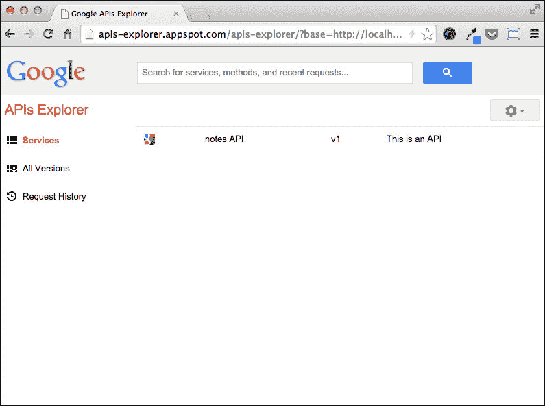
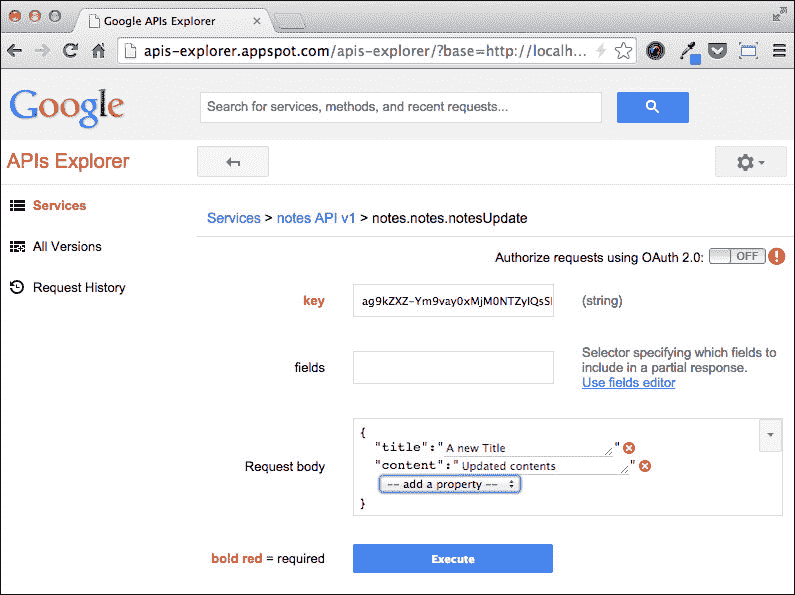

# 第八章. 使用 Google Cloud Endpoints 暴露 REST API

在 第一章，*入门*中，我们提供了网络应用程序的定义，然后一章又一章，你学习了如何使用 App Engine 实现应用程序。到目前为止，我们对这类软件的结构有了足够的了解，可以理解网络应用程序的后端和前端组件之间的区别：前者提供逻辑、定义和数据访问，而后者提供用户界面。

在前面的章节中，我们没有在这两个组件之间做出明确的区分，我们编写的代码到目前为止提供了前端和后端组件，而没有太多的分离。在本章中，我们将拆解我们的 Notes 应用程序的前端组件，实现一个独立的后端服务器，准备与不同的客户端交换数据，从移动应用程序到在浏览器中运行的富 JavaScript 客户端。

再次强调，为了实现我们的应用程序，我们将利用 Google Cloud Platform 提供的一些工具和服务，称为 Google Cloud Endpoints。

在本章中，我们将涵盖以下主题：

+   什么是 REST，以及为 Notes 应用设计 API

+   使用 Cloud Endpoints 实现 REST API

+   API 探索工具

+   使用 OAuth2 保护 API

# 使用 REST API 的原因

**表征状态转移**（**REST**）是一种简单的无状态架构风格，通常在 HTTP 协议上运行。REST 背后的理念是将系统的状态作为我们可以操作的资源集合暴露出来，通过名称或 ID 来寻址。后端服务负责使资源的数据持久化，通常通过使用数据库服务器来实现。客户端通过向服务器发送 HTTP 请求来检索资源的状态。资源可以通过 HTTP 请求进行操作并返回给服务器。资源可以用几种格式表示，但我们将使用 JSON，这是一种轻量级、可读性强且广泛使用的交换格式。我们可以将资源的状态操作看作是一个 **创建、检索、更新、删除**（**CRUD**）系统。我们将要做的是将这些操作映射到特定的 HTTP 动词。我们将通过发送 HTTP `POST` 请求来创建新的资源，通过发送 `GET` 请求来检索现有的资源，通过发送 `PUT` 请求来更新其状态，以及通过发送 `DELETE` 请求来从系统中删除它。

这些天，REST 被广泛采用，主要是因为它允许客户端和服务器之间有很强的解耦，易于在 HTTP 上实现，性能非常好，可以缓存，并且总的来说，可以很好地扩展。公开 REST API 使得提供移动客户端、浏览器扩展或任何需要访问和处理应用程序数据的软件变得极其容易；出于这些原因，我们将为 Notes 提供 REST API。使用 Cloud Endpoints，我们可以在 Notes 的 webapp2 版本现有代码库中添加 REST API，而无需触及数据模型或应用程序的整体架构。

# 设计和构建 API

在编写代码之前，我们需要在心中有一个整洁的想法，即通过 API 提供的资源、我们将提供用于操作这些资源的方法以及我们将向客户端提供的响应代码。设计完 API 后，我们可以开始编写一些代码来实现资源表示。

## 资源、URL、HTTP 动词和响应代码

定义资源与在 ORM 系统中定义模型类非常相似，并且它们通常是一致的，就像在我们的案例中一样。实际上，我们将提供以下资源：

+   Note

+   NoteFile

+   ChecklistItem

每个资源都将由一个 URL 来标识。我们在这里省略了主机名以保持清晰：

+   **The** `/notes` **URL**: 这标识了一个类型为 Note 的资源集合

+   **The** `/notes/:id` **URL**: 这使用其 ID 作为区分符来标识类型为 Note 的单个资源

+   **The** `/notefiles` **URL**: 这标识了一个类型为 NoteFile 的资源集合

+   **The** `/notefiles/:id` **URL**: 这标识了一个类型为 NoteFile 的单个资源

我们不会通过 API 公开`CheckListItem`资源，因为在底层数据模型中，我们将条目定义为`Note`模型的`StructuredProperty`字段。由于相应的实体在 Datastore 中不存在，我们不能在不更改 Note 状态的情况下更改`ChecklistItem`资源的状态。因此，公开两个不同的资源没有太多意义。

客户端在联系后端服务器时，在请求头中指定一个特定的 HTTP 动词或方法，HTTP 动词告诉服务器如何处理由 URL 标识的数据。我们需要知道，根据 URL 是否代表单个资源或集合，动词可能具有不同的含义。对于我们的 REST API 公开的 URL，我们将支持以下动词：

+   **The** `GET` **request**

    +   **On a collection**: 这将检索资源表示列表

    +   **On a single resource**: 这将检索资源表示

+   **The** `POST` **request**

    +   **On a collection**: 这将创建一个新的资源并返回其表示

    +   **On a single resource**: 这不适用并返回错误

+   **The** `PUT` **request**

    +   **On a collection**: 这批量更新资源列表并返回无负载

    +   **在单个资源上**：这更新单个资源并返回更新后的表示

+   **DELETE** 请求

    +   **在集合上**：这不适用，并返回错误

    +   **单个资源**：这将删除资源并返回无负载

每当服务器响应用户的请求时，都会传输一个 HTTP 状态码，以及可能的负载。我们的 API 将提供以下状态码：

+   **200 OK**：这表示请求成功。

+   **204 无内容**：这表示请求成功，但响应不包含数据，通常在`DELETE`请求之后返回。

+   **400 错误请求**：这意味着请求格式不正确；例如，数据未通过验证或格式不正确。

+   **404 未找到**：这表示请求的资源无法找到。

+   **401 未授权**：这表示在访问资源之前我们需要执行身份验证。

+   **405 方法不允许**：这意味着用于此资源的 HTTP 方法不受支持。

+   **409 冲突**：这表示在更新系统状态时发生了冲突，例如当我们尝试插入重复项时。

+   **503 服务不可用**：这表示服务器暂时不可用。特别是，当我们的 Cloud Endpoints 应用程序抛出一个未捕获的异常时，这种情况会发生。

+   **500 内部服务器错误**：当其他所有操作都失败时发生。

现在 API 的设计已经完成，是我们开始编写代码的时候了。

## 定义资源表示

我们已经提到，请求和响应可能包含一个或多个资源的表示，我们也已经声明我们将使用 JSON 格式来实现这样的表示。现在我们需要在我们的代码中定义一个资源，Cloud Endpoints 将负责将我们的资源在 JSON 格式之间转换。这个操作被称为序列化。

在我们开始编码之前，我们需要花一些时间在 Cloud Endpoints 架构上，这样会更容易理解为什么我们使用某些 Python 包或数据结构。

Cloud Endpoints 建立在 Google Protocol RPC 库之上，这是一个在 HTTP 协议上实现远程过程调用（RPC）服务的框架。一个服务是一组可以通过常规 HTTP 请求调用的方法。一个方法接收请求中的消息类型对象，并返回另一个消息类型作为响应。消息类型是派生自`protorpc.messages.Message`类的常规 Python 类，而服务是派生自`protorpc.remote.Service`类的 Python 类的方法。由于 Cloud Endpoints 实际上是一个底层的 RPC 服务，因此我们 REST 资源的表示将作为 RPC 消息实现。

我们在应用程序根目录下创建了一个名为`resources.py`的新模块，包含以下代码：

```py
from protorpc import messages
from protorpc import message_types

class CheckListItemRepr(messages.Message):
    title = messages.StringField(1)
    checked = messages.BooleanField(2)

class NoteRepr(messages.Message):
    key = messages.StringField(1)
    title = messages.StringField(2)
    content = messages.StringField(3)
    date_created = message_types.DateTimeField(4)
    checklist_items = messages.MessageField(CheckListItemRepr,
                                            5, repeated=True)
    files = messages.StringField(6, repeated=True)

class NoteCollection(messages.Message):
    items = messages.MessageField(NoteRepr, 1, repeated=True)
```

定义消息类有点像在 ORM 中定义模型类；我们指定与我们要用来表示资源的每个字段相对应的类属性。字段有一个类型，并且它们的构造函数接受一个整数参数作为标识符，该标识符必须在消息类中是唯一的。`CheckListItemRepr`类将用于序列化附加到笔记上的可检查项。`NoteRepr`表示笔记资源，并且是我们 API 的核心。

我们需要一个`key`字段，以便客户端在需要获取详细信息或修改资源时有一个参考。`checklist_items`字段引用`CheckListItemRepr`类，它将嵌套到笔记表示中。我们将与笔记关联的文件表示为一个名为`files`的字符串列表，其中包含`models.NoteFile`实例的键。最后，我们定义了一个名为`NoteCollection`的笔记集合表示。它只有一个字段，即`items`，包含单个笔记表示。

一旦序列化，笔记的 JSON 表示应该看起来像这样：

```py
{
    "checklist_items": [
        {
            "checked": false,
            "title": "one"
        },
        {
            "checked": true,
            "title": "two"
        },
        {
            "checked": false,
            "title": "three"
        }
    ],
    "content": "Some example contents",
    "date_created": "2014-11-08T15:49:07.696869",
    "files": [
        "ag9kZXZ-Ym9vay0xMjM0NTZyQAsSBFVzZXIiE"
    ],
    "key": "ag9kZXZ-Ym9vay0xMjM0NTZyKwsSBFVz",
    "title": "Example Note"
}
```

如我们所见，JSON 表示非常易于阅读。

现在我们已经有了我们 REST 资源的表示，我们可以开始实现 REST API 的端点。

# 实现 API 端点

正如我们之前提到的，我们的 REST API 将与现有的 App Engine 应用程序集成，而不会改变其行为，因此我们需要指定一个新的 WSGI 应用程序来处理我们映射到 API 端点的 URL。让我们从`app.yaml`文件开始，其中我们添加以下代码：

```py
handlers:
- url: /static
  static_dir: static

- url: /_ah/spi/.*
  script: notes_api.app

- url: .*
  script: main.app

libraries:
- name: webapp2
  version: "2.5.2"

- name: jinja2
  version: latest

- name: endpoints
  version: 1.0
```

匹配 API URL 的正则表达式实际上是`/_ah/spi/.*`。即使我们向类似于`https://example.com/_ah/api/v1/an-endpoint`的 URL 发出请求，Cloud Endpoints 也会负责适当的重定向。API URL 的处理脚本指向`notes_api`模块中的`app`变量，我们尚未创建。在一个名为`notes_api.py`的新文件中，我们添加以下代码：

```py
import endpoints

app = endpoints.api_server([])
```

这是我们的 REST API 的非常基本的框架。现在我们需要定义端点作为从`protorpc.remote.Service`类派生的 Python 类的成员方法，并将此类附加到传递给`api_server()`函数的参数列表中。

在`notes_api.py`模块中，我们添加了`NotesApi`类，它将包含所有用于检索和操作笔记资源的端点。让我们看看如何实现操作笔记集合的端点，一次一个，从支持`GET`请求的端点开始：

```py
from protorpc import message_types
from protorpc import remote
from google.appengine.ext import ndb

import models
import resources

@endpoints.api(name='notes', version='v1')
class NotesApi(remote.Service):

    @endpoints.method(message_types.VoidMessage,
                      resources.NoteCollection,
                      path='notes',
                      http_method='GET',
                      name='notes.notesList')
    def note_list(self, unused_request_msg):
        items = []
        for note in models.Note.query().fetch():
            checkl_items = []
            for i in note.checklist_items:
                checkl_items.append(
                    resources.CheckListItemRepr(title=i.title,
                                               checked=i.checked))
            files = [f.urlsafe() for f in note.files]
            r = resources.NoteRepr(key=note.key.urlsafe(),
                                   title=note.title,
                                   content=note.content,
                                   date_created=note.date_created,
                                   checklist_items=checkl_items,
                                   files=files)
               items.append(r)

            return resources.NoteCollection(items=items)

app = endpoints.api_server([NotesApi])
```

我们应用到`NotesApi`类的装饰器，即`@endpoints.api`装饰器，告诉 Cloud Endpoints 这个类是名为`notes`的 API 的一部分，版本为 v1。`note_list()`方法被`@endpoints.method`装饰器装饰，并且这个方法期望以下参数，按照给出的顺序：

1.  用于请求的消息类。在这种情况下，我们不期望任何输入，所以我们使用 `message_types.VoidMessage`，这是 Cloud Endpoints 提供的一个特殊消息类。

1.  我们将在响应中返回的消息类，在这种情况下是我们的 `resources.NoteCollection` 类。

1.  端点的 URL 或路径。

1.  端点支持的 HTTP 方法或动词。

1.  表示端点名的一个字符串。

端点的逻辑很简单——我们从 Datastore 加载所有笔记实例，并为每个实例构建一个 `NoteRepr` 对象。然后使用 `NoteCollection` 类将这些表示添加到集合中，并将其返回给客户端。

现在我们添加支持 `POST` 类型请求的端点：

```py
    @endpoints.method(resources.NoteRepr,
                      resources.NoteRepr,
                      path='notes',
                      http_method='POST',
                      name='notes.notesCreate')
    def note_create(self, new_resource):
        user = endpoints.get_current_user()
        if user is None:
            raise endpoints.UnauthorizedException()

        note = models.Note(parent=ndb.Key("User",
                           user.nickname()),
                           title=new_resource.title,
                           content=new_resource.content)
        note.put()
        new_resource.key = note.key.urlsafe()
        new_resource.date_created = note.date_created
        return new_resource
```

我们将方法命名为 `note_create()` 以更好地描述其语义。它期望请求中包含创建新资源信息的 `NoteRepr` 消息，并将返回一个包含已创建资源的 `NoteRepr` 消息。`new_resource` 参数包含请求中到达的 `NoteRepr` 实例，并用于在 Datastore 中构建一个新的 `Note` 实体。我们需要传递一个用户作为笔记的所有者，因此我们调用 endpoints 包中的 `get_current_user` 方法。我们将在本章的后面部分看到用户如何通过我们的 API 进行身份验证。在调用 `PUT` 类型后，我们可以访问新创建实体的键，因此我们更新 `new_resource` 消息字段并将其返回给客户端。

下面是支持 `PUT` 类型请求的端点的代码：

```py
    @endpoints.method(resources.NoteCollection,
                      message_types.VoidMessage,
                      path='notes',
                      http_method='PUT',
                      name='notes.notesBatchUpdate')
    def note_batch_update(self, collection):
        for note_repr in collection.items:
            note = ndb.Key(urlsafe=note_repr.key).get()
            note.title = note_repr.title
            note.content = note_repr.content

            checklist_items = []
            for item in note_repr.checklist_items:
                checklist_items.append(
                    models.CheckListItem(title=item.title,                                                                   	                                   checked=item.checked))
            note.checklist_items = checklist_items

            files = []
            for file_id in note_repr.files:
                files.append(ndb.Key(urlsafe=file_id).get())
            note.files = files

            note.put()

        return message_types.VoidMessage()
```

该方法被命名为 `note_batch_update()`，因为它应该对请求中接收到的资源集合执行更新，不向客户端返回任何有效载荷。它期望输入中有一个 `NoteCollection` 消息类，并在执行所有必要的更新后返回一个 `VoidMessage` 实例。

在笔记集合上操作的最后一个端点实际上是一个错误条件的处理器。实际上，在集合上执行 `DELETE` 请求应该导致一个 **HTTP 错误 405：不允许的方法** 消息。为了响应带有错误代码的 API 调用，我们只需在实现端点的 Python 方法中抛出一个适当的异常：

```py
    @endpoints.method(message_types.VoidMessage,
                      message_types.VoidMessage,
                      path='notes',
                      http_method='DELETE',
                      name='notes.notesBatchDelete')
    def note_list_delete(self, request):
        raise errors.MethodNotAllowed()
```

`note_list_delete()` 方法只是抛出一个我们仍然需要定义的异常。在我们的应用程序中，我们添加一个新的 `errors.py` 模块，并添加以下内容：

```py
import endpoints
import httplib

class MethodNotAllowed(endpoints.ServiceException):
    http_status = httplib.METHOD_NOT_ALLOWED
```

我们需要定义自己的 `MethodNotAllowed` 异常，因为 Cloud Endpoints 只提供了最常见的 HTTP 错误代码的异常类：`400`、`401`、`403`、`404` 和 `500`。

在`note`类型资源集合上操作的 REST API 部分现在已经完成，因此我们可以继续并开始实现操作单个笔记的端点。单个资源的路径包含一个参数，即资源标识符。在这种情况下，以及当需要传递查询字符串参数时，我们不能使用简单的`Message`类来处理请求，而必须使用一个特殊的容器，该容器定义在`endpoints.ResourceContainer`参数中，它将消息和路径中的参数以及查询字符串中的参数包装在一起。在我们的例子中，由于我们将多次使用该容器，我们可以将其定义为`NotesApi`类的字段：

```py
from protorpc import messages

@endpoints.api(name='notes', version='v1')
class NotesApi(remote.Service):
    NoteRequestContainer = endpoints.ResourceContainer(
        resources.NoteRepr, key=messages.StringField(1))
```

我们将想要包装的消息及其通过请求路径或查询字符串接收的参数传递给构造函数。每个参数都必须定义为具有唯一标识符的消息字段。

我们接下来定义处理单个资源`GET`请求的端点：

```py
    @endpoints.method(NoteRequestContainer,
                      resources.NoteRepr,
                      path='notes/{key}',
                      http_method='GET',
                      name='notes.notesDetail')
    def note_get(self, request):
        note = ndb.Key(urlsafe=request.key).get()
        checklist_items = []
        for i in note.checklist_items:
            checklist_items.append(
                resources.CheckListItemRepr(title=i.title,
                                               checked=i.checked))
        files = [f.urlsafe() for f in note.files]
        return resources.NoteRepr(key=request.key,
                                  title=note.title,
                                  content=note.content,
                                  date_created=note.date_created,
                                  checklist_items=checklist_items,
                                  files=files)
```

我们期望在端点`note_get()`的输入中有一个`NoteRequestContainer`参数，它将返回一个`NoteRepr`消息。路径包含`{key}`参数，每当请求的 URL 匹配时，Cloud Endpoint 将填充`NoteRequestContainer`实例中的相应`key`字段，并解析其值。然后我们使用资源的键从 Datastore 检索相应的实体，并最终填充并返回一个`NoteRepr`消息对象。

当客户端对单个资源发出`POST`类型请求时，我们抛出一个错误，因此端点实现如下：

```py
    @endpoints.method(NoteRequestContainer,
                      message_types.VoidMessage,
                      path='notes/{key}',
                      http_method='POST',
                      name='notes.notesDetailPost')
    def note_get_post(self, request):
        raise errors.MethodNotAllowed()
This is the code for requests of type PUT instead:
    @endpoints.method(NoteRequestContainer,
                      resources.NoteRepr,
                      path='notes/{key}',
                      http_method='PUT',
                      name='notes.notesUpdate')
    def note_update(self, request):
        note = ndb.Key(urlsafe=request.key).get()
        note.title = request.title
        note.content = request.content
        checklist_items = []
        for item in request.checklist_items:
            checklist_items.append(
                models.CheckListItem(title=item.title,
                                     checked=item.checked))
        note.checklist_items = checklist_items

        files = []
        for file_id in request.files:
               files.append(ndb.Key(urlsafe=file_id).get())
        note.files = files
        note.put()
        return resources.NoteRepr(key=request.key,
                                  title=request.title,
                                  content=request.content,
                                date_created=request.date_created,
                          checklist_items=request.checklist_items,
                                  files=request.files)
```

`note_update()`方法从 Datastore 检索`note`实体，并根据请求的内容相应地更新其字段。最后，该方法返回更新资源的表示。

对于单个资源，我们需要支持的最后一个方法是`DELETE`：

```py
    @endpoints.method(NoteRequestContainer,
                      message_types.VoidMessage,
                      path='notes/{key}',
                      http_method='DELETE',
                      name='notes.notesDelete')
    def note_delete(self, request):
        ndb.Key(urlsafe=request.key).delete()
        return message_types.VoidMessage()
```

端点接收一个请求容器，删除相应的 Datastore 实体，如果一切正常，则返回一个空的有效载荷。

我们最终拥有一个完整的 REST API 来处理笔记实体。现在是时候玩玩它并检查结果是否符合我们的预期。

# 使用 API Explorer 测试 API

我们可以通过运行`dev_appserver.py`脚本或在 App Engine 上部署应用程序来在本地开发环境中测试我们的 REST API。在这两种情况下，Cloud Endpoints 提供了一个工具，允许我们探索我们的 API；让我们看看如何。

当本地开发服务器正在运行时，我们将浏览器指向`http://localhost:8080/_ah/api/explorer` URL，我们立即被重定向到 API Explorer，在那里我们可以看到我们的 API 被列出，如下面的截图所示：



当我们点击我们的 API 名称时，探索器列出了通过 Cloud Endpoints 服务公开的所有端点。在我们开始测试之前，我们应该确保 Datastore 中存在一些笔记。我们可以使用 Notes 网络应用程序来插入它们。

通过点击**笔记列表**条目，我们可以访问端点的详细信息页面，在那里我们可以点击**执行**按钮来执行`GET`请求并检索在**响应**部分可见的笔记集合，以 JSON 格式表示。我们还可以复制集合中笔记的**键**字段，并访问`notesDetail`端点的详细信息页面。在这里，我们在表单的**键**字段中粘贴键，然后按**执行**按钮。这次，响应应该包含资源表示。

要查看如何更新此资源，我们访问`notesUpdate`端点的详细信息页面。在这里，我们可以再次粘贴我们想要更新的资源的键，并使用**请求体**编辑器构建请求体，这是一个非常强大的工具，它允许我们通过仅指向和点击一些 HTML 控件来组合复杂的 JSON 对象。



。

API 探索器在开发 API 时非常有帮助，可以立即看到对端点的调用结果，测试具有特定有效负载的端点，并检查同一 API 不同版本的行为。我们也可以使用其他客户端来测试我们的 API，例如命令行中的`curl`程序，但 API 探索器提供的交互性是一个巨大的增值。

在下一段中，我们将看到 API 探索器的另一个功能，这将使我们的生活变得更加容易——有机会使用通过 OAuth2 认证的客户端测试我们的 API。

# 使用 OAuth2 保护端点

即使我们的 REST API 看起来相当完整，但在我们的实现中仍缺少一个关键组件：实际上任何客户端目前都能在不提供身份验证的情况下检索存储在 Datastore 中的所有笔记，无论这些笔记的所有者是否是客户端。此外，直到我们为我们的 REST API 提供身份验证之前，创建笔记将是不可能的，因为我们需要在`NotesApi`类的`note_create()`方法中需要一个经过身份验证的用户来创建实体。我们可以很容易地填补这个需求缺口，因为 Cloud Endpoints 提供了使用 OAuth2 授权框架保护我们 API 全部或部分的支持。

为我们的 API 提供保护的第一步是指定允许访问 API 的客户端。在这里，我们使用“客户端”一词实际上来识别一种客户端类型，例如在浏览器中运行的 JavaScript 应用程序、在 Android 或 iOS 上运行的移动应用程序等等。每个客户端都有一个称为客户端 ID 的字符串来标识，我们必须使用开发者控制台生成它：

1.  在左侧菜单中，选择**APIs & auth**。

1.  选择**credentials**。

1.  点击**创建新的 Client ID**按钮。

然后，将启动一个引导程序，我们只需遵循屏幕上的说明即可生成新的客户端 ID。

然后，我们使用`NotesApi`类的`@endpoints.api`装饰器指定授权的客户端 ID 列表，如下所示：

```py
JS_CLIENT_ID = '8nej3vl.apps.googleusercontent.com'
IOS_CLIENT_ID = 'm6gikl14bncbqks.apps.googleusercontent.com'

@endpoints.api(name='notes', version='v1',
               allowed_client_ids=[
                   endpoints.API_EXPLORER_CLIENT_ID,
                   JS_CLIENT_ID,
                   IOS_CLIENT_ID
               ])
class NotesApi(remote.Service):
```

要从探索器访问 API，我们也列出其客户端 ID，该 ID 由 `endpoints` 包提供。由于客户端 ID 列在 Python 源代码中，我们必须记住，每次我们更改 `allowed_client_ids` 列表时，都需要重新部署应用程序。

如果我们将 Android 应用程序添加到允许的客户端 ID 列表中，我们必须也在 `@endpoints.api` 装饰器中指定受众参数。此参数的值与客户端 ID 相同：

```py
JS_CLIENT_ID = '8nej3vl.apps.googleusercontent.com'
IOS_CLIENT_ID = 'm6gikl14bncbqks.apps.googleusercontent.com'
ANDROID_CLIENT_ID = '1djhfk8ne.apps.googleusercontent.com'

@endpoints.api(name='notes', version='v1',
               allowed_client_ids=[
                   endpoints.API_EXPLORER_CLIENT_ID,
                   JS_CLIENT_ID,
                   IOS_CLIENT_ID,
                   ANDROID_CLIENT_ID,
               ],
               audiences=[ANDROID_CLIENT_ID])
class NotesApi(remote.Service):
```

最后的配置步骤是声明我们希望客户端提供的 OAuth2 范围，以便访问我们的 API。对于我们的 Notes API，我们只需要 `endpoints.EMAIL_SCOPE` 类，这是 Cloud Endpoints 提供 OAuth2 认证和授权所需的最小范围。我们将以下内容添加到传递给 `@endpoints.api` 装饰器的参数列表中：

```py
@endpoints.api(name='notes', version='v1',
               allowed_client_ids=[
                   endpoints.API_EXPLORER_CLIENT_ID,
                   JS_CLIENT_ID,
                   ANDROID_CLIENT_ID
               ],
               audiences=[ANDROID_CLIENT_ID],
                scopes=[endpoints.EMAIL_SCOPE])
class NotesApi(remote.Service):
```

从现在起，Cloud Endpoints 框架将自动验证用户并强制执行允许的客户端列表，如果认证过程成功，将为我们的应用程序提供一个有效的 `User` 实例。要检索已认证的用户，我们以与在 `create_note()` 端点方法中相同的方式调用 `endpoints.get_current_user()` 函数。如果认证过程失败，`get_current_user()` 函数返回 `None` 参数。检查当前用户是否有效是我们代码的责任，在我们要保护的各个方法中。

例如，我们可以在 `NotesApi` 类的 `note_list()` 方法开头添加以下安全检查：

```py
    def note_list(self, request):
        if endpoints.get_current_user() is None:
            raise endpoints.UnauthorizedException()
```

现在，如果我们打开 API 探索器并尝试对 `notesList` 端点执行 `GET` 请求，我们将得到以下响应：

```py
401 Unauthorized
{
 "error": {
  "code": 401,
  "errors": [
   {
    "domain": "global",
    "message": "Unauthorized",
    "reason": "required"
   }
  ],
  "message": "Unauthorized"
 }
}
```

多亏了 API 探索器，我们可以使用 OAuth2 进行认证并尝试访问相同的端点，以检查我们这次是否被允许。停留在我们之前执行失败请求的页面上，我们可以在 API 探索器界面的右上角看到一个标签为 **使用 OAuth 2.0 授权请求** 的开关。如果我们点击它，探索器将使用我们的一个 Google 账户启动 OAuth2 授权过程，一旦完成，我们就可以再次执行请求而不会出现认证错误。

除了设置认证之外，现在我们还可以使用用户实例过滤 Datastore 查询，这样每个用户就只能访问他们自己的数据。

# 摘要

在本章的最后，我们深入探讨了 Cloud Endpoints 框架，你现在拥有了完成 REST API 以及可能支持各种客户端所需的技能：有人可以编写 Notes 的 Android 版本，其他人可能提供 iOS 的移植。我们可以编写一个 JavaScript 客户端，并通过它们各自的市场交付为 Chrome 或 Firefox 应用程序。

您简要了解了 REST，以及为什么您应该在众多解决方案中选择它来与各种客户端通信。我们精心设计了我们的 API，提供了一套全面的端点来检索和操作我们应用程序中的资源。我们最终实现了代码，并使用 API Explorer（一个能够执行 API 方法、显示请求和响应数据以及验证客户端的交互式探索工具）来玩转 API。

REST 是一种在互联网上许多地方使用的语言，多亏了 Cloud Endpoints，我们有机会为在 App Engine 上运行的每个 Web 应用程序轻松提供现代且强大的 API。

我希望您像我写作这本书一样喜欢它，无论您的下一个 Python 应用程序是否将在 Google App Engine 上运行，我都希望这本书能帮助您做出那个决定。
