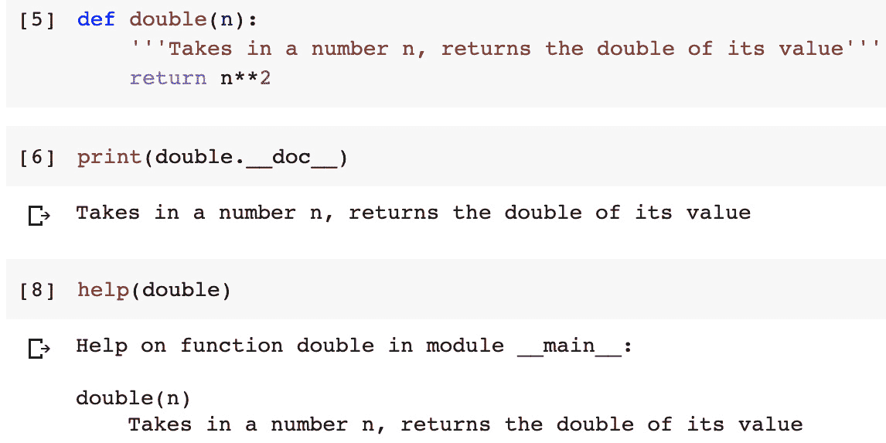
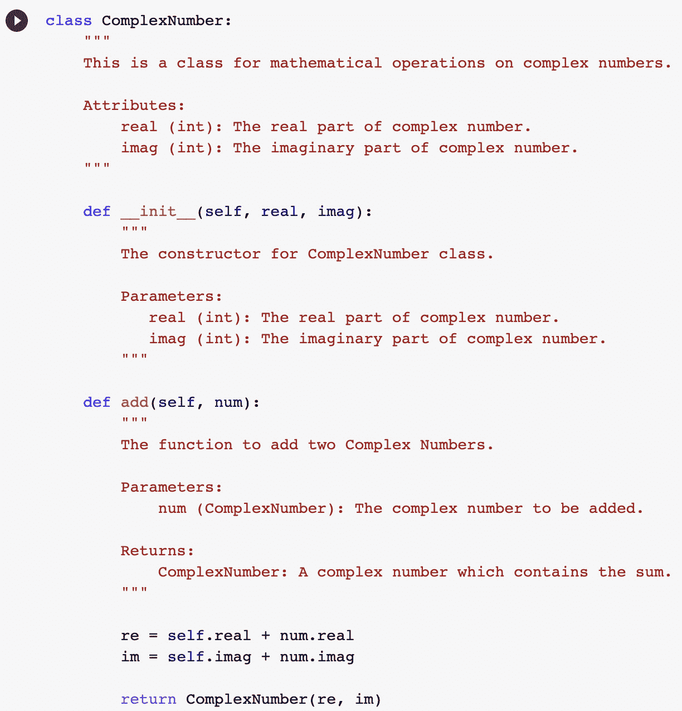

# *第一章*：最优 Python 开发生命周期

考虑到你之前对 Python 的经验，我们在本章中跳过了 Python 语言的入门细节。首先，我们将简要讨论更广泛的 Python 开源社区及其特定的文化。这个介绍很重要，因为这种文化体现在 Python 社区编写的和共享的代码中。然后，我们将介绍典型 Python 项目的不同阶段。接下来，我们将探讨制定典型 Python 项目开发策略的不同方法。

接下来，我们将探讨不同的方法来记录 Python 代码。稍后，我们将研究各种有效的命名方案选项，这可以极大地帮助提高代码的维护性。我们还将探讨在 Python 项目中使用源控制的各种选项，包括开发者主要使用 Jupyter 笔记本进行开发的情况。最后，我们将探讨一旦开发并测试后，如何部署代码以供使用的最佳实践。

本章将涵盖以下主题：

+   Python 文化和社区

+   Python 项目的不同阶段

+   制定开发策略

+   有效地记录 Python 代码

+   制定有效的命名方案

+   探索源控制的选择

+   理解部署代码的策略

+   Python 开发环境

本章将帮助你了解典型 Python 项目的生命周期及其各个阶段，以便你能够充分利用 Python 的强大功能。

# Python 文化和社区

Python 是一种由 Guido van Rossum 于 1991 年最初开发的解释型高级语言。Python 社区的特殊之处在于它非常关注代码的编写方式。为此，自 Python 的早期以来，Python 社区在其设计哲学中创造并维护了一种特定的风格。如今，Python 被广泛应用于各种行业，从教育到医学。但无论在哪个行业中使用，充满活力的 Python 社区的独特文化通常被视为 Python 项目的组成部分。

尤其是 Python 社区希望我们编写简洁的代码，并在可能的情况下避免复杂性。事实上，有一个形容词，*Pythonic*，意味着完成某个任务有多种方法，但根据 Python 社区的传统和语言的基础哲学，有一种首选的方法。Python 爱好者们尽力创造尽可能符合 Pythonic 的成果。显然，*非 Pythonic 代码*意味着在这些爱好者眼中，我们并不是好的程序员。在这本书中，我们将尽力使我们的代码和设计尽可能符合 Pythonic。

除此之外，Pythonic 还有一些官方的规定。Tim Peters 将 Python 的哲学简洁地写在一个简短的文档中，名为《Python 之禅》。我们知道 Python 被认为是最容易阅读的语言之一，而《Python 之禅》希望保持这种风格。它期望 Python 通过良好的文档保持清晰和简洁。我们可以自己阅读《Python 之禅》，如下所述。

为了阅读《Python 之禅》，请打开 Python 控制台并运行`import this`命令，如下截图所示：


图 1.1 – Python 之禅

《Python 之禅》似乎是一篇在古老的埃及墓穴中发现的神秘文本。尽管它是故意以这种随意的神秘方式写成的，但每行文字都有更深的意义。实际上，仔细看看--它可以作为在 Python 中编码的指南。本书将参考《Python 之禅》的不同行。让我们首先看看它的一些摘录，如下所示：

+   **美观比丑陋好**：编写易于阅读、易于理解且自我解释的代码很重要。不仅应该能工作，而且应该写得美观。在编码时，我们应该避免使用捷径，而应该选择自我解释的风格。

+   **简单比复杂好**：我们不应该无谓地使事情复杂化。面对选择时，我们应该选择更简单的解决方案。反对那些笨拙的、不必要的和复杂的编码方式。即使这会增加一些源代码的行数，简单仍然比复杂的替代方案更好。

+   **应该只有一个--最好是只有一个--明显的做法**：从更广泛的角度来看，对于给定的问题，应该有一个可能的最佳解决方案。我们应该努力发现这个解决方案。在我们迭代设计以改进它时，无论我们的方法如何，我们的解决方案都应预期会发展和收敛到那个更可取的解决方案。

+   **现在比永远好**：与其等待完美，不如利用我们已有的信息、假设、技能、工具和基础设施开始解决给定的问题。通过迭代过程，我们将不断改进解决方案。让我们保持前进，而不是停滞不前。在等待完美的时机时不要放松。可能性很大，完美的时机永远不会到来。

+   **明确比隐晦好**：代码应该尽可能自我解释。这应该体现在变量名、类和函数设计的选择上，以及整体**端到端**（**E2E**）架构中。在面临选择时，最好谨慎行事。总是使它更加明确。

+   **扁平比嵌套好**：嵌套结构简洁，但也会造成混淆。尽可能选择扁平结构。

# Python 项目的不同阶段

在我们讨论最佳开发生命周期之前，让我们首先确定 Python 项目的不同阶段。每个阶段可以被视为一组性质相似的活动，如下面的图所示：

![图 1.2 – Python 项目的各个阶段]

![img/B17189_01_02.jpg]

图 1.2 – Python 项目的各个阶段

典型 Python 项目的各个阶段如下概述：

+   **需求分析**：这个阶段是关于从所有关键利益相关者那里收集需求，然后分析它们以了解需要做什么，并随后考虑如何去做。利益相关者可以是我们的软件的实际用户或业务所有者。尽可能详细地收集需求是很重要的。在可能的情况下，需求应在开始设计和开发之前，与最终用户和利益相关者充分展开、理解和讨论。

    一个重要的要点是确保需求分析阶段不应包含在设计、开发和测试阶段的迭代循环中。需求分析应该在进入下一阶段之前完全进行并完成。需求应包括**功能性需求**（**FRs**）和**非功能性需求**（**NFRs**）。FRs 应分组到模块中。在每个模块内，需求应编号，以便尽可能紧密地与代码模块对应。

+   **设计**：设计是我们对需求阶段中提出的技术的响应。在设计阶段，我们确定等式中的“如何”部分。这是一个创造性的过程，我们利用我们的经验和技能，以最有效和最优化的方式提出正确的模块集和结构，以及它们之间的交互。

    注意，提出正确的设计是 Python 项目的一个重要部分。在设计阶段犯的任何错误，其纠正成本将远高于后续阶段的错误。在某些程度上，改变设计和在后续阶段（例如编码阶段）实施设计变更所需的努力是编码阶段发生类似程度变更的 20 倍（例如，无法正确识别类或确定正确的数据和计算项目的维度将产生重大影响，与实现函数时的错误相比）。此外，因为提出正确的设计是一个概念过程，错误可能不明显，无法通过测试来捕捉。另一方面，编码中的错误将通过精心设计的异常处理系统被捕捉到。

    在设计阶段，我们执行以下活动：

    a) 我们设计代码的结构并确定代码中的模块。

    b) 我们决定基本方法，并决定是否应该使用函数式编程、面向对象编程或混合方法。

    c) 我们还识别出类和函数，并选择这些较高层次组件的名称。

    我们还生成较高层次的文档。

+   **编码**：这是我们将使用 Python 实现设计的阶段。我们首先实现设计中所识别的较高层次的抽象、组件和模块，然后进行详细编码。在本节中，我们将尽量减少对编码阶段的讨论，因为我们在整本书中会对其进行详细讨论。

+   **测试**：测试是验证我们代码的过程。

+   **部署**：一旦彻底测试，我们需要将解决方案交给最终用户。最终用户不应看到我们的设计、编码或测试的细节。部署是将解决方案提供给最终用户的过程，该解决方案可以用来解决需求中详细说明的问题。例如，如果我们正在开发一个预测渥太华降雨的机器学习（ML）项目，部署就是找出如何向最终用户提供一个可用的解决方案。

在理解了项目的不同阶段之后，我们将继续探讨如何制定整体过程。

# 制定开发过程策略

制定开发过程策略是关于规划每个阶段，并查看从一个阶段到另一个阶段的过程流程。为了制定开发过程策略，我们首先需要回答以下问题：

1.  我们是否寻求最小化设计方法，并直接进入编码阶段，而设计较少？

1.  我们是否希望采用**测试驱动开发**（**TDD**），即首先使用需求创建测试，然后编写代码？

1.  我们是希望首先创建一个**最小可行产品**（**MVP**）并迭代地完善解决方案吗？

1.  验证 NFRs（如安全性和性能）的策略是什么？

1.  我们是寻求单节点开发，还是希望在集群或云端进行开发和部署？

1.  我们输入和输出的数据量、速度和种类是什么？是**Hadoop 分布式文件系统**（**HDFS**）或**简单存储服务**（**S3**）基于文件的架构，还是**结构化查询语言**（**SQL**）或 NoSQL 数据库？数据是在本地还是云端？

1.  我们是否在处理特定的用例，例如具有创建数据管道、测试模型、部署和维护特定要求的机器学习（ML）？

根据这些问题的答案，我们可以为我们的开发过程制定策略。在最近的时间里，总是更倾向于以某种形式使用迭代开发过程。将 MVP 作为起始目标的概念也很流行。我们将在下一小节中讨论这些内容，以及特定领域的开发需求。

## 遍历各个阶段

现代软件开发哲学基于设计、开发和测试的短迭代周期。在代码开发中曾经使用的传统瀑布模型已经死去。选择这些阶段的正确粒度、重点和频率取决于项目的性质和我们的代码开发策略选择。如果我们想选择一个设计最少、直接进入编码的代码开发策略，那么设计阶段就非常薄。但即使直接开始编码，也需要对最终将实现的设计模块进行一些思考。

无论我们选择什么策略，设计和开发、测试阶段之间都存在固有的迭代关系。我们最初从设计阶段开始，将其在编码阶段实现，然后通过测试来验证它。一旦我们发现了缺陷，我们就需要通过重新访问设计阶段回到起点。

## 首先追求最小可行产品 (MVP)

有时，我们会选择最重要的需求的一个小主题，首先实现 MVP，目的是迭代地改进它。在迭代过程中，我们设计、编码和测试，直到我们创建一个可以部署和使用的最终产品。

现在，让我们谈谈我们将如何用 Python 实现一些特定领域的解决方案。

## 为特定领域制定开发策略

Python 目前被用于各种场景。让我们看看以下五个重要的用例，看看我们如何根据它们的具体需求制定每个用例的开发策略：

+   机器学习

+   云计算和集群计算

+   系统编程

+   网络编程

+   无服务器计算

我们将在以下各节中讨论每个部分。

### 机器学习

多年来，Python 已经成为实现机器学习算法最常用的语言。机器学习项目需要一个结构良好的环境。Python 拥有一系列高质量库，这些库可用于机器学习。

对于典型的机器学习项目，有一个 **数据挖掘跨行业标准流程** (**CRISP-DM**) 生命周期，它规定了机器学习项目的各个阶段。CRISP-DM 生命周期看起来是这样的：


图 1.3 – CRISP-DM 生命周期

对于机器学习项目，设计和实现数据管道预计占开发工作的 70% 左右。在设计数据处理管道时，我们应该记住，理想情况下，管道将具有以下特征：

+   它们应该是可扩展的。

+   在可能的情况下，它们应该是可重用的。

+   他们应该通过遵循 **Apache Beam** 标准来处理流式和批量数据。

+   它们应该主要是 fit 和 transform 函数的连接，正如我们将在 *第六章* 中讨论的，*Python 高级技巧与窍门*。

此外，机器学习项目测试阶段的一个重要部分是模型评估。我们需要确定根据问题的需求、数据的性质和所实现的算法类型，哪个性能指标是最好的来量化模型的性能。我们是关注准确度、精确度、召回率、F1 分数，还是这些性能指标的组合？模型评估是测试过程中的一个重要部分，并且需要在其他软件项目中进行的标准测试之外进行。

### 云计算和集群计算

云计算和集群计算给底层基础设施增加了额外的复杂性。云服务提供商提供需要专用库的服务。Python 的架构从最基本的核心包开始，并具有导入任何其他包的能力，这使得它非常适合云计算。Python 环境提供的平台独立性对于云计算和集群计算至关重要。**Python** 是 **Amazon Web Services** (**AWS**), Windows Azure 和 Google Cloud Platform (GCP) 的首选语言。

云计算和集群计算项目有独立的开发、测试和生产环境。保持开发和生产环境同步非常重要。

当使用 **基础设施即服务** (**IaaS**) 时，Docker 容器可以大有帮助，并且建议使用它们。一旦我们使用 Docker 容器，代码在哪里运行就无关紧要了，因为代码将具有完全相同的环境和依赖项。

### 系统编程

Python 具有操作系统服务的接口。其核心库有 **可移植操作系统接口** (**POSIX**) 绑定，允许开发者创建所谓的 shell 工具，这些工具可用于系统管理和各种实用程序。用 Python 编写的 shell 工具可以在各种平台上兼容。相同的工具可以在 Linux、Windows 和 macOS 上使用，无需任何更改，这使得它们非常强大且易于维护。

例如，一个在 Linux 上开发和测试的完整目录的 shell 工具可以在 Windows 上无需更改地运行。Python 对系统编程的支持包括以下内容：

+   定义环境变量

+   支持文件、套接字、管道、进程和多线程

+   能够指定用于模式匹配的 **正则表达式** (**regex**)

+   能够提供命令行参数

+   支持标准流接口、shell 命令启动器和文件名扩展

+   能够压缩文件实用工具

+   能够解析 **可扩展标记语言** (**XML**) 和 **JavaScript 对象表示法** (**JSON**) 文件

当使用 Python 进行系统开发时，部署阶段是最小的，可能只是将代码打包成可执行文件。重要的是要提到，Python 不打算用于系统级驱动程序或操作系统库的开发。

### 网络编程

在数字化转型时代，**信息技术**（**IT**）系统正快速向自动化方向发展，网络被认为是全栈自动化的主要瓶颈。其原因是不同供应商的专有网络操作系统以及缺乏开放性，但数字化转型的前提条件正在改变这一趋势，许多工作正在进行中，以使网络可编程并作为服务（**网络即服务**，或**NaaS**）提供。真正的问题是：*我们能否使用 Python 进行网络编程？* 答案是肯定的 *YES*。事实上，它是用于网络自动化的最受欢迎的语言之一。

Python 对网络编程的支持包括以下内容：

+   包括**传输控制协议**（**TCP**）和**用户数据报协议**（**UDP**）套接字的套接字编程

+   支持客户端和服务器通信

+   支持端口监听和处理数据

+   在远程**安全外壳**（**SSH**）系统上执行命令

+   使用**安全复制协议**（**SCP**）/**文件传输协议**（**FTP**）上传和下载文件

+   支持用于**简单网络管理协议**（**SNMP**）的库

+   支持用于检索和更新配置的**表示状态传输**（**RESTCONF**）和**网络配置**（**NETCONF**）协议

### 无服务器计算

无服务器计算是一种基于云的应用程序执行模型，其中云服务提供商（CSPs）提供计算机资源和应用程序服务器，以允许开发者无需管理计算资源和服务器即可部署和执行应用程序。所有主要公共云供应商（Microsoft Azure Serverless Functions、AWS Lambda 和**谷歌云平台**，或**GCP**）都支持 Python 的无服务器计算。

我们需要理解，在无服务器环境中仍然存在服务器，但这些服务器由云服务提供商（CSPs）管理。作为应用程序开发者，我们不需要负责安装和维护服务器，也没有直接责任于服务器的可扩展性和性能。

对于 Python，有流行的无服务器库和框架可用。这些将在下面进行描述：

+   **无服务器**：无服务器框架是一个开源框架，用于无服务器函数或 AWS Lambda 服务，并使用 Node.js 编写。无服务器是第一个为在 AWS Lambda 上构建应用程序而开发的框架。

+   **Chalice**：这是一个由 AWS 开发的 Python 无服务器微框架。这是开发者使用 AWS Lambda 服务快速启动和部署 Python 应用程序的首选，因为它允许你快速启动和部署一个可自动扩展和缩放的运行服务器，使用 AWS Lambda。Chalice 的另一个关键特性是它提供了一个工具，可以在将应用程序推送到云端之前在本地模拟你的应用程序。

+   **Zappa**：这是一个内置在 Python 中的部署工具，使得部署你的 **Web 服务器网关接口（WSGI**） 应用变得简单。

现在，让我们看看开发 Python 代码的有效方法。

# 有效记录 Python 代码

找到一个有效的方式来记录代码始终很重要。挑战在于开发一种全面而简单的方式来开发 Python 代码。让我们首先看看 Python 注释，然后是文档字符串。

## Python 注释

与文档字符串相反，Python 注释对运行时编译器不可见。它们用作解释代码的注释。Python 中的注释以 `#` 符号开始，如下面的屏幕截图所示：


图 1.4 – Python 中注释的一个示例

## 文档字符串

记录代码的主要工具是多行注释块，称为 `"""`）。

在创建文档字符串时，以下是一些一般性指南：

+   文档字符串应放置在函数或类定义之后。

+   文档字符串应提供一个简短的总结，然后是更详细的描述。

+   应有策略地使用空白空间来组织注释，但不应过度使用。你可以使用空白行来组织代码，但不要过度使用。

在以下章节中，让我们看看文档字符串的更多详细概念。

### 文档字符串风格

Python 文档字符串有以下略微不同的风格：

+   Google

+   NumPy/SciPy

+   Epytext

+   重新结构化

### 文档字符串类型

在开发代码时，需要产生各种类型的文档，包括以下内容：

+   行内注释

+   函数或类级别文档

+   算法细节

让我们逐一讨论它们。

### 行内注释

文档字符串的一个简单用途是使用它来创建多行注释，如下所示：


](img/B17189_01_05.jpg)

图 1.5 – Python 中行内注释类型文档字符串的示例

## 函数或类级别文档

文档字符串的一个强大用途是用于函数或类级别的文档。如果我们将文档字符串放置在函数或类的定义之后，Python 会将文档字符串与该函数或类关联起来。这被放置在该特定函数或类的 `__doc__` 属性中。我们可以在运行时通过使用 `__doc__` 属性或使用 `help` 函数来打印出来，如下面的示例所示：




图 1.6 – 帮助函数的示例

在使用文档字符串记录类时，建议的结构如下：

+   摘要：通常是一行

+   第一空行

+   关于文档字符串的任何进一步解释

+   第二空行

这里展示了在类级别使用文档字符串的示例：



图 1.7 – 类级别文档字符串的示例

### 算法细节

越来越多的 Python 项目使用描述性或预测性分析以及其他复杂逻辑。所使用的算法的细节需要清楚地指定，包括所有做出的假设。如果一个算法作为函数实现，那么在函数签名之前写算法逻辑的总结是最好的地方。

# 开发有效的命名方案

如果在代码中开发和实现正确的逻辑是科学，那么使其美观和可读是艺术。Python 开发者因其特别关注命名方案并将 *Python 的禅意* 带入其中而闻名。Python 是少数几种由 Guido van Rossum 编写的关于命名方案的全面指南的语言之一。它们写在 *PEP 8* 文档中，该文档有一个关于命名约定的完整部分，许多代码库都遵循它。*PEP 8* 提供了命名和风格指南的建议。您可以在 [`www.Python.org/dev/peps/pep-0008/`](https://www.Python.org/dev/peps/pep-0008/) 上了解更多信息。

*PEP 8* 中建议的命名方案可以总结如下：

+   通常，所有模块名称都应该使用 `all_lower_case`。

+   所有类名和异常名应该使用 `CamelCase`。

+   所有全局和局部变量都应该使用 `all_lower_case`。

+   所有函数和方法名称应该使用 `all_lower_case`。

+   所有常量都应该使用 `ALL_UPPER_CASE`。

这里给出了一些关于 *PEP 8* 中代码结构的指南：

+   在 Python 中缩进很重要。不要使用 *Tab* 进行缩进。相反，使用四个空格。

+   限制嵌套到四级。

+   记住要限制行数为 79 个字符。使用 `\` 符号来断开长行。

+   为了使代码可读，在函数之间插入两个空行来分隔。

+   在不同的逻辑部分之间插入一个单行。

记住，*PEP* 指南只是一些建议，可能被不同的团队定制。任何定制的命名方案都应该仍然使用 *PEP 8* 作为基本指南。

现在，让我们更详细地看看在 Python 语言结构的上下文中的命名方案。

## 方法

方法名称应使用小写。名称应由一个单词或多个单词组成，单词之间用下划线分隔。您可以在这里看到示例：

```py
calculate_sum
```

为了使代码可读，方法最好是一个动词，与该方法应执行的处理相关。

如果一个方法是非公共的，它应该有一个前导下划线。以下是一个示例：

```py
_my_calculate_sum
```

**双下划线**或**魔术方法**是具有前导和尾随下划线的方法。双下划线或魔术方法的示例如下所示：

+   `__init__`

+   `__add__`

从不使用两个前导和尾随下划线来命名方法是一个好主意，并且开发者被鼓励不要使用这些方法。这种命名方案是为 Python 方法设计的。

## 变量

使用小写单词或由下划线分隔的单词来表示变量。变量应该是名词，与它们所代表的实体相对应。

这里给出了变量的示例：

+   `x`

+   `my_var`

私有变量的名称应该以下划线开头。例如，`_my_secret_variable`。

### 布尔变量

以`is`或`has`开头布尔变量使其更易读。您可以在以下示例中看到几个这样的例子：

```py
class Patient:
    is_admitted = False
    has_heartbeat = False
```

### 集合变量

由于集合是变量的桶，因此最好以复数格式命名它们，如下所示：

```py
class Patient:
    admitted_patients = ['John','Peter']
```

### 字典变量

字典的名称建议尽可能明确。例如，如果我们有一个将人映射到他们居住城市的字典，则可以创建如下字典：

```py
persons_cities = {'Imran': 'Ottawa', 'Steven': 'Los Angeles'}
```

## 常量

Python 没有不可变变量。例如，在 C++中，我们可以使用`const`关键字来指定变量是不可变的，并且是常量。Python 依赖于命名约定来指定常量。如果代码试图将常量作为普通变量处理，Python 不会给出错误。

对于常量，建议使用大写单词或由下划线分隔的单词。以下是一个常量的示例：

```py
CONVERSION_FACTOR
```

## 类

类应该遵循驼峰式命名风格——换句话说，它们应该以大写字母开头。如果我们需要使用多个单词，单词之间不应使用下划线分隔，但附加的每个单词都应该以大写字母开头。类应该使用名词，并且应该以最能代表类对应实体的方式命名。使代码可读的一种方法是为与它们的类型或性质有关的类使用后缀，如下所示：

+   `HadoopEngine`

+   `ParquetType`

+   `TextboxWidget`

这里有一些需要注意的点：

+   有异常类处理错误。它们的名称应该始终以`Error`结尾。以下是一个示例：

    ```py
    FileNotFoundError
    ```

+   一些 Python 的内置类不遵循此命名指南。

+   为了提高可读性，对于基类或抽象类，可以使用`Base`或`Abstract`前缀。以下是一个示例：

    ```py
    AbstractCar
    BaseClass
    ```

## 包

在命名包时，不建议使用下划线。名称应简短且全部小写。如果需要使用多个单词，附加的单词或词组也应全部小写。以下是一个示例：

```py
mypackage
```

## 模块

在命名模块时，应使用简短、直接的名字。它们需要是小写的，并且多个单词将通过下划线连接。以下是一个示例：

```py
main_module.py
```

## 导入约定

多年来，Python 社区已经形成了一套用于常用包的别名约定。您可以在以下示例中看到这一点：

```py
import numpy as np
import pandas as pd
import seaborn as sns
import statsmodels as sm
import matplotlib.pyplot as plt 
```

## 论点

建议参数的命名约定与变量相似，因为函数的参数实际上是一些临时变量。

## 有用的工具

有一些工具可以用来测试您的代码与 *PEP 8* 指南的符合程度。让我们逐一探讨。

### Pylint

可以通过运行以下命令来安装 Pylint：

```py
$ pip install pylint
```

Pylint 是一个源代码分析器，它根据 *PEP 89* 检查代码的命名约定，然后打印出报告。它可以定制以用于其他命名约定。

### PEP 8

可以通过运行以下命令来安装 *PEP 8*：

```py
 pip: $ pip install pep8
```

`pep8` 会根据 *PEP 8* 指南检查代码。

到目前为止，我们已经了解了 Python 中的各种命名约定。接下来，我们将探讨使用源代码控制进行 Python 开发的不同选择。

# 探索源代码控制的选择

首先，我们将简要回顾源代码控制系统的历史，以提供背景信息。现代源代码控制系统非常强大。源代码控制系统的演变经历了以下阶段：

+   **第一阶段**：源代码最初是由存储在硬盘上的本地源代码控制系统启动的。这个本地代码集合被称为本地仓库。

+   **第二阶段**：但本地使用源代码控制对于大型团队来说并不合适。这个解决方案最终演变成一个基于中央服务器的仓库，由特定项目上的团队成员共享。它解决了团队成员之间代码共享的问题，但也为多用户环境中的文件锁定带来了额外的挑战。

+   **第三阶段**：现代版本控制仓库，如 Git，进一步发展了这一模型。团队的所有成员现在都有一个存储的仓库的完整副本。团队成员现在可以在代码上离线工作。他们只需要在需要共享代码时连接到仓库。

## 什么不属于源代码仓库？

让我们看看不应该提交到源代码仓库中的内容。

首先，除了源代码文件之外，其他任何内容都不应该被提交。计算机生成的文件不应该被提交到源代码控制中。例如，假设我们有一个名为 `main.py` 的 Python 源代码文件。如果我们编译它，生成的代码不属于仓库。编译后的代码是一个派生文件，不应该被提交到源代码控制中。这里有三个原因，如下所述：

+   一旦我们有了源代码，团队中的任何成员都可以生成派生文件。

+   在许多情况下，编译后的代码比源代码大得多，将其添加到仓库会使系统变慢。此外，记住如果团队中有 16 名成员，那么他们每个人都会不必要地获得该生成文件的副本，这将不必要地减慢整个系统的速度。

+   版本控制系统旨在存储自上次提交以来对源文件所做的更改或增量。除了源代码文件之外，其他文件通常是二进制文件。版本控制系统很可能无法为这些文件提供`diff`工具，每次提交时都需要存储整个文件。这将对版本控制框架的性能产生负面影响。

其次，任何机密信息都不应属于源代码控制。这包括 API 密钥和密码。

对于源代码库，GitHub 是 Python 社区的首选。许多著名的 Python 包的源代码控制也位于 GitHub 上。如果 Python 代码要在多个团队之间使用，那么就需要开发和维护正确的协议和程序。

# 理解部署代码的策略

对于开发团队不是最终用户的工程项目，制定一个为最终用户部署代码的策略非常重要。对于相对大规模的项目，当存在明确的`DEV`和`PROD`环境时，部署代码和制定策略变得很重要。

Python 是云和集群计算环境的首选语言。

部署代码相关的问题如下列出：

+   在`DEV`、`TEST`和`PROD`环境中，需要发生完全相同的转换。

+   随着代码在`DEV`环境中的不断更新，如何将这些更改同步到`PROD`环境？

+   你计划在`DEV`和`PROD`环境中进行哪种类型的测试？

让我们来看看部署代码的两种主要策略。

## 批量开发

这就是传统的开发流程。我们编写代码，编译它，然后测试它。这个过程会迭代重复，直到所有需求都得到满足。然后，开发的代码就会被部署。

### 采用持续集成和持续交付

在 Python 的上下文中，**持续集成/持续交付**（**CI/CD**）指的是持续集成和部署，而不是作为批量过程执行。它通过弥合开发和运维之间的差距，有助于创建**开发-运维**（**DevOps**）环境。

**CI**指的是在代码更新时持续集成、构建和测试代码的各个模块。对于一个团队来说，这意味着每个团队成员独立开发的代码会被集成、构建和测试，通常每天多次。一旦测试通过，源代码控制中的仓库就会被更新。

CI 的优势在于问题或错误在初期就被修复。一个典型的错误在它被创建的那天修复，立即解决它所需的时间比几天、几周或几个月后解决它要少得多，那时它已经渗透到其他模块，受影响的成员可能已经创建了多层依赖。

与 Java 或 C++不同，Python 是一种解释型语言，这意味着构建的代码可以在任何带有解释器的目标机器上执行。相比之下，编译的代码通常为一种目标机器构建，可能由团队的不同成员开发。一旦我们弄清楚每次更改需要遵循哪些步骤，我们就可以自动化它。

由于 Python 代码依赖于外部包，跟踪它们的名称和版本是自动化构建过程的一部分。一个良好的做法是将所有这些包列在一个名为`requirements.txt`的文件中。名称可以是任何东西，但 Python 社区通常倾向于将其称为`requirements.txt`。

要安装包，我们将执行以下命令：

```py
$pip install -r requirements.txt
```

要创建一个表示我们代码中使用的包的`requirements`文件，我们可以使用以下命令：

```py
$pip freeze > requirements.txt
```

集成的目标是尽早捕捉错误和缺陷，但它有可能使开发过程不稳定。有时团队成员可能会引入一个严重的错误，从而*破坏代码*，如果其他团队成员可能必须等待该错误解决，他们可能需要等待。团队成员进行稳健的自我测试和选择适当的集成频率将有助于解决问题。为了进行稳健的测试，每次更改时都应该运行测试。这个过程最终应该完全自动化。在出现错误的情况下，构建应该失败，并且应该通知负责有缺陷模块的团队成员。该团队成员可以选择在花费时间解决和全面测试问题之前先提供一个快速修复，以确保其他团队成员不会受阻。

一旦代码构建和测试完成，我们可以选择更新部署的代码。这将实现**CD**部分。如果我们选择拥有完整的 CI/CD 流程，这意味着每次进行更改时，都会进行构建和测试，并且更改会反映在部署的代码中。如果管理得当，最终用户将受益于不断演变的解决方案。在某些用例中，每个 CI/CD 周期可能是一个从 MVP 到完整解决方案的迭代移动。在其他用例中，我们试图捕捉和制定快速变化的现实世界问题，摒弃过时的假设，并纳入新信息。一个例子是对 COVID-19 形势的图案分析，它每小时都在变化。此外，新信息正在以极快的速度涌现，与其相关的任何用例都可能从 CI/CD 中受益，其中开发者不断根据新出现的事实和信息更新他们的解决方案。

接下来，我们将讨论 Python 常用的开发环境。

# Python 开发环境

文本编辑器是编辑 Python 代码的诱人选择。但对于任何中等或大型项目，我们必须认真考虑 Python **集成开发环境** （**IDEs**），这对于使用版本控制编写、调试和故障排除代码以及简化部署非常有帮助。市场上有很多 IDE，大多数都是免费的。在本节中，我们将回顾其中的一些。请注意，我们不会尝试按任何顺序对它们进行排名，而是强调每个 IDE 带来的价值，读者可以根据自己的以往经验、项目需求和项目的复杂性来做出最佳选择。

## IDLE

**集成开发和学习环境** （**IDLE**）是 Python 的默认编辑器，适用于所有主要平台（Windows、macOS 和 Linux）。它是免费的，对于学习目的而言是一个不错的 IDE。它不推荐用于高级编程。

## Sublime Text

**Sublime Text** 是另一个流行的代码编辑器，支持多种语言。它仅用于评估目的且免费。它也适用于所有主要平台（Windows、macOS 和 Linux）。它提供了基本的 Python 支持，但凭借其强大的扩展框架，我们可以自定义它以创建一个需要额外技能和时间才能构建的完整开发环境。通过插件可以实现与版本控制系统（如 Git 或 **Subversion** （**SVN**））的集成，但可能不会完全暴露版本控制功能。

**Atom** 是另一个流行的编辑器，与 Sublime Text 同属一类。它是免费的。

## PyCharm

**PyCharm** 是适用于 Python 编程的最好的 Python IDE 编辑器之一，适用于 Windows、macOS 和 Linux。它是一个专为 Python 编程定制的完整 IDE，帮助程序员完成代码、调试、重构、智能搜索、访问流行的数据库服务器、与版本控制系统集成以及更多功能。IDE 为开发者提供了一个插件平台，以便根据需要扩展基本功能。PyCharm 可以下列格式提供：

+   社区版，免费且适用于纯 Python 开发

+   专业版，不免费，并支持网页开发，如 **超文本标记语言** （**HTML**）、JavaScript 和 SQL

## Visual Studio Code

**Visual Studio Code** （**VS Code**）是由微软开发的开源环境。对于 Windows，VS Code 是最好的 Python IDE。它默认不包含 Python 开发环境。VS Code 的 Python 扩展可以使它成为一个 Python 开发环境。

它轻量且功能强大。它是免费的，也适用于 macOS 和 Linux。它包含诸如代码补全、调试、重构、搜索、访问数据库服务器、版本控制系统集成等功能。

## PyDev

如果您使用过或正在使用 Eclipse，您可能会考虑 PyDev，这是一个 Eclipse 的第三方编辑器。它属于最佳 Python IDE 之一，也可以用于 Jython 和 IronPython。它是免费的。由于 PyDev 只是 Eclipse 上的一个插件，因此它适用于所有主要平台，如 Eclipse。这个 IDE 拥有 Eclipse 的所有功能，并且在此基础上，它简化了与 Django、单元测试和 **Google App Engine**（**GAE**）的集成。

## Spyder

如果您计划使用 Python 进行数据科学和机器学习，您可能希望考虑将 **Spyder** 作为您的 IDE。Spyder 是用 Python 编写的。这个 IDE 提供了完整的编辑、调试、交互式执行、深度检查和高级可视化功能。此外，它支持与 Matplotlib、SciPy、NumPy、Pandas、Cython、IPython 和 SymPy 集成，使其成为数据科学家的默认 IDE。

根据本节对不同 IDE 的回顾，我们可以推荐 PyCharm 和 PyDev 给专业应用程序开发者。但如果您更倾向于数据科学和机器学习，Spyder 确实值得探索。

# 摘要

在本章中，我们为本书中后续章节讨论的高级 Python 概念奠定了基础。我们首先介绍了 Python 项目的风味、指导和环境。我们通过首先确定 Python 项目的不同阶段，然后根据我们正在处理的使用案例探索不同的优化方式开始了技术讨论。对于像 Python 这样简洁的语言，高质量的文档对于使代码可读和明确大有裨益。

我们还研究了记录 Python 代码的各种方法。接下来，我们调查了在 Python 中创建文档的推荐方法。我们还研究了可以帮助我们使代码更易读的命名方案。接下来，我们探讨了我们可以使用的不同源代码控制方法。我们还弄清楚了部署 Python 代码的不同方式。最后，我们回顾了几种 Python 开发环境，以帮助您根据他们的背景和您将要工作的项目类型选择开发环境。

本章涉及的主题对任何开始新项目涉及 Python 的人来说都有益。这些讨论有助于迅速有效地制定新项目的策略和设计决策。在下一章中，我们将探讨如何模块化 Python 项目的代码。

# 问题

1.  什么是 *Python 的禅宗*？

1.  在 Python 中，运行时可以提供哪些类型的文档？

1.  什么是 CRISP-DM 生命周期？

# 进一步阅读

+   *《现代 Python 食谱 第二版》*，作者 *Steven F. Lott*

+   *《Python 编程蓝图》*，作者 *Daniel Furtado*

+   *《Python 忍者秘籍》*，作者 *Cody Jackson*

# 答案

1.  Tim Peters 编写的 19 条指南的集合，适用于 Python 项目的开发设计。

1.  与常规注释不同，文档字符串在编译时对编译器是可用的。

1.  **CRISP-DM** 代表 **跨行业数据挖掘标准流程**。它适用于 ML 领域的 Python 项目生命周期，并确定了项目的不同阶段。
