# 第二章：*第二章*：使用模块化处理复杂项目

当您开始用 Python 编程时，将所有程序代码放入一个文件中是非常诱人的。在您的主程序文件中定义函数和类没有问题。这个选项对初学者有吸引力，因为程序的执行简单，可以避免在多个文件中管理代码。但是，对于中到大型项目，单文件程序方法不可扩展。跟踪您定义的所有各种函数和类变得具有挑战性。

为了克服这种情况，模块化编程是中到大型项目的最佳选择。模块化是减少项目复杂性的关键工具。模块化还促进了高效的编程、易于调试和管理、协作和重用。在本章中，我们将讨论如何在 Python 中构建和消费模块和软件包。

本章我们将涵盖以下主题：

+   模块和软件包简介

+   导入模块

+   加载和初始化模块

+   编写可重用模块

+   构建软件包

+   从任何位置访问软件包

+   分享软件包

本章将帮助您理解 Python 中模块和软件包的概念。

# 技术要求

以下为本章的技术要求：

+   您需要在您的计算机上安装 Python 3.7 或更高版本。

+   您需要在 Test PyPI 上注册一个账户，并在您的账户下创建一个 API 令牌。

本章的示例代码可以在[`github.com/PacktPublishing/Python-for-Geeks/tree/master/Chapter02`](https://github.com/PacktPublishing/Python-for-Geeks/tree/master/Chapter02)找到。

# 模块和软件包简介

Python 中的模块是具有 `.py` 扩展名的 Python 文件。实际上，它们是通过一个或多个 Python 文件组织函数、类和变量的方式，使得它们易于管理、跨不同模块重用，并在程序变得复杂时扩展。

Python 软件包是模块化编程的下一级。软件包就像一个文件夹，用于组织多个模块或子软件包，这对于模块的重用性共享是基本的。

仅使用标准库的 Python 源文件易于共享和分发，可以通过电子邮件、GitHub 和共享驱动器进行，唯一的缺点是应该有 Python 版本兼容性。但是，对于拥有相当数量的文件并依赖于第三方库的项目，以及可能为特定版本的 Python 开发的项目，这种共享方法将无法扩展。为了解决这个问题，构建和共享软件包对于 Python 程序的有效共享和重用是必不可少的。

接下来，我们将讨论如何导入模块以及 Python 支持的不同类型的导入技术。

# 导入模块

Python 模块中的一个模块可以通过一个称为导入模块的过程访问另一个模块中的 Python 代码。

为了详细说明不同的模块和包概念，我们将构建两个模块和一个主脚本，这些脚本将使用这两个模块。这两个模块将在本章中更新或重用。

要创建一个新的模块，我们将创建一个以模块名称命名的 `.py` 文件。我们将创建一个 `mycalculator.py` 文件，其中包含两个函数：`add` 和 `subtract`。`add` 函数计算传递给函数作为参数的两个数字的和，并返回计算值。`subtract` 函数计算传递给函数作为参数的两个数字之间的差，并返回计算值。

接下来展示 `mycalculator.py` 的代码片段：

```py
# mycalculator.py with add and subtract functions
def add(x, y):
    """This function adds two numbers"""
    return x + y
def subtract(x, y):
    """This function subtracts two numbers"""
    return x - y
```

注意，模块的名称就是文件的名称。

我们将通过添加一个名为 `myrandom.py` 的新文件来创建第二个模块。此模块有两个函数：`random_1d` 和 `random_2d`。`random_1d` 函数用于生成介于 1 和 9 之间的随机数，而 `random_2d` 函数用于生成介于 10 和 99 之间的随机数。请注意，此模块也使用了 `random` 库，这是 Python 的内置模块。

接下来展示 `myrandom.py` 的代码片段：

```py
# myrandom.py with default and custom random functions
import random
def random_1d():
   """This function generates a random number between 0 \
    and 9"""
   return random.randint (0,9)
def random_2d():
   """This function generates a random number between 10 \
    and 99"""
   return random.randint (10,99)
```

为了使用这两个模块，我们还创建了主 Python 脚本（`calcmain1.py`），它导入这两个模块并使用它们来实现这两个计算器功能。`import` 语句是导入内置或自定义模块最常见的方式。

接下来展示 `calcmain1.py` 的代码片段：

```py
# calcmain1.py with a main function
import mycalculator
import myrandom
def my_main( ):
    """ This is a main function which generates two random\     numbers and then apply calculator functions on them """
    x = myrandom.random_2d( )
    y = myrandom.random_1d( )
    sum = mycalculator.add(x, y)
    diff = mycalculator.subtract(x, y)
    print("x = {}, y = {}".format(x, y))
    print("sum is {}".format(sum))
    print("diff is {}".format(diff))
 """ This is executed only if the special variable '__name__'  is set as main"""
if __name__ == "__main__":
    my_main()
```

在这个主脚本（另一个模块）中，我们使用 `import` 语句导入两个模块。我们定义了主函数（`my_main`），它只会在脚本或 `calcmain1` 模块作为主程序执行时运行。主程序中执行主函数的细节将在后面的 *设置特殊变量* 部分进行介绍。在 `my_main` 函数中，我们使用 `myrandom` 模块生成两个随机数，然后使用 `mycalculator` 模块计算这两个随机数的和与差。最后，我们使用 `print` 语句将结果发送到控制台。

重要提示

模块只加载一次。如果一个模块被另一个模块或主 Python 脚本导入，该模块将通过执行模块中的代码来初始化。如果程序中的另一个模块再次导入相同的模块，它将不会加载两次，而只加载一次。这意味着如果模块内部有任何局部变量，它们将作为单例（只初始化一次）。

导入模块还有其他选项，例如 `importlib.import_module()` 和内置的 `__import__()` 函数。让我们讨论一下 `import` 和其他替代选项是如何工作的。

## 使用导入语句

如前所述，`import` 语句是导入模块的一种常见方式。下面的代码片段是使用 `import` 语句的一个示例：

```py
import math
```

`import`语句负责两个操作：首先，它搜索`import`关键字后面的模块，然后将搜索结果绑定到执行局部作用域中的一个变量名（与模块名相同）。在接下来的两个小节中，我们将讨论`import`是如何工作的，以及如何从模块或包中导入特定元素。

### 学习如何使用导入

接下来，我们需要了解`import`语句是如何工作的。首先，我们需要提醒自己，Python 解释器在执行开始时会将所有全局变量和函数添加到全局命名空间中。为了说明这个概念，我们可以编写一个小型的 Python 程序来输出`globals`命名空间的内容，如下所示：

```py
# globalmain.py with globals() function
def print_globals():
    print (globals())
def hello():
    print ("Hello")
if __name__ == "__main__":
    print_globals()
```

这个程序有两个函数：`print_globals`和`hello`。`print_globals`函数将输出全局命名空间的内容。`hello`函数将不会执行，这里添加它是为了在全局命名空间的控制台输出中显示其引用。执行此 Python 代码后的控制台输出将类似于以下内容：

```py
{
   "__name__":"__main__",
   "__doc__":"None",
   "__package__":"None",
   "__loader__":"<_frozen_importlib_external.\
    SourceFileLoader object at 0x101670208>",
   "__spec__":"None",
   "__annotations__":{
   },
   "__builtins__":"<module 'builtins' (built-in)>",
   "__file__":"/ PythonForGeeks/source_code/chapter2/\
     modules/globalmain.py",
   "__cached__":"None",
   "print_globals":"<function print_globals at \
     0x1016c4378>",
   "hello":"<function hello at 0x1016c4400>"
}
```

在这个控制台输出中需要注意的关键点如下：

+   `__name__`变量被设置为`__main__`值。这将在*加载和初始化模块*部分进行更详细的讨论。

+   `__file__`变量被设置为主模块的文件路径。

+   在末尾添加每个函数的引用。

如果我们在`calcmain1.py`脚本中添加`print(globals())`，那么添加此语句后的控制台输出将类似于以下内容：

```py
{
   "__name__":"__main__",
   "__doc__":"None",
   "__package__":"None",
   "__loader__":"<_frozen_importlib_external.\
    SourceFileLoader object at 0x100de1208>",
   "__spec__":"None",
   "__annotations__":{},
   "__builtins__":"<module 'builtins' (built-in)>",
   "__file__":"/PythonForGeeks/source_code/chapter2/module1/     main.py",
   "__cached__":"None",
   "mycalculator":"<module 'mycalculator' from \
    '/PythonForGeeks/source_code/chapter2/modules/\
    mycalculator.py'>",
   "myrandom":"<module 'myrandom' from '/PythonForGeeks/source_     code/chapter2/modules/myrandom.py'>",
   "my_main":"<function my_main at 0x100e351e0>"
}
```

需要注意的一个重要点是，对于每个使用`import`语句导入这些模块的情况，都会在全局命名空间中添加两个额外的变量（`mycalculator`和`myrandom`）。每次我们导入一个库时，都会创建一个具有相同名称的变量，该变量持有对模块的引用，就像全局函数的变量（在这种情况下是`my_main`）一样。

我们将看到，在其他导入模块的方法中，我们可以为每个模块显式定义一些这些变量。`import`语句会自动为我们完成这项工作。

### 特定导入

我们也可以从模块中导入特定的内容（变量、函数或类），而不是导入整个模块。这是通过使用`from`语句实现的，如下所示：

```py
from math import pi
```

另一个最佳实践是，为了方便或有时在两个不同的库中使用相同名称为不同资源时，为导入的模块使用不同的名称。为了说明这个想法，我们将更新之前的`calcmain1.py`文件（更新的程序是`calcmain2.py`），通过使用`calc`和`rand`别名分别代表`mycalculator`和`myrandom`模块。这个更改将使在主脚本中使用模块变得更加简单，如下所示：

```py
# calcmain2.py with alias for modules
import mycalculator as calc
import myrandom as rand
def my_main():
    """ This is a main function which generates two random\
     numbers and then apply calculator functions on them """
    x = rand.random_2d()
    y = rand.random_1d()
    sum = calc.add(x,y)
    diff = calc.subtract(x,y)
    print("x = {}, y = {}".format(x,y))
    print("sum is {}".format(sum))
    print("diff is {}".format(diff))
""" This is executed only if the special variable '__name__' is set as main"""
if __name__ == "__main__":
    my_main()
```

作为下一步，我们将在`calcmain1.py`程序的下一迭代中结合之前讨论的两个概念（更新后的程序是`calcmain3.py`）。在这个更新中，我们将使用`from`语句与模块名称一起，然后从每个模块中导入单个函数。对于`add`和`subtract`函数，我们使用了`as`语句来定义一个不同的本地模块资源定义，以供说明。

`calcmain3.py`的代码片段如下：

```py
# calcmain3.py with from and alias combined
from mycalculator import add as my_add
from mycalculator import subtract as my_subtract
from myrandom import random_2d, random_1d
def my_main():
    """ This is a main function which generates two random
     numbers and then apply calculator functions on them """
    x = random_2d()
    y = random_1d()
    sum =  my_add(x,y)
    diff = my_subtract(x,y)
    print("x = {}, y = {}".format(x,y))
    print("sum is {}".format(sum))
    print("diff is {}".format(diff))
    print (globals())
""" This is executed only if the special variable '__name__' is set as main"""
if __name__ == "__main__":
    my_main()
```

由于我们使用了`print (globals())`语句，这个程序的控制台输出将显示每个函数对应的变量按照我们的别名创建。示例控制台输出如下：

```py
{
   "__name__":"__main__",
   "__doc__":"None",
   "__package__":"None",
   "__loader__":"<_frozen_importlib_external.\
    SourceFileLoader object at 0x1095f1208>",
   "__spec__":"None",
   "__annotations__":{},
   "__builtins__":"<module 'builtins' (built-in)>", "__    file__":"/PythonForGeeks/source_code/chapter2/module1/     main_2.py",
   "__cached__":"None",
   "my_add":"<function add at 0x109645400>",
   "my_subtract":"<function subtract at 0x109645598>",
   "random_2d":"<function random_2d at 0x10967a840>",
   "random_1d":"<function random_1d at 0x1096456a8>",
   "my_main":"<function my_main at 0x109645378>"
}
```

注意，粗体变量对应我们在`calcmain3.py`文件中的`import`语句所做的更改。

## 使用`__import__`语句

`__import__`语句是 Python 中的一个低级函数，它接受一个字符串作为输入并触发实际的导入操作。低级函数是 Python 核心语言的一部分，通常用于库开发或访问操作系统资源，并不常用于应用程序开发。我们可以使用这个关键字在我们的`myrandom.py`模块中导入`random`库，如下所示：

```py
#import random
random = __import__('random')
```

`myrandom.py`中的其余代码可以原样使用，无需任何更改。

我们为了学术目的说明了使用`__import__`方法的一个简单案例，并将跳过那些对进一步探索感兴趣的人的详细内容。原因是`__import__`方法不建议用于用户应用程序；它设计得更多是为了解释器。

`importlib.import_module`语句是除了常规导入之外用于高级功能的语句。

## 使用 importlib.import_module 语句

我们可以使用`importlib`库导入任何模块。`importlib`库提供了一系列与以更灵活方式导入模块相关的函数，包括`__import__`。以下是一个如何在我们的`myrandom.py`模块中使用`importlib`导入`random`模块的简单示例：

```py
import importlib
random = importlib.import_module('random')
```

`myrandom.py`中的其余代码可以原样使用，无需任何更改。

`importlib`模块最出名的是动态导入模块，在模块名称事先未知且需要在运行时导入模块的情况下非常有用。这是插件和扩展开发中的常见需求。

`importlib`模块中可用的常用函数如下：

+   `__import__`：这是`__import__`函数的实现，如前所述。

+   `import_module`：这个函数用于导入一个模块，最常用于动态加载模块。在这个方法中，你可以指定是否使用绝对路径或相对路径来导入模块。`import_module` 函数是 `importlib.__import__` 的包装器。请注意，前一个函数返回的是由函数指定的包或模块（例如，`packageA.module1`），而后一个函数总是返回顶级包或模块（例如，`packageA`）。

+   `importlib.util.find_spec`：这是 `find_loader` 方法的替代方法，自 Python 3.4 版本以来已被弃用。这个方法可以用来验证模块是否存在且有效。

+   `invalidate_caches`：这个方法可以用来使存储在 `sys.meta_path` 中的查找器的内部缓存失效。内部缓存对于快速加载模块很有用，无需再次触发查找器方法。但是，如果我们正在动态导入一个模块，尤其是如果它在解释器开始执行之后创建，那么调用 `invalidate_caches` 方法是一种最佳实践。这个函数将清除所有模块或库从缓存，以确保请求的模块是通过 `import` 系统从系统路径加载的。

+   `reload`：正如其名所示，这个函数用于重新加载之前导入的模块。我们需要为这个函数提供模块对象作为输入参数。这意味着 `import` 函数必须成功执行。当模块源代码预期将被编辑或更改，并且你想要加载新版本而不重新启动程序时，这个函数非常有用。

## 绝对导入与相对导入

我们对如何使用 `import` 语句有了相当好的了解。现在是时候理解**绝对**和**相对**导入，尤其是在我们导入自定义或项目特定模块时。为了说明这两个概念，让我们以一个具有不同包、子包和模块的项目为例，如下所示：

```py
project
  ├── pkg1
  │   ├── module1.py
  │   └── module2.py (contains a function called func1 ())
  └── pkg2
      ├── __init__.py
      ├── module3.py
      └── sub_pkg1
          └── module6.py (contains a function called func2 ())
  ├── pkg3
  │   ├── module4.py
  │   ├── module5.py
      └── sub_pkg2
          └── module7.py
```

使用这种项目结构，我们将讨论如何使用绝对和相对导入。

### 绝对导入

我们可以使用从顶级包开始，向下钻取到子包和模块级别的绝对路径。这里展示了导入不同模块的一些示例：

```py
from pkg1 import module1
from pkg1.module2 import func1
from pkg2 import module3
from pkg2.sub_pkg1.module6 import func2
from pkg3 import module4, module5
from pkg3.sub_pkg2 import module7
```

对于绝对导入语句，我们必须为每个包或文件提供一个详细的路径，从顶级包文件夹开始，类似于文件路径。

绝对导入推荐使用，因为它们易于阅读，也易于跟踪导入资源的确切位置。绝对导入受项目共享和当前 `import` 语句位置变化的影响最小。实际上，PEP 8 明确推荐使用绝对导入。

然而，有时绝对导入的语句相当长，这取决于项目文件夹结构的大小，这不利于维护。

### 相对导入

相对导入指定了相对于当前位置要导入的资源，这主要是使用 `import` 语句的 Python 代码文件当前位置。

对于前面讨论的项目示例，以下是相对导入的一些场景。等效的相对导入语句如下：

+   `module1.py` 中的 `funct1`：

    ```py
     from .) only because module2.py is in the same folder as module1.py.
    ```

+   `module1.py` 中的 `module4`：

    ```py
    from ..) because module4.py is in the sibling folder of module1.py.
    ```

+   `module1.py` 中的 `Func2`：

    ```py
    from ..) because the target module (module2.py) is inside a folder that is in the sibling folder of module1.py. We used one dot to access the sub_pkg_1 package and another dot to access module2.
    ```

相对导入的一个优点是它们简单，并且可以显著减少长的 `import` 语句。但是，当项目在团队和组织之间共享时，相对导入语句可能会变得混乱且难以维护。相对导入不易阅读和管理。

# 加载和初始化模块

每当 Python 解释器与 `import` 或等效语句交互时，它执行三个操作，这些操作将在下一节中描述。

### 加载模块

Python 解释器在 `sys.path`（将在 *从任何位置访问包* 部分讨论）上搜索指定的模块，并加载源代码。这已在 *学习 import 的工作原理* 部分中解释。

### 设置特殊变量

在这一步，Python 解释器定义了一些特殊变量，例如 `__name__`，它基本上定义了 Python 模块运行的命名空间。`__name__` 变量是最重要的变量之一。

在我们的示例中，`calcmain1.py`、`mycalculator.py` 和 `myrandom.py` 模块的情况下，每个模块的 `__name__` 变量将被设置为以下内容：

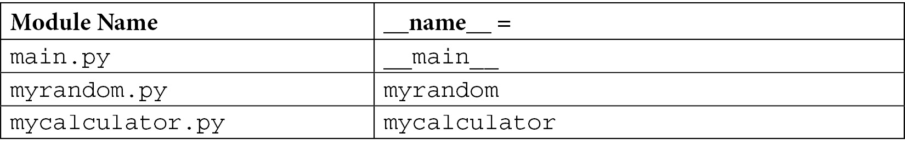

表 2.1 – 不同模块的 __name__ 属性值

设置 `__name__` 变量有两种情况，下面将进行描述。

#### 情况 A – 模块作为主程序

如果你将你的模块作为主程序运行，无论 Python 文件或模块的名称是什么，`__name__` 变量都将被设置为 `__main__` 值。例如，当执行 `calcmain1.py` 时，解释器将硬编码的 `__main__` 字符串分配给 `__name__` 变量。如果我们以主程序的方式运行 `myrandom.py` 或 `mycalculator.py`，`__name__` 变量将自动获取 `__main__` 的值。

因此，我们在所有主脚本中添加了 `if __name__ == '__main__'` 行来检查这是否是主执行程序。

#### 情况 B – 模块被另一个模块导入

在这种情况下，你的模块不是主程序，但它被另一个模块导入。在我们的示例中，`myrandom` 和 `mycalculator` 在 `calcmain1.py` 中被导入。一旦 Python 解释器找到 `myrandom.py` 和 `mycalculator.py` 文件，它将把 `import` 语句中的 `myrandom` 和 `mycalculator` 名称分配给每个模块的 `__name__` 变量。这个分配是在执行这些模块内的代码之前完成的。这反映在 *表 2.1* 中。

一些其他值得注意的特殊变量如下：

+   `__file__`：此变量包含当前正在导入的模块的路径。

+   `__doc__`：此变量将输出在类或方法中添加的文档字符串。如在第*第一章*中讨论的，*最佳 Python 开发生命周期*，文档字符串是在类或方法定义后添加的注释行。

+   `__package__`：这用于指示模块是否为包。其值可以是包名、空字符串或`none`。

+   `__dict__`：这将返回一个类实例的所有属性作为字典。

+   `dir`：这实际上是一个返回每个相关方法或属性列表的方法。

+   `Locals`和`globals`：这些也被用作显示局部和全局变量作为字典条目的方法。

### 执行代码

在设置特殊变量后，Python 解释器将逐行执行文件中的代码。重要的是要知道，除非被其他代码行调用，否则函数（以及类下的代码）不会执行。以下是当运行`calcmain1.py`时，从执行点对三个模块的快速分析：

+   `mycalculator.py`：在设置特殊变量后，在初始化时此模块没有代码要执行。

+   `myrandom.py`：在设置特殊变量和导入语句后，在初始化时此模块没有其他代码要执行。

+   `calcmain1.py`：在设置特殊变量和执行导入语句后，它将执行以下`if`语句：`if __name__ == "__main__"`。这将返回`true`，因为我们启动了`calcmain1.py`文件。在`if`语句内部，将调用`my_main()`函数，该函数实际上调用`myrandom.py`和`mycalculator.py`模块的方法。

我们可以在任何模块中添加`if __name__ == "__main__"`语句，无论它是否是主程序。使用此方法的优势是模块既可以作为模块使用，也可以作为主程序使用。还有使用此方法的另一种应用，即在模块中添加单元测试。

## 标准模块

Python 自带超过 200 个标准模块的库。确切的数量因分发版而异。这些模块可以被导入到你的程序中。这些模块的列表非常广泛，但在此仅列举一些常用模块作为标准模块的示例：

+   `math`：此模块提供算术运算的数学函数。

+   `random`：此模块有助于使用不同类型的分布生成伪随机数。

+   `statistics`：此模块提供诸如`mean`、`median`和`variance`之类的统计函数。

+   `base64`：此模块提供编码和解码数据的函数。

+   `calendar`：此模块提供与日历相关的函数，有助于基于日历的计算。

+   `collections`：此模块包含除通用内置容器（如`dict`、`list`或`set`）之外的特殊容器数据类型。这些特殊数据类型包括`deque`、`Counter`和`ChainMap`。

+   `csv`：此模块有助于从基于逗号的分隔文件中读取和写入。

+   `datetime`：此模块提供通用日期和时间函数。

+   `decimal`：此模块专门用于基于十进制的算术运算。

+   `logging`：此模块用于简化应用程序的日志记录。

+   `os`和`os.path`：这些模块用于访问操作系统相关的功能。

+   `socket`：此模块提供基于套接字的网络通信的低级函数。

+   `sys`：此模块提供对 Python 解释器低级变量和函数的访问。

+   `time`：此模块提供时间相关的函数，如转换到不同的时间单位。

# 编写可重用模块

为了使模块可重用，它必须具有以下特征：

+   独立功能

+   通用功能

+   传统的编码风格

+   明确的文档

如果一个模块或包没有这些特征，那么在其他程序中重用它将非常困难，甚至不可能。我们将逐一讨论每个特征。

### 独立功能

模块中的函数应提供与其他模块以及任何局部或全局变量无关的功能。函数越独立，模块的可重用性就越高。如果它必须使用其他模块，那么它必须是最小的。

在我们的`mycalculator.py`示例中，这两个函数是完全独立的，可以被其他程序重用：

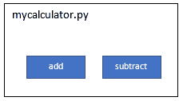

图 2.1 – mycalculator 模块的加法和减法功能

在`myrandom.py`的情况下，我们使用`random`系统库来提供生成随机数的功能。这仍然是一个非常可重用的模块，因为`random`库是 Python 中的内置模块之一：

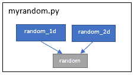

图 2.2 – myrandom 模块与 random 库的功能依赖关系

在我们必须在我们的模块中使用第三方库的情况下，如果目标环境尚未安装第三方库，那么在与其他人共享我们的模块时可能会遇到问题。

为了进一步阐述这个问题，我们将引入一个新的模块`mypandas.py`，它将利用著名`pandas`库的基本功能。为了简单起见，我们只向其中添加了一个函数，该函数根据作为函数输入变量的字典打印 DataFrame。

`mypandas.py`的代码片段如下：

```py
#mypandas.py
import pandas
def print_dataframe(dict):
   """This function output a dictionary as a data frame """
   brics = pandas.DataFrame(dict)
   print(brics)
```

我们的 `mypandas.py` 模块将使用 `pandas` 库从字典中创建 `dataframe` 对象。这种依赖关系也在下一个块图中显示：

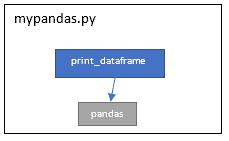

图 2.3 – mypandas 模块依赖于第三方 pandas 库

注意，`pandas` 库不是一个内置库或系统库。当我们试图与他人共享此模块而不定义对第三方库（在这种情况下为 `pandas`）的清晰依赖关系时，尝试使用此模块的程序将给出以下错误信息：

```py
ImportError: No module named pandas'
```

这就是为什么使模块尽可能独立很重要。如果我们必须使用第三方库，我们需要定义清晰的依赖关系并使用适当的打包方法。这将在“共享包”部分进行讨论。

### 泛化功能

一个理想的可重用模块应该专注于解决一个通用问题，而不是一个非常具体的问题。例如，我们有一个将英寸转换为厘米的需求。我们可以轻松地编写一个函数，通过应用转换公式将英寸转换为厘米。那么，编写一个将英制系统中的任何值转换为公制系统中的值的函数呢？我们可以有一个函数来处理英寸到厘米、英尺到米或英里到千米的转换，或者为每种类型的转换编写单独的函数。那么，反向函数（厘米到英寸）呢？这可能现在不是必需的，但将来可能需要，或者由重新使用此模块的人需要。这种泛化将使模块的功能不仅全面，而且更易于重用，而无需扩展它。

为了说明泛化概念，我们将修改 `myrandom` 模块的设计，使其更加通用，从而更易于重用。在当前的设计中，我们为一位数和两位数定义了单独的函数。如果我们需要生成一个三位数的随机数或生成一个介于 20 到 30 之间的随机数怎么办？为了泛化需求，我们在同一模块中引入了一个新的函数 `get_random`，它接受用户输入随机数的下限和上限。这个新添加的函数是对我们已定义的两个随机函数的泛化。在这个模块中，通过这个新函数，可以删除两个现有的函数，或者为了方便使用，它们可以保留在模块中。请注意，这个新添加的函数也是由 `random` 库直接提供的；在我们的模块中提供此函数的原因纯粹是为了说明泛化函数（在这种情况下为 `get_random`）与特定函数（在这种情况下为 `random_1d` 和 `random_2d`）之间的区别。

`myrandom.py` 模块的更新版本（`myrandomv2.py`）如下：

```py
# myrandomv2.py with default and custom random functions
import random
def random_1d():
   """This function get a random number between 0 and 9"""
   return random.randint(0,9)
def random_2d():
   """This function get a random number between 10 and 99"""
   return random.randint(10,99)
def get_random(lower, upper):
   """This function get a random number between lower and\
    upper"""
   return random.randint(lower,upper)
```

### 传统的编码风格

这主要关注我们如何编写函数名、变量名和模块名。Python 有一个编码系统和命名约定，这在本书的前一章中已经讨论过。遵循编码和命名约定非常重要，尤其是在构建可重用模块和软件包时。否则，我们将讨论这些模块作为可重用模块的坏例子。

为了说明这一点，我们将展示以下代码片段，其中函数和参数名使用了驼峰式命名法：

```py
def addNumbers(numParam1, numParam2)
  #function code is omitted
Def featureCount(moduleName)
  #function code is omitted 
```

如果你来自 Java 背景，这种代码风格看起来不错。但在 Python 中，这被认为是不良实践。使用非 Python 风格的编码使得此类模块的重用非常困难。

这里是一个模块的代码片段示例，其中函数名采用了适当的编码风格：

```py
def add_numbers(num_param1, num_param2)
  #function code is omitted
Def feature_count(module_name)
  #function code is omitted 
```

下一个截图展示了另一个良好的可重用编码风格的例子，该截图来自 PyCharm IDE 中的`pandas`库：

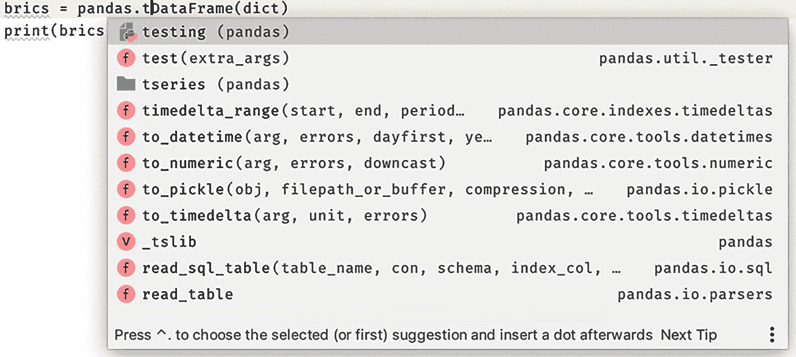

图 2.4 – PyCharm IDE 中的 pandas 库视图

即使不阅读任何文档，函数和变量名也很容易理解。遵循标准编码风格可以使重用更方便。

### 明确的文档

明确且清晰的文档与遵循 Python 编码指南编写的通用和独立模块一样重要。没有清晰的文档，模块将不会增加开发者方便重用的兴趣。但作为程序员，我们更关注代码而不是文档。编写几行文档可以使我们 100 行代码更易于使用和维护。

我们将通过使用我们的`mycalculator.py`模块示例，从模块的角度提供几个良好的文档示例：

```py
 """mycalculator.py 
 This module provides functions for add and subtract of two   numbers"""
def add(x,  y):
   """ This function adds two numbers. 
   usage: add (3, 4) """
   return x + y
def subtract(x, y):
   """ This function subtracts two numbers
   usage: subtract (17, 8) """
   return x - y
```

在 Python 中，重要的是要记住以下几点：

+   我们可以使用三个引号字符来标记跨越 Python 源文件多行的字符串。

+   三引号字符串用于模块的开头，然后这个字符串被用作整个模块的文档。

+   如果任何函数以三引号字符串开头，那么这个字符串将用作该函数的文档。

作为一般结论，我们可以通过编写数百行代码来创建尽可能多的模块，但要创建可重用的模块，除了编写代码之外，还需要包括泛化、编码风格，最重要的是文档。

# 构建软件包

有许多技术和工具可用于创建和分发软件包。事实是，Python 在标准化打包过程方面并没有一个很好的历史。在 21 世纪的前十年中，已经启动了多个项目来简化这一过程，但并没有取得很大的成功。在过去的十年中，我们取得了一些成功，这要归功于**Python 打包权威机构**（**PyPA**）的倡议。

在本节中，我们将介绍构建包的技术、访问程序中的包以及根据 PyPA 提供的指南发布和共享包的方法。

我们将从包名称开始，然后是初始化文件的使用，接着进入构建示例包。

## 命名

包名称应遵循与模块相同的命名规则，即小写且不带下划线。包类似于结构化模块。

## 包初始化文件

一个包可以有一个可选的源文件，名为`__init__.py`（或简单地称为`init`文件）。建议存在`init`文件（即使是空的）来标记文件夹为包。自 Python 3.3 或更高版本以来，使用`init`文件是可选的（PEP 420：隐式命名空间包）。使用此`init`文件可能有多个目的，并且总是有关于什么可以放入`init`文件以及什么不可以放入的争论。这里讨论了`init`文件的一些用途：

+   **空的`__init__.py`**：这将迫使开发者使用显式导入并按他们喜欢的管理命名空间。正如预期的那样，开发者必须导入单独的模块，对于大型包来说可能会很繁琐。

+   `__init__`文件。

+   从不同的模块创建`init`文件并管理它们在包命名空间下。这提供了额外的优势，即在底层模块的功能周围提供一个包装器。如果万一我们需要重构底层模块，我们有选项保持命名空间不变，特别是对于 API 消费者。这种方法的唯一缺点是，需要额外的努力来管理和维护这样的`init`文件。

有时，开发者会在`init`文件中添加代码，当从包中导入模块时执行。这类代码的一个例子是为远程系统（如数据库或远程 SSH 服务器）创建一个会话。

## 构建一个包

现在我们将讨论如何使用一个示例包来构建一个包。我们将使用以下模块和一个子包来构建`masifutil`包：

+   `mycalculator.py`模块：我们已经在*导入模块*部分构建了这个模块。

+   `myrandom.py`模块：这个模块也是为*导入模块*部分构建的。

+   `advcalc`子包：这将是一个子包，并包含一个模块（`advcalculator.py`）。我们将为这个子包定义一个`init`文件，但它将是空的。

`advcalculator.py`模块具有额外的函数，用于使用 10 和 2 的底数计算平方根和对数。此模块的源代码如下：

```py
# advcalculator.py with sqrt, log and ln functions
import math
def sqrt(x):
   """This function takes square root of a number"""
   return math.sqrt(x)
def log(x):
   """This function returns log of base 10"""
   return math.log(x,10)
def ln(x):
   """This function returns log of base 2"""
   return math.log(x,2)
```

包`masifutil`的文件结构以及`init`文件将看起来像这样：

![图 2.5 – 包含模块和子包的 masifutil 包的文件夹结构![图 2.5 – 包含模块和子包的 masifutil 包的文件夹结构图 2.5 – 包含模块和子包的 masifutil 包的文件夹结构在下一步中，我们将构建一个新的主脚本（`pkgmain1.py`）来消费包或`masifutil`子文件夹中的模块。在这个脚本中，我们将使用文件夹结构从主包和子包导入模块，然后使用模块函数计算两个随机数，这两个数的和与差，以及第一个随机数的平方根和对数值。`pkgmain1.py`的源代码如下：```py# pkgmain0.py with direct import import masifutil.mycalculator as calcimport masifutil.myrandom as randimport masifutil.advcalc.advcalculator as acalcdef my_main():    """ This is a main function which generates two random\     numbers and then apply calculator functions on them """    x = rand.random_2d()    y = rand.random_1d()    sum = calc.add(x,y)    diff = calc.subtract(x,y)    sroot = acalc.sqrt(x)    log10x = acalc.log(x)    log2x = acalc.ln(x)    print("x = {}, y = {}".format(x, y))    print("sum is {}".format(sum))    print("diff is {}".format(diff))    print("square root is {}".format(sroot))    print("log base of 10 is {}".format(log10x))    print("log base of 2 is {}".format(log2x))""" This is executed only if the special variable '__name__' is set as main"""if __name__ == "__main__":    my_main()```在这里，我们将使用包名和模块名来导入模块，这在需要导入子包时尤其繁琐。我们还可以使用以下语句，结果相同：```py# mypkgmain1.py with from statementsfrom masifutil import mycalculator as calcfrom masifutil import myrandom as randfrom masifutil.advcalc import advcalculator as acalc#rest of the code is the same as in mypkgmain1.py```如前所述，使用空的`__init__.py`文件是可选的。但在这个例子中，我们添加了它以供说明。接下来，我们将探讨如何在`init`文件中添加一些`import`语句。让我们从在`init`文件中导入模块开始。在这个顶级`init`文件中，我们将导入所有函数，如下所示：```py#__init__ file for package 'masifutil'from .mycalculator import add, subtractfrom .myrandom import random_1d, random_2dfrom .advcalc.advcalculator import sqrt, log, ln```注意模块名称前的`.`的使用。这对于 Python 来说，是严格使用相对导入所必需的。由于`init`文件中的这三行，新的主脚本将变得简单，下面的示例代码展示了这一点：```py# pkgmain2.py with main functionimport masifutildef my_main():    """ This is a main function which generates two random\     numbers and then apply calculator functions on them """    x = masifutil.random_2d()    y = masifutil.random_1d()    sum = masifutil.add(x,y)    diff = masifutil.subtract(x,y)    sroot = masifutil.sqrt(x)    log10x = masifutil.log(x)    log2x = masifutil.ln(x)    print("x = {}, y = {}".format(x, y))    print("sum is {}".format(sum))    print("diff is {}".format(diff))    print("square root is {}".format(sroot))    print("log base of 10 is {}".format(log10x))    print("log base of 2 is {}".format(log2x))""" This is executed only if the special variable '__name__' is set as main"""if __name__ == "__main__":    my_main()```两个主要模块和子包模块的功能在主包级别可用，开发者不需要知道包内模块的底层层次和结构。这是我们之前讨论的在使用`init`文件内的`import`语句时的便利性。我们通过将包源代码保存在主程序或脚本所在的同一文件夹中来构建包。这仅适用于在项目内共享模块。接下来，我们将讨论如何从其他项目和从任何程序从任何地方访问包。# 从任何位置访问包我们在上一小节中构建的包，只有当调用模块的程序与包位置处于同一级别时才能访问。这一要求对于代码重用和代码共享来说并不实用。在本节中，我们将讨论一些使包在任何程序和系统中的任何位置可用和可用的技术。### 追加 sys.path 这是一个设置`sys.path`动态的有用选项。请注意，`sys.path`是 Python 解释器在执行源程序中的每个`import`语句时搜索的目录列表。通过使用这种方法，我们将包含我们的包的目录或文件夹的路径追加到`sys.path`中。对于`masifutil`包，我们将构建一个新的程序，`pkgmain3.py`，它是`pkgmain2.py`（稍后更新）的副本，但被保存在我们的`masifutil`包所在文件夹之外。`pkgmain3.py`可以放在除`mypackages`文件夹之外的任何文件夹中。以下是包含新主脚本（`pkgmain3.py`）和`masifutil`包的文件夹结构，供参考：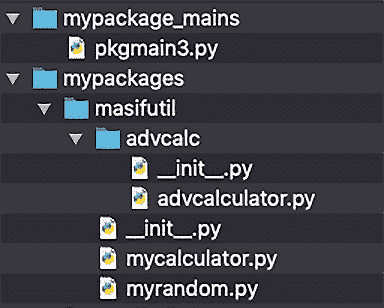


图 2.6 – masifutil 包的文件夹结构和新的主脚本，pkgmain3.py

当我们执行`pkgmain3.py`程序时，它返回一个错误：`ModuleNotFoundError: No module named 'masifutil'`。这是预期的，因为`masifutil`包的路径没有被添加到`sys.path`中。为了将包文件夹添加到`sys.path`，我们将更新主程序；让我们称它为`pkgmain4.py`，并添加附加的`sys.path`追加语句，如下所示：

```py
# pkgmain4.py with sys.path append code
import sys
sys.path.append('/Users/muasif/Google Drive/PythonForGeeks/source_code/chapter2/mypackages')
import masifutil
def my_main():
    """ This is a main function which generates two random\
     numbers and then apply calculator functions on them """
    x = masifutil.random_2d()
    y = masifutil.random_1d()
    sum = masifutil.add(x,y)
    diff = masifutil.subtract(x,y)
    sroot = masifutil.sqrt(x)
    log10x = masifutil.log(x)
    log2x = masifutil.ln(x)
    print("x = {}, y = {}".format(x, y))
    print("sum is {}".format(sum))
    print("diff is {}".format(diff))
    print("square root is {}".format(sroot))
    print("log base of 10 is {}".format(log10x))
    print("log base of 2 is {}".format(log2x))
""" This is executed only if the special variable '__name__' is set as main"""
if __name__ == "__main__":
    my_main()
```

在添加追加`sys.path`的附加行之后，我们执行了主脚本而没有错误，并且输出了预期的控制台输出。这是因为我们的`masifutil`包现在位于 Python 解释器可以加载它的路径上，当我们在我们主脚本中导入它时。

除了追加`sys.path`之外，我们还可以使用 site 模块中的`site.addsitedir`函数。使用这种方法的优势仅在于这个函数也会在包含的文件夹中查找.pth 文件，这对于添加额外的文件夹，如子包，很有帮助。下面是一个带有`addsitedir`函数的示例主脚本（`pktpamin5.py`）片段：

```py
# pkgmain5.py
import site
site.addsitedir('/Users/muasif/Google Drive/PythonForGeeks/source_code/chapter2/mypackages')
import masifutil
#rest of the code is the same as in pkymain4.py
```

注意，我们使用这种方法追加或添加的目录仅在程序执行期间可用。要永久设置`sys.path`（在会话或系统级别），我们将讨论的以下方法更有帮助。

#### 使用 PYTHONPATH 环境变量

这是一个方便的方法将我们的包文件夹添加到`sys.path`，Python 解释器将使用它来搜索包和模块，如果它们不在内置库中。根据我们使用的操作系统，我们可以如下定义这个变量。

在 Windows 中，可以使用以下任一选项定义环境变量：

+   `PYTHONPATH = "C:\pythonpath1;C:\pythonpath2"`。这对于一个活动会话来说很好。

+   **图形用户界面**：转到**我的电脑** | **属性** | **高级系统设置** | **环境变量**。这是一个永久设置。

在 Linux 和 macOS 中，可以使用`export PYTHONPATH= `/some/path/` ``来设置。如果使用 Bash 或等效终端设置，环境变量将仅对终端会话有效。要永久设置，建议将环境变量添加到配置文件末尾，例如`~/bash_profile`。

如果我们不设置`PYTHONPATH`就执行`pkgmain3.py`程序，它将返回一个错误：`ModuleNotFoundError: No module named 'masifutil'`。这同样是可以预料的，因为`masifutil`包的路径没有被添加到`PYTHONPATH`中。

在下一步中，我们将添加包含`masifutil`的文件夹路径到`PYTHONPATH`变量中，并重新运行`pkgmain3`程序。这次，它没有错误并且输出了预期的控制台输出。

#### 使用 Python 站点包下的.pth 文件

这是一种将软件包添加到 `sys.path` 的便捷方式。这是通过在 Python 站点包下定义一个 `.pth` 文件来实现的。该文件可以包含我们想要添加到 `sys.path` 的所有文件夹。

为了说明目的，我们在 `venv/lib/Python3.7/site-packages` 下创建了一个 `my.pth` 文件。正如我们在 *图 2.7* 中所看到的，我们添加了一个包含我们的 `masifutil` 软件包的文件夹。通过这个简单的 `.pth` 文件，我们的主要脚本 `pkymain3.py` 程序运行良好，没有任何错误，并产生预期的控制台输出：

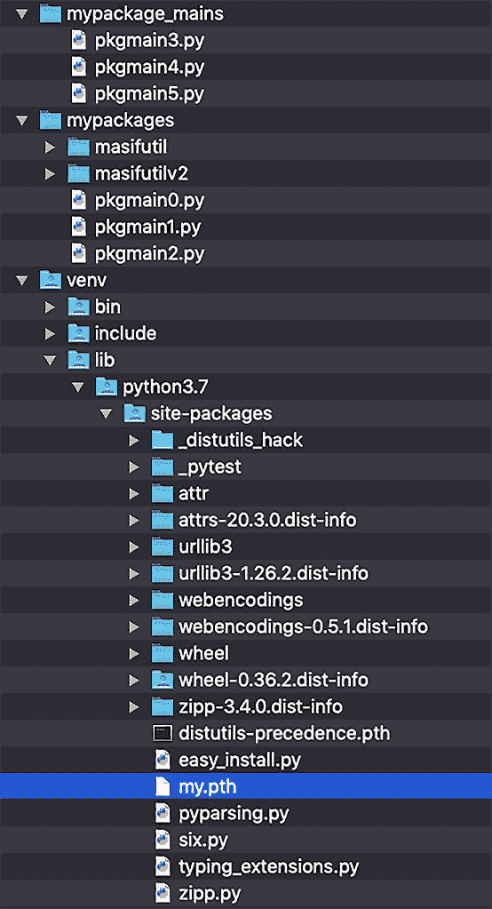

图 2.7 – 包含 my.pth 文件的虚拟环境视图

我们讨论的访问自定义软件包的方法对于在相同系统上的任何程序中重用软件包和模块是有效的。在下一节中，我们将探讨如何与其他开发者和社区共享软件包。

# 分享软件包

为了在社区间分发 Python 软件包和项目，有许多工具可供选择。我们只关注根据 PyPA 提供的指南推荐使用的工具。

在本节中，我们将介绍安装和分发打包技术。我们将使用或至少在本节中作为参考的一些工具如下：

+   **distutils**：这是 Python 的一部分，具有基本功能。对于复杂和定制的软件包分发，它不容易扩展。

+   **setuputils**：这是一个第三方工具，是 distutils 的扩展，并建议用于构建软件包。

+   **wheel**：这是 Python 打包格式，与前辈相比，它使安装更快、更简单。

+   `pip install <module name>`。

+   **Python 包索引 (PyPI)**：这是一个 Python 编程语言的软件仓库。PyPI 用于查找和安装由 Python 社区开发和共享的软件。

+   **Twine**：这是一个用于将 Python 软件包发布到 PyPI 的实用工具。

在接下来的小节中，我们将根据 PyPA 提供的指南更新 `masifutil` 软件包，以包含额外的组件。这将随后通过 pip 在系统范围内安装更新的 `masifutil` 软件包。最后，我们将发布更新的 `masifutil` 软件包到 **测试 PyPI** 并从测试 PyPI 安装它。

## 根据 PyPA 指南构建软件包

PyPA 推荐使用示例项目来构建可重用的软件包，该项目可在 [`github.com/pypa/sampleproject`](https://github.com/pypa/sampleproject) 找到。以下是从 GitHub 位置获取的示例项目片段：

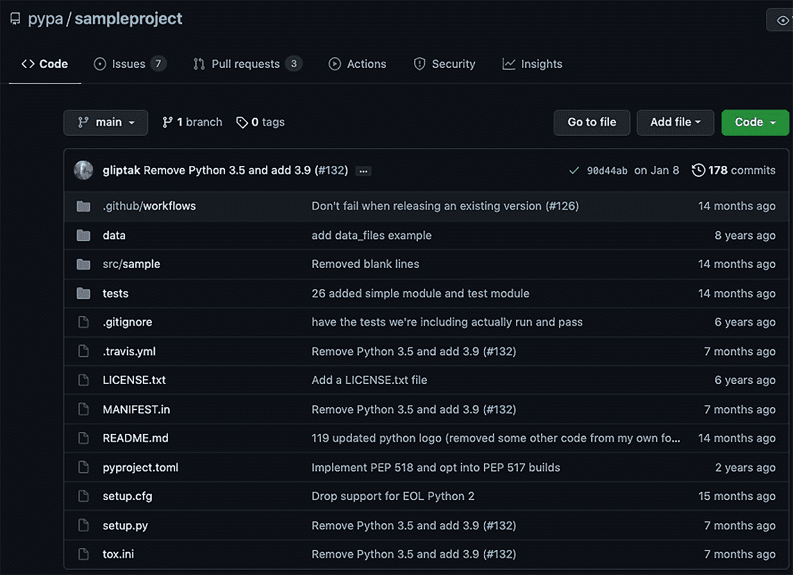


图 2.8 – PyPA 在 GitHub 上的示例项目视图

在我们使用它们更新 `masifutil` 软件包之前，我们将介绍一些关键文件和文件夹，这些文件和文件夹对于理解它们很重要：

+   `setup.py`：这是最重要的文件，它必须存在于项目或包的根目录中。它是一个用于构建和安装包的脚本。此文件包含一个全局的`setup()`函数。设置文件还提供了用于运行各种命令的命令行界面。

+   `setup.cfg`：这是一个`ini`文件，可以被`setup.py`用来定义默认值。

+   `setup()`参数：可以传递给设置函数的关键参数如下：

    a) 名称

    b) 版本

    c) 描述

    d) 网址

    e) 作者

    f) 许可证

+   `README.rst`/`README.md`：此文件（无论是 reStructuredText 还是 Markdown 格式）可以包含有关包或项目的信息。

+   `license.txt`：`license.txt`文件应包含每个包的分发条款和条件详情。许可证文件很重要，尤其是在那些在没有适当许可证的情况下分发包是非法的国家。

+   `MANIFEST.in`：此文件可以用来指定要包含在包中的附加文件列表。此文件列表不包括源代码文件（这些文件会自动包含）。

+   `<package>`：这是包含其中所有模块和包的顶级包。虽然不是强制性的，但这是一个推荐的方法。

+   `data`：这是一个添加数据文件的地点。

+   `tests`：这是一个占位符，用于添加模块的单元测试。

作为下一步，我们将根据 PyPA 指南更新我们之前的`masifutil`包。以下是更新后的`masifutilv2`包的新文件夹和文件结构：

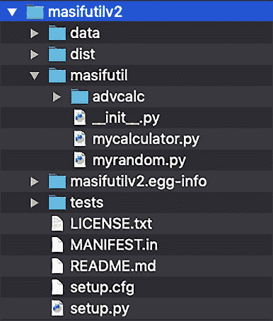

图 2.9 – 更新后的 masifutilv2 文件结构视图

我们已经添加了`data`和`tests`目录，但目前它们实际上是空的。我们将在后面的章节中评估单元测试来完成这个主题。

大多数附加文件的内容已在示例项目中涵盖，因此在此不讨论，除了`setup.py`文件。

我们根据我们的包项目更新了`setup.py`的基本参数。其余参数的详细信息可在 PyPA 提供的示例`setup.py`文件中找到。以下是我们的`setup.py`文件的一个片段：

```py
from setuptools import setup
setup(
   name='masifutilv2',
   version='0.1.0',
   author='Muhammad Asif',
   author_email='ma@example.com',
   packages=['masifutil', 'masifutil/advcalc'],
   python_requires='>=3.5, <4',
   url='http://pypi.python.org/pypi/PackageName/',
   license='LICENSE.txt',
   description='A sample package for illustration purposes',
   long_description=open('README.md').read(),
   install_requires=[
   ],
)
```

使用这个`setup.py`文件，我们准备在本地以及远程共享我们的`masifutilv2`包，这将在下一节中讨论。

## 使用 pip 从本地源代码安装

一旦我们用新文件更新了包，我们就可以使用 pip 工具安装它。最简单的方法是执行以下命令，并指定`masifutilv2`文件夹的路径：

```py
> pip install <path to masifutilv2>
```

以下是在不安装 wheel 包的情况下运行命令的控制台输出：

```py
Processing ./masifutilv2
Using legacy 'setup.py install' for masifutilv2, since package 'wheel' is not installed.
Installing collected packages: masifutilv2
    Running setup.py install for masifutilv2 ... done
Successfully installed masifutilv2-0.1.0 
```

pip 工具成功安装了包，但由于`wheel`包尚未安装，所以使用了 egg 格式。以下是安装后的虚拟环境视图：

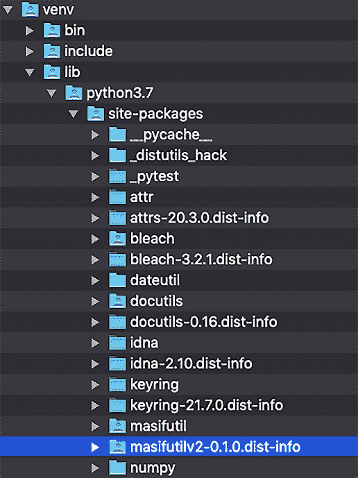

图 2.10 – 使用 pip 安装 masifutilv2 后的虚拟环境视图

在虚拟环境中安装包后，我们使用 `pkgmain3.py` 程序进行了测试，它按预期工作。

小贴士

要卸载包，我们可以使用 `pip uninstall masifutilv2`。

作为下一步，我们将安装 `wheel` 包，然后再次重新安装相同的包。以下是安装命令：

```py
> pip install <path to masifutilv2>
```

控制台输出将类似于以下内容：

```py
Processing ./masifutilv2
Building wheels for collected packages: masifutilv2
  Building wheel for masifutilv2 (setup.py) ... done
  Created wheel for masifutilv2: filename=masi futilv2-0.1.0-py3-none-any.whl size=3497 sha256=038712975b7d7eb1f3fefa799da9e294b34 e79caea24abb444dd81f4cc44b36e
  Stored in folder: /private/var/folders/xp/g88fvmgs0k90w0rc_qq4xkzxpsx11v/T/pip-ephem-wheel-cache-l2eyp_wq/wheels/de/14/12/71b4d696301fd1052adf287191fdd054cc17ef6c9b59066277
Successfully built masifutilv2
Installing collected packages: masifutilv2
Successfully installed masifutilv2-0.1.0
```

这次使用 `wheel` 成功安装了包，我们可以看到它如下出现在我们的虚拟环境中：

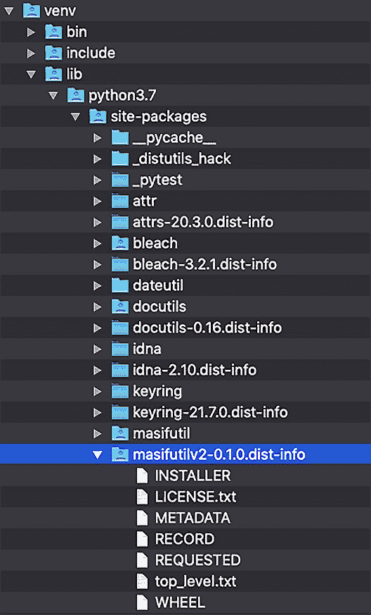

图 2.11 – 使用 wheel 和 pip 安装 masifutilv2 后的虚拟环境视图

在本节中，我们已使用 pip 工具从本地源代码安装了一个包。在下一节中，我们将把包发布到集中式仓库（测试 PyPI）。

## 发布包到测试 PyPI

作为下一步，我们将把我们的样本包添加到 PyPI 仓库。在执行任何发布我们包的命令之前，我们需要在测试 PyPI 上创建一个账户。请注意，测试 PyPI 是一个专门用于测试的包索引的独立实例。除了测试 PyPI 的账户外，我们还需要向账户添加一个 **API 令牌**。我们将根据测试 PyPI 网站上的说明（[`test.pypi.org/`](https://test.pypi.org/)）为您留下创建账户和添加 API 令牌的详细信息。

要将包推送到测试 PyPI，我们需要 Twine 工具。我们假设 Twine 是使用 pip 工具安装的。要上传 `masifutilv2` 包，我们将执行以下步骤：

1.  使用以下命令创建一个分发。此 `sdist` 工具将在 `dist` 文件夹下创建一个 TAR ZIP 文件：

    ```py
    > python setup.py sdist
    ```

1.  将分发文件上传到测试 PyPI。当提示输入用户名和密码时，请使用 `__token__` 作为用户名，API 令牌作为密码：

    ```py
    > twine upload --repository testpypi dist/masifutilv2-0.1.0.tar.gz 
    ```

    此命令将包的 TAR ZIP 文件推送到测试 PyPI 仓库，控制台输出将类似于以下内容：

    ```py
    Uploading distributions to https://test.pypi.org/legacy/
    Enter your username: __token__
    Enter your password: 
    Uploading masifutilv2-0.1.0.tar.gz
    100%|█████████████████████| 
    5.15k/5.15k [00:02<00:00, 2.21kB/s]
    ```

在成功上传后，我们可以在 [`test.pypi.org/project/masifutilv2/0.1.0/`](https://test.pypi.org/project/masifutilv2/0.1.0/) 查看上传的文件。

## 从 PyPI 安装包

从测试 PyPI 安装包与从常规仓库安装相同，只是我们需要通过使用 `index-url` 参数提供仓库 URL。命令和控制台输出将类似于以下内容：

```py
> pip install --index-url https://test.pypi.org/simple/ --no-deps masifutilv2
```

此命令将显示类似于以下内容的控制台输出：

```py
Looking in indexes: https://test.pypi.org/simple/
Collecting masifutilv2
  Downloading https://test-files.pythonhosted.org/  packages/b7/e9/7afe390b4ec1e5842e8e62a6084505cbc6b9   f6adf0e37ac695cd23156844/masifutilv2-0.1.0.tar.gz (2.3 kB)
Building wheels for collected packages: masifutilv2
  Building wheel for masifutilv2 (setup.py) ... done
  Created wheel for masifutilv2: filename=masifutilv2-  0.1.0-py3-none-any.whl size=3497   sha256=a3db8f04b118e16ae291bad9642483874   f5c9f447dbee57c0961b5f8fbf99501
  Stored in folder: /Users/muasif/Library/Caches/pip/  wheels/1c/47/29/95b9edfe28f02a605757c1   f1735660a6f79807ece430f5b836
Successfully built masifutilv2
Installing collected packages: masifutilv2
Successfully installed masifutilv2-0.1.0
```

正如我们在控制台输出中看到的那样，pip 正在 Test PyPI 中搜索模块。一旦它找到了名为 `masifutilv2` 的包，它就开始下载并在虚拟环境中安装它。

简而言之，我们观察到，一旦我们使用推荐的格式和风格创建了一个包，那么发布和访问包就只是使用 Python 工具和遵循标准步骤的问题。

# 摘要

在本章中，我们介绍了 Python 中的模块和包的概念。我们讨论了如何构建可重用的模块以及它们如何被其他模块和程序导入。我们还介绍了模块在被其他程序包含（通过导入过程）时的加载和初始化。在本章的后半部分，我们讨论了构建简单和高级包。我们还提供了大量的代码示例来访问包，以及安装和发布包以提高重用性。

在阅读完本章后，你已经学会了如何构建模块和包，以及如何共享和发布包（和模块）。如果你在一个组织内作为团队的一员工作，或者你正在为更大的社区构建 Python 库，这些技能都是非常重要的。

在下一章中，我们将讨论使用 Python 面向对象编程进行模块化的高级层次。这包括封装、继承、多态和抽象，这些是在现实世界中构建和管理复杂项目的关键工具。

# 问题

1.  模块和包之间有什么区别？

1.  Python 中的绝对导入和相对导入是什么？

1.  PyPA 是什么？

1.  测试 PyPI 是什么，为什么我们需要它？

1.  `init` 文件是构建包的必要条件吗？

# 进一步阅读

+   《*Python 模块化编程*》由 Erik Westra 编著

+   《*专家 Python 编程*》由 Michał Jaworski 和 Tarek Ziadé 编著

+   Python 打包用户指南 ([`packaging.python.org/`](https://packaging.python.org/))

+   PEP 420：隐式命名空间包 ([`www.python.org/dev/peps/pep-0420/`](https://www.python.org/dev/peps/pep-0420/))

# 答案

1.  模块旨在将函数、变量和类组织到单独的 Python 代码文件中。Python 包就像一个文件夹，用于组织多个模块或子包。

1.  绝对导入需要从顶级开始使用包的绝对路径，而相对导入是基于包的相对路径，该路径根据程序当前的位置来确定，其中要使用 `import` 语句。

1.  **Python 包管理权威机构**（**PyPA**）是一个维护 Python 打包中使用的核心软件项目的工作组。

1.  测试 PyPI 是用于测试目的的 Python 编程语言的软件仓库。

1.  从 Python 3.3 版本开始，`init` 文件是可选的。
