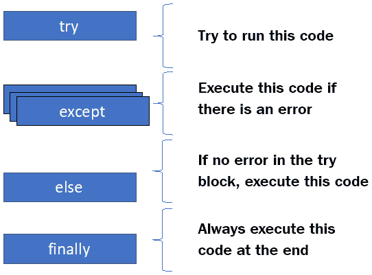
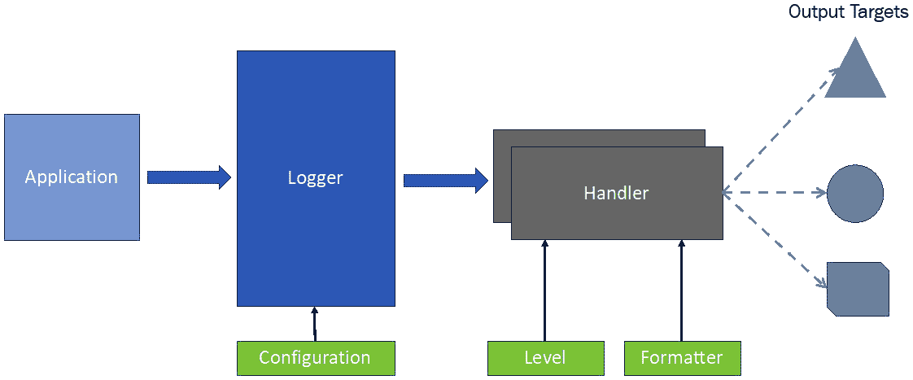
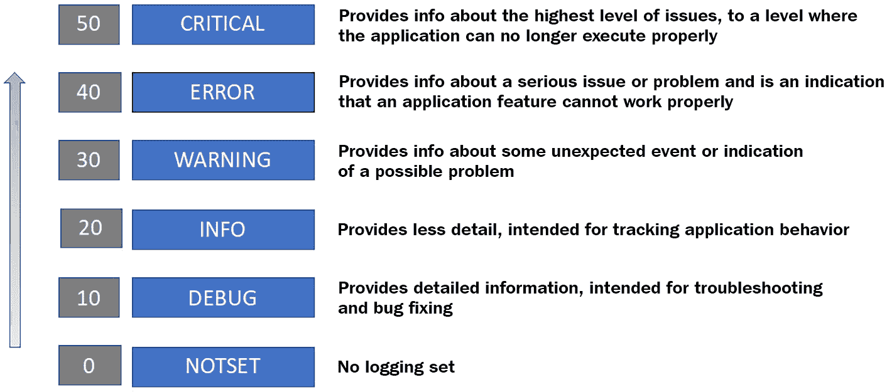

# 第四章：*第四章*：Python 高级编程库

在前面的章节中，我们讨论了在 Python 中构建模块化和可重用程序的不同方法。在本章中，我们将探讨 Python 编程语言的几个高级概念，如迭代器、生成器、日志记录和错误处理。这些概念对于编写高效和可重用的代码非常重要。对于本章，我们假设您熟悉 Python 语言语法，并且知道如何编写控制和循环结构。

在本章中，我们将学习 Python 中循环的工作原理，如何处理文件以及打开和访问文件的最佳实践，以及如何处理可能预期或意外的错误情况。我们还将研究 Python 中的日志记录支持以及配置日志系统的不同方法。本章还将帮助您学习如何使用 Python 的高级库来构建复杂的项目。

在本章中，我们将涵盖以下主题：

+   介绍 Python 数据容器

+   使用迭代器和生成器进行数据处理

+   Python 中的文件处理

+   处理错误和异常

+   使用 Python 的 `logging` 模块

到本章结束时，您将学会如何构建迭代器和生成器，如何处理程序中的错误和异常，以及如何以高效的方式为您的 Python 项目实现日志记录。

# 技术要求

本章的技术要求是您需要在您的计算机上安装 Python 3.7 或更高版本。本章的示例代码可以在[`github.com/PacktPublishing/Python-for-Geeks/tree/master/Chapter04`](https://github.com/PacktPublishing/Python-for-Geeks/tree/master/Chapter04)找到。

让我们从回顾 Python 中可用的数据容器开始，这将有助于本章后续主题的学习。

# 介绍 Python 数据容器

Python 支持多种数据类型，包括数值类型和集合。定义数值数据类型，如整数和浮点数，是基于给变量赋值。我们赋给变量的值决定了数值数据类型的类型。请注意，可以使用特定的构造函数（例如，`int()` 和 `float()`）来创建特定数据类型的变量。容器数据类型也可以通过在适当格式中赋值或使用每个集合数据类型的特定构造函数来定义。在本节中，我们将研究五种不同的容器数据类型：**字符串**、**列表**、**元组**、**字典**和**集合**。

## 字符串

字符串不是直接的数据容器类型。但讨论字符串数据类型很重要，因为它在 Python 编程中被广泛使用，并且字符串数据类型是用一个**不可变序列**（Unicode 代码点序列）实现的。它使用序列（一种集合类型）的事实使其成为本节讨论的候选者。

在 Python 中，字符串对象是不可变对象。由于不可变性，字符串对象为并发程序提供了一个安全的解决方案，在这些程序中，多个函数可能访问相同的字符串对象并返回相同的结果。这种安全性在可变对象中是不可能的。作为不可变对象，字符串对象常被用作字典数据类型的键或集合数据类型的数据元素。不可变性的缺点是，即使只是对现有的字符串实例进行微小的更改，也需要创建一个新的实例。

可变对象与不可变对象

可变对象在创建后可以被更改，但不可变对象则不行。

字符串字面量可以使用匹配的单引号（例如，*'blah'*）、双引号（例如，*"blah blah"*）或三重单引号或双引号（例如，*"""none"""* 或 *'''none'''*）来包围。还值得一提的是，Python 3 和 Python 2 中字符串对象的处理方式不同。在 Python 3 中，字符串对象只能以 Unicode 数据点的形式存储文本序列，但在 Python 2 中，它们可以存储文本以及字节数据。在 Python 3 中，字节数据由 `bytes` 数据类型处理。

在 Python 3 中，将文本与字节分离使得处理更加清晰和高效，但代价是数据可移植性。字符串中的 Unicode 文本不能直接保存到磁盘或发送到网络上的远程位置，除非将其转换为二进制格式。这种转换需要将字符串数据编码为字节序列，这可以通过以下方式之一实现：

+   `UTF-8` 是默认编码）以及如何处理错误。

+   通过将字符串实例传递给 `bytes` 构造函数，并附带编码方案和错误处理方案，可以将字符串数据类型转换为 `Bytes` 数据类型。

任何字符串对象的方法细节和可用属性可以在官方 Python 文档中找到，具体取决于 Python 版本。

## 列表

列表是 Python 中基本集合类型之一，它使用单个变量来存储多个对象。列表是动态的且*可变的*，这意味着列表中的对象可以被更改，列表可以增长或缩小。

Python 中的列表对象不是使用任何链表概念实现的，而是使用可变长数组。该数组包含它所存储的对象的引用。这个数组的指针及其长度存储在列表头结构中，该结构在对象被添加或从列表中删除时保持最新。这种数组的操作被设计得像列表一样，但实际上它不是一个真正的列表。这就是为什么 Python 列表的一些操作没有被优化。例如，将新对象插入列表和从列表中删除对象将具有*O(n)*的复杂度。

为了解决这种情况，Python 在`collections`内置模块中提供了一个`deque`数据类型。`deque`数据类型提供了栈和队列的功能，并且在需要类似链表的行为时是一个很好的替代选项。

列表可以创建为空或带有初始值，使用*方括号*。接下来，我们将展示一个代码片段，演示如何仅使用方括号或使用列表对象构造函数创建空或非空列表对象：

```py
e1 = []                  #an empty list
e2 = list()              #an empty list via constructor
g1 = ['a', 'b']          #a list with 2 elements
g2 = list(['a', 'b'])    #a list with 2 elements using a \
                          constructor
g3 = list(g1)            #a list created from a list
```

列表对象可用的操作细节，如`add`、`insert`、`append`和`delete`，可以在官方 Python 文档中查阅。我们将在下一节介绍元组。

## 元组

元组是一个不可变列表，这意味着一旦创建后就不能修改。元组通常用于少量条目，并且当集合中条目的位置和顺序很重要时。为了保持条目的顺序，元组被设计为不可变的，这也是元组与列表区别开来的地方。元组上的操作通常比常规列表数据类型更快。在需要集合中的值以特定顺序保持不变的情况下，由于它们的优越性能，使用元组是首选选项。

元组通常使用值初始化，因为它们是不可变的。可以使用括号创建一个简单的元组。以下代码片段展示了创建元组实例的几种方法：

```py
w = ()                     #an empty tuple
x = (2, 3)                 #tuple with two elements
y = ("Hello World")        #not a tuple, Comma is required \
                            for single entry tuple
z = ("Hello World",)       #A comma will make it a tuple
```

在此代码片段中，我们创建了一个空元组（`w`），一个包含数字的元组（`x`），以及一个包含文本`Hello World`的元组（`z`）。变量`y`不是一个元组，因为对于单元素元组（单个对象的元组），我们需要一个尾随逗号来表示它是一个元组。

在介绍列表和元组之后，我们将简要介绍字典。

## 字典

字典是 Python 中最常用且功能多样的数据类型之一。字典是一种用于以*键：值*格式存储数据值的集合。字典是可变且无序的数据类型。在其他编程语言中，它们被称为*关联数组*或*哈希表*。

可以使用花括号和一系列 *key:value* 对来创建字典。键与其值由冒号 *':'* 分隔，而 *key:value* 对由逗号 *','* 分隔。以下是一个字典定义的代码片段：

```py
mydict = {
  "brand": "BMW",
  "model": "330i",
  "color": "Blue"
}
```

字典中不允许有重复的键。键必须是一个不可变对象类型，如字符串、元组或数字。字典中的值可以是任何数据类型，甚至包括列表、集合、自定义对象，甚至另一个字典本身。

当处理字典时，有三个对象或列表是重要的：

+   `keys()` 方法：

    ```py
    dict_object.keys()
    ```

+   `values()` 方法：

    ```py
    dict_object.values()
    ```

+   `items()` 方法：

    ```py
    dict_object.items()
    ```

接下来，我们将讨论集合，它们也是 Python 中的关键数据结构。

## 集合

集合是一组*独特*的对象集合。集合是一个可变且无序的集合。集合中不允许有对象的重复。Python 使用散列表数据结构来实现集合的唯一性，这与确保字典中键的唯一性的方法相同。Python 中集合的行为与数学中的集合非常相似。这种数据类型在对象顺序不重要但唯一性很重要的情况下找到其应用。这有助于测试某个集合是否包含某个特定对象。

小贴士

如果需要一个不可变数据类型的集合行为，Python 有一个名为 `frozenset` 的集合的变体实现。

可以使用花括号或使用集合构造函数 (`set()`) 来创建一个新的集合对象。以下代码片段展示了创建集合的一些示例：

```py
s1 = set()            # empty set
s2 = {}               # an empty set using curly 
s3 = set(['a', 'b'])  # a set created from a list with                       # const.
s3 = {1,2}            # a set created using curly bracket
s4 = {1, 2, 1}        # a set will be created with only 1 and 2                     # objects. Duplicate object will be ignored
```

使用索引方法无法访问集合对象。我们需要像列表一样从集合中弹出一个对象，或者我们可以迭代集合以逐个获取对象。像数学集合一样，Python 中的集合也支持如 *并集*、*交集* 和 *差集* 等操作。

在本节中，我们回顾了 Python 3 中字符串和集合数据类型的关键概念，这些概念对于理解即将到来的主题——迭代器和生成器至关重要。

# 使用迭代器和生成器进行数据处理

迭代是数据处理和数据转换中使用的核心工具之一。在处理大型数据集时，当整个数据集无法或效率不高地放入内存时，迭代特别有用。迭代器提供了一种逐个将数据带入内存的方法。

可以通过定义一个单独的类并实现特殊方法 `__iter__` 和 `__next__` 来创建迭代器。但还有一种使用 `yield` 操作创建迭代器的新方法，称为生成器。在接下来的小节中，我们将研究迭代器和生成器。

## 迭代器

迭代器是用于遍历其他对象的实体。一个可以由迭代器遍历的对象被称为`iterable`对象类。虽然不推荐这样做，但从技术上讲是可行的，我们将会通过一个例子来讨论为什么这种做法不是一个好的设计方法。在下一个代码片段中，我们提供了几个使用 Python 中的`for`循环进行迭代操作的例子：

```py
#iterator1.py
#example 1: iterating on a list
for x in [1,2,3]:
    print(x)
#example 2: iterating on a string
for x in "Python for Geeks":
    print(x, end="")
print('')
#example 3: iterating on a dictionary
week_days = {1:'Mon', 2:'Tue', 
             3:'Wed', 4:'Thu', 
             5:'Fri', 6:'Sat', 7:'Sun'}
for k in week_days:
   print(k, week_days[k])
#example 4: iterating on a file
for row in open('abc.txt'):
    print(row, end="")
```

在这些代码示例中，我们使用了不同的`for`循环来遍历列表、字符串、字典和文件。所有这些数据类型都是可迭代的，因此我们将使用简单的语法，通过`for`循环遍历这些集合或序列中的项目。接下来，我们将研究使对象可迭代的要素，这通常被称为**迭代器协议**。

重要提示

在 Python 中，每个集合默认都是*可迭代的*。

在 Python 中，迭代器对象必须实现两个特殊方法：`__iter__`和`__next__`。要迭代一个对象，该对象必须至少实现`__iter__`方法。一旦对象实现了`__iter__`方法，我们就可以称该对象为可迭代的。这些方法将在下面进行描述：

+   `__iter__`：这个方法返回迭代器对象。这个方法在循环开始时被调用，以获取迭代器对象。

+   `__next__`：这个方法在循环的每次迭代中被调用，并返回可迭代对象中的下一个项目。

为了解释如何构建一个可迭代的自定义对象，我们将实现`Week`类，该类将所有工作日的数字和名称存储在字典中。这个类默认不是可迭代的。为了使其可迭代，我们将添加`__iter__`方法。为了使例子简单，我们还将在这个类中添加`__next__`方法。以下是包含`Week`类和主程序的代码片段，该程序通过迭代获取工作日的名称：

```py
#iterator2.py
class Week:
    def __init__(self):
        self.days = {1:'Monday', 2: "Tuesday",
                     3:"Wednesday", 4: "Thursday",
                     5:"Friday", 6:"Saturday", 7:"Sunday"}
        self._index = 1
    def __iter__(self):
        self._index = 1
        return self
    def __next__(self):
        if self._index < 1 | self._index > 7 :
            raise StopIteration
        else:
            ret_value =  self.days[self._index]
            self._index +=1
        return ret_value
if(__name__ == "__main__"):
    wk = Week()
    for day in wk:
        print(day)
```

我们分享这个代码示例只是为了演示如何在同一个对象类中实现`__iter__`和`__next__`方法。这种实现迭代器的方式在互联网上很常见，但并不是一个推荐的方法，并且被认为是一个不好的设计。原因是当我们使用它时，在`for`循环中，我们会得到一个作为迭代器的主要对象，因为我们在这个类中实现了`__iter__`和`__next__`。这可能会导致不可预测的结果。我们可以通过执行以下代码片段来证明这一点，针对同一个类`Week`：

```py
#iterator3.py
class Week:
#class definition is the same as shown in the previous \
 code example
if(__name__ == "__main__"):
    wk = Week()
    iter1 = iter(wk)
    iter2 = iter(wk)
   print(iter1.__next__())
   print(iter2.__next__())
   print(next(iter1))
   print(next(iter2))
```

在这个新的主程序中，我们使用两个不同的迭代器遍历同一个对象。这个主程序的结果并不像预期的那样。这是因为两个迭代器共享一个常见的基础属性`_index`。以下是作为参考的控制台输出：

```py
Monday
Tuesday
Wednesday
Thursday
```

注意，在这个新的主程序中，我们故意没有使用`for`循环。我们使用`iter`函数为同一个`Week`类的对象创建了两个迭代器对象。`iter`函数是一个 Python 标准函数，它调用`__iter__`方法。为了获取可迭代对象中的下一个项目，我们直接使用了`__next__`方法和`next`函数。`next`函数也是一个通用函数，就像`iter`函数一样。这种将可迭代对象用作迭代器的方法也不被认为是线程安全的。

最佳做法始终是使用一个单独的迭代器类，并且始终通过`__iter__`方法创建迭代器的新实例。每个迭代器实例都必须管理自己的内部状态。下面是`Week`类相同代码示例的修订版，其中包含一个单独的迭代器类：

```py
#iterator4.py
class Week:
    def __init__(self):
        self.days = {1: 'Monday', 2: "Tuesday",
                     3: "Wednesday", 4: "Thursday",
                     5: "Friday", 6: "Saturday", 7: "Sunday"}

    def __iter__(self):
        return WeekIterator(self.days)
class WeekIterator:
    def __init__(self, dayss):
        self.days_ref = dayss
        self._index = 1
    def __next__(self):
        if self._index < 1 | self._index > 8:
            raise StopIteration
        else:
            ret_value =  self.days_ref[self._index]
            self._index +=1
        return ret_valu
if(__name__ == "__main__"):
    wk = Week()
    iter1 = iter(wk)
    iter2 = iter(wk)
    print(iter1.__next__())
    print(iter2.__next__())
    print(next(iter1))
    print(next(iter2))
```

在这个修订的代码示例中，我们有一个包含`__next__`方法的单独迭代器类，它有自己的`_index`属性来管理迭代器状态。迭代器实例将引用容器对象（字典）。修订示例的控制台输出给出了预期的结果：每个迭代器都在单独迭代同一个`Week`类的实例。控制台输出如下作为参考：

```py
Monday
Monday
Tuesday
Tuesday
```

简而言之，要创建一个迭代器，我们需要实现`__iter__`和`__next__`方法，管理内部状态，并在没有值可用时引发`StopIteration`异常。接下来，我们将研究生成器，这将简化我们返回迭代器的方式。

## 生成器

生成器是一种简单的方法，用于返回一个迭代器实例，它可以用于迭代，这通过仅实现一个生成器函数来实现。生成器函数类似于一个普通函数，但其中包含的是`yield`语句而不是`return`语句。在生成器函数中仍然允许使用`return`语句，但它不会用于返回可迭代对象中的下一个项目。

根据定义，如果一个函数至少包含一个`yield`语句，那么它将是一个生成器函数。使用`yield`语句时的主要区别是它会暂停函数并保存其内部状态，当函数下次被调用时，它将从上次`yield`的行开始。这种设计模式使得迭代器功能简单且高效。

在内部，`__iter__`和`__next__`等方法会自动实现，`StopIteration`异常也会自动引发。局部属性及其值在连续调用之间被保留，开发者不需要实现额外的逻辑。当 Python 解释器识别到生成器函数（包含`yield`语句的函数）时，它会提供所有这些功能。

要理解生成器是如何工作的，我们将从一个简单的生成器示例开始，该示例用于生成字母表前三个字母的序列：

```py
#generators1.py
def my_gen():
    yield 'A'
    yield 'B'
    yield 'C'
if(__name__ == "__main__"):
    iter1 = my_gen()
    print(iter1.__next__())
    print(next(iter1))
    print(iter1.__next__())
```

在此代码示例中，我们使用三个`yield`语句实现了一个简单的生成器函数，而没有使用`return`语句。在程序的主要部分，我们做了以下操作：

1.  我们调用了生成器函数，它返回给我们一个迭代器实例。在这个阶段，`my_gen()`生成器函数内部的任何一行都没有执行。

1.  使用迭代器实例，我们调用了`__next__`方法，这启动了`my_gen()`函数的执行，在执行第一个`yield`语句后暂停，并返回`A`。

1.  接下来，我们在迭代器实例上调用`next()`函数。结果是我们在使用`__next__`方法时得到的结果相同。但这次，`my_gen()`函数从上次由于`yield`语句而暂停的下一行开始执行。下一行是另一个`yield`语句，这导致在返回字母`B`后再次暂停。

1.  下一个`__next__`方法将导致执行下一个`yield`语句，这将返回字母`C`。

接下来，我们将重新审视`Week`类及其迭代器实现，并将使用生成器而不是迭代器类。下面的示例代码将展示：

```py
#generator2.py
class Week:
    def __init__(self):
        self.days = {1:'Monday', 2: "Tuesday", 
                     3:"Wednesday", 4: "Thursday", 
                     5:"Friday", 6:"Saturday", 7:"Sunday"}
    def week_gen(self):
        for x in self.days:
            yield self.days[x]
if(__name__ == "__main__"):
    wk = Week()
    iter1 = wk.week_gen()
    iter2 = iter(wk.week_gen())
    print(iter1.__next__())
    print(iter2.__next__())
    print(next(iter1))
    print(next(iter2))
```

与`iterator4.py`相比，使用生成器实现的`Week`类要简单得多，也更干净，我们可以达到相同的结果。这就是生成器的力量，这也是为什么它们在 Python 中非常受欢迎。在结束这个主题之前，重要的是要强调生成器的几个其他关键特性：

+   **生成器表达式**：生成器表达式可以用来动态创建简单的生成器（也称为**匿名函数**），而不需要编写特殊的方法。语法与列表推导式类似，只是我们使用圆括号而不是方括号。下面的代码示例（是我们为列表推导式引入的示例的扩展）展示了如何使用生成器表达式创建生成器，其用法，以及与列表推导式的比较：

    ```py
    #generator3.py
    L = [1, 2, 3, 4, 5, 6, 7, 8, 9, 0]
    f1 = [x+1 for x in L]
    g1 = (x+1 for x in L)
    print(g1.__next__())
    print(g1.__next__())
    ```

+   **无限流**：生成器也可以用来实现无限数据流。将无限流引入内存总是一个挑战，但生成器可以轻松解决这个问题，因为它们一次只返回一个数据项。

+   `for`循环，但我们将尝试使用两个生成器来解决它：`prime_gen`生成器用于生成素数，`x2_gen`生成器用于取`prime_gen`生成器提供的素数的平方。我们将这两个生成器管道化输入到`sum`函数中，以获得所需的结果。以下是此问题解决方案的代码片段：

    ```py
    #generator4.py
    def prime_gen(num):
        for cand in range(2, num+1):
            for i in range (2, cand):
                if (cand % i) == 0:
                    break
            else:
                yield cand
    def x2_gen(list2):
        for num in list2:
            yield num*num
    print(sum(x2_gen(prime_gen(5))))
    ```

生成器基于按需操作，这使得它们不仅内存效率高，而且提供了一种在需要时生成值的方法。这有助于避免不必要的生成数据，这些数据可能根本不会被使用。生成器非常适合用于大量数据处理、将数据从一个函数传递到另一个函数，以及模拟并发。

在下一节中，我们将探讨如何在 Python 中处理文件。

# 在 Python 中处理文件

从文件中读取数据或将数据写入文件是任何编程语言支持的基本操作之一。Python 提供了广泛的支持来处理文件操作，这些操作大多可在其标准库中找到。在本节中，我们将讨论核心文件操作，如打开文件、关闭文件、从文件中读取、向文件中写入、使用上下文管理器进行文件管理，以及使用 Python 标准库通过一个句柄打开多个文件。我们将从下一小节开始讨论文件操作。

## 文件操作

文件操作通常从打开文件开始，然后读取或更新该文件的内容。核心文件操作如下：

### 打开和关闭文件

要对文件执行任何读取或更新操作，我们需要一个指向文件的指针或引用。可以通过使用内置的`open`函数来打开文件来获取文件引用。此函数返回对`file`对象的引用，也称为使用绝对或相对路径命名的文件。一个可选参数是访问模式，用于指示文件应以何种模式打开。访问模式可以是`read`、`write`、`append`或其他。访问模式选项的完整列表如下：

+   `r`：此选项用于以只读模式打开文件。如果没有提供访问模式选项，这是一个默认选项：

    ```py
    f = open ('abc.txt')
    ```

+   `a`：此选项用于打开文件以在文件末尾追加新行：

    ```py
    f = open ('abc.txt', 'a')
    ```

+   `w`：此选项用于以写入模式打开文件。如果文件不存在，它将创建一个新文件。如果文件存在，此选项将覆盖它，并且该文件中的任何现有内容都将被销毁：

    ```py
    f = open ('abc.txt', 'w')
    ```

+   `x`：此选项用于以独占写入模式打开文件。如果文件已存在，它将引发错误：

    ```py
    f = open ('abc.txt', 'x')
    ```

+   `t`：此选项用于以文本模式打开文件。这是默认选项。

+   `b`：此选项用于以二进制模式打开文件。

+   `+`：此选项用于以读写模式打开文件：

    ```py
    f = open ('abc.txt', 'r+'
    ```

模式选项可以组合使用以获取多个选项。除了文件名和访问模式选项之外，我们还可以传递编码类型，尤其是对于文本文件。以下是一个使用`utf-8`打开文件的示例：

```py
f = open("abc.txt", mode='r', encoding='utf-8')
```

当我们完成对文件的操作后，关闭文件以释放资源供其他进程使用文件是必须的。可以通过在文件实例或文件句柄上使用`close`方法来关闭文件。以下是一个展示如何使用`close`方法的代码片段：

```py
file = open("abc.txt", 'r+w')
#operations on file
file.close()
```

一旦文件关闭，操作系统将释放与文件实例和锁（如果有）相关的资源，这是任何编程语言中的最佳实践。

### 读写文件

可以通过以访问模式`r`打开文件并使用读取方法之一来读取文件。接下来，我们总结可用于读取操作的不同方法：

+   `read(n)`: 此方法从文件中读取`n`个字符。

+   `readline()`: 此方法返回文件中的一行。

+   `readlines()`: 此方法返回文件中所有行的列表。

同样，一旦以适当的访问模式打开文件，我们就可以向文件追加或写入内容。与追加文件相关的相关方法如下：

+   `write (x)`: 此方法将字符串或字节序列写入文件，并返回添加到文件中的字符数。

+   `writelines (lines)`: 此方法将行列表写入文件。

在下一个代码示例中，我们将创建一个新文件，向其中添加一些文本行，然后使用之前讨论的读取操作读取文本数据：

```py
#writereadfile.py: write to a file and then read from it
f1 = open("myfile.txt",'w')
f1.write("This is a sample file\n")
lines =["This is a test data\n", "in two lines\n"]
f1.writelines(lines)
f1.close()
f2 = open("myfile.txt",'r')
print(f2.read(4))
print(f2.readline())
print(f2.readline())
f2.seek(0)
for line in f2.readlines():
    print(line)
f2.close()
```

在此代码示例中，我们首先向文件写入三行。在读取操作中，首先读取四个字符，然后使用`readline`方法读取两行。最后，我们使用`seek`方法将指针移回文件顶部，并使用`readlines`方法访问文件中的所有行。

在下一节中，我们将看到使用上下文管理器如何使文件处理变得方便。

## 使用上下文管理器

在任何编程语言中，正确和公平地使用资源都是至关重要的。文件句柄和数据库连接是许多例子中的常见做法，在处理对象后没有及时释放资源。如果资源根本未释放，最终会导致称为**内存泄漏**的情况，并可能影响系统性能，最终可能导致系统崩溃。

为了解决这种内存泄漏和及时释放资源的问题，Python 提出了上下文管理器的概念。上下文管理器旨在精确地保留和释放资源。当使用`with`关键字与上下文管理器一起使用时，`with`关键字后面的语句应返回一个对象，该对象必须实现**上下文管理协议**。该协议要求返回的对象实现两个特殊方法。这些特殊方法如下：

+   `.__enter__()`: 此方法与`with`关键字一起调用，用于保留`with`关键字后面的语句所需的资源。

+   `.__exit__()`: 此方法在执行`with`块之后被调用，用于释放在`.__enter__()`方法中保留的资源。

例如，当使用上下文管理器`with`语句（块）打开文件时，不需要关闭文件。`open`语句将返回文件句柄对象，该对象已经实现了上下文管理协议，文件将在`with`块执行完成后自动关闭。以下是一个使用上下文管理器编写和读取文件的代码示例的修订版：

```py
#contextmgr1.py
with open("myfile.txt",'w') as f1:
    f1.write("This is a sample file\n")
    lines = ["This is a test data\n", "in two lines\n"]
    f1.writelines(lines)
with open("myfile.txt",'r') as f2:
    for line in f2.readlines():
        print(line)
```

使用上下文管理器的代码简单易读。使用上下文管理器是打开和操作文件的一种推荐方法。

## 操作多个文件

Python 支持同时打开和操作多个文件。我们可以以不同的模式打开这些文件并对它们进行操作。文件的数量没有限制。我们可以使用以下示例代码以读取模式打开两个文件，并按任意顺序访问它们：

```py
1.txt
This is a sample file 1
This is a test data 1
2.txt
This is a sample file 2
This is a test data 2
#multifilesread1.py
with open("1.txt") as file1, open("2.txt") as file2:
    print(file2.readline())
    print(file1.readline())
```

我们还可以使用这种多文件操作选项从一个文件读取并写入到另一个文件。以下是将内容从一个文件传输到另一个文件的示例代码：

```py
#multifilesread2.py
with open("1.txt",'r') as file1, open("3.txt",'w') as file2:
   for line in file1.readlines():
     file2.write(line)
```

Python 还有一个更优雅的解决方案来使用`fileinput`模块操作多个文件。此模块的输入函数可以接受多个文件的列表，然后将所有这些文件视为单个输入。以下是一个使用`fileinput`模块和两个输入文件`1.txt`和`2.txt`的示例代码：

```py
#multifilesread1.py
import fileinput
with fileinput.input(files = ("1.txt",'2.txt')) as f:
    for line in f:
        print(f.filename())
        print(line)
```

使用这种方法，我们得到一个可以依次操作多个文件的文件句柄。接下来，我们将讨论 Python 中的错误和异常处理。

# 处理错误和异常

在 Python 中，可能存在许多类型的错误。最常见的一种与程序的语法相关，通常被称为**语法错误**。在许多情况下，错误会在程序执行过程中被报告。这类错误被称为**运行时错误**。我们程序中可以处理的运行时错误被称为**异常**。本节将重点介绍如何处理运行时错误或异常。在介绍错误处理之前，我们将简要介绍以下最常见的运行时错误：

+   `IndexError`: 当程序尝试访问一个无效索引（内存中的位置）处的项时，将发生此错误。

+   `ModuleNotFoundError`: 当在系统路径中找不到指定的模块时，将抛出此错误。

+   `ZeroDivisionError`: 当程序尝试将一个数除以零时，将抛出此错误。

+   `KeyError`: 当程序尝试使用无效的键从一个字典中获取值时，将发生此错误。

+   `StopIteration`: 当`__next__`方法在容器中找不到更多项时，将抛出此错误。

+   `TypeError`: 当程序尝试对一个不适当的类型的对象应用操作时，将发生此错误。

Python 的官方文档中提供了完整的错误列表。在接下来的小节中，我们将讨论如何使用 Python 中的适当构造来处理错误，有时也称为异常。

## 在 Python 中处理异常

当运行时错误发生时，程序可能会突然终止，并可能损坏系统资源，如损坏文件和数据库表。这就是为什么错误或异常处理是编写任何语言中健壮程序的关键组成部分之一。其思路是预测运行时错误可能会发生，如果发生此类错误，我们的程序将如何响应该特定错误。

与许多其他语言一样，Python 使用`try`和`except`关键字。这两个关键字后面跟着要执行的单独的代码块。`try`代码块是一组常规语句，我们预计其中可能发生错误。只有当`try`代码块中发生错误时，`except`代码块才会执行。下面是使用`try`和`except`代码块编写 Python 代码的语法：

```py
try:
    #a series of statements
except:
    #statements to be executed if there is an error in \
     try block
```

如果我们预测到特定的错误类型或多个错误类型，我们可以定义一个带有错误名称的`except`代码块，并且可以根据需要添加任意多的`except`代码块。这样的命名`except`代码块仅在`try`代码块中引发命名异常时才会执行。使用`except`代码块语句，我们还可以添加一个`as`语句来将异常对象存储为在`try`代码块中引发的变量。在下一个代码示例中的`try`代码块有许多可能的运行时错误，这就是为什么它有多个`except`代码块：

```py
#exception1.py
try:
    print (x)
    x = 5
    y = 0
    z = x /y
    print('x'+ y)
except NameError as e:
    print(e)
except ZeroDivisionError:
    print("Division by 0 is not allowed")
except Exception as e:
    print("An error occured")
    print(e)
```

为了更好地说明`except`代码块的使用，我们添加了多个`except`代码块，下面将进行解释：

+   `try`代码块尝试访问一个未定义的变量。在我们的代码示例中，当解释器尝试执行`print(x)`语句时，此代码块将被执行。此外，我们给异常对象命名为`e`，并使用`print`语句获取与该错误类型相关的官方错误详情。

+   `z = x/y` 和 y = 0\. 为了执行此代码块，我们首先需要修复`NameError`代码块。

+   `except`代码块，表示如果与前面的两个`except`代码块不匹配，则此代码块将被执行。最后的语句`print('x'+ y)`也将引发类型为`TypeError`的错误，并将由此代码块处理。由于我们在此代码块中没有收到任何特定的异常类型，我们可以使用`Exception`关键字将异常对象存储在变量中。

注意，一旦在 `try` 块中的任何语句中发生错误，其余的语句将被忽略，并且控制流将转到其中一个 `except` 块。在我们的代码示例中，我们需要首先修复 `NameError` 错误，才能看到下一层的异常，依此类推。我们在示例中添加了三种不同类型的错误来演示如何为同一个 `try` 块定义多个 `except` 块。`except` 块的顺序很重要，因为必须首先定义具有错误名称的更具体的 `except` 块，并且没有指定错误名称的 `except` 块必须始终放在最后。

下图显示了所有的异常处理块：



图 4.1 – Python 中不同的异常处理块

如前图所示，除了 `try` 和 `except` 块之外，Python 还支持 `else` 和 `finally` 块以增强错误处理功能。如果没有在 `try` 块中引发错误，则执行 `else` 块。此块中的代码将按正常方式执行，并且如果此块内发生任何错误，则不会抛出异常。如果需要，可以在 `else` 块内添加嵌套的 `try` 和 `except` 块。请注意，此块是可选的。

`finally` 块无论在 `try` 块中是否有错误都会被执行。`finally` 块内的代码执行时不会进行任何异常处理机制。此块主要用于通过关闭连接或打开的文件来释放资源。尽管这是一个可选块，但强烈建议实现此块。

接下来，我们将通过代码示例来查看这些块的使用。在这个例子中，我们将在 `try` 块中打开一个新文件进行写入。如果在打开文件时发生错误，将会抛出异常，并且我们将使用 `except` 块中的 `print` 语句将错误详情发送到控制台。如果没有发生错误，我们将执行 `else` 块中的代码，该代码将向文件写入一些文本。在两种情况下（错误或无错误），我们将在 `finally` 块中关闭文件。完整的示例代码如下：

```py
#exception2.py
try:
    f = open("abc.txt", "w")
except Exception as e:
    print("Error:" + e)
else:
    f.write("Hello World")
    f.write("End")
finally:
    f.close()
```

我们已经广泛地介绍了如何在 Python 中处理异常。接下来，我们将讨论如何从 Python 代码中引发异常。

## 引发异常

当运行时发生错误时，Python 解释器会引发异常或错误。如果出现可能导致我们得到不良输出或如果我们继续执行程序则可能导致程序崩溃的条件，我们也可以自己引发错误或异常。引发错误或异常将提供程序优雅退出的方式。

可以使用 `raise` 关键字将异常（对象）抛给调用者。异常可以是以下类型之一：

+   内置异常

+   自定义异常

+   一个通用的 `Exception` 对象

在下一个代码示例中，我们将调用一个简单的函数来计算平方根，并将其实现为如果输入参数不是一个有效的正数则抛出异常：

```py
#exception3.py
import math
def sqrt(num):
    if not isinstance(num, (int, float)) :
        raise TypeError("only numbers are allowed")
    if num < 0:
        raise Exception ("Negative number not supported")
    return math.sqrt(num)
if __name__ == "__main__":
    try:
        print(sqrt(9))
        print(sqrt('a'))
        print (sqrt(-9))
    except Exception as e:
        print(e)
```

在这个代码示例中，当传递给 `sqrt` 函数的数字不是数字时，我们通过创建 `TypeError` 类的新实例来抛出一个内置异常。当传递的数字小于 `0` 时，我们也抛出一个通用异常。在这两种情况下，我们都向其构造函数传递了我们的自定义文本。在下一节中，我们将研究如何定义我们自己的自定义异常并将其抛给调用者。

## 定义自定义异常

在 Python 中，我们可以通过创建一个新的类来定义自己的自定义异常，这个类必须从内置的 `Exception` 类或其子类派生。为了说明这个概念，我们将通过定义两个自定义异常类来修改之前的示例，以替换内置的 `TypeError` 和 `Exception` 错误类型。新的自定义异常类将派生自 `TypeError` 和 `Exception` 类。以下是带有自定义异常的示例代码供参考：

```py
#exception4.py
import math
class NumTypeError(TypeError):
    pass
class NegativeNumError(Exception):
    def __init__(self):
        super().__init__("Negative number not supported")
def sqrt(num):
    if not isinstance(num, (int, float)) :
        raise NumTypeError("only numbers are allowed")
    if num < 0:
        raise NegativeNumError
    return math.sqrt(num)
if __name__ == "__main__":
    try:
        print(sqrt(9))
        print(sqrt('a'))
        print (sqrt(-9))
    except NumTypeError as e:
        print(e)
    except NegativeNumError as e:
        print(e)
```

在这个代码示例中，`NumTypeError` 类是从 `TypeError` 类派生出来的，我们在这个类中没有添加任何内容。`NegativeNumError` 类是从 `Exception` 类继承的，我们重写了它的构造函数，并在构造函数中为这个异常添加了一个自定义消息。当我们在这 `sqrt()` 函数中抛出这些自定义异常时，我们不会用 `NegativeNumError` 异常类传递任何文本。当我们使用主程序时，我们会通过 `print (e)` 语句得到消息，因为我们已经将其设置为类定义的一部分。

在本节中，我们介绍了如何使用 `try` 和 `except` 块处理内置错误类型，如何定义自定义异常，以及如何声明性地抛出异常。在下一节中，我们将介绍 Python 中的日志记录。

# 使用 Python 日志模块

日志记录是任何合理规模的应用程序的基本要求。日志记录不仅有助于调试和故障排除，还能深入了解应用程序内部问题的细节。日志记录的一些优点如下：

+   调试代码，特别是诊断应用程序失败或崩溃的原因和时间

+   诊断异常的应用程序行为

+   为监管或法律合规性提供审计数据

+   识别用户行为和恶意尝试访问未经授权的资源

在讨论任何日志记录的实际例子之前，我们首先将讨论 Python 日志系统的关键组件。

## 介绍核心日志组件

以下组件对于在 Python 中设置应用程序的日志记录是基本的：

+   日志记录器

+   日志级别

+   日志格式化器

+   日志处理器

Python 日志系统的高级架构可以总结如下：



图 4.2 – Python 中的日志组件

这些组件将在以下子节中详细讨论。

### 日志记录器

日志记录器是 Python 日志系统的入口点。它是应用程序程序员的接口。Python 中的 `Logger` 类提供了多种方法来以不同的优先级记录消息。我们将在本节后面通过代码示例研究 `Logger` 类的方法。

应用程序与使用日志配置（如日志级别）设置的 `Logger` 实例交互。在接收到日志事件后，`Logger` 实例选择一个或多个合适的日志处理器并将事件委托给处理器。每个处理器通常设计用于特定的输出目标。处理器在应用过滤和格式化后，将消息发送到目标输出。

### 日志级别

对于日志系统中的所有事件和消息，优先级并不相同。例如，关于错误的日志比警告消息更紧急。日志级别是设置不同日志事件不同优先级的一种方式。Python 中定义了六个级别。每个级别都与一个表示严重性的整数值相关联。这些级别是 `NOTSET`、`DEBUG`、`INFO`、`WARNING`、`ERROR` 和 `CRITICAL`。以下是对它们的总结：



图 4.3 – Python 中的日志级别

### 日志格式化

日志格式化组件有助于改进消息的格式，这对于保持一致性和便于人类及机器阅读非常重要。日志格式化组件还会向消息添加额外的上下文信息，例如时间、模块名称、行号、线程和进程，这对于调试目的非常有用。以下是一个示例格式化表达式：

```py
"%(asctime)s — %(name)s — %(levelname)s — %(funcName)s:%(lineno)d — %(message)s"
```

当使用这样的格式化表达式时，级别为 `INFO` 的日志消息 `hello Geeks` 将显示得类似于以下控制台输出：

```py
2021-06-10 19:20:10,864 - a.b.c - INFO - <module name>:10 - hello Geeks
```

### 日志处理器

日志处理器的角色是将日志数据写入适当的目的地，这可以是控制台、文件，甚至是电子邮件。Python 中提供了许多内置的日志处理器类型。以下介绍一些流行的处理器：

+   `StreamHandler` 用于在控制台上显示日志

+   `FileHandler` 用于将日志写入文件

+   `SMTPHandler` 用于将日志发送到电子邮件

+   `SocketHandler` 用于将日志发送到网络套接字

+   `SyslogHandler` 用于将日志发送到本地或远程 *Unix* 系统日志服务器

+   `HTTPHandler` 用于通过 `GET` 或 `POST` 方法将日志发送到 Web 服务器

日志处理器使用日志格式化器向日志添加更多上下文信息，并使用日志级别来过滤日志数据。

## 与日志模块一起工作

在本节中，我们将通过代码示例讨论如何使用 `logging` 模块。我们将从基本的日志选项开始，并逐步将其提升到高级水平。

### 使用默认的日志记录器

在不创建任何日志类实例的情况下，Python 中已经有一个默认的日志记录器可用。默认日志记录器，也称为`logging`模块，使用其方法来调度日志事件。下面的代码片段展示了使用根日志记录器来捕获日志事件：

```py
#logging1.py
import logging
logging.debug("This is a debug message")
logging.warning("This is a warning message")
logging.info("This is an info message")
```

`debug`、`warning`和`info`方法用于根据它们的严重性将日志事件调度到日志记录器。此日志记录器的默认日志级别设置为`WARNING`，默认输出设置为`stderr`，这意味着所有消息都只会在控制台或终端上显示。此设置将阻止`DEBUG`和`INFO`消息在控制台输出中显示，如下所示：

```py
WARNING:root:This is a warning message
```

可以通过在`import`语句之后添加以下行来更改根日志记录器的级别：

```py
logging.basicConfig(level=logging.DEBUG)
```

在将日志级别更改为`DEBUG`后，控制台输出将现在显示所有日志消息：

```py
DEBUG:root:This is a debug message
WARNING:root:This is a warning message
INFO:root:This is an info message
```

虽然我们在本小节中讨论了默认或根日志记录器，但不建议除了基本日志记录目的之外使用它。作为一个最佳实践，我们应该创建一个新的具有名称的日志记录器，我们将在下一个代码示例中讨论。

### 使用命名日志记录器

我们可以创建一个具有自己名称的单独日志记录器，可能还有自己的日志级别、处理程序和格式化程序。下面的代码片段是创建具有自定义名称的日志记录器并使用与根日志记录器不同的日志级别的示例：

```py
#logging2.py
import logging
logger1 = logging.getLogger("my_logger")
logging.basicConfig()
logger1.setLevel(logging.INFO)
logger1.warning("This is a warning message")
logger1.info("This is a info message")
logger1.debug("This is a debug message")
logging.info("This is an info message")
```

当我们使用`getLogger`方法通过字符串名称或使用模块名称（通过使用`__name__`全局变量）创建日志记录器实例时，对于每个名称只管理一个实例。这意味着如果我们尝试在任何应用程序的部分使用具有相同名称的`getLogger`方法，Python 解释器将检查是否已经为该名称创建了一个实例。如果已经创建了一个实例，它将返回相同的实例。

在创建日志记录器实例后，我们需要调用根日志记录器（`basicConfig()`）来为我们自己的日志记录器提供一个处理程序和格式化程序。如果没有任何处理程序配置，我们将得到一个内部处理程序作为最后的手段，这将只输出未格式化的消息，并且日志级别将默认为`WARNING`，而不管我们为日志记录器设置的日志级别是什么。下面的代码片段的控制台输出如下，符合预期：

```py
WARNING:my_logger:This is a warning message
INFO:my_logger:This is a info message
```

还需要注意以下几点：

+   我们将日志记录器的日志级别设置为`INFO`，这样我们就可以记录`warning`和`info`消息，但不能记录调试消息。

+   当我们使用根日志记录器（通过使用`logging`实例）时，我们无法发送出`info`消息。这是因为根日志记录器仍在使用默认的日志级别，即`WARNING`。

### 使用具有内置处理程序和自定义格式化程序的日志记录器

我们可以使用内置的处理器创建一个日志记录器对象，但带有自定义的格式化器。在这种情况下，处理器对象可以使用自定义的格式化器对象，并且在我们开始使用日志记录器进行任何日志事件之前，可以将处理器对象添加到日志记录器对象中作为其处理器。以下是一个代码片段，说明如何程序化地创建处理器和格式化器，然后将处理器添加到日志记录器中：

```py
#logging3.py
import logging
logger = logging.getLogger('my_logger')
my_handler = logging.StreamHandler()
my_formatter = logging.Formatter('%(asctime)s - '\
                  '%(name)s - %(levelname)s - %(message)s')
my_handler.setFormatter(my_formatter)
logger.addHandler(my_handler)
logger.setLevel(logging.INFO)
logger.warning("This is a warning message")
logger.info("This is an info message")
logger.debug("This is a debug message")
```

我们也可以通过使用`basicConfig`方法并传递适当的参数来创建具有相同设置的日志记录器。下一个代码片段是`logging3.py`的修订版，其中包含了`basicConfig`设置：

```py
#logging3A.py
import logging
logger = logging.getLogger('my_logger')
logging.basicConfig(handlers=[logging.StreamHandler()],
                    format="%(asctime)s - %(name)s - "
                           "%(levelname)s - %(message)s",
                    level=logging.INFO)
logger.warning("This is a warning message")
logger.info("This is an info message")
logger.debug("This is a debug message")
```

到目前为止，我们已经涵盖了使用内置类和对象设置日志记录器的情况。接下来，我们将设置一个具有自定义处理器和格式化器的日志记录器。

### 使用具有文件处理器的日志记录器

日志处理器将日志消息发送到它们的最终目的地。默认情况下，每个日志记录器都配置为将日志消息发送到与运行程序关联的控制台或终端。但可以通过配置一个具有不同目的地的新的处理器来更改这一点。可以通过使用我们在前一小节中讨论的两种方法之一来创建一个文件处理器。在本节中，我们将使用第三种方法，通过将文件名作为属性传递给`basicConfig`方法来自动创建一个文件处理器。这将在下一个代码片段中展示：

```py
 #logging4.py
import logging
logging.basicConfig(filename='logs/logging4.log' 
                    ,level=logging.DEBUG)
logger = logging.getLogger('my_logger')
logger.setLevel(logging.INFO)
logger.warning("This is a warning message")
logger.info("This is a info message")
logger.debug("This is a debug message")
```

这将生成日志消息，这些消息将按照`basicConfig`方法指定的文件和日志级别（设置为`INFO`）生成。

### 使用程序化方式使用具有多个处理器的日志记录器

创建具有多个处理器的日志记录器相当简单，可以通过使用`basicConfig`方法或手动将处理器附加到日志记录器来实现。为了说明目的，我们将修订我们的代码示例`logging3.py`以执行以下操作：

1.  我们将创建两个处理器（一个用于控制台输出，一个用于文件输出），它们是`streamHandler`和`fileHandler`类的实例。

1.  我们将创建两个单独的格式化器，每个处理器一个。我们将不包括控制台处理器的格式化器中的时间信息。

1.  我们将为两个处理器设置不同的日志级别。重要的是要理解，处理器级别的日志级别不能覆盖根级别的处理器。

下面是完整的代码示例：

```py
#logging5.py
import logging
logger = logging.getLogger('my_logger')
logger.setLevel(logging.DEBUG)
console_handler = logging.StreamHandler()
file_handler = logging.FileHandler("logs/logging5.log")
#setting logging levels at the handler level
console_handler.setLevel(logging.DEBUG)
file_handler.setLevel(logging.INFO)
#creating separate formatter for two handlers
console_formatter = logging.Formatter(
                  '%(name)s - %(levelname)s - %(message)s')
file_formatter = logging.Formatter('%(asctime)s - '
                  '%(name)s - %(levelname)s - %(message)s')
#adding formatters to the handler
console_handler.setFormatter(console_formatter)
file_handler.setFormatter(file_formatter)
#adding handlers to the logger
logger.addHandler(console_handler)
logger.addHandler(file_handler)
logger.error("This is an error message")
logger.warning("This is a warning message")
logger.info("This is an info message")
logger.debug("This is a debug message")
```

尽管我们为两个处理器设置了不同的日志级别，分别是`INFO`和`DEBUG`，但它们只有在日志记录器的日志级别较低（默认为`WARNING`）时才会生效。这就是为什么我们必须在程序开始时将日志级别设置为`DEBUG`。处理器的日志级别可以是`DEBUG`或任何更高的级别。这是一个在设计应用程序的日志策略时需要考虑的非常重要的点。

在本节中共享的代码示例中，我们基本上是程序化地配置了日志记录器。在下一节中，我们将讨论如何通过配置文件配置日志记录器。

### 使用配置文件配置具有多个处理器的日志记录器

程序化设置日志记录器很有吸引力，但在生产环境中并不实用。在生产环境中，我们必须以与开发设置不同的方式设置日志记录器配置，有时我们还需要提高日志级别来调试仅在实时环境中遇到的故障。这就是为什么我们提供了通过文件提供日志记录器配置的选项，该文件可以根据目标环境轻松更改。日志记录器的配置文件可以使用`.conf`文件编写。为了说明目的，我们将使用 YAML 文件演示日志记录器配置，这与我们在上一节中程序化实现的结果完全相同。完整的 YAML 文件和 Python 代码如下：

以下是一个 YAML 配置文件：

```py
version: 1
formatters:
  console_formatter:
    format: '%(name)s - %(levelname)s - %(message)s'
  file_formatter:
      format: '%(asctime)s - %(name)s - %(levelname)s -         %(message)s'
handlers:
  console_handler:
    class: logging.StreamHandler
    level: DEBUG
    formatter: console_formatter
    stream: ext://sys.stdout
  file_handler:
    class: logging.FileHandler
    level: INFO
    formatter: file_formatter
    filename: logs/logging6.log
loggers:
  my_logger:
    level: DEBUG
    handlers: [console_handler, file_handler]
    propagate: no
root:
  level: ERROR
  handlers: [console_handler]
```

以下是一个使用 YAML 文件配置日志记录器的 Python 程序：

```py
#logging6.py
import logging
import logging.config
import yaml
with open('logging6.conf.yaml', 'r') as f:
    config = yaml.safe_load(f.read())
    logging.config.dictConfig(config)
logger = logging.getLogger('my_logger')
logger.error("This is an error message")
logger.warning("This is a warning message")
logger.info("This is a info message")
logger.debug("This is a debug message")
```

要从文件中加载配置，我们使用了`dictConfig`方法而不是`basicConfig`方法。基于 YAML 的日志配置结果与我们使用 Python 语句实现的结果完全相同。对于功能齐全的日志记录器，还有其他一些额外的配置选项可用。

在本节中，我们介绍了为应用程序配置一个或多个日志记录器实例的不同场景。接下来，我们将讨论应该记录哪些事件以及不应该记录哪些事件。

## 记录什么以及不记录什么

总是会有关于我们应该记录什么信息以及不应该记录什么信息的争论。作为最佳实践，以下信息对于记录来说很重要：

+   应用程序应该记录所有错误和异常，最合适的方式是在源模块中记录这些事件。

+   可以将使用替代代码流处理的异常记录为警告。

+   为了调试目的，记录函数的进入和退出是有用的信息。

+   记录代码中的决策点也是有用的，因为这有助于故障排除。

+   用户的活动和动作，特别是与应用程序中某些资源和方法访问相关的活动，对于安全和审计目的来说，记录这些信息很重要。

在记录消息时，上下文信息也很重要，包括时间、记录器名称、模块名称、函数名称、行号、记录级别等。这些信息对于识别根本原因分析至关重要。

关于这个话题的后续讨论是关于不应该捕获哪些信息进行记录。我们不应该记录任何敏感信息，例如用户 ID、电子邮件地址、密码以及任何私人敏感数据。我们还应该避免记录任何个人和商业记录数据，例如健康记录、政府颁发的文件细节和组织细节。

# 摘要

在本章中，我们讨论了需要使用高级 Python 模块和库的各种主题。我们首先刷新了关于 Python 中数据容器知识的记忆。接下来，我们学习了如何使用和构建可迭代对象的迭代器。我们还介绍了生成器，它比迭代器更高效、更容易构建和使用。我们讨论了如何打开和读取文件，以及如何写入文件，随后讨论了与文件一起使用上下文管理器。在下一个主题中，我们讨论了如何在 Python 中处理错误和异常，如何通过编程引发异常，以及如何定义自定义异常。异常处理是任何优秀的 Python 应用程序的基础。在最后一节中，我们介绍了如何使用不同的处理器和格式化选项配置 Python 中的日志框架。

在阅读完这一章后，你现在知道如何构建自己的迭代器，设计生成器函数以迭代任何可迭代对象，以及如何在 Python 中处理文件、错误和异常。你还学习了如何使用一个或多个处理器设置日志记录器，以使用不同的日志级别来管理应用程序的日志记录。本章中你学到的技能对于构建任何开源或商业应用程序都是关键。

在下一章中，我们将把重点转向如何构建和自动化单元测试和集成测试。

# 问题

1.  列表和元组之间的区别是什么？

1.  在使用上下文管理器时，哪个 Python 语句总是会使用？

1.  在`try-except`块中使用`else`语句有什么用？

1.  为什么生成器比迭代器更好用？

1.  日志记录中使用多个处理器有什么用？

# 进一步阅读

+   Luciano Ramalho 著的《*流畅的 Python*》

+   John Hunt 著的《*Python 3 编程高级指南*》

+   Doug Hellmann 著的《*Python 3 标准库实例教程*》

+   《*Python 3.7.10 文档*》（[`docs.python.org/3.7/`](https://docs.python.org/3.7/)))

+   想要了解更多关于配置日志记录器的选项，您可以参考官方 Python 文档，链接为[`docs.python.org/3/library/logging.config.html`](https://docs.python.org/3/library/logging.config.html)

# 答案

1.  列表是一个可变对象，而元组是不可变的。这意味着我们可以在创建列表后更新它。对于元组来说，这并不成立。

1.  `with`语句与上下文管理器一起使用。

1.  只有当`try`块中的代码执行没有错误时，才会执行`else`块。一旦在`try`块中成功执行核心功能而没有问题，就可以在`else`块中编写后续操作。

1.  与迭代器相比，生成器在内存效率上更高，编程也更容易。生成器函数自动提供一个`iterator`实例和`next`函数的实现。

1.  使用多个处理器很常见，因为通常一个处理器专注于一种目标类型。如果我们需要将日志事件发送到多个目的地，并且可能具有不同的优先级级别，我们将需要多个处理器。此外，如果我们需要将消息记录到多个文件中，并且具有不同的日志级别，我们可以创建不同的文件处理器来与多个文件协调。
